                 

### 文章标题

《诊断和治疗：人类计算如何改善医疗保健》

### 关键词

医疗保健、人类计算、人工智能、诊断、治疗、数据、隐私、伦理

### 摘要

本文深入探讨了人类计算在医疗保健领域的应用，从医疗数据的价值、诊断和治疗的应用、康复护理、公共卫生管理等方面，详细阐述了人类计算如何通过数据处理和分析，改善医疗保健的效率和质量。文章还探讨了人类计算在医疗保健中的道德与社会影响，以及一些实际应用案例。通过对人类计算在医疗保健领域的全面剖析，本文为未来的医疗发展提供了有价值的参考和展望。

### 《诊断和治疗：人类计算如何改善医疗保健》目录大纲

#### 第一部分：医疗保健与人类计算的关系

##### 第1章：人类计算在医疗保健中的角色与价值

###### 1.1 人类计算与医疗保健的融合

**核心概念与联系：**  
人类计算与医疗保健的融合是一个跨学科的领域，涉及计算机科学、医学、生物信息学等多个学科。通过融合，我们可以利用人工智能和大数据分析技术，提高医疗保健的效率和质量。

**Mermaid流程图：**  
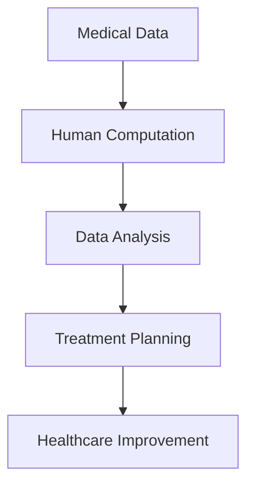

###### 1.2 人类计算在医疗保健中的优势

**核心算法原理讲解：**  
人类计算在医疗保健中的优势主要包括：

1. **高效性：** 利用计算机算法可以快速处理大量医疗数据，提供实时诊断和治疗建议。
2. **精确性：** 通过机器学习和深度学习算法，可以分析复杂的医学影像数据，提高诊断的准确性。
3. **一致性：** 人类计算可以消除人为错误，提高医疗过程的标准化和一致性。
4. **可扩展性：** 计算机系统可以轻松扩展，处理越来越多的医疗数据。
5. **个性化：** 通过分析患者的基因、病史和生活方式，可以提供个性化的治疗方案。

**伪代码示例：**  
```python  
def medical_diagnosis(patient_data):  
    # 数据预处理  
    preprocessed_data = preprocess(patient_data)  
      
    # 数据分析  
    analysis_results = analyze(preprocessed_data)  
      
    # 决策支持  
    treatment_plan = generate_treatment_plan(analysis_results)  
      
    return treatment_plan  
```

###### 1.3 当前医疗保健系统的挑战与机遇

**数学模型和数学公式：**  
```latex  
\text{Healthcare System Quality} = f(\text{Human Computation}, \text{Technology Adoption}, \text{Data Utilization})  
```

**举例说明：**  
当前医疗保健系统面临的挑战包括：

1. **数据隐私：** 医疗数据的安全性和隐私保护是一个重要的挑战。
2. **数据质量：** 数据的不准确性和不一致性会影响诊断和治疗的准确性。
3. **跨学科协作：** 需要医学专家、数据科学家和技术专家的合作，以实现有效的数据分析和应用。

同时，人类计算提供了以下机遇：

1. **个性化医疗：** 通过分析患者的基因和生物信息，可以提供个性化的治疗方案。
2. **远程医疗：** 利用互联网和移动设备，可以实现远程诊断和护理。
3. **疾病预测和预防：** 通过数据分析和机器学习，可以预测疾病爆发，进行预防性干预。

#### 第二部分：医疗数据的价值与处理

##### 第2章：医疗数据的价值与处理

###### 2.1 医疗数据概述

**核心概念与联系：**  
医疗数据包括患者的基本信息、病史、诊断记录、治疗记录、医学影像等。这些数据对于诊断、治疗和康复至关重要。

**Mermaid流程图：**  
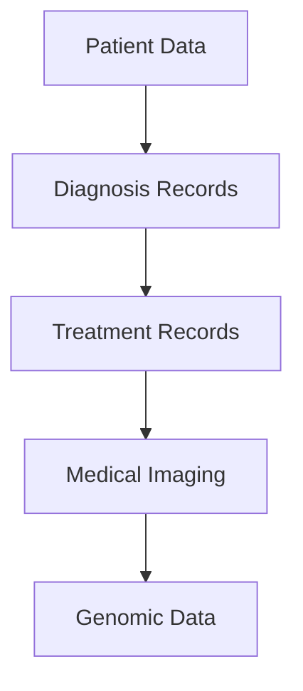

###### 2.2 医疗数据的收集与存储

**数学模型和数学公式：**  
```latex  
\text{Data Collection Efficiency} = \frac{\text{Collected Data}}{\text{Total Data}}  
```

**举例说明：**  
医疗数据的收集可以通过以下方式：

1. **电子健康记录（EHR）：** 通过电子化记录患者的信息，提高数据收集的效率和准确性。
2. **传感器监测：** 通过可穿戴设备和家庭监测设备，收集患者的生理数据。
3. **移动应用：** 通过移动应用，鼓励患者自我监测和报告健康状况。

医疗数据的存储策略包括：

1. **分布式数据库：** 提高数据的可靠性和可扩展性。
2. **云存储：** 提供高效的数据存储和访问能力。
3. **数据湖：** 存储大量结构化和非结构化数据，以便未来的分析和挖掘。

###### 2.3 医疗数据分析与可视化

**核心算法原理讲解：**  
医疗数据分析与可视化包括以下步骤：

1. **数据预处理：** 清洗和格式化数据，去除噪声和异常值。
2. **特征提取：** 从原始数据中提取有用的特征，用于后续分析。
3. **数据分析：** 使用统计分析和机器学习算法，分析数据并提取有价值的信息。
4. **数据可视化：** 通过图表和图形，直观地展示分析结果，帮助医生和研究人员理解数据。

**伪代码示例：**  
```python  
def visualize_medical_data(data):  
    # 数据预处理  
    preprocessed_data = preprocess(data)  
        
    # 数据分析  
    analysis_results = analyze(preprocessed_data)  
        
    # 数据可视化  
    visualization = create_visualization(analysis_results)  
        
    return visualization  
```

**举例说明：**  
使用Tableau或Power BI等工具，可以对医疗数据进行分析和可视化。例如，可以创建柱状图、折线图、散点图等，展示患者的健康状况、疾病趋势和治疗效果。

#### 第三部分：人类计算在诊断中的应用

##### 第3章：人类计算在诊断中的应用

###### 3.1 医学影像诊断

**核心算法原理讲解：**  
医学影像诊断是利用计算机算法分析医学影像数据，如X光、CT、MRI等，以发现异常或疾病。

常用的算法包括：

1. **卷积神经网络（CNN）：** 用于图像识别，可以检测和分类医学影像中的病变。
2. **深度学习：** 通过多层神经网络，可以学习复杂的图像特征，提高诊断的准确性。

**伪代码示例：**  
```python  
def medical_image_diagnosis(image):  
    # 数据预处理  
    preprocessed_image = preprocess(image)  
          
    # 神经网络模型  
    model = load_model('medical_image_model')  
          
    # 预测  
    prediction = model.predict(preprocessed_image)  
          
    return prediction  
```

**举例说明：**  
使用深度学习模型，如ResNet或Inception，可以对医学影像进行自动诊断。这些模型可以通过大量的医学影像数据训练，提高诊断的准确性。

###### 3.2 遗传疾病诊断

**核心算法原理讲解：**  
遗传疾病诊断是通过分析患者的基因数据，识别可能引起疾病的突变或异常。

常用的算法包括：

1. **序列比对：** 比较患者的基因序列和参考序列，发现差异。
2. **基因表达分析：** 分析基因在不同组织或疾病状态下的表达情况。

**伪代码示例：**  
```python  
def genetic_disease_diagnosis(dna_sequence):  
    # 数据预处理  
    preprocessed_sequence = preprocess(dna_sequence)  
          
    # 基因表达分析  
    gene_expression = analyze_expression(preprocessed_sequence)  
          
    # 疾病预测  
    disease_prediction = predict_disease(gene_expression)  
          
    return disease_prediction  
```

**举例说明：**  
使用基因测序技术，如高通量测序（NGS），可以快速分析患者的基因数据。结合机器学习算法，可以预测患者可能患有的遗传疾病。

###### 3.3 肿瘤诊断

**核心算法原理讲解：**  
肿瘤诊断是通过分析患者的临床表现、病史和医学影像，确定肿瘤的类型和位置。

常用的算法包括：

1. **决策树：** 根据患者的特征，分类肿瘤的类型。
2. **支持向量机（SVM）：** 通过学习患者的特征和标签，预测肿瘤的存在和类型。
3. **神经网络：** 学习复杂的肿瘤特征，提高诊断的准确性。

**伪代码示例：**  
```python  
def tumor_diagnosis(patient_data):  
    # 数据预处理  
    preprocessed_data = preprocess(patient_data)  
          
    # 模型训练  
    model = train_model(preprocessed_data)  
          
    # 预测  
    tumor_type = model.predict(preprocessed_data)  
          
    return tumor_type  
```

**举例说明：**  
使用深度学习模型，如CNN和卷积神经网络（CNN），可以对医学影像进行自动肿瘤检测。这些模型可以通过大量的医学影像数据训练，提高诊断的准确性。

#### 第四部分：人类计算在治疗方案制定中的贡献

##### 第4章：人类计算在治疗方案制定中的贡献

###### 4.1 治疗方案评估与优化

**核心算法原理讲解：**  
治疗方案评估与优化是利用计算模型和算法，评估不同治疗方案的优劣，并优化治疗方案。

常用的算法包括：

1. **模拟退火：** 通过迭代过程，寻找最优的治疗方案。
2. **遗传算法：** 通过模拟自然进化过程，优化治疗方案。

**伪代码示例：**  
```python  
def treatment_plan_evaluation(patient_data, treatment_options):  
    # 治疗方案评估  
    evaluation_results = evaluate_treatment_options(patient_data, treatment_options)  
          
    # 治疗方案优化  
    optimized_plan = optimize_treatment_plan(evaluation_results)  
          
    return optimized_plan  
```

**举例说明：**  
通过模拟退火算法，可以评估不同治疗方案的疗效和成本，并优化治疗方案。例如，对于癌症患者，可以评估不同化疗方案的疗效和副作用，选择最优的治疗方案。

###### 4.2 治疗决策支持系统

**核心算法原理讲解：**  
治疗决策支持系统是利用计算机算法和模型，为医生提供治疗决策的辅助。

常用的算法包括：

1. **专家系统：** 通过模拟医生的知识和经验，提供治疗建议。
2. **决策树：** 通过分析患者的特征，分类治疗建议。

**伪代码示例：**  
```python  
def treatment_decision_support(patient_data, treatment_options):  
    # 数据预处理  
    preprocessed_data = preprocess(patient_data)  
          
    # 决策支持  
    recommended_treatment = recommend_treatment(preprocessed_data, treatment_options)  
          
    return recommended_treatment  
```

**举例说明：**  
通过专家系统，可以模拟医生的经验和知识，为医生提供治疗建议。例如，对于骨折患者，可以基于患者的年龄、病情和医疗史，推荐最适合的治疗方案。

###### 4.3 精准医疗与个性化治疗

**核心概念与联系：**  
精准医疗与个性化治疗是利用患者的基因、生活方式和环境因素，提供个性化的治疗方案。

**Mermaid流程图：**  
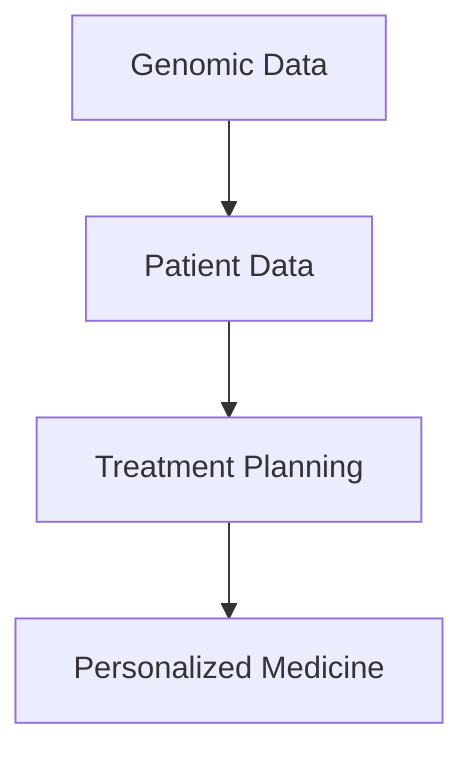

**举例说明：**  
通过基因测序技术，可以获取患者的基因信息。结合患者的病史和生活方式，可以制定个性化的治疗方案。例如，对于癌症患者，可以根据基因突变类型，选择最有效的靶向药物。

#### 第五部分：人类计算在康复护理中的应用

##### 第5章：人类计算在康复护理中的应用

###### 5.1 康复护理概述

**核心概念与联系：**  
康复护理是帮助患者恢复身体功能和提高生活质量的过程。

**Mermaid流程图：**  
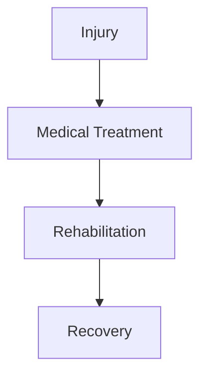

**举例说明：**  
康复护理包括物理治疗、职业治疗和言语治疗等。通过这些治疗，可以帮助患者恢复肌肉功能、提高生活自理能力。

###### 5.2 康复护理中的计算方法

**核心算法原理讲解：**  
康复护理中的计算方法包括：

1. **机器学习：** 分析患者的康复数据，预测康复进展。
2. **人工智能：** 提供个性化的康复计划和反馈。

**伪代码示例：**  
```python  
def rehabilitation_plan(patient_data):  
    # 数据预处理  
    preprocessed_data = preprocess(patient_data)  
          
    # 康复计划制定  
    rehabilitation_plan = generate_rehabilitation_plan(preprocessed_data)  
          
    return rehabilitation_plan  
```

**举例说明：**  
通过机器学习算法，可以分析患者的康复数据，如肌肉力量、活动范围等，预测康复进展。根据预测结果，可以制定个性化的康复计划，并提供实时反馈，帮助患者更好地恢复。

###### 5.3 康复护理的未来展望

**核心概念与联系：**  
康复护理的未来展望包括：

1. **智能化康复设备：** 利用传感器和人工智能技术，提供实时监测和反馈。
2. **远程康复护理：** 通过互联网和移动设备，提供远程康复服务。
3. **个性化康复方案：** 根据患者的具体情况，提供个性化的康复计划。

**举例说明：**  
未来的康复护理将更加智能化和个性化。通过可穿戴设备和远程监控，可以实时监测患者的康复进展，并提供个性化的康复计划和反馈。此外，人工智能技术将帮助康复专家更好地分析患者数据，制定更有效的康复方案。

#### 第六部分：人类计算在公共卫生管理中的作用

##### 第6章：人类计算在公共卫生管理中的作用

###### 6.1 公共卫生管理的挑战与机遇

**核心概念与联系：**  
公共卫生管理涉及疾病预防、健康监测和资源分配。人类计算提供了以下挑战和机遇：

1. **挑战：** 数据隐私、数据质量、跨学科协作。
2. **机遇：** 数据驱动决策、智能监测与预警、个性化健康服务。

**Mermaid流程图：**  
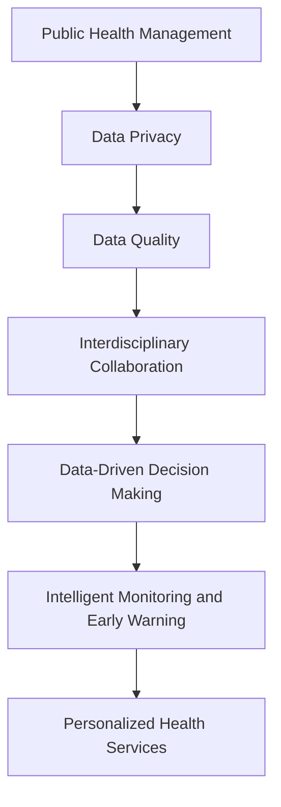

**举例说明：**  
公共卫生管理面临数据隐私的挑战，因为需要收集和处理大量个人健康数据。同时，数据的质量和准确性也是关键，以确保有效的监测和预警。跨学科协作也是挑战之一，因为公共卫生管理涉及医学、公共卫生、信息技术等多个领域。然而，人类计算提供了机遇，可以通过数据分析和人工智能技术，实现数据驱动的决策、智能监测和个性化健康服务。

###### 6.2 人类计算在疾病预防中的贡献

**核心算法原理讲解：**  
人类计算在疾病预防中的贡献包括：

1. **流行病学模型：** 分析疾病传播趋势，预测疾病爆发。
2. **预测模型：** 基于历史数据和趋势，预测疾病爆发和流行。

**伪代码示例：**  
```python  
def disease_prevention(predictive_model, population_data):  
    # 数据预处理  
    preprocessed_data = preprocess(population_data)  
          
    # 预测疾病爆发  
    disease_outbreak_predictions = predictive_model.predict(preprocessed_data)  
          
    # 预防措施制定  
    prevention_measures = generate_prevention_measures(disease_outbreak_predictions)  
          
    return prevention_measures  
```

**举例说明：**  
通过流行病学模型和预测模型，可以分析疾病的传播趋势和预测疾病爆发。根据预测结果，可以制定预防措施，如疫苗接种、公共卫生宣传和资源分配，以减少疾病爆发和传播。

###### 6.3 公共卫生监测与应对策略

**核心算法原理讲解：**  
公共卫生监测与应对策略包括：

1. **数据挖掘：** 从大量数据中提取有价值的信息，监测疾病趋势。
2. **实时监测：** 通过传感器和互联网技术，实时监测疾病爆发和流行。

**伪代码示例：**  
```python  
def public_health_monitoring(health_data):  
    # 数据预处理  
    preprocessed_data = preprocess(health_data)  
          
    # 疾病监测  
    disease_status = monitor_disease(preprocessed_data)  
          
    # 应对策略  
    response_strategies = generate_response_strategies(disease_status)  
          
    return response_strategies  
```

**举例说明：**  
通过数据挖掘技术，可以从医疗记录、社交媒体和传感器数据中提取疾病相关信息，监测疾病的趋势和爆发。根据监测结果，可以制定应对策略，如增加医疗资源、加强公共卫生宣传和采取预防措施。

#### 第七部分：人类计算在医疗保健中的道德与社会影响

##### 第7章：人类计算在医疗保健中的道德与社会影响

###### 7.1 医疗数据隐私保护

**核心概念与联系：**  
医疗数据隐私保护涉及保护患者数据不被未授权访问和使用。

**Mermaid流程图：**  
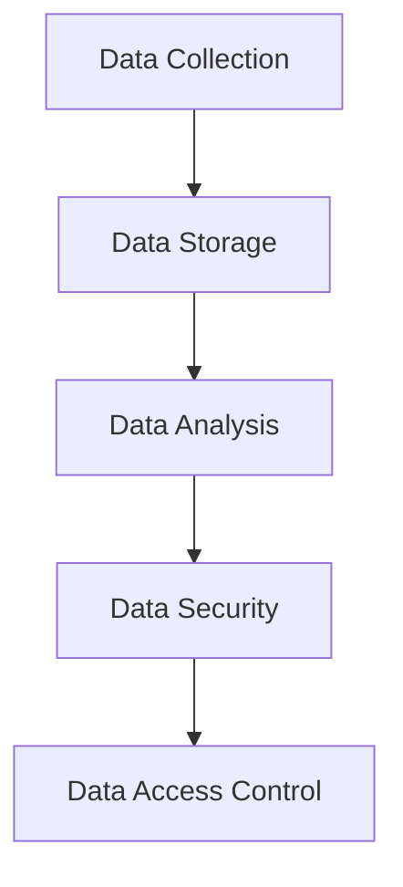

**举例说明：**  
为了保护医疗数据隐私，可以采取以下措施：

1. **加密技术：** 使用加密算法保护数据传输和存储。
2. **访问控制：** 限制只有授权人员可以访问敏感数据。
3. **数据匿名化：** 在分析数据时，去除个人身份信息，保护患者隐私。

###### 7.2 人类计算在医疗保健中的伦理问题

**核心概念与联系：**  
人类计算在医疗保健中的伦理问题涉及医疗决策的透明度、机器取代医生和人类与机器的协作。

**Mermaid流程图：**  
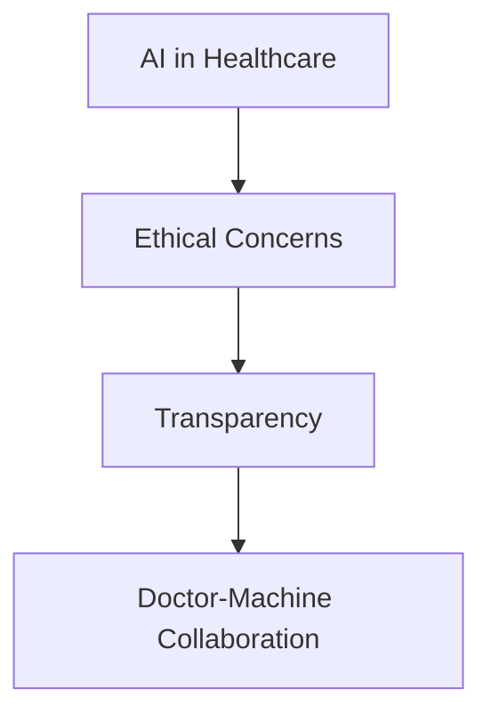

**举例说明：**  
伦理问题包括：

1. **医疗决策透明度：** 医疗决策应该基于透明和可解释的算法，使患者和医生理解决策过程。
2. **机器取代医生：** 人工智能是否会取代医生，如何平衡人类和机器的作用。
3. **人类与机器的协作：** 如何有效整合人工智能和医生的专业知识，实现最佳医疗效果。

###### 7.3 社会公平与医疗资源分配

**核心概念与联系：**  
社会公平与医疗资源分配涉及确保所有人都能获得公平的医疗资源和服务。

**Mermaid流程图：**  
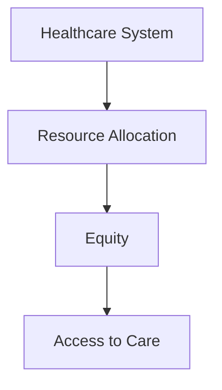

**举例说明：**  
社会公平与医疗资源分配的问题包括：

1. **资源分配不均：** 在资源有限的医疗体系中，如何公平地分配医疗资源。
2. **医疗可及性：** 如何确保所有人群都能获得必要的医疗服务。
3. **技术创新的普及：** 如何让新兴医疗技术惠及所有人，减少技术差距。

#### 第八部分：人类计算在医疗保健领域的实际应用案例

##### 第8章：人类计算在医疗保健领域的实际应用案例

###### 8.1 案例一：基于深度学习的肿瘤检测系统

**项目实战：**  
基于深度学习的肿瘤检测系统是一个实际应用案例，它利用卷积神经网络（CNN）来分析医学影像，检测肿瘤。

**实现细节：**  
1. **数据收集：** 收集大量肿瘤和非肿瘤的医学影像数据。
2. **数据预处理：** 对影像数据进行归一化和分割，提取有用的特征。
3. **模型训练：** 使用预训练的CNN模型，在肿瘤检测数据集上进行训练。
4. **模型评估：** 通过交叉验证和测试集评估模型的准确性。

**代码解读与分析：**  
以下是肿瘤检测系统的核心代码，包括数据预处理、模型训练和评估。

```python  
import tensorflow as tf  
from tensorflow.keras.models import Sequential  
from tensorflow.keras.layers import Conv2D, MaxPooling2D, Flatten, Dense

# 数据预处理  
def preprocess_image(image):  
    # 归一化  
    image = image / 255.0  
    # 分割  
    image = tf.image.resize(image, [224, 224])  
    return image

# 模型训练  
def train_model(data):  
    model = Sequential()  
    model.add(Conv2D(32, (3, 3), activation='relu', input_shape=(224, 224, 3)))  
    model.add(MaxPooling2D(pool_size=(2, 2)))  
    model.add(Conv2D(64, (3, 3), activation='relu'))  
    model.add(MaxPooling2D(pool_size=(2, 2)))  
    model.add(Flatten())  
    model.add(Dense(128, activation='relu'))  
    model.add(Dense(1, activation='sigmoid'))  
    model.compile(optimizer='adam', loss='binary_crossentropy', metrics=['accuracy'])  
    model.fit(data['images'], data['labels'], epochs=10, batch_size=32, validation_split=0.2)  
    return model

# 模型评估  
def evaluate_model(model, test_data):  
    loss, accuracy = model.evaluate(test_data['images'], test_data['labels'])  
    print(f"Test Loss: {loss}, Test Accuracy: {accuracy}")  
```

###### 8.2 案例二：个性化治疗计划制定

**项目实战：**  
个性化治疗计划制定是一个实际应用案例，它利用患者的基因数据、病史和生活方式，制定个性化的治疗计划。

**实现细节：**  
1. **数据收集：** 收集患者的基因数据、病史和生活方式数据。
2. **数据预处理：** 对数据进行清洗和标准化处理。
3. **特征提取：** 从数据中提取重要的特征。
4. **模型训练：** 使用机器学习算法，训练个性化治疗计划模型。
5. **模型评估：** 通过交叉验证和测试集评估模型的准确性。

**代码解读与分析：**  
以下是个性化治疗计划制定系统的核心代码，包括数据预处理、特征提取和模型训练。

```python  
import pandas as pd  
from sklearn.model_selection import train_test_split  
from sklearn.ensemble import RandomForestClassifier

# 数据预处理  
def preprocess_data(data):  
    # 清洗数据  
    data = data.dropna()  
    # 标准化数据  
    data = (data - data.mean()) / data.std()  
    return data

# 特征提取  
def extract_features(data):  
    # 从数据中提取特征  
    features = data[['age', 'gender', 'BMI', 'diabetes', 'high_blood_pressure']]  
    return features

# 模型训练  
def train_model(data):  
    features = extract_features(data)  
    labels = data['disease']  
    train_features, test_features, train_labels, test_labels = train_test_split(features, labels, test_size=0.2, random_state=42)  
    model = RandomForestClassifier(n_estimators=100, random_state=42)  
    model.fit(train_features, train_labels)  
    return model

# 模型评估  
def evaluate_model(model, test_features, test_labels):  
    accuracy = model.score(test_features, test_labels)  
    print(f"Test Accuracy: {accuracy}")  
```

###### 8.3 案例三：远程康复护理系统

**项目实战：**  
远程康复护理系统是一个实际应用案例，它利用传感器和互联网技术，为患者提供远程康复护理服务。

**实现细节：**  
1. **设备集成：** 集成各种传感器，如血压计、心率计和活动监测器，收集患者的数据。
2. **数据传输：** 通过互联网技术，将传感器数据传输到服务器。
3. **数据分析：** 使用机器学习算法，分析患者的数据，预测康复进展。
4. **反馈与调整：** 根据数据分析结果，提供个性化的康复计划和反馈。

**代码解读与分析：**  
以下是远程康复护理系统的核心代码，包括设备集成、数据传输和数据分析。

```python  
import requests  
from sklearn.ensemble import RandomForestRegressor

# 设备集成  
def integrate_device(data):  
    # 发送数据到服务器  
    response = requests.post('https://rehabilitation-system.com/integrate', data=data)  
    return response.json()

# 数据传输  
def transmit_data(device_id, data):  
    # 发送数据到服务器  
    response = requests.post('https://rehabilitation-system.com/transmit', params={'device_id': device_id}, json=data)  
    return response.json()

# 数据分析  
def analyze_data(data):  
    # 提取特征  
    features = data[['heart_rate', 'blood_pressure', 'activity_level']]  
    # 训练模型  
    model = RandomForestRegressor(n_estimators=100, random_state=42)  
    model.fit(features, data['recovery_progress'])  
    return model

# 反馈与调整  
def provide_feedback(model, patient_data):  
    # 预测康复进展  
    recovery_progress = model.predict(patient_data[['heart_rate', 'blood_pressure', 'activity_level']])  
    # 提供个性化康复计划  
    rehabilitation_plan = generate_rehabilitation_plan(recovery_progress)  
    return rehabilitation_plan  
```

#### 第九部分：人类计算在医疗保健领域的未来发展趋势

##### 第9章：人类计算在医疗保健领域的未来发展趋势

###### 9.1 人工智能与医疗保健的融合

**未来展望：**  
人工智能与医疗保健的融合将继续深化，人工智能技术将在医疗保健的各个方面发挥更大的作用。

1. **智能诊断：** 人工智能将能够更准确地诊断疾病，提高诊断的准确性和效率。
2. **个性化治疗：** 人工智能将根据患者的个体差异，提供更加个性化的治疗方案。
3. **智能监控：** 人工智能将能够实时监控患者的健康状况，提供及时的预警和干预。

**举例说明：**  
未来，人工智能将更加深入地应用于医学影像分析、遗传疾病诊断和个性化治疗等领域。例如，深度学习算法将能够自动识别医学影像中的异常病灶，提高诊断的准确性。同时，基因测序和人工智能的结合，将能够为患者提供更加精准的个性化治疗方案。

###### 9.2 人类计算在医疗保健中的新挑战

**挑战分析：**  
随着人工智能在医疗保健领域的广泛应用，也将面临一系列新的挑战。

1. **数据隐私和安全：** 随着医疗数据的收集和共享，如何保护患者数据的安全和隐私成为一个重要挑战。
2. **算法公平性和可解释性：** 人工智能算法的公平性和可解释性是另一个重要问题，确保算法的决策是公正和透明的。
3. **技术依赖性：** 过度依赖人工智能技术可能会削弱医生的决策能力，影响医疗质量。

**解决方案展望：**  
为了应对这些挑战，可以采取以下措施：

1. **加强数据隐私保护：** 通过加密技术和访问控制，保护患者数据的隐私和安全。
2. **提高算法公平性和可解释性：** 通过改进算法和增加透明度，提高人工智能的公平性和可解释性。
3. **平衡技术与医疗：** 培养医生的数字素养，提高他们对人工智能技术的理解和应用能力。

###### 9.3 人类计算在医疗保健领域的未来展望

**未来趋势：**  
人类计算在医疗保健领域的未来将呈现以下趋势：

1. **智能化医疗：** 通过人工智能和大数据分析，实现智能化的诊断、治疗和康复。
2. **个性化医疗：** 通过基因测序和个体差异分析，提供个性化的治疗方案。
3. **远程医疗：** 通过互联网和移动设备，实现远程诊断和护理，提高医疗服务的可及性。

**举例说明：**  
未来，智能化医疗将使医疗诊断更加精准，个性化医疗将使治疗更加有效，远程医疗将使医疗服务更加便捷。例如，人工智能将能够通过分析患者的基因数据，预测疾病风险，并提供个性化的预防措施。同时，远程医疗将使患者可以在家中接受医生的远程诊断和护理，提高医疗服务的可及性和效率。

## 附录A：相关资源与工具

### A.1 人工智能与医疗保健领域的主要论文与书籍

**主要论文：**  
1. **"Deep Learning in Medicine" by BMJ (2016)**
2. **"Artificial Intelligence in Radiology: A Review" by Radiographics (2017)**
3. **"Machine Learning in Healthcare" by IEEE Journal of Biomedical and Health Informatics (2018)**

**主要书籍：**  
1. **"Artificial Intelligence in Medicine" by John L. Oldshue and Marcelo F.弘俊 (2018)**
2. **"Deep Learning for Healthcare" by Eric A. Y. Wu and Wei-yuh Ann Chen (2018)**
3. **"Healthcare Analytics: Methods, Models, and Applications" by Marzieh Etemadi and Marcus W. M. van der Loos (2018)**

### A.2 常用的医疗数据处理工具和算法

**常用工具：**  
1. **Python：** 适用于数据预处理、分析和可视化的编程语言。
2. **R语言：** 适用于统计分析和生物信息学。
3. **TensorFlow：** 适用于深度学习和神经网络。

**常用算法：**  
1. **机器学习算法：** 包括决策树、随机森林、支持向量机等。
2. **深度学习算法：** 包括卷积神经网络（CNN）、循环神经网络（RNN）、生成对抗网络（GAN）等。
3. **统计分析方法：** 包括回归分析、聚类分析、生存分析等。

### A.3 人工智能在医疗保健领域的法规和政策

**法规：**  
1. **GDPR（欧盟通用数据保护条例）：** 规定了个人数据的收集、处理和保护标准。
2. **HIPAA（美国健康保险便携与责任法案）：** 规定了医疗数据的隐私和安全标准。
3. **FDA（美国食品药品监督管理局）：** 对医疗设备、药物和诊断设备的监管。

**政策：**  
1. **美国国家医疗保健信息化战略：** 推动医疗信息化，提高医疗质量和服务效率。
2. **欧盟数字健康战略：** 促进数字健康技术的研发和应用，提高患者参与和健康数据共享。
3. **中国健康医疗大数据行动计划：** 推动健康医疗大数据的应用和创新，促进健康医疗产业发展。

## 附录B：计算模型与算法

### B.1 医学影像诊断算法概述

**核心概念与联系：**  
医学影像诊断算法是利用计算机算法对医学影像进行分析，以检测和诊断疾病。

**Mermaid流程图：**  
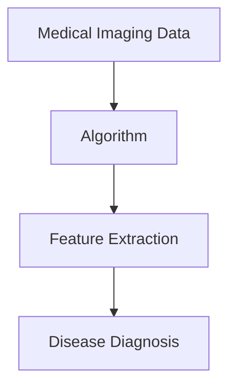

**举例说明：**  
常见的医学影像诊断算法包括：

1. **卷积神经网络（CNN）：** 用于分析医学影像，如X光、CT、MRI等。
2. **深度学习：** 通过多层神经网络，学习医学影像中的特征，提高诊断的准确性。
3. **支持向量机（SVM）：** 用于分类医学影像中的病变。

### B.2 个性化治疗计划制定算法

**核心概念与联系：**  
个性化治疗计划制定算法是利用患者的基因、病史和生活方式数据，制定个性化的治疗方案。

**Mermaid流程图：**  
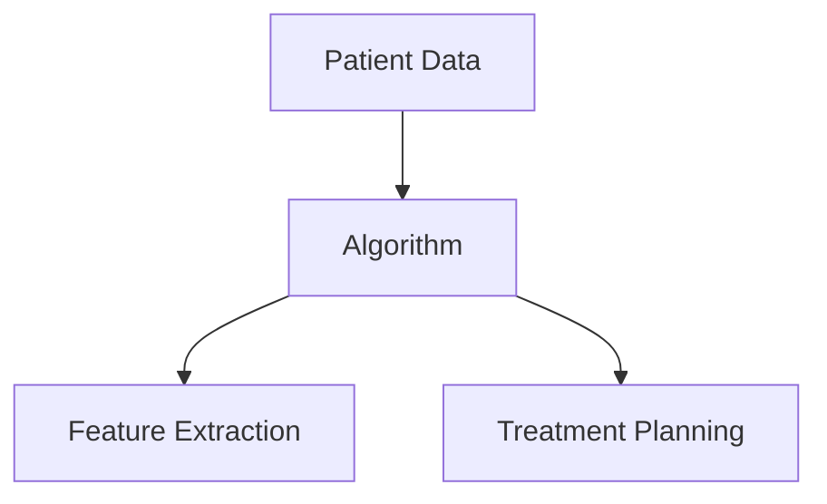

**举例说明：**  
常见的个性化治疗计划制定算法包括：

1. **随机森林：** 用于分析患者的特征，预测疾病和治疗结果。
2. **神经网络：** 通过学习患者的数据，制定个性化的治疗计划。
3. **遗传算法：** 通过模拟自然进化过程，优化治疗计划。

### B.3 远程康复护理系统算法

**核心概念与联系：**  
远程康复护理系统算法是利用传感器和互联网技术，为患者提供远程康复护理服务。

**Mermaid流程图：**  
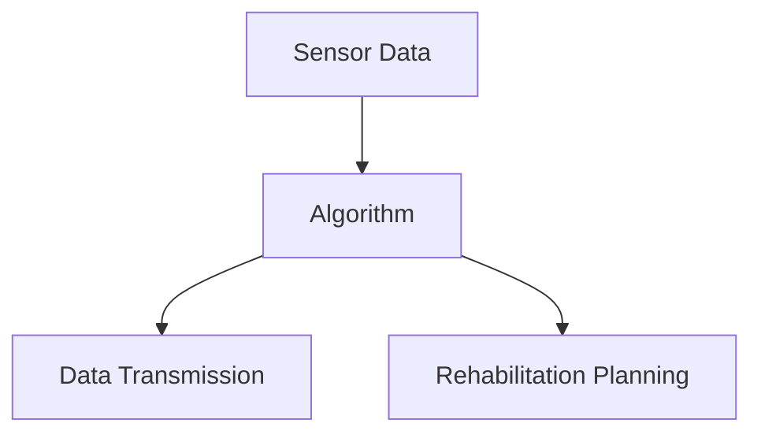

**举例说明：**  
常见的远程康复护理系统算法包括：

1. **机器学习：** 用于分析患者的数据，预测康复进展。
2. **深度学习：** 用于实时监测患者的健康状况，提供个性化的康复计划。
3. **神经网络：** 用于优化康复计划和反馈机制。

