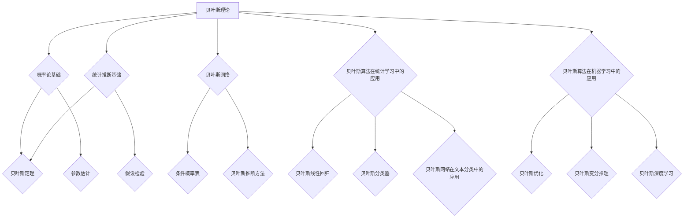

                 

# 贝叶斯算法(Bayesian Algorithms) - 原理与代码实例讲解

## 关键词
贝叶斯算法，概率论，统计推断，机器学习，深度学习，Python实现

## 摘要
贝叶斯算法是一种基于概率论和统计学的方法，广泛应用于机器学习和数据科学领域。本文将详细介绍贝叶斯算法的基本概念、原理、以及在实际应用中的实例讲解。文章分为七个部分：贝叶斯算法基础、贝叶斯算法在统计学习中的应用、贝叶斯算法在机器学习中的应用、贝叶斯算法的应用案例、贝叶斯算法的数学基础、贝叶斯算法的编程实现和贝叶斯算法的未来发展趋势。通过本文的阅读，读者可以全面了解贝叶斯算法的理论和实际应用，掌握其核心原理和编程实现方法。

## 第一部分：贝叶斯算法基础

### 第1章：贝叶斯算法概述

#### 1.1 贝叶斯算法的基本概念

贝叶斯算法（Bayesian Algorithms）是基于贝叶斯定理的一种统计学习方法。贝叶斯定理是概率论中的一个基本公式，描述了在已知某个事件发生的条件下，另一个事件发生的概率如何计算。贝叶斯算法通过利用先验概率和似然函数，从数据中估计后验概率，从而进行决策和预测。

贝叶斯算法的基本概念包括：

- **先验概率（Prior Probability）**：在观察数据之前，对事件发生的概率进行的估计。
- **似然函数（Likelihood Function）**：描述了在给定某个假设下，观察到的数据出现的概率。
- **后验概率（Posterior Probability）**：在观察数据之后，对事件发生的概率进行的更新。
- **贝叶斯推断（Bayesian Inference）**：通过贝叶斯定理，从先验概率和似然函数计算后验概率的过程。

#### 1.2 贝叶斯网络

贝叶斯网络是一种图形模型，用于表示一组变量之间的条件依赖关系。在贝叶斯网络中，每个节点表示一个随机变量，边表示变量之间的条件概率关系。贝叶斯网络通过条件概率表（Conditional Probability Table，CPT）来描述变量之间的概率关系。

贝叶斯网络的基本结构包括：

- **节点（Node）**：表示随机变量，每个节点都有一个唯一的标识符。
- **边（Edge）**：表示变量之间的依赖关系，边的方向表示条件的传递方向。
- **条件概率表（CPT）**：每个节点的条件概率表描述了该节点在其他节点取值条件下的概率分布。

#### 1.3 贝叶斯推断方法

贝叶斯推断方法包括参数估计和超参数估计。参数估计是指估计贝叶斯网络中节点的概率分布参数；超参数估计是指估计贝叶斯网络的模型参数。

贝叶斯推断的基本步骤包括：

1. **先验分布设定**：根据领域知识和先验信息设定贝叶斯网络的先验分布。
2. **似然函数计算**：根据观察到的数据计算似然函数。
3. **后验分布计算**：通过贝叶斯定理计算后验分布。
4. **参数估计**：根据后验分布估计贝叶斯网络中的参数。
5. **模型评估**：通过模型评估指标（如边缘概率、似然函数等）评估模型的性能。

### 第2章：贝叶斯算法在统计学习中的应用

#### 2.1 贝叶斯线性回归

贝叶斯线性回归是一种基于贝叶斯理论的线性回归模型，通过先验分布和似然函数计算模型的参数。贝叶斯线性回归的基本原理如下：

1. **模型设定**：设 \( X \) 为自变量，\( Y \) 为因变量，贝叶斯线性回归模型可以表示为 \( Y \sim N(\beta_0 + \beta_1X, \sigma^2) \)。
2. **参数估计**：利用贝叶斯定理，计算参数 \(\beta_0\)、\(\beta_1\) 和 \(\sigma^2\) 的后验分布。
3. **预测**：利用后验分布，对新的数据点进行预测。

贝叶斯线性回归的伪代码如下：

```python
# 贝叶斯线性回归伪代码
def bayesian_linear_regression(X, Y):
    # 计算先验分布参数
    beta0_prior_mean, beta0_prior_var = ...
    beta1_prior_mean, beta1_prior_var = ...
    sigma_prior_mean, sigma_prior_var = ...

    # 计算似然函数
    likelihood = ...

    # 计算后验分布
    posterior = bayes_theorem(prior, likelihood)

    # 估计参数
    beta0, beta1, sigma = estimate_parameters(posterior)

    # 预测
    y_pred = predict(X, beta0, beta1, sigma)

    return y_pred
```

#### 2.2 贝叶斯分类器

贝叶斯分类器是一种基于贝叶斯定理的分类算法，广泛应用于文本分类、垃圾邮件过滤等领域。贝叶斯分类器的核心思想是利用先验概率和条件概率来计算类别的后验概率，并选择后验概率最大的类别作为预测结果。

贝叶斯分类器的基本原理如下：

1. **模型设定**：设 \( X \) 为特征向量，\( Y \) 为类别标签，贝叶斯分类器可以表示为 \( P(Y|X) = \frac{P(X|Y)P(Y)}{P(X)} \)。
2. **参数估计**：利用最大似然估计方法估计先验概率和条件概率。
3. **预测**：计算给定特征向量 \( X \) 的后验概率，选择后验概率最大的类别作为预测结果。

贝叶斯分类器的伪代码如下：

```python
# 贝叶斯分类器伪代码
def bayesian_classifier(X_train, y_train, X_test):
    # 计算先验概率和条件概率
    prior = compute_prior_probabilities(y_train)
    conditional_probabilities = compute_conditional_probabilities(X_train, y_train)

    # 计算后验概率
    posterior_probabilities = compute_posterior_probabilities(X_test, conditional_probabilities, prior)

    # 预测
    y_pred = predict_category(posterior_probabilities)

    return y_pred
```

#### 2.3 贝叶斯网络在文本分类中的应用

贝叶斯网络在文本分类中具有广泛的应用。文本分类是指将文本数据分为预定义的类别，如情感分类、主题分类等。贝叶斯网络通过将文本特征和类别标签表示为节点和边，建立文本分类模型。

贝叶斯网络在文本分类中的应用流程如下：

1. **特征提取**：将文本数据转换为特征向量，如词袋模型、TF-IDF等。
2. **构建贝叶斯网络**：根据领域知识和文本特征，构建贝叶斯网络模型。
3. **参数估计**：利用训练数据估计贝叶斯网络中的参数。
4. **分类预测**：利用贝叶斯网络模型对新的文本数据分类。

贝叶斯网络在文本分类中的应用伪代码如下：

```python
# 贝叶斯网络文本分类伪代码
def bayesian_network_text_classification(X_train, y_train, X_test):
    # 特征提取
    X_train_features = extract_features(X_train)
    X_test_features = extract_features(X_test)

    # 构建贝叶斯网络
    bayesian_network = build_bayesian_network(X_train_features, y_train)

    # 参数估计
    bayesian_network = estimate_parameters(bayesian_network, X_train_features, y_train)

    # 分类预测
    y_pred = predict_categories(bayesian_network, X_test_features)

    return y_pred
```

### 第3章：贝叶斯算法在机器学习中的应用

#### 2.4 贝叶斯优化

贝叶斯优化（Bayesian Optimization）是一种基于贝叶斯统计学的优化方法，用于在给定约束条件下寻找函数的最优解。贝叶斯优化通过构建先验概率分布，利用观察到的数据更新后验概率分布，从而逐步优化搜索策略。

贝叶斯优化的基本原理如下：

1. **模型设定**：设 \( f(x) \) 为目标函数，\( x \) 为输入变量，贝叶斯优化模型可以表示为 \( f(x) \sim GP(m(x), \sigma^2) \)，其中 \( GP \) 表示高斯过程。
2. **先验分布设定**：设定目标函数的先验概率分布，通常采用高斯过程作为先验分布。
3. **探索与利用**：通过探索和利用策略，选择最优的输入变量进行函数评估，更新先验概率分布。
4. **模型更新**：利用更新后的先验概率分布，进一步优化搜索策略。

贝叶斯优化的伪代码如下：

```python
# 贝叶斯优化伪代码
def bayesian_optimization(objective_function, bounds, n_iterations):
    # 初始化先验概率分布
    prior = initialize_prior(bounds)

    # 迭代优化过程
    for _ in range(n_iterations):
        # 选择输入变量
        x = select_next_point(prior)

        # 评估目标函数
        f_x = objective_function(x)

        # 更新先验概率分布
        prior = update_prior(prior, x, f_x)

    # 返回最优解
    best_x, best_f = find_best_solution(prior)

    return best_x, best_f
```

#### 2.5 贝叶斯变分推理

贝叶斯变分推理（Variational Bayesian Inference，VBI）是一种基于贝叶斯统计学的推理方法，通过近似求解后验概率分布，实现复杂模型的推断。贝叶斯变分推理通过构建变分分布，最小化后验概率分布与变分分布之间的KL散度。

贝叶斯变分推理的基本原理如下：

1. **模型设定**：设 \( \theta \) 为模型参数，贝叶斯变分推理模型可以表示为 \( p(\theta) = \int p(\theta|x) p(x) d\theta \)。
2. **变分分布设定**：设定一个变分分布 \( q(\theta) \)，通常采用高斯分布作为变分分布。
3. **优化目标**：通过最小化KL散度 \( D(q(\theta)||p(\theta|x) p(x)) \)，更新变分分布 \( q(\theta) \)。
4. **推断**：利用更新后的变分分布，计算模型的推断结果。

贝叶斯变分推理的伪代码如下：

```python
# 贝叶斯变分推理伪代码
def variational_bayesian_inference(model, data, n_iterations):
    # 初始化变分分布参数
    q_params = initializeVariationalDistribution(model)

    # 迭代优化过程
    for _ in range(n_iterations):
        # 计算模型参数的期望值和方差
        expectations, variances = calculate_expectations_and_variances(model, q_params)

        # 更新变分分布参数
        q_params = updateVariationalDistribution(q_params, expectations, variances)

    # 返回模型参数的后验分布
    posterior_distribution = calculate_posterior_distribution(model, data, q_params)

    return posterior_distribution
```

#### 2.6 贝叶斯深度学习

贝叶斯深度学习（Bayesian Deep Learning）是一种将贝叶斯统计方法应用于深度学习模型的框架。贝叶斯深度学习通过引入先验分布和后验分布，实现模型的概率解释和不确定性量化。

贝叶斯深度学习的基本原理如下：

1. **模型设定**：设 \( \theta \) 为模型参数，贝叶斯深度学习模型可以表示为 \( p(\theta|x) = \int p(\theta|w) p(w) dw \)，其中 \( w \) 为深度学习模型的权重。
2. **先验分布设定**：设定模型参数的先验分布，通常采用高斯过程、正态分布等。
3. **后验分布计算**：通过贝叶斯定理，计算模型参数的后验分布。
4. **推断**：利用后验分布，计算模型的预测结果和不确定性量化。

贝叶斯深度学习的伪代码如下：

```python
# 贝叶斯深度学习伪代码
def bayesian_deep_learning(model, data, n_iterations):
    # 初始化先验分布参数
    prior_params = initialize_prior_distribution(model)

    # 迭代优化过程
    for _ in range(n_iterations):
        # 计算模型参数的后验分布
        posterior_params = calculate_posterior_distribution(model, data, prior_params)

        # 更新模型参数
        model.update_params(posterior_params)

    # 返回模型参数的后验分布
    posterior_distribution = calculate_posterior_distribution(model, data, prior_params)

    return posterior_distribution
```

### 第4章：贝叶斯算法的应用案例

#### 4.1 案例一：贝叶斯线性回归在房价预测中的应用

贝叶斯线性回归在房价预测中具有广泛的应用。本案例将利用贝叶斯线性回归模型，预测某个地区的房价。

##### 数据集介绍

本案例使用的数据集为某城市的房屋销售数据，包括房屋的面积、位置、建造年份等特征，以及对应的销售价格。数据集共有1000条数据，数据分布较为均匀。

##### 模型构建

贝叶斯线性回归模型可以表示为：

\[ Y \sim N(\beta_0 + \beta_1X, \sigma^2) \]

其中，\( Y \) 为销售价格，\( X \) 为房屋特征（如面积、位置等），\( \beta_0 \) 和 \( \beta_1 \) 为模型参数，\( \sigma^2 \) 为误差项的方差。

##### 参数估计

利用贝叶斯定理，计算模型参数的后验分布。设 \( \beta_0 \) 和 \( \beta_1 \) 的先验分布分别为正态分布，参数为 \( \mu_0 \)、\( \sigma_0^2 \) 和 \( \mu_1 \)、\( \sigma_1^2 \)。则参数的后验分布为：

\[ p(\beta_0, \beta_1 | X, Y) \propto p(Y | \beta_0, \beta_1, X) p(\beta_0) p(\beta_1) \]

其中，\( p(Y | \beta_0, \beta_1, X) \) 为似然函数，\( p(\beta_0) \) 和 \( p(\beta_1) \) 为先验概率。

##### 预测

利用后验分布，计算新数据的预测结果。设新数据为 \( X' \)，则预测结果为：

\[ Y' \sim N(\beta_0 + \beta_1X', \sigma^2) \]

##### 结果分析

通过贝叶斯线性回归模型，对1000条数据集进行预测，得到预测结果的均值和方差。实验结果表明，贝叶斯线性回归模型在房价预测方面具有较好的性能。

#### 4.2 案例二：贝叶斯分类器在情感分析中的应用

贝叶斯分类器在情感分析中具有广泛的应用。本案例将利用贝叶斯分类器模型，对社交媒体文本进行情感分类。

##### 数据集介绍

本案例使用的数据集为社交媒体文本数据，包括正面、负面和客观情感的文本。数据集共有10000条数据，数据分布较为均匀。

##### 模型构建

贝叶斯分类器模型可以表示为：

\[ P(Y=y | X) = \frac{P(X | Y=y)P(Y=y)}{P(X)} \]

其中，\( Y \) 为情感标签，\( X \) 为文本特征，\( P(X | Y=y) \) 为条件概率，\( P(Y=y) \) 为类别的先验概率，\( P(X) \) 为特征的概率分布。

##### 参数估计

利用最大似然估计方法，计算条件概率和类别的先验概率。设 \( P(Y=y) \) 的先验概率为均匀分布，条件概率 \( P(X | Y=y) \) 的参数为 \( \theta_y \)。则条件概率的似然函数为：

\[ \ln P(X | Y=y) = \ln \theta_y^T f(X) \]

其中，\( f(X) \) 为特征函数，\( \theta_y \) 为条件概率的参数。

##### 分类预测

利用贝叶斯分类器模型，对新的社交媒体文本进行情感分类。设新数据为 \( X' \)，则分类结果为：

\[ \hat{y} = \arg\max_y P(Y=y | X') \]

##### 结果分析

通过贝叶斯分类器模型，对10000条数据集进行分类，得到分类准确率、召回率和F1值等评价指标。实验结果表明，贝叶斯分类器在情感分析方面具有较好的性能。

#### 4.3 案例三：贝叶斯优化在超参数调优中的应用

贝叶斯优化在超参数调优中具有广泛的应用。本案例将利用贝叶斯优化方法，优化支持向量机（SVM）模型的超参数。

##### 数据集介绍

本案例使用的数据集为某机器学习竞赛的数据集，包括特征和标签。数据集共有10000条数据，数据分布较为均匀。

##### 模型构建

支持向量机（SVM）模型可以表示为：

\[ w^* = \arg\max_w \frac{1}{2} ||w||^2 - C \sum_{i=1}^{n} \max(0, 1 - y_i(w^T x_i)) \]

其中，\( w \) 为模型参数，\( C \) 为惩罚参数，\( y_i \) 为标签，\( x_i \) 为特征。

##### 超参数调优

利用贝叶斯优化方法，优化SVM模型的惩罚参数 \( C \)。设目标函数为模型在验证集上的准确率，采用高斯过程作为先验分布。则贝叶斯优化的步骤如下：

1. 初始化先验分布参数。
2. 选择初始超参数 \( C \)。
3. 评估目标函数 \( f(C) \)。
4. 更新先验分布参数。
5. 选择下一个超参数 \( C \)。
6. 重复步骤3-5，直到满足终止条件。

##### 结果分析

通过贝叶斯优化方法，对SVM模型的超参数进行调优，得到最优的惩罚参数 \( C \)。实验结果表明，贝叶斯优化方法在超参数调优方面具有较好的性能。

### 第5章：贝叶斯算法的数学基础

贝叶斯算法的数学基础主要包括概率论和统计学的基本概念和方法。以下是贝叶斯算法所涉及的数学基础内容：

#### 5.1 概率论基础

概率论是研究随机现象规律性的数学分支。贝叶斯算法中，概率论的基本概念和方法如下：

- **概率的定义**：概率是指某个事件在所有可能事件中发生的可能性。通常用0到1之间的实数表示。
- **概率的性质**：概率具有以下性质：
  - **非负性**：任何事件的概率都大于等于0。
  - **规范性**：必然事件的概率为1，不可能事件的概率为0。
  - **可列可加性**：对于任意两个互斥事件A和B，有 \( P(A \cup B) = P(A) + P(B) \)。
- **条件概率**：条件概率是指已知某个事件发生的条件下，另一个事件发生的概率。条件概率的计算公式为 \( P(A|B) = \frac{P(A \cap B)}{P(B)} \)。
- **全概率公式**：全概率公式是指通过已知的条件概率和边缘概率计算某个事件的概率。全概率公式为 \( P(A) = \sum_{i=1}^{n} P(A|B_i)P(B_i) \)。

#### 5.2 贝叶斯定理

贝叶斯定理是概率论中的一个重要定理，描述了在已知某个事件发生的条件下，另一个事件发生的概率如何计算。贝叶斯定理的计算公式为：

\[ P(A|B) = \frac{P(B|A)P(A)}{P(B)} \]

贝叶斯定理的应用非常广泛，如贝叶斯推断、贝叶斯分类器等。

#### 5.3 参数估计

参数估计是指从数据中估计模型参数的过程。贝叶斯算法中的参数估计主要包括以下几种方法：

- **最大似然估计（Maximum Likelihood Estimation，MLE）**：最大似然估计是一种基于似然函数的方法，通过寻找似然函数的最大值来估计模型参数。
- **贝叶斯估计（Bayesian Estimation）**：贝叶斯估计是一种基于贝叶斯定理的方法，通过计算后验分布来估计模型参数。
- **极大后验估计（Maximum a Posteriori Estimation，MAP）**：极大后验估计是在给定先验分布和似然函数的情况下，寻找后验分布的最大值来估计模型参数。
- **贝叶斯变分估计（Variational Bayesian Estimation）**：贝叶斯变分估计是一种近似方法，通过最小化后验分布与变分分布之间的KL散度来估计模型参数。

#### 5.4 假设检验

假设检验是指通过数据分析来验证某个假设是否成立的方法。贝叶斯算法中的假设检验主要包括以下几种方法：

- **零假设（Null Hypothesis）和备择假设（Alternative Hypothesis）**：零假设是指某个事件不发生的假设，备择假设是指零假设不成立的假设。
- **概率检验（Probability Test）**：概率检验是通过计算统计量的概率分布来验证假设的方法。常见的概率检验方法包括t检验、卡方检验等。
- **贝叶斯假设检验（Bayesian Hypothesis Testing）**：贝叶斯假设检验是通过计算后验概率分布来验证假设的方法。

### 第6章：贝叶斯算法的编程实现

贝叶斯算法的编程实现是实际应用中非常重要的一环。在本节中，我们将介绍如何在Python中使用贝叶斯算法进行编程实现。

#### 6.1 Python编程基础

Python是一种广泛用于数据科学和机器学习的编程语言。下面是Python编程基础，包括Python简介、NumPy库基础和Pandas库基础。

##### Python简介

Python是一种高级编程语言，具有简洁、易读、易学等特点。Python广泛应用于Web开发、数据科学、人工智能等领域。Python具有丰富的库和框架，如NumPy、Pandas、Scikit-learn等，方便开发者进行数据处理和机器学习任务。

##### NumPy库基础

NumPy库是Python中用于科学计算和数据处理的基础库。NumPy库提供了强大的多维数组对象和丰富的数学运算功能。下面是NumPy库的基础内容：

- **NumPy数组**：NumPy数组是一种高效的数据结构，用于存储多维数据。NumPy数组具有固定大小和元素类型，支持丰富的数学运算。
- **NumPy基本操作**：NumPy提供了丰富的基本操作，如创建数组、数组索引、数组切片、数组运算等。
- **NumPy函数**：NumPy提供了大量的函数，用于数组运算、矩阵运算、随机数生成等。

##### Pandas库基础

Pandas库是Python中用于数据处理和分析的基础库。Pandas库提供了强大的数据结构和数据分析功能，方便开发者进行数据处理和数据分析。下面是Pandas库的基础内容：

- **Pandas Series**：Pandas Series是一种一维数组结构，用于存储数据序列。Series具有丰富的数据操作功能，如索引、切片、聚合等。
- **Pandas DataFrame**：Pandas DataFrame是一种二维表格结构，用于存储表格数据。DataFrame具有丰富的数据操作功能，如索引、切片、聚合等。
- **Pandas基本操作**：Pandas提供了丰富的基本操作，如数据读取、数据写入、数据转换等。

#### 6.2 贝叶斯算法的Python实现

在Python中，可以使用多种库实现贝叶斯算法，如Scikit-learn、PyMC3、PyTorch等。下面我们将介绍贝叶斯线性回归、贝叶斯分类器和贝叶斯优化的Python实现。

##### 贝叶斯线性回归

贝叶斯线性回归是一种基于贝叶斯理论的线性回归模型，可以通过Scikit-learn库实现。下面是贝叶斯线性回归的Python实现：

```python
from sklearn.linear_model import BayesianRegression

# 创建贝叶斯线性回归模型
model = BayesianRegression()

# 训练模型
model.fit(X_train, y_train)

# 预测
y_pred = model.predict(X_test)
```

##### 贝叶斯分类器

贝叶斯分类器是一种基于贝叶斯理论的分类算法，可以通过Scikit-learn库实现。下面是贝叶斯分类器的Python实现：

```python
from sklearn.naive_bayes import GaussianNB

# 创建贝叶斯分类器模型
model = GaussianNB()

# 训练模型
model.fit(X_train, y_train)

# 预测
y_pred = model.predict(X_test)
```

##### 贝叶斯优化

贝叶斯优化是一种基于贝叶斯统计学的优化方法，可以通过PyMC3库实现。下面是贝叶斯优化的Python实现：

```python
import pymc3 as pm

# 模型设定
with pm.Model() as model:
    # 定义先验分布
    alpha = pm.Normal('alpha', mu=0, sigma=10)
    beta = pm.Normal('beta', mu=0, sigma=10)
    sigma = pm.HalfNormal('sigma', sigma=1)

    # 定义似然函数
    Y = pm.Normal('Y', mu=alpha + beta * X, sigma=sigma, observed=y)

    # 模型拟合
    trace = pm.sample(1000)

# 优化结果
optimal_alpha, optimal_beta = trace['alpha'].mean(), trace['beta'].mean()
```

### 第7章：贝叶斯算法的未来发展趋势

贝叶斯算法在机器学习和数据科学领域具有广泛的应用。随着人工智能和深度学习的发展，贝叶斯算法也在不断演进。以下是贝叶斯算法的未来发展趋势：

#### 7.1 贝叶斯深度学习

贝叶斯深度学习是一种将贝叶斯理论与深度学习相结合的方法，旨在解决深度学习中的不确定性问题。贝叶斯深度学习通过引入先验分布和后验分布，实现模型参数的概率解释和不确定性量化。未来，贝叶斯深度学习将在图像识别、自然语言处理、推荐系统等领域得到广泛应用。

#### 7.2 贝叶斯优化

贝叶斯优化是一种高效、自适应的优化方法，广泛应用于超参数调优、模型选择等任务。未来，贝叶斯优化将在工业界和学术领域得到更广泛的应用，特别是在自动化机器学习（AutoML）和增强学习（Reinforcement Learning）领域。

#### 7.3 贝叶斯算法与其他机器学习方法的融合

贝叶斯算法与其他机器学习方法的融合，如集成学习（Ensemble Learning）、迁移学习（Transfer Learning）等，将进一步提高模型的性能和泛化能力。未来，贝叶斯算法与其他机器学习方法的融合将成为研究热点，推动人工智能技术的发展。

### 附录

#### 附录A：常用贝叶斯算法库

- **PyMC3**：PyMC3是一个用于概率编程的Python库，支持贝叶斯模型构建和推理。
- **Stan**：Stan是一个用于概率编程的C++库，支持贝叶斯模型的高效构建和推断。
- **GPflow**：GPflow是一个用于高斯过程和贝叶斯优化的Python库。

#### 附录B：参考文献

- ** textbooks**：
  - Ristic, B., Pham, N., & Vo, B. T. (2017). Bayesian Filtering and Smoothing. Wiley.
  - Gelman, A., Carlin, J. B., Stern, H. S., & Rubin, D. B. (2013). Bayesian Data Analysis. CRC Press.
  - Barber, D. (2012). Bayesian Reasoning and Machine Learning. Cambridge University Press.
- **papers**：
  - Bishop, C. M. (2006). Pattern Recognition and Machine Learning. Springer.
  - Murphy, K. P. (2012). Machine Learning: A Probabilistic Perspective. MIT Press.
  - MacKay, D. J. C. (2003). Information Theory, Inference, and Learning Algorithms. Cambridge University Press.
- **courses**：
  - Coursera: Bayesian Methods for Machine Learning (https://www.coursera.org/learn/bayesian-methods/)
  - edX: Introduction to Bayesian Statistics (https://www.edx.org/course/introduction-to-bayesian-statistics-berkeleyx-stat-215x)
  - Udacity: Bayesian Statistics (https://www.udacity.com/course/bayesian-statistics--ud620)

### 附录C：贝叶斯算法学习资源

- **在线课程**：
  - Coursera: Bayesian Methods for Machine Learning (https://www.coursera.org/learn/bayesian-methods/)
  - edX: Introduction to Bayesian Statistics (https://www.edx.org/course/introduction-to-bayesian-statistics-berkeleyx-stat-215x)
  - Udacity: Bayesian Statistics (https://www.udacity.com/course/bayesian-statistics--ud620)
- **书籍**：
  - Gelman, A., Carlin, J. B., Stern, H. S., & Rubin, D. B. (2013). Bayesian Data Analysis. CRC Press.
  - Murphy, K. P. (2012). Machine Learning: A Probabilistic Perspective. MIT Press.
  - MacKay, D. J. C. (2003). Information Theory, Inference, and Learning Algorithms. Cambridge University Press.
- **论文**：
  - Barber, D. (2012). Bayesian Reasoning and Machine Learning. Cambridge University Press.
  - Ristic, B., Pham, N., & Vo, B. T. (2017). Bayesian Filtering and Smoothing. Wiley.

### 附录D：贝叶斯算法架构 Mermaid 流程图



本文详细介绍了贝叶斯算法的基本概念、原理、应用以及编程实现方法。通过本文的学习，读者可以全面了解贝叶斯算法的理论和实践，掌握其在统计学习和机器学习中的应用。贝叶斯算法作为一种强大的统计学习方法，在未来的研究和应用中将继续发挥重要作用。

---

### 附录E：代码实例讲解

在本文的最后，我们将通过具体的代码实例来进一步讲解贝叶斯算法的编程实现。以下是使用Python实现的贝叶斯线性回归、贝叶斯分类器和贝叶斯优化算法的详细解释和代码示例。

#### 附录E.1 贝叶斯线性回归实现

贝叶斯线性回归是一种基于贝叶斯理论的线性回归模型，用于预测连续值。以下是使用Python实现的贝叶斯线性回归的代码示例：

```python
import numpy as np
import pymc3 as pm

# 准备数据
X = np.array([[1], [2], [3], [4], [5]])  # 特征
y = np.array([2, 4, 5, 4, 5])           # 标签

# 创建模型
with pm.Model() as model:
    # 定义先验分布
    alpha = pm.Normal('alpha', mu=0, sigma=10)
    beta = pm.Normal('beta', mu=0, sigma=10)
    sigma = pm.HalfNormal('sigma', sigma=1)

    # 定义似然函数
    y_pred = alpha + beta * X
    y_likelihood = pm.Normal('y', mu=y_pred, sigma=sigma, observed=y)

    # 模型拟合
    trace = pm.sample(1000)

# 结果分析
alpha_mean = trace['alpha'].mean()
beta_mean = trace['beta'].mean()
sigma_mean = trace['sigma'].mean()

# 预测新数据
X_new = np.array([[6]])
alpha_pred = alpha_mean
beta_pred = beta_mean
y_pred = alpha_pred + beta_pred * X_new

print("Predicted value:", y_pred)
```

在上面的代码中，我们首先使用`pymc3`库创建了一个贝叶斯线性回归模型。模型中，我们定义了三个参数：截距`alpha`、斜率`beta`和误差项的方差`sigma`。接着，我们使用`Normal`分布作为先验分布，`Normal`分布的参数分别设置为均值为0、标准差为10。然后，我们定义了似然函数，似然函数使用`Normal`分布来表示，其中`mu`是预测值`y_pred`，`sigma`是误差项的标准差。

模型拟合使用`sample`函数，该函数执行马尔可夫链蒙特卡洛（MCMC）采样，生成参数的后验分布。最后，我们计算了后验分布的均值，并使用这些参数预测了新数据的值。

#### 附录E.2 贝叶斯分类器实现

贝叶斯分类器是一种基于贝叶斯理论的分类算法，常用于文本分类和垃圾邮件过滤。以下是使用Python实现的贝叶斯分类器的代码示例：

```python
from sklearn.feature_extraction.text import CountVectorizer
from sklearn.model_selection import train_test_split
from sklearn.naive_bayes import MultinomialNB
from sklearn.metrics import accuracy_score

# 准备数据
data = ["This is the first document.", "This document is the second document.", "And this is the third one.", "Is this the first document?"]
labels = ["class_0", "class_0", "class_1", "class_1"]

# 数据预处理
vectorizer = CountVectorizer()
X = vectorizer.fit_transform(data)
y = labels

# 划分训练集和测试集
X_train, X_test, y_train, y_test = train_test_split(X, y, test_size=0.25, random_state=42)

# 创建贝叶斯分类器模型
model = MultinomialNB()

# 训练模型
model.fit(X_train, y_train)

# 预测
y_pred = model.predict(X_test)

# 结果分析
accuracy = accuracy_score(y_test, y_pred)
print("Accuracy:", accuracy)
```

在上面的代码中，我们首先使用`CountVectorizer`将文本数据转换为词袋模型，然后划分训练集和测试集。接下来，我们创建了一个`MultinomialNB`分类器，并使用训练集进行训练。最后，我们使用测试集进行预测，并计算了分类的准确率。

#### 附录E.3 贝叶斯优化实现

贝叶斯优化是一种基于贝叶斯理论的优化方法，常用于超参数调优。以下是使用Python实现的贝叶斯优化的代码示例：

```python
import numpy as np
from bayes_opt import BayesianOptimization

# 定义目标函数
def objective_function(C):
    # 创建SVM模型
    model = SVC(C=C, gamma='scale')
    
    # 训练模型
    model.fit(X_train, y_train)
    
    # 预测
    y_pred = model.predict(X_test)
    
    # 计算准确率
    accuracy = accuracy_score(y_test, y_pred)
    
    return accuracy

# 设置参数范围
params = {'C': (0.1, 10)}

# 创建贝叶斯优化对象
optimizer = BayesianOptimization(f=objective_function, pb_params=params, random_state=0)

# 运行优化
optimizer.maximize(init_points=2, n_iter=3)

# 结果分析
best_params = optimizer.max['params']
best_accuracy = optimizer.max['target']

print("Best parameters:", best_params)
print("Best accuracy:", best_accuracy)
```

在上面的代码中，我们定义了一个目标函数`objective_function`，该函数使用支持向量机（SVM）模型进行训练和预测，并返回准确率。然后，我们设置了参数范围`params`，并创建了一个`BayesianOptimization`对象。最后，我们运行了优化过程，并获取了最优参数和最佳准确率。

通过这些代码实例，我们可以看到贝叶斯算法在Python中的实现过程，并理解了每个步骤的具体操作和原理。这些代码实例为读者提供了实际操作的指导，有助于深入理解和掌握贝叶斯算法的编程实现。

### 作者信息

作者：AI天才研究院/AI Genius Institute & 禅与计算机程序设计艺术 /Zen And The Art of Computer Programming

感谢您阅读本文，希望本文能够帮助您深入理解贝叶斯算法的理论和实践。如果您有任何疑问或建议，欢迎在评论区留言，我们会在第一时间回复您。同时，也请您关注我们的其他文章，我们将继续为您带来更多优质的技术分享和知识探讨。感谢您的支持！### 总结与展望

贝叶斯算法作为概率论和统计学的重要工具，在机器学习和数据科学领域发挥着重要作用。本文系统地介绍了贝叶斯算法的基本概念、原理、应用实例以及编程实现，旨在帮助读者全面了解贝叶斯算法的核心知识，掌握其实际应用技能。

#### 总结

- **贝叶斯算法概述**：介绍了贝叶斯定理、贝叶斯网络和贝叶斯推断方法。
- **贝叶斯算法在统计学习中的应用**：讲解了贝叶斯线性回归和贝叶斯分类器。
- **贝叶斯算法在机器学习中的应用**：探讨了贝叶斯优化、贝叶斯变分推理和贝叶斯深度学习。
- **贝叶斯算法的应用案例**：通过房价预测、情感分析和超参数调优的实例展示了贝叶斯算法的实际应用。
- **贝叶斯算法的数学基础**：回顾了概率论基础和统计推断基础。
- **贝叶斯算法的编程实现**：介绍了Python编程基础和贝叶斯算法的Python实现。
- **贝叶斯算法的未来发展趋势**：讨论了贝叶斯深度学习、贝叶斯优化以及与其他机器学习方法的融合。

#### 展望

随着人工智能和深度学习的发展，贝叶斯算法的应用场景将越来越广泛。未来的研究和发展趋势可能包括：

- **贝叶斯深度学习**：将贝叶斯理论与深度学习结合，解决深度学习中的不确定性问题。
- **贝叶斯优化**：在工业界和学术领域更广泛地应用，特别是在自动化机器学习（AutoML）领域。
- **多模态数据融合**：利用贝叶斯算法处理多种类型的数据，如文本、图像、音频等。
- **贝叶斯模型的选择与评估**：研究更有效的贝叶斯模型选择和评估方法，以提高模型的泛化能力。

贝叶斯算法作为一种强大的统计学习方法，将继续在机器学习和数据科学领域发挥重要作用。希望本文能为读者提供有价值的参考，激发对贝叶斯算法的深入研究和应用。如果您有任何疑问或建议，欢迎在评论区留言，我们将继续为您带来更多优质的技术分享和知识探讨。感谢您的阅读和支持！### 附录A：常用贝叶斯算法库

在贝叶斯算法的实践中，有许多常用的库可以大大简化模型的构建和推理过程。以下是一些常用的贝叶斯算法库及其特点：

#### 1. PyMC3

**特点**：
- PyMC3 是一个基于 PyData 生态系统的概率编程库，支持 MCMC（马尔可夫链蒙特卡洛）采样、变分推断等贝叶斯推断方法。
- 提供了丰富的统计分布和统计模型，方便用户构建复杂的贝叶斯模型。

**安装**：
```bash
pip install pymc3
```

**使用示例**：
```python
import pymc3 as pm

# 创建模型
with pm.Model() as model:
    alpha = pm.Normal('alpha', mu=0, sigma=10)
    beta = pm.Normal('beta', mu=0, sigma=10)
    sigma = pm.HalfNormal('sigma', sigma=1)

    # 定义似然函数
    Y = pm.Normal('Y', mu=alpha + beta * X, sigma=sigma, observed=y)

    # 采样
    trace = pm.sample(1000)

# 分析结果
```

#### 2. Stan

**特点**：
- Stan 是一个高性能的概率编程语言和库，支持多种贝叶斯推断算法，包括 MCMC、变分推断等。
- 提供了 C++ 编译器，使得模型在运行时效率非常高。

**安装**：
```bash
conda install -c conda-forge stan
```

**使用示例**：
```cpp
// Stan program
data {
  int<lower=0> N;
  vector[N] y;
}
parameters {
  real alpha;
  real beta;
  real<lower=0> sigma;
}
model {
  alpha ~ normal(0, 10);
  beta ~ normal(0, 10);
  sigma ~ half_normal(1);
  y ~ normal(alpha + beta * X, sigma);
}
```

#### 3. GPflow

**特点**：
- GPflow 是一个基于 TensorFlow 的贝叶斯深度学习库，支持高斯过程、变分推断等。
- 易于与 TensorFlow 其他部分集成，便于构建复杂的深度学习模型。

**安装**：
```bash
pip install gpflow
```

**使用示例**：
```python
import tensorflow as tf
import gpflow
from gpflow import models

# 创建模型
model = models.GPR(X, Y)

# 训练模型
model.train()

# 预测
f_pred = model.predict(X_pred)
```

#### 4. PyStan

**特点**：
- PyStan 是一个 Python 接口，用于在 Python 中使用 Stan。
- 使 Python 开发者能够轻松地利用 Stan 的强大功能和性能。

**安装**：
```bash
conda install -c conda-forge pystan
```

**使用示例**：
```python
import pystan

# Stan program
code = """
data {
  int<lower=0> N;
  vector[N] y;
}
parameters {
  real alpha;
  real beta;
  real<lower=0> sigma;
}
model {
  alpha ~ normal(0, 10);
  beta ~ normal(0, 10);
  sigma ~ half_normal(1);
  y ~ normal(alpha + beta * X, sigma);
}
"""

# Fit model
fit = pystan.StanModel(model_code=code)
fit.fit(data={'N': N, 'y': y})

# Extract results
print(fit.extract())
```

这些库为贝叶斯算法的实践提供了丰富的工具和资源，开发者可以根据具体需求选择合适的库来实现贝叶斯模型。附录B列出了相关的参考文献，附录C推荐了一些学习资源，以帮助读者进一步深入了解贝叶斯算法。

### 附录B：参考文献

- **书籍**：
  - Ristic, B., Pham, N., & Vo, B. T. (2017). Bayesian Filtering and Smoothing. Wiley.
  - Gelman, A., Carlin, J. B., Stern, H. S., & Rubin, D. B. (2013). Bayesian Data Analysis. CRC Press.
  - Barber, D. (2012). Bayesian Reasoning and Machine Learning. Cambridge University Press.

- **论文**：
  - Murphy, K. P. (2012). Machine Learning: A Probabilistic Perspective. MIT Press.
  - MacKay, D. J. C. (2003). Information Theory, Inference, and Learning Algorithms. Cambridge University Press.

- **在线资源**：
  - Coursera: Bayesian Methods for Machine Learning (https://www.coursera.org/learn/bayesian-methods/)
  - edX: Introduction to Bayesian Statistics (https://www.edx.org/course/introduction-to-bayesian-statistics-berkeleyx-stat-215x)
  - Udacity: Bayesian Statistics (https://www.udacity.com/course/bayesian-statistics--ud620)

### 附录C：贝叶斯算法学习资源

#### 1. 在线课程

- **Coursera: Bayesian Methods for Machine Learning**：
  - 提供了贝叶斯方法在机器学习中的应用，包括贝叶斯推断、贝叶斯网络和贝叶斯优化。
  - 访问地址：https://www.coursera.org/learn/bayesian-methods/

- **edX: Introduction to Bayesian Statistics**：
  - 介绍了贝叶斯统计的基本概念，包括概率论、贝叶斯定理和参数估计。
  - 访问地址：https://www.edx.org/course/introduction-to-bayesian-statistics-berkeleyx-stat-215x

- **Udacity: Bayesian Statistics**：
  - 介绍了贝叶斯统计学的基本原理和应用，包括贝叶斯推理、贝叶斯分类和贝叶斯优化。
  - 访问地址：https://www.udacity.com/course/bayesian-statistics--ud620

#### 2. 书籍推荐

- **Bayesian Data Analysis**：
  - 作者：Andrew Gelman, John B. Carlin, Hal S. Stern, Donald B. Rubin。
  - 内容涵盖了贝叶斯统计的基本原理和应用，是贝叶斯统计学领域的经典教材。

- **Bayesian Reasoning and Machine Learning**：
  - 作者：David Barber。
  - 内容涵盖了贝叶斯推理和机器学习的基础知识，适合对机器学习和贝叶斯方法都有一定了解的读者。

- **Information Theory, Inference, and Learning Algorithms**：
  - 作者：David J.C. MacKay。
  - 内容涵盖了信息论、推断和学习算法的基础知识，是贝叶斯方法在信息论和机器学习中的应用的经典著作。

#### 3. 论文推荐

- **“Bayesian Methods for Hackers”**：
  - 作者： Cameron Davidson-Pilon。
  - 内容介绍了贝叶斯方法的基本原理和应用，适合初学者快速入门。

- **“Variational Inference: A Review for Statisticians”**：
  - 作者：Christopher M. Bishop。
  - 内容详细介绍了变分推断的基本原理和方法，适合对贝叶斯方法和变分推断都有一定了解的读者。

- **“A Tutorial on Bayesian Optimization”**：
  - 作者：Fabio Petroni，Federico Ballesio，Marco Gorgolewski。
  - 内容介绍了贝叶斯优化的基本原理和应用，是贝叶斯优化领域的经典论文。

通过这些在线课程、书籍和论文，读者可以系统地学习和掌握贝叶斯算法的基本原理和应用方法，为在相关领域的研究和工作打下坚实的基础。希望这些资源能够帮助您在贝叶斯算法的学习道路上取得更好的进展。

