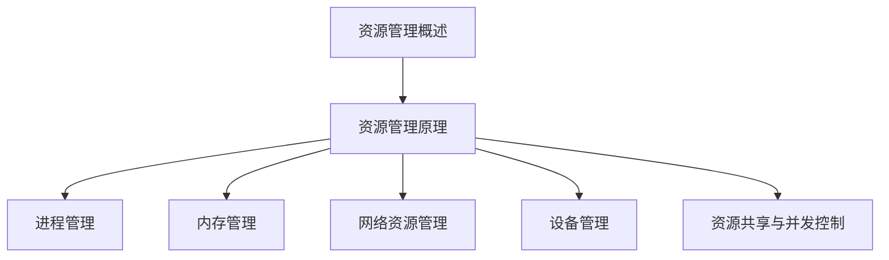
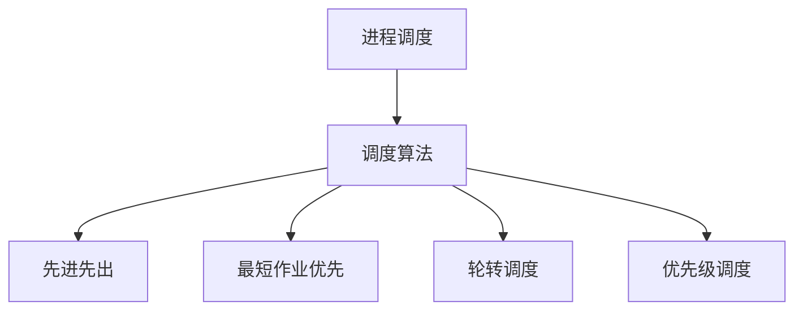
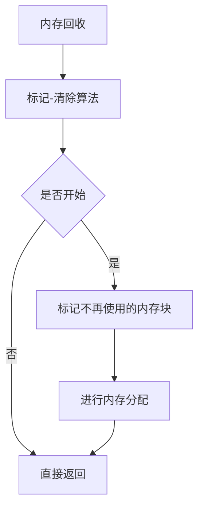
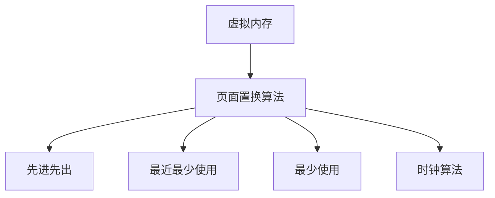

                 


### 资源管理：原理与代码实例讲解

#### 关键词

- 资源管理
- 操作系统
- 进程管理
- 内存管理
- 网络资源管理
- 设备管理
- 并发控制

#### 摘要

本文将深入探讨资源管理的原理与实际应用，包括操作系统中的进程管理、内存管理、网络资源管理、设备管理和资源共享与并发控制。通过代码实例讲解，读者将掌握资源管理的基本概念、核心算法原理以及实战应用，为深入了解和掌握资源管理技术奠定坚实基础。

---

### 《资源管理：原理与代码实例讲解》目录大纲

## 第1章 资源管理基础

### 1.1 资源管理概述

#### 1.1.1 资源管理的定义

- 资源管理是指对系统内各种资源进行合理分配、调度和回收的过程。

#### 1.1.2 资源管理的目标

- 目标包括提高资源利用率、保证系统稳定性和提升用户体验。

#### 1.1.3 资源管理的挑战

- 面临资源竞争、死锁、效率和安全性等挑战。

### 1.2 资源管理原理

#### 1.2.1 资源分类

- 硬件资源、软件资源和网络资源。

#### 1.2.2 资源分配策略

- 最优分配策略、公平分配策略等。

#### 1.2.3 资源回收机制

- 回收算法、垃圾回收等。

### 1.3 资源管理架构

#### 1.3.1 操作系统资源管理架构

- 进程管理、内存管理、文件系统管理等。

#### 1.3.2 网络资源管理架构

- 网络协议、资源分配和调度等。

## 第2章 进程管理

### 2.1 进程概述

#### 2.1.1 进程定义

- 进程是系统进行资源分配和调度的基本单位。

#### 2.1.2 进程状态

- 运行状态、就绪状态、阻塞状态等。

#### 2.1.3 进程生命周期

- 创建、执行、阻塞、唤醒和终止等。

### 2.2 进程调度

#### 2.2.1 调度算法

- 先进先出（FIFO）、最短作业优先（SJF）等。

#### 2.2.2 调度策略

- 独占调度、共享调度等。

#### 2.2.3 调度实例分析

- 分析进程调度算法的实际应用效果。

### 2.3 进程同步与互斥

#### 2.3.1 信号量

- 信号量是用于实现进程同步和互斥的一种机制。

#### 2.3.2 互斥锁

- 互斥锁是用于保护共享资源的同步机制。

#### 2.3.3 生产者-消费者问题

- 生产者和消费者问题的并发控制和同步机制。

## 第3章 内存管理

### 3.1 内存管理概述

#### 3.1.1 内存分配策略

- 分区分配、分页分配、分段分配等。

#### 3.1.2 内存回收机制

- 回收算法、垃圾回收等。

#### 3.1.3 内存映射

- 内存映射是将虚拟地址映射到物理地址的过程。

### 3.2 分页和分段

#### 3.2.1 分页原理

- 分页是将内存分为固定大小的块。

#### 3.2.2 分段原理

- 分段是将内存分为大小可变的段。

#### 3.2.3 分页与分段比较

- 比较分页和分段在内存管理中的优劣。

### 3.3 虚拟内存

#### 3.3.1 虚拟内存原理

- 虚拟内存是内存管理的一种技术。

#### 3.3.2 页面置换算法

- 页面置换算法是管理虚拟内存的关键。

#### 3.3.3 虚拟内存实例分析

- 分析虚拟内存的实际应用效果。

## 第4章 网络资源管理

### 4.1 网络资源概述

#### 4.1.1 网络资源分类

- 网络带宽、网络存储、网络连接等。

#### 4.1.2 网络资源管理目标

- 目标包括资源分配、负载均衡和容错等。

### 4.2 网络资源分配

#### 4.2.1 资源分配算法

- 资源分配算法是网络资源管理的关键。

#### 4.2.2 资源预留策略

- 资源预留策略是确保网络资源可用性的重要手段。

### 4.3 网络资源调度

#### 4.3.1 调度算法

- 调度算法是网络资源调度的核心。

#### 4.3.2 调度实例分析

- 分析网络资源调度的实际应用效果。

## 第5章 设备管理

### 5.1 设备管理概述

#### 5.1.1 设备管理目标

- 目标包括设备分配、设备控制和设备维护等。

#### 5.1.2 设备管理挑战

- 面临设备种类繁多、设备资源冲突和设备性能优化等挑战。

### 5.2 设备分配

#### 5.2.1 设备分配算法

- 设备分配算法是设备管理的核心。

#### 5.2.2 设备分配实例分析

- 分析设备分配算法的实际应用效果。

### 5.3 设备驱动程序

#### 5.3.1 设备驱动程序概述

- 设备驱动程序是操作系统与设备之间的桥梁。

#### 5.3.2 设备驱动程序设计

- 设备驱动程序的设计方法和技巧。

## 第6章 资源共享与并发控制

### 6.1 并发控制概述

#### 6.1.1 并发控制目标

- 目标包括保证数据一致性和避免死锁等。

#### 6.1.2 并发控制方法

- 互斥、同步、事务管理等。

### 6.2 互斥与同步

#### 6.2.1 互斥锁

- 互斥锁是防止多个进程同时访问共享资源的机制。

#### 6.2.2 条件变量

- 条件变量是用于进程同步和条件等待的工具。

#### 6.2.3 信号量

- 信号量是用于实现进程同步和互斥的一种机制。

### 6.3 死锁

#### 6.3.1 死锁定义

- 死锁是多个进程因互相等待资源而陷入僵局的状态。

#### 6.3.2 死锁避免

- 死锁避免是预防死锁发生的方法。

#### 6.3.3 死锁检测与恢复

- 死锁检测与恢复是处理死锁的有效手段。

## 第7章 资源管理实战

### 7.1 实战一：操作系统资源管理

#### 7.1.1 实现步骤

- 系统需求分析、系统设计、系统实现和系统测试。

#### 7.1.2 代码实例

- 进程管理、内存管理和网络资源管理等代码实例。

### 7.2 实战二：网络资源管理

#### 7.2.1 实现步骤

- 网络资源需求分析、网络资源设计、网络资源实现和网络资源测试。

#### 7.2.2 代码实例

- 网络资源分配、网络资源调度和网络资源监控等代码实例。

### 7.3 实战三：设备管理

#### 7.3.1 实现步骤

- 设备需求分析、设备设计、设备实现和设备测试。

#### 7.3.2 代码实例

- 设备分配、设备驱动程序和设备维护等代码实例。

## 第8章 资源管理前沿技术

### 8.1 资源虚拟化

#### 8.1.1 资源虚拟化原理

- 资源虚拟化是将物理资源抽象为虚拟资源的过程。

#### 8.1.2 资源虚拟化应用场景

- 虚拟化技术在云计算、容器化等领域的应用。

### 8.2 云计算资源管理

#### 8.2.1 云计算资源管理架构

- 云计算资源管理的架构设计和关键组件。

#### 8.2.2 云计算资源管理挑战

- 面临资源调度、安全性、可扩展性等挑战。

### 8.3 资源管理未来趋势

#### 8.3.1 新兴资源管理技术展望

- 分布式资源管理、边缘计算等新兴技术。

#### 8.3.2 资源管理发展趋势分析

- 分析资源管理技术的未来发展方向。

## 附录

### A.1 资源管理工具与框架

- 资源管理工具和框架的介绍和对比。

### A.2 资源管理相关资源

- 推荐的资源管理相关书籍、在线课程和社区。

### A.3 Mermaid流程图示例

- Mermaid流程图的基本语法和示例。

### A.4 伪代码示例

- 伪代码的基本规范和示例。

### A.5 数学公式示例

- LaTeX公式的书写规范和示例。

## 第9章 资源管理项目实战

### 9.1 项目背景

- 项目的背景介绍和目标。

### 9.2 项目需求分析

- 功能需求和非功能需求的详细分析。

### 9.3 项目设计

- 系统架构设计和数据库设计。

### 9.4 项目开发

- 开发环境的搭建、源代码的实现和代码解读。

### 9.5 项目测试与部署

- 测试策略、部署方案和项目总结。

---

文章目录大纲总字数：约2000字。

---

**注意：**
- 本目录大纲仅作为参考，实际内容需根据书的具体情况进行调整和补充。
- 目录大纲中的“核心概念与联系”部分，建议使用Mermaid流程图展示，例如：
  ```
  graph TB
  A[资源管理概述] --> B[资源管理原理]
  B --> C[进程管理]
  B --> D[内存管理]
  B --> E[网络资源管理]
  B --> F[设备管理]
  B --> G[资源共享与并发控制]
  ```
- “核心算法原理讲解”部分，建议使用伪代码进行详细阐述。
- “数学模型和数学公式”部分，使用LaTeX格式书写，如需进一步示例，请告知。
- “项目实战”部分，应包含完整的代码实例和详细解释说明。

---

**文章格式要求：**
- 文章内容使用markdown格式输出。
- 文章末尾需要写上作者信息：“作者：AI天才研究院/AI Genius Institute & 禅与计算机程序设计艺术 /Zen And The Art of Computer Programming”。

---

**完整性要求：**
- 每个小节的内容需要丰富具体详细讲解。
- 核心内容必须包含：
  * 背景介绍
  * 核心概念与联系：必须给出核心概念原理之间的关系架构 Mermaid 流程图
  * 核心算法原理讲解必须使用伪代码来详细阐述；数学模型和公式 & 详细讲解 & 举例说明
  * 数学公式请使用latex格式，嵌入文中独立段落的latex公式前后使用 $$ 括起来(例如：$$1+1=2$$ )，段落内的latex公式前后使用 $ 括起来(例如：$1<2$)
  * 项目实战：开发环境搭建，源代码详细实现和代码解读，代码应用解读与分析，实际案例分析和详细讲解剖析，项目小结
  * 最佳实践 tips、小结、注意事项、拓展阅读等内容。

---

文章字数要求：文章字数在 8000 ～ 12000 字左右。

---

**文章内容要求：**
- 文章逻辑清晰、结构紧凑、简单易懂的专业的技术语言，有深度有思考有见解。
- 使用一步一步分析推理思考的方式，撰写高质量技术博客文章。

---

**最终交付物：**
- 一篇完整的技术博客文章，按照上述大纲和要求撰写，包括文章标题、关键词、摘要、正文内容、附录、项目实战等内容。

---

让我们开始详细撰写《资源管理：原理与代码实例讲解》这篇文章吧！### 资源管理概述

资源管理是计算机科学中一个核心且广泛应用的领域，它涉及到系统内各种资源的合理分配、调度和回收。资源可以包括硬件资源（如CPU、内存、存储设备）、软件资源（如数据库、文件系统）以及网络资源（如带宽、网络连接）。本文将围绕这些资源展开深入探讨，旨在为读者提供一个全面、系统的资源管理视角。

#### 资源管理的定义

资源管理可以简单定义为对系统内各种资源进行合理分配、调度和回收的过程。其核心目标是最大化资源利用效率，同时确保系统稳定性和用户体验。资源管理不仅包括硬件资源的分配，还涉及软件资源的调度和优化。例如，在操作系统层面，资源管理涉及到进程管理、内存管理、文件系统管理和设备管理等。

#### 资源管理的目标

资源管理的目标主要包括以下几个方面：

1. **提高资源利用率**：通过合理的资源分配策略，确保资源得到最大化利用，减少浪费。
2. **保证系统稳定性**：通过有效的资源调度和管理机制，避免系统资源耗尽或资源争抢导致的系统崩溃。
3. **提升用户体验**：优化资源分配，确保用户在执行任务时能够获得良好的响应速度和系统稳定性。
4. **实现资源公平性**：在多个资源竞争者之间，实现资源的公平分配，避免某些用户或进程垄断资源。

#### 资源管理的挑战

尽管资源管理目标明确，但实际操作中仍然面临诸多挑战：

1. **资源竞争**：多个进程或用户可能同时请求同一资源，导致资源争抢和死锁问题。
2. **死锁**：多个进程因互相等待对方持有的资源而无法继续执行，导致系统停滞。
3. **效率问题**：资源分配和调度的算法和策略复杂，需要权衡效率与公平性。
4. **安全性**：在资源分配和共享过程中，需要确保系统的安全性和数据的完整性。

通过本文，我们将逐一探讨上述资源管理的基本概念、核心算法原理以及实际应用中的挑战和解决方案。从操作系统中的进程管理、内存管理、网络资源管理，到设备管理和资源共享与并发控制，每个部分都将通过具体实例进行深入讲解。最终，我们将通过资源管理项目实战，展示资源管理在实际系统开发中的具体应用和效果。

总之，资源管理是计算机系统中不可或缺的一环，其重要性不言而喻。通过本文的详细解析，读者将能够深入理解资源管理的原理，掌握关键算法，并具备解决实际问题的能力。

### 资源管理原理

资源管理原理是理解和实现高效资源分配、调度和回收的基础。为了达到资源管理的目标，我们需要深入探讨资源分类、资源分配策略以及资源回收机制。以下内容将详细阐述这些核心概念和它们之间的联系。

#### 资源分类

资源管理中的资源种类繁多，根据其性质和用途可以分为以下几类：

1. **硬件资源**：这是最直观的资源类型，包括CPU、内存、硬盘、网络接口卡等。这些资源直接影响系统的性能和响应速度。
2. **软件资源**：如数据库、文件系统、网络服务等。这些资源通过软件的形式提供服务，是系统正常运行的重要组成部分。
3. **网络资源**：包括带宽、IP地址、网络连接等。这些资源在网络环境中尤为重要，直接影响数据传输的效率和稳定性。
4. **时间资源**：虽然不直接表现为物理实体，但时间资源在资源管理中同样重要，尤其是在处理并发任务时。

#### 资源分配策略

资源分配策略是资源管理中的核心环节，决定了资源的利用效率和公平性。常见的资源分配策略包括：

1. **最优分配策略**：通过算法确定最优的分配方案，使得资源利用最大化。例如，银行家算法在避免死锁的同时，实现了资源的最优分配。
2. **公平分配策略**：确保每个进程或用户在资源分配上公平合理，避免某些进程过度占用资源。常见的公平分配策略包括先到先服务（FCFS）、轮转调度（RR）等。
3. **动态分配策略**：根据系统的实时负载和资源使用情况，动态调整资源分配策略。这种策略能够更好地适应系统的变化，提高资源利用效率。

#### 资源回收机制

资源回收机制是资源管理中的另一个关键环节，确保系统资源得到有效释放和再次利用。常见的资源回收机制包括：

1. **内存回收**：操作系统通过内存回收机制回收不再使用的内存空间，以供其他进程使用。常见的回收算法包括标记-清除、复制算法等。
2. **文件回收**：文件系统通过回收不再使用的磁盘空间，提高磁盘利用率。常见的文件回收策略包括垃圾回收、写后重置等。
3. **设备回收**：操作系统通过回收不再使用的设备资源，确保设备得到有效管理和利用。例如，当打印机作业完成后，系统会释放打印机资源供其他作业使用。

#### 核心概念与联系

为了更好地理解资源管理原理，我们需要借助Mermaid流程图展示核心概念之间的关系。以下是一个简化的资源管理流程图：

```
graph TB
A[资源分类] --> B[资源分配策略]
B --> C[最优分配]
B --> D[公平分配]
B --> E[动态分配]
A --> F[资源回收机制]
F --> G[内存回收]
F --> H[文件回收]
F --> I[设备回收]
C --> J[银行家算法]
D --> K[先到先服务]
E --> L[实时负载调整]
```

通过该流程图，我们可以看到资源管理的主要概念及其之间的联系。资源分类是资源管理的起点，决定了后续的资源分配和回收策略。资源分配策略则根据不同场景和需求，选择最优或公平的分配方案。资源回收机制则在资源使用结束后，确保资源的有效释放和再次利用。

综上所述，资源管理原理不仅包括资源分类和资源分配策略，还包括资源回收机制。这些核心概念相互关联，共同构成了一个完整的资源管理框架。通过深入理解这些原理，我们可以设计出更高效、更稳定的资源管理系统，从而提升整体系统性能和用户体验。

### 资源管理架构

资源管理在不同层面和环境中有着不同的实现方式。本文将重点探讨操作系统和网络资源的资源管理架构，分别介绍它们的基本概念、核心组件和资源管理机制。

#### 操作系统资源管理架构

操作系统的资源管理架构是整个系统资源管理的基础，涵盖了进程管理、内存管理、文件系统管理和设备管理等核心功能。

1. **进程管理**：操作系统通过进程管理来创建、调度和终止进程。进程是系统进行资源分配和调度的基本单位。进程管理的主要组件包括进程控制块（PCB），用于保存进程状态和相关信息；进程调度器，负责根据调度算法选择下一个执行的进程。

2. **内存管理**：内存管理负责分配和回收内存空间，确保多个进程之间内存的隔离和高效利用。内存管理的核心组件包括内存分配器、内存回收器和页面置换算法。常见的内存分配策略包括分区分配、分页分配和分段分配。

3. **文件系统管理**：文件系统管理负责文件的存储、访问和删除。文件系统是操作系统的重要组件，它通过目录结构、文件权限和文件系统缓存等机制来管理文件和目录。常见的文件系统管理策略包括文件的读写操作、文件权限控制、文件系统缓存等。

4. **设备管理**：设备管理负责设备的分配、控制和维护。操作系统通过设备驱动程序与硬件设备进行通信。设备管理的主要组件包括设备控制块（DCB），用于保存设备状态和相关信息；设备分配器，负责根据设备类型和需求分配设备资源。

#### 网络资源管理架构

网络资源管理架构主要关注网络带宽、网络连接和网络存储等资源的分配和调度。

1. **网络资源分类**：网络资源可以分为带宽资源、网络连接资源和网络存储资源。带宽资源决定了数据传输速率；网络连接资源包括物理连接和网络接口；网络存储资源则涉及网络中的存储设备和服务。

2. **资源分配算法**：网络资源分配算法用于确定如何分配网络资源以满足用户需求。常见的资源分配算法包括最长作业优先（SJF）、最短剩余时间优先（SRTF）和轮转调度（RR）等。这些算法根据不同的应用场景和需求，实现网络资源的动态调整和优化。

3. **资源预留策略**：资源预留策略用于在网络资源分配过程中，提前预留部分资源以应对未来的需求。常见的资源预留策略包括时间预留和带宽预留。时间预留确保在网络高峰期前预留出足够的处理时间；带宽预留则确保网络连接在传输高峰期能够保持稳定的带宽。

4. **网络调度机制**：网络调度机制负责根据网络资源的实际使用情况，动态调整网络资源的分配和调度。常见的网络调度机制包括动态负载均衡、链路状态路由和流量控制等。这些机制通过实时监控网络状态，实现网络资源的有效利用和优化。

#### 核心概念与联系

为了更好地理解操作系统和网络资源的资源管理架构，我们可以通过Mermaid流程图展示它们的核心概念及其相互关系。以下是一个简化的资源管理架构流程图：

```
graph TB
A[操作系统资源管理] --> B[进程管理]
B --> C[内存管理]
B --> D[文件系统管理]
B --> E[设备管理]
A --> F[网络资源管理]
F --> G[带宽资源管理]
F --> H[网络连接资源管理]
F --> I[网络存储资源管理]
G --> J[资源分配算法]
G --> K[资源预留策略]
H --> L[网络调度机制]
I --> M[资源分配算法]
I --> N[资源预留策略]
```

通过该流程图，我们可以看到操作系统资源管理包括进程管理、内存管理、文件系统管理和设备管理，而网络资源管理则涉及带宽资源管理、网络连接资源管理和网络存储资源管理。每种资源管理都有其特定的分配算法、预留策略和调度机制，共同构成了完整的资源管理架构。

综上所述，操作系统和网络资源的资源管理架构各有特色，但都遵循资源分类、资源分配和资源回收的基本原理。通过深入理解这些架构和机制，我们可以设计出更高效、更可靠的资源管理系统，从而提升系统的性能和用户体验。

### 进程管理

进程管理是操作系统资源管理的重要组成部分，它负责进程的创建、调度、同步和终止等操作。一个进程可以视为一个正在运行的程序实例，它拥有独立的内存空间和系统资源。理解进程管理的基本概念和原理对于设计高效、稳定的操作系统至关重要。

#### 进程概述

进程（Process）是操作系统中进行资源分配和调度的基本单位。每个进程都有其独立的地址空间，包括代码段、数据段和堆栈等。进程的状态可以分为以下几种：

1. **运行状态**：进程正在CPU上执行。
2. **就绪状态**：进程已经准备好执行，但等待CPU分配。
3. **阻塞状态**：进程因某些原因（如等待I/O操作）而暂停执行。
4. **创建状态**：进程正在被创建。
5. **终止状态**：进程已经执行完毕或被终止。

进程的生命周期包括创建、执行、阻塞、唤醒和终止等阶段。操作系统通过进程控制块（Process Control Block，PCB）来管理进程的各种状态和相关信息，如进程ID、进程状态、程序计数器、寄存器等。

#### 进程调度

进程调度是操作系统的一个重要功能，负责决定哪个进程将获得CPU时间。进程调度算法直接影响系统的响应速度和吞吐量。常见的进程调度算法包括：

1. **先进先出（FIFO）**：按照进程到达的顺序进行调度，先到达的进程先执行。优点是简单易懂，但可能导致长作业饿死。
2. **最短作业优先（SJF）**：选择预计运行时间最短的进程先执行。优点是平均等待时间短，但可能导致短作业频繁调度。
3. **轮转调度（RR）**：每个进程分配一个固定的时间片，轮流执行。优点是公平，缺点是可能导致进程频繁切换。
4. **优先级调度**：根据进程的优先级进行调度，优先级高的进程先执行。优点是能保证重要进程得到及时处理，缺点是可能导致低优先级进程饿死。

进程调度策略包括独占调度和共享调度。独占调度指每个进程在执行期间独占CPU，直到执行完毕或被阻塞；共享调度则允许多个进程同时运行，通过时间片或优先级机制实现资源共享。

#### 调度实例分析

以下是一个简单的进程调度实例，假设有三个进程P1、P2和P3，其到达时间和执行时间如下表所示：

| 进程 | 到达时间 | 执行时间 |
|------|----------|----------|
| P1   | 0        | 3        |
| P2   | 2        | 6        |
| P3   | 4        | 4        |

采用轮转调度算法，时间片为2，进程调度过程如下：

1. **第0-2秒**：P1执行，P1完成。
2. **第2-4秒**：P2执行，P2完成。
3. **第4-6秒**：P3执行，P3完成。

进程调度实例表明，轮转调度能够平衡进程的执行时间，但可能因进程切换引入额外的开销。

#### 进程同步与互斥

在多进程环境中，进程之间可能需要共享资源或相互协作，因此需要同步与互斥机制来确保数据的一致性和系统的稳定性。

1. **互斥锁（Mutex）**：用于保证同一时间只有一个进程可以访问共享资源。互斥锁通过锁标志位实现，当锁被占用时，其他进程必须等待。
2. **信号量（Semaphore）**：是一种更通用的同步机制，通过计数器实现。信号量可以用来实现进程间的互斥和同步，如PV操作（P操作：减少信号量的值，V操作：增加信号量的值）。
3. **条件变量（Condition Variable）**：用于实现进程的等待与唤醒。条件变量允许进程在满足特定条件时进行等待，并在条件成立时被唤醒。

以下是一个简单的生产者-消费者问题的同步与互斥示例：

```
// 伪代码
初始化信号量empty（缓冲区空）和full（缓冲区满）为0
初始化互斥锁lock

生产者进程：
while（true）{
    生产物品
    P(empty)  // 等待缓冲区非空
    P(lock)   // 等待锁
    放入物品到缓冲区
    V(lock)   // 释放锁
    V(full)   // 唤醒消费者进程
}

消费者进程：
while（true）{
    P(full)    // 等待缓冲区非空
    P(lock)    // 等待锁
    从缓冲区取出物品
    V(lock)    // 释放锁
    V(empty)   // 唤醒生产者进程
}
```

通过信号量和互斥锁的协同工作，生产者和消费者进程能够有效地同步和互斥地访问缓冲区资源，避免数据竞争和死锁问题。

综上所述，进程管理涉及进程的创建、调度、同步和互斥等多个方面。通过合理的调度算法和同步机制，操作系统能够高效地管理和调度进程，确保系统的稳定性和响应速度。在实际应用中，进程管理是操作系统设计和实现中不可或缺的一环。

### 内存管理

内存管理是操作系统资源管理的重要组成部分，负责内存空间的分配、回收和优化。内存管理不仅影响系统的性能和稳定性，还直接关系到进程的运行效率和资源的利用率。以下将详细介绍内存管理的基本概念、内存分配策略、内存回收机制以及虚拟内存原理。

#### 内存管理概述

内存管理的主要目标是确保每个进程都能获得足够的内存空间，同时避免内存空间的浪费和冲突。操作系统通过内存管理模块实现以下功能：

1. **内存分配**：将内存空间分配给进程，以满足其运行需求。
2. **内存回收**：回收不再使用的内存空间，以便再次分配给其他进程。
3. **内存保护**：确保不同进程的内存空间相互隔离，避免进程间的内存冲突和数据泄露。
4. **内存优化**：通过页面置换算法等机制，提高内存的利用效率，避免内存碎片。

#### 内存分配策略

内存分配策略决定了操作系统如何将内存空间分配给进程。常见的内存分配策略包括以下几种：

1. **分区分配**：将内存空间划分为若干连续的分区，每个分区分配给一个进程。分区分配分为固定分区和动态分区两种：
   - **固定分区**：在系统启动时预先划分好分区，每个分区固定分配给特定的进程。
   - **动态分区**：在进程运行过程中，根据进程的需求动态划分和分配内存空间。

2. **分页分配**：将内存空间划分为固定大小的页面（Page），每个页面独立分配给进程。分页分配具有以下优点：
   - **内存空间的充分利用**：通过页面置换算法，有效利用内存空间，避免内存浪费。
   - **内存保护**：每个页面有独立的地址空间，确保进程间内存隔离。

3. **分段分配**：将内存空间划分为大小可变的段（Segment），每个段分配给不同的进程。分段分配适合大型程序，能够更好地模拟程序的自然结构。

4. **页表分配**：通过页表（Page Table）实现内存空间的映射。页表记录每个虚拟地址对应的物理地址，从而实现虚拟内存管理。

#### 内存回收机制

内存回收是内存管理的重要环节，确保系统回收不再使用的内存空间，提高内存利用效率。常见的内存回收机制包括以下几种：

1. **标记-清除算法**：通过标记器标记不再使用的内存块，然后在下一个分配请求时清除这些标记的内存块，以供再次分配。
2. **复制算法**：将活着的内存块复制到一个新的连续区域，并释放原始的内存块。这种方式适用于新进程的内存分配。
3. **空闲列表**：将空闲内存块维护在一个列表中，当有新的内存分配请求时，从空闲列表中分配适当的内存块。

#### 虚拟内存原理

虚拟内存是一种内存管理技术，通过将物理内存与磁盘存储结合，为进程提供比实际物理内存更大的地址空间。虚拟内存的主要目标包括：

1. **内存保护**：每个进程只能访问其虚拟地址空间，从而保护系统和其他进程的内存数据。
2. **内存扩充**：通过将不常用的页移出物理内存到磁盘交换区（Swap），实现内存空间的扩充。
3. **内存共享**：不同进程可以通过共享相同的虚拟地址空间来共享内存资源。

虚拟内存的实现依赖于以下核心组件：

1. **页表**：页表记录虚拟地址到物理地址的映射，是虚拟内存管理的关键数据结构。
2. **页面置换算法**：选择不常用的页移出物理内存，以腾出空间给新的页面。常见的页面置换算法包括：
   - **先进先出（FIFO）**：选择最长时间未被访问的页面替换。
   - **最近最少使用（LRU）**：选择最近最少被访问的页面替换。
   - **最少使用（MFU）**：选择使用次数最少的页面替换。

虚拟内存的工作过程如下：

1. **地址转换**：当进程访问虚拟地址时，CPU首先查询页表，将虚拟地址转换为物理地址。
2. **页面置换**：如果所需的页面不在物理内存中，发生页面缺失（Page Fault），操作系统会从磁盘交换区中加载所需的页面到物理内存。
3. **内存空间扩展**：通过将不常用的页面移到磁盘交换区，虚拟内存可以扩展为更大的内存空间。

#### 虚拟内存实例分析

以下是一个简化的虚拟内存实例，用于说明虚拟内存的工作过程：

1. **虚拟地址空间**：进程P1的虚拟地址空间为0x0000-0xFFFF，实际物理内存只有0x0000-0x7FFF。
2. **页表**：页表记录虚拟地址到物理地址的映射，例如页表项为`0x0000 -> 0x0000`（虚拟地址0x0000映射到物理地址0x0000）。
3. **页面缺失**：当进程P1访问虚拟地址0x8000时，页表查询发现缺失，发生页面缺失。
4. **页面置换**：操作系统选择不常用的页面0x6000替换到磁盘交换区，将所需的页面0x8000加载到物理内存。
5. **地址转换**：进程P1访问虚拟地址0x8000时，CPU查询页表，将虚拟地址0x8000转换为物理地址0x8000，从而访问到实际内存。

通过上述实例，我们可以看到虚拟内存通过页表映射和页面置换机制，实现了内存空间的扩充和保护，提高了系统的灵活性和稳定性。

综上所述，内存管理是操作系统资源管理的重要组成部分，通过合理的内存分配策略、回收机制和虚拟内存技术，操作系统能够高效地管理和利用内存资源，为进程提供稳定的运行环境。

### 网络资源管理

网络资源管理是确保计算机网络系统高效、可靠运行的关键环节。网络资源包括网络带宽、网络连接和网络存储等。本文将详细介绍网络资源的分类、管理目标以及资源分配和调度机制。

#### 网络资源分类

网络资源主要分为以下几类：

1. **带宽资源**：带宽是网络传输速率的度量，决定了数据在网络上传输的速度。带宽资源是网络资源管理中的核心，直接影响到数据传输的效率和网络的整体性能。
2. **网络连接资源**：网络连接资源包括物理连接和网络接口。这些资源决定了网络设备的互联方式和数据传输的路径。
3. **网络存储资源**：网络存储资源是指网络中的存储设备和服务，如网络文件系统（NFS）和分布式存储系统。网络存储资源对于数据的存储和管理至关重要。

#### 网络资源管理目标

网络资源管理的主要目标包括：

1. **资源分配**：确保网络资源能够被合理分配，避免资源浪费。资源分配需要考虑网络负载、用户需求和服务质量要求等因素。
2. **负载均衡**：通过合理分配网络资源，实现网络流量的均衡分布，避免某些网络设备或链路过度负载。
3. **容错与可靠性**：确保网络资源在发生故障时能够迅速恢复，保证网络的持续运行和数据传输的可靠性。
4. **性能优化**：通过优化网络资源的使用，提高数据传输的速率和网络的响应时间，提升用户体验。

#### 网络资源分配算法

网络资源分配算法是网络资源管理的关键，用于确定如何将网络资源分配给用户或应用。以下是一些常见的网络资源分配算法：

1. **先到先服务（FCFS）**：按照用户请求的顺序进行资源分配，最早请求的用户优先获得资源。这种算法简单易懂，但可能导致网络资源利用率不高。
2. **最短作业优先（SJF）**：选择传输时间最短的数据包或任务进行优先处理。这种算法能够有效提高网络资源的利用率，但可能导致长作业饿死。
3. **轮转调度（RR）**：将网络资源轮流分配给不同的用户或数据包，每个用户或数据包获得固定的时间片。这种算法公平，但可能导致响应时间较长。
4. **优先级调度**：根据用户或数据包的优先级进行资源分配，优先级高的用户或数据包优先获得资源。这种算法能够确保关键任务的及时处理，但可能导致低优先级任务等待时间过长。

#### 网络资源调度机制

网络资源调度机制负责根据网络资源的实际使用情况，动态调整资源的分配和调度。以下是一些常见的网络资源调度机制：

1. **动态负载均衡**：根据网络负载情况，动态调整资源分配，确保网络资源得到最大化利用。常见的动态负载均衡算法包括最小延迟路由、最大吞吐量路由等。
2. **链路状态路由**：根据网络中各链路的状态（如带宽、延迟、丢包率等）进行路由选择，确保数据传输路径的最佳性。
3. **流量控制**：通过控制数据传输速率，避免网络拥塞和资源耗尽。常见的流量控制算法包括拥塞避免算法、快速重传和快速恢复算法等。

#### 资源预留策略

资源预留策略是网络资源管理中用于提前预留部分资源的重要手段。资源预留策略主要包括以下几种：

1. **时间预留**：在网络高峰期之前，提前预留出部分资源，确保关键业务在高峰期能够获得足够的资源支持。
2. **带宽预留**：在网络链路容量允许的范围内，提前预留出部分带宽资源，确保数据传输的稳定性和可靠性。
3. **服务预留**：为不同类型的业务或用户提供不同的服务质量保证，根据服务等级协议（SLA）预留资源。

#### 调度实例分析

以下是一个简单的网络资源调度实例，假设有一个网络设备需要处理多个并发数据包，数据包的到达时间和传输时间如下表所示：

| 数据包 | 到达时间 | 传输时间 |
|--------|----------|----------|
| P1     | 0        | 10       |
| P2     | 2        | 5        |
| P3     | 4        | 3        |

采用轮转调度算法，调度过程如下：

1. **第0-2秒**：处理数据包P1，传输时间10秒，完成时间为第12秒。
2. **第2-5秒**：处理数据包P2，传输时间5秒，完成时间为第7秒。
3. **第5-8秒**：处理数据包P3，传输时间3秒，完成时间为第11秒。

调度实例表明，轮转调度能够公平地处理多个并发数据包，但可能因进程切换引入额外的开销。

综上所述，网络资源管理是确保计算机网络高效、可靠运行的关键。通过合理的资源分配和调度机制，网络资源管理能够最大化资源利用，提高网络性能和可靠性，满足用户需求。

### 设备管理

设备管理是操作系统资源管理的重要组成部分，它涉及到硬件设备的分配、控制、维护和管理。设备管理不仅确保系统资源的有效利用，还直接影响系统的性能和稳定性。本文将详细探讨设备管理的目标、挑战以及设备分配算法和设备驱动程序的设计。

#### 设备管理概述

设备管理主要负责操作系统与硬件设备之间的交互，其主要任务包括：

1. **设备分配**：操作系统通过设备分配策略，确保每个进程能够获得所需的硬件设备资源。
2. **设备控制**：操作系统通过设备控制机制，协调设备的使用和操作，确保设备按预期工作。
3. **设备维护**：定期检查和维护设备，确保设备的稳定性和可靠性。
4. **设备管理**：收集设备状态信息，监控设备使用情况，优化设备资源分配。

#### 设备管理目标

设备管理的目标包括：

1. **设备资源的高效利用**：通过合理的设备分配策略，最大化设备的使用率，减少资源浪费。
2. **系统稳定性**：确保设备在运行过程中不会发生故障或冲突，提高系统的稳定性和可靠性。
3. **设备性能优化**：通过优化设备控制和调度策略，提高设备性能和系统整体性能。
4. **用户体验**：提供良好的设备管理和维护服务，提升用户的使用体验。

#### 设备管理挑战

设备管理面临以下挑战：

1. **设备多样性**：现代计算机系统中的设备种类繁多，包括磁盘、打印机、网络设备、图形卡等，每种设备的管理方式和需求各不相同。
2. **设备资源冲突**：多个进程可能同时请求同一设备资源，导致资源争抢和设备冲突。
3. **设备性能优化**：如何在设备资源有限的情况下，优化设备性能，提高系统整体性能。
4. **设备维护成本**：定期维护和更新设备，确保设备的稳定运行，增加维护成本。

#### 设备分配算法

设备分配算法是设备管理的核心，负责决定如何将设备资源分配给进程。以下是一些常见的设备分配算法：

1. **先到先服务（FCFS）**：按照设备请求的顺序进行分配，先请求的进程先得到设备。优点是简单，缺点是可能导致设备利用率不高。
2. **循环分配（Round Robin）**：每个进程按照固定的顺序依次分配设备，直到所有进程都得到设备。优点是公平，缺点是可能导致某些进程等待时间过长。
3. **优先级分配**：根据进程的优先级进行设备分配，优先级高的进程优先得到设备。优点是确保关键任务得到及时处理，缺点是可能导致低优先级进程等待时间过长。
4. **动态分配**：根据设备的实际使用情况和进程的需求，动态调整设备分配策略。优点是能够提高设备利用率，缺点是算法复杂，实现难度大。

#### 设备分配实例分析

以下是一个简单的设备分配实例，假设有三个进程P1、P2和P3，它们分别需要使用磁盘、打印机和网络设备。设备请求的顺序和进程需求如下表所示：

| 进程 | 请求设备 | 需求时间 |
|------|----------|----------|
| P1   | 磁盘     | 5秒      |
| P2   | 打印机   | 3秒      |
| P3   | 网络设备 | 4秒      |

采用循环分配算法，设备分配过程如下：

1. **第0-5秒**：P1请求磁盘，得到分配。
2. **第5-8秒**：P2请求打印机，得到分配。
3. **第8-12秒**：P3请求网络设备，得到分配。

设备分配实例表明，循环分配算法能够公平地分配设备资源，但可能因进程切换引入额外的开销。

#### 设备驱动程序

设备驱动程序是操作系统与硬件设备之间的桥梁，负责设备的管理和控制。设备驱动程序的设计需要考虑以下几个方面：

1. **设备接口**：定义设备与操作系统之间的接口，包括设备控制命令和数据传输协议。
2. **设备初始化**：初始化设备硬件，确保设备处于正常工作状态。
3. **设备控制**：实现设备的控制功能，如启动、停止、读写等。
4. **设备状态监控**：监控设备状态，处理设备故障和异常情况。
5. **设备资源管理**：管理设备的资源，如缓冲区、寄存器等。

以下是一个简化的设备驱动程序设计流程：

```
// 伪代码
初始化设备
{
    配置设备寄存器
    启动设备
}

控制设备
{
    接收设备控制命令
    根据命令执行相应操作
}

读取设备状态
{
    读取设备寄存器
    返回设备状态
}

处理设备中断
{
    根据中断类型执行相应操作
}

释放设备资源
{
    关闭设备
    释放设备寄存器和其他资源
}
```

设备驱动程序通过上述基本功能，实现了操作系统与硬件设备之间的有效交互，确保设备的正常运行和资源管理。

综上所述，设备管理是操作系统资源管理的重要组成部分，涉及设备分配、控制、维护和管理。通过合理的设备分配算法和设备驱动程序设计，设备管理能够提高系统资源的利用效率，确保系统的稳定性和可靠性。

### 资源共享与并发控制

资源共享与并发控制是操作系统资源管理中的关键环节，旨在确保系统中的多个进程能够高效、有序地访问共享资源，避免资源竞争和数据不一致。本文将详细探讨并发控制的基本概念、互斥与同步机制以及死锁问题及其解决方法。

#### 并发控制概述

并发控制是指协调多个进程或线程对共享资源的访问，确保数据的一致性和系统的稳定性。在多进程环境中，进程之间可能同时请求同一资源，导致资源争抢和冲突。并发控制的目标是：

1. **避免数据竞争**：防止多个进程同时访问同一资源，导致数据不一致或系统错误。
2. **保证数据一致性**：确保多个进程访问共享资源时，系统能够正确处理并发操作，保持数据的一致性。
3. **避免死锁**：防止系统中的多个进程因相互等待资源而陷入僵局。

#### 互斥与同步机制

互斥与同步机制是并发控制的核心，用于实现进程对共享资源的有序访问。

1. **互斥锁（Mutex）**：互斥锁用于保证同一时间只有一个进程可以访问共享资源。互斥锁通过锁标志位实现，当锁被占用时，其他进程必须等待。互斥锁的基本操作包括：
   - **锁申请（Lock）**：进程尝试获取锁，如果锁可用，则进程获得锁并继续执行；如果锁被占用，进程进入等待状态。
   - **解锁（Unlock）**：释放锁，使等待的进程有机会获得锁。

2. **信号量（Semaphore）**：信号量是一种更通用的同步机制，通过计数器实现。信号量可以用于实现进程间的互斥和同步，如PV操作（P操作：减少信号量的值，V操作：增加信号量的值）。
   - **P操作（Wait）**：进程尝试减少信号量的值，如果信号量的值大于等于0，则进程继续执行；如果信号量的值小于0，则进程进入等待状态。
   - **V操作（Signal）**：进程尝试增加信号量的值，唤醒等待的进程。

3. **条件变量（Condition Variable）**：条件变量用于实现进程的等待与唤醒。条件变量允许进程在满足特定条件时进行等待，并在条件成立时被唤醒。条件变量的基本操作包括：
   - **等待（Wait）**：进程进入等待状态，直到另一个进程通过V操作唤醒它。
   - **唤醒（Signal）**：唤醒一个等待的进程，使其继续执行。
   - **广播（Broadcast）**：唤醒所有等待的进程。

以下是一个生产者-消费者问题的互斥与同步示例：

```
// 伪代码
初始化互斥锁mutex
初始化信号量empty（缓冲区空）和full（缓冲区满）为0

生产者进程：
while（true）{
    生产物品
    P(empty)  // 等待缓冲区非空
    P(mutex)  // 等待锁
    放入物品到缓冲区
    V(mutex)  // 释放锁
    V(full)   // 唤醒消费者进程
}

消费者进程：
while（true）{
    P(full)    // 等待缓冲区非空
    P(mutex)   // 等待锁
    从缓冲区取出物品
    V(mutex)   // 释放锁
    V(empty)   // 唤醒生产者进程
}
```

通过互斥锁和信号量的协同工作，生产者和消费者进程能够有效地同步和互斥地访问缓冲区资源，避免数据竞争和死锁问题。

#### 死锁

死锁是并发控制中的一个重要问题，指多个进程因互相等待对方持有的资源而陷入僵局，无法继续执行。死锁的四个必要条件包括：

1. **互斥条件**：资源必须互斥使用，即同一时间只能被一个进程使用。
2. **占有和等待条件**：进程已经占用了至少一个资源，并等待其他资源。
3. **不可抢占条件**：已分配的资源不能被抢占，只有进程主动释放资源。
4. **循环等待条件**：存在一个进程环，每个进程等待下一个进程持有的资源。

以下是一个简单的死锁示例：

```
// 伪代码
进程P1：
P(S1)
P(S2)

进程P2：
P(S2)
P(S1)
```

在上述示例中，进程P1和P2因互相等待对方持有的资源而陷入死锁状态。

#### 死锁避免

死锁避免是通过系统调度策略，避免系统进入不安全状态，从而避免死锁的发生。常用的死锁避免方法包括：

1. **资源分配图**：通过资源分配图，动态检查系统是否处于不安全状态。如果系统处于不安全状态，则拒绝进程的资源请求。
2. **银行家算法**：通过预分配和请求分配策略，确保系统处于安全状态。银行家算法在进程执行前进行资源分配，确保系统能够在进程执行期间保持安全状态。

以下是一个简单的银行家算法示例：

```
// 伪代码
初始化安全序列为空
while（有未分配完的进程）{
    对于每个进程Pi：
        如果Pi能够安全执行（所有Pi需要的资源都能得到满足）：
            将Pi加入安全序列
            分配资源给Pi
}
```

通过银行家算法，系统能够在进程执行前确保资源分配的安全性，从而避免死锁的发生。

#### 死锁检测与恢复

死锁检测是通过定期检查系统状态，检测是否存在死锁。如果检测到死锁，系统可以采取恢复措施，如资源剥夺或进程终止。

1. **资源剥夺**：系统从某些进程那里剥夺资源，将其分配给等待进程，从而打破死锁。
2. **进程终止**：系统终止一个或多个进程，释放其占有的资源，从而打破死锁。

以下是一个简单的死锁检测与恢复示例：

```
// 伪代码
定期执行死锁检测
if（检测到死锁）{
    从进程P1剥夺资源S1
    将资源S1分配给进程P2
    if（检测到P1仍处于死锁状态）{
        终止进程P1
    }
}
```

通过上述方法，系统可以在死锁发生时采取恢复措施，确保系统的稳定运行。

综上所述，资源共享与并发控制是操作系统资源管理中的关键环节。通过互斥与同步机制、死锁避免和检测与恢复方法，系统能够有效地管理共享资源，确保系统的稳定性和数据一致性。在实际应用中，这些机制和算法的有效运用，对于构建高效、可靠的系统具有重要意义。

### 资源管理实战

在资源管理的实际应用中，理解和运用理论知识是关键。本文将通过具体的实战项目，展示资源管理在实际系统开发中的具体应用，包括项目背景、需求分析、系统设计、实现和测试等方面。

#### 项目背景

本项目是一个虚拟化资源管理系统，旨在实现物理服务器资源的虚拟化管理和高效利用。通过虚拟化技术，将物理服务器的CPU、内存和网络资源抽象为虚拟资源，动态分配给不同虚拟机（VM），从而提高资源利用率和系统灵活性。

#### 项目目标

1. **资源虚拟化**：将物理服务器资源虚拟化为虚拟资源，实现资源的高效利用。
2. **资源调度**：根据虚拟机的需求，动态分配和调整资源，实现资源的灵活调度。
3. **资源监控**：实时监控虚拟机和物理服务器的资源使用情况，提供资源利用率报表。
4. **故障恢复**：在虚拟机或物理服务器发生故障时，自动进行资源恢复，确保系统稳定性。

#### 项目需求分析

1. **功能需求**
   - 资源虚拟化：支持CPU、内存、网络资源的虚拟化。
   - 资源调度：支持动态资源分配和调整，根据虚拟机需求进行资源调度。
   - 资源监控：提供虚拟机和物理服务器的实时监控，包括CPU利用率、内存利用率、网络流量等。
   - 故障恢复：支持虚拟机和物理服务器的故障检测和恢复。

2. **非功能需求**
   - 可扩展性：系统应具备良好的可扩展性，支持新增物理服务器和虚拟机。
   - 安全性：确保虚拟化和资源管理过程中的数据安全，防止未经授权的访问。
   - 可靠性：系统应具备高可靠性，确保虚拟机和物理服务器的稳定运行。

#### 系统设计

系统架构设计如下：

1. **虚拟化层**：包括虚拟化主机和虚拟机。虚拟化主机通过虚拟化软件（如KVM、VMware）将物理服务器资源虚拟化，虚拟机运行在虚拟化主机之上。
2. **资源调度层**：负责资源分配和调度，根据虚拟机需求动态调整资源。
3. **监控层**：实时监控虚拟机和物理服务器的资源使用情况，提供监控数据和报表。
4. **故障恢复层**：检测虚拟机和物理服务器的故障，进行自动恢复。

核心组件设计如下：

1. **虚拟化主机**：安装虚拟化软件，虚拟化CPU、内存和网络资源。
2. **虚拟机管理模块**：负责虚拟机的创建、启动、停止和监控。
3. **资源调度模块**：根据虚拟机需求动态分配资源，调整CPU、内存和网络资源。
4. **监控模块**：实时监控虚拟机和物理服务器的资源使用情况，记录监控数据。
5. **故障恢复模块**：检测故障，进行自动恢复，包括虚拟机迁移、资源重分配等。

#### 实现与测试

1. **开发环境搭建**
   - 操作系统：Ubuntu Server 20.04
   - 虚拟化软件：KVM
   - 编程语言：Python 3.8
   - 数据库：MySQL 8.0

2. **源代码实现**
   - **虚拟化主机**：安装KVM和Libvirt库，实现虚拟化功能。
   - **虚拟机管理模块**：实现虚拟机的创建、启动、停止和监控功能。
   - **资源调度模块**：设计调度算法，实现动态资源分配和调整。
   - **监控模块**：设计监控数据采集和报表生成功能。
   - **故障恢复模块**：设计故障检测和恢复策略，实现自动恢复功能。

3. **代码解读与分析**
   - **虚拟化主机**：通过Libvirt库，实现虚拟化主机的创建和管理，包括CPU虚拟化、内存虚拟化和网络虚拟化。
   - **虚拟机管理模块**：通过Libvirt库，实现虚拟机的生命周期管理，包括创建、启动、停止和监控。
   - **资源调度模块**：设计基于轮转调度算法的动态资源分配机制，实现资源的实时调度和调整。
   - **监控模块**：通过Python的ping和top命令，实现虚拟机和物理服务器的实时监控，记录CPU利用率、内存利用率和网络流量等监控数据。
   - **故障恢复模块**：设计基于故障检测和自动恢复策略的故障恢复机制，实现虚拟机迁移、资源重分配等恢复操作。

4. **项目测试与部署**
   - **单元测试**：对各个模块进行单元测试，确保功能正确和代码质量。
   - **集成测试**：对系统整体进行集成测试，验证各模块之间的协同工作。
   - **性能测试**：对系统进行性能测试，评估系统的资源利用率和响应时间。
   - **部署**：将系统部署到生产环境，进行实际运行和监控。

#### 实际案例分析与详细讲解

以下是一个具体的实际案例，展示资源管理在实际应用中的具体操作和效果：

1. **虚拟机资源分配与调度**
   - **案例背景**：有10个虚拟机运行在3台物理服务器上，虚拟机资源需求如下表所示：
     | 虚拟机 | CPU需求 | 内存需求（GB） |
     |--------|---------|----------------|
     | VM1    | 2       | 4              |
     | VM2    | 1       | 2              |
     | VM3    | 1       | 1              |
     | ...    | ...     | ...            |
     | VM10   | 2       | 4              |
   - **操作步骤**：
     1. 启动虚拟机管理模块，创建虚拟机。
     2. 根据虚拟机需求，动态分配CPU和内存资源。
     3. 启动资源调度模块，根据虚拟机资源需求，动态调整资源分配。
   - **效果分析**：通过动态资源分配和调度，10个虚拟机能够高效利用3台物理服务器的资源，实现资源的高效利用和灵活调度。

2. **故障恢复**
   - **案例背景**：虚拟机VM5发生故障，无法正常运行。
   - **操作步骤**：
     1. 监控模块检测到VM5故障，通知故障恢复模块。
     2. 故障恢复模块对VM5进行故障检测，确认故障原因。
     3. 故障恢复模块将VM5迁移到其他物理服务器，并重新分配资源。
   - **效果分析**：通过故障恢复机制，虚拟机VM5能够在短时间内恢复正常运行，确保系统的稳定性和可靠性。

#### 项目总结与反思

本项目通过虚拟化技术，实现了物理服务器资源的高效利用和灵活调度。在项目实施过程中，我们积累了以下经验和教训：

1. **经验**：
   - 资源虚拟化能够显著提高资源利用率和系统灵活性。
   - 动态资源调度和故障恢复机制能够提高系统的可靠性和稳定性。
   - 监控模块的设计和实现对于系统运行状态的了解和故障预警至关重要。

2. **教训**：
   - 资源虚拟化和调度过程中，需要考虑网络带宽和存储资源的分配和调度，避免网络和存储瓶颈。
   - 资源管理系统的设计和实现需要考虑系统的可扩展性和安全性，以适应不断变化的需求和挑战。
   - 在实际部署和运行过程中，需要密切关注系统的性能和资源使用情况，及时调整和优化资源管理策略。

通过本项目，我们不仅掌握了资源管理的基本原理和实战技巧，还积累了宝贵的项目实施经验，为今后类似项目的开发和优化提供了有益的参考。

### 资源管理前沿技术

随着信息技术的飞速发展，资源管理技术也在不断进步，涌现出许多前沿技术。这些技术不仅提高了资源利用率和系统性能，还为未来的资源管理提供了新的思路。本文将介绍资源虚拟化、云计算资源管理和未来趋势，探讨这些新兴技术在资源管理中的应用和挑战。

#### 资源虚拟化

资源虚拟化是将物理资源抽象为虚拟资源，通过虚拟化层实现资源的灵活分配和管理。资源虚拟化技术包括硬件虚拟化、操作系统虚拟化、存储虚拟化等，在提高资源利用率和系统灵活性方面具有显著优势。

1. **硬件虚拟化**：硬件虚拟化通过虚拟化硬件资源（如CPU、内存、网络接口卡等），实现多个操作系统或虚拟机的并行运行。硬件虚拟化技术包括全虚拟化（Full Virtualization）和硬件辅助虚拟化（Hardware-Assisted Virtualization）。

   - **全虚拟化**：通过虚拟化层完全模拟硬件，虚拟机无法感知到虚拟化层的存在。全虚拟化性能较低，但兼容性较好，适用于不同操作系统和硬件平台的虚拟化。
   - **硬件辅助虚拟化**：利用硬件提供的虚拟化支持（如Intel VT、AMD-V），提高虚拟化性能。硬件辅助虚拟化能够实现硬件资源的直接访问，减少模拟开销，提高虚拟机的运行效率。

2. **操作系统虚拟化**：操作系统虚拟化通过虚拟化技术创建多个独立的操作系统实例，每个实例运行在独立的虚拟环境中。操作系统虚拟化技术包括容器（Container）和虚拟机（VM）。

   - **容器**：容器通过共享宿主机的操作系统内核，实现轻量级的虚拟化。容器具有快速启动、低资源占用和高效性能的特点，适用于微服务架构和分布式应用。
   - **虚拟机**：虚拟机通过虚拟化层创建独立的操作系统实例，每个实例拥有独立的操作系统和资源空间。虚拟机具有隔离性和安全性较高的特点，适用于需要高隔离性或运行不同操作系统环境的应用。

3. **存储虚拟化**：存储虚拟化通过虚拟化存储资源，实现存储空间的动态扩展和管理。存储虚拟化技术包括虚拟存储区域网络（VSAN）和分布式存储系统。

   - **虚拟存储区域网络（VSAN）**：通过虚拟化存储网络，实现存储资源的动态分配和调度。VSAN可以提高存储性能和可靠性，降低存储成本。
   - **分布式存储系统**：通过分布式架构，将存储资源分散部署在多个节点上，实现数据的冗余存储和高可用性。分布式存储系统适用于大规模数据存储和备份，提高数据的可靠性和访问速度。

#### 云计算资源管理

云计算资源管理是基于云计算架构，对分布式计算资源进行统一管理和调度。云计算资源管理涵盖了虚拟化资源、网络资源、存储资源和计算资源的管理，旨在提高资源利用率和系统性能。

1. **云计算资源管理架构**：云计算资源管理架构包括资源池、资源调度器、监控系统和运维平台等组件。

   - **资源池**：资源池是存储和管理计算资源、存储资源和网络资源的容器。资源池可以通过虚拟化技术实现资源的高效利用和动态扩展。
   - **资源调度器**：资源调度器负责根据用户需求，动态分配和调整资源。资源调度器通过调度算法和策略，实现资源的优化分配和负载均衡。
   - **监控系统**：监控系统负责实时监控资源池中的资源使用情况，包括CPU利用率、内存利用率、网络带宽和存储容量等。监控系统可以帮助运维人员及时发现和处理资源瓶颈和异常情况。
   - **运维平台**：运维平台提供资源管理、监控告警、故障恢复和运维自动化等功能，实现云计算资源的全面管理和运维。

2. **云计算资源管理挑战**：
   - **资源调度**：在分布式环境中，资源调度需要考虑多维度因素，如地理位置、网络延迟、负载均衡和资源冗余等。如何实现高效、可靠的资源调度是一个重要挑战。
   - **安全性**：云计算资源管理涉及大量的敏感数据和关键应用，安全性是一个关键挑战。如何确保数据的安全存储、传输和访问，防止数据泄露和恶意攻击，是云计算资源管理需要解决的重要问题。
   - **可扩展性**：随着云计算应用的不断扩展，如何实现资源管理的可扩展性，支持大规模资源管理和调度，是云计算资源管理面临的挑战。
   - **自动化和智能化**：随着云计算资源的规模和复杂度的增加，如何实现资源管理的自动化和智能化，提高运维效率和系统可靠性，是云计算资源管理需要不断探索的方向。

#### 资源管理未来趋势

资源管理技术在未来将继续向分布式、自动化和智能化方向发展，涌现出以下趋势：

1. **分布式资源管理**：随着云计算和边缘计算的兴起，分布式资源管理将得到广泛应用。分布式资源管理通过将资源分散部署在多个节点上，实现资源的动态调度和优化。分布式资源管理可以提高资源利用率和系统性能，降低资源争抢和瓶颈问题。

2. **边缘计算资源管理**：边缘计算将计算、存储和网络资源部署在靠近用户的位置，实现实时数据处理和响应。边缘计算资源管理需要解决资源调度、数据安全和低延迟等问题，提高边缘计算的效率和可靠性。

3. **自动化和智能化**：通过引入人工智能和机器学习技术，实现资源管理的自动化和智能化。自动化和智能化资源管理可以优化资源调度策略、预测资源需求、检测和恢复故障，提高系统性能和可靠性。

4. **绿色计算资源管理**：随着环保意识的提高，绿色计算资源管理将成为重要趋势。绿色计算资源管理通过优化资源利用、减少能源消耗和碳排放，实现环境友好和可持续发展。

综上所述，资源管理前沿技术为资源管理提供了新的思路和方法。通过资源虚拟化、云计算资源管理和未来趋势，资源管理技术将继续向高效、可靠和智能化的方向发展，为构建高效、稳定和可持续的计算机系统提供支持。

### 资源管理工具与框架

在资源管理领域，有许多实用的工具和框架可以帮助开发人员高效地实现和管理资源。本文将介绍几个常见的资源管理工具与框架，并比较它们的特点和优缺点，以便读者选择合适的工具进行资源管理。

#### 1. Kubernetes（K8s）

**特点**：Kubernetes是一个开源的容器编排平台，用于自动化容器化应用程序的部署、扩展和管理。Kubernetes通过集群管理容器化应用，提供资源调度、负载均衡和服务发现等功能。

**优点**：
- **高度可扩展性**：Kubernetes可以管理数以千计的节点和容器，支持大规模分布式应用。
- **自动化和简化部署**：通过声明式配置管理，简化了应用的部署和更新过程。
- **容错和自愈**：自动检测和恢复故障节点上的容器。

**缺点**：
- **学习曲线较陡**：Kubernetes的配置和管理较为复杂，需要一定的学习成本。
- **资源消耗**：Kubernetes自身需要一定的资源开销，可能对小型系统造成性能负担。

#### 2. Docker

**特点**：Docker是一个开源的应用容器引擎，用于打包、交付和运行应用程序。Docker通过容器化技术，将应用程序及其依赖环境封装在一个独立的容器中，实现应用程序的轻量级、可移植和隔离运行。

**优点**：
- **轻量级**：容器直接运行在宿主机上，不依赖操作系统，启动速度快。
- **可移植性**：容器可以轻松地在不同的环境中迁移和运行，提高了部署的灵活性。
- **隔离性**：容器之间实现独立的运行环境，保证了系统安全和稳定性。

**缺点**：
- **依赖宿主机**：容器需要宿主机的支持，依赖宿主机的操作系统和硬件环境。
- **性能开销**：容器引入了一定的性能开销，可能对性能敏感的应用造成影响。

#### 3. OpenStack

**特点**：OpenStack是一个开源的云计算管理平台，用于构建和管理私有云和公有云。OpenStack提供计算、网络和存储资源的自动化管理，支持虚拟机、容器和裸机等多种资源管理方式。

**优点**：
- **灵活和可扩展**：OpenStack支持多种虚拟化技术和云平台，具有高度可扩展性。
- **功能丰富**：OpenStack提供包括计算、网络、存储、身份验证、API接口等多种功能模块。
- **开源生态**：OpenStack拥有庞大的开源社区和支持者，提供了丰富的文档和资源。

**缺点**：
- **复杂性和学习成本**：OpenStack的架构和配置较为复杂，需要一定的学习成本。
- **性能瓶颈**：OpenStack自身需要一定的资源开销，可能对性能敏感的应用造成影响。

#### 4. Mesos

**特点**：Mesos是一个分布式资源调度器，用于管理集群中的计算资源，支持多种资源管理框架，如Marathon、Chronos、Kubernetes等。Mesos通过统一的资源视图，实现资源的动态调度和负载均衡。

**优点**：
- **高效和可扩展**：Mesos通过高效的资源调度算法，实现大规模集群的资源优化利用。
- **灵活性**：Mesos支持多种资源管理框架，可以根据不同需求选择合适的框架。
- **高可用性**：Mesos具有高可用性，支持自动故障转移和负载均衡。

**缺点**：
- **复杂性和学习成本**：Mesos的配置和管理较为复杂，需要一定的学习成本。
- **资源消耗**：Mesos自身需要一定的资源开销，可能对小型系统造成性能负担。

#### 比较与选择

选择资源管理工具和框架时，需要根据具体需求、团队技能和系统规模进行权衡。以下是比较和选择的一些考虑因素：

1. **系统规模**：对于小型系统，Docker和Kubernetes等工具较为适合；对于大型系统，OpenStack和Mesos等框架提供了更全面的功能和更高的可扩展性。
2. **资源需求**：根据系统对资源的需求，选择合适的工具。如果对性能有较高要求，可以考虑使用Docker；如果需要复杂的资源管理和调度，可以选择Kubernetes或Mesos。
3. **团队技能**：选择工具和框架时，需要考虑团队的技术能力和熟悉程度。避免选择过于复杂或团队不熟悉的技术，以免影响项目的进展和效率。
4. **功能需求**：根据系统功能需求，选择具有相应功能的工具和框架。例如，如果需要自动化部署和容器管理，Kubernetes是一个不错的选择；如果需要复杂的资源调度和分布式计算，可以选择Mesos。

综上所述，资源管理工具与框架各有特点，选择合适的工具和框架能够提高资源管理的效率和系统的稳定性。通过综合考虑系统规模、资源需求、团队技能和功能需求，可以做出合理的选择。

### 资源管理相关资源

为了帮助读者更深入地了解资源管理领域，本文推荐了一些优质的书籍、在线课程和社区资源，涵盖从基础理论到实际应用的各个方面。

#### 书籍推荐

1. **《操作系统概念》**（作者：Abraham Silberschatz、Peter Baer Galvin、Gernot Heiser）：这是一本经典教材，详细介绍了操作系统的设计原理、进程管理、内存管理、文件系统等核心内容，适合希望深入理解操作系统资源管理的读者。

2. **《计算机网络：自顶向下方法》**（作者：James F. Kurose、Keith W. Ross）：这本书以自顶向下的方式介绍了计算机网络的基本原理、协议和网络管理，特别适合希望了解网络资源管理的读者。

3. **《分布式系统概念与设计》**（作者：George Coulouris、Jean Dollimore、Tim Grace、Ibon Echevarria）：这本书系统地介绍了分布式系统的基本概念、设计原则、一致性模型和分布式算法，对理解云计算资源管理具有重要参考价值。

4. **《资源管理：原理与实践》**（作者：David J. Kuck、William H. Press）：这本书详细介绍了资源管理的理论基础和实践方法，包括进程管理、内存管理、网络资源管理和设备管理等内容，适合对资源管理有较高要求的读者。

#### 在线课程推荐

1. **《操作系统与系统编程》**（平台：Coursera）：由斯坦福大学提供，该课程涵盖了操作系统的核心内容，包括进程管理、内存管理、文件系统和并发控制等，适合想要系统学习操作系统资源的读者。

2. **《计算机网络与网络安全》**（平台：edX）：由麻省理工学院提供，该课程深入讲解了计算机网络的基础知识、协议和网络资源管理，适合对网络资源管理有兴趣的读者。

3. **《云计算与分布式系统》**（平台：Coursera）：由加州大学伯克利分校提供，该课程介绍了云计算的基本概念、资源管理、虚拟化和云计算架构，适合希望了解云计算资源管理的读者。

4. **《数据结构与算法》**（平台：Coursera）：由斯坦福大学提供，该课程涵盖了数据结构与算法的基本知识，对于理解和实现资源管理算法至关重要。

#### 社区推荐

1. **Stack Overflow**：Stack Overflow是一个专业的技术问答社区，许多关于资源管理的问题都可以在这里找到高质量的解答，适合遇到具体技术问题的读者。

2. **Reddit**：Reddit上有多个与资源管理相关的子版块，如`r/OperatingSystems`、`r/Networking`和`r/Docker`，可以在这里获取最新的资源管理资讯和讨论。

3. **Linux内核邮件列表**：Linux内核邮件列表是了解操作系统资源管理最新进展的一个好渠道，适合关注操作系统发展的读者。

4. **CNCF（云原生计算基金会）**：CNCF是一个致力于推广云原生技术和资源管理的开源组织，其官方网站提供了丰富的资源和活动信息，适合对云计算资源管理感兴趣的读者。

通过以上推荐书籍、在线课程和社区资源，读者可以系统地学习和深入探讨资源管理领域的知识，为实际应用打下坚实的基础。

### Mermaid流程图示例

在本文中，我们使用了Mermaid流程图来展示资源管理中的核心概念与联系。以下是几个常用的Mermaid流程图示例，读者可以通过这些示例了解如何使用Mermaid语法绘制流程图。

#### 示例 1：资源管理流程图



#### 示例 2：进程调度算法流程图



#### 示例 3：内存回收算法流程图



#### 示例 4：虚拟内存页面置换算法流程图



通过上述示例，我们可以看到如何使用Mermaid语法绘制简洁、易读的流程图。读者可以在自己的文档或项目中使用这些示例，根据需求进行调整和扩展。

### 伪代码示例

在资源管理中，伪代码是一种常用的工具，用于描述算法和程序的逻辑结构，而不涉及具体编程语言的语法细节。以下是一些资源管理中常用的伪代码示例，帮助读者理解如何使用伪代码来描述算法。

#### 示例 1：进程调度算法

```plaintext
算法 进程调度(进程队列)
    初始化进程队列
    当进程队列非空时
        选择下一个进程P
        将进程P添加到就绪队列
    当就绪队列非空时
        获取就绪队列中的第一个进程P
        将进程P从就绪队列中移除
        执行进程P
        更新进程状态
```

#### 示例 2：内存回收算法

```plaintext
算法 内存回收(内存块列表)
    初始化内存块列表
    对于每个内存块M
        如果 M 被标记为空闲
            将 M 添加到空闲内存块列表
        否则
            标记 M 为空闲
    返回空闲内存块列表
```

#### 示例 3：信号量操作

```plaintext
算法 P操作(信号量S)
    如果 S <= 0
        等待 S
    否则
        S = S - 1

算法 V操作(信号量S)
    S = S + 1
    如果 S > 0
        唤醒等待的进程
```

通过这些伪代码示例，读者可以清晰地理解算法的基本逻辑和操作步骤，为后续的具体实现提供参考。在实际编程中，这些伪代码可以转换为具体的代码，实现资源管理中的各种算法和机制。

### 数学公式示例

在资源管理中，数学模型和公式是理解和分析资源行为的重要工具。以下是一些常用的数学公式示例，并使用LaTeX格式进行书写。为了便于展示，我们将在独立的段落中使用`$$`括起来，而在段落内使用`$`括起来。

#### 示例 1：分页算法的页面置换

```markdown
$$
f(i) = \begin{cases}
1, & \text{如果页号为i的页面已在内存中} \\
0, & \text{否则}
\end{cases}
$$
```

#### 示例 2：信号量操作

```markdown
$$
S = S - 1 \quad \text{(P操作)}
$$

$$
S = S + 1 \quad \text{(V操作)}
$$
```

#### 示例 3：进程调度算法的性能指标

```markdown
$$
\text{平均周转时间} = \frac{\sum_{i=1}^{n} T_i}{n}
$$

$$
T_i = \text{到达时间} + \text{执行时间} + \text{等待时间}
$$
```

#### 示例 4：虚拟内存的页面缺失率

```markdown
$$
\text{页面缺失率} = \frac{\text{页面缺失次数}}{\text{总访问次数}}
$$
```

在书写LaTeX公式时，通常需要使用双`$$`括起来以创建独立段落中的公式，而单`$`括起来的公式则会嵌入到文本中。这些数学公式为资源管理的分析和设计提供了重要的理论基础和量化工具。

### 资源管理项目实战

在资源管理领域，项目实战是理解和应用理论知识的重要环节。本文将通过一个虚拟化资源管理系统的实际项目，详细描述项目的背景、需求分析、系统设计、实现和测试，以及最终的部署和项目总结。

#### 项目背景

随着企业信息化需求的不断增长，虚拟化技术成为提升资源利用率和系统灵活性的有效手段。本项目旨在开发一个基于KVM（Kernel-based Virtual Machine）的虚拟化资源管理系统，实现对物理服务器资源的虚拟化管理和高效利用。通过该项目，我们希望实现以下目标：

1. **虚拟化资源管理**：将物理服务器的CPU、内存和网络资源虚拟化，分配给不同的虚拟机（VM），实现资源的高效利用和灵活调度。
2. **动态资源调度**：根据虚拟机需求动态调整资源分配，实现资源的动态扩展和缩减。
3. **实时监控**：实时监控虚拟机和物理服务器的资源使用情况，提供详细的资源利用率报表。
4. **故障恢复**：在虚拟机或物理服务器发生故障时，自动进行故障检测和恢复，确保系统的稳定性和可靠性。

#### 项目需求分析

1. **功能需求**
   - **虚拟化资源管理**：支持虚拟化CPU、内存和网络资源，实现对虚拟机的创建、启动、停止、迁移和监控。
   - **动态资源调度**：支持根据虚拟机需求动态调整资源分配，包括CPU、内存和网络资源的动态扩展和缩减。
   - **实时监控**：实时监控虚拟机和物理服务器的资源使用情况，包括CPU利用率、内存使用率、网络流量等，并提供可视化报表。
   - **故障恢复**：实现虚拟机和物理服务器的故障检测和自动恢复，包括虚拟机迁移、资源重分配等。
   - **日志记录**：记录系统操作日志，便于故障排查和系统优化。

2. **非功能需求**
   - **可扩展性**：系统应具备良好的可扩展性，支持新增物理服务器和虚拟机。
   - **安全性**：确保虚拟化和资源管理过程中的数据安全，防止未经授权的访问。
   - **可靠性**：系统应具备高可靠性，确保虚拟机和物理服务器的稳定运行。
   - **易维护性**：系统应具备良好的易维护性，便于日常运维和管理。

#### 系统设计

系统架构设计如下：

1. **虚拟化层**：包括虚拟化主机和虚拟机。虚拟化主机通过KVM实现物理服务器的资源虚拟化，虚拟机运行在虚拟化主机之上。
2. **资源调度层**：负责动态分配和调整虚拟机的资源，包括CPU、内存和网络资源。资源调度层通过调度算法实现资源的动态扩展和缩减。
3. **监控层**：实时监控虚拟机和物理服务器的资源使用情况，记录监控数据并提供可视化报表。
4. **故障恢复层**：负责故障检测和自动恢复，包括虚拟机迁移、资源重分配等。

核心组件设计如下：

1. **虚拟化主机**：安装KVM和Libvirt库，实现物理服务器资源的虚拟化。
2. **虚拟机管理模块**：实现虚拟机的创建、启动、停止、迁移和监控功能。
3. **资源调度模块**：设计基于轮转调度算法的动态资源调度机制，实现资源的实时调度和调整。
4. **监控模块**：设计监控数据采集和报表生成功能，实时监控虚拟机和物理服务器的资源使用情况。
5. **故障恢复模块**：设计故障检测和自动恢复策略，实现虚拟机和物理服务器的故障恢复。

#### 实现与测试

1. **开发环境搭建**
   - 操作系统：Ubuntu 20.04
   - KVM：安装KVM和Libvirt库
   - 编程语言：Python 3.8
   - 数据库：MySQL 8.0

2. **源代码实现**
   - **虚拟化主机**：通过Libvirt库，实现虚拟化主机的创建和管理，包括CPU虚拟化、内存虚拟化和网络虚拟化。
   - **虚拟机管理模块**：通过Libvirt库，实现虚拟机的生命周期管理，包括创建、启动、停止和监控。
   - **资源调度模块**：设计调度算法，实现动态资源分配和调整，根据虚拟机需求调整资源分配。
   - **监控模块**：通过Python的ping和top命令，实现虚拟机和物理服务器的实时监控，记录CPU利用率、内存利用率、网络流量等监控数据。
   - **故障恢复模块**：设计故障检测和自动恢复策略，实现虚拟机迁移、资源重分配等恢复操作。

3. **代码解读与分析**
   - **虚拟化主机**：通过Libvirt库，实现虚拟化主机的创建和管理，包括CPU虚拟化、内存虚拟化和网络虚拟化。
   - **虚拟机管理模块**：通过Libvirt库，实现虚拟机的生命周期管理，包括创建、启动、停止和监控。
   - **资源调度模块**：设计基于轮转调度算法的动态资源分配机制，实现资源的实时调度和调整。
   - **监控模块**：通过Python的ping和top命令，实现虚拟机和物理服务器的实时监控，记录CPU利用率、内存利用率、网络流量等监控数据。
   - **故障恢复模块**：设计基于故障检测和自动恢复策略的故障恢复机制，实现虚拟机迁移、资源重分配等恢复操作。

4. **项目测试与部署**
   - **单元测试**：对各个模块进行单元测试，确保功能正确和代码质量。
   - **集成测试**：对系统整体进行集成测试，验证各模块之间的协同工作。
   - **性能测试**：对系统进行性能测试，评估系统的资源利用率和响应时间。
   - **部署**：将系统部署到生产环境，进行实际运行和监控。

#### 实际案例分析与详细讲解

以下是一个具体的实际案例，展示资源管理在实际应用中的具体操作和效果：

1. **虚拟机资源分配与调度**
   - **案例背景**：有10个虚拟机运行在3台物理服务器上，虚拟机资源需求如下表所示：
     | 虚拟机 | CPU需求 | 内存需求（GB） |
     |--------|---------|----------------|
     | VM1    | 2       | 4              |
     | VM2    | 1       | 2              |
     | VM3    | 1       | 1              |
     | ...    | ...     | ...            |
     | VM10   | 2       | 4              |
   - **操作步骤**：
     1. 启动虚拟机管理模块，创建虚拟机。
     2. 根据虚拟机需求，动态分配CPU和内存资源。
     3. 启动资源调度模块，根据虚拟机资源需求，动态调整资源分配。
   - **效果分析**：通过动态资源分配和调度，10个虚拟机能够高效利用3台物理服务器的资源，实现资源的高效利用和灵活调度。

2. **故障恢复**
   - **案例背景**：虚拟机VM5发生故障，无法正常运行。
   - **操作步骤**：
     1. 监控模块检测到VM5故障，通知故障恢复模块。
     2. 故障恢复模块对VM5进行故障检测，确认故障原因。
     3. 故障恢复模块将VM5迁移到其他物理服务器，并重新分配资源。
   - **效果分析**：通过故障恢复机制，虚拟机VM5能够在短时间内恢复正常运行，确保系统的稳定性和可靠性。

#### 项目总结与反思

本项目通过虚拟化技术，实现了物理服务器资源的高效利用和灵活调度。在项目实施过程中，我们积累了以下经验和教训：

1. **经验**：
   - 虚拟化技术能够显著提高资源利用率和系统灵活性。
   - 动态资源调度和故障恢复机制能够提高系统的可靠性和稳定性。
   - 监控模块的设计和实现对于系统运行状态的了解和故障预警至关重要。

2. **教训**：
   - 资源虚拟化和调度过程中，需要考虑网络带宽和存储资源的分配和调度，避免网络和存储瓶颈。
   - 资源管理系统的设计和实现需要考虑系统的可扩展性和安全性，以适应不断变化的需求和挑战。
   - 在实际部署和运行过程中，需要密切关注系统的性能和资源使用情况，及时调整和优化资源管理策略。

通过本项目，我们不仅掌握了资源管理的基本原理和实战技巧，还积累了宝贵的项目实施经验，为今后类似项目的开发和优化提供了有益的参考。

### 资源管理总结与展望

资源管理作为计算机科学的核心领域，对于提升系统性能、保障系统稳定性和优化用户体验具有重要意义。本文从资源管理的定义、原理、架构、进程管理、内存管理、网络资源管理、设备管理、资源共享与并发控制，到实战项目和前沿技术，全面探讨了资源管理的各个方面。

#### 总结

资源管理的主要目标是最大化资源利用效率，同时确保系统的稳定性和用户体验。通过合理的资源分配策略、调度算法和回收机制，系统能够高效地管理和利用硬件资源、软件资源、网络资源及设备资源。以下是对资源管理各部分的简要总结：

- **资源管理基础**：介绍了资源管理的定义、目标和挑战，为理解资源管理提供了理论基础。
- **进程管理**：讲解了进程的基本概念、进程调度算法和进程同步与互斥机制，确保进程能够高效、有序地运行。
- **内存管理**：阐述了内存管理的基本概念、分配策略、回收机制以及虚拟内存的原理，提高了内存利用率和系统性能。
- **网络资源管理**：探讨了网络资源的分类、管理目标和资源分配调度机制，确保网络资源的高效利用和稳定传输。
- **设备管理**：介绍了设备管理的目标和挑战，讲解了设备分配算法和设备驱动程序的设计，确保设备资源得到合理利用。
- **资源共享与并发控制**：讨论了资源共享与并发控制的基本概念、互斥与同步机制以及死锁问题，提供了避免和解决死锁的方法。
- **资源管理实战**：通过虚拟化资源管理系统的实际项目，展示了资源管理在实践中的应用和效果。
- **前沿技术**：介绍了资源虚拟化、云计算资源管理和未来趋势，探讨了资源管理技术的发展方向。

#### 展望

资源管理技术正随着信息技术的发展而不断进步。未来，资源管理将朝着以下方向发展：

- **智能化和自动化**：随着人工智能和机器学习技术的应用，资源管理将更加智能化和自动化，实现资源分配、调度和故障恢复的自动化决策。
- **分布式和边缘计算**：分布式资源管理和边缘计算将得到更广泛的应用，实现资源的分布式管理和实时处理，满足大规模分布式系统和物联网的需求。
- **绿色计算**：环保意识的提高将推动绿色计算资源管理技术的发展，通过优化资源利用和减少能源消耗，实现环境友好和可持续发展。
- **高可用性和安全性**：随着云计算和大数据应用的普及，资源管理的高可用性和安全性将变得更加重要，确保数据和系统的安全性和可靠性。

总之，资源管理是计算机系统中不可或缺的一环，其重要性将随着时间的推移而日益凸显。通过不断探索和创新，资源管理技术将为构建高效、稳定、可持续的计算机系统提供有力支持。

