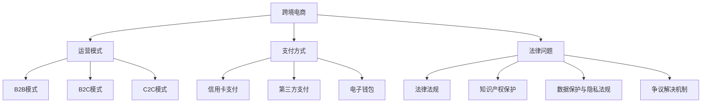

                 

### 文章标题

《跨境电商创业：全球化贸易的新机遇》

### 关键词

跨境电商、全球化贸易、创业、运营模式、支付系统、法律问题、成功案例

### 摘要

在全球化的浪潮下，跨境电商成为了连接各国市场的桥梁，为创业者提供了前所未有的机遇。本文将详细探讨跨境电商的基本概念、运营模式、平台选择、支付与法律问题，并结合实战案例，为创业者提供全方位的指导。

#### 第一部分：跨境电商概述

##### 第1章：跨境电商的基本概念与背景

- **1.1 跨境电商的定义与发展历程**

  跨境电商指的是不同国家或地区的商家通过网络平台进行商品交易的活动。随着互联网技术的飞速发展，跨境电商从最初的邮件订单逐步演变为如今全球化的商业新模式。

  **发展历程：**

  - 1995年，亚马逊成立，标志着跨境电商的兴起。
  - 2000年，eBay等平台崛起，为跨境电商交易提供更多选择。
  - 2010年后，移动互联网普及，跨境电商进入快速发展阶段。

- **1.2 跨境电商与传统外贸的比较**

  跨境电商与传统外贸在交易模式、渠道和成本等方面存在显著差异。

  **差异点：**

  - **交易模式：** 跨境电商通过电商平台完成交易，交易流程更加便捷。
  - **渠道：** 传统外贸依赖展会、贸易公司等渠道，而跨境电商主要依托互联网平台。
  - **成本：** 跨境电商可以降低人力、物流和营销等成本。

- **1.3 全球跨境电商市场趋势分析**

  全球跨境电商市场呈现出高速增长的态势。

  **趋势分析：**

  - **市场规模扩大：** 随着消费者购买力的提升，跨境电商市场规模持续扩大。
  - **技术创新：** 人工智能、大数据和区块链等技术的应用，提升了跨境电商的运营效率。
  - **区域差异：** 亚太地区、欧洲和北美等市场增长迅速，成为跨境电商的重要区域。

#### 第二部分：跨境电商的运营模式与渠道

##### 第2章：跨境电商的运营模式与渠道

- **2.1 跨境电商的运营模式**

  跨境电商的运营模式主要包括B2B、B2C和C2C模式。

  **B2B模式：**

  - B2B模式是企业对企业的交易模式，主要特点是订单量大、交易周期长。
  
  **B2C模式：**

  - B2C模式是企业对消费者的交易模式，消费者可以直接在平台上购买商品。
  
  **C2C模式：**

  - C2C模式是消费者对消费者的交易模式，主要特点是灵活性强、交易频次高。

- **2.2 跨境电商的渠道选择**

  跨境电商的渠道选择包括平台型电商、自建站电商和联盟营销。

  **平台型电商：**

  - 平台型电商是指企业通过第三方电商平台进行商品销售，如Amazon、Alibaba等。

  **自建站电商：**

  - 自建站电商是指企业自己搭建电商平台，直接与消费者进行交易。

  **联盟营销：**

  - 联盟营销是指企业通过与其他网站或博客合作，推广商品并获得佣金。

#### 第三部分：跨境电商平台

##### 第3章：主流跨境电商平台介绍

- **3.1 Amazon**

  Amazon是全球最大的跨境电商平台之一，具有广泛的用户基础和强大的品牌影响力。

  **平台特点：**

  - 海量商品：提供数百万种商品，满足各种消费需求。
  - 全球配送：实现全球范围内的物流配送。
  - 优质服务：提供完善的售后服务和客户支持。

  **销售策略：**

  - 付费广告：通过广告投放提高曝光率。
  - 促销活动：定期举办促销活动，吸引消费者。

  **开店流程：**

  - 注册账号：注册Amazon卖家账号。
  - 提交资料：提交企业相关信息和资料。
  - 发布产品：上传产品信息，设置价格和库存。
  - 起步运营：开始销售产品，积累用户评价。

- **3.2 Alibaba**

  Alibaba是中国最大的跨境电商平台，以B2B模式为主，同时也提供B2C服务。

  **平台特点：**

  - 海量供应商：提供大量优质的供应商资源。
  - 专业市场：覆盖多个行业领域，满足不同行业需求。
  - 诚信保障：提供完善的诚信体系和售后服务。

  **销售策略：**

  - 优化产品：提升产品质量和性价比。
  - 加强营销：通过SEO、SEM等手段提高曝光率。
  - 拓展渠道：通过线下展会、合作论坛等拓展销售渠道。

  **开店流程：**

  - 注册账号：注册Alibaba卖家账号。
  - 实名认证：完成实名认证。
  - 发布产品：上传产品信息，设置价格和库存。
  - 开始交易：与买家达成交易，进行物流配送。

- **3.3 eBay**

  eBay是一个全球性的在线拍卖和购物网站，以C2C模式为主，同时提供B2C服务。

  **平台特点：**

  - 拍卖模式：提供独特的拍卖交易方式，增加交易的趣味性。
  - 全球用户：拥有广泛的用户基础，覆盖全球多个国家和地区。
  - 安全支付：提供安全的支付系统，保障交易安全。

  **销售策略：**

  - 定价策略：根据市场需求和竞争状况合理定价。
  - 营销推广：通过SEO、SEM、社交媒体等渠道进行推广。
  - 客户服务：提供优质的售后服务，增加客户满意度。

  **开店流程：**

  - 注册账号：注册eBay卖家账号。
  - 实名认证：完成实名认证。
  - 发布产品：上传产品信息，设置价格和库存。
  - 开始交易：与买家达成交易，进行物流配送。

#### 第四部分：跨境电商平台运营策略

##### 第4章：跨境电商平台运营策略

- **4.1 产品定位与选品策略**

  产品定位是跨境电商成功的关键，需要根据市场需求和消费者偏好进行选品。

  **产品定位：**

  - 针对不同市场和消费者群体，制定不同的产品策略。

  **选品策略：**

  - 分析市场需求：通过市场调研，了解消费者的需求和偏好。
  - 挑选热门产品：选择市场上受欢迎的产品，增加销售机会。
  - 质量保障：保证产品质量，提升品牌形象。

- **4.2 库存管理与物流配送**

  库存管理和物流配送是跨境电商运营的重要环节。

  **库存管理：**

  - 根据销售数据和市场需求，合理规划库存，避免库存积压或短缺。

  **物流配送：**

  - 选择合适的物流公司：根据产品特性、配送时间和成本等因素，选择合适的物流公司。
  - 提高配送效率：通过优化配送路线、提高运输速度，提升客户满意度。

- **4.3 促销活动与营销策略**

  促销活动和营销策略是提升销售业绩的重要手段。

  **促销活动：**

  - 定期举办促销活动，如打折、满减、赠品等，吸引消费者。

  **营销策略：**

  - 内容营销：通过发布高质量的内容，提升品牌知名度和用户粘性。
  - 社交媒体营销：利用社交媒体平台，进行品牌推广和互动。

- **4.4 售后服务与客户关系管理**

  售后服务是跨境电商成功的重要因素，直接影响客户满意度和复购率。

  **售后服务：**

  - 提供及时、高效的售后服务，解决客户问题，提升客户满意度。

  **客户关系管理：**

  - 通过客户反馈和数据分析，了解客户需求，提升客户体验。
  - 定期进行客户回访，建立长期合作关系。

#### 第五部分：跨境电商支付与法律问题

##### 第5章：跨境电商支付方式与跨境支付系统

- **5.1 跨境电商支付方式**

  跨境电商支付方式包括信用卡支付、第三方支付和电子钱包等。

  **信用卡支付：**

  - 信用卡支付是最常见的支付方式，具有广泛的使用范围和较高的支付安全性。

  **第三方支付：**

  - 第三方支付是指通过支付宝、微信支付等第三方支付平台进行支付，提高支付便捷性。

  **电子钱包：**

  - 电子钱包是一种数字钱包，用于存储和支付数字货币，具有便捷性和安全性。

- **5.2 跨境支付系统搭建与优化**

  跨境支付系统搭建是跨境电商运营的关键环节。

  **搭建流程：**

  - 选择合适的支付服务提供商。
  - 开发接口，实现支付功能。
  - 集成支付系统，与电商平台对接。

  **优化策略：**

  - 提高支付速度：优化支付流程，减少支付环节，提高支付速度。
  - 增强支付安全性：采用加密技术和安全认证，确保支付安全。

##### 第6章：跨境电商法律问题与合规

- **6.1 跨境电商的法律法规**

  跨境电商需要遵守不同国家和地区的法律法规。

  **法律法规：**

  - 数据保护法：确保用户数据的安全和隐私。
  - 消费者权益保护法：保障消费者的合法权益。
  - 知识产权保护法：防止侵犯知识产权的行为。

- **6.2 跨境电商知识产权保护**

  知识产权保护是跨境电商的重要问题。

  **保护策略：**

  - 注册知识产权：在目标市场注册专利、商标等知识产权。
  - 监测侵权行为：通过技术手段监测市场，及时发现和处理侵权行为。
  - 法律维权：针对侵权行为，采取法律手段进行维权。

- **6.3 数据保护与隐私法规**

  数据保护和隐私法规是跨境电商必须遵守的法规。

  **保护措施：**

  - 数据加密：采用加密技术，确保数据传输和存储的安全性。
  - 用户同意：明确告知用户数据收集和使用的目的，获得用户同意。
  - 数据泄露应对：制定数据泄露应对方案，及时应对数据泄露事件。

- **6.4 跨境电商争议解决机制**

  跨境电商争议解决机制是解决交易纠纷的重要手段。

  **解决机制：**

  - 调解：通过第三方调解机构，解决交易纠纷。
  - 仲裁：通过仲裁机构进行仲裁，解决交易纠纷。
  - 司法诉讼：通过司法途径，解决交易纠纷。

#### 第六部分：跨境电商实战案例

##### 第7章：跨境电商成功案例分析

- **7.1 成功跨境电商案例分析**

  通过分析成功跨境电商案例，可以了解跨境电商运营的成功经验和策略。

  **案例一：某国内品牌在Amazon的成功之路**

  - **成功原因：** 优质产品、有效营销策略、完善售后服务。
  - **运营策略：** 精细化运营、持续创新、强化品牌形象。

  **案例二：某新兴跨境电商平台的发展策略**

  - **成功原因：** 抓住市场机遇、提供优质服务、打造特色平台。
  - **运营策略：** 灵活应对市场变化、持续优化用户体验。

  **案例三：某跨境电商的跨境支付解决方案**

  - **成功原因：** 创新的支付方式、高效的支付处理、严格的安全保障。
  - **运营策略：** 打造一站式支付解决方案、提升支付体验。

#### 第七部分：跨境电商创业指南

##### 第8章：跨境电商创业指南

- **8.1 跨境电商创业的机会与挑战**

  跨境电商创业面临巨大的机遇和挑战。

  **机遇：**

  - 市场需求增长：跨境电商市场持续扩大，提供更多商机。
  - 技术创新：互联网、大数据、人工智能等技术的发展，提升运营效率。

  **挑战：**

  - 竞争激烈：跨境电商市场竞争激烈，需要不断创新和优化。
  - 法律法规：遵守不同国家和地区的法律法规，确保合规运营。

- **8.2 跨境电商创业的准备工作**

  成功的跨境电商创业需要充分的准备工作。

  **准备工作：**

  - 市场调研：了解目标市场、消费者需求和竞争状况。
  - 产品定位：明确产品定位和目标消费者。
  - 资金筹备：筹集创业资金，确保运营资金充足。

- **8.3 跨境电商创业的资金与风险管理**

  资金和风险管理是跨境电商创业的关键。

  **资金管理：**

  - 合理规划资金：根据业务需求，合理规划资金使用。
  - 寻找融资渠道：探索股权融资、债务融资等融资渠道。

  **风险管理：**

  - 风险识别：识别潜在风险，如市场风险、信用风险、操作风险等。
  - 风险控制：采取风险控制措施，降低风险影响。

- **8.4 跨境电商创业的未来发展趋势**

  跨境电商创业的未来发展趋势将受到多个因素的影响。

  **发展趋势：**

  - 技术驱动：人工智能、大数据、区块链等技术的应用，推动跨境电商的发展。
  - 消费升级：消费者需求升级，对产品质量和购物体验提出更高要求。
  - 多元化市场：开拓更多国家和地区市场，实现全球化运营。

#### 附录

##### 附录A：跨境电商相关资源与工具

- **A.1 跨境电商平台资源**

  - Amazon、Alibaba、eBay等主流跨境电商平台资源。

- **A.2 跨境电商物流工具**

  - DHL、UPS、FedEx等国际物流服务提供商。

- **A.3 跨境电商营销工具**

  - SEO工具、SEM工具、社交媒体营销工具等。

- **A.4 跨境电商法律资源**

  - 各国跨境电商法律法规、知识产权保护指南等。

### Mermaid 流程图（核心概念与联系）

### 核心算法原理讲解

（待具体内容补充）

### 数学模型和数学公式

（待具体内容补充）

### 项目实战

（待具体内容补充）

### 最佳实践 tips、小结、注意事项、拓展阅读等内容

（待具体内容补充）

### 作者信息

作者：AI天才研究院/AI Genius Institute & 禅与计算机程序设计艺术 /Zen And The Art of Computer Programming

---

### 附录A：跨境电商相关资源与工具

**A.1 跨境电商平台资源**

- **Amazon**：https://www.amazon.com/
- **Alibaba**：https://www.alibaba.com/
- **eBay**：https://www.ebay.com/

**A.2 跨境电商物流工具**

- **DHL**：https://www.dhl.com/
- **UPS**：https://www.ups.com/
- **FedEx**：https://www.fedex.com/

**A.3 跨境电商营销工具**

- **Google Analytics**：https://www.google.com/analytics/
- **SEOmoz**：https://www.seomoz.org/
- **Hootsuite**：https://hootsuite.com/

**A.4 跨境电商法律资源**

- **WTO**：https://www.wto.org/
- **ICC**：https://www.iccwbo.org/
- **International Law Office**：https://www.internationallawoffice.com/

