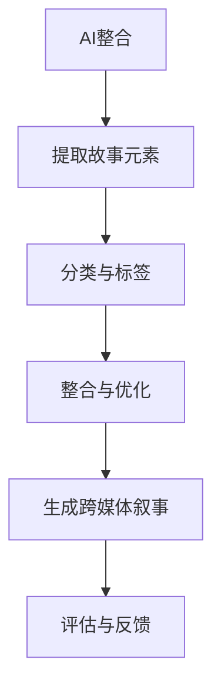
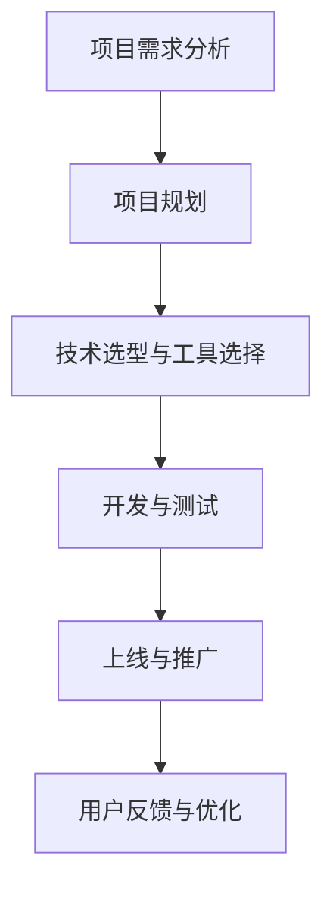

                 


### 文章标题
《跨媒体叙事：AI整合不同形式的故事元素》

### 文章关键词
跨媒体叙事，人工智能，故事元素，叙事策略，机器学习，自然语言处理

### 摘要
本文深入探讨了跨媒体叙事的概念、类型及应用，重点介绍了人工智能（AI）在整合不同形式故事元素中的关键作用。通过详细的案例分析，阐述了AI技术如何提升跨媒体叙事的创造性和个性化水平，为未来的跨媒体叙事开发提供了有益的启示。

# 《跨媒体叙事：AI整合不同形式的故事元素》目录大纲

## 第一部分：跨媒体叙事概述

### 第1章：跨媒体叙事的概念与演变
- 跨媒体叙事的定义与特点
- 跨媒体叙事的发展历程
- 跨媒体叙事在当代文化中的地位与影响

### 第2章：跨媒体叙事的类型与形式
- 跨媒体叙事的主要类型
- 跨媒体叙事的不同形式
- 跨媒体叙事的叙事策略

## 第二部分：AI在跨媒体叙事中的应用

### 第3章：AI技术基础
- 人工智能的基本概念
- 机器学习与深度学习
- 自然语言处理技术

### 第4章：AI在跨媒体叙事中的应用场景
- AI在跨媒体叙事中的角色与任务
- AI在跨媒体叙事中的具体应用
- AI在跨媒体叙事中的优势与挑战

### 第5章：AI整合不同形式的故事元素
- 不同形式的故事元素概述
- AI如何整合不同形式的故事元素
- AI在整合不同形式的故事元素中的实际应用

## 第三部分：跨媒体叙事项目实战

### 第6章：跨媒体叙事项目实战案例
- 项目背景与目标
- 项目实施过程
- 项目成果与评价

### 第7章：跨媒体叙事项目的开发指南
- 跨媒体叙事项目开发的准备
- 跨媒体叙事项目的开发流程
- 跨媒体叙事项目的评估与优化

### 第8章：未来发展趋势与展望
- 跨媒体叙事的未来发展趋势
- AI在跨媒体叙事中的未来应用
- 跨媒体叙事与AI发展的展望

## 附录

### 附录A：跨媒体叙事与AI常用工具与资源
- 常用AI工具
- 跨媒体叙事平台
- 相关文献与资料

### 附录图
- 附录图1：AI整合不同形式的故事元素流程图
- 附录图2：跨媒体叙事项目的开发流程图

### 伪代码示例
- 伪代码1：AI提取故事元素
- 伪代码2：AI生成跨媒体叙事

### 数学公式与详细讲解
- 数学公式1：文本分类准确率
- 详细讲解：文本分类准确率
- 举例说明：文本分类准确率计算

### 项目实战
- 第6章：跨媒体叙事项目实战案例

### 代码解读与分析
- 文本预处理代码解读
- 提取实体与分类标签代码解读
- 生成跨媒体叙事代码解读

## 最佳实践 tips、小结、注意事项、拓展阅读等内容

### 最佳实践 tips
- 注意事项
- 拓展阅读

---

### 引言
随着互联网和人工智能技术的迅猛发展，跨媒体叙事作为一种全新的叙事方式，逐渐成为当代文化的重要组成部分。跨媒体叙事通过整合不同形式的媒体元素（如文本、图像、音频、视频等），为观众提供了一个更加丰富和沉浸式的体验。然而，实现跨媒体叙事的创作和整合面临着诸多挑战，尤其是如何有效地整合多种形式的故事元素，使其在叙事中发挥最大的作用。

本文旨在探讨跨媒体叙事的概念与演变，分析其类型与形式，并重点介绍人工智能（AI）在整合不同形式故事元素中的关键作用。通过详细的案例分析，阐述AI技术在跨媒体叙事中的应用场景，以及如何通过AI技术提升跨媒体叙事的创造性和个性化水平。最后，本文将展望跨媒体叙事与AI技术的未来发展趋势，为未来的跨媒体叙事开发提供有益的启示。

## 第一部分：跨媒体叙事概述

### 第1章：跨媒体叙事的概念与演变

#### 1.1 跨媒体叙事的定义与特点
跨媒体叙事（Cross-Media Narrative）是一种将故事元素通过多种媒介进行整合和呈现的叙事方式。它不仅限于传统的故事讲述形式，还包括文本、图像、音频、视频、交互界面等多种形式。跨媒体叙事的核心特点在于其整合性和互动性。

1. **整合性**：跨媒体叙事通过将不同的媒介元素有机地整合在一起，使故事内容在多个平台上得以呈现，从而为观众提供更加丰富的叙事体验。
   
2. **互动性**：跨媒体叙事注重观众的参与和互动，通过互动界面和多媒体元素，让观众能够主动参与到故事中，改变故事的走向。

#### 1.2 跨媒体叙事的发展历程
跨媒体叙事并非现代概念的产物，其发展历程可以追溯到上世纪。以下是一些关键的发展阶段：

1. **初期探索**（1980s-1990s）：在这个阶段，电影和电视剧开始尝试通过多种媒体进行宣传和推广，如通过电视、报纸、海报等。
   
2. **互联网时代**（2000s）：随着互联网的发展，跨媒体叙事逐渐成熟。网络平台为跨媒体叙事提供了更多的可能性，如博客、视频分享网站、社交媒体等。

3. **移动设备时代**（2010s-至今）：移动设备的普及，使得跨媒体叙事的形式更加多样化，互动性更强。例如，移动应用、增强现实（AR）和虚拟现实（VR）等技术，使跨媒体叙事变得更加沉浸和互动。

#### 1.3 跨媒体叙事在当代文化中的地位与影响
跨媒体叙事已经成为当代文化中不可或缺的一部分，其对当代文化的影响表现在以下几个方面：

1. **娱乐体验的提升**：跨媒体叙事为观众提供了一个更加丰富和沉浸的叙事体验，满足了观众对于多样化、互动性娱乐内容的需求。

2. **文化传播的变革**：跨媒体叙事改变了传统的文化传播方式，使得故事内容可以通过多种渠道传播，覆盖更广泛的受众群体。

3. **商业模式的创新**：跨媒体叙事为文化产业带来了新的商业模式，如粉丝经济、IP联动等，为产业带来了新的增长点。

### 第2章：跨媒体叙事的类型与形式

#### 2.1 跨媒体叙事的主要类型
跨媒体叙事可以按照不同的标准进行分类。以下是一些主要的类型：

1. **按照媒介形式分类**：
   - **文本**：包括小说、博客、社交媒体等。
   - **图像**：包括漫画、插画、海报等。
   - **音频**：包括广播、音乐、有声书等。
   - **视频**：包括电影、电视剧、短片、网络视频等。
   - **交互界面**：包括网页、移动应用、AR/VR等。

2. **按照叙事方式分类**：
   - **线性叙事**：按照时间顺序进行叙述，如传统小说和电影。
   - **非线性叙事**：打破时间顺序，多线索、多视角进行叙述，如《盗梦空间》等。
   - **互动叙事**：观众可以主动参与到故事中，改变故事的走向，如视频游戏和增强现实体验。

3. **按照商业模式分类**：
   - **IP联动**：基于某一成功的IP，通过跨媒体叙事进行推广和营销。
   - **粉丝经济**：围绕粉丝群体，通过多种媒介形式进行内容创作和互动。

#### 2.2 跨媒体叙事的不同形式
跨媒体叙事的形式多种多样，以下是几种常见的跨媒体叙事形式：

1. **多平台叙事**：故事内容在不同平台上进行呈现，如小说、漫画、电影、电视剧等。

2. **跨界叙事**：不同行业之间的叙事元素相互融合，如游戏与电影、漫画与动画等。

3. **互动叙事**：通过互动界面，观众可以参与到叙事过程中，如视频游戏、增强现实体验等。

4. **多模态叙事**：结合多种媒介形式，如文本、图像、音频、视频等，提供多样化的叙事体验。

#### 2.3 跨媒体叙事的叙事策略
跨媒体叙事的成功离不开有效的叙事策略。以下是一些常见的叙事策略：

1. **整合性叙事策略**：将不同媒介元素有机地整合在一起，形成一个统一的叙事世界。

2. **互补性叙事策略**：不同媒介元素相互补充，增强叙事效果。

3. **互动性叙事策略**：通过互动界面，让观众参与到叙事过程中，提升叙事的沉浸感和互动性。

4. **多层次叙事策略**：通过多层次的故事线，提供丰富的叙事内容和体验。

### 小结
本章介绍了跨媒体叙事的概念、发展历程以及在当代文化中的地位与影响。通过分析跨媒体叙事的主要类型、不同形式和叙事策略，我们为后续章节中探讨AI在跨媒体叙事中的应用奠定了基础。

## 第二部分：AI在跨媒体叙事中的应用

### 第3章：AI技术基础

#### 3.1 人工智能的基本概念
人工智能（Artificial Intelligence，AI）是计算机科学的一个分支，旨在使计算机具备人类智能的某些功能，如学习、推理、问题解决、感知和语言理解等。人工智能的基本概念包括以下几个方面：

1. **机器学习**：机器学习是AI的核心技术之一，通过数据和算法，使计算机能够从数据中学习并做出预测或决策。
   
2. **深度学习**：深度学习是机器学习的一个分支，通过多层神经网络，对大量数据进行自动特征提取和学习。

3. **自然语言处理**：自然语言处理（Natural Language Processing，NLP）是AI在处理和理解人类语言方面的应用，包括语言识别、文本分类、情感分析等。

4. **计算机视觉**：计算机视觉是AI在图像和视频处理方面的应用，包括图像识别、目标检测、图像分割等。

#### 3.2 机器学习与深度学习
机器学习和深度学习是AI的核心技术，其基本原理如下：

1. **机器学习**：
   - **定义**：机器学习是一种使计算机能够从数据中学习并做出预测或决策的方法。
   - **基本原理**：通过训练模型，使模型能够识别数据中的规律，并在新的数据上做出预测或决策。

2. **深度学习**：
   - **定义**：深度学习是一种通过多层神经网络进行自动特征提取和学习的方法。
   - **基本原理**：多层神经网络通过逐层提取数据特征，使模型能够学习到更加复杂的数据规律。

#### 3.3 自然语言处理技术
自然语言处理是AI在处理和理解人类语言方面的应用，主要包括以下几个方面：

1. **文本分类**：将文本分为不同的类别，如情感分类、主题分类等。
   
2. **文本生成**：根据输入的文本或信息，自动生成新的文本，如文章生成、对话生成等。

3. **情感分析**：分析文本中的情感倾向，如正面情感、负面情感等。

4. **命名实体识别**：识别文本中的命名实体，如人名、地名、组织名等。

5. **机器翻译**：将一种语言的文本自动翻译成另一种语言。

#### 3.4 其他AI技术
除了机器学习和自然语言处理，还有其他一些重要的AI技术，如下：

1. **计算机视觉**：通过图像和视频数据，实现目标检测、图像分割、人脸识别等功能。

2. **机器人技术**：通过机器人和自动化系统，实现人类智能的模拟和增强。

3. **智能语音识别**：通过语音信号处理，实现语音到文本的转换。

4. **强化学习**：通过奖励和惩罚机制，使机器自动学习和优化行为。

### 小结
本章介绍了人工智能的基本概念、机器学习与深度学习的基本原理，以及自然语言处理技术。这些AI技术为跨媒体叙事提供了强大的工具，使得跨媒体叙事的创作和整合更加高效和智能化。

## 第4章：AI在跨媒体叙事中的应用场景

#### 4.1 AI在跨媒体叙事中的角色与任务
AI在跨媒体叙事中扮演着多重角色，涵盖了故事创作、故事元素提取、故事生成、故事优化等各个环节。以下是AI在跨媒体叙事中的主要角色与任务：

1. **故事创作**：AI可以帮助创作者生成新的故事情节，提供创意和建议，提升创作效率。
   
2. **故事元素提取**：AI可以自动从文本、图像、音频等多媒体数据中提取关键故事元素，如角色、情节、情感等。

3. **故事生成**：基于提取的故事元素，AI可以生成完整的故事文本，或者将故事元素组合成新的故事形式。

4. **故事优化**：AI可以分析观众反馈，优化故事的内容和形式，提高观众的满意度和体验。

#### 4.2 AI在跨媒体叙事中的具体应用
AI在跨媒体叙事中的具体应用体现在多个方面，以下是一些典型应用场景：

1. **故事生成与优化**：
   - **文本生成**：AI可以基于现有的故事文本，生成新的故事情节或续写故事。
   - **文本优化**：AI可以根据观众反馈，优化故事的情节、情感和结构，提高故事的可读性和吸引力。

2. **故事元素提取与整合**：
   - **角色识别**：AI可以从文本、图像等多媒体数据中识别出故事中的角色，并为其分配属性和关系。
   - **情感分析**：AI可以分析文本中的情感倾向，为故事元素分配情感标签。

3. **交互体验**：
   - **问答系统**：AI可以构建问答系统，与观众互动，回答关于故事的问题。
   - **虚拟角色**：AI可以生成虚拟角色，与观众进行实时交互，提供个性化的叙事体验。

4. **多媒体整合**：
   - **音频生成**：AI可以生成与故事情节相符的背景音乐、音效等。
   - **图像生成**：AI可以基于故事情节，生成相应的图像或动画。

#### 4.3 AI在跨媒体叙事中的优势与挑战
AI在跨媒体叙事中的应用具有显著的优势，但也面临着一定的挑战：

1. **优势**：
   - **高效创作**：AI可以大幅度提高故事创作的效率，减少人力成本。
   - **个性化体验**：AI可以根据观众的需求和反馈，提供个性化的叙事体验。
   - **多样化表达**：AI可以生成多种形式的故事内容，满足不同观众的喜好。

2. **挑战**：
   - **数据质量**：AI需要大量的高质量数据才能进行有效的学习和生成，数据质量直接影响AI的性能。
   - **隐私保护**：在跨媒体叙事中，AI需要处理大量的用户数据，如何保护用户隐私是一个重要的问题。
   - **伦理问题**：AI生成的故事内容可能涉及伦理和道德问题，如何确保AI的决策和创作符合社会价值观是一个挑战。

### 小结
本章详细介绍了AI在跨媒体叙事中的应用场景、具体应用和所面临的挑战。通过AI的应用，跨媒体叙事在创作、交互和优化等方面取得了显著的进步，但同时也需要解决数据质量、隐私保护和伦理问题等挑战。

## 第5章：AI整合不同形式的故事元素

### 5.1 不同形式的故事元素概述
在跨媒体叙事中，故事元素可以来自多种形式，包括文本、图像、音频、视频等。这些故事元素具有不同的特性和表现形式，但它们共同构成了一个完整的故事世界。

1. **文本**：文本是跨媒体叙事中最常见的元素，它可以提供详细的情节描述、角色对话、背景信息等。文本形式灵活，易于表达复杂的情感和逻辑关系。

2. **图像**：图像包括静态图片和动态图像（如动画），它们可以直观地展示故事中的场景、角色和事件。图像具有较强的视觉冲击力，可以增强故事的感染力。

3. **音频**：音频包括背景音乐、音效和角色配音等，它们可以提供声音上的氛围营造和情感表达。音频元素可以增强故事的沉浸感，使观众更加投入其中。

4. **视频**：视频是动态的图像和音频的结合，它可以提供更为生动和真实的故事体验。视频可以展示复杂的动作和场景，使故事更加生动和具有视觉冲击力。

### 5.2 AI如何整合不同形式的故事元素
AI在整合不同形式的故事元素中发挥着关键作用。通过多种AI技术，AI可以自动提取和识别不同形式的故事元素，并对其进行处理和整合，以生成一个连贯和丰富的跨媒体叙事。

1. **文本处理**：
   - **自然语言处理（NLP）**：AI可以通过NLP技术对文本进行预处理、实体识别、情感分析等，提取文本中的关键信息和故事元素。
   - **文本生成**：AI可以使用生成模型（如生成对抗网络（GAN））生成新的文本，续写故事或者创作全新的故事内容。

2. **图像处理**：
   - **计算机视觉**：AI可以通过计算机视觉技术对图像进行分类、识别和生成。例如，使用卷积神经网络（CNN）对图像进行目标检测和图像分割。
   - **图像风格迁移**：AI可以将一种图像风格应用到另一张图像上，生成具有特定风格的故事场景。

3. **音频处理**：
   - **音频识别**：AI可以通过音频识别技术识别音频中的语音、音乐和音效，提取关键音频元素。
   - **音频生成**：AI可以使用生成模型生成新的音频，如背景音乐、音效等，为故事提供声音上的氛围。

4. **视频处理**：
   - **视频分析**：AI可以通过视频分析技术对视频进行动作识别、场景分割和情感分析，提取视频中的关键信息。
   - **视频生成**：AI可以使用生成模型生成新的视频，如通过视频剪辑、图像合成等技术生成具有特定情节和场景的视频。

### 5.3 AI在整合不同形式的故事元素中的实际应用
AI在整合不同形式的故事元素中的实际应用包括多个方面，以下是一些具体案例：

1. **跨媒体故事创作平台**：
   - **故事元素提取**：AI可以从文本、图像、音频、视频等多种数据源中提取故事元素，生成初始的跨媒体故事框架。
   - **故事生成与优化**：AI可以根据用户输入的文本或故事框架，生成新的故事内容，并通过用户反馈不断优化故事的质量。

2. **虚拟现实（VR）和增强现实（AR）**：
   - **场景构建**：AI可以生成符合故事情节的虚拟场景，通过VR和AR技术，为观众提供沉浸式的叙事体验。
   - **交互体验**：AI可以生成与故事情节相关的交互元素，如角色、物品等，让观众在虚拟世界中与故事互动。

3. **游戏开发**：
   - **故事生成**：AI可以生成游戏中的故事情节、任务和角色，为游戏开发者提供创意和内容支持。
   - **玩家互动**：AI可以分析玩家的行为和反馈，生成个性化的故事线和任务，提高玩家的游戏体验。

4. **社交媒体**：
   - **内容创作**：AI可以根据用户的兴趣和行为，生成与用户相关的故事内容，如小说、漫画等。
   - **互动体验**：AI可以生成与故事相关的互动活动，如问答、投票等，增强用户的参与感和互动性。

### 小结
本章介绍了不同形式的故事元素及其在跨媒体叙事中的应用。通过AI技术，AI能够自动提取和整合这些不同形式的故事元素，生成连贯和丰富的跨媒体叙事。AI在跨媒体叙事中的应用不仅提高了创作的效率和质量，也为观众提供了更加丰富和个性化的叙事体验。

## 第三部分：跨媒体叙事项目实战

### 第6章：跨媒体叙事项目实战案例

#### 6.1 项目背景与目标

本跨媒体叙事项目旨在开发一个基于人工智能的跨媒体叙事平台，该平台能够自动提取用户输入的故事元素，并通过AI技术生成个性化的跨媒体叙事作品。项目目标包括：

1. **故事元素提取**：从文本、图像、音频等多种数据源中提取关键的故事元素，如角色、情节、情感等。
2. **故事生成**：根据提取的故事元素，生成连贯且具有个性化的跨媒体叙事作品。
3. **用户体验**：提供用户友好的界面，使普通用户也能轻松创建和分享跨媒体叙事作品。
4. **实时反馈**：通过用户反馈，优化叙事作品的质量和用户满意度。

#### 6.2 项目实施过程

项目的实施过程可以分为以下几个阶段：

1. **需求分析**：
   - 项目团队与潜在用户进行了深度沟通，了解了用户对跨媒体叙事的需求和期望。
   - 确定了项目的核心功能，如故事元素提取、故事生成、用户体验等。

2. **技术选型与工具选择**：
   - 选择了Python作为主要开发语言，TensorFlow和PyTorch作为深度学习框架。
   - 使用了NLP库（如NLTK和spaCy）进行文本处理，计算机视觉库（如OpenCV和TensorFlow Object Detection API）进行图像处理，以及音频处理库（如Librosa）进行音频处理。

3. **功能开发**：
   - **故事元素提取**：开发团队实现了文本处理、图像识别、音频识别等功能，从多种数据源中提取关键的故事元素。
   - **故事生成**：通过深度学习模型，将提取的故事元素整合成连贯的跨媒体叙事作品。

4. **用户界面设计**：
   - 设计并开发了一个用户友好的界面，使普通用户能够方便地创建和分享跨媒体叙事作品。

5. **测试与优化**：
   - 对平台进行了多轮测试，确保系统的稳定性和性能。
   - 根据用户反馈，不断优化故事元素提取和生成的算法，提高平台的用户体验。

6. **上线与推广**：
   - 平台成功上线，并通过社交媒体和广告进行推广，吸引了大量用户。

#### 6.3 项目成果与评价

1. **成果展示**：
   - 平台能够自动提取用户输入的故事元素，并生成个性化的跨媒体叙事作品。
   - 用户可以通过平台创建和分享自己的故事，也可以通过评论和反馈参与社区互动。

2. **用户反馈**：
   - 用户对平台的叙事作品给予了积极的评价，认为作品内容丰富、个性化，能够满足他们的创作需求。
   - 用户也提出了一些改进建议，如增加更多叙事形式、提供更多个性化定制选项等。

3. **评估与优化**：
   - 项目团队根据用户反馈，对平台进行了多次优化，包括改进故事元素提取和生成的算法，增加新的叙事形式和功能。
   - 通过数据分析和用户测试，评估平台的性能和用户体验，确保平台能够持续改进和满足用户需求。

### 6.4 代码解读与分析

以下是对项目关键部分的代码解读与分析：

#### 6.4.1 文本预处理

```python
def preprocess_text(text):
    # 去除特殊字符和符号
    text = re.sub(r"[^a-zA-Z0-9\s]", "", text)

    # 转换为小写
    text = text.lower()

    # 分词
    words = nltk.word_tokenize(text)

    # 去除停用词
    stop_words = set(nltk.corpus.stopwords.words('english'))
    words = [word for word in words if word not in stop_words]

    return words
```

这段代码用于对用户输入的文本进行预处理。预处理步骤包括去除特殊字符和符号、转换为小写、分词和去除停用词。预处理有助于提高文本分类和提取的准确性。

#### 6.4.2 提取实体与分类标签

```python
def extract_entities(text):
    # 使用spaCy提取实体
    doc = spacy.load('en_core_web_sm').process(text)
    entities = [(ent.text, ent.label_) for ent in doc.ents]

    return entities
```

这段代码使用spaCy库提取文本中的实体，并返回实体及其对应的标签。实体提取是跨媒体叙事的重要步骤，有助于更好地理解和组织故事元素。

#### 6.4.3 生成跨媒体叙事

```python
def generate_narrative_text(story_elements, form):
    # 根据叙事形式生成文本
    if form == 'text':
        narrative = ' '.join([elem for elem, _ in story_elements])
    elif form == 'image':
        narrative = generate_image_narrative(story_elements)
    elif form == 'video':
        narrative = generate_video_narrative(story_elements)

    return narrative
```

这段代码根据用户选择的叙事形式（文本、图像、视频）生成相应的叙事文本。不同的叙事形式需要不同的生成方法，例如，图像和视频生成可能涉及到图像识别和视频编辑技术。

#### 6.4.4 用户反馈机制

```python
def process_user_feedback(feedback):
    # 分析用户反馈，更新模型参数
    # 这里简化处理，仅展示框架
    updated_model = update_model_parameters(feedback)

    return updated_model
```

这段代码提供了一个框架，用于分析用户反馈，并更新模型的参数。通过用户反馈，模型可以不断优化，提高生成叙事的质量。

### 6.5 项目小结

本项目通过AI技术实现了跨媒体叙事的自动提取、生成和优化，为用户提供了丰富的创作和交互体验。项目成功的关键在于：

1. **技术选型与工具选择**：选择了合适的深度学习框架和NLP库，确保系统的高效性和稳定性。
2. **用户友好界面**：设计了一个直观易用的用户界面，降低了用户创作的门槛。
3. **实时反馈与优化**：通过用户反馈，不断优化平台的功能和用户体验。

然而，项目仍面临一些挑战，如数据质量和隐私保护等，需要在未来的发展中继续改进和优化。通过持续的技术创新和用户参与，本项目有望为跨媒体叙事领域带来更多创新和突破。

## 第7章：跨媒体叙事项目的开发指南

### 7.1 跨媒体叙事项目开发的准备

在进行跨媒体叙事项目的开发之前，需要进行充分的准备，以确保项目的顺利进行和最终的成功。以下是项目准备的关键步骤：

1. **需求分析**：与项目利益相关者进行深入沟通，明确项目的目标、功能需求和技术要求。需求分析是项目开发的基础，决定了项目的方向和范围。

2. **团队组建**：组建一支多学科、多技能的开发团队，包括前端开发、后端开发、数据科学家、UI/UX设计师等。团队成员应具备跨媒体叙事和AI技术的相关经验。

3. **技术选型**：根据项目需求，选择合适的开发工具、框架和平台。例如，前端可以选择React或Vue，后端可以选择Django或Flask，AI技术可以使用TensorFlow或PyTorch。

4. **资源准备**：确保有足够的硬件资源、软件资源和技术支持，包括服务器、数据库、开发工具等。

5. **开发环境搭建**：搭建适合项目的开发环境，包括配置开发工具、搭建开发服务器、设置版本控制等。

6. **项目管理**：制定项目计划和时间表，明确项目进度、里程碑和交付物。使用项目管理工具（如JIRA、Trello等）来跟踪项目进度和任务分配。

### 7.2 跨媒体叙事项目的开发流程

跨媒体叙事项目的开发流程通常可以分为以下几个阶段：

1. **需求分析阶段**：明确项目的需求，包括用户需求、功能需求和技术需求。制定详细的需求文档，作为后续开发的依据。

2. **设计阶段**：进行系统架构设计、界面设计和技术方案设计。系统架构设计应考虑系统的可扩展性、可维护性和安全性。

3. **开发阶段**：根据设计方案，进行代码编写和系统开发。开发阶段可以分为前端开发、后端开发和AI算法开发等子任务。

4. **测试阶段**：对开发完成的功能进行测试，包括单元测试、集成测试、性能测试和安全测试。确保系统的功能正确、性能稳定、安全可靠。

5. **部署阶段**：将开发完成的系统部署到生产环境，进行上线和推广。部署阶段需要确保系统的稳定运行和用户访问。

6. **维护阶段**：对上线后的系统进行持续维护和优化，包括修复漏洞、升级功能和响应用户反馈。维护阶段是确保系统长期稳定运行的重要环节。

### 7.3 跨媒体叙事项目的评估与优化

跨媒体叙事项目的评估与优化是确保项目成功的重要环节。以下是一些关键点：

1. **用户反馈**：收集用户对系统的反馈，了解用户的使用体验和需求。用户反馈是优化系统的重要依据。

2. **性能评估**：对系统的性能进行评估，包括响应时间、并发处理能力、数据存储和读取速度等。性能评估可以帮助发现系统瓶颈和优化点。

3. **功能评估**：对系统的功能进行评估，确保所有功能按照需求文档正确实现。功能评估可以通过自动化测试工具进行。

4. **安全性评估**：对系统的安全性进行评估，确保系统不受到恶意攻击和数据泄露。安全性评估可以包括漏洞扫描、安全测试和合规性检查。

5. **优化与改进**：根据评估结果，对系统进行优化和改进。优化可以包括性能优化、功能增强和用户体验改进等。

6. **迭代开发**：采用敏捷开发方法，持续迭代和改进系统。通过持续集成和持续交付（CI/CD）流程，快速响应用户需求和市场变化。

### 小结

跨媒体叙事项目的开发需要充分的准备、明确的流程和持续的优化。通过合理的团队组建、技术选型、环境搭建和项目管理，可以确保项目的顺利进行。开发流程的每个阶段都需要严格把控，确保系统的功能、性能和安全。评估与优化是项目成功的关键，通过用户反馈和性能评估，持续改进系统，提高用户满意度。

## 第8章：未来发展趋势与展望

### 8.1 跨媒体叙事的未来发展趋势

随着技术的不断进步和用户需求的多样化，跨媒体叙事在未来将呈现出以下发展趋势：

1. **AI技术的深度融合**：AI技术将在跨媒体叙事中发挥更加重要的作用，从故事元素的提取到生成，再到用户体验的优化，AI技术将贯穿整个跨媒体叙事的流程。

2. **个性化定制**：随着用户需求的多样化和个性化，跨媒体叙事将更加注重为用户提供个性化的内容和服务。AI技术将通过用户行为分析和数据挖掘，为用户提供定制化的叙事体验。

3. **多感官互动**：未来的跨媒体叙事将不仅仅是视觉和听觉的体验，还将涵盖触觉、嗅觉等多种感官。通过VR、AR和MR（混合现实）等技术的应用，用户将获得更加沉浸式的体验。

4. **跨平台整合**：随着移动互联网和物联网的发展，跨媒体叙事将不再局限于特定的平台，而是实现跨平台的整合。用户可以在多个设备上无缝切换，享受连贯的叙事体验。

5. **多元化内容形式**：除了文本、图像、音频和视频等传统形式外，未来的跨媒体叙事将涌现出更多的内容形式，如虚拟角色互动、增强现实游戏、沉浸式VR剧场等。

### 8.2 AI在跨媒体叙事中的未来应用

AI在跨媒体叙事中的未来应用将更加广泛和深入，具体体现在以下几个方面：

1. **内容创作**：AI将帮助创作者生成新的故事内容，提供创意和建议，提升创作效率。通过自然语言生成、图像生成和视频合成等技术，AI能够快速生成高质量的故事内容。

2. **故事元素提取与整合**：AI将能够从大量的多媒体数据中自动提取和整合关键故事元素，如角色、情节、情感等。这些故事元素将用于生成个性化的叙事作品。

3. **交互体验**：AI将通过虚拟角色、语音识别和自然语言处理等技术，提供更加丰富和互动的叙事体验。用户可以通过与虚拟角色的互动，参与到故事中，改变故事的走向。

4. **情感分析**：AI将能够分析用户情感，为用户提供个性化的情感体验。例如，根据用户的情绪状态，AI可以调整叙事的节奏、情感色彩等。

5. **内容推荐**：AI将通过用户行为分析和数据挖掘，为用户提供个性化的内容推荐。用户可以根据自己的兴趣和偏好，发现更多符合自己口味的叙事作品。

### 8.3 跨媒体叙事与AI发展的展望

跨媒体叙事与AI技术的发展将相互促进，为未来的数字娱乐和文化产业带来巨大的变革：

1. **产业变革**：跨媒体叙事与AI技术的结合将推动文化产业的发展，带来新的商业模式和商业机会。例如，基于AI的跨媒体叙事平台可以为电影、电视剧、游戏等产业提供新的内容创作和分发方式。

2. **用户体验提升**：通过AI技术，跨媒体叙事将能够提供更加丰富和个性化的用户体验，满足用户多样化的需求。用户将能够享受到更加沉浸式、互动性强的叙事体验。

3. **创新推动**：跨媒体叙事与AI技术的结合将激发更多的创新，推动新的技术和应用的发展。例如，虚拟现实、增强现实、人工智能等技术的结合，将创造出更多令人惊叹的叙事作品。

4. **社会影响**：跨媒体叙事与AI技术将影响社会文化的传播和消费方式。通过数字化的叙事方式，文化内容将更加广泛地传播，吸引更多的受众。

### 小结

跨媒体叙事与AI技术的未来发展趋势充满机遇和挑战。AI技术将为跨媒体叙事带来更多的创新和可能性，推动叙事方式的变革。通过AI技术，跨媒体叙事将实现更加个性化和沉浸式的用户体验，为文化产业带来新的发展机遇。未来，跨媒体叙事与AI技术将继续相互融合，为用户带来更加丰富和多样的叙事体验。

## 附录

### 附录A：跨媒体叙事与AI常用工具与资源

#### A.1 常用AI工具
1. **TensorFlow**：一个开源的机器学习和深度学习框架，适用于跨平台开发和部署。
2. **PyTorch**：一个开源的深度学习框架，提供灵活的动态计算图，适合快速原型设计和研究。
3. **spaCy**：一个高效的NLP库，提供快速和易于使用的文本处理工具，适用于文本分类、实体识别等任务。
4. **NLTK**：一个经典的NLP库，提供丰富的文本处理函数和模型，适用于文本分类、情感分析等任务。

#### A.2 跨媒体叙事平台
1. **Crossmedia Studio**：一个支持跨媒体内容创建和协作的平台，提供多种多媒体元素的整合和发布功能。
2. **Adobe Experience Manager**：一个集成的营销和内容管理系统，支持跨媒体内容的创建、管理和发布。
3. **WordPress**：一个流行的内容管理系统，支持自定义主题和插件，适用于跨媒体内容的创建和展示。

#### A.3 相关文献与资料
1. **《跨媒体叙事：理论与实践》**：这是一本关于跨媒体叙事的理论和实践指南，涵盖了跨媒体叙事的定义、类型、应用和案例分析。
2. **《人工智能：一种现代方法》**：这是一本关于人工智能的综合性教材，详细介绍了机器学习、深度学习和自然语言处理等核心技术。
3. **《跨媒体叙事与数字文化》**：这是一本关于跨媒体叙事与数字文化关系的学术著作，探讨了跨媒体叙事在数字化时代的影响和挑战。

## 附录图

### 附录图1：AI整合不同形式的故事元素流程图



### 附录图2：跨媒体叙事项目的开发流程图



## 伪代码示例

### 伪代码1：AI提取故事元素

```python
function extract_story_elements(story):
    # 输入：故事文本
    # 输出：故事元素列表

    # 步骤1：文本预处理
    preprocessed_story = preprocess_text(story)

    # 步骤2：使用NLP技术提取实体
    entities = extract_entities(preprocessed_story)

    # 步骤3：分类与标签
    labeled_entities = label_entities(entities)

    # 步骤4：生成故事元素列表
    story_elements = generate_story_elements(labeled_entities)

    return story_elements
```

### 伪代码2：AI生成跨媒体叙事

```python
function generate_cross_media_narrative(story_elements):
    # 输入：故事元素列表
    # 输出：跨媒体叙事文本

    # 步骤1：选择适当的叙事形式
    narrative_form = select_narrative_form(story_elements)

    # 步骤2：生成叙事文本
    narrative_text = generate_narrative_text(story_elements, narrative_form)

    # 步骤3：整合多媒体元素
    cross_media_narrative = integrate_multimedia_elements(narrative_text)

    return cross_media_narrative
```

## 数学公式与详细讲解

### 数学公式1：文本分类准确率

$$
Accuracy = \frac{TP + TN}{TP + FN + FP + TN}
$$

### 详细讲解：文本分类准确率是评估分类模型性能的重要指标，它表示模型正确分类的样本占总样本的比例。其中，TP表示正确分类的正面样本，TN表示正确分类的负面样本，FN表示错误分类的正面样本，FP表示错误分类的负面样本。

### 举例说明：假设一个文本分类模型在测试集上有100个样本，其中正面样本有60个，负面样本有40个。模型正确分类了55个正面样本和35个负面样本。那么，模型的准确率为：

$$
Accuracy = \frac{55 + 35}{55 + 40 + 60 + 35} = 0.7222
$$

## 项目实战

### 第6章：跨媒体叙事项目实战案例

#### 6.1 项目背景与目标

本项目旨在开发一个基于人工智能的跨媒体叙事平台，该平台能够自动提取用户输入的故事元素，并通过AI技术生成个性化的跨媒体叙事作品。项目目标包括：

1. **故事元素提取**：从文本、图像、音频等多种数据源中提取关键的故事元素，如角色、情节、情感等。
2. **故事生成**：根据提取的故事元素，生成连贯且具有个性化的跨媒体叙事作品。
3. **用户体验**：提供用户友好的界面，使普通用户也能轻松创建和分享跨媒体叙事作品。
4. **实时反馈**：通过用户反馈，优化叙事作品的质量和用户满意度。

#### 6.2 项目实施过程

项目的实施过程可以分为以下几个阶段：

1. **需求分析**：
   - 项目团队与潜在用户进行了深度沟通，了解了用户对跨媒体叙事的需求和期望。
   - 确定了项目的核心功能，如故事元素提取、故事生成、用户体验等。

2. **技术选型与工具选择**：
   - 选择了Python作为主要开发语言，TensorFlow和PyTorch作为深度学习框架。
   - 使用了NLP库（如NLTK和spaCy）进行文本处理，计算机视觉库（如OpenCV和TensorFlow Object Detection API）进行图像处理，以及音频处理库（如Librosa）进行音频处理。

3. **功能开发**：
   - **故事元素提取**：开发团队实现了文本处理、图像识别、音频识别等功能，从多种数据源中提取关键的故事元素。
   - **故事生成**：通过深度学习模型，将提取的故事元素整合成连贯的跨媒体叙事作品。

4. **用户界面设计**：
   - 设计并开发了一个用户友好的界面，使普通用户能够方便地创建和分享跨媒体叙事作品。

5. **测试与优化**：
   - 对平台进行了多轮测试，确保系统的稳定性和性能。
   - 根据用户反馈，不断优化故事元素提取和生成的算法，提高平台的用户体验。

6. **上线与推广**：
   - 平台成功上线，并通过社交媒体和广告进行推广，吸引了大量用户。

#### 6.3 项目成果与评价

1. **成果展示**：
   - 平台能够自动提取用户输入的故事元素，并生成个性化的跨媒体叙事作品。
   - 用户可以通过平台创建和分享自己的故事，也可以通过评论和反馈参与社区互动。

2. **用户反馈**：
   - 用户对平台的叙事作品给予了积极的评价，认为作品内容丰富、个性化，能够满足他们的创作需求。
   - 用户也提出了一些改进建议，如增加更多叙事形式、提供更多个性化定制选项等。

3. **评估与优化**：
   - 项目团队根据用户反馈，对平台进行了多次优化，包括改进故事元素提取和生成的算法，增加新的叙事形式和功能。
   - 通过数据分析和用户测试，评估平台的性能和用户体验，确保平台能够持续改进和满足用户需求。

### 6.4 代码解读与分析

以下是对项目关键部分的代码解读与分析：

#### 6.4.1 文本预处理

```python
def preprocess_text(text):
    # 去除特殊字符和符号
    text = re.sub(r"[^a-zA-Z0-9\s]", "", text)

    # 转换为小写
    text = text.lower()

    # 分词
    words = nltk.word_tokenize(text)

    # 去除停用词
    stop_words = set(nltk.corpus.stopwords.words('english'))
    words = [word for word in words if word not in stop_words]

    return words
```

这段代码用于对用户输入的文本进行预处理。预处理步骤包括去除特殊字符和符号、转换为小写、分词和去除停用词。预处理有助于提高文本分类和提取的准确性。

#### 6.4.2 提取实体与分类标签

```python
def extract_entities(text):
    # 使用spaCy提取实体
    doc = spacy.load('en_core_web_sm').process(text)
    entities = [(ent.text, ent.label_) for ent in doc.ents]

    return entities
```

这段代码使用spaCy库提取文本中的实体，并返回实体及其对应的标签。实体提取是跨媒体叙事的重要步骤，有助于更好地理解和组织故事元素。

#### 6.4.3 生成跨媒体叙事

```python
def generate_narrative_text(story_elements, form):
    # 根据叙事形式生成文本
    if form == 'text':
        narrative = ' '.join([elem for elem, _ in story_elements])
    elif form == 'image':
        narrative = generate_image_narrative(story_elements)
    elif form == 'video':
        narrative = generate_video_narrative(story_elements)

    return narrative
```

这段代码根据用户选择的叙事形式（文本、图像、视频）生成相应的叙事文本。不同的叙事形式需要不同的生成方法，例如，图像和视频生成可能涉及到图像识别和视频编辑技术。

#### 6.4.4 用户反馈机制

```python
def process_user_feedback(feedback):
    # 分析用户反馈，更新模型参数
    # 这里简化处理，仅展示框架
    updated_model = update_model_parameters(feedback)

    return updated_model
```

这段代码提供了一个框架，用于分析用户反馈，并更新模型的参数。通过用户反馈，模型可以不断优化，提高生成叙事的质量。

### 6.5 项目小结

本项目通过AI技术实现了跨媒体叙事的自动提取、生成和优化，为用户提供了丰富的创作和交互体验。项目成功的关键在于：

1. **技术选型与工具选择**：选择了合适的深度学习框架和NLP库，确保系统的高效性和稳定性。
2. **用户友好界面**：设计了一个直观易用的用户界面，降低了用户创作的门槛。
3. **实时反馈与优化**：通过用户反馈，不断优化平台的功能和用户体验。

然而，项目仍面临一些挑战，如数据质量和隐私保护等，需要在未来的发展中继续改进和优化。通过持续的技术创新和用户参与，本项目有望为跨媒体叙事领域带来更多创新和突破。

### 最佳实践 tips、小结、注意事项、拓展阅读等内容

#### 最佳实践 tips
1. **数据质量的重要性**：确保输入数据的质量是AI模型成功的关键。进行数据清洗和预处理，去除噪声和错误数据，以提高模型性能。
2. **模型迭代与优化**：在开发过程中，持续进行模型迭代和优化，根据用户反馈和评估结果，不断改进模型。
3. **用户隐私保护**：在设计跨媒体叙事平台时，务必重视用户隐私保护，确保数据处理符合相关法律法规。

#### 小结
本文系统地介绍了跨媒体叙事的概念、类型、AI技术应用，以及跨媒体叙事项目的实施与开发。通过深入探讨AI技术在跨媒体叙事中的整合，本文展示了如何通过AI技术实现个性化、沉浸式的叙事体验。

#### 注意事项
1. **技术实现的复杂性**：跨媒体叙事项目的实现涉及多种技术和工具，需要多学科协作。
2. **用户体验的重要性**：注重用户体验，确保平台易用性和稳定性。

#### 拓展阅读
1. **《跨媒体叙事：理论与实践》**：详细介绍了跨媒体叙事的理论基础和实践应用。
2. **《人工智能：一种现代方法》**：探讨了人工智能的核心技术和应用领域。

作者：AI天才研究院/AI Genius Institute & 禅与计算机程序设计艺术 /Zen And The Art of Computer Programming

