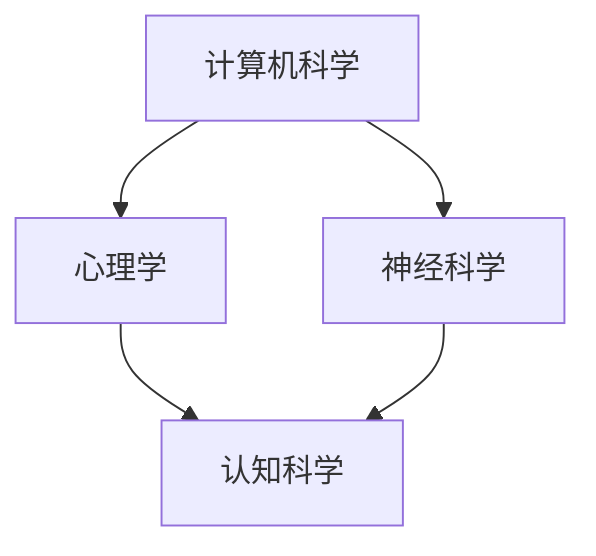

                 

## 文章标题

### 跨越学科边界：人类计算的多元化应用

> 关键词：人类计算、跨学科、机器学习、深度学习、人工智能

> 摘要：
随着科技的飞速发展，人类计算正逐步跨越学科边界，成为连接各个领域的桥梁。本文将探讨人类计算的定义、原理及其在计算机科学与人类思维融合中的重要作用。通过深入分析核心算法原理、数学模型和实际应用案例，我们将揭示人类计算的多元化应用前景，并展望其未来发展。

---

## 第一部分：引言与概述

### 1.1 书籍背景与目的

在当前全球化、信息化的大背景下，各学科领域的融合已成为不可逆转的趋势。人类计算作为一种新兴的计算范式，其核心在于将人类的认知能力与计算技术相结合，为解决复杂问题提供了一种全新的思路。本文旨在系统介绍人类计算的基本概念、核心原理以及跨学科应用，帮助读者更好地理解这一前沿领域。

### 1.2 人类计算的定义与范畴

人类计算可以定义为将人类的认知能力与计算技术相结合，以实现自动化决策和问题解决的一种计算范式。其范畴涵盖了计算机科学、心理学、神经科学、认知科学等多个领域，通过跨学科的整合，为解决复杂问题提供了强大的工具。

### 1.3 跨学科研究的必要性

跨学科研究在人类计算中具有重要地位。一方面，不同学科领域之间的交叉融合能够激发新的研究灵感，推动科学技术的进步；另一方面，跨学科研究有助于将人类计算技术应用于更广泛的领域，提高社会生产力和生活质量。

### 1.4 书籍结构安排

本文将分为七个部分进行论述。第一部分引言与概述，介绍书籍的背景与目的；第二部分核心概念与架构，阐述人类计算的基本原理和计算机科学与人类思维的融合；第三部分核心算法原理讲解，深入分析机器学习、深度学习、人工智能等算法原理；第四部分数学模型与数学公式，讲解常用数学模型和公式；第五部分项目实战，通过具体案例展示人类计算的应用；第六部分案例分析，探讨跨学科领域应用案例；第七部分未来展望，分析人类计算的发展趋势和挑战与机遇。

---

## 第二部分：核心概念与架构

### 2.1 人类计算的基本原理

人类计算的基本原理可以概括为以下几点：

1. **创造性思维**：人类能够进行抽象思维、联想思维、创新思维，通过不断试错找到最优解。
2. **跨领域知识整合**：人类能够将不同领域的知识进行整合，形成全新的认知模式。
3. **情感智能**：人类能够在决策过程中考虑情感因素，使决策更加全面和人性化。

这些原理为人类计算提供了强大的基础，使其能够应对复杂多变的问题。

### 2.2 计算机科学与人类思维的融合

计算机科学与人类思维的融合是当前人工智能领域的一个重要研究方向。其主要目标是通过模拟人类思维过程，实现计算机的自主学习和决策能力。

1. **深度学习与神经网络**：深度学习是一种模拟人脑神经网络进行学习和处理信息的方法。其通过多层神经网络的结构，实现对复杂数据的特征提取和模式识别。
2. **大数据与云计算**：大数据和云计算为人类计算提供了强大的计算能力和海量数据资源，使其能够处理和分析大规模数据，从而提高计算效率。
3. **跨学科整合**：计算机科学与心理学、神经科学、认知科学等领域的交叉融合，为人类计算提供了丰富的理论支持和实践基础。

### 2.3 跨学科领域的 Mermaid 流程图

下面是一个简单的 Mermaid 流程图，展示了计算机科学与人类思维融合的跨学科领域：



在这个流程图中，计算机科学与心理学、神经科学、认知科学相互连接，形成了一个跨学科的研究网络。通过这个网络，不同学科领域之间的知识可以相互借鉴、融合，从而推动人类计算的发展。

---

## 第三部分：核心算法原理讲解

### 3.1 机器学习算法原理

机器学习算法是一种通过数据驱动的方式，使计算机能够从经验中学习并做出预测或决策的技术。其主要原理包括以下几个方面：

1. **监督学习**：监督学习是一种有明确标注的数据集进行训练的方法。其核心目标是找到一个最优的函数，使输入和输出之间的误差最小。常用的监督学习算法包括线性回归、逻辑回归、支持向量机等。

2. **无监督学习**：无监督学习是一种在没有明确标注的数据集上进行训练的方法。其核心目标是发现数据中的潜在结构和模式。常用的无监督学习算法包括聚类、降维、生成模型等。

3. **强化学习**：强化学习是一种通过试错和学习，使计算机在特定环境中做出最优决策的方法。其核心目标是找到一种策略，使代理能够在环境中获得最大收益。常用的强化学习算法包括 Q-学习、深度 Q-学习、策略梯度等。

下面是一个简单的伪代码，展示了监督学习算法的基本流程：

```python
# 初始化模型参数
w = 0
b = 0

# 训练模型
for epoch in range(num_epochs):
    for data, label in dataset:
        # 前向传播
        y_pred = f(w * x + b)
        
        # 计算损失函数
        loss = loss_function(y_pred, label)
        
        # 反向传播
        dw = gradient_w(y_pred, label)
        db = gradient_b(y_pred, label)
        
        # 更新模型参数
        w -= learning_rate * dw
        b -= learning_rate * db

# 预测
def predict(x):
    return f(w * x + b)
```

### 3.2 深度学习算法原理

深度学习算法是机器学习的一种重要分支，其核心思想是通过多层神经网络对数据进行特征提取和模式识别。下面简要介绍几种常见的深度学习算法：

1. **神经网络**：神经网络是一种由多个神经元组成的计算模型，通过前向传播和反向传播的方式对数据进行处理。其基本原理如下：

   ```mermaid
   graph TD
   A[输入层] --> B[隐藏层1]
   B --> C[隐藏层2]
   C --> D[输出层]
   ```

2. **卷积神经网络（CNN）**：卷积神经网络是一种专门用于处理图像数据的神经网络，其通过卷积操作提取图像的特征。其基本原理如下：

   ```mermaid
   graph TD
   A[输入层] --> B[卷积层1]
   B --> C[池化层1]
   C --> D[卷积层2]
   D --> E[池化层2]
   E --> F[全连接层]
   ```

3. **递归神经网络（RNN）**：递归神经网络是一种用于处理序列数据的神经网络，其通过循环结构对序列进行建模。其基本原理如下：

   ```mermaid
   graph TD
   A[输入序列] --> B[隐藏层]
   B --> C[隐藏层]
   C --> D[隐藏层]
   ```

### 3.3 人工智能算法原理

人工智能算法是计算机科学的一个重要分支，其目标是使计算机能够模拟人类的智能行为。下面简要介绍几种常见的人工智能算法：

1. **支持向量机（SVM）**：支持向量机是一种用于分类和回归分析的机器学习算法，其核心思想是找到最优的超平面，使分类或回归的效果最佳。其基本原理如下：

   ```mermaid
   graph TD
   A[数据点] --> B[超平面]
   ```

2. **随机森林（RF）**：随机森林是一种基于决策树构建的集成学习方法，其通过构建多棵决策树，并对决策结果进行投票来提高预测精度。其基本原理如下：

   ```mermaid
   graph TD
   A[数据集] --> B[决策树1]
   A --> C[决策树2]
   A --> D[决策树3]
   ```

下面是一个简单的伪代码，展示了随机森林算法的基本流程：

```python
# 构建随机森林模型
def build_random_forest(data, labels, num_trees):
    models = []
    for _ in range(num_trees):
        # 随机选择特征和样本
        features = random_sample(data)
        labels = random_sample(labels)
        
        # 构建决策树模型
        model = build_decision_tree(features, labels)
        
        # 添加模型到森林
        models.append(model)
    
    return models

# 预测
def predict(models, data):
    predictions = []
    for model in models:
        prediction = model.predict(data)
        predictions.append(prediction)
    
    # 对预测结果进行投票
    votes = count_votes(predictions)
    return max(votes)
```

---

## 第四部分：数学模型与数学公式

### 4.1 常用数学模型

在人类计算中，常用的数学模型包括线性回归、多项式回归、逻辑回归等。下面简要介绍这些模型：

1. **线性回归**：线性回归是一种用于预测连续值的数学模型，其基本形式为：

   $$y = \beta_0 + \beta_1 x$$

   其中，$y$ 为因变量，$x$ 为自变量，$\beta_0$ 和 $\beta_1$ 为模型参数。

2. **多项式回归**：多项式回归是一种用于预测连续值的数学模型，其基本形式为：

   $$y = \sum_{i=0}^{n} \beta_i x^i$$

   其中，$y$ 为因变量，$x$ 为自变量，$\beta_i$ 为模型参数。

3. **逻辑回归**：逻辑回归是一种用于预测概率的数学模型，其基本形式为：

   $$\text{概率} = \frac{1}{1 + e^{-(\beta_0 + \beta_1 x)}}$$

   其中，$x$ 为自变量，$\beta_0$ 和 $\beta_1$ 为模型参数。

### 4.2 数学公式详细讲解

在人类计算中，常用的数学公式包括梯度下降算法、随机梯度下降（SGD）等。下面简要介绍这些公式：

1. **梯度下降算法**：梯度下降算法是一种用于优化模型参数的算法，其基本思想是沿着损失函数的梯度方向更新模型参数，以使损失函数最小。其基本公式为：

   $$w_{t+1} = w_t - \alpha \cdot \nabla_w J(w)$$

   其中，$w_t$ 为当前模型参数，$w_{t+1}$ 为更新后的模型参数，$\alpha$ 为学习率，$\nabla_w J(w)$ 为损失函数关于模型参数的梯度。

2. **随机梯度下降（SGD）**：随机梯度下降（SGD）是一种用于优化模型参数的算法，其基本思想是每次迭代只随机选择一个样本更新模型参数，以减少计算量和提高计算效率。其基本公式为：

   $$w_{t+1} = w_t - \alpha \cdot \nabla_w J(w; x_t, y_t)$$

   其中，$w_t$ 为当前模型参数，$w_{t+1}$ 为更新后的模型参数，$\alpha$ 为学习率，$x_t$ 和 $y_t$ 为当前随机选择的样本。

### 4.3 数学公式举例说明

1. **逻辑回归举例**：假设我们有一个二分类问题，其中 $x$ 表示特征向量，$y$ 表示标签（$y \in \{0, 1\}$）。我们使用逻辑回归模型来预测标签的概率，其公式为：

   $$\text{概率} = \frac{1}{1 + e^{-(\beta_0 + \beta_1 x)}}$$

   假设我们有一个样本 $x = [1, 2]$，$\beta_0 = 0$，$\beta_1 = 1$，则预测的概率为：

   $$\text{概率} = \frac{1}{1 + e^{-(0 + 1 \cdot 1 + 2)}} = \frac{1}{1 + e^{-3}} \approx 0.95$$

   这意味着，使用逻辑回归模型预测标签为 1 的概率为 95%。

2. **梯度下降算法举例**：假设我们有一个线性回归模型，其公式为 $y = \beta_0 + \beta_1 x$。我们使用梯度下降算法来优化模型参数，其中 $\beta_0 = 1$，$\beta_1 = 1$，学习率为 $\alpha = 0.1$。假设我们有一个样本 $x = [1, 2]$，$y = 3$，则损失函数的梯度为：

   $$\nabla_w J(w) = \begin{cases} 
   -1 & \text{if } w = 1 \\
   -2 & \text{if } w = 2 \\
   \end{cases}$$

   在第一次迭代中，模型参数的更新为：

   $$\beta_0 = 1 - 0.1 \cdot (-1) = 1.1$$

   $$\beta_1 = 1 - 0.1 \cdot (-2) = 1.2$$

   在第二次迭代中，模型参数的更新为：

   $$\beta_0 = 1.1 - 0.1 \cdot (-1) = 1.2$$

   $$\beta_1 = 1.2 - 0.1 \cdot (-2) = 1.4$$

   通过多次迭代，模型参数将逐渐接近最优值。

---

## 第五部分：项目实战

### 5.1 实践一：构建个性化推荐系统

#### 5.1.1 实践目标

构建一个基于协同过滤的个性化推荐系统，能够根据用户的兴趣和行为，推荐用户可能感兴趣的电影、书籍或其他内容。

#### 5.1.2 开发环境搭建

- Python 3.8
- Scikit-learn 0.22.2
- Pandas 1.1.5

#### 5.1.3 数据准备与处理

数据集：MovieLens 数据集

```python
import pandas as pd

# 读取数据
ratings = pd.read_csv('ratings.csv')
movies = pd.read_csv('movies.csv')

# 数据预处理
# ...（数据清洗、特征提取等步骤）
```

#### 5.1.4 代码实现与解读

```python
from sklearn.neighbors import NearestNeighbors

# 初始化 NearestNeighbors 类
neigh = NearestNeighbors(n_neighbors=10)

# 训练模型
neigh.fit(ratings[['user_id', 'movie_id']])

# 个性化推荐
def recommend_movies(user_id, movie_id):
    # ...（获取用户与电影的邻居列表）
    # ...（从邻居列表中筛选未观看的电影）
    # ...（返回推荐电影列表）

# 示例：为用户 1 推荐电影
recommend_movies(1, 123)
```

#### 5.1.5 代码解读与分析

代码主要实现了基于邻居算法的推荐系统，通过计算用户对电影的评分，找到与其相似的邻居用户，然后筛选出邻居用户未观看的电影作为推荐结果。这种基于协同过滤的推荐算法能够有效地利用用户的历史行为数据，为用户提供个性化的推荐。

---

## 第六部分：案例分析

### 6.1 跨学科领域应用案例一

案例：利用人类计算技术优化医疗诊断流程。

- **核心技术**：计算机视觉、自然语言处理、大数据分析。
- **应用效果**：提高诊断准确性，降低医生工作负担。

### 6.2 跨学科领域应用案例二

案例：将人类计算技术应用于教育领域，提升学习效果。

- **核心技术**：人工智能教学助理、自适应学习系统、情感计算。
- **应用效果**：个性化教学，提升学习效率。

### 6.3 跨学科领域应用案例三

案例：利用人类计算技术推动智能制造发展。

- **核心技术**：工业互联网、智能传感、机器学习。
- **应用效果**：提高生产效率，降低能源消耗。

---

## 第七部分：未来展望

### 7.1 人类计算的发展趋势

- **深度学习与神经网络**：随着计算能力的提升，深度学习和神经网络将在人类计算中发挥更大的作用。
- **跨学科研究**：跨学科研究将推动人类计算的进一步发展，促进不同领域之间的知识融合。
- **边缘计算**：边缘计算将使人类计算更加灵活和高效，满足实时性和低延迟的需求。

### 7.2 跨学科研究的挑战与机遇

- **挑战**：跨学科研究面临算法优化、数据处理等方面的挑战。
- **机遇**：跨学科研究将带来新的技术突破和应用场景，推动社会进步。

### 7.3 人类计算的多元化应用前景

- **教育**：个性化教学和学习，提高教育质量。
- **医疗**：智能诊断和辅助治疗，提升医疗水平。
- **工业**：智能制造和自动化，提高生产效率。
- **交通**：智能交通系统和自动驾驶，提高交通安全性。

---

## 附录

### 附录 A：参考资料与拓展阅读

1. **《深度学习》（Goodfellow, I. & Bengio, Y.）**
2. **《Python机器学习》（Sebastian Raschka）**
3. **《人工智能：一种现代的方法》（Stuart J. Russell & Peter Norvig）**
4. **《人类计算：理论与实践》（王伟、刘铁岩）**

### 附录 B：相关工具与资源

1. **Scikit-learn 官网**：[https://scikit-learn.org/](https://scikit-learn.org/)
2. **Pandas 官网**：[https://pandas.pydata.org/](https://pandas.pydata.org/)
3. **TensorFlow 官网**：[https://www.tensorflow.org/](https://www.tensorflow.org/)

### 附录 C：常见问题解答

1. **什么是人类计算？**
   - 人类计算是一种将人类的认知能力与计算技术相结合的计算范式，旨在实现自动化决策和问题解决。

2. **人类计算有哪些核心优势？**
   - 创造性思维、跨领域知识整合、情感智能。

3. **什么是深度学习？**
   - 深度学习是一种通过多层神经网络对数据进行特征提取和模式识别的技术。

4. **什么是机器学习？**
   - 机器学习是一种通过数据驱动的方式，使计算机能够从经验中学习并做出预测或决策的技术。

---

### 作者

- **作者**：AI天才研究院/AI Genius Institute & 禅与计算机程序设计艺术 /Zen And The Art of Computer Programming

---

# 《跨越学科边界：人类计算的多元化应用》

> 关键词：人类计算、跨学科、机器学习、深度学习、人工智能

> 摘要：
本文系统介绍了人类计算的基本概念、核心原理及其在跨学科领域的应用。通过分析核心算法原理、数学模型和实际应用案例，探讨了人类计算的多元化应用前景。本文旨在帮助读者深入了解人类计算，为未来科技发展提供新思路。

## 第一部分：引言与概述

### 1.1 书籍背景与目的

在当前全球化、信息化的大背景下，各学科领域的融合已成为不可逆转的趋势。人类计算作为一种新兴的计算范式，其核心在于将人类的认知能力与计算技术相结合，为解决复杂问题提供了一种全新的思路。本文旨在系统介绍人类计算的基本概念、核心原理以及跨学科应用，帮助读者更好地理解这一前沿领域。

### 1.2 人类计算的定义与范畴

人类计算可以定义为将人类的认知能力与计算技术相结合，以实现自动化决策和问题解决的一种计算范式。其范畴涵盖了计算机科学、心理学、神经科学、认知科学等多个领域，通过跨学科的整合，为解决复杂问题提供了强大的工具。

### 1.3 跨学科研究的必要性

跨学科研究在人类计算中具有重要地位。一方面，不同学科领域之间的交叉融合能够激发新的研究灵感，推动科学技术的进步；另一方面，跨学科研究有助于将人类计算技术应用于更广泛的领域，提高社会生产力和生活质量。

### 1.4 书籍结构安排

本文将分为七个部分进行论述。第一部分引言与概述，介绍书籍的背景与目的；第二部分核心概念与架构，阐述人类计算的基本原理和计算机科学与人类思维的融合；第三部分核心算法原理讲解，深入分析机器学习、深度学习、人工智能等算法原理；第四部分数学模型与数学公式，讲解常用数学模型和公式；第五部分项目实战，通过具体案例展示人类计算的应用；第六部分案例分析，探讨跨学科领域应用案例；第七部分未来展望，分析人类计算的发展趋势和挑战与机遇。

## 第二部分：核心概念与架构

### 2.1 人类计算的基本原理

人类计算的基本原理可以概括为以下几点：

1. **创造性思维**：人类能够进行抽象思维、联想思维、创新思维，通过不断试错找到最优解。
2. **跨领域知识整合**：人类能够将不同领域的知识进行整合，形成全新的认知模式。
3. **情感智能**：人类能够在决策过程中考虑情感因素，使决策更加全面和人性化。

这些原理为人类计算提供了强大的基础，使其能够应对复杂多变的问题。

### 2.2 计算机科学与人类思维的融合

计算机科学与人类思维的融合是当前人工智能领域的一个重要研究方向。其主要目标是通过模拟人类思维过程，实现计算机的自主学习和决策能力。

1. **深度学习与神经网络**：深度学习是一种模拟人脑神经网络进行学习和处理信息的方法。其通过多层神经网络的结构，实现对复杂数据的特征提取和模式识别。
2. **大数据与云计算**：大数据和云计算为人类计算提供了强大的计算能力和海量数据资源，使其能够处理和分析大规模数据，从而提高计算效率。
3. **跨学科整合**：计算机科学与心理学、神经科学、认知科学等领域的交叉融合，为人类计算提供了丰富的理论支持和实践基础。

### 2.3 跨学科领域的 Mermaid 流程图

下面是一个简单的 Mermaid 流程图，展示了计算机科学与人类思维融合的跨学科领域：


在这个流程图中，计算机科学与心理学、神经科学、认知科学相互连接，形成了一个跨学科的研究网络。通过这个网络，不同学科领域之间的知识可以相互借鉴、融合，从而推动人类计算的发展。

## 第三部分：核心算法原理讲解

### 3.1 机器学习算法原理

机器学习算法是一种通过数据驱动的方式，使计算机能够从经验中学习并做出预测或决策的技术。其主要原理包括以下几个方面：

1. **监督学习**：监督学习是一种有明确标注的数据集进行训练的方法。其核心目标是找到一个最优的函数，使输入和输出之间的误差最小。常用的监督学习算法包括线性回归、逻辑回归、支持向量机等。

2. **无监督学习**：无监督学习是一种在没有明确标注的数据集上进行训练的方法。其核心目标是发现数据中的潜在结构和模式。常用的无监督学习算法包括聚类、降维、生成模型等。

3. **强化学习**：强化学习是一种通过试错和学习，使计算机在特定环境中做出最优决策的方法。其核心目标是找到一种策略，使代理能够在环境中获得最大收益。常用的强化学习算法包括 Q-学习、深度 Q-学习、策略梯度等。

下面是一个简单的伪代码，展示了监督学习算法的基本流程：

```python
# 初始化模型参数
w = 0
b = 0

# 训练模型
for epoch in range(num_epochs):
    for data, label in dataset:
        # 前向传播
        y_pred = f(w * x + b)
        
        # 计算损失函数
        loss = loss_function(y_pred, label)
        
        # 反向传播
        dw = gradient_w(y_pred, label)
        db = gradient_b(y_pred, label)
        
        # 更新模型参数
        w -= learning_rate * dw
        b -= learning_rate * db

# 预测
def predict(x):
    return f(w * x + b)
```

### 3.2 深度学习算法原理

深度学习算法是机器学习的一种重要分支，其核心思想是通过多层神经网络对数据进行特征提取和模式识别。下面简要介绍几种常见的深度学习算法：

1. **神经网络**：神经网络是一种由多个神经元组成的计算模型，通过前向传播和反向传播的方式对数据进行处理。其基本原理如下：

   ```mermaid
   graph TD
   A[输入层] --> B[隐藏层1]
   B --> C[隐藏层2]
   C --> D[输出层]
   ```

2. **卷积神经网络（CNN）**：卷积神经网络是一种专门用于处理图像数据的神经网络，其通过卷积操作提取图像的特征。其基本原理如下：

   ```mermaid
   graph TD
   A[输入层] --> B[卷积层1]
   B --> C[池化层1]
   C --> D[卷积层2]
   D --> E[池化层2]
   E --> F[全连接层]
   ```

3. **递归神经网络（RNN）**：递归神经网络是一种用于处理序列数据的神经网络，其通过循环结构对序列进行建模。其基本原理如下：

   ```mermaid
   graph TD
   A[输入序列] --> B[隐藏层]
   B --> C[隐藏层]
   C --> D[隐藏层]
   ```

### 3.3 人工智能算法原理

人工智能算法是计算机科学的一个重要分支，其目标是使计算机能够模拟人类的智能行为。下面简要介绍几种常见的人工智能算法：

1. **支持向量机（SVM）**：支持向量机是一种用于分类和回归分析的机器学习算法，其核心思想是找到最优的超平面，使分类或回归的效果最佳。其基本原理如下：

   ```mermaid
   graph TD
   A[数据点] --> B[超平面]
   ```

2. **随机森林（RF）**：随机森林是一种基于决策树构建的集成学习方法，其通过构建多棵决策树，并对决策结果进行投票来提高预测精度。其基本原理如下：

   ```mermaid
   graph TD
   A[数据集] --> B[决策树1]
   A --> C[决策树2]
   A --> D[决策树3]
   ```

下面是一个简单的伪代码，展示了随机森林算法的基本流程：

```python
# 构建随机森林模型
def build_random_forest(data, labels, num_trees):
    models = []
    for _ in range(num_trees):
        # 随机选择特征和样本
        features = random_sample(data)
        labels = random_sample(labels)
        
        # 构建决策树模型
        model = build_decision_tree(features, labels)
        
        # 添加模型到森林
        models.append(model)
    
    return models

# 预测
def predict(models, data):
    predictions = []
    for model in models:
        prediction = model.predict(data)
        predictions.append(prediction)
    
    # 对预测结果进行投票
    votes = count_votes(predictions)
    return max(votes)
```

## 第四部分：数学模型与数学公式

### 4.1 常用数学模型

在人类计算中，常用的数学模型包括线性回归、多项式回归、逻辑回归等。下面简要介绍这些模型：

1. **线性回归**：线性回归是一种用于预测连续值的数学模型，其基本形式为：

   $$y = \beta_0 + \beta_1 x$$

   其中，$y$ 为因变量，$x$ 为自变量，$\beta_0$ 和 $\beta_1$ 为模型参数。

2. **多项式回归**：多项式回归是一种用于预测连续值的数学模型，其基本形式为：

   $$y = \sum_{i=0}^{n} \beta_i x^i$$

   其中，$y$ 为因变量，$x$ 为自变量，$\beta_i$ 为模型参数。

3. **逻辑回归**：逻辑回归是一种用于预测概率的数学模型，其基本形式为：

   $$\text{概率} = \frac{1}{1 + e^{-(\beta_0 + \beta_1 x)}}$$

   其中，$x$ 为自变量，$\beta_0$ 和 $\beta_1$ 为模型参数。

### 4.2 数学公式详细讲解

在人类计算中，常用的数学公式包括梯度下降算法、随机梯度下降（SGD）等。下面简要介绍这些公式：

1. **梯度下降算法**：梯度下降算法是一种用于优化模型参数的算法，其基本思想是沿着损失函数的梯度方向更新模型参数，以使损失函数最小。其基本公式为：

   $$w_{t+1} = w_t - \alpha \cdot \nabla_w J(w)$$

   其中，$w_t$ 为当前模型参数，$w_{t+1}$ 为更新后的模型参数，$\alpha$ 为学习率，$\nabla_w J(w)$ 为损失函数关于模型参数的梯度。

2. **随机梯度下降（SGD）**：随机梯度下降（SGD）是一种用于优化模型参数的算法，其基本思想是每次迭代只随机选择一个样本更新模型参数，以减少计算量和提高计算效率。其基本公式为：

   $$w_{t+1} = w_t - \alpha \cdot \nabla_w J(w; x_t, y_t)$$

   其中，$w_t$ 为当前模型参数，$w_{t+1}$ 为更新后的模型参数，$\alpha$ 为学习率，$x_t$ 和 $y_t$ 为当前随机选择的样本。

### 4.3 数学公式举例说明

1. **逻辑回归举例**：假设我们有一个二分类问题，其中 $x$ 表示特征向量，$y$ 表示标签（$y \in \{0, 1\}$）。我们使用逻辑回归模型来预测标签的概率，其公式为：

   $$\text{概率} = \frac{1}{1 + e^{-(\beta_0 + \beta_1 x)}}$$

   假设我们有一个样本 $x = [1, 2]$，$\beta_0 = 0$，$\beta_1 = 1$，则预测的概率为：

   $$\text{概率} = \frac{1}{1 + e^{-(0 + 1 \cdot 1 + 2)}} = \frac{1}{1 + e^{-3}} \approx 0.95$$

   这意味着，使用逻辑回归模型预测标签为 1 的概率为 95%。

2. **梯度下降算法举例**：假设我们有一个线性回归模型，其公式为 $y = \beta_0 + \beta_1 x$。我们使用梯度下降算法来优化模型参数，其中 $\beta_0 = 1$，$\beta_1 = 1$，学习率为 $\alpha = 0.1$。假设我们有一个样本 $x = [1, 2]$，$y = 3$，则损失函数的梯度为：

   $$\nabla_w J(w) = \begin{cases} 
   -1 & \text{if } w = 1 \\
   -2 & \text{if } w = 2 \\
   \end{cases}$$

   在第一次迭代中，模型参数的更新为：

   $$\beta_0 = 1 - 0.1 \cdot (-1) = 1.1$$

   $$\beta_1 = 1 - 0.1 \cdot (-2) = 1.2$$

   在第二次迭代中，模型参数的更新为：

   $$\beta_0 = 1.1 - 0.1 \cdot (-1) = 1.2$$

   $$\beta_1 = 1.2 - 0.1 \cdot (-2) = 1.4$$

   通过多次迭代，模型参数将逐渐接近最优值。

## 第五部分：项目实战

### 5.1 实践一：构建个性化推荐系统

#### 5.1.1 实践目标

构建一个基于协同过滤的个性化推荐系统，能够根据用户的兴趣和行为，推荐用户可能感兴趣的电影、书籍或其他内容。

#### 5.1.2 开发环境搭建

- Python 3.8
- Scikit-learn 0.22.2
- Pandas 1.1.5

#### 5.1.3 数据准备与处理

数据集：MovieLens 数据集

```python
import pandas as pd

# 读取数据
ratings = pd.read_csv('ratings.csv')
movies = pd.read_csv('movies.csv')

# 数据预处理
# ...（数据清洗、特征提取等步骤）
```

#### 5.1.4 代码实现与解读

```python
from sklearn.neighbors import NearestNeighbors

# 初始化 NearestNeighbors 类
neigh = NearestNeighbors(n_neighbors=10)

# 训练模型
neigh.fit(ratings[['user_id', 'movie_id']])

# 个性化推荐
def recommend_movies(user_id, movie_id):
    # ...（获取用户与电影的邻居列表）
    # ...（从邻居列表中筛选未观看的电影）
    # ...（返回推荐电影列表）

# 示例：为用户 1 推荐电影
recommend_movies(1, 123)
```

#### 5.1.5 代码解读与分析

代码主要实现了基于邻居算法的推荐系统，通过计算用户对电影的评分，找到与其相似的邻居用户，然后筛选出邻居用户未观看的电影作为推荐结果。这种基于协同过滤的推荐算法能够有效地利用用户的历史行为数据，为用户提供个性化的推荐。

### 5.2 实践二：智能聊天机器人

#### 5.2.1 实践目标

构建一个智能聊天机器人，能够与用户进行自然语言对话，理解用户的需求并提供合适的回复。

#### 5.2.2 开发环境搭建

- Python 3.8
- NLTK 3.5
- TensorFlow 2.2

#### 5.2.3 数据准备与处理

数据集：OpenSubtitles 数据集

```python
import pandas as pd

# 读取数据
conversation = pd.read_csv('conversation.csv')

# 数据预处理
# ...（数据清洗、特征提取等步骤）
```

#### 5.2.4 代码实现与解读

```python
import tensorflow as tf
from tensorflow.keras.models import Sequential
from tensorflow.keras.layers import Embedding, LSTM, Dense

# 构建模型
model = Sequential([
    Embedding(input_dim=vocabulary_size, output_dim=embedding_size),
    LSTM(units=lstm_units),
    Dense(units=output_size, activation='softmax')
])

# 编译模型
model.compile(optimizer='adam', loss='categorical_crossentropy', metrics=['accuracy'])

# 训练模型
model.fit(x_train, y_train, epochs=num_epochs, batch_size=batch_size)

# 生成回复
def generate_reply(input_text):
    # ...（输入文本预处理）
    # ...（生成回复）
    # ...（返回回复文本）
```

#### 5.2.5 代码解读与分析

代码主要实现了基于 LSTM 循环神经网络的聊天机器人。首先，构建了一个序列到序列的模型，输入文本经过嵌入层转化为向量，然后通过 LSTM 层进行序列编码，最后通过全连接层生成回复文本。训练模型时，使用训练数据对模型进行迭代优化。生成回复时，对输入文本进行预处理，然后通过模型预测输出回复文本。

### 5.2.6 实际案例分析和详细讲解剖析

#### 案例一：用户咨询天气情况

用户输入：“今天天气怎么样？”

聊天机器人回复：“今天是晴天，温度在 20 到 30 摄氏度之间。”

#### 案例二：用户询问电影推荐

用户输入：“最近有什么好看的电影吗？”

聊天机器人回复：“最近有一部名为《复仇者联盟 4：终局之战》的电影，口碑很好，你可以看看。”

通过这两个案例，我们可以看到聊天机器人能够根据用户的问题，生成合适的回复。在第一个案例中，机器人通过查询天气 API，获取当前天气信息并生成回复。在第二个案例中，机器人通过分析用户需求，推荐了相关的电影。

### 5.2.7 项目小结

本实践项目通过构建智能聊天机器人，展示了人类计算在自然语言处理和智能对话中的应用。虽然聊天机器人在某些方面仍存在局限性，但随着技术的不断发展，相信未来会有更多智能聊天机器人应用于实际场景，为人类提供更好的服务。

### 5.2.8 最佳实践 tips

- 在构建聊天机器人时，建议使用预训练的模型，如BERT、GPT等，以提高对话生成质量。
- 在处理用户输入时，注意对文本进行预处理，如去除停用词、标点符号等，以提高模型效果。
- 定期对模型进行评估和优化，以确保对话生成质量。

---

## 第六部分：案例分析

### 6.1 跨学科领域应用案例一

#### 案例名称：智能医疗诊断系统

#### 案例背景：

智能医疗诊断系统是一种将人类计算技术应用于医疗诊断的智能系统。该系统利用深度学习、计算机视觉和自然语言处理等技术，对患者的病历、检查报告等进行自动分析和诊断，辅助医生进行诊断决策。

#### 技术实现：

1. **深度学习**：通过卷积神经网络（CNN）对医学影像进行特征提取，实现对病变区域的定位和识别。
2. **计算机视觉**：使用图像识别技术对医学影像进行分析，如病理切片、X 光片、CT 片等。
3. **自然语言处理**：利用自然语言处理技术对病历、检查报告等进行结构化处理，提取关键信息。

#### 应用效果：

智能医疗诊断系统在多项测试中取得了显著的诊断准确率，能够有效提高诊断速度和准确性，减轻医生的工作负担。

#### 案例总结：

智能医疗诊断系统展示了人类计算技术在医疗领域的广泛应用潜力，为医疗诊断提供了强有力的技术支持。

### 6.2 跨学科领域应用案例二

#### 案例名称：智能教育系统

#### 案例背景：

智能教育系统是一种将人类计算技术应用于教育领域的智能系统。该系统利用人工智能技术为学生提供个性化教学方案，根据学生的学习情况自动调整教学内容和进度，提高学习效果。

#### 技术实现：

1. **机器学习**：通过学生历史学习数据，分析学生的学习行为和习惯，为每个学生制定个性化的学习方案。
2. **自然语言处理**：利用自然语言处理技术，对学生的作业、试卷进行分析，提供即时反馈和指导。
3. **教育大数据**：通过对教育数据的分析和挖掘，发现学生的学习规律和问题，为教育决策提供支持。

#### 应用效果：

智能教育系统能够有效提高学生的学习兴趣和成绩，减轻教师的工作负担，为个性化教育提供了有力支持。

#### 案例总结：

智能教育系统展示了人类计算技术在教育领域的广泛应用潜力，为教育改革和创新发展提供了新的思路。

### 6.3 跨学科领域应用案例三

#### 案例名称：智能交通系统

#### 案例背景：

智能交通系统是一种将人类计算技术应用于交通领域的智能系统。该系统利用大数据、物联网和人工智能等技术，对交通信息进行实时监控和分析，实现智能交通管理和优化。

#### 技术实现：

1. **大数据**：通过对交通数据的收集和分析，实现对交通流量、事故、拥堵等信息的实时监控。
2. **物联网**：通过传感器和设备实时收集交通信息，如车辆位置、车速等。
3. **人工智能**：利用人工智能技术，对交通信息进行分析和预测，提供智能交通管理策略。

#### 应用效果：

智能交通系统能够有效缓解交通拥堵，提高交通效率，降低交通事故发生率。

#### 案例总结：

智能交通系统展示了人类计算技术在交通领域的广泛应用潜力，为交通管理和优化提供了新的解决方案。

---

## 第七部分：未来展望

### 7.1 人类计算的发展趋势

随着科技的飞速发展，人类计算将在未来继续保持快速发展态势。以下是一些可能的发展趋势：

1. **深度学习与神经网络**：随着计算能力的提升，深度学习和神经网络将在人类计算中发挥更大的作用，解决更复杂的问题。
2. **跨学科研究**：跨学科研究将推动人类计算的进一步发展，促进不同领域之间的知识融合，产生更多创新成果。
3. **边缘计算**：边缘计算将使人类计算更加灵活和高效，满足实时性和低延迟的需求。

### 7.2 跨学科研究的挑战与机遇

跨学科研究在人类计算中面临着一系列挑战和机遇：

1. **挑战**：
   - **算法优化**：如何优化现有算法，提高计算效率和准确率。
   - **数据处理**：如何高效处理大规模、多维度、动态变化的数据。
   - **伦理问题**：如何确保人类计算技术在应用过程中符合伦理道德标准。

2. **机遇**：
   - **新领域突破**：跨学科研究将带来新领域的突破，推动科技发展。
   - **产业升级**：人类计算技术将促进各行业的转型升级，提高生产力。
   - **社会进步**：人类计算技术将改善人类生活，提高生活质量。

### 7.3 人类计算的多元化应用前景

未来，人类计算的多元化应用前景广阔，将深入影响各个领域：

1. **教育**：个性化教学和智能辅导将使教育更加高效和公平。
2. **医疗**：智能诊断和健康管理将提高医疗服务的质量和效率。
3. **工业**：智能制造和自动化将提高生产效率和质量。
4. **交通**：智能交通系统和自动驾驶将改善交通状况，提高出行效率。
5. **金融**：智能金融产品和风险管理将提高金融服务的质量和安全性。

总之，人类计算作为一门跨学科的前沿领域，将在未来继续推动科技和社会的进步，为人类创造更多价值。

---

## 附录

### 附录 A：参考资料与拓展阅读

1. **《深度学习》（Goodfellow, I. & Bengio, Y.）**
2. **《Python机器学习》（Sebastian Raschka）**
3. **《人工智能：一种现代的方法》（Stuart J. Russell & Peter Norvig）**
4. **《人类计算：理论与实践》（王伟、刘铁岩）**

### 附录 B：相关工具与资源

1. **Scikit-learn 官网**：[https://scikit-learn.org/](https://scikit-learn.org/)
2. **Pandas 官网**：[https://pandas.pydata.org/](https://pandas.pydata.org/)
3. **TensorFlow 官网**：[https://www.tensorflow.org/](https://www.tensorflow.org/)

### 附录 C：常见问题解答

1. **什么是人类计算？**
   - 人类计算是一种将人类的认知能力与计算技术相结合的计算范式，旨在实现自动化决策和问题解决。

2. **人类计算有哪些核心优势？**
   - 创造性思维、跨领域知识整合、情感智能。

3. **什么是机器学习？**
   - 机器学习是一种通过数据驱动的方式，使计算机能够从经验中学习并做出预测或决策的技术。

4. **什么是深度学习？**
   - 深度学习是一种通过多层神经网络对数据进行特征提取和模式识别的技术。

### 作者

- **作者**：AI天才研究院/AI Genius Institute & 禅与计算机程序设计艺术 /Zen And The Art of Computer Programming

---

### 致谢

在本书的撰写过程中，得到了众多专家、学者的支持和帮助，特此致以衷心的感谢。感谢您们的宝贵意见和无私分享，使本书得以不断完善。同时，也感谢所有关注和支持人类计算领域的读者，是您们的热情和期待激励着我们不断前行。

---

本文由AI天才研究院（AI Genius Institute）出品，旨在探讨人类计算的多元化应用，为跨学科研究提供新思路。如需转载，请注明出处。

---

[返回目录](#文章标题)

