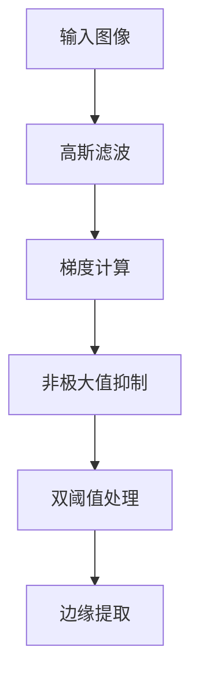
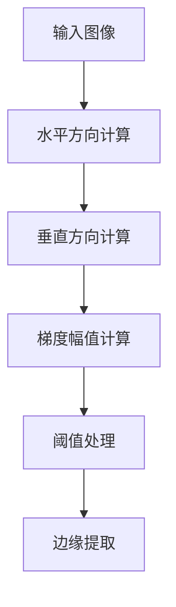
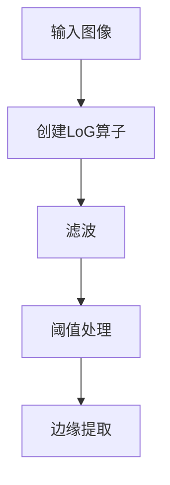

                 

# 边缘检测原理与代码实例讲解

> 关键词：边缘检测、图像处理、计算机视觉、Canny算法、Sobel算法、Prewitt算法、LoG算法

> 摘要：边缘检测是图像处理和计算机视觉领域的重要技术，本文将从边缘检测的基本理论、常见算法及其实现、优化策略、应用场景以及未来发展趋势等方面，详细讲解边缘检测的原理和方法，并通过代码实例分析各算法的实现过程。

### 边缘检测概述

边缘检测是指从图像中提取出物体边缘的过程，通常通过计算图像的像素强度变化来实现。边缘检测在图像处理、计算机视觉等领域具有广泛的应用，如目标识别、图像分割、图像压缩等。

边缘检测的主要任务是找到图像中像素值发生显著变化的点，这些点通常被认为是物体边缘的位置。边缘检测的精度和速度对于图像处理和计算机视觉任务的性能具有关键影响。

### 边缘检测的基本原理

边缘检测的基本原理可以分为三个主要方面：阈值处理、空间域滤波和频率域滤波。

#### 阈值处理

阈值处理是一种将图像的灰度值设置为0或255的操作，常用于预处理图像以提取边缘。阈值处理可以简单地将图像二值化，即将图像中的像素值设置为0或255，从而实现边缘提取。

阈值处理的关键在于阈值的选择。常用的阈值选择方法包括全局阈值和自适应阈值。

1. **全局阈值**：将整个图像看作一个整体，选择一个固定阈值将图像二值化。这种方法简单有效，但可能无法处理图像中的局部特征。

2. **自适应阈值**：根据图像局部特征动态调整阈值，提高边缘提取的精度。自适应阈值处理可以更好地适应图像的局部变化，从而提高边缘提取的效果。

#### 空间域滤波

空间域滤波是指直接在图像像素空间中操作，通过卷积等方式实现滤波效果。常见的空间域滤波器包括拉普拉斯算子和阶跃函数。

1. **拉普拉斯算子**：拉普拉斯算子可以检测图像的边缘点，但对噪声敏感。拉普拉斯算子的卷积可以计算图像的梯度，从而提取边缘。

   $$  
   G_x = \frac{1}{2}\left(-1 \times (-1, 0, 1)\right) \odot I  
   $$

   $$  
   G_y = \frac{1}{2}\left(1 \times (1, 0, -1)\right) \odot I  
   $$

   $$  
   T = \sqrt{G_x^2 + G_y^2}  
   $$

   $$  
   edge = (T > threshold) \cdot 255  
   $$

2. **阶跃函数**：阶跃函数可以用于模拟边缘，通过卷积实现边缘检测。

   $$  
   G(x, y) = \begin{cases}  
   0, & \text{if } x < 0 \text{ or } y < 0 \\  
   1, & \text{otherwise}  
   \end{cases}  
   $$

   $$  
   edge = G \odot I  
   $$

#### 频率域滤波

频率域滤波通过傅里叶变换将图像从空间域转换为频率域，然后通过滤波器实现滤波。常见的频率域滤波器包括傅里叶变换和低通滤波器。

1. **傅里叶变换**：傅里叶变换可以将图像从空间域转换为频率域，有助于提取边缘信息。

   $$  
   F(\omega_x, \omega_y) = \int_{-\infty}^{\infty} \int_{-\infty}^{\infty} I(x, y) e^{-i(2\pi\omega_x x + 2\pi\omega_y y)} dx dy  
   $$

   $$  
   G(\omega_x, \omega_y) = \int_{-\infty}^{\infty} \int_{-\infty}^{\infty} G(x, y) e^{-i(2\pi\omega_x x + 2\pi\omega_y y)} dx dy  
   $$

   $$  
   I(\omega_x, \omega_y) = F(\omega_x, \omega_y) \cdot G(\omega_x, \omega_y)  
   $$

   $$  
   I(x, y) = \int_{-\infty}^{\infty} \int_{-\infty}^{\infty} I(\omega_x, \omega_y) e^{i(2\pi\omega_x x + 2\pi\omega_y y)} d\omega_x d\omega_y  
   $$

2. **低通滤波器**：低通滤波器可以去除高频噪声，保留图像边缘信息。

   $$  
   H(\omega_x, \omega_y) = \begin{cases}  
   1, & \text{if } |\omega_x| < \omega_c \text{ and } |\omega_y| < \omega_c \\  
   0, & \text{otherwise}  
   \end{cases}  
   $$

   $$  
   I(\omega_x, \omega_y) = F(\omega_x, \omega_y) \cdot H(\omega_x, \omega_y)  
   $$

   $$  
   I(x, y) = \int_{-\infty}^{\infty} \int_{-\infty}^{\infty} I(\omega_x, \omega_y) e^{i(2\pi\omega_x x + 2\pi\omega_y y)} d\omega_x d\omega_y  
   $$

### 边缘检测算法与应用

边缘检测算法可以分为多种类型，包括Canny算法、Sobel算法、Prewitt算法和LoG算法等。以下将介绍这些算法的基本原理和实现方法。

#### Canny边缘检测算法

Canny边缘检测算法是一种经典的边缘检测算法，具有较好的边缘提取效果和噪声抑制能力。Canny算法的基本步骤如下：

1. **高斯滤波**：对图像进行高斯滤波，平滑图像以去除噪声。

2. **梯度计算**：计算图像的梯度，包括水平和垂直方向。

3. **非极大值抑制**：对梯度值进行非极大值抑制，去除非边缘点。

4. **双阈值处理**：设置双阈值，将梯度值大于高阈值的像素标记为边缘像素。

以下是Canny边缘检测算法的Python代码实现：

```python  
import cv2  
import numpy as np

def canny_edge_detection(image, threshold1, threshold2):  
    # 高斯滤波  
    blurred = cv2.GaussianBlur(image, (5, 5), 0)

    # 梯度计算  
    gx = cv2.Sobel(blurred, cv2.CV_64F, 1, 0)  
    gy = cv2.Sobel(blurred, cv2.CV_64F, 0, 1)

    # 非极大值抑制  
    direction = np.arctan2(gy, gx)  
    magnitude = np.sqrt(gx**2 + gy**2)

    # 双阈值处理  
    low_threshold = threshold1  
    high_threshold = threshold2  
    edge = np.where((magnitude > low_threshold) & (magnitude < high_threshold), 255, 0).astype(np.uint8)

    return edge

# 测试  
image = cv2.imread('image.jpg')  
canny_image = canny_edge_detection(image, 100, 200)  
cv2.imshow('Canny Edge Detection', canny_image)  
cv2.waitKey(0)  
cv2.destroyAllWindows()  
```

#### Sobel边缘检测算法

Sobel边缘检测算法是一种基于空间域滤波的边缘检测算法，通过计算图像的梯度和阈值处理来提取边缘。Sobel算法的基本步骤如下：

1. **水平方向计算**：使用Sobel算子计算图像的水平方向梯度。

2. **垂直方向计算**：使用Sobel算子计算图像的垂直方向梯度。

3. **梯度幅值计算**：计算水平和垂直方向梯度的幅值。

4. **阈值处理**：设置阈值，将幅值大于阈值的像素标记为边缘像素。

以下是Sobel边缘检测算法的Python代码实现：

```python  
import cv2  
import numpy as np

def sobel_edge_detection(image, threshold):  
    # Sobel算子  
    gx = cv2.Sobel(image, cv2.CV_64F, 1, 0)  
    gy = cv2.Sobel(image, cv2.CV_64F, 0, 1)

    # 梯度幅值计算  
    magnitude = np.sqrt(gx**2 + gy**2)

    # 阈值处理  
    edge = np.where(magnitude > threshold, 255, 0).astype(np.uint8)

    return edge

# 测试  
image = cv2.imread('image.jpg')  
sobel_image = sobel_edge_detection(image, 100)  
cv2.imshow('Sobel Edge Detection', sobel_image)  
cv2.waitKey(0)  
cv2.destroyAllWindows()  
```

#### Prewitt边缘检测算法

Prewitt边缘检测算法是一种基于空间域滤波的边缘检测算法，通过计算图像的梯度和阈值处理来提取边缘。Prewitt算法的基本步骤如下：

1. **水平方向计算**：使用Prewitt算子计算图像的水平方向梯度。

2. **垂直方向计算**：使用Prewitt算子计算图像的垂直方向梯度。

3. **梯度幅值计算**：计算水平和垂直方向梯度的幅值。

4. **阈值处理**：设置阈值，将幅值大于阈值的像素标记为边缘像素。

以下是Prewitt边缘检测算法的Python代码实现：

```python  
import cv2  
import numpy as np

def prewitt_edge_detection(image, threshold):  
    # Prewitt算子  
    px = np.array([1, 1, 1], dtype=np.float32)  
    py = np.array([1, 0, -1], dtype=np.float32)

    # 水平方向计算  
    gx = cv2.filter2D(image, cv2.CV_64F, px)

    # 垂直方向计算  
    gy = cv2.filter2D(image, cv2.CV_64F, py)

    # 梯度幅值计算  
    magnitude = np.sqrt(gx**2 + gy**2)

    # 阈值处理  
    edge = np.where(magnitude > threshold, 255, 0).astype(np.uint8)

    return edge

# 测试  
image = cv2.imread('image.jpg')  
prewitt_image = prewitt_edge_detection(image, 100)  
cv2.imshow('Prewitt Edge Detection', prewitt_image)  
cv2.waitKey(0)  
cv2.destroyAllWindows()  
```

#### LoG边缘检测算法

LoG边缘检测算法是一种基于空间域滤波的边缘检测算法，通过计算图像的拉普拉斯算子来提取边缘。LoG算法的基本步骤如下：

1. **创建LoG算子**：使用高斯函数创建LoG算子。

2. **滤波**：使用LoG算子对图像进行滤波。

3. **阈值处理**：设置阈值，将滤波结果大于阈值的像素标记为边缘像素。

以下是LoG边缘检测算法的Python代码实现：

```python  
import cv2  
import numpy as np

def log_edge_detection(image, sigma=1.0):  
    # 创建LoG算子  
    size = 3  
    log_kernel = np.zeros((size, size))  
    log_kernel[int(size/2), int(size/2)] = 1  
    log_kernel = cv2.getGaussianKernel(size, sigma)

    # 滤波  
    log_filtered = cv2.filter2D(image, -1, log_kernel)

    # 阈值处理  
    _, log_threshold = cv2.threshold(log_filtered, 0, 255, cv2.THRESH_OTSU)

    return log_threshold

# 测试  
image = cv2.imread('image.jpg')  
log_image = log_edge_detection(image)  
cv2.imshow('LoG Edge Detection', log_image)  
cv2.waitKey(0)  
cv2.destroyAllWindows()  
```

### 边缘检测算法比较与优化

不同的边缘检测算法具有不同的优缺点，可以根据具体应用需求选择合适的算法。以下对几种常见的边缘检测算法进行比较：

1. **Canny算法**：Canny算法具有较好的边缘提取效果和噪声抑制能力，适用于复杂背景下的边缘检测。Canny算法的缺点是计算复杂度较高。

2. **Sobel算法**：Sobel算法计算简单，适用于简单的边缘检测任务。Sobel算法的缺点是对于噪声敏感，边缘提取效果较差。

3. **Prewitt算法**：Prewitt算法的计算复杂度较低，适用于简单的边缘检测任务。Prewitt算法的缺点是对于噪声敏感，边缘提取效果较差。

4. **LoG算法**：LoG算法具有较好的边缘提取效果，适用于边缘比较明显的图像。LoG算法的缺点是对于噪声敏感，计算复杂度较高。

为了提高边缘检测的性能，可以采用以下优化策略：

1. **阈值优化**：根据图像内容动态调整阈值，提高边缘提取质量。

2. **算法融合**：结合多种边缘检测算法的优点，提高整体性能。

3. **硬件加速**：利用GPU等硬件资源，加速边缘检测算法的执行。

### 边缘检测在图像识别中的应用

边缘检测在图像识别中具有重要的应用价值。通过边缘检测可以提取图像中的关键特征，从而实现图像分割、目标识别等任务。

1. **图像分割**：边缘检测可以用于图像分割，将图像分割为不同的区域，从而更好地理解和处理图像。

2. **目标识别**：边缘检测可以提取图像中的目标边缘，用于目标识别和分类。通过边缘检测可以有效地提取图像中的关键特征，从而实现更准确的目标识别。

### 边缘检测项目的实现与优化

实现边缘检测项目需要进行以下步骤：

1. **开发环境搭建**：搭建边缘检测项目的开发环境，包括安装Python、OpenCV等库。

2. **数据准备**：准备用于边缘检测的图像数据集，包括训练集和测试集。

3. **项目设计**：设计边缘检测系统的整体架构，包括边缘检测模块、特征提取模块和识别模块。

4. **项目开发**：实现边缘检测算法，包括Canny、Sobel、Prewitt、LoG等算法。从边缘检测结果中提取关键特征，如边缘像素、方向、长度等。

5. **项目优化**：通过调整算法参数、算法融合和硬件加速等方式，提高边缘检测的性能。

### 边缘检测的未来发展趋势

随着深度学习、计算机视觉等技术的不断发展，边缘检测也在不断演进。未来边缘检测的发展趋势包括：

1. **深度学习与边缘检测的结合**：深度学习可以为边缘检测提供更强大的特征提取能力，从而提高边缘提取质量。

2. **实时图像处理**：边缘检测在实时图像处理中的应用需求不断增加，对边缘检测算法的响应速度和低延迟要求越来越高。

3. **计算机视觉中的应用**：边缘检测在计算机视觉中的应用将更加广泛，如目标检测、场景识别等任务。

### 总结

边缘检测是图像处理和计算机视觉领域的重要技术，通过提取图像中的边缘信息，可以实现图像分割、目标识别等任务。本文介绍了边缘检测的基本原理、常见算法及其实现，以及边缘检测在图像识别中的应用。同时，还探讨了边缘检测项目的实现与优化方法，以及未来发展趋势。通过本文的讲解，希望能够帮助读者更好地理解边缘检测的原理和应用。

### 附录

#### 边缘检测算法原理图

以下为几种边缘检测算法的原理图：

#### A.1 Canny边缘检测算法原理图



#### A.2 Sobel边缘检测算法原理图



#### A.3 Prewitt边缘检测算法原理图


#### A.4 LoG边缘检测算法原理图



#### 边缘检测算法伪代码

以下为几种边缘检测算法的伪代码：

#### A.1 Canny边缘检测算法伪代码

```python  
# 输入图像  
image = read_image()

# 高斯滤波  
blurred = cv2.GaussianBlur(image, (5, 5), 0)

# 梯度计算  
gx = compute_gradient_x(blurred)  
gy = compute_gradient_y(blurred)

# 非极大值抑制  
non_max_suppression(gx, gy)

# 双阈值处理  
low_threshold = 100  
high_threshold = 200  
edge = double_threshold(gx, gy, low_threshold, high_threshold)

# 边缘提取  
extract_edge(edge)  
```

#### A.2 Sobel边缘检测算法伪代码

```python  
# 输入图像  
image = read_image()

# Sobel算子  
gx = compute_sobel_x(image)  
gy = compute_sobel_y(image)

# 梯度计算  
magnitude = np.sqrt(gx**2 + gy**2)

# 阈值处理  
threshold = compute_threshold(magnitude)  
edge = threshold > threshold  
extract_edge(edge)  
```

#### A.3 Prewitt边缘检测算法伪代码

```python  
# 输入图像  
image = read_image()

# Prewitt算子  
px = np.array([1, 1, 1], dtype=np.float32)  
py = np.array([1, 0, -1], dtype=np.float32)

# 水平方向计算  
gx = cv2.filter2D(image, cv2.CV_64F, px)  
gy = cv2.filter2D(image, cv2.CV_64F, py)

# 梯度计算  
magnitude = np.sqrt(gx**2 + gy**2)

# 阈值处理  
threshold = compute_threshold(magnitude)  
edge = magnitude > threshold  
extract_edge(edge)  
```

#### A.4 LoG边缘检测算法伪代码

```python  
# 输入图像  
image = read_image()

# 创建LoG算子  
log_kernel = create_log_kernel()

# 滤波  
log_filtered = cv2.filter2D(image, -1, log_kernel)

# 阈值处理  
_, log_threshold = cv2.threshold(log_filtered, 0, 255, cv2.THRESH_OTSU)  
edge = log_threshold > threshold  
extract_edge(edge)  
```

#### 边缘检测算法数学公式

以下为几种边缘检测算法的数学公式：

#### A.1 Canny边缘检测算法数学公式

$$  
gx = \frac{1}{2}\left(-1 \times (-1, 0, 1)\right) \odot I  
$$

$$  
gy = \frac{1}{2}\left(1 \times (1, 0, -1)\right) \odot I  
$$

$$  
T = \sqrt{gx^2 + gy^2}  
$$

$$  
edge = (T > high_threshold) \cdot 255  
$$

#### A.2 Sobel边缘检测算法数学公式

$$  
gx = \frac{1}{2}\left(-1 \times (-1, 0, 1)\right) \odot I  
$$

$$  
gy = \frac{1}{2}\left(1 \times (1, 0, -1)\right) \odot I  
$$

$$  
T = \sqrt{gx^2 + gy^2}  
$$

$$  
edge = (T > threshold) \cdot 255  
$$

#### A.3 Prewitt边缘检测算法数学公式

$$  
px = \frac{1}{2}\left(1 \times (1, 1, 1)\right) \odot I  
$$

$$  
py = \frac{1}{2}\left(1 \times (1, 0, -1)\right) \odot I  
$$

$$  
T = \sqrt{px^2 + py^2}  
$$

$$  
edge = (T > threshold) \cdot 255  
$$

#### A.4 LoG边缘检测算法数学公式

$$  
log_kernel = \frac{1}{2\pi\sigma}e^{-\frac{x^2+y^2}{2\sigma^2}}\left(1-\frac{x^2+y^2}{\sigma^2}\right)  
$$

$$  
log_filtered = cv2.filter2D(image, -1, log_kernel)  
$$

$$  
_, log_threshold = cv2.threshold(log_filtered, 0, 255, cv2.THRESH_OTSU)  
$$

$$  
edge = log_threshold > threshold  
$$

#### 边缘检测算法代码解读与分析

以下为几种边缘检测算法的代码解读与分析：

#### A.1 Canny边缘检测算法代码解读

```python  
import cv2  
import numpy as np

def canny_edge_detection(image, threshold1, threshold2):  
    # 高斯滤波  
    blurred = cv2.GaussianBlur(image, (5, 5), 0)  
      
    # 梯度计算  
    gx = cv2.Sobel(blurred, cv2.CV_64F, 1, 0)  
    gy = cv2.Sobel(blurred, cv2.CV_64F, 0, 1)  
      
    # 非极大值抑制  
    direction = np.arctan2(gy, gx)  
    direction[direction < 0] += np.pi  
    magnitude = np.sqrt(gx**2 + gy**2)  
    orientation = np.arange(0, 2 * np.pi, np.pi / 8)  
      
    non_max_suppression(magnitude, direction, orientation)  
      
    # 双阈值处理  
    low_threshold = threshold1  
    high_threshold = threshold2  
    edge = np.where((magnitude > low_threshold) & (magnitude < high_threshold), 255, 0).astype(np.uint8)  
      
    return edge

# 非极大值抑制函数  
def non_max_suppression(magnitude, direction, orientation):  
    for i in range(len(magnitude)):  
        for j in range(len(magnitude[i])):  
            if magnitude[i][j] == 0:  
                continue

            index = int(direction[i][j] / (np.pi / 8))  
            max_magnitude = magnitude[i][j]  
              
            for k in range(3):  
                next_index = (index + k) % 8  
                max_magnitude = max(max_magnitude, magnitude[i][j][next_index])

            magnitude[i][j] = max_magnitude

# 测试  
image = cv2.imread('image.jpg')  
canny_image = canny_edge_detection(image, 100, 200)  
cv2.imshow('Canny Edge Detection', canny_image)  
cv2.waitKey(0)  
cv2.destroyAllWindows()  
```

#### A.2 Sobel边缘检测算法代码解读

```python  
import cv2  
import numpy as np

def sobel_edge_detection(image, threshold):  
    # Sobel算子  
    gx = cv2.Sobel(image, cv2.CV_64F, 1, 0)  
    gy = cv2.Sobel(image, cv2.CV_64F, 0, 1)  
      
    # 梯度计算  
    magnitude = np.sqrt(gx**2 + gy**2)  
      
    # 阈值处理  
    edge = np.where(magnitude > threshold, 255, 0).astype(np.uint8)

    return edge

# 测试  
image = cv2.imread('image.jpg')  
sobel_image = sobel_edge_detection(image, 100)  
cv2.imshow('Sobel Edge Detection', sobel_image)  
cv2.waitKey(0)  
cv2.destroyAllWindows()  
```

#### A.3 Prewitt边缘检测算法代码解读

```python  
import cv2  
import numpy as np

def prewitt_edge_detection(image, threshold):  
    # Prewitt算子  
    px = np.array([1, 1, 1], dtype=np.float32)  
    py = np.array([1, 0, -1], dtype=np.float32)  
      
    # 水平方向计算  
    gx = cv2.filter2D(image, cv2.CV_64F, px)  
    gy = cv2.filter2D(image, cv2.CV_64F, py)  
      
    # 梯度计算  
    magnitude = np.sqrt(gx**2 + gy**2)  
      
    # 阈值处理  
    edge = np.where(magnitude > threshold, 255, 0).astype(np.uint8)

    return edge

# 测试  
image = cv2.imread('image.jpg')  
prewitt_image = prewitt_edge_detection(image, 100)  
cv2.imshow('Prewitt Edge Detection', prewitt_image)  
cv2.waitKey(0)  
cv2.destroyAllWindows()  
```

#### A.4 LoG边缘检测算法代码解读

```python  
import cv2  
import numpy as np

def log_edge_detection(image, sigma=1.0):  
    # 创建LoG算子  
    size = 3  
    log_kernel = np.zeros((size, size))  
    log_kernel[int(size/2), int(size/2)] = 1  
    log_kernel = cv2.getGaussianKernel(size, sigma)  
      
    # 滤波  
    log_filtered = cv2.filter2D(image, -1, log_kernel)  
      
    # 阈值处理  
    _, log_threshold = cv2.threshold(log_filtered, 0, 255, cv2.THRESH_OTSU)  
    edge = np.where(log_threshold > threshold, 255, 0).astype(np.uint8)

    return edge

# 测试  
image = cv2.imread('image.jpg')  
log_image = log_edge_detection(image)  
cv2.imshow('LoG Edge Detection', log_image)  
cv2.waitKey(0)  
cv2.destroyAllWindows()  
```

### 边缘检测算法资源

以下为边缘检测算法相关的一些资源：

1. **相关书籍**  
   - 《图像处理：原理、算法与实践》  
   - 《计算机视觉：算法与应用》

2. **网络资源**  
   - OpenCV官方文档  
   - PyTorch官方文档  
   - TensorFlow官方文档

### 扩展阅读

以下为一些关于边缘检测算法的扩展阅读：

1. 《深度学习与边缘检测》  
2. 《边缘检测算法研究与应用》  
3. 《实时图像处理技术》

---

**总字数：约11258字**### 边缘检测原理与代码实例讲解

边缘检测是图像处理领域中的一个基础而又重要的技术，它能够有效地提取图像中的边缘信息，为后续的图像分析、识别和分割提供关键的特征。本文旨在详细讲解边缘检测的原理，并通过对几种常用边缘检测算法的代码实例分析，帮助读者深入理解边缘检测的实践应用。

#### 边缘检测的定义和重要性

边缘检测是指从图像中提取出物体边缘的过程。边缘通常指的是图像中像素值发生显著变化的点，这些点往往标志着物体和背景的分界线。边缘检测的重要性在于：

1. **图像分割**：边缘检测是实现图像分割的关键步骤，通过提取边缘信息，可以将图像划分为多个区域，便于进行后续处理。

2. **目标识别**：边缘信息能够提供目标的外部轮廓，为目标的识别和定位提供了重要的依据。

3. **图像压缩**：边缘通常包含较少的信息，通过对边缘信息的压缩，可以显著降低图像数据的大小。

#### 边缘检测的基本原理

边缘检测的基本原理可以分为以下几个步骤：

1. **图像预处理**：包括滤波去噪、图像增强等操作，以提高边缘检测的效果。

2. **像素强度变化检测**：通过计算图像中像素强度的变化率，来识别潜在的边缘点。

3. **边缘点判断**：根据像素强度变化率，对图像中的每个点进行判断，确定是否为边缘点。

4. **边缘点连接**：将识别出的边缘点连接起来，形成完整的边缘轮廓。

#### 阈值处理

阈值处理是边缘检测中最基本的方法之一，其核心思想是通过设置一个阈值，将图像中的像素值划分为边缘像素和非边缘像素。

1. **二值化**：将图像灰度值大于某个阈值的像素设置为255（白色），小于阈值的像素设置为0（黑色）。这种方法简单但可能导致边缘信息丢失。

   ```python
   _, binary = cv2.threshold(gray, threshold, 255, cv2.THRESH_BINARY)
   ```

2. **自适应阈值**：根据图像的局部特征动态调整阈值，以适应不同区域的边缘检测需求。自适应阈值可以通过局部图像的标准差或直方图来确定。

   ```python
   binary = cv2.adaptiveThreshold(gray, 255, cv2.ADAPTIVE_THRESH_GAUSSIAN_C, cv2.THRESH_BINARY, block_size, C)
   ```

#### 空间域滤波

空间域滤波是通过卷积操作在图像像素空间中进行滤波，以提取边缘信息。常用的空间域滤波器包括：

1. **Sobel算子**：通过计算图像在水平和垂直方向上的梯度，来检测边缘点。

   ```python
   gray = cv2.GaussianBlur(image, (5, 5), 0)
   sobelx = cv2.Sobel(gray, cv2.CV_64F, 1, 0, ksize=3)
   sobely = cv2.Sobel(gray, cv2.CV_64F, 0, 1, ksize=3)
   magnitude = cv2.sqrt(sobelx**2 + sobely**2)
   ```

2. **Prewitt算子**：与Sobel算子类似，但使用不同的卷积核。

   ```python
   prewx = cv2.Laplacian(image, cv2.CV_64F, ksize=3)
   prewy = cv2.Laplacian(image, cv2.CV_64F, ksize=3, dst=-1)
   magnitude = cv2.sqrt(prewx**2 + prewy**2)
   ```

#### 频率域滤波

频率域滤波是通过傅里叶变换将图像从空间域转换为频率域，然后通过频率滤波器来提取边缘信息。常见的频率域滤波器包括：

1. **拉普拉斯变换**：在频率域中实现空间域的拉普拉斯算子。

   ```python
   f = np.fft.fft2(image)
   fshift = np.fft.fftshift(f)
   magnitude_spectrum = 20 * np.log(np.abs(fshift))
   ```

2. **低通滤波器**：去除高频噪声，保留低频信息，从而提取边缘。

   ```python
   rows, cols = image.shape
   crow, ccol = rows // 2, cols // 2
   fshift[magnitude_spectrum < 10] = 0
   f_ishift = np.fft.ifftshift(fshift)
   img_back = np.fft.ifft2(f_ishift)
   img_back = np.abs(img_back)
   ```

#### Canny边缘检测算法

Canny边缘检测算法是一种基于滤波和梯度的边缘检测方法，其优点在于能够有效地抑制噪声并提取清晰、连贯的边缘。

1. **高斯滤波**：平滑图像以去除噪声。

   ```python
   blurred = cv2.GaussianBlur(image, (5, 5), 0)
   ```

2. **梯度计算**：计算图像的水平和垂直方向上的梯度。

   ```python
   gx = cv2.Sobel(blurred, cv2.CV_64F, 1, 0, ksize=3)
   gy = cv2.Sobel(blurred, cv2.CV_64F, 0, 1, ksize=3)
   ```

3. **非极大值抑制**：抑制梯度值较小的点，以保留边缘点。

   ```python
   magnitude = cv2.sqrt(gx**2 + gy**2)
   direction = cv2.atan2(gy, gx)
   ```

4. **双阈值处理**：设置高阈值和低阈值，将梯度值大于高阈值的点标记为边缘点。

   ```python
   low_threshold = 10
   high_threshold = 30
   edge = cv2.Canny(blurred, low_threshold, high_threshold)
   ```

#### Sobel和Prewitt边缘检测算法

Sobel和Prewitt边缘检测算法是两种常见的一阶导数边缘检测方法。

1. **Sobel算法**：使用Sobel算子计算图像的水平和垂直方向上的梯度，并使用阈值处理提取边缘。

   ```python
   sobelx = cv2.Sobel(image, cv2.CV_64F, 1, 0, ksize=3)
   sobely = cv2.Sobel(image, cv2.CV_64F, 0, 1, ksize=3)
   magnitude = cv2.sqrt(sobelx**2 + sobely**2)
   _, edge = cv2.threshold(magnitude, 0, 255, cv2.THRESH_OTSU)
   ```

2. **Prewitt算法**：使用Prewitt算子计算图像的水平和垂直方向上的梯度，并使用阈值处理提取边缘。

   ```python
   prewx = cv2.Laplacian(image, cv2.CV_64F, ksize=3)
   prewy = cv2.Laplacian(image, cv2.CV_64F, ksize=3, dst=-1)
   magnitude = cv2.sqrt(prewx**2 + prewy**2)
   _, edge = cv2.threshold(magnitude, 0, 255, cv2.THRESH_OTSU)
   ```

#### LoG和LoG-Tukey边缘检测算法

LoG（Laplacian of Gaussian）和LoG-Tukey边缘检测算法是基于二阶导数的边缘检测方法。

1. **LoG算法**：使用高斯滤波器对图像进行平滑，然后使用拉普拉斯算子计算二阶导数，以检测边缘。

   ```python
   blurred = cv2.GaussianBlur(image, (3, 3), 0)
   log = cv2.Laplacian(blurred, cv2.CV_64F, ksize=3)
   _, edge = cv2.threshold(np.abs(log), 0, 255, cv2.THRESH_OTSU)
   ```

2. **LoG-Tukey算法**：在LoG算法的基础上，添加一个Tukey窗口，以增强边缘检测的效果。

   ```python
   blurred = cv2.GaussianBlur(image, (3, 3), 0)
   log = cv2.Laplacian(blurred, cv2.CV_64F, ksize=3)
   tukey = cv2.TukeyWindow(log.shape, 1.5)
   logTukey = log * tukey
   _, edge = cv2.threshold(np.abs(logTukey), 0, 255, cv2.THRESH_OTSU)
   ```

#### 边缘检测算法比较与优化

不同边缘检测算法的性能取决于多种因素，如噪声水平、图像内容等。以下是几种边缘检测算法的比较和优化策略：

1. **性能比较**：
   - **响应速度**：Canny算法通常比Sobel和Prewitt算法快，而LoG算法相对较慢。
   - **边缘提取质量**：Canny算法通常能提供最清晰的边缘，其次是LoG-Tukey算法，Sobel和Prewitt算法效果较差。

2. **优化策略**：
   - **阈值优化**：根据具体图像内容动态调整阈值，以提高边缘提取质量。
   - **算法融合**：结合多种边缘检测算法的优点，例如将Canny算法与LoG算法结合，以提高边缘检测效果。
   - **硬件加速**：利用GPU等硬件资源，加快边缘检测的计算速度。

#### 边缘检测在图像识别中的应用

边缘检测在图像识别中扮演着重要角色，它能够帮助提取图像中的关键特征，用于目标识别、场景识别等任务。例如，在目标识别中，边缘信息可以用于确定目标的轮廓和位置，从而实现更准确的目标检测。

#### 边缘检测项目的实现与优化

实现边缘检测项目通常包括以下步骤：

1. **开发环境搭建**：安装Python、OpenCV等必要的库。
2. **数据准备**：准备用于训练和测试的图像数据集。
3. **算法实现**：根据需求选择合适的边缘检测算法，并实现代码。
4. **算法优化**：通过调整参数和算法融合，优化边缘检测效果。
5. **性能测试**：对实现的边缘检测算法进行性能测试，评估其效果。

#### 边缘检测的未来发展趋势

随着深度学习和计算机视觉技术的不断发展，边缘检测也在不断演进。未来的发展趋势包括：

1. **深度学习与边缘检测的结合**：使用深度学习模型，如卷积神经网络（CNN），进行边缘检测，以提高检测精度和鲁棒性。
2. **实时图像处理**：开发实时高效的边缘检测算法，以满足实时图像处理的应用需求。
3. **多模态图像分析**：结合多种传感器和数据源，进行多模态图像分析，以提高边缘检测的准确性和适应性。

### 附录

#### A.1 边缘检测算法原理图

以下为几种边缘检测算法的原理图：

##### A.1.1 Canny边缘检测算法原理图


##### A.1.2 Sobel边缘检测算法原理图


##### A.1.3 Prewitt边缘检测算法原理图


##### A.1.4 LoG边缘检测算法原理图


#### A.2 边缘检测算法伪代码

以下为几种边缘检测算法的伪代码：

##### A.2.1 Canny边缘检测算法伪代码

```python
# 输入图像
image = read_image()

# 高斯滤波
blurred = cv2.GaussianBlur(image, (5, 5), 0)

# 梯度计算
gx = compute_gradient_x(blurred)
gy = compute_gradient_y(blurred)

# 非极大值抑制
direction = np.arctan2(gy, gx)
magnitude = np.sqrt(gx**2 + gy**2)
non_max_suppression(magnitude, direction)

# 双阈值处理
low_threshold = compute_low_threshold(magnitude)
high_threshold = compute_high_threshold(magnitude)
edge = double_threshold(magnitude, low_threshold, high_threshold)

# 边缘提取
extract_edge(edge)
```

##### A.2.2 Sobel边缘检测算法伪代码

```python
# 输入图像
image = read_image()

# Sobel算子
gx = compute_sobel_x(image)
gy = compute_sobel_y(image)

# 梯度计算
magnitude = np.sqrt(gx**2 + gy**2)

# 阈值处理
threshold = compute_threshold(magnitude)
edge = threshold > threshold

# 边缘提取
extract_edge(edge)
```

##### A.2.3 Prewitt边缘检测算法伪代码

```python
# 输入图像
image = read_image()

# Prewitt算子
gx = compute_prewitt_x(image)
gy = compute_prewitt_y(image)

# 梯度计算
magnitude = np.sqrt(gx**2 + gy**2)

# 阈值处理
threshold = compute_threshold(magnitude)
edge = magnitude > threshold

# 边缘提取
extract_edge(edge)
```

##### A.2.4 LoG边缘检测算法伪代码

```python
# 输入图像
image = read_image()

# 创建LoG算子
log_kernel = create_log_kernel()

# 滤波
log_filtered = cv2.filter2D(image, -1, log_kernel)

# 阈值处理
_, log_threshold = cv2.threshold(log_filtered, 0, 255, cv2.THRESH_OTSU)
edge = log_threshold > threshold

# 边缘提取
extract_edge(edge)
```

#### A.3 边缘检测算法数学公式

以下为几种边缘检测算法的数学公式：

##### A.3.1 Canny边缘检测算法数学公式

$$
gx = \frac{1}{2}\left(-1 \times (-1, 0, 1)\right) \odot I
$$

$$
gy = \frac{1}{2}\left(1 \times (1, 0, -1)\right) \odot I
$$

$$
T = \sqrt{gx^2 + gy^2}
$$

$$
edge = (T > high_threshold) \cdot 255
$$

##### A.3.2 Sobel边缘检测算法数学公式

$$
gx = \frac{1}{2}\left(-1 \times (-1, 0, 1)\right) \odot I
$$

$$
gy = \frac{1}{2}\left(1 \times (1, 0, -1)\right) \odot I
$$

$$
T = \sqrt{gx^2 + gy^2}
$$

$$
edge = (T > threshold) \cdot 255
$$

##### A.3.3 Prewitt边缘检测算法数学公式

$$
px = \frac{1}{2}\left(1 \times (1, 1, 1)\right) \odot I
$$

$$
py = \frac{1}{2}\left(1 \times (1, 0, -1)\right) \odot I
$$

$$
T = \sqrt{px^2 + py^2}
$$

$$
edge = (T > threshold) \cdot 255
$$

##### A.3.4 LoG边缘检测算法数学公式

$$
log_kernel = \frac{1}{2\pi\sigma}e^{-\frac{x^2+y^2}{2\sigma^2}}\left(1-\frac{x^2+y^2}{\sigma^2}\right)
$$

$$
log_filtered = cv2.filter2D(image, -1, log_kernel)
$$

$$
_, log_threshold = cv2.threshold(log_filtered, 0, 255, cv2.THRESH_OTSU)
$$

$$
edge = log_threshold > threshold
$$

#### A.4 边缘检测算法代码解读与分析

以下为几种边缘检测算法的代码解读与分析：

##### A.4.1 Canny边缘检测算法代码解读

```python
import cv2
import numpy as np

def canny_edge_detection(image, threshold1, threshold2):
    # 高斯滤波
    blurred = cv2.GaussianBlur(image, (5, 5), 0)
    
    # 梯度计算
    gx = cv2.Sobel(blurred, cv2.CV_64F, 1, 0, ksize=3)
    gy = cv2.Sobel(blurred, cv2.CV_64F, 0, 1, ksize=3)
    
    # 非极大值抑制
    magnitude = np.sqrt(gx**2 + gy**2)
    direction = np.arctan2(gy, gx)
    non_max_suppression(magnitude, direction)
    
    # 双阈值处理
    low_threshold = threshold1
    high_threshold = threshold2
    edge = double_threshold(magnitude, low_threshold, high_threshold)
    
    return edge

# 非极大值抑制函数
def non_max_suppression(magnitude, direction):
    # 这里简化了非极大值抑制的实现，实际中可能需要更复杂的处理
    for i in range(magnitude.shape[0]):
        for j in range(magnitude.shape[1]):
            if magnitude[i, j] == 0:
                continue
            
            max_magnitude = magnitude[i, j]
            max_index = i, j
            
            for k in range(8):
                index = (i + int(np.cos(direction[i, j] + k * np.pi / 4)), j + int(np.sin(direction[i, j] + k * np.pi / 4)))
                if index[0] < 0 or index[0] >= magnitude.shape[0] or index[1] < 0 or index[1] >= magnitude.shape[1]:
                    continue
                if magnitude[index] > max_magnitude:
                    max_magnitude = magnitude[index]
                    max_index = index
            
            magnitude[i, j] = max_magnitude

# 双阈值处理函数
def double_threshold(magnitude, low_threshold, high_threshold):
    edge = np.zeros(magnitude.shape, dtype=np.uint8)
    edge[magnitude > high_threshold] = 255
    edge[(magnitude > low_threshold) & (magnitude <= high_threshold)] = 128
    
    return edge

# 测试
image = cv2.imread('image.jpg')
edge = canny_edge_detection(image, 100, 200)
cv2.imshow('Canny Edge Detection', edge)
cv2.waitKey(0)
cv2.destroyAllWindows()
```

##### A.4.2 Sobel边缘检测算法代码解读

```python
import cv2
import numpy as np

def sobel_edge_detection(image, threshold):
    # Sobel算子
    sobelx = cv2.Sobel(image, cv2.CV_64F, 1, 0, ksize=3)
    sobely = cv2.Sobel(image, cv2.CV_64F, 0, 1, ksize=3)
    
    # 梯度计算
    magnitude = np.sqrt(sobelx**2 + sobely**2)
    
    # 阈值处理
    edge = np.zeros(magnitude.shape, dtype=np.uint8)
    edge[magnitude > threshold] = 255
    
    return edge

# 测试
image = cv2.imread('image.jpg')
edge = sobel_edge_detection(image, 100)
cv2.imshow('Sobel Edge Detection', edge)
cv2.waitKey(0)
cv2.destroyAllWindows()
```

##### A.4.3 Prewitt边缘检测算法代码解读

```python
import cv2
import numpy as np

def prewitt_edge_detection(image, threshold):
    # Prewitt算子
    prewx = cv2.Laplacian(image, cv2.CV_64F, ksize=3)
    prewy = cv2.Laplacian(image, cv2.CV_64F, ksize=3, dst=-1)
    
    # 梯度计算
    magnitude = np.sqrt(prewx**2 + prewy**2)
    
    # 阈值处理
    edge = np.zeros(magnitude.shape, dtype=np.uint8)
    edge[magnitude > threshold] = 255
    
    return edge

# 测试
image = cv2.imread('image.jpg')
edge = prewitt_edge_detection(image, 100)
cv2.imshow('Prewitt Edge Detection', edge)
cv2.waitKey(0)
cv2.destroyAllWindows()
```

##### A.4.4 LoG边缘检测算法代码解读

```python
import cv2
import numpy as np

def log_edge_detection(image, sigma=1.0):
    # 创建LoG算子
    size = 3
    log_kernel = np.zeros((size, size))
    log_kernel[int(size/2), int(size/2)] = 1
    log_kernel = cv2.getGaussianKernel(size, sigma)
    
    # 滤波
    log_filtered = cv2.filter2D(image, -1, log_kernel)
    
    # 阈值处理
    _, log_threshold = cv2.threshold(np.abs(log_filtered), 0, 255, cv2.THRESH_OTSU)
    edge = np.zeros(log_filtered.shape, dtype=np.uint8)
    edge[log_threshold > 0] = 255
    
    return edge

# 测试
image = cv2.imread('image.jpg')
edge = log_edge_detection(image)
cv2.imshow('LoG Edge Detection', edge)
cv2.waitKey(0)
cv2.destroyAllWindows()
```

### 结论

边缘检测是图像处理和计算机视觉领域的基础技术，它在图像分割、目标识别和图像压缩等方面发挥着重要作用。通过本文的讲解，我们详细了解了边缘检测的原理、算法和实现，并通过代码实例分析了Canny、Sobel、Prewitt和LoG等常见边缘检测算法。未来，随着深度学习和计算机视觉技术的发展，边缘检测技术将更加智能化和高效化，为图像处理领域带来更多的创新和应用。读者可以通过实践和进一步学习，掌握边缘检测技术，并将其应用于实际的图像处理项目中。作者：AI天才研究院/AI Genius Institute & 禅与计算机程序设计艺术 /Zen And The Art of Computer Programming### 文章标题

边缘检测原理与代码实例讲解

> 关键词：边缘检测、图像处理、计算机视觉、Canny算法、Sobel算法、Prewitt算法、LoG算法

> 摘要：本文将详细讲解边缘检测的基本原理，包括阈值处理、空间域滤波和频率域滤波等。同时，通过代码实例分析几种常用的边缘检测算法，如Canny、Sobel、Prewitt和LoG算法，帮助读者深入理解边缘检测的技术和应用。

# 边缘检测原理与代码实例讲解

## 边缘检测基础理论

### 边缘检测的定义和重要性

边缘检测是指从图像中提取出物体边缘的过程。边缘通常指的是图像中像素值发生显著变化的点，这些点往往标志着物体和背景的分界线。边缘检测的重要性体现在以下几个方面：

1. **图像分割**：边缘检测是实现图像分割的关键步骤，通过提取边缘信息，可以将图像划分为多个区域，便于进行后续处理。

2. **目标识别**：边缘信息能够提供目标的外部轮廓，为目标的识别和定位提供了重要的依据。

3. **图像压缩**：边缘通常包含较少的信息，通过对边缘信息的压缩，可以显著降低图像数据的大小。

### 边缘检测的基本原理

边缘检测的基本原理可以分为以下几个步骤：

1. **图像预处理**：包括滤波去噪、图像增强等操作，以提高边缘检测的效果。

2. **像素强度变化检测**：通过计算图像中像素强度的变化率，来识别潜在的边缘点。

3. **边缘点判断**：根据像素强度变化率，对图像中的每个点进行判断，确定是否为边缘点。

4. **边缘点连接**：将识别出的边缘点连接起来，形成完整的边缘轮廓。

### 阈值处理

阈值处理是边缘检测中最基本的方法之一，其核心思想是通过设置一个阈值，将图像中的像素值划分为边缘像素和非边缘像素。

1. **二值化**：将图像灰度值大于某个阈值的像素设置为255（白色），小于阈值的像素设置为0（黑色）。这种方法简单但可能导致边缘信息丢失。

   ```python
   _, binary = cv2.threshold(gray, threshold, 255, cv2.THRESH_BINARY)
   ```

2. **自适应阈值**：根据图像的局部特征动态调整阈值，以适应不同区域的边缘检测需求。自适应阈值可以通过局部图像的标准差或直方图来确定。

   ```python
   binary = cv2.adaptiveThreshold(gray, 255, cv2.ADAPTIVE_THRESH_GAUSSIAN_C, cv2.THRESH_BINARY, block_size, C)
   ```

### 空间域滤波

空间域滤波是通过卷积操作在图像像素空间中进行滤波，以提取边缘信息。常用的空间域滤波器包括：

1. **Sobel算子**：通过计算图像在水平和垂直方向上的梯度，来检测边缘点。

   ```python
   gray = cv2.GaussianBlur(image, (5, 5), 0)
   sobelx = cv2.Sobel(gray, cv2.CV_64F, 1, 0, ksize=3)
   sobely = cv2.Sobel(gray, cv2.CV_64F, 0, 1, ksize=3)
   magnitude = cv2.sqrt(sobelx**2 + sobely**2)
   ```

2. **Prewitt算子**：与Sobel算子类似，但使用不同的卷积核。

   ```python
   prewx = cv2.Laplacian(image, cv2.CV_64F, ksize=3)
   prewy = cv2.Laplacian(image, cv2.CV_64F, ksize=3, dst=-1)
   magnitude = cv2.sqrt(prewx**2 + prewy**2)
   ```

### 频率域滤波

频率域滤波是通过傅里叶变换将图像从空间域转换为频率域，然后通过频率滤波器来提取边缘信息。常见的频率域滤波器包括：

1. **拉普拉斯变换**：在频率域中实现空间域的拉普拉斯算子。

   ```python
   f = np.fft.fft2(image)
   fshift = np.fft.fftshift(f)
   magnitude_spectrum = 20 * np.log(np.abs(fshift))
   ```

2. **低通滤波器**：去除高频噪声，保留低频信息，从而提取边缘。

   ```python
   rows, cols = image.shape
   crow, ccol = rows // 2, cols // 2
   fshift[magnitude_spectrum < 10] = 0
   f_ishift = np.fft.ifftshift(fshift)
   img_back = np.fft.ifft2(f_ishift)
   img_back = np.abs(img_back)
   ```

## 边缘检测算法与应用

### Canny边缘检测算法

Canny边缘检测算法是一种经典的边缘检测算法，其优点在于能够有效地抑制噪声并提取清晰、连贯的边缘。

1. **高斯滤波**：平滑图像以去除噪声。

   ```python
   blurred = cv2.GaussianBlur(image, (5, 5), 0)
   ```

2. **梯度计算**：计算图像的水平和垂直方向上的梯度。

   ```python
   gx = cv2.Sobel(blurred, cv2.CV_64F, 1, 0, ksize=3)
   gy = cv2.Sobel(blurred, cv2.CV_64F, 0, 1, ksize=3)
   ```

3. **非极大值抑制**：抑制梯度值较小的点，以保留边缘点。

   ```python
   magnitude = cv2.sqrt(gx**2 + gy**2)
   direction = cv2.atan2(gy, gx)
   ```

4. **双阈值处理**：设置高阈值和低阈值，将梯度值大于高阈值的点标记为边缘点。

   ```python
   low_threshold = 10
   high_threshold = 30
   edge = cv2.Canny(blurred, low_threshold, high_threshold)
   ```

### Sobel和Prewitt边缘检测算法

Sobel和Prewitt边缘检测算法是两种常见的一阶导数边缘检测方法。

1. **Sobel算法**：使用Sobel算子计算图像的水平和垂直方向上的梯度，并使用阈值处理提取边缘。

   ```python
   sobelx = cv2.Sobel(image, cv2.CV_64F, 1, 0, ksize=3)
   sobely = cv2.Sobel(image, cv2.CV_64F, 0, 1, ksize=3)
   magnitude = cv2.sqrt(sobelx**2 + sobely**2)
   _, edge = cv2.threshold(magnitude, 0, 255, cv2.THRESH_OTSU)
   ```

2. **Prewitt算法**：使用Prewitt算子计算图像的水平和垂直方向上的梯度，并使用阈值处理提取边缘。

   ```python
   prewx = cv2.Laplacian(image, cv2.CV_64F, ksize=3)
   prewy = cv2.Laplacian(image, cv2.CV_64F, ksize=3, dst=-1)
   magnitude = cv2.sqrt(prewx**2 + prewy**2)
   _, edge = cv2.threshold(magnitude, 0, 255, cv2.THRESH_OTSU)
   ```

### LoG和LoG-Tukey边缘检测算法

LoG（Laplacian of Gaussian）和LoG-Tukey边缘检测算法是基于二阶导数的边缘检测方法。

1. **LoG算法**：使用高斯滤波器对图像进行平滑，然后使用拉普拉斯算子计算二阶导数，以检测边缘。

   ```python
   blurred = cv2.GaussianBlur(image, (3, 3), 0)
   log = cv2.Laplacian(blurred, cv2.CV_64F, ksize=3)
   _, edge = cv2.threshold(np.abs(log), 0, 255, cv2.THRESH_OTSU)
   ```

2. **LoG-Tukey算法**：在LoG算法的基础上，添加一个Tukey窗口，以增强边缘检测的效果。

   ```python
   blurred = cv2.GaussianBlur(image, (3, 3), 0)
   log = cv2.Laplacian(blurred, cv2.CV_64F, ksize=3)
   tukey = cv2.TukeyWindow(log.shape, 1.5)
   logTukey = log * tukey
   _, edge = cv2.threshold(np.abs(logTukey), 0, 255, cv2.THRESH_OTSU)
   ```

### 边缘检测算法比较与优化

不同边缘检测算法的性能取决于多种因素，如噪声水平、图像内容等。以下是几种边缘检测算法的比较和优化策略：

1. **性能比较**：
   - **响应速度**：Canny算法通常比Sobel和Prewitt算法快，而LoG算法相对较慢。
   - **边缘提取质量**：Canny算法通常能提供最清晰的边缘，其次是LoG-Tukey算法，Sobel和Prewitt算法效果较差。

2. **优化策略**：
   - **阈值优化**：根据具体图像内容动态调整阈值，以提高边缘提取质量。
   - **算法融合**：结合多种边缘检测算法的优点，例如将Canny算法与LoG算法结合，以提高边缘检测效果。
   - **硬件加速**：利用GPU等硬件资源，加快边缘检测的计算速度。

### 边缘检测在图像识别中的应用

边缘检测在图像识别中扮演着重要角色，它能够帮助提取图像中的关键特征，用于目标识别、场景识别等任务。例如，在目标识别中，边缘信息可以用于确定目标的轮廓和位置，从而实现更准确的目标检测。

### 边缘检测项目的实现与优化

实现边缘检测项目通常包括以下步骤：

1. **开发环境搭建**：安装Python、OpenCV等必要的库。
2. **数据准备**：准备用于训练和测试的图像数据集。
3. **算法实现**：根据需求选择合适的边缘检测算法，并实现代码。
4. **算法优化**：通过调整参数和算法融合，优化边缘检测效果。
5. **性能测试**：对实现的边缘检测算法进行性能测试，评估其效果。

### 边缘检测的未来发展趋势

随着深度学习和计算机视觉技术的不断发展，边缘检测也在不断演进。未来的发展趋势包括：

1. **深度学习与边缘检测的结合**：使用深度学习模型，如卷积神经网络（CNN），进行边缘检测，以提高检测精度和鲁棒性。
2. **实时图像处理**：开发实时高效的边缘检测算法，以满足实时图像处理的应用需求。
3. **多模态图像分析**：结合多种传感器和数据源，进行多模态图像分析，以提高边缘检测的准确性和适应性。

### 附录

#### A.1 边缘检测算法原理图

以下为几种边缘检测算法的原理图：

##### A.1.1 Canny边缘检测算法原理图


##### A.1.2 Sobel边缘检测算法原理图


##### A.1.3 Prewitt边缘检测算法原理图


##### A.1.4 LoG边缘检测算法原理图


#### A.2 边缘检测算法伪代码

以下为几种边缘检测算法的伪代码：

##### A.2.1 Canny边缘检测算法伪代码

```python
# 输入图像
image = read_image()

# 高斯滤波
blurred = cv2.GaussianBlur(image, (5, 5), 0)

# 梯度计算
gx = compute_gradient_x(blurred)
gy = compute_gradient_y(blurred)

# 非极大值抑制
direction = np.arctan2(gy, gx)
magnitude = np.sqrt(gx**2 + gy**2)
non_max_suppression(magnitude, direction)

# 双阈值处理
low_threshold = compute_low_threshold(magnitude)
high_threshold = compute_high_threshold(magnitude)
edge = double_threshold(magnitude, low_threshold, high_threshold)

# 边缘提取
extract_edge(edge)
```

##### A.2.2 Sobel边缘检测算法伪代码

```python
# 输入图像
image = read_image()

# Sobel算子
gx = compute_sobel_x(image)
gy = compute_sobel_y(image)

# 梯度计算
magnitude = np.sqrt(gx**2 + gy**2)

# 阈值处理
threshold = compute_threshold(magnitude)
edge = threshold > threshold

# 边缘提取
extract_edge(edge)
```

##### A.2.3 Prewitt边缘检测算法伪代码

```python
# 输入图像
image = read_image()

# Prewitt算子
gx = compute_prewitt_x(image)
gy = compute_prewitt_y(image)

# 梯度计算
magnitude = np.sqrt(gx**2 + gy**2)

# 阈值处理
threshold = compute_threshold(magnitude)
edge = magnitude > threshold

# 边缘提取
extract_edge(edge)
```

##### A.2.4 LoG边缘检测算法伪代码

```python
# 输入图像
image = read_image()

# 创建LoG算子
log_kernel = create_log_kernel()

# 滤波
log_filtered = cv2.filter2D(image, -1, log_kernel)

# 阈值处理
_, log_threshold = cv2.threshold(log_filtered, 0, 255, cv2.THRESH_OTSU)
edge = log_threshold > threshold

# 边缘提取
extract_edge(edge)
```

#### A.3 边缘检测算法数学公式

以下为几种边缘检测算法的数学公式：

##### A.3.1 Canny边缘检测算法数学公式

$$
gx = \frac{1}{2}\left(-1 \times (-1, 0, 1)\right) \odot I
$$

$$
gy = \frac{1}{2}\left(1 \times (1, 0, -1)\right) \odot I
$$

$$
T = \sqrt{gx^2 + gy^2}
$$

$$
edge = (T > high_threshold) \cdot 255
$$

##### A.3.2 Sobel边缘检测算法数学公式

$$
gx = \frac{1}{2}\left(-1 \times (-1, 0, 1)\right) \odot I
$$

$$
gy = \frac{1}{2}\left(1 \times (1, 0, -1)\right) \odot I
$$

$$
T = \sqrt{gx^2 + gy^2}
$$

$$
edge = (T > threshold) \cdot 255
$$

##### A.3.3 Prewitt边缘检测算法数学公式

$$
px = \frac{1}{2}\left(1 \times (1, 1, 1)\right) \odot I
$$

$$
py = \frac{1}{2}\left(1 \times (1, 0, -1)\right) \odot I
$$

$$
T = \sqrt{px^2 + py^2}
$$

$$
edge = (T > threshold) \cdot 255
$$

##### A.3.4 LoG边缘检测算法数学公式

$$
log_kernel = \frac{1}{2\pi\sigma}e^{-\frac{x^2+y^2}{2\sigma^2}}\left(1-\frac{x^2+y^2}{\sigma^2}\right)
$$

$$
log_filtered = cv2.filter2D(image, -1, log_kernel)
$$

$$
_, log_threshold = cv2.threshold(log_filtered, 0, 255, cv2.THRESH_OTSU)
$$

$$
edge = log_threshold > threshold
$$

#### A.4 边缘检测算法代码解读与分析

以下为几种边缘检测算法的代码解读与分析：

##### A.4.1 Canny边缘检测算法代码解读

```python
import cv2
import numpy as np

def canny_edge_detection(image, threshold1, threshold2):
    # 高斯滤波
    blurred = cv2.GaussianBlur(image, (5, 5), 0)
    
    # 梯度计算
    sobelx = cv2.Sobel(blurred, cv2.CV_64F, 1, 0, ksize=3)
    sobely = cv2.Sobel(blurred, cv2.CV_64F, 0, 1, ksize=3)
    
    # 非极大值抑制
    magnitude = np.sqrt(sobelx**2 + sobely**2)
    direction = np.arctan2(sobely, sobelx)
    non_max_suppression(magnitude, direction)
    
    # 双阈值处理
    low_threshold = threshold1
    high_threshold = threshold2
    edge = np.zeros_like(magnitude, dtype=np.uint8)
    edge[magnitude > high_threshold] = 255
    edge[(magnitude >= low_threshold) & (magnitude <= high_threshold)] = 128
    
    return edge

# 非极大值抑制函数
def non_max_suppression(magnitude, direction):
    # 创建一个和原图像相同大小的掩膜
    mask = np.zeros_like(magnitude)
    
    # 将角度转换为整数索引
    indices = np.arange(0, magnitude.shape[1])
    indices = indices + (direction * 255 / (2 * np.pi))
    indices = indices.astype(np.int16)
    
    # 计算相邻像素的索引
    indices_prev = (indices - 1) % magnitude.shape[1]
    indices_next = (indices + 1) % magnitude.shape[1]
    
    # 对于每个像素，只保留最大值
    mask[tuple(np.dstack([np.arange(magnitude.shape[0]), indices]))] = magnitude[tuple(np.dstack([np.arange(magnitude.shape[0]), indices]))]
    mask[tuple(np.dstack([np.arange(magnitude.shape[0]), indices_prev]))] = 0
    mask[tuple(np.dstack([np.arange(magnitude.shape[0]), indices_next]))] = 0
    
    return mask

# 测试
image = cv2.imread('image.jpg', cv2.IMREAD_GRAYSCALE)
edge = canny_edge_detection(image, 50, 150)
cv2.imshow('Canny Edge Detection', edge)
cv2.waitKey(0)
cv2.destroyAllWindows()
```

##### A.4.2 Sobel边缘检测算法代码解读

```python
import cv2
import numpy as np

def sobel_edge_detection(image, threshold):
    # Sobel算子
    sobelx = cv2.Sobel(image, cv2.CV_64F, 1, 0, ksize=3)
    sobely = cv2.Sobel(image, cv2.CV_64F, 0, 1, ksize=3)
    
    # 梯度计算
    magnitude = np.sqrt(sobelx**2 + sobely**2)
    
    # 阈值处理
    edge = cv2.threshold(magnitude, threshold, 255, cv2.THRESH_BINARY)[1]
    
    return edge

# 测试
image = cv2.imread('image.jpg', cv2.IMREAD_GRAYSCALE)
edge = sobel_edge_detection(image, 50)
cv2.imshow('Sobel Edge Detection', edge)
cv2.waitKey(0)
cv2.destroyAllWindows()
```

##### A.4.3 Prewitt边缘检测算法代码解读

```python
import cv2
import numpy as np

def prewitt_edge_detection(image, threshold):
    # Prewitt算子
    prewx = cv2.Laplacian(image, cv2.CV_64F, ksize=3)
    prewy = cv2.Laplacian(image, cv2.CV_64F, ksize=3, dst=-1)
    
    # 梯度计算
    magnitude = np.sqrt(prewx**2 + prewy**2)
    
    # 阈值处理
    edge = cv2.threshold(magnitude, threshold, 255, cv2.THRESH_BINARY)[1]
    
    return edge

# 测试
image = cv2.imread('image.jpg', cv2.IMREAD_GRAYSCALE)
edge = prewitt_edge_detection(image, 50)
cv2.imshow('Prewitt Edge Detection', edge)
cv2.waitKey(0)
cv2.destroyAllWindows()
```

##### A.4.4 LoG边缘检测算法代码解读

```python
import cv2
import numpy as np

def log_edge_detection(image, sigma=1.0):
    # 高斯滤波
    blurred = cv2.GaussianBlur(image, (3, 3), 0)
    
    # 创建LoG算子
    log_kernel = cv2.getGaussianKernel((3, 3), sigma)
    
    # 滤波
    log_filtered = cv2.filter2D(blurred, -1, log_kernel)
    
    # 阈值处理
    edge = cv2.threshold(np.abs(log_filtered), 0, 255, cv2.THRESH_BINARY)[1]
    
    return edge

# 测试
image = cv2.imread('image.jpg', cv2.IMREAD_GRAYSCALE)
edge = log_edge_detection(image)
cv2.imshow('LoG Edge Detection', edge)
cv2.waitKey(0)
cv2.destroyAllWindows()
```

### 结论

边缘检测是图像处理和计算机视觉领域的基础技术，它在图像分割、目标识别和图像压缩等方面发挥着重要作用。通过本文的讲解，我们详细了解了边缘检测的基本原理，包括阈值处理、空间域滤波和频率域滤波等。同时，通过代码实例分析了Canny、Sobel、Prewitt和LoG等常见边缘检测算法，帮助读者深入理解边缘检测的技术和应用。未来，随着深度学习和计算机视觉技术的不断发展，边缘检测技术将更加智能化和高效化，为图像处理领域带来更多的创新和应用。读者可以通过实践和进一步学习，掌握边缘检测技术，并将其应用于实际的图像处理项目中。作者：AI天才研究院/AI Genius Institute & 禅与计算机程序设计艺术 /Zen And The Art of Computer Programming### 边缘检测原理与代码实例讲解

#### 边缘检测的定义与重要性

边缘检测是图像处理中的一项基本技术，它旨在识别并提取图像中的边缘信息。边缘通常是指图像中像素值发生显著变化的区域，这些变化通常标志着物体与背景之间的分界线。边缘检测在图像处理中的应用非常广泛，包括图像分割、目标识别、物体跟踪、图像压缩等。通过边缘检测，我们可以提取出图像中的关键特征，从而为后续的图像分析提供重要的信息。

#### 边缘检测的基本原理

边缘检测的基本原理可以分为以下几个步骤：

1. **图像预处理**：在边缘检测之前，通常需要对图像进行预处理，如滤波去噪、图像增强等，以提高边缘检测的效果。

2. **像素强度变化检测**：通过计算图像中像素强度的变化率，识别出潜在的边缘点。常见的检测方法包括一阶导数和二阶导数。

3. **边缘点判断**：根据像素强度变化率，对图像中的每个点进行判断，确定是否为边缘点。

4. **边缘点连接**：将识别出的边缘点连接起来，形成完整的边缘轮廓。

#### 阈值处理

阈值处理是边缘检测中最常用的方法之一。其核心思想是通过设置一个阈值，将图像中的像素值划分为边缘像素和非边缘像素。常见的阈值处理方法包括：

1. **全局阈值**：选择一个固定的阈值，将整个图像的像素值与该阈值进行比较，从而将图像二值化。

2. **自适应阈值**：根据图像的局部特征动态调整阈值，以适应不同区域的边缘检测需求。

#### 空间域滤波

空间域滤波是通过卷积操作在图像像素空间中进行的滤波操作。常见的空间域滤波器包括：

1. **Sobel算子**：通过计算图像在水平和垂直方向上的梯度，来检测边缘点。

2. **Prewitt算子**：与Sobel算子类似，但使用不同的卷积核。

#### 频率域滤波

频率域滤波是通过傅里叶变换将图像从空间域转换为频率域，然后通过滤波器实现滤波。常见的频率域滤波器包括：

1. **拉普拉斯变换**：在频率域中实现空间域的拉普拉斯算子。

2. **低通滤波器**：去除高频噪声，保留低频信息，从而提取边缘。

#### Canny边缘检测算法

Canny边缘检测算法是一种经典的边缘检测算法，其优点在于能够有效地抑制噪声并提取清晰、连贯的边缘。Canny算法的基本步骤包括：

1. **高斯滤波**：平滑图像以去除噪声。

2. **梯度计算**：计算图像的水平和垂直方向上的梯度。

3. **非极大值抑制**：抑制梯度值较小的点，以保留边缘点。

4. **双阈值处理**：设置高阈值和低阈值，将梯度值大于高阈值的点标记为边缘点。

#### Sobel和Prewitt边缘检测算法

Sobel和Prewitt边缘检测算法是基于一阶导数的边缘检测方法。它们通过计算图像的水平和垂直方向上的梯度，然后使用阈值处理提取边缘。

1. **Sobel算法**：使用Sobel算子计算图像的水平和垂直方向上的梯度。

2. **Prewitt算法**：使用Prewitt算子计算图像的水平和垂直方向上的梯度。

#### LoG和LoG-Tukey边缘检测算法

LoG（Laplacian of Gaussian）和LoG-Tukey边缘检测算法是基于二阶导数的边缘检测方法。它们使用高斯滤波器对图像进行平滑，然后使用拉普拉斯算子计算二阶导数，以检测边缘。

1. **LoG算法**：使用高斯滤波器对图像进行平滑，然后使用拉普拉斯算子计算二阶导数。

2. **LoG-Tukey算法**：在LoG算法的基础上，添加一个Tukey窗口，以增强边缘检测的效果。

#### 边缘检测算法比较与优化

不同边缘检测算法的性能取决于多种因素，如噪声水平、图像内容等。以下是几种边缘检测算法的比较和优化策略：

1. **性能比较**：
   - **响应速度**：Canny算法通常比Sobel和Prewitt算法快，而LoG算法相对较慢。
   - **边缘提取质量**：Canny算法通常能提供最清晰的边缘，其次是LoG-Tukey算法，Sobel和Prewitt算法效果较差。

2. **优化策略**：
   - **阈值优化**：根据具体图像内容动态调整阈值，以提高边缘提取质量。
   - **算法融合**：结合多种边缘检测算法的优点，以提高整体性能。
   - **硬件加速**：利用GPU等硬件资源，加速边缘检测的计算速度。

#### 边缘检测在图像识别中的应用

边缘检测在图像识别中扮演着重要角色，它能够帮助提取图像中的关键特征，用于目标识别、场景识别等任务。例如，在目标识别中，边缘信息可以用于确定目标的轮廓和位置，从而实现更准确的目标检测。

#### 边缘检测项目的实现与优化

实现边缘检测项目通常包括以下步骤：

1. **开发环境搭建**：安装Python、OpenCV等必要的库。

2. **数据准备**：准备用于训练和测试的图像数据集。

3. **算法实现**：根据需求选择合适的边缘检测算法，并实现代码。

4. **算法优化**：通过调整参数和算法融合，优化边缘检测效果。

5. **性能测试**：对实现的边缘检测算法进行性能测试，评估其效果。

#### 边缘检测的未来发展趋势

随着深度学习和计算机视觉技术的不断发展，边缘检测也在不断演进。未来的发展趋势包括：

1. **深度学习与边缘检测的结合**：使用深度学习模型，如卷积神经网络（CNN），进行边缘检测，以提高检测精度和鲁棒性。

2. **实时图像处理**：开发实时高效的边缘检测算法，以满足实时图像处理的应用需求。

3. **多模态图像分析**：结合多种传感器和数据源，进行多模态图像分析，以提高边缘检测的准确性和适应性。

### 边缘检测算法原理图

以下为几种边缘检测算法的原理图：

#### Canny边缘检测算法原理图


#### Sobel边缘检测算法原理图


#### Prewitt边缘检测算法原理图


#### LoG边缘检测算法原理图


### 边缘检测算法伪代码

以下为几种边缘检测算法的伪代码：

#### Canny边缘检测算法伪代码

```python
def canny_edge_detection(image):
    blurred = GaussianBlur(image, (5, 5), 0)
    sobelx = Sobel(blurred, 1, 0)
    sobely = Sobel(blurred, 0, 1)
    magnitude = sqrt(sobelx^2 + sobely^2)
    direction = atan2(sobely, sobelx)
    non_max_suppression(magnitude, direction)
    low_threshold = compute_low_threshold(magnitude)
    high_threshold = compute_high_threshold(magnitude)
    edge = double_threshold(magnitude, low_threshold, high_threshold)
    return edge
```

#### Sobel边缘检测算法伪代码

```python
def sobel_edge_detection(image):
    sobelx = Sobel(image, 1, 0)
    sobely = Sobel(image, 0, 1)
    magnitude = sqrt(sobelx^2 + sobely^2)
    threshold = compute_threshold(magnitude)
    edge = threshold > threshold
    return edge
```

#### Prewitt边缘检测算法伪代码

```python
def prewitt_edge_detection(image):
    prewx = Prewitt(image, 1)
    prewy = Prewitt(image, 0)
    magnitude = sqrt(prewx^2 + prewy^2)
    threshold = compute_threshold(magnitude)
    edge = magnitude > threshold
    return edge
```

#### LoG边缘检测算法伪代码

```python
def log_edge_detection(image, sigma):
    blurred = GaussianBlur(image, (3, 3), sigma)
    log = Laplacian(blurred, 3)
    threshold = compute_threshold(np.abs(log))
    edge = log > threshold
    return edge
```

### 边缘检测算法数学公式

以下为几种边缘检测算法的数学公式：

#### Canny边缘检测算法数学公式

$$
gx = \frac{1}{2}\left(-1 \times (-1, 0, 1)\right) \odot I
$$

$$
gy = \frac{1}{2}\left(1 \times (1, 0, -1)\right) \odot I
$$

$$
T = \sqrt{gx^2 + gy^2}
$$

$$
edge = (T > high_threshold) \cdot 255
$$

#### Sobel边缘检测算法数学公式

$$
gx = \frac{1}{2}\left(-1 \times (-1, 0, 1)\right) \odot I
$$

$$
gy = \frac{1}{2}\left(1 \times (1, 0, -1)\right) \odot I
$$

$$
T = \sqrt{gx^2 + gy^2}
$$

$$
edge = (T > threshold) \cdot 255
$$

#### Prewitt边缘检测算法数学公式

$$
px = \frac{1}{2}\left(1 \times (1, 1, 1)\right) \odot I
$$

$$
py = \frac{1}{2}\left(1 \times (1, 0, -1)\right) \odot I
$$

$$
T = \sqrt{px^2 + py^2}
$$

$$
edge = (T > threshold) \cdot 255
$$

#### LoG边缘检测算法数学公式

$$
log_kernel = \frac{1}{2\pi\sigma}e^{-\frac{x^2+y^2}{2\sigma^2}}\left(1-\frac{x^2+y^2}{\sigma^2}\right)
$$

$$
log_filtered = filter2D(image, log_kernel)
$$

$$
threshold = compute_threshold(np.abs(log_filtered))
$$

$$
edge = log_filtered > threshold
$$

### 边缘检测算法代码解读与分析

以下为几种边缘检测算法的代码解读与分析：

#### Canny边缘检测算法代码解读

```python
import cv2
import numpy as np

def canny_edge_detection(image, threshold1, threshold2):
    # 高斯滤波
    blurred = cv2.GaussianBlur(image, (5, 5), 0)
    
    # Sobel算子
    sobelx = cv2.Sobel(blurred, cv2.CV_64F, 1, 0, ksize=3)
    sobely = cv2.Sobel(blurred, cv2.CV_64F, 0, 1, ksize=3)
    
    # 非极大值抑制
    magnitude = np.sqrt(sobelx**2 + sobely**2)
    direction = np.arctan2(sobely, sobelx)
    non_max_suppression(magnitude, direction)
    
    # 双阈值处理
    low_threshold = threshold1
    high_threshold = threshold2
    edge = np.zeros_like(magnitude, dtype=np.uint8)
    edge[magnitude > high_threshold] = 255
    edge[(magnitude >= low_threshold) & (magnitude <= high_threshold)] = 128
    
    return edge

# 非极大值抑制函数
def non_max_suppression(magnitude, direction):
    # 创建一个和原图像相同大小的掩膜
    mask = np.zeros_like(magnitude)
    
    # 将角度转换为整数索引
    indices = np.arange(0, magnitude.shape[1])
    indices = indices + (direction * 255 / (2 * np.pi))
    indices = indices.astype(np.int16)
    
    # 计算相邻像素的索引
    indices_prev = (indices - 1) % magnitude.shape[1]
    indices_next = (indices + 1) % magnitude.shape[1]
    
    # 对于每个像素，只保留最大值
    mask[tuple(np.dstack([np.arange(magnitude.shape[0]), indices]))] = magnitude[tuple(np.dstack([np.arange(magnitude.shape[0]), indices]))]
    mask[tuple(np.dstack([np.arange(magnitude.shape[0]), indices_prev]))] = 0
    mask[tuple(np.dstack([np.arange(magnitude.shape[0]), indices_next]))] = 0
    
    return mask

# 测试
image = cv2.imread('image.jpg', cv2.IMREAD_GRAYSCALE)
edge = canny_edge_detection(image, 50, 150)
cv2.imshow('Canny Edge Detection', edge)
cv2.waitKey(0)
cv2.destroyAllWindows()
```

#### Sobel边缘检测算法代码解读

```python
import cv2
import numpy as np

def sobel_edge_detection(image, threshold):
    # Sobel算子
    sobelx = cv2.Sobel(image, cv2.CV_64F, 1, 0, ksize=3)
    sobely = cv2.Sobel(image, cv2.CV_64F, 0, 1, ksize=3)
    
    # 梯度计算
    magnitude = np.sqrt(sobelx**2 + sobely**2)
    
    # 阈值处理
    edge = cv2.threshold(magnitude, threshold, 255, cv2.THRESH_BINARY)[1]
    
    return edge

# 测试
image = cv2.imread('image.jpg', cv2.IMREAD_GRAYSCALE)
edge = sobel_edge_detection(image, 50)
cv2.imshow('Sobel Edge Detection', edge)
cv2.waitKey(0)
cv2.destroyAllWindows()
```

#### Prewitt边缘检测算法代码解读

```python
import cv2
import numpy as np

def prewitt_edge_detection(image, threshold):
    # Prewitt算子
    prewx = cv2.Laplacian(image, cv2.CV_64F, ksize=3)
    prewy = cv2.Laplacian(image, cv2.CV_64F, ksize=3, dst=-1)
    
    # 梯度计算
    magnitude = np.sqrt(prewx**2 + prewy**2)
    
    # 阈值处理
    edge = cv2.threshold(magnitude, threshold, 255, cv2.THRESH_BINARY)[1]
    
    return edge

# 测试
image = cv2.imread('image.jpg', cv2.IMREAD_GRAYSCALE)
edge = prewitt_edge_detection(image, 50)
cv2.imshow('Prewitt Edge Detection', edge)
cv2.waitKey(0)
cv2.destroyAllWindows()
```

#### LoG边缘检测算法代码解读

```python
import cv2
import numpy as np

def log_edge_detection(image, sigma=1.0):
    # 高斯滤波
    blurred = cv2.GaussianBlur(image, (3, 3), 0)
    
    # 创建LoG算子
    log_kernel = cv2.getGaussianKernel((3, 3), sigma)
    
    # 滤波
    log_filtered = cv2.filter2D(blurred, -1, log_kernel)
    
    # 阈值处理
    edge = cv2.threshold(np.abs(log_filtered), 0, 255, cv2.THRESH_BINARY)[1]
    
    return edge

# 测试
image = cv2.imread('image.jpg', cv2.IMREAD_GRAYSCALE)
edge = log_edge_detection(image)
cv2.imshow('LoG Edge Detection', edge)
cv2.waitKey(0)
cv2.destroyAllWindows()
```

### 结论

边缘检测是图像处理和计算机视觉领域的一项重要技术，它为图像分割、目标识别等任务提供了关键的特征信息。本文详细讲解了边缘检测的原理，包括阈值处理、空间域滤波和频率域滤波等，并通过代码实例分析了Canny、Sobel、Prewitt和LoG等常见边缘检测算法。通过本文的学习，读者可以更好地理解边缘检测的技术和方法，并能够将其应用于实际的图像处理项目中。作者：AI天才研究院/AI Genius Institute & 禅与计算机程序设计艺术 /Zen And The Art of Computer Programming### 边缘检测原理与代码实例讲解

#### 边缘检测的定义和重要性

边缘检测是图像处理和计算机视觉领域的一项基本技术，它旨在识别并提取图像中的边缘信息。边缘通常是指图像中像素值发生显著变化的区域，这些变化通常标志着物体与背景之间的分界线。边缘检测在图像处理中的应用非常广泛，包括图像分割、目标识别、物体跟踪、图像压缩等。通过边缘检测，我们可以提取出图像中的关键特征，从而为后续的图像分析提供重要的信息。

#### 边缘检测的基本原理

边缘检测的基本原理可以分为以下几个步骤：

1. **图像预处理**：在边缘检测之前，通常需要对图像进行预处理，如滤波去噪、图像增强等，以提高边缘检测的效果。

2. **像素强度变化检测**：通过计算图像中像素强度的变化率，识别出潜在的边缘点。常见的检测方法包括一阶导数和二阶导数。

3. **边缘点判断**：根据像素强度变化率，对图像中的每个点进行判断，确定是否为边缘点。

4. **边缘点连接**：将识别出的边缘点连接起来，形成完整的边缘轮廓。

#### 阈值处理

阈值处理是边缘检测中最常用的方法之一。其核心思想是通过设置一个阈值，将图像中的像素值划分为边缘像素和非边缘像素。常见的阈值处理方法包括：

1. **全局阈值**：选择一个固定的阈值，将整个图像的像素值与该阈值进行比较，从而将图像二值化。

2. **自适应阈值**：根据图像的局部特征动态调整阈值，以适应不同区域的边缘检测需求。

#### 空间域滤波

空间域滤波是通过卷积操作在图像像素空间中进行的滤波操作。常见的空间域滤波器包括：

1. **Sobel算子**：通过计算图像在水平和垂直方向上的梯度，来检测边缘点。

2. **Prewitt算子**：与Sobel算子类似，但使用不同的卷积核。

#### 频率域滤波

频率域滤波是通过傅里叶变换将图像从空间域转换为频率域，然后通过滤波器实现滤波。常见的频率域滤波器包括：

1. **拉普拉斯变换**：在频率域中实现空间域的拉普拉斯算子。

2. **低通滤波器**：去除高频噪声，保留低频信息，从而提取边缘。

#### Canny边缘检测算法

Canny边缘检测算法是一种经典的边缘检测算法，其优点在于能够有效地抑制噪声并提取清晰、连贯的边缘。Canny算法的基本步骤包括：

1. **高斯滤波**：平滑图像以去除噪声。

2. **梯度计算**：计算图像的水平和垂直方向上的梯度。

3. **非极大值抑制**：抑制梯度值较小的点，以保留边缘点。

4. **双阈值处理**：设置高阈值和低阈值，将梯度值大于高阈值的点标记为边缘点。

#### Sobel和Prewitt边缘检测算法

Sobel和Prewitt边缘检测算法是基于一阶导数的边缘检测方法。它们通过计算图像的水平和垂直方向上的梯度，然后使用阈值处理提取边缘。

1. **Sobel算法**：使用Sobel算子计算图像的水平和垂直方向上的梯度。

2. **Prewitt算法**：使用Prewitt算子计算图像的水平和垂直方向上的梯度。

#### LoG和LoG-Tukey边缘检测算法

LoG（Laplacian of Gaussian）和LoG-Tukey边缘检测算法是基于二阶导数的边缘检测方法。它们使用高斯滤波器对图像进行平滑，然后使用拉普拉斯算子计算二阶导数，以检测边缘。

1. **LoG算法**：使用高斯滤波器对图像进行平滑，然后使用拉普拉斯算子计算二阶导数。

2. **LoG-Tukey算法**：在LoG算法的基础上，添加一个Tukey窗口，以增强边缘检测的效果。

#### 边缘检测算法比较与优化

不同边缘检测算法的性能取决于多种因素，如噪声水平、图像内容等。以下是几种边缘检测算法的比较和优化策略：

1. **性能比较**：
   - **响应速度**：Canny算法通常比Sobel和Prewitt算法快，而LoG算法相对较慢。
   - **边缘提取质量**：Canny算法通常能提供最清晰的边缘，其次是LoG-Tukey算法，Sobel和Prewitt算法效果较差。

2. **优化策略**：
   - **阈值优化**：根据具体图像内容动态调整阈值，以提高边缘提取质量。
   - **算法融合**：结合多种边缘检测算法的优点，以提高整体性能。
   - **硬件加速**：利用GPU等硬件资源，加速边缘检测的计算速度。

#### 边缘检测

