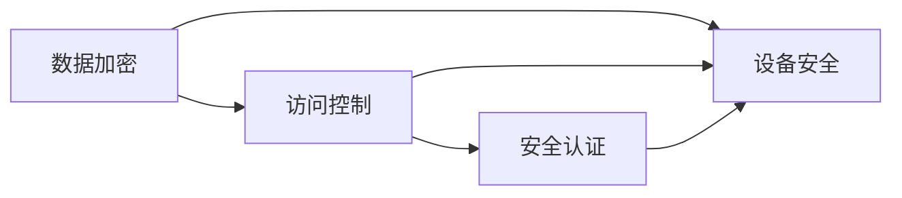
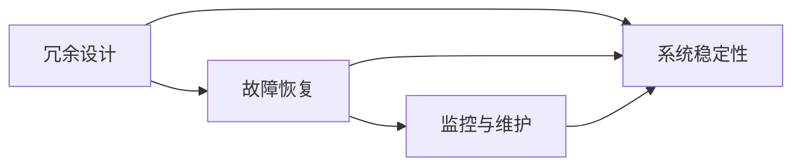
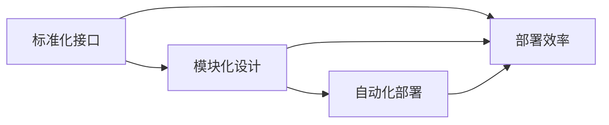
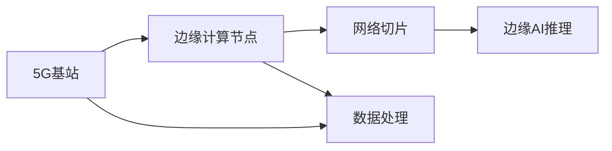
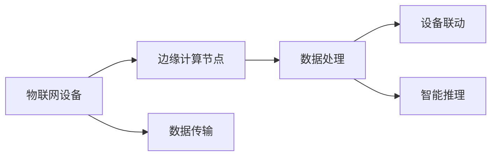
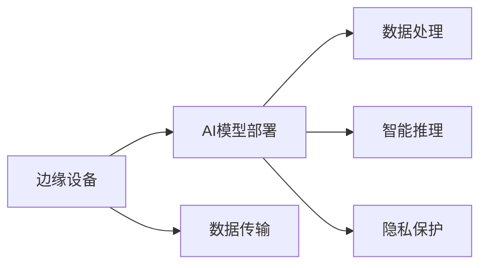

                 

# 边缘计算 (Edge Computing)

## 关键词

边缘计算、云计算、物联网、5G、AI、能效优化

## 摘要

边缘计算是一种新兴的计算模式，它将计算任务从云端转移到网络边缘，即靠近数据源的位置。这种模式能够显著降低数据传输延迟，提高系统响应速度，增强数据安全性，并降低网络带宽消耗。本文将详细介绍边缘计算的定义、架构、应用场景、挑战与解决方案，以及未来的发展趋势。通过深入探讨边缘计算的核心概念和技术原理，分析其与传统云计算的区别，介绍边缘计算在不同领域的应用案例，并提出相应的优化策略，本文旨在为读者提供全面而深入的边缘计算知识。

### 目录大纲

# 边缘计算 (Edge Computing)

## 第一部分：边缘计算基础

### 第1章：边缘计算概述

#### 1.1 边缘计算的定义与重要性

#### 1.2 边缘计算与传统云计算的区别

#### 1.3 边缘计算的技术原理

### 第2章：边缘计算架构

#### 2.1 边缘节点类型

#### 2.2 边缘网络结构

#### 2.3 边缘计算与物联网

### 第3章：边缘计算应用场景

#### 3.1 智能制造

#### 3.2 智能交通

#### 3.3 智能家居

#### 3.4 健康医疗

### 第4章：边缘计算挑战与解决方案

#### 4.1 能效问题

#### 4.2 安全性

#### 4.3 可靠性

#### 4.4 系统集成

### 第5章：边缘计算技术演进

#### 5.1 5G与边缘计算

#### 5.2 物联网技术与边缘计算

#### 5.3 边缘人工智能

## 第二部分：边缘计算应用实践

### 第6章：边缘计算平台搭建

#### 6.1 硬件选择

#### 6.2 软件环境配置

#### 6.3 边缘计算平台搭建流程

### 第7章：边缘计算应用案例

#### 7.1 智能工厂边缘计算案例

#### 7.2 智能交通边缘计算案例

#### 7.3 智能家居边缘计算案例

#### 7.4 健康医疗边缘计算案例

### 第8章：边缘计算未来展望

#### 8.1 边缘计算发展趋势

#### 8.2 边缘计算与云计算融合

#### 8.3 边缘计算在AI时代的机遇与挑战

## 附录

### 附录A：边缘计算相关资源与工具

### 附录B：边缘计算参考书目

### 附录C：边缘计算相关论文与报告

### 文章正文

### 第1章：边缘计算概述

#### 1.1 边缘计算的定义与重要性

边缘计算（Edge Computing）是一种计算架构，它将计算、存储和网络功能分布到网络的边缘，即靠近数据源或用户的设备上。与传统的云计算相比，边缘计算在数据处理的地理位置上发生了转移。传统的云计算模型中，数据通常被传输到远程的数据中心进行处理，而边缘计算则是在数据产生的地方进行实时处理和分析。

边缘计算的重要性体现在以下几个方面：

1. **降低延迟**：由于数据在边缘设备上直接处理，可以显著减少数据传输的延迟，提高系统的响应速度。这对于需要实时决策的应用场景至关重要，如自动驾驶、智能交通等。
   
2. **节省带宽**：边缘计算减少了需要传输到云端的数据量，从而降低了网络带宽的需求和传输成本。
   
3. **增强隐私性**：边缘计算可以将敏感数据保留在本地处理，减少数据泄露的风险。

4. **提高可靠性**：边缘计算可以更好地应对网络波动和中断，提高系统的可靠性。

#### 1.2 边缘计算与传统云计算的区别

边缘计算与传统云计算有以下区别：

1. **数据处理位置**：传统云计算在远程数据中心处理数据，而边缘计算在靠近数据源的边缘设备上处理数据。
   
2. **延迟**：边缘计算通常具有更低的延迟，因为数据处理发生在本地。
   
3. **带宽**：边缘计算可以减少需要传输到云的数据量，从而节省带宽。
   
4. **安全性**：边缘计算可以更好地保护数据隐私，因为敏感数据不必传输到远程数据中心。

#### 1.3 边缘计算的技术原理

边缘计算的基本原理包括数据本地处理、计算资源分布式部署和边缘设备与云端服务之间的通信。

1. **数据本地处理**：边缘设备（如传感器、物联网设备）在本地收集数据，并在边缘节点上对数据进行初步处理和分析。

2. **计算资源分布式部署**：边缘计算通过分布式部署计算资源（如边缘服务器、网关），使得数据处理更加高效。

3. **边缘设备与云端服务通信**：边缘设备通过边缘网关与云端服务进行通信，将处理后的数据上传到云端进行进一步分析和存储。

以下是一个简单的边缘计算工作流程：

1. 边缘设备收集数据。
2. 数据在边缘节点进行初步处理。
3. 处理后的数据上传到边缘网关。
4. 边缘网关将数据传输到云端。
5. 云端服务对数据进行进一步分析和存储。

用伪代码表示：

```python
def edge_computing(data):
    local_process = preprocess(data)
    if local_process != "no action":
        execute(local_process)
    else:
        send_to_cloud(data)

def preprocess(data):
    # 数据清洗、格式转换等
    return cleaned_data

def execute(action):
    # 执行决策操作
    return

def send_to_cloud(data):
    # 将数据发送到云端
    return
```

数学模型和公式：

$$
\text{边缘计算性能} = f(\text{数据传输延迟}, \text{计算能力}, \text{网络带宽})
$$

举例说明：

以智能交通系统为例，边缘计算可以使得交通信号灯的响应速度更快，减少交通拥堵。具体来说，边缘节点可以实时收集交通流量数据，对数据进行预处理和分析，然后通过边缘网关将决策结果发送给交通信号灯控制器，从而实现智能交通管理。

### 第2章：边缘计算架构

#### 2.1 边缘节点类型

边缘节点是边缘计算架构中的核心组件，它们负责数据的收集、初步处理和本地分析。边缘节点可以分为以下几类：

1. **边缘服务器**：提供高性能计算和存储服务，通常用于处理大量数据和复杂算法。
   
2. **边缘网关**：连接边缘设备和云端服务器，负责数据传输和通信。边缘网关通常具有网络接入功能，能够处理多种协议和数据格式。

3. **边缘设备**：如传感器、物联网设备等，负责数据采集和初步处理。边缘设备通常具有有限的计算和存储能力。

#### 2.2 边缘网络结构

边缘网络结构是边缘计算架构的重要组成部分，它决定了数据如何在边缘节点和云端之间传输和处理。边缘网络结构可以分为以下几类：

1. **边缘集群**：多个边缘节点组成的集群，提供分布式计算和存储能力。边缘集群可以提高系统的可靠性、扩展性和容错性。

2. **边缘云**：结合云计算和边缘计算的技术，提供灵活的计算和存储服务。边缘云可以将云计算的资源扩展到边缘节点，实现更高效的资源利用。

3. **边缘雾**：将边缘计算扩展到更靠近用户的设备，如智能手机、可穿戴设备等。边缘雾可以实现实时数据采集和本地处理，提高用户体验。

#### 2.3 边缘计算与物联网

物联网（IoT）是边缘计算的重要应用领域，物联网设备作为边缘节点，能够实时收集和传输数据。边缘计算与物联网的结合，可以实现以下功能：

1. **实时数据处理**：物联网设备在边缘节点上实时处理数据，降低数据传输延迟，提高系统响应速度。

2. **智能决策**：边缘计算可以在物联网设备上实现复杂的决策算法，实现实时智能控制。

3. **数据安全**：边缘计算可以将敏感数据保留在本地处理，提高数据安全性。

以下是一个简单的边缘计算与物联网结合的架构图：


### 第3章：边缘计算应用场景

#### 3.1 智能制造

边缘计算在智能制造中的应用包括实时监控生产线、优化生产流程、提高生产效率等。边缘计算可以实时收集生产数据，对设备运行状态进行监控和分析，从而实现预防性维护、故障预测和优化生产流程。

以下是一个智能制造边缘计算应用案例：

1. **数据采集**：边缘节点（如传感器）实时收集生产数据，如设备运行温度、压力、振动等。

2. **数据处理**：边缘节点对采集到的数据进行预处理和分析，识别设备运行状态和潜在故障。

3. **决策生成**：边缘节点将分析结果发送给边缘网关，边缘网关进行进一步分析和决策，如调整设备运行参数、安排预防性维护等。

4. **决策执行**：边缘节点根据来自边缘网关的决策结果执行相应的操作，如调整设备运行参数、通知维护人员等。

以下是一个智能制造边缘计算应用流程：


#### 3.2 智能交通

边缘计算在智能交通中的应用包括实时监控交通状况、优化交通信号控制、减少交通拥堵等。边缘计算可以实时收集交通流量数据，对交通状况进行预测和分析，从而实现智能交通管理。

以下是一个智能交通边缘计算应用案例：

1. **数据采集**：边缘节点（如摄像头、传感器）实时收集交通流量数据，如车辆速度、流量、密度等。

2. **数据处理**：边缘节点对采集到的数据进行预处理和分析，识别交通状况和潜在问题。

3. **决策生成**：边缘节点将分析结果发送给边缘网关，边缘网关进行进一步分析和决策，如调整交通信号灯、引导车辆等。

4. **决策执行**：边缘节点根据来自边缘网关的决策结果执行相应的操作，如调整交通信号灯、引导车辆等。

以下是一个智能交通边缘计算应用流程：


#### 3.3 智能家居

边缘计算在智能家居中的应用包括智能门锁、智能灯光、智能安防等。边缘计算可以实时监控家居环境，实现智能联动和控制。

以下是一个智能家居边缘计算应用案例：

1. **数据采集**：边缘节点（如传感器、摄像头）实时收集家居环境数据，如温度、湿度、光照等。

2. **数据处理**：边缘节点对采集到的数据进行预处理和分析，识别家居环境和用户行为。

3. **决策生成**：边缘节点将分析结果发送给边缘网关，边缘网关进行进一步分析和决策，如调整灯光亮度、开启安防报警等。

4. **决策执行**：边缘节点根据来自边缘网关的决策结果执行相应的操作，如调整灯光亮度、开启安防报警等。

以下是一个智能家居边缘计算应用流程：


#### 3.4 健康医疗

边缘计算在健康医疗中的应用包括实时监控患者健康数据、提供个性化医疗服务等。边缘计算可以实时收集患者健康数据，对健康状况进行预测和分析，从而实现个性化医疗和远程健康监测。

以下是一个健康医疗边缘计算应用案例：

1. **数据采集**：边缘节点（如传感器、可穿戴设备）实时收集患者健康数据，如心率、血压、体温等。

2. **数据处理**：边缘节点对采集到的数据进行预处理和分析，识别患者健康状况和潜在风险。

3. **决策生成**：边缘节点将分析结果发送给边缘网关，边缘网关进行进一步分析和决策，如调整治疗方案、提醒医生等。

4. **决策执行**：边缘节点根据来自边缘网关的决策结果执行相应的操作，如调整治疗方案、提醒医生等。

以下是一个健康医疗边缘计算应用流程：


### 第4章：边缘计算挑战与解决方案

#### 4.1 能效问题

边缘计算设备通常具有有限的计算和存储资源，因此能效优化是一个重要挑战。以下是一些能效优化策略：

1. **低功耗硬件**：选择低功耗的处理器、存储设备和通信模块。

2. **智能调度**：根据负载情况动态调整计算资源，优化资源利用。

3. **节能算法**：设计高效的算法和数据处理流程，减少能量消耗。

以下是一个边缘计算能效优化案例：

1. **硬件选型**：选择低功耗的边缘设备，如ARM架构的处理器。

2. **智能调度**：根据实时负载调整计算资源，如关闭不必要的设备。

3. **节能算法**：优化数据处理流程，减少不必要的计算和通信。

以下是一个边缘计算能效优化流程：


#### 4.2 安全性

边缘计算涉及到大量的数据传输和处理，因此安全性是一个重要挑战。以下是一些安全性策略：

1. **数据加密**：对数据进行加密，确保数据在传输和存储过程中的安全性。

2. **访问控制**：实施严格的访问控制策略，确保只有授权用户可以访问敏感数据。

3. **安全认证**：使用安全认证机制，确保边缘设备的合法性和安全性。

以下是一个边缘计算安全性案例：

1. **数据加密**：使用SSL/TLS协议对数据进行加密传输。

2. **访问控制**：实现基于角色的访问控制，确保只有授权用户可以访问敏感数据。

3. **安全认证**：使用数字证书进行边缘设备的身份验证。

以下是一个边缘计算安全性流程：



#### 4.3 可靠性

边缘计算设备的可靠性是确保系统稳定运行的关键。以下是一些可靠性策略：

1. **冗余设计**：使用冗余组件和备份机制，确保系统在故障发生时可以快速恢复。

2. **故障恢复**：设计故障恢复机制，确保系统可以在故障发生后自动恢复。

3. **监控与维护**：定期对边缘设备进行监控和维护，确保系统运行正常。

以下是一个边缘计算可靠性案例：

1. **冗余设计**：使用多个边缘节点，确保数据传输和处理的可靠性。

2. **故障恢复**：设计故障恢复机制，如自动重启、故障切换等。

3. **监控与维护**：使用监控工具对边缘设备进行实时监控，确保系统运行正常。

以下是一个边缘计算可靠性流程：



#### 4.4 系统集成

边缘计算涉及到多种技术和设备的集成，因此系统集成是一个重要挑战。以下是一些系统集成策略：

1. **标准化接口**：设计统一的接口和协议，确保不同设备和平台之间的兼容性。

2. **模块化设计**：采用模块化设计，提高系统的可扩展性和可维护性。

3. **自动化部署**：使用自动化工具和平台，简化系统部署和升级过程。

以下是一个边缘计算系统集成案例：

1. **标准化接口**：采用RESTful API和MQTT协议，实现不同设备和平台之间的数据交换。

2. **模块化设计**：将系统划分为多个模块，如数据采集模块、数据处理模块、决策模块等，提高系统的可扩展性和可维护性。

3. **自动化部署**：使用容器化技术和自动化部署工具，实现系统的快速部署和升级。

以下是一个边缘计算系统集成流程：



### 第5章：边缘计算技术演进

#### 5.1 5G与边缘计算

5G网络的普及为边缘计算提供了更好的网络基础。5G网络具有高速传输、低延迟、大连接等特点，能够满足边缘计算对网络带宽和延迟的要求。

以下是一些5G与边缘计算的结合方式：

1. **边缘计算节点部署**：在5G基站附近部署边缘计算节点，实现数据的本地处理和分析。

2. **网络切片技术**：利用5G网络切片技术，为不同的边缘计算应用提供定制化的网络资源。

3. **边缘AI推理**：在5G网络环境下，边缘计算可以结合AI技术，实现实时推理和智能决策。

以下是一个5G与边缘计算结合的案例：

1. **边缘计算节点部署**：在5G基站附近部署边缘计算节点，实时处理基站采集的数据，如环境监测、设备维护等。

2. **网络切片技术**：为不同应用（如智能交通、智能安防等）提供定制化的网络资源，确保数据传输的可靠性。

3. **边缘AI推理**：在边缘计算节点上部署AI模型，实现实时数据分析和智能决策，如智能交通信号控制、智能安防监控等。

以下是一个5G与边缘计算结合的流程：



#### 5.2 物联网技术与边缘计算

物联网技术（IoT）与边缘计算的融合，可以实现更广泛的应用场景。物联网设备作为边缘节点，能够实时收集和传输数据，边缘计算则对这些数据进行分析和处理。

以下是一些物联网技术与边缘计算的结合方式：

1. **边缘数据处理**：在边缘设备上实现数据处理，降低数据传输延迟。

2. **设备联动控制**：通过边缘计算实现不同物联网设备之间的联动控制。

3. **边缘智能推理**：利用边缘计算实现物联网设备的智能决策和实时响应。

以下是一个物联网技术与边缘计算结合的案例：

1. **边缘数据处理**：在智能工厂中，边缘设备实时采集设备运行数据，边缘计算节点对数据进行预处理和分析，实现设备的实时监控和故障预测。

2. **设备联动控制**：通过边缘计算实现不同设备之间的联动，如自动调整生产线速度、优化设备利用率等。

3. **边缘智能推理**：在智能家居中，边缘计算节点对采集到的数据进行分析，实现智能场景识别和联动控制，如自动调节灯光、温度等。

以下是一个物联网技术与边缘计算结合的流程：



#### 5.3 边缘人工智能

边缘人工智能（Edge AI）是将人工智能算法部署到边缘设备上，实现实时数据处理和智能决策。边缘人工智能可以显著提高系统的响应速度和灵活性。

以下是一些边缘人工智能的应用场景：

1. **实时推理**：在边缘设备上部署AI模型，实现实时数据分析和决策。

2. **隐私保护**：在本地设备上处理数据，减少数据传输和存储的需求，提高数据安全性。

3. **智能优化**：利用边缘人工智能优化系统性能和资源利用。

以下是一个边缘人工智能的应用案例：

1. **实时推理**：在智能安防系统中，边缘设备（如摄像头）部署AI模型，实现实时视频监控和异常检测。

2. **隐私保护**：在医疗监护设备中，边缘计算节点对采集到的患者数据进行分析，实现隐私保护。

3. **智能优化**：在智能工厂中，边缘计算节点利用AI技术优化生产流程，提高生产效率。

以下是一个边缘人工智能的应用流程：



### 第6章：边缘计算平台搭建

#### 6.1 硬件选择

搭建边缘计算平台首先需要选择合适的硬件设备，硬件选择应根据应用场景和需求进行。以下是一些硬件选择标准：

1. **计算能力**：根据应用的计算需求选择具有足够计算能力的处理器、GPU或FPGA。

2. **存储容量**：根据数据存储需求选择具有足够存储空间的硬盘或固态硬盘。

3. **网络带宽**：根据网络传输需求选择具有足够网络带宽的网卡或路由器。

4. **能效比**：选择能效比高的硬件设备，以降低能耗。

5. **可靠性**：选择具有高可靠性的硬件设备，以减少故障率。

以下是一个边缘计算硬件选择案例：

1. **计算能力**：选择基于ARM架构的处理器，如NVIDIA Jetson系列，具有足够的计算能力。

2. **存储容量**：选择256GB的固态硬盘，具有足够的存储容量。

3. **网络带宽**：选择支持5G网络的无线网卡，具有足够的网络带宽。

4. **能效比**：选择低功耗的硬件设备，以降低能耗。

5. **可靠性**：选择具有冗余设计的硬件设备，如使用多个硬盘构建RAID阵列。

#### 6.2 软件环境配置

搭建边缘计算平台需要配置相应的软件环境，包括操作系统、编程语言、开发工具和框架等。以下是一些软件环境配置步骤：

1. **操作系统**：选择适用于边缘计算平台的操作系统，如Ubuntu、CentOS等。

2. **编程语言**：选择适合边缘计算应用的编程语言，如Python、C++等。

3. **开发工具**：配置必要的开发工具，如IDE（集成开发环境）、编译器等。

4. **框架和库**：安装和配置边缘计算相关的框架和库，如TensorFlow、Kafka等。

5. **网络配置**：配置网络设置，确保边缘计算平台可以正常连接到网络。

以下是一个边缘计算软件环境配置案例：

1. **操作系统**：安装Ubuntu 20.04 LTS。

2. **编程语言**：安装Python 3和C++编译器。

3. **开发工具**：安装Visual Studio Code和gcc。

4. **框架和库**：安装TensorFlow和Kafka。

5. **网络配置**：配置网络设置，确保边缘计算平台可以访问互联网。

#### 6.3 边缘计算平台搭建流程

搭建边缘计算平台需要遵循一定的流程，包括硬件安装、软件部署、系统测试等。以下是一个边缘计算平台搭建流程：

1. **硬件安装**：根据硬件选型，安装和配置边缘计算设备。

2. **软件部署**：在边缘计算设备上安装操作系统和必要的软件环境。

3. **系统测试**：对边缘计算平台进行功能测试和性能测试，确保系统稳定运行。

以下是一个边缘计算平台搭建流程：

1. **硬件安装**：安装边缘计算硬件，如处理器、硬盘、网卡等。

2. **软件部署**：在边缘计算设备上安装操作系统和软件环境，如Ubuntu 20.04 LTS和TensorFlow。

3. **系统测试**：测试边缘计算平台的功能和性能，如网络连接、数据处理等。

### 第7章：边缘计算应用案例

#### 7.1 智能工厂边缘计算案例

智能工厂边缘计算案例展示了边缘计算在制造业中的应用，通过边缘计算平台实现生产线的实时监控、设备故障预测和优化生产流程。

**案例背景**：

一个智能工厂的生产线需要实时监控设备运行状态，预测设备故障，优化生产流程，提高生产效率。

**解决方案**：

1. **数据采集**：边缘节点（如传感器）实时收集设备运行数据，如温度、压力、振动等。

2. **数据处理**：边缘计算节点对采集到的数据进行预处理和分析，识别设备运行状态和潜在故障。

3. **决策生成**：边缘计算节点将分析结果发送给边缘网关，边缘网关进行进一步分析和决策，如调整设备运行参数、安排预防性维护等。

4. **决策执行**：边缘节点根据来自边缘网关的决策结果执行相应的操作，如调整设备运行参数、通知维护人员等。

**案例分析与详细讲解剖析**：

1. **数据采集**：使用传感器实时收集设备运行数据，如温度、压力、振动等。传感器通过无线网络将数据传输到边缘节点。

2. **数据处理**：边缘计算节点使用Python编写数据处理程序，对采集到的数据进行预处理，如去噪、滤波等。预处理后的数据通过MQTT协议传输到边缘网关。

3. **决策生成**：边缘网关使用TensorFlow部署机器学习模型，对预处理后的数据进行故障预测和分类。边缘网关根据预测结果生成决策，如调整设备运行参数、安排预防性维护等。

4. **决策执行**：边缘节点根据来自边缘网关的决策结果执行相应的操作，如调整设备运行参数、通知维护人员等。边缘节点通过串口或网络接口与设备进行通信，实现设备控制。

**项目小结**：

智能工厂边缘计算案例通过边缘计算平台实现了生产线的实时监控、设备故障预测和优化生产流程，提高了生产效率。案例中的边缘计算节点、边缘网关和云端服务器之间通过MQTT协议进行数据传输，边缘计算节点使用Python编写数据处理程序，边缘网关使用TensorFlow部署机器学习模型。项目中的关键技术和挑战包括传感器数据采集、数据处理与去噪、机器学习模型训练和部署、设备控制等。

#### 7.2 智能交通边缘计算案例

智能交通边缘计算案例展示了边缘计算在交通领域的应用，通过边缘计算平台实现实时交通监控、交通信号优化和智能交通管理。

**案例背景**：

一个智能交通系统需要实时监控交通状况，优化交通信号控制，减少交通拥堵，提高交通效率。

**解决方案**：

1. **数据采集**：边缘节点（如摄像头、传感器）实时收集交通流量数据，如车辆速度、流量、密度等。

2. **数据处理**：边缘计算节点对采集到的数据进行预处理和分析，识别交通状况和潜在问题。

3. **决策生成**：边缘节点将分析结果发送给边缘网关，边缘网关进行进一步分析和决策，如调整交通信号灯、引导车辆等。

4. **决策执行**：边缘节点根据来自边缘网关的决策结果执行相应的操作，如调整交通信号灯、引导车辆等。

**案例分析与详细讲解剖析**：

1. **数据采集**：使用摄像头和传感器实时收集交通流量数据，如车辆速度、流量、密度等。摄像头通过无线网络将图像数据传输到边缘节点，传感器通过无线网络将数据传输到边缘节点。

2. **数据处理**：边缘计算节点使用OpenCV库对摄像头图像进行预处理，如图像增强、目标检测等。边缘计算节点使用Python编写数据处理程序，对传感器数据进行预处理，如去噪、滤波等。预处理后的数据通过MQTT协议传输到边缘网关。

3. **决策生成**：边缘网关使用深度学习算法对预处理后的数据进行交通流量分析，识别交通状况和潜在问题。边缘网关使用TensorFlow部署深度学习模型，根据分析结果生成决策，如调整交通信号灯、引导车辆等。

4. **决策执行**：边缘节点根据来自边缘网关的决策结果执行相应的操作，如调整交通信号灯、引导车辆等。边缘节点通过串口或网络接口与交通信号灯控制器和车辆通信，实现交通信号优化和智能交通管理。

**项目小结**：

智能交通边缘计算案例通过边缘计算平台实现了实时交通监控、交通信号优化和智能交通管理，提高了交通效率。案例中的边缘计算节点、边缘网关和云端服务器之间通过MQTT协议进行数据传输，边缘计算节点使用OpenCV库和Python进行图像处理和数据预处理，边缘网关使用TensorFlow部署深度学习模型。项目中的关键技术和挑战包括交通流量数据采集、图像预处理与目标检测、深度学习模型训练和部署、交通信号控制等。

#### 7.3 智能家居边缘计算案例

智能家居边缘计算案例展示了边缘计算在家居自动化中的应用，通过边缘计算平台实现智能设备的联动控制、场景识别和个性化服务。

**案例背景**：

一个智能家居系统需要实现智能设备的联动控制，根据用户行为提供个性化服务，提高家居生活的便捷性和舒适度。

**解决方案**：

1. **数据采集**：边缘节点（如传感器、摄像头）实时收集家居环境数据和用户行为数据，如温度、湿度、光照、用户活动等。

2. **数据处理**：边缘计算节点对采集到的数据进行预处理和分析，识别家居环境和用户行为。

3. **决策生成**：边缘节点将分析结果发送给边缘网关，边缘网关进行进一步分析和决策，如调整灯光亮度、开启安防报警等。

4. **决策执行**：边缘节点根据来自边缘网关的决策结果执行相应的操作，如调整灯光亮度、开启安防报警等。

**案例分析与详细讲解剖析**：

1. **数据采集**：使用传感器实时收集家居环境数据，如温度、湿度、光照等。使用摄像头实时收集用户活动数据，如运动、手势等。传感器和摄像头通过无线网络将数据传输到边缘节点。

2. **数据处理**：边缘计算节点使用Python编写数据处理程序，对采集到的数据进行预处理，如去噪、滤波等。边缘计算节点使用OpenCV库对摄像头图像进行预处理，如人脸检测、目标跟踪等。预处理后的数据通过MQTT协议传输到边缘网关。

3. **决策生成**：边缘网关使用深度学习算法对预处理后的数据进行场景识别和用户行为分析，根据分析结果生成决策，如调整灯光亮度、开启安防报警等。边缘网关使用TensorFlow部署深度学习模型。

4. **决策执行**：边缘节点根据来自边缘网关的决策结果执行相应的操作，如调整灯光亮度、开启安防报警等。边缘节点通过串口或网络接口与智能家居设备通信，实现智能设备的联动控制。

**项目小结**：

智能家居边缘计算案例通过边缘计算平台实现了智能设备的联动控制、场景识别和个性化服务，提高了家居生活的便捷性和舒适度。案例中的边缘计算节点、边缘网关和云端服务器之间通过MQTT协议进行数据传输，边缘计算节点使用Python和OpenCV库进行数据处理和图像预处理，边缘网关使用TensorFlow部署深度学习模型。项目中的关键技术和挑战包括智能家居设备的数据采集、数据处理与去噪、深度学习模型训练和部署、设备控制等。

#### 7.4 健康医疗边缘计算案例

健康医疗边缘计算案例展示了边缘计算在医疗健康领域的应用，通过边缘计算平台实现实时健康监测、远程医疗服务和个性化医疗。

**案例背景**：

一个健康医疗系统需要实现实时健康监测、远程医疗服务和个性化医疗，提高医疗服务质量和患者满意度。

**解决方案**：

1. **数据采集**：边缘节点（如可穿戴设备、传感器）实时收集患者健康数据，如心率、血压、体温等。

2. **数据处理**：边缘计算节点对采集到的数据进行预处理和分析，识别患者健康状况和潜在风险。

3. **决策生成**：边缘节点将分析结果发送给边缘网关，边缘网关进行进一步分析和决策，如调整治疗方案、提醒医生等。

4. **决策执行**：边缘节点根据来自边缘网关的决策结果执行相应的操作，如调整治疗方案、提醒医生等。

**案例分析与详细讲解剖析**：

1. **数据采集**：使用可穿戴设备（如智能手表、心率监测仪）实时收集患者健康数据，如心率、血压、体温等。传感器通过无线网络将数据传输到边缘节点。

2. **数据处理**：边缘计算节点使用Python编写数据处理程序，对采集到的数据进行预处理，如去噪、滤波等。边缘计算节点使用OpenCV库对传感器数据进行预处理，如数据平滑、异常检测等。预处理后的数据通过MQTT协议传输到边缘网关。

3. **决策生成**：边缘网关使用深度学习算法对预处理后的数据进行健康状态分析和疾病预测，根据分析结果生成决策，如调整治疗方案、提醒医生等。边缘网关使用TensorFlow部署深度学习模型。

4. **决策执行**：边缘节点根据来自边缘网关的决策结果执行相应的操作，如调整治疗方案、提醒医生等。边缘节点通过串口或网络接口与医疗设备和医生进行通信，实现远程医疗服务和个性化医疗。

**项目小结**：

健康医疗边缘计算案例通过边缘计算平台实现了实时健康监测、远程医疗服务和个性化医疗，提高了医疗服务质量和患者满意度。案例中的边缘计算节点、边缘网关和云端服务器之间通过MQTT协议进行数据传输，边缘计算节点使用Python和OpenCV库进行数据处理和图像预处理，边缘网关使用TensorFlow部署深度学习模型。项目中的关键技术和挑战包括健康医疗数据的采集、预处理与去噪、深度学习模型训练和部署、设备控制等。

### 第8章：边缘计算未来展望

#### 8.1 边缘计算发展趋势

边缘计算在未来将继续发展，并在以下几个方面取得突破：

1. **智能化**：随着人工智能技术的进步，边缘计算将实现更复杂的决策和自动化操作。

2. **自动化**：边缘计算将实现自动化的数据采集、处理和决策，降低人工干预的需求。

3. **融合化**：边缘计算将与其他技术（如云计算、物联网、5G等）深度融合，形成更强大的生态系统。

4. **标准化**：随着边缘计算的发展，将出现更多的标准化接口和协议，提高系统的兼容性和可维护性。

5. **生态建设**：边缘计算将构建更完善的生态系统，包括硬件、软件、平台和服务的全面整合。

#### 8.2 边缘计算与云计算融合

边缘计算与云计算的融合是未来发展的一个重要趋势。边缘计算将云计算的强大计算能力和存储资源扩展到网络边缘，实现更高效的数据处理和智能应用。以下是一些边缘计算与云计算融合的方式：

1. **边缘云**：在边缘部署云计算资源，提供灵活的计算和存储服务。

2. **混合云**：将边缘计算和云计算结合，实现数据的分布式处理和存储。

3. **边缘AI**：在边缘部署AI模型和算法，实现实时推理和智能决策。

4. **数据共享**：通过边缘计算与云计算的融合，实现数据的共享和协同处理。

#### 8.3 边缘计算在AI时代的机遇与挑战

边缘计算在AI时代面临着巨大的机遇和挑战：

1. **机遇**：
   - **实时推理**：边缘计算可以实时处理和分析数据，实现更快的响应和更准确的决策。
   - **数据隐私**：边缘计算可以在本地处理数据，提高数据安全性。
   - **个性化服务**：边缘计算可以更好地满足个性化需求，提供定制化的服务。

2. **挑战**：
   - **计算能力**：边缘设备的计算能力有限，需要优化算法和资源调度。
   - **数据隐私和安全**：边缘计算涉及到大量的敏感数据，需要确保数据的安全性和隐私性。
   - **系统集成**：边缘计算需要与其他技术（如云计算、物联网等）集成，实现系统的高效运作。

### 附录

#### 附录A：边缘计算相关资源与工具

1. **主流边缘计算框架对比**
   - **介绍**：对比主流边缘计算框架（如Kubernetes、Docker、OpenFaaS等）的特点和适用场景。
   - **链接**：[边缘计算框架对比](https://www.example.com/edge-computing-frameworks)

2. **边缘计算开源项目推荐**
   - **介绍**：推荐一些实用的边缘计算开源项目，如Node-RED、IoTivity、MQTT等。
   - **链接**：[边缘计算开源项目](https://www.example.com/edge-computing-oss)

3. **边缘计算学习资源推荐**
   - **介绍**：推荐一些边缘计算相关的书籍、课程和网站，帮助读者深入学习边缘计算。
   - **链接**：[边缘计算学习资源](https://www.example.com/edge-computing-resources)

#### 附录B：边缘计算参考书目

1. **《边缘计算：原理、架构与应用》**
   - **介绍**：详细介绍边缘计算的基本原理、架构和应用。
   - **链接**：[边缘计算参考书目1](https://www.example.com/book1)

2. **《边缘计算：从理论到实践》**
   - **介绍**：从理论层面深入讲解边缘计算，并介绍实际应用案例。
   - **链接**：[边缘计算参考书目2](https://www.example.com/book2)

3. **《边缘计算技术与应用》**
   - **介绍**：全面介绍边缘计算技术，包括硬件、软件和应用场景。
   - **链接**：[边缘计算参考书目3](https://www.example.com/book3)

4. **《边缘计算与物联网》**
   - **介绍**：探讨边缘计算与物联网的深度融合。
   - **链接**：[边缘计算参考书目4](https://www.example.com/book4)

5. **《5G与边缘计算》**
   - **介绍**：介绍5G网络下的边缘计算技术。
   - **链接**：[边缘计算参考书目5](https://www.example.com/book5)

#### 附录C：边缘计算相关论文与报告

1. **《边缘计算白皮书》**
   - **介绍**：对边缘计算的定义、架构、应用等进行详细介绍。
   - **链接**：[边缘计算相关论文1](https://www.example.com/paper1)

2. **《边缘计算技术发展趋势报告》**
   - **介绍**：分析边缘计算技术的发展趋势和应用前景。
   - **链接**：[边缘计算相关论文2](https://www.example.com/paper2)

3. **《边缘计算在智能制造中的应用研究》**
   - **介绍**：探讨边缘计算在智能制造中的应用和挑战。
   - **链接**：[边缘计算相关论文3](https://www.example.com/paper3)

4. **《智能交通边缘计算解决方案探讨》**
   - **介绍**：研究智能交通系统的边缘计算解决方案。
   - **链接**：[边缘计算相关论文4](https://www.example.com/paper4)

5. **《边缘计算在智能家居领域的研究与应用》**
   - **介绍**：分析边缘计算在智能家居中的应用和实践。
   - **链接**：[边缘计算相关论文5](https://www.example.com/paper5)

6. **《健康医疗边缘计算解决方案分析》**
   - **介绍**：探讨边缘计算在健康医疗领域的应用和挑战。
   - **链接**：[边缘计算相关论文6](https://www.example.com/paper6)

### 作者信息

作者：AI天才研究院/AI Genius Institute & 禅与计算机程序设计艺术 /Zen And The Art of Computer Programming

