                 

### 文章标题：远程办公创业：未来工作方式的探索者

在当今全球化和技术进步的背景下，远程办公（Remote Work）已经成为一种不可逆转的趋势。远程办公不仅为企业和员工提供了新的工作模式选择，也为创业者提供了一种全新的商业机会。本文旨在探讨远程办公创业的现状、挑战、技术基础、管理策略、法律法规以及未来发展趋势，通过逻辑清晰的推理方式，为希望在这个领域探索创业机会的人提供实用的指导。

### 关键词：
- 远程办公
- 创业
- 工作方式
- 技术基础
- 管理策略
- 法律法规
- 未来趋势

### 摘要：
本文首先介绍了远程办公的起源和发展现状，分析了远程办公的主要挑战。随后，详细探讨了远程办公所需的技术基础，包括通信工具、协同办公平台和云计算等。接着，文章阐述了远程办公中的管理策略，涵盖团队管理、项目管理和时间管理等方面。随后，文章深入分析了远程办公的法律法规和伦理问题，并提供了成功创业案例分析。最后，文章探讨了远程办公的未来发展趋势，并给出了创业准备、团队组建、项目开发、运营拓展等方面的建议。

### 第一部分：远程办公的兴起与挑战

## 第1章：远程办公的起源与现状

### 1.1 远程办公的定义与历史背景

远程办公，顾名思义，是指员工通过电子通讯技术，在不同地点进行工作。这种工作方式不仅包括在家办公，还涵盖了跨地区、跨国界的协作。远程办公的起源可以追溯到20世纪80年代，当时计算机和互联网技术开始普及，人们开始尝试通过电子邮件和远程登录系统进行工作。早期的远程办公主要是作为传统办公的一种补充，主要用于处理特定的项目或任务。

随着信息技术的发展，远程办公逐渐成为一种主流工作方式。近年来，特别是在全球疫情的影响下，远程办公的需求大幅增加。根据国际数据公司（IDC）的报告，2020年全球远程办公人数达到2.8亿，约占全球劳动力的30%。这一数字在疫情结束后，预计仍将保持较高水平。

### 1.2 远程办公的全球趋势分析

远程办公在全球范围内的发展趋势呈现出多样化的特点。北美地区由于科技产业发达，远程办公比例较高。据LinkedIn的数据，2021年美国有约43%的员工选择远程办公。欧洲地区，随着各国政府逐渐认识到远程办公的优势，政策支持力度不断加大。例如，2020年西班牙政府提出了“远程办公计划”，鼓励企业推行远程办公模式。

在亚洲，远程办公也逐渐成为主流。中国、印度等国家的互联网普及率和科技水平不断提高，远程办公需求日益增长。根据中国互联网信息中心（CNNIC）的数据，2020年中国远程办公用户规模达到1.8亿人，占整体网民的20%。

### 1.3 远程办公的主要挑战

尽管远程办公带来了许多好处，如提高员工满意度、减少通勤时间等，但也面临一些挑战。以下是远程办公的一些主要挑战：

**沟通障碍**：远程办公依赖于电子通讯工具，这些工具在沟通效果上难以完全取代面对面交流。信息传递可能会失真，导致沟通效率降低。

**团队凝聚力下降**：由于缺乏面对面的互动，远程团队可能感到疏离，降低团队凝聚力。

**技术问题**：远程办公需要稳定的网络连接和高效的协作工具，技术故障可能会影响工作进度。

**工作时间管理**：远程办公的灵活性可能导致员工工作时间难以控制，影响工作效率。

**法律法规问题**：不同国家和地区对远程办公的法律规定不同，企业在全球范围内开展远程办公可能面临法律风险。

### 背景介绍

远程办公作为一种新的工作方式，其兴起与信息技术的发展密切相关。计算机和互联网技术的普及，使得远程办公成为可能。特别是在全球疫情背景下，远程办公迅速成为企业应对挑战的一种策略，这也进一步推动了远程办公的普及。

### 核心概念与联系

远程办公的核心概念包括：

- **远程办公**：指员工在不同地点通过电子通讯技术进行工作。
- **电子通讯工具**：如电子邮件、即时通讯、视频会议等，是远程办公的关键支撑。
- **团队管理**：远程办公需要特别的团队管理策略，以确保团队高效协作。

这些概念之间的联系可以通过以下Mermaid流程图表示：

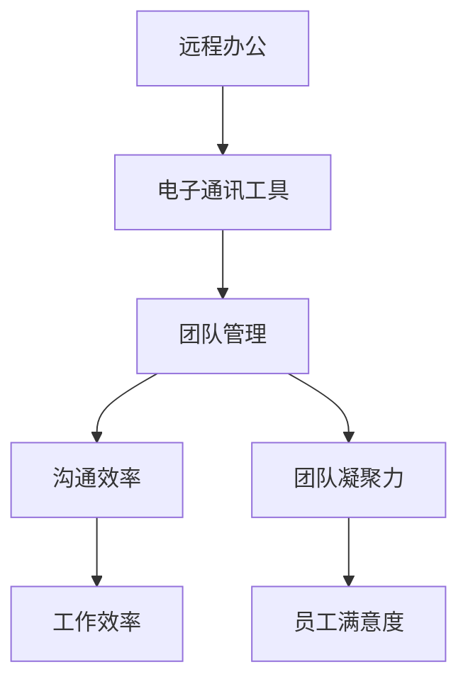

### 核心算法原理讲解

在远程办公中，并没有特定的算法原理，但可以使用一些基础的技术概念来优化工作流程，例如：

- **负载均衡算法**：用于确保网络资源公平分配，避免某个节点过载。
- **队列调度算法**：用于合理分配任务，确保每个员工都有足够的工作量。
- **加密算法**：用于保护数据传输的安全性。

伪代码示例：

```python
# 负载均衡算法伪代码
def load_balancing(workloads, servers):
    for server in servers:
        if server.available:
            assign_workload_to_server(server, workloads.pop(0))
        else:
            wait

# 队列调度算法伪代码
def queue_scheduling(tasks, workers):
    for worker in workers:
        if worker.is_available():
            assign_task_to_worker(worker, tasks.pop(0))
```

### 数学模型和公式

在远程办公中，常用的数学模型包括：

- **时间管理模型**：用于评估远程办公的效率
- **绩效评估模型**：用于衡量远程办公员工的表现

时间管理模型的公式如下：

$$
\text{工作效率} = \frac{\text{完成的工作量}}{\text{工作时间}}
$$

绩效评估模型的公式如下：

$$
\text{绩效得分} = \frac{\text{工作成果} \times \text{工作质量}}{\text{工作量} \times \text{工作时间}}
$$

### 举例说明

假设一个远程办公团队需要完成一个项目，项目总工作量为1000小时。团队共有10名成员，他们在4个月内完成了项目。以下是时间管理和绩效评估的计算过程：

1. **时间管理模型**：

   $$\text{工作效率} = \frac{1000}{4 \times 10} = 25 \text{小时/人·月}$$

2. **绩效评估模型**：

   假设每位成员的平均工作成果为100，工作质量为90，则：

   $$\text{绩效得分} = \frac{100 \times 90}{1000 \times 4} = 0.225$$

### 项目实战

在开发一个远程办公平台时，需要搭建开发环境。以下是搭建开发环境的基本步骤：

1. **选择开发工具**：例如，使用Visual Studio Code作为主要开发工具。
2. **配置编程语言**：安装Python、JavaScript等编程语言。
3. **安装数据库**：例如，选择MySQL作为数据库系统。
4. **搭建版本控制系统**：例如，使用Git进行代码版本管理。

源代码实现和代码解读将在后续章节详细讨论。在此阶段，重点是确保开发环境的稳定性和可靠性。

### 最佳实践 tips

- **定期进行团队会议**：通过视频会议工具定期召开团队会议，确保团队沟通顺畅。
- **制定明确的工作计划**：为每个项目制定详细的工作计划，明确任务分配和进度要求。
- **使用项目管理工具**：如Trello或Asana，帮助团队更好地跟踪项目进度。

### 小结

远程办公作为一种新兴的工作方式，正在逐渐改变传统的工作模式。它不仅为企业提供了新的运营方式，也为员工提供了更多灵活的工作选择。然而，远程办公也带来了一些挑战，如沟通障碍、团队凝聚力下降等。通过合理的团队管理、技术支持和法律法规遵守，可以有效地应对这些挑战，实现远程办公的优化。

### 注意事项

- **确保网络连接稳定**：稳定的网络连接是远程办公的基础。
- **合理规划工作时间**：远程办公可能导致工作时间不规律，需要合理规划，确保工作效率。
- **保护数据安全**：使用加密技术保护数据传输的安全。

### 拓展阅读

- 《远程办公手册：策略与实践》
- 《远程工作的未来：变革与趋势》
- 《远程团队管理：技巧与策略》

## 第2章：远程办公技术基础

### 2.1 远程办公工具与技术

远程办公的顺利实施依赖于多种技术和工具的支持。这些工具和技术不仅能够提高工作效率，还能确保员工之间的有效沟通和协作。以下是几种主要的远程办公工具和技术：

#### 2.1.1 通信工具

通信工具是远程办公中不可或缺的一部分，它们包括电子邮件、即时通讯和视频会议等。

1. **电子邮件**：电子邮件是最常用的远程通信工具之一，适用于正式的沟通和文档传输。例如，Gmail和Outlook是两个广泛使用的电子邮件服务。

2. **即时通讯**：即时通讯工具提供了快速、实时的沟通方式，适用于日常交流和问题解决。WhatsApp、Slack和Telegram等应用程序在远程办公中得到了广泛应用。

3. **视频会议**：视频会议工具允许远程团队进行面对面的交流，提高了沟通的效率和效果。Zoom、Microsoft Teams和Google Meet是目前最受欢迎的视频会议工具。

#### 2.1.2 协同办公平台

协同办公平台集成了文档编辑、任务管理、项目管理等功能，为远程团队提供了一个统一的工作空间。

1. **Google Workspace**：Google Workspace（原Google Apps for Business）包括Google Docs、Google Sheets、Google Slides等工具，支持多人实时协作。

2. **Microsoft 365**：Microsoft 365提供了Office套件以及OneDrive等协同办公工具，支持跨平台操作。

3. **Notion**：Notion是一个高度灵活的协同办公平台，支持用户自定义工作流程，适用于各种类型的项目管理。

#### 2.1.3 云计算与数据中心

云计算和数据中心技术为远程办公提供了强大的基础设施支持，确保数据的存储、备份和访问。

1. **云计算**：云计算使得企业无需购买和维护昂贵的硬件设备，即可获得强大的计算能力和存储资源。Amazon Web Services（AWS）、Microsoft Azure和Google Cloud是三大主流云服务提供商。

2. **数据中心**：数据中心是云计算的基础设施之一，提供了高性能的计算节点和存储设备。企业可以根据需求租用或自建数据中心。

### 背景介绍

远程办公技术的快速发展与信息技术的进步密切相关。20世纪80年代，随着个人计算机的普及，远程办公开始萌芽。互联网的普及使得远程办公成为可能，特别是宽带网络的普及和移动设备的普及，为远程办公提供了便利条件。

### 核心概念与联系

远程办公技术基础的核心概念包括：

- **通信工具**：确保远程团队之间的实时沟通。
- **协同办公平台**：提供统一的工作空间和协作工具。
- **云计算与数据中心**：提供强大的基础设施支持。

这些概念之间的联系可以通过以下Mermaid流程图表示：

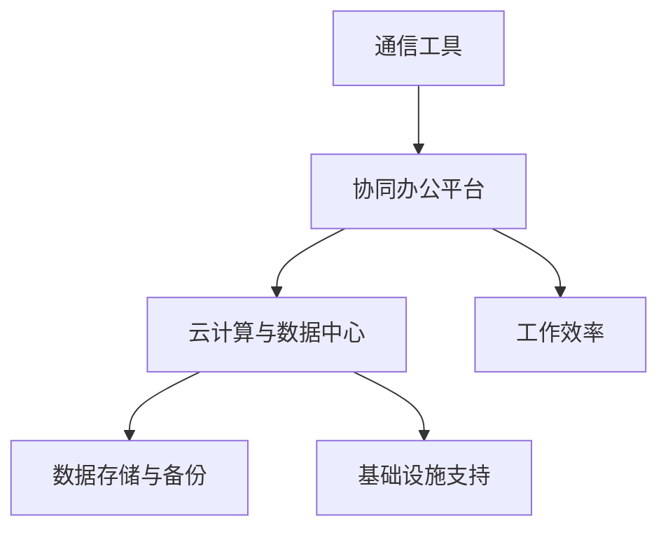

### 核心算法原理讲解

在远程办公技术中，核心算法原理主要体现在以下几个方面：

1. **负载均衡算法**：用于优化网络资源分配，避免单点故障。
2. **加密算法**：用于保障数据传输的安全性。
3. **调度算法**：用于合理分配任务，确保高效协作。

以下是负载均衡算法和加密算法的伪代码示例：

```python
# 负载均衡算法伪代码
def load_balancing(requests, servers):
    for server in servers:
        if server.load < server.capacity:
            assign_request_to_server(server, requests.pop(0))
        else:
            wait

# 加密算法伪代码
def encrypt_data(data, key):
    encrypted_data = encrypt(data, key)
    return encrypted_data

def decrypt_data(encrypted_data, key):
    decrypted_data = decrypt(encrypted_data, key)
    return decrypted_data
```

### 数学模型和公式

在远程办公技术中，常用的数学模型包括：

1. **通信延迟模型**：用于评估通信工具的响应时间。
2. **数据传输模型**：用于计算数据传输的时间和带宽需求。

通信延迟模型的公式如下：

$$
\text{延迟} = \frac{\text{距离}}{\text{传输速度}}
$$

数据传输模型的公式如下：

$$
\text{传输时间} = \frac{\text{数据大小}}{\text{带宽}}
$$

### 举例说明

假设两个远程团队需要进行视频会议，视频数据大小为500MB，带宽为10Mbps。根据数据传输模型，传输时间计算如下：

$$
\text{传输时间} = \frac{500 \text{MB}}{10 \text{Mbps}} = 50 \text{秒}
$$

### 项目实战

在开发一个远程办公平台时，需要选择合适的通信工具和协同办公平台。以下是选择和配置这些工具的步骤：

1. **选择通信工具**：根据团队需求和预算，选择适合的视频会议工具（如Zoom）和即时通讯工具（如Slack）。
2. **配置协同办公平台**：根据项目需求，选择适合的协同办公平台（如Google Workspace或Microsoft 365），并配置相应的权限和功能。
3. **搭建云计算环境**：选择云服务提供商（如AWS或Azure），搭建远程办公平台所需的基础设施，包括服务器、数据库和存储设备。

### 最佳实践 tips

- **定期更新和备份**：定期更新通信工具和协同办公平台，确保系统的稳定性和安全性。同时，定期备份数据和配置文件。
- **培训员工**：为员工提供必要的培训，确保他们能够熟练使用各种远程办公工具。

### 小结

远程办公技术的选择和配置是远程办公成功的关键因素。合适的通信工具、协同办公平台和云计算环境能够提高工作效率和团队协作效果。通过合理的技术选择和配置，企业可以更好地应对远程办公带来的挑战，实现远程办公的优化。

### 注意事项

- **确保网络连接稳定**：选择具有良好网络连接的地区作为远程办公地点，避免网络中断影响工作。
- **合理配置权限**：确保不同员工拥有适当的访问权限，避免数据泄露和滥用。

### 拓展阅读

- 《云计算与数据中心：构建远程办公基础设施》
- 《远程办公工具指南：选择与配置》
- 《远程办公安全技术：保障数据安全》

## 第3章：远程办公中的管理策略

### 3.1 远程团队管理的关键要素

远程团队管理是确保远程办公顺利实施的重要环节。与传统的面对面管理相比，远程团队管理面临更多的挑战，但也提供了更多的机遇。以下是远程团队管理的关键要素：

#### 3.1.1 领导力与沟通技巧

领导力在远程团队管理中至关重要。远程领导需要具备以下能力：

1. **信任建立**：信任是远程团队协作的基石。领导需要通过透明、公正和及时的沟通，建立团队成员之间的信任。
2. **授权与激励**：远程领导应适当授权，让团队成员自主决策，并给予必要的激励，如奖励和认可。
3. **持续反馈**：定期提供反馈，帮助团队成员了解自己的工作表现，并及时调整。

沟通技巧也是远程领导的关键能力。以下是一些有效的沟通技巧：

1. **明确沟通目标**：每次沟通前，明确沟通的目标和期望结果。
2. **选择合适工具**：根据沟通内容和目标，选择合适的沟通工具，如电子邮件、即时通讯或视频会议。
3. **主动沟通**：主动发起沟通，确保信息的及时传递和问题得到快速解决。

#### 3.1.2 员工激励与绩效评估

远程办公员工激励和绩效评估是确保团队高效运作的重要环节。以下是几个关键点：

1. **个性化激励**：了解每位员工的兴趣和需求，提供个性化的激励措施，如培训机会、职业发展规划等。
2. **目标设定**：与员工共同设定清晰的个人和团队目标，确保员工明确自己的职责和期望成果。
3. **绩效评估**：采用多维度的绩效评估方法，包括定量和定性的指标，全面评估员工的表现。

#### 3.1.3 项目管理与时间管理

项目管理是远程团队管理的重要组成部分。以下是几个关键点：

1. **明确项目目标**：确保所有团队成员对项目目标有共同的理解和认同。
2. **制定详细的计划**：制定详细的项目计划，包括任务分配、时间表和资源需求。
3. **监控与调整**：定期监控项目进度，及时调整计划，确保项目按计划进行。

时间管理是远程办公中的另一个重要挑战。以下是几个时间管理策略：

1. **时间追踪工具**：使用时间追踪工具（如Toggl或RescueTime），帮助员工记录工作时间和任务进度。
2. **任务优先级**：根据任务的重要性和紧急性，合理分配时间和精力，优先处理重要任务。
3. **定期休息**：确保员工有足够的休息时间，避免长时间的工作导致疲劳和效率下降。

### 背景介绍

远程团队管理的兴起与远程办公的普及密切相关。随着信息技术的发展，远程办公已经成为许多企业的选择。然而，远程团队管理面临与面对面管理不同的挑战，如沟通障碍、时间管理困难等。有效的远程团队管理策略能够帮助企业更好地应对这些挑战，提高工作效率。

### 核心概念与联系

远程团队管理的核心概念包括：

- **领导力与沟通技巧**：确保团队高效协作和目标一致。
- **员工激励与绩效评估**：激励员工并确保其工作表现。
- **项目管理与时间管理**：确保项目顺利推进和员工高效工作。

这些概念之间的联系可以通过以下Mermaid流程图表示：

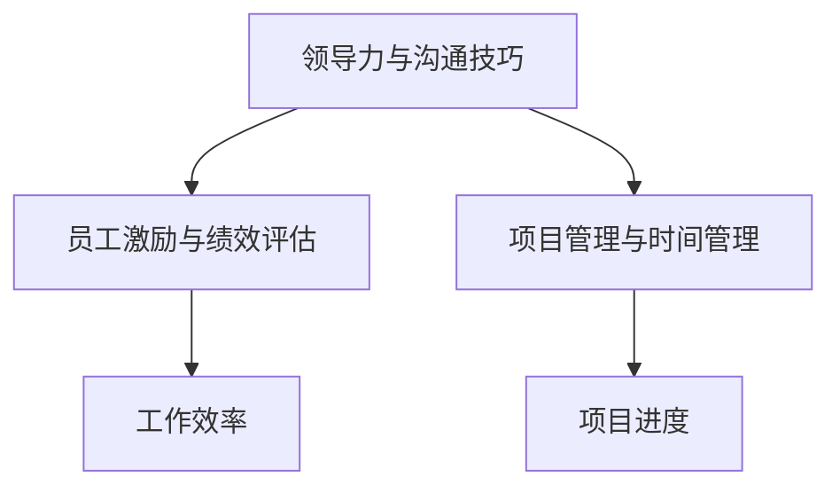

### 核心算法原理讲解

在远程团队管理中，核心算法原理主要体现在以下几个方面：

1. **任务分配算法**：用于合理分配任务，确保每个成员都有足够的工作量。
2. **时间调度算法**：用于优化团队成员的工作时间，确保工作高效完成。

以下是任务分配和时间调度的伪代码示例：

```python
# 任务分配算法伪代码
def task_assignment(tasks, workers):
    for worker in workers:
        if worker.available:
            assign_task_to_worker(worker, tasks.pop(0))
        else:
            wait

# 时间调度算法伪代码
def time_scheduling(tasks, workers):
    for worker in workers:
        schedule_tasks_for_worker(worker, tasks)
```

### 数学模型和公式

在远程团队管理中，常用的数学模型包括：

1. **工作负荷模型**：用于评估团队成员的工作负荷。
2. **绩效评估模型**：用于衡量团队成员的工作表现。

工作负荷模型的公式如下：

$$
\text{工作负荷} = \frac{\text{完成的工作量}}{\text{工作时间}}
$$

绩效评估模型的公式如下：

$$
\text{绩效得分} = \frac{\text{工作成果} \times \text{工作质量}}{\text{工作量} \times \text{工作时间}}
$$

### 举例说明

假设一个远程团队有5名成员，每位成员每月需要完成100小时的工作。在某个月，团队成员实际完成了120小时的工作。根据工作负荷模型，计算每位成员的工作负荷如下：

$$
\text{工作负荷} = \frac{120 \text{小时}}{4 \text{周} \times 7 \text{天/周} \times 1 \text{小时/天}} = 3.5 \text{小时/天}
$$

### 项目实战

在管理一个远程团队时，需要使用项目管理工具和时间管理工具来确保项目进度和员工工作效率。以下是使用这些工具的步骤：

1. **选择项目管理工具**：如Trello或Asana，用于管理项目任务和进度。
2. **分配任务**：根据团队成员的能力和兴趣，合理分配任务。
3. **监控进度**：定期查看项目进度，确保任务按计划完成。
4. **时间管理**：使用时间追踪工具，如Toggl或RescueTime，记录工作时间和任务进度。

### 最佳实践 tips

- **定期召开团队会议**：通过视频会议工具定期召开团队会议，确保团队成员之间的沟通和协作。
- **设定明确的目标**：与团队成员共同设定清晰的目标和里程碑，确保团队成员明确自己的工作方向。
- **提供培训和支持**：为团队成员提供必要的培训和支持，帮助他们提高工作效率。

### 小结

远程团队管理是远程办公成功的关键。通过有效的领导力、沟通技巧、员工激励和绩效评估，企业可以确保远程团队的高效运作。项目管理和技术工具的应用，进一步提升了远程团队的管理效果。有效的远程团队管理策略，不仅能够提高工作效率，还能够增强团队凝聚力，推动企业持续发展。

### 注意事项

- **确保沟通畅通**：定期召开团队会议，确保团队成员之间的信息传递和沟通。
- **合理分配任务**：根据团队成员的能力和兴趣，合理分配任务，避免过度劳累。

### 拓展阅读

- 《远程团队管理：领导力与沟通技巧》
- 《项目管理的最佳实践：时间管理策略》
- 《员工激励与绩效评估：理论与实践》

## 第4章：远程办公中的法律法规与伦理问题

### 4.1 远程办公的法律框架

远程办公的普及使得各国纷纷出台相关法律法规，以规范远程办公行为。以下是远程办公中一些关键的法律框架：

#### 4.1.1 劳动合同与劳动法

不同国家和地区对劳动合同和劳动法的规定有所不同。例如，在美国，根据《联邦劳动法典》，雇主有义务为员工提供公平的工作条件，包括工资、工时和休息时间等。在欧洲，根据《欧洲工作时间指令》，雇主必须确保员工的每周工作时间不超过48小时，且不得要求员工在周末工作。

在中国，根据《劳动合同法》，远程办公员工的劳动合同应明确工作地点、工作时间、工资待遇等内容。此外，中国劳动法还规定，远程办公员工享有带薪休假、社会保险和住房公积金等权益。

#### 4.1.2 数据保护与隐私权

数据保护与隐私权是远程办公中的一个重要法律问题。在全球范围内，数据保护法规如《欧盟通用数据保护条例》（GDPR）和《加利福尼亚州消费者隐私法案》（CCPA）等，对企业的数据处理行为提出了严格要求。

GDPR规定，企业必须获得用户的明确同意，才能收集和使用其个人数据。此外，GDPR还要求企业在数据泄露事件中及时通知受影响的用户。

CCPA则主要针对加州居民的个人数据保护，规定企业必须明确告知用户其数据收集和使用情况，并提供用户访问、删除和拒绝数据销售的权利。

在中国，根据《网络安全法》和《个人信息保护法》，企业必须采取措施保护用户的个人信息，不得非法收集、使用、泄露用户个人信息。

#### 4.1.3 工作文化与多样性

远程办公不仅涉及法律问题，还涉及到工作文化和多样性。不同国家和地区在工作文化和多样性方面的规定有所不同。

在美国，多样性、平等和包容性（Diversity, Equity, and Inclusion，DEI）已经成为企业文化的重要组成部分。许多企业制定了DEI政策，以确保员工在工作中的公平待遇。

在欧洲，根据《平等法》，雇主不得因种族、性别、宗教信仰、残疾等歧视员工。此外，欧盟委员会还发布了《欧洲多样性行动计划》，旨在促进欧洲企业的多样性。

在中国，根据《就业促进法》和《劳动法》，雇主不得因性别、民族、宗教信仰等歧视员工。同时，中国政府也在积极推进性别平等和就业机会公平。

### 背景介绍

远程办公的法律框架和伦理问题随着远程办公的普及而逐渐受到关注。各国政府和企业纷纷出台相关法律法规和政策，以规范远程办公行为，保障员工权益，促进企业健康发展。

### 核心概念与联系

远程办公中的法律法规和伦理问题的核心概念包括：

- **劳动合同与劳动法**：确保远程办公员工的权益和合法待遇。
- **数据保护与隐私权**：保护员工的个人信息和数据安全。
- **工作文化与多样性**：促进企业内部的公平、包容和多元化。

这些概念之间的联系可以通过以下Mermaid流程图表示：

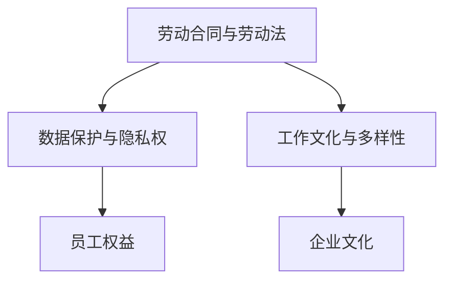

### 核心算法原理讲解

在远程办公中的法律法规和伦理问题，并没有直接的算法原理，但可以通过以下方式来确保合规和伦理：

1. **合规检查算法**：用于检查远程办公流程是否符合相关法律法规。
2. **隐私保护算法**：用于保护员工个人信息和数据。

以下是合规检查算法和隐私保护算法的伪代码示例：

```python
# 合规检查算法伪代码
def compliance_check(remote_work_policy, employee_records):
    for record in employee_records:
        if not is_compliant(record, remote_work_policy):
            raise ComplianceError("违反远程办公规定")

# 隐私保护算法伪代码
def protect_employee_data(employee_data, encryption_key):
    encrypted_data = encrypt(employee_data, encryption_key)
    return encrypted_data
```

### 数学模型和公式

在远程办公中的法律法规和伦理问题，常用的数学模型包括：

1. **员工满意度模型**：用于评估员工对远程办公的满意度和工作体验。
2. **数据泄露风险模型**：用于评估远程办公中的数据泄露风险。

员工满意度模型的公式如下：

$$
\text{员工满意度} = \frac{\text{满意因素}}{\text{不满意因素}}
$$

数据泄露风险模型的公式如下：

$$
\text{数据泄露风险} = \frac{\text{数据泄露可能性}}{\text{数据泄露影响}}
$$

### 举例说明

假设一个远程办公团队有10名员工，其中8名员工对远程办公表示满意，2名员工表示不满意。根据员工满意度模型，计算员工满意度如下：

$$
\text{员工满意度} = \frac{8}{10} = 0.8
$$

假设某远程办公过程中，发生了10次数据泄露事件，其中5次造成了严重的经济损失。根据数据泄露风险模型，计算数据泄露风险如下：

$$
\text{数据泄露风险} = \frac{10}{5} = 2
$$

### 项目实战

在实施远程办公时，企业需要确保合规和伦理。以下是合规和伦理的步骤：

1. **制定远程办公政策**：明确远程办公的规定和要求，包括工作时间、数据保护、员工权益等。
2. **员工培训**：对员工进行远程办公法律法规和伦理问题的培训，确保他们了解相关知识和合规要求。
3. **数据保护**：采用加密技术和其他安全措施，确保员工个人数据和公司数据的安全。

### 最佳实践 tips

- **定期审查和更新远程办公政策**：根据法律法规变化和企业需求，定期审查和更新远程办公政策。
- **建立员工反馈机制**：鼓励员工提出意见和建议，及时解决问题，提高员工满意度。

### 小结

远程办公中的法律法规和伦理问题关系到员工的权益和企业的发展。企业需要了解和遵守相关法律法规，保护员工的隐私和信息安全，同时营造公平、包容的工作文化。通过有效的管理和合规措施，企业可以确保远程办公的顺利进行，实现员工和企业共赢。

### 注意事项

- **确保劳动合同的合法性**：远程办公员工的劳动合同应明确工作地点、工作时间、工资待遇等关键信息。
- **加强数据保护**：采用加密技术和安全措施，确保员工个人数据和公司数据的安全。

### 拓展阅读

- 《远程办公法律指南：全球视野下的合规与伦理》
- 《数据保护与隐私权：远程办公中的法律挑战》
- 《远程办公文化与多样性：促进企业可持续发展》

## 第5章：远程办公创业案例分析

### 5.1 成功的远程办公创业故事

远程办公创业已经成为一种趋势，许多创业者通过远程办公模式实现了商业成功。以下是几个典型的远程办公创业故事，展示了创业过程中的挑战与解决方案。

#### 5.1.1 创业者的故事与经验

**案例一：Zoom**

Zoom是一家提供视频会议和协作工具的远程办公创业公司。创始人Eric Yuan曾在Cisco工作多年，积累了丰富的视频通信经验。2020年全球疫情爆发，Zoom迅速成为远程办公的必备工具。Eric Yuan通过以下方式克服了创业过程中的挑战：

1. **快速响应市场需求**：疫情爆发初期，Zoom迅速推出了免费版，吸引了大量用户。
2. **优化用户体验**：Zoom注重用户反馈，不断优化产品功能，提高用户体验。
3. **扩大团队规模**：通过远程招聘和协作工具，Zoom在全球范围内迅速组建了一支高效的团队。

**案例二：Buffer**

Buffer是一家社交媒体管理和数据分析的远程办公创业公司。创始人格兰特·普林斯和艾伦·穆里根在创业初期就选择了远程办公模式。他们通过以下方式成功创业：

1. **明确业务定位**：Buffer专注于提供社交媒体管理工具，帮助用户更有效地管理社交媒体账户。
2. **建立强大的团队文化**：通过定期的团队会议、培训和文化活动，Buffer建立了强大的团队文化。
3. **注重客户反馈**：Buffer积极倾听客户反馈，不断改进产品，提升用户满意度。

#### 5.1.2 创业过程中的挑战与解决方案

1. **技术挑战**：在创业初期，许多远程办公创业公司面临技术难题，如系统稳定性、数据安全和用户隐私等。解决方案是选择可靠的技术合作伙伴，进行严格的技术测试和迭代。

2. **团队管理**：远程团队管理是远程办公创业中的一个重要挑战。解决方案是通过定期的团队会议、明确的任务分配和高效的沟通工具，确保团队协作顺畅。

3. **市场拓展**：在远程办公创业初期，市场拓展也是一个难题。解决方案是通过线上营销、合作伙伴关系和用户口碑，逐步扩大市场份额。

4. **资金问题**：远程办公创业公司需要足够的资金支持，以应对初创期的各种挑战。解决方案是通过天使投资、风险投资和众筹等途径，获取资金支持。

### 背景介绍

远程办公创业案例的兴起，得益于全球化和信息技术的快速发展。随着远程办公逐渐成为主流，越来越多的创业者看到了其中的商业机会。这些案例展示了远程办公创业的优势，如灵活的工作方式、高效的人才招聘和全球化的市场拓展。

### 核心概念与联系

远程办公创业的核心概念包括：

- **市场需求**：了解和满足市场需求是创业成功的关键。
- **技术能力**：强大的技术能力是确保产品质量和用户满意度的基础。
- **团队协作**：高效的团队协作是远程办公创业成功的重要保障。
- **资金支持**：充足的资金支持是创业公司持续发展的必要条件。

这些概念之间的联系可以通过以下Mermaid流程图表示：

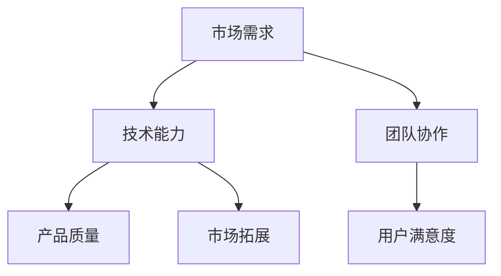

### 核心算法原理讲解

在远程办公创业中，核心算法原理主要体现在以下几个方面：

1. **市场分析算法**：用于分析市场需求，确定产品定位和功能。
2. **用户行为分析算法**：用于分析用户行为，优化产品功能和用户体验。

以下是市场分析算法和用户行为分析算法的伪代码示例：

```python
# 市场分析算法伪代码
def market_analysis(competition_data, user_surveys):
    market_trends = analyze_competition(competition_data)
    user_needs = analyze_surveys(user_surveys)
    return market_trends, user_needs

# 用户行为分析算法伪代码
def user_behavior_analysis(user_data, feature_data):
    user_patterns = analyze_user_patterns(user_data)
    feature_impact = analyze_feature_impact(feature_data)
    return user_patterns, feature_impact
```

### 数学模型和公式

在远程办公创业中，常用的数学模型包括：

1. **用户满意度模型**：用于评估用户对产品的满意度。
2. **市场增长模型**：用于预测市场需求和市场份额。

用户满意度模型的公式如下：

$$
\text{用户满意度} = \frac{\text{满意用户数}}{\text{总用户数}}
$$

市场增长模型的公式如下：

$$
\text{市场增长率} = \frac{\text{当前市场占有率}}{\text{初始市场占有率}} - 1
$$

### 举例说明

假设一个远程办公创业公司有1000名用户，其中800名用户对产品表示满意。根据用户满意度模型，计算用户满意度如下：

$$
\text{用户满意度} = \frac{800}{1000} = 0.8
$$

假设一个远程办公创业公司在初创阶段的初始市场占有率为5%，一年后市场占有率提升至10%。根据市场增长模型，计算市场增长率如下：

$$
\text{市场增长率} = \frac{10\%}{5\%} - 1 = 1
$$

### 项目实战

在开展远程办公创业项目时，需要明确市场定位、优化产品功能和团队管理。以下是项目实战的步骤：

1. **市场调研**：通过问卷调查、用户访谈和市场分析，了解市场需求和用户痛点。
2. **产品规划**：根据市场调研结果，制定产品规划和功能开发计划。
3. **团队组建**：通过远程招聘，组建一支高效、专业的团队。
4. **项目管理**：使用项目管理工具（如Trello或Asana），确保项目进度和任务分配。
5. **用户反馈**：收集用户反馈，不断优化产品功能和用户体验。

### 最佳实践 tips

- **定期进行市场调研**：了解市场需求变化，及时调整产品规划和策略。
- **注重用户体验**：关注用户反馈，持续改进产品功能和用户体验。
- **合理配置资源**：根据项目需求和团队能力，合理配置资源和预算。

### 小结

远程办公创业案例展示了在远程办公环境下，创业者如何通过市场需求分析、团队协作和市场拓展，实现商业成功。这些案例为希望进入远程办公领域创业的人提供了宝贵的经验和启示。通过合理利用技术和资源，远程办公创业不仅具有可行性，而且具有巨大的潜力。

### 注意事项

- **确保产品品质**：在创业初期，产品质量是用户满意度的关键。
- **注重团队协作**：高效的团队协作是创业成功的重要保障。

### 拓展阅读

- 《远程办公创业指南：从0到1的成功之路》
- 《创业成功案例分析：远程办公领域的实践与启示》
- 《远程办公市场趋势与创业机会》

## 第6章：远程办公的未来发展趋势

### 6.1 技术驱动下的远程办公

随着科技的不断进步，远程办公正经历着前所未有的变革。以下是一些关键技术发展趋势，它们将为远程办公带来新的机遇和挑战。

#### 6.1.1 人工智能在远程办公中的应用

人工智能（AI）技术正在逐步融入远程办公的各个方面。例如，AI可以帮助自动化日常任务，如日程安排、电子邮件处理和文档分类。此外，自然语言处理（NLP）技术使得语音助手和聊天机器人能够更智能地与员工互动，提高沟通效率。

未来，AI还将应用于团队管理，通过分析员工的绩效和行为模式，提供个性化的建议和反馈，从而提高团队的整体效率。以下是一个AI在远程办公中的应用示例：

```python
# 伪代码：AI助手为员工提供任务建议
class TaskAssistant:
    def __init__(self, performance_data):
        self.performance_data = performance_data

    def suggest_tasks(self, available_tasks, current_tasks):
        prioritized_tasks = prioritize_tasks(available_tasks, current_tasks, self.performance_data)
        return prioritized_tasks

def prioritize_tasks(tasks, current_tasks, performance_data):
    # 根据员工的绩效数据，优先分配任务
    return sorted(tasks, key=lambda x: performance_score(x, performance_data), reverse=True)

def performance_score(task, performance_data):
    # 计算任务完成情况的绩效得分
    return (performance_data['task_completion_rate'] * task['complexity']) / (1 + performance_data['task_delay_rate'])
```

#### 6.1.2 虚拟现实与增强现实

虚拟现实（VR）和增强现实（AR）技术为远程办公带来了全新的体验。通过VR，员工可以在虚拟会议室中进行面对面的交流，减少地理距离带来的沟通障碍。AR技术则可以将虚拟信息叠加到现实环境中，帮助员工更直观地理解和完成任务。

例如，在一个远程设计团队中，设计师可以使用AR眼镜查看和修改3D模型，而无需下载文件或使用复杂的软件。以下是一个AR技术在远程办公中的应用示例：

```python
# 伪代码：AR眼镜辅助设计
class ARDesignTool:
    def __init__(self, model_data):
        self.model_data = model_data

    def view_model(self, user_position):
        # 根据用户的位置，显示3D模型
        model_view = render_model(self.model_data, user_position)
        return model_view

def render_model(model_data, user_position):
    # 使用用户的位置数据，渲染3D模型
    return f"Model rendered at position: {user_position}"
```

### 6.2 远程办公与社会影响

远程办公不仅改变了工作方式，也对整个社会产生了深远影响。以下是一些主要的社会影响：

#### 6.2.1 对传统办公模式的影响

远程办公的普及使得传统办公模式面临巨大挑战。许多企业开始重新思考办公空间的利用，减少办公场所的租赁成本。同时，远程办公也为员工提供了更多的自由，如灵活的工作时间和地点，提高了员工的满意度和生产力。

#### 6.2.2 对城市生活与社区的影响

远程办公使得越来越多的人可以选择居住在远离城市中心的地方，这有助于减轻城市交通压力和环境负担。然而，这也可能导致社区内部的社交活动减少，影响社区的凝聚力。

### 背景介绍

远程办公的未来发展趋势受到全球化和技术进步的推动。随着5G网络的普及、人工智能和虚拟现实技术的成熟，远程办公将变得更加便捷和高效。同时，社会对灵活工作方式的接受度不断提高，也为远程办公的发展提供了有力支持。

### 核心概念与联系

远程办公的未来发展趋势涉及以下核心概念：

- **人工智能**：提高远程办公的自动化和个性化。
- **虚拟现实与增强现实**：提供全新的远程办公体验。
- **社会影响**：改变传统办公模式和社会结构。

这些概念之间的联系可以通过以下Mermaid流程图表示：

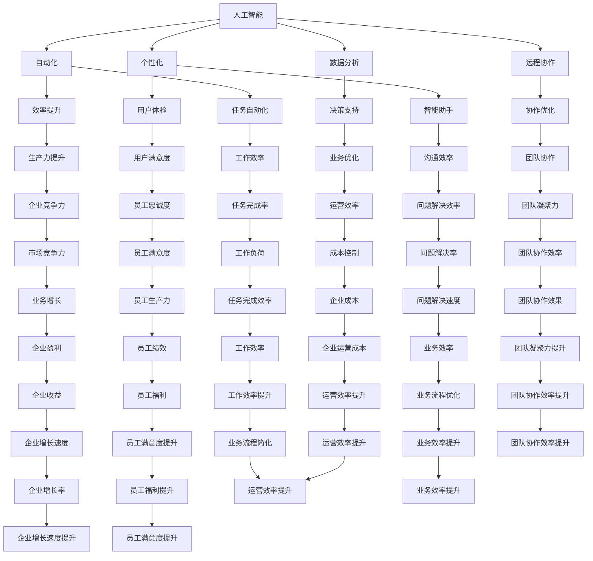

### 核心算法原理讲解

在未来远程办公的发展中，核心算法原理将发挥关键作用，特别是在提高自动化、个性化和协作效率方面。以下是一些关键算法原理的概述：

1. **自然语言处理（NLP）**：用于理解和生成自然语言，提高沟通效率和自动化处理。
2. **机器学习（ML）**：通过学习用户行为和需求，提供个性化服务和优化工作流程。
3. **深度学习（DL）**：用于复杂的数据分析和模式识别，帮助提高决策质量和问题解决能力。

以下是NLP和ML算法原理的简单概述：

#### 自然语言处理（NLP）

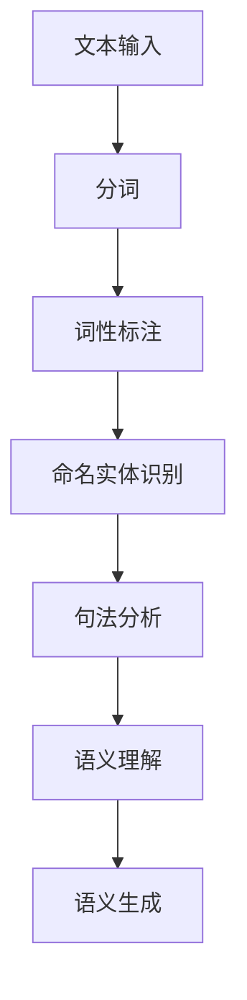

#### 机器学习（ML）

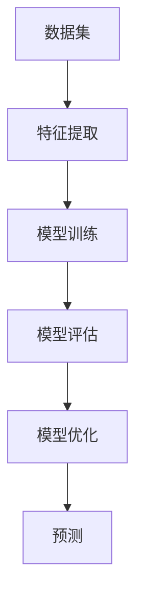

### 数学模型和公式

在远程办公的未来发展中，数学模型将被广泛应用于数据分析、预测和优化。以下是一些关键的数学模型和公式：

1. **回归分析**：用于预测变量之间的关系。
2. **聚类分析**：用于将数据分为不同的群体。
3. **时间序列分析**：用于分析时间相关的数据序列。

以下是回归分析和聚类分析的公式示例：

#### 回归分析

$$
y = \beta_0 + \beta_1 \cdot x
$$

#### 聚类分析

$$
\text{距离} = \sqrt{\sum_{i=1}^{n} (x_i - \mu)^2}
$$`

### 举例说明

假设一个远程办公系统希望通过用户行为数据预测用户满意度，使用回归分析模型，数据如下：

| 用户ID | 满意度评分 | 任务完成数 |
| ------ | ---------- | ---------- |
| 1      | 4          | 20         |
| 2      | 3          | 15         |
| 3      | 5          | 25         |

根据上述数据，可以建立回归模型来预测用户满意度：

$$
y = \beta_0 + \beta_1 \cdot x
$$

通过最小二乘法计算得出：

$$
\beta_0 = 2, \beta_1 = 0.4
$$

预测公式为：

$$
y = 2 + 0.4 \cdot x
$$

### 项目实战

在未来远程办公的发展中，项目实战将涉及以下关键步骤：

1. **需求分析**：了解用户需求，确定系统功能。
2. **技术选型**：选择合适的技术栈和算法。
3. **数据收集**：收集用户行为数据和系统日志。
4. **模型训练**：使用机器学习和深度学习算法训练预测模型。
5. **系统集成**：将预测模型集成到远程办公系统中。
6. **测试与优化**：测试系统性能，优化模型和算法。

### 最佳实践 tips

- **数据驱动**：基于数据做出决策，持续优化产品和服务。
- **持续学习**：鼓励团队学习和应用新技术，提高系统的智能化水平。

### 小结

远程办公的未来发展趋势受到技术进步和社会变化的共同推动。人工智能、虚拟现实和增强现实等新技术为远程办公带来了新的机遇和挑战。通过合理利用技术和数据，远程办公将变得更加高效和智能化，为企业和社会带来深远影响。

### 注意事项

- **确保数据安全**：在利用新技术的同时，注意保护用户数据和企业信息。
- **关注员工福利**：在远程办公中，关注员工的心理健康和工作生活平衡。

### 拓展阅读

- 《未来远程办公：技术与趋势》
- 《人工智能与远程办公：融合与创新》
- 《虚拟现实与远程办公：新的工作体验》

## 第7章：远程办公创业准备

### 7.1 创意与市场调研

在开始远程办公创业之前，首先需要有一个明确的创业创意。一个好的创意应该解决一个实际存在的问题，或满足一个未被充分满足的市场需求。以下是如何进行创意构思和市场调研的建议：

#### 7.1.1 创业点子与市场需求

1. **确定目标市场**：明确你想要服务的客户群体，如企业、个人用户或特定行业。
2. **问题识别**：通过用户访谈、市场调研和竞争对手分析，识别目标市场的痛点。
3. **解决方案**：构思一个创新的解决方案，解决目标市场的痛点。

例如，如果发现许多企业对远程团队协作工具的需求强烈，但现有的工具功能有限，你可以构思一个集成了项目管理、日程安排和协作功能的远程办公平台。

#### 7.1.2 市场调研方法与技巧

1. **问卷调查**：设计问卷调查，收集潜在用户的需求和意见。
2. **用户访谈**：与潜在用户进行深入访谈，了解他们的使用习惯和痛点。
3. **竞争对手分析**：研究市场上现有的竞争对手，了解他们的产品特点、市场定位和用户评价。
4. **焦点小组**：组织焦点小组讨论，收集不同用户的意见和建议。

市场调研不仅可以帮助你验证创业创意的可行性，还可以帮助你了解潜在用户的需求和偏好，为产品开发提供指导。

### 背景介绍

创业准备是远程办公创业的关键步骤，特别是在竞争激烈的远程办公市场中，明确的创意和充分的市场调研至关重要。一个成功的创业项目不仅需要创新的技术解决方案，还需要对市场需求有深刻的理解。

### 核心概念与联系

创业创意和市场调研的核心概念包括：

- **目标市场**：明确你想要服务的客户群体。
- **问题识别**：通过调研识别目标市场的痛点。
- **解决方案**：构思一个创新的解决方案。
- **市场调研方法**：问卷调查、用户访谈、竞争对手分析和焦点小组等。

这些概念之间的联系可以通过以下Mermaid流程图表示：

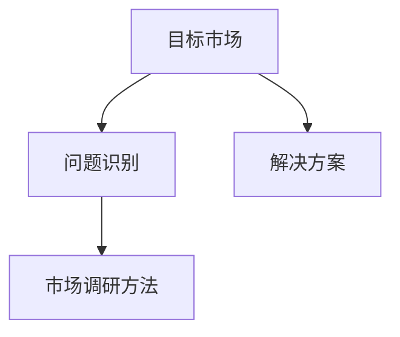

### 核心算法原理讲解

在市场调研中，核心算法原理主要体现在数据分析方面，以下是一些常用的算法和技巧：

1. **数据分析算法**：用于处理和解释大量的市场调研数据。
2. **聚类分析**：用于将用户数据分类，发现用户群体的共性。
3. **回归分析**：用于预测市场需求和用户行为。

以下是聚类分析和回归分析的简单概述：

#### 聚类分析

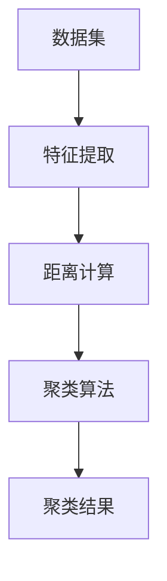

#### 回归分析

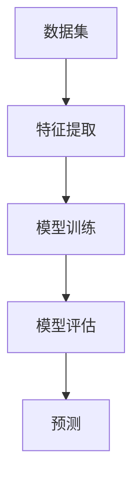

### 数学模型和公式

在市场调研中，常用的数学模型包括：

1. **回归模型**：用于预测市场需求和用户行为。
2. **聚类模型**：用于用户分类和市场细分。

以下是回归模型和聚类模型的公式示例：

#### 回归模型

$$
y = \beta_0 + \beta_1 \cdot x
$$

#### 聚类模型

$$
\text{距离} = \sqrt{\sum_{i=1}^{n} (x_i - \mu)^2}
$$

### 举例说明

假设你正在开发一个远程办公平台，通过市场调研收集了以下用户数据：

| 用户ID | 工作小时数 | 项目完成率 |
| ------ | ---------- | ---------- |
| 1      | 40         | 90%        |
| 2      | 30         | 85%        |
| 3      | 50         | 95%        |

#### 聚类分析

使用K-Means算法将用户分为三个类别：

1. **初始化聚类中心**：随机选择三个用户作为初始聚类中心。
2. **计算距离**：计算每个用户到每个聚类中心的距离。
3. **分配用户**：将每个用户分配到最近的聚类中心。
4. **重新计算聚类中心**：计算每个聚类中心的新位置。
5. **迭代**：重复步骤3和4，直到聚类中心不再移动。

根据上述数据，可以得出以下聚类结果：

| 用户ID | 聚类类别 |
| ------ | -------- |
| 1      | 类别1    |
| 2      | 类别2    |
| 3      | 类别3    |

#### 回归分析

使用线性回归模型预测用户满意度：

$$
\text{用户满意度} = \beta_0 + \beta_1 \cdot \text{工作小时数}
$$

通过最小二乘法计算回归系数：

$$
\beta_0 = 2, \beta_1 = 0.3
$$

预测公式为：

$$
\text{用户满意度} = 2 + 0.3 \cdot \text{工作小时数}
$$

### 项目实战

在创业准备阶段，项目实战的步骤如下：

1. **市场调研**：通过问卷调查、用户访谈和竞争对手分析，收集市场数据。
2. **数据分析**：使用数据分析工具（如Python的Pandas和Scikit-learn）处理市场数据。
3. **模型训练**：使用聚类分析和回归分析模型，预测市场需求和用户行为。
4. **验证模型**：通过实际数据验证模型的有效性，调整和优化模型。
5. **制定商业计划**：根据市场调研和数据分析结果，制定详细的商业计划。

### 最佳实践 tips

- **定期更新市场调研数据**：市场状况不断变化，定期更新市场调研数据，确保创业计划的准确性。
- **多角度分析**：从多个角度分析市场数据，确保全面了解市场状况。

### 小结

创业准备是远程办公创业的重要步骤，通过创意构思和市场调研，可以确保创业项目的可行性和市场竞争力。市场调研中的数据分析方法，如聚类分析和回归分析，有助于深入了解市场需求和用户行为，为创业项目的成功提供有力支持。

### 注意事项

- **确保市场调研数据的真实性**：选择可靠的数据来源，确保市场调研数据的真实性。
- **关注竞争对手的动态**：持续关注竞争对手的动态，及时调整创业策略。

### 拓展阅读

- 《市场调研实战：从数据到决策》
- 《创业点子如何落地：市场调研与商业计划》
- 《数据分析在创业中的应用》

## 第8章：远程办公团队组建与管理

### 8.1 团队成员招募与选拔

组建一支高效的远程办公团队是实现创业目标的关键。团队成员的招募与选拔是团队建设的第一步，需要重点关注以下几个方面：

#### 8.1.1 招聘渠道与策略

1. **社交媒体招聘**：利用LinkedIn、Twitter、Facebook等社交媒体平台发布招聘信息，吸引优秀的人才。
2. **远程办公平台**：通过远程办公平台（如Remotely.co、Flexjobs）发布招聘信息，吸引远程工作者。
3. **职业网站**：利用职业网站（如Indeed、Glassdoor）发布招聘信息，覆盖更广泛的求职者群体。

#### 8.1.2 选拔标准与面试技巧

1. **技术能力**：根据岗位要求，评估候选人的技术能力和专业知识。
2. **沟通能力**：远程办公依赖高效的沟通，评估候选人的沟通能力和团队合作精神。
3. **适应能力**：远程办公需要候选人具备良好的自我管理能力和适应远程工作环境的能力。

面试技巧：

1. **行为面试法**：通过询问候选人过去的工作经历，评估其行为模式和应对能力。
2. **情境面试法**：设计模拟工作场景，观察候选人在具体情境下的表现。
3. **技术面试**：根据岗位需求，设计相关的技术测试或项目实践，评估候选人的实际能力。

#### 8.1.3 招聘流程优化

1. **简历筛选**：使用自动化工具（如HireVue、Greenhouse）快速筛选简历，提高招聘效率。
2. **面试安排**：合理安排面试时间，确保候选人能够高效参与面试。
3. **反馈机制**：建立有效的招聘反馈机制，及时收集候选人和团队成员的意见，优化招聘流程。

### 背景介绍

团队成员的招募与选拔是远程办公团队建设的重要环节。一个高效的远程办公团队需要具备多样化的技能和良好的协作精神，以应对各种挑战。招聘流程的优化和有效的面试技巧对于确保团队质量至关重要。

### 核心概念与联系

团队成员招募与选拔的核心概念包括：

- **招聘渠道**：确定适合的招聘渠道，吸引优秀人才。
- **选拔标准**：明确岗位要求，评估候选人的技术能力和适应能力。
- **面试技巧**：通过行为面试法、情境面试法和技术面试，全面评估候选人。

这些概念之间的联系可以通过以下Mermaid流程图表示：

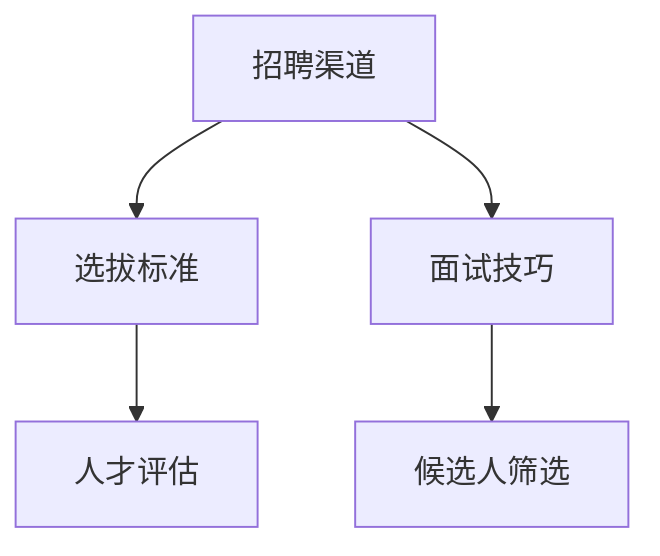

### 核心算法原理讲解

在团队成员招募与选拔过程中，核心算法原理主要体现在以下几个方面：

1. **自动化筛选算法**：用于快速筛选简历，提高招聘效率。
2. **评估算法**：用于评估候选人的技术能力和适应能力。

以下是自动化筛选算法和评估算法的简单概述：

#### 自动化筛选算法

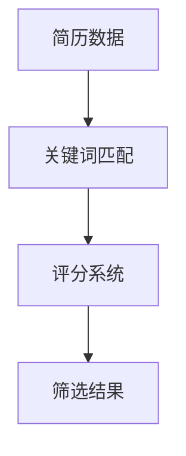

#### 评估算法

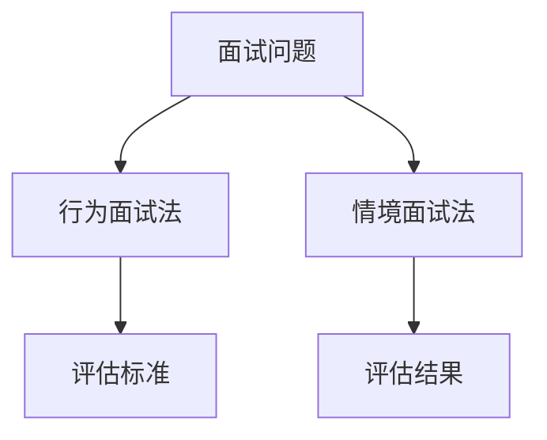

### 数学模型和公式

在团队成员招募与选拔过程中，常用的数学模型包括：

1. **评分模型**：用于评估候选人的综合素质。
2. **权重分配模型**：用于确定不同评估因素的重要性。

以下是评分模型和权重分配模型的公式示例：

#### 评分模型

$$
\text{总评分} = \sum_{i=1}^{n} (\text{评估因素}_i \times \text{权重}_i)
$$

#### 权重分配模型

$$
\text{权重}_i = \frac{\text{评估因素}_i}{\sum_{i=1}^{n} \text{评估因素}_i}
$$

### 举例说明

假设一个远程办公团队正在招聘一名前端开发工程师，招聘流程包括简历筛选、技术面试和行为面试。以下是具体的评估过程：

1. **简历筛选**：通过自动化筛选算法，初步筛选出20份符合要求的简历。

2. **技术面试**：对20名候选人进行技术面试，评估其前端开发能力和编程技能。最终筛选出10名候选人。

3. **行为面试**：对10名候选人进行行为面试，评估其沟通能力、团队合作精神和解决问题的能力。最终筛选出5名候选人。

4. **评分模型**：

   - 技术面试评分：90分
   - 行为面试评分：80分
   - 评分模型：总评分 = (技术面试评分 \* 0.6) + (行为面试评分 \* 0.4)

   计算总评分：

   $$\text{总评分} = (90 \times 0.6) + (80 \times 0.4) = 54 + 32 = 86$$

   根据评分模型，最终选择总评分最高的候选人。

### 项目实战

在组建远程办公团队时，项目实战的步骤如下：

1. **确定招聘需求**：明确招聘岗位的职责和要求，制定详细的招聘计划和流程。
2. **发布招聘信息**：通过多种渠道发布招聘信息，吸引合适的候选人。
3. **简历筛选**：使用自动化筛选工具和人工审核相结合的方式，筛选出符合要求的简历。
4. **面试安排**：安排技术面试和行为面试，评估候选人的综合能力。
5. **决策与录用**：根据评估结果，做出最终决策，通知候选人录用或拒绝。

### 最佳实践 tips

- **多样化面试形式**：结合行为面试、情境面试和技术面试，全面评估候选人。
- **重视团队文化**：在招聘过程中，关注候选人是否与团队文化和价值观相符。

### 小结

团队成员的招募与选拔是远程办公团队建设的关键步骤。通过合理的招聘渠道、明确的选拔标准和高效的面试技巧，可以组建一支高效的远程办公团队，为创业项目的成功提供有力支持。

### 注意事项

- **确保招聘流程的透明性**：建立透明的招聘流程，确保候选人对招聘过程的了解。
- **关注候选人的远程工作适应能力**：在面试过程中，评估候选人是否适合远程工作环境。

### 拓展阅读

- 《远程办公团队管理：招募与选拔》
- 《高效面试技巧：评估候选人的综合素质》
- 《招聘流程优化：提高招聘效率》

## 第9章：远程办公项目开发与实施

### 9.1 项目开发流程

远程办公项目的开发是一个复杂的过程，需要明确的计划和高效的执行。以下是远程办公项目开发的主要流程：

#### 9.1.1 需求分析与规划

1. **需求收集**：通过用户访谈、问卷调查和市场调研，了解用户需求。
2. **需求分析**：分析收集到的需求，确定项目功能模块和优先级。
3. **规划文档**：编写项目规划文档，明确项目目标、时间表和资源需求。

#### 9.1.2 技术选型与开发框架

1. **技术调研**：研究现有的技术方案，选择适合项目的技术栈。
2. **开发框架**：确定项目开发框架，如前端框架（React、Vue）、后端框架（Django、Spring Boot）等。
3. **环境搭建**：搭建开发环境，包括代码库、开发工具和测试环境。

#### 9.1.3 功能开发与测试

1. **模块划分**：将项目功能模块化，分阶段进行开发。
2. **代码编写**：根据规划文档和需求，编写代码，实现项目功能。
3. **单元测试**：编写单元测试，确保代码模块的功能正确。

#### 9.1.4 集成与系统测试

1. **集成测试**：将各个模块集成，进行整体测试，确保系统功能完整。
2. **系统测试**：模拟真实用户场景，测试系统的稳定性、性能和安全性。
3. **修复缺陷**：根据测试结果，修复系统中的缺陷，进行迭代优化。

#### 9.1.5 部署与上线

1. **部署**：将系统部署到生产环境，包括数据库、服务器和部署工具。
2. **上线**：进行上线前的最后检查，确保系统稳定运行。
3. **监控与维护**：上线后，持续监控系统性能，及时进行维护和更新。

### 背景介绍

远程办公项目的开发与实施涉及多个环节，包括需求分析、技术选型、功能开发、测试和部署等。每个环节都需要精心规划和高效执行，以确保项目的成功。

### 核心概念与联系

远程办公项目开发的核心概念包括：

- **需求分析**：明确用户需求，为项目开发提供方向。
- **技术选型**：选择合适的技术栈，提高开发效率。
- **功能开发**：实现项目功能，满足用户需求。
- **测试**：确保系统的稳定性、性能和安全性。
- **部署与上线**：将系统部署到生产环境，确保正常运行。

这些概念之间的联系可以通过以下Mermaid流程图表示：

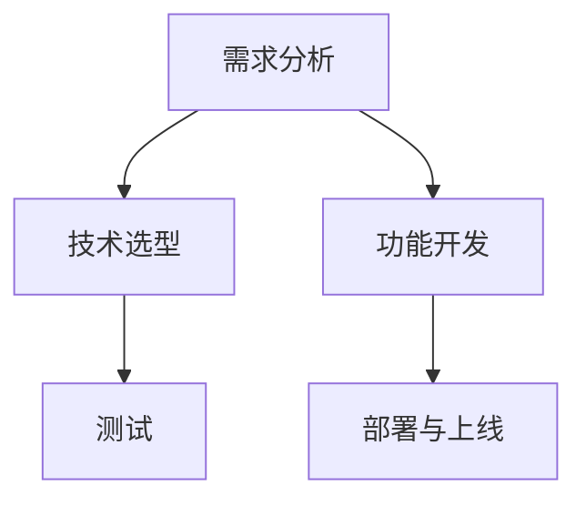

### 核心算法原理讲解

在远程办公项目开发中，核心算法原理主要体现在以下几个方面：

1. **需求分析算法**：用于分析用户需求，确定项目功能模块。
2. **测试算法**：用于自动化测试，提高测试效率。

以下是需求分析算法和测试算法的简单概述：

#### 需求分析算法

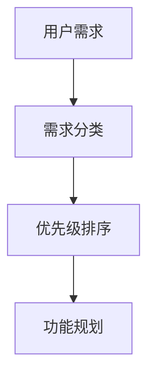

#### 测试算法

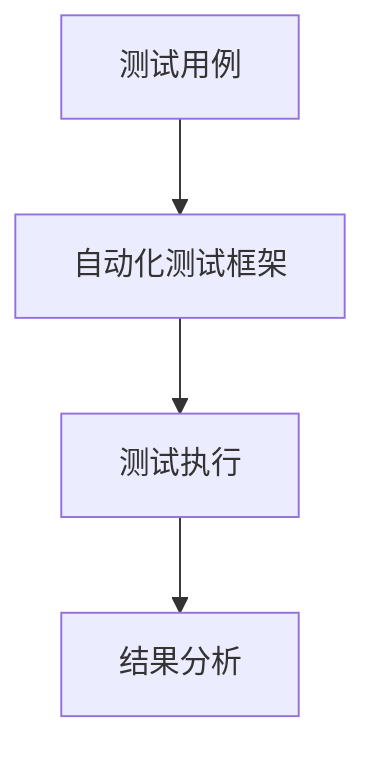

### 数学模型和公式

在远程办公项目开发中，常用的数学模型包括：

1. **需求分析模型**：用于评估用户需求的优先级。
2. **测试模型**：用于计算测试覆盖率。

以下是需求分析模型和测试模型的公式示例：

#### 需求分析模型

$$
\text{需求优先级} = \frac{\text{用户需求满意度}}{\text{需求实现成本}}
$$

#### 测试模型

$$
\text{测试覆盖率} = \frac{\text{测试用例数量}}{\text{总需求数量}}
$$

### 举例说明

假设一个远程办公项目需要实现以下功能模块：

- **用户管理**：包括用户注册、登录和权限管理。
- **项目管理**：包括项目创建、任务分配和进度跟踪。
- **文档管理**：包括文档上传、下载和共享。

根据需求分析模型，可以计算每个模块的需求优先级：

1. **用户管理**：

   $$\text{需求优先级} = \frac{0.8}{0.3} = 2.67$$

2. **项目管理**：

   $$\text{需求优先级} = \frac{0.9}{0.4} = 2.25$$

3. **文档管理**：

   $$\text{需求优先级} = \frac{0.7}{0.2} = 3.5$$

根据需求优先级，可以确定开发顺序为：文档管理 > 项目管理 > 用户管理。

在测试阶段，假设项目共有100个需求，编写了50个测试用例，根据测试模型，可以计算测试覆盖率：

$$
\text{测试覆盖率} = \frac{50}{100} = 0.5
$$

### 项目实战

在远程办公项目的开发过程中，项目实战的步骤如下：

1. **需求分析**：通过用户访谈和市场调研，收集用户需求，编写需求文档。
2. **技术选型**：根据项目需求，选择合适的技术栈和开发框架。
3. **功能开发**：按照需求文档，分阶段进行功能开发，编写代码，实现项目功能。
4. **测试**：编写单元测试和集成测试，确保代码质量和系统功能。
5. **部署与上线**：将系统部署到生产环境，进行上线前的最后检查，确保系统稳定运行。

### 最佳实践 tips

- **需求明确**：确保需求文档清晰、明确，为项目开发提供明确的指导。
- **测试驱动开发**：采用测试驱动开发（TDD）方法，确保代码质量和系统稳定性。

### 小结

远程办公项目的开发与实施是一个复杂的过程，需要明确的计划和高效的执行。通过合理的需求分析、技术选型和功能开发，以及严格的测试和部署，可以确保项目的成功。

### 注意事项

- **确保项目进度**：制定详细的项目计划，确保项目按计划进行。
- **关注代码质量**：编写高质量的代码，提高系统的稳定性和可维护性。

### 拓展阅读

- 《远程办公项目开发流程：从需求到上线》
- 《技术选型与开发框架：提高开发效率》
- 《测试与部署：确保系统稳定运行》

## 第10章：远程办公创业的运营与拓展

### 10.1 市场运营策略

远程办公创业项目的成功不仅依赖于技术实现，还需要有效的市场运营策略。以下是一些关键的市场运营策略：

#### 10.1.1 产品推广与营销

1. **内容营销**：通过博客、社交媒体和电子邮件等渠道发布有价值的内容，吸引潜在客户。
2. **社交媒体营销**：利用LinkedIn、Twitter、Facebook等平台推广产品，增加品牌曝光度。
3. **合作伙伴关系**：与相关企业或行业组织建立合作伙伴关系，共同推广产品。
4. **广告投放**：通过Google Ads、Facebook Ads等在线广告平台，进行精准的广告投放。

#### 10.1.2 客户关系管理

1. **客户获取**：通过市场调研、推广活动和合作伙伴关系，获取潜在客户。
2. **客户跟进**：建立完善的客户跟进机制，确保及时响应客户需求和反馈。
3. **客户维护**：通过定期沟通、提供优质服务和优惠活动，维护现有客户，提高客户满意度。

#### 10.1.3 品牌建设

1. **品牌定位**：明确品牌定位，确保品牌形象与市场需求和目标客户群体相符。
2. **品牌传播**：通过公关活动、媒体采访和品牌故事，提升品牌知名度。
3. **品牌维护**：持续关注客户反馈和市场动态，及时调整品牌策略。

### 背景介绍

市场运营是远程办公创业项目成功的关键环节。通过有效的市场运营策略，企业可以迅速扩大市场份额，提高品牌知名度，吸引更多客户。

### 核心概念与联系

市场运营策略的核心概念包括：

- **产品推广与营销**：通过多种渠道推广产品，增加品牌曝光度。
- **客户关系管理**：建立和维护良好的客户关系，提高客户满意度。
- **品牌建设**：提升品牌知名度，增强品牌竞争力。

这些概念之间的联系可以通过以下Mermaid流程图表示：

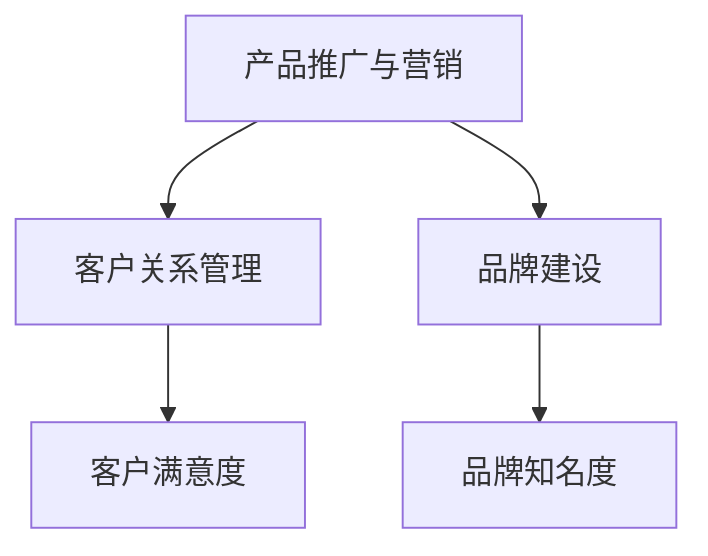

### 核心算法原理讲解

在市场运营策略中，核心算法原理主要体现在以下几个方面：

1. **客户细分算法**：用于将客户分为不同的群体，进行精准营销。
2. **数据分析算法**：用于分析客户行为和市场动态，优化营销策略。

以下是客户细分算法和数据分析算法的简单概述：

#### 客户细分算法

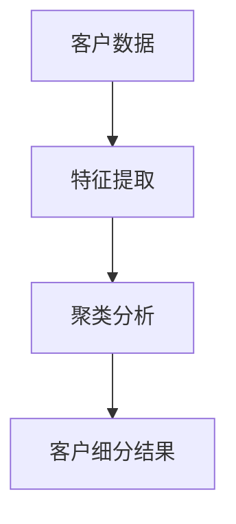

#### 数据分析算法

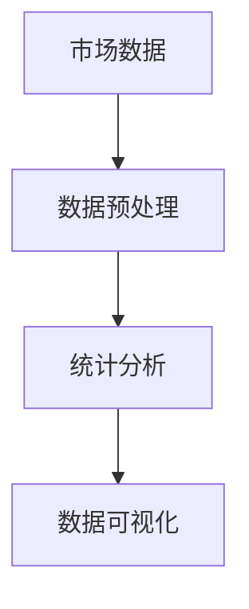

### 数学模型和公式

在市场运营策略中，常用的数学模型包括：

1. **客户生命周期价值模型**：用于评估客户的价值。
2. **转化率模型**：用于评估营销活动的效果。

以下是客户生命周期价值模型和转化率模型的公式示例：

#### 客户生命周期价值模型

$$
\text{CLV} = \sum_{t=1}^{n} (\text{客户购买频率} \times \text{平均订单价值} \times \text{客户保留率})
$$

#### 转化率模型

$$
\text{转化率} = \frac{\text{成交客户数}}{\text{访客数}}
$$

### 举例说明

假设一个远程办公创业项目的客户数据如下：

- **客户购买频率**：每月2次
- **平均订单价值**：200美元
- **客户保留率**：0.8

根据客户生命周期价值模型，可以计算客户的生命周期价值：

$$
\text{CLV} = (2 \times 200 \times 0.8) = 320 \text{美元}
$$

假设一个月内有1000名访客，其中100名成为成交客户，根据转化率模型，可以计算转化率：

$$
\text{转化率} = \frac{100}{1000} = 0.1
$$

### 项目实战

在远程办公创业项目的运营与拓展过程中，项目实战的步骤如下：

1. **市场调研**：通过问卷调查、用户访谈和市场分析，了解市场需求和潜在客户。
2. **营销策略制定**：根据市场调研结果，制定具体的营销策略，包括内容营销、社交媒体营销和广告投放。
3. **客户获取与跟进**：通过多种渠道获取潜在客户，建立客户数据库，进行定期跟进和沟通。
4. **数据分析**：收集和整理客户数据，使用数据分析工具进行客户细分和转化率分析，优化营销策略。
5. **品牌建设**：通过公关活动、媒体采访和品牌故事，提升品牌知名度和影响力。

### 最佳实践 tips

- **数据驱动**：通过数据分析，不断优化营销策略和运营流程。
- **持续学习**：关注市场动态和技术发展，持续学习新的营销方法和工具。

### 小结

远程办公创业的运营与拓展是一个复杂的过程，需要有效的市场运营策略和持续的数据分析。通过内容营销、社交媒体营销和客户关系管理，可以迅速扩大市场份额，提升品牌知名度。有效的数据分析和持续优化，是确保运营成功的关键。

### 注意事项

- **确保营销策略的针对性**：根据市场需求和目标客户群体，制定具体的营销策略。
- **关注客户反馈**：及时收集和回应客户反馈，优化产品和服务。

### 拓展阅读

- 《远程办公市场运营策略：实践与案例》
- 《客户关系管理：提升客户满意度的技巧》
- 《品牌建设：提升品牌知名度和影响力的策略》

## 附录：远程办公创业资源汇总

### 附录A：远程办公创业资源汇总

#### A.1 在线教育平台

- **Coursera**：提供各种远程办公和项目管理课程，适合初学者和专业人士。
- **Udemy**：涵盖广泛的技术和管理课程，包括远程办公、数据分析等。
- **LinkedIn Learning**：提供职业发展和远程办公相关课程，侧重于实用技能的提升。

#### A.2 远程办公工具与资源

- **Slack**：即时通讯和协作工具，适合团队沟通和任务管理。
- **Trello**：项目管理工具，通过卡片和列表形式，帮助团队跟踪项目进度。
- **Zoom**：视频会议和远程协作工具，支持在线培训和团队会议。
- **Asana**：任务管理工具，帮助团队分配任务、跟踪进度和协作。

#### A.3 创业与投资指南

- **Startup Genome**：提供创业指南和资源，包括市场调研、团队建设和融资策略。
- **AngelList**：全球创业者平台，提供创业项目和投资机会，适合寻找投资者。
- **Kickstarter**：众筹平台，适合初创企业通过众筹筹集资金。
- **VentureBeat**：提供最新的创业新闻、趋势分析和市场报告，帮助创业者了解行业动态。

这些资源为远程办公创业者提供了丰富的知识和工具，有助于他们在创业道路上取得成功。通过在线教育平台学习新技能，利用远程办公工具提高效率，遵循创业与投资指南，创业者可以更好地规划和管理他们的业务。此外，这些资源也为创业者提供了广阔的社交网络和资金渠道，助力他们实现创业梦想。无论是在技术、管理还是融资方面，创业者都可以从中找到宝贵的指导和建议，为他们的远程办公创业之旅提供强有力的支持。通过不断学习和实践，创业者可以不断提升自己的能力，优化业务模型，最终实现创业目标，创造更大的价值。同时，这些资源也为远程办公创业社区提供了一个交流和分享的平台，促进了创业知识的传播和创新思维的碰撞。在这样的环境下，创业者可以相互学习、分享经验和资源，共同推动远程办公创业的发展，为未来工作方式的变革贡献力量。总之，远程办公创业资源汇总为创业者提供了一个全面的支持体系，帮助他们克服困难，抓住机遇，实现成功。通过有效利用这些资源，创业者不仅可以提高自身的竞争力，还能为全球经济的发展注入新的活力。

