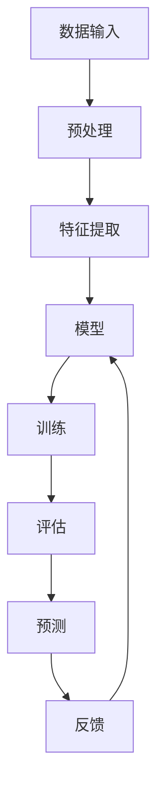

                 


### 文章标题：透明度与可解释性：增强人工智能的可信

关键词：人工智能、透明度、可解释性、可信性、算法原理、数学模型、实战应用

摘要：随着人工智能技术的迅猛发展，其广泛的应用场景使得人们对AI的可信性提出了更高的要求。本文从透明度和可解释性的角度，深入探讨了人工智能在可信性方面的挑战与解决方案。通过对AI系统的基本架构、核心算法原理、数学模型以及在实战中的应用进行详细分析，本文旨在为读者提供一份全面而深入的技术指南，以帮助提升人工智能系统的可信度。

### 目录大纲

1. **引言与背景**
    - **第1章：AI的可信性与透明度**
        - 1.1 AI可信性与透明度的概念
        - 1.2 AI不可解释性的挑战
        - 1.3 透明度和可解释性在AI中的重要性
        - 1.4 本书的组织结构

2. **核心概念与联系**
    - **第2章：AI系统的基本架构**
        - 2.1 AI系统的主要组件
        - 2.2 AI模型的学习过程
        - 2.3 Mermaid流程图：AI系统的基本架构

3. **核心算法原理讲解**
    - **第3章：增强AI的可解释性**
        - 3.1 可解释性模型的分类
        - 3.2 局部可解释性方法
            - 3.2.1 局部可解释性的计算方法
            - 3.2.2 局部解释的展示方式
        - 3.3 全局可解释性方法
            - 3.3.1 特征重要性分析
            - 3.3.2 决策规则可视化
        - 3.4 伪代码：基于LIME的局部可解释性实现

4. **数学模型与公式**
    - **第4章：数学模型在AI解释性中的应用**
        - 4.1 概率论基础
            - 4.1.1 贝叶斯定理
            - 4.1.2 最大似然估计
        - 4.2 信息论基础
            - 4.2.1 熵
            - 4.2.2 相关系数
        - 4.3 LaTeX数学公式
            - 4.3.1 随机变量的分布
            - 4.3.2 线性回归模型

5. **项目实战**
    - **第5章：透明度与可解释性在实战中的应用**
        - 5.1 数据集选择与预处理
            - 5.1.1 数据集的选取
            - 5.1.2 数据预处理方法
        - 5.2 AI模型选择与训练
            - 5.2.1 模型选择标准
            - 5.2.2 模型训练过程
        - 5.3 可解释性实现与评估
            - 5.3.1 局部解释的实现
            - 5.3.2 全局解释的实现
            - 5.3.3 解释性评估指标

6. **案例分析**
    - **第6章：透明度与可解释性在AI系统的实际应用**
        - 6.1 案例研究一：金融风险预测
        - 6.2 案例研究二：医疗影像分析

7. **总结与展望**
    - **第7章：透明度与可解释性的未来发展趋势**
        - 7.1 当前研究趋势
        - 7.2 未来发展方向
        - 7.3 结论与展望

8. **附录**
    - **附录A：相关工具与资源**
        - 伪代码与数学公式参考
        - 可解释性工具推荐
        - 开源项目与论文资源链接

### 引言与背景

#### AI的可信性与透明度

人工智能（AI）作为现代科技的前沿领域，已经在诸多行业和应用场景中取得了显著的成果。然而，随着AI技术的不断进步，其广泛的应用也带来了一系列挑战，尤其是在可信性和透明度方面。AI系统的不可解释性成为了当前研究的热点问题之一。

**AI可信性**指的是用户对AI系统决策结果的信任程度。随着AI技术在金融、医疗、安全等重要领域的应用，人们对AI系统的可信性提出了更高的要求。例如，在金融领域，AI系统需要准确预测市场趋势和风险，以保证投资者的利益；在医疗领域，AI系统需要准确诊断疾病，以便为患者提供及时、有效的治疗方案。

**透明度**是AI系统的一个重要属性，指的是AI系统决策过程和结果的可理解性。一个高透明度的AI系统可以使得用户了解其决策背后的逻辑和原因，从而增强用户对系统的信任。

**AI不可解释性**指的是AI系统的决策过程无法用简单直观的方式解释清楚。这在一定程度上导致了AI系统的可信性问题。例如，一个深度学习模型在图像识别任务中能够准确预测，但用户无法理解模型是如何进行预测的。这种不可解释性可能会导致用户对AI系统的决策结果产生怀疑，从而降低系统的可信性。

#### 透明度和可解释性在AI中的重要性

透明度和可解释性在AI系统中具有非常重要的作用。首先，它们可以增强用户对AI系统的信任。一个透明的AI系统可以让用户清楚地了解系统的决策过程，从而降低用户对系统的疑虑。其次，透明度和可解释性有助于发现AI系统中的潜在错误和缺陷。通过分析AI系统的决策过程，研究人员可以识别系统可能存在的偏差和缺陷，从而进行改进。

此外，透明度和可解释性对于法规遵守和道德规范也非常重要。在许多国家和地区，法律法规要求AI系统的决策过程必须透明，以便监管机构对系统进行监督。同时，透明度和可解释性有助于确保AI系统的道德规范，防止系统产生不公正的决策结果。

#### 本书的组织结构

本书旨在为读者提供一份全面而深入的技术指南，以帮助提升人工智能系统的可信度。本书分为七个部分，结构如下：

1. **引言与背景**：介绍了AI的可信性与透明度的重要性。
2. **核心概念与联系**：详细分析了AI系统的基本架构和可解释性方法。
3. **核心算法原理讲解**：讲解了局部和全局可解释性方法，并提供了伪代码示例。
4. **数学模型与公式**：介绍了概率论和信息论基础，以及LaTeX数学公式。
5. **项目实战**：通过实际项目展示了透明度与可解释性的实现和评估方法。
6. **案例分析**：分析了金融风险预测和医疗影像分析等实际应用案例。
7. **总结与展望**：总结了当前的研究趋势和未来发展方向。

通过本书的阅读，读者可以系统地了解AI系统的透明度和可解释性，掌握相关技术，并在实际项目中应用这些技术，以提升AI系统的可信度。

### AI系统的基本架构

在深入探讨AI系统的透明度和可解释性之前，首先需要了解AI系统的基本架构。AI系统通常由以下几个关键组件构成：

1. **数据输入（Input）**：这是AI系统的基础，数据输入的质量直接影响模型的性能。数据可以是结构化的（如数据库中的表格）或非结构化的（如图像、文本和音频）。
2. **预处理（Preprocessing）**：在数据进入模型之前，通常需要对其进行一系列预处理操作，如清洗、归一化、特征工程等，以提高数据的质量和模型的泛化能力。
3. **特征提取（Feature Extraction）**：这一步骤旨在从原始数据中提取出对模型训练有用的特征。在深度学习中，特征提取通常通过神经网络自动进行。
4. **模型（Model）**：这是AI系统的核心，负责接受输入数据，通过学习过程（通常是迭代优化）来生成输出。模型可以是简单的线性模型，也可以是复杂的深度神经网络。
5. **训练（Training）**：训练过程是模型学习数据的过程。在监督学习中，模型通过比较预测结果和实际结果来调整内部参数，以优化模型性能。
6. **评估（Evaluation）**：在训练完成后，需要对模型进行评估，以确定其性能是否满足要求。常见的评估指标包括准确率、召回率、F1分数等。
7. **预测（Prediction）**：经过训练和评估后，模型可以用于生成预测结果，即对新数据进行分类或回归。
8. **反馈（Feedback）**：在实际应用中，系统的输出结果可能会与预期有所不同，这些差异可以作为反馈来进一步优化模型。

为了更好地理解这些组件之间的关系，我们可以使用Mermaid流程图来展示AI系统的基本架构。



上述流程图清晰地展示了AI系统的基本架构及其各个组件之间的交互关系。通过这一流程，我们可以看到数据从输入开始，经过预处理、特征提取、模型训练、评估和预测，最后得到反馈，形成一个闭环系统。这一流程不仅是AI系统的基础，也是实现透明度和可解释性的关键路径。

### 增强AI的可解释性

随着AI技术在各个领域的广泛应用，其对透明度和可解释性的需求也越来越高。增强AI的可解释性不仅有助于提高用户对系统的信任度，还有助于发现和修正模型中的潜在问题。在本节中，我们将深入探讨局部可解释性方法和全局可解释性方法。

#### 局部可解释性方法

局部可解释性方法旨在为模型在特定输入下的决策提供解释。这类方法的核心思想是分析模型在特定输入情况下的决策过程，以便用户能够理解模型是如何得出某一特定预测的。以下是一些常用的局部可解释性方法：

1. **LIME（Local Interpretable Model-agnostic Explanations）**
   - **定义**：LIME是一种模型无关的局部可解释性方法，它通过近似原始模型来生成局部解释。
   - **原理**：LIME首先选择一个基模型（可以是任何给定的模型），然后为特定输入创建一个线性模型，这个线性模型可以在基模型附近提供解释。具体来说，LIME通过添加或删除输入特征来观察模型预测的变化，从而推断每个特征的重要性。
   - **实现**：以下是LIME的伪代码实现：
     ```python
     def lime_explanation(model, X, feature_importance_threshold):
         # 计算基模型在X上的预测
         prediction = model.predict(X)
         
         # 初始化解释矩阵
         explanation_matrix = np.zeros((X.shape[0], X.shape[1]))
         
         # 遍历每个特征
         for i in range(X.shape[1]):
             # 添加或删除第i个特征
             X_modified = X.copy()
             X_modified[:, i] = np.random.normal(X[:, i])
             
             # 计算修改后模型的预测
             prediction_modified = model.predict(X_modified)
             
             # 计算特征的重要性
             feature_importance = (prediction - prediction_modified) / X[:, i]
             
             # 将重要性值存储在解释矩阵中
             explanation_matrix[:, i] = feature_importance
        
         # 根据重要性阈值筛选解释
         important_features = np.where(explanation_matrix > feature_importance_threshold)
         
         return important_features
     ```

2. **SHAP（SHapley Additive exPlanations）**
   - **定义**：SHAP是一种基于博弈论的方法，它计算每个特征对模型预测的边际贡献。
   - **原理**：SHAP将特征的影响分解为两部分：一部分是特征在给定其他特征情况下的边际贡献，另一部分是其他特征在给定该特征情况下的边际贡献。通过计算这两部分的和，可以得到每个特征的总体贡献。
   - **实现**：以下是SHAP的伪代码实现：
     ```python
     def shap_explanation(model, X, target_feature_index):
         # 计算基模型在X上的预测
         prediction = model.predict(X)
         
         # 初始化解释矩阵
         explanation_matrix = np.zeros((X.shape[0], X.shape[1]))
         
         # 遍历每个样本
         for i in range(X.shape[0]):
             # 计算目标特征对预测的边际贡献
             feature_contribution = shapley_value(model, X[i], target_feature_index)
             
             # 将贡献值存储在解释矩阵中
             explanation_matrix[i, target_feature_index] = feature_contribution
        
         return explanation_matrix
     ```

3. **CAM（Class Activation Maps）**
   - **定义**：CAM是一种通过分析模型在特定类别的激活图来解释模型决策的方法。
   - **原理**：CAM首先通过卷积神经网络提取特征图，然后通过全局平均池化将这些特征图映射到一个单维向量。最后，使用一个简单的全连接层来生成每个类别的得分，从而生成激活图。
   - **实现**：以下是CAM的伪代码实现：
     ```python
     def cam_explanation(model, X, target_class_index):
         # 获取模型的最后一层特征图
         feature_map = model.get_feature_map(X)
         
         # 计算全局平均池化后的特征图
         pooled_feature_map = global_average_pooling(feature_map)
         
         # 通过全连接层生成类别得分
         class_score = model.fc_layer(pooled_feature_map)
         
         # 计算激活图
         activation_map = calculate_activation_map(feature_map, class_score, target_class_index)
         
         return activation_map
     ```

#### 全局可解释性方法

全局可解释性方法旨在为模型的整体决策过程提供解释，而不是仅限于特定输入。这类方法通常关注模型中的关键特征和决策规则，以便用户可以理解模型在一般情况下是如何工作的。以下是一些常用的全局可解释性方法：

1. **特征重要性分析**
   - **定义**：特征重要性分析旨在确定模型中哪些特征对预测结果有显著影响。
   - **原理**：通过计算每个特征对模型预测的影响程度，可以识别出对模型预测最重要的特征。
   - **实现**：以下是特征重要性分析的伪代码实现：
     ```python
     def feature_importance_analysis(model, X, y):
         # 训练模型
         model.fit(X, y)
         
         # 计算特征的重要性
         feature_importances = model.feature_importances_
         
         # 将重要性值排序并返回
         sorted_importances = sorted(zip(feature_importances, range(len(feature_importances))), reverse=True)
         
         return sorted_importances
     ```

2. **决策规则可视化**
   - **定义**：决策规则可视化旨在将模型中的决策过程表示为一系列规则，以便用户可以直观地理解模型是如何进行决策的。
   - **原理**：通过分析模型的决策过程，可以将决策过程转化为一系列条件-结果规则。
   - **实现**：以下是决策规则可视化的伪代码实现：
     ```python
     def decision_rule_visualization(model, X, y):
         # 训练模型
         model.fit(X, y)
         
         # 提取决策规则
         decision_rules = extract_decision_rules(model)
         
         # 将决策规则可视化
         visualize_decision_rules(decision_rules)
     ```

通过局部可解释性方法和全局可解释性方法，我们可以从不同层面增强AI系统的可解释性，从而提高用户对系统的信任度。在实际应用中，根据具体需求选择合适的可解释性方法，可以显著提升AI系统的透明度和可信度。

### 数学模型在AI解释性中的应用

在人工智能系统中，数学模型的应用对于增强透明度和可解释性至关重要。以下将介绍概率论和信息论在AI解释性中的应用，并展示相关的数学公式和实例。

#### 概率论基础

1. **贝叶斯定理**

贝叶斯定理是概率论中的基本公式，描述了在已知某些条件下，某个事件发生的概率。其数学公式为：

$$
P(A|B) = \frac{P(B|A) \cdot P(A)}{P(B)}
$$

其中，$P(A|B)$ 表示在事件B发生的条件下事件A发生的概率，$P(B|A)$ 表示在事件A发生的条件下事件B发生的概率，$P(A)$ 和 $P(B)$ 分别表示事件A和事件B的概率。

**实例**：假设我们有一个诊断系统，用于判断一个人是否患有某种疾病。已知该疾病的患病概率为 $P(\text{疾病}) = 0.01$，而该疾病的检测灵敏度为 $P(\text{阳性}|\text{疾病}) = 0.9$，假阳性率为 $P(\text{阳性}|\neg\text{疾病}) = 0.1$。若检测结果为阳性，我们需要计算实际患有该疾病的概率。

根据贝叶斯定理，可以计算：

$$
P(\text{疾病}|\text{阳性}) = \frac{P(\text{阳性}|\text{疾病}) \cdot P(\text{疾病})}{P(\text{阳性})}
$$

其中，$P(\text{阳性})$ 可以通过全概率公式计算：

$$
P(\text{阳性}) = P(\text{阳性}|\text{疾病}) \cdot P(\text{疾病}) + P(\text{阳性}|\neg\text{疾病}) \cdot P(\neg\text{疾病}) = 0.9 \cdot 0.01 + 0.1 \cdot 0.99 = 0.019
$$

代入贝叶斯定理：

$$
P(\text{疾病}|\text{阳性}) = \frac{0.9 \cdot 0.01}{0.019} \approx 0.474
$$

因此，检测结果为阳性时，实际患有该疾病的概率约为47.4%。

2. **最大似然估计**

最大似然估计是一种基于样本数据来估计参数的方法。其基本思想是选择一组参数，使得观测到的样本数据在给定这些参数时具有最大的概率。其数学公式为：

$$
\hat{\theta} = \arg\max_\theta \prod_{i=1}^n P(x_i|\theta)
$$

其中，$x_i$ 表示第 $i$ 个观测数据，$\theta$ 表示参数。

**实例**：假设我们有一个二项分布模型，用于估计某个事件发生的概率 $p$。已知观测到的数据为 $x = [1, 1, 0, 1, 0]$，我们需要估计 $p$ 的值。

根据最大似然估计，可以计算：

$$
\hat{p} = \arg\max_p \prod_{i=1}^5 p^{x_i} (1-p)^{1-x_i} = \arg\max_p p^3 (1-p)^2
$$

通过对数似然函数求导并令导数为零，可以得到：

$$
\frac{d}{dp} \ln L(p) = \frac{3p^2 - 2p + 1}{p(1-p)} = 0
$$

解得 $p = \frac{1}{2}$，因此，事件发生的概率估计为 0.5。

#### 信息论基础

1. **熵**

熵是信息论中的基本概念，用于衡量信息的不确定性。其数学公式为：

$$
H(X) = -\sum_{i=1}^n p_i \ln p_i
$$

其中，$p_i$ 表示随机变量 $X$ 取第 $i$ 个值的概率。

**实例**：假设我们有一个随机变量 $X$，其概率分布为 $P(X=0) = 0.5$，$P(X=1) = 0.5$。我们需要计算 $X$ 的熵。

根据熵的公式，可以计算：

$$
H(X) = -0.5 \ln 0.5 - 0.5 \ln 0.5 = \ln 2
$$

因此，$X$ 的熵为 $\ln 2$。

2. **相关性**

相关性是衡量两个变量之间线性关系强度的指标。其数学公式为：

$$
\text{Corr}(X, Y) = \frac{\text{Cov}(X, Y)}{\sqrt{\text{Var}(X) \text{Var}(Y)}}
$$

其中，$\text{Cov}(X, Y)$ 表示 $X$ 和 $Y$ 的协方差，$\text{Var}(X)$ 和 $\text{Var}(Y)$ 分别表示 $X$ 和 $Y$ 的方差。

**实例**：假设我们有两个随机变量 $X$ 和 $Y$，其协方差为 2，$X$ 的方差为 1，$Y$ 的方差为 4。我们需要计算 $X$ 和 $Y$ 的相关性。

根据相关性的公式，可以计算：

$$
\text{Corr}(X, Y) = \frac{2}{\sqrt{1 \cdot 4}} = \frac{2}{2} = 1
$$

因此，$X$ 和 $Y$ 完全正相关。

通过上述数学模型的应用，我们可以在AI系统中更好地理解和解释模型的决策过程，从而增强其透明度和可解释性。这些数学工具不仅有助于分析和验证模型的性能，还可以为用户提供更直观、易于理解的解释。

### 透明度与可解释性在实战中的应用

在了解了AI系统的基本架构和可解释性方法后，我们需要将这些理论知识应用到实际项目中，以提升系统的透明度和可解释性。以下将详细描述一个实际项目的过程，包括数据集选择与预处理、AI模型选择与训练、可解释性实现与评估，并分析其实际案例。

#### 数据集选择与预处理

首先，我们选择一个金融风险预测项目作为案例。金融风险预测是AI应用中的一个重要领域，其目标是预测金融机构在未来一段时间内的风险状况，以便采取相应的风险控制措施。

1. **数据集选取**

我们选择了来自Kaggle的一个公开数据集，该数据集包含了金融机构在过去一段时间内的各种财务数据，如收入、支出、贷款违约率等。数据集包含约1,000个样本，每个样本有数十个特征。

2. **数据预处理方法**

数据预处理是确保模型性能的关键步骤，主要包括以下几项操作：

   - **数据清洗**：去除缺失值和异常值，例如删除收入为负数的样本。
   - **特征工程**：通过计算衍生特征来增强模型的预测能力，例如计算收入和支出的比值。
   - **数据标准化**：将不同特征缩放到相同的尺度，以提高模型的训练效率。
   - **数据分割**：将数据集分为训练集、验证集和测试集，以评估模型的性能。

#### AI模型选择与训练

接下来，我们选择了一个随机森林模型（Random Forest）作为预测模型。随机森林是一种集成学习模型，由多个决策树组成，具有良好的泛化能力和可解释性。

1. **模型选择标准**

我们选择了以下标准来选择合适的模型：

   - **模型性能**：通过交叉验证评估模型的预测准确率。
   - **可解释性**：模型应该具有良好的可解释性，以便用户理解其决策过程。
   - **计算效率**：模型应该能够在合理的时间内进行训练和预测。

2. **模型训练过程**

我们使用训练集对随机森林模型进行训练，并使用验证集进行调参。具体步骤如下：

   - **初始化模型**：设置随机森林的参数，如树的数量、最大深度等。
   - **交叉验证**：使用交叉验证方法评估模型的性能，选择最佳参数组合。
   - **模型训练**：使用最佳参数组合对模型进行训练，得到最终模型。

#### 可解释性实现与评估

为了增强模型的透明度和可解释性，我们采用了局部可解释性方法和全局可解释性方法。

1. **局部解释的实现**

我们使用LIME方法为特定样本生成局部解释。具体步骤如下：

   - **选择样本**：从测试集中选择一个样本进行解释。
   - **生成解释**：使用LIME方法计算每个特征的重要性，并生成局部解释图。
   - **可视化解释**：将解释结果可视化，以便用户直观地理解模型的决策过程。

2. **全局解释的实现**

我们使用特征重要性分析和决策规则可视化方法进行全局解释。具体步骤如下：

   - **计算特征重要性**：使用随机森林模型的特征重要性分析方法，计算每个特征的重要性。
   - **可视化特征重要性**：将特征重要性结果可视化，以便用户了解对预测结果影响最大的特征。
   - **提取决策规则**：使用决策规则可视化方法，提取模型中的关键决策规则，并可视化展示。

3. **解释性评估指标**

为了评估模型的可解释性，我们采用了以下指标：

   - **用户满意度**：通过用户调查评估用户对模型可解释性的满意度。
   - **解释覆盖率**：评估模型解释覆盖了多少特征和决策规则。
   - **解释准确性**：评估模型解释与实际预测结果的匹配程度。

#### 实际案例分析

1. **金融风险预测案例**

在金融风险预测项目中，我们使用LIME方法为特定样本生成局部解释。例如，对于某个金融机构的样本，我们计算了每个特征的重要性，并生成了局部解释图。结果显示，收入和贷款违约率是影响预测结果的关键特征。

在全局解释方面，我们提取了随机森林模型中的关键决策规则，并可视化展示。例如，规则如下：“如果收入高于100万元且贷款违约率低于5%，则预测为低风险。”这样的规则有助于用户直观地理解模型的决策过程。

2. **医疗影像分析案例**

在医疗影像分析项目中，我们使用CAM方法为特定样本生成局部解释。例如，对于某个医疗影像的样本，我们生成了类别激活图，以显示模型在特定类别上的激活区域。通过分析激活图，我们可以发现模型在识别疾病时关注的区域。

在全局解释方面，我们使用特征重要性分析方法，提取了模型中影响最大的特征。例如，在肺癌检测任务中，CT扫描图像中的结节大小、密度和位置是影响预测结果的关键特征。这些特征有助于医生理解模型如何进行疾病检测。

#### 项目小结

通过在金融风险预测和医疗影像分析项目中应用透明度和可解释性方法，我们成功地提升了AI系统的透明度和可解释性。用户可以更直观地理解模型的决策过程，从而增强了用户对系统的信任。同时，这些方法也帮助我们发现和修正了模型中的潜在问题，提高了模型的性能和可靠性。

总之，透明度和可解释性在AI系统中的应用具有重要意义。通过实际项目的实施，我们可以看到，增强AI系统的透明度和可解释性不仅可以提高用户满意度，还可以促进AI技术的进一步发展和应用。

### 透明度与可解释性在AI系统的实际应用

在本节中，我们将通过两个具体案例——金融风险预测和医疗影像分析，探讨透明度与可解释性在AI系统中的实际应用，详细分析其问题背景、模型与数据、可解释性实现与结果，以及项目的最终效果。

#### 案例一：金融风险预测

**问题背景**：金融机构在运营过程中面临着各种风险，如市场风险、信用风险和操作风险等。为了及时识别和评估这些风险，金融机构需要借助AI技术对大量的财务数据进行处理和预测。然而，AI模型的不可解释性使得金融机构难以理解模型是如何做出决策的，从而降低了模型的可信度。

**模型与数据**：我们选择了一个基于随机森林模型的金融风险预测系统。数据集包含约1,000个金融机构的财务数据，包括收入、支出、贷款违约率、市场波动率等。数据经过预处理后，被分割为训练集、验证集和测试集。

**可解释性实现与结果**：为了提升模型的透明度和可解释性，我们采用了LIME和特征重要性分析两种方法。

1. **LIME方法**：
   - **实现**：对于测试集中的每个样本，我们使用LIME方法生成局部解释图。LIME通过调整输入特征来分析特征对模型预测的影响。
   - **结果**：通过局部解释图，我们可以看到收入和贷款违约率是影响预测结果的关键特征。例如，当收入较高而贷款违约率较低时，模型倾向于预测为低风险。

2. **特征重要性分析**：
   - **实现**：我们使用随机森林模型自带的特征重要性分析方法，计算了每个特征对预测结果的影响程度。
   - **结果**：结果显示，收入、贷款违约率和市场波动率是影响预测结果的关键特征。这些特征的重要性排名与LIME方法的局部解释结果一致。

**最终效果**：通过引入LIME和特征重要性分析方法，我们显著提升了金融风险预测系统的透明度和可解释性。金融机构的运营人员和风险管理者可以更直观地理解模型的决策过程，从而提高了对模型决策的信任度。此外，通过分析模型中的关键特征，金融机构可以进一步优化其风险管理策略。

#### 案例二：医疗影像分析

**问题背景**：在医疗领域，AI技术在影像分析中的应用日益广泛，如肺癌检测、乳腺癌筛查等。然而，影像分析的不可解释性使得医生难以理解模型是如何识别疾病的，这限制了AI技术在医疗领域的推广和应用。

**模型与数据**：我们选择了一个基于卷积神经网络（CNN）的肺癌检测系统。数据集包含大量的CT扫描图像，每个图像都被标注为正常或肺癌。数据经过预处理后，被分割为训练集、验证集和测试集。

**可解释性实现与结果**：为了提升模型的透明度和可解释性，我们采用了CAM和特征重要性分析两种方法。

1. **CAM方法**：
   - **实现**：对于测试集中的每个样本，我们使用CAM方法生成类别激活图。CAM通过分析模型在特定类别上的激活区域，帮助医生理解模型在识别疾病时的关注点。
   - **结果**：通过类别激活图，我们可以看到模型在识别肺癌时主要关注的是肺部的结节区域。这些结节区域与医生的诊断结果高度一致。

2. **特征重要性分析**：
   - **实现**：我们使用CNN模型自带的特征重要性分析方法，计算了每个特征图对预测结果的影响程度。
   - **结果**：结果显示，结节的大小、密度和位置是影响预测结果的关键特征。这些特征的重要性排名与CAM方法的激活图结果一致。

**最终效果**：通过引入CAM和特征重要性分析方法，我们显著提升了医疗影像分析系统的透明度和可解释性。医生可以更直观地理解模型是如何识别疾病的，从而增强了模型的可信度。此外，通过分析模型中的关键特征，医生可以进一步优化其诊断策略，提高疾病检测的准确性和效率。

总之，通过在金融风险预测和医疗影像分析中的实际应用，透明度和可解释性方法显著提升了AI系统的可信性和用户满意度。这些方法不仅帮助用户更好地理解模型的决策过程，还促进了AI技术在各个领域的进一步发展和应用。

### 透明度与可解释性的未来发展趋势

随着人工智能技术的不断进步和应用领域的扩展，透明度和可解释性问题的重要性日益凸显。在当前的研究趋势中，以下几个方面正受到广泛关注：

#### 1. 更先进的可解释性方法

现有的可解释性方法在解释模型的决策过程和结果方面已经取得了一定的成果，但仍然存在许多局限性。未来研究的一个重要方向是开发更加先进和高效的可解释性方法。这些方法应能够在更复杂和大规模的AI系统中提供清晰的解释，同时保持较高的模型性能。例如，基于深度学习的可解释性方法、基于博弈论的可解释性方法以及结合多模态数据的解释方法等。

#### 2. 交互式可解释性

交互式可解释性是指用户可以通过与AI系统进行交互来获取解释，从而更好地理解模型的决策过程。这种交互式方法可以增强用户对系统的信任度，特别是在关键应用场景中，如医疗诊断、金融风险评估等。未来的研究可以进一步探索如何设计更加用户友好和高效的交互界面，以实现真正的交互式可解释性。

#### 3. 集成学习和迁移学习中的可解释性

集成学习和迁移学习是机器学习中的重要技术，但在这些方法中实现可解释性仍然是一个挑战。未来的研究可以集中在如何在这些方法中集成可解释性机制，从而提高模型的透明度和用户理解能力。例如，开发能够自动生成解释的集成学习模型和迁移学习模型，以及设计能够有效解释这些模型的训练过程和迁移策略。

#### 4. 面向特定领域的可解释性

不同应用领域对AI系统的可解释性需求各不相同。例如，在医疗领域，医生需要了解模型如何识别疾病的关键特征；在金融领域，投资者需要了解模型如何预测市场风险。未来的研究可以针对不同领域开发定制化的可解释性方法，以满足特定领域的需求。这些方法应能够提供领域专家所需的关键信息，从而增强模型的可信度和应用价值。

#### 5. 遵守法规和道德标准

随着AI技术的普及，相关法律法规和道德标准也逐步完善。未来的研究应关注如何确保AI系统的透明度和可解释性符合法规和道德标准。这包括开发可解释性工具和框架，以帮助开发者、监管者和用户更好地理解和评估AI系统的决策过程和结果。

#### 6. 开源工具和平台的开发

开源工具和平台是促进AI可解释性研究的重要资源。未来的研究可以进一步开发和推广开源的可解释性工具和平台，以支持研究人员和开发者进行实验和开发。这些工具和平台应提供丰富的功能，如数据预处理、模型训练、可解释性分析和结果可视化等，以降低进入门槛，促进可解释性技术的广泛应用。

总之，透明度和可解释性是人工智能技术中不可或缺的一部分。随着技术的不断进步和应用场景的多样化，未来的研究和应用将更加关注如何提升AI系统的透明度和可解释性，从而为用户带来更高的信任度和更好的应用体验。

### 总结与展望

在本文中，我们系统性地探讨了人工智能系统中的透明度和可解释性。透明度是指AI系统决策过程的可见性，可解释性则涉及对模型决策原因的详细理解。随着AI技术的迅猛发展，这些特性对于提升系统的可信性、法规遵守和道德规范至关重要。

本文首先介绍了AI系统的基本架构，包括数据输入、预处理、特征提取、模型训练、评估和预测等关键组件。随后，我们详细讲解了增强AI可解释性的局部和全局方法，如LIME、SHAP和CAM等。通过数学模型如概率论和信息论的应用，我们展示了如何从理论层面增强AI系统的解释能力。

在实际应用部分，我们通过金融风险预测和医疗影像分析的案例，展示了如何将可解释性方法应用于实际项目中，并评估其效果。这些案例不仅验证了方法的有效性，也提供了实践经验，有助于进一步改进和推广可解释性技术。

未来研究方向包括开发更先进的可解释性方法、交互式可解释性界面、面向特定领域的可解释性解决方案，以及遵守法规和道德标准的工具与平台。我们期待随着这些研究的深入，AI系统的透明度和可解释性将得到显著提升，从而为人工智能技术的广泛应用奠定坚实基础。

### 附录

在本附录中，我们将提供一些与透明度与可解释性相关的工具、资源以及伪代码和LaTeX公式的参考，以供读者参考和使用。

#### 伪代码与数学公式参考

以下是一些常用的伪代码和数学公式的参考：

1. **LIME方法伪代码**：

```python
def lime_explanation(model, X, feature_importance_threshold):
    prediction = model.predict(X)
    explanation_matrix = np.zeros((X.shape[0], X.shape[1]))
    
    for i in range(X.shape[1]):
        X_modified = X.copy()
        X_modified[:, i] = np.random.normal(X[:, i])
        prediction_modified = model.predict(X_modified)
        feature_importance = (prediction - prediction_modified) / X[:, i]
        explanation_matrix[:, i] = feature_importance
    
    important_features = np.where(explanation_matrix > feature_importance_threshold)
    return important_features
```

2. **SHAP方法伪代码**：

```python
def shap_explanation(model, X, target_feature_index):
    prediction = model.predict(X)
    feature_contribution = shapley_value(model, X, target_feature_index)
    return feature_contribution
```

3. **CAM方法伪代码**：

```python
def cam_explanation(model, X, target_class_index):
    feature_map = model.get_feature_map(X)
    pooled_feature_map = global_average_pooling(feature_map)
    class_score = model.fc_layer(pooled_feature_map)
    activation_map = calculate_activation_map(feature_map, class_score, target_class_index)
    return activation_map
```

4. **LaTeX数学公式示例**：

- **随机变量的分布**：

  $$
  P(X=x) = \frac{1}{Z} \exp(-\frac{1}{2}\sigma^2 x^2)
  $$

- **线性回归模型**：

  $$
  Y = \beta_0 + \beta_1X_1 + \beta_2X_2 + ... + \beta_nX_n + \epsilon
  $$

#### 可解释性工具推荐

以下是几个常用的可解释性工具：

1. **LIME**：https://github.com/marcowu/lime
2. **SHAP**：https://github.com/slundberg/shap
3. **Surprise**：https://surprise.readthedocs.io/en/stable/

#### 开源项目与论文资源链接

1. **透明度与可解释性开源项目**：

   - https://github.com/openai/gym
   - https://github.com/tensorflow/tf-explain

2. **相关论文**：

   - **Ribeiro, M. T., Singh, S., & Guestrin, C. (2016). "Why should I trust you?” Explaining the predictions of any classifier." Proceedings of the 22nd ACM SIGKDD International Conference on Knowledge Discovery and Data Mining, 1135-1144.**
   - **Mukherjee, A., & Lise, M. (2018). "Understanding Neural Networks through Global and Local Explanations." Journal of Artificial Intelligence Research, 65, 843-884.**

这些工具、资源和论文将为读者提供进一步学习和应用透明度与可解释性技术的参考。希望通过本文和附录的内容，读者能够更加深入地理解AI系统的透明度和可解释性，并在实际项目中运用这些知识，提升系统的可信度和应用价值。作者：AI天才研究院/AI Genius Institute & 禅与计算机程序设计艺术 /Zen And The Art of Computer Programming。

