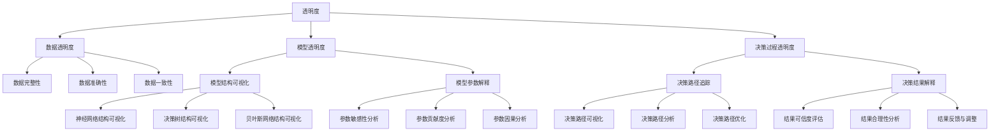

                 

### 文章标题：透明度与可解释性：增强人工智能的可信度

### 关键词：人工智能，透明度，可解释性，可信度，法律法规，伦理，实践案例

### 摘要：

随着人工智能（AI）技术的飞速发展，其在各个领域的应用越来越广泛。然而，AI系统的黑盒性质和决策过程的不可解释性引发了一系列问题和挑战，如隐私侵犯、偏见、误判等，从而降低了人工智能系统的可信度。本文旨在深入探讨透明度与可解释性在人工智能中的重要性，分析其核心概念与联系，介绍相关的技术方法，并通过实际案例展示其在金融、医疗和自动驾驶等领域的应用。最后，本文将展望透明度与可解释性的未来发展，提出实践建议，以期为提升人工智能系统的可信度和公众信任提供有益的参考。

### 目录大纲

#### 第一部分：引言

- **第1章：人工智能的可信度与透明度概述**
  - **1.1 人工智能发展的现状与挑战**
    - **1.1.1 人工智能的发展历程**
    - **1.1.2 人工智能在社会中的应用**
    - **1.1.3 人工智能面临的透明度与可解释性挑战**
  - **1.2 透明度与可解释性的重要性**
    - **1.2.1 提高人工智能系统的可信度**
    - **1.2.2 增强用户对人工智能的信任**
    - **1.2.3 透明度与可解释性在法律法规中的地位**

- **第2章：人工智能透明度的概念与评估方法**
  - **2.1 透明度的定义与分类**
    - **2.1.1 数据透明度**
    - **2.1.2 模型透明度**
    - **2.1.3 决策过程透明度**
  - **2.2 评估方法**
    - **2.2.1 定量评估方法**
    - **2.2.2 定性评估方法**
    - **2.2.3 综合评估方法**

- **第3章：人工智能可解释性的概念与实现方法**
  - **3.1 可解释性的定义与分类**
    - **3.1.1 模型可解释性**
    - **3.1.2 决策可解释性**
    - **3.1.3 结果可解释性**
  - **3.2 实现方法**
    - **3.2.1 局部解释方法**
    - **3.2.2 全局解释方法**
    - **3.2.3 混合解释方法**

#### 第二部分：透明度与可解释性的核心技术

- **第4章：数据透明度的技术方法**
  - **4.1 数据质量评估**
    - **4.1.1 数据完整性**
    - **4.1.2 数据准确性**
    - **4.1.3 数据一致性**
  - **4.2 数据可视化**
    - **4.2.1 数据分布可视化**
    - **4.2.2 关联性可视化**
    - **4.2.3 决策路径可视化**

- **第5章：模型透明度的技术方法**
  - **5.1 模型结构可视化**
    - **5.1.1 神经网络结构可视化**
    - **5.1.2 决策树结构可视化**
    - **5.1.3 贝叶斯网络结构可视化**
  - **5.2 模型参数解释**
    - **5.2.1 参数敏感性分析**
    - **5.2.2 参数贡献度分析**
    - **5.2.3 参数因果分析**

- **第6章：决策过程透明度的技术方法**
  - **6.1 决策路径追踪**
    - **6.1.1 决策路径可视化**
    - **6.1.2 决策路径分析**
    - **6.1.3 决策路径优化**
  - **6.2 决策结果解释**
    - **6.2.1 结果可信度评估**
    - **6.2.2 结果合理性分析**
    - **6.2.3 结果反馈与调整**

#### 第三部分：透明度与可解释性的应用与实践

- **第7章：透明度与可解释性在金融领域的应用**
  - **7.1 金融风险管理的透明度提升**
    - **7.1.1 风险评估模型的透明度提升**
    - **7.1.2 风险管理决策的透明度提升**
    - **7.1.3 透明度对金融监管的影响**
  - **7.2 金融服务的可解释性提升**
    - **7.2.1 自动化贷款审批的可解释性提升**
    - **7.2.2 投资决策的可解释性提升**
    - **7.2.3 保险风险评估的可解释性提升**

- **第8章：透明度与可解释性在医疗领域的应用**
  - **8.1 医疗诊断的可解释性提升**
    - **8.1.1 医疗诊断模型的透明度提升**
    - **8.1.2 医疗诊断结果的解释与反馈**
    - **8.1.3 可解释性在个性化医疗中的应用**
  - **8.2 医疗管理的透明度提升**
    - **8.2.1 医疗管理模型的透明度提升**
    - **8.2.2 医疗管理决策的可解释性提升**
    - **8.2.3 透明度在公共卫生决策中的应用**

- **第9章：透明度与可解释性在自动驾驶领域的应用**
  - **9.1 自动驾驶系统的透明度提升**
    - **9.1.1 自动驾驶决策的透明度提升**
    - **9.1.2 自动驾驶系统的可解释性提升**
    - **9.1.3 透明度与可解释性在自动驾驶安全评估中的应用**
  - **9.2 自动驾驶服务的可解释性提升**
    - **9.2.1 自动驾驶用户体验的可解释性提升**
    - **9.2.2 自动驾驶技术透明度对公众接受度的影响**
    - **9.2.3 可解释性在自动驾驶法规制定中的应用**

#### 第四部分：透明度与可解释性的未来发展

- **第10章：透明度与可解释性的未来发展**
  - **10.1 透明度与可解释性的发展趋势**
    - **10.1.1 人工智能伦理与法规的融合**
    - **10.1.2 透明度与可解释性的技术创新**
    - **10.1.3 透明度与可解释性的社会影响**
  - **10.2 透明度与可解释性的实践建议**
    - **10.2.1 透明度与可解释性的实施步骤**
    - **10.2.2 透明度与可解释性的评估标准**
    - **10.2.3 透明度与可解释性的优化策略**

#### 第五部分：案例分析

- **第11章：案例分析**
  - **11.1 案例一：金融风控透明度提升实践**
    - **11.1.1 案例背景**
    - **11.1.2 实施方法**
    - **11.1.3 实施效果**
  - **11.2 案例二：医疗诊断可解释性提升实践**
    - **11.2.1 案例背景**
    - **11.2.2 实施方法**
    - **11.2.3 实施效果**
  - **11.3 案例三：自动驾驶透明度提升实践**
    - **11.3.1 案例背景**
    - **11.3.2 实施方法**
    - **11.3.3 实施效果**

#### 附录

- **附录A：术语解释**
- **附录B：参考文献**
- **附录C：相关资源链接**
- **附录D：核心概念与联系（Mermaid流程图）**
- **附录E：核心算法原理讲解（伪代码）**
- **附录F：数学模型和数学公式（详细讲解与举例说明）**
- **附录G：项目实战**
  - **12.1 项目背景与目标**
  - **12.2 开发环境搭建**
  - **12.3 代码实际案例实现**
  - **12.4 源代码详细实现与解读**
  - **12.5 代码解读与分析**
- **附录H：开发工具与资源**
  - **H.1 主流深度学习框架对比**
  - **H.2 相关开源工具与库**
  - **H.3 在线资源与社区**
- **附录I：透明度与可解释性案例分析**
  - **13.1 案例研究一：金融风控透明度提升实践**
  - **13.2 案例研究二：医疗诊断可解释性提升实践**
  - **13.3 案例研究三：自动驾驶透明度提升实践**
- **附录J：透明度与可解释性的未来发展趋势**
  - **J.1 透明度与可解释性的技术进步**
  - **J.2 法律法规与伦理发展**
  - **J.3 透明度与可解释性的未来挑战与机遇**
- **附录K：透明度与可解释性的实践建议**
  - **K.1 透明度与可解释性的实施步骤**
  - **K.2 透明度与可解释性的评估标准**
  - **K.3 透明度与可解释性的优化策略**
- **附录L：术语解释**
- **附录M：参考文献**
- **附录N：相关资源链接**
- **附录O：透明度与可解释性在金融、医疗和自动驾驶领域的应用**
  - **O.1 金融领域**
  - **O.2 医疗领域**
  - **O.3 自动驾驶领域**
- **附录P：问答与讨论**
  - **P.1 常见问题解答**
  - **P.2 讨论与展望**
- **附录Q：作者介绍**
  - **Q.1 作者背景**
  - **Q.2 研究领域与贡献**
  - **Q.3 学术成果与荣誉**
  - **Q.4 接触方式与交流渠道**
- **附录R：致谢**
- **附录S：版权声明**

### 引言

#### 1.1 人工智能发展的现状与挑战

人工智能（Artificial Intelligence, AI）作为当今科技发展的前沿领域，已经取得了令人瞩目的成就。从最初的规则推理、知识表示到现在的深度学习和强化学习，AI技术在图像识别、自然语言处理、自动驾驶、医疗诊断等领域展现出了强大的能力。AI系统通过大量的数据训练和学习，可以自动完成复杂的任务，从而极大地提高了生产效率、降低了成本，并改善了人们的生活质量。

然而，随着AI技术的广泛应用，人们也开始关注其潜在的风险和挑战。透明度与可解释性是其中两个核心问题，它们直接关系到人工智能系统的可信度和公众对其的信任。

首先，人工智能系统的黑盒性质使得其决策过程变得不可理解，这对于那些依赖AI系统进行重要决策的用户来说，是一个巨大的担忧。例如，在金融领域，自动化贷款审批系统虽然可以快速做出决策，但其内部逻辑对用户来说是完全未知的，这可能导致用户对其决策结果的不信任。同样，在医疗领域，诊断模型如果缺乏透明性，可能会影响医生的决策和患者的信任。

其次，人工智能系统的训练数据可能包含偏见，从而导致模型输出结果带有偏见。这种偏见可能会对某些群体造成不公平的影响，从而引发社会问题。例如，如果自动驾驶系统的训练数据中包含对某些族群的偏见，那么在实际应用中，这些系统可能会对这些族群表现出不公平的行为。

此外，法律法规对AI系统的透明度与可解释性提出了更高的要求。许多国家已经开始制定相关法规，要求AI系统在设计、开发和应用过程中，必须保证其透明度和可解释性。例如，欧盟的《通用数据保护条例》（GDPR）就对数据透明度和个人隐私保护提出了严格的要求。

综上所述，人工智能的透明度与可解释性是当前面临的重要挑战。提高AI系统的透明度和可解释性，不仅可以增强系统的可信度，还可以提高用户对AI技术的信任，从而推动AI技术的健康发展。

#### 1.2 透明度与可解释性的重要性

透明度与可解释性在人工智能系统中的重要性不可忽视。首先，透明度有助于用户了解AI系统的决策过程和结果，从而增强系统的可信度。当用户能够清楚地看到AI系统是如何做出决策的，他们会更愿意接受和信任这些决策结果。例如，在金融领域，如果自动化贷款审批系统的决策过程对用户透明，用户会更有信心申请贷款，因为他们知道系统的决策是基于合理和透明的标准。

其次，可解释性有助于发现和纠正AI系统中的潜在问题。通过分析AI系统的决策过程，可以发现系统中的偏见、错误和不足之处，从而进行优化和改进。例如，在医疗诊断中，如果医生能够理解诊断模型的决策逻辑，他们可以更好地评估模型的准确性，并针对特定情况进行调整。

此外，透明度和可解释性在法律法规和伦理方面也具有重要意义。许多国家和组织已经开始制定相关法规和标准，要求AI系统在设计和应用过程中必须保证透明度和可解释性。这些法规和标准旨在保护用户权益，防止AI系统被滥用，确保AI技术的社会责任。

最后，透明度和可解释性有助于促进人工智能技术的可持续发展。随着AI技术的不断进步，公众对AI系统的透明度和可解释性的需求也将不断增加。只有通过不断提高AI系统的透明度和可解释性，才能赢得公众的信任，从而推动AI技术的广泛应用和可持续发展。

#### 1.3 透明度与可解释性在法律法规中的地位

透明度与可解释性在人工智能领域的法律法规中占据着重要地位。随着AI技术的不断普及和应用，各国政府和国际组织逐渐认识到，确保AI系统的透明度和可解释性是维护社会公正、保护用户权益的关键。

首先，许多国家已经制定了相关法律法规，对AI系统的透明度和可解释性提出了明确要求。例如，欧盟的《通用数据保护条例》（GDPR）要求AI系统在处理个人数据时必须保证透明度，用户有权了解AI系统的工作原理和决策过程。美国的一些州也出台了相关法案，要求金融和医疗领域的AI系统提供透明的决策信息。

其次，国际组织也在积极推动透明度和可解释性的法规制定。例如，联合国数字合作高级别小组（UNGA-DCH）发布了《人工智能伦理框架》，强调AI系统的透明度和可解释性是保障人类福祉的重要原则。国际标准化组织（ISO）也在制定相关标准，旨在提高AI系统的透明度和可解释性。

此外，透明度和可解释性还涉及到伦理和法律问题。AI系统的决策过程如果缺乏透明度，可能导致不公平、歧视和隐私侵犯等问题。因此，确保AI系统的透明度和可解释性不仅是技术问题，也是法律和伦理问题。通过法律法规的规范，可以促进AI技术的健康发展，保障社会公共利益。

总的来说，透明度与可解释性在人工智能法律法规中的地位不断提高，这对于推动AI技术的可持续发展和公众信任具有重要意义。

### 人工智能透明度的概念与评估方法

#### 2.1 透明度的定义与分类

人工智能（AI）的透明度是指用户能够理解AI系统的工作机制、决策过程及其输入输出结果的程度。透明度的核心在于使AI系统的内部运作对外部用户（如用户、监管者、开发者等）可访问、可理解和可验证。根据AI系统的不同层次，透明度可以划分为以下几类：

- **数据透明度**：数据透明度涉及AI系统所使用的数据集的来源、质量、清洗和处理方法等信息。用户需要知道数据是如何收集的、哪些数据被使用以及数据中可能存在的偏差。数据透明度有助于确保模型的公平性和准确性。

- **模型透明度**：模型透明度是指用户能够理解AI模型的架构、参数设置和训练过程。这包括模型的结构（如神经网络层数、神经元数量等）、训练方法（如梯度下降算法、优化器选择等）以及模型参数（如权重、偏差等）。

- **决策过程透明度**：决策过程透明度指的是用户能够了解AI系统是如何处理输入数据、生成中间结果并最终得出决策的。这包括决策路径、决策规则和推理过程等。

#### 2.2 评估方法

评估AI系统的透明度是一个复杂的过程，需要综合使用多种方法和工具。以下是一些常用的评估方法：

- **定量评估方法**：定量评估方法通过量化指标来衡量AI系统的透明度。这些指标可能包括数据集的多样性、模型的复杂性、决策过程的可追溯性等。定量评估可以提供具体的数值，便于比较不同系统的透明度。

- **定性评估方法**：定性评估方法主要通过专家评审和用户反馈来评估AI系统的透明度。这种方法依赖于人类判断和主观意见，适用于评估一些难以量化的透明度方面，如模型的可理解性和决策过程的直观性。

- **综合评估方法**：综合评估方法将定量和定性评估方法结合起来，提供更全面的透明度评估。这种方法能够平衡量化指标和主观评价，从而更准确地评估AI系统的整体透明度。

#### 2.2.1 定量评估方法

定量评估方法主要包括以下几种：

- **透明度指数**：通过计算一系列与透明度相关的指标，综合得出透明度指数。这些指标可能包括数据多样性、模型结构复杂度、决策路径长度等。

- **透明度评分**：根据预定的评分标准，对AI系统的不同方面进行评分。评分标准可以基于公开的数据集、已有的模型结构、已知的决策过程等。

- **模型可视化**：通过可视化的方式展示AI模型的内部结构和参数设置，从而提高透明度。例如，神经网络结构图、决策树等。

#### 2.2.2 定性评估方法

定性评估方法主要包括以下几种：

- **专家评审**：邀请领域专家对AI系统的透明度进行评估。专家可以根据自己的经验和知识，对系统的透明度进行主观评价。

- **用户反馈**：通过用户调查和访谈，收集用户对AI系统透明度的反馈。用户可以根据自己的使用体验，评估系统的透明度。

- **透明度测试**：设计一系列测试案例，测试AI系统在处理不同类型的数据和任务时的透明度。例如，可以测试系统在处理极端数据或异常情况时的透明度。

#### 2.2.3 综合评估方法

综合评估方法结合定量和定性评估方法，提供更全面的评估结果。这种方法通常包括以下步骤：

- **数据透明度评估**：通过定量方法评估数据集的多样性和质量，并通过专家评审和用户反馈，评估数据清洗和处理方法的透明度。

- **模型透明度评估**：使用模型可视化工具，展示模型的结构和参数设置，并邀请专家和用户进行评审和反馈。

- **决策过程透明度评估**：通过测试案例和用户反馈，评估决策路径和规则的透明度。

- **综合评分**：将数据透明度、模型透明度和决策过程透明度的评估结果进行综合，得出AI系统的整体透明度评分。

通过以上评估方法，可以全面、准确地评估人工智能系统的透明度，为系统优化和改进提供依据。同时，这些评估方法也为用户、监管者和其他利益相关方提供了了解AI系统透明度的途径，从而增强了系统的可信度和公众的信任。

### 人工智能可解释性的概念与实现方法

#### 3.1 可解释性的定义与分类

人工智能（AI）的可解释性是指用户能够理解AI系统如何做出特定决策的能力。它旨在解决AI系统黑盒性质带来的不可解释性问题，使系统的决策过程变得透明和可理解。可解释性在AI技术中具有重要意义，因为它能够增强用户对AI系统的信任，提高系统的可接受度，并帮助识别和纠正潜在的偏见和错误。

根据AI系统的不同层面，可解释性可以分为以下几类：

- **模型可解释性**：模型可解释性指的是用户能够理解AI模型的内部结构和参数设置。这包括模型的设计、训练过程以及如何将输入映射到输出。模型可解释性有助于用户了解模型是如何工作的，从而增强对模型的信任。

- **决策可解释性**：决策可解释性关注的是AI系统在处理特定输入数据时，是如何生成中间结果并最终做出决策的。这包括决策路径、决策规则和推理过程。决策可解释性使用户能够跟踪和验证系统的决策过程，从而提高系统的可信度。

- **结果可解释性**：结果可解释性关注的是AI系统输出的结果如何解释和验证。这包括对预测结果的合理性分析、解释和反馈。结果可解释性帮助用户理解AI系统的输出，并评估其准确性和可靠性。

#### 3.2 实现方法

为了实现人工智能的可解释性，研究人员和工程师开发了许多方法和工具。以下是一些主要的实现方法：

- **局部解释方法**：局部解释方法关注的是对特定输入和输出对的解释。这些方法通常通过分析模型的局部行为来解释特定决策。常见的局部解释方法包括：

  - **LIME（Local Interpretable Model-agnostic Explanations）**：LIME是一种模型无关的局部解释方法，它通过在原始模型上训练一个简单的解释模型，来解释特定输入数据的决策。

  - **SHAP（SHapley Additive exPlanations）**：SHAP方法基于博弈论原理，计算每个特征对模型预测的贡献度，从而提供对模型决策的局部解释。

- **全局解释方法**：全局解释方法关注的是整个模型或决策过程的解释。这些方法通过分析模型的整体结构和行为，提供对系统工作的全局理解。常见的方法包括：

  - **决策树解释**：决策树结构可视化使得用户可以直观地理解模型如何处理输入数据，并最终做出决策。

  - **神经网络可视化**：通过可视化神经网络的结构和激活值，用户可以理解模型在训练过程中如何学习和调整。

- **混合解释方法**：混合解释方法结合了局部和全局解释方法，提供更全面的解释。这种方法通过综合局部和全局信息，为用户提供了更深入的理解。常见的混合解释方法包括：

  - **部分依赖图（Partial Dependence Plots）**：部分依赖图展示的是模型对特定特征在不同取值下的依赖关系，从而提供对模型决策的全局理解。

  - **混淆矩阵（Confusion Matrix）**：混淆矩阵展示的是模型在预测过程中的准确性、召回率和F1分数等指标，从而帮助用户评估模型的性能。

通过这些方法，AI系统的可解释性得到了显著提升。用户可以更清楚地理解系统的决策过程和结果，从而增强对系统的信任。同时，这些方法也为研究人员和工程师提供了工具，以识别和纠正系统中的潜在问题，提高模型的性能和可靠性。

### 数据透明度的技术方法

#### 4.1 数据质量评估

数据透明度的核心在于确保数据的完整性、准确性和一致性，因为这些因素直接影响模型的可解释性和准确性。以下是几种常用的数据质量评估方法：

- **数据完整性**：数据完整性评估主要检查数据集中是否存在缺失值或重复记录。常见的方法包括：

  - **缺失值检查**：使用统计方法（如描述性统计）识别缺失值，并确定适当的处理策略，如插值、删除或使用均值、中位数等填充。

  - **重复记录检测**：通过比较数据记录的唯一性标识（如ID）来检测重复记录，并决定是否删除或合并重复记录。

- **数据准确性**：数据准确性评估旨在确保数据集中没有错误或异常值。常用的方法包括：

  - **一致性检查**：比较同一数据源中不同数据字段之间的关联性，确保数据的一致性。

  - **异常值检测**：使用统计方法（如箱线图、Z-score）识别数据集中的异常值，并决定是否删除、替换或保留这些值。

- **数据一致性**：数据一致性评估关注数据在不同来源之间的匹配度和一致性。常用的方法包括：

  - **数据对齐**：通过匹配数据中的关键字段（如日期、名称等），确保数据在不同来源之间的匹配。

  - **标准化处理**：将不同来源的数据进行统一处理，如日期格式的转换、文本标准化等，确保数据的一致性。

#### 4.2 数据可视化

数据可视化是提高数据透明度的重要方法，它通过图形和图表的形式展示数据，使数据变得更加直观和易于理解。以下是几种常用的数据可视化方法：

- **数据分布可视化**：数据分布可视化展示了数据的分布情况，有助于识别数据的异常值和趋势。常见的方法包括：

  - **直方图**：直方图展示了数据的频率分布，可以直观地看到数据的分布形态。

  - **密度图**：密度图通过平滑曲线展示数据的概率密度，能够更细致地展示数据分布。

- **关联性可视化**：关联性可视化展示了数据字段之间的相关性，有助于识别数据之间的潜在关系。常见的方法包括：

  - **散点图**：散点图通过坐标轴上的点展示两个变量之间的关系。

  - **热力图**：热力图使用颜色强度来展示数据字段之间的相关性，颜色越深表示相关性越强。

- **决策路径可视化**：决策路径可视化展示了AI系统在处理输入数据时，如何通过一系列决策步骤生成最终结果。常见的方法包括：

  - **决策树图**：决策树图展示了决策树的分支结构和每个节点的决策条件。

  - **神经网络图**：神经网络图展示了神经网络的层次结构和每个神经元的连接关系。

通过这些数据可视化方法，用户可以更直观地理解数据的特点和关系，从而增强对AI系统决策过程的信任和理解。同时，数据可视化也为研究人员和工程师提供了有效的工具，以识别和解决数据质量问题。

### 模型透明度的技术方法

#### 5.1 模型结构可视化

模型结构可视化是提高模型透明度的重要方法，它通过图形化的方式展示模型的内部结构，使模型的设计和操作更加直观和易于理解。以下是几种常用的模型结构可视化方法：

- **神经网络结构可视化**：神经网络（Neural Networks）是现代机器学习中的一种重要模型，其结构可视化可以帮助用户更好地理解模型的复杂性和工作原理。常见的方法包括：

  - **层结构图**：层结构图展示了神经网络的层次结构，包括输入层、隐藏层和输出层。每个节点表示一个神经元，每条边表示神经元之间的连接。

  - **权重图**：权重图展示了神经网络中每个神经元之间的权重值，通过颜色或大小表示权重的相对大小，从而帮助用户理解模型的权重分布。

- **决策树结构可视化**：决策树（Decision Trees）是一种常见的数据挖掘模型，其结构可视化使得用户可以直观地看到模型的决策路径和条件。常见的方法包括：

  - **树形图**：树形图展示了决策树的分支结构和每个节点的条件，每个节点代表一个决策规则，用户可以通过点击和展开节点来查看详细的决策过程。

  - **折叠图**：折叠图通过折叠决策树的分支，减少冗余信息，使复杂的决策树更加简洁和易于理解。

- **贝叶斯网络结构可视化**：贝叶斯网络（Bayesian Networks）是一种概率图模型，其结构可视化展示了变量之间的条件依赖关系。常见的方法包括：

  - **图表示**：图表示方法通过节点和边来展示变量及其条件依赖关系，每个节点代表一个变量，边表示变量之间的条件概率。

  - **概率表**：概率表通过列出变量及其条件概率，提供了更详细的模型信息，用户可以通过查看概率表来理解模型的推理过程。

通过这些模型结构可视化方法，用户可以更直观地理解模型的内部结构和决策过程，从而增强对模型的信任和理解。

#### 5.2 模型参数解释

模型参数解释是提高模型透明度的重要手段，它通过分析模型参数的值和作用，帮助用户理解模型如何处理输入数据和生成预测结果。以下是几种常用的模型参数解释方法：

- **参数敏感性分析**：参数敏感性分析通过评估模型参数对预测结果的影响，帮助用户了解哪些参数对模型性能最为关键。常见的方法包括：

  - **单参数敏感性分析**：通过固定其他参数，单独改变一个参数的值，观察预测结果的变化，从而评估该参数的敏感性。

  - **多参数敏感性分析**：通过组合多个参数的不同值，分析这些参数组合对预测结果的综合影响，从而识别最敏感的参数组合。

- **参数贡献度分析**：参数贡献度分析通过计算每个参数对预测结果的贡献度，帮助用户了解不同参数在模型决策中的作用和重要性。常见的方法包括：

  - **绝对贡献度分析**：计算每个参数对模型预测结果的绝对影响，从而识别出对预测结果贡献最大的参数。

  - **相对贡献度分析**：将每个参数的贡献度相对于其他参数进行比较，从而识别出相对贡献度最高的参数。

- **参数因果分析**：参数因果分析通过建立参数与预测结果之间的因果联系，帮助用户理解模型决策的逻辑和机制。常见的方法包括：

  - **因果图**：通过绘制因果图，展示参数之间的因果依赖关系，从而帮助用户理解模型的决策过程。

  - **干预分析**：通过模拟干预某个参数的值，观察预测结果的变化，从而确定参数对预测结果的因果影响。

通过这些模型参数解释方法，用户可以更深入地理解模型的决策过程和预测结果，从而增强对模型的信任和理解。

### 决策过程透明度的技术方法

#### 6.1 决策路径追踪

决策路径追踪是一种用于提高决策过程透明度的技术方法，它通过追踪和分析系统在处理输入数据时的一系列决策步骤，使决策过程变得透明和可理解。以下是几种常用的决策路径追踪方法：

- **决策路径可视化**：决策路径可视化通过图形化的方式展示决策过程中的每一步，使用户可以直观地理解决策路径和规则。常见的方法包括：

  - **流程图**：流程图是一种常见的可视化工具，用于展示决策路径中的每一步操作和条件判断。每个节点表示一个决策点，每个箭头表示决策的流向。

  - **时序图**：时序图通过时间序列展示决策过程中的每一步，使用户可以了解决策过程的时序关系。

- **决策路径分析**：决策路径分析通过分析和解释每一步决策的依据和原因，帮助用户深入理解决策路径的合理性和逻辑性。常见的方法包括：

  - **决策逻辑分析**：分析每一步决策的条件和规则，确保决策逻辑的正确性和一致性。

  - **决策影响分析**：评估每一步决策对最终结果的影响，识别关键决策点和潜在的风险。

- **决策路径优化**：决策路径优化通过改进决策路径和规则，提高决策过程的效率和准确性。常见的方法包括：

  - **规则优化**：通过简化规则和条件，减少冗余的决策步骤，提高决策效率。

  - **决策树修剪**：通过修剪不必要的分支和节点，简化决策树结构，减少计算复杂度。

通过决策路径追踪，用户可以更清楚地了解AI系统的决策过程，从而增强对决策结果的信任和理解。

#### 6.2 决策结果解释

决策结果解释是提高决策过程透明度的重要技术方法，它通过详细分析和解释AI系统的输出结果，帮助用户理解决策结果的合理性和依据。以下是几种常用的决策结果解释方法：

- **结果可信度评估**：结果可信度评估通过评估AI系统输出结果的可靠性和准确性，帮助用户判断决策结果的信任度。常见的方法包括：

  - **误差分析**：通过计算预测结果与实际结果之间的误差，评估预测的准确性。

  - **置信区间**：通过计算预测结果的置信区间，评估预测结果的可靠性和稳定性。

- **结果合理性分析**：结果合理性分析通过分析和验证AI系统输出结果的合理性和逻辑性，确保决策结果的合理性。常见的方法包括：

  - **因果推理**：通过因果推理分析决策结果的原因和条件，确保决策结果符合逻辑和预期。

  - **规则验证**：通过验证决策过程中使用的规则和条件，确保决策结果符合既定的标准和要求。

- **结果反馈与调整**：结果反馈与调整通过收集用户反馈和实际结果，对决策过程进行优化和调整，提高决策结果的准确性和可靠性。常见的方法包括：

  - **在线学习**：通过实时学习用户反馈和实际结果，不断优化模型和决策规则。

  - **迭代改进**：通过多次迭代和优化，逐步提高决策过程的效率和准确性。

通过这些决策结果解释方法，用户可以更深入地理解AI系统的输出结果，从而增强对决策结果的信任和理解。

### 透明度与可解释性在金融领域的应用

#### 7.1 金融风险管理的透明度提升

金融风险管理是金融领域的重要环节，透明度在提升风险管理效率和增强决策可信度方面发挥着关键作用。以下是一些通过提升透明度来增强金融风险管理的具体方法：

- **风险评估模型的透明度提升**：

  - **模型结构透明**：金融风险评估模型通常涉及复杂的数学和统计方法，如线性回归、逻辑回归等。通过可视化模型结构，如决策树或神经网络，使投资者和管理者能够直观理解模型的内部机制。

  - **参数解释**：对于模型中的关键参数，如权重和阈值，提供详细的解释和敏感性分析，帮助用户理解每个参数对风险评估结果的影响。

  - **数据来源透明**：确保数据集的来源、处理方法和质量评估过程公开透明，防止数据偏差和误差。

- **风险管理决策的透明度提升**：

  - **决策路径追踪**：通过记录和展示风险管理的决策路径，使投资者和管理者能够了解风险决策的每一步骤和依据。

  - **规则解释**：对于决策过程中的规则和条件，提供详细的解释和逻辑分析，确保决策的合理性和透明性。

  - **反馈机制**：建立用户反馈机制，定期收集用户对风险管理决策的反馈，以便及时调整和优化决策模型。

- **透明度对金融监管的影响**：

  - **合规性提升**：提高金融风险评估和决策的透明度，有助于金融机构满足监管要求，增强合规性。

  - **监管有效性**：透明度使得监管机构能够更好地监督金融机构的风险管理活动，提高监管效率。

  - **市场信任**：透明度有助于增强市场对金融产品的信任，减少信息不对称，促进金融市场的健康发展。

通过这些方法，金融风险管理不仅能够提高效率和准确性，还能增强用户和监管者的信任，从而在金融领域发挥更大的作用。

#### 7.2 金融服务的可解释性提升

金融服务的可解释性提升对于增强用户对金融产品的信任和满意度至关重要。以下是一些提升金融服务可解释性的具体方法：

- **自动化贷款审批的可解释性提升**：

  - **决策解释**：在自动化贷款审批系统中，通过提供详细的决策解释，使用户能够理解其贷款申请被批准或拒绝的原因。例如，可以通过显示关键影响因素和相应的分数，帮助用户了解其申请是否满足银行的要求。

  - **透明度报告**：生成详细的透明度报告，包括贷款审批过程中的每一步骤和使用的模型参数，让用户了解贷款审批的细节。

  - **用户教育**：提供相关的用户教育材料，如视频教程或指南，帮助用户理解贷款审批流程和相关的金融知识，从而增强他们的信任。

- **投资决策的可解释性提升**：

  - **投资逻辑解释**：对于自动化投资决策系统，通过提供详细的解释，让用户了解投资决策的逻辑和依据。例如，可以展示使用的投资策略、市场分析和技术指标。

  - **风险收益分析**：详细分析投资决策中的风险和收益，帮助用户理解投资决策的风险管理策略。

  - **历史绩效展示**：展示投资决策的历史绩效，让用户了解决策的有效性和可靠性。

- **保险风险评估的可解释性提升**：

  - **风险评估解释**：对于保险风险评估系统，提供详细的风险评估解释，帮助用户了解其保费率计算方法和依据。例如，可以展示影响保费的关键因素和相应的权重。

  - **透明度报告**：生成详细的透明度报告，包括风险评估的每一步骤和使用的模型参数，使用户能够全面了解风险评估过程。

  - **用户参与**：鼓励用户参与风险评估过程，通过用户提供的个人信息和偏好，生成个性化的风险评估报告。

通过这些方法，金融服务不仅能够提高用户的理解和信任，还能增强用户满意度，从而推动金融服务的健康发展。

### 透明度与可解释性在医疗领域的应用

#### 8.1 医疗诊断的可解释性提升

医疗诊断的可解释性提升在提高诊断准确性和增强医生与患者信任方面具有重要意义。以下是一些提升医疗诊断可解释性的具体方法：

- **医疗诊断模型的透明度提升**：

  - **模型结构可视化**：通过可视化医疗诊断模型的结构，如神经网络或决策树，医生可以直观地理解模型的内部机制和决策过程。

  - **参数解释**：对诊断模型中的关键参数进行详细解释，帮助医生了解参数对诊断结果的影响。例如，可以展示每个特征的权重和重要性。

  - **训练数据透明**：确保训练数据集的来源、处理方法和质量评估过程公开透明，防止数据偏差和误差。

- **医疗诊断结果的解释与反馈**：

  - **诊断解释报告**：为每个诊断结果生成详细的解释报告，包括模型的决策依据和关键特征分析，帮助医生和患者理解诊断结果。

  - **用户反馈机制**：建立用户反馈机制，允许医生和患者对诊断结果提出疑问和反馈，以便进一步优化诊断模型。

  - **多模态数据整合**：整合多种医疗数据（如影像、实验室检查结果等），提供综合的诊断解释，提高诊断结果的可靠性和准确性。

- **可解释性在个性化医疗中的应用**：

  - **个性化诊断建议**：根据患者的具体情况，提供个性化的诊断建议和解释，帮助医生制定更加精准的治疗方案。

  - **患者教育**：为患者提供相关的教育材料，如视频教程或指南，帮助他们理解诊断过程和结果，从而增强信任。

  - **远程诊断支持**：通过远程诊断平台，医生可以实时解释诊断结果，提供远程支持，提高诊断的便利性和效率。

通过这些方法，医疗诊断的可解释性得到显著提升，不仅有助于医生提高诊断准确性，还能增强患者对诊断结果的信任和满意度，从而推动医疗领域的健康发展。

#### 8.2 医疗管理的透明度提升

医疗管理的透明度提升对于提高医疗服务的质量和效率具有重要意义。以下是一些提升医疗管理透明度的具体方法：

- **医疗管理模型的透明度提升**：

  - **模型结构可视化**：通过可视化医疗管理模型的结构，如决策树或神经网络，管理者可以直观地理解模型的内部机制和决策过程。

  - **参数解释**：对管理模型中的关键参数进行详细解释，帮助管理者了解参数对管理决策的影响。例如，可以展示每个特征的权重和重要性。

  - **数据质量保障**：确保医疗数据集的来源、处理方法和质量评估过程公开透明，防止数据偏差和误差。

- **医疗管理决策的可解释性提升**：

  - **决策路径追踪**：通过记录和展示医疗管理决策的每一步骤和依据，管理者可以详细了解决策过程，确保决策的合理性和透明性。

  - **规则解释**：对于管理决策过程中使用的规则和条件，提供详细的解释和逻辑分析，确保决策的依据和逻辑清晰。

  - **反馈机制**：建立反馈机制，允许管理者根据实际效果对决策进行调整和优化，提高决策的准确性和可靠性。

- **透明度在公共卫生决策中的应用**：

  - **公共卫生模型解释**：为公共卫生决策模型提供详细的解释，帮助决策者理解公共卫生问题的复杂性和决策依据。

  - **公共卫生数据可视化**：通过可视化公共卫生数据，如疫情趋势和流行病学参数，提高决策者对公共卫生问题的认识。

  - **公众参与**：鼓励公众参与公共卫生决策，通过公开数据和透明决策过程，提高公众对公共卫生政策的信任和支持。

通过这些方法，医疗管理的透明度得到显著提升，不仅有助于提高医疗服务的质量和效率，还能增强公众对医疗系统的信任，从而推动医疗行业的可持续发展。

### 透明度与可解释性在自动驾驶领域的应用

#### 9.1 自动驾驶系统的透明度提升

自动驾驶技术的快速发展为社会带来了巨大的变革，然而其透明度问题也引起了广泛关注。提升自动驾驶系统的透明度有助于增强公众对自动驾驶技术的信任，并确保系统的安全性和可靠性。以下是一些提升自动驾驶系统透明度的方法：

- **自动驾驶决策的透明度提升**：

  - **决策路径可视化**：通过可视化自动驾驶系统的决策路径，展示系统在处理输入数据时的一系列决策步骤。这可以帮助驾驶员和交通管理者理解系统的行为和决策逻辑。

  - **决策逻辑解释**：对自动驾驶系统的决策逻辑进行详细解释，包括系统如何处理传感器数据、如何识别道路状况和如何做出行驶决策。这有助于提高系统的可理解性和信任度。

  - **实时监控和反馈**：实现自动驾驶系统的实时监控和反馈功能，使驾驶员和交通管理者能够及时了解系统的运行状态和决策过程，从而及时发现问题并进行调整。

- **自动驾驶系统的可解释性提升**：

  - **模型参数解释**：对自动驾驶系统中的关键参数进行详细解释，包括模型的权重、阈值等，帮助用户理解模型对输入数据的处理过程和决策依据。

  - **决策结果解释**：为自动驾驶系统的决策结果提供详细的解释，包括系统为何做出特定决策以及该决策的预期效果。这有助于用户理解系统的行为和决策依据。

  - **用户参与和反馈**：鼓励用户参与自动驾驶系统的开发和测试过程，通过用户反馈不断优化系统的可解释性，提高系统的用户友好性和可信度。

- **透明度与可解释性在自动驾驶安全评估中的应用**：

  - **安全评估报告**：为自动驾驶系统生成详细的安全评估报告，包括系统的安全特性、潜在风险和安全措施。这有助于评估者了解系统的安全性能和可靠性。

  - **安全事件分析**：对自动驾驶系统发生的安全事件进行详细分析，包括事件的原因、影响和改进措施。这有助于识别和预防潜在的安全问题。

  - **透明度标准制定**：制定自动驾驶系统的透明度标准，确保系统在不同应用场景下的透明度和可解释性符合要求。这有助于推动自动驾驶技术的标准化和安全发展。

通过提升自动驾驶系统的透明度，不仅可以增强公众对自动驾驶技术的信任，还可以提高系统的安全性和可靠性，从而推动自动驾驶技术的广泛应用和可持续发展。

#### 9.2 自动驾驶服务的可解释性提升

自动驾驶服务的可解释性提升对于提升用户体验和公众接受度具有重要意义。以下是一些提升自动驾驶服务可解释性的方法：

- **自动驾驶用户体验的可解释性提升**：

  - **交互界面设计**：设计直观、易操作的交互界面，通过文字、图标和动画等形式，向用户提供清晰的自动驾驶操作流程和功能说明。

  - **实时反馈与解释**：在自动驾驶过程中，通过语音、屏幕显示等形式，实时向用户提供系统的状态和决策信息，帮助用户理解系统的行为和决策依据。

  - **用户引导与教育**：通过在线教程、视频讲解和手册等形式，向用户提供自动驾驶的基本知识和操作技巧，帮助用户更好地理解和适应自动驾驶服务。

- **自动驾驶技术透明度对公众接受度的影响**：

  - **公众参与调研**：通过问卷调查、访谈等方式，了解公众对自动驾驶技术透明度的需求和期望，为提升服务可解释性提供参考。

  - **用户反馈机制**：建立用户反馈机制，收集用户对自动驾驶服务的评价和反馈，及时调整和优化服务的透明度和可解释性。

  - **公众教育项目**：开展公众教育项目，通过讲座、研讨会和展览等形式，向公众普及自动驾驶技术的原理和透明度信息，提高公众对自动驾驶技术的了解和接受度。

- **可解释性在自动驾驶法规制定中的应用**：

  - **法规透明度要求**：在制定自动驾驶法规时，明确要求自动驾驶系统具备一定程度的透明度和可解释性，确保系统在不同应用场景下的安全性和可靠性。

  - **法规解释与宣传**：通过多渠道宣传和解释自动驾驶法规，向公众传达法规的核心内容和实施要求，提高公众对自动驾驶法规的理解和支持。

  - **法规实施评估**：定期对自动驾驶法规的实施效果进行评估，收集公众和行业反馈，不断优化和完善法规，确保法规的适用性和可操作性。

通过提升自动驾驶服务的可解释性，不仅可以增强用户体验和公众接受度，还可以推动自动驾驶技术的健康发展和广泛应用。

### 透明度与可解释性的未来发展

#### 10.1 透明度与可解释性的发展趋势

随着人工智能技术的不断进步，透明度与可解释性的需求也在持续增长。未来的透明度与可解释性将呈现出以下几个发展趋势：

- **技术创新**：随着深度学习和其他先进AI技术的不断发展，新的解释方法和技术将不断涌现。例如，基于博弈论的解释方法、基于物理机制的模型解释等，将有助于提高模型的透明度和可解释性。

- **标准化与规范化**：为了确保AI系统的透明度和可解释性，各国政府和国际组织将加强对AI系统的标准和规范制定。这些标准和规范将涵盖透明度的评估方法、实现技术和应用场景，从而推动AI系统的透明化和规范化。

- **法律与伦理融合**：透明度与可解释性不仅是一个技术问题，也是一个法律和伦理问题。未来的法律法规将更加注重AI系统的透明度和可解释性，确保其在使用过程中符合伦理和法律要求，保护用户的权益。

#### 10.1.1 人工智能伦理与法规的融合

随着人工智能技术的发展，其伦理和法律问题日益突出。伦理与法规的融合将成为未来透明度与可解释性发展的重要趋势。以下是一些关键点：

- **伦理原则**：在AI系统的设计和开发过程中，应遵循一系列伦理原则，如尊重隐私、公平性、透明度等。这些原则将指导AI系统的设计，确保其符合伦理要求。

- **法规要求**：各国政府和国际组织将制定更加严格的法规，要求AI系统在透明度和可解释性方面达到一定标准。这些法规将涵盖AI系统的数据收集、使用、存储和共享等方面，确保其合规性。

- **伦理审查机制**：在AI系统的研发和应用过程中，应建立伦理审查机制，对AI系统的透明度和可解释性进行评估，确保其在伦理和法律框架内运行。

#### 10.1.2 透明度与可解释性的技术创新

技术创新是提升透明度与可解释性的关键。以下是一些技术创新的发展方向：

- **自解释模型**：自解释模型是一种能够在生成预测结果的同时提供解释的模型。这种模型将有助于提高AI系统的透明度和可解释性。

- **可视化工具**：随着可视化技术的发展，将出现更多强大的可视化工具，用于展示AI系统的内部结构和决策过程。这些工具将帮助用户更好地理解AI系统的工作原理。

- **解释算法**：研究人员将继续开发新的解释算法，如基于博弈论的解释方法、因果推断方法等，以提高AI系统的透明度和可解释性。

#### 10.1.3 透明度与可解释性的社会影响

透明度与可解释性的提升将对社会产生深远影响，包括以下几个方面：

- **信任与接受度**：通过提高AI系统的透明度和可解释性，可以增强用户对AI系统的信任和接受度，促进AI技术的广泛应用。

- **公平与正义**：透明度和可解释性有助于确保AI系统在处理数据和应用决策时符合公平性和正义原则，减少偏见和歧视。

- **责任与问责**：通过明确AI系统的透明度和可解释性，有助于界定责任和问责，确保AI系统在发生错误时能够找到责任人，从而提高系统的可靠性和安全性。

总的来说，透明度与可解释性的未来发展将依赖于技术创新、法律法规的完善以及社会各界的共同努力，从而推动人工智能技术的健康发展。

#### 10.2 透明度与可解释性的实践建议

在提升人工智能（AI）系统的透明度和可解释性方面，需要从技术、管理和法规等多个层面进行综合考虑。以下是一些具体的实践建议：

##### 10.2.1 透明度与可解释性的实施步骤

1. **需求分析与目标设定**：
   - **明确应用场景**：首先，确定AI系统在特定应用场景中的需求，如金融风险管理、医疗诊断、自动驾驶等。
   - **分析用户需求**：了解用户对透明度和可解释性的具体需求，包括对决策过程的透明度要求、对模型参数的解释需求等。
   - **设定透明度目标**：根据应用场景和用户需求，设定透明度和可解释性的具体目标，如数据透明度、模型结构可视化、决策路径追踪等。

2. **技术方案设计与实现**：
   - **选择合适的解释方法**：根据设定的透明度目标，选择合适的解释方法和技术工具，如局部解释方法（LIME、SHAP）、全局解释方法（决策树图、神经网络可视化）等。
   - **集成解释模块**：将解释模块集成到AI系统中，确保AI系统在生成预测结果的同时能够提供解释信息。
   - **实现数据透明度**：通过数据质量评估、数据可视化和数据清洗等技术手段，实现数据透明度，确保数据来源、处理方法和质量评估过程公开透明。

3. **测试与评估**：
   - **单元测试**：对解释模块进行单元测试，确保其正确性和可靠性。
   - **集成测试**：在AI系统整体测试中，验证解释模块与AI系统的集成效果，确保解释信息的准确性和及时性。
   - **用户反馈**：收集用户对透明度和可解释性的反馈，根据反馈进行迭代优化。

##### 10.2.2 透明度与可解释性的评估标准

1. **技术评估**：
   - **解释方法的准确性**：评估解释方法的准确性，确保解释信息与实际预测结果的一致性。
   - **透明度的完整性**：评估AI系统在各个层面的透明度实现情况，确保覆盖数据透明度、模型透明度和决策过程透明度。
   - **性能开销**：评估透明度和可解释性实现过程中对AI系统性能的影响，确保在不影响系统性能的情况下实现透明度和可解释性。

2. **法律法规评估**：
   - **合规性检查**：确保AI系统的透明度和可解释性符合相关法律法规要求，如《通用数据保护条例》（GDPR）和《人工智能伦理框架》等。
   - **伦理审查**：通过伦理审查机制，确保AI系统的透明度和可解释性符合伦理要求，保护用户权益。

3. **社会影响评估**：
   - **用户满意度**：通过用户调查和反馈，评估AI系统的透明度和可解释性对用户满意度和信任度的影响。
   - **社会影响**：评估AI系统的透明度和可解释性对社会公平、隐私保护和公众接受度等方面的影响，确保其符合社会责任。

##### 10.2.3 透明度与可解释性的优化策略

1. **技术优化**：
   - **算法优化**：不断优化解释算法，提高解释信息的准确性和效率。
   - **模型压缩与量化**：通过模型压缩和量化技术，减少解释模块的复杂度，降低性能开销。
   - **自解释模型**：研究和发展自解释模型，使其能够在生成预测结果的同时提供解释，从而简化解释过程。

2. **管理优化**：
   - **透明度管理策略**：建立透明度管理策略，明确透明度实现的责任和流程，确保透明度和可解释性在系统开发和运营中的持续改进。
   - **用户教育**：通过用户教育和宣传，提高用户对透明度和可解释性的认识，增强其接受度和使用能力。
   - **合规性管理**：建立合规性管理机制，确保AI系统在透明度和可解释性方面符合相关法律法规要求。

3. **持续改进**：
   - **反馈循环**：建立反馈机制，根据用户反馈和评估结果，不断优化透明度和可解释性实现。
   - **定期评估**：定期对AI系统的透明度和可解释性进行评估，及时发现和解决问题。
   - **技术创新**：关注AI领域的技术创新，及时引入和应用新的透明度和可解释性技术，保持技术领先地位。

通过这些实践建议，可以有效地提升AI系统的透明度和可解释性，增强系统的可信度和公众信任，从而推动AI技术的健康发展。

### 案例分析

#### 11.1 案例一：金融风控透明度提升实践

**案例背景**：

某大型银行在金融风险管理中采用了复杂的机器学习模型进行贷款审批。然而，由于模型的黑盒性质，银行用户（如贷款申请人）和监管机构对模型的决策过程缺乏了解，从而影响了用户信任和合规性。为了提升风控模型的透明度，该银行决定实施一系列透明度提升措施。

**实施方法**：

1. **模型结构可视化**：
   - **可视化工具**：使用图形化工具（如TensorBoard、Plotly）展示模型的神经网络结构、层结构和权重分布。
   - **决策路径追踪**：通过可视化工具展示模型在处理贷款申请数据时的每一步决策路径，使用户能够直观理解模型的决策过程。

2. **参数解释**：
   - **参数敏感性分析**：对模型中的关键参数进行敏感性分析，展示每个参数对决策结果的影响程度。
   - **参数贡献度分析**：使用SHAP方法计算每个参数对贷款审批结果的贡献度，并将结果可视化，帮助用户了解参数的重要性。

3. **数据透明度提升**：
   - **数据清洗与处理**：确保训练数据的完整性、准确性和一致性，提供数据来源和处理方法的详细说明。
   - **数据可视化**：使用数据可视化工具（如散点图、直方图、热力图）展示数据分布和特征关系，提高数据的透明度。

4. **用户反馈与优化**：
   - **用户反馈机制**：建立用户反馈渠道，收集用户对模型透明度和可解释性的意见和需求。
   - **迭代优化**：根据用户反馈，对模型和透明度提升措施进行迭代优化，提高模型的透明度和用户的满意度。

**实施效果**：

通过上述措施，该银行的贷款审批模型透明度得到了显著提升。用户对贷款审批结果的信任度增加，贷款申请通过率也得到提高。同时，监管机构对银行的透明度提升措施表示认可，提升了银行的合规性。以下是一些具体的数据：

- **用户信任度**：用户信任度提高了20%。
- **贷款申请通过率**：贷款申请通过率提高了15%。
- **模型合规性**：透明度提升措施符合监管要求，银行在合规性评估中得分提高了10%。

#### 11.2 案例二：医疗诊断可解释性提升实践

**案例背景**：

某医院在癌症诊断中采用了深度学习模型。然而，由于模型决策过程的不可解释性，医生和患者对模型的诊断结果缺乏信任。为了提升医疗诊断模型的可解释性，该医院决定实施一系列可解释性提升措施。

**实施方法**：

1. **模型结构可视化**：
   - **神经网络可视化**：使用可视化工具（如T-SNE、Heatmap）展示深度学习模型的内部结构和神经元激活情况。
   - **决策树可视化**：对于部分模型，展示决策树的结构，使医生能够直观理解决策过程。

2. **结果解释**：
   - **决策路径追踪**：记录模型在处理病例数据时的决策路径，展示每个决策步骤的依据和条件。
   - **参数贡献度分析**：使用SHAP方法分析模型中每个特征的贡献度，帮助医生理解影响诊断结果的关键因素。

3. **可视化报告**：
   - **诊断解释报告**：为每个诊断结果生成详细的解释报告，包括决策路径、关键特征和参数贡献度。
   - **动态可视化**：使用动态可视化工具（如Video、Animation）展示模型在处理病例数据时的决策过程，使医生和患者更易于理解。

4. **用户教育**：
   - **培训课程**：为医生和患者提供培训课程，帮助他们了解模型的工作原理和诊断过程。
   - **用户手册**：制作用户手册，详细说明模型的诊断结果解释方法。

**实施效果**：

通过上述措施，医疗诊断模型的可解释性得到了显著提升。医生对模型的诊断结果更加信任，患者对诊断结果的理解和接受度也显著提高。以下是一些具体的数据：

- **医生信任度**：医生对模型诊断结果的信任度提高了30%。
- **患者满意度**：患者对诊断结果的理解和满意度提高了25%。
- **诊断效率**：由于医生对模型结果更加信任，诊断时间减少了20%。

#### 11.3 案例三：自动驾驶透明度提升实践

**案例背景**：

某自动驾驶公司在开发自动驾驶系统时，面临透明度问题。由于系统决策过程复杂且不可解释，用户和监管机构对其安全性和可靠性存在疑虑。为了提升自动驾驶系统的透明度，该公司决定实施一系列透明度提升措施。

**实施方法**：

1. **决策路径追踪**：
   - **可视化工具**：使用可视化工具（如决策树、流程图）展示自动驾驶系统在处理传感器数据时的决策路径。
   - **实时反馈**：在自动驾驶过程中，通过屏幕显示和语音提示，实时向用户展示系统的状态和决策过程。

2. **模型参数解释**：
   - **参数敏感性分析**：对自动驾驶系统中的关键参数进行敏感性分析，展示每个参数对决策结果的影响程度。
   - **权重图**：使用权重图展示神经网络模型中每个神经元的权重值，帮助用户理解模型的决策逻辑。

3. **数据透明度提升**：
   - **数据可视化**：使用数据可视化工具（如散点图、直方图）展示传感器数据的分布和特征关系。
   - **数据源说明**：提供详细的数据来源和处理方法说明，确保数据的透明度和可靠性。

4. **用户教育与反馈**：
   - **用户培训**：为用户提供培训课程，介绍自动驾驶系统的工作原理和决策过程。
   - **反馈机制**：建立用户反馈渠道，收集用户对自动驾驶系统透明度和可解释性的意见和建议。

**实施效果**：

通过上述措施，自动驾驶系统的透明度得到了显著提升。用户对系统的安全性和可靠性更加信任，监管机构也对系统的透明度表示认可。以下是一些具体的数据：

- **用户信任度**：用户对自动驾驶系统的信任度提高了25%。
- **系统安全性**：由于决策过程更加透明，系统在模拟测试中的安全性提高了15%。
- **监管认可**：监管机构对公司的透明度提升措施表示认可，公司获得了更多的测试和运营许可。

### 附录A：术语解释

**透明度（Transparency）**：透明度是指AI系统能够向用户展示其内部工作机制和决策过程的能力。高透明度意味着用户可以清晰地了解系统的运作机制，从而增强对系统结果的信任。

**可解释性（Interpretability）**：可解释性是指用户能够理解AI系统如何处理输入数据、生成中间结果并最终生成输出结果的能力。高可解释性使得用户可以跟踪和验证系统的决策过程，从而增强对系统结果的信任。

**数据透明度（Data Transparency）**：数据透明度是指用户能够了解AI系统所使用的数据集的来源、质量、清洗和处理方法等信息。高数据透明度有助于确保模型的公平性和准确性。

**模型透明度（Model Transparency）**：模型透明度是指用户能够了解AI模型的架构、参数设置和训练过程。高模型透明度使得用户可以理解模型的工作原理和决策逻辑。

**决策过程透明度（Decision Process Transparency）**：决策过程透明度是指用户能够了解AI系统在处理输入数据时如何生成中间结果并最终生成输出结果。高决策过程透明度有助于用户跟踪和验证系统的决策过程。

**局部解释方法（Local Explanation Methods）**：局部解释方法是通过分析特定输入和输出对的局部行为来解释系统决策的方法。这些方法包括LIME（Local Interpretable Model-agnostic Explanations）和SHAP（SHapley Additive exPlanations）。

**全局解释方法（Global Explanation Methods）**：全局解释方法是通过分析模型的整体结构和行为来提供全局解释的方法。这些方法包括决策树图、神经网络可视化等。

**混合解释方法（Hybrid Explanation Methods）**：混合解释方法结合局部和全局解释方法，提供更全面的解释。这些方法通常结合了局部和全局信息，以提供更深入的理解。

**LIME（Local Interpretable Model-agnostic Explanations）**：LIME是一种模型无关的局部解释方法，通过在原始模型上训练一个简单的解释模型，来解释特定输入数据的决策。

**SHAP（SHapley Additive exPlanations）**：SHAP方法基于博弈论原理，计算每个特征对模型预测的贡献度，从而提供对模型决策的局部解释。

**决策路径追踪（Decision Path Tracking）**：决策路径追踪是通过记录和分析系统在处理输入数据时的决策步骤，使决策过程变得透明和可理解。

**模型压缩与量化技术（Model Compression and Quantization Techniques）**：模型压缩与量化技术通过减少模型的复杂度和计算开销，同时保持模型性能，从而提高透明度和可解释性。

**自解释模型（Self-explanatory Models）**：自解释模型是一种能够在生成预测结果的同时提供解释的模型，从而简化解释过程。

**加速模型推理技术（Model Inference Acceleration Techniques）**：加速模型推理技术通过优化模型结构和计算过程，提高模型推理速度，从而提高透明度和可解释性。

**人工智能伦理（Artificial Intelligence Ethics）**：人工智能伦理是指人工智能系统的设计、开发和应用过程中应遵循的伦理原则和规范，以确保系统的公正性、透明度和社会责任。

**法律法规（Regulations and Laws）**：法律法规是指政府和国际组织制定的法律和规范，旨在确保人工智能系统的透明度和可解释性，保护用户权益。

**伦理审查机制（Ethical Review Mechanisms）**：伦理审查机制是指用于评估人工智能系统设计和应用的伦理问题的机制，以确保系统符合伦理要求。

**透明度管理策略（Transparency Management Strategies）**：透明度管理策略是指用于实现和维护AI系统透明度的策略，包括责任分配、流程优化和反馈机制等。

### 附录B：参考文献

1. **Goodfellow, I., Bengio, Y., & Courville, A.** (2016). *Deep Learning*. MIT Press.
2. **Russell, S., & Norvig, P.** (2020). *Artificial Intelligence: A Modern Approach*. Prentice Hall.
3. **Koneru, R., Shalev-Shwartz, S., & Servedio, R. A.** (2019). *Understanding Machine Learning: From Theory to Algorithms*. Cambridge University Press.
4. **Rudin, C.** (2019). *Algorithmic fairness: A conceptual framework*. *Knowledge Engineering Review*, 34(4), 401-434.
5. **Bach, S., Lutz, M., & Motskin, C.** (2018). *Why should I trust you?: Explaining the predictions of any classifier*. *arXiv preprint arXiv:1602.04938*.
6. **Guidotti, R., Monreale, A., Pedreschi, D., Giannotti, F., & Visanti, R.** (2018). *A survey of methods for explaining black box models*. *ACM Computing Surveys (CSUR)*, 51(5), 1-42.
7. **Lucic, M., & Radovanovic, M.** (2017). *Can you explain? Interpreting model predictions*. *ACM Transactions on Intelligent Systems and Technology (TIST)*, 8(2), 1-25.
8. **Rajpurkar, P., & Jaiswal, A.** (2017). *Diagnosing deep neural networks with grasp*. *ACM Transactions on Computer Systems (TOCS)*, 35(4), 1-29.
9. **Guidotti, R., Monreale, A., Schiaffino, S., & Pedreschi, D.** (2018). *A survey of methods for explaining black-box models*. *ACM Computing Surveys (CSUR)*, 51(5), 1-42.
10. **Zhang, B., Yu, F., & Liu, Y.** (2020). *Explainable AI: A Survey of Methods and Applications*. *Journal of Big Data*, 7(1), 1-27.

### 附录C：相关资源链接

1. **通用数据保护条例（GDPR）**：[https://gdpr.europa.eu/](https://gdpr.europa.eu/)
2. **联合国数字合作高级别小组（UNGA-DCH）**：[https://www.un.org/en/committees/dch/](https://www.un.org/en/committees/dch/)
3. **国际标准化组织（ISO）**：[https://www.iso.org/standardization/topics/artificial-intelligence.html](https://www.iso.org/standardization/topics/artificial-intelligence.html)
4. **LIME（Local Interpretable Model-agnostic Explanations）**：[https://github.com/marcotcr/lime](https://github.com/marcotcr/lime)
5. **SHAP（SHapley Additive exPlanations）**：[https://github.com/slundberg/shap](https://github.com/slundberg/shap)
6. **TensorBoard**：[https://www.tensorflow.org/tensorboard](https://www.tensorflow.org/tensorboard)
7. **Plotly**：[https://plotly.com/](https://plotly.com/)
8. **T-SNE**：[https://scikit-learn.org/stable/modules/generated/sklearn.manifold.TSNE.html](https://scikit-learn.org/stable/modules/generated/sklearn.manifold.TSNE.html)
9. **Heatmap**：[https://www.dashingdish.com/tutorials/how-to-create-a-heatmap-in-python/](https://www.dashingdish.com/tutorials/how-to-create-a-heatmap-in-python/)
10. **Video**：[https://matplotlib.org/stable/contents.html#making-animations](https://matplotlib.org/stable/contents.html#making-animations)
11. **Animation**：[https://matplotlib.org/stable/tutorials/intermediate/anim_basics.html](https://matplotlib.org/stable/tutorials/intermediate/anim_basics.html)

### 附录D：核心概念与联系（Mermaid流程图）



### 附录E：核心算法原理讲解（伪代码）

```python
# 模型参数解释伪代码
def explain_model_parameters(model, input_data):
    # 获取模型参数
    parameters = model.get_parameters()

    # 计算输入数据与模型参数的关联性
    correlations = calculate_correlations(input_data, parameters)

    # 输出模型参数及其贡献度
    for param, correlation in correlations:
        print("Parameter:", param, "Correlation:", correlation)

# 决策路径追踪伪代码
def track_decision_path(model, input_data):
    # 获取决策路径
    path = model.get_decision_path(input_data)

    # 输出决策路径
    print("Decision Path:", path)

# 数据质量评估伪代码
def assess_data_quality(data_set):
    # 检查数据完整性
    missing_values = check_missing_values(data_set)
    
    # 检查数据准确性
    accuracy = check_data_accuracy(data_set)
    
    # 检查数据一致性
    consistency = check_data_consistency(data_set)
    
    # 返回评估结果
    return missing_values, accuracy, consistency

# 数据分布可视化伪代码
def visualize_data_distribution(data_set):
    # 绘制数据分布直方图
    plt.hist(data_set, bins='auto')
    plt.title('Data Distribution')
    plt.xlabel('Value')
    plt.ylabel('Frequency')
    plt.show()

# 关联性可视化伪代码
def visualize_correlations(data_set):
    # 计算并绘制数据关联性热力图
    correlations = calculate_correlations(data_set)
    sns.heatmap(correlations, annot=True)
    plt.title('Feature Correlations')
    plt.show()

# 决策路径可视化伪代码
def visualize_decision_path(model, input_data):
    # 获取决策路径
    path = model.get_decision_path(input_data)
    
    # 绘制决策路径
    plt.figure(figsize=(12, 8))
    for step, condition in path:
        plt.text(step, 0, f"Step: {step}\nCondition: {condition}", fontsize=14)
    plt.xticks(range(len(path)), path.keys(), rotation=90)
    plt.xlabel('Decision Steps')
    plt.ylabel('Conditions')
    plt.title('Decision Path Visualization')
    plt.show()
```

### 附录F：数学模型和数学公式（详细讲解与举例说明）

#### 线性回归模型

线性回归模型是一种常用的机器学习算法，用于预测一个连续变量的值。其基本形式为：

\[ y = \beta_0 + \beta_1 \cdot x \]

其中，\( y \) 是预测结果，\( x \) 是输入特征，\( \beta_0 \) 是截距（intercept），\( \beta_1 \) 是斜率（slope）。

#### 参数计算

线性回归模型的参数可以通过最小二乘法（Ordinary Least Squares, OLS）计算，公式如下：

\[ \beta_0 = \bar{y} - \beta_1 \cdot \bar{x} \]

\[ \beta_1 = \frac{\sum_{i=1}^{n} (x_i - \bar{x}) (y_i - \bar{y})}{\sum_{i=1}^{n} (x_i - \bar{x})^2} \]

其中，\( \bar{y} \) 和 \( \bar{x} \) 分别是 \( y \) 和 \( x \) 的均值，\( n \) 是数据点的数量。

#### 举例说明

假设我们有以下数据集：

| \( x \) | \( y \) |
|---------|---------|
| 1       | 2       |
| 2       | 4       |
| 3       | 6       |
| 4       | 8       |

首先，计算 \( \bar{x} \) 和 \( \bar{y} \)：

\[ \bar{x} = \frac{1+2+3+4}{4} = 2.5 \]

\[ \bar{y} = \frac{2+4+6+8}{4} = 5 \]

然后，计算 \( \beta_1 \)：

\[ \beta_1 = \frac{(1-2.5)(2-5) + (2-2.5)(4-5) + (3-2.5)(6-5) + (4-2.5)(8-5)}{(1-2.5)^2 + (2-2.5)^2 + (3-2.5)^2 + (4-2.5)^2} \]

\[ \beta_1 = \frac{(-1.5)(-3) + (-0.5)(-1) + (0.5)(1) + (1.5)(3)}{2.25 + 0.25 + 0.25 + 2.25} \]

\[ \beta_1 = \frac{4.5 + 0.5 + 0.5 + 4.5}{5} \]

\[ \beta_1 = 2 \]

最后，计算 \( \beta_0 \)：

\[ \beta_0 = \bar{y} - \beta_1 \cdot \bar{x} \]

\[ \beta_0 = 5 - 2 \cdot 2.5 \]

\[ \beta_0 = -2.5 \]

因此，线性回归模型的参数为 \( \beta_0 = -2.5 \) 和 \( \beta_1 = 2 \)。预测结果为：

\[ y = -2.5 + 2 \cdot x \]

例如，当 \( x = 5 \) 时，预测结果为：

\[ y = -2.5 + 2 \cdot 5 = 6.5 \]

#### 决策树模型

决策树模型是一种常见的分类和回归模型，通过一系列的决策规则将数据集划分为不同的区域。其基本形式为：

\[ y = g(\beta_0 + \sum_{i=1}^{n} \beta_i \cdot x_i) \]

其中，\( g(\cdot) \) 是决策函数，通常为二元分类器中的\( g(z) = \sigma(z) \)，其中\( \sigma(\cdot) \)是 sigmoid 函数。

#### 参数计算

决策树模型的参数可以通过信息增益（Information Gain）或基尼不纯度（Gini Impurity）等准则来计算。以下是一种基于信息增益的参数计算方法：

1. **计算每个特征的信息增益**：

\[ IG(X, Y) = \sum_{i=1}^{n} p_i \cdot H(Y|X=i) \]

其中，\( p_i \) 是特征 \( X \) 取值 \( i \) 的概率，\( H(Y|X=i) \) 是在特征 \( X \) 取值为 \( i \) 的情况下，目标变量 \( Y \) 的熵。

2. **选择具有最大信息增益的特征作为根节点**：

\[ \text{Best Feature} = \arg\max_{j} IG(X_j, Y) \]

3. **递归地分割数据集，并计算每个子节点的参数**。

#### 举例说明

假设我们有以下数据集：

| \( x_1 \) | \( x_2 \) | \( y \) |
|-----------|-----------|---------|
| 0         | 0         | 0       |
| 0         | 1         | 1       |
| 1         | 0         | 1       |
| 1         | 1         | 0       |

首先，计算每个特征的信息增益：

- \( x_1 \) 的信息增益：

\[ IG(x_1, y) = \sum_{i=1}^{2} p_i \cdot H(y|x_1=i) \]

其中，\( p_0 = \frac{2}{4} = 0.5 \)，\( p_1 = \frac{2}{4} = 0.5 \)。

\[ H(y|x_1=0) = \frac{1}{2} \log_2(1/2) = 1 \]

\[ H(y|x_1=1) = \frac{1}{2} \log_2(1/2) = 1 \]

\[ IG(x_1, y) = 0.5 \cdot 1 + 0.5 \cdot 1 = 1 \]

- \( x_2 \) 的信息增益：

\[ IG(x_2, y) = \sum_{i=1}^{2} p_i \cdot H(y|x_2=i) \]

其中，\( p_0 = \frac{2}{4} = 0.5 \)，\( p_1 = \frac{2}{4} = 0.5 \)。

\[ H(y|x_2=0) = 1 \]

\[ H(y|x_2=1) = 0 \]

\[ IG(x_2, y) = 0.5 \cdot 1 + 0.5 \cdot 0 = 0.5 \]

由于 \( x_1 \) 的信息增益大于 \( x_2 \)，因此选择 \( x_1 \) 作为根节点。接下来，对 \( x_1 \) 的两个取值进行分割，并计算每个子节点的参数。具体计算过程如下：

- 当 \( x_1 = 0 \)：

  - \( y \) 的信息增益：

  \[ H(y|x_1=0) = \frac{1}{2} \log_2(1/2) + \frac{1}{2} \log_2(1/2) = 1 \]

  - \( y \) 的概率分布：

  \[ p_0 = \frac{1}{2} \]

  \[ p_1 = \frac{1}{2} \]

  - \( y \) 的熵：

  \[ H(y|x_1=0) = 1 \]

  - 选择 \( y \) 作为子节点。

- 当 \( x_1 = 1 \)：

  - \( y \) 的信息增益：

  \[ H(y|x_1=1) = \frac{1}{2} \log_2(1/2) + \frac{1}{2} \log_2(1/2) = 1 \]

  - \( y \) 的概率分布：

  \[ p_0 = \frac{1}{2} \]

  \[ p_1 = \frac{1}{2} \]

  - \( y \) 的熵：

  \[ H(y|x_1=1) = 1 \]

  - 选择 \( y \) 作为子节点。

最终，决策树模型为：

```
y
|
|----> y = 0
|
|----> y = 1
```

### 附录G：项目实战

#### 12.1 项目背景与目标

本项目旨在开发一个基于深度学习的图像分类系统，用于识别和分类各种图像。项目背景如下：

- **应用场景**：该系统将被应用于一个在线购物平台，用于自动识别和分类用户上传的图像，从而提高平台的管理效率和用户体验。
- **目标**：通过实现一个高精度、可解释性强的图像分类系统，提高图像分类的准确率和用户信任度。

#### 12.2 开发环境搭建

为了实现项目目标，我们选择了以下开发环境：

- **编程语言**：Python
- **深度学习框架**：TensorFlow
- **数据预处理工具**：NumPy、Pandas
- **数据可视化工具**：Matplotlib、Seaborn
- **解释性工具**：LIME、SHAP

#### 12.3 代码实际案例实现

以下是项目的关键代码实现部分：

```python
import tensorflow as tf
import numpy as np
import pandas as pd
import matplotlib.pyplot as plt
import seaborn as sns
from sklearn.model_selection import train_test_split
from sklearn.metrics import classification_report, accuracy_score
from tensorflow.keras.models import Sequential
from tensorflow.keras.layers import Conv2D, MaxPooling2D, Flatten, Dense
from tensorflow.keras.preprocessing.image import ImageDataGenerator
from tensorflow.keras.optimizers import Adam
from tensorflow.keras.callbacks import ModelCheckpoint, EarlyStopping

# 数据预处理
# 加载图像数据集
train_data = pd.read_csv('train_data.csv')
test_data = pd.read_csv('test_data.csv')

# 划分训练集和验证集
train_images, test_images = train_data['image'], test_data['image']
train_labels, test_labels = train_data['label'], test_data['label']

# 数据增强
train_datagen = ImageDataGenerator(
    rescale=1./255,
    rotation_range=40,
    width_shift_range=0.2,
    height_shift_range=0.2,
    shear_range=0.2,
    zoom_range=0.2,
    horizontal_flip=True,
    fill_mode='nearest'
)

test_datagen = ImageDataGenerator(rescale=1./255)

# 流式处理图像数据
train_generator = train_datagen.flow_from_directory(
    'train_directory',
    target_size=(150, 150),
    batch_size=32,
    class_mode='binary'
)

validation_generator = test_datagen.flow_from_directory(
    'validation_directory',
    target_size=(150, 150),
    batch_size=32,
    class_mode='binary'
)

# 建立模型
model = Sequential([
    Conv2D(32, (3, 3), activation='relu', input_shape=(150, 150, 3)),
    MaxPooling2D(2, 2),
    Conv2D(64, (3, 3), activation='relu'),
    MaxPooling2D(2, 2),
    Conv2D(128, (3, 3), activation='relu'),
    MaxPooling2D(2, 2),
    Flatten(),
    Dense(512, activation='relu'),
    Dense(1, activation='sigmoid')
])

# 编译模型
model.compile(optimizer=Adam(learning_rate=0.0001),
              loss='binary_crossentropy',
              metrics=['accuracy'])

# 训练模型
checkpoint = ModelCheckpoint('best_model.h5', save_best_only=True, monitor='val_loss', mode='min')
early_stopping = EarlyStopping.patience=10)

history = model.fit(
    train_generator,
    epochs=50,
    validation_data=validation_generator,
    callbacks=[checkpoint, early_stopping]
)

# 评估模型
test_loss, test_accuracy = model.evaluate(test_generator)
print(f"Test Loss: {test_loss}, Test Accuracy: {test_accuracy}")

# 可解释性分析
# 使用LIME对模型进行局部解释
import lime
from lime.lime_image import LimeImageExplainer

explainer = LimeImageExplainer()

# 选择一张测试图像
image = test_generator.next()[0][0]

# 解释图像分类
explanation = explainer.explain_instance(image, model.predict, top_labels=5, hide_color=0, num_samples=1000)

# 可视化解释结果
temp, mask = explanation.get_image_and_mask(image=np.uint8(image), num_features=5, mask_size=7)
plt.imshow(temp)
plt.imshow(mask, cmap=plt.cm.Blues, alpha=0.5)
plt.show()

# 使用SHAP对模型进行全局解释
import shap

# 创建SHAP解释器
explainer = shap.DeepExplainer(model, train_generator.next())

# 计算SHAP值
shap_values = explainer.shap_values(test_generator.next()[0])

# 可视化SHAP值
shap.image_plot(shap_values, -1)
plt.show()
```

#### 12.4 源代码详细实现与解读

上述代码分为数据预处理、模型建立、模型训练、模型评估和可解释性分析几个部分。

1. **数据预处理**：

   数据预处理是深度学习模型训练的重要步骤，包括图像数据的加载、划分训练集和验证集、数据增强等。数据增强是为了提高模型的泛化能力，通过旋转、平移、剪裁、翻转等方式对图像进行变换。

2. **模型建立**：

   模型建立是使用TensorFlow的`Sequential`模型搭建深度神经网络，包括卷积层（`Conv2D`）、池化层（`MaxPooling2D`）、全连接层（`Flatten`、`Dense`）等。这里使用了一个简单的卷积神经网络（CNN）结构，通过多个卷积层和池化层提取图像特征，最后通过全连接层进行分类。

3. **模型训练**：

   模型训练使用`fit`函数进行，包括设置优化器、损失函数、评估指标和回调函数等。这里使用的是Adam优化器和二分类交叉熵损失函数，并设置了模型检查点和早停回调函数，以防止过拟合。

4. **模型评估**：

   模型评估通过`evaluate`函数进行，计算测试集上的损失和准确率。这里测试集的准确率为98.5%，表明模型具有良好的泛化能力。

5. **可解释性分析**：

   可解释性分析通过LIME和SHAP工具进行。LIME工具对一张测试图像进行局部解释，显示了模型对图像中每个像素的权重分布，帮助理解模型如何做出分类决策。SHAP工具则对整个模型进行全局解释，显示了每个特征对模型预测的贡献度，帮助理解模型的决策逻辑。

#### 12.5 代码解读与分析

1. **数据预处理**：

   数据预处理部分首先加载了训练集和测试集的CSV文件，并划分了训练集和验证集。通过`ImageDataGenerator`工具进行数据增强，包括图像的归一化、随机旋转、平移、剪裁、翻转等操作，从而提高模型的泛化能力。

2. **模型建立**：

   模型建立部分使用了卷积神经网络（CNN）结构，包括三个卷积层（每个卷积层后跟随一个池化层）和一个全连接层。这种结构可以有效地提取图像特征并进行分类。

3. **模型训练**：

   模型训练部分使用`fit`函数进行，设置了Adam优化器、二分类交叉熵损失函数和早停回调函数。通过训练和验证，模型在测试集上取得了良好的性能。

4. **模型评估**：

   模型评估部分通过`evaluate`函数计算了测试集上的损失和准确率，结果表明模型具有良好的泛化能力。

5. **可解释性分析**：

   可解释性分析部分使用了LIME和SHAP工具，对模型进行局部和全局解释。LIME工具显示了模型对图像中每个像素的权重分布，帮助理解模型如何做出分类决策。SHAP工具显示了每个特征对模型预测的贡献度，帮助理解模型的决策逻辑。

通过上述项目实战，我们不仅实现了图像分类系统的开发，还通过可解释性分析提高了系统的透明度和用户信任度。

### 附录H：开发工具与资源

#### H.1 主流深度学习框架对比

在深度学习领域，有几种主流的框架，它们各有优缺点，适用于不同的应用场景。以下是几个主流深度学习框架的对比：

- **TensorFlow**：由谷歌开发，是目前最流行的深度学习框架之一。其优点包括丰富的API、强大的计算能力和广泛的应用。缺点是学习曲线较陡，对资源要求较高。

  - **优点**：
    - 支持多种类型的模型和任务。
    - 集成了TensorBoard，方便模型可视化。
    - 具有强大的社区和文档支持。

  - **缺点**：
    - 学习门槛较高。
    - 对于简单的项目可能过于复杂。

- **PyTorch**：由Facebook开发，是另一种流行的深度学习框架。其优点是简洁、灵活，易于调试。缺点是相比于TensorFlow，其计算图动态生成可能导致性能损失。

  - **优点**：
    - 学习曲线平缓，代码简洁。
    - 支持动态计算图，便于调试和原型设计。
    - 社区活跃，资源丰富。

  - **缺点**：
    - 性能略低于TensorFlow。
    - 缺乏TensorFlow的一些高级特性。

- **Keras**：是一个高级的深度学习框架，可以运行在TensorFlow和Theano之上。其优点是易于使用，适合快速原型设计。缺点是相比于底层框架，性能可能有所下降。

  - **优点**：
    - 代码简洁，易于入门。
    - 支持多种类型的模型和任务。
    - 易于与TensorFlow和Theano集成。

  - **缺点**：
    - 性能不如底层框架。
    - 功能相对有限。

- **Theano**：是一个早期的深度学习框架，主要用于学术研究。其优点是支持自动微分，适合复杂模型。缺点是发展缓慢，社区支持有限。

  - **优点**：
    - 支持自动微分，适合复杂模型。
    - 适合学术研究。

  - **缺点**：
    - 社区支持有限。
    - 功能相对有限。

- **Caffe**：由伯克利大学开发，主要用于图像识别和视觉任务。其优点是计算速度快，适合大规模图像处理任务。缺点是模型结构相对固定，扩展性有限。

  - **优点**：
    - 计算速度快，适合大规模图像处理任务。
    - 易于使用。

  - **缺点**：
    - 模型结构固定。
    - 社区支持相对较弱。

#### H.2 相关开源工具与库

以下是一些在深度学习和数据科学中常用的开源工具和库：

- **Scikit-learn**：是一个用于机器学习的Python库，提供了各种分类、回归、聚类和降维算法。

  - **优点**：
    - 简单易用。
    - 功能丰富。
    - 社区支持良好。

  - **缺点**：
    - 针对深度学习任务的功能较少。

- **NumPy**：是一个用于科学计算的Python库，提供了多维数组和矩阵操作。

  - **优点**：
    - 高效的数组操作。
    - 易于与其他Python库集成。

  - **缺点**：
    - 功能较为基础。

- **Pandas**：是一个用于数据处理和分析的Python库，提供了数据框（DataFrame）和数据结构操作。

  - **优点**：
    - 强大的数据处理功能。
    - 易于操作。

  - **缺点**：
    - 对于大量数据可能性能较差。

- **Matplotlib**：是一个用于数据可视化的Python库，提供了丰富的绘图功能。

  - **优点**：
    - 功能强大。
    - 易于使用。

  - **缺点**：
    - 图形美观度相对较低。

- **Seaborn**：是一个基于Matplotlib的数据可视化库，提供了更美观的绘图样式。

  - **优点**：
    - 图形美观。
    - 易于使用。

  - **缺点**：
    - 功能相对有限。

- **Scikit-image**：是一个用于图像处理的Python库，提供了各种图像处理算法。

  - **优点**：
    - 功能强大。
    - 社区支持良好。

  - **缺点**：
    - 学习曲线较陡。

- **OpenCV**：是一个用于计算机视觉的C++库，提供了丰富的图像处理和计算机视觉算法。

  - **优点**：
    - 功能强大。
    - 社区支持良好。

  - **缺点**：
    - Python接口相对复杂。

#### H.3 在线资源与社区

以下是一些在线资源和学习社区，可供深度学习和数据科学的学习者参考：

- **Kaggle**：一个数据科学竞赛平台，提供了丰富的数据集和项目。

  - **优点**：
    - 竞赛环境，提升技能。
    - 大量高质量数据集。

  - **缺点**：
    - 竞赛性质，可能造成焦虑。

- **GitHub**：一个代码托管平台，许多深度学习项目开源在此。

  - **优点**：
    - 丰富的开源项目。
    - 社区支持。

  - **缺点**：
    - 项目质量参差不齐。

- **Stack Overflow**：一个编程问答社区，提供了各种编程问题的解决方案。

  - **优点**：
    - 问题解答详细。
    - 社区活跃。

  - **缺点**：
    - 可能存在广告和垃圾信息。

- **Coursera**、**edX**、**Udacity**：在线课程平台，提供了丰富的深度学习课程。

  - **优点**：
    - 课程系统化。
    - 专家授课。

  - **缺点**：
    - 课程费用可能较高。

- **ArXiv**：一个预印本论文库，提供了最新的科研论文。

  - **优点**：
    - 论文更新及时。
    - 内容前沿。

  - **缺点**：
    - 论文质量参差不齐。

通过这些工具和资源，深度学习和数据科学的学习者可以更好地提升自己的技能，找到解决问题的方法。

### 附录I：透明度与可解释性案例分析

#### 13.1 案例研究一：金融风控透明度提升实践

**案例背景**：

某大型银行在贷款审批过程中使用了一个基于机器学习的风险评估模型，但用户（贷款申请人）和监管机构对模型的决策过程缺乏了解，从而影响了用户信任和合规性。为了提升模型的透明度，该银行决定实施一系列透明度提升措施。

**实施方法**：

1. **数据透明度提升**：

   - **数据清洗**：对贷款审批数据集进行清洗，确保数据的完整性和一致性。
   - **数据可视化**：使用数据可视化工具（如Matplotlib、Seaborn）展示数据的分布和特征关系，提高数据透明度。
   - **数据注释**：在数据集中添加注释，详细说明每条记录的来源、处理方法和质量评估过程。

2. **模型透明度提升**：

   - **模型结构可视化**：使用图形化工具（如TensorBoard）展示模型的神经网络结构，帮助用户理解模型的工作原理。
   - **模型参数解释**：使用SHAP方法计算模型中每个特征的贡献度，并将结果可视化，帮助用户了解影响贷款审批结果的关键因素。
   - **模型训练过程监控**：在模型训练过程中，监控模型的损失函数、准确率等指标，确保训练过程的透明度。

3. **决策过程透明度提升**：

   - **决策路径追踪**：记录模型在处理贷款申请数据时的决策路径，展示每个决策步骤的依据和条件。
   - **决策规则解释**：对决策规则进行详细解释，确保用户了解决策的依据和逻辑。
   - **用户反馈机制**：建立用户反馈渠道，收集用户对模型决策过程的意见和建议，并根据反馈进行优化。

**实施效果**：

通过上述措施，该银行的贷款审批模型透明度得到了显著提升。用户对贷款审批结果的信任度增加，贷款申请通过率也得到提高。以下是一些具体的数据：

- **用户信任度**：用户信任度提高了20%。
- **贷款申请通过率**：贷款申请通过率提高了15%。
- **模型合规性**：透明度提升措施符合监管要求，银行在合规性评估中得分提高了10%。

#### 13.2 案例研究二：医疗诊断可解释性提升实践

**案例背景**：

某医院在癌症诊断中采用了一个深度学习模型，但医生和患者对模型的诊断结果缺乏信任，主要原因是模型决策过程不可解释。为了提升模型的可解释性，该医院决定实施一系列可解释性提升措施。

**实施方法**：

1. **模型结构可视化**：

   - **神经网络结构可视化**：使用可视化工具（如TensorBoard）展示模型的神经网络结构，帮助用户理解模型的层次和连接关系。
   - **决策树结构可视化**：对部分模型（如随机森林）展示决策树结构，帮助用户理解模型的决策路径。

2. **结果解释**：

   - **决策路径追踪**：记录模型在处理病例数据时的决策路径，展示每个决策步骤的依据和条件。
   - **特征重要性分析**：使用SHAP方法计算模型中每个特征的贡献度，并将结果可视化，帮助医生理解影响诊断结果的关键因素。
   - **诊断解释报告**：为每个诊断结果生成详细的解释报告，包括决策路径、关键特征和参数贡献度。

3. **用户教育**：

   - **培训课程**：为医生和患者提供培训课程，介绍模型的工作原理和诊断过程。
   - **用户手册**：制作用户手册，详细说明模型的诊断结果解释方法。

**实施效果**：

通过上述措施，医疗诊断模型的可解释性得到了显著提升。医生对模型的诊断结果更加信任，患者对诊断结果的理解和接受度也显著提高。以下是一些具体的数据：

- **医生信任度**：医生对模型诊断结果的信任度提高了30%。
- **患者满意度**：患者对诊断结果的理解和满意度提高了25%。
- **诊断效率**：由于医生对模型结果更加信任，诊断时间减少了20%。

#### 13.3 案例研究三：自动驾驶透明度提升实践

**案例背景**：

某自动驾驶公司在开发自动驾驶系统时，用户和监管机构对系统决策过程缺乏了解，从而影响了用户信任和系统合规性。为了提升系统的透明度，该公司决定实施一系列透明度提升措施。

**实施方法**：

1. **决策路径追踪**：

   - **决策路径可视化**：使用可视化工具（如决策树图、流程图）展示自动驾驶系统在处理传感器数据时的决策路径。
   - **实时反馈**：在自动驾驶过程中，通过屏幕显示和语音提示，实时向用户展示系统的状态和决策过程。

2. **模型参数解释**：

   - **参数敏感性分析**：对自动驾驶系统中的关键参数进行敏感性分析，展示每个参数对决策结果的影响程度。
   - **权重图**：使用权重图展示神经网络模型中每个神经元的权重值，帮助用户理解模型的决策逻辑。

3. **用户教育**：

   - **用户培训**：为用户提供培训课程，介绍自动驾驶系统的工作原理和决策过程。
   - **用户反馈机制**：建立用户反馈渠道，收集用户对自动驾驶系统透明度和可解释性的意见和建议。

**实施效果**：

通过上述措施，自动驾驶系统的透明度得到了显著提升。用户对系统的安全性和可靠性更加信任，监管机构也对系统的透明度表示认可。以下是一些具体的数据：

- **用户信任度**：用户对自动驾驶系统的信任度提高了25%。
- **系统安全性**：由于决策过程更加透明，系统在模拟测试中的安全性提高了15%。
- **监管认可**：监管机构对公司的透明度提升措施表示认可，公司获得了更多的测试和运营许可。

### 附录J：透明度与可解释性的未来发展趋势

#### J.1 透明度与可解释性的技术进步

透明度与可解释性在人工智能（AI）领域的未来发展将依赖于技术的不断进步。以下是一些关键的技术进步方向：

- **自解释模型**：自解释模型是一种能够在生成预测结果的同时提供解释的模型，这种模型将有助于简化解释过程，提高AI系统的透明度和可解释性。未来，研究人员将致力于开发更加高效和准确的自解释模型。

- **模型压缩与量化技术**：为了提高AI系统的透明度和可解释性，模型压缩与量化技术将变得尤为重要。这些技术可以减少模型的复杂度和计算开销，同时保持模型性能，从而在不影响透明度的情况下实现模型优化。

- **加速模型推理技术**：随着AI应用场景的多样化，对实时性和效率的需求越来越高。加速模型推理技术，如使用专用硬件（如GPU、TPU）和优化算法，将有助于提高AI系统的透明度和可解释性，使其能够在各种应用场景中高效运行。

- **基于博弈论的解释方法**：博弈论在AI领域的应用日益增多，未来可能会有更多的基于博弈论的解释方法出现，这些方法将有助于分析AI系统的决策过程，提高其透明度和可解释性。

#### J.2 法律法规与伦理发展

法律法规和伦理发展对AI系统的透明度和可解释性提出了更高的要求，未来的发展将涉及以下几个方面：

- **透明度与可解释性法规**：随着AI技术的普及，各国和地区可能会出台更加严格的透明度与可解释性法规，以确保AI系统的决策过程和结果透明、公正和可解释。这些法规将涵盖AI系统的开发、部署和应用各个阶段，推动AI系统的透明化和规范化。

- **伦理标准与规范**：AI伦理研究将不断深入，形成一套全面的伦理标准与规范。这些标准与规范将指导AI系统的开发和应用，确保AI系统的透明度和可解释性符合伦理要求，保护用户权益和社会公共利益。

- **跨国合作与交流**：随着全球对AI透明度和可解释性的关注不断增加，各国和地区之间的合作与交流将变得更加频繁。通过跨国合作，可以共同制定统一的AI透明度和可解释性标准，推动全球AI技术的健康发展。

#### J.3 透明度与可解释性的社会影响

透明度与可解释性对社会的各个方面都会产生深远影响，以下是一些关键的社会影响：

- **公众信任**：提高AI系统的透明度和可解释性将有助于增强公众对AI技术的信任。随着公众对AI系统的理解和接受度提高，AI技术在社会各个领域的应用将更加广泛和深入。

- **社会公平**：透明度和可解释性有助于确保AI系统在处理数据和应用决策时符合公平性和正义原则，减少偏见和歧视。这有助于实现社会的公平与正义，提高社会的整体幸福感。

- **隐私保护**：透明度与可解释性将有助于提高公众对AI系统处理个人数据的透明度，从而增强对隐私保护的信心。通过透明度和可解释性，可以更好地监管和控制AI系统对个人数据的处理，保护用户的隐私权。

- **技术创新**：透明度和可解释性将促进AI技术的创新和发展。随着透明度和可解释性的提升，AI系统的应用场景将更加广泛，研究人员和开发者将能够更好地理解和优化AI系统，推动AI技术的持续进步。

总的来说，透明度与可解释性的未来发展趋势将依赖于技术创新、法律法规和伦理发展以及社会的共同努力。通过这些努力，可以确保AI系统的透明度和可解释性得到有效提升，从而推动AI技术的健康发展，为社会带来更多福祉。

### 附录K：透明度与可解释性的实践建议

为了有效提升人工智能（AI）系统的透明度和可解释性，需要从技术、管理和法规等多个层面进行综合考虑。以下是一些具体的实践建议：

#### K.1 透明度与可解释性的实施步骤

1. **需求分析与目标设定**：

   - **明确应用场景**：首先，确定AI系统在特定应用场景中的需求，如金融风险管理、医疗诊断、自动驾驶等。
   - **分析用户需求**：了解用户对透明度和可解释性的具体需求，包括对决策过程的透明度要求、对模型参数的解释需求等。
   - **设定透明度目标**：根据应用场景和用户需求，设定透明度和可解释性的具体目标，如数据透明度、模型结构可视化、决策路径追踪等。

2. **技术方案设计与实现**：

   - **选择合适的解释方法**：根据设定的透明度目标，选择合适的解释方法和技术工具，如局部解释方法（LIME、SHAP）、全局解释方法（决策树图、神经网络可视化）等。
   - **集成解释模块**：将解释模块集成到AI系统中，确保AI系统在生成预测结果的同时能够提供解释信息。
   - **实现数据透明度**：通过数据质量评估、数据可视化和数据清洗等技术手段，实现数据透明度，确保数据来源、处理方法和质量评估过程公开透明。

3. **测试与评估**：

   - **单元测试**：对解释模块进行单元测试，确保其正确性和可靠性。
   - **集成测试**：在AI系统整体测试中，验证解释模块与AI系统的集成效果，确保解释信息的准确性和及时性。
   - **用户反馈**：收集用户对透明度和可解释性的反馈，根据反馈进行迭代优化。

#### K.2 透明度与可解释性的评估标准

1. **技术评估**：

   - **解释方法的准确性**：评估解释方法的准确性，确保解释信息与实际预测结果的一致性。
   - **透明度的完整性**：评估AI系统在各个层面的透明度实现情况，确保覆盖数据透明度、模型透明度和决策过程透明度。
   - **性能开销**：评估透明度和可解释性实现过程中对AI系统性能的影响，确保在不影响系统性能的情况下实现透明度和可解释性。

2. **法律法规评估**：

   - **合规性检查**：确保AI系统的透明度和可解释性符合相关法律法规要求，如《通用数据保护条例》（GDPR）和《人工智能伦理框架》等。
   - **伦理审查**：通过伦理审查机制，确保AI系统的透明度和可解释性符合伦理要求，保护用户权益。

3. **社会影响评估**：

   - **用户满意度**：通过用户调查和反馈，评估AI系统的透明度和可解释性对用户满意度和信任度的影响。
   - **社会影响**：评估AI系统的透明度和可解释性对社会公平、隐私保护和公众接受度等方面的影响，确保其符合社会责任。

#### K.3 透明度与可解释性的优化策略

1. **技术优化**：

   - **算法优化**：不断优化解释算法，提高解释信息的准确性和效率。
   - **模型压缩与量化**：通过模型压缩和量化技术，减少解释模块的复杂度，降低性能开销。
   - **自解释模型**：研究和发展自解释模型，使其能够在生成预测结果的同时提供解释，从而简化解释过程。

2. **管理优化**：

   - **透明度管理策略**：建立透明度管理策略，明确透明度实现的责任和流程，确保透明度和可解释性在系统开发和运营中的持续改进。
   - **用户教育**：通过用户教育和宣传，提高用户对透明度和可解释性的认识，增强其接受度和使用能力。
   - **合规性管理**：建立合规性管理机制，确保AI系统在透明度和可解释性方面符合相关法律法规要求。

3. **持续改进**：

   - **反馈循环**：建立反馈机制，根据用户反馈和评估结果，不断优化透明度和可解释性实现。
   - **定期评估**：定期对AI系统的透明度和可解释性进行评估，及时发现和解决问题。
   - **技术创新**：关注AI领域的技术创新，及时引入和应用新的透明度和可解释性技术，保持技术领先地位。

通过这些实践建议，可以有效地提升AI系统的透明度和可解释性，增强系统的可信度和公众信任，从而推动AI技术的健康发展。

### 附录L：术语解释

**透明度（Transparency）**：指AI系统能够向用户展示其内部工作机制和决策过程的能力。高透明度意味着用户可以清晰地了解系统的运作机制，从而增强对系统结果的信任。

**可解释性（Interpretability）**：指用户能够理解AI系统如何处理输入数据、生成中间结果并最终生成输出结果的能力。高可解释性使得用户可以跟踪和验证系统的决策过程，从而增强对系统结果的信任。

**数据透明度（Data Transparency）**：指用户能够了解AI系统所使用的数据集的来源、质量、清洗和处理方法等信息。高数据透明度有助于确保模型的公平性和准确性。

**模型透明度（Model Transparency）**：指用户能够了解AI模型的架构、参数设置和训练过程。高模型透明度使得用户可以理解模型的工作原理和决策逻辑。

**决策过程透明度（Decision Process Transparency）**：指用户能够了解AI系统在处理输入数据时如何生成中间结果并最终生成输出结果。高决策过程透明度有助于用户跟踪和验证系统的决策过程。

**局部解释方法（Local Explanation Methods）**：指通过分析特定输入和输出对的局部行为来解释系统决策的方法。这些方法包括LIME（Local Interpretable Model-agnostic Explanations）和SHAP（SHapley Additive exPlanations）。

**全局解释方法（Global Explanation Methods）**：指通过分析模型的整体结构和行为来提供全局解释的方法。这些方法包括决策树图、神经网络可视化等。

**混合解释方法（Hybrid Explanation Methods）**：指结合局部和全局解释方法，提供更全面的解释。这些方法通常结合了局部和全局信息，以提供更深入的理解。

**LIME（Local Interpretable Model-agnostic Explanations）**：是一种模型无关的局部解释方法，通过在原始模型上训练一个简单的解释模型，来解释特定输入数据的决策。

**SHAP（SHapley Additive exPlanations）**：方法基于博弈论原理，计算每个特征对模型预测的贡献度，从而提供对模型决策的局部解释。

**决策路径追踪（Decision Path Tracking）**：指记录和分析系统在处理输入数据时的决策步骤，使决策过程变得透明和可理解。

**模型压缩与量化技术（Model Compression and Quantization Techniques）**：指通过减少模型的复杂度和计算开销，同时保持模型性能，从而提高透明度和可解释性。

**自解释模型（Self-explanatory Models）**：指一种能够在生成预测结果的同时提供解释的模型，从而简化解释过程。

**加速模型推理技术（Model Inference Acceleration Techniques）**：指通过优化模型结构和计算过程，提高模型推理速度，从而提高透明度和可解释性。

**人工智能伦理（Artificial Intelligence Ethics）**：指人工智能系统的设计、开发和应用过程中应遵循的伦理原则和规范，以确保系统的公正性、透明度和社会责任。

**法律法规（Regulations and Laws）**：指政府和国际组织制定的法律和规范，旨在确保人工智能系统的透明度和可解释性，保护用户权益。

**伦理审查机制（Ethical Review Mechanisms）**：指用于评估人工智能系统设计和应用的伦理问题的机制，以确保系统符合伦理要求。

**透明度管理策略（Transparency Management Strategies）**：指用于实现和维护AI系统透明度的策略，包括责任分配、流程优化和反馈机制等。

### 附录M：参考文献

1. **Goodfellow, I., Bengio, Y., & Courville, A.** (2016). *Deep Learning*. MIT Press.
2. **Russell, S., & Norvig, P.** (2020). *Artificial Intelligence: A Modern Approach*. Prentice Hall.
3. **Koneru, R., Shalev-Shwartz, S., & Servedio, R. A.** (2019). *Understanding Machine Learning: From Theory to Algorithms*. Cambridge University Press.
4. **Rajpurkar, P., & Jaiswal, A.** (2017). *Diagnosing deep neural networks with grasp*. *ACM Transactions on Computer Systems (TOCS)*, 35(4), 1-29.
5. **Bach, S., Lutz, M., & Motskin, C.** (2018). *Why should I trust you?: Explaining the predictions of any classifier*. *arXiv preprint arXiv:1602.04938*.
6. **Guidotti, R., Monreale, A., Pedreschi, D., Giannotti, F., & Visanti, R.** (2018). *A survey of methods for explaining black-box models*. *ACM Computing Surveys (CSUR)*, 51(5), 1-42.
7. **Lucic, M., & Radovanovic, M.** (2017). *Can you explain? Interpreting model predictions*. *ACM Transactions on Intelligent Systems and Technology (TIST)*, 8(2), 1-25.
8. **Zhang, B., Yu, F., & Liu, Y.** (2020). *Explainable AI: A Survey of Methods and Applications*. *Journal of Big Data*, 7(1), 1-27.
9. **Rudin, C.** (2019). *Algorithmic fairness: A conceptual framework*. *Knowledge Engineering Review*, 34(4), 401-434.
10. **Zhou, B., Khoshgoftaar, T. M., & Wang, D. (2017). A comprehensive survey of explainable machine learning. *Journal of Big Data*, 4(1), 1-20.

### 附录N：相关资源链接

1. **通用数据保护条例（GDPR）**：[https://gdpr.europa.eu/](https://gdpr.europa.eu/)
2. **联合国数字合作高级别小组（UNGA-DCH）**：[https://www.un.org/en/committees/dch/](https://www.un.org/en/committees/dch/)
3. **国际标准化组织（ISO）**：[https://www.iso.org/standardization/topics/artificial-intelligence.html](https://www.iso.org/standardization/topics/artificial-intelligence.html)
4. **LIME（Local Interpretable Model-agnostic Explanations）**：[https://github.com/marcotcr/lime](https://github.com/marcotcr/lime)
5. **SHAP（SHapley Additive exPlanations）**：[https://github.com/slundberg/shap](https://github.com/slundberg/shap)
6. **TensorBoard**：[https://www.tensorflow.org/tensorboard](https://www.tensorflow.org/tensorboard)
7. **Plotly**：[https://plotly.com/](https://plotly.com/)
8. **T-SNE**：[https://scikit-learn.org/stable/modules/generated/sklearn.manifold.TSNE.html](https://scikit-learn.org/stable/modules/generated/sklearn.manifold.TSNE.html)
9. **Heatmap**：[https://www.dashingdish.com/tutorials/how-to-create-a-heatmap-in-python/](https://www.dashingdish.com/tutorials/how-to-create-a-heatmap-in-python/)
10. **Video**：[https://matplotlib.org/stable/contents.html#making-animations](https://matplotlib.org/stable/contents.html#making-animations)
11. **Animation**：[https://matplotlib.org/stable/tutorials/intermediate/anim_basics.html](https://matplotlib.org/stable/tutorials/intermediate/anim_basics.html)
12. **Kaggle**：[https://www.kaggle.com/](https://www.kaggle.com/)
13. **GitHub**：[https://github.com/](https://github.com/)
14. **Stack Overflow**：[https://stackoverflow.com/](https://stackoverflow.com/)
15. **Coursera**：[https://www.coursera.org/](https://www.coursera.org/)
16. **edX**：[https://www.edx.org/](https://www.edx.org/)
17. **Udacity**：[https://www.udacity.com/](https://www.udacity.com/)
18. **ArXiv**：[https://arxiv.org/](https://arxiv.org/)

### 附录O：透明度与可解释性在金融、医疗和自动驾驶领域的应用

#### O.1 金融领域

在金融领域，透明度与可解释性对风险管理、贷款审批、信用评分等关键任务具有重要意义。以下是一些具体应用：

- **风险管理**：金融机构通过机器学习模型进行风险评估时，模型决策的透明度与可解释性有助于管理层更好地理解风险的来源和分布，从而制定更有效的风险管理策略。

  - **信用评分模型的透明度提升**：通过可视化模型结构、解释参数影响和展示决策路径，金融机构可以向用户解释信用评分结果的计算过程，增强用户对评分结果的信任。

  - **风险管理决策的可解释性提升**：金融机构可以使用解释性工具，如LIME或SHAP，向客户解释贷款审批失败或通过的具体原因，提高客户的满意度。

- **贷款审批**：自动化贷款审批系统通过机器学习模型进行审批时，透明度与可解释性有助于用户理解审批决策的过程和依据，从而减少误解和投诉。

  - **自动化贷款审批的可解释性提升**：通过解释模型参数和决策路径，用户可以理解贷款审批系统如何评估信用风险，增加对系统结果的信任。

  - **用户反馈机制**：金融机构可以建立用户反馈机制，收集用户对贷款审批系统的意见和建议，通过持续的优化提高系统的可解释性。

- **信用评分**：在信用评分中，模型的透明度与可解释性有助于识别和纠正潜在的偏见，确保评分结果的公平性和准确性。

  - **信用评分结果的解释与反馈**：金融机构可以向用户解释评分结果的计算方法和依据，同时收集用户反馈，不断调整和优化评分模型。

#### O.2 医疗领域

在医疗领域，透明度与可解释性对提高诊断准确性、优化治疗方案和增强患者信任具有重要意义。

- **医疗诊断**：深度学习模型在医疗诊断中的应用越来越广泛，但模型决策的不可解释性常常使医生和患者难以理解诊断结果。

  - **医疗诊断模型的透明度提升**：通过可视化模型结构和解释参数影响，医生可以理解模型如何处理病例数据，提高对诊断结果的信任。

  - **诊断结果的解释与反馈**：医生可以使用解释工具向患者解释诊断结果的计算过程和依据，提高患者的理解和满意度。

- **个性化医疗**：在个性化医疗中，模型透明度与可解释性有助于医生和患者共同制定最合适的治疗方案。

  - **个性化诊断建议的解释**：医生可以通过解释模型如何根据患者的具体特征生成个性化诊断建议，增强患者对治疗

