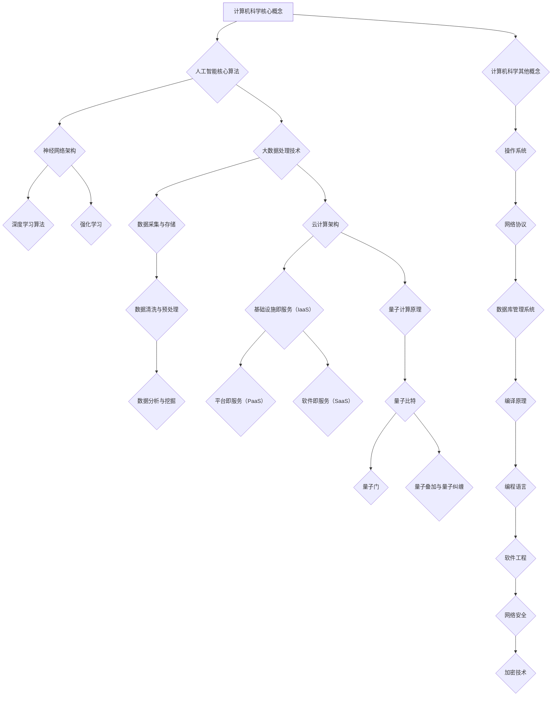

                 

### 1.1 人类计算的历史回顾

#### 1.1.1 计算的起源

计算的历史可以追溯到古代文明，早在公元前2000年左右，古埃及人和巴比伦人就已经使用算盘进行简单的数学计算。这些早期的计算工具主要是为了解决日常生活中的实际问题，如土地测量、税收计算和商业交易等。

随着时间的推移，计算工具逐渐变得更加复杂和高效。古希腊的阿基米德是古代计算领域的杰出人物，他在数学和物理学领域做出了巨大贡献，其中包括使用几何方法求解多边形面积和体积等问题。

中世纪时期，阿拉伯数学家们对计算技术的发展做出了重要贡献。他们引入了阿拉伯数字系统，并发明了包括“零”在内的许多数学概念，这些发明极大地推动了计算技术的进步。

#### 1.1.2 从机械计算到电子计算

计算技术的真正飞跃始于17世纪，随着工业革命的到来，机械计算器开始被广泛使用。最著名的机械计算器发明者是布莱兹·帕斯卡（Blaise Pascal），他在1642年发明了第一台机械计算器——帕斯卡计算器。这台机器能够进行简单的加减运算。

随后，在19世纪，英国数学家查尔斯·巴贝奇（Charles Babbage）提出了差分机和分析机的设计理念，这些理念预示着现代计算机的诞生。巴贝奇的设计虽然未能实现，但他的工作对后来的计算机科学家产生了深远的影响。

20世纪初，机械计算器进一步发展，例如霍华德·艾肯（Howard Aiken）设计的哈佛马克一号（Harvard Mark I），这是一台庞大的电动机械计算机，主要用于科学计算。

然而，真正的电子计算时代始于20世纪40年代。1946年，世界上第一台电子数字计算机——ENIAC（电子数值积分计算机）在美国诞生。ENIAC由约翰·莫齐利（John Mauchly）和约翰·普雷斯珀·埃克特（J. Presper Eckert）设计，它使用了约18000个电子管，能够进行高速的数值计算。

#### 1.1.3 人工智能的崛起

随着电子计算机的发展，人工智能（AI）作为计算机科学的一个分支开始崛起。1956年，在达特茅斯会议上，约翰·麦卡锡（John McCarthy）等人首次提出了人工智能的概念，这标志着人工智能作为一个独立研究领域的诞生。

在人工智能的发展历程中，许多重要的算法和技术被提出，例如逻辑推理、专家系统、机器学习等。20世纪80年代，基于规则的专家系统在许多领域取得了成功，但随后随着机器学习技术的发展，人工智能开始向数据驱动的方向转型。

20世纪90年代以后，随着计算能力的提升和数据量的爆发式增长，深度学习等机器学习技术取得了显著的进展。2012年，由杰弗里·辛顿（Geoffrey Hinton）等人提出的深度神经网络在图像识别任务中取得了突破性的成绩，这标志着人工智能进入了一个新的时代。

通过回顾人类计算的历史，我们可以看到计算技术是如何从简单的工具逐渐演变成现代社会的核心驱动力。每一个阶段的进步都为下一个阶段的创新奠定了基础，从而推动了人类文明的不断进步。

### 1.2 人类计算的终极目标

人类计算的终极目标是什么？这是一个深刻且复杂的问题，需要我们从多个角度进行探讨。首先，我们需要理解“计算”在人类社会中扮演的角色，以及它对人类生活和社会发展产生的影响。

#### 1.2.1 人工智能的未来趋势

随着人工智能技术的不断进步，我们可以预见未来计算将在以下几个方面发挥关键作用：

1. **智能化：**人工智能将使计算变得更加智能化，不仅仅是处理数据，而是理解数据，并能够根据环境进行自主决策。这将带来智能助理、智能驾驶、智能家居等众多应用。

2. **个性化：**基于大数据和机器学习，计算将能够更好地理解每个个体的需求和偏好，提供个性化的服务。例如，在教育、医疗、金融等领域，个性化推荐系统将极大地提高服务的质量和效率。

3. **自动化：**人工智能将使许多繁琐、重复性的工作实现自动化，从而解放人类，让他们能够专注于更有创造性和价值的工作。自动化技术在制造业、服务业等领域已经初见端倪，未来将有更大范围的应用。

4. **协作：**计算技术将增强人类之间的协作能力，通过虚拟现实、增强现实等技术，人们可以跨越时空限制，进行更加高效和互动的合作。

5. **扩展认知：**人工智能将作为人类的扩展工具，帮助人类处理复杂的任务，例如数据分析、预测模型等。这将极大地扩展人类的认知能力，使我们能够更好地应对复杂的世界。

#### 1.2.2 计算能力对人类社会的影响

计算能力的提升对人类社会产生了深远的影响，这些影响可以从以下几个方面进行探讨：

1. **经济发展：**计算技术的进步极大地推动了经济的发展。通过电子商务、在线服务、金融科技等，计算能力提高了商业运作的效率，创造了新的经济增长点。

2. **社会变革：**计算技术改变了社会结构和社会关系。例如，社交媒体使得信息传播速度大幅提高，人们之间的交流更加便捷，但也带来了一些负面影响，如隐私泄露和信息过载。

3. **教育革命：**在线教育平台和个性化学习系统使教育资源更加普及和公平。学生可以根据自己的需求和进度学习，提高了学习效率。

4. **医疗进步：**计算技术在医疗领域的应用极大地提高了医疗服务的质量和效率。例如，通过大数据分析和人工智能，可以实现精准医疗和智能诊断。

5. **环境保护：**计算技术有助于环境保护和资源管理。通过智能监测和数据分析，可以更好地预测和应对自然灾害，实现可持续发展。

#### 1.2.3 人类计算的目标与实践路径

人类计算的终极目标不仅仅是技术的进步，更重要的是通过技术来实现人类社会的可持续发展。为了实现这一目标，我们需要在以下几个方面进行努力：

1. **技术革新：**不断推动计算技术的创新，特别是在人工智能、量子计算等领域。技术进步是实现计算目标的基础。

2. **伦理和法律：**建立完善的伦理和法律体系，确保计算技术的发展不会损害人类的利益。例如，保护隐私、防止歧视和滥用技术等。

3. **教育和培训：**提高公众对计算技术的认识和理解，培养更多的计算专业人才。这不仅是技术发展的需要，也是社会进步的重要保障。

4. **国际合作：**计算技术的发展需要全球合作。通过国际合作，可以共同应对技术挑战，促进技术的共享和交流。

5. **社会参与：**鼓励社会各界参与计算技术的发展，使其更好地服务于社会。这包括政府、企业、学术机构和公众。

总之，人类计算的终极目标是实现技术与社会发展的和谐统一。通过技术进步、伦理和法律保障、教育和培训、国际合作以及社会参与，我们可以共同推动计算技术的发展，为人类社会创造更加美好的未来。

### 1.3 人类计算的挑战与应对

尽管计算技术在人类社会中取得了巨大进步，但实现其终极目标仍面临诸多挑战。这些挑战可以分为技术挑战、社会挑战和伦理挑战三大类，下面我们将逐一探讨并分析这些挑战，并提出相应的应对策略。

#### 1.3.1 技术挑战

1. **计算能力瓶颈：**尽管摩尔定律在过去数十年中推动了计算能力的飞速增长，但硬件发展的速度开始放缓。现有计算架构面临着性能瓶颈，尤其是随着量子计算等新兴技术的出现，如何突破这些瓶颈成为一大挑战。

   **应对策略：**研发新型计算架构，如量子计算、光子计算等，同时通过优化算法和体系结构，提高现有计算资源的利用效率。

2. **数据隐私和安全：**随着大数据和云计算的普及，数据隐私和安全问题日益突出。未经授权的数据访问、数据泄露和黑客攻击等问题对个人和企业的安全构成了威胁。

   **应对策略：**加强数据加密和访问控制技术，建立完善的数据隐私保护法规，同时推广零信任安全模型，确保数据在传输和存储过程中的安全。

3. **人工智能伦理：**人工智能技术的发展带来了伦理问题，如算法偏见、自主决策的责任归属、人工智能的透明度等。这些问题需要我们在技术设计和应用中给予充分考虑。

   **应对策略：**建立人工智能伦理指南和规范，推动透明和可解释的人工智能系统研发，加强人工智能系统的责任归属和问责机制。

4. **跨领域融合：**计算技术需要与其他领域（如生物学、医学、社会科学等）进行深度融合，以实现计算能力的最大化。这需要跨学科的合作和创新。

   **应对策略：**推动跨学科研究，建立跨领域合作平台，鼓励不同领域专家的交流与合作，促进技术创新和应用。

#### 1.3.2 社会挑战

1. **数字鸿沟：**随着计算技术的普及，数字鸿沟问题日益凸显。不同地区、不同社会阶层之间的计算能力和应用水平存在显著差异，这可能导致新的社会不平等。

   **应对策略：**通过政府政策支持、教育普及和公共基础设施建设，缩小数字鸿沟。例如，推广互联网接入、提供免费或低成本的公共计算资源，以及开展数字化技能培训。

2. **就业影响：**自动化和人工智能技术的广泛应用可能导致某些职业的失业风险，这对劳动市场和就业结构产生深远影响。

   **应对策略：**加强职业培训和再教育，帮助劳动力适应技术变革。同时，政府和企业应积极推动创造新的就业机会，促进劳动市场的转型。

3. **法律和监管：**计算技术的快速发展使得现有法律和监管框架难以适应。如何制定和实施适应新技术发展的法律和监管政策是一个重大挑战。

   **应对策略：**建立灵活、前瞻性的法律和监管框架，通过立法和政策调整，确保计算技术的发展不会对社会秩序和公共安全构成威胁。

4. **国际合作与竞争：**计算技术具有全球性特点，各国在技术竞争和合作中面临复杂的利益冲突。如何在国际层面上实现有效合作和竞争平衡，是一个亟待解决的问题。

   **应对策略：**通过多边合作机制，如国际组织和国际会议，促进各国在计算技术领域的交流与合作。同时，加强国际规则和标准的制定，确保技术竞争的公平性和秩序性。

#### 1.3.3 伦理挑战

1. **隐私保护：**随着数据收集和分析技术的发展，个人隐私保护面临新的挑战。如何在利用数据促进技术创新的同时保护个人隐私，是一个重要的伦理问题。

   **应对策略：**建立严格的数据隐私保护法规和标准，加强对数据滥用和泄露的监管。同时，推动透明和可解释的数据处理技术，提高公众对数据使用的认知和控制能力。

2. **算法偏见：**人工智能系统中的算法偏见可能导致不公平的决策，如歧视性招聘、不公平的贷款审批等。

   **应对策略：**推动算法的公平性和透明性，通过数据清洗、算法优化和多样化数据集等方法减少偏见。同时，建立独立的算法审核机制，确保算法决策的公正性。

3. **责任归属：**在人工智能系统发生错误或造成损害时，如何确定责任归属是一个复杂的问题。

   **应对策略：**建立明确的法律法规，明确人工智能系统开发者和使用者的责任和义务。同时，推动人工智能系统的责任保险制度，为潜在损害提供经济保障。

4. **人工智能监管：**如何对人工智能系统进行有效监管，以确保其符合伦理和法律标准，是一个重大挑战。

   **应对策略：**建立人工智能监管机构，制定详细的监管标准和流程。同时，推动行业协会和企业的自律，共同维护人工智能技术的健康发展。

通过上述分析和应对策略，我们可以看到，尽管人类计算面临着诸多挑战，但通过技术创新、政策法规、社会参与和国际合作，我们有信心应对这些挑战，推动计算技术朝着更加积极和有益于人类社会的方向发展。

### 2.1 计算机架构演进

计算机架构的演进是计算技术发展的核心驱动力之一。从最初的机械计算器到现代的超级计算机，计算机架构经历了数次重大变革，每一次变革都极大地提升了计算能力和效率。本节将详细探讨计算机架构的演变，包括基本计算机结构、处理器架构和存储技术的发展。

#### 2.1.1 基本计算机结构

计算机的基本结构主要包括输入设备、输出设备、存储设备和中央处理单元（CPU）。输入设备用于将数据和信息输入计算机，例如键盘、鼠标和扫描仪等。输出设备用于将计算机处理的结果输出，如显示器、打印机等。存储设备用于存储数据和程序，包括硬盘、固态硬盘和内存等。而中央处理单元（CPU）则是计算机的核心，负责执行程序指令和处理数据。

计算机的基本结构在早期以冯·诺伊曼架构为代表。冯·诺伊曼架构的基本思想是将程序指令和数据存储在同一存储器中，CPU通过读取指令来执行操作。这一架构至今仍在广泛使用，但已经经历了多次改进和优化。

#### 2.1.2 处理器架构

处理器的架构决定了计算机的计算能力和效率。随着计算需求的不断增加，处理器架构也在不断演进。下面我们将介绍几种重要的处理器架构：

1. **单指令流单数据流（SISD）架构：**这是最传统的处理器架构，每个处理器在同一时间内只能执行一条指令。这种架构简单且易于实现，但在处理复杂任务时效率较低。

2. **单指令流多数据流（SIMD）架构：**这种架构允许多个处理器单元同时执行同一条指令，但每个处理器单元处理不同的数据。这种架构适用于向量计算和多媒体处理等领域，可以显著提高处理速度。

3. **多指令流单数据流（MISD）架构：**这种架构在早期主要用于特定任务，如故障检测和冗余系统。它允许多个处理器单元同时执行不同的指令，但处理相同的数据。

4. **多指令流多数据流（MIMD）架构：**这种架构允许多个处理器单元同时执行不同的指令，处理不同的数据。这种架构是现代多核处理器的核心，广泛应用于服务器、工作站和超级计算机中。

近年来，处理器架构还引入了诸如虚拟化、并行计算和异构计算等技术。虚拟化技术使得多个操作系统可以在同一物理处理器上运行，提高了资源利用率。并行计算技术通过将任务分解为多个子任务，并行执行，从而提高了计算速度。异构计算技术则通过利用不同类型和处理能力的处理器，如CPU、GPU和FPGA等，实现更高效的计算。

#### 2.1.3 存储技术发展

存储技术是计算机架构中至关重要的一环，它决定了计算机的数据存取速度和处理能力。下面我们将介绍几种主要的存储技术：

1. **硬盘驱动器（HDD）：**硬盘驱动器是最常见的存储设备，采用机械磁盘进行数据存储。尽管硬盘容量大、价格低，但数据存取速度较慢，且易受物理损伤。

2. **固态硬盘（SSD）：**固态硬盘采用闪存进行数据存储，具有更高的数据存取速度和可靠性。SSD的普及极大地提升了计算机的运行速度，尤其对于启动速度和文件传输速度的提升显著。

3. **随机访问存储（RAM）：**随机访问存储用于临时存储正在处理的程序和数据，具有极高的数据存取速度。但由于其价格较高且容量有限，RAM通常用于缓存和交换空间。

4. **非易失性存储器（NVMe）：**非易失性存储器是一种高速存储接口技术，通过PCIe总线连接到主机，具有极高的数据传输速度和低延迟。NVMe广泛应用于高端服务器和数据中心，是未来存储技术的重要发展方向。

随着存储需求的不断增长，新型存储技术如分布式存储、云存储和闪存存储也逐渐成为研究热点。分布式存储通过将数据分散存储在多个节点上，提高了数据的可靠性和扩展性。云存储则通过互联网提供远程数据存储服务，用户可以根据需求灵活调整存储资源。闪存存储技术则通过固态存储介质，实现了更高的存储密度和更低的能耗。

综上所述，计算机架构的演进是计算技术发展的关键。通过不断改进处理器架构和存储技术，计算机的计算能力和效率得到了显著提升。未来的计算技术将继续朝着更快、更智能、更可靠的方向发展，为人类社会带来更多创新和变革。

#### 2.2 人工智能基础算法

人工智能（AI）作为计算机科学的一个重要分支，其核心在于通过算法使计算机具备模拟人类智能的能力。在本节中，我们将深入探讨人工智能的三个基础算法：神经网络、深度学习和强化学习，并介绍它们的基本原理和应用场景。

##### 2.2.1 神经网络

神经网络（Neural Networks，NN）是人工智能最基础和最核心的算法之一，它模仿了人脑神经元的工作方式。神经网络由大量简单计算单元（神经元）互联而成，每个神经元都接受来自其他神经元的输入，并通过权重进行加权求和，最后通过激活函数产生输出。

**基本结构：**一个简单的神经网络通常包括输入层、隐藏层和输出层。输入层接收外部输入数据，隐藏层对输入数据进行处理和转换，输出层生成最终的预测结果。

**工作原理：**
1. **前向传播：**输入数据通过输入层传递到隐藏层，隐藏层的神经元将输入数据进行加权求和，并通过激活函数产生输出，这些输出作为下一隐藏层的输入。
2. **反向传播：**计算输出层与实际目标之间的误差，将这些误差反向传递到隐藏层和输入层，通过梯度下降等优化算法更新各层的权重和偏置，使网络输出更接近目标值。

**伪代码：**
```python
# 定义神经网络结构
layers = [
    Layer(input_size, activation_function),
    Layer(hidden_size, activation_function),
    Layer(output_size, activation_function)
]

# 前向传播
def forward_pass(input_data, layers):
    for layer in layers:
        input_data = layer.forward(input_data)
    return input_data

# 反向传播
def backward_pass(output, expected_output, layers, learning_rate):
    for layer in reversed(layers):
        output = layer.backward(output, expected_output, learning_rate)
    return updated_weights
```

**应用场景：**神经网络在图像识别、语音识别、自然语言处理等领域有广泛的应用。例如，在图像识别中，神经网络可以用于分类和目标检测；在语音识别中，神经网络可以用于语音到文本的转换。

##### 2.2.2 深度学习

深度学习（Deep Learning，DL）是神经网络的一种扩展，其核心思想是利用多层神经网络来学习复杂的数据特征。与传统的单层神经网络相比，深度学习能够自动提取数据的深层特征，从而提高了模型的泛化能力。

**基本结构：**深度学习网络通常包含多个隐藏层，每一层都对输入数据进行非线性变换，从而实现特征的逐层抽象。

**工作原理：**
1. **多层神经网络：**与单层神经网络不同，深度学习网络通过多层神经元的组合，实现了数据的逐层抽象和特征提取。
2. **卷积神经网络（CNN）：**深度学习在计算机视觉领域的重要应用，通过卷积层、池化层和全连接层的组合，实现图像的特征提取和分类。
3. **循环神经网络（RNN）：**深度学习在序列数据上的重要应用，通过循环结构实现对序列数据的动态建模。

**伪代码：**
```python
# 定义深度学习模型结构
model = Model([
    Conv2D(input_shape, filters, kernel_size, activation),
    MaxPooling2D(pool_size),
    Flatten(),
    Dense(units, activation)
])

# 前向传播
def forward_pass(input_data, model):
    output = model.forward(input_data)
    return output

# 反向传播
def backward_pass(output, expected_output, model, learning_rate):
    output = model.backward(output, expected_output, learning_rate)
    return updated_weights
```

**应用场景：**深度学习在图像识别、语音识别、自然语言处理、推荐系统等领域有广泛应用。例如，在图像识别中，深度学习可以用于人脸识别、物体检测等；在语音识别中，深度学习可以用于语音到文本的转换。

##### 2.2.3 强化学习

强化学习（Reinforcement Learning，RL）是一种通过试错和奖励机制来学习决策策略的机器学习算法。强化学习与监督学习和无监督学习不同，它不需要标注数据，而是通过与环境互动，根据奖励和惩罚来调整行为策略。

**基本结构：**强化学习由智能体（Agent）、环境（Environment）和奖励机制（Reward）三部分组成。智能体通过观察环境状态，选择动作，并接收环境反馈的奖励信号，从而不断优化决策策略。

**工作原理：**
1. **价值函数：**通过评估状态和动作的价值，智能体选择最优动作。
2. **策略：**智能体根据价值函数生成的策略进行动作选择，以最大化累积奖励。
3. **奖励机制：**通过奖励和惩罚信号来引导智能体的学习过程。

**伪代码：**
```python
# 定义强化学习模型
model = Model(state_shape, action_size)

# 策略评估
def policy_evaluation(state, action, model, reward, discount_factor):
    return model.evaluate(state, action, reward, discount_factor)

# 策略迭代
def policy_iteration(state, action, model, discount_factor):
    while not converged:
        state_value = policy_evaluation(state, action, model, reward, discount_factor)
        update_policy(state, action, state_value)
    return model
```

**应用场景：**强化学习在游戏、自动驾驶、机器人控制等领域有广泛应用。例如，在游戏中，强化学习可以用于玩家行为预测和游戏策略优化；在自动驾驶中，强化学习可以用于路径规划和决策控制。

通过上述对神经网络、深度学习和强化学习的介绍，我们可以看到这些算法在人工智能中的应用前景和潜力。随着计算能力的提升和数据量的增长，这些基础算法将继续推动人工智能技术的发展，为人类社会带来更多创新和变革。

### 2.3 大数据与云计算

大数据和云计算是现代计算技术的两个重要支柱，它们不仅显著提升了数据处理和分析的能力，还深刻改变了信息存储和计算的方式。在本节中，我们将探讨大数据和云计算的概念、架构以及在实际应用中的重要性。

#### 2.3.1 大数据的概念与处理

大数据（Big Data）指的是数据量巨大、数据类型多样且数据生成速度极快的数据集合。与传统数据相比，大数据具有“4V”特点，即大量（Volume）、多样（Variety）、速度（Velocity）和价值（Value）。

**大数据的概念：**
- **大量（Volume）：**大数据的量级通常是TB、PB甚至EB级别，这意味着需要高效的存储和管理系统来处理如此庞大的数据。
- **多样（Variety）：**大数据不仅包括结构化数据，还包括非结构化数据（如图像、视频、文本等），以及半结构化数据（如XML、JSON等）。
- **速度（Velocity）：**大数据生成和处理的速度非常快，需要实时或近实时的数据处理和分析能力。
- **价值（Value）：**大数据的价值密度较低，意味着从大量数据中提取有价值的信息是一个具有挑战性的过程。

**大数据的处理：**
大数据的处理通常分为以下几个步骤：
1. **数据采集：**从各种数据源（如传感器、网站、数据库等）收集数据。
2. **数据存储：**使用分布式存储系统（如Hadoop HDFS、NoSQL数据库等）存储大规模数据。
3. **数据清洗：**对采集到的数据进行清洗，去除重复、错误和无关的数据。
4. **数据整合：**将不同来源、不同类型的数据整合到一个统一的框架中，以便进一步分析。
5. **数据分析：**使用数据挖掘、机器学习等算法对大数据进行分析，提取有价值的信息。

#### 2.3.2 云计算架构

云计算（Cloud Computing）是一种基于互联网的计算模式，通过互联网提供动态易扩展的虚拟化资源。云计算的主要优势在于灵活的资源分配、高效的资源利用和降低的成本。

**云计算架构：**
云计算通常分为以下三个层次：
1. **基础设施即服务（IaaS）：**IaaS提供虚拟化的计算资源，如虚拟机、存储和网络等。用户可以根据需求灵活配置和扩展资源。
2. **平台即服务（PaaS）：**PaaS提供开发平台，包括操作系统、数据库、开发工具等，开发者可以在平台上开发和部署应用程序。
3. **软件即服务（SaaS）：**SaaS提供应用程序和服务的在线访问，用户无需关心基础设施和平台的管理，只需使用应用程序即可。

**云计算服务模型：**
- **公共云（Public Cloud）：**公共云由第三方服务提供商运营，多个用户共享资源。公共云具有成本效益高、可扩展性强等优点。
- **私有云（Private Cloud）：**私有云是专门为一个组织或企业运营的云计算环境。私有云提供更高的安全性和数据控制能力，但成本较高。
- **混合云（Hybrid Cloud）：**混合云结合了公共云和私有云的优势，适用于需要灵活资源分配和高效数据管理的复杂场景。

**云计算的应用：**
云计算在各个领域都有广泛应用，例如：
- **企业IT服务：**企业可以使用云计算提供邮件、办公自动化、客户关系管理等服务，降低IT成本。
- **数据存储和分析：**云计算提供了大规模、高性能的数据存储和分析服务，适用于大数据处理和分析。
- **软件开发和测试：**云计算提供了虚拟开发环境和测试环境，支持敏捷开发和持续集成。

通过大数据和云计算的结合，我们可以实现高效的数据处理和分析，为各行各业带来创新和变革。大数据提供了丰富的数据资源，而云计算提供了强大的计算能力和灵活的资源管理。在未来，随着技术的进一步发展，大数据和云计算将继续推动计算技术的发展，为人类社会带来更多价值。

### 2.4 量子计算的前景

量子计算（Quantum Computing）作为下一代计算技术的代表，正在迅速发展并展现出巨大的潜力。与传统的经典计算相比，量子计算利用量子力学的原理，通过量子比特（qubits）的叠加和纠缠状态，实现了超越经典计算机的强大计算能力。本节将详细探讨量子计算的原理、优势及其在不同领域的应用前景。

#### 2.4.1 量子计算的原理

量子计算的基本单元是量子比特（qubits），与经典比特（bits）不同，量子比特可以同时处于0和1的叠加态。这种叠加态使得量子计算机能够同时处理多个可能的计算路径，从而在特定问题上展现出指数级别的计算优势。

**量子比特：**量子比特是量子计算的基本信息单位，它可以同时处于多个状态，这是量子计算的核心特性。一个量子比特可以表示为 \(|\psi\rangle = \alpha|0\rangle + \beta|1\rangle\)，其中 \(|\alpha|^2 + |\beta|^2 = 1\)。

**量子门：**量子门是量子计算中的操作，类似于经典计算中的逻辑门。量子门通过旋转量子比特的叠加态，实现量子态的变换。常见的量子门包括Hadamard门（实现叠加态）、Pauli门（实现量子比特的旋转）和控制非门（CNOT门，实现量子比特之间的纠缠）。

**量子叠加和量子纠缠：**量子叠加允许量子比特同时处于多个状态，而量子纠缠则使得两个或多个量子比特之间的状态无法独立。量子叠加和量子纠缠是量子计算的核心原理，它们使得量子计算机能够在处理复杂问题时同时考虑多个可能性。

#### 2.4.2 量子计算机的优势

量子计算机相较于经典计算机具有以下几个显著优势：

1. **指数级的速度提升：**量子计算机在处理某些特定问题时，如因数分解、搜索问题和优化问题，能够实现指数级别的速度提升。例如，Shor算法利用量子计算机可以在多项式时间内完成大整数的因数分解，而这是经典计算机需要指数级时间才能完成的。

2. **并行计算能力：**量子计算机通过量子叠加和量子纠缠实现了并行计算的能力。一个含有n个量子比特的量子计算机可以在一次操作中同时处理 \(2^n\) 个状态，这极大地提高了计算效率。

3. **高维空间的表示能力：**量子计算机可以处理高维空间中的问题，这使它们在模拟物理系统、优化问题和机器学习中具有独特的优势。

4. **新型算法应用：**量子计算为许多领域提供了新的算法和应用前景。例如，在药物发现中，量子计算可以用于模拟分子结构和预测药物反应；在材料科学中，量子计算可以用于发现新型材料。

#### 2.4.3 量子计算的应用领域

量子计算的应用前景非常广泛，以下是一些关键领域：

1. **密码学：**量子计算机在密码学中有重要的应用。例如，Shor算法可以破坏许多基于大整数分解的加密算法，如RSA加密。但同时，量子计算也为新型加密算法提供了机会，如量子密钥分配和量子安全通信。

2. **优化问题：**量子计算在解决复杂优化问题方面具有显著优势。例如，在物流和交通规划中，量子计算可以用于优化路线和资源分配，提高效率和降低成本。

3. **量子模拟：**量子计算可以用于模拟量子系统和复杂物理现象，这在材料科学、化学和生物学领域具有重要应用。例如，量子计算可以用于预测分子行为、设计新材料和药物分子。

4. **机器学习：**量子计算在机器学习领域有广泛的应用潜力。量子算法可以用于加速机器学习模型的训练和优化，提高模型的准确性和效率。

5. **计算生物学：**量子计算在计算生物学和药物发现中具有巨大潜力。例如，量子计算可以用于分子结构模拟、药物分子设计和蛋白质折叠预测。

尽管量子计算仍处于初级阶段，但越来越多的研究和投资正在推动这一领域的发展。随着技术的成熟，量子计算有望在未来实现大规模应用，为社会带来革命性的变化。

### 3.1 教育领域

人工智能在教育领域的应用正在迅速扩展，为个性化学习、智能教学系统和评估与反馈机制带来了革命性的变革。通过人工智能技术，教育变得更加灵活、高效和个性化，从而提升了学习效果和效率。

#### 3.1.1 个性化学习

个性化学习是人工智能在教育领域最引人注目的应用之一。通过分析学生的学习数据，人工智能可以识别每个学生的独特学习需求和偏好，并制定个性化的学习计划。这种个性化学习系统通常包括以下几个关键组件：

1. **学习数据分析：**人工智能系统会收集和分析学生的学习行为数据，如学习时间、测试成绩、作业完成情况等。这些数据帮助系统了解学生的学习习惯和能力水平。

2. **学习路径推荐：**根据学生的学习数据分析，系统可以推荐适合每个学生的学习路径。例如，对于某个学生在数学上的薄弱环节，系统可能会推荐相关的练习题和教学视频。

3. **自适应学习内容：**人工智能系统能够根据学生的学习进度和理解程度，动态调整学习内容的难度和深度。这种自适应学习内容能够确保每个学生都能在适合自己的节奏上学习。

4. **学习效果评估：**通过持续监测学生的学习行为和成绩，系统可以评估学习效果，并根据评估结果调整学习计划。

**案例：**Coursera和edX等在线教育平台利用人工智能技术提供了个性化学习体验。学生可以根据自己的进度和学习目标，选择适合的课程和练习题，并获得个性化的学习建议和反馈。

#### 3.1.2 智能教学系统

智能教学系统利用人工智能技术，提供了一种新型的教学模式，这种模式能够动态适应学生的需求，提高教学效果。智能教学系统通常包括以下几个关键组件：

1. **智能辅导：**智能教学系统可以为学生提供实时辅导，解答他们在学习过程中遇到的问题。通过自然语言处理和机器学习算法，系统可以理解学生的问题，并提供详细的解答和指导。

2. **智能测评：**智能教学系统能够自动生成个性化测评，根据学生的学习进度和理解程度，设定合适的难度和类型。测评结果不仅能够帮助学生了解自己的学习情况，还能为教师提供教学反馈。

3. **课堂互动：**人工智能技术可以增强课堂互动，例如通过语音识别和语音合成技术，教师和学生可以进行语音交流；通过虚拟现实和增强现实技术，学生可以参与虚拟实验和互动教学活动。

4. **教学资源推荐：**智能教学系统可以根据学生的学习情况，推荐相关的教学资源，如视频、文献、练习题等。这些资源不仅有助于学生的自主学习，还能丰富课堂内容。

**案例：**Google Classroom和Microsoft Teams等在线教学平台利用人工智能技术，提供了智能辅导、智能测评和课堂互动等功能，帮助教师和学生实现高效的教学和学习。

#### 3.1.3 评估与反馈机制

评估与反馈机制是教育过程中至关重要的一环，人工智能技术的引入，使这一过程变得更加精准和高效。人工智能在评估与反馈机制中的应用主要体现在以下几个方面：

1. **自动评分：**人工智能系统能够自动评分，包括选择题、填空题和作文等多种题型。这不仅节省了教师的时间和精力，还能确保评分的客观性和一致性。

2. **实时反馈：**通过自然语言处理技术，人工智能系统能够为学生提供即时反馈，指出错误并提供详细的解释。这种实时反馈有助于学生及时纠正错误，加深对知识的理解。

3. **智能分析：**人工智能系统可以对学生的评估结果进行智能分析，识别学生的薄弱环节，并提供改进建议。教师可以根据这些分析结果，调整教学策略，提高教学效果。

4. **个性化报告：**人工智能系统可以根据学生的表现，生成个性化的学习报告，报告内容包括学生的学习进度、成绩变化和改进建议等。这些报告不仅有助于学生和家长了解学习情况，还能为教师的教学决策提供参考。

**案例：**许多在线教育平台，如Khan Academy和Quizlet，利用人工智能技术提供了自动评分和实时反馈功能，帮助学生和家长更好地掌握学习进度和成绩。

总之，人工智能在教育领域的应用，为个性化学习、智能教学系统和评估与反馈机制带来了革命性的变革。通过利用人工智能技术，教育变得更加灵活、高效和个性化，从而为学生提供了更好的学习体验，并为教师提供了有力的教学支持。

### 3.2 医疗健康

人工智能在医疗健康领域的应用正日益扩展，为精准医疗、医疗影像分析和智能诊断与治疗带来了革命性的变化。通过人工智能技术，医疗健康行业得以实现更加高效、准确和个性化的服务，从而提高整体医疗水平。

#### 3.2.1 精准医疗

精准医疗是一种基于个体基因信息、环境和生活习惯的数据分析，为患者提供个性化治疗方案的方法。人工智能技术在精准医疗中发挥着关键作用，主要体现在以下几个方面：

1. **基因组分析：**人工智能可以帮助医生快速分析患者的基因组数据，识别出与疾病相关的基因突变和风险因素。通过基因组分析，医生可以更准确地诊断疾病，并制定个性化的治疗方案。

2. **药物筛选：**人工智能技术可以加速新药的研发过程。通过分析大量的生物数据和药物分子信息，人工智能可以筛选出潜在的有效药物，从而缩短药物研发周期，降低研发成本。

3. **个性化治疗：**基于患者的基因、病史和生活方式，人工智能可以制定个性化的治疗方案。例如，在癌症治疗中，人工智能可以推荐最有效的化疗药物组合，提高治疗效果。

4. **健康监测：**人工智能技术可以通过智能穿戴设备和分析算法，实时监测患者的健康状况。例如，通过监测血糖、血压和心率等数据，人工智能可以及时发现异常情况，并提醒患者或医生采取相应的措施。

**案例：**IBM的Watson for Genomics是一款利用人工智能技术进行基因组分析的工具，可以帮助医生快速、准确地诊断癌症，并制定个性化治疗方案。通过分析患者的基因组数据，Watson for Genomics可以识别出与癌症相关的基因突变，提高治疗的精准性。

#### 3.2.2 医疗影像分析

医疗影像分析是人工智能在医疗健康领域的另一个重要应用。通过深度学习和计算机视觉技术，人工智能能够自动分析医疗影像，提高诊断的准确性和效率。医疗影像分析主要包括以下方面：

1. **图像分割：**人工智能可以自动分割医疗影像中的关键结构，如肿瘤、器官和组织等。通过图像分割，医生可以更清楚地观察病变部位，提高诊断的准确性。

2. **病灶检测：**人工智能可以自动检测医疗影像中的病灶，如肿瘤、心脏病等。通过病灶检测，医生可以早期发现疾病，及时采取治疗措施。

3. **影像识别：**人工智能可以自动识别医疗影像中的各种结构，如骨骼、血管和软组织等。通过影像识别，医生可以更准确地评估病变情况和治疗效果。

4. **影像诊断：**结合医生的诊断经验，人工智能可以辅助医生进行影像诊断，提供参考意见。例如，在放射科中，人工智能可以辅助医生诊断X光、CT和MRI等影像。

**案例：**Google Health的DeepMind Health团队开发的AI系统可以自动分析眼科图像，用于诊断黄斑变性等疾病。该系统通过对大量眼科图像的训练，可以准确识别病变区域，提高早期诊断的准确性。

#### 3.2.3 智能诊断与治疗

智能诊断与治疗是人工智能在医疗健康领域的最终目标，通过结合多种技术和数据，实现更加智能和高效的医疗服务。以下是一些具体的智能诊断与治疗应用：

1. **智能诊断系统：**人工智能可以集成多种医疗数据，如电子病历、基因组数据、医疗影像等，进行综合分析，提供精准的诊断。例如，IBM的Watson for Oncology可以通过分析大量的临床数据和文献，为癌症患者提供个性化的治疗建议。

2. **智能治疗规划：**人工智能可以辅助医生制定治疗计划，优化治疗方案。例如，在放射治疗中，人工智能可以自动计算最佳的射线角度和剂量，确保治疗效果最大化，同时减少副作用。

3. **远程医疗服务：**通过人工智能和远程医疗技术，医生可以实时监测患者的健康状况，提供远程诊断和治疗方案。这种模式特别适合于偏远地区和行动不便的患者，提高了医疗服务的可及性和效率。

4. **智能药物研发：**人工智能可以加速药物研发过程，通过分析大量生物数据和药物分子信息，识别潜在的药物靶点和候选药物。例如，Exscientia公司的AI系统可以自动化药物分子设计，缩短新药研发周期。

**案例：**微软的Azure AI Health对于智能诊断和治疗有广泛应用。Azure AI Health利用深度学习和计算机视觉技术，可以自动分析医疗影像，提供诊断建议和治疗方案。此外，Azure AI Health还可以整合患者的基因组数据，为个性化治疗提供支持。

总之，人工智能在医疗健康领域的应用为精准医疗、医疗影像分析和智能诊断与治疗带来了革命性的变化。通过利用人工智能技术，医疗健康行业可以实现更加高效、准确和个性化的服务，从而提高整体医疗水平，改善患者的生活质量。

### 3.3 金融与经济

人工智能在金融与经济领域的应用正在迅速扩展，其影响力已深入到金融市场的预测、风险管理和个性化金融服务等多个方面。通过人工智能技术，金融行业能够更加精准地分析市场趋势，提高风险管理能力，并为消费者提供更加个性化的金融服务。

#### 3.3.1 金融市场预测

金融市场预测是人工智能在金融领域的重要应用之一。通过分析大量的历史数据和实时市场数据，人工智能可以识别市场趋势和潜在的风险，为投资者提供决策支持。

1. **时间序列分析：**人工智能技术，如深度学习和循环神经网络（RNN），可以处理和分析时间序列数据，预测股票价格、货币汇率等金融市场的动态变化。通过训练大量的历史市场数据，模型可以学习到市场的周期性变化和趋势，从而进行准确的预测。

2. **多因子模型：**人工智能可以整合多个市场指标和因子，如公司业绩、宏观经济指标、市场情绪等，构建多因子模型进行市场预测。这些模型能够捕捉到多种因素对市场的影响，提供更加全面的预测结果。

3. **图像和文本分析：**人工智能还可以通过图像和文本分析技术，提取市场中的非结构化信息。例如，通过分析新闻报道、社交媒体评论等文本数据，可以捕捉到市场情绪的变化，为市场预测提供补充信息。

**案例：**量化投资公司Two Sigma利用人工智能技术进行金融市场预测。他们开发了基于深度学习和统计模型的预测系统，能够实时分析大量数据，预测股票、债券和其他金融资产的价格走势，为投资者提供决策支持。

#### 3.3.2 风险管理

人工智能在风险管理中的应用，显著提高了金融机构对市场风险的管理能力，确保金融系统的稳定运行。

1. **信用风险评估：**人工智能技术可以通过分析借款人的信用历史、财务状况、社会行为等多种数据，进行信用风险评估。这种评估不仅更加精准，还能识别传统方法难以发现的潜在风险。

2. **市场风险预测：**通过分析市场数据、宏观经济指标和宏观经济政策，人工智能可以预测市场风险，如利率波动、股票市场动荡等。金融机构可以利用这些预测结果，及时调整投资组合，降低风险。

3. **操作风险管理：**人工智能可以通过监控交易行为、分析交易日志等数据，发现潜在的操作风险，如欺诈交易、错误交易等。这种监控能力有助于金融机构及时采取措施，防止损失。

**案例：**J.P. Morgan使用人工智能技术进行交易监控，通过分析交易数据和行为模式，自动识别和防范潜在的欺诈交易。这项技术不仅提高了监控的精度，还节省了大量的人力成本。

#### 3.3.3 个性化金融服务

个性化金融服务是人工智能在金融领域的又一重要应用，通过分析消费者的数据和行为，提供定制化的金融产品和服务，提升客户体验。

1. **个性化投资建议：**人工智能可以根据消费者的财务状况、投资目标和风险偏好，提供个性化的投资建议。这些建议不仅有助于消费者做出更明智的投资决策，还能提高投资组合的收益。

2. **个性化贷款产品：**人工智能可以通过分析消费者的信用记录、收入情况等数据，为消费者推荐最适合的贷款产品。这种个性化服务能够提高贷款的审批效率，降低贷款违约风险。

3. **智能客服：**通过自然语言处理和机器学习技术，智能客服系统能够自动回答消费者的提问，提供24/7的客户服务。这些系统能够理解自然语言，进行多轮对话，提供个性化的金融咨询。

**案例：**银行和金融机构如花旗银行和摩根士丹利等，利用人工智能技术提供个性化的投资和贷款服务。花旗银行的智能投顾平台“数字顾问”通过分析用户数据，提供个性化的投资建议和资产配置方案，帮助用户实现财务目标。

总之，人工智能在金融与经济领域的应用，不仅提高了金融市场的预测准确性，增强了风险管理的有效性，还为消费者提供了更加个性化的金融服务。随着人工智能技术的不断进步，金融行业将继续迎来更多创新和变革。

### 3.4 制造业

人工智能在制造业中的应用正逐步深入，为智能生产、设备预测维护和工业大数据分析提供了强大的支持，从而提升了制造业的效率和质量。

#### 3.4.1 智能生产

智能生产是制造业未来发展的重要方向，通过人工智能技术，实现生产过程的自动化和优化。智能生产的关键技术包括以下方面：

1. **自动化生产系统：**人工智能可以帮助构建自动化生产线，通过机器人、自动化设备和传感器等实现生产过程的自动化。例如，在汽车制造中，自动化生产线可以大幅提高生产效率，减少人工操作带来的误差。

2. **智能制造执行系统（MES）：**智能制造执行系统通过集成传感器、机器人和生产设备，实时监控生产过程，并自动调整生产参数，确保生产过程的连续性和高效性。

3. **自适应生产：**人工智能技术可以分析生产数据，识别生产过程中的瓶颈和异常，并自动调整生产计划，实现自适应生产。例如，在印刷行业中，自适应生产系统能够根据印刷质量实时调整印刷参数，提高印刷质量。

**案例：**德国西门子公司在制造业中广泛应用了人工智能技术。他们的数字工厂通过集成人工智能和物联网技术，实现了生产过程的全面自动化和优化，大幅提高了生产效率和质量。

#### 3.4.2 设备预测维护

设备预测维护是人工智能在制造业中的一项重要应用，通过实时监控设备运行状态，预测潜在故障，从而实现预防性维护，减少停机时间和维护成本。

1. **状态监测：**人工智能系统通过传感器和数据采集设备，实时监测设备的工作状态，包括温度、振动、压力等参数。这些数据可以反映设备的健康状况，帮助预测潜在的故障。

2. **异常检测：**通过机器学习和模式识别技术，人工智能可以分析设备运行数据，识别异常模式，预测故障发生。例如，在压缩机运行中，异常振动可能是轴承磨损的前兆，通过异常检测可以提前预警。

3. **预测性维护：**基于预测模型，人工智能系统可以提前制定维护计划，包括维修、更换部件等，从而避免突发性故障，减少停机时间和维护成本。

**案例：**通用电气（GE）通过其Predix平台，利用人工智能技术实现了设备预测维护。在航空发动机维护中，Predix平台通过分析发动机运行数据，预测故障并提前安排维护，提高了发动机的可靠性和运行时间。

#### 3.4.3 工业大数据分析

工业大数据分析是人工智能在制造业中的另一个重要应用，通过分析海量的生产数据，挖掘潜在价值，优化生产过程和决策。

1. **数据采集与整合：**在工业环境中，生产设备、传感器和控制系统等会产生大量数据。通过工业互联网平台，这些数据可以被采集、整合和存储，为数据分析提供数据基础。

2. **数据清洗与预处理：**工业大数据通常包含噪声和不完整的数据，通过数据清洗和预处理技术，可以去除噪声、填补缺失值，提高数据质量。

3. **数据挖掘与分析：**通过机器学习和统计分析技术，人工智能可以对工业大数据进行分析，挖掘潜在的价值。例如，通过分析生产数据，可以优化生产流程，提高生产效率；通过分析设备数据，可以预测设备故障，提高设备利用率。

**案例：**德国博世公司利用工业大数据分析技术，优化了其汽车制造过程中的生产流程。通过分析生产数据，博世能够识别生产瓶颈和异常，并采取相应的优化措施，提高了生产效率和产品质量。

总之，人工智能在制造业中的应用，通过智能生产、设备预测维护和工业大数据分析，极大地提升了制造业的效率和质量。随着人工智能技术的不断进步，制造业将继续迎来更多创新和变革，为全球经济和社会发展做出更大贡献。

### 4.1 伦理与法律问题

人工智能（AI）的发展不仅带来了巨大的技术进步和社会变革，同时也引发了一系列伦理和法律问题。这些问题涉及到隐私保护、算法偏见、数据安全、责任归属等多个方面，对于人工智能的可持续发展具有重要意义。在本节中，我们将深入探讨人工智能伦理与法律问题，并提出相应的解决方案和最佳实践。

#### 4.1.1 人工智能伦理

人工智能伦理关注的是人工智能系统设计、开发和应用过程中所涉及的道德和社会责任。以下是人工智能伦理中几个关键问题：

1. **隐私保护：**人工智能系统在数据处理过程中可能会收集大量的个人数据，这涉及到用户的隐私权利。如何确保个人数据的安全和隐私，是人工智能伦理的重要议题。

   **解决方案：**加强数据隐私保护法规，确保数据收集、存储和使用过程中的合法性和透明度。同时，推广隐私增强技术，如差分隐私和同态加密，以增强数据隐私保护。

2. **算法偏见：**人工智能系统可能会因为训练数据中的偏见而导致歧视性决策，如种族、性别和年龄歧视。

   **解决方案：**在算法设计和训练过程中，使用多样化的数据集，减少偏见。同时，建立算法透明性和可解释性标准，确保算法决策的可追溯性和合理性。

3. **责任归属：**在人工智能系统造成损害时，如何确定责任归属是一个复杂的问题。责任归属的模糊可能导致责任逃避和道德风险。

   **解决方案：**明确人工智能系统的责任归属，制定相关的法律法规，确保开发者和使用者承担相应的责任。同时，推动建立人工智能责任保险制度，为潜在损害提供经济保障。

4. **公平性：**人工智能系统在应用过程中可能会加剧社会不平等，影响公平性。

   **解决方案：**在算法设计和应用过程中，重视公平性，确保人工智能系统不会对特定群体造成不利影响。加强跨学科合作，推动技术伦理研究，确保人工智能的公平应用。

#### 4.1.2 法律监管

随着人工智能技术的发展，现有法律和监管框架面临巨大的挑战。如何制定和实施适应新技术发展的法律和监管政策，是当前的一个重要课题。

1. **数据保护法：**欧盟的《通用数据保护条例》（GDPR）是数据保护法的典范，为全球数据保护提供了参考。然而，随着人工智能技术的发展，传统的数据保护法需要进一步更新和完善。

   **解决方案：**制定全面的数据保护法，明确数据收集、处理和使用的合法标准。同时，推动国际合作，建立全球数据保护框架，确保数据在全球范围内的安全和流通。

2. **算法透明性：**算法透明性是确保人工智能系统公正性和可解释性的关键。如何在法律层面要求算法透明，是一个亟待解决的问题。

   **解决方案：**制定算法透明性法规，要求开发者在算法设计和应用过程中提供必要的解释和可追溯性。同时，建立独立的算法审核机制，确保算法决策的公正性和合理性。

3. **人工智能伦理委员会：**建立独立的伦理委员会，负责监督和评估人工智能系统的伦理问题，提供政策建议和技术指导。

   **解决方案：**在国家和国际层面建立人工智能伦理委员会，确保人工智能技术的伦理审查和合规性。推动学术界、产业界和政府之间的合作，共同应对人工智能伦理挑战。

4. **人工智能责任保险：**建立人工智能责任保险制度，为人工智能系统的潜在损害提供经济保障。

   **解决方案：**推动保险公司开发人工智能责任保险产品，确保人工智能系统在发生损害时，能够得到有效的经济赔偿。同时，建立保险赔付标准和流程，确保保险制度的公平性和有效性。

#### 4.1.3 数据隐私保护

数据隐私保护是人工智能发展过程中不可忽视的重要问题。数据隐私泄露不仅侵犯了个人的隐私权利，还可能导致严重的经济损失和社会问题。

1. **数据匿名化：**通过对数据进行匿名化处理，去除个人标识信息，以保护数据隐私。

   **解决方案：**推广数据匿名化技术，确保在数据分析和共享过程中，个人隐私得到有效保护。同时，建立数据匿名化标准和指南，确保匿名化处理的有效性和安全性。

2. **数据加密：**通过数据加密技术，保护数据在传输和存储过程中的安全。

   **解决方案：**采用先进的加密算法，确保数据在传输和存储过程中的安全。同时，加强加密技术的监管，确保加密方法的合理性和有效性。

3. **隐私增强技术：**利用隐私增强技术，如差分隐私和同态加密，增强数据隐私保护。

   **解决方案：**推广隐私增强技术的研究和应用，确保在数据分析和共享过程中，个人隐私得到有效保护。同时，建立隐私增强技术的标准和规范，确保技术的可行性和有效性。

4. **用户知情权和选择权：**确保用户对自身数据的知情权和选择权，让用户能够控制自己的数据。

   **解决方案：**制定用户数据知情权和选择权的相关法规，确保用户在数据收集和使用过程中，能够清楚地了解自己的权利和选择。同时，加强用户教育和宣传，提高用户对数据隐私保护的认知。

总之，人工智能伦理与法律问题的解决需要多方面的努力。通过加强伦理审查、制定完善的法律法规、推广隐私增强技术，以及确保用户的数据知情权和选择权，我们可以为人工智能的可持续发展创造良好的环境和条件。

### 4.2 劳动市场变革

随着人工智能和自动化技术的快速发展，劳动市场的结构正在发生深刻变革。自动化对就业的影响、人力资本升级、以及职业教育与培训的需求成为社会各界关注的焦点。本节将深入探讨这些问题，并提出应对策略。

#### 4.2.1 自动化对就业的影响

自动化技术的应用在提高生产效率、降低成本的同时，也对就业市场产生了显著影响。以下是一些主要影响：

1. **就业岗位减少：**自动化技术特别是人工智能和机器人技术的发展，使得许多传统岗位面临被替代的风险。例如，制造业中的自动化生产线减少了大量手工操作岗位，金融行业中的智能客服系统取代了许多客服人员。

2. **职业结构变化：**自动化技术导致某些行业和岗位的需求减少，而其他行业和岗位的需求增加。例如，数据分析、软件开发和人工智能工程师等高技能岗位需求持续增长，而低技能岗位的需求减少。

3. **就业不平等加剧：**自动化技术可能导致收入不平等加剧。高技能、高教育的劳动力更容易适应自动化技术，从而保持就业，而低技能、低教育的劳动力则面临失业风险。

**应对策略：**
- **提高职业培训和教育：**加强职业培训和教育，提高劳动力的技能水平，使其能够适应自动化技术的需求。政府和企业应合作，提供技术培训和再教育机会，帮助劳动力适应新技术。
- **促进劳动力流动：**鼓励劳动力在不同行业和岗位之间流动，以应对就业结构的变化。政府可以提供就业转换补贴和就业服务，帮助劳动力找到新的就业机会。
- **发展新职业：**推动新职业的发展，如人工智能工程师、数据科学家等，以创造新的就业机会。

#### 4.2.2 人力资本升级

人力资本升级是应对自动化技术挑战的重要策略。通过提高劳动力的技能和知识水平，可以使其在自动化时代保持竞争力。

1. **技术技能培训：**提供针对新技术和工具的培训，如编程、数据分析、人工智能等，以帮助劳动力掌握自动化时代所需的技能。

2. **软技能培养：**除了技术技能外，软技能（如沟通、团队合作、批判性思维等）对于在自动化时代保持竞争力同样重要。通过培训和教育，提高劳动力的软技能水平。

3. **终身学习：**推动终身学习文化，鼓励劳动力持续学习和更新技能。企业和政府可以合作，提供在线课程、研讨会和工作坊等学习资源。

**案例：**德国的“工业4.0”计划通过提供技能培训和再教育，帮助劳动力适应自动化技术的变革。该计划包括职业培训中心、在线学习平台和职业顾问服务，以支持劳动力在自动化时代的发展。

#### 4.2.3 职业教育与培训

职业教育与培训是应对自动化对就业市场影响的重要手段。以下是一些关键措施：

1. **职业教育体系改革：**改革职业教育体系，使其更适应市场需求和技术变革。引入模块化课程和灵活的学习模式，以适应不同劳动力的需求。

2. **企业参与培训：**鼓励企业参与职业培训，通过企业内部培训计划和合作伙伴关系，提高劳动力的技能水平。政府可以提供补贴和税收优惠，激励企业参与培训。

3. **在线教育与培训：**利用在线教育平台和技术，提供灵活的培训机会，使劳动者可以在任何时间和地点进行学习。在线教育可以覆盖更广泛的受众，提高培训的普及率。

**案例：**美国的Coursera和edX等在线教育平台，提供了大量与自动化技术相关的课程，为全球劳动者提供学习资源。这些平台与知名大学和企业合作，提供高质量的在线课程，帮助劳动者提升技能。

总之，自动化技术的快速发展给劳动市场带来了挑战，但同时也提供了新的机遇。通过提高职业培训和教育水平，促进劳动力流动，以及推动终身学习文化，我们可以更好地应对自动化对就业市场的影响，确保劳动力在自动化时代保持竞争力。

### 4.3 国际合作与竞争

随着人工智能（AI）技术的迅速发展，全球各国之间的技术竞争与合作日益激烈。在这个背景下，如何构建全球人工智能治理框架、应对国际技术竞争，以及制定区域发展战略，成为当前亟待解决的问题。以下是对这些问题的深入探讨及相应的应对策略。

#### 4.3.1 全球人工智能治理

全球人工智能治理的目的是确保AI技术的公平、透明和安全，以促进全球合作和可持续发展。以下是一些关键措施：

1. **制定全球伦理准则：**建立全球伦理准则，明确人工智能在道德、隐私、安全等方面的标准和原则。这些准则应得到国际社会的广泛认可，并指导各国在AI技术研发和应用中的行为。

2. **数据共享与合作：**推动全球数据共享与合作，促进各国在AI领域的数据资源和技术成果的交流。通过建立跨国数据共享平台，促进全球人工智能的共同进步。

3. **跨国监管机制：**建立跨国监管机制，确保AI系统的合规性和安全性。可以成立国际AI监管机构，负责制定和执行全球AI监管政策，确保AI技术的健康发展。

**案例：**联合国教科文组织（UNESCO）已经提出了《人工智能伦理建议》，旨在为全球人工智能伦理提供指导。此外，欧盟的《人工智能法案》也试图通过立法手段，确保AI技术的合规性。

#### 4.3.2 国际技术竞争

国际技术竞争在人工智能领域尤为突出，各国纷纷投入大量资源，争夺AI技术的领先地位。以下是一些应对策略：

1. **增加科研投入：**政府和企业应增加对AI科研的投入，推动技术突破和原创性研究。通过资助科研项目、建立研究机构，提升国家的技术储备和创新能力。

2. **人才争夺：**在全球范围内吸引和培养AI人才，确保国家在AI领域的竞争力。通过提供奖学金、工作签证和创业支持，吸引全球顶尖AI人才。

3. **国际合作与竞争并重：**在积极参与国际AI合作的同时，保持技术领先地位。通过参与国际标准化组织（ISO）和其他国际机构，推动全球AI标准的制定，同时保护本国技术优势。

**案例：**美国和中国的AI公司都在全球范围内争夺顶尖人才。例如，美国的谷歌、微软和亚马逊等公司通过提供优越的工作条件和福利，吸引了大量全球AI人才。中国的阿里巴巴、腾讯和百度等公司也在全球范围内招募顶尖人才，推动本国AI技术的发展。

#### 4.3.3 区域发展战略

在全球人工智能竞争的背景下，区域发展战略显得尤为重要。以下是一些关键策略：

1. **区域合作：**推动区域内国家在AI领域的合作，通过共享资源和技术，提升整个区域的竞争力。例如，欧盟通过《欧洲数字战略》，推动成员国在AI、云计算等领域的合作。

2. **人才培养：**加强区域内的人才培养和交流，通过建立联合实验室、研究机构和培训项目，提升区域内的人才储备和创新能力。

3. **产业协同：**鼓励区域内产业协同发展，通过产业链上下游的合作，推动AI技术的产业化应用。例如，通过政策扶持和产业联盟，促进AI技术在制造业、医疗健康、金融服务等领域的应用。

**案例：**亚洲国家的“亚洲机器人联盟”是一个区域合作的成功案例。通过联盟成员之间的技术交流、人才培养和产业合作，提高了整个亚洲地区在机器人技术领域的竞争力。

总之，国际合作与竞争在人工智能领域具有重要意义。通过构建全球人工智能治理框架、积极参与国际技术竞争，以及制定区域发展战略，各国可以共同推动人工智能技术的发展，实现全球人工智能的可持续发展。

### 5.1 人类计算的新趋势

随着科技的迅猛发展，人类计算正迎来一系列新趋势。这些趋势不仅体现了计算能力的提升，更预示着人工智能在未来将如何发展，以及这些新趋势对社会发展的推动作用。

#### 5.1.1 人工智能的未来发展

1. **更高层次的智能：**人工智能正朝着更高级别的智能方向发展，包括自主决策、自主学习、自我进化等。未来的智能系统将能够处理更加复杂的问题，实现更高层次的自动化和智能化。

2. **跨领域融合：**人工智能与其他领域的深度融合将不断推动技术创新。例如，人工智能与生物医学、环境科学、能源工程等领域的结合，将带来新的突破和应用。

3. **人机协作：**人工智能将在更多领域与人类协作，提高工作效率和生活质量。例如，在医疗、教育、制造业等领域，人工智能将作为人类助手，辅助人类完成复杂任务。

4. **边缘计算：**随着物联网（IoT）的普及，边缘计算成为人工智能发展的重要方向。通过在设备端进行计算，边缘计算可以降低延迟、提高响应速度，为实时决策提供支持。

#### 5.1.2 新兴技术展望

1. **量子计算：**量子计算作为下一代计算技术，具有巨大的计算潜力。随着量子比特数量的增加和算法的优化，量子计算有望在密码学、药物研发、材料科学等领域发挥重要作用。

2. **区块链：**区块链技术通过去中心化和不可篡改的特性，为数据安全和隐私保护提供了新的解决方案。未来，区块链技术将在金融、供应链管理、医疗等领域得到广泛应用。

3. **脑机接口：**脑机接口技术通过将人类大脑与计算机直接连接，实现思想与机器的交互。这种技术有望在未来应用于医疗康复、增强人类能力、虚拟现实等领域。

4. **物联网：**物联网通过连接各种物理设备和传感器，实现设备间的数据交换和智能控制。未来，物联网将使城市更加智能化，提高资源利用效率，改善生活质量。

#### 5.1.3 计算能力对社会发展的推动作用

1. **经济转型：**计算能力的提升将推动传统产业向数字化、智能化方向转型。这不仅能提高生产效率，还能创造新的经济增长点，促进经济的可持续发展。

2. **社会福祉：**计算技术将极大地提高社会福祉，包括医疗、教育、就业等方面。例如，人工智能在医疗领域的应用将提高诊断和治疗水平，改善公众健康；在线教育和远程工作将提高教育质量和就业机会。

3. **环境保护：**计算技术将在环境保护和资源管理中发挥重要作用。通过大数据分析和人工智能，可以实现更加精准的环境监测和预测，优化资源利用，促进可持续发展。

4. **国际合作：**计算技术的发展将促进国际间的合作与交流。通过跨国数据共享和技术合作，各国可以共同应对全球性挑战，推动世界和平与繁荣。

总之，人类计算的新趋势预示着人工智能将迎来更加广泛和深入的发展。通过不断提升计算能力，人工智能将在未来为社会发展带来更多的创新和变革。

### 5.2 人类计算的未来挑战

尽管人类计算在技术和社会层面取得了显著进步，但在未来仍将面临一系列挑战。这些挑战主要集中在技术难题、社会变革和伦理问题等方面。以下是对这些挑战的深入探讨及相应的解决方案。

#### 5.2.1 技术挑战与解决方案

1. **计算能力瓶颈：**随着人工智能和大数据技术的发展，计算能力的瓶颈日益显现。为了解决这一问题，我们需要推动新型计算架构的研究，如量子计算、光子计算等，以提高计算效率。

   **解决方案：**加大科研投入，推动新型计算技术的研发。同时，优化现有算法和体系结构，提高计算资源的利用效率。

2. **数据隐私和安全：**随着数据量的急剧增长，数据隐私和安全问题愈发突出。为了保护用户隐私，我们需要加强数据加密和访问控制技术，建立完善的数据隐私保护法规。

   **解决方案：**制定严格的数据隐私保护法规，推广透明和可解释的数据处理技术。同时，加强公共和私人部门的合作，共同应对数据安全挑战。

3. **算法偏见和公平性：**人工智能系统中的算法偏见可能导致不公平的决策，这对社会公平性构成威胁。为了解决这一问题，我们需要推动算法的公平性和透明性，通过多样化数据集和算法优化来减少偏见。

   **解决方案：**建立算法公平性评估机制，推广透明和可解释的人工智能系统。同时，加强算法伦理研究和教育，提高公众对算法偏见问题的认识。

4. **跨领域融合：**计算技术需要与其他领域（如生物学、医学、社会科学等）进行深度融合，这需要跨学科的合作和创新。

   **解决方案：**推动跨学科研究，建立跨领域合作平台，鼓励不同领域专家的交流与合作。同时，政府和企业应提供资金支持，促进跨领域技术合作。

#### 5.2.2 社会挑战与应对策略

1. **就业结构变化：**自动化和人工智能技术的广泛应用可能导致就业结构的变化，某些岗位减少，而其他岗位需求增加。这要求劳动力进行技能升级和转型。

   **解决方案：**加强职业培训和教育，提供技能再教育和终身学习的机会。同时，政府和企业应共同努力，创造新的就业机会，减少失业风险。

2. **数字鸿沟：**数字鸿沟问题在技术快速发展的背景下愈发明显，这可能导致社会不平等。为了缩小数字鸿沟，我们需要提供基础设施支持，普及数字技能。

   **解决方案：**政府应加大对互联网基础设施的投资，提供免费或低成本的公共计算资源。同时，开展数字化技能培训，提高公众的数字素养。

3. **法律和监管：**随着计算技术的发展，现有法律和监管框架可能难以适应新技术的发展。为了确保技术的社会适用性，我们需要制定灵活、前瞻性的法律和监管政策。

   **解决方案：**建立适应新技术发展的法律和监管框架，通过立法和政策调整，确保技术在社会中的健康发展。同时，加强国际交流与合作，推动全球范围内的技术规范和标准制定。

4. **国际合作与竞争：**在全球范围内，计算技术的竞争与合作日益激烈。为了促进国际技术合作和公平竞争，我们需要建立有效的国际合作机制。

   **解决方案：**通过多边合作机制，如国际组织和国际会议，促进各国在计算技术领域的交流与合作。同时，推动国际规则和标准的制定，确保技术竞争的公平性和秩序性。

#### 5.2.3 伦理问题与解决方案

1. **隐私保护：**在利用数据推动技术创新的同时，保护用户隐私是一个重大伦理问题。为了解决这一问题，我们需要建立严格的数据隐私保护法规和标准。

   **解决方案：**制定严格的数据隐私保护法规，推广透明和可解释的数据处理技术。同时，加强数据隐私教育和宣传，提高公众对数据隐私保护的认识。

2. **算法偏见和责任归属：**人工智能系统中的算法偏见可能导致不公平的决策，而在出现问题时，如何确定责任归属是一个复杂的问题。

   **解决方案：**建立算法公平性评估机制，明确算法偏见和责任归属。同时，推动人工智能系统的责任保险制度，为潜在损害提供经济保障。

3. **人工智能监管：**如何对人工智能系统进行有效监管，以确保其符合伦理和法律标准，是一个重大挑战。

   **解决方案：**建立人工智能监管机构，制定详细的监管标准和流程。同时，推动行业协会和企业的自律，共同维护人工智能技术的健康发展。

总之，人类计算的未来充满挑战，但通过技术创新、政策法规、社会参与和国际合作，我们有信心应对这些挑战，推动计算技术朝着更加积极和有益于人类社会的方向发展。

### 附录

#### A.1 计算机科学核心概念流程图

**计算机科学核心概念流程图**

以下是一个计算机科学核心概念的流程图，包括人工智能核心算法、大数据技术架构和云计算服务模型：



#### A.2 数学模型与公式

**神经网络激活函数公式**

以下是几种常见的神经网络激活函数及其公式：

$$
\text{Sigmoid: } \sigma(x) = \frac{1}{1 + e^{-x}}
$$

$$
\text{ReLU: } \text{ReLU}(x) = \max(0, x)
$$

$$
\text{tanh: } \text{tanh}(x) = \frac{e^{2x} - 1}{e^{2x} + 1}
$$

**梯度下降算法公式**

梯度下降算法用于优化神经网络中的权重和偏置，其基本公式如下：

$$
\Delta w = -\alpha \cdot \frac{\partial J}{\partial w}
$$

$$
\Delta b = -\alpha \cdot \frac{\partial J}{\partial b}
$$

其中，\( \Delta w \) 和 \( \Delta b \) 分别是权重和偏置的更新量，\( \alpha \) 是学习率，\( J \) 是损失函数。

**强化学习奖励函数公式**

强化学习中的奖励函数用于评估智能体的行为。一个简单的奖励函数可以表示为：

$$
R(s, a) = \begin{cases} 
r, & \text{如果采取动作 } a \text{ 使状态 } s \text{ 达到目标状态} \\
0, & \text{否则}
\end{cases}
$$

其中，\( r \) 是奖励值，\( s \) 是当前状态，\( a \) 是采取的动作。

#### A.3 项目实战案例

**个性化学习系统开发实战**

**环境搭建：**

首先，我们需要搭建开发环境。这里我们选择使用 Python 作为开发语言，并依赖 TensorFlow 作为深度学习框架。

```shell
pip install tensorflow
```

**源代码实现：**

接下来，我们编写一个简单的个性化学习系统，用于根据用户的学习历史数据推荐学习资源。

```python
import tensorflow as tf
from tensorflow.keras import layers, models

# 定义模型
model = models.Sequential([
    layers.Dense(128, activation='relu', input_shape=(784,)),
    layers.Dense(10, activation='softmax')
])

# 编译模型
model.compile(optimizer='adam', loss='categorical_crossentropy', metrics=['accuracy'])

# 加载数据
(x_train, y_train), (x_test, y_test) = tf.keras.datasets.mnist.load_data()

# 预处理数据
x_train = x_train.reshape(-1, 784).astype('float32') / 255
x_test = x_test.reshape(-1, 784).astype('float32') / 255

# 编码标签
y_train = tf.keras.utils.to_categorical(y_train, 10)
y_test = tf.keras.utils.to_categorical(y_test, 10)

# 训练模型
model.fit(x_train, y_train, epochs=5, batch_size=32, validation_split=0.2)

# 评估模型
model.evaluate(x_test, y_test)
```

**代码解读与分析：**

- 我们使用 TensorFlow 的 Keras API 来构建模型，这里是一个简单的全连接神经网络，包含一个输入层、一个隐藏层和一个输出层。
- 在编译模型时，我们指定了优化器（adam）、损失函数（categorical_crossentropy，适用于多分类问题）和评价指标（accuracy）。
- 我们使用 TensorFlow 的内置函数加载并预处理了 MNIST 数据集。
- 在训练模型时，我们设置了训练周期（epochs）、批量大小（batch_size）和验证数据比例（validation_split）。
- 最后，我们评估了模型的性能。

通过这个简单的项目实战，我们展示了如何使用深度学习来构建一个个性化学习系统，并对代码进行了详细解读和分析。这个系统能够根据用户的学习历史数据推荐相应的学习资源，提高了学习的效率和质量。

**项目小结：**

个性化学习系统是一个复杂的项目，涉及到数据预处理、模型构建、训练和评估等多个环节。通过这个项目，我们了解了如何使用 TensorFlow 进行深度学习开发，并掌握了个性化学习系统的基础构建方法。在未来的发展中，我们可以进一步优化模型结构、提高推荐精度，为用户提供更好的学习体验。

#### 最佳实践 tips、小结、注意事项、拓展阅读

**最佳实践 tips：**

1. **数据预处理：** 在构建机器学习模型之前，确保对数据进行充分的预处理，包括清洗、归一化、缺失值填补等，以提高模型性能。
2. **模型选择：** 根据具体问题和数据特性选择合适的模型，不要盲目追求复杂的模型。
3. **模型验证：** 使用交叉验证等技巧来评估模型性能，避免过拟合。
4. **持续优化：** 模型训练后，不断收集反馈和新的数据，进行模型优化和迭代。

**小结：**

本文通过回顾人类计算的历史、探讨其终极目标、分析面临的挑战、介绍核心技术与应用场景，展示了人工智能和计算技术对人类社会的重要影响。未来，随着技术的不断进步，计算能力将继续提升，为人类社会带来更多创新和变革。

**注意事项：**

1. **数据隐私和安全：** 在处理和使用数据时，务必遵守相关法律法规，确保用户隐私和数据安全。
2. **算法公平性和透明性：** 在设计和应用算法时，注重公平性和透明性，减少偏见和不公平决策。
3. **国际合作与竞争：** 在全球范围内，推动技术合作与竞争，确保技术的可持续发展。

**拓展阅读：**

- 《人工智能：一种现代方法》（AIMA），Stuart Russell 和 Peter Norvig 著，是一本经典的机器学习教材。
- 《深度学习》（Deep Learning），Ian Goodfellow、Yoshua Bengio 和 Aaron Courville 著，详细介绍了深度学习的理论和实践。
- 《人工智能的未来》（The Future of Humanity），Nick Bostrom 著，探讨了人工智能对人类未来的影响。

通过深入学习和实践，我们可以更好地理解和应用计算技术，为人类社会的发展做出贡献。

