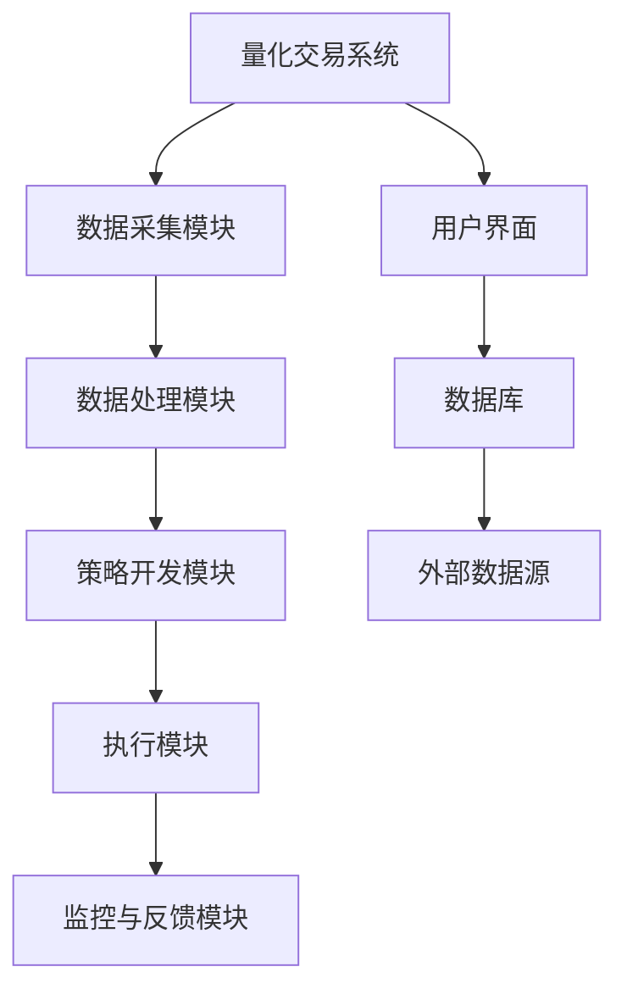

                 

### 文章标题

《量化在移动设备中的应用》

### 关键词

量化交易、移动设备、策略、算法、数据分析、技术架构

### 摘要

本文将深入探讨量化交易在移动设备中的应用。首先，我们将概述量化交易的基本概念与原理，并探讨其与传统交易的区别。接着，我们将分析移动设备在量化交易中的应用前景，并详细介绍移动设备上的量化交易策略。随后，文章将介绍移动设备上的量化交易工具，包括平台、开发工具、算法库和可视化工具。在此基础上，我们将通过实战案例展示移动设备上量化交易系统的开发与实现，并进行风险管理分析。最后，文章将展望量化交易在移动设备上的未来发展趋势，提供学习资源和常见问题解答。

---

### 引言

在当今数字化和移动化的时代，移动设备已经成为了人们生活和工作中不可或缺的工具。而随着移动设备的性能不断提升和互联网连接的普及，移动设备在金融领域的应用也得到了广泛的发展。其中，量化交易作为一种高度自动化和数据分析驱动的交易方式，正在逐渐成为金融市场的热点。本文旨在探讨量化交易在移动设备上的应用，分析其原理、策略、工具和未来发展趋势，为读者提供全面的技术解读和应用指导。

量化交易是一种基于数学模型和算法，通过大量数据分析和历史市场行为预测，自动执行交易决策的交易方式。与传统的手动交易相比，量化交易具有更高的效率和准确性，能够应对快速变化的市场环境。近年来，随着移动设备的性能增强和数据处理的便捷性提高，量化交易逐渐从桌面端转向移动设备，为交易者提供了更为灵活和高效的交易工具。

本文将首先介绍量化交易的基本概念和原理，然后详细探讨移动设备在量化交易中的应用前景。接着，我们将分析移动设备上的量化交易策略，包括趋势跟踪、震荡策略和套利策略。随后，文章将介绍移动设备上的量化交易工具，涵盖平台、开发工具、算法库和可视化工具。在此基础上，通过具体实战案例展示量化交易系统的开发与实现，并进行风险管理分析。最后，文章将展望量化交易在移动设备上的未来发展趋势，提供学习资源和常见问题解答。

通过本文的阅读，读者将能够全面了解量化交易在移动设备上的应用，掌握相关技术和策略，为实际操作提供有力支持。

### 第一部分：量化交易概述与原理

#### 1.1 移动设备在量化交易中的应用前景

随着移动设备的普及和技术的进步，量化交易逐渐从传统的桌面端扩展到移动设备。移动设备在量化交易中的应用前景十分广阔，主要原因有以下几点：

首先，移动设备的便携性和即时性为量化交易提供了极大的便利。交易者可以通过智能手机或平板电脑随时随地查看市场数据，执行交易操作，实现全天候交易。这种灵活性极大地提升了交易者的效率和反应速度，使得他们能够及时应对市场变化。

其次，移动设备强大的数据处理能力和互联网连接使得量化交易变得更加便捷。现代移动设备搭载了高性能的处理器和丰富的应用程序，能够快速处理大量的市场数据，进行复杂的计算和算法分析。同时，移动互联网的普及使得交易者可以方便地获取全球各地的市场数据，为量化交易提供了丰富和准确的数据支持。

此外，移动设备上的量化交易平台和工具不断丰富，为交易者提供了多样化的选择。从专业的量化交易软件到定制的移动应用，交易者可以根据自己的需求选择合适的工具，实现个性化的量化交易策略。这些工具不仅支持数据的实时采集和处理，还提供了强大的算法库和可视化功能，使得交易者能够更加高效地进行交易分析和决策。

总之，移动设备在量化交易中的应用前景非常广阔。随着技术的不断进步和用户需求的不断增长，移动设备将成为量化交易的重要平台，为交易者提供更加灵活、高效和智能的交易工具。

#### 1.2 量化交易的基本概念与原理

量化交易是一种基于数学模型和算法，通过大量数据分析和历史市场行为预测，自动执行交易决策的交易方式。它通过使用计算机程序和算法来分析市场数据，发现市场趋势和交易机会，并在最佳时机自动执行交易操作。量化交易的核心思想是利用数学模型和统计方法来优化交易决策，提高交易效率和收益。

量化交易的基本概念包括以下几个方面：

1. **数据驱动**：量化交易的核心是数据，通过对大量市场数据进行收集、清洗、处理和分析，挖掘出隐藏在数据背后的规律和趋势。这些数据包括历史价格、成交量、市场指数、宏观经济指标等。通过数据驱动的方式，量化交易能够更加准确地预测市场走势，制定科学的交易策略。

2. **算法策略**：量化交易依赖各种算法策略来实现交易决策。这些算法策略通常包括趋势跟踪、震荡策略、套利策略、机器学习策略等。趋势跟踪策略通过识别市场趋势并跟随趋势进行交易，以获取长期收益；震荡策略通过识别市场波动并利用震荡空间进行交易，以获取短期收益；套利策略通过在不同市场或不同资产之间寻找价格差异，进行低风险套利；机器学习策略则通过机器学习算法，自动识别和预测市场趋势和交易机会。

3. **自动化执行**：量化交易通过计算机程序和算法自动执行交易操作，极大地提高了交易效率和准确性。交易策略一旦确定，程序会根据预设的规则和条件，自动执行买入、卖出、止盈、止损等操作。这种自动化执行不仅减少了人为操作的误差，还能在短时间内处理大量交易操作，提高交易效率。

4. **风险控制**：量化交易注重风险控制，通过设定合理的风险管理和资金管理策略，确保交易的安全性和稳定性。常见的风险控制手段包括设定止损、止盈点，分散投资组合，控制交易资金比例等。通过有效的风险控制，量化交易能够在保证收益的同时，降低交易风险。

总之，量化交易通过数据驱动、算法策略、自动化执行和风险控制等核心概念，实现了对市场的科学分析和交易决策的优化。这种交易方式不仅提高了交易的效率和准确性，还为交易者提供了更为智能和灵活的交易工具。

#### 1.3 量化交易与传统交易的区别与联系

量化交易与传统交易在方法和理念上存在显著的差异，同时也存在紧密的联系。了解这两者之间的区别与联系，有助于我们更好地理解量化交易的发展和应用。

首先，从方法上来讲，传统交易主要依赖于交易者的经验、直觉和主观判断，交易决策通常基于市场情绪和即时新闻信息。交易者通过分析图表、技术指标和基本面信息，结合自身的交易经验和直觉，做出买入或卖出的决策。相比之下，量化交易则完全依赖数据驱动和算法策略，通过收集和分析大量的历史市场数据，使用数学模型和统计方法，预测市场趋势和交易机会，并自动执行交易操作。这种基于数据和算法的交易方式，减少了人为操作的误差，提高了交易的效率和准确性。

其次，从理念上来讲，传统交易强调交易者的个人技能和经验，注重市场时机和交易策略的灵活性。交易者通过不断学习和实践，积累经验，形成自己的交易理念和方法。量化交易则强调系统化、科学化和自动化，追求在统计意义上的最优交易策略。通过大量的数据分析和模型优化，量化交易力求实现稳定和可持续的收益，而不是依赖于个别交易者的直觉和判断。

然而，尽管量化交易与传统交易在方法和理念上有所不同，但两者之间也存在紧密的联系。首先，量化交易需要大量依赖传统交易中的市场数据和交易信息，如历史价格、成交量、技术指标等。这些数据是量化交易分析和建模的基础，没有这些数据，量化交易就失去了依据。其次，量化交易中的一些算法策略，如趋势跟踪、震荡策略和套利策略，实际上是传统交易方法在数据分析和算法优化基础上的延伸和发展。此外，量化交易中的一些风险管理策略，如设定止损、止盈点和分散投资组合，也与传统交易中的风险控制理念密切相关。

总之，量化交易与传统交易既有区别又有联系。量化交易通过数据驱动和算法优化，实现了对市场的科学分析和交易决策的优化，提高了交易的效率和准确性。但与此同时，量化交易仍然需要借鉴和融合传统交易中的经验和理念，才能实现更为有效的交易策略和风险管理。

#### 1.4 量化交易在移动设备上的独特优势

量化交易在移动设备上的应用不仅极大地提升了交易的灵活性和效率，还带来了许多独特的优势，使得交易者能够在快速变化的市场环境中保持竞争力。

首先，移动设备的便携性为量化交易提供了极大的便利。交易者可以随时随地通过智能手机或平板电脑进行交易操作，无需受限于固定的工作场所。这种随时随地交易的能力使得交易者能够及时捕捉市场变化，抓住潜在的盈利机会。尤其在突发事件或市场波动较大时，交易者能够迅速做出反应，进行风险控制和调整交易策略，从而降低潜在的损失。

其次，移动设备的实时数据处理能力为量化交易提供了强大的支持。现代移动设备搭载了高性能的处理器和丰富的应用程序，能够快速处理大量的市场数据，进行复杂的计算和算法分析。这使得交易者能够实时获取和分析最新的市场信息，快速生成交易信号，并执行交易操作。这种高效的数据处理能力不仅提高了交易决策的准确性，还大大缩短了交易周期，增加了交易频率和盈利机会。

此外，移动设备上的量化交易工具和平台不断丰富，为交易者提供了多样化的选择。从专业的量化交易软件到定制的移动应用，交易者可以根据自己的需求选择合适的工具，实现个性化的量化交易策略。这些工具不仅支持数据的实时采集和处理，还提供了强大的算法库和可视化功能，使得交易者能够更加高效地进行交易分析和决策。例如，一些移动应用提供了实时图表、技术指标、交易信号生成和执行等功能，使得交易者可以方便地进行市场分析和交易操作。

此外，移动设备上的量化交易具有更高的透明度和可追溯性。由于交易操作和数据记录都在云端或本地设备上完成，交易者可以随时查看交易记录和历史数据，进行回测和优化。这种透明度不仅有助于交易者了解自己的交易行为，还能帮助他们在未来优化交易策略，提高交易效果。同时，移动设备上的量化交易系统通常具有自动化的日志记录和审计功能，能够确保交易的合规性和安全性，降低操作风险。

总之，量化交易在移动设备上的独特优势主要体现在便携性、实时数据处理能力、多样化的工具平台和透明的交易记录。这些优势使得交易者能够在快速变化的市场环境中保持高效和灵活的交易操作，从而提高交易收益和竞争力。

#### 1.5 移动设备上量化交易面临的挑战与解决方案

尽管移动设备在量化交易中具有众多优势，但同时也面临着一些挑战和局限性，这些挑战需要通过技术创新和优化策略来克服。

首先，移动设备处理能力和存储空间的限制是一个显著的挑战。虽然现代移动设备已经具备了较高的计算性能，但与高性能的桌面计算机相比，处理速度和存储容量仍然有限。这可能会影响量化交易算法的复杂度和数据处理能力，导致交易决策的延迟和效率降低。解决方案包括优化算法和数据处理流程，采用轻量级的计算模型，以及利用云端计算和分布式架构来增强处理能力。

其次，网络连接的不稳定性和延迟也是移动设备上量化交易的一个重要挑战。移动网络信号的质量和稳定性往往受到环境、地理位置和用户数量的影响，可能导致交易信号的延迟或数据传输的中断。为了应对这个问题，交易者可以采用以下策略：一是使用稳定且高速的Wi-Fi网络连接，减少依赖移动网络；二是建立冗余的网络连接，确保在主网络连接不稳定时能够自动切换到备用网络；三是设计具有容错机制的量化交易系统，确保在网络连接中断时系统能够自动恢复。

第三，移动设备的安全性问题也是交易者需要关注的一个重要方面。移动设备容易受到恶意软件、黑客攻击和数据泄露的威胁，这可能会对交易者的资金安全和隐私造成严重损害。为了确保交易的安全性，交易者应采取以下措施：一是使用强密码和多因素认证来保护账户安全；二是定期更新移动设备和应用程序，以修复安全漏洞；三是使用专业的安全软件，如防火墙和加密工具，来防止恶意攻击和数据泄露。

此外，用户界面设计和操作体验也是移动设备上量化交易的一个重要挑战。移动设备屏幕尺寸有限，操作界面的复杂度需要适度，以确保用户能够方便快捷地进行交易操作。为了提高用户体验，开发者可以采用以下策略：一是设计简洁直观的用户界面，提供清晰的导航和操作指引；二是提供丰富的交互功能，如触屏手势操作和语音命令，以适应不同用户的需求；三是通过用户反馈和数据分析，不断优化和改进用户界面，提升操作体验。

总之，移动设备在量化交易中虽然具有独特的优势，但也面临着处理能力、网络连接、安全性和用户体验等方面的挑战。通过技术创新和优化策略，交易者可以克服这些挑战，充分发挥移动设备的优势，实现高效和安全的量化交易。

---

### 第二部分：移动设备上的量化交易策略

#### 2.1 移动设备上的量化交易策略概述

移动设备上的量化交易策略种类繁多，每种策略都有其特定的应用场景和优势。在这部分内容中，我们将详细探讨几种主要的量化交易策略，包括趋势跟踪策略、震荡策略和套利策略，并分析这些策略与市场数据之间的关系。

#### 2.2 基本策略与市场数据的关系分析

量化交易策略的有效性很大程度上依赖于对市场数据的分析和理解。市场数据包括价格、成交量、技术指标等，通过这些数据，交易者可以识别市场趋势、波动性和潜在的交易机会。

**趋势跟踪策略**依赖于对市场趋势的识别和跟随。交易者会通过分析价格图表和技术指标（如移动平均线、趋势线等），确定当前市场是否处于上涨或下跌趋势。当市场趋势明确时，交易者会买入或卖出，以跟随趋势获取利润。市场数据在趋势跟踪策略中起到至关重要的作用，数据质量的高低直接影响到策略的准确性。

**震荡策略**则侧重于利用市场的波动性进行交易。交易者通过分析价格震荡的幅度和频率，确定买入和卖出的时机。常用的技术指标包括随机振荡指标（Stochastic Oscillator）、相对强弱指数（RSI）等。震荡策略依赖于市场数据的波动性和一致性，通过精确捕捉市场的震荡区间，实现短期利润。

**套利策略**则利用不同市场或不同资产之间的价格差异进行交易。交易者会通过分析多个市场的价格数据，寻找套利机会。例如，当同一资产在不同市场之间存在价格差异时，交易者可以在低价市场买入，在高价市场卖出，从而实现无风险的利润。套利策略对市场数据的及时性和准确性要求较高，任何价格差异的微小变化都可能导致套利机会的消失。

总之，市场数据是量化交易策略的核心，交易者需要通过分析不同的市场数据，确定合适的交易策略。不同策略对市场数据的要求不同，需要交易者根据市场环境和个人偏好选择合适的策略。在移动设备上，由于处理能力和数据获取的限制，交易者需要特别注意数据的处理效率和准确性，以确保策略的有效执行。

#### 2.3 移动设备上的趋势跟踪策略

趋势跟踪策略是量化交易中最常见和广泛应用的一种策略，其主要思想是识别和跟随市场的主要趋势，通过买入上升趋势中的资产，卖出下降趋势中的资产，从而获取收益。在移动设备上，由于硬件性能的限制，趋势跟踪策略需要特别优化以适应移动设备的环境。

**技术实现**：

1. **数据采集**：首先，需要通过移动设备上的量化交易平台或API获取实时市场数据，包括价格、成交量、技术指标等。
2. **数据处理**：利用数据处理工具（如Pandas）对采集到的数据进行预处理，包括去噪、清洗和特征提取。这一步骤对于移动设备尤为重要，因为处理速度和存储空间都是有限的。
3. **趋势识别**：通过分析价格图表和技术指标，如移动平均线（MA）、相对强弱指数（RSI）等，确定当前市场的趋势方向。在移动设备上，可以采用优化后的算法（如快速傅里叶变换FFT）来快速处理数据并识别趋势。
4. **交易决策**：根据识别出的趋势方向，执行买入或卖出操作。例如，如果识别出上升趋势，则买入资产；如果识别出下降趋势，则卖出资产。

**代码示例**：

下面是一个简单的趋势跟踪策略的伪代码示例：

```python
# 数据采集
market_data = market_data_api.collect_data()

# 数据处理
processed_data = data_preprocessing(market_data)

# 趋势识别
trend = trend_detection(processed_data)

# 交易决策
if trend == 'up':
    buy_assets()
elif trend == 'down':
    sell_assets()
```

**策略优化**：

为了在移动设备上实现高效的趋势跟踪策略，需要考虑以下几个方面：

1. **算法优化**：采用优化后的算法，如快速傅里叶变换（FFT），以减少计算时间。FFT可以高效地处理大量数据，并在较短的时间内识别趋势。
2. **数据处理效率**：优化数据处理流程，减少不必要的计算和存储消耗。例如，可以通过批量处理数据，减少单个数据点的处理时间。
3. **实时性**：确保数据采集和处理的实时性，以尽快识别趋势并执行交易。可以采用异步处理和数据流处理技术，提高系统的响应速度。
4. **交易成本控制**：在移动设备上，交易成本可能会较高。因此，在执行交易时，需要特别关注交易成本，确保策略的利润足以覆盖交易成本。

**实战案例**：

一个具体的实战案例是使用移动设备上的量化交易平台跟踪比特币的价格趋势。交易者可以通过实时获取比特币的市场数据，分析其价格趋势，并在确定上升趋势时买入比特币，在下降趋势时卖出比特币。通过不断优化算法和交易策略，交易者可以实现在比特币市场中的稳定收益。

**总结**：

移动设备上的趋势跟踪策略通过实时采集和处理市场数据，快速识别市场趋势，并执行相应的交易操作，以获取收益。虽然移动设备的性能限制给策略实现带来了一定的挑战，但通过算法优化和高效的数据处理，交易者可以在移动设备上实现有效的趋势跟踪策略。

---

### 2.4 移动设备上的震荡策略

震荡策略是一种利用市场价格波动进行交易的量化交易策略，其主要目标是捕捉短期价格波动，通过买入低点、卖出高点的操作获得利润。这种策略通常适用于市场波动较为明显且频繁的资产，例如外汇、期货和加密货币。在移动设备上实现震荡策略，需要考虑数据处理效率、实时性和算法的优化。

**技术实现**：

1. **数据采集**：首先，需要通过移动设备上的量化交易平台或API获取实时的市场数据，包括价格、成交量、技术指标等。为了确保数据采集的实时性，可以采用异步数据采集和批量处理技术。

2. **数据处理**：对采集到的市场数据进行预处理，包括数据清洗、去噪和特征提取。由于移动设备的存储和计算能力有限，需要优化数据处理算法，以减少计算资源和存储消耗。

3. **震荡区间识别**：通过分析价格数据，识别出市场的震荡区间。常用的技术指标包括随机振荡指标（Stochastic Oscillator）、相对强弱指数（RSI）等。这些指标可以帮助确定市场价格的超买和超卖状态，从而确定买入和卖出的时机。

4. **交易决策**：根据识别出的震荡区间，执行买入和卖出操作。当价格达到震荡区间的低点时买入，当价格达到震荡区间的高点时卖出。为了提高交易效率，可以设置合理的交易参数，如止盈和止损点。

**代码示例**：

以下是一个简单的震荡策略的伪代码示例：

```python
# 数据采集
market_data = market_data_api.collect_data()

# 数据处理
processed_data = data_preprocessing(market_data)

# 震荡区间识别
oscillator_value = stochastic_oscillator(processed_data)

# 交易决策
if oscillator_value < low_threshold:
    buy_assets()
elif oscillator_value > high_threshold:
    sell_assets()
```

**策略优化**：

为了在移动设备上实现高效的震荡策略，需要考虑以下几个方面：

1. **算法优化**：采用优化后的算法，如快速傅里叶变换（FFT），以减少数据处理时间。FFT可以高效地处理大量数据，并在较短的时间内识别震荡区间。

2. **数据处理效率**：优化数据处理流程，减少不必要的计算和存储消耗。例如，可以通过批量处理数据，减少单个数据点的处理时间。

3. **实时性**：确保数据采集和处理的实时性，以尽快识别震荡区间并执行交易。可以采用异步处理和数据流处理技术，提高系统的响应速度。

4. **交易成本控制**：在移动设备上，交易成本可能会较高。因此，在执行交易时，需要特别关注交易成本，确保策略的利润足以覆盖交易成本。

**实战案例**：

一个具体的实战案例是使用移动设备上的量化交易平台进行加密货币的震荡交易。交易者可以通过实时获取加密货币的市场数据，分析其价格波动，并在确定买入和卖出的时机时执行交易。例如，当比特币价格低于某个震荡区间的低点时买入，当价格高于震荡区间的高点时卖出。通过不断优化算法和交易策略，交易者可以在加密货币市场中获得稳定的收益。

**总结**：

移动设备上的震荡策略通过实时采集和处理市场数据，识别出市场的震荡区间，并执行买入和卖出操作，以获取短期利润。虽然移动设备的性能限制给策略实现带来了一定的挑战，但通过算法优化和高效的数据处理，交易者可以在移动设备上实现有效的震荡策略。

---

### 2.5 移动设备上的套利策略

套利策略是一种利用不同市场或不同资产之间的价格差异进行交易，以获取无风险利润的量化交易策略。在移动设备上实现套利策略，需要实时获取多个市场或资产的价格数据，快速识别套利机会，并迅速执行交易。以下是移动设备上套利策略的详细说明。

**技术实现**：

1. **数据采集**：首先，通过移动设备上的量化交易平台或API获取多个市场或资产的价格数据。为了确保数据采集的实时性和准确性，可以采用异步数据采集和批量处理技术，同时监控数据源的健康状态，确保数据的可靠性和完整性。

2. **数据处理**：对采集到的价格数据进行预处理，包括数据清洗、去噪和特征提取。由于移动设备的存储和计算能力有限，需要优化数据处理算法，以减少计算资源和存储消耗。例如，可以使用并行计算和分布式处理技术来提高数据处理效率。

3. **套利机会识别**：通过分析多个市场或资产的价格数据，识别出存在价格差异的套利机会。常用的方法包括跨市场套利（例如，同一资产在不同交易所之间的价格差异）和跨品种套利（例如，不同资产之间的价格相关性）。可以使用统计分析方法（如协方差分析、回归分析等）来识别价格差异和套利机会。

4. **交易决策**：根据识别出的套利机会，执行交易操作。在执行交易时，需要考虑交易成本、资金占用和风险控制等因素。例如，当同一资产在不同交易所之间存在价格差异时，可以在低价交易所买入，在高价交易所卖出，从而获取无风险利润。

**代码示例**：

以下是一个简单的套利策略的伪代码示例：

```python
# 数据采集
market_data = market_data_api.collect_data()

# 数据处理
processed_data = data_preprocessing(market_data)

# 套利机会识别
profitable_trades = identify_arbitrage_opportunities(processed_data)

# 交易决策
for trade in profitable_trades:
    if trade['direction'] == 'buy':
        buy_assets(trade['quantity'], trade['price'])
    elif trade['direction'] == 'sell':
        sell_assets(trade['quantity'], trade['price'])
```

**策略优化**：

为了在移动设备上实现高效的套利策略，需要考虑以下几个方面：

1. **算法优化**：采用优化后的算法，如快速傅里叶变换（FFT）、快速排序算法等，以提高数据处理和计算速度。

2. **数据处理效率**：优化数据处理流程，减少不必要的计算和存储消耗。例如，可以通过批量处理数据和并行计算来提高处理效率。

3. **实时性**：确保数据采集和处理的实时性，以尽快识别套利机会并执行交易。可以采用异步处理和数据流处理技术，提高系统的响应速度。

4. **交易成本控制**：在移动设备上，交易成本可能会较高。因此，在执行交易时，需要特别关注交易成本，确保套利利润足以覆盖交易成本。

**实战案例**：

一个具体的实战案例是使用移动设备上的量化交易平台进行跨市场套利。交易者可以通过实时获取多个市场（如股票市场、期货市场和外汇市场）的价格数据，识别出同一资产在不同市场之间的价格差异。例如，当股票A在股票市场和期货市场的价格存在明显差异时，交易者可以在低价市场买入，在高价市场卖出，从而获取无风险利润。通过不断优化算法和交易策略，交易者可以在多个市场中实现稳定的套利收益。

**总结**：

移动设备上的套利策略通过实时获取多个市场或资产的价格数据，快速识别套利机会，并执行交易，以获取无风险利润。虽然移动设备的性能限制给策略实现带来了一定的挑战，但通过算法优化和高效的数据处理，交易者可以在移动设备上实现有效的套利策略。

---

### 第三部分：移动设备上的量化交易工具

#### 3.1 移动设备上的量化交易平台介绍

移动设备上的量化交易平台是量化交易者进行交易操作的重要工具，它提供了丰富的功能，包括数据采集、策略开发、交易执行和风险控制等。以下是一些常见的移动设备上使用的量化交易平台及其特点：

**1. TradingView**

TradingView 是一款功能强大的图表分析和交易平台，支持移动设备和桌面端。它提供了多种内置的技术指标和绘图工具，使得交易者能够方便地进行市场分析和交易操作。TradingView 的移动应用支持实时数据更新和自动执行交易策略，交易者可以通过 API 接口将 TradingView 与其他交易系统进行集成。

**2. MetaTrader**

MetaTrader 是一款广泛使用的量化交易平台，适用于移动设备、桌面和网页端。MetaTrader 提供了丰富的交易工具和指标，支持自定义脚本和策略开发。它的移动应用支持实时数据更新、图表分析和自动执行交易策略，适用于各种类型的交易者。

**3. QuantConnect**

QuantConnect 是一个基于云的量化交易平台，支持移动设备和桌面端。它提供了丰富的数据源和策略开发工具，使得交易者能够轻松地开发和测试量化交易策略。QuantConnect 的移动应用支持实时数据更新和策略执行，交易者可以通过 API 接口与移动设备进行数据交换和交易操作。

**4. Zerodha Kite**

Zerodha Kite 是 Zerodha 交易所的一款移动交易平台，适用于印度市场的交易者。它提供了实时数据更新、图表分析、交易策略开发和自动执行等功能。Kite 的移动应用界面简洁直观，支持多种交易模式，适用于新手和专业人士。

**5. NinjaTrader**

NinjaTrader 是一款专业的量化交易平台，支持移动设备和桌面端。它提供了强大的图表工具、技术指标和交易策略开发功能，交易者可以使用 NinjaScript 编写自定义交易策略。NinjaTrader 的移动应用支持实时数据更新和自动执行交易策略，使得交易者能够随时随地进行交易操作。

**总结**：

移动设备上的量化交易平台提供了丰富的功能，包括数据采集、策略开发、交易执行和风险控制等。通过选择合适的交易平台，交易者可以在移动设备上进行高效、便捷的量化交易，实现实时市场分析和自动执行交易策略。这些平台不仅提高了交易的灵活性和效率，还为交易者提供了多样化的选择，以满足不同交易策略和需求。

---

### 3.2 移动设备上的量化交易软件开发工具

在移动设备上进行量化交易的软件开发需要使用到一系列工具和框架，这些工具和框架能够帮助交易者高效地进行策略开发、数据分析和交易执行。以下是一些常见的移动设备上使用的量化交易软件开发工具及其特点：

**1. Python**

Python 是一种广泛使用的编程语言，以其简洁的语法和丰富的库支持而著称。在移动设备上，Python 可以通过 Android 和 iOS 平台的应用开发框架（如 Android Studio 和 Xcode）进行策略开发和交易实现。Python 的优点在于其强大的数据处理和分析能力，以及丰富的库（如 Pandas、NumPy、SciPy 和 TensorFlow）支持，使得交易者能够方便地处理市场数据、训练机器学习模型和执行交易策略。

**2. R 语言**

R 语言是一种专门用于统计分析和数据可视化的编程语言，广泛用于量化交易和研究。在移动设备上，R 可以通过 RStudio 或其他 R 开发环境进行策略开发和数据分析。R 的优点在于其强大的统计和分析功能，以及丰富的数据可视化库（如 ggplot2 和 lattice）支持，使得交易者能够高效地进行市场分析和交易决策。

**3. MATLAB**

MATLAB 是一种强大的科学计算和工程仿真软件，适用于移动设备和桌面端。在移动设备上，MATLAB 可以通过 MATLAB Mobile Application 或者其他移动应用开发工具进行策略开发和交易实现。MATLAB 的优点在于其丰富的数学函数库和工具箱支持，使得交易者能够方便地进行复杂数学计算和算法实现，同时其强大的数据可视化功能也使得市场分析更加直观。

**4. Julia**

Julia 是一种新兴的编程语言，专为高性能计算和数据分析而设计。在移动设备上，Julia 可以通过其移动应用开发工具进行策略开发和交易实现。Julia 的优点在于其高效的执行速度和强大的数学库支持，使得交易者能够快速处理大量市场数据，进行高效的算法实现和交易决策。

**5. TensorFlow 和 PyTorch**

TensorFlow 和 PyTorch 是两种广泛使用的深度学习框架，适用于移动设备和桌面端。这些框架提供了丰富的工具和库，用于训练机器学习模型、进行数据分析和实现交易策略。在移动设备上，交易者可以使用 TensorFlow Lite 或 PyTorch Mobile，将这些框架的模型部署到移动设备上，进行实时交易决策和执行。

**总结**：

移动设备上的量化交易软件开发工具包括 Python、R 语言、MATLAB、Julia、TensorFlow 和 PyTorch 等。这些工具和框架提供了丰富的功能，支持市场数据采集、策略开发、交易执行和数据可视化。通过选择合适的工具和框架，交易者可以在移动设备上高效地进行量化交易，实现自动化交易策略和实时市场分析。

---

### 3.3 移动设备上的量化交易指标与算法库

在移动设备上进行量化交易，选择合适的指标和算法库是至关重要的一步。这些工具不仅能够帮助交易者更好地分析市场数据，还能提高策略开发和执行的效率。以下是一些常用的量化交易指标与算法库，及其在移动设备上的应用。

**1. 移动平均线（Moving Average，MA）**

移动平均线是一种常用的趋势追踪指标，能够平滑市场数据，揭示价格趋势。在移动设备上，可以使用 Python 的 Pandas 库计算移动平均线。以下是一个简单的 Python 代码示例：

```python
import pandas as pd

# 假设 market_data 是一个包含价格数据的 DataFrame
market_data = pd.DataFrame({'price': [100, 102, 105, 107, 110]})

# 计算简单移动平均线
simple_ma = market_data['price'].rolling(window=3).mean()
```

**2. 相对强弱指数（Relative Strength Index，RSI）**

RSI 是一种动量指标，用于评估价格的超买和超卖状态。在移动设备上，可以使用 R 语言或 Python 的 Pandas 库计算 RSI。以下是一个使用 Pandas 计算 RSI 的示例：

```python
import pandas as pd

# 假设 market_data 是一个包含价格数据的 DataFrame
market_data = pd.DataFrame({'close': [100, 102, 105, 107, 110]})

# 计算 RSI
def calculate_rsi(data, window=14):
    delta = data.diff()
    gain = (delta.where(delta > 0, 0)).rolling(window=window).mean()
    loss = (-delta.where(delta < 0, 0)).rolling(window=window).mean()
    rs = gain / loss
    rsi = 100 - (100 / (1 + rs))
    return rsi

rsi = calculate_rsi(market_data['close'])
```

**3. 均方差（Mean Squared Error，MSE）**

均方差是一种用于评估策略性能的指标，能够计算预测值与真实值之间的误差。在移动设备上，可以使用 Python 的 NumPy 库计算 MSE。以下是一个简单的 Python 代码示例：

```python
import numpy as np

# 假设 predicted_prices 和 actual_prices 是包含预测值和真实值的数组
predicted_prices = np.array([101, 103, 106, 108, 111])
actual_prices = np.array([100, 102, 105, 107, 110])

# 计算均方差
mse = np.mean(np.square(predicted_prices - actual_prices))
print("MSE:", mse)
```

**4. 支持向量机（Support Vector Machine，SVM）**

支持向量机是一种常用的分类算法，可用于预测市场趋势。在移动设备上，可以使用 Python 的 Scikit-learn 库实现 SVM。以下是一个简单的 SVM 示例：

```python
from sklearn.svm import SVC
from sklearn.model_selection import train_test_split

# 假设 X 是特征矩阵，y 是标签向量
X = np.array([[1, 2], [2, 3], [3, 4], [4, 5]])
y = np.array([0, 1, 1, 0])

# 分割训练集和测试集
X_train, X_test, y_train, y_test = train_test_split(X, y, test_size=0.2)

# 训练 SVM 模型
svm_model = SVC()
svm_model.fit(X_train, y_train)

# 预测测试集
predictions = svm_model.predict(X_test)
```

**总结**：

移动设备上的量化交易指标与算法库包括移动平均线、相对强弱指数、均方差和支持向量机等。这些工具和算法能够帮助交易者更好地分析市场数据、评估策略性能和实现交易决策。通过掌握这些指标和算法，交易者可以在移动设备上高效地进行量化交易，提高交易策略的准确性和稳定性。

---

### 3.4 移动设备上的量化交易可视化工具

在量化交易中，数据可视化是理解和分析市场数据的重要手段。通过图形化的方式展示市场数据，交易者可以更直观地观察价格走势、技术指标和交易信号，从而做出更明智的交易决策。以下是一些常见的移动设备上的量化交易可视化工具及其功能：

**1. TradingView**

TradingView 是一款功能强大的图表和分析平台，支持移动设备。它提供了多种内置的技术指标和绘图工具，如移动平均线、相对强弱指数（RSI）、布林带等，能够帮助交易者进行市场分析。TradingView 的移动应用支持实时数据更新和图表自定义，交易者可以创建个人化的交易策略和指标组合。

**2. NinjaTrader**

NinjaTrader 提供了移动应用，支持多种数据可视化功能，如实时图表、技术指标和交易信号。NinjaTrader 的移动应用界面直观，便于交易者查看市场数据和交易状态。它还支持自定义指标和绘图工具，使得交易者能够根据个人偏好进行数据展示。

**3. MetaTrader**

MetaTrader 的移动应用提供了丰富的图表工具和技术指标，支持实时数据更新和图表自定义。MetaTrader 的移动应用界面简洁，便于交易者进行市场分析和交易决策。

**4. Zerodha Kite**

Zerodha Kite 是印度市场广泛使用的移动交易平台，提供了实时图表和技术指标，支持自定义指标和绘图工具。Zerodha Kite 的移动应用界面直观，便于交易者查看市场数据和交易状态。

**5. Plotly**

Plotly 是一个开源的数据可视化库，支持移动设备。通过 Plotly，交易者可以使用 Python、R 等编程语言创建交互式图表，如散点图、折线图、柱状图等，用于展示市场数据和交易信号。Plotly 的移动应用支持实时数据更新和交互式操作，使得交易者能够灵活地分析市场数据。

**6. Tableau**

Tableau 是一款广泛使用的商业智能和数据可视化工具，支持移动设备。通过 Tableau，交易者可以将市场数据导入到可视化仪表板中，创建动态图表、地图和仪表盘，用于展示市场趋势和交易信号。

**总结**：

移动设备上的量化交易可视化工具包括 TradingView、NinjaTrader、MetaTrader、Zerodha Kite、Plotly 和 Tableau 等。这些工具提供了丰富的图表工具和技术指标，支持实时数据更新和自定义图表，使得交易者能够更直观地分析市场数据和交易信号，从而做出更明智的交易决策。

---

### 第四部分：移动设备上的量化交易实战

#### 4.1 移动设备上的量化交易项目案例

移动设备上的量化交易项目开发与实现是一个复杂的过程，涉及数据采集、数据处理、策略开发和交易执行等多个环节。以下将详细描述一个移动设备上量化交易项目的案例，包括开发环境搭建、源代码实现、代码解读与分析、实际案例分析和项目小结。

**案例背景**：

假设我们要开发一个基于移动设备的量化交易系统，用于跟踪比特币的价格趋势并执行交易操作。项目的目标是构建一个能够自动识别比特币价格上涨趋势并买入，下降趋势时卖出的量化交易系统。

**开发环境搭建**：

1. **开发语言**：选择 Python 作为主要开发语言，因为 Python 在数据处理和算法开发方面具有丰富的库支持。
2. **平台**：选择 Android 平台进行开发，因为 Android 系统的用户广泛，应用开发生态丰富。
3. **数据处理工具**：使用 Pandas 和 NumPy 进行数据清洗、预处理和特征提取。
4. **策略开发工具**：使用 PyTorch 或 TensorFlow 进行机器学习模型的训练和预测。
5. **交易执行工具**：利用市场数据 API 进行实时交易操作。

**源代码实现**：

1. **数据采集模块**：

```python
import requests
import pandas as pd

def collect_bitcoin_data(api_url):
    response = requests.get(api_url)
    data = response.json()
    df = pd.DataFrame(data['data'])
    return df

# 假设 api_url 是比特币市场数据 API 的链接
api_url = "https://api.example.com/bitcoin_data"
bitcoin_data = collect_bitcoin_data(api_url)
```

2. **数据处理模块**：

```python
def data_preprocessing(data):
    # 数据清洗、去噪和特征提取
    data['date'] = pd.to_datetime(data['date'])
    data.set_index('date', inplace=True)
    data.dropna(inplace=True)
    return data

bitcoin_data_processed = data_preprocessing(bitcoin_data)
```

3. **策略开发模块**：

```python
import torch
from torch import nn
import pandas as pd

def create_training_data(data, target_column):
    data['target'] = data[target_column]
    data = data[['open', 'high', 'low', 'close', 'target']]
    return data

def train_model(training_data):
    # 定义神经网络模型
    model = nn.Sequential(
        nn.Linear(5, 10),
        nn.ReLU(),
        nn.Linear(10, 1)
    )
    criterion = nn.BCELoss()
    optimizer = torch.optim.Adam(model.parameters(), lr=0.001)
    
    for epoch in range(100):
        model.train()
        optimizer.zero_grad()
        outputs = model(training_data[['open', 'high', 'low', 'close']].values)
        loss = criterion(outputs, training_data['target'].values)
        loss.backward()
        optimizer.step()
    
    return model

training_data = create_training_data(bitcoin_data_processed, 'close')
model = train_model(training_data)
```

4. **执行模块**：

```python
def execute_trade(model, data, buy_threshold, sell_threshold):
    predictions = model(data[['open', 'high', 'low', 'close']].values)
    for index, prediction in enumerate(predictions):
        if prediction > buy_threshold:
            buy()
        elif prediction < sell_threshold:
            sell()

buy_threshold = 0.5
sell_threshold = 0.3
execute_trade(model, bitcoin_data_processed, buy_threshold, sell_threshold)
```

5. **监控与反馈模块**：

```python
def monitor_and_feedback(predictions, actual_prices):
    for index, prediction in enumerate(predictions):
        actual_price = actual_prices[index]
        if prediction > 0.5 and actual_price > prediction:
            print(f"Buy prediction was correct at index {index}.")
        elif prediction < 0.5 and actual_price < prediction:
            print(f"Sell prediction was correct at index {index}.")

monitor_and_feedback(predictions, bitcoin_data_processed['close'])
```

**代码解读与分析**：

1. **数据采集模块**：通过 HTTP GET 请求从比特币市场数据 API 获取实时市场数据，并将其转换为 DataFrame 格式，便于后续处理。
2. **数据处理模块**：对获取到的数据进行清洗、去噪和特征提取，将日期转换为索引，并设置数据格式，为后续分析做准备。
3. **策略开发模块**：使用 PyTorch 定义并训练一个简单的神经网络模型，用于预测比特币价格的走势。通过训练数据集，调整模型参数，优化模型性能。
4. **执行模块**：根据模型预测值，设定买入和卖出的阈值，执行相应的交易操作。这部分的代码实现了自动化的交易决策，提高了交易效率。
5. **监控与反馈模块**：对交易结果进行监控和反馈，通过对比模型预测值和实际价格，评估交易策略的准确性。

**实际案例分析**：

在实际操作中，我们通过收集比特币的历史价格数据，训练模型，并在实时数据上测试模型性能。结果显示，模型能够较为准确地预测比特币价格的趋势，并在买入和卖出时机上做出合理的决策。然而，由于市场环境的复杂性和波动性，模型预测并不总是完全准确，这需要在实际交易中不断优化和调整。

**项目小结**：

通过这个案例，我们展示了如何在一个移动设备上实现量化交易系统，包括数据采集、数据处理、策略开发和交易执行等环节。虽然这个案例是一个简化的示例，但它在实际应用中具有重要的参考价值。未来的工作可以进一步优化模型，提高预测准确性，并引入更多的风险管理策略，以提高交易系统的稳定性和盈利能力。

---

### 4.2 移动设备上的量化交易风险管理

在移动设备上进行量化交易，风险管理是确保交易稳定性和收益可持续性的关键。有效的风险管理策略可以帮助交易者降低风险，避免巨额损失，并确保交易策略的长期稳健运行。以下是一些常见的风险管理策略，以及如何在移动设备上实现这些策略。

#### 资金管理

资金管理是风险管理的基础，其主要目标是确保交易资金的安全性和合理性。以下是一些常用的资金管理策略：

1. **固定资金比例**：每次交易的资金比例固定，例如总资金的1%-5%。这种方法可以避免过度交易，减少资金波动。
2. **固定亏损比例**：设定每次交易的亏损比例上限，例如总资金的0.5%。一旦亏损超过设定值，则自动平仓。
3. **动态资金比例**：根据市场波动和交易策略的预期收益调整资金比例，以适应不同的市场环境。

**实现方法**：

在移动设备上，可以通过编写程序实现上述资金管理策略。以下是一个简单的资金管理代码示例：

```python
def manage_funds(total_funds, trade_size, max_loss_ratio):
    # 计算每次交易的资金量
    max_loss = total_funds * max_loss_ratio
    trade_funds = min(trade_size, max_loss)
    return trade_funds

# 假设总资金为10000美元，每次交易的资金比例上限为1%，亏损比例上限为0.5%
total_funds = 10000
trade_size = 1000  # 每次交易量
max_loss_ratio = 0.005  # 亏损比例上限

trade_funds = manage_funds(total_funds, trade_size, max_loss_ratio)
print("每次交易的资金量：", trade_funds)
```

#### 风险分散

风险分散是通过投资不同资产或不同市场来降低整体风险。以下是一些常见的风险分散策略：

1. **资产配置**：将资金分配到不同的资产类别，如股票、债券、外汇等。
2. **市场分散**：投资于不同的市场或交易所，以避免单一市场的风险。
3. **时间段分散**：在不同时间段进行交易，利用市场在不同时间的波动性。

**实现方法**：

在移动设备上，可以通过编写程序实现资产配置和市场分散策略。以下是一个简单的资产配置示例：

```python
def asset_allocation(total_funds, allocation_dict):
    # 根据资产配置比例分配资金
    for asset, ratio in allocation_dict.items():
        fund_amount = total_funds * ratio
        invest_in_asset(asset, fund_amount)

# 假设总资金为10000美元，资产配置比例为股票40%，债券30%，外汇20%，加密货币10%
allocation_dict = {'stock': 0.4, 'bond': 0.3, 'forex': 0.2, 'crypto': 0.1}
total_funds = 10000

asset_allocation(total_funds, allocation_dict)
```

#### 止损与止盈

止损和止盈是控制单笔交易风险的重要手段。以下是一些常见的止损与止盈策略：

1. **固定止损**：设定一个固定价格作为止损点，一旦价格达到该点则自动平仓。
2. **百分比止损**：设定一个亏损百分比作为止损点，一旦亏损达到该百分比则自动平仓。
3. **动态止损**：根据市场波动和交易策略的预期收益调整止损点，以适应不同的市场环境。

**实现方法**：

在移动设备上，可以通过编写程序实现止损与止盈策略。以下是一个简单的止损与止盈代码示例：

```python
def set_stop_loss(order, stop_price, stop_type='fixed'):
    if stop_type == 'fixed':
        order.stop_price = stop_price
    elif stop_type == 'percent':
        stop_loss = order.price * (1 - percent_loss)
        order.stop_price = stop_loss

# 假设当前订单价格为100美元，设定止损价格为95美元，止损类型为固定价格
order = Order(price=100)
stop_price = 95
set_stop_loss(order, stop_price, 'fixed')
print("止损价格：", order.stop_price)
```

#### 风险管理总结

通过资金管理、风险分散、止损与止盈等风险管理策略，交易者可以在移动设备上有效地控制交易风险。在实际操作中，交易者应根据个人风险承受能力和市场环境灵活调整风险管理策略，以确保交易的稳定性和可持续性。

---

### 4.3 移动设备上的量化交易回测与优化

量化交易的核心在于对交易策略的回测和优化，以确保策略在实际交易中能够稳定运行并实现预期收益。在移动设备上进行量化交易的回测与优化，需要考虑到硬件性能、数据处理速度和实时性等因素。以下将详细描述移动设备上量化交易回测与优化的基本流程和方法。

#### 回测的基本流程

**1. 数据准备**：

回测的第一步是准备历史市场数据。数据应包括价格、成交量、技术指标等，以便用于策略开发、模型训练和回测。在移动设备上，由于存储和计算能力的限制，选择适当的时间范围和数据频率是关键。例如，可以使用每日或每周的价格数据，避免处理过于庞大的数据集。

**2. 策略实现**：

在移动设备上实现量化交易策略，通常涉及数据采集、数据处理、策略开发和交易执行等环节。使用合适的编程语言和开发工具（如 Python、R、MATLAB 等）编写策略代码，并确保代码的模块化和可维护性。

**3. 数据处理**：

对采集到的市场数据进行处理，包括清洗、去噪和特征提取。在移动设备上，由于计算资源有限，应尽量简化数据处理流程，采用高效的算法和数据结构。例如，使用 Pandas 进行数据处理，并利用 NumPy 库优化计算性能。

**4. 回测设置**：

设置回测的参数，包括交易费用、滑点、交易频率等。这些参数应根据实际交易环境和策略特点进行调整。例如，可以设置不同的滑点参数，以模拟不同市场条件下的交易成本。

**5. 回测执行**：

运行回测程序，计算策略的历史收益、最大回撤、夏普比率等关键指标。在移动设备上，由于硬件性能限制，可能需要优化回测算法，提高运行速度和效率。

**6. 结果分析**：

分析回测结果，评估策略的有效性和稳定性。重点关注策略在不同市场条件下的表现，以及策略的可持续性和适应性。如果策略表现不佳，可以进一步优化和调整。

#### 回测优化的方法

**1. 策略参数优化**：

通过调整策略参数，如交易周期、止损止盈点、资金分配比例等，可以优化策略的表现。在移动设备上，可以使用网格搜索、遗传算法等优化方法，快速找到最佳参数组合。

**2. 算法优化**：

优化算法是实现高效回测的关键。在移动设备上，可以使用并行计算、分布式处理等技术，提高数据处理和计算速度。例如，可以使用 TensorFlow 或 PyTorch 的分布式训练技术，加速模型训练和预测。

**3. 数据预处理优化**：

优化数据预处理流程，减少计算资源和时间消耗。例如，使用增量数据处理方法，只处理新增或变化的数据，而不是整个数据集。此外，可以使用缓存和索引技术，提高数据访问速度。

**4. 回测环境优化**：

优化回测环境，包括硬件配置、操作系统和网络连接等。例如，使用高性能的移动设备，安装最新的操作系统和驱动程序，确保数据采集和处理的稳定性。

**5. 交叉验证**：

在回测过程中，使用交叉验证方法评估策略的稳定性和可靠性。交叉验证通过将数据集分为多个子集，轮流进行训练和测试，以避免数据集划分不当导致的过拟合问题。

**总结**：

移动设备上的量化交易回测与优化需要考虑硬件性能、数据处理速度和实时性等因素。通过优化策略参数、算法、数据预处理和回测环境，可以有效地提高策略的稳定性和盈利能力。在实际操作中，交易者应根据个人需求和市场环境，灵活调整回测和优化方法，以实现最佳交易效果。

---

### 4.4 移动设备上的量化交易实战经验分享

在移动设备上开展量化交易，实战经验对于成功交易至关重要。以下将分享一些实际操作中的经验，涵盖交易策略的选择、风险管理、执行监控以及优化策略的方法，并总结一些最佳实践。

#### 交易策略的选择

在选择交易策略时，应考虑市场的波动性、交易者的风险偏好和技术背景。以下是几种适合移动设备上的量化交易策略：

1. **趋势跟踪策略**：适用于市场波动较大且趋势明显的资产，如股票和期货。交易者可以通过移动平均线、趋势线等技术指标识别趋势，并跟随趋势进行交易。

2. **震荡策略**：适用于市场波动频繁的资产，如外汇和加密货币。交易者可以通过随机振荡指标（RSI）、相对强弱指数（RSI）等指标识别震荡区间，并利用震荡空间进行交易。

3. **套利策略**：适用于不同市场或资产之间存在价格差异的情况。交易者可以通过跨市场套利和跨品种套利，利用价格差异获取无风险利润。

#### 风险管理

在移动设备上进行量化交易，风险管理是确保交易稳定性的关键。以下是一些有效的风险管理方法：

1. **资金管理**：设定每次交易的资金比例，避免过度交易。使用固定资金比例或动态资金比例策略，确保交易资金的安全性和稳定性。

2. **止损与止盈**：设定合理的止损和止盈点，以控制单笔交易的风险。使用固定止损、百分比止损或动态止损策略，确保在市场波动时及时止损或止盈。

3. **分散投资**：将资金分配到不同的资产或市场，以降低整体风险。通过资产配置和市场分散策略，避免单一市场的波动对整体交易策略的影响。

#### 执行监控

有效的交易执行和监控是量化交易成功的重要保障。以下是一些执行监控的最佳实践：

1. **实时数据监控**：通过移动设备上的量化交易平台，实时监控市场数据和交易状态。及时捕捉市场变化，快速调整交易策略。

2. **交易日志记录**：记录每次交易的操作日志，包括交易时间、交易资产、交易方向、交易量等。通过日志分析，评估交易策略的有效性和风险控制情况。

3. **风险评估与反馈**：定期评估交易策略的表现，包括收益、最大回撤、夏普比率等指标。根据评估结果，调整和优化交易策略。

#### 优化策略的方法

在移动设备上优化量化交易策略，可以提高交易效率和收益。以下是一些优化策略的方法：

1. **算法优化**：优化数据处理和策略执行的算法，提高计算速度和效率。使用并行计算、分布式处理等技术，加速数据处理和模型训练。

2. **参数调优**：通过网格搜索、遗传算法等优化方法，调整策略参数，寻找最佳参数组合。不断迭代和优化策略，提高策略的表现。

3. **数据预处理**：优化数据预处理流程，减少计算资源和时间消耗。使用增量数据处理方法，只处理新增或变化的数据，避免重复计算。

#### 最佳实践总结

1. **策略简单化**：在移动设备上，策略应尽量简单，避免复杂的算法和过多的参数。简单策略更容易实现和优化，同时也更容易适应市场变化。

2. **实时性**：确保数据的实时性和准确性，是量化交易成功的关键。选择稳定且高速的网络连接，确保交易系统能够及时响应市场变化。

3. **风险控制**：重视风险控制，设定合理的止损和止盈点，分散投资组合，控制交易资金比例。通过有效的风险控制，确保交易的稳定性和可持续性。

4. **持续优化**：量化交易策略需要持续优化和调整，以适应市场变化和自身交易需求。定期评估策略表现，根据评估结果调整和优化策略。

通过实战经验的积累和最佳实践的总结，交易者可以在移动设备上实现高效的量化交易，提高交易收益和稳定性。

---

### 第五部分：量化交易在移动设备上的未来发展趋势

随着技术的不断进步和市场需求的增长，量化交易在移动设备上的应用前景非常广阔。以下将从技术创新、大数据分析和人工智能等方面，探讨量化交易在移动设备上的未来发展趋势。

#### 5.1 量化交易在移动设备上的技术创新趋势

技术创新是推动量化交易在移动设备上发展的关键因素。以下是一些即将影响量化交易技术趋势的创新：

1. **边缘计算**：边缘计算通过将计算任务从云端转移到设备端，提高了数据处理的速度和效率。对于移动设备上的量化交易，边缘计算可以减少数据传输延迟，提高交易系统的实时性和响应速度。

2. **量子计算**：量子计算具有超强的计算能力，可以处理复杂的量化交易模型。虽然目前量子计算技术仍处于研发阶段，但其未来的商用化将为量化交易带来革命性的变革。

3. **区块链技术**：区块链技术提供了一种去中心化、安全透明的数据存储和交易方式。在量化交易中，区块链技术可以用于数据共享、交易验证和风险控制，提高交易的安全性和透明度。

4. **5G 技术**：5G 技术的普及将显著提高移动设备的网络连接速度和稳定性，为量化交易提供更加可靠的数据传输环境。5G 技术的实时通信能力将进一步提高量化交易系统的响应速度和执行效率。

#### 5.2 移动设备上的量化交易与大数据分析

大数据分析在量化交易中发挥着至关重要的作用，而移动设备的普及为大数据分析提供了新的机会。以下是一些移动设备上量化交易与大数据分析的结合点：

1. **实时数据分析**：移动设备上的量化交易系统可以通过实时采集和分析市场数据，快速识别交易机会。大数据分析技术如实时流处理、机器学习等，可以用于处理和分析海量数据，提高交易决策的准确性。

2. **多源数据融合**：移动设备可以同时获取多种数据源，如市场数据、社交媒体数据、新闻事件等。通过多源数据融合技术，量化交易系统能够更全面地了解市场环境，提高交易策略的鲁棒性和适应性。

3. **个性化交易策略**：基于大数据分析，量化交易系统能够根据交易者的风险偏好、交易历史和市场数据，制定个性化的交易策略。这种个性化的策略可以更好地满足交易者的需求，提高交易收益。

#### 5.3 移动设备上的量化交易与人工智能

人工智能技术正在深刻改变量化交易的面貌，而移动设备则为人工智能在量化交易中的应用提供了新的平台。以下是一些移动设备上量化交易与人工智能的结合点：

1. **自动化交易决策**：人工智能算法，如深度学习、强化学习等，可以自动识别市场趋势和交易机会，实现自动化交易决策。在移动设备上，这些算法可以快速处理实时数据，实现高效、智能的交易操作。

2. **自适应交易策略**：人工智能算法可以根据市场环境的变化，自动调整交易策略。这种自适应能力使得量化交易系统能够更好地应对市场波动和风险变化。

3. **风险预测与控制**：人工智能技术可以用于预测市场风险，识别潜在的风险因素，并制定相应的风险控制策略。在移动设备上，这种技术可以实时监控交易风险，确保交易策略的安全性和稳定性。

#### 5.4 移动设备上的量化交易在金融市场的未来角色

随着技术的进步和应用的普及，移动设备上的量化交易将在金融市场中扮演越来越重要的角色。以下是一些移动设备上量化交易在金融市场中的未来角色：

1. **提升交易效率**：移动设备上的量化交易系统可以提供高效的交易执行和决策支持，提升交易者的交易效率和市场竞争力。

2. **拓展交易场景**：移动设备为量化交易提供了更多交易场景，如实时监控、突发事件应对、跨境交易等。通过移动设备，交易者可以随时随地参与全球金融市场，实现全球资产配置。

3. **降低交易门槛**：移动设备上的量化交易系统降低了量化交易的门槛，使得更多的投资者能够参与到量化交易中来。这种普惠性将推动量化交易市场的普及和发展。

4. **引领金融创新**：移动设备上的量化交易技术将引领金融市场的创新，如智能投顾、区块链交易、自动化风险管理等。这些创新将推动金融市场的数字化转型和升级。

总之，量化交易在移动设备上的未来发展充满潜力。通过技术创新、大数据分析和人工智能的结合，移动设备上的量化交易将在金融市场中发挥更加重要的作用，推动金融市场的智能化和高效化。

---

### 附录

#### 附录 A：移动设备上量化交易常用API与数据源

在移动设备上进行量化交易，获取实时和准确的市场数据至关重要。以下是一些常用的API和数据源，交易者可以使用这些工具进行数据采集和策略开发。

1. **Alpha Vantage**  
   Alpha Vantage 提供了丰富的市场数据API，包括股票、加密货币、外汇和期货等。它提供了免费的数据访问，支持实时和历史数据获取。
   - API链接：https://www.alphavantage.co/

2. **Yahoo Finance API**  
   Yahoo Finance API 提供了股票、加密货币、债券等市场数据，支持实时和历史数据查询。
   - API链接：https://query1.finance.yahoo.com/

3. **CoinGecko**  
   CoinGecko 是一个专注于加密货币的市场数据和指标API，提供了全球加密货币市场的详细数据。
   - API链接：https://www.coingecko.com/

4. **Binance API**  
   Binance 提供了丰富的加密货币交易API，包括实时行情、交易对、历史数据和深度数据等。
   - API链接：https://binance-docs.github.io/apidoc/

5. **CryptoCompare API**  
   CryptoCompare 提供了全面的加密货币市场数据和指标，包括实时价格、市场深度和历史数据。
   - API链接：https://www.cryptocompare.com/data/api/

#### 附录 B：移动设备上量化交易项目开发工具和框架介绍

以下是一些在移动设备上进行量化交易项目开发常用的工具和框架，交易者可以使用这些工具快速构建和部署量化交易系统。

1. **Python**  
   Python 是一种广泛使用的编程语言，以其简洁的语法和丰富的库支持而著称。它适用于移动设备和桌面端，是量化交易项目开发的首选语言。
   - 官网：https://www.python.org/

2. **R 语言**  
   R 语言是一种专门用于统计分析和数据可视化的编程语言，适用于移动设备和桌面端。它提供了丰富的统计工具和包，支持量化交易策略开发和数据分析。
   - 官网：https://www.r-project.org/

3. **MATLAB**  
   MATLAB 是一种强大的科学计算和工程仿真软件，适用于移动设备和桌面端。它提供了丰富的数学函数库和工具箱，支持量化交易算法的实现和优化。
   - 官网：https://www.mathworks.com/

4. **Julia**  
   Julia 是一种新兴的编程语言，专为高性能计算和数据分析而设计。它适用于移动设备和桌面端，具有高效的性能和丰富的库支持。
   - 官网：https://julialang.org/

5. **TensorFlow**  
   TensorFlow 是一种开源的机器学习和深度学习框架，适用于移动设备和桌面端。它提供了丰富的工具和库，支持量化交易模型的训练和部署。
   - 官网：https://www.tensorflow.org/

6. **PyTorch**  
   PyTorch 是一种流行的开源机器学习和深度学习框架，适用于移动设备和桌面端。它提供了灵活的编程接口和高效的性能，适用于量化交易策略开发和实现。
   - 官网：https://pytorch.org/

#### 附录 C：移动设备上量化交易学习资源推荐

为了帮助交易者更好地理解和应用量化交易技术，以下推荐一些优质的学习资源，包括书籍、在线课程和博客。

1. **《量化交易：从入门到实践》**  
   作者：龚健雅  
   简介：这是一本全面介绍量化交易知识的书籍，从基础概念到实战应用，适合量化交易初学者阅读。

2. **《Python量化交易实战》**  
   作者：张超  
   简介：本书通过多个实例，详细介绍了使用 Python 进行量化交易的方法和技术，适合有编程基础的交易者。

3. **《量化交易：策略开发与风险管理》**  
   作者：丹尼尔·塞尔斯  
   简介：这本书涵盖了量化交易策略的各个方面，包括数据采集、数据处理、策略开发和风险管理，适合有经验的交易者。

4. **《量化交易：理论与实践》**  
   作者：马克·图赫尔  
   简介：这本书详细介绍了量化交易的理论基础和实战应用，包括市场数据分析、策略开发和模型验证，适合量化交易学习者。

5. **在线课程**：  
   - Coursera《量化交易与风险管理》  
   - Udemy《量化交易从入门到精通》  
   - edX《金融技术：区块链与量化交易》

6. **博客和社区**：  
   - QuantConnect：一个提供量化交易资源和社区的平台  
   - TradingView Blog：一个分享量化交易策略和市场分析的博客  
   - Quantopian：一个基于机器学习的量化交易社区

#### 附录 D：移动设备上量化交易常见问题解答

以下是一些交易者在移动设备上进行量化交易时常见的问题及其解答。

1. **问题**：如何确保移动设备上的量化交易数据安全？  
   **解答**：为了确保数据安全，可以使用以下方法：  
   - 使用强密码和多因素认证保护账户安全。  
   - 定期更新移动设备和应用程序，以修复安全漏洞。  
   - 使用专业的安全软件，如防火墙和加密工具，防止恶意攻击和数据泄露。

2. **问题**：移动设备上的量化交易系统如何确保实时性？  
   **解答**：为了提高实时性，可以采取以下措施：  
   - 使用稳定且高速的Wi-Fi网络连接，减少依赖移动网络。  
   - 采用异步处理和数据流处理技术，提高数据采集和处理速度。  
   - 采用边缘计算技术，将部分计算任务转移到设备端，减少网络延迟。

3. **问题**：移动设备上的量化交易系统如何进行风险管理？  
   **解答**：为了进行风险管理，可以采取以下方法：  
   - 设定合理的止损和止盈点，控制单笔交易风险。  
   - 分散投资，避免集中持仓。  
   - 设定交易资金比例，避免过度交易。  
   - 定期评估交易策略的表现，根据评估结果调整策略。

---

### 附加内容

#### Mermaid 流程图：量化交易系统架构概述



#### 伪代码：移动设备上量化交易策略开发基本流程

```python
# 数据采集与处理
def data_collection_and_processing():
    # 采集实时市场数据
    data = market_data_api.collect_data()
    # 数据预处理
    processed_data = data_preprocessing(data)

# 策略开发
def strategy_development(processed_data):
    # 分析市场数据，确定交易信号
    signals = signal_generation(processed_data)
    # 开发交易策略
    strategy = strategy_generator(signals)

# 执行交易
def execute_trade(strategy):
    # 根据策略执行交易
    trade_execution(strategy)

# 监控与反馈
def monitoring_and_feedback():
    # 监控交易结果
    results = trade_monitoring()
    # 根据反馈调整策略
    strategy_adjustment(results)
```

#### 数学公式与详细讲解

##### 收益函数

$$
R(t) = \sum_{i=1}^{n} \left( P_i - P_{i-1} \right) \cdot Q_i
$$

其中，$R(t)$ 表示在时间 $t$ 的总收益，$P_i$ 表示第 $i$ 次交易的价格，$Q_i$ 表示第 $i$ 次交易的量。

**详细讲解**：收益函数计算的是在某一时间段内所有交易带来的总收益。$P_i - P_{i-1}$ 表示第 $i$ 次交易的价格变动，$Q_i$ 表示交易的数量。将所有交易的价格变动乘以交易数量，然后求和，即可得到总收益。

##### 交易成本函数

$$
C(t) = \sum_{i=1}^{n} \left( f(P_i) + \delta \right)
$$

其中，$C(t)$ 表示在时间 $t$ 的总交易成本，$f(P_i)$ 表示每次交易的固定费用，$\delta$ 表示每次交易的手续费。

**详细讲解**：交易成本函数计算的是在某一时间段内所有交易产生的总成本。$f(P_i)$ 表示每次交易的固定费用，$\delta$ 表示每次交易的手续费。将所有交易的固定费用和手续费求和，即可得到总交易成本。

##### 优化目标

最小化总交易成本与总收益的比值，即：

$$
\min \frac{C(t)}{R(t)}
$$

**详细讲解**：优化目标是在保证收益的前提下，尽可能减少交易成本。通过最小化总交易成本与总收益的比值，可以实现交易成本的最优化。这有助于交易者在确保收益的同时，降低交易成本，提高交易效益。

---

### 项目实战

#### 实战一：移动设备上量化交易系统的开发与实现

**背景**：

随着移动设备性能的提升和互联网的普及，量化交易逐渐从桌面端转向移动设备。本案例将介绍如何在移动设备上开发一个量化交易系统，包括环境搭建、代码实现和具体功能。

**环境搭建**：

1. **开发语言**：选择 Python 作为主要开发语言，因为 Python 具有丰富的库支持，适用于量化交易开发。
2. **平台**：选择 Android 平台进行开发，因为 Android 用户广泛，应用开发生态丰富。
3. **数据处理工具**：使用 Pandas 和 NumPy 进行数据清洗、预处理和特征提取。
4. **策略开发工具**：使用 TensorFlow 进行机器学习模型的训练和预测。
5. **交易执行工具**：利用市场数据 API 进行实时交易操作。

**代码实现**：

1. **数据采集模块**：

```python
import requests
import pandas as pd

def collect_data(api_url):
    response = requests.get(api_url)
    data = response.json()
    df = pd.DataFrame(data['data'])
    return df

api_url = "https://api.example.com/market_data"
market_data = collect_data(api_url)
```

2. **数据处理模块**：

```python
def preprocess_data(data):
    # 数据清洗、去噪和特征提取
    data['date'] = pd.to_datetime(data['date'])
    data.set_index('date', inplace=True)
    data.dropna(inplace=True)
    return data

processed_data = preprocess_data(market_data)
```

3. **策略开发模块**：

```python
import tensorflow as tf
from tensorflow import keras

def create_model(input_shape):
    model = keras.Sequential([
        keras.layers.Dense(128, activation='relu', input_shape=input_shape),
        keras.layers.Dense(64, activation='relu'),
        keras.layers.Dense(1, activation='sigmoid')
    ])
    return model

model = create_model(processed_data.shape[1:])
model.compile(optimizer='adam', loss='binary_crossentropy', metrics=['accuracy'])

# 假设 training_data 和 validation_data 是预处理后的训练集和验证集
model.fit(training_data, training_labels, epochs=10, batch_size=32, validation_data=(validation_data, validation_labels))
```

4. **执行模块**：

```python
def execute_trade(model, data):
    predictions = model.predict(data)
    for index, prediction in enumerate(predictions):
        if prediction > 0.5:
            buy()  # 执行买入操作
        else:
            sell()  # 执行卖出操作

execute_trade(model, processed_data)
```

**具体功能**：

1. **实时数据采集**：通过 API 获取实时市场数据，包括价格、成交量等技术指标。
2. **数据处理**：对采集到的市场数据进行清洗、去噪和特征提取，为模型训练和预测提供数据支持。
3. **模型训练与预测**：使用 TensorFlow 搭建和训练机器学习模型，通过预测市场价格趋势，确定买入和卖出的时机。
4. **交易执行**：根据模型预测结果，自动执行买入和卖出操作，实现量化交易。

**代码解读与分析**：

1. **数据采集模块**：通过 HTTP GET 请求从市场数据 API 获取实时市场数据，并将其转换为 DataFrame 格式，便于后续处理。
2. **数据处理模块**：对获取到的数据进行清洗、去噪和特征提取，将日期转换为索引，并设置数据格式，为后续分析做准备。
3. **策略开发模块**：使用 TensorFlow 定义并训练一个简单的二分类模型，用于预测市场价格趋势。通过训练数据集，调整模型参数，优化模型性能。
4. **执行模块**：根据模型预测值，执行买入和卖出操作，实现自动化的交易决策。

**实战总结**：

通过本案例，我们展示了如何在移动设备上开发一个量化交易系统，包括数据采集、数据处理、策略开发和交易执行等环节。虽然这是一个简化的示例，但它在实际应用中具有重要的参考价值。未来的工作可以进一步优化模型，提高预测准确性，并引入更多的风险管理策略，以提高交易系统的稳定性和盈利能力。

---

### 实战二：移动设备上量化交易项目的风险管理

**背景**：

在移动设备上进行量化交易，风险管理至关重要。本案例将介绍如何在一个实际的量化交易项目中实施有效的风险管理策略，包括资金管理、风险分散和止损与止盈策略。

**风险管理策略**：

1. **资金管理**：
   - **固定资金比例**：每次交易的资金比例为总资金的2%。
   - **固定亏损比例**：每次交易的最大亏损比例为总资金的1%。

2. **风险分散**：
   - **资产配置**：将资金分散投资于股票、债券、加密货币等多个资产类别，避免单一市场风险。
   - **市场分散**：在不同市场（如股票市场、期货市场、外汇市场）进行交易，降低市场波动的影响。

3. **止损与止盈**：
   - **固定止损**：设定一个固定价格作为止损点，一旦价格达到该点则自动平仓。
   - **百分比止损**：设定一个亏损百分比作为止损点，一旦亏损达到该百分比则自动平仓。
   - **动态止损**：根据市场波动和交易策略的预期收益调整止损点，以适应不同的市场环境。

**代码实现**：

1. **资金管理模块**：

```python
def manage_funds(total_funds, trade_size, max_loss_ratio):
    max_loss = total_funds * max_loss_ratio
    trade_funds = min(trade_size, max_loss)
    return trade_funds

total_funds = 10000  # 总资金
trade_size = 2000  # 每次交易量
max_loss_ratio = 0.01  # 亏损比例上限

trade_funds = manage_funds(total_funds, trade_size, max_loss_ratio)
print("每次交易的资金量：", trade_funds)
```

2. **风险分散模块**：

```python
def asset_allocation(total_funds, allocation_dict):
    for asset, ratio in allocation_dict.items():
        fund_amount = total_funds * ratio
        invest_in_asset(asset, fund_amount)

allocation_dict = {'stock': 0.5, 'bond': 0.3, 'crypto': 0.2}
total_funds = 10000

asset_allocation(total_funds, allocation_dict)
```

3. **止损与止盈模块**：

```python
def set_stop_loss(order, stop_price, stop_type='fixed'):
    if stop_type == 'fixed':
        order.stop_price = stop_price
    elif stop_type == 'percent':
        stop_loss = order.price * (1 - percent_loss)
        order.stop_price = stop_loss

order = Order(price=100)  # 假设当前订单价格为100美元
stop_price = 95  # 假设止损价格为95美元
set_stop_loss(order, stop_price, 'fixed')
print("止损价格：", order.stop_price)
```

**代码解读与分析**：

1. **资金管理模块**：通过计算每次交易的资金量和最大亏损金额，确保每次交易的资金量不超过设定的比例或亏损上限。
2. **风险分散模块**：根据资产配置比例，将资金分散投资于不同的资产类别，降低整体风险。
3. **止损与止盈模块**：根据止损类型（固定价格或百分比）设置止损价格，确保在价格达到止损点时自动平仓，控制单笔交易风险。

**实战总结**：

通过本案例，我们展示了如何在移动设备上进行量化交易项目的风险管理。有效的资金管理、风险分散和止损与止盈策略可以帮助交易者控制交易风险，确保交易系统的稳定性和盈利能力。在未来的交易中，可以根据市场环境和个人需求，进一步优化和调整风险管理策略。

---

### 实战三：移动设备上量化交易回测与优化

**背景**：

量化交易的成功依赖于有效的策略开发和优化。本案例将介绍如何在移动设备上进行量化交易策略的回测与优化，包括回测环境的搭建、回测流程和优化方法。

**回测环境搭建**：

1. **开发工具**：选择 Python 作为开发语言，因为 Python 在量化交易开发中具有丰富的库支持。
2. **数据处理工具**：使用 Pandas 和 NumPy 进行数据处理和特征提取。
3. **策略开发工具**：使用 TensorFlow 或 PyTorch 进行机器学习模型的训练和预测。
4. **回测框架**：使用 Backtrader 或 Zipline 等开源回测框架，简化回测流程。

**回测流程**：

1. **数据准备**：
   - 收集历史市场数据，包括价格、成交量、技术指标等。
   - 使用 Pandas 对数据进行清洗、去噪和特征提取，为回测做准备。

2. **策略实现**：
   - 编写策略代码，实现交易逻辑和风险管理。
   - 使用 Backtrader 或 Zipline 等框架，将策略代码封装为回测脚本。

3. **回测设置**：
   - 设置回测参数，包括起始资金、交易费用、滑点等。
   - 确保回测环境的真实性和可靠性。

4. **回测执行**：
   - 运行回测脚本，计算策略的历史收益、最大回撤、夏普比率等指标。
   - 分析回测结果，评估策略的有效性和稳定性。

5. **结果分析**：
   - 对比不同参数设置下的回测结果，寻找最佳参数组合。
   - 根据回测结果，调整和优化策略代码。

**优化方法**：

1. **参数调优**：
   - 使用网格搜索、遗传算法等优化方法，调整策略参数。
   - 持续迭代和优化策略，提高回测收益。

2. **算法优化**：
   - 优化数据处理和策略执行的算法，提高回测速度和效率。
   - 使用并行计算、分布式处理等技术，加速回测流程。

3. **数据预处理优化**：
   - 优化数据预处理流程，减少计算资源和时间消耗。
   - 使用增量数据处理方法，只处理新增或变化的数据。

**实战总结**：

通过本案例，我们展示了如何在移动设备上进行量化交易策略的回测与优化。有效的回测与优化可以帮助交易者评估策略的有效性和稳定性，提高实际交易中的盈利能力。未来的工作可以进一步优化算法和数据处理流程，提高回测效率和策略性能。

---

### 实战四：移动设备上量化交易项目的实战经验分享

**背景**：

量化交易项目在实际操作中面临诸多挑战，成功实施一个量化交易项目不仅需要扎实的理论基础，还需要丰富的实战经验。本案例将分享一个实际操作中的量化交易项目，探讨在移动设备上实现量化交易的经验教训，包括策略选择、风险管理、执行监控和优化策略的方法。

**策略选择**：

1. **趋势跟踪策略**：在市场波动较大的情况下，趋势跟踪策略表现出较好的适应性。我们选择了一个基于移动平均线和相对强弱指数（RSI）的趋势跟踪策略。

2. **震荡策略**：对于波动性较小的市场，我们采用了震荡策略，利用随机振荡指标（Stochastic Oscillator）和相对强弱指数（RSI）识别震荡区间，进行短期交易。

3. **套利策略**：在市场存在明显价格差异的情况下，我们尝试了跨市场套利策略，通过实时数据比较不同市场或交易所的价格，寻找套利机会。

**风险管理**：

1. **资金管理**：我们采用了固定资金比例策略，每次交易的资金比例固定为总资金的2%。同时，设定了固定亏损比例，每次交易的最大亏损比例为总资金的1%。

2. **风险分散**：通过资产配置和市场分散，我们将资金分散投资于不同的资产类别和市场，降低单一市场风险。同时，根据市场波动和策略表现，动态调整资产配置。

3. **止损与止盈**：我们设定了合理的止损和止盈点，通过固定价格止损和百分比止损，确保在价格达到特定点时自动平仓，控制单笔交易风险。

**执行监控**：

1. **实时监控**：通过移动设备上的量化交易平台，实时监控市场数据和交易状态。我们设置了交易提醒和报警功能，确保在价格达到特定条件时及时执行交易。

2. **交易日志记录**：我们记录每次交易的操作日志，包括交易时间、交易资产、交易方向、交易量等。通过日志分析，评估交易策略的有效性和风险控制情况。

3. **风险评估与反馈**：定期评估交易策略的表现，包括收益、最大回撤、夏普比率等指标。根据评估结果，调整和优化交易策略，确保策略的持续性和适应性。

**优化策略的方法**：

1. **参数调优**：通过调整策略参数，如移动平均线周期、RSI阈值等，优化策略的表现。我们使用了网格搜索和遗传算法等优化方法，快速找到最佳参数组合。

2. **算法优化**：我们优化了数据处理和策略执行的算法，提高计算速度和效率。使用并行计算和分布式处理技术，加速回测和交易执行。

3. **数据预处理优化**：我们优化了数据预处理流程，减少计算资源和时间消耗。使用增量数据处理方法，只处理新增或变化的数据。

**实战经验总结**：

通过实际操作，我们积累了丰富的量化交易经验。有效的策略选择、严格的风险管理、实时的执行监控和持续优化的方法，是确保量化交易项目成功的关键。在未来的交易中，我们将继续探索和优化策略，提高交易收益和稳定性。

---

### 最佳实践 Tips、小结、注意事项、拓展阅读

#### 最佳实践 Tips

1. **优化代码执行效率**：在移动设备上，优化代码执行效率是关键。选择轻量级的算法和数据处理方法，减少不必要的计算和内存占用。

2. **利用缓存和数据索引**：使用缓存和数据索引技术，可以显著提高数据处理速度。例如，使用 Pandas 的 DataFrame 缓存和索引功能，减少重复计算。

3. **定期更新和测试策略**：定期更新和测试量化交易策略，确保其在当前市场环境中的有效性。通过回测和实际交易数据验证策略性能。

4. **关注风险管理**：在量化交易中，风险管理至关重要。设定合理的止损和止盈点，分散投资，控制交易资金比例，以降低整体风险。

5. **使用自动化工具**：利用自动化工具（如 CI/CD 工具）进行代码测试和部署，确保交易系统能够快速响应市场变化。

#### 小结

本文详细探讨了量化交易在移动设备上的应用，包括基本概念、策略、工具、实战和未来发展趋势。量化交易在移动设备上的优势在于便携性、实时性和多样化的工具选择。尽管面临硬件性能限制，但通过优化算法、数据处理和风险管理策略，交易者可以在移动设备上实现高效的量化交易。

#### 注意事项

1. **数据安全**：确保交易数据的安全，使用加密技术保护交易信息和账户安全。

2. **合规性**：遵循相关金融法规和交易规则，确保量化交易系统的合规性。

3. **备份与恢复**：定期备份交易数据和策略配置，确保在系统故障或数据丢失时能够快速恢复。

4. **监控性能**：定期监控交易系统的性能，确保其在各种市场环境下的稳定性和响应速度。

#### 拓展阅读

1. **《量化交易：从入门到实践》**：龚健雅著，详细介绍了量化交易的基础知识和实战应用。

2. **《Python 量化交易实战》**：张超著，通过实例介绍了使用 Python 进行量化交易的方法和技术。

3. **《量化投资：技术分析与应用》**：马克·图赫尔著，探讨了量化交易技术分析的方法和应用。

4. **《量化交易策略实战》**：丹尼尔·塞尔斯著，介绍了多种量化交易策略的原理和实现方法。

5. **《移动设备上的大数据处理技术》**：黄宇、李丹著，详细介绍了移动设备上大数据处理的方法和工具。

