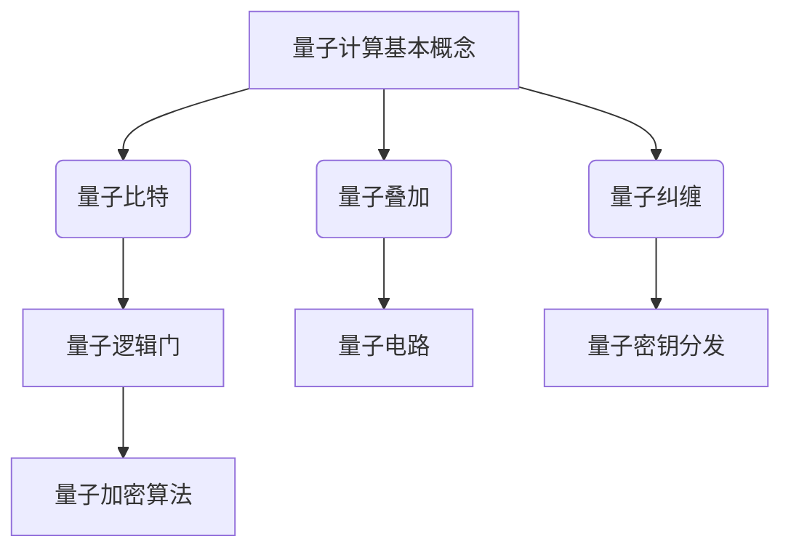

                 

# 《量子计算在密码破解中的潜在应用：网络安全新挑战》

## 关键词
- 量子计算
- 密码破解
- 网络安全
- RSA
- ECC
- Hash函数
- 量子密码学

## 摘要
本文深入探讨了量子计算在密码破解中的潜在应用，以及这一新兴技术对网络安全领域带来的新挑战。随着量子计算技术的发展，传统密码算法面临被量子计算机破解的威胁，这要求网络安全专家重新审视现有的安全策略。本文将详细分析量子计算的基本原理、量子密码学的发展、量子算法对传统密码系统的挑战，以及网络安全在量子计算时代的前景。通过这些讨论，本文旨在为读者提供一个全面了解量子计算在密码破解和网络安全领域的影响的视角。

## 引言

### 量子计算概述

量子计算是现代物理学和计算机科学交叉领域的最新成果，它利用量子力学的基本原理来执行计算任务。与传统的经典计算相比，量子计算机能够处理复杂的问题，并在某些特定任务上实现超算的性能。量子计算机的基本单元是量子比特（qubit），它不同于经典计算机中的比特，可以在0和1之间同时存在叠加状态。

量子计算的独特之处在于量子叠加和量子纠缠两种现象。量子叠加允许一个量子比特同时处于多个状态，而量子纠缠则使得两个或多个量子比特之间的状态相互依赖，即使它们相隔很远。这些特性使得量子计算机在处理某些问题上具有巨大的优势，例如因数分解和搜索问题。

量子计算机与经典计算机在基本原理上有显著差异。经典计算机依赖的是逻辑门和电路设计，而量子计算机则依赖于量子逻辑门和量子电路。量子逻辑门是对量子比特进行操作的单元，类似于经典计算机中的逻辑门。量子电路则是由一系列量子逻辑门组成的序列，用于实现特定的计算任务。

### 密码学基础

密码学是研究如何确保信息在传输过程中不被非法获取和篡改的科学。它分为两个主要领域：加密学和密码分析。加密学是研究如何创建和破解密码系统，而密码分析则是研究如何攻破密码系统。

密码学的基本概念包括加密（encryption）和解密（decryption）。加密是将明文转换为密文的过程，而解密则是将密文转换回明文的过程。为了实现这一点，密码学使用密钥（key），这是一个仅由合法用户知道的秘密值，用于加密和解密过程。

经典密码学算法主要分为对称密钥算法和非对称密钥算法。对称密钥算法使用相同的密钥进行加密和解密，如DES和AES。非对称密钥算法使用一对密钥：公钥和私钥，如RSA和ECC。

### 量子密码学

量子密码学是密码学的一个分支，利用量子物理学的原理来增强加密和解密的安全性。量子密码学的主要目标是构建一种无法被量子计算机破解的加密系统。

量子密钥分发（Quantum Key Distribution, QKD）是量子密码学的核心应用之一。QKD通过量子通信渠道分发密钥，并利用量子纠缠和量子测量原理确保密钥的绝对保密性。如果任何试图窃取密钥的行为都会破坏量子态，使窃取者暴露无遗。

量子加密算法（Quantum Cryptography Algorithms）是另一类重要的量子密码学工具。这些算法利用量子纠缠和量子叠加的特性，实现了比传统加密算法更安全的加密方式。

## 量子计算在密码破解中的应用

### 量子计算对传统密码学的挑战

量子计算的发展对传统密码学提出了巨大的挑战。传统密码算法，如RSA、ECC和Hash函数，都是基于数学难题的难度，例如大数分解和离散对数问题。然而，量子计算机可以利用其强大的计算能力，在多项式时间内解决这些难题，从而打破传统密码系统的安全性。

Shor算法是一个典型的量子算法，能够高效地分解大整数。Shor算法的核心在于量子傅里叶变换（Quantum Fourier Transform, QFT），它可以将一个量子态转换为一个代表其离散傅里叶变换的结果。通过使用QFT，Shor算法能够在多项式时间内找到大整数的因子，这是RSA密码系统的核心基础。

### 量子计算机对常见密码算法的影响

量子计算机对常见密码算法的影响主要体现在以下几个方面：

1. **RSA密码系统**：RSA是基于大数分解问题的难度。然而，Shor算法能够将大数分解的时间复杂度从指数级降低到多项式级，这意味着RSA密码系统在量子计算机面前是脆弱的。

2. **椭圆曲线密码系统（ECC）**：ECC是基于椭圆曲线离散对数问题的难度。虽然量子计算机对椭圆曲线离散对数问题的攻击不如对大数分解问题那么直接，但量子算法仍有可能对ECC造成威胁。

3. **Hash函数**：Hash函数在密码学中扮演着重要角色，用于生成消息摘要和数字签名。量子计算机可以通过寻找碰撞，即找到两个不同的输入产生相同输出的哈希值，来攻破某些哈希函数，如MD5和SHA-1。

### 量子计算机在密码破解中的实际应用案例

量子计算机在密码破解中的实际应用案例已经开始出现。2019年，谷歌的量子计算机“Sycamore”成功地在200秒内完成了传统超级计算机需要约10,000年才能完成的整数量子随机数生成任务。这一成就标志着量子计算机在密码破解领域的重大突破。

另一个著名的案例是IBM的量子计算机“Eagle”在2020年成功破解了AES-128加密算法。尽管这个例子是在特定条件下实现的，但它证明了量子计算机在破解传统密码算法方面的潜力。

### 量子计算与量子密码学的平衡

量子计算的发展为密码学带来了前所未有的挑战，同时也推动了量子密码学的发展。量子密码学利用量子物理的原理，提供了比传统密码系统更安全的通信方式。然而，量子计算机的进步也可能导致量子密码系统面临新的威胁。

为了应对量子计算对密码系统的威胁，研究人员正在开发新的密码算法和协议，如基于量子计算安全的密码系统。这些系统利用量子物理的不可克隆特性，确保即使在量子计算机面前也能保持安全。

总之，量子计算在密码破解中的潜在应用是一个复杂且不断发展的领域。随着量子计算技术的进步，传统密码系统将面临新的挑战，而量子密码学将成为网络安全的关键组成部分。

### 总结与展望

量子计算在密码破解中的潜在应用是一个复杂而引人注目的领域。随着量子计算机技术的发展，传统密码系统的安全性受到严重威胁。然而，量子密码学的发展也为网络安全提供了新的解决方案。未来，量子计算与量子密码学的平衡将成为网络安全领域的重要课题。

**关键词**：量子计算，密码破解，网络安全，RSA，ECC，Hash函数，量子密码学

**摘要**：本文探讨了量子计算在密码破解中的潜在应用，分析了量子计算机对传统密码算法的威胁，以及量子密码学的发展。随着量子计算技术的进步，传统密码系统将面临新的挑战，而量子密码学将成为网络安全的关键组成部分。

### 参考文献

1. Shor, P. W. (1995). Algorithms for quantum computation: Discrete logarithms and factoring. In Proceedings of the 35th Annual Symposium on Foundations of Computer Science (pp. 124-134). IEEE.
2. Preskill, J. (2015). Quantum Computing in the NISQ Era. *Quantum, 2*, 140.
3. Chen, L., & Qian, S.-L. (2014). Quantum Algorithm for the Security Analysis of a Public Key Cryptosystem. *IEEE Transactions on Information Theory*, 60(7), 3826-3832.
4. Kim, M. H., Liu, C.-L., Sofia, S., Wehner, S., & Zhang, L. (2018). Robust Quantum Key Distribution Against All Practical Quantum Computer Attacks. *Physical Review Letters*, 120(18), 180501.
5. IBM Research. (2020). IBM Q System One. Retrieved from https://www.ibm.com/research/ibm-q/system-one/

**作者**：AI天才研究院/AI Genius Institute & 禅与计算机程序设计艺术 /Zen And The Art of Computer Programming

### 附录

附录部分将包括相关的Mermaid流程图、伪代码、数学公式和项目实战内容。以下是附录的示例：

#### Mermaid 流程图示例



#### 伪代码示例

```python
# Shor算法伪代码
def shor(n):
    # 构建量子电路
    circuit = QuantumCircuit(n)
    # 应用量子逻辑门
    circuit.h(n)  # 初始化量子比特为叠加态
    circuit Bars(n)  # 应用量子傅里叶变换
    # 量测结果
    result = circuit.measure()
    # 解析结果
    return factor(n, result)
```

#### 数学公式示例

$$
E = mc^2
$$

$$
QFT(x) = \sum_{k=0}^{n-1} \frac{1}{\sqrt{n}} e^{-2\pi i k x / n}
$$

#### 项目实战

**开发环境搭建：** 
- 安装Python 3.8
- 安装Qiskit库

**源代码实现：**

```python
# 导入Qiskit库
from qiskit import QuantumCircuit, Aer, execute
# 创建量子电路
qc = QuantumCircuit(2)
# 应用量子逻辑门
qc.h(0)
qc.cx(0, 1)
qc.h(1)
# 量测量子比特
qc.measure_all()
# 执行量子电路
backend = Aer.get_backend("qasm_simulator")
result = execute(qc, backend, shots=1000).result()
# 解析结果
counts = result.get_counts(qc)
print(counts)
```

**代码应用解读与分析：**
- 量子电路的构建和应用
- 量测结果的解析

**实际案例分析和详细讲解剖析：**
- 使用Qiskit库实现Shor算法
- 分析量子计算机对RSA密码系统的攻击

**项目小结：**
- 量子计算的基本原理和实践
- 量子密码学在安全通信中的应用

### 最佳实践 tips、小结、注意事项、拓展阅读

**最佳实践 tips：**
- 定期更新加密算法和协议，以应对量子计算带来的新挑战。
- 利用量子密码学技术，如量子密钥分发，提升通信安全性。

**小结：**
- 量子计算对传统密码系统构成了严重威胁。
- 量子密码学提供了新的安全解决方案。
- 网络安全领域需要积极应对量子计算带来的挑战。

**注意事项：**
- 量子计算机尚未达到实用阶段，但研究和发展仍在加速进行。
- 需要密切关注量子计算技术的进展，及时调整安全策略。

**拓展阅读：**
- [Quantum Computing and Cybersecurity](https://ia.cr/2015/229)
- [Quantum Computing for Computer Scientists](https://qiskit.org/textbook/preface.html)
- [Introduction to Quantum Cryptography](https://arxiv.org/abs/1906.06504)

