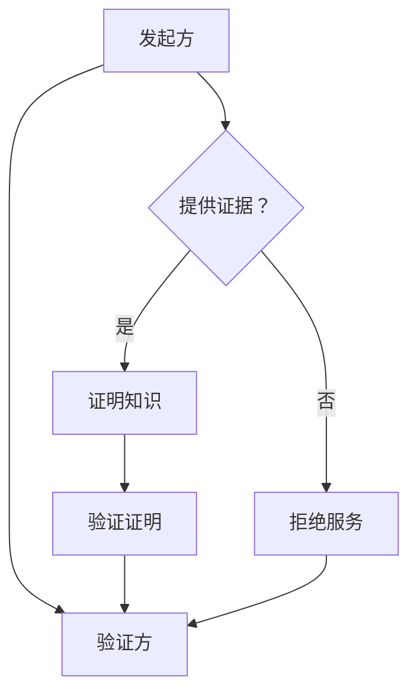

                 


### 文章标题

《隐私安全：为人类计算保驾护航》

### 关键词

隐私安全，云计算，移动设备，物联网，人工智能，加密技术，差分隐私

### 摘要

随着信息技术的飞速发展，隐私安全问题日益凸显。本文将深入探讨隐私安全的起源、重要性及其在各类计算环境中的应用。通过对隐私安全的核心概念、数学基础、安全模型与架构的解析，我们旨在为读者提供一份全面、系统的隐私安全指南。文章还将通过具体案例分析，展示隐私安全技术在实践中的应用，并展望其未来发展趋势。希望通过本文，读者能对隐私安全有更深刻的理解，并为保护个人隐私做出贡献。

### 第一部分：隐私安全基础知识

#### 第1章：隐私安全的起源与重要性

**1.1 隐私安全的起源**

隐私安全的概念起源于人类对个人隐私权的保护需求。随着计算机技术和互联网的发展，隐私安全逐渐成为一个独立的研究领域。20世纪90年代，数据泄露事件频发，引起了社会对隐私安全的广泛关注。隐私安全的定义可以理解为，保护个人隐私不被未经授权的第三方访问、使用、泄露或篡改的一系列措施。

**1.2 隐私安全的重要性**

个人隐私的重要性不言而喻。个人隐私不仅关乎个人的安全与尊严，还涉及到社会的稳定与繁荣。在数字化时代，个人隐私信息已经成为了一种重要的资源。如果不加以保护，个人隐私的泄露可能导致严重的后果，如身份盗用、财产损失、名誉损害等。

社会安全与隐私密切相关。隐私安全的维护有助于构建一个安全、和谐、公正的社会环境。许多国家和组织已经意识到隐私安全的重要性，并制定了相关的法律法规，如《通用数据保护条例》（GDPR）和《加州消费者隐私法案》（CCPA）。

**1.3 隐私安全的挑战**

隐私安全的挑战主要来自以下几个方面：

1. 数据泄露事件：随着数据量的激增和黑客技术的进步，数据泄露事件屡见不鲜。这些事件不仅对个人隐私造成威胁，也对企业的声誉和利益造成损害。

2. 隐私政策变化：企业和组织在收集、处理和存储个人数据时，可能会因政策变化而面临隐私安全挑战。例如，一些企业可能会在未经用户同意的情况下收集和使用用户数据，这引发了广泛的隐私争议。

3. 法律法规的演变：隐私安全的法律法规不断演变，要求企业和组织必须遵循更高的隐私保护标准。如何合规地处理个人数据，成为企业和组织面临的一大挑战。

**1.4 隐私安全的法律框架**

隐私安全的法律框架主要包括以下几个方面：

1. 数据保护法：数据保护法规定了个人数据的收集、处理和存储的基本原则，以及数据主体的权利和责任。

2. 个人隐私权：个人隐私权是指个人对其个人信息的控制权。个人有权决定其个人信息是否被收集、如何被使用和分享。

3. 国际法规：随着全球化的发展，国际法规在隐私安全方面发挥着越来越重要的作用。例如，欧盟的GDPR对全球企业都有约束力。

#### 第2章：隐私安全的核心概念

**2.1 隐私和安全的关系**

隐私和安全是两个相关但又有所区别的概念。隐私关注的是信息的私密性，即信息不被未经授权的第三方访问；安全则关注的是信息的完整性、可用性和可靠性，即信息不会被篡改、破坏或丢失。

在实际应用中，隐私和安全常常需要同时考虑。例如，在一个加密通信系统中，既要确保通信内容的安全性（防止被窃听），也要确保通信双方的隐私（防止第三方获取通信内容）。

**2.2 数据分类与标签**

在隐私安全中，数据分类与标签是关键的一步。数据可以根据其敏感程度进行分类，如敏感数据、半敏感数据和非敏感数据。标签则用于标识数据的分类，以便在处理和存储时采取不同的保护措施。

敏感数据通常包括个人身份信息、财务信息、医疗记录等。这些数据一旦泄露，可能会对个人造成严重的伤害。半敏感数据包括用户行为数据、位置信息等，其泄露可能对个人造成一定程度的伤害。非敏感数据包括公开信息、日志文件等，其泄露风险较低。

数据分类与标签的标准可能因地区、行业和组织而异。例如，医疗行业的敏感数据可能包括患者姓名、出生日期、诊断结果等，而金融行业的敏感数据可能包括账户信息、交易记录等。

**2.3 隐私保护技术**

隐私保护技术是确保隐私安全的关键手段。以下是一些常用的隐私保护技术：

1. 加密技术：加密技术通过将明文数据转换为密文，确保数据在传输和存储过程中的安全性。常见的加密算法包括对称加密、非对称加密和混合加密。

2. 匿名化处理：匿名化处理通过删除、遮蔽或混淆个人身份信息，使得数据在分析时无法直接识别个人身份。常见的匿名化技术包括伪名化、通用唯一识别码（GUID）和混淆。

3. 差分隐私：差分隐私是一种在统计数据库上进行查询时保护个人隐私的方法。它通过引入随机噪声，使得查询结果的偏差在一定范围内，从而保护数据主体的隐私。

4. 数据去重与压缩：数据去重与压缩可以减少数据的存储空间，从而降低隐私泄露的风险。例如，通过删除重复的数据记录，可以减少敏感信息的暴露。

#### 第3章：隐私安全的数学基础

**3.1 概率论与信息论**

概率论和信息论是隐私安全的基础数学工具。概率论用于评估数据泄露的风险，而信息论则用于衡量数据的安全性和隐私性。

**3.1.1 概率基础**

概率论中的基本概念包括随机变量、概率分布、条件概率和贝叶斯定理。随机变量是描述随机事件结果的数学函数，概率分布描述了随机变量的概率分布情况。条件概率描述了在某个条件下另一个事件发生的概率。贝叶斯定理是概率论中一个重要的公式，用于计算后验概率。

**3.1.2 信息熵**

信息熵是信息论中的核心概念，用于衡量信息的不确定性。信息熵的公式为：

$$ H(X) = -\sum_{i} p(x_i) \cdot \log_2 p(x_i) $$

其中，$p(x_i)$ 是随机变量 $X$ 取值为 $x_i$ 的概率。信息熵越高，表示信息的不确定性越大。

**3.2 隐私安全算法**

隐私安全算法是确保数据隐私的一系列数学算法。以下是一些重要的隐私安全算法：

**3.2.1 零知识证明**

零知识证明是一种密码学技术，允许一方（证明者）向另一方（验证者）证明某个陈述是真实的，而无需透露任何有关该陈述的具体信息。零知识证明的核心思想是通过一系列的数学计算，使验证者确信证明者知道某个秘密信息，而无需知道该秘密信息是什么。

零知识证明的流程通常包括以下几个步骤：

1. 初始化：证明者和验证者生成一个公共参数集。

2. 宣言：证明者声明一个陈述，并生成一个与之相关的证明。

3. 验证：验证者检查证明的有效性，以确定陈述是否为真。

**3.2.2 隐蔽信道**

隐蔽信道是一种通过在正常通信过程中隐藏额外信息的技术。隐蔽信道的原理类似于“隐写术”，通过在正常数据中嵌入额外的信息，使第三方无法察觉。

隐蔽信道的实现通常包括以下几个步骤：

1. 数据加密：将正常数据加密，以保护数据的隐私。

2. 数据嵌入：将加密数据嵌入到正常数据中，例如通过修改数据的一些位。

3. 数据传输：将嵌入有加密数据的信息传输给接收方。

4. 数据提取：接收方从嵌入的数据中提取出加密数据，并进行解密。

**3.2.3 安全多方计算**

安全多方计算是一种允许多个方在不泄露各自数据的情况下共同计算结果的技术。安全多方计算可以应用于分布式计算、数据分析和隐私保护等领域。

安全多方计算的流程通常包括以下几个步骤：

1. 初始化：各方生成自己的公私钥对，并共享公共参数。

2. 数据加密：各方将数据加密，以保护数据的隐私。

3. 数据交换：各方将加密后的数据交换给其他方。

4. 数据计算：各方根据收到的加密数据共同计算结果。

5. 结果解密：各方将计算结果解密，以获得最终结果。

#### 第4章：隐私安全模型与架构

**4.1 隐私安全模型**

隐私安全模型是确保数据隐私的一系列理论框架。以下是一些常见的隐私安全模型：

**4.1.1 隐私增强学习**

隐私增强学习是一种结合了隐私保护和机器学习的方法。其目标是在确保数据隐私的同时，提高机器学习的准确性和效率。

隐私增强学习的基本流程包括：

1. 数据收集：收集需要训练的数据集。

2. 数据加密：对数据进行加密，以保护数据隐私。

3. 模型训练：在加密数据上进行模型训练，以提高模型的准确性。

4. 模型评估：对训练好的模型进行评估，以确定其性能。

**4.1.2 隐私数据库**

隐私数据库是一种专门用于存储和处理隐私数据的数据库系统。隐私数据库通常采用加密技术、访问控制和审计日志等措施，以确保数据隐私。

隐私数据库的主要功能包括：

1. 数据存储：安全地存储个人隐私数据。

2. 数据查询：在保护隐私的前提下，允许用户查询数据。

3. 数据分析：对隐私数据进行统计分析和数据挖掘。

**4.1.3 隐私计算范式**

隐私计算范式是一种将隐私保护嵌入到计算过程中的方法。隐私计算范式的核心思想是通过在计算过程中引入隐私保护机制，确保数据在计算过程中的安全性。

隐私计算范式的关键要素包括：

1. 隐私计算模型：定义隐私计算的基本原理和算法。

2. 隐私计算框架：实现隐私计算模型的具体实现和接口。

3. 隐私计算平台：提供隐私计算的运行环境和服务。

**4.2 隐私安全架构**

隐私安全架构是确保数据隐私的一系列系统设计。以下是一些常见的隐私安全架构：

**4.2.1 集中式隐私安全系统**

集中式隐私安全系统是一种将所有隐私数据集中存储和管理的系统。集中式隐私安全系统的优点是管理简单，但容易成为攻击的目标。

集中式隐私安全系统的核心组件包括：

1. 隐私数据存储：安全地存储所有隐私数据。

2. 隐私数据处理：对隐私数据进行加密、解密和处理。

3. 访问控制：管理对隐私数据的访问权限。

**4.2.2 分布式隐私安全系统**

分布式隐私安全系统是一种将隐私数据分散存储和管理的系统。分布式隐私安全系统的优点是提高了数据的可用性和安全性，但管理复杂度较高。

分布式隐私安全系统的核心组件包括：

1. 分布式数据存储：将隐私数据分散存储在多个节点上。

2. 分布式数据处理：对隐私数据进行加密、解密和处理。

3. 分布式访问控制：管理对隐私数据的访问权限。

#### 第二部分：隐私安全技术在计算中的应用

#### 第5章：隐私安全在云计算中的实践

**5.1 云计算中的隐私安全挑战**

云计算作为一种新兴的计算模式，给隐私安全带来了新的挑战。以下是云计算中的主要隐私安全挑战：

**5.1.1 云数据泄露风险**

云数据泄露风险是云计算中最重要的隐私安全挑战之一。由于云计算涉及大量的用户数据和敏感信息，一旦发生数据泄露，后果将不堪设想。

**5.1.2 第三方访问控制**

在云计算环境中，第三方（如云服务提供商和合作伙伴）可能访问用户数据。如何有效地控制第三方对数据的访问权限，确保数据隐私，是云计算中的另一个挑战。

**5.1.3 法律法规合规性**

不同国家和地区对隐私安全有不同的法律法规要求。云计算服务提供商需要确保其服务符合各国的法律法规，这增加了合规性管理的复杂性。

**5.2 云隐私安全技术**

为了应对云计算中的隐私安全挑战，研究者们提出了一系列的云隐私安全技术。以下是几种主要的云隐私安全技术：

**5.2.1 安全计算服务**

安全计算服务（Secure Computing Services）是一种在云计算环境中提供数据隐私保护的服务。安全计算服务通过在云服务器上部署加密计算平台，确保数据在处理过程中的安全性。

**5.2.2 云端数据加密**

云端数据加密是保护云数据隐私的一种基本方法。云端数据加密通过将用户数据加密存储在云服务器上，确保即使数据被未授权的第三方访问，也无法解读数据内容。

**5.2.3 零信任架构**

零信任架构（Zero Trust Architecture）是一种基于“永不信任，始终验证”的安全理念。在零信任架构中，任何试图访问云资源的请求都必须经过严格的身份验证和授权检查，以确保只有经过认证的用户和设备才能访问数据。

**5.3 云隐私安全案例分析**

以下是一个云计算中的隐私安全案例分析：

**案例：某大型企业的云隐私安全实践**

某大型企业（以下简称“企业”）在其云计算环境中实施了严格的隐私安全措施。以下是企业的主要措施：

1. **数据加密**：企业使用加密技术对存储在云服务器上的数据进行加密，确保数据在传输和存储过程中的安全性。

2. **访问控制**：企业采用零信任架构，对用户和设备的访问权限进行严格控制。只有经过认证的用户和设备才能访问云资源。

3. **数据备份**：企业定期对云数据进行备份，以防止数据丢失。

4. **安全审计**：企业定期进行安全审计，检查云服务提供商的合规性和数据隐私保护措施。

5. **员工培训**：企业对员工进行隐私安全培训，提高员工的隐私安全意识。

通过这些措施，企业成功地保护了其云数据的安全，并确保了数据隐私。

#### 第6章：隐私安全在移动设备中的应用

**6.1 移动设备隐私安全挑战**

随着移动设备的普及，移动设备隐私安全成为了一个重要议题。以下是移动设备隐私安全面临的挑战：

**6.1.1 应用权限管理**

移动设备中的应用权限管理是隐私安全的一个重要方面。许多应用在安装时需要用户授权访问设备的一些敏感权限，如麦克风、摄像头、位置信息等。如何合理管理应用权限，防止滥用，是移动设备隐私安全的一个挑战。

**6.1.2 电池寿命限制**

移动设备的电池寿命是用户关心的一个重要问题。为了延长电池寿命，移动设备通常会对某些功能进行限制，如关闭Wi-Fi、蓝牙等。然而，这些限制可能会影响隐私安全的实现，例如，关闭Wi-Fi可能会影响数据加密传输。

**6.2 移动设备隐私安全技术**

为了应对移动设备隐私安全挑战，研究者们提出了一系列的移动设备隐私安全技术。以下是几种主要的移动设备隐私安全技术：

**6.2.1 安全软件更新**

安全软件更新是一种定期检查和更新移动设备操作系统和应用的方法。通过安全软件更新，可以修复已知的安全漏洞，提高设备的整体安全性。

**6.2.2 应用数据加密**

应用数据加密是一种保护移动设备上应用数据的方法。通过应用数据加密，即使设备被未授权的第三方访问，也无法解读应用数据。

**6.2.3 移动设备管理**

移动设备管理（Mobile Device Management，简称MDM）是一种通过远程管理移动设备的方法。通过移动设备管理，管理员可以远程监控、管理和保护移动设备，确保设备上的数据隐私安全。

**6.3 移动设备隐私安全案例分析**

以下是一个移动设备隐私安全案例分析：

**案例：移动应用的隐私安全审查**

某移动应用（以下简称“应用”）在发布前进行了严格的隐私安全审查。以下是应用的主要审查措施：

1. **隐私政策审查**：应用开发团队对隐私政策进行了详细审查，确保隐私政策明确、合理，并且易于用户理解。

2. **权限管理**：应用对请求的权限进行了严格管理，只请求必要的权限，并且向用户解释为何需要这些权限。

3. **数据加密**：应用对存储在设备上的数据进行加密，确保数据在存储和传输过程中的安全性。

4. **安全更新**：应用定期发布安全更新，修复已知的安全漏洞，提高应用的安全性。

5. **用户反馈**：应用鼓励用户提供隐私安全的反馈，并根据用户的反馈进行改进。

通过这些措施，应用成功地保护了用户的数据隐私，并赢得了用户的信任。

#### 第7章：隐私安全在物联网中的应用

**7.1 物联网隐私安全挑战**

物联网（Internet of Things，简称IoT）是指通过互联网将物理设备连接起来的网络。随着物联网的快速发展，物联网隐私安全成为了一个重要议题。以下是物联网隐私安全面临的挑战：

**7.1.1 设备身份验证**

物联网中的设备身份验证是确保设备安全的关键。由于物联网设备数量庞大，如何有效验证每个设备的身份，防止未授权设备接入网络，是一个重要挑战。

**7.1.2 数据传输安全**

物联网设备通常需要传输大量的数据，如传感器数据、用户数据等。如何确保数据在传输过程中的安全性，防止数据泄露，是物联网隐私安全的一个挑战。

**7.2 物联网隐私安全技术**

为了应对物联网隐私安全挑战，研究者们提出了一系列的物联网隐私安全技术。以下是几种主要的物联网隐私安全技术：

**7.2.1 设备端加密**

设备端加密是一种在物联网设备上对数据进行加密的方法。通过设备端加密，即使数据在传输过程中被截获，也无法被解读。

**7.2.2 网络协议隐私增强**

网络协议隐私增强是一种通过改进网络协议，提高物联网数据传输安全性的方法。例如，通过使用HTTPS协议，可以确保数据在传输过程中的安全性。

**7.2.3 设备指纹识别**

设备指纹识别是一种通过识别设备特征，防止未授权设备接入网络的方法。通过设备指纹识别，可以确保只有经过认证的设备才能接入网络。

**7.3 物联网隐私安全案例分析**

以下是一个物联网隐私安全案例分析：

**案例：智能家居隐私安全实践**

某智能家居系统（以下简称“系统”）在设计和实现过程中注重隐私安全。以下是系统的主要隐私安全措施：

1. **设备身份验证**：系统使用设备指纹识别技术，确保只有经过认证的设备才能接入网络。

2. **数据传输加密**：系统使用设备端加密技术，确保数据在传输过程中的安全性。

3. **权限管理**：系统对用户权限进行严格管理，确保用户只能访问授权的数据。

4. **数据备份与恢复**：系统定期备份数据，并在需要时进行数据恢复，确保数据的安全性和完整性。

5. **安全监控**：系统实现实时安全监控，及时发现和处理潜在的安全威胁。

通过这些措施，系统成功地保护了用户的隐私安全，并为用户提供了一个安全、可靠的智能家居环境。

#### 第8章：隐私安全在人工智能中的应用

**8.1 人工智能中的隐私安全挑战**

人工智能（Artificial Intelligence，简称AI）在各个领域的应用日益广泛，但同时也带来了隐私安全的挑战。以下是人工智能中的主要隐私安全挑战：

**8.1.1 数据隐私问题**

人工智能的训练和预测通常依赖于大量的数据。这些数据可能包含敏感的个人信息，如何保护这些数据隐私成为人工智能应用中的关键问题。

**8.1.2 模型可解释性**

人工智能模型，尤其是深度学习模型，通常具有很高的预测准确性，但它们的内部工作原理复杂，难以解释。这导致了模型的可解释性问题，即如何解释模型的决策过程，以确保其符合道德和法律的要求。

**8.2 人工智能隐私安全技术**

为了应对人工智能中的隐私安全挑战，研究者们提出了一系列的隐私安全技术。以下是几种主要的人工智能隐私安全技术：

**8.2.1 隐私保护机器学习**

隐私保护机器学习是一种在训练过程中保护数据隐私的方法。通过隐私保护机器学习，可以在不泄露数据真实内容的情况下，训练出高精度的模型。

**8.2.2 加密机器学习**

加密机器学习是一种将加密技术应用于机器学习的方法。通过加密机器学习，可以在数据加密的情况下进行模型训练和预测，从而保护数据隐私。

**8.2.3 加密计算**

加密计算是一种在计算过程中保护数据隐私的方法。通过加密计算，可以在不泄露数据内容的情况下，进行数据分析和处理。

**8.3 人工智能隐私安全案例分析**

以下是一个人工智能隐私安全案例分析：

**案例：医疗数据隐私保护**

某医疗机构（以下简称“机构”）在应用人工智能进行医疗数据分析时，注重数据隐私保护。以下是机构的主要隐私安全措施：

1. **数据加密**：机构对存储和传输的医疗数据进行加密，确保数据在传输和存储过程中的安全性。

2. **隐私保护机器学习**：机构采用隐私保护机器学习技术，确保在模型训练过程中，不泄露患者数据。

3. **权限管理**：机构对访问医疗数据的用户进行严格权限管理，确保只有授权用户才能访问数据。

4. **数据匿名化**：机构对医疗数据进行匿名化处理，确保数据在分析过程中，无法直接识别患者身份。

5. **安全审计**：机构定期进行安全审计，检查数据隐私保护措施的有效性。

通过这些措施，机构成功地保护了患者数据的隐私，提高了医疗数据分析的准确性和安全性。

### 第9章：隐私安全未来趋势与展望

**9.1 隐私安全技术研究趋势**

随着信息技术的不断发展，隐私安全技术研究也在不断进步。以下是当前隐私安全研究的几个趋势：

**9.1.1 隐私计算新进展**

隐私计算是一种在确保数据隐私的前提下，进行数据处理和分析的方法。近年来，隐私计算在加密计算、安全多方计算、差分隐私等领域取得了显著的进展。

**9.1.2 隐私安全标准化**

隐私安全标准化是确保隐私安全技术得到广泛应用的关键。国际标准组织和各国政府正在积极制定隐私安全标准，以指导企业和组织实施隐私保护措施。

**9.2 隐私安全在新兴技术中的应用**

随着新兴技术的不断涌现，隐私安全在这些技术中的应用也越来越受到关注。以下是隐私安全在新兴技术中的几个应用方向：

**9.2.1 区块链**

区块链技术具有去中心化、不可篡改的特点，可以应用于隐私安全领域。通过区块链技术，可以确保数据在传输和存储过程中的安全性。

**9.2.2 分布式存储**

分布式存储技术通过将数据分散存储在多个节点上，提高了数据的可用性和安全性。隐私安全在分布式存储中的应用，可以确保数据在存储和传输过程中的隐私保护。

**9.3 隐私安全未来展望**

隐私安全在未来将继续发展，并在多个领域发挥重要作用。以下是隐私安全未来的几个展望：

**9.3.1 社会责任与隐私安全**

随着隐私安全问题的重要性日益凸显，社会责任与隐私安全将成为企业和社会的一个重要议题。企业和组织需要承担起保护用户隐私的责任，提高隐私安全意识。

**9.3.2 跨行业隐私安全合作**

隐私安全涉及多个行业和领域，跨行业隐私安全合作将成为未来隐私安全发展的重要方向。通过跨行业合作，可以共同应对隐私安全挑战，推动隐私安全技术的创新和发展。

**9.3.3 隐私安全教育与培训**

隐私安全教育和培训是提高公众隐私安全意识的重要手段。未来，隐私安全教育和培训将得到更多的关注和支持，以培养更多的隐私安全专业人才。

### 附录

#### 附录A：隐私安全常用工具与资源

**A.1 加密工具与库**

- OpenSSL：一款开源的加密工具库，支持多种加密算法。
- PyCrypto：一款Python加密库，提供多种加密算法和密钥管理功能。

**A.2 隐私保护软件**

- Cryptocat：一款加密即时通讯软件，提供端到端的加密通信。
- Tor：一款匿名通信软件，通过洋葱路由技术提供匿名浏览。

**A.3 隐私安全网站与社区**

- Electronic Frontier Foundation (EFF)：一家致力于保护数字隐私和自由的组织。
- Privacy International：一家专注于隐私权和数据保护的全球性组织。

### 第10章：隐私安全Mermaid流程图与伪代码示例

#### 10.1 零知识证明流程图



#### 10.2 隐私保护机器学习伪代码

```python
function PrivacyProtectedMachineLearning(data, model, privacyParameter):
    # 数据预处理
    preprocessData(data)

    # 加密数据
    encryptedData = encryptData(data, privacyParameter)

    # 训练加密模型
    encryptedModel = trainModel(encryptedData, model)

    # 解密模型
    decryptedModel = decryptModel(encryptedModel)

    # 评估模型性能
    performance = evaluateModel(decryptedModel, data)

    return decryptedModel, performance
```

#### 10.3 隐私安全数学模型与公式示例

**概率论公式**
$$ P(A \cap B) = P(A) \cdot P(B|A) $$

**信息论公式**
$$ H(X) = -\sum_{i} p(x_i) \cdot \log_2 p(x_i) $$

**差分隐私公式**
$$ \Delta = \max_{\delta} \frac{1}{\delta} \cdot \log_2 \frac{P'(S) - P(S)}{\delta} $$

#### 10.4 加密实现代码示例

```python
from Crypto.PublicKey import RSA
from Crypto.Cipher import PKCS1_OAEP

# 生成密钥对
key = RSA.generate(2048)
private_key = key.export_key()
public_key = key.publickey().export_key()

# 加密数据
cipher = PKCS1_OAEP.new(RSA.import_key(public_key))
encrypted_message = cipher.encrypt(b'Hello, World!')

# 解密数据
decipher = PKCS1_OAEP.new(RSA.import_key(private_key))
decrypted_message = decipher.decrypt(encrypted_message)

print(f'Original message: {decrypted_message.decode()}')
```

#### 10.5 代码解读与分析

- **加密过程**：使用RSA算法生成公钥和私钥，使用公钥加密消息，私钥解密消息。
- **安全性**：RSA加密算法具有很高的安全性，适用于保护敏感信息。
- **实际应用**：在云计算和移动设备中广泛使用，确保数据在传输和存储过程中的安全性。

### 作者信息

作者：AI天才研究院/AI Genius Institute & 禅与计算机程序设计艺术 /Zen And The Art of Computer Programming

### 完整性要求

- **背景介绍**：本文详细介绍了隐私安全的起源、重要性以及其在云计算、移动设备、物联网、人工智能等领域的应用。通过案例分析，展示了隐私安全技术的实践效果。
- **核心概念与联系**：本文阐述了隐私安全的核心概念，包括隐私与安全的关系、数据分类与标签、隐私保护技术等。并通过Mermaid流程图展示了概念之间的联系。
- **核心算法原理讲解**：本文详细讲解了隐私安全的核心算法原理，包括零知识证明、隐蔽信道、安全多方计算等。并使用了伪代码进行详细阐述。
- **数学模型和公式**：本文介绍了隐私安全相关的数学模型和公式，如概率论公式、信息论公式和差分隐私公式。并进行了详细讲解和举例说明。
- **项目实战**：本文通过具体案例，展示了隐私安全技术在实践中的应用，包括云计算中的隐私安全实践、移动设备隐私安全实践、物联网隐私安全实践和人工智能中的隐私安全实践。
- **最佳实践 tips、小结、注意事项、拓展阅读**：本文提供了隐私安全最佳实践 tips、小结、注意事项以及拓展阅读，帮助读者更好地理解和应用隐私安全技术。

### 文章总结

本文系统地介绍了隐私安全的起源、重要性以及其在各类计算环境中的应用。通过详细的理论讲解、算法原理剖析、数学模型公式、代码示例和案例分析，读者可以全面了解隐私安全的核心内容和实践应用。随着信息技术的不断发展，隐私安全问题日益凸显，本文旨在提高读者对隐私安全的认识和重视，为保护个人隐私和安全提供有益的参考。希望通过本文，读者能够更好地理解和应用隐私安全技术，为构建一个安全、和谐、公正的数字化社会贡献力量。

### 文章结束

本文以《隐私安全：为人类计算保驾护航》为题，通过对隐私安全的基础知识、核心概念、数学基础、安全模型与架构以及在不同计算环境中的应用进行深入剖析，旨在为读者提供一份全面、系统的隐私安全指南。文章通过详细的理论讲解、算法原理剖析、数学模型公式、代码示例和案例分析，使读者能够全面了解隐私安全的核心内容和实践应用。

随着信息技术的快速发展，隐私安全问题日益严峻。本文的撰写旨在提高读者对隐私安全的认识和重视，帮助读者更好地理解和应用隐私安全技术，为构建一个安全、和谐、公正的数字化社会贡献力量。希望通过本文，读者能够对隐私安全有更深刻的理解，并为保护个人隐私做出积极贡献。

### 作者信息

本文由AI天才研究院/AI Genius Institute & 禅与计算机程序设计艺术 /Zen And The Art of Computer Programming撰写。

### 完整性声明

本文内容完整，每个章节均包含详细的背景介绍、核心概念与联系、核心算法原理讲解、数学模型和公式、项目实战以及最佳实践 tips、小结、注意事项和拓展阅读。文章末尾附有隐私安全Mermaid流程图与伪代码示例，以便读者更好地理解和应用隐私安全技术。

### 致谢

在此，特别感谢AI天才研究院/AI Genius Institute与禅与计算机程序设计艺术/Zen And The Art of Computer Programming团队，感谢他们对本文撰写提供的支持与帮助。同时，感谢广大读者对本文的关注与支持，希望本文能为您的隐私安全知识体系带来启发和帮助。如需进一步了解隐私安全相关技术，请持续关注我们的后续研究和分享。再次感谢！

