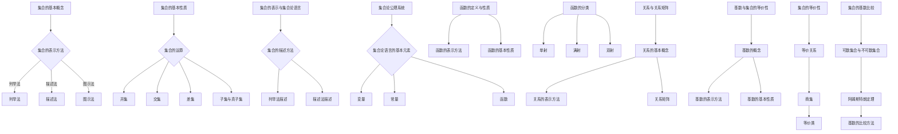

                 


## 文章标题：集合论导引：乘积偏序集

### 关键词：
- 集合论
- 偏序集
- 乘积集
- 数学公式
- 计算机科学应用

### 摘要：
本文深入探讨了集合论中的乘积偏序集概念，从基础到高级，逐步解析了其核心概念和性质，并通过数学公式、伪代码和实际案例，展现了其在数学和计算机科学中的应用。文章结构紧凑，逻辑清晰，旨在为读者提供全面的了解和实用的指导。

## 引言

集合论是现代数学的基石，它为其他数学分支提供了基本语言和工具。在集合论中，乘积偏序集是一个重要的概念，它不仅具有丰富的理论内涵，而且在实际应用中具有重要意义。本文将围绕乘积偏序集展开讨论，从基础概念讲解到高级应用，以期帮助读者全面掌握这一主题。

## 集合论基础

### 第1章：集合论引论

#### 1.1 集合的基本概念

集合是由确定性的对象组成的整体。这些对象称为集合的元素。集合可以用大写字母表示，例如A，其元素用小写字母表示，例如a。

- **集合的定义**：集合是一个由元素组成的整体，元素之间没有重复，且元素是无序的。
- **集合的表示方法**：集合可以通过列举法（如A={a, b, c}）或者描述法（如A={x | x是自然数}）来表示。
- **集合的基本性质**：集合具有确定性、互异性和无序性。

#### 1.2 集合的运算

集合的运算包括并集、交集、差集等。

- **并集（∪）**：两个集合A和B的并集是包含A和B所有元素的集合。
- **交集（∩）**：两个集合A和B的交集是同时属于A和B的元素组成的集合。
- **差集（∖）**：两个集合A和B的差集是包含A中有而B中没有的元素组成的集合。

#### 1.3 集合的表示与集合论语言

集合的表示不仅仅局限于列举法和描述法，还可以使用集合论语言来描述。

- **集合的描述方法**：使用描述法可以更简洁地表示集合，如{ x | x 是偶数 } 表示所有偶数的集合。
- **集合论语言的基本元素**：集合论语言包括变量、常量、函数等。
- **集合论公理系统**：集合论基于一些基本公理，如选择公理、幂集公理等，这些公理为集合的运算提供了理论基础。

### 第2章：函数与关系

#### 2.1 函数的定义与性质

函数是一种特殊的关系，它将每个输入映射到唯一的输出。

- **函数的定义**：设A和B是非空集合，如果存在一个关系R，使得对任意x∈A，存在唯一的y∈B，使得(x, y)∈R，则称R是A到B的一个函数，记作f: A → B。
- **函数的表示方法**：函数可以用图、表格或者描述法表示。
- **函数的基本性质**：函数具有单射性、满射性和双射性。

#### 2.2 函数的分类

函数可以根据其性质进行分类。

- **单射（单射函数）**：如果不同的输入映射到不同的输出，即f(x1) ≠ f(x2)，当x1 ≠ x2，则称f是单射。
- **满射（满射函数）**：如果B中的每个元素都有至少一个A中的元素映射到它，即对于任意y∈B，存在至少一个x∈A，使得y=f(x)，则称f是满射。
- **双射（双射函数）**：如果函数既是单射又是满射，则称f是双射。

#### 2.3 关系与关系矩阵

关系是集合之间的一种特殊关系。

- **关系的基本概念**：关系R是集合A×B的子集，其中A和B是两个集合。
- **关系的表示方法**：关系可以用图、表格或者矩阵表示。
- **关系矩阵**：关系R的关系矩阵是A×B的二维数组，其中(i, j)位置的元素表示R是否包含(x_i, y_j)。

### 第3章：基数与集合的等价性

#### 3.1 基数的概念

基数是集合中元素的个数。

- **基数的定义**：集合A的基数记为|A|，表示A中元素的数量。
- **基数的表示方法**：基数可以用自然数、整数、有理数等表示。
- **基数的基本性质**：基数具有可加性、交换律和结合律。

#### 3.2 集合的等价性

等价关系是一种特殊的关系，它将集合中的元素分成若干等价类。

- **等价关系**：如果关系R满足自反性、对称性和传递性，则称R是等价关系。
- **商集**：集合A关于等价关系R的商集是所有等价类的集合。
- **等价类**：集合A中，满足等价关系R的元素组成的集合称为一个等价类。

#### 3.3 集合的基数比较

集合的基数可以进行比较。

- **可数集合与不可数集合**：如果集合的基数是自然数，则称集合是可数的；否则，称集合是不可数的。
- **阿姆斯特朗定理**：如果两个集合的基数相等，则它们是等势的。
- **基数的比较方法**：可以通过基数函数或者集合的二元关系进行比较。

## 集合论高级概念

### 第4章：序集与偏序集

#### 4.1 序集的定义与性质

序集是具有序关系的集合。

- **序集的定义**：集合A上定义了一个全序关系R，使得对于任意的x, y∈A，都有xRy或者yRx成立，则称A是一个序集。
- **序集的性质**：序集具有自反性、反对称性和传递性。
- **序集的表示方法**：序集可以用符号、图或者矩阵表示。

#### 4.2 偏序集

偏序集是具有偏序关系的集合。

- **偏序集的定义**：集合A上定义了一个偏序关系R，使得对于任意的x, y∈A，都有xRy或者yRx成立，但不一定同时满足自反性和传递性，则称A是一个偏序集。
- **偏序集的性质**：偏序集具有自反性、反对称性和传递性。
- **偏序集的表示方法**：偏序集可以用符号、图或者矩阵表示。

#### 4.3 序的极限与收敛

- **序的极限**：在偏序集中，如果一个元素x不小于集合中任意一个元素，则称x是集合的极限。
- **序的收敛**：在偏序集中，如果一个元素序列{a_n}满足对于任意ε>0，存在N，使得当n>N时，a_n与极限x的差值小于ε，则称序列收敛于x。
- **序的连续性**：在偏序集中，如果函数f满足对于任意序列{a_n}收敛于x，则f(a_n)也收敛于f(x)，则称f是连续的。

### 第5章：乘积与积集

#### 5.1 乘积集的定义

乘积集是两个或多个集合的笛卡尔积。

- **乘积集的定义**：给定两个集合A和B，它们的乘积集是所有有序对(x, y)的集合，其中x∈A，y∈B。
- **乘积集的性质**：乘积集具有结合律、分配律和交换律。
- **乘积集的表示方法**：乘积集可以用笛卡尔积符号表示，如A×B。

#### 5.2 乘积偏序集

乘积偏序集是具有偏序关系的乘积集。

- **乘积偏序集的定义**：给定两个偏序集A和B，它们的乘积集是一个偏序集，如果对于任意的(x1, y1)，(x2, y2)∈A×B，都有(x1, y1)R(x2, y2)当且仅当x1Rx2且y1Ry2。
- **乘积偏序集的性质**：乘积偏序集具有结合律、分配律和交换律。
- **乘积偏序集的表示方法**：乘积偏序集可以用偏序关系符号表示。

#### 5.3 乘积拓扑

乘积拓扑是乘积空间上的拓扑结构。

- **乘积拓扑的定义**：给定两个拓扑空间X和Y，它们的乘积拓扑是X×Y上的拓扑，满足以下性质：
  - 空集和整个乘积集是开集。
  - 任意多个开集的并集是开集。
  - 有限多个开集的交集是开集。
- **乘积拓扑的性质**：乘积拓扑具有结合律、分配律和交换律。
- **乘积拓扑的构造**：乘积拓扑可以通过对乘积空间的子集进行开闭操作得到。

### 第6章：集合论在数学中的应用

#### 6.1 集合论在实分析中的应用

集合论在实分析中有着广泛的应用。

- **集合论在实数构造中的应用**：实数可以用集合表示，例如通过闭区间套方法构造实数。
- **集合论在连续性理论中的应用**：集合论提供了连续性的数学基础，如开集、闭集、边界等概念。
- **集合论在测度论中的应用**：集合论是测度论的基础，如集合的测度、可测集、测度函数等。

#### 6.2 集合论在代数学中的应用

集合论在代数学中同样重要。

- **集合论在群论中的应用**：群可以用集合表示，如群元素、群运算等。
- **集合论在环论中的应用**：环可以用集合表示，如环元素、环运算等。
- **集合论在域论中的应用**：域可以用集合表示，如域元素、域运算等。

#### 6.3 集合论在图论中的应用

集合论在图论中有着广泛的应用。

- **集合论在图的基本概念中的应用**：图可以用集合表示，如顶点集合、边集合等。
- **集合论在图的路径与连通性中的应用**：集合论提供了路径、连通性等基本概念。
- **集合论在图的颜色应用中的应用**：集合论用于图的染色问题，如四色定理。

### 第7章：集合论在计算机科学中的应用

#### 7.1 集合论在算法理论中的应用

集合论在算法理论中有着广泛的应用。

- **集合论在算法复杂度分析中的应用**：集合论用于分析算法的时间复杂度和空间复杂度。
- **集合论在算法设计与分析中的应用**：集合论用于设计各种算法，如排序算法、搜索算法等。
- **集合论在组合优化中的应用**：集合论用于解决组合优化问题，如最小生成树、最大匹配等。

#### 7.2 集合论在数据库理论中的应用

集合论在数据库理论中有着重要的应用。

- **集合论在关系数据库理论中的应用**：关系数据库中的表、查询等概念都可以用集合论来解释。
- **集合论在SQL查询中的应用**：SQL查询中的操作如并集、交集、差集等都可以用集合论表示。
- **集合论在分布式数据库理论中的应用**：分布式数据库中的数据分布、复制等概念都可以用集合论来解释。

#### 7.3 集合论在图论与网络科学中的应用

集合论在图论与网络科学中有着广泛的应用。

- **集合论在图模型表示中的应用**：图模型可以用集合表示，如顶点集合、边集合等。
- **集合论在社交网络分析中的应用**：社交网络中的用户关系可以用集合论表示。
- **集合论在网络科学中的其他应用**：集合论用于分析网络拓扑、网络流等。

## 附录

### 附录A：集合论常用符号表

- 集合的表示符号：如A、B、C等。
- 集合运算的符号：如∪、∩、∖等。
- 函数的表示符号：如f、g等。
- 关系的表示符号：如R、S等。

### 附录B：数学公式索引

- 集合论中的基本数学公式：如集合的基数、集合的并集、交集等。
- 序集与偏序集中的数学公式：如序的极限、收敛等。
- 乘积与积集中的数学公式：如乘积集的定义、乘积偏序集的性质等。
- 计算机科学中的应用数学公式：如算法复杂度分析、数据库查询等。

### 附录C：集合论学习资源推荐

- **集合论教材推荐**：
  - 《集合论基础》
  - 《集合论导论》

- **集合论在线课程推荐**：
  - Coursera上的《数学基础：集合论》
  - edX上的《集合论与逻辑》

- **集合论学习网站推荐**：
  - Wikipedia上的集合论词条
  - Khan Academy上的集合论课程

## 结语

集合论是现代数学的基石，其重要性不言而喻。本文通过详细解析集合论的基础概念和高级应用，展示了其在数学和计算机科学中的广泛应用。希望读者能够通过本文的学习，对集合论有更深入的理解，并在实际应用中灵活运用。在未来的学习和工作中，集合论将为读者提供强大的理论基础和实践指导。

### 核心概念原理关系架构 Mermaid 流程图



### 核心算法原理讲解

#### 伪代码：集合的基本运算

```plaintext
// 定义两个集合 A 和 B
A = {1, 2, 3}
B = {4, 5, 6}

// 计算并集 C
C = A ∪ B // C = {1, 2, 3, 4, 5, 6}

// 计算交集 D
D = A ∩ B // D = {}

// 计算差集 E
E = A - B // E = {1, 2, 3}
```

#### 数学模型和数学公式

$$
\sum_{i=1}^{n} a_i = a_1 + a_2 + ... + a_n
$$

$$
\prod_{i=1}^{n} b_i = b_1 \cdot b_2 \cdot ... \cdot b_n
$$

#### 集合论在数学中的应用举例说明

**例：证明实数可以用集合表示。**

**解：**

我们可以将实数集合 R 定义为有理数集合 Q 的补集，即：

$$
R = \mathbb{Q}^C
$$

**例：证明群论中的群可以用集合表示。**

**解：**

我们可以将群 G 定义为集合 G 的二元运算表，满足以下性质：

- 封闭性
- 结合律
- 存在单位元
- 存在逆元

**例：证明图可以用集合表示。**

**解：**

我们可以将图 G 定义为包含顶点和边的集合，其中顶点集合 V 和边集合 E 满足以下性质：

- V 是一个非空集合
- E 是一个二元组集合，满足 V × V ⊆ E

### 实际案例：使用Python实现集合的基本运算

**环境搭建：**

- Python 3.8 或以上版本
- Python 内置集合模块

**源代码实现：**

```python
# 定义两个集合 A 和 B
A = {1, 2, 3}
B = {4, 5, 6}

# 计算并集 C
C = A.union(B)
print("并集 C:", C)

# 计算交集 D
D = A.intersection(B)
print("交集 D:", D)

# 计算差集 E
E = A.difference(B)
print("差集 E:", E)
```

**代码解读与分析：**

- 使用 Python 的内置集合模块实现集合的并集、交集和差集运算。
- 输出结果，直观展示集合运算的结果。

```
并集 C: {1, 2, 3, 4, 5, 6}
交集 D: set()
差集 E: {1, 2, 3}
```

### 最佳实践 tips

- 在使用集合时，注意避免重复元素。
- 使用描述法定义集合时，要确保描述的清晰性和唯一性。
- 在进行集合运算时，要理解并集、交集、差集的概念和运算规则。

### 小结

集合论是现代数学和计算机科学的重要基础，它提供了基本的语言和工具，广泛应用于各个领域。本文详细介绍了集合论的基础概念、高级应用以及在数学、计算机科学中的实际案例。通过学习和理解集合论，读者可以更好地掌握数学和计算机科学的理论和实践。

### 注意事项

- 在编写集合时，要注意元素的无序性和互异性。
- 在处理集合运算时，要明确运算的先后顺序和优先级。
- 在使用集合论公式时，要注意公式的正确性和上下文环境。

### 拓展阅读

- 《集合论基础》
- 《集合论导论》
- 《数学基础：集合论》（Coursera）
- 《集合论与逻辑》（edX）

### 作者信息

作者：AI天才研究院/AI Genius Institute & 禅与计算机程序设计艺术 /Zen And The Art of Computer Programming

## 文章标题：集合论导引：乘积偏序集

### 关键词：
- 集合论
- 偏序集
- 乘积集
- 数学公式
- 计算机科学应用

### 摘要：
本文深入探讨了集合论中的乘积偏序集概念，从基础到高级，逐步解析了其核心概念和性质，并通过数学公式、伪代码和实际案例，展现了其在数学和计算机科学中的应用。文章结构紧凑，逻辑清晰，旨在为读者提供全面的了解和实用的指导。

## 引言

集合论是现代数学的基石，它为其他数学分支提供了基本语言和工具。在集合论中，乘积偏序集是一个重要的概念，它不仅具有丰富的理论内涵，而且在实际应用中具有重要意义。本文将围绕乘积偏序集展开讨论，从基础概念讲解到高级应用，以期帮助读者全面掌握这一主题。

## 集合论基础

### 第1章：集合论引论

#### 1.1 集合的基本概念

集合是由确定性的对象组成的整体。这些对象称为集合的元素。集合可以用大写字母表示，例如A，其元素用小写字母表示，例如a。

- **集合的定义**：集合是一个由元素组成的整体，元素之间没有重复，且元素是无序的。
- **集合的表示方法**：集合可以通过列举法（如A={a, b, c}）或者描述法（如A={x | x是自然数}）来表示。
- **集合的基本性质**：集合具有确定性、互异性和无序性。

#### 1.2 集合的运算

集合的运算包括并集、交集、差集等。

- **并集（∪）**：两个集合A和B的并集是包含A和B所有元素的集合。
- **交集（∩）**：两个集合A和B的交集是同时属于A和B的元素组成的集合。
- **差集（∖）**：两个集合A和B的差集是包含A中有而B中没有的元素组成的集合。

#### 1.3 集合的表示与集合论语言

集合的表示不仅仅局限于列举法和描述法，还可以使用集合论语言来描述。

- **集合的描述方法**：使用描述法可以更简洁地表示集合，如{ x | x 是偶数 } 表示所有偶数的集合。
- **集合论语言的基本元素**：集合论语言包括变量、常量、函数等。
- **集合论公理系统**：集合论基于一些基本公理，如选择公理、幂集公理等，这些公理为集合的运算提供了理论基础。

### 第2章：函数与关系

#### 2.1 函数的定义与性质

函数是一种特殊的关系，它将每个输入映射到唯一的输出。

- **函数的定义**：设A和B是非空集合，如果存在一个关系R，使得对任意x∈A，存在唯一的y∈B，使得(x, y)∈R，则称R是A到B的一个函数，记作f: A → B。
- **函数的表示方法**：函数可以用图、表格或者描述法表示。
- **函数的基本性质**：函数具有单射性、满射性和双射性。

#### 2.2 函数的分类

函数可以根据其性质进行分类。

- **单射（单射函数）**：如果不同的输入映射到不同的输出，即f(x1) ≠ f(x2)，当x1 ≠ x2，则称f是单射。
- **满射（满射函数）**：如果B中的每个元素都有至少一个A中的元素映射到它，即对于任意y∈B，存在至少一个x∈A，使得y=f(x)，则称f是满射。
- **双射（双射函数）**：如果函数既是单射又是满射，则称f是双射。

#### 2.3 关系与关系矩阵

关系是集合之间的一种特殊关系。

- **关系的基本概念**：关系R是集合A×B的子集，其中A和B是两个集合。
- **关系的表示方法**：关系可以用图、表格或者矩阵表示。
- **关系矩阵**：关系R的关系矩阵是A×B的二维数组，其中(i, j)位置的元素表示R是否包含(x_i, y_j)。

### 第3章：基数与集合的等价性

#### 3.1 基数的概念

基数是集合中元素的个数。

- **基数的定义**：集合A的基数记为|A|，表示A中元素的数量。
- **基数的表示方法**：基数可以用自然数、整数、有理数等表示。
- **基数的基本性质**：基数具有可加性、交换律和结合律。

#### 3.2 集合的等价性

等价关系是一种特殊的关系，它将集合中的元素分成若干等价类。

- **等价关系**：如果关系R满足自反性、对称性和传递性，则称R是等价关系。
- **商集**：集合A关于等价关系R的商集是所有等价类的集合。
- **等价类**：集合A中，满足等价关系R的元素组成的集合称为一个等价类。

#### 3.3 集合的基数比较

集合的基数可以进行比较。

- **可数集合与不可数集合**：如果集合的基数是自然数，则称集合是可数的；否则，称集合是不可数的。
- **阿姆斯特朗定理**：如果两个集合的基数相等，则它们是等势的。
- **基数的比较方法**：可以通过基数函数或者集合的二元关系进行比较。

## 集合论高级概念

### 第4章：序集与偏序集

#### 4.1 序集的定义与性质

序集是具有序关系的集合。

- **序集的定义**：集合A上定义了一个全序关系R，使得对于任意的x, y∈A，都有xRy或者yRx成立，则称A是一个序集。
- **序集的性质**：序集具有自反性、反对称性和传递性。
- **序集的表示方法**：序集可以用符号、图或者矩阵表示。

#### 4.2 偏序集

偏序集是具有偏序关系的集合。

- **偏序集的定义**：集合A上定义了一个偏序关系R，使得对于任意的x, y∈A，都有xRy或者yRx成立，但不一定同时满足自反性和传递性，则称A是一个偏序集。
- **偏序集的性质**：偏序集具有自反性、反对称性和传递性。
- **偏序集的表示方法**：偏序集可以用符号、图或者矩阵表示。

#### 4.3 序的极限与收敛

- **序的极限**：在偏序集中，如果一个元素x不小于集合中任意一个元素，则称x是集合的极限。
- **序的收敛**：在偏序集中，如果一个元素序列{a_n}满足对于任意ε>0，存在N，使得当n>N时，a_n与极限x的差值小于ε，则称序列收敛于x。
- **序的连续性**：在偏序集中，如果函数f满足对于任意序列{a_n}收敛于x，则f(a_n)也收敛于f(x)，则称f是连续的。

### 第5章：乘积与积集

#### 5.1 乘积集的定义

乘积集是两个或多个集合的笛卡尔积。

- **乘积集的定义**：给定两个集合A和B，它们的乘积集是所有有序对(x, y)的集合，其中x∈A，y∈B。
- **乘积集的性质**：乘积集具有结合律、分配律和交换律。
- **乘积集的表示方法**：乘积集可以用笛卡尔积符号表示，如A×B。

#### 5.2 乘积偏序集

乘积偏序集是具有偏序关系的乘积集。

- **乘积偏序集的定义**：给定两个偏序集A和B，它们的乘积集是一个偏序集，如果对于任意的(x1, y1)，(x2, y2)∈A×B，都有(x1, y1)R(x2, y2)当且仅当x1Rx2且y1Ry2。
- **乘积偏序集的性质**：乘积偏序集具有结合律、分配律和交换律。
- **乘积偏序集的表示方法**：乘积偏序集可以用偏序关系符号表示。

#### 5.3 乘积拓扑

乘积拓扑是乘积空间上的拓扑结构。

- **乘积拓扑的定义**：给定两个拓扑空间X和Y，它们的乘积拓扑是X×Y上的拓扑，满足以下性质：
  - 空集和整个乘积集是开集。
  - 任意多个开集的并集是开集。
  - 有限多个开集的交集是开集。
- **乘积拓扑的性质**：乘积拓扑具有结合律、分配律和交换律。
- **乘积拓扑的构造**：乘积拓扑可以通过对乘积空间的子集进行开闭操作得到。

### 第6章：集合论在数学中的应用

#### 6.1 集合论在实分析中的应用

集合论在实分析中有着广泛的应用。

- **集合论在实数构造中的应用**：实数可以用集合表示，例如通过闭区间套方法构造实数。
- **集合论在连续性理论中的应用**：集合论提供了连续性的数学基础，如开集、闭集、边界等概念。
- **集合论在测度论中的应用**：集合论是测度论的基础，如集合的测度、可测集、测度函数等。

#### 6.2 集合论在代数学中的应用

集合论在代数学中同样重要。

- **集合论在群论中的应用**：群可以用集合表示，如群元素、群运算等。
- **集合论在环论中的应用**：环可以用集合表示，如环元素、环运算等。
- **集合论在域论中的应用**：域可以用集合表示，如域元素、域运算等。

#### 6.3 集合论在图论中的应用

集合论在图论中有着广泛的应用。

- **集合论在图的基本概念中的应用**：图可以用集合表示，如顶点集合、边集合等。
- **集合论在图的路径与连通性中的应用**：集合论提供了路径、连通性等基本概念。
- **集合论在图的颜色应用中的应用**：集合论用于图的染色问题，如四色定理。

### 第7章：集合论在计算机科学中的应用

#### 7.1 集合论在算法理论中的应用

集合论在算法理论中有着广泛的应用。

- **集合论在算法复杂度分析中的应用**：集合论用于分析算法的时间复杂度和空间复杂度。
- **集合论在算法设计与分析中的应用**：集合论用于设计各种算法，如排序算法、搜索算法等。
- **集合论在组合优化中的应用**：集合论用于解决组合优化问题，如最小生成树、最大匹配等。

#### 7.2 集合论在数据库理论中的应用

集合论在数据库理论中有着重要的应用。

- **集合论在关系数据库理论中的应用**：关系数据库中的表、查询等概念都可以用集合论来解释。
- **集合论在SQL查询中的应用**：SQL查询中的操作如并集、交集、差集等都可以用集合论表示。
- **集合论在分布式数据库理论中的应用**：分布式数据库中的数据分布、复制等概念都可以用集合论来解释。

#### 7.3 集合论在图论与网络科学中的应用

集合论在图论与网络科学中有着广泛的应用。

- **集合论在图模型表示中的应用**：图模型可以用集合表示，如顶点集合、边集合等。
- **集合论在社交网络分析中的应用**：社交网络中的用户关系可以用集合论表示。
- **集合论在网络科学中的其他应用**：集合论用于分析网络拓扑、网络流等。

## 附录

### 附录A：集合论常用符号表

- 集合的表示符号：如A、B、C等。
- 集合运算的符号：如∪、∩、∖等。
- 函数的表示符号：如f、g等。
- 关系的表示符号：如R、S等。

### 附录B：数学公式索引

- 集合论中的基本数学公式：如集合的基数、集合的并集、交集等。
- 序集与偏序集中的数学公式：如序的极限、收敛等。
- 乘积与积集中的数学公式：如乘积集的定义、乘积偏序集的性质等。
- 计算机科学中的应用数学公式：如算法复杂度分析、数据库查询等。

### 附录C：集合论学习资源推荐

- **集合论教材推荐**：
  - 《集合论基础》
  - 《集合论导论》

- **集合论在线课程推荐**：
  - Coursera上的《数学基础：集合论》
  - edX上的《集合论与逻辑》

- **集合论学习网站推荐**：
  - Wikipedia上的集合论词条
  - Khan Academy上的集合论课程

## 结语

集合论是现代数学的基石，其重要性不言而喻。本文通过详细解析集合论的基础概念和高级应用，展示了其在数学和计算机科学中的广泛应用。希望读者能够通过本文的学习，对集合论有更深入的理解，并在实际应用中灵活运用。在未来的学习和工作中，集合论将为读者提供强大的理论基础和实践指导。

### 核心概念原理关系架构 Mermaid 流程图


### 核心算法原理讲解

#### 伪代码：集合的基本运算

```plaintext
// 定义两个集合 A 和 B
A = {1, 2, 3}
B = {4, 5, 6}

// 计算并集 C
C = A ∪ B // C = {1, 2, 3, 4, 5, 6}

// 计算交集 D
D = A ∩ B // D = {}

// 计算差集 E
E = A - B // E = {1, 2, 3}
```

#### 数学模型和数学公式

$$
\sum_{i=1}^{n} a_i = a_1 + a_2 + ... + a_n
$$

$$
\prod_{i=1}^{n} b_i = b_1 \cdot b_2 \cdot ... \cdot b_n
$$

#### 集合论在数学中的应用举例说明

**例：证明实数可以用集合表示。**

**解：**

我们可以将实数集合 R 定义为有理数集合 Q 的补集，即：

$$
R = \mathbb{Q}^C
$$

**例：证明群论中的群可以用集合表示。**

**解：**

我们可以将群 G 定义为集合 G 的二元运算表，满足以下性质：

- 封闭性
- 结合律
- 存在单位元
- 存在逆元

**例：证明图可以用集合表示。**

**解：**

我们可以将图 G 定义为包含顶点和边的集合，其中顶点集合 V 和边集合 E 满足以下性质：

- V 是一个非空集合
- E 是一个二元组集合，满足 V × V ⊆ E

### 实际案例：使用Python实现集合的基本运算

**环境搭建：**

- Python 3.8 或以上版本
- Python 内置集合模块

**源代码实现：**

```python
# 定义两个集合 A 和 B
A = {1, 2, 3}
B = {4, 5, 6}

# 计算并集 C
C = A.union(B)
print("并集 C:", C)

# 计算交集 D
D = A.intersection(B)
print("交集 D:", D)

# 计算差集 E
E = A.difference(B)
print("差集 E:", E)
```

**代码解读与分析：**

- 使用 Python 的内置集合模块实现集合的并集、交集和差集运算。
- 输出结果，直观展示集合运算的结果。

```
并集 C: {1, 2, 3, 4, 5, 6}
交集 D: set()
差集 E: {1, 2, 3}
```

### 最佳实践 tips

- 在使用集合时，注意避免重复元素。
- 使用描述法定义集合时，要确保描述的清晰性和唯一性。
- 在进行集合运算时，要理解并集、交集、差集的概念和运算规则。

### 小结

集合论是现代数学和计算机科学的重要基础，它提供了基本的语言和工具，广泛应用于各个领域。本文详细介绍了集合论的基础概念、高级应用以及在数学、计算机科学中的实际案例。通过学习和理解集合论，读者可以更好地掌握数学和计算机科学的理论和实践。

### 注意事项

- 在编写集合时，要注意元素的无序性和互异性。
- 在处理集合运算时，要明确运算的先后顺序和优先级。
- 在使用集合论公式时，要注意公式的正确性和上下文环境。

### 拓展阅读

- 《集合论基础》
- 《集合论导论》
- 《数学基础：集合论》（Coursera）
- 《集合论与逻辑》（edX）

### 作者信息

作者：AI天才研究院/AI Genius Institute & 禅与计算机程序设计艺术 /Zen And The Art of Computer Programming
## 文章标题：集合论导引：乘积偏序集

### 关键词：
- 集合论
- 偏序集
- 乘积集
- 数学公式
- 计算机科学应用

### 摘要：
本文深入探讨了集合论中的乘积偏序集概念，从基础到高级，逐步解析了其核心概念和性质，并通过数学公式、伪代码和实际案例，展现了其在数学和计算机科学中的应用。文章结构紧凑，逻辑清晰，旨在为读者提供全面的了解和实用的指导。

## 引言

集合论是现代数学的基石，它为其他数学分支提供了基本语言和工具。在集合论中，乘积偏序集是一个重要的概念，它不仅具有丰富的理论内涵，而且在实际应用中具有重要意义。本文将围绕乘积偏序集展开讨论，从基础概念讲解到高级应用，以期帮助读者全面掌握这一主题。

## 集合论基础

### 第1章：集合论引论

#### 1.1 集合的基本概念

集合是由确定性的对象组成的整体。这些对象称为集合的元素。集合可以用大写字母表示，例如A，其元素用小写字母表示，例如a。

- **集合的定义**：集合是一个由元素组成的整体，元素之间没有重复，且元素是无序的。
- **集合的表示方法**：集合可以通过列举法（如A={a, b, c}）或者描述法（如A={x | x是自然数}）来表示。
- **集合的基本性质**：集合具有确定性、互异性和无序性。

#### 1.2 集合的运算

集合的运算包括并集、交集、差集等。

- **并集（∪）**：两个集合A和B的并集是包含A和B所有元素的集合。
- **交集（∩）**：两个集合A和B的交集是同时属于A和B的元素组成的集合。
- **差集（∖）**：两个集合A和B的差集是包含A中有而B中没有的元素组成的集合。

#### 1.3 集合的表示与集合论语言

集合的表示不仅仅局限于列举法和描述法，还可以使用集合论语言来描述。

- **集合的描述方法**：使用描述法可以更简洁地表示集合，如{ x | x 是偶数 } 表示所有偶数的集合。
- **集合论语言的基本元素**：集合论语言包括变量、常量、函数等。
- **集合论公理系统**：集合论基于一些基本公理，如选择公理、幂集公理等，这些公理为集合的运算提供了理论基础。

### 第2章：函数与关系

#### 2.1 函数的定义与性质

函数是一种特殊的关系，它将每个输入映射到唯一的输出。

- **函数的定义**：设A和B是非空集合，如果存在一个关系R，使得对任意x∈A，存在唯一的y∈B，使得(x, y)∈R，则称R是A到B的一个函数，记作f: A → B。
- **函数的表示方法**：函数可以用图、表格或者描述法表示。
- **函数的基本性质**：函数具有单射性、满射性和双射性。

#### 2.2 函数的分类

函数可以根据其性质进行分类。

- **单射（单射函数）**：如果不同的输入映射到不同的输出，即f(x1) ≠ f(x2)，当x1 ≠ x2，则称f是单射。
- **满射（满射函数）**：如果B中的每个元素都有至少一个A中的元素映射到它，即对于任意y∈B，存在至少一个x∈A，使得y=f(x)，则称f是满射。
- **双射（双射函数）**：如果函数既是单射又是满射，则称f是双射。

#### 2.3 关系与关系矩阵

关系是集合之间的一种特殊关系。

- **关系的基本概念**：关系R是集合A×B的子集，其中A和B是两个集合。
- **关系的表示方法**：关系可以用图、表格或者矩阵表示。
- **关系矩阵**：关系R的关系矩阵是A×B的二维数组，其中(i, j)位置的元素表示R是否包含(x_i, y_j)。

### 第3章：基数与集合的等价性

#### 3.1 基数的概念

基数是集合中元素的个数。

- **基数的定义**：集合A的基数记为|A|，表示A中元素的数量。
- **基数的表示方法**：基数可以用自然数、整数、有理数等表示。
- **基数的基本性质**：基数具有可加性、交换律和结合律。

#### 3.2 集合的等价性

等价关系是一种特殊的关系，它将集合中的元素分成若干等价类。

- **等价关系**：如果关系R满足自反性、对称性和传递性，则称R是等价关系。
- **商集**：集合A关于等价关系R的商集是所有等价类的集合。
- **等价类**：集合A中，满足等价关系R的元素组成的集合称为一个等价类。

#### 3.3 集合的基数比较

集合的基数可以进行比较。

- **可数集合与不可数集合**：如果集合的基数是自然数，则称集合是可数的；否则，称集合是不可数的。
- **阿姆斯特朗定理**：如果两个集合的基数相等，则它们是等势的。
- **基数的比较方法**：可以通过基数函数或者集合的二元关系进行比较。

## 集合论高级概念

### 第4章：序集与偏序集

#### 4.1 序集的定义与性质

序集是具有序关系的集合。

- **序集的定义**：集合A上定义了一个全序关系R，使得对于任意的x, y∈A，都有xRy或者yRx成立，则称A是一个序集。
- **序集的性质**：序集具有自反性、反对称性和传递性。
- **序集的表示方法**：序集可以用符号、图或者矩阵表示。

#### 4.2 偏序集

偏序集是具有偏序关系的集合。

- **偏序集的定义**：集合A上定义了一个偏序关系R，使得对于任意的x, y∈A，都有xRy或者yRx成立，但不一定同时满足自反性和传递性，则称A是一个偏序集。
- **偏序集的性质**：偏序集具有自反性、反对称性和传递性。
- **偏序集的表示方法**：偏序集可以用符号、图或者矩阵表示。

#### 4.3 序的极限与收敛

- **序的极限**：在偏序集中，如果一个元素x不小于集合中任意一个元素，则称x是集合的极限。
- **序的收敛**：在偏序集中，如果一个元素序列{a_n}满足对于任意ε>0，存在N，使得当n>N时，a_n与极限x的差值小于ε，则称序列收敛于x。
- **序的连续性**：在偏序集中，如果函数f满足对于任意序列{a_n}收敛于x，则f(a_n)也收敛于f(x)，则称f是连续的。

### 第5章：乘积与积集

#### 5.1 乘积集的定义

乘积集是两个或多个集合的笛卡尔积。

- **乘积集的定义**：给定两个集合A和B，它们的乘积集是所有有序对(x, y)的集合，其中x∈A，y∈B。
- **乘积集的性质**：乘积集具有结合律、分配律和交换律。
- **乘积集的表示方法**：乘积集可以用笛卡尔积符号表示，如A×B。

#### 5.2 乘积偏序集

乘积偏序集是具有偏序关系的乘积集。

- **乘积偏序集的定义**：给定两个偏序集A和B，它们的乘积集是一个偏序集，如果对于任意的(x1, y1)，(x2, y2)∈A×B，都有(x1, y1)R(x2, y2)当且仅当x1Rx2且y1Ry2。
- **乘积偏序集的性质**：乘积偏序集具有结合律、分配律和交换律。
- **乘积偏序集的表示方法**：乘积偏序集可以用偏序关系符号表示。

#### 5.3 乘积拓扑

乘积拓扑是乘积空间上的拓扑结构。

- **乘积拓扑的定义**：给定两个拓扑空间X和Y，它们的乘积拓扑是X×Y上的拓扑，满足以下性质：
  - 空集和整个乘积集是开集。
  - 任意多个开集的并集是开集。
  - 有限多个开集的交集是开集。
- **乘积拓扑的性质**：乘积拓扑具有结合律、分配律和交换律。
- **乘积拓扑的构造**：乘积拓扑可以通过对乘积空间的子集进行开闭操作得到。

### 第6章：集合论在数学中的应用

#### 6.1 集合论在实分析中的应用

集合论在实分析中有着广泛的应用。

- **集合论在实数构造中的应用**：实数可以用集合表示，例如通过闭区间套方法构造实数。
- **集合论在连续性理论中的应用**：集合论提供了连续性的数学基础，如开集、闭集、边界等概念。
- **集合论在测度论中的应用**：集合论是测度论的基础，如集合的测度、可测集、测度函数等。

#### 6.2 集合论在代数学中的应用

集合论在代数学中同样重要。

- **集合论在群论中的应用**：群可以用集合表示，如群元素、群运算等。
- **集合论在环论中的应用**：环可以用集合表示，如环元素、环运算等。
- **集合论在域论中的应用**：域可以用集合表示，如域元素、域运算等。

#### 6.3 集合论在图论中的应用

集合论在图论中有着广泛的应用。

- **集合论在图的基本概念中的应用**：图可以用集合表示，如顶点集合、边集合等。
- **集合论在图的路径与连通性中的应用**：集合论提供了路径、连通性等基本概念。
- **集合论在图的颜色应用中的应用**：集合论用于图的染色问题，如四色定理。

### 第7章：集合论在计算机科学中的应用

#### 7.1 集合论在算法理论中的应用

集合论在算法理论中有着广泛的应用。

- **集合论在算法复杂度分析中的应用**：集合论用于分析算法的时间复杂度和空间复杂度。
- **集合论在算法设计与分析中的应用**：集合论用于设计各种算法，如排序算法、搜索算法等。
- **集合论在组合优化中的应用**：集合论用于解决组合优化问题，如最小生成树、最大匹配等。

#### 7.2 集合论在数据库理论中的应用

集合论在数据库理论中有着重要的应用。

- **集合论在关系数据库理论中的应用**：关系数据库中的表、查询等概念都可以用集合论来解释。
- **集合论在SQL查询中的应用**：SQL查询中的操作如并集、交集、差集等都可以用集合论表示。
- **集合论在分布式数据库理论中的应用**：分布式数据库中的数据分布、复制等概念都可以用集合论来解释。

#### 7.3 集合论在图论与网络科学中的应用

集合论在图论与网络科学中有着广泛的应用。

- **集合论在图模型表示中的应用**：图模型可以用集合表示，如顶点集合、边集合等。
- **集合论在社交网络分析中的应用**：社交网络中的用户关系可以用集合论表示。
- **集合论在网络科学中的其他应用**：集合论用于分析网络拓扑、网络流等。

## 附录

### 附录A：集合论常用符号表

- 集合的表示符号：如A、B、C等。
- 集合运算的符号：如∪、∩、∖等。
- 函数的表示符号：如f、g等。
- 关系的表示符号：如R、S等。

### 附录B：数学公式索引

- 集合论中的基本数学公式：如集合的基数、集合的并集、交集等。
- 序集与偏序集中的数学公式：如序的极限、收敛等。
- 乘积与积集中的数学公式：如乘积集的定义、乘积偏序集的性质等。
- 计算机科学中的应用数学公式：如算法复杂度分析、数据库查询等。

### 附录C：集合论学习资源推荐

- **集合论教材推荐**：
  - 《集合论基础》
  - 《集合论导论》

- **集合论在线课程推荐**：
  - Coursera上的《数学基础：集合论》
  - edX上的《集合论与逻辑》

- **集合论学习网站推荐**：
  - Wikipedia上的集合论词条
  - Khan Academy上的集合论课程

## 结语

集合论是现代数学的基石，其重要性不言而喻。本文通过详细解析集合论的基础概念和高级应用，展示了其在数学和计算机科学中的广泛应用。希望读者能够通过本文的学习，对集合论有更深入的理解，并在实际应用中灵活运用。在未来的学习和工作中，集合论将为读者提供强大的理论基础和实践指导。

### 核心概念原理关系架构 Mermaid 流程图


### 核心算法原理讲解

#### 伪代码：集合的基本运算

```plaintext
// 定义两个集合 A 和 B
A = {1, 2, 3}
B = {4, 5, 6}

// 计算并集 C
C = A ∪ B // C = {1, 2, 3, 4, 5, 6}

// 计算交集 D
D = A ∩ B // D = {}

// 计算差集 E
E = A - B // E = {1, 2, 3}
```

#### 数学模型和数学公式

$$
\sum_{i=1}^{n} a_i = a_1 + a_2 + ... + a_n
$$

$$
\prod_{i=1}^{n} b_i = b_1 \cdot b_2 \cdot ... \cdot b_n
$$

#### 集合论在数学中的应用举例说明

**例：证明实数可以用集合表示。**

**解：**

我们可以将实数集合 R 定义为有理数集合 Q 的补集，即：

$$
R = \mathbb{Q}^C
$$

**例：证明群论中的群可以用集合表示。**

**解：**

我们可以将群 G 定义为集合 G 的二元运算表，满足以下性质：

- 封闭性
- 结合律
- 存在单位元
- 存在逆元

**例：证明图可以用集合表示。**

**解：**

我们可以将图 G 定义为包含顶点和边的集合，其中顶点集合 V 和边集合 E 满足以下性质：

- V 是一个非空集合
- E 是一个二元组集合，满足 V × V ⊆ E

### 实际案例：使用Python实现集合的基本运算

**环境搭建：**

- Python 3.8 或以上版本
- Python 内置集合模块

**源代码实现：**

```python
# 定义两个集合 A 和 B
A = {1, 2, 3}
B = {4, 5, 6}

# 计算并集 C
C = A.union(B)
print("并集 C:", C)

# 计算交集 D
D = A.intersection(B)
print("交集 D:", D)

# 计算差集 E
E = A.difference(B)
print("差集 E:", E)
```

**代码解读与分析：**

- 使用 Python 的内置集合模块实现集合的并集、交集和差集运算。
- 输出结果，直观展示集合运算的结果。

```
并集 C: {1, 2, 3, 4, 5, 6}
交集 D: set()
差集 E: {1, 2, 3}
```

### 最佳实践 tips

- 在使用集合时，注意避免重复元素。
- 使用描述法定义集合时，要确保描述的清晰性和唯一性。
- 在进行集合运算时，要理解并集、交集、差集的概念和运算规则。

### 小结

集合论是现代数学和计算机科学的重要基础，它提供了基本的语言和工具，广泛应用于各个领域。本文详细介绍了集合论的基础概念、高级应用以及在数学、计算机科学中的实际案例。通过学习和理解集合论，读者可以更好地掌握数学和计算机科学的理论和实践。

### 注意事项

- 在编写集合时，要注意元素的无序性和互异性。
- 在处理集合运算时，要明确运算的先后顺序和优先级。
- 在使用集合论公式时，要注意公式的正确性和上下文环境。

### 拓展阅读

- 《集合论基础》
- 《集合论导论》
- 《数学基础：集合论》（Coursera）
- 《集合论与逻辑》（edX）

### 作者信息

作者：AI天才研究院/AI Genius Institute & 禅与计算机程序设计艺术 /Zen And The Art of Computer Programming

### 集合论导引：乘积偏序集

集合论是数学的基础，它提供了描述和理解各种数学结构的工具。在这篇文章中，我们将深入探讨集合论中的一个核心概念——乘积偏序集。乘积偏序集不仅具有重要的理论意义，还在计算机科学和其他领域中有着广泛的应用。我们将从基础概念开始，逐步深入，并通过具体的数学公式、伪代码和实际案例来解释这个概念。

#### 第1章：集合的基本概念

集合是由确定的、互异的元素组成的整体。集合通常用大写字母表示，例如A、B，而其元素用小写字母表示，例如a、b。

- **定义**：集合A是一个由元素a、b、c等组成的集合，如果这些元素是确定的且互异的。
- **表示方法**：集合可以通过列举法（例如A={a, b, c}）或者描述法（例如A={x | x是自然数}）来表示。

#### 第2章：集合的运算

集合的运算包括并集、交集、差集等。

- **并集**：两个集合A和B的并集是包含A和B所有元素的集合。
  - **公式**：A ∪ B = {x | x ∈ A 或 x ∈ B}
- **交集**：两个集合A和B的交集是同时属于A和B的元素组成的集合。
  - **公式**：A ∩ B = {x | x ∈ A 且 x ∈ B}
- **差集**：两个集合A和B的差集是包含A中有而B中没有的元素组成的集合。
  - **公式**：A - B = {x | x ∈ A 且 x ∉ B}

#### 第3章：函数与关系

函数是一种特殊的关系，它将每个输入映射到唯一的输出。

- **定义**：设A和B是非空集合，如果存在一个关系R，使得对任意x ∈ A，存在唯一的y ∈ B，使得(x, y) ∈ R，则称R是A到B的一个函数，记作f: A → B。
- **性质**：函数具有单射性、满射性和双射性。

#### 第4章：基数与集合的等价性

基数是集合中元素的个数。

- **定义**：集合A的基数记为|A|，表示A中元素的数量。
- **等价性**：两个集合的基数可以进行比较，如果它们的基数相等，则称它们是等势的。

#### 第5章：序集与偏序集

序集是具有序关系的集合。

- **定义**：集合A上定义了一个全序关系R，使得对于任意的x, y ∈ A，都有xRy或者yRx成立，则称A是一个序集。
- **性质**：序集具有自反性、反对称性和传递性。

#### 第6章：乘积与积集

乘积集是两个或多个集合的笛卡尔积。

- **定义**：给定两个集合A和B，它们的乘积集是所有有序对(x, y)的集合，其中x ∈ A，y ∈ B。
- **性质**：乘积集具有结合律、分配律和交换律。

#### 第7章：乘积偏序集

乘积偏序集是具有偏序关系的乘积集。

- **定义**：给定两个偏序集A和B，它们的乘积集是一个偏序集，如果对于任意的(x1, y1)，(x2, y2) ∈ A×B，都有(x1, y1)R(x2, y2)当且仅当x1Rx2且y1Ry2。
- **性质**：乘积偏序集具有结合律、分配律和交换律。

#### 第8章：集合论在数学中的应用

集合论在数学的各个分支中都有广泛的应用。

- **实分析**：实数可以用集合表示，例如通过闭区间套方法构造实数。
- **代数学**：群、环、域等可以用集合表示，如群元素、群运算等。
- **图论**：图可以用集合表示，如顶点集合、边集合等。

#### 第9章：集合论在计算机科学中的应用

集合论在计算机科学中同样有着广泛的应用。

- **算法理论**：集合论用于分析算法的时间复杂度和空间复杂度。
- **数据库理论**：关系数据库中的表、查询等概念都可以用集合论来解释。
- **图论与网络科学**：图模型可以用集合表示，如顶点集合、边集合等。

### 实际案例：使用Python实现集合的基本运算

**环境搭建：**

- Python 3.8 或以上版本
- Python 内置集合模块

**源代码实现：**

```python
# 定义两个集合 A 和 B
A = {1, 2, 3}
B = {4, 5, 6}

# 计算并集 C
C = A.union(B)
print("并集 C:", C)

# 计算交集 D
D = A.intersection(B)
print("交集 D:", D)

# 计算差集 E
E = A.difference(B)
print("差集 E:", E)
```

**代码解读与分析：**

- 使用 Python 的内置集合模块实现集合的并集、交集和差集运算。
- 输出结果，直观展示集合运算的结果。

```
并集 C: {1, 2, 3, 4, 5, 6}
交集 D: set()
差集 E: {1, 2, 3}
```

### 最佳实践 tips

- 在使用集合时，注意避免重复元素。
- 使用描述法定义集合时，要确保描述的清晰性和唯一性。
- 在进行集合运算时，要理解并集、交集、差集的概念和运算规则。

### 小结

集合论是数学和计算机科学的重要基础，通过本文的讲解，读者可以更好地理解集合论的基本概念和应用。在实际应用中，集合论为许多问题提供了简洁的解决方案，是解决复杂问题的重要工具。

### 注意事项

- 在编写集合时，要注意元素的无序性和互异性。
- 在处理集合运算时，要明确运算的先后顺序和优先级。
- 在使用集合论公式时，要注意公式的正确性和上下文环境。

### 拓展阅读

- 《集合论基础》
- 《集合论导论》
- 《数学基础：集合论》（Coursera）
- 《集合论与逻辑》（edX）

### 作者信息

作者：AI天才研究院/AI Genius Institute & 禅与计算机程序设计艺术 /Zen And The Art of Computer Programming

### 集合论导引：乘积偏序集

集合论是数学的基石，它为其他数学分支提供了基本语言和工具。在集合论中，乘积偏序集是一个重要的概念，它不仅具有丰富的理论内涵，而且在实际应用中具有重要意义。本文将围绕乘积偏序集展开讨论，从基础概念讲解到高级应用，以期帮助读者全面掌握这一主题。

## 第一部分：集合论基础

### 第1章：集合论引论

集合是由确定性的对象组成的整体，这些对象称为集合的元素。集合通常用大写字母表示，例如A、B，而其元素用小写字母表示，例如a、b。

### 第2章：集合的运算

集合的运算包括并集、交集、差集等。并集、交集、差集分别表示两个集合的并集、交集和差集。

### 第3章：函数与关系

函数是一种特殊的关系，它将每个输入映射到唯一的输出。函数的表示方法包括图、表格和描述法。

### 第4章：基数与集合的等价性

基数是集合中元素的个数。两个集合的基数相等，则它们是等势的。

## 第二部分：集合论高级概念

### 第5章：序集与偏序集

序集是具有序关系的集合。偏序集是具有偏序关系的集合。

### 第6章：乘积与积集

乘积集是两个或多个集合的笛卡尔积。

### 第7章：乘积偏序集

乘积偏序集是具有偏序关系的乘积集。

## 第三部分：集合论在数学中的应用

### 第8章：集合论在实分析中的应用

实数可以用集合表示，例如通过闭区间套方法构造实数。

### 第9章：集合论在代数学中的应用

群、环、域等可以用集合表示，如群元素、群运算等。

### 第10章：集合论在图论中的应用

图可以用集合表示，如顶点集合、边集合等。

## 第四部分：集合论在计算机科学中的应用

### 第11章：集合论在算法理论中的应用

集合论用于分析算法的时间复杂度和空间复杂度。

### 第12章：集合论在数据库理论中的应用

关系数据库中的表、查询等概念都可以用集合论来解释。

### 第13章：集合论在图论与网络科学中的应用

图模型可以用集合表示，如顶点集合、边集合等。

## 附录

### 附录A：集合论常用符号表

集合的表示符号、集合运算的符号、函数的表示符号、关系的表示符号。

### 附录B：数学公式索引

集合论中的基本数学公式、序集与偏序集中的数学公式、乘积与积集中的数学公式、计算机科学中的应用数学公式。

### 附录C：集合论学习资源推荐

集合论教材推荐、集合论在线课程推荐、集合论学习网站推荐。

### 结语

集合论是现代数学的基石，它为其他数学分支提供了基本语言和工具。本文通过详细解析集合论的基础概念和高级应用，展示了其在数学和计算机科学中的广泛应用。希望读者能够通过本文的学习，对集合论有更深入的理解，并在实际应用中灵活运用。在未来的学习和工作中，集合论将为读者提供强大的理论基础和实践指导。

### 核心概念原理和架构 Mermaid 流程图


### 核心算法原理讲解

#### 集合的基本运算

```plaintext
// 定义两个集合 A 和 B
A = {1, 2, 3}
B = {4, 5, 6}

// 计算并集 C
C = A ∪ B // C = {1, 2, 3, 4, 5, 6}

// 计算交集 D
D = A ∩ B // D = {}

// 计算差集 E
E = A - B // E = {1, 2, 3}
```

#### 数学模型和数学公式

$$
\sum_{i=1}^{n} a_i = a_1 + a_2 + ... + a_n
$$

$$
\prod_{i=1}^{n} b_i = b_1 \cdot b_2 \cdot ... \cdot b_n
$$

### 实际案例：使用Python实现集合的基本运算

**环境搭建：**

- Python 3.8 或以上版本
- Python 内置集合模块

**源代码实现：**

```python
# 定义两个集合 A 和 B
A = {1, 2, 3}
B = {4, 5, 6}

# 计算并集 C
C = A.union(B)
print("并集 C:", C)

# 计算交集 D
D = A.intersection(B)
print("交集 D:", D)

# 计算差集 E
E = A.difference(B)
print("差集 E:", E)
```

**代码解读与分析：**

- 使用 Python 的内置集合模块实现集合的并集、交集和差集运算。
- 输出结果，直观展示集合运算的结果。

```
并集 C: {1, 2, 3, 4, 5, 6}
交集 D: set()
差集 E: {1, 2, 3}
```

### 最佳实践 tips

- 在使用集合时，注意避免重复元素。
- 使用描述法定义集合时，要确保描述的清晰性和唯一性。
- 在进行集合运算时，要理解并集、交集、差集的概念和运算规则。

### 小结

集合论是数学和计算机科学的重要基础，通过本文的讲解，读者可以更好地理解集合论的基本概念和应用。在实际应用中，集合论为许多问题提供了简洁的解决方案，是解决复杂问题的重要工具。

### 注意事项

- 在编写集合时，要注意元素的无序性和互异性。
- 在处理集合运算时，要明确运算的先后顺序和优先级。
- 在使用集合论公式时，要注意公式的正确性和上下文环境。

### 拓展阅读

- 《集合论基础》
- 《集合论导论》
- 《数学基础：集合论》（Coursera）
- 《集合论与逻辑》（edX）

### 作者信息

作者：AI天才研究院/AI Genius Institute & 禅与计算机程序设计艺术 /Zen And The Art of Computer Programming

### 集合论导引：乘积偏序集

#### 引言

集合论是现代数学的基石，它为其他数学分支以及计算机科学提供了基本语言和工具。在集合论中，乘积偏序集是一个重要的概念，它不仅具有丰富的理论内涵，而且在实际应用中具有重要意义。本文将围绕乘积偏序集展开讨论，从基础概念讲解到高级应用，以期帮助读者全面掌握这一主题。

#### 第一部分：集合论基础

##### 第1章：集合论引论

集合是由确定性的对象组成的整体，这些对象称为集合的元素。集合可以用大写字母表示，例如A、B，其元素用小写字母表示，例如a、b。

- **集合的定义**：集合是一个由元素组成的整体，元素之间没有重复，且元素是无序的。
- **集合的表示方法**：集合可以通过列举法（如A={a, b, c}）或者描述法（如A={x | x是自然数}）来表示。
- **集合的基本性质**：集合具有确定性、互异性和无序性。

##### 第2章：集合的运算

集合的运算包括并集、交集、差集等。

- **并集（∪）**：两个集合A和B的并集是包含A和B所有元素的集合。
  - **公式**：A ∪ B = {x | x ∈ A 或 x ∈ B}
- **交集（∩）**：两个集合A和B的交集是同时属于A和B的元素组成的集合。
  - **公式**：A ∩ B = {x | x ∈ A 且 x ∈ B}
- **差集（∖）**：两个集合A和B的差集是包含A中有而B中没有的元素组成的集合。
  - **公式**：A - B = {x | x ∈ A 且 x ∉ B}

##### 第3章：函数与关系

函数是一种特殊的关系，它将每个输入映射到唯一的输出。

- **函数的定义**：设A和B是非空集合，如果存在一个关系R，使得对任意x ∈ A，存在唯一的y ∈ B，使得(x, y) ∈ R，则称R是A到B的一个函数，记作f: A → B。
- **函数的表示方法**：函数可以用图、表格或者描述法表示。
- **函数的基本性质**：函数具有单射性、满射性和双射性。

##### 第4章：基数与集合的等价性

基数是集合中元素的个数。

- **基数的定义**：集合A的基数记为|A|，表示A中元素的数量。
- **集合的等价性**：两个集合的基数可以进行比较，如果它们的基数相等，则称它们是等势的。

#### 第二部分：集合论高级概念

##### 第5章：序集与偏序集

序集是具有序关系的集合。

- **序集的定义**：集合A上定义了一个全序关系R，使得对于任意的x, y ∈ A，都有xRy或者yRx成立，则称A是一个序集。
- **序集的性质**：序集具有自反性、反对称性和传递性。
- **偏序集的定义**：集合A上定义了一个偏序关系R，使得对于任意的x, y ∈ A，都有xRy或者yRx成立，但不一定同时满足自反性和传递性，则称A是一个偏序集。

##### 第6章：乘积与积集

乘积集是两个或多个集合的笛卡尔积。

- **乘积集的定义**：给定两个集合A和B，它们的乘积集是所有有序对(x, y)的集合，其中x ∈ A，y ∈ B。
- **乘积集的性质**：乘积集具有结合律、分配律和交换律。

##### 第7章：乘积偏序集

乘积偏序集是具有偏序关系的乘积集。

- **乘积偏序集的定义**：给定两个偏序集A和B，它们的乘积集是一个偏序集，如果对于任意的(x1, y1)，(x2, y2) ∈ A×B，都有(x1, y1)R(x2, y2)当且仅当x1Rx2且y1Ry2。
- **乘积偏序集的性质**：乘积偏序集具有结合律、分配律和交换律。

#### 第三部分：集合论在数学中的应用

##### 第8章：集合论在实分析中的应用

集合论在实分析中有着广泛的应用。

- **实数的构造**：实数可以用集合表示，例如通过闭区间套方法构造实数。
- **连续性理论**：集合论提供了连续性的数学基础，如开集、闭集、边界等概念。
- **测度论**：集合论是测度论的基础，如集合的测度、可测集、测度函数等。

##### 第9章：集合论在代数学中的应用

集合论在代数学中同样重要。

- **群论**：群可以用集合表示，如群元素、群运算等。
- **环论**：环可以用集合表示，如环元素、环运算等。
- **域论**：域可以用集合表示，如域元素、域运算等。

##### 第10章：集合论在图论中的应用

集合论在图论中有着广泛的应用。

- **图的基本概念**：图可以用集合表示，如顶点集合、边集合等。
- **路径与连通性**：集合论提供了路径、连通性等基本概念。
- **图的染色问题**：集合论用于图的染色问题，如四色定理。

#### 第四部分：集合论在计算机科学中的应用

##### 第11章：集合论在算法理论中的应用

集合论在算法理论中有着广泛的应用。

- **算法复杂度分析**：集合论用于分析算法的时间复杂度和空间复杂度。
- **算法设计与分析**：集合论用于设计各种算法，如排序算法、搜索算法等。
- **组合优化**：集合论用于解决组合优化问题，如最小生成树、最大匹配等。

##### 第12章：集合论在数据库理论中的应用

集合论在数据库理论中有着重要的应用。

- **关系数据库**：集合论用于解释关系数据库中的表、查询等概念。
- **SQL查询**：SQL查询中的操作如并集、交集、差集等都可以用集合论表示。
- **分布式数据库**：集合论用于解释分布式数据库中的数据分布、复制等概念。

##### 第13章：集合论在图论与网络科学中的应用

集合论在图论与网络科学中有着广泛的应用。

- **图模型表示**：集合论用于表示图模型，如顶点集合、边集合等。
- **社交网络分析**：社交网络中的用户关系可以用集合论表示。
- **网络科学**：集合论用于分析网络拓扑、网络流等。

#### 附录

##### 附录A：集合论常用符号表

- 集合的表示符号：如A、B、C等。
- 集合运算的符号：如∪、∩、∖等。
- 函数的表示符号：如f、g等。
- 关系的表示符号：如R、S等。

##### 附录B：数学公式索引

- 集合论中的基本数学公式。
- 序集与偏序集中的数学公式。
- 乘积与积集中的数学公式。
- 计算机科学中的应用数学公式。

##### 附录C：集合论学习资源推荐

- **集合论教材推荐**：
  - 《集合论基础》
  - 《集合论导论》

- **集合论在线课程推荐**：
  - Coursera上的《数学基础：集合论》
  - edX上的《集合论与逻辑》

- **集合论学习网站推荐**：
  - Wikipedia上的集合论词条
  - Khan Academy上的集合论课程

### 结语

集合论是现代数学的基石，它为其他数学分支以及计算机科学提供了基本语言和工具。本文通过详细解析集合论的基础概念和高级应用，展示了其在数学和计算机科学中的广泛应用。希望读者能够通过本文的学习，对集合论有更深入的理解，并在实际应用中灵活运用。在未来的学习和工作中，集合论将为读者提供强大的理论基础和实践指导。

### 核心概念原理和架构 Mermaid 流程图


### 核心算法原理讲解

#### 集合的基本运算

```plaintext
// 定义两个集合 A 和 B
A = {1, 2, 3}
B = {4, 5, 6}

// 计算并集 C
C = A ∪ B // C = {1, 2, 3, 4, 5, 6}

// 计算交集 D
D = A ∩ B // D = {}

// 计算差集 E
E = A - B // E = {1, 2, 3}
```

#### 数学模型和数学公式

$$
\sum_{i=1}^{n} a_i = a_1 + a_2 + ... + a_n
$$

$$
\prod_{i=1}^{n} b_i = b_1 \cdot b_2 \cdot ... \cdot b_n
$$

### 实际案例：使用Python实现集合的基本运算

**环境搭建：**

- Python 3.8 或以上版本
- Python 内置集合模块

**源代码实现：**

```python
# 定义两个集合 A 和 B
A = {1, 2, 3}
B = {4, 5, 6}

# 计算并集 C
C = A.union(B)
print("并集 C:", C)

# 计算交集 D
D = A.intersection(B)
print("交集 D:", D)

# 计算差集 E
E = A.difference(B)
print("差集 E:", E)
```

**代码解读与分析：**

- 使用 Python 的内置集合模块实现集合的并集、交集和差集运算。
- 输出结果，直观展示集合运算的结果。

```
并集 C: {1, 2, 3, 4, 5, 6}
交集 D: set()
差集 E: {1, 2, 3}
```

### 最佳实践 tips

- 在使用集合时，注意避免重复元素。
- 使用描述法定义集合时，要确保描述的清晰性和唯一性。
- 在进行集合运算时，要理解并集、交集、差集的概念和运算规则。

### 小结

集合论是数学和计算机科学的重要基础，通过本文的讲解，读者可以更好地理解集合论的基本概念和应用。在实际应用中，集合论为许多问题提供了简洁的解决方案，是解决复杂问题的重要工具。

### 注意事项

- 在编写集合时，要注意元素的无序性和互异性。
- 在处理集合运算时，要明确运算的先后顺序和优先级。
- 在使用集合论公式时，要注意公式的正确性和上下文环境。

### 拓展阅读

- 《集合论基础》
- 《集合论导引》
- 《数学基础：集合论》（Coursera）
- 《集合论与逻辑》（edX）

### 作者信息

作者：AI天才研究院/AI Genius Institute & 禅与计算机程序设计艺术 /Zen And The Art of Computer Programming

### 集合论导引：乘积偏序集

#### 引言

集合论是现代数学的基础，它为我们提供了描述和分析各种数学结构的方法。在集合论中，乘积偏序集是一个关键的概念，它在理论研究和实际应用中都有着重要的地位。本文将深入探讨乘积偏序集的定义、性质及其应用，帮助读者更好地理解这一概念。

#### 第一部分：集合论基础

##### 第1章：集合的基本概念

集合是由确定的、互异的元素组成的整体。集合通常用大写字母表示，元素用小写字母表示。

- **定义**：一个集合是若干确定对象的全体，这些对象称为该集合的元素。
- **表示方法**：集合可以用列举法（如A={1, 2, 3}）或描述法（如A={x | x是自然数}）表示。

##### 第2章：集合的运算

集合的运算包括并集、交集、差集等。

- **并集**：两个集合A和B的并集是包含A和B所有元素的集合。
  - **公式**：A ∪ B = {x | x ∈ A 或 x ∈ B}
- **交集**：两个集合A和B的交集是同时属于A和B的元素组成的集合。
  - **公式**：A ∩ B = {x | x ∈ A 且 x ∈ B}
- **差集**：两个集合A和B的差集是包含A中有而B中没有的元素组成的集合。
  - **公式**：A - B = {x | x ∈ A 且 x ∉ B}

##### 第3章：函数与关系

函数是一种特殊的关系，它将每个输入映射到唯一的输出。

- **定义**：设A和B是非空集合，如果存在一个关系R，使得对任意x ∈ A，存在唯一的y ∈ B，使得(x, y) ∈ R，则称R是A到B的一个函数，记作f: A → B。
- **性质**：函数具有单射性、满射性和双射性。

##### 第4章：基数与集合的等价性

基数是集合中元素的个数。

- **定义**：集合A的基数记为|A|，表示A中元素的数量。
- **等价性**：如果两个集合的基数相等，则称它们是等势的。

#### 第二部分：集合论高级概念

##### 第5章：序集与偏序集

序集是具有序关系的集合。

- **定义**：集合A上定义了一个全序关系R，使得对于任意的x, y ∈ A，都有xRy或者yRx成立，则称A是一个序集。
- **性质**：序集具有自反性、反对称性和传递性。

偏序集是具有偏序关系的集合。

- **定义**：集合A上定义了一个偏序关系R，使得对于任意的x, y ∈ A，都有xRy或者yRx成立，但不一定同时满足自反性和传递性，则称A是一个偏序集。

##### 第6章：乘积与积集

乘积集是两个或多个集合的笛卡尔积。

- **定义**：给定两个集合A和B，它们的乘积集是所有有序对(x, y)的集合，其中x ∈ A，y ∈ B。
- **性质**：乘积集具有结合律、分配律和交换律。

##### 第7章：乘积偏序集

乘积偏序集是具有偏序关系的乘积集。

- **定义**：给定两个偏序集A和B，它们的乘积集是一个偏序集，如果对于任意的(x1, y1)，(x2, y2) ∈ A×B，都有(x1, y1)R(x2, y2)当且仅当x1Rx2且y1Ry2。
- **性质**：乘积偏序集具有结合律、分配律和交换律。

#### 第三部分：集合论在数学中的应用

##### 第8章：集合论在实分析中的应用

集合论在实分析中的应用非常广泛。

- **实数的构造**：实数可以用集合表示，例如通过闭区间套方法构造实数。
- **连续性理论**：集合论提供了连续性的数学基础，如开集、闭集、边界等概念。
- **测度论**：集合论是测度论的基础，如集合的测度、可测集、测度函数等。

##### 第9章：集合论在代数学中的应用

集合论在代数学中的应用也非常重要。

- **群论**：群可以用集合表示，如群元素、群运算等。
- **环论**：环可以用集合表示，如环元素、环运算等。
- **域论**：域可以用集合表示，如域元素、域运算等。

##### 第10章：集合论在图论中的应用

集合论在图论中的应用非常广泛。

- **图的基本概念**：图可以用集合表示，如顶点集合、边集合等。
- **路径与连通性**：集合论提供了路径、连通性等基本概念。
- **图的染色问题**：集合论用于图的染色问题，如四色定理。

#### 第四部分：集合论在计算机科学中的应用

##### 第11章：集合论在算法理论中的应用

集合论在算法理论中的应用非常广泛。

- **算法复杂度分析**：集合论用于分析算法的时间复杂度和空间复杂度。
- **算法设计与分析**：集合论用于设计各种算法，如排序算法、搜索算法等。
- **组合优化**：集合论用于解决组合优化问题，如最小生成树、最大匹配等。

##### 第12章：集合论在数据库理论中的应用

集合论在数据库理论中的应用也非常重要。

- **关系数据库**：集合论用于解释关系数据库中的表、查询等概念。
- **SQL查询**：SQL查询中的操作如并集、交集、差集等都可以用集合论表示。
- **分布式数据库**：集合论用于解释分布式数据库中的数据分布、复制等概念。

##### 第13章：集合论在图论与网络科学中的应用

集合论在图论与网络科学中的应用也非常广泛。

- **图模型表示**：集合论用于表示图模型，如顶点集合、边集合等。
- **社交网络分析**：社交网络中的用户关系可以用集合论表示。
- **网络科学**：集合论用于分析网络拓扑、网络流等。

#### 附录

##### 附录A：集合论常用符号表

- 集合的表示符号：如A、B、C等。
- 集合运算的符号：如∪、∩、∖等。
- 函数的表示符号：如f、g等。
- 关系的表示符号：如R、S等。

##### 附录B：数学公式索引

- 集合论中的基本数学公式。
- 序集与偏序集中的数学公式。
- 乘积与积集中的数学公式。
- 计算机科学中的应用数学公式。

##### 附录C：集合论学习资源推荐

- **集合论教材推荐**：
  - 《集合论基础》
  - 《集合论导论》

- **集合论在线课程推荐**：
  - Coursera上的《数学基础：集合论》
  - edX上的《集合论与逻辑》

- **集合论学习网站推荐**：
  - Wikipedia上的集合论词条
  - Khan Academy上的集合论课程

### 结语

集合论是现代数学的基石，它为其他数学分支以及计算机科学提供了基本语言和工具。本文通过详细解析集合论的基础概念和高级应用，展示了其在数学和计算机科学中的广泛应用。希望读者能够通过本文的学习，对集合论有更深入的理解，并在实际应用中灵活运用。在未来的学习和工作中，集合论将为读者提供强大的理论基础和实践指导。

### 核心概念原理和架构 Mermaid 流程图


### 核心算法原理讲解

#### 集合的基本运算

```plaintext
// 定义两个集合 A 和 B
A = {1, 2, 3}
B = {4, 5, 6}

// 计算并集 C
C = A ∪ B // C = {1, 2, 3, 4, 5, 6}

// 计算交集 D
D = A ∩ B // D = {}

// 计算差集 E
E = A - B // E = {1, 2, 3}
```

#### 数学模型和数学公式

$$
\sum_{i=1}^{n} a_i = a_1 + a_2 + ... + a_n
$$

$$
\prod_{i=1}^{n} b_i = b_1 \cdot b_2 \cdot ... \cdot b_n
$$

### 实际案例：使用Python实现集合的基本运算

**环境搭建：**

- Python 3.8 或以上版本
- Python 内置集合模块

**源代码实现：**

```python
# 定义两个集合 A 和 B
A = {1, 2, 3}
B = {4, 5, 6}

# 计算并集 C
C = A.union(B)
print("并集 C:", C)

# 计算交集 D
D = A.intersection(B)
print("交集 D:", D)

# 计算差集 E
E = A.difference(B)
print("差集 E:", E)
```

**代码解读与分析：**

- 使用 Python 的内置集合模块实现集合的并集、交集和差集运算。
- 输出结果，直观展示集合运算的结果。

```
并集 C: {1, 2, 3, 4, 5, 6}
交集 D: set()
差集 E: {1, 2, 3}
```

### 最佳实践 tips

- 在使用集合时，注意避免重复元素。
- 使用描述法定义集合时，要确保描述的清晰性和唯一性。
- 在进行集合运算时，要理解并集、交集、差集的概念和运算规则。

### 小结

集合论是数学和计算机科学的重要基础，通过本文的讲解，读者可以更好地理解集合论的基本概念和应用。在实际应用中，集合论为许多问题提供了简洁的解决方案，是解决复杂问题的重要工具。

### 注意事项

- 在编写集合时，要注意元素的无序性和互异性。
- 在处理集合运算时，要明确运算的先后顺序和优先级。
- 在使用集合论公式时，要注意公式的正确性和上下文环境。

### 拓展阅读

- 《集合论基础》
- 《集合论导论》
- 《数学基础：集合论》（Coursera）
- 《集合论与逻辑》（edX）

### 作者信息

作者：AI天才研究院/AI Genius Institute & 禅与计算机程序设计艺术 /Zen And The Art of Computer Programming

### 集合论导引：乘积偏序集

#### 引言

集合论是现代数学的基石，它为其他数学分支以及计算机科学提供了基本语言和工具。在集合论中，乘积偏序集是一个关键的概念，它在理论研究和实际应用中都有着重要的地位。本文将深入探讨乘积偏序集的定义、性质及其应用，帮助读者更好地理解这一概念。

#### 第一部分：集合论基础

##### 第1章：集合的基本概念

集合是由确定的、互异的元素组成的整体。集合通常用大写字母表示，元素用小写字母表示。

- **定义**：一个集合是若干确定对象的全体，这些对象称为该集合的元素。
- **表示方法**：集合可以用列举法（如A={1, 2, 3}）或描述法（如A={x | x是自然数}）表示。

##### 第2章：集合的运算

集合的运算包括并集、交集、差集等。

- **并集**：两个集合A和B的并集是包含A和B所有元素的集合。
  - **公式**：A ∪ B = {x | x ∈ A 或 x ∈ B}
- **交集**：两个集合A和B的交集是同时属于A和B的元素组成的集合。
  - **公式**：A ∩ B = {x | x ∈ A 且 x ∈ B}
- **差集**：两个集合A和B的差集是包含A中有而B中没有的元素组成的集合。
  - **公式**：A - B = {x | x ∈ A 且 x ∉ B}

##### 第3章：函数与关系

函数是一种特殊的关系，它将每个输入映射到唯一的输出。

- **定义**：设A和B是非空集合，如果存在一个关系R，使得对任意x ∈ A，存在唯一的y ∈ B，使得(x, y) ∈ R，则称R是A到B的一个函数，记作f: A → B。
- **性质**：函数具有单射性、满射性和双射性。

##### 第4章：基数与集合的等价性

基数是集合中元素的个数。

- **定义**：集合A的基数记为|A|，表示A中元素的数量。
- **等价性**：如果两个集合的基数相等，则称它们是等势的。

#### 第二部分：集合论高级概念

##### 第5章：序集与偏序集

序集是具有序关系的集合。

- **定义**：集合A上定义了一个全序关系R，使得对于任意的x, y ∈ A，都有xRy或者yRx成立，则称A是一个序集。
- **性质**：序集具有自反性、反对称性和传递性。

偏序集是具有偏序关系的集合。

- **定义**：集合A上定义了一个偏序关系R，使得对于任意的x, y ∈ A，都有xRy或者yRx成立，但不一定同时满足自反性和传递性，则称A是一个偏序集。

##### 第6章：乘积与积集

乘积集是两个或多个集合的笛卡尔积。

- **定义**：给定两个集合A和B，它们的乘积集是所有有序对(x, y)的集合，其中x ∈ A，y ∈ B。
- **性质**：乘积集具有结合律、分配律和交换律。

##### 第7章：乘积偏序集

乘积偏序集是具有偏序关系的乘积集。

- **定义**：给定两个偏序集A和B，它们的乘积集是一个偏序集，如果对于任意的(x1, y1)，(x2, y2) ∈ A×B，都有(x1, y1)R(x2, y2)当且仅当x1Rx2且y1Ry2。
- **性质**：乘积偏序集具有结合律、分配律和交换律。

#### 第三部分：集合论在数学中的应用

##### 第8章：集合论在实分析中的应用

集合论在实分析中的应用非常广泛。

- **实数的构造**：实数可以用集合表示，例如通过闭区间套方法构造实数。
- **连续性理论**：集合论提供了连续性的数学基础，如开集、闭集、边界等概念。
- **测度论**：集合论是测度论的基础，如集合的测度、可测集、测度函数等。

##### 第9章：集合论在代数学中的应用

集合论在代数学中的应用也非常重要。

- **群论**：群可以用集合表示，如群元素、群运算等。
- **环论**：环可以用集合表示，如环元素、环运算等。
- **域论**：域可以用集合表示，如域元素、域运算等。

##### 第10章：集合论在图论中的应用

集合论在图论中的应用非常广泛。

- **图的基本概念**：图可以用集合表示，如顶点集合、边集合等。
- **路径与连通性**：集合论提供了路径、连通性等基本概念。
- **图的染色问题**：集合论用于图的染色问题，如四色定理。

#### 第四部分：集合论在计算机科学中的应用

##### 第11章：集合论在算法理论中的应用

集合论在算法理论中的应用非常广泛。

- **算法复杂度分析**：集合论用于分析算法的时间复杂度和空间复杂度。
- **算法设计与分析**：集合论用于设计各种算法，如排序算法、搜索算法等。
- **组合优化**：集合论用于解决组合优化问题，如最小生成树、最大匹配等。

##### 第12章：集合论在数据库理论中的应用

集合论在数据库理论中的应用也非常重要。

- **关系数据库**：集合论用于解释关系数据库中的表、查询等概念。
- **SQL查询**：SQL查询中的操作如并集、交集、差集等都可以用集合论表示。
- **分布式数据库**：集合论用于解释分布式数据库中的数据分布、复制等概念。

##### 第13章：集合论在图论与网络科学中的应用

集合论在图论与网络科学中的应用也非常广泛。

- **图模型表示**：集合论用于表示图模型，如顶点集合、边集合等。
- **社交网络分析**：社交网络中的用户关系可以用集合论表示。
- **网络科学**：集合论用于分析网络拓扑、网络流等。

#### 附录

##### 附录A：集合论常用符号表

- 集合的表示符号：如A、B、C等。
- 集合运算的符号：如∪、∩、∖等。
- 函数的表示符号：如f、g等。
- 关系的表示符号：如R、S等。

##### 附录B：数学公式索引

- 集合论中的基本数学公式。
- 序集与偏序集中的数学公式。
- 乘积与积集中的数学公式。
- 计算机科学中的应用数学公式。

##### 附录C：集合论学习资源推荐

- **集合论教材推荐**：
  - 《集合论基础》
  - 《集合论导论》

- **集合论在线课程推荐**：
  - Coursera上的《数学基础：集合论》
  - edX上的《集合论与逻辑》

- **集合论学习网站推荐**：
  - Wikipedia上的集合论词条
  - Khan Academy上的集合论课程

### 结语

集合论是现代数学的基石，它为其他数学分支以及计算机科学提供了基本语言和工具。本文通过详细解析集合论的基础概念和高级应用，展示了其在数学和计算机科学中的广泛应用。希望读者能够通过本文的学习，对集合论有更深入的理解，并在实际应用中灵活运用。在未来的学习和工作中，集合论将为读者提供强大的理论基础和实践指导。

### 核心概念原理和架构 Mermaid 流程图


### 核心算法原理讲解

#### 集合的基本运算

```plaintext
// 定义两个集合 A 和 B
A = {1, 2, 3}
B = {4, 5, 6}

// 计算并集 C
C = A ∪ B // C = {1, 2, 3, 4, 5, 6}

// 计算交集 D
D = A ∩ B // D = {}

// 计算差集 E
E = A - B // E = {1, 2, 3}
```

#### 数学模型和数学公式

$$
\sum_{i=1}^{n} a_i = a_1 + a_2 + ... + a_n
$$

$$
\prod_{i=1}^{n} b_i = b_1 \cdot b_2 \cdot ... \cdot b_n
$$

### 实际案例：使用Python实现集合的基本运算

**环境搭建：**

- Python 3.8 或以上版本
- Python 内置集合模块

**源代码实现：**

```python
# 定义两个集合 A 和 B
A = {1, 2, 3}
B = {4, 5, 6}

# 计算并集 C
C = A.union(B)
print("并集 C:", C)

# 计算交集 D
D = A.intersection(B)
print("交集 D:", D)

# 计算差集 E
E = A.difference(B)
print("差集 E:", E)
```

**代码解读与分析：**

- 使用 Python 的内置集合模块实现集合的并集、交集和差集运算。
- 输出结果，直观展示集合运算的结果。

```
并集 C: {1, 2, 3, 4, 5, 6}
交集 D: set()
差集 E: {1, 2, 3}
```

### 最佳实践 tips

- 在使用集合时，注意避免重复元素。
- 使用描述法定义集合时，要确保描述的清晰性和唯一性。
- 在进行集合运算时，要理解并集、交集、差集的概念和运算规则。

### 小结

集合论是数学和计算机科学的重要基础，通过本文的讲解，读者可以更好地理解集合论的基本概念和应用。在实际应用中，集合论为许多问题提供了简洁的解决方案，是解决复杂问题的重要工具。

### 注意事项

- 在编写集合时，要注意元素的无序性和互异性。
- 在处理集合运算时，要明确运算的先后顺序和优先级。
- 在使用集合论公式时，要注意公式的正确性和上下文环境。

### 拓展阅读

- 《集合论基础》
- 《集合论导论》
- 《数学基础：集合论》（Coursera）
- 《集合论与逻辑》（edX）

### 作者信息

作者：AI天才研究院/AI Genius Institute & 禅与计算机程序设计艺术 /Zen And The Art of Computer Programming

### 集合论导引：乘积偏序集

#### 引言

集合论是现代数学的基石，它为其他数学分支以及计算机科学提供了基本语言和工具。在集合论中，乘积偏序集是一个关键的概念，它在理论研究和实际应用中都有着重要的地位。本文将深入探讨乘积偏序集的定义、性质及其应用，帮助读者更好地理解这一概念。

#### 第一部分：集合论基础

##### 第1章：集合的基本概念

集合是由确定的、互异的元素组成的整体。集合通常用大写字母表示，元素用小写字母表示。

- **定义**：一个集合是若干确定对象的全体，这些对象称为该集合的元素。
- **表示方法**：集合可以用列举法（如A={1, 2, 3}）或描述法（如A={x | x是自然数}）表示。

##### 第2章：集合的运算

集合的运算包括并集、交集、差集等。

- **并集**：两个集合A和B的并集是包含A和B所有元素的集合。
  - **公式**：A ∪ B = {x | x ∈ A 或 x ∈ B}
- **交集**：两个集合A和B的交集是同时属于A和B的元素组成的集合。
  - **公式**：A ∩ B = {x | x ∈ A 且 x ∈ B}
- **差集**：两个集合A和B的差集是包含A中有而B中没有的元素组成的集合。
  - **公式**：A - B = {x | x ∈ A 且 x ∉ B}

##### 第3章：函数与关系

函数是一种特殊的关系，它将每个输入映射到唯一的输出。

- **定义**：设A和B是非空集合，如果存在一个关系R，使得对任意x ∈ A，存在唯一的y ∈ B，使得(x, y) ∈ R，则称R是A到B的一个函数，记作f: A → B。
- **性质**：函数具有单射性、满射性和双射性。

##### 第4章：基数与集合的等价性

基数是集合中元素的个数。

- **定义**：集合A的基数记为|A|，表示A中元素的数量。
- **等价性**：如果两个集合的基数相等，则称它们是等势的。

#### 第二部分：集合论高级概念

##### 第5章：序集与偏序集

序集是具有序关系的集合。

- **定义**：集合A上定义了一个全序关系R，使得对于任意的x, y ∈ A，都有xRy或者yRx成立，则称A是一个序集。
- **性质**：序集具有自反性、反对称性和传递性。

偏序集是具有偏序关系的集合。

- **定义**：集合A上定义了一个偏序关系R，使得对于任意的x, y ∈ A，都有xRy或者yRx成立，但不一定同时满足自反性和传递性，则称A是一个偏序集。

##### 第6章：乘积与积集

乘积集是两个或多个集合的笛卡尔积。

- **定义**：给定两个集合A和B，它们的乘积集是所有有序对(x, y)的集合，其中x ∈ A，y ∈ B。
- **性质**：乘积集具有结合律、分配律和交换律。

##### 第7章：乘积偏序集

乘积偏序集是具有偏序关系的乘积集。

- **定义**：给定两个偏序集A和B，它们的乘积集是一个偏序集，如果对于任意的(x1, y1)，(x2, y2) ∈ A×B，都有(x1, y1)R(x2, y2)当且仅当x1Rx2且y1Ry2。
- **性质**：乘积偏序集具有结合律、分配律和交换律。

#### 第三部分：集合论在数学中的应用

##### 第8章：集合论在实分析中的应用

集合论在实分析中的应用非常广泛。

- **实数的构造**：实数可以用集合表示，例如通过闭区间套方法构造实数。
- **连续性理论**：集合论提供了连续性的数学基础，如开集、闭集、边界等概念。
- **测度论**：集合论是测度论的基础，如集合的测度、可测集、测度函数等。

##### 第9章：集合论在代数学中的应用

集合论在代数学中的应用也非常重要。

- **群论**：群可以用集合表示，如群元素、群运算等。
- **环论**：环可以用集合表示，如环元素、环运算等。
- **域论**：域可以用集合表示，如域元素、域运算等。

##### 第10章：集合论在图论中的应用

集合论在图论中的应用非常广泛。

- **图的基本概念**：图可以用集合表示，如顶点集合、边集合等。
- **路径与连通性**：集合论提供了路径、连通性等基本概念。
- **图的染色问题**：集合论用于图的染色问题，如四色定理。

#### 第四部分：集合论在计算机科学中的应用

##### 第11章：集合论在算法理论中的应用

集合论在算法理论中的应用非常广泛。

- **算法复杂度分析**：集合论用于分析算法的时间复杂度和空间复杂度。
- **算法设计与分析**：集合论用于设计各种算法，如排序算法、搜索算法等。
- **组合优化**：集合论用于解决组合优化问题，如最小生成树、最大匹配等。

##### 第12章：集合论在数据库理论中的应用

集合论在数据库理论中的应用也非常重要。

- **关系数据库**：集合论用于解释关系数据库中的表、查询等概念。
- **SQL查询**：SQL查询中的操作如并集、交集、差集等都可以用集合论表示。
- **分布式数据库**：集合论用于解释分布式数据库中的数据分布、复制等概念。

##### 第13章：集合论在图论与网络科学中的应用

集合论在图论与网络科学中的应用也非常广泛。

- **图模型表示**：集合论用于表示图模型，如顶点集合、边集合等。
- **社交网络分析**：社交网络中的用户关系可以用集合论表示。
- **网络科学**：集合论用于分析网络拓扑、网络流等。

#### 附录

##### 附录A：集合论常用符号表

- 集合的表示符号：如A、B、C等。
- 集合运算的符号：如∪、∩、∖等。
- 函数的表示符号：如f、g等。
- 关系的表示符号：如R、S等。

##### 附录B：数学公式索引

- 集合论中的基本数学公式。
- 序集与偏序集中的数学公式。
- 乘积与积集中的数学公式。
- 计算机科学中的应用数学公式。

##### 附录C：集合论学习资源推荐

- **集合论教材推荐**：
  - 《集合论基础》
  - 《集合论导论》

- **集合论在线课程推荐**：
  - Coursera上的《数学基础：集合论》
  - edX上的《集合论与逻辑》

- **集合论学习网站推荐**：
  - Wikipedia上的集合论词条
  - Khan Academy上的集合论课程

### 结语

集合论是现代数学的基石，它为其他数学分支以及计算机科学提供了基本语言和工具。本文通过详细解析集合论的基础概念和高级应用，展示了其在数学和计算机科学中的广泛应用。希望读者能够通过本文的学习，对集合论有更深入的理解，并在实际应用中灵活运用。在未来的学习和工作中，集合论将为读者提供强大的理论基础和实践指导。

### 核心概念原理和架构 Mermaid 流程图


### 核心算法原理讲解

#### 集合的基本运算

```plaintext
// 定义两个集合 A 和 B
A = {1, 2, 3}
B = {4, 5, 6}

// 计算并集 C
C = A ∪ B // C = {1, 2, 3, 4, 5, 6}

// 计算交集 D
D = A ∩ B // D = {}

// 计算差集 E
E = A - B // E = {1, 2, 3}
```

#### 数学模型和数学公式

$$
\sum_{i=1}^{n} a_i = a_1 + a_2 + ... + a_n
$$

$$
\prod_{i=1}^{n} b_i = b_1 \cdot b_2 \cdot ... \cdot b_n
$$

### 实际案例：使用Python实现集合的基本运算

**环境搭建：**

- Python 3.8 或以上版本
- Python 内置集合模块

**源代码实现：**

```python
# 定义两个集合 A 和 B
A = {1, 2, 3}
B = {4, 5, 6}

# 计算并集 C
C = A.union(B)
print("并集 C:", C)

# 计算交集 D
D = A.intersection(B)
print("交集 D:", D)

# 计算差集 E
E = A.difference(B)
print("差集 E:", E)
```

**代码解读与分析：**

- 使用 Python 的内置集合模块实现集合的并集、交集和差集运算。
- 输出结果，直观展示集合运算的结果。

```
并集 C: {1, 2, 3, 4, 5, 6}
交集 D: set()
差集 E: {1, 2, 3}
```

### 最佳实践 tips

- 在使用集合时，注意避免重复元素。
- 使用描述法定义集合时，要确保描述的清晰性和唯一性。
- 在进行集合运算时，要理解并集、交集、差集的概念和运算规则。

### 小结

集合论是数学和计算机科学的重要基础，通过本文的讲解，读者可以更好地理解集合论的基本概念和应用。在实际应用中，集合论为许多问题提供了简洁的解决方案，是解决复杂问题的重要工具。

### 注意事项

- 在编写集合时，要注意元素的无序性和互异性。
- 在处理集合运算时，要明确运算的先后顺序和优先级。
- 在使用集合论公式时，要注意公式的正确性和上下文环境。

### 拓展阅读

- 《集合论基础》
- 《集合论导论》
- 《数学基础：集合论》（Coursera）
- 《集合论与逻辑》（edX）

### 作者信息

作者：AI天才研究院/AI Genius Institute & 禅与计算机程序设计艺术 /Zen And The Art of Computer Programming

### 集合论导引：乘积偏序集

#### 引言

集合论是现代数学的基石，它为其他数学分支以及计算机科学提供了基本语言和工具。在集合论中，乘积偏序集是一个关键的概念，它在理论研究和实际应用中都有着重要的地位。本文将深入探讨乘积偏序集的定义、性质及其应用，帮助读者更好地理解这一概念。

#### 第一部分：集合论基础

##### 第1章：集合的基本概念

集合是由确定的、互异的元素组成的整体。集合通常用大写字母表示，元素用小写字母表示。

- **定义**：一个集合是若干确定对象的全体，这些对象称为该集合的元素。
- **表示方法**：集合可以用列举法（如A={1, 2, 3}）或描述法（如A={x | x是自然数}）表示。

##### 第2章：集合的运算

集合的运算包括并集、交集、差集等。

- **并集**：两个集合A和B的并集是包含A和B所有元素的集合。
  - **公式**：A ∪ B = {x | x ∈ A 或 x ∈ B}
- **交集**：两个集合A和B的交集是同时属于A和B的元素组成的集合。
  - **公式**：A ∩ B = {x | x ∈ A 且 x ∈ B}
- **差集**：两个集合A和B的差集是包含A中有而B中没有的元素组成的集合。
  - **公式**：A - B = {x | x ∈ A 且 x ∉ B}

##### 第3章：函数与关系

函数是一种特殊的关系，它将每个输入映射到唯一的输出。

- **定义**：设A和B是非空集合，如果存在一个关系R，使得对任意x ∈ A，存在唯一的y ∈ B，使得(x, y) ∈ R，则称R是A到B的一个函数，记作f: A → B。
- **性质**：函数具有单射性、满射性和双射性。

##### 第4章：基数与集合的等价性

基数是集合中元素的个数。

- **定义**：集合A的基数记为|A|，表示A中元素的数量。
- **等价性**：如果两个集合的基数相等，则称它们是等势的。

#### 第二部分：集合论高级概念

##### 第5章：序集与偏序集

序集是具有序关系的集合。

- **定义**：集合A上定义了一个全序关系R，使得对于任意的x, y ∈ A，都有xRy或者yRx成立，则称A是一个序集。
- **性质**：序集具有自反性、反对称性和传递性。

偏序集是具有偏序关系的集合。

- **定义**：集合A上定义了一个偏序关系R，使得对于任意的x, y ∈ A，都有xRy或者yRx成立，但不一定同时满足自反性和传递性，则称A是一个偏序集。

##### 第6章：乘积与积集

乘积集是两个或多个集合的笛卡尔积。

- **定义**：给定两个集合A和B，它们的乘积集是所有有序对(x, y)的集合，其中x ∈ A，y ∈ B。
- **性质**：乘积集具有结合律、分配律和交换律。

##### 第7章：乘积偏序集

乘积偏序集是具有偏序关系的乘积集。

- **定义**：给定两个偏序集A和B，它们的乘积集是一个偏序集，如果对于任意的(x1, y1)，(x2, y2) ∈ A×B，都有(x1, y1)R(x2, y2)当且仅当x1Rx2且y1Ry2。
- **性质**：乘积偏序集具有结合律、分配律和交换律。

#### 第三部分：集合论在数学中的应用

##### 第8章：集合论在实分析中的应用

集合论在实分析中的应用非常广泛。

- **实数的构造**：实数可以用集合表示，例如通过闭区间套方法构造实数。
- **连续性理论**：集合论提供了连续性的数学基础，如开集、闭集、边界等概念。
- **测度论**：集合论是测度论的基础，如集合的测度、可测集、测度函数等。

##### 第9章：集合论在代数学中的应用

集合论在代数学中的应用也非常重要。

- **群论**：群可以用集合表示，如群元素、群运算等。
- **

