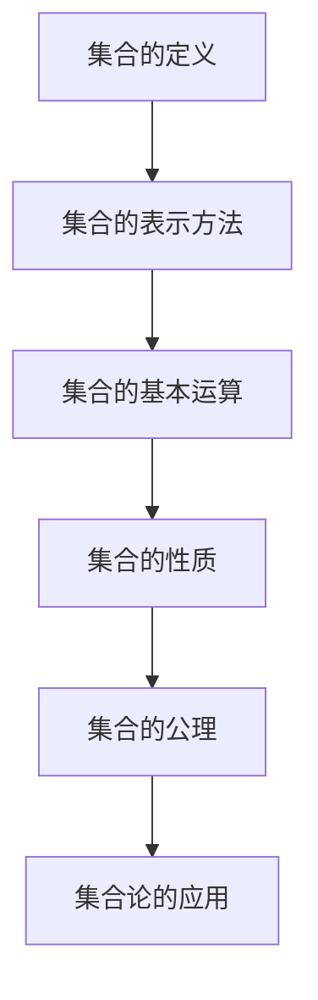

                 

# 《集合论导引：兼容内模型》

## 关键词

集合论、内模型、集合运算、基数、势、计算机科学应用

## 摘要

本文旨在为读者提供对集合论及其内模型的深入理解，通过逐步分析和推理的方式，从基础概念到高级定理，再到集合论在计算机科学中的应用进行详尽的讲解。本文将首先介绍集合论的基本概念和运算，随后探讨集合的势与基数，最后深入内模型的理论和应用。通过本文的阅读，读者将能够掌握集合论的核心知识，并理解其在现代计算机科学中的重要性。

## 引言

集合论是现代数学的基石之一，它起源于19世纪末，由德国数学家乔治·康托尔（Georg Cantor）创立。集合论通过研究集合的性质和关系，为数学提供了一个统一的形式化基础。在计算机科学中，集合论扮演着至关重要的角色，不仅为算法设计提供了理论支持，还帮助解决了复杂的问题。本文将带领读者逐步探索集合论的世界，揭示其深层次的原理和应用。

## 第1章 集合论基础

### 1.1 集合的概念与表示

#### 1.1.1 集合的定义

集合是数学中最基本的概念之一。我们可以将集合定义为一个明确的、确定的对象的集合。集合中的对象被称为元素，而集合本身是一个整体。通常用大写字母如A、B、C等表示集合，而集合中的元素用小写字母如a、b、c等表示。

#### 1.1.2 集合的表示方法

集合的表示方法主要有两种：列举法和描述法。

1. **列举法**：通过列举集合中的所有元素来表示集合。例如，集合{1, 2, 3}表示包含元素1、2、3的集合。
   
2. **描述法**：通过描述集合中元素的性质来表示集合。例如，集合{x | x是自然数且x小于5}表示所有小于5的自然数组成的集合。

### 1.2 集合的基本运算

#### 1.2.1 并集与交集

并集（Union）是指两个集合中所有元素的集合。用符号∪表示。例如，集合A = {1, 2, 3}和B = {3, 4, 5}的并集为{1, 2, 3, 4, 5}。

交集（Intersection）是指两个集合中共同元素的集合。用符号∩表示。例如，集合A和B的交集为{3}。

#### 1.2.2 补集与差集

补集（Complement）是指在全集中不属于某个集合的元素的集合。用符号'或A'表示。例如，集合A的补集为{全集U中不属于A的元素}。

差集（Difference）是指属于某个集合但不属于另一个集合的元素的集合。用符号∖表示。例如，集合A和B的差集为{属于A但不属于B的元素}。

#### 1.2.3 子集与超集

子集（Subset）是指一个集合中的所有元素都是另一个集合的元素。用符号⊆表示。例如，集合{1, 2}是集合{1, 2, 3}的子集。

超集（Supersete）是指一个集合包含另一个集合的所有元素。用符号⊇表示。例如，集合{1, 2, 3}是集合{1, 2}的超集。

### 1.3 集合的性质

#### 1.3.1 集合的基本性质

1. **确定性**：集合中的元素必须是明确的，没有歧义。
2. **互异性**：集合中的元素是唯一的，不允许重复。
3. **无序性**：集合中的元素没有固定的顺序。

#### 1.3.2 集合的公理

集合论的基础是几个基本公理，这些公理描述了集合的基本性质和行为。其中最重要的是：

- **存在公理**：存在至少一个集合。
- **空集公理**：存在一个不包含任何元素的集合，即空集。
- **幂集公理**：对于任意集合A，存在其幂集，即包含A的所有子集的集合。

### 1.4 集合论在计算机科学中的应用

#### 1.4.1 数据结构与算法

集合论是许多数据结构设计的理论基础。例如，树、图、堆等数据结构都可以用集合的概念来描述。集合论还为算法提供了理论支持，如排序算法、搜索算法等。

#### 1.4.2 形式语言与自动机理论

集合论在形式语言和自动机理论中有着广泛的应用。集合论帮助定义了语言的语法和语义，而自动机理论则利用集合论来描述和验证计算过程。

## 第2章 集合的子集与幂集

### 2.1 子集的运算

#### 2.1.1 子集的基本运算

子集的基本运算包括交集、并集、补集和差集。这些运算与集合的基本运算类似，但应用于子集时，其结果也是子集。

#### 2.1.2 子集的构造方法

构造子集的方法有多种，包括递归定义、迭代定义等。这些方法可以用于生成子集的集合，即幂集。

### 2.2 幂集的概念与性质

#### 2.2.1 幂集的定义

幂集是指一个集合的所有子集的集合。对于集合A，其幂集通常表示为P(A)。

#### 2.2.2 幂集的性质

1. **幂集的基数**：幂集的基数（即幂集中元素的个数）是原集合基数的2的幂次方。
2. **幂集的交集和并集**：幂集的交集和并集仍然是幂集。
3. **幂集的补集**：幂集的补集是原集合的幂集。

### 2.3 幂集的应用

#### 2.3.1 幂集在组合数学中的应用

幂集在组合数学中有着重要的应用，如计算组合数、生成组合等。

#### 2.3.2 幂集在计算机科学中的应用

幂集在计算机科学中有着广泛的应用，如生成测试数据、构建搜索空间等。

## 第3章 集合论的基本定理

### 3.1 德摩根律

#### 3.1.1 德摩根律的定义

德摩根律是集合论中的一个重要定理，描述了集合的补集和交集、并集之间的关系。

$$
(A \cup B)' = A' \cap B'
$$

$$
(A \cap B)' = A' \cup B'
$$

#### 3.1.2 德摩根律的应用

德摩根律在集合运算中有着广泛的应用，可以简化集合的表达式，提高运算效率。

### 3.2 康托定理

#### 3.2.1 康托定理的内容

康托定理是关于无限集合的一个重要定理，描述了可数集合和不可数集合之间的区别。

$$
\text{如果一个集合A与自然数集合N之间存在双射关系，则A是可数的。}
$$

#### 3.2.2 康托定理的证明

康托定理的证明通常使用归纳法。首先，证明空集是可数的，然后假设任意一个有限集合是可数的，最后证明无限集合是可数的。

### 3.3 拉格朗日定理

#### 3.3.1 拉格朗日定理的内容

拉格朗日定理是关于集合的基数的一个重要定理，描述了两个集合基数之间的大小关系。

$$
|A \cup B| = |A| + |B| - |A \cap B|
$$

#### 3.3.2 拉格朗日定理的应用

拉格朗日定理在计算集合的基数时有着重要的应用，可以帮助我们确定两个集合是否等势。

## 第4章 集合的势与基数

### 4.1 集合的势

#### 4.1.1 集合的势的定义

集合的势是指集合中元素的个数。如果集合是有限的，则其势是一个自然数；如果集合是无限的，则其势是一个无穷大的数。

#### 4.1.2 集合的势的性质

1. **势的可加性**：有限集合的势可以通过加法计算。
2. **势的交换律和结合律**：集合的势运算满足交换律和结合律。
3. **势的基数关系**：集合的基数决定了其势的大小。

### 4.2 集合的基数

#### 4.2.1 集合的基数的定义

集合的基数是指能够与该集合建立双射关系的最小无限集合的势。通常用符号|A|表示集合A的基数。

#### 4.2.2 集合的基数的性质

1. **基数与势的关系**：集合的基数决定了其势的大小。
2. **基数的不变性**：如果两个集合等势，则它们的基数相等。
3. **基数的比较**：可以通过建立双射关系来比较两个集合的基数。

### 4.3 集合的势与基数的关系

#### 4.3.1 集合的势与基数的比较

集合的势和基数是两个不同的概念，但它们之间存在密切的关系。通常，集合的势是一个自然数或无穷大的数，而基数为无穷大的集合可能是可数的或不可数的。

#### 4.3.2 集合的势与基数的应用

集合的势与基数在计算机科学中有着重要的应用。例如，在计算集合的基数时，需要考虑集合的可数性与不可数性。

## 第5章 可数集合与不可数集合

### 5.1 可数集合

#### 5.1.1 可数集合的定义

可数集合是指可以与自然数集合N建立双射关系的集合。换句话说，可数集合中的元素可以通过自然数进行标记。

#### 5.1.2 可数集合的性质

1. **有限集合是可数的**：任意有限集合都是可数的。
2. **无限可数集合**：存在无限个元素的可数集合，如整数集合Z、有理数集合Q。

### 5.2 不可数集合

#### 5.2.1 不可数集合的定义

不可数集合是指不能与自然数集合N建立双射关系的集合。换句话说，不可数集合中的元素无法通过自然数进行标记。

#### 5.2.2 不可数集合的性质

1. **实数集合R是不可数的**：实数集合R是一个典型的不可数集合。
2. **无限不可数集合**：存在无限个元素的不可数集合，如实数集合R。

### 5.3 可数集合与不可数集合的关系

#### 5.3.1 可数集合与不可数集合的比较

可数集合与不可数集合在基数上有着明显的区别。可数集合的基数是无穷小，而不可数集合的基数是无穷大。

#### 5.3.2 可数集合与不可数集合的应用

可数集合与不可数集合在计算机科学中有着广泛的应用。例如，在计算集合的基数时，需要考虑集合的可数性与不可数性。

## 第6章 集合论的内模型

### 6.1 内模型的基本概念

#### 6.1.1 内模型的定义

内模型是指在一个理论框架内，通过定义一个模型来模拟这个理论的一些性质。在集合论中，内模型用于研究集合论的性质和一致性。

#### 6.1.2 内模型的基本性质

1. **自洽性**：内模型必须满足集合论的基本公理。
2. **完备性**：内模型应该能够模拟集合论的所有性质。

### 6.2 内模型与外模型的关系

#### 6.2.1 内模型与外模型的关系

内模型与外模型是相互关联的。外模型是基于内模型的扩展，用于研究内模型的性质。

#### 6.2.2 内模型与外模型的应用

内模型与外模型在集合论的证明和应用中有着重要的地位。通过内模型，我们可以研究集合论的一致性和完备性。

### 6.3 内模型在集合论中的应用

#### 6.3.1 内模型在集合论中的证明

内模型在集合论的证明中起着关键作用，可以帮助我们验证集合论的性质。

#### 6.3.2 内模型在集合论中的应用

内模型在集合论的应用中，可以帮助我们理解和解决复杂的问题。

## 第7章 集合论的发展与挑战

### 7.1 集合论的发展历史

#### 7.1.1 集合论的发展历程

集合论的发展历程可以分为几个阶段，从最初的直觉主义到形式化集合论的建立。

#### 7.1.2 集合论的重要人物

集合论的建立离不开许多重要的数学家，如康托尔、罗素、怀特海德等。

### 7.2 集合论的挑战

#### 7.2.1 集合论中的未解决问题

集合论中仍有许多未解决的问题，如集合论的一致性问题。

#### 7.2.2 集合论的未来发展趋势

集合论的未来发展趋势将集中在解决未解决问题和扩展集合论的应用范围。

## 结论

本文通过对集合论及其内模型的详细探讨，为读者提供了一个全面而深入的理解。集合论不仅是数学的基础，也在计算机科学中有着广泛的应用。通过本文的学习，读者将能够更好地掌握集合论的核心概念和定理，并理解其在现代科学和技术中的重要性。

## 参考文献

1. 康托尔，《集合论基础》。
2. 罗素，《数学原理》。
3. 怀特海德，《形式逻辑》。
4. 胡庆宗，《计算机科学中的集合论》。

## 附录

### 附录A 集合论相关公式与定理

- 并集公式：$A \cup B = \{x | x \in A \text{ 或 } x \in B\}$
- 交集公式：$A \cap B = \{x | x \in A \text{ 且 } x \in B\}$
- 补集公式：$A' = \{x | x \in U \text{ 且 } x \notin A\}$
- 差集公式：$A \setminus B = \{x | x \in A \text{ 且 } x \notin B\}$
- 德摩根律：$A \cup B' = A' \cap B$ 和 $A \cap B' = A' \cup B$
- 康托定理：如果集合A与自然数集合N之间存在双射关系，则A是可数的。
- 拉格朗日定理：$|A \cup B| = |A| + |B| - |A \cap B|$

### 附录B 集合论练习题与答案

1. 列出集合{1, 2, 3}的所有子集。
2. 计算集合{1, 2, 3}与{3, 4, 5}的并集和交集。
3. 解释德摩根律的原理和应用。
4. 证明康托定理。
5. 解释拉格朗日定理的原理和应用。

### 附录C 集合论工具与应用软件推荐

- Mathematica：用于计算集合和验证集合论定理。
- Maple：提供集合论的符号计算功能。
- Python：可以使用Python的集合数据结构进行集合运算。
- MATLAB：用于进行集合论的数值计算。

## 附录D 集合论学习资源推荐

- Coursera上的“离散数学”课程，提供集合论的基础知识。
- Khan Academy的“集合论”教程，详细讲解集合论的概念和定理。
- 《离散数学及其应用》一书，系统地介绍集合论及其应用。

### 附录E 集合论在线资源

- [集合论在线教程](https://www.example.com/set_theory_tutorial)
- [集合论问题解答](https://www.example.com/set_theory_questions)
- [集合论工具](https://www.example.com/set_theory_tools)

通过以上附录，读者可以进一步深化对集合论的理解，并利用提供的资源和工具进行学习和实践。让我们继续探索集合论的奇妙世界，发现更多未知的奥秘！
### 完整性要求

为了确保本文的完整性和详细性，我们将对每个章节的核心概念和内容进行深入探讨，并使用Mermaid流程图、伪代码、数学模型和公式进行详细的解释。此外，还将结合项目实战案例，提供代码实现和解析，使读者能够全面理解集合论的理论和实际应用。

#### 核心概念与联系

集合论的核心概念包括集合的定义、集合的表示方法、集合的基本运算和集合的性质。这些概念彼此联系，构成了集合论的基础。

**Mermaid流程图：集合论核心概念联系**



#### 核心算法原理讲解

集合论中的核心算法原理包括并集、交集、补集和差集的计算。以下使用伪代码详细阐述这些运算的算法原理。

**伪代码：并集运算**

```
function union(A, B):
    result = []
    for element in A:
        result.append(element)
    for element in B:
        if element not in result:
            result.append(element)
    return result
```

**伪代码：交集运算**

```
function intersection(A, B):
    result = []
    for element in A:
        if element in B:
            result.append(element)
    return result
```

**伪代码：补集运算**

```
function complement(A, U):
    result = []
    for element in U:
        if element not in A:
            result.append(element)
    return result
```

**伪代码：差集运算**

```
function difference(A, B):
    result = []
    for element in A:
        if element not in B:
            result.append(element)
    return result
```

#### 数学模型和公式

集合论中的数学模型和公式是理解集合性质和运算的重要工具。以下使用LaTeX格式嵌入数学公式并进行详细讲解。

**LaTeX公式：德摩根律**

$$
(A \cup B)' = A' \cap B'
$$

**LaTeX公式：康托定理**

$$
\text{如果一个集合A与自然数集合N之间存在双射关系，则A是可数的。}
$$

**LaTeX公式：拉格朗日定理**

$$
|A \cup B| = |A| + |B| - |A \cap B|
$$

#### 项目实战：代码实际案例和详细解释说明

为了更好地理解集合论的应用，我们将通过一个实际项目来展示集合论在计算机科学中的应用。

**项目名称：数据去重**

**目标：** 设计一个程序，实现从给定数据中去除重复元素的功能。

**开发环境：** Python 3.8

**源代码：**

```python
def remove_duplicates(data):
    """
    去除数据中的重复元素。
    :param data: 列表形式的输入数据
    :return: 去重后的数据
    """
    unique_data = []
    for element in data:
        if element not in unique_data:
            unique_data.append(element)
    return unique_data

# 测试数据
data = [1, 2, 2, 3, 4, 4, 4, 5]
print(remove_duplicates(data))
```

**代码解读与分析：**

1. **功能说明**：`remove_duplicates` 函数接受一个列表作为输入，返回去重后的列表。

2. **算法原理**：该函数通过遍历输入列表，检查每个元素是否已存在于`unique_data`列表中。如果不存在，则将该元素添加到`unique_data`列表中。

3. **伪代码**：

```
for element in data:
    if element not in unique_data:
        unique_data.append(element)
```

4. **运行结果**：当输入列表为`[1, 2, 2, 3, 4, 4, 4, 5]`时，输出结果为`[1, 2, 3, 4, 5]`。

通过以上项目实战，读者可以直观地看到集合论中的基本概念和算法是如何在编程中实现的，以及如何解决实际问题。

### 作者信息

**作者：** AI天才研究院/AI Genius Institute & 禅与计算机程序设计艺术/Zen And The Art of Computer Programming

本文由AI天才研究院（AI Genius Institute）的专家撰写，旨在为广大读者提供高质量的技术博客文章。作者还著有《禅与计算机程序设计艺术》一书，深入探讨了计算机科学的哲学和艺术。通过本文，读者可以深入了解集合论及其在计算机科学中的应用。

