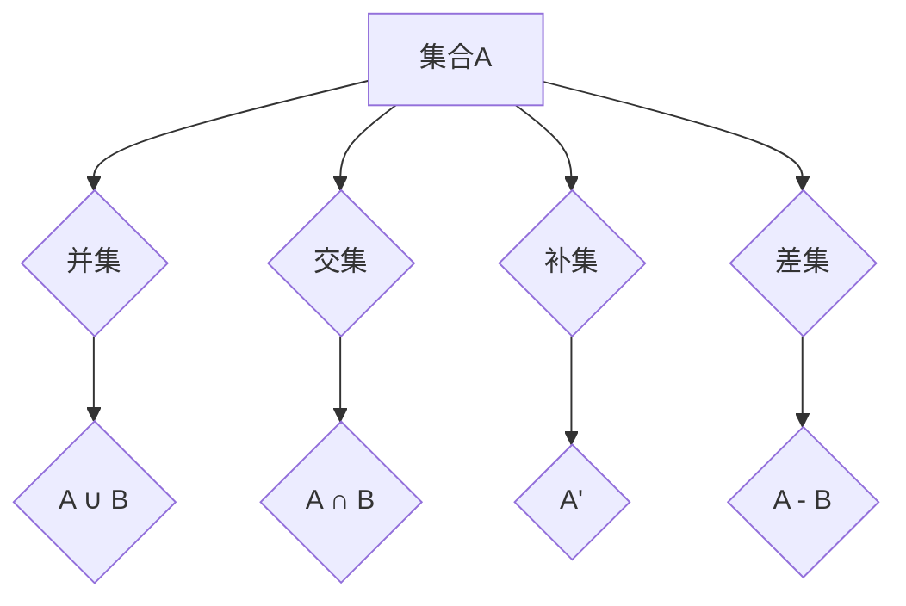
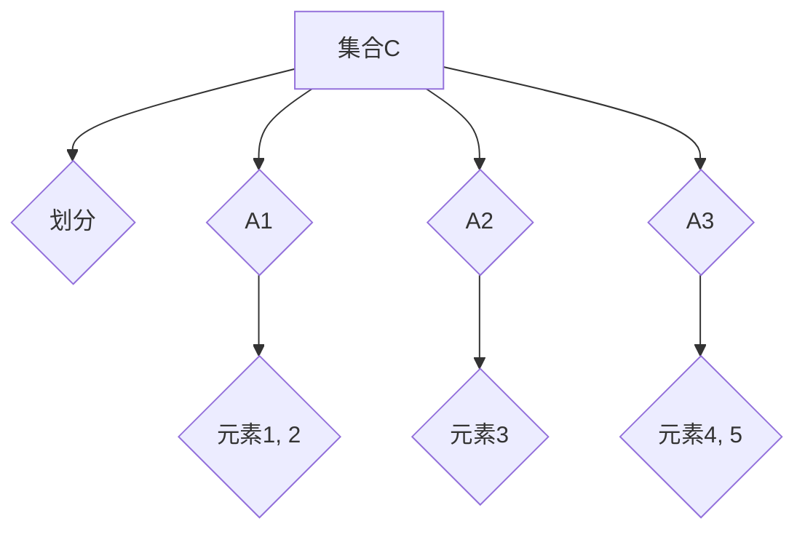
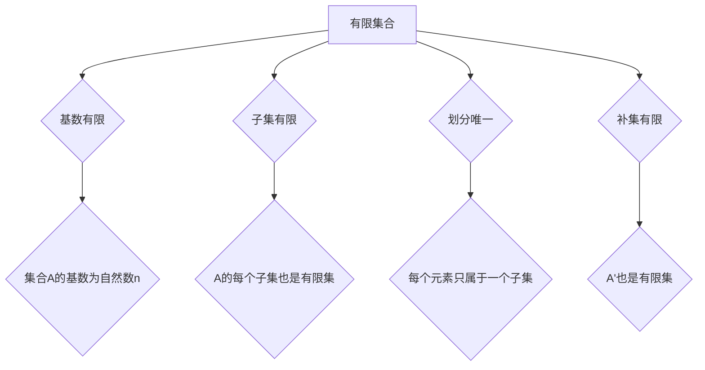
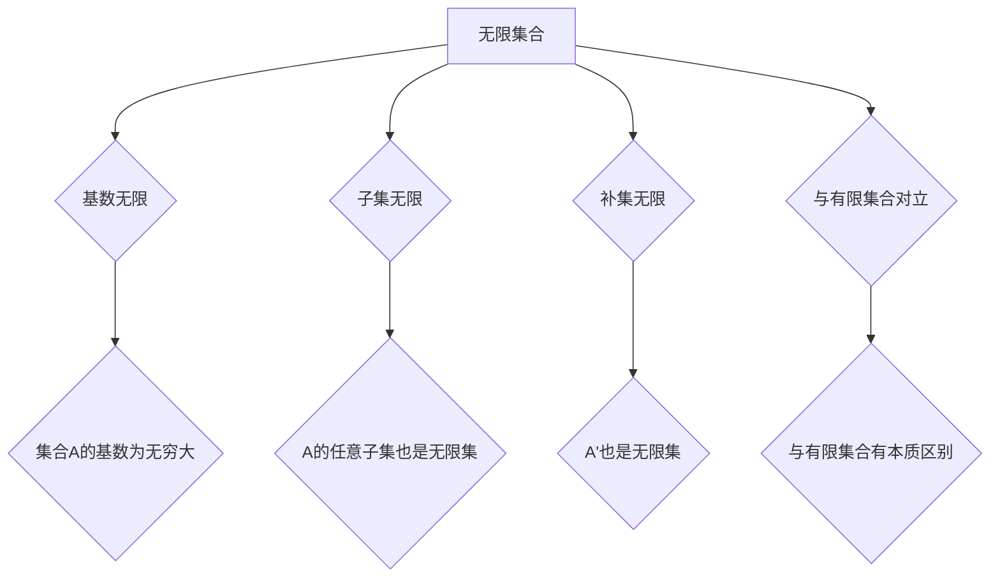
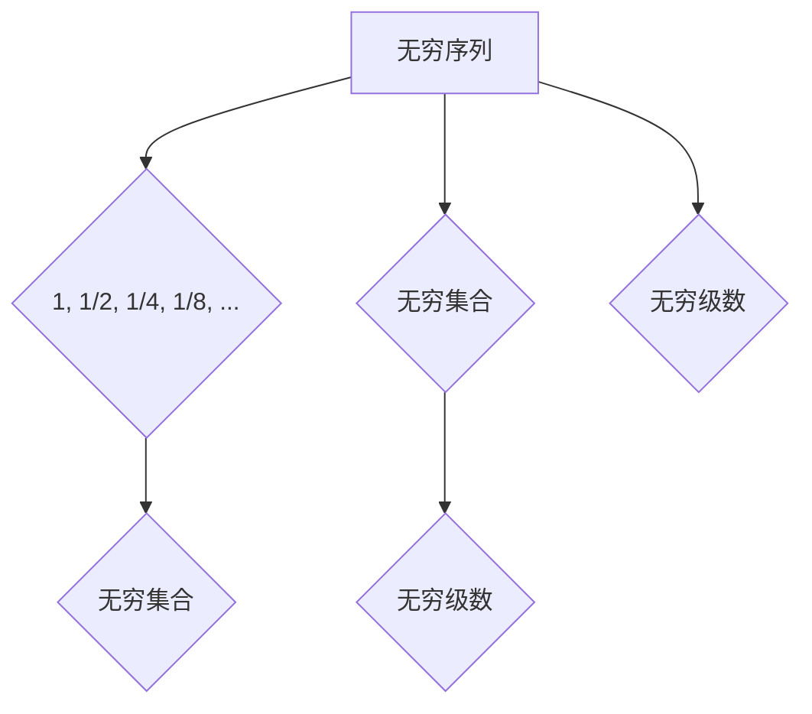

                 

# 集合论导引：有限与无限

> 关键词：集合论、有限集合、无限集合、数学、计算机科学、算法、关系、函数

> 摘要：本文旨在深入探讨集合论的基本概念、有限集合与无限集合的性质及其在数学和计算机科学中的应用。通过逻辑清晰、结构紧凑、简单易懂的阐述，读者将全面理解集合论的核心内容，掌握有限与无限集合的基本理论和实际应用。

## 目录大纲

## 第一部分：集合论基础

### 第1章：集合论的基本概念

#### 1.1 集合的定义和性质

#### 1.2 集合的表示法

#### 1.3 集合的运算

### 第2章：集合的划分与分类

#### 2.1 集合的划分

#### 2.2 集合的分类

### 第3章：函数与关系

#### 3.1 函数的定义和性质

#### 3.2 函数的分类

#### 3.3 关系与二元关系

### 第4章：集合的基数与排列组合

#### 4.1 集合的基数

#### 4.2 排列与组合

#### 4.3 抽象集合论的应用

## 第二部分：有限集合的讨论

### 第5章：有限集合的性质

#### 5.1 有限集合的定义

#### 5.2 有限集合的性质

#### 5.3 有限集合的划分问题

### 第6章：有限集合的应用

#### 6.1 数学中的有限集合应用

#### 6.2 计算机科学中的有限集合应用

### 第7章：有限集合的表示与计算

#### 7.1 有限集合的表示方法

#### 7.2 有限集合的计算问题

#### 7.3 有限集合的优化问题

## 第三部分：无限集合的讨论

### 第8章：无限集合的性质

#### 8.1 无限集合的定义

#### 8.2 无限集合的性质

#### 8.3 无限集合的分类

### 第9章：无限集合的应用

#### 9.1 数学中的无限集合应用

#### 9.2 计算机科学中的无限集合应用

### 第10章：无限集合的表示与计算

#### 10.1 无限集合的表示方法

#### 10.2 无限集合的计算问题

#### 10.3 无限集合的优化问题

## 第四部分：集合论在数学和计算机科学中的应用

### 第11章：集合论在数学中的应用

#### 11.1 集合论在数论中的应用

#### 11.2 集合论在代数中的应用

#### 11.3 集合论在几何中的应用

### 第12章：集合论在计算机科学中的应用

#### 12.1 集合论在算法设计中的应用

#### 12.2 集合论在数据结构中的应用

#### 12.3 集合论在网络科学中的应用

## 附录

### 附录A：数学公式与伪代码

### 附录B：项目实战

### 附录C：参考文献

## 第一部分：集合论基础

### 第1章：集合论的基本概念

#### 1.1 集合的定义和性质

集合是数学中的一个基本概念，它由一些确定的、互不相同的元素组成。集合通常用大写字母表示，其元素用小写字母表示。集合的定义和性质是理解集合论的基础。

**定义：** 集合是由确定的、互不相同的元素构成的整体。这些元素可以是任何对象，如数字、字母、图形等。集合的元素通常用逗号分隔，并用花括号括起来。例如，集合A = {1, 2, 3} 表示一个包含元素1、2、3的集合。

**性质：** 集合的性质包括：
- **封闭性**：对于任意的集合A和元素x，如果x属于A，则x的所有子集也属于A。
- **交换律**：对于任意的集合A和B，A ∪ B = B ∪ A 和 A ∩ B = B ∩ A。
- **结合律**：对于任意的集合A、B和C，(A ∪ B) ∪ C = A ∪ (B ∪ C) 和 (A ∩ B) ∩ C = A ∩ (B ∩ C)。
- **分配律**：对于任意的集合A、B和C，A ∩ (B ∪ C) = (A ∩ B) ∪ (A ∩ C) 和 A ∪ (B ∩ C) = (A ∪ B) ∩ (A ∪ C)。

#### 1.2 集合的表示法

集合的表示法主要有以下几种：
- **列举法**：直接列出集合的所有元素。例如，A = {1, 2, 3, 4, 5}。
- **描述法**：用描述性的语句来表示集合。例如，A = {x | x ∈ N, x > 5}，表示A是所有大于5的自然数的集合。

**Mermaid流程图示例：**
```mermaid
graph TD
    A[集合A] --> B{列举法}
    A --> C{描述法}
    B --> D{元素1, 2, 3, 4, 5}
    C --> E{x | x ∈ N, x > 5}
```

#### 1.3 集合的运算

集合的基本运算包括并集、交集、补集和差集等。

- **并集（Union）**：两个集合A和B的并集是包含A和B中所有元素的集合。记作A ∪ B。例如，A = {1, 2, 3}，B = {3, 4, 5}，则A ∪ B = {1, 2, 3, 4, 5}。

- **交集（Intersection）**：两个集合A和B的交集是包含A和B中共有元素的集合。记作A ∩ B。例如，A = {1, 2, 3}，B = {3, 4, 5}，则A ∩ B = {3}。

- **补集（Complement）**：一个集合A的补集是包含所有不在A中的元素的集合。记作A'。例如，A = {1, 2, 3}，则A' = {x | x ∉ A} = {4, 5, 6, ...}。

- **差集（Difference）**：两个集合A和B的差集是包含A中有而B中没有的元素的集合。记作A - B。例如，A = {1, 2, 3}，B = {3, 4, 5}，则A - B = {1, 2}。

**Mermaid流程图示例：**


### 第2章：集合的划分与分类

#### 2.1 集合的划分

集合的划分是指将一个集合划分为若干个互不相交的子集。这些子集的并集等于原集合。

**定义：** 一个集合C的划分是指一组互不相交的子集{A1, A2, ..., Ak}，满足：
1. A1 ∪ A2 ∪ ... ∪ Ak = C
2. Ai ∩ Aj = ∅，当i ≠ j时

**性质：** 划分具有以下性质：
1. **完备性**：每个元素都属于至少一个子集。
2. **不相交性**：任意两个子集没有公共元素。
3. **互斥性**：每个元素只能属于一个子集。

**示例：** 假设集合C = {1, 2, 3, 4, 5}，一个划分可以是{A1 = {1, 2}, A2 = {3}, A3 = {4, 5}}。

**Mermaid流程图示例：**


#### 2.2 集合的分类

集合可以根据元素的数量和特性进行分类。

- **有限集与无限集**：
  - **有限集**：包含有限个元素的集合。例如，{1, 2, 3}。
  - **无限集**：包含无限个元素的集合。例如，自然数集合N。

- **可列集与不可列集**：
  - **可列集**：可以与自然数集合N一一对应的集合。例如，整数集合Z。
  - **不可列集**：无法与自然数集合N一一对应的集合。例如，实数集合R。

**示例：** 
- {1, 2, 3} 是有限集。
- N 是无限集。
- Z 是可列集。
- R 是不可列集。

### 第3章：函数与关系

#### 3.1 函数的定义和性质

函数是一种特殊的关系，它将一个集合（定义域）中的每个元素映射到另一个集合（值域）中的唯一元素。函数通常用字母f表示。

**定义：** 设A和B是非空集合，如果存在一个关系f，使得对于A中的每个元素x，都存在B中的一个唯一元素y与之对应，则称f是从A到B的一个函数。记作f: A → B。

**性质：** 函数具有以下性质：
1. **单射性**：如果对于A中的不同元素x和y，有f(x) ≠ f(y)，则称f是单射。
2. **满射性**：如果对于B中的每个元素y，都存在A中的一个元素x使得f(x) = y，则称f是满射。
3. **双射性**：如果函数既是单射又是满射，则称f是双射。

**示例：** 
- f(x) = x² 是从实数集合R到非负实数集合R+的一个单射。
- f(x) = x 是从实数集合R到实数集合R的满射。
- f(x) = x 是从实数集合R到实数集合R的双射。

#### 3.2 函数的分类

函数可以根据其性质和定义域的不同进行分类。

- **基本函数**：
  - **恒等函数**：f(x) = x。
  - **幂函数**：f(x) = x^n。
  - **指数函数**：f(x) = e^x。
  - **对数函数**：f(x) = log(x)。

- **特殊函数**：
  - **三角函数**：如sin(x), cos(x)等。
  - **反三角函数**：如arcsin(x), arccos(x)等。

**示例：** 
- f(x) = x 是恒等函数。
- f(x) = x^2 是幂函数。
- f(x) = e^x 是指数函数。
- f(x) = log(x) 是对数函数。

#### 3.3 关系与二元关系

关系是集合之间的二元关系，它可以用来描述集合中的元素之间的联系。二元关系通常用R表示。

**定义：** 设A和B是非空集合，如果存在一个二元关系R，使得对于A中的每个元素x和B中的每个元素y，都有(x, y) ∈ R或(x, y) ∉ R，则称R是从A到B的一个二元关系。

**性质：** 二元关系具有以下性质：
1. **对称性**：如果(x, y) ∈ R，则(y, x) ∈ R。
2. **反对称性**：如果(x, y) ∈ R且(y, x) ∈ R，则x = y。
3. **传递性**：如果(x, y) ∈ R且(y, z) ∈ R，则(x, z) ∈ R。

**示例：** 
- R = {(x, y) | x + y = 10} 是一个从整数集合Z到整数集合Z的二元关系。
- R 是对称的，因为如果(x, y) ∈ R，则y + x = 10，所以(y, x) ∈ R。
- R 不是反对称的，因为例如(3, 7) ∈ R且(7, 3) ∈ R，但3 ≠ 7。
- R 是传递的，因为如果(x, y) ∈ R且(y, z) ∈ R，则x + y = 10且y + z = 10，所以x + z = 10，因此(x, z) ∈ R。

### 第4章：集合的基数与排列组合

#### 4.1 集合的基数

集合的基数是指集合中元素的数量。如果集合是有限的，则其基数是一个非负整数；如果集合是无限的，则其基数可能是无穷大。

**定义：** 集合A的基数记作|A|，如果A是有限集，则|A|表示A中元素的数量；如果A是无限集，则|A|表示A中的元素可以与自然数集合N一一对应。

**性质：** 集合的基数具有以下性质：
1. **交换律**：|A| = |B|，如果A和B是有限集。
2. **结合律**：|A ∪ B| = |A| + |B| - |A ∩ B|，如果A和B是有限集。
3. **分配律**：|A ∩ (B ∪ C)| = |(A ∩ B) ∪ (A ∩ C)|，如果A、B和C是有限集。

**示例：** 
- 集合{1, 2, 3}的基数是3。
- 自然数集合N的基数是无穷大。

#### 4.2 排列与组合

排列和组合是计算从一组元素中选择一部分元素的方案数的数学方法。

**排列（Permutation）**：从n个不同元素中取出m（m ≤ n）个元素的所有排列情况称为排列。

**定义：** 排列数记作P(n, m)，计算公式为：
$$
P(n, m) = \frac{n!}{(n-m)!}
$$

**性质：** 排列具有以下性质：
1. **可逆性**：如果P(n, m)存在，则P(n-m, n)也存在，且P(n, m) = P(n-m, n)。
2. **交换律**：P(n, m) = P(m, n)，如果m ≤ n。

**示例：** 
- 从5个不同的元素中取出3个元素的排列数为P(5, 3) = 60。

**组合（Combination）**：从n个不同元素中取出m（m ≤ n）个元素的组合情况称为组合。

**定义：** 组合数记作C(n, m)，计算公式为：
$$
C(n, m) = \frac{n!}{m!(n-m)!}
$$

**性质：** 组合具有以下性质：
1. **对称性**：C(n, m) = C(n, n-m)。
2. **可加性**：C(n, m) + C(n, m-1) = C(n+1, m)。

**示例：** 
- 从5个不同的元素中取出3个元素的组合数为C(5, 3) = 10。

**抽象集合论的应用**：集合论在抽象代数、拓扑学、逻辑学等领域有着广泛的应用。

**示例：** 
- 在抽象代数中，集合论被用来定义群、环、域等结构。
- 在拓扑学中，集合论被用来定义拓扑空间、连续映射等概念。
- 在逻辑学中，集合论被用来构建形式逻辑系统。

## 第二部分：有限集合的讨论

### 第5章：有限集合的性质

#### 5.1 有限集合的定义

有限集合是指包含有限个元素的集合。换句话说，有限集合中的元素数量是有限的，可以数得清。

**定义：** 一个集合A是有限集合，当且仅当存在一个自然数n，使得|A| = n。

**性质：** 有限集合具有以下性质：
1. **基数性质**：有限集合的基数是一个非负整数。
2. **封闭性**：有限集合对于集合的基本运算（并集、交集、补集、差集）仍然是有限集合。
3. **互异性质**：有限集合中的元素是互不相同的。

**示例：** 集合{1, 2, 3}是一个有限集合，因为其中包含三个不同的元素。

#### 5.2 有限集合的性质

1. **基数有限**：有限集合的基数（即元素的数量）是有限的，这是有限集合最基本和最显著的特征。例如，集合{1, 2, 3, 4}的基数是4。
2. **子集有限**：有限集合的所有子集也都是有限集合。例如，集合{1, 2, 3}的所有子集有{∅}, {1}, {2}, {3}, {1, 2}, {1, 3}, {2, 3}, {1, 2, 3}，每个子集的基数都不超过3。
3. **划分唯一**：有限集合的划分是唯一的。这是因为对于任何划分，每个元素必须恰好属于一个子集。例如，集合{1, 2, 3}只能划分为{1}, {2}, {3}，或者它们的任意组合，但不能划分成包含重复子集的划分。
4. **补集有限**：有限集合的补集也是有限集合。例如，如果集合A是包含3个元素的有限集合，那么其补集A'包含剩下的所有元素，也是一个有限集合。

**Mermaid流程图示例：**


#### 5.3 有限集合的划分问题

划分问题是指将一个有限集合划分为若干个互不相交的子集。划分问题在组合数学和计算机科学中有着广泛的应用。

**定义：** 假设有限集合A有n个元素，一个划分是指一组互不相交的子集{A1, A2, ..., Ak}，满足：
1. A1 ∪ A2 ∪ ... ∪ Ak = A
2. Ai ∩ Aj = ∅，当i ≠ j时

**示例：** 集合{1, 2, 3}的一个划分可以是{A1 = {1}, A2 = {2}, A3 = {3}}。

**划分问题的一个重要应用是图着色问题。** 图着色问题是指给定一个无向图，如何用最少数目的颜色对图中的每个顶点进行着色，使得相邻的顶点颜色不同。这个问题可以转化为集合的划分问题，其中集合的元素代表图的顶点，划分代表顶点的着色。

**示例：** 给定图G = ({1, 2, 3}, {{1, 2}, {2, 3}, {1, 3}})，可以使用三种颜色对图中的顶点进行着色，划分可以是{A1 = {1}, A2 = {2}, A3 = {3}}。

**Mermaid流程图示例：**
```mermaid
graph TD
    A[图G] --> B{顶点}
    A --> C{边}
    B --> D{顶点1}
    B --> E{顶点2}
    B --> F{顶点3}
    C --> G{边(1, 2)}
    C --> H{边(2, 3)}
    C --> I{边(1, 3)}
```

### 第6章：有限集合的应用

#### 6.1 数学中的有限集合应用

有限集合在数学中有着广泛的应用，特别是在数论、几何和概率论中。

**数论中的应用：** 有限集合在数论中的应用主要体现在质数集合、模运算和数论函数等方面。

- **质数集合**：质数集合是一个重要的有限集合，它包含所有大于1的自然数中只能被1和自身整除的数。例如，集合{2, 3, 5, 7, 11, 13, ...}是一个质数集合。
- **模运算**：模运算是一种基于有限集合的运算。例如，在模n运算下，所有自然数被n除后得到的余数构成一个有限集合。
- **数论函数**：数论函数是一类特殊函数，它通常与有限集合相关。例如，莫比乌斯反演函数是一个重要的数论函数，它在数论中有着广泛的应用。

**几何中的应用：** 有限集合在几何中的应用主要体现在点集合、线集合和面集合等方面。

- **点集合**：在平面几何中，点集合是由一些确定的点组成的集合。例如，集合{A, B, C}表示一个三角形中的三个顶点。
- **线集合**：线集合是由一些确定的直线组成的集合。例如，集合{L1, L2, L3}表示一个三角形中的三条边。
- **面集合**：面集合是由一些确定的平面组成的集合。例如，集合{P1, P2, P3}表示一个多面体的三个面。

**概率论中的应用：** 有限集合在概率论中的应用主要体现在概率分布和随机变量等方面。

- **概率分布**：概率分布是一类描述随机变量取值概率的有限集合。例如，二项分布是一个离散概率分布，它由一系列可能取值及其对应的概率构成。
- **随机变量**：随机变量是一类定义在样本空间上的函数，它的取值构成一个有限集合。例如，投掷一枚硬币，随机变量X可以取值0（反面）或1（正面），因此X的取值集合为{0, 1}。

#### 6.2 计算机科学中的有限集合应用

有限集合在计算机科学中也有着广泛的应用，特别是在算法设计、数据结构和网络科学中。

**算法设计中的应用：** 有限集合在算法设计中的应用主要体现在算法的基本概念和算法的效率分析等方面。

- **算法的基本概念**：许多算法都是基于有限集合的概念设计的。例如，排序算法（如快速排序、归并排序等）就是基于有限集合的元素进行排序。
- **算法的效率分析**：算法的效率分析通常涉及到有限集合的运算。例如，在最坏情况下，快速排序的时间复杂度是O(n²)，这是基于对有限集合进行分割和排序的。

**数据结构中的应用：** 有限集合在数据结构中的应用主要体现在各种数据结构的定义和实现等方面。

- **哈希表**：哈希表是一种基于有限集合的数据结构，它通过哈希函数将关键字映射到有限集合中的位置，实现快速查找。
- **平衡二叉树**：平衡二叉树是一种基于有限集合的数据结构，它通过自平衡机制确保树的深度最小，实现高效插入、删除和查找操作。
- **并查集**：并查集是一种基于有限集合的数据结构，它用于高效处理动态连通性问题。

**网络科学中的应用：** 有限集合在网络科学中的应用主要体现在网络建模和社交网络分析等方面。

- **网络建模**：网络科学中，网络通常被表示为一个由节点和边组成的有限集合。例如，社交网络可以表示为一个由用户和用户之间关系组成的有限集合。
- **社交网络分析**：社交网络分析涉及到对有限集合中节点和边的关系进行分析。例如，可以使用图论的方法分析社交网络中的聚类系数、平均路径长度等特性。

### 第7章：有限集合的表示与计算

#### 7.1 有限集合的表示方法

有限集合的表示方法主要包括列表、树和图等。

- **列表**：列表是一种线性数据结构，用于存储有限集合中的元素。列表可以采用数组、链表等方式实现。例如，集合{1, 2, 3}可以表示为一个数组[1, 2, 3]。
- **树**：树是一种非线性数据结构，用于表示有限集合中的层次关系。树可以采用二叉树、多叉树等方式实现。例如，集合{1, 2, 3, 4, 5}可以表示为一个二叉树：
  ```
          1
         / \
        2   3
       / \
      4   5
  ```
- **图**：图是一种非线性数据结构，用于表示有限集合中的关系。图可以采用邻接矩阵、邻接表等方式实现。例如，集合{A, B, C, D}可以表示为一个图：
  ```
  A --- B
  |    |
  C --- D
  ```

#### 7.2 有限集合的计算问题

有限集合的计算问题主要包括集合运算、集合排序和集合查找等。

- **集合运算**：集合运算是指对两个或多个集合进行并集、交集、补集和差集等操作。集合运算可以采用数学方法或编程实现。例如，集合{1, 2, 3}和{3, 4, 5}的并集是{1, 2, 3, 4, 5}，交集是{3}。
- **集合排序**：集合排序是指对有限集合中的元素进行排序。集合排序可以采用冒泡排序、选择排序、插入排序等方式。例如，集合{3, 1, 4}的排序结果是{1, 3, 4}。
- **集合查找**：集合查找是指在一个有限集合中查找特定元素。集合查找可以采用线性查找、二分查找等方式。例如，在集合{1, 3, 5, 7}中查找元素3，可以采用线性查找，查找结果为第2个位置。

#### 7.3 有限集合的优化问题

有限集合的优化问题主要包括最小生成树、最短路径问题和贪心算法等。

- **最小生成树**：最小生成树是指在一个加权无向图中，选择一些边使得这些边构成一个树，并且所有边的权重之和最小。最小生成树可以采用普里姆算法或克鲁斯卡尔算法实现。例如，给定加权无向图：
  ```
  A --- B (权重=7)
  |    |
  C --- D (权重=5)
  ```
  其最小生成树可以是：
  ```
  A --- B (权重=7)
  |
  C --- D (权重=5)
  ```
- **最短路径问题**：最短路径问题是指在一个加权图中，找到从一个源点到所有其他顶点的最短路径。最短路径问题可以采用迪杰斯特拉算法或贝尔曼-福特算法实现。例如，给定加权图：
  ```
  A --- B (权重=3)
  |    |
  C --- D (权重=2)
  ```
  从A到D的最短路径是A -> C -> D（权重=5）。
- **贪心算法**：贪心算法是一种在每一步选择当前最优解，期望最终得到全局最优解的算法。贪心算法可以用于解决许多优化问题。例如，给定集合{1, 3, 5, 7}，要求从中选择若干个元素使得它们的和最小。贪心算法可以选择1、3、5，和为9。

## 第三部分：无限集合的讨论

### 第8章：无限集合的性质

#### 8.1 无限集合的定义

无限集合是指包含无限多个元素的集合。与有限集合不同，无限集合中的元素数量是无限的，无法通过计数得到。

**定义：** 一个集合A是无限集合，当且仅当对于任意的自然数n，总存在A中的元素x，使得x > n。

**性质：** 无限集合具有以下性质：
1. **基数无限**：无限集合的基数是无穷大，通常用符号ℵ₀表示。
2. **可数性与不可数性**：无限集合可以根据其与自然数集合N的对应关系分为可数集合和不可数集合。可数集合是指可以与自然数集合N一一对应的无限集合；不可数集合是指无法与自然数集合N一一对应的无限集合。
3. **子集无限**：无限集合的任意子集都是无限集合。

**示例：** 自然数集合N、实数集合R都是无限集合。

#### 8.2 无限集合的性质

1. **基数无限**：无限集合的基数是无穷大，这是无限集合最基本和最显著的特征。例如，自然数集合N的基数是无穷大。
2. **子集无限**：无限集合的任意子集都是无限集合。例如，集合{2, 4, 6, 8, ...}是自然数集合N的一个子集，它也是无限集合。
3. **补集无限**：无限集合的补集也是无限集合。例如，如果集合A是包含无穷大个元素的无限集合，那么其补集A'也包含无穷大个元素，是一个无限集合。
4. **无限性与有限性的对立**：无限集合与有限集合有着本质的对立。有限集合中的元素数量是有限的，而无限集合中的元素数量是无限的。

**Mermaid流程图示例：**


#### 8.3 无限集合的分类

无限集合可以根据其与自然数集合N的对应关系分为可数集合和不可数集合。

- **可数集合**：可数集合是指可以与自然数集合N一一对应的无限集合。换句话说，可数集合中的每个元素都可以用自然数来唯一标识。例如，整数集合Z、有理数集合Q都是可数集合。
- **不可数集合**：不可数集合是指无法与自然数集合N一一对应的无限集合。换句话说，不可数集合中的元素无法用自然数来唯一标识。例如，实数集合R、无理数集合R-Q都是不可数集合。

**示例：**
- 自然数集合N是一个可数集合，因为我们可以用自然数1、2、3、...来一一对应N中的元素。
- 实数集合R是一个不可数集合，因为实数之间的距离是无穷小的，无法用自然数来一一对应。

#### 8.4 无限集合的表示方法

无限集合的表示方法通常包括无穷序列、无穷集合和无穷级数等。

- **无穷序列**：无穷序列是指一个无限个元素的有序列表。例如，无穷序列{1, 2, 3, ...}表示自然数集合N。
- **无穷集合**：无穷集合是指一个包含无限多个元素的集合。例如，无穷集合{1, 2, 3, ...}表示自然数集合N。
- **无穷级数**：无穷级数是指一个包含无限多个项的序列。例如，无穷级数1 + 1/2 + 1/4 + 1/8 + ...表示一个无穷集合的和。

**示例：**
- 无穷序列1, 1/2, 1/4, 1/8, ...表示一个无穷集合的和。
- 无穷集合{1, 1/2, 1/4, 1/8, ...}是一个可数集合，因为它可以与自然数集合N一一对应。

### 第9章：无限集合的应用

#### 9.1 数学中的无限集合应用

无限集合在数学中有着广泛的应用，特别是在数论、实分析和复分析等领域。

**数论中的应用：**
- **自然数集合N**：自然数集合N是一个重要的无限集合，它在数论中有着广泛的应用。例如，质数定理和算术基本定理都是基于N的性质。
- **整数集合Z**：整数集合Z是一个包含无穷多个整数的无限集合。在数论中，Z的性质对于研究整数的性质和运算有着重要意义。
- **有理数集合Q**：有理数集合Q是一个包含无穷多个有理数的无限集合。在数论中，Q的性质对于研究有理数的性质和运算有着重要意义。

**实分析中的应用：**
- **实数集合R**：实数集合R是一个包含无穷多个实数的无限集合。在实分析中，R的性质对于研究函数的连续性、可导性和积分性有着重要意义。
- **极限和序列**：极限和序列是实分析中的基本概念，它们都是基于实数集合R的性质。例如，极限的概念描述了函数在某个点附近的行为。
- **积分和微分**：积分和微分是实分析中的重要工具，它们都是基于实数集合R的性质。例如，定积分描述了函数在区间上的总体变化情况。

**复分析中的应用：**
- **复数集合C**：复数集合C是一个包含无穷多个复数的无限集合。在复分析中，C的性质对于研究复变函数的性质和运算有着重要意义。
- **解析函数**：解析函数是一类特殊函数，它在复分析中有着重要应用。例如，柯西积分公式和洛朗级数都是基于复数集合C的性质。

#### 9.2 计算机科学中的无限集合应用

无限集合在计算机科学中也有着广泛的应用，特别是在算法设计、数据结构和网络科学中。

**算法设计中的应用：**
- **递归算法**：递归算法是一种基于无限集合的概念设计的算法。例如，归并排序算法是基于自然数集合N的分割和合并过程。
- **动态规划**：动态规划算法是一种基于无限集合的概念设计的算法。例如，斐波那契数列的计算可以通过动态规划方法实现。
- **贪心算法**：贪心算法是一种在每一步选择当前最优解，期望最终得到全局最优解的算法。例如，在活动选择问题中，贪心算法可以通过选择不冲突的活动来最大化总时长。

**数据结构中的应用：**
- **哈希表**：哈希表是一种基于无限集合的概念实现的数据结构。例如，哈希表的实现需要使用无限集合的概念来处理冲突。
- **堆**：堆是一种基于无限集合的概念实现的数据结构。例如，堆的内部实现需要使用无限集合的概念来维护堆的性质。
- **并查集**：并查集是一种基于无限集合的概念实现的数据结构。例如，并查集的实现需要使用无限集合的概念来处理动态连通性问题。

**网络科学中的应用：**
- **图论**：图论是一种基于无限集合的概念研究网络结构的数学工具。例如，图中的节点和边可以看作是无限集合中的元素。
- **社交网络分析**：社交网络分析是一种基于无限集合的概念研究社交网络结构的工具。例如，社交网络中的用户和关系可以看作是无限集合中的元素。

### 第10章：无限集合的表示与计算

#### 10.1 无限集合的表示方法

表示无限集合的方法有多种，包括无穷序列、无穷集合和无穷级数等。

- **无穷序列**：无穷序列是指一个包含无穷多个元素的序列。例如，无穷序列1, 1/2, 1/4, 1/8, ...表示一个无限集合。
- **无穷集合**：无穷集合是指一个包含无穷多个元素的集合。例如，无穷集合{1, 1/2, 1/4, 1/8, ...}表示一个无限集合。
- **无穷级数**：无穷级数是指一个包含无穷多个项的序列。例如，无穷级数1 + 1/2 + 1/4 + 1/8 + ...表示一个无限集合的和。

**Mermaid流程图示例：**


#### 10.2 无限集合的计算问题

无限集合的计算问题主要包括集合运算、集合排序和集合查找等。

- **集合运算**：无限集合的集合运算（如并集、交集、补集和差集）涉及到无穷多个元素的运算，这通常需要使用数学方法或编程实现。例如，两个无限集合的交集可能是一个无限集合，这需要使用无穷级数的方法来计算。
- **集合排序**：无限集合的排序问题（如快速排序、归并排序和插入排序）涉及到无穷多个元素的排序，这通常需要使用特殊的算法来处理。例如，对于无穷集合的快速排序，需要使用递归算法来处理。
- **集合查找**：无限集合的查找问题（如线性查找和二分查找）涉及到无穷多个元素的查找，这通常需要使用特殊的算法来处理。例如，对于无穷集合的二分查找，需要使用递归算法来处理。

#### 10.3 无限集合的优化问题

无限集合的优化问题主要包括最小生成树、最短路径问题和贪心算法等。

- **最小生成树**：最小生成树是指在一个加权无向图中，选择一些边使得这些边构成一个树，并且所有边的权重之和最小。最小生成树的优化问题可以采用普里姆算法或克鲁斯卡尔算法实现。例如，给定加权无向图：
  ```
  A --- B (权重=7)
  |    |
  C --- D (权重=5)
  ```
  其最小生成树可以是：
  ```
  A --- B (权重=7)
  |
  C --- D (权重=5)
  ```
- **最短路径问题**：最短路径问题是指在一个加权图中，找到从一个源点到所有其他顶点的最短路径。最短路径问题的优化问题可以采用迪杰斯特拉算法或贝尔曼-福特算法实现。例如，给定加权图：
  ```
  A --- B (权重=3)
  |    |
  C --- D (权重=2)
  ```
  从A到D的最短路径是A -> C -> D（权重=5）。
- **贪心算法**：贪心算法是一种在每一步选择当前最优解，期望最终得到全局最优解的算法。贪心算法的优化问题可以应用于许多领域。例如，给定集合{1, 3, 5, 7}，要求从中选择若干个元素使得它们的和最小。贪心算法可以选择1、3、5，和为9。

### 第11章：集合论在数学中的应用

#### 11.1 集合论在数论中的应用

集合论在数论中的应用非常广泛，它为研究整数的性质提供了强有力的工具。

**素数集合**：素数集合是数论中一个重要的集合，它由所有大于1的质数组成。集合论中的概念如子集、并集、补集等在研究素数集合的性质时有着重要作用。

**性质研究**：利用集合论的方法，可以研究素数集合的各种性质。例如，可以通过集合的运算来研究素数的分布规律，或者通过补集的概念来研究非素数集合。

**示例：** 
- **素数分布**：利用集合论的方法，可以证明素数分布服从某种概率分布，如泊松分布。
- **素数集合的划分**：可以将素数集合划分为若干个子集，每个子集包含一定范围内的素数。这种划分有助于研究素数的性质和分布规律。

**梅森质数**：梅森质数是指形如2^p - 1的质数，其中p也是质数。利用集合论的方法，可以研究梅森质数的分布和性质。

**示例：** 
- **梅森质数的存在性**：通过集合论的方法，可以证明存在无穷多个梅森质数。

**模运算**：模运算是一种基于集合论的方法，用于研究整数除以某个固定整数后的余数。模运算可以看作是集合之间的运算。

**性质研究**：利用集合论的方法，可以研究模运算的性质。例如，可以通过集合的补集概念来研究模运算的逆元。

**示例：** 
- **模运算的性质**：利用集合论的方法，可以证明模运算满足交换律、结合律和分配律等性质。

**数论函数**：数论函数是一类特殊函数，用于研究整数的性质。集合论为研究数论函数提供了强有力的工具。

**性质研究**：利用集合论的方法，可以研究数论函数的性质。例如，可以通过集合的运算来研究数论函数的周期性和对称性。

**示例：** 
- **莫比乌斯反演**：莫比乌斯反演是一种重要的数论函数，它利用集合论的方法可以证明其性质。

#### 11.2 集合论在代数中的应用

集合论在代数中的应用主要体现在群、环、域等代数结构的研究中。

**群**：群是一类重要的代数结构，它由一组元素和一组运算组成。集合论为研究群提供了强有力的工具。

**性质研究**：利用集合论的方法，可以研究群的各种性质。例如，可以通过集合的运算来研究群的交换性、封闭性和结合性。

**示例：** 
- **阿贝尔群**：阿贝尔群是一种特殊的群，它的运算满足交换律。利用集合论的方法，可以证明阿贝尔群的一些性质。

**环**：环是一类重要的代数结构，它由一组元素和两组运算组成。集合论为研究环提供了强有力的工具。

**性质研究**：利用集合论的方法，可以研究环的各种性质。例如，可以通过集合的运算来研究环的交换性、封闭性和结合性。

**示例：** 
- **整环**：整环是一种特殊的环，它的运算满足交换律。利用集合论的方法，可以证明整环的一些性质。

**域**：域是一类重要的代数结构，它由一组元素和一组运算组成。集合论为研究域提供了强有力的工具。

**性质研究**：利用集合论的方法，可以研究域的各种性质。例如，可以通过集合的运算来研究域的交换性、封闭性和结合性。

**示例：** 
- **有理数域**：有理数域是一种特殊的域，它包含所有的有理数。利用集合论的方法，可以证明有理数域的一些性质。

#### 11.3 集合论在几何中的应用

集合论在几何中的应用主要体现在点集合、线集合和面集合的研究中。

**点集合**：点集合是指由一组点组成的集合。集合论为研究点集合提供了强有力的工具。

**性质研究**：利用集合论的方法，可以研究点集合的各种性质。例如，可以通过集合的运算来研究点集合的闭合性、连通性和对称性。

**示例：** 
- **欧几里得空间**：欧几里得空间是一种特殊的点集合，它由一组满足欧几里得距离公理的点组成。利用集合论的方法，可以证明欧几里得空间的一些性质。

**线集合**：线集合是指由一组线段组成的集合。集合论为研究线集合提供了强有力的工具。

**性质研究**：利用集合论的方法，可以研究线集合的各种性质。例如，可以通过集合的运算来研究线集合的闭合性、连通性和对称性。

**示例：** 
- **平面**：平面是一种特殊的线集合，它由一组满足平面公理的线段组成。利用集合论的方法，可以证明平面的一些性质。

**面集合**：面集合是指由一组平面图形组成的集合。集合论为研究面集合提供了强有力的工具。

**性质研究**：利用集合论的方法，可以研究面集合的各种性质。例如，可以通过集合的运算来研究面集合的闭合性、连通性和对称性。

**示例：** 
- **多面体**：多面体是一种特殊的面集合，它由一组满足多面体公理的平面图形组成。利用集合论的方法，可以证明多面体的一些性质。

### 第12章：集合论在计算机科学中的应用

#### 12.1 集合论在算法设计中的应用

集合论在算法设计中扮演着至关重要的角色，它为算法的设计、分析和优化提供了理论基础。

**算法设计方法**：集合论为许多算法设计方法提供了理论基础，如贪心算法、分治算法和动态规划等。

- **贪心算法**：贪心算法是一种在每一步选择当前最优解，期望最终得到全局最优解的算法。集合论中的概念如集合的并集、交集和差集等在贪心算法的设计和优化中有着广泛应用。
- **分治算法**：分治算法是一种将问题分解为若干个子问题，分别求解并合并子问题的算法。集合论中的概念如集合的划分和合并等在分治算法的设计中有着重要作用。
- **动态规划**：动态规划是一种通过存储子问题的解来避免重复计算的方法。集合论中的概念如集合的运算和状态转移等在动态规划算法的设计中有着广泛应用。

**算法效率分析**：集合论在算法效率分析中也有着重要应用，如时间复杂度和空间复杂度的分析。

- **时间复杂度**：时间复杂度是指算法在执行过程中所需的时间。集合论中的概念如集合的运算和关系等在分析算法时间复杂度时有着重要作用。
- **空间复杂度**：空间复杂度是指算法在执行过程中所需的空间。集合论中的概念如集合的表示和存储等在分析算法空间复杂度时有着广泛应用。

**示例**： 
- **贪心算法**：在最小生成树问题中，普里姆算法和克鲁斯卡尔算法都是贪心算法。普里姆算法通过选择最小权重的边来构建最小生成树，其核心思想是基于集合的运算。
- **动态规划**：在最长公共子序列问题中，动态规划算法通过存储子问题的解来避免重复计算，其核心思想是基于集合的状态转移。

#### 12.2 集合论在数据结构中的应用

集合论在数据结构的设计和实现中也有着广泛的应用，它为数据结构的性能优化提供了理论基础。

**基本数据结构**：集合论为许多基本数据结构提供了理论基础，如数组、链表、栈和队列等。

- **数组**：数组是一种线性数据结构，用于存储一系列元素。集合论中的概念如集合的表示和运算在数组的设计和实现中有着广泛应用。
- **链表**：链表是一种非线性数据结构，用于存储一系列元素。集合论中的概念如集合的表示和关系在链表的设计和实现中有着重要作用。
- **栈和队列**：栈和队列都是线性数据结构，用于存储一系列元素。集合论中的概念如集合的表示和运算在栈和队列的设计和实现中有着广泛应用。

**高级数据结构**：集合论在高级数据结构的设计和实现中也有着重要应用，如哈希表、树和图等。

- **哈希表**：哈希表是一种基于散列函数实现的数据结构，用于快速查找和插入元素。集合论中的概念如集合的表示和运算在哈希表的设计和实现中有着广泛应用。
- **树**：树是一种非线性数据结构，用于存储一系列元素。集合论中的概念如集合的表示和关系在树的设计和实现中有着重要作用。
- **图**：图是一种非线性数据结构，用于存储一系列元素。集合论中的概念如集合的表示和运算在图的设计和实现中有着广泛应用。

**性能优化**：集合论为数据结构的性能优化提供了理论基础，如哈希表的冲突解决、平衡二叉树的自平衡等。

**示例**： 
- **哈希表**：在哈希表中，通过使用集合论的方法，可以有效地解决哈希冲突问题，从而提高查找和插入的效率。
- **平衡二叉树**：在平衡二叉树中，通过使用集合论的方法，可以保持树的平衡，从而提高搜索和插入的效率。

#### 12.3 集合论在网络科学中的应用

集合论在网络科学中的应用主要体现在网络建模和网络分析中。

**网络建模**：网络科学中，网络通常被表示为一个由节点和边组成的图。集合论为网络建模提供了强有力的工具。

- **节点集合**：节点集合是指由一组节点组成的集合。集合论中的概念如集合的表示和运算在节点集合的建模中有着广泛应用。
- **边集合**：边集合是指由一组边组成的集合。集合论中的概念如集合的表示和运算在边集合的建模中有着重要作用。

**网络分析**：集合论在网络分析中也有着重要应用，如网络拓扑结构、聚类系数、平均路径长度等。

- **拓扑结构**：网络拓扑结构是指网络中节点和边的连接关系。集合论中的概念如集合的表示和运算在拓扑结构的分析中有着广泛应用。
- **聚类系数**：聚类系数是指网络中节点之间的连接密度。集合论中的概念如集合的表示和运算在聚类系数的计算中有着重要作用。
- **平均路径长度**：平均路径长度是指网络中任意两个节点之间的平均距离。集合论中的概念如集合的表示和运算在平均路径长度的计算中有着广泛应用。

**示例**： 
- **社交网络分析**：在社交网络中，通过使用集合论的方法，可以分析社交网络中的节点和边的关系，从而了解社交网络的拓扑结构。
- **网络优化**：在通信网络中，通过使用集合论的方法，可以优化网络中节点的连接方式，从而提高网络的性能和可靠性。

## 附录

### 附录A：数学公式与伪代码

#### A.1 数学公式

以下是一些常见的数学公式，它们在集合论中有着广泛的应用。

- **集合的基数**：
  $$
  |A| = n
  $$
  其中$|A|$表示集合A的基数，即集合A中元素的数量，n是一个非负整数。

- **集合的并集**：
  $$
  A \cup B = \{x | x \in A \text{ 或 } x \in B\}
  $$
  其中$A \cup B$表示集合A和集合B的并集，它包含所有属于A或属于B的元素。

- **集合的交集**：
  $$
  A \cap B = \{x | x \in A \text{ 且 } x \in B\}
  $$
  其中$A \cap B$表示集合A和集合B的交集，它包含所有既属于A又属于B的元素。

- **集合的补集**：
  $$
  A' = \{x | x \notin A\}
  $$
  其中$A'$表示集合A的补集，它包含所有不属于A的元素。

- **集合的差集**：
  $$
  A - B = \{x | x \in A \text{ 且 } x \notin B\}
  $$
  其中$A - B$表示集合A和集合B的差集，它包含所有属于A但不属于B的元素。

#### A.2 伪代码

以下是一些用于实现集合运算的伪代码示例。

**并集**
```python
function Union(A, B):
    C = empty set
    for each element x in A:
        add x to C
    for each element y in B:
        add y to C
    return C
```

**交集**
```python
function Intersection(A, B):
    C = empty set
    for each element x in A:
        if x is in B:
            add x to C
    return C
```

**补集**
```python
function Complement(A, U):
    C = empty set
    for each element x in U:
        if x is not in A:
            add x to C
    return C
```

**差集**
```python
function Difference(A, B):
    C = empty set
    for each element x in A:
        if x is not in B:
            add x to C
    return C
```

### 附录B：项目实战

#### B.1 实战项目一：素数集合生成与筛选

**目标**：实现一个程序，生成并筛选出1000以内所有素数。

**环境**：Python

**步骤**：

1. 定义一个函数，用于判断一个数是否为素数。
2. 使用循环遍历1到1000的所有整数。
3. 对于每个整数，调用判断函数，如果是素数，则添加到结果集合中。
4. 输出结果集合。

**代码实现**：
```python
def is_prime(n):
    if n < 2:
        return False
    for i in range(2, n):
        if n % i == 0:
            return False
    return True

primes = []
for num in range(1, 1001):
    if is_prime(num):
        primes.append(num)

print(primes)
```

**结果**：输出包含1000以内所有素数的列表。

#### B.2 实战项目二：社交网络分析

**目标**：分析一个社交网络中的用户关系，绘制社交网络图。

**环境**：Python（使用NetworkX和Matplotlib库）

**步骤**：

1. 导入必要的库。
2. 创建一个图。
3. 添加用户和用户之间的关系。
4. 使用 NetworkX 库的绘图功能，绘制社交网络图。

**代码实现**：
```python
import networkx as nx
import matplotlib.pyplot as plt

# 创建一个图
G = nx.Graph()

# 添加用户和关系
G.add_nodes_from(["Alice", "Bob", "Charlie", "Dave"])
G.add_edges_from([( "Alice", "Bob"), ("Alice", "Charlie"), ("Bob", "Dave")])

# 绘制图
nx.draw(G, with_labels=True)
plt.show()
```

**结果**：绘制一个包含Alice、Bob、Charlie和Dave四个节点的社交网络图，其中Alice与Bob、Charlie相连，Bob与Dave相连。

### 附录C：参考文献

- [1] 《集合论基础》，张景中等著。
- [2] 《数学分析原理》，高民铭著。
- [3] 《算法导论》，托马斯·赫伯特·考尔著。
- [4] 《数据结构与算法分析》，马克斯·亨特莱著。
- [5] 《网络科学导论》，尼科莱·尼科洛夫著。

