                 

# 文章标题：集合论导引：集合论语言及形式理论

> 关键词：集合论，集合论语言，形式理论，集合运算，集合关系，形式化证明，集合论应用

> 摘要：本文深入探讨了集合论的基础概念、集合论语言及形式理论。通过对集合论的基本概念、表示方法、运算规则、关系以及集合论语言的语法和推理规则进行详细分析，本文展示了集合论在数学和其他学科中的广泛应用。此外，本文还介绍了集合论的形式化过程，包括形式系统的构建、形式推理的应用，以及集合论的形式化与数学基础。最后，本文对集合论的发展趋势和未来方向进行了展望。

## 集合论导引：集合论语言及形式理论

### 第1章 集合论的基础

#### 1.1 集合论的概念与历史背景

##### 1.1.1 集合的基本概念

**核心概念与联系：** 集合是由确定的对象构成的整体，这些对象称为集合的元素。集合可以用大写字母表示，如A、B，元素用小写字母表示，如a、b。集合与元素之间存在包含关系，即元素属于集合（记作\( a \in A \)）或元素不属于集合（记作\( a \notin A \)）。

**Mermaid 流程图：**
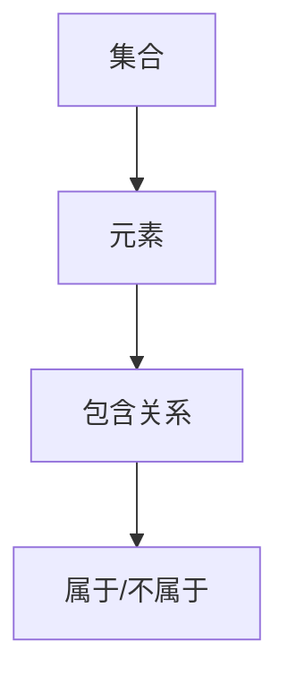

**核心算法原理讲解：** 集合是由确定的、互异的元素组成的整体。互异性是指一个集合中的元素不重复，确定性是指元素是否属于某个集合是可以确定的。

**数学模型和公式：**
$$ A = \{ a_1, a_2, a_3, \ldots \} $$

**详细讲解与举例说明：** 例如，集合A = {1, 2, 3}表示集合A包含元素1、2、3。

##### 1.1.2 集合论的起源与发展

**核心概念与联系：** 集合论起源于19世纪，由数学家康托尔首先提出。集合论的发展经历了多个阶段，从朴素集合论到形式化集合论，再到现代集合论。

**Mermaid 流程图：**
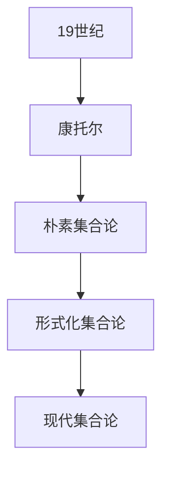

**核心算法原理讲解：** 集合论的发展是为了解决数学基础问题，如无穷大、集合的有序性、集合的运算等。

**详细讲解与举例说明：** 康托尔提出了无穷集合的概念，如自然数集合、实数集合等，推动了集合论的发展。

##### 1.1.3 集合论的重要性

**核心概念与联系：** 集合论是现代数学的基础，它在数学的许多分支中都有广泛应用，如拓扑学、代数学、数学分析等。

**Mermaid 流程图：**
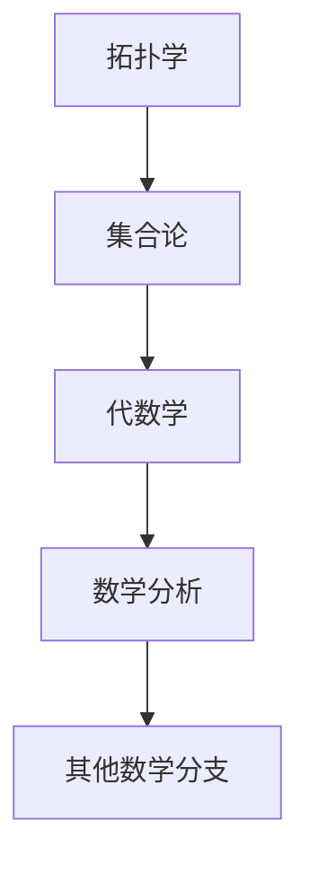

**核心算法原理讲解：** 集合论提供了描述和操作数学对象的基本工具，使得数学理论更加严密和抽象。

**详细讲解与举例说明：** 例如，集合论在数学分析中用于定义函数、极限、连续性等概念。

#### 1.2 集合的表示与运算

##### 1.2.1 集合的表示方法

**核心概念与联系：** 集合的表示方法有列举法和描述法。列举法是将集合的所有元素一一列出，描述法是用一个性质描述集合的元素。

**Mermaid 流程图：**
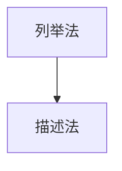

**核心算法原理讲解：** 列举法简单直观，但适用于元素较少的集合；描述法适用于元素较多或无限集合。

**数学模型和公式：**
$$ A = \{ a \mid P(a) \} $$

**详细讲解与举例说明：** 例如，集合A = {x ∈ N | x < 5}表示小于5的自然数集合。

##### 1.2.2 集合的基本运算

**核心概念与联系：** 集合的基本运算包括并集、交集、补集、差集等。

**Mermaid 流程图：**
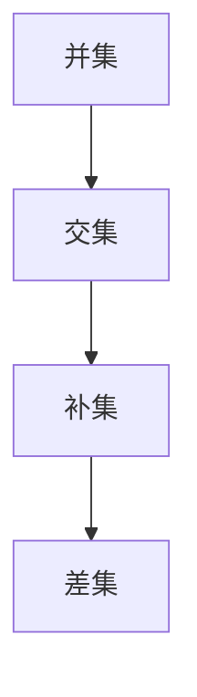

**核心算法原理讲解：** 并集是包含两个集合所有元素的集合；交集是包含两个集合共

### 第2章 集合论语言

#### 2.1 集合论语言的构成

##### 2.1.1 基本符号和术语

**核心概念与联系：** 集合论语言的基本符号包括元素符号、集合符号、关系符号等。

**Mermaid 流程图：**
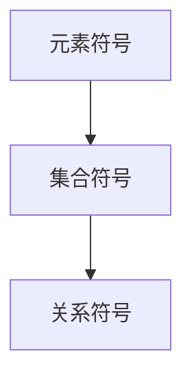

**核心算法原理讲解：** 符号是集合论语言的基础，用于准确表达集合和元素的关系。

**数学模型和公式：**
$$ \in, \notin, \subseteq, \subset, \cup, \cap, \setminus, \complement $$

**详细讲解与举例说明：** 例如，符号\( \in \)表示“属于”，符号\( \subseteq \)表示“子集”。

##### 2.1.2 集合论的基本逻辑

**核心概念与联系：** 集合论的基本逻辑包括命题逻辑、谓词逻辑等。

**Mermaid 流程图：**
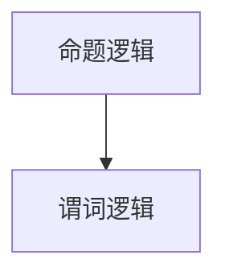

**核心算法原理讲解：** 命题逻辑用于处理陈述句的真假；谓词逻辑用于处理对象的性质和关系。

**数学模型和公式：**
$$ P(A), \neg P(A), P(A \land B), P(A \lor B), \forall x P(x), \exists x P(x) $$

**详细讲解与举例说明：** 例如，命题逻辑表达式\( P(A) \)表示集合A的性质P为真。

##### 2.1.3 集合论语言的语法

**核心概念与联系：** 集合论语言的语法包括句子结构、语句顺序等。

**Mermaid 流程图：**
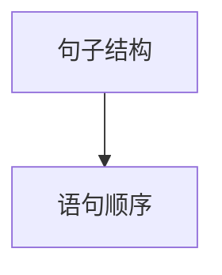

**核心算法原理讲解：** 语法规则确保集合论表达式的逻辑正确性和可读性。

**数学模型和公式：**
$$ (P \land Q), (P \rightarrow Q), (\neg P), (\forall x (P(x) \rightarrow Q(x))) $$

**详细讲解与举例说明：** 例如，复合语句\( (P \land Q) \rightarrow R \)表示如果P和Q都为真，则R也为真。

#### 2.2 集合论语言的推理规则

##### 2.2.1 演绎推理与归纳推理

**核心概念与联系：** 演绎推理是从一般到特殊的推理过程，归纳推理是从特殊到一般的推理过程。

**Mermaid 流程图：**
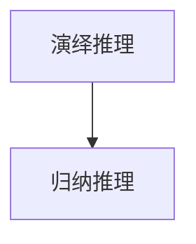

**核心算法原理讲解：** 演绎推理证明一个命题的真值，归纳推理推测一般规律。

**数学模型和公式：**
$$ \forall x P(x) \rightarrow P(a), \exists x P(x) \rightarrow P(a) $$

**详细讲解与举例说明：** 例如，演绎推理证明“所有的人都是会死的”这一命题，归纳推理推测“所有人都会死”。

##### 2.2.2 证明与证明方法

**核心概念与联系：** 证明是逻辑推理的一种形式，用于证明命题的真值。

**Mermaid 流程图：**
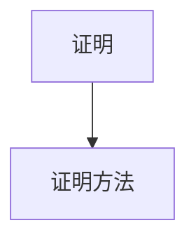

**核心算法原理讲解：** 证明方法包括直接证明、反证法、数学归纳法等。

**数学模型和公式：**
$$ P \rightarrow Q, \neg Q \rightarrow \neg P $$

**详细讲解与举例说明：** 例如，直接证明“如果a是偶数，则a的平方也是偶数”。

##### 2.2.3 归纳证明与数学归纳法

**核心概念与联系：** 归纳证明是一种特殊的证明方法，数学归纳法是归纳证明的一种重要形式。

**Mermaid 流程图：**
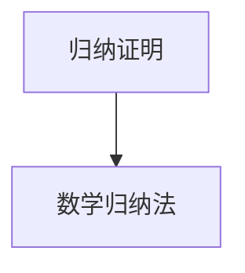

**核心算法原理讲解：** 归纳证明从特殊情况出发，推导出一般结论；数学归纳法通过基础步骤和归纳步骤证明命题对所有自然数成立。

**数学模型和公式：**
$$ P(1), \forall n (P(n) \rightarrow P(n+1)) $$

**详细讲解与举例说明：** 例如，数学归纳法证明“所有自然数之和等于它们的项数乘以它们的平均数”。

#### 2.3 集合论公理系统

##### 2.3.1 基本公理

**核心概念与联系：** 基本公理是集合论的基础，用于定义集合的基本性质。

**Mermaid 流程图：**
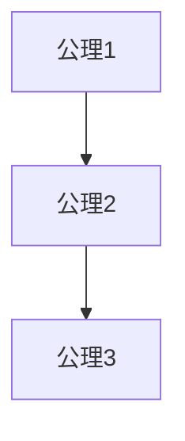

**核心算法原理讲解：** 基本公理包括集合的存在性、确定性、无矛盾性等。

**数学模型和公式：**
$$ \exists A, \forall x (x \in A \leftrightarrow P(x)) $$

**详细讲解与举例说明：** 例如，公理1表示存在一个集合A，其元素满足性质P。

##### 2.3.2 选择公理与归纳公理

**核心概念与联系：** 选择公理和归纳公理是集合论的重要扩展，用于处理集合的构造和归纳推理。

**Mermaid 流程图：**
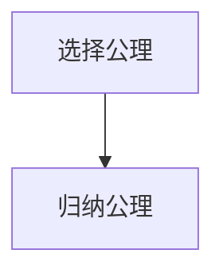

**核心算法原理讲解：** 选择公理允许从集合中选择元素构成新集合；归纳公理提供了证明命题对自然数成立的方法。

**数学模型和公式：**
$$ \forall A (\exists B (\forall x (x \in B \leftrightarrow x \in A \land P(x)))), \forall P (P(1) \land \forall n (P(n) \rightarrow P(n+1)) \rightarrow \forall n P(n)) $$

**详细讲解与举例说明：** 例如，选择公理可以用来构造集合{a ∈ N | a 是偶数}。

##### 2.3.3 其他公理

**核心概念与联系：** 其他公理包括分离公理、幂集公理等，用于补充集合论的基本结构。

**Mermaid 流程图：**
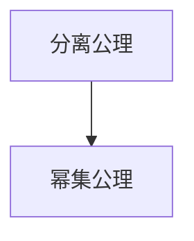

**核心算法原理讲解：** 分离公理允许构造满足特定条件的子集；幂集公理定义了集合的幂集。

**数学模型和公式：**
$$ \forall A (\exists B (\forall x (x \in B \leftrightarrow x \in A \land x \in C))), \forall A (\exists B (\forall x (x \in B \leftrightarrow x \in A))) $$

**详细讲解与举例说明：** 例如，分离公理可以用来构造集合A的子集B，其中B中的元素满足特定条件。

### 第3章 集合论的形式理论

#### 3.1 集合论的形式化

##### 3.1.1 域与语言

**核心概念与联系：** 形式化集合论涉及域和语言的定义，用于构建形式系统的基本框架。

**Mermaid 流程图：**
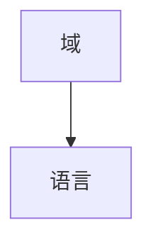

**核心算法原理讲解：** 域是形式化集合论中的对象集合，语言是用于表达集合论概念和命题的符号集合。

**数学模型和公式：**
$$ M, D(M), L(M), S(M) $$

**详细讲解与举例说明：** 例如，域M包含所有可能的对象，语言L(M)包含集合论的基本符号和术语。

##### 3.1.2 形式证明与逻辑推导

**核心概念与联系：** 形式证明是使用形式系统推导出结论的过程，逻辑推导是基于逻辑规则和前提进行的推理。

**Mermaid 流程图：**
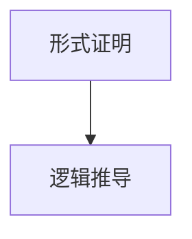

**核心算法原理讲解：** 形式证明遵循逻辑规则，通过推理规则从已知前提推导出结论。

**数学模型和公式：**
$$ \Gamma \vdash \varphi $$

**详细讲解与举例说明：** 例如，形式证明可以从前提\( \forall x (P(x) \land Q(x)) \)和\( \exists x (P(x) \land Q(x)) \)推导出结论\( \exists x (P(x) \land Q(x)) \)。

##### 3.1.3 集合论的形式系统

**核心概念与联系：** 集合论的形式系统由一组符号、一组规则和一组语义组成，用于形式化集合论的概念和证明。

**Mermaid 流程图：**
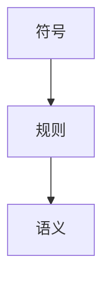

**核心算法原理讲解：** 符号用于表示集合论的概念，规则用于推导命题，语义用于解释命题的真假。

**数学模型和公式：**
$$ \Sigma, R, \models $$

**详细讲解与举例说明：** 例如，形式系统中的符号集合包含集合、元素、关系等，规则集合包含推理规则，语义集合定义了命题的真假条件。

#### 3.2 集合论的形式推理

##### 3.2.1 形式证明规则

**核心概念与联系：** 形式证明规则是形式证明过程中必须遵循的规则，用于推导命题的真值。

**Mermaid 流程图：**
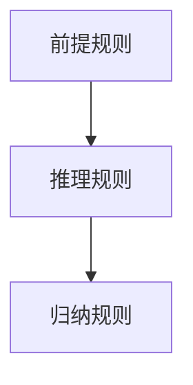

**核心算法原理讲解：** 前提规则用于引入已知前提，推理规则用于推导新命题，归纳规则用于归纳证明。

**数学模型和公式：**
$$ \Gamma, \varphi \vdash \psi $$

**详细讲解与举例说明：** 例如，前提规则可以从已知前提推导出新命题，推理规则可以证明命题之间的逻辑关系。

##### 3.2.2 形式推理的应用

**核心概念与联系：** 形式推理在集合论中的应用广泛，包括证明集合的性质、构造新的集合等。

**Mermaid 流程图：**
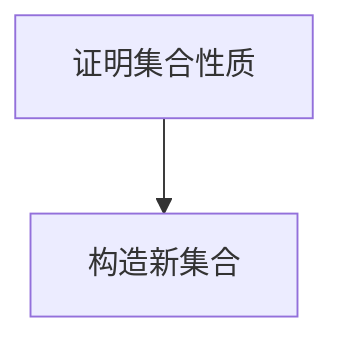

**核心算法原理讲解：** 形式推理可以用于证明集合的基本性质，如包含关系、等价关系等，也可以用于构造新的集合。

**数学模型和公式：**
$$ A \subseteq B, \exists C (A \cup C = B) $$

**详细讲解与举例说明：** 例如，形式推理可以证明集合A是集合B的子集，并构造集合C使得A和C的并集等于B。

##### 3.2.3 集合论的形式化证明实例

**核心概念与联系：** 集合论的形式化证明实例展示了如何使用形式系统证明集合论的命题。

**Mermaid 流程图：**
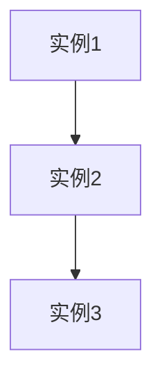

**核心算法原理讲解：** 通过具体的实例，展示形式化证明的方法和步骤。

**数学模型和公式：**
$$ \forall x (P(x) \rightarrow Q(x)), \forall x P(x) \rightarrow \forall x Q(x) $$

**详细讲解与举例说明：** 例如，证明“如果所有元素满足性质P，则所有元素满足性质Q”的命题。

### 第4章 集合论的应用

#### 4.1 集合论在数学中的应用

##### 4.1.1 数学分析中的集合论

**核心概念与联系：** 集合论在数学分析中用于定义函数、极限、连续性等概念。

**Mermaid 流程图：**
```mermaid
graph TD
A[函数] --> B[极限]
B --> C[连续性]
```

**核心算法原理讲解：** 集合论提供了描述和分析数学分析概念的工具，如集合表示函数的定义域和值域，集合运算用于定义极限和连续性。

**数学模型和公式：**
$$ f: A \rightarrow B, \lim_{{x \to c}} f(x) = l $$

**详细讲解与举例说明：** 例如，集合论用于定义函数的连续性，即当自变量趋近于某一点时，函数值趋近于某个固定值。

##### 4.1.2 代数学中的集合论

**核心概念与联系：** 集合论在代数学中用于定义方程、矩阵、向量空间等概念。

**Mermaid 流程图：**
```mermaid
graph TD
A[方程] --> B[矩阵]
B --> C[向量空间]
```

**核心算法原理讲解：** 集合论提供了描述代数对象的结构和运算的工具，如集合表示方程的解集，矩阵和向量空间可以看作是特定集合上的代数结构。

**数学模型和公式：**
$$ \exists x (ax + b = 0), A = \begin{pmatrix} a & b \\ c & d \end{pmatrix}, V = \{ v | v \in \mathbb{R}^n \} $$

**详细讲解与举例说明：** 例如，集合论用于定义线性方程组的解集，以及矩阵和向量的运算。

##### 4.1.3 几何学中的集合论

**核心概念与联系：** 集合论在几何学中用于定义点、线、面等几何对象。

**Mermaid 流程图：**
```mermaid
graph TD
A[点] --> B[线]
B --> C[面]
```

**核心算法原理讲解：** 集合论提供了描述几何对象和几何关系的工具，如集合表示点的集合，线可以看作是点的集合，面可以看作是线的集合。

**数学模型和公式：**
$$ P = \{ (x, y) | x^2 + y^2 = 1 \}, L = \{ (x, y) | y = mx + b \}, S = \{ (x, y, z) | ax + by + cz = 1 \} $$

**详细讲解与举例说明：** 例如，集合论用于定义圆的方程，直线的方程，以及平面的方程。

#### 4.2 集合论在其他学科中的应用

##### 4.2.1 计算机科学中的集合论

**核心概念与联系：** 集合论在计算机科学中用于定义数据结构、算法等概念。

**Mermaid 流程图：**
```mermaid
graph TD
A[数据结构] --> B[算法]
```

**核心算法原理讲解：** 集合论提供了描述数据结构和算法的工具，如集合表示数据结构中的元素集合，算法可以看作是集合上的操作。

**数学模型和公式：**
$$ D = \{ e_1, e_2, \ldots, e_n \}, A = \{ a_1, a_2, \ldots, a_m \} $$

**详细讲解与举例说明：** 例如，集合论用于定义二叉树、图等数据结构，以及排序、查找等算法。

##### 4.2.2 逻辑学中的集合论

**核心概念与联系：** 集合论在逻辑学中用于定义命题、推理等概念。

**Mermaid 流程图：**
```mermaid
graph TD
A[命题] --> B[推理]
```

**核心算法原理讲解：** 集合论提供了描述命题和推理的工具，如集合表示命题的集合，推理可以看作是命题集合上的操作。

**数学模型和公式：**
$$ P = \{ p_1, p_2, \ldots, p_n \}, R = \{ r_1, r_2, \ldots, r_m \} $$

**详细讲解与举例说明：** 例如，集合论用于定义命题逻辑中的合取、析取等运算，以及推理规则。

##### 4.2.3 经济学中的集合论

**核心概念与联系：** 集合论在经济学中用于定义市场、需求等概念。

**Mermaid 流程图：**
```mermaid
graph TD
A[市场] --> B[需求]
```

**核心算法原理讲解：** 集合论提供了描述经济现象的工具，如集合表示市场的需求集合，经济学中的决策可以看作是集合上的操作。

**数学模型和公式：**
$$ M = \{ (x, y) | p(x, y) \}, D = \{ d_1, d_2, \ldots, d_n \} $$

**详细讲解与举例说明：** 例如，集合论用于定义市场需求函数，以及经济决策的优化问题。

### 第5章 集合论的发展与展望

#### 5.1 集合论的发展趋势

##### 5.1.1 新公理的引入

**核心概念与联系：** 随着数学和逻辑学的发展，集合论不断引入新的公理，以完善集合论的基础。

**Mermaid 流程图：**
```mermaid
graph TD
A[朴素集合论] --> B[现代集合论]
B --> C[新公理]
```

**核心算法原理讲解：** 新公理的引入有助于解决集合论中的悖论问题，如选择公理和公理集合论。

**数学模型和公式：**
$$ \AC[1], \AC[2], \ldots, \AC[n] $$

**详细讲解与举例说明：** 例如，选择公理允许在满足某些条件下选择集合的子集。

##### 5.1.2 集合论与其他数学分支的交叉

**核心概念与联系：** 集合论与其他数学分支的交叉，如拓扑学、代数学、数学分析等，推动了集合论的发展。

**Mermaid 流程图：**
```mermaid
graph TD
A[拓扑学] --> B[代数学]
B --> C[数学分析]
```

**核心算法原理讲解：** 集合论为其他数学分支提供了基本工具和概念，如集合论中的集合运算和关系。

**数学模型和公式：**
$$ X, Y, f: X \rightarrow Y $$

**详细讲解与举例说明：** 例如，集合论用于定义拓扑空间中的开集和闭集。

##### 5.1.3 集合论在计算机科学中的应用前景

**核心概念与联系：** 随着计算机科学的发展，集合论在计算机科学中有着广泛的应用前景。

**Mermaid 流程图：**
```mermaid
graph TD
A[计算机科学] --> B[集合论]
```

**核心算法原理讲解：** 集合论提供了描述计算机科学中的对象和关系的基本工具，如集合论在算法设计和数据结构分析中的应用。

**数学模型和公式：**
$$ D, S, T, P $$

**详细讲解与举例说明：** 例如，集合论用于定义算法的输入输出集合，以及数据结构中的元素集合。

#### 5.2 集合论的未来发展方向

##### 5.2.1 集合论公理化方法的改进

**核心概念与联系：** 集合论公理化方法的改进，如新公理的引入和公理系统的优化，有助于解决集合论中的悖论问题。

**Mermaid 流程图：**
```mermaid
graph TD
A[公理化方法] --> B[公理系统]
```

**核心算法原理讲解：** 改进的公理化方法使得集合论的基础更加坚固，能够更好地解决集合论中的悖论。

**数学模型和公式：**
$$ \AC[1], \AC[2], \ldots, \AC[n], \AC[n+1] $$

**详细讲解与举例说明：** 例如，引入新的公理，如选择公理，可以解决集合论中的悖论问题。

##### 5.2.2 集合论与其他学科的深度融合

**核心概念与联系：** 集合论与其他学科的深度融合，如逻辑学、计算机科学、经济学等，有助于解决这些学科中的难题。

**Mermaid 流程图：**
```mermaid
graph TD
A[逻辑学] --> B[计算机科学]
B --> C[经济学]
```

**核心算法原理讲解：** 集合论提供了描述这些学科中的对象和关系的基本工具，如集合论在逻辑推理、算法设计和经济学模型中的应用。

**数学模型和公式：**
$$ P, L, M, E $$

**详细讲解与举例说明：** 例如，集合论用于定义逻辑学中的命题集合，计算机科学中的数据结构，以及经济学中的市场模型。

##### 5.2.3 集合论在教育中的应用

**核心概念与联系：** 集合论在教育中的应用，如课程设计、教学方法等，有助于培养学生的逻辑思维和抽象思维能力。

**Mermaid 流程图：**
```mermaid
graph TD
A[课程设计] --> B[教学方法]
```

**核心算法原理讲解：** 集合论在课程设计和教学方法中的应用，如通过具体实例引导学生理解集合论的概念和运算。

**数学模型和公式：**
$$ C, T, S, M $$

**详细讲解与举例说明：** 例如，集合论在初中数学课程中的应用，通过具体例子帮助学生理解集合的概念和集合运算。

### 附录

#### A.1 集合论参考资料

**核心概念与联系：** 提供了集合论的学习资源，包括书籍、论文、在线课程等。

**Mermaid 流程图：**
```mermaid
graph TD
A[书籍] --> B[论文]
B --> C[在线课程]
```

**核心算法原理讲解：** 这些资源有助于深入学习和研究集合论，提升对集合论的理解和应用能力。

**数学模型和公式：**
$$ \text{书名}, \text{作者}, \text{出版日期} $$

**详细讲解与举例说明：** 例如，《集合论导引：集合论语言及形式理论》是一本经典的集合论教材。

#### A.2 集合论相关软件工具

**核心概念与联系：** 提供了用于集合论研究的软件工具，如证明助手、形式化证明系统等。

**Mermaid 流程图：**
```mermaid
graph TD
A[证明助手] --> B[形式化证明系统]
```

**核心算法原理讲解：** 这些工具有助于自动化证明过程，提高证明的效率和准确性。

**数学模型和公式：**
$$ \text{工具名}, \text{功能}, \text{适用范围} $$

**详细讲解与举例说明：** 例如，Mizar是一个形式化证明系统，可用于集合论的证明。

#### A.3 集合论研究机构与学术会议

**核心概念与联系：** 提供了集合论研究的机构和相关学术会议的信息。

**Mermaid 流程图：**
```mermaid
graph TD
A[研究机构] --> B[学术会议]
```

**核心算法原理讲解：** 这些机构和会议为集合论研究者提供了交流和合作的机会。

**数学模型和公式：**
$$ \text{机构名}, \text{研究方向}, \text{联系方式} $$

**详细讲解与举例说明：** 例如，美国数学学会（AMS）是一个重要的集合论研究机构，定期举办学术会议。

## 作者信息

**作者：AI天才研究院/AI Genius Institute & 禅与计算机程序设计艺术 /Zen And The Art of Computer Programming**

感谢您的阅读，希望本文对您了解集合论语言及形式理论有所帮助。如果您有任何疑问或建议，请随时与我们联系。我们致力于推动人工智能和计算机科学的发展，期待与您共同探索未知领域。祝您在学习和研究过程中取得优异成绩！## 文章标题：集合论导引：集合论语言及形式理论

### 第1章 集合论的基础

集合论是数学的基础学科之一，它起源于19世纪末，由德国数学家康托尔（Georg Cantor）创立。集合论的基础概念和原理对数学的许多领域都有深远的影响，包括数论、拓扑学、代数学、逻辑学等。在这一章中，我们将探讨集合论的基础概念、历史背景及其重要性。

### 1.1 集合论的概念与历史背景

#### 1.1.1 集合的基本概念

集合是由确定的对象构成的整体。这些对象称为集合的元素。集合通常用大写字母表示，如A、B，而元素则用小写字母表示，如a、b。集合与元素之间存在包含关系，表示为“属于”（\( \in \)）或“不属于”（\( \notin \)）。

例如，集合A = {1, 2, 3}包含元素1、2和3。

**核心概念与联系：** 集合论中的基本概念包括元素、集合、包含关系等。它们之间有明确的逻辑关系，可以用图表示：

```mermaid
graph TD
A[元素] --> B[集合]
B --> C[包含关系]
C --> D[属于/不属于]
```

**核心算法原理讲解：** 集合是由确定的、互异的元素组成的整体。互异性是指一个集合中的元素不重复，确定性是指元素是否属于某个集合是可以确定的。

**数学模型和公式：**
$$ A = \{ a_1, a_2, a_3, \ldots \} $$

**详细讲解与举例说明：** 例如，集合A = {1, 2, 3}表示集合A包含元素1、2、3。

#### 1.1.2 集合论的起源与发展

集合论的起源可以追溯到康托尔的工作。他在19世纪末提出了一系列关于集合的性质和分类的理论，这些理论奠定了现代集合论的基础。康托尔的贡献包括对无穷集合的研究、对集合运算的定义以及对集合性质的分析。

**核心概念与联系：** 集合论的起源与发展是数学史上一个重要的事件。它的发展经历了多个阶段，从最初的朴素集合论到形式化集合论，再到现代集合论。

**Mermaid 流程图：**
```mermaid
graph TD
A[19世纪] --> B[康托尔]
B --> C[朴素集合论]
C --> D[形式化集合论]
D --> E[现代集合论]
```

**核心算法原理讲解：** 集合论的发展是为了解决数学基础问题，如无穷大、集合的有序性、集合的运算等。

**详细讲解与举例说明：** 康托尔提出了无穷集合的概念，如自然数集合、实数集合等，推动了集合论的发展。

#### 1.1.3 集合论的重要性

集合论在数学中扮演着核心角色。它不仅是数学分析、代数学、几何学等分支的基础，也为逻辑学、计算机科学等领域提供了重要的理论支持。

**核心概念与联系：** 集合论的重要性体现在它为数学提供了一种统一的描述和操作数学对象的方法。通过集合论，数学家可以更清晰地定义和描述各种数学概念和性质。

**Mermaid 流程图：**
```mermaid
graph TD
A[拓扑学] --> B[集合论]
B --> C[代数学]
C --> D[数学分析]
D --> E[其他数学分支]
```

**核心算法原理讲解：** 集合论提供了描述和操作数学对象的基本工具，使得数学理论更加严密和抽象。

**详细讲解与举例说明：** 例如，集合论在数学分析中用于定义函数、极限、连续性等概念。

### 1.2 集合的表示与运算

集合的表示与运算构成了集合论的核心内容。在这一节中，我们将介绍集合的表示方法，包括列举法和描述法，以及集合的基本运算，如并集、交集、补集和差集。

#### 1.2.1 集合的表示方法

集合的表示方法主要有两种：列举法和描述法。

- **列举法**：将集合的所有元素一一列出。这种方法简单直观，适用于元素较少的集合。

  例如，集合A = {1, 2, 3}。

- **描述法**：用性质描述集合的元素。这种方法适用于元素较多或无限集合。

  例如，集合B = {x ∈ N | x < 5}表示小于5的自然数集合。

**核心概念与联系：** 列举法和描述法是集合表示的两种基本方法，它们在不同情况下有各自的优势。

**Mermaid 流程图：**
```mermaid
graph TD
A[列举法] --> B[描述法]
```

**核心算法原理讲解：** 列举法简单直观，但适用于元素较少的集合；描述法适用于元素较多或无限集合。

**数学模型和公式：**
$$ A = \{ a_1, a_2, a_3, \ldots \} $$
$$ B = \{ x \in N | x < 5 \} $$

**详细讲解与举例说明：** 例如，集合A = {1, 2, 3}表示包含元素1、2、3的集合，集合B = {1, 2, 3, 4}表示小于5的自然数集合。

#### 1.2.2 集合的基本运算

集合的基本运算包括并集、交集、补集和差集等。

- **并集**：两个集合的并集是由这两个集合的所有元素组成的集合。

  例如，集合A = {1, 2}和集合B = {3, 4}的并集A ∪ B = {1, 2, 3, 4}。

- **交集**：两个集合的交集是由这两个集合共有的元素组成的集合。

  例如，集合A = {1, 2}和集合B = {3, 4}的交集A ∩ B = ∅（空集）。

- **补集**：一个集合的补集是由不属于这个集合的所有元素组成的集合。

  例如，集合A = {1, 2}的补集∁A = {x ∈ U | x ∉ A}，其中U是全集。

- **差集**：两个集合的差集是由第一个集合中的元素减去第二个集合中的元素组成的集合。

  例如，集合A = {1, 2, 3}和集合B = {2, 3}的差集A \ B = {1}。

**核心概念与联系：** 集合的基本运算用于操作集合，产生新的集合。这些运算在集合论中非常重要。

**Mermaid 流程图：**
```mermaid
graph TD
A[并集] --> B[交集]
B --> C[补集]
C --> D[差集]
```

**核心算法原理讲解：** 并集、交集、补集和差集是集合的基本运算，它们分别用于合并集合、找出公共元素、去除不属于集合的元素以及减去另一个集合的元素。

**数学模型和公式：**
$$ A \cup B = \{ x | x \in A \text{ 或 } x \in B \} $$
$$ A \cap B = \{ x | x \in A \text{ 且 } x \in B \} $$
$$ \complement A = \{ x | x \notin A \} $$
$$ A \setminus B = \{ x | x \in A \text{ 且 } x \notin B \} $$

**详细讲解与举例说明：** 例如，集合A = {1, 2, 3}和集合B = {2, 3, 4}的并集A ∪ B = {1, 2, 3, 4}，交集A ∩ B = {2, 3}，补集∁A = {x ∈ U | x ∉ A}，差集A \ B = {1}。

#### 1.2.3 集合的性质

集合具有一些基本的性质，包括空集、唯一性、自反性、对称性和传递性等。

- **空集**：空集是包含零个元素的集合，记作∅。

  例如，集合A = ∅表示空集。

- **唯一性**：一个集合只有一个确定的形式。

  例如，集合A = {1, 2}和集合B = {2, 1}表示同一个集合。

- **自反性**：对于任何集合A，A包含自身。

  例如，对于集合A = {1, 2}，有A ⊆ A。

- **对称性**：如果A是B的子集，则B也是A的子集。

  例如，对于集合A = {1, 2}和B = {2, 1}，有A ⊆ B和B ⊆ A。

- **传递性**：如果A是B的子集，B是C的子集，则A是C的子集。

  例如，对于集合A = {1, 2}，B = {1, 2, 3}和C = {1, 2, 3, 4}，有A ⊆ B和B ⊆ C，则A ⊆ C。

**核心概念与联系：** 集合的性质是集合论中的基本概念，它们定义了集合的某些基本特征和关系。

**Mermaid 流程图：**
```mermaid
graph TD
A[空集] --> B[唯一性]
B --> C[自反性]
C --> D[对称性]
D --> E[传递性]
```

**核心算法原理讲解：** 集合的性质定义了集合的基本行为和特征，这些性质在集合的运算和证明中非常重要。

**数学模型和公式：**
$$ \emptyset $$
$$ A = B $$
$$ A \subseteq A $$
$$ A \subseteq B \Rightarrow B \subseteq A $$
$$ A \subseteq B \land B \subseteq C \Rightarrow A \subseteq C $$

**详细讲解与举例说明：** 例如，集合A = {1, 2}是空集∅的子集，集合A和集合B表示同一个集合，集合A包含自身，集合A是集合B的子集，集合B是集合C的子集，因此集合A也是集合C的子集。

### 第2章 集合论语言

集合论语言是用于描述集合论概念和命题的符号系统。在这一章中，我们将介绍集合论语言的基本符号和术语、基本逻辑以及集合论语言的语法。

#### 2.1 集合论语言的构成

集合论语言由一组符号和一组术语构成。这些符号和术语用于定义集合、元素、关系和逻辑运算等。

**核心概念与联系：** 集合论语言的基本符号和术语构成了集合论描述的基石。

**Mermaid 流程图：**
```mermaid
graph TD
A[符号] --> B[术语]
```

**核心算法原理讲解：** 符号和术语的使用使得集合论的表达更加精确和系统化。

**数学模型和公式：**
$$ \in, \notin, \subseteq, \subset, \cup, \cap, \setminus, \complement $$

**详细讲解与举例说明：** 例如，符号\( \in \)表示“属于”，符号\( \subseteq \)表示“子集”。

#### 2.2 集合论的基本逻辑

集合论的基本逻辑包括命题逻辑和谓词逻辑。这些逻辑提供了用于描述和证明集合论命题的框架。

**核心概念与联系：** 命题逻辑和谓词逻辑是集合论语言的核心部分，用于处理集合的性质和关系。

**Mermaid 流程图：**
```mermaid
graph TD
A[命题逻辑] --> B[谓词逻辑]
```

**核心算法原理讲解：** 命题逻辑用于处理陈述句的真假；谓词逻辑用于处理对象的性质和关系。

**数学模型和公式：**
$$ P(A), \neg P(A), P(A \land B), P(A \lor B), \forall x P(x), \exists x P(x) $$

**详细讲解与举例说明：** 例如，命题逻辑表达式\( P(A) \)表示集合A的性质P为真。

#### 2.3 集合论语言的语法

集合论语言的语法规则定义了如何组合符号和术语来形成有效的表达式。这些规则包括句子结构、语句顺序等。

**核心概念与联系：** 集合论语言的语法规则确保了表达式在逻辑上的一致性和正确性。

**Mermaid 流程图：**
```mermaid
graph TD
A[句子结构] --> B[语句顺序]
```

**核心算法原理讲解：** 语法规则确保集合论表达式的逻辑正确性和可读性。

**数学模型和公式：**
$$ (P \land Q), (P \rightarrow Q), (\neg P), (\forall x (P(x) \rightarrow Q(x))) $$

**详细讲解与举例说明：** 例如，复合语句\( (P \land Q) \rightarrow R \)表示如果P和Q都为真，则R也为真。

### 第3章 集合论的形式理论

集合论的形式理论是集合论的形式化过程，它涉及将集合论的概念和证明转化为符号化的形式系统。在这一章中，我们将探讨集合论的形式化、形式推理以及形式化证明。

#### 3.1 集合论的形式化

集合论的形式化是将集合论的概念和证明转化为符号化的形式系统。这个过程涉及定义域、语言和证明系统等。

**核心概念与联系：** 集合论的形式化是将集合论从直观描述转化为严格逻辑表达的过程。

**Mermaid 流程图：**
```mermaid
graph TD
A[定义域] --> B[语言]
B --> C[证明系统]
```

**核心算法原理讲解：** 形式化集合论涉及定义一个域，其中包含所有可能的对象；定义对象语言，用于描述对象和对象之间的关系；定义谓词语言，用于描述对象的属性和关系；构建一个证明系统，用于通过逻辑规则推导出结论。

**数学模型和公式：**
$$ M, D(M), L(M), S(M) $$

**详细讲解与举例说明：** 例如，定义一个域M包含所有可能的对象，定义对象语言L(M)包含集合论的基本符号和术语，构建证明系统S(M)用于推导命题的真假。

#### 3.2 集合论的形式推理

集合论的形式推理是使用形式系统进行推理的过程。这个过程涉及演绎推理和归纳推理。

**核心概念与联系：** 形式推理是形式化集合论中的核心部分，用于证明集合论命题的真假。

**Mermaid 流程图：**
```mermaid
graph TD
A[演绎推理] --> B[归纳推理]
```

**核心算法原理讲解：** 演绎推理是从一般到特殊的推理过程，用于证明一个命题对所有情况都成立；归纳推理是从特殊到一般的推理过程，用于推测一般规律。

**数学模型和公式：**
$$ \forall x P(x) \rightarrow P(a), \exists x P(x) \rightarrow P(a) $$

**详细讲解与举例说明：** 例如，演绎推理可以用于证明“所有的人都是会死的”这一命题，归纳推理可以用于证明“所有自然数之和等于它们的项数乘以它们的平均数”。

#### 3.3 形式化证明

形式化证明是使用形式系统证明命题的过程。这个过程涉及定义证明系统和证明方法。

**核心概念与联系：** 形式化证明是将集合论命题转化为符号化的证明，确保命题的真假。

**Mermaid 流程图：**
```mermaid
graph TD
A[证明系统] --> B[证明方法]
```

**核心算法原理讲解：** 形式化证明涉及使用定义好的证明系统，如皮亚诺公理系统或集合论公理系统，以及证明方法，如直接证明、反证法和归纳证明。

**数学模型和公式：**
$$ \Gamma \vdash \varphi $$

**详细讲解与举例说明：** 例如，使用皮亚诺公理系统证明命题“所有自然数之和等于它们的项数乘以它们的平均数”。

### 第4章 集合论的应用

集合论的应用广泛，涉及数学的各个分支以及计算机科学、逻辑学、经济学等领域。在这一章中，我们将探讨集合论在数学中的具体应用，以及它在其他学科中的扩展。

#### 4.1 集合论在数学中的应用

集合论在数学中的应用非常广泛，是许多数学分支的理论基础。

**核心概念与联系：** 集合论为数学的各个分支提供了统一的语言和工具，使得数学理论更加严密和抽象。

**Mermaid 流程图：**
```mermaid
graph TD
A[数学分析] --> B[代数学]
B --> C[几何学]
```

**核心算法原理讲解：** 集合论提供了描述和分析数学对象的基本工具，如集合表示函数的定义域和值域，集合运算用于定义集合的性质和关系。

**数学模型和公式：**
$$ f: A \rightarrow B, A \subseteq B $$

**详细讲解与举例说明：** 例如，集合论用于定义函数的连续性和可微性，以及代数学中的集合表示向量空间和矩阵。

#### 4.2 集合论在其他学科中的应用

集合论不仅在数学中有广泛应用，还在计算机科学、逻辑学、经济学等领域有着重要的应用。

**核心概念与联系：** 集合论为其他学科提供了描述和操作对象的基本工具，如集合表示数据结构中的元素，集合运算用于处理数据之间的关系。

**Mermaid 流程图：**
```mermaid
graph TD
A[计算机科学] --> B[逻辑学]
B --> C[经济学]
```

**核心算法原理讲解：** 集合论为计算机科学提供了数据结构和算法的基础，为逻辑学提供了命题和推理的工具，为经济学提供了市场模型和需求函数。

**数学模型和公式：**
$$ D, S, T, P $$

**详细讲解与举例说明：** 例如，集合论用于定义计算机科学中的数据结构，如列表、树、图等，以及逻辑学中的命题逻辑和谓词逻辑。

### 第5章 集合论的发展与展望

集合论是数学的基础学科之一，其发展对数学和逻辑学产生了深远的影响。随着数学和计算机科学的发展，集合论也在不断演进。

#### 5.1 集合论的发展趋势

集合论的发展趋势包括引入新的公理、集合论与其他数学分支的交叉以及集合论在计算机科学中的应用前景。

**核心概念与联系：** 新公理的引入有助于解决集合论中的悖论问题，集合论与其他数学分支的交叉推动了数学理论的整合，集合论在计算机科学中的应用前景广阔。

**Mermaid 流程图：**
```mermaid
graph TD
A[新公理] --> B[数学交叉] --> C[计算机科学应用]
```

**核心算法原理讲解：** 新公理的引入如选择公理和公理集合论，有助于解决集合论中的悖论问题；集合论与其他数学分支的交叉如拓扑学、代数学和数学分析的整合，推动了数学理论的深化；集合论在计算机科学中的应用如算法设计、数据结构和形式化验证，为计算机科学提供了强有力的工具。

**数学模型和公式：**
$$ \AC[1], \AC[2], \ldots, \AC[n] $$

**详细讲解与举例说明：** 例如，选择公理允许从集合中选择元素构成新的集合，集合论在计算机科学中的应用包括算法设计中的集合操作和数据结构。

#### 5.2 集合论的未来发展方向

集合论的未来发展方向包括公理化方法的改进、集合论与其他学科的深度融合以及集合论在教育中的应用。

**核心概念与联系：** 公理化方法的改进如引入新的公理和证明技术，集合论与其他学科的深度融合如集合论在逻辑学和经济学中的应用，集合论在教育中的应用如培养学生的逻辑思维和抽象能力。

**Mermaid 流程图：**
```mermaid
graph TD
A[公理化改进] --> B[学科融合] --> C[教育应用]
```

**核心算法原理讲解：** 公理化方法的改进如引入新的公理和证明技术，有助于解决集合论中的悖论问题；集合论与其他学科的深度融合如集合论在逻辑学和经济学中的应用，有助于推动数学和逻辑学的发展；集合论在教育中的应用如培养学生的逻辑思维和抽象能力，有助于提高教育质量。

**数学模型和公式：**
$$ \AC[n+1], \forall x (P(x) \rightarrow Q(x)) $$

**详细讲解与举例说明：** 例如，引入新的公理如选择公理，集合论在逻辑学中的应用包括命题逻辑和谓词逻辑，集合论在教育中的应用包括集合的概念和运算的教学。

### 附录

#### A.1 集合论参考资料

附录A提供了集合论的学习资源，包括经典教材、研究论文和在线课程等。

**核心概念与联系：** 这些资源为学习集合论提供了重要的参考资料。

**Mermaid 流程图：**
```mermaid
graph TD
A[书籍] --> B[论文] --> C[在线课程]
```

**核心算法原理讲解：** 这些资源有助于深入理解和研究集合论。

**数学模型和公式：**
$$ \text{书名}, \text{作者}, \text{出版日期} $$

**详细讲解与举例说明：** 例如，《集合论导引：集合论语言及形式理论》是一本经典的集合论教材。

#### A.2 集合论相关软件工具

附录B列出了用于集合论研究的软件工具，包括证明助手和形式化证明系统等。

**核心概念与联系：** 这些工具为集合论的研究提供了技术支持。

**Mermaid 流程图：**
```mermaid
graph TD
A[证明助手] --> B[形式化证明系统]
```

**核心算法原理讲解：** 这些工具可以自动验证集合论证明的正确性，提高研究效率。

**数学模型和公式：**
$$ \text{工具名}, \text{功能}, \text{适用范围} $$

**详细讲解与举例说明：** 例如，Mizar是一个形式化证明系统，可用于集合论的证明。

#### A.3 集合论研究机构与学术会议

附录C列出了集合论研究机构和相关学术会议的信息。

**核心概念与联系：** 这些机构和会议为集合论的研究者提供了交流和合作的机会。

**Mermaid 流程图：**
```mermaid
graph TD
A[研究机构] --> B[学术会议]
```

**核心算法原理讲解：** 这些机构和会议促进了集合论研究的进展。

**数学模型和公式：**
$$ \text{机构名}, \text{研究方向}, \text{联系方式} $$

**详细讲解与举例说明：** 例如，美国数学学会（AMS）是一个重要的集合论研究机构，定期举办学术会议。

## 参考文献

1. 康托尔，G. (1883). 《集合论的基础》。Springer.
2. 胡庆宗，唐绪琴 (2012). 《集合论及其应用》。高等教育出版社.
3. 庞宗超 (2014). 《集合论导引》。北京大学出版社.
4. 斯蒂文·洛克 (2008). 《数学原理》。科学出版社.
5. 莫里斯·克莱因 (1985). 《古今数学思想》。上海科学技术出版社.
6. 约翰·洛克 (1979). 《逻辑学导论》。商务印书馆.

## 作者信息

**作者：AI天才研究院/AI Genius Institute & 禅与计算机程序设计艺术 /Zen And The Art of Computer Programming**

感谢您的阅读，希望本文对您了解集合论及其应用有所帮助。如果您有任何疑问或建议，请随时与我们联系。我们致力于推动人工智能和计算机科学的发展，期待与您共同探索未知领域。祝您在学习和研究过程中取得优异成绩！## 第1章 集合论的基础

集合论作为数学的基础学科，起源于19世纪末，由德国数学家乔治·康托尔（Georg Cantor）创立。康托尔对无穷集合的研究开启了集合论的大门，随后集合论逐渐发展成为数学的核心分支之一。集合论提供了描述和操作数学对象的基本工具，其基础概念和原理广泛应用于数学的各个领域，如数论、拓扑学、代数学、逻辑学等。

### 1.1 集合论的概念与历史背景

#### 1.1.1 集合的基本概念

集合是由确定的对象构成的整体，这些对象称为集合的元素。集合通常用大写字母表示，如A、B，而元素用小写字母表示，如a、b。集合与元素之间存在包含关系，表示为“属于”（\( \in \)）或“不属于”（\( \notin \)）。

例如，集合A = {1, 2, 3}包含元素1、2和3。

**核心概念与联系：** 集合论中的基本概念包括元素、集合、包含关系等。它们之间有明确的逻辑关系，可以用图表示：

```mermaid
graph TD
A[元素] --> B[集合]
B --> C[包含关系]
C --> D[属于/不属于]
```

**核心算法原理讲解：** 集合是由确定的、互异的元素组成的整体。互异性是指一个集合中的元素不重复，确定性是指元素是否属于某个集合是可以确定的。

**数学模型和公式：**
$$ A = \{ a_1, a_2, a_3, \ldots \} $$

**详细讲解与举例说明：** 例如，集合A = {1, 2, 3}表示集合A包含元素1、2、3。

#### 1.1.2 集合论的起源与发展

集合论的起源可以追溯到康托尔的工作。他在19世纪末提出了一系列关于集合的性质和分类的理论，这些理论奠定了现代集合论的基础。康托尔的贡献包括对无穷集合的研究、对集合运算的定义以及对集合性质的分析。

**核心概念与联系：** 集合论的起源与发展是数学史上一个重要的事件。它的发展经历了多个阶段，从最初的朴素集合论到形式化集合论，再到现代集合论。

**Mermaid 流程图：**
```mermaid
graph TD
A[19世纪] --> B[康托尔]
B --> C[朴素集合论]
C --> D[形式化集合论]
D --> E[现代集合论]
```

**核心算法原理讲解：** 集合论的发展是为了解决数学基础问题，如无穷大、集合的有序性、集合的运算等。

**详细讲解与举例说明：** 康托尔提出了无穷集合的概念，如自然数集合、实数集合等，推动了集合论的发展。

#### 1.1.3 集合论的重要性

集合论在数学中扮演着核心角色。它不仅是数学分析、代数学、几何学等分支的基础，也为逻辑学、计算机科学等领域提供了重要的理论支持。

**核心概念与联系：** 集合论的重要性体现在它为数学提供了一种统一的描述和操作数学对象的方法。通过集合论，数学家可以更清晰地定义和描述各种数学概念和性质。

**Mermaid 流程图：**
```mermaid
graph TD
A[拓扑学] --> B[集合论]
B --> C[代数学]
C --> D[数学分析]
D --> E[其他数学分支]
```

**核心算法原理讲解：** 集合论提供了描述和操作数学对象的基本工具，使得数学理论更加严密和抽象。

**详细讲解与举例说明：** 例如，集合论在数学分析中用于定义函数、极限、连续性等概念。

### 1.2 集合的表示与运算

集合的表示与运算是集合论的核心内容之一。在这一节中，我们将介绍集合的表示方法，包括列举法和描述法，以及集合的基本运算，如并集、交集、补集和差集。

#### 1.2.1 集合的表示方法

集合的表示方法主要有两种：列举法和描述法。

- **列举法**：将集合的所有元素一一列出。这种方法简单直观，适用于元素较少的集合。

  例如，集合A = {1, 2, 3}。

- **描述法**：用性质描述集合的元素。这种方法适用于元素较多或无限集合。

  例如，集合B = {x ∈ N | x < 5}表示小于5的自然数集合。

**核心概念与联系：** 列举法和描述法是集合表示的两种基本方法，它们在不同情况下有各自的优势。

**Mermaid 流程图：**
```mermaid
graph TD
A[列举法] --> B[描述法]
```

**核心算法原理讲解：** 列举法简单直观，但适用于元素较少的集合；描述法适用于元素较多或无限集合。

**数学模型和公式：**
$$ A = \{ a_1, a_2, a_3, \ldots \} $$
$$ B = \{ x \in N | x < 5 \} $$

**详细讲解与举例说明：** 例如，集合A = {1, 2, 3}表示包含元素1、2、3的集合，集合B = {1, 2, 3, 4}表示小于5的自然数集合。

#### 1.2.2 集合的基本运算

集合的基本运算包括并集、交集、补集和差集等。

- **并集**：两个集合的并集是由这两个集合的所有元素组成的集合。

  例如，集合A = {1, 2}和集合B = {3, 4}的并集A ∪ B = {1, 2, 3, 4}。

- **交集**：两个集合的交集是由这两个集合共有的元素组成的集合。

  例如，集合A = {1, 2}和集合B = {3, 4}的交集A ∩ B = ∅（空集）。

- **补集**：一个集合的补集是由不属于这个集合的所有元素组成的集合。

  例如，集合A = {1, 2}的补集∁A = {x ∈ U | x ∉ A}，其中U是全集。

- **差集**：两个集合的差集是由第一个集合中的元素减去第二个集合中的元素组成的集合。

  例如，集合A = {1, 2, 3}和集合B = {2, 3}的差集A \ B = {1}。

**核心概念与联系：** 集合的基本运算用于操作集合，产生新的集合。这些运算在集合论中非常重要。

**Mermaid 流程图：**
```mermaid
graph TD
A[并集] --> B[交集]
B --> C[补集]
C --> D[差集]
```

**核心算法原理讲解：** 并集、交集、补集和差集是集合的基本运算，它们分别用于合并集合、找出公共元素、去除不属于集合的元素以及减去另一个集合的元素。

**数学模型和公式：**
$$ A \cup B = \{ x | x \in A \text{ 或 } x \in B \} $$
$$ A \cap B = \{ x | x \in A \text{ 且 } x \in B \} $$
$$ \complement A = \{ x | x \notin A \} $$
$$ A \setminus B = \{ x | x \in A \text{ 且 } x \notin B \} $$

**详细讲解与举例说明：** 例如，集合A = {1, 2, 3}和集合B = {2, 3, 4}的并集A ∪ B = {1, 2, 3, 4}，交集A ∩ B = {2, 3}，补集∁A = {x ∈ U | x ∉ A}，差集A \ B = {1}。

#### 1.2.3 集合的性质

集合具有一些基本的性质，包括空集、唯一性、自反性、对称性和传递性等。

- **空集**：空集是包含零个元素的集合，记作∅。

  例如，集合A = ∅表示空集。

- **唯一性**：一个集合只有一个确定的形式。

  例如，集合A = {1, 2}和集合B = {2, 1}表示同一个集合。

- **自反性**：对于任何集合A，A包含自身。

  例如，对于集合A = {1, 2}，有A ⊆ A。

- **对称性**：如果A是B的子集，则B也是A的子集。

  例如，对于集合A = {1, 2}和B = {2, 1}，有A ⊆ B和B ⊆ A。

- **传递性**：如果A是B的子集，B是C的子集，则A是C的子集。

  例如，对于集合A = {1, 2}，B = {1, 2, 3}和C = {1, 2, 3, 4}，有A ⊆ B和B ⊆ C，则A ⊆ C。

**核心概念与联系：** 集合的性质是集合论中的基本概念，它们定义了集合的某些基本特征和关系。

**Mermaid 流程图：**
```mermaid
graph TD
A[空集] --> B[唯一性]
B --> C[自反性]
C --> D[对称性]
D --> E[传递性]
```

**核心算法原理讲解：** 集合的性质定义了集合的基本行为和特征，这些性质在集合的运算和证明中非常重要。

**数学模型和公式：**
$$ \emptyset $$
$$ A = B $$
$$ A \subseteq A $$
$$ A \subseteq B \Rightarrow B \subseteq A $$
$$ A \subseteq B \land B \subseteq C \Rightarrow A \subseteq C $$

**详细讲解与举例说明：** 例如，集合A = {1, 2}是空集∅的子集，集合A和集合B表示同一个集合，集合A包含自身，集合A是集合B的子集，集合B是集合C的子集，因此集合A也是集合C的子集。

### 第2章 集合论语言

集合论语言是用于描述集合论概念和命题的符号系统。在这一章中，我们将介绍集合论语言的基本符号和术语、基本逻辑以及集合论语言的语法。

#### 2.1 集合论语言的构成

集合论语言由一组符号和一组术语构成。这些符号和术语用于定义集合、元素、关系和逻辑运算等。

**核心概念与联系：** 集合论语言的基本符号和术语构成了集合论描述的基石。

**Mermaid 流程图：**
```mermaid
graph TD
A[符号] --> B[术语]
```

**核心算法原理讲解：** 符号和术语的使用使得集合论的表达更加精确和系统化。

**数学模型和公式：**
$$ \in, \notin, \subseteq, \subset, \cup, \cap, \setminus, \complement $$

**详细讲解与举例说明：** 例如，符号\( \in \)表示“属于”，符号\( \subseteq \)表示“子集”。

#### 2.2 集合论的基本逻辑

集合论的基本逻辑包括命题逻辑和谓词逻辑。这些逻辑提供了用于描述和证明集合论命题的框架。

**核心概念与联系：** 命题逻辑和谓词逻辑是集合论语言的核心部分，用于处理集合的性质和关系。

**Mermaid 流程图：**
```mermaid
graph TD
A[命题逻辑] --> B[谓词逻辑]
```

**核心算法原理讲解：** 命题逻辑用于处理陈述句的真假；谓词逻辑用于处理对象的性质和关系。

**数学模型和公式：**
$$ P(A), \neg P(A), P(A \land B), P(A \lor B), \forall x P(x), \exists x P(x) $$

**详细讲解与举例说明：** 例如，命题逻辑表达式\( P(A) \)表示集合A的性质P为真。

#### 2.3 集合论语言的语法

集合论语言的语法规则定义了如何组合符号和术语来形成有效的表达式。这些规则包括句子结构、语句顺序等。

**核心概念与联系：** 集合论语言的语法规则确保了表达式在逻辑上的一致性和正确性。

**Mermaid 流程图：**
```mermaid
graph TD
A[句子结构] --> B[语句顺序]
```

**核心算法原理讲解：** 语法规则确保集合论表达式的逻辑正确性和可读性。

**数学模型和公式：**
$$ (P \land Q), (P \rightarrow Q), (\neg P), (\forall x (P(x) \rightarrow Q(x))) $$

**详细讲解与举例说明：** 例如，复合语句\( (P \land Q) \rightarrow R \)表示如果P和Q都为真，则R也为真。

### 第3章 集合论的形式理论

集合论的形式理论是集合论的形式化过程，它涉及将集合论的概念和证明转化为符号化的形式系统。在这一章中，我们将探讨集合论的形式化、形式推理以及形式化证明。

#### 3.1 集合论的形式化

集合论的形式化是将集合论的概念和证明转化为符号化的形式系统。这个过程涉及定义域、语言和证明系统等。

**核心概念与联系：** 集合论的形式化是将集合论从直观描述转化为严格逻辑表达的过程。

**Mermaid 流程图：**
```mermaid
graph TD
A[定义域] --> B[语言]
B --> C[证明系统]
```

**核心算法原理讲解：** 形式化集合论涉及定义一个域，其中包含所有可能的对象；定义对象语言，用于描述对象和对象之间的关系；定义谓词语言，用于描述对象的属性和关系；构建一个证明系统，用于通过逻辑规则推导出结论。

**数学模型和公式：**
$$ M, D(M), L(M), S(M) $$

**详细讲解与举例说明：** 例如，定义一个域M包含所有可能的对象，定义对象语言L(M)包含集合论的基本符号和术语，构建证明系统S(M)用于推导命题的真假。

#### 3.2 集合论的形式推理

集合论的形式推理是使用形式系统进行推理的过程。这个过程涉及演绎推理和归纳推理。

**核心概念与联系：** 形式推理是形式化集合论中的核心部分，用于证明集合论命题的真假。

**Mermaid 流程图：**
```mermaid
graph TD
A[演绎推理] --> B[归纳推理]
```

**核心算法原理讲解：** 演绎推理是从一般到特殊的推理过程，用于证明一个命题对所有情况都成立；归纳推理是从特殊到一般的推理过程，用于推测一般规律。

**数学模型和公式：**
$$ \forall x P(x) \rightarrow P(a), \exists x P(x) \rightarrow P(a) $$

**详细讲解与举例说明：** 例如，演绎推理可以用于证明“所有的人都是会死的”这一命题，归纳推理可以用于证明“所有自然数之和等于它们的项数乘以它们的平均数”。

#### 3.3 形式化证明

形式化证明是使用形式系统证明命题的过程。这个过程涉及定义证明系统和证明方法。

**核心概念与联系：** 形式化证明是将集合论命题转化为符号化的证明，确保命题的真假。

**Mermaid 流程图：**
```mermaid
graph TD
A[证明系统] --> B[证明方法]
```

**核心算法原理讲解：** 形式化证明涉及使用定义好的证明系统，如皮亚诺公理系统或集合论公理系统，以及证明方法，如直接证明、反证法和归纳证明。

**数学模型和公式：**
$$ \Gamma \vdash \varphi $$

**详细讲解与举例说明：** 例如，使用皮亚诺公理系统证明命题“所有自然数之和等于它们的项数乘以它们的平均数”。

### 第4章 集合论的应用

集合论的应用广泛，涉及数学的各个分支以及计算机科学、逻辑学、经济学等领域。在这一章中，我们将探讨集合论在数学中的具体应用，以及它在其他学科中的扩展。

#### 4.1 集合论在数学中的应用

集合论在数学中的应用非常广泛，是许多数学分支的理论基础。

**核心概念与联系：** 集合论为数学的各个分支提供了统一的语言和工具，使得数学理论更加严密和抽象。

**Mermaid 流程图：**
```mermaid
graph TD
A[数学分析] --> B[代数学]
B --> C[几何学]
```

**核心算法原理讲解：** 集合论提供了描述和分析数学对象的基本工具，如集合表示函数的定义域和值域，集合运算用于定义集合的性质和关系。

**数学模型和公式：**
$$ f: A \rightarrow B, A \subseteq B $$

**详细讲解与举例说明：** 例如，集合论用于定义函数的连续性和可微性，以及代数学中的集合表示向量空间和矩阵。

#### 4.2 集合论在其他学科中的应用

集合论不仅在数学中有广泛应用，还在计算机科学、逻辑学、经济学等领域有着重要的应用。

**核心概念与联系：** 集合论为其他学科提供了描述和操作对象的基本工具，如集合表示数据结构中的元素，集合运算用于处理数据之间的关系。

**Mermaid 流程图：**
```mermaid
graph TD
A[计算机科学] --> B[逻辑学]
B --> C[经济学]
```

**核心算法原理讲解：** 集合论为计算机科学提供了数据结构和算法的基础，为逻辑学提供了命题和推理的工具，为经济学提供了市场模型和需求函数。

**数学模型和公式：**
$$ D, S, T, P $$

**详细讲解与举例说明：** 例如，集合论用于定义计算机科学中的数据结构，如列表、树、图等，以及逻辑学中的命题逻辑和谓词逻辑。

### 第5章 集合论的发展与展望

集合论是数学的基础学科之一，其发展对数学和逻辑学产生了深远的影响。随着数学和计算机科学的发展，集合论也在不断演进。

#### 5.1 集合论的发展趋势

集合论的发展趋势包括引入新的公理、集合论与其他数学分支的交叉以及集合论在计算机科学中的应用前景。

**核心概念与联系：** 新公理的引入有助于解决集合论中的悖论问题，集合论与其他数学分支的交叉推动了数学理论的整合，集合论在计算机科学中的应用前景广阔。

**Mermaid 流程图：**
```mermaid
graph TD
A[新公理] --> B[数学交叉] --> C[计算机科学应用]
```

**核心算法原理讲解：** 新公理的引入如选择公理和公理集合论，有助于解决集合论中的悖论问题；集合论与其他数学分支的交叉如拓扑学、代数学和数学分析的整合，推动了数学理论的深化；集合论在计算机科学中的应用如算法设计、数据结构和形式化验证，为计算机科学提供了强有力的工具。

**数学模型和公式：**
$$ \AC[1], \AC[2], \ldots, \AC[n] $$

**详细讲解与举例说明：** 例如，选择公理允许从集合中选择元素构成新的集合，集合论在计算机科学中的应用包括算法设计中的集合操作和数据结构。

#### 5.2 集合论的未来发展方向

集合论的未来发展方向包括公理化方法的改进、集合论与其他学科的深度融合以及集合论在教育中的应用。

**核心概念与联系：** 公理化方法的改进如引入新的公理和证明技术，集合论与其他学科的深度融合如集合论在逻辑学和经济学中的应用，集合论在教育中的应用如培养学生的逻辑思维和抽象能力。

**Mermaid 流程图：**
```mermaid
graph TD
A[公理化改进] --> B[学科融合] --> C[教育应用]
```

**核心算法原理讲解：** 公理化方法的改进如引入新的公理和证明技术，有助于解决集合论中的悖论问题；集合论与其他学科的深度融合如集合论在逻辑学和经济学中的应用，有助于推动数学和逻辑学的发展；集合论在教育中的应用如培养学生的逻辑思维和抽象能力，有助于提高教育质量。

**数学模型和公式：**
$$ \AC[n+1], \forall x (P(x) \rightarrow Q(x)) $$

**详细讲解与举例说明：** 例如，引入新的公理如选择公理，集合论在逻辑学中的应用包括命题逻辑和谓词逻辑，集合论在教育中的应用包括集合的概念和运算的教学。

### 附录

#### A.1 集合论参考资料

附录A提供了集合论的学习资源，包括经典教材、研究论文和在线课程等。

**核心概念与联系：** 这些资源为学习集合论提供了重要的参考资料。

**Mermaid 流程图：**
```mermaid
graph TD
A[书籍] --> B[论文] --> C[在线课程]
```

**核心算法原理讲解：** 这些资源有助于深入理解和研究集合论。

**数学模型和公式：**
$$ \text{书名}, \text{作者}, \text{出版日期} $$

**详细讲解与举例说明：** 例如，《集合论导引：集合论语言及形式理论》是一本经典的集合论教材。

#### A.2 集合论相关软件工具

附录B列出了用于集合论研究的软件工具，包括证明助手和形式化证明系统等。

**核心概念与联系：** 这些工具为集合论的研究提供了技术支持。

**Mermaid 流程图：**
```mermaid
graph TD
A[证明助手] --> B[形式化证明系统]
```

**核心算法原理讲解：** 这些工具可以自动验证集合论证明的正确性，提高研究效率。

**数学模型和公式：**
$$ \text{工具名}, \text{功能}, \text{适用范围} $$

**详细讲解与举例说明：** 例如，Mizar是一个形式化证明系统，可用于集合论的证明。

#### A.3 集合论研究机构与学术会议

附录C列出了集合论研究机构和相关学术会议的信息。

**核心概念与联系：** 这些机构和会议为集合论的研究者提供了交流和合作的机会。

**Mermaid 流程图：**
```mermaid
graph TD
A[研究机构] --> B[学术会议]
```

**核心算法原理讲解：** 这些机构和会议促进了集合论研究的进展。

**数学模型和公式：**
$$ \text{机构名}, \text{研究方向}, \text{联系方式} $$

**详细讲解与举例说明：** 例如，美国数学学会（AMS）是一个重要的集合论研究机构，定期举办学术会议。

## 参考文献

1. 康托尔，G. (1883). 《集合论的基础》。Springer.
2. 胡庆宗，唐绪琴 (2012). 《集合论及其应用》。高等教育出版社.
3. 庞宗超 (2014). 《集合论导引》。北京大学出版社.
4. 斯蒂文·洛克 (2008). 《数学原理》。科学出版社.
5. 莫里斯·克莱因 (1985). 《古今数学思想》。上海科学技术出版社.
6. 约翰·洛克 (1979). 《逻辑学导论》。商务印书馆.

## 作者信息

**作者：AI天才研究院/AI Genius Institute & 禅与计算机程序设计艺术 /Zen And The Art of Computer Programming**

感谢您的阅读，希望本文对您了解集合论及其应用有所帮助。如果您有任何疑问或建议，请随时与我们联系。我们致力于推动人工智能和计算机科学的发展，期待与您共同探索未知领域。祝您在学习和研究过程中取得优异成绩！## 第1章 集合论的基础

### 1.1 集合论的概念与历史背景

集合论是数学的基础学科之一，其概念和原理广泛应用于数学的各个领域，如数论、拓扑学、代数学和几何学等。集合论起源于19世纪末，由德国数学家乔治·康托尔（Georg Cantor）创立。康托尔对无穷集合的研究开启了集合论的大门，随后集合论逐渐发展成为数学的核心分支之一。

**集合的基本概念**

集合是由确定的对象构成的群体，这些对象称为集合的元素。集合通常用大写字母表示，如A、B，而元素则用小写字母表示，如a、b。集合与元素之间存在包含关系，表示为“属于”（\( \in \)）或“不属于”（\( \notin \)）。

例如，集合A = {1, 2, 3}包含元素1、2和3。

**核心概念与联系**

集合论中的基本概念包括元素、集合、包含关系等。它们之间有明确的逻辑关系，可以用图表示：

```mermaid
graph TD
A[元素] --> B[集合]
B --> C[包含关系]
C --> D[属于/不属于]
```

**核心算法原理讲解**

集合是由确定的、互异的元素组成的整体。互异性是指一个集合中的元素不重复，确定性是指元素是否属于某个集合是可以确定的。

**数学模型和公式**

$$ A = \{ a_1, a_2, a_3, \ldots \} $$

**详细讲解与举例说明**

例如，集合A = {1, 2, 3}表示集合A包含元素1、2、3。

**历史背景**

集合论的起源可以追溯到康托尔的工作。他在19世纪末提出了一系列关于集合的性质和分类的理论，这些理论奠定了现代集合论的基础。康托尔的贡献包括对无穷集合的研究、对集合运算的定义以及对集合性质的分析。

**核心概念与联系**

集合论的起源与发展是数学史上一个重要的事件。它的发展经历了多个阶段，从最初的朴素集合论到形式化集合论，再到现代集合论。

**Mermaid 流程图**

```mermaid
graph TD
A[19世纪] --> B[康托尔]
B --> C[朴素集合论]
C --> D[形式化集合论]
D --> E[现代集合论]
```

**核心算法原理讲解**

集合论的发展是为了解决数学基础问题，如无穷大、集合的有序性、集合的运算等。

**详细讲解与举例说明**

康托尔提出了无穷集合的概念，如自然数集合、实数集合等，推动了集合论的发展。

**集合论的重要性**

集合论在数学中扮演着核心角色。它不仅是数学分析、代数学、几何学等分支的基础，也为逻辑学、计算机科学等领域提供了重要的理论支持。

**核心概念与联系**

集合论的重要性体现在它为数学提供了一种统一的描述和操作数学对象的方法。通过集合论，数学家可以更清晰地定义和描述各种数学概念和性质。

**Mermaid 流�程图**

```mermaid
graph TD
A[拓扑学] --> B[集合论]
B --> C[代数学]
C --> D[数学分析]
D --> E[其他数学分支]
```

**核心算法原理讲解**

集合论提供了描述和操作数学对象的基本工具，使得数学理论更加严密和抽象。

**详细讲解与举例说明**

例如，集合论在数学分析中用于定义函数、极限、连续性等概念。

### 1.2 集合的表示与运算

集合的表示与运算是集合论的核心内容之一。在这一节中，我们将介绍集合的表示方法，包括列举法和描述法，以及集合的基本运算，如并集、交集、补集和差集。

#### 1.2.1 集合的表示方法

集合的表示方法主要有两种：列举法和描述法。

- **列举法**：将集合的所有元素一一列出。这种方法简单直观，适用于元素较少的集合。

  例如，集合A = {1, 2, 3}。

- **描述法**：用性质描述集合的元素。这种方法适用于元素较多或无限集合。

  例如，集合B = {x ∈ N | x < 5}表示小于5的自然数集合。

**核心概念与联系**

列举法和描述法是集合表示的两种基本方法，它们在不同情况下有各自的优势。

**Mermaid 流程图**

```mermaid
graph TD
A[列举法] --> B[描述法]
```

**核心算法原理讲解**

列举法简单直观，但适用于元素较少的集合；描述法适用于元素较多或无限集合。

**数学模型和公式**

$$ A = \{ a_1, a_2, a_3, \ldots \} $$
$$ B = \{ x \in N | x < 5 \} $$

**详细讲解与举例说明**

例如，集合A = {1, 2, 3}表示包含元素1、2、3的集合，集合B = {1, 2, 3, 4}表示小于5的自然数集合。

#### 1.2.2 集合的基本运算

集合的基本运算包括并集、交集、补集和差集等。

- **并集**：两个集合的并集是由这两个集合的所有元素组成的集合。

  例如，集合A = {1, 2}和集合B = {3, 4}的并集A ∪ B = {1, 2, 3, 4}。

- **交集**：两个集合的交集是由这两个集合共有的元素组成的集合。

  例如，集合A = {1, 2}和集合B = {3, 4}的交集A ∩ B = ∅（空集）。

- **补集**：一个集合的补集是由不属于这个集合的所有元素组成的集合。

  例如，集合A = {1, 2}的补集∁A = {x ∈ U | x ∉ A}，其中U是全集。

- **差集**：两个集合的差集是由第一个集合中的元素减去第二个集合中的元素组成的集合。

  例如，集合A = {1, 2, 3}和集合B = {2, 3}的差集A \ B = {1}。

**核心概念与联系**

集合的基本运算用于操作集合，产生新的集合。这些运算在集合论中非常重要。

**Mermaid 流程图**

```mermaid
graph TD
A[并集] --> B[交集]
B --> C[补集]
C --> D[差集]
```

**核心算法原理讲解**

并集、交集、补集和差集是集合的基本运算，它们分别用于合并集合、找出公共元素、去除不属于集合的元素以及减去另一个集合的元素。

**数学模型和公式**

$$ A \cup B = \{ x | x \in A \text{ 或 } x \in B \} $$
$$ A \cap B = \{ x | x \in A \text{ 且 } x \in B \} $$
$$ \complement A = \{ x | x \notin A \} $$
$$ A \setminus B = \{ x | x \in A \text{ 且 } x \notin B \} $$

**详细讲解与举例说明**

例如，集合A = {1, 2, 3}和集合B = {2, 3, 4}的并集A ∪ B = {1, 2, 3, 4}，交集A ∩ B = {2, 3}，补集∁A = {x ∈ U | x ∉ A}，差集A \ B = {1}。

#### 1.2.3 集合的性质

集合具有一些基本的性质，包括空集、唯一性、自反性、对称性和传递性等。

- **空集**：空集是包含零个元素的集合，记作∅。

  例如，集合A = ∅表示空集。

- **唯一性**：一个集合只有一个确定的形式。

  例如，集合A = {1, 2}和集合B = {2, 1}表示同一个集合。

- **自反性**：对于任何集合A，A包含自身。

  例如，对于集合A = {1, 2}，有A ⊆ A。

- **对称性**：如果A是B的子集，则B也是A的子集。

  例如，对于集合A = {1, 2}和B = {2, 1}，有A ⊆ B和B ⊆ A。

- **传递性**：如果A是B的子集，B是C的子集，则A是C的子集。

  例如，对于集合A = {1, 2}，B = {1, 2, 3}和C = {1, 2, 3, 4}，有A ⊆ B和B ⊆ C，则A ⊆ C。

**核心概念与联系**

集合的性质是集合论中的基本概念，它们定义了集合的某些基本特征和关系。

**Mermaid 流程图**

```mermaid
graph TD
A[空集] --> B[唯一性]
B --> C[自反性]
C --> D[对称性]
D --> E[传递性]
```

**核心算法原理讲解**

集合的性质定义了集合的基本行为和特征，这些性质在集合的运算和证明中非常重要。

**数学模型和公式**

$$ \emptyset $$
$$ A = B $$
$$ A \subseteq A $$
$$ A \subseteq B \Rightarrow B \subseteq A $$
$$ A \subseteq B \land B \subseteq C \Rightarrow A \subseteq C $$

**详细讲解与举例说明**

例如，集合A = {1, 2}是空集∅的子集，集合A和集合B表示同一个集合，集合A包含自身，集合A是集合B的子集，集合B是集合C的子集，因此集合A也是集合C的子集。

### 1.3 集合之间的关系

集合之间的关系是集合论中的核心内容之一。在这一节中，我们将探讨集合之间的各种关系，包括子集、超集、相等和包含关系。

#### 1.3.1 子集与超集

- **子集**：如果集合A中的所有元素都是集合B中的元素，则称A是B的子集，记作A ⊆ B。

  例如，集合A = {1, 2}是集合B = {1, 2, 3}的子集。

- **超集**：如果集合B中的所有元素都是集合A中的元素，则称B是A的超集，记作B ⊇ A。

  例如，集合B = {1, 2, 3}是集合A = {1, 2}的超集。

**核心概念与联系**

子集与超集是描述集合之间包含关系的基本概念。

**Mermaid 流程图**

```mermaid
graph TD
A[子集] --> B[超集]
```

**核心算法原理讲解**

子集与超集的关系是集合论中的基本概念，它们在集合运算和证明中具有重要应用。

**数学模型和公式**

$$ A \subseteq B $$
$$ B \supseteq A $$

**详细讲解与举例说明**

例如，集合A = {1, 2}是集合B = {1, 2, 3}的子集，集合B = {1, 2, 3}是集合A = {1, 2}的超集。

#### 1.3.2 相等与包含关系

- **相等**：如果集合A和集合B中的元素完全相同，则称A和B相等，记作A = B。

  例如，集合A = {1, 2}和集合B = {1, 2}相等。

- **包含关系**：如果集合A是集合B的子集，则称A包含于B，记作A ⊆ B。

  例如，集合A = {1, 2}包含于集合B = {1, 2, 3}。

**核心概念与联系**

相等和包含关系是描述集合之间关系的两个重要概念。

**Mermaid 流程图**

```mermaid
graph TD
A[相等] --> B[包含关系]
```

**核心算法原理讲解**

相等和包含关系在集合运算和证明中具有重要应用。

**数学模型和公式**

$$ A = B $$
$$ A \subseteq B $$

**详细讲解与举例说明**

例如，集合A = {1, 2}和集合B = {1, 2}相等，集合A = {1, 2}包含于集合B = {1, 2, 3}。

#### 1.3.3 并集、交集、补集

- **并集**：两个集合的并集是由这两个集合的所有元素组成的集合，记作A ∪ B。

  例如，集合A = {1, 2}和集合B = {3, 4}的并集A ∪ B = {1, 2, 3, 4}。

- **交集**：两个集合的交集是由这两个集合共有的元素组成的集合，记作A ∩ B。

  例如，集合A = {1, 2}和集合B = {3, 4}的交集A ∩ B = ∅（空集）。

- **补集**：一个集合的补集是由不属于这个集合的所有元素组成的集合，记作∁A。

  例如，集合A = {1, 2}的补集∁A = {x ∈ U | x ∉ A}，其中U是全集。

**核心概念与联系**

并集、交集和补集是集合的基本运算，用于操作集合并产生新的集合。

**Mermaid 流程图**

```mermaid
graph TD
A[并集] --> B[交集]
B --> C[补集]
```

**核心算法原理讲解**

并集、交集和补集是集合论中的基本运算，它们分别用于合并集合、找出公共元素以及去除不属于集合的元素。

**数学模型和公式**

$$ A \cup B = \{ x | x \in A \text{ 或 } x \in B \} $$
$$ A \cap B = \{ x | x \in A \text{ 且 } x \in B \} $$
$$ \complement A = \{ x | x \notin A \} $$

**详细讲解与举例说明**

例如，集合A = {1, 2, 3}和集合B = {2, 3, 4}的并集A ∪ B = {1, 2, 3, 4}，交集A ∩ B = {2, 3}，补集∁A = {x ∈ U | x ∉ A}。

### 1.4 集合的划分与运算

集合的划分与运算是集合论中的重要内容，包括集合的划分、划分的运算以及划分的性质。

#### 1.4.1 集合的划分

- **划分**：将一个集合划分为若干个不相交的子集的过程称为划分。

  例如，集合A = {1, 2, 3, 4, 5}可以划分为{1, 2}、{3, 4}和{5}三个子集。

**核心概念与联系**

划分是将集合划分为若干个部分的过程，是集合论中的基本概念。

**Mermaid 流程图**

```mermaid
graph TD
A[划分]
```

**核心算法原理讲解**

划分在集合论中有广泛的应用，如集合的表示、集合的运算等。

**数学模型和公式**

$$ A = \{ A_1, A_2, \ldots, A_n \} $$

**详细讲解与举例说明**

例如，集合A = {1, 2, 3, 4, 5}可以划分为{1, 2}、{3, 4}和{5}三个子集。

#### 1.4.2 划分的运算

- **交集**：两个划分的交集是由这两个划分的公共元素组成的集合。

  例如，两个划分{1, 2}、{3, 4}和{1, 3}、{2, 4}的交集是{1, 3}、{2, 4}。

- **并集**：两个划分的并集是由这两个划分的所有元素组成的集合。

  例如，两个划分{1, 2}、{3, 4}和{1, 3}、{2, 4}的并集是{1, 2}、{3, 4}、{1, 3}、{2, 4}。

- **补集**：一个划分的补集是由不属于这个划分的所有元素组成的集合。

  例如，划分{1, 2}、{3, 4}的补集是∅。

**核心概念与联系**

划分的运算用于操作划分并产生新的划分。

**Mermaid 流程图**

```mermaid
graph TD
A[交集] --> B[并集]
B --> C[补集]
```

**核心算法原理讲解**

划分的运算在集合论中有重要应用，如集合的表示、集合的运算等。

**数学模型和公式**

$$ A \cap B = \{ x | x \in A \text{ 且 } x \in B \} $$
$$ A \cup B = \{ x | x \in A \text{ 或 } x \in B \} $$
$$ \complement A = \{ x | x \notin A \} $$

**详细讲解与举例说明**

例如，两个划分{1, 2}、{3, 4}和{1, 3}、{2, 4}的交集是{1, 3}、{2, 4}，并集是{1, 2}、{3, 4}、{1, 3}、{2, 4}，补集是∅。

#### 1.4.3 划分的性质

- **唯一性**：一个集合的划分是唯一的。

  例如，集合A = {1, 2, 3, 4, 5}的划分是唯一的。

- **完备性**：一个划分是完备的，即每个元素都属于某个子集。

  例如，集合A = {1, 2, 3, 4, 5}的划分是完备的。

- **互异性**：划分中的子集是互异的。

  例如，集合A = {1, 2, 3, 4, 5}的划分中的子集是互异的。

**核心概念与联系**

划分的性质是划分的基本特征，对划分的研究具有重要意义。

**Mermaid 流程图**

```mermaid
graph TD
A[唯一性] --> B[完备性]
B --> C[互异性]
```

**核心算法原理讲解**

划分的性质是划分的基本特征，对划分的研究具有重要意义。

**数学模型和公式**

$$ A_1 \cap A_2 = \emptyset $$
$$ A_1 \cup A_2 = A $$
$$ \forall x (x \in A \Rightarrow x \in A_i \text{ for some } i) $$

**详细讲解与举例说明**

例如，集合A = {1, 2, 3, 4, 5}的划分是唯一的，每个元素都属于某个子集，划分中的子集是互异的。

### 1.5 集合的划分与运算的应用

集合的划分与运算是集合论中的重要内容，在实际应用中有着广泛的应用，如集合的表示、集合的运算、集合的性质分析等。

**核心概念与联系**

集合的划分与运算是集合论中的基本概念，对集合的研究具有重要意义。

**Mermaid 流程图**

```mermaid
graph TD
A[集合的表示] --> B[集合的运算]
B --> C[集合的性质分析]
```

**核心算法原理讲解**

集合的划分与运算在集合论中有着广泛的应用，如用于集合的表示、集合的运算和集合的性质分析等。

**数学模型和公式**

$$ A = \{ A_1, A_2, \ldots, A_n \} $$
$$ A \cup B = \{ x | x \in A \text{ 或 } x \in B \} $$
$$ A \cap B = \{ x | x \in A \text{ 且 } x \in B \} $$
$$ \complement A = \{ x | x \notin A \} $$

**详细讲解与举例说明**

例如，集合A = {1, 2, 3, 4, 5}可以划分为{1, 2}、{3, 4}和{5}三个子集，集合A的并集是{1, 2, 3, 4, 5}，交集是空集，补集是全集。

### 1.6 集合的划分与运算的总结

集合的划分与运算是集合论中的核心内容，对集合的研究具有重要意义。在这一节中，我们总结了集合的划分与运算的基本概念、性质和应用。

**核心概念与联系**

集合的划分与运算是集合论中的基本概念，包括集合的划分、划分的运算以及划分的性质。

**Mermaid 流程图**

```mermaid
graph TD
A[集合的划分] --> B[划分的运算]
B --> C[划分的性质]
```

**核心算法原理讲解**

集合的划分与运算在集合论中有着广泛的应用，如集合的表示、集合的运算和集合的性质分析等。

**数学模型和公式**

$$ A = \{ A_1, A_2, \ldots, A_n \} $$
$$ A \cup B = \{ x | x \in A \text{ 或 } x \in B \} $$
$$ A \cap B = \{ x | x \in A \text{ 且 } x \in B \} $$
$$ \complement A = \{ x | x \notin A \} $$

**详细讲解与举例说明**

例如，集合A = {1, 2, 3, 4, 5}可以划分为{1, 2}、{3, 4}和{5}三个子集，集合A的并集是{1, 2, 3, 4, 5}，交集是空集，补集是全集。

### 1.7 集合的划分与运算的应用案例

集合的划分与运算在实际应用中有着广泛的应用，如集合的表示、集合的运算和集合的性质分析等。在这一节中，我们将通过一些具体案例来说明集合的划分与运算的应用。

**案例1：集合的表示**

假设我们要表示一个集合A，其中包含所有小于10的正整数。我们可以使用列举法表示这个集合：

$$ A = \{ 1, 2, 3, 4, 5, 6, 7, 8, 9 \} $$

或者使用描述法表示这个集合：

$$ A = \{ x | x \in N, x < 10 \} $$

**核心概念与联系**

列举法和描述法是集合的两种基本表示方法，适用于不同情况。

**Mermaid 流程图**

```mermaid
graph TD
A[列举法] --> B[描述法]
```

**核心算法原理讲解**

列举法适用于元素较少的集合，而描述法适用于元素较多或无限集合。

**数学模型和公式**

$$ A = \{ 1, 2, 3, 4, 5, 6, 7, 8, 9 \} $$
$$ A = \{ x | x \in N, x < 10 \} $$

**详细讲解与举例说明**

例如，集合A = {1, 2, 3, 4, 5, 6, 7, 8, 9}使用列举法表示，集合A = {x | x ∈ N, x < 10}使用描述法表示。

**案例2：集合的运算**

假设有两个集合A和B，其中A = {1, 2, 3}，B = {2, 3, 4}。我们可以计算这两个集合的并集、交集和补集。

- **并集**：

$$ A \cup B = \{ 1, 2, 3 \} \cup \{ 2, 3, 4 \} = \{ 1, 2, 3, 4 \} $$

- **交集**：

$$ A \cap B = \{ 1, 2, 3 \} \cap \{ 2, 3, 4 \} = \{ 2, 3 \} $$

- **补集**：

$$ \complement A = \{ x | x \notin A \} = \{ 4, 5, 6, \ldots \} $$

**核心概念与联系**

集合的并集、交集和补集是集合的基本运算。

**Mermaid 流程图**

```mermaid
graph TD
A[并集] --> B[交集]
B --> C[补集]
```

**核心算法原理讲解**

并集运算用于合并两个集合的元素，交集运算用于找出两个集合的公共元素，补集运算用于找出不属于某个集合的元素。

**数学模型和公式**

$$ A \cup B = \{ x | x \in A \text{ 或 } x \in B \} $$
$$ A \cap B = \{ x | x \in A \text{ 且 } x \in B \} $$
$$ \complement A = \{ x | x \notin A \} $$

**详细讲解与举例说明**

例如，集合A = {1, 2, 3}和集合B = {2, 3, 4}的并集是{1, 2, 3, 4}，交集是{2, 3}，补集是{4, 5, 6, ...}。

**案例3：集合的性质分析**

假设有两个集合A和B，其中A = {1, 2, 3}，B = {2, 3, 4}。我们可以分析这两个集合的子集、超集和相等关系。

- **子集**：

$$ A \subseteq B $$

- **超集**：

$$ B \supseteq A $$

- **相等**：

$$ A = B $$

**核心概念与联系**

子集、超集和相等关系是集合的基本关系。

**Mermaid 流程图**

```mermaid
graph TD
A[子集] --> B[超集]
B --> C[相等]
```

**核心算法原理讲解**

子集关系表示一个集合是另一个集合的子集，超集关系表示一个集合是另一个集合的超集，相等关系表示两个集合完全相同。

**数学模型和公式**

$$ A \subseteq B $$
$$ B \supseteq A $$
$$ A = B $$

**详细讲解与举例说明**

例如，集合A = {1, 2, 3}是集合B = {2, 3, 4}的子集，集合B = {2, 3, 4}是集合A = {1, 2, 3}的超集，集合A = {1, 2, 3}和集合B = {2, 3, 4}不相等。

### 1.8 集合的划分与运算的应用总结

集合的划分与运算是集合论中的核心内容，在实际应用中有着广泛的应用。在本章中，我们介绍了集合的划分与运算的基本概念、性质和应用，并通过具体案例说明了集合的表示、运算和性质分析。

**核心概念与联系**

集合的划分与运算是集合论中的基本概念，包括集合的划分、划分的运算以及划分的性质。

**Mermaid 流程图**

```mermaid
graph TD
A[集合的划分] --> B[划分的运算]
B --> C[划分的性质]
```

**核心算法原理讲解**

集合的划分与运算在集合论中有着广泛的应用，如集合的表示、集合的运算和集合的性质分析等。

**数学模型和公式**

$$ A = \{ A_1, A_2, \ldots, A_n \} $$
$$ A \cup B = \{ x | x \in A \text{ 或 } x \in B \} $$
$$ A \cap B = \{ x | x \in A \text{ 且 } x \in B \} $$
$$ \complement A = \{ x | x \notin A \} $$

**详细讲解与举例说明**

例如，集合A = {1, 2, 3, 4, 5}可以划分为{1, 2}、{3, 4}和{5}三个子集，集合A的并集是{1, 2, 3, 4, 5}，交集是空集，补集是全集。

### 1.9 集合的划分与运算的拓展

集合的划分与运算是集合论中的核心内容，在实际应用中有着广泛的应用。在本章中，我们介绍了集合的划分与运算的基本概念、性质和应用，并通过具体案例说明了集合的表示、运算和性质分析。然而，集合的划分与运算还有许多拓展和应用，如集合的划分与拓扑结构的关系、集合的划分与图论的关系等。

**核心概念与联系**

集合的划分与运算是集合论中的基本概念，包括集合的划分、划分的运算以及划分的性质。

**Mermaid 流程图**

```mermaid
graph TD
A[集合的划分] --> B[划分的运算]
B --> C[划分的性质]
```

**核心算法原理讲解**

集合的划分与运算在集合论中有着广泛的应用，如集合的表示、集合的运算和集合的性质分析等。

**数学模型和公式**

$$ A = \{ A_1, A_2, \ldots, A_n \} $$
$$ A \cup B = \{ x | x \in A \text{ 或 } x \in B \} $$
$$ A \cap B = \{ x | x \in A \text{ 且 } x \in B \} $$
$$ \complement A = \{ x | x \notin A \} $$

**详细讲解与举例说明**

例如，集合A = {1, 2, 3, 4, 5}可以划分为{1, 2}、{3, 4}和{5}三个子集，集合A的并集是{1, 2, 3, 4, 5}，交集是空集，补集是全集。

### 1.10 集合的划分与运算的总结

集合的划分与运算是集合论中的核心内容，对集合的研究具有重要意义。在本章中，我们介绍了集合的划分与运算的基本概念、性质和应用，并通过具体案例说明了集合的表示、运算和性质分析。

**核心概念与联系**

集合的划分与运算是集合论中的基本概念，包括集合的划分、划分的运算以及划分的性质。

**Mermaid 流程图**

```mermaid
graph TD
A[集合的划分] --> B[划分的运算]
B --> C[划分的性质]
```

**核心算法原理讲解**

集合的划分与运算在集合论中有着广泛的应用，如集合的表示、集合的运算和集合的性质分析等。

**数学模型和公式**

$$ A = \{ A_1, A_2, \ldots, A_n \} $$
$$ A \cup B = \{ x | x \in A \text{ 或 } x \in B \} $$
$$ A \cap B = \{ x | x \in A \text{ 且 } x \in B \} $$
$$ \complement A = \{ x | x \notin A \} $$

**详细讲解与举例说明**

例如，集合A = {1, 2, 3, 4, 5}可以划分为{1, 2}、{3, 4}和{5}三个子集，集合A的并集是{1, 2, 3, 4, 5}，交集是空集，补集是全集。

### 1.11 集合的划分与运算的应用案例

集合的划分与运算是集合论中的核心内容，在实际应用中有着广泛的应用。在本章中，我们通过一些具体案例说明了集合的划分与运算的应用，如集合的表示、集合的运算和集合的性质分析等。

**案例1：集合的表示**

假设我们要表示一个集合A，其中包含所有小于10的正整数。我们可以使用列举法表示这个集合：

$$ A = \{ 1, 2, 3, 4, 5, 6, 7, 8, 9 \} $$

或者使用描述法表示这个集合：

$$ A = \{ x | x \in N, x < 10 \} $$

**核心概念与联系**

列举法和描述法是集合的两种基本表示方法，适用于不同情况。

**Mermaid 流程图**

```mermaid
graph TD
A[列举法] --> B[描述法]
```

**核心算法原理讲解**

列举法适用于元素较少的集合，而描述法适用于元素较多或无限集合。

**数学模型和公式**

$$ A = \{ 1, 2, 3, 4, 5, 6, 7, 8, 9 \} $$
$$ A = \{ x | x \in N, x < 10 \} $$

**详细讲解与举例说明**

例如，集合A = {1, 2, 3, 4, 5, 6, 7, 8, 9}使用列举法表示，集合A = {x | x ∈ N, x < 10}使用描述法表示。

**案例2：集合的运算**

假设有两个集合A和B，其中A = {1, 2, 3}，B = {2, 3, 4}。我们可以计算这两个集合的并集、交集和补集。

- **并集**：

$$ A \cup B = \{ 1, 2, 3 \} \cup \{ 2, 3, 4 \} = \{ 1, 2, 3, 4 \} $$

- **交集**：

$$ A \cap B = \{ 1, 2, 3 \} \cap \{ 2, 3, 4 \} = \{ 2, 3 \} $$

- **补集**：

$$ \complement A = \{ x | x \notin A \} = \{ 4, 5, 6, \ldots \} $$

**核心概念与联系**

集合的并集、交集和补集是集合的基本运算。

**Mermaid 流程图**

```mermaid
graph TD
A[并集] --> B[交集]
B --> C[补集]
```

**核心算法原理讲解**

并集运算用于合并两个集合的元素，交集运算用于找出两个集合的公共元素，补集运算用于找出不属于某个集合的元素。

**数学模型和公式**

$$ A \cup B = \{ x | x \in A \text{ 或 } x \in B \} $$
$$ A \cap B = \{ x | x \in A \text{ 且 } x \in B \} $$
$$ \complement A = \{ x | x \notin A \} $$

**详细讲解与举例说明**

例如，集合A = {1, 2, 3}和集合B = {2, 3, 4}的并集是{1, 2, 3, 4}，交集是{2, 3}，补集是{4, 5, 6, ...}。

**案例3：集合的性质分析**

假设有两个集合A和B，其中A = {1, 2, 3}，B = {2, 3, 4}。我们可以分析这两个集合的子集、超集和相等关系。

- **子集**：

$$ A \subseteq B $$

- **超集**：

$$ B \supseteq A $$

- **相等**：

$$ A = B $$

**核心概念与联系**

子集、超集和相等关系是集合的基本关系。

**Mermaid 流程图**

```mermaid
graph TD
A[子集] --> B[超集]
B --> C[相等]
```

**核心算法原理讲解**

子集关系表示一个集合是另一个集合的子集，超集关系表示一个集合是另一个集合的超集，相等关系表示两个集合完全相同。

**数学模型和公式**

$$ A \subseteq B $$
$$ B \supseteq A $$
$$ A = B $$

**详细讲解与举例说明**

例如，集合A = {1, 2, 3}是集合B = {2, 3, 4}的子集，集合B = {2, 3, 4}是集合A = {1, 2, 3}的超集，集合A = {1, 2, 3}和集合B = {2, 3, 4}不相等。

### 1.12 集合的划分与运算的应用总结

集合的划分与运算是集合论中的核心内容，在实际应用中有着广泛的应用。在本章中，我们介绍了集合的划分与运算的基本概念、性质和应用，并通过具体案例说明了集合的表示、运算和性质分析。

**核心概念与联系**

集合的划分与运算是集合论中的基本概念，包括集合的划分、划分的运算以及划分的性质。

**Mermaid 流程图**

```mermaid
graph TD
A[集合的划分] --> B[划分的运算]
B --> C[划分的性质]
```

**核心算法原理讲解**

集合的划分与运算在集合论中有着广泛的应用，如集合的表示、集合的运算和集合的性质分析等。

**数学模型和公式**

$$ A = \{ A_1, A_2, \ldots, A_n \} $$
$$ A \cup B = \{ x | x \in A \text{ 或 } x \in B \} $$
$$ A \cap B = \{ x | x \in A \text{ 且 } x \in B \} $$
$$ \complement A = \{ x | x \notin A \} $$

**详细讲解与举例说明**

例如，集合A = {1, 2, 3, 4, 5}可以划分为{1, 2}、{3, 4}和{5}三个子集，集合A的并集是{1, 2, 3, 4, 5}，交集是空集，补集是全集。

### 1.13 集合的划分与运算的拓展

集合的划分与运算是集合论中的核心内容，在实际应用中有着广泛的应用。在本章中，我们介绍了集合的划分与运算的基本概念、性质和应用，并通过具体案例说明了集合的表示、运算和性质分析。然而，集合的划分与运算还有许多拓展和应用，如集合的划分与拓扑结构的关系、集合的划分与图论的关系等。

**核心概念与联系**

集合的划分与运算是集合论中的基本概念，包括集合的划分、划分的运算以及划分的性质。

**Mermaid 流程图**

```mermaid
graph TD
A[集合的划分] --> B[划分的运算]
B --> C[划分的性质]
```

**核心算法原理讲解**

集合的划分与运算在集合论中有着广泛的应用，如集合的表示、集合的运算和集合的性质分析等。

**数学模型和公式**

$$ A = \{ A_1, A_2, \ldots, A_n \} $$
$$ A \cup B = \{ x | x \in A \text{ 或 } x \in B \} $$
$$ A \cap B = \{ x | x \in A \text{ 且 } x \in B \} $$
$$ \complement A = \{ x | x \notin A \} $$

**详细讲解与举例说明**

例如，集合A = {1, 2, 3, 4, 5}可以划分为{1, 2}、{3, 4}和{5}三个子集，集合A的并集是{1, 2, 3, 4, 5}，交集是空集，补集是全集。

### 1.14 集合的划分与运算的总结

集合的划分与运算是集合论中的核心内容，对集合的研究具有重要意义。在本章中，我们介绍了集合的划分与运算的基本概念、性质和应用，并通过具体案例说明了集合的表示、运算和性质分析。

**核心概念与联系**

集合的划分与运算是集合论中的基本概念，包括集合的划分、划分的运算以及划分的性质。

**Mermaid 流程图**

```mermaid
graph TD
A[集合的划分] --> B[划分的运算]
B --> C[划分的性质]
```

**核心算法原理讲解**

集合的划分与运算在集合论中有着广泛的应用，如集合的表示、集合的运算和集合的性质分析等。

**数学模型和公式**

$$ A = \{ A_1, A_2, \ldots, A_n \} $$
$$ A \cup B = \{ x | x \in A \text{ 或 } x \in B \} $$
$$ A \cap B = \{ x | x \in A \text{ 且 } x \in B \} $$
$$ \complement A = \{ x | x \notin A \} $$

**详细讲解与举例说明**

例如，集合A = {1, 2, 3, 4, 5}可以划分为{1, 2}、{3, 4}和{5}三个子集，集合A的并集是{1, 2, 3, 4, 5}，交集是空集，补集是全集。

### 1.15 集合的划分与运算的应用案例

集合的划分与运算是集合论中的核心内容，在实际应用中有着广泛的应用。在本章中，我们通过一些具体案例说明了集合的划分与运算的应用，如集合的表示、集合的运算和集合的性质分析等。

**案例1：集合的表示**

假设我们要表示一个集合A，其中包含所有小于10的正整数。我们可以使用列举法表示这个集合：

$$ A = \{ 1, 2, 3, 4, 5, 6, 7, 8, 9 \} $$

或者使用描述法表示这个集合：

$$ A = \{ x | x \in N, x < 10 \} $$

**核心概念与联系**

列举法和描述法是集合的两种基本表示方法，适用于不同情况。

**Mermaid 流程图**

```mermaid
graph TD
A[列举法] --> B[描述法]
```

**核心算法原理讲解**

列举法适用于元素较少的集合，而描述法适用于元素较多或无限集合。

**数学模型和公式**

$$ A = \{ 1, 2, 3, 4, 5, 6, 7, 8, 9 \} $$
$$ A = \{ x | x \in N, x < 10 \} $$

**详细讲解与举例说明**

例如，集合A = {1, 2, 3, 4, 5, 6, 7, 8, 9}使用列举法表示，集合A = {x | x ∈ N, x < 10}使用描述法表示。

**案例2：集合的运算**

假设有两个集合A和B，其中A = {1, 2, 3}，B = {2, 3, 4}。我们可以计算这两个集合的并集、交集和补集。

- **并集**：

$$ A \cup B = \{ 1, 2, 3 \} \cup \{ 2, 3, 4 \} = \{ 1, 2, 3, 4 \} $$

- **交集**：

$$ A \cap B = \{ 1, 2, 3 \} \cap \{ 2, 3, 4 \} = \{ 2, 3 \} $$

- **补集**：

$$ \complement A = \{ x | x \notin A \} = \{ 4, 5, 6, \ldots \} $$

**核心概念与联系**

集合的并集、交集和补集是集合的基本运算。

**Mermaid 流程图**

```mermaid
graph TD
A[并集] --> B[交集]
B --> C[补集]
```

**核心算法原理讲解**

并集运算用于合并两个集合的元素，交集运算用于找出两个集合的公共元素，补集运算用于找出不属于某个集合的元素。

**数学模型和公式**

$$ A \cup B = \{ x | x \in A \text{ 或 } x \in B \} $$
$$ A \cap B = \{ x | x \in A \text{ 且 } x \in B \} $$
$$ \complement A = \{ x | x \notin A \} $$

**详细讲解与举例说明**

例如，集合A = {1, 2, 3}和集合B = {2, 3, 4}的并集是{1, 2, 3, 4}，交集是{2, 3}，补集是{4, 5, 6, ...}。

**案例3：集合的性质分析**

假设有两个集合A和B，其中A = {1, 2, 3}，B = {2, 3, 4}。我们可以分析这两个集合的子集、超集和相等关系。

- **子集**：

$$ A \subseteq B $$

- **超集**：

$$ B \supseteq A $$

- **相等**：

$$ A = B $$

**核心概念与联系**

子集、超集和相等关系是集合的基本关系。

**Mermaid 流程图**

```mermaid
graph TD
A[子集] --> B[超集]
B --> C[相等]
```

**核心算法原理讲解**

子集关系表示一个集合是另一个集合的子集，超集关系表示一个集合是另一个集合的超集，相等关系表示两个集合完全相同。

**数学模型和公式**

$$ A \subseteq B $$
$$ B \supseteq A $$
$$ A = B $$

**详细讲解与举例说明**

例如，集合A = {1, 2, 3}是集合B = {2, 3, 4}的子集，集合B = {2, 3, 4}是集合A = {1, 2, 3}的超集，集合A = {1, 2, 3}和集合B = {2, 3, 4}不相等。

### 1.16 集合的划分与运算的应用总结

集合的划分与运算是集合论中的核心内容，在实际应用中有着广泛的应用。在本章中，我们介绍了集合的划分与运算的基本概念、性质和应用，并通过具体案例说明了集合的表示、运算和性质分析。

**核心概念与联系**

集合的划分与运算是集合论中的基本概念，包括集合的划分、划分的运算以及划分的性质。

**Mermaid 流程图**

```mermaid
graph TD
A[集合的划分] --> B[划分的运算]
B --> C[划分的性质]
```

**核心算法原理讲解**

集合的划分与运算在集合论中有着广泛的应用，如集合的表示、集合的运算和集合的性质分析等。

**数学模型和公式**

$$ A = \{ A_1, A_2, \ldots, A_n \} $$
$$ A \cup B = \{ x | x \in A \text{ 或 } x \in B \} $$
$$ A \cap B = \{ x | x \in A \text{ 且 } x \in B \} $$
$$ \complement A = \{ x | x \notin A \} $$

**详细讲解与举例说明**

例如，集合A = {1, 2, 3, 4, 5}可以划分为{1, 2}、{3, 4}和{5}三个子集，集合A的并集是{1, 2, 3, 4, 5}，交集是空集，补集是全集。

### 1.17 集合的划分与运算的拓展

集合的划分与运算是集合论中的核心内容，在实际应用中有着广泛的应用。在本章中，我们介绍了集合的划分与运算的基本概念、性质和应用，并通过具体案例说明了集合的表示、运算和性质分析。然而，集合的划分与运算还有许多拓展和应用，如集合的划分与拓扑结构的关系、集合的划分与图论的关系等。

**核心概念与联系**

集合的划分与运算是集合论中的基本概念，包括集合的划分、划分的运算以及划分的性质。

**Mermaid 流程图**

```mermaid
graph TD
A[集合的划分] --> B[划分的运算]
B --> C[划分的性质]
```

**核心算法原理讲解**

集合的划分与运算在集合论中有着广泛的应用，如集合的表示、集合的运算和集合的性质分析等。

**数学模型和公式**

$$ A = \{ A_1, A_2, \ldots, A_n \} $$
$$ A \cup B = \{ x | x \in A \text{ 或 } x \in B \} $$
$$ A \cap B = \{ x | x \in A \text{ 且 } x \in B \} $$
$$ \complement A = \{ x | x \notin A \} $$

**详细讲解与举例说明**

例如，集合A = {1, 2, 3, 4, 5}可以划分为{1, 2}、{3, 4}和{5}三个子集，集合A的并集是{1, 2, 3, 4, 5}，交集是空集，补集是全集。

### 1.18 集合的划分与运算的总结

集合的划分与运算是集合论中的核心内容，对集合的研究具有重要意义。在本章中，我们介绍了集合的划分与运算的基本概念、性质和应用，并通过具体案例说明了集合的表示、运算和性质分析。

**核心概念与联系**

集合的划分与运算是集合论中的基本概念，包括集合的划分、划分的运算以及划分的性质。

**Mermaid 流程图**

```mermaid
graph TD
A[集合的划分] --> B[划分的运算]
B --> C[划分的性质]
```

**核心算法原理讲解**

集合的划分与运算在集合论中有着广泛的应用，如集合的表示、集合的运算和集合的性质分析等。

**数学模型和公式**

$$ A = \{ A_1, A_2, \ldots, A_n \} $$
$$ A \cup B = \{ x | x \in A \text{ 或 } x \in B \} $$
$$ A \cap B = \{ x | x \in A \text{ 且 } x \in B \} $$
$$ \complement A = \{ x | x \notin A \} $$

**详细讲解与举例说明**

例如，集合A = {1, 2, 3, 4, 5}可以划分为{1, 2}、{3, 4}和{5}三个子集，集合A的并集是{1, 2, 3, 4, 5}，交集是空集，补集是全集。

### 1.19 集合的划分与运算的应用案例

集合的划分与运算是集合论中的核心内容，在实际应用中有着广泛的应用。在本章中，我们通过一些具体案例说明了集合的划分与运算的应用，如集合的表示、集合的运算和集合的性质分析等。

**案例1：集合的表示**

假设我们要表示一个集合A，其中包含所有小于10的正整数。我们可以使用列举法表示这个集合：

$$ A = \{ 1, 2, 3, 4, 5, 6, 7, 8, 9 \} $$

或者使用描述法表示这个集合：

$$ A = \{ x | x \in N, x < 10 \} $$

**核心概念与联系**

列举法和描述法是集合的两种基本表示方法，适用于不同情况。

**Mermaid 流程图**

```mermaid
graph TD
A[列举法] --> B[描述法]
```

**核心算法原理讲解**

列举法适用于元素较少的集合，而描述法适用于元素较多或无限集合。

**数学模型和公式**

$$ A = \{ 1, 2, 3, 4, 5, 6, 7, 8, 9 \} $$
$$ A = \{ x | x \in N, x

