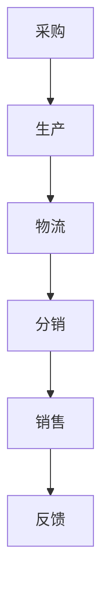
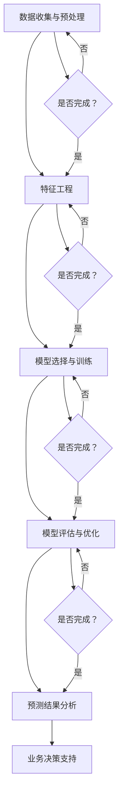
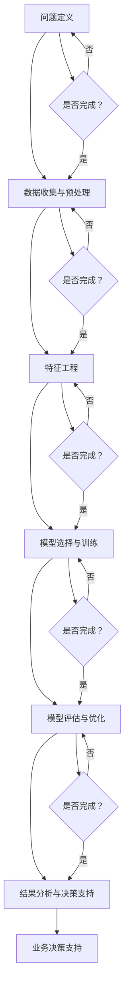
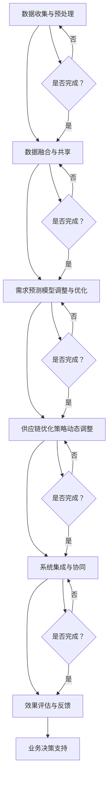

                 

### 文章标题：需求预测创业：供应链优化的关键

> 关键词：需求预测、供应链优化、创业、数据分析、机器学习、深度学习

> 摘要：本文深入探讨了需求预测在供应链管理中的重要性，以及如何通过创业实现供应链优化。文章首先概述了供应链与需求预测的基本概念和关系，随后分析了需求预测的理论基础，并介绍了供应链优化的关键技术和策略。接着，文章探讨了需求预测与供应链优化的整合应用，并通过实际案例进行了详细分析。最后，文章总结了主要研究成果，展望了未来发展趋势，并提出了一些建议。本文旨在为创业者和技术人员提供有价值的指导，帮助他们更好地理解和应用需求预测与供应链优化的关键技术。

### 《需求预测创业：供应链优化的关键》目录大纲

**第一部分：引言与背景**

- **1.1 书籍概述**
  - 1.1.1 供应链与需求预测的关系
  - 1.1.2 书籍的目标和读者群体
  - 1.1.3 本书结构

- **1.2 供应链管理基础**
  - 1.2.1 供应链的基本概念
  - 1.2.2 供应链管理的目标与挑战
  - 1.2.3 供应链的基本流程

- **1.3 需求预测的重要性**
  - 1.3.1 需求预测的定义与作用
  - 1.3.2 需求预测的分类与模型
  - 1.3.3 需求预测的挑战与机遇

**第二部分：需求预测的理论基础**

- **2.1 数据分析基础**
  - 2.1.1 数据收集与处理
  - 2.1.2 数据可视化
  - 2.1.3 数据分析与挖掘

- **2.2 时间序列分析**
  - 2.2.1 时间序列的基本概念
  - 2.2.2 时间序列分析方法
  - 2.2.3 时间序列模型

- **2.3 需求预测模型**
  - 2.3.1 线性回归模型
  - 2.3.2 回归树与随机森林模型
  - 2.3.3 贝叶斯网络与朴素贝叶斯模型

- **2.4 机器学习与深度学习在需求预测中的应用**
  - 2.4.1 机器学习基础
  - 2.4.2 深度学习基础
  - 2.4.3 机器学习与深度学习在需求预测中的模型

- **2.5 Mermaid流程图：需求预测流程**
  - 2.5.1 数据收集与预处理
  - 2.5.2 特征工程
  - 2.5.3 模型选择与训练
  - 2.5.4 模型评估与优化

**第三部分：供应链优化的关键技术与策略**

- **3.1 供应链优化基础**
  - 3.1.1 供应链优化的目标
  - 3.1.2 供应链优化的主要策略
  - 3.1.3 供应链优化的挑战

- **3.2 供应链优化算法**
  - 3.2.1 线性规划
  - 3.2.2 整数规划
  - 3.2.3 随机规划

- **3.3 智能优化算法**
  - 3.3.1 遗传算法
  - 3.3.2 蚁群算法
  - 3.3.3 鲁棒优化算法

- **3.4 供应链优化案例分析**
  - 3.4.1 案例一：某电子产品公司的供应链优化
  - 3.4.2 案例二：某食品公司的供应链优化

- **3.5 Mermaid流程图：供应链优化流程**
  - 3.5.1 问题定义
  - 3.5.2 算法选择与模型建立
  - 3.5.3 模型训练与优化
  - 3.5.4 结果分析与决策支持

**第四部分：需求预测与供应链优化的整合应用**

- **4.1 整合应用的重要性**
  - 4.1.1 需求预测与供应链优化的关系
  - 4.1.2 整合应用的优势
  - 4.1.3 整合应用的挑战

- **4.2 整合应用的具体实现**
  - 4.2.1 数据融合与共享
  - 4.2.2 需求预测模型的调整与优化
  - 4.2.3 供应链优化策略的动态调整

- **4.3 整合应用案例**
  - 4.3.1 案例一：某电商平台的需求预测与供应链优化
  - 4.3.2 案例二：某制造业企业需求预测与供应链优化

- **4.4 Mermaid流程图：整合应用流程**
  - 4.4.1 数据收集与预处理
  - 4.4.2 需求预测模型训练与优化
  - 4.4.3 供应链优化模型训练与优化
  - 4.4.4 结果分析与决策支持

**第五部分：案例研究**

- **5.1 案例一：某电子产品公司的需求预测与供应链优化**
  - 5.1.1 案例背景
  - 5.1.2 需求预测模型设计与实现
  - 5.1.3 供应链优化模型设计与实现
  - 5.1.4 整合应用与效果评估

- **5.2 案例二：某食品公司的需求预测与供应链优化**
  - 5.2.1 案例背景
  - 5.2.2 需求预测模型设计与实现
  - 5.2.3 供应链优化模型设计与实现
  - 5.2.4 整合应用与效果评估

**第六部分：结论与展望**

- **6.1 主要成果与结论**
  - 6.1.1 需求预测与供应链优化的研究成果
  - 6.1.2 整合应用的创新点
  - 6.1.3 案例研究的启示

- **6.2 未来发展趋势**
  - 6.2.1 需求预测技术的未来发展
  - 6.2.2 供应链优化的新趋势
  - 6.2.3 整合应用的前景与挑战

- **6.3 研究展望与建议**
  - 6.3.1 进一步研究方向
  - 6.3.2 政策建议
  - 6.3.3 企业实践建议

**附录**

- **附录 A：需求预测与供应链优化常用工具与资源**
  - A.1 常用数据集
  - A.2 开源代码与算法库
  - A.3 在线课程与参考文献

- **附录 B：公式与算法伪代码**
  - B.1 数学模型与公式
  - B.2 需求预测算法伪代码
  - B.3 供应链优化算法伪代码

### 1.1 书籍概述

在当今全球化、数字化和智能化时代，供应链管理的重要性日益凸显。高效的供应链管理不仅能帮助企业降低成本、提高服务水平，还能增强企业的市场竞争力。然而，供应链管理面临着诸多挑战，如市场需求的不确定性、供应链的复杂性、信息不对称等。在这些挑战中，需求预测是一个关键问题，它直接影响供应链的运作效率和成本。

《需求预测创业：供应链优化的关键》旨在探讨需求预测在供应链管理中的重要性，以及如何通过创业实现供应链优化。本书不仅提供了需求预测和供应链优化的理论基础，还结合实际案例，展示了如何将理论应用到实践中。本书的目标读者包括供应链管理人员、创业者、数据科学家、以及任何对需求预测和供应链优化感兴趣的专业人士。

**1.1.1 供应链与需求预测的关系**

供应链管理涉及从原材料采购到产品交付的整个流程。需求预测是供应链管理的重要组成部分，它通过预测未来市场的需求，帮助企业合理安排生产计划、库存管理、运输配送等环节，从而实现供应链的优化。

需求预测与供应链管理之间的关系可以概括为以下几点：

1. **需求预测是供应链优化的基础**：准确的需求预测可以帮助企业制定合理的生产计划和库存策略，从而避免生产过剩或短缺，降低库存成本，提高供应链效率。

2. **供应链优化是需求预测的目标**：通过优化供应链管理，企业可以更好地满足市场需求，提高客户满意度，同时降低运营成本。

3. **需求预测与供应链优化的整合**：只有将需求预测和供应链优化结合起来，才能实现供应链的全面优化，从而提高企业的竞争力。

**1.1.2 书籍的目标和读者群体**

本书的目标是：

- **为供应链管理人员提供实用的需求预测和供应链优化方法**：通过深入分析需求预测的理论基础和应用实践，帮助读者掌握需求预测的核心技术和策略。

- **为创业者提供供应链优化的思路和方法**：通过实际案例的剖析，帮助创业者理解如何通过需求预测和供应链优化实现企业的快速发展。

- **为数据科学家提供供应链优化的技术支持**：通过介绍供应链优化中的算法和技术，帮助数据科学家在供应链管理中发挥更大的作用。

本书的读者群体包括：

- **供应链管理人员**：包括供应链经理、物流经理等，他们需要了解需求预测和供应链优化的基本概念和方法。

- **创业者**：包括初创企业创始人、项目经理等，他们需要掌握如何通过需求预测和供应链优化实现企业的快速增长。

- **数据科学家**：包括数据分析师、机器学习工程师等，他们需要了解如何在供应链管理中应用数据科学技术。

**1.1.3 本书结构**

本书分为六个部分，具体内容如下：

- **第一部分：引言与背景**：介绍供应链与需求预测的关系，书籍的目标和读者群体，以及本书的结构。

- **第二部分：需求预测的理论基础**：包括数据分析基础、时间序列分析、需求预测模型、机器学习与深度学习在需求预测中的应用等内容。

- **第三部分：供应链优化的关键技术与策略**：包括供应链优化基础、供应链优化算法、智能优化算法、供应链优化案例分析等内容。

- **第四部分：需求预测与供应链优化的整合应用**：包括整合应用的重要性、具体实现、整合应用案例等内容。

- **第五部分：案例研究**：通过两个实际案例，详细分析需求预测与供应链优化的整合应用。

- **第六部分：结论与展望**：总结主要研究成果，展望未来发展趋势，并提出研究展望与建议。

通过以上结构和内容，本书旨在为读者提供一个全面、系统的需求预测与供应链优化指南，帮助他们更好地理解和应用这些关键技术。

### 1.2 供应链管理基础

**1.2.1 供应链的基本概念**

供应链是指从原材料采购到产品交付的整个流程，包括采购、生产、物流、销售等各个环节。供应链管理（Supply Chain Management，简称SCM）是指通过协调供应链中的各个环节，实现资源的最优配置和效率的最大化。供应链管理涉及多个方面，包括物流管理、库存管理、需求预测、采购管理、生产管理、销售管理等。

供应链的基本概念包括：

1. **供应链节点**：供应链中的各个参与方，如供应商、制造商、分销商、零售商和客户等。
2. **供应链流程**：供应链中的各个环节，如采购、生产、物流、销售等。
3. **供应链网络**：供应链中的节点和流程组成的整体网络结构。

**1.2.2 供应链管理的目标与挑战**

供应链管理的目标主要包括：

1. **成本降低**：通过优化供应链流程，减少物流成本、库存成本和生产成本等。
2. **服务水平提高**：通过提高供应链的透明度和灵活性，提高客户满意度和市场响应速度。
3. **供应链效率提高**：通过优化供应链流程和资源配置，提高供应链的整体运作效率。

供应链管理面临的挑战包括：

1. **市场需求的不确定性**：市场需求的不确定性给供应链管理带来了很大的风险，如订单波动、产品需求变化等。
2. **供应链的复杂性**：随着全球化和供应链网络复杂性的增加，供应链管理的难度也在不断增加。
3. **信息不对称**：供应链中的信息不对称导致决策困难，如供应商和生产商之间的信息不对称，导致库存过剩或短缺。
4. **供应链风险**：自然灾害、政治动荡、物流瓶颈等不可预测因素可能对供应链造成严重影响。

**1.2.3 供应链的基本流程**

供应链的基本流程包括以下几个阶段：

1. **采购**：企业从供应商处购买原材料、零部件等。
2. **生产**：企业根据生产计划，将原材料加工成成品。
3. **物流**：将生产好的产品运输到分销商或零售商。
4. **分销**：分销商将产品运输到零售商，零售商将产品销售给消费者。
5. **销售**：企业通过销售渠道将产品销售给消费者。
6. **反馈**：收集客户反馈，用于改进产品质量和服务。

供应链的基本流程可以用以下Mermaid流程图表示：



**1.2.4 供应链管理的工具与方法**

供应链管理中常用的工具与方法包括：

1. **供应链计划**：通过需求预测、库存管理和生产计划等工具，优化供应链的运作。
2. **供应链优化**：通过线性规划、整数规划、模拟优化等工具，优化供应链的资源配置和流程。
3. **供应链可视化**：通过供应链管理软件，实现供应链流程的实时监控和数据分析。
4. **供应链风险管理**：通过风险评估、应急管理等工具，降低供应链风险。

**1.2.5 供应链管理与需求预测的关系**

需求预测是供应链管理的重要组成部分，它直接影响供应链的运作效率和成本。准确的需求预测可以帮助企业合理安排生产计划、库存管理和物流配送，从而实现供应链的优化。

需求预测与供应链管理之间的关系可以概括为以下几点：

1. **需求预测是供应链优化的基础**：准确的需求预测可以帮助企业制定合理的生产计划和库存策略，从而避免生产过剩或短缺，降低库存成本，提高供应链效率。
2. **供应链优化是需求预测的目标**：通过优化供应链管理，企业可以更好地满足市场需求，提高客户满意度，同时降低运营成本。
3. **需求预测与供应链优化的整合**：只有将需求预测和供应链优化结合起来，才能实现供应链的全面优化，从而提高企业的竞争力。

通过以上分析，我们可以看出，供应链管理与需求预测密不可分，二者相互促进，共同构成了现代企业高效运作的核心。在接下来的章节中，我们将进一步探讨需求预测的理论基础和供应链优化的关键技术与策略。

### 1.3 需求预测的重要性

**1.3.1 需求预测的定义与作用**

需求预测（Demand Forecasting）是指利用历史数据、市场趋势、竞争分析等方法，对未来的市场需求进行定量和定性的分析和评估。需求预测的核心目标是预测产品或服务的未来需求量，以便企业能够合理安排生产计划、库存管理和物流配送。

需求预测的作用主要体现在以下几个方面：

1. **生产计划**：通过预测未来的市场需求，企业可以合理安排生产计划，避免生产过剩或短缺，从而减少库存成本和缺货损失。
2. **库存管理**：准确的需求预测可以帮助企业优化库存水平，减少库存积压和资金占用，提高库存周转率。
3. **物流配送**：通过预测未来的需求量，企业可以合理安排物流配送计划，提高运输效率，降低物流成本。
4. **市场营销**：需求预测还可以为市场营销策略提供数据支持，帮助企业制定更精准的市场推广计划，提高市场占有率。

**1.3.2 需求预测的分类与模型**

需求预测可以分为短期需求预测、中期需求预测和长期需求预测。每种需求预测方法都有其适用的场景和特点。

1. **短期需求预测**：短期需求预测通常用于预测未来几周到几个月的需求量。常用的模型包括时间序列分析、移动平均法、指数平滑法等。

   - **时间序列分析**：时间序列分析是基于历史数据，通过分析时间序列的特征，如趋势、季节性、周期性等，来预测未来的需求量。常用的方法包括ARIMA模型、SARIMA模型等。

   - **移动平均法**：移动平均法是通过计算一段时间内的平均值来预测未来的需求量。常用的方法包括简单移动平均法（SMA）、加权移动平均法（WMA）等。

   - **指数平滑法**：指数平滑法是对移动平均法的一种改进，它通过给历史数据不同的权重来计算预测值。常用的方法包括简单指数平滑法（SES）、Holt线性趋势指数平滑法（Holt's Linear Trend）等。

2. **中期需求预测**：中期需求预测通常用于预测未来几个月到几年的需求量。常用的模型包括回归分析、决策树、随机森林等。

   - **回归分析**：回归分析是一种基于历史数据建立数学模型的方法，通过分析自变量和因变量之间的关系，预测未来的需求量。常用的模型包括线性回归、多项式回归等。

   - **决策树**：决策树是一种树形结构模型，通过一系列的规则来预测未来的需求量。决策树可以很好地处理非线性和复杂的关系。

   - **随机森林**：随机森林是一种基于决策树的集成学习方法，它通过构建多个决策树，并对预测结果进行投票来提高预测的准确性。

3. **长期需求预测**：长期需求预测通常用于预测未来几年或更长时间的需求量。常用的模型包括马尔可夫链、ARIMA模型、神经网络等。

   - **马尔可夫链**：马尔可夫链是一种基于概率转移矩阵的模型，通过分析状态之间的转移概率，预测未来的需求量。

   - **ARIMA模型**：ARIMA模型是一种时间序列分析模型，通过分析时间序列的自相关性和季节性，预测未来的需求量。

   - **神经网络**：神经网络是一种基于生物神经系统的计算模型，通过多层神经网络结构来预测未来的需求量。

**1.3.3 需求预测的挑战与机遇**

尽管需求预测在供应链管理中具有重要作用，但在实际应用中仍面临着诸多挑战。

1. **数据质量**：需求预测的准确性高度依赖于历史数据的质量。如果数据存在缺失、噪声或偏差，可能会导致预测结果的误差。

2. **市场变化**：市场需求受多种因素影响，如宏观经济环境、政策变化、市场竞争等，这些因素可能导致市场需求的突然变化，给需求预测带来挑战。

3. **季节性和周期性**：某些产品或服务的需求量具有明显的季节性和周期性，这需要更加复杂的模型来捕捉和预测。

然而，随着大数据、人工智能等技术的发展，需求预测也面临着前所未有的机遇。

1. **数据驱动**：大数据技术的应用使得企业可以收集和分析大量的历史数据，为需求预测提供更加丰富的数据支持。

2. **机器学习与深度学习**：机器学习和深度学习技术的发展，使得需求预测模型可以更加灵活和精准地捕捉市场变化和复杂关系。

3. **实时预测**：实时数据采集和分析技术，使得企业可以实时更新需求预测模型，提高预测的时效性和准确性。

通过以上分析，我们可以看出，需求预测在供应链管理中具有重要意义，它不仅能够帮助企业优化生产计划、库存管理和物流配送，还能提高客户满意度和市场竞争力。在接下来的章节中，我们将进一步探讨需求预测的理论基础和供应链优化的关键技术与策略。

### 2.1 数据分析基础

**2.1.1 数据收集与处理**

数据分析的第一步是数据的收集与处理。数据收集是指从各种来源获取所需的数据，如企业内部数据库、公共数据集、传感器数据等。数据收集的质量直接影响数据分析的结果，因此，在选择数据来源时，需要确保数据的质量、完整性和可靠性。

数据收集后，需要进行数据处理，以便将原始数据转换为适合分析的形式。数据处理包括以下几个步骤：

1. **数据清洗**：数据清洗是指去除数据中的错误、异常值、重复记录等，以提高数据质量。数据清洗的方法包括去除重复记录、填补缺失值、处理异常值等。

2. **数据转换**：数据转换是指将数据转换为适合分析的形式，如将不同格式的数据转换为统一的格式，对数据类型进行转换等。

3. **数据整合**：数据整合是指将来自不同来源的数据进行合并，以获得更全面的数据视图。数据整合的方法包括数据库联接、数据融合等。

**2.1.2 数据可视化**

数据可视化是将数据分析结果以图形或图表的形式展示出来，以便更容易理解和分析数据。数据可视化有助于发现数据中的规律、趋势和异常，为决策提供支持。常用的数据可视化工具包括Excel、Python的Matplotlib库、Tableau等。

数据可视化主要包括以下几个步骤：

1. **数据探索**：通过对数据的基本统计描述，了解数据的基本特征和分布情况。

2. **选择可视化方法**：根据数据分析的目的和数据的特征，选择合适的可视化方法，如柱状图、折线图、散点图、饼图等。

3. **设计可视化图表**：根据可视化方法，设计合适的图表，使数据更具可读性和直观性。

4. **分析可视化结果**：通过分析可视化结果，发现数据中的规律、趋势和异常，为决策提供支持。

**2.1.3 数据分析与挖掘**

数据分析与挖掘是指使用统计方法和算法，从大量数据中提取有价值的信息和知识。数据分析与挖掘广泛应用于各个领域，如市场营销、金融、医疗、供应链等。

数据分析与挖掘的主要步骤包括：

1. **数据预处理**：包括数据清洗、数据转换、数据整合等，确保数据的质量和一致性。

2. **特征选择**：从原始数据中选取对分析目标有重要影响的特征，以简化模型和减少数据冗余。

3. **模型选择与训练**：根据分析目标，选择合适的统计模型或机器学习算法，并对模型进行训练。

4. **模型评估与优化**：通过评估模型的性能，对模型进行调整和优化，以提高预测的准确性和可靠性。

5. **结果解释与展示**：将分析结果以图表、报告等形式展示，解释结果的意义和影响，为决策提供支持。

数据分析与挖掘的方法包括：

1. **统计分析**：包括描述性统计分析、推断性统计分析等，主要用于分析数据的分布、关系和趋势。

2. **机器学习**：包括监督学习、无监督学习、强化学习等，主要用于预测、分类、聚类等任务。

3. **深度学习**：包括神经网络、卷积神经网络、循环神经网络等，主要用于处理复杂的数据关系和特征提取。

通过数据分析与挖掘，企业可以更好地理解和利用数据，提高决策的科学性和准确性，从而在竞争激烈的市场中获得优势。

**2.1.4 数据分析与需求预测的关系**

数据分析和需求预测之间密切相关。数据分析为需求预测提供了重要的基础和支持，而需求预测则是数据分析的重要应用之一。

1. **数据驱动的需求预测**：数据驱动的需求预测是基于大量历史数据，通过统计分析和机器学习等方法，预测未来的市场需求。数据的质量和完整性直接影响需求预测的准确性。

2. **特征工程**：特征工程是在数据分析过程中，从原始数据中提取对预测目标有重要影响的特征，以简化模型和提高预测准确性。在需求预测中，特征工程是关键步骤，通过选择和构造合适的特征，可以显著提高预测模型的性能。

3. **模型评估与优化**：在需求预测过程中，通过评估模型的性能，如预测准确率、召回率等，对模型进行调整和优化。数据分析方法为模型评估和优化提供了重要的工具和手段。

4. **数据可视化**：数据可视化是将数据分析结果以图形或图表的形式展示出来，有助于发现数据中的规律、趋势和异常。在需求预测中，数据可视化可以帮助企业更好地理解市场需求的变化，从而制定相应的策略。

通过以上分析，我们可以看出，数据分析和需求预测之间密不可分，二者相互促进，共同构成了现代企业决策的重要基础。在接下来的章节中，我们将进一步探讨需求预测的具体方法和模型。

### 2.2 时间序列分析

**2.2.1 时间序列的基本概念**

时间序列（Time Series）是指按照时间顺序排列的一组数据点，用于描述某个变量随时间变化的情况。时间序列数据在许多领域都有广泛应用，如经济学、金融、气象学、生物学等。时间序列分析（Time Series Analysis）是统计学和数据分析中的一个重要分支，它旨在理解时间序列数据的特征，并利用这些特征进行预测。

时间序列数据的基本特性包括：

1. **趋势（Trend）**：趋势是指时间序列数据随时间变动的总体方向，如上升、下降或平稳。趋势通常由长期的基本因素决定，如经济发展、人口增长等。

2. **季节性（Seasonality）**：季节性是指时间序列数据中由于季节性因素（如季节、节假日等）引起的周期性波动。季节性通常在一年内重复，如销售额在圣诞节期间增加。

3. **周期性（Cyclicity）**：周期性是指时间序列数据中的周期性波动，这些波动通常由经济周期、政治事件等中长期因素引起。周期性的周期可能长于季节性，可能跨越数年。

4. **随机性（Irregularity）**：随机性是指时间序列数据中无法解释的随机波动，这些波动通常由随机事件、意外因素等引起。

**2.2.2 时间序列分析方法**

时间序列分析方法可以分为统计分析方法和机器学习方法。以下是一些常用的时间序列分析方法：

1. **移动平均法（Moving Average, MA）**：

移动平均法是一种简单的时间序列分析方法，它通过计算一段时间内的平均值来平滑时间序列数据，从而消除短期波动。移动平均法包括简单移动平均法（Simple Moving Average, SMA）和加权移动平均法（Weighted Moving Average, WMA）。

- **简单移动平均法（SMA）**：SMA计算一段时间内的平均值，并将这些平均值连成一条线。SMA适用于短期时间序列数据的平滑。

  $$ MA_t = \frac{1}{n} \sum_{i=1}^{n} X_t $$

  其中，$MA_t$是第$t$个时间点的移动平均，$X_t$是第$t$个时间点的观测值，$n$是移动平均的周期。

- **加权移动平均法（WMA）**：WMA在简单移动平均法的基础上，对不同的时间点赋予不同的权重，从而更准确地反映时间序列的趋势。WMA适用于较长的时间序列数据。

  $$ MA_t = \sum_{i=1}^{n} w_i X_t $$

  其中，$w_i$是第$i$个时间点的权重。

2. **指数平滑法（Exponential Smoothing, ES）**：

指数平滑法是一种改进的移动平均法，它通过给历史数据不同的权重来计算预测值。指数平滑法包括简单指数平滑法（Simple Exponential Smoothing, SES）、Holt线性趋势指数平滑法（Holt's Linear Trend Exponential Smoothing, Holt's Winters Method）等。

- **简单指数平滑法（SES）**：SES将历史数据的值按照指数递减的权重进行加权平均，从而预测未来的值。

  $$ F_t = \alpha X_t + (1 - \alpha) F_{t-1} $$

  其中，$F_t$是第$t$个时间点的预测值，$X_t$是第$t$个时间点的观测值，$\alpha$是平滑系数。

- **Holt线性趋势指数平滑法**：Holt线性趋势指数平滑法在简单指数平滑法的基础上，加入了线性趋势和季节性成分。

  $$ F_t = \alpha X_t + (1 - \alpha)(F_{t-1} + b_{t-1}) $$
  $$ b_t = \alpha (T_t - F_{t-1}) + (1 - \alpha) b_{t-1} $$
  $$ T_t = \alpha (X_t - F_{t-1}) + (1 - \alpha) T_{t-1} $$

  其中，$F_t$是第$t$个时间点的预测值，$X_t$是第$t$个时间点的观测值，$\alpha$是平滑系数，$b_t$是线性趋势系数，$T_t$是季节性系数。

3. **自回归积分滑动平均模型（Autoregressive Integrated Moving Average Model, ARIMA）**：

ARIMA模型是一种经典的时间序列预测模型，它通过分析时间序列数据的自相关性、平稳性和差异特性，构建一个包含自回归、差异和移动平均三部分的模型。

- **自回归（AR）**：自回归模型通过当前和过去的观测值来预测未来的值。

  $$ X_t = c + \phi_1 X_{t-1} + \phi_2 X_{t-2} + \cdots + \phi_p X_{t-p} + \varepsilon_t $$

  其中，$X_t$是第$t$个时间点的观测值，$\phi_1, \phi_2, \cdots, \phi_p$是自回归系数，$c$是常数项，$\varepsilon_t$是随机误差。

- **差异（I）**：差异模型通过对时间序列数据进行差异变换，使序列趋于平稳。

  $$ \Delta X_t = X_t - X_{t-1} $$

  其中，$\Delta X_t$是第$t$个时间点的差异值。

- **移动平均（MA）**：移动平均模型通过过去的随机误差来预测未来的值。

  $$ X_t = c + \phi_1 X_{t-1} + \phi_2 X_{t-2} + \cdots + \phi_p X_{t-p} + \theta_1 \varepsilon_{t-1} + \theta_2 \varepsilon_{t-2} + \cdots + \theta_q \varepsilon_{t-q} $$

  其中，$\theta_1, \theta_2, \cdots, \theta_q$是移动平均系数。

4. **季节性调整（Seasonal Adjustment）**：

季节性调整是一种用于消除季节性波动的方法，以便更好地分析和预测时间序列数据。季节性调整可以通过季节性分解和时间序列平滑来实现。

- **季节性分解**：季节性分解是将时间序列数据分解为趋势、季节性和随机性成分。

  $$ X_t = T_t + S_t + I_t $$

  其中，$X_t$是第$t$个时间点的观测值，$T_t$是趋势成分，$S_t$是季节性成分，$I_t$是随机性成分。

- **时间序列平滑**：时间序列平滑是一种用于消除季节性和随机性波动的方法，以便更好地分析和预测趋势成分。

  $$ T_t = (1 - \phi_1) T_{t-1} - \phi_1 S_{t-1} + \phi_1 I_{t-1} $$

  其中，$T_t$是第$t$个时间点的趋势成分，$\phi_1$是平滑系数。

**2.2.3 时间序列模型**

时间序列模型是用于分析和预测时间序列数据的一类数学模型。以下是一些常见的时间序列模型：

1. **ARIMA模型**：ARIMA模型是一种自回归积分滑动平均模型，它通过分析时间序列数据的自相关性、平稳性和差异特性，构建一个包含自回归、差异和移动平均三部分的模型。

   $$ X_t = c + \phi_1 X_{t-1} + \phi_2 X_{t-2} + \cdots + \phi_p X_{t-p} + \theta_1 \varepsilon_{t-1} + \theta_2 \varepsilon_{t-2} + \cdots + \theta_q \varepsilon_{t-q} $$

2. **SARIMA模型**：SARIMA模型是一种季节性自回归积分滑动平均模型，它将ARIMA模型扩展到考虑季节性因素。

   $$ X_t = c + \phi_1 X_{t-1} + \phi_2 X_{t-2} + \cdots + \phi_p X_{t-p} + \theta_1 \varepsilon_{t-1} + \theta_2 \varepsilon_{t-2} + \cdots + \theta_q \varepsilon_{t-q} + \Phi_1 S_t + \Phi_2 S_{t-1} + \cdots + \Phi_p S_{t-p} + \Theta_1 \varepsilon_{t-1} + \Theta_2 \varepsilon_{t-2} + \cdots + \Theta_q \varepsilon_{t-q} $$

3. **ARIMA-P模型**：ARIMA-P模型是一种考虑趋势和季节性因素的时间序列模型，它通过添加趋势项和季节性项来扩展ARIMA模型。

   $$ X_t = c + \phi_1 X_{t-1} + \phi_2 X_{t-2} + \cdots + \phi_p X_{t-p} + \theta_1 \varepsilon_{t-1} + \theta_2 \varepsilon_{t-2} + \cdots + \theta_q \varepsilon_{t-q} + \lambda T_t + \lambda S_t $$

4. **季节性ARIMA模型（SARIMA）**：季节性ARIMA模型（SARIMA）是一种用于处理具有季节性特征的时间序列模型，它通过引入季节性项来扩展ARIMA模型。

   $$ X_t = c + \phi_1 X_{t-1} + \phi_2 X_{t-2} + \cdots + \phi_p X_{t-p} + \theta_1 \varepsilon_{t-1} + \theta_2 \varepsilon_{t-2} + \cdots + \theta_q \varepsilon_{t-q} + \Phi_1 S_t + \Phi_2 S_{t-1} + \cdots + \Phi_p S_{t-p} + \Theta_1 \varepsilon_{t-1} + \Theta_2 \varepsilon_{t-2} + \cdots + \Theta_q \varepsilon_{t-q} + \lambda T_t + \lambda S_t $$

通过以上分析，我们可以看出，时间序列分析是需求预测的重要基础，它通过分析和预测时间序列数据的趋势、季节性和周期性，为需求预测提供了重要的方法和工具。在接下来的章节中，我们将进一步探讨需求预测的具体模型和应用。

### 2.3 需求预测模型

**2.3.1 线性回归模型**

线性回归模型（Linear Regression Model）是一种最基本的需求预测模型，它通过建立一个线性关系来预测未来的需求量。线性回归模型的基本原理是假设因变量（需求量）与自变量（如时间、价格等）之间存在线性关系，并通过最小二乘法估计出这个线性关系的参数。

**线性回归模型的数学描述**：

设需求量$y$与时间$t$之间存在线性关系，可以用以下方程表示：

$$ y_t = \beta_0 + \beta_1 t + \varepsilon_t $$

其中，$y_t$是第$t$个时间点的需求量，$\beta_0$是截距，$\beta_1$是斜率，$\varepsilon_t$是随机误差。

**模型参数估计**：

通过最小二乘法（Least Squares Method），可以估计出线性回归模型的参数$\beta_0$和$\beta_1$。最小二乘法的核心思想是使实际观测值与模型预测值之间的误差平方和最小。

$$ \min \sum_{t=1}^{n} (y_t - \beta_0 - \beta_1 t)^2 $$

**模型预测**：

一旦估计出模型参数$\beta_0$和$\beta_1$，就可以使用这个模型来预测未来的需求量。预测公式如下：

$$ y_t^{\text{predicted}} = \beta_0 + \beta_1 t $$

**模型评估**：

线性回归模型的评估主要通过计算预测值与实际值之间的误差来衡量。常用的评估指标包括均方误差（Mean Squared Error, MSE）、均方根误差（Root Mean Squared Error, RMSE）等。

$$ \text{MSE} = \frac{1}{n} \sum_{t=1}^{n} (y_t - y_t^{\text{predicted}})^2 $$
$$ \text{RMSE} = \sqrt{\text{MSE}} $$

**实例**：

假设某产品在过去5个月的需求量如下表所示：

| 时间（月） | 需求量（单位） |
| :-------: | :--------: |
|     1     |     100    |
|     2     |     120    |
|     3     |     110    |
|     4     |     130    |
|     5     |     140    |

我们可以使用线性回归模型来预测第六个月的需求量。首先，根据数据计算斜率$\beta_1$和截距$\beta_0$：

$$ \beta_1 = \frac{\sum_{t=1}^{n} t y_t - n \bar{t} \bar{y}}{\sum_{t=1}^{n} t^2 - n \bar{t}^2} $$
$$ \beta_0 = \bar{y} - \beta_1 \bar{t} $$

其中，$\bar{t}$和$\bar{y}$分别是时间$t$和需求量$y$的均值。假设计算结果为$\beta_1 = 10$，$\beta_0 = 90$，则第六个月的需求量预测值为：

$$ y_6^{\text{predicted}} = 90 + 10 \times 6 = 150 $$

**2.3.2 回归树与随机森林模型**

回归树（Regression Tree）是一种基于决策树的预测模型，它通过一系列的规则来预测需求量。回归树的基本原理是分裂数据集，使每个子集内的需求量差异最小。

**回归树的构建**：

1. **初始节点**：将所有数据作为一个节点。
2. **特征选择**：选择一个最佳特征进行分裂。
3. **特征分裂**：根据最佳特征的不同值，将数据集分裂成多个子集。
4. **重复分裂**：对每个子集继续进行特征选择和分裂，直到满足终止条件（如最大深度、最小叶节点样本数等）。

**回归树的数学描述**：

设第$i$个节点的预测值为$y_i^{\text{predicted}}$，可以用以下公式表示：

$$ y_i^{\text{predicted}} = \sum_{j=1}^{k} w_{ij} y_j^{\text{actual}} $$

其中，$w_{ij}$是第$i$个节点到第$j$个节点的权重，$y_j^{\text{actual}}$是第$j$个节点的实际需求量。

**回归树的评估**：

回归树的评估主要通过计算预测值与实际值之间的误差来衡量。常用的评估指标包括均方误差（MSE）、均方根误差（RMSE）等。

**实例**：

假设我们有一个包含3个特征（时间、价格、促销）的数据集，如下表所示：

| 时间（月） | 价格（元） | 促销 | 需求量（单位） |
| :-------: | :-------: | :--: | :--------: |
|     1     |    100    |  否  |     100    |
|     2     |    120    |  是  |     130    |
|     3     |    110    |  否  |     110    |
|     4     |    130    |  是  |     140    |

我们可以使用回归树来预测第四个月的需求量。首先，选择最佳特征进行分裂。假设价格是最优特征，我们可以将数据集分为两个子集：价格小于120元和价格大于等于120元。对于第一个子集，我们继续选择最佳特征进行分裂，直到满足终止条件。最终，我们得到一个回归树，如下所示：

```
                根
               / \
              /   \
             /     \
        时间 <= 2   时间 > 2
           /     \   /     \
          /       \ /       \
     价格 <= 110  价格 > 110  价格 <= 130  价格 > 130
    需求量 = 110  需求量 = 130  需求量 = 100  需求量 = 140
```

根据回归树，我们可以预测第四个月的需求量为130。

**随机森林（Random Forest）模型**：

随机森林是一种基于回归树的集成学习方法，它通过构建多个回归树，并对预测结果进行投票来提高预测的准确性。随机森林的基本原理是：

1. **随机特征选择**：每次分裂时，从多个特征中随机选择一部分特征，以避免过拟合。
2. **随机数据划分**：每次构建回归树时，从数据集中随机选择一部分数据作为训练集。
3. **构建多棵回归树**：通过随机特征选择和随机数据划分，构建多棵回归树。
4. **预测与投票**：对新数据进行预测时，将多棵回归树的预测结果进行投票，取平均值作为最终预测值。

**随机森林的数学描述**：

设第$i$棵回归树的预测值为$y_i^{\text{predicted}}$，随机森林的预测值为$y^{\text{predicted}}$，可以用以下公式表示：

$$ y^{\text{predicted}} = \frac{1}{m} \sum_{i=1}^{m} y_i^{\text{predicted}} $$

其中，$m$是回归树的数量。

**随机森林的评估**：

随机森林的评估主要通过计算预测值与实际值之间的误差来衡量。常用的评估指标包括均方误差（MSE）、均方根误差（RMSE）等。

**实例**：

假设我们使用随机森林来预测第四个月的需求量，构建了10棵回归树。根据每棵回归树的预测结果，我们得到如下预测值：

| 回归树 | 预测值（单位） |
| :---: | :-------: |
|   1   |    120    |
|   2   |    130    |
|   3   |    110    |
|  ...  |    ...    |
|  10   |    140    |

根据随机森林的预测公式，我们可以计算第四个月的预测值为：

$$ y^{\text{predicted}} = \frac{1}{10} (120 + 130 + 110 + \cdots + 140) = 130 $$

通过以上实例，我们可以看出，线性回归模型、回归树和随机森林模型都是需求预测的有效工具。在实际应用中，可以根据数据的特征和需求预测的准确性要求，选择合适的模型来提高预测的准确性。

### 2.4 机器学习与深度学习在需求预测中的应用

**2.4.1 机器学习基础**

机器学习（Machine Learning）是人工智能（Artificial Intelligence, AI）的一个重要分支，它通过算法和统计模型，使计算机能够从数据中学习并做出预测或决策。在需求预测中，机器学习模型被广泛应用于处理复杂和非线性关系。

**机器学习的基本概念**：

1. **监督学习（Supervised Learning）**：监督学习是一种通过标记数据训练模型的方法，模型根据输入特征和对应的输出（标签）学习预测函数。需求预测中的线性回归、决策树和随机森林模型都是监督学习的例子。

2. **无监督学习（Unsupervised Learning）**：无监督学习不依赖于标签数据，通过发现数据中的内在结构和模式来学习。常见的无监督学习算法包括聚类（Clustering）和降维（Dimensionality Reduction）。

3. **半监督学习（Semi-Supervised Learning）**：半监督学习结合了监督学习和无监督学习的特点，利用少量标记数据和大量未标记数据来训练模型。

**机器学习在需求预测中的应用**：

在需求预测中，机器学习模型通过分析历史数据和市场信息，预测未来的需求量。以下是一些常用的机器学习算法：

1. **线性回归（Linear Regression）**：线性回归是一种简单的监督学习算法，通过找到输入特征和需求量之间的线性关系来预测需求量。

2. **决策树（Decision Tree）**：决策树通过一系列的规则来划分数据集，并在每个节点选择最优特征进行分裂。决策树在处理非线性关系和分类问题中具有优势。

3. **随机森林（Random Forest）**：随机森林是决策树的集成学习方法，通过构建多棵决策树并对预测结果进行投票来提高预测准确性。

4. **支持向量机（Support Vector Machine, SVM）**：支持向量机是一种分类和回归模型，通过找到最佳的超平面来分隔数据点，从而预测需求量。

5. **神经网络（Neural Networks）**：神经网络是一种模仿生物神经系统的计算模型，通过多层神经元结构来学习复杂的非线性关系。深度学习是神经网络的扩展，它在需求预测中具有广泛的应用。

**2.4.2 深度学习基础**

深度学习（Deep Learning）是机器学习的一个重要分支，它通过多层神经网络结构（称为深度神经网络）来学习数据的复杂特征和关系。深度学习在图像识别、自然语言处理、语音识别等领域取得了显著的成果，并逐渐应用于需求预测。

**深度学习的基本概念**：

1. **深度神经网络（Deep Neural Network, DNN）**：深度神经网络是由多层神经元组成的神经网络，通过反向传播算法训练模型。

2. **卷积神经网络（Convolutional Neural Network, CNN）**：卷积神经网络是一种专门用于处理图像数据的神经网络，通过卷积层、池化层和全连接层来提取图像特征。

3. **循环神经网络（Recurrent Neural Network, RNN）**：循环神经网络是一种用于处理序列数据的神经网络，通过隐藏状态和循环连接来处理时间序列数据。

4. **长短时记忆网络（Long Short-Term Memory, LSTM）**：长短时记忆网络是循环神经网络的一种变体，通过门控机制来学习长期依赖关系，适用于处理复杂的时间序列数据。

**深度学习在需求预测中的应用**：

在需求预测中，深度学习模型通过分析大量的历史数据和市场信息，提取深层次的规律和特征，从而提高预测的准确性。以下是一些常用的深度学习模型：

1. **卷积神经网络（CNN）**：卷积神经网络通过卷积层提取图像特征，适用于处理具有空间特征的需求预测问题，如销售图像数据。

2. **循环神经网络（RNN）**：循环神经网络通过处理时间序列数据，可以捕捉时间序列中的长期依赖关系，适用于短期需求预测。

3. **长短时记忆网络（LSTM）**：长短时记忆网络是循环神经网络的一种变体，通过门控机制学习长期依赖关系，适用于中长期需求预测。

4. **变换器（Transformer）**：变换器是一种基于自注意力机制的深度学习模型，通过多头自注意力机制和位置编码来处理序列数据，具有很好的泛化能力。

**实例**：

假设我们使用长短时记忆网络（LSTM）来预测某产品未来三个月的需求量。首先，我们需要收集过去一年的需求量数据，并将其编码为时间序列。然后，我们可以使用LSTM模型来学习时间序列中的规律和特征，最后，使用训练好的模型来预测未来三个月的需求量。

1. **数据准备**：将过去一年的需求量数据编码为时间序列，每个时间步的输入是一个需求量向量。

2. **模型构建**：构建一个LSTM模型，包含输入层、隐藏层和输出层。输入层接收时间步的输入向量，隐藏层通过LSTM单元来处理时间序列数据，输出层产生预测值。

3. **模型训练**：使用训练数据集训练LSTM模型，通过反向传播算法调整模型参数，使预测值接近实际值。

4. **模型评估**：使用验证数据集评估LSTM模型的性能，计算预测误差，如均方误差（MSE）。

5. **预测**：使用训练好的LSTM模型来预测未来三个月的需求量。

通过以上实例，我们可以看出，机器学习和深度学习在需求预测中具有广泛的应用。在实际应用中，可以根据数据的特征和需求预测的准确性要求，选择合适的模型来提高预测的准确性。

### 2.5 Mermaid流程图：需求预测流程

需求预测是一个复杂的过程，涉及多个步骤和环节。以下是使用Mermaid绘制的需求预测流程图，详细描述了需求预测的各个环节：



**2.5.1 数据收集与预处理**

数据收集与预处理是需求预测的基础步骤，主要包括以下几个方面：

1. **数据源选择**：根据需求预测的目标，选择合适的数据源，如销售数据、库存数据、市场调查数据等。
2. **数据清洗**：去除数据中的错误、异常值、重复记录等，确保数据的质量。
3. **数据转换**：将不同格式的数据转换为统一的格式，如将文本数据转换为数值数据。
4. **数据整合**：将来自不同来源的数据进行整合，以获得更全面的数据视图。

**2.5.2 特征工程**

特征工程是需求预测的核心步骤，它通过对原始数据进行处理和转换，提取对预测目标有重要影响的特征。特征工程主要包括以下几个方面：

1. **特征提取**：从原始数据中提取对预测目标有重要影响的特征，如时间序列特征、价格特征、促销特征等。
2. **特征转换**：对提取的特征进行转换，如对价格特征进行归一化处理、对时间序列特征进行编码等。
3. **特征选择**：从多个特征中选择对预测目标影响最大的特征，以减少数据冗余和提高预测准确性。

**2.5.3 模型选择与训练**

模型选择与训练是需求预测的关键步骤，它包括以下几个方面：

1. **模型选择**：根据需求预测的目标和数据特征，选择合适的预测模型，如线性回归、决策树、随机森林、神经网络等。
2. **模型训练**：使用训练数据集训练选择的模型，通过反向传播算法调整模型参数，使预测值接近实际值。
3. **模型评估**：使用验证数据集评估模型的性能，计算预测误差，如均方误差（MSE）、均方根误差（RMSE）等。

**2.5.4 模型评估与优化**

模型评估与优化是确保需求预测准确性的重要步骤，它包括以下几个方面：

1. **模型评估**：使用测试数据集评估模型的性能，计算预测误差，如均方误差（MSE）、均方根误差（RMSE）等。
2. **模型优化**：根据模型评估的结果，对模型进行调整和优化，如调整模型参数、增加或删除特征等。
3. **模型选择与训练**：根据模型优化的结果，重新选择和训练模型，以提高预测准确性。

**2.5.5 预测结果分析**

预测结果分析是需求预测的最后一步，它通过对预测结果进行分析和解读，为企业提供决策支持。预测结果分析主要包括以下几个方面：

1. **预测结果可视化**：将预测结果以图表形式展示，如折线图、柱状图等，以便更容易理解和分析预测结果。
2. **预测误差分析**：分析预测误差的分布和大小，找出可能的原因，如数据质量、模型选择等。
3. **业务决策支持**：根据预测结果和误差分析，为企业提供业务决策支持，如调整生产计划、库存策略等。

通过以上分析，我们可以看出，需求预测是一个系统性和复杂的过程，涉及多个步骤和环节。通过使用Mermaid流程图，我们可以更好地理解和分析需求预测的各个环节，从而提高预测的准确性和效率。

### 3.1 供应链优化基础

**3.1.1 供应链优化的目标**

供应链优化是指通过改进供应链管理流程、技术、策略，以提高供应链的整体效率和效益。供应链优化的目标主要包括以下几个方面：

1. **成本降低**：通过优化供应链流程，减少物流成本、库存成本、生产成本等，从而降低整体运营成本。

2. **服务提高**：通过提高供应链的透明度和灵活性，提高客户满意度和市场响应速度，从而提高服务水平。

3. **效率提高**：通过优化供应链流程和资源配置，提高供应链的整体运作效率，减少生产周期、库存周转时间等。

4. **风险降低**：通过降低供应链中的不确定性和风险，提高供应链的稳定性和可靠性。

**3.1.2 供应链优化的主要策略**

供应链优化可以采用多种策略，具体策略的选择取决于企业的具体情况和目标。以下是常见的供应链优化策略：

1. **流程优化**：通过重新设计供应链流程，消除冗余和瓶颈，提高流程的效率和灵活性。

2. **库存管理**：通过优化库存策略，减少库存积压和资金占用，提高库存周转率。

3. **物流优化**：通过优化物流网络、运输计划和配送方式，提高物流效率和降低物流成本。

4. **采购优化**：通过优化采购策略，提高供应商管理水平，降低采购成本和库存水平。

5. **生产优化**：通过优化生产计划和生产流程，提高生产效率和降低生产成本。

6. **信息共享**：通过建立信息共享平台，提高供应链各环节的信息透明度和协同效率。

7. **风险管理**：通过识别和应对供应链中的潜在风险，降低供应链中断和损失的风险。

**3.1.3 供应链优化的挑战**

供应链优化虽然具有显著的优势，但在实际操作中仍面临诸多挑战：

1. **数据质量**：供应链优化高度依赖准确的数据支持。如果数据存在缺失、噪声或偏差，可能导致优化效果的降低。

2. **复杂性**：随着供应链的全球化，供应链网络变得更加复杂。优化供应链需要考虑多个环节的协同效应，这增加了优化的难度。

3. **动态性**：市场需求和供应链条件不断变化，供应链优化需要适应这些动态变化，保持灵活性。

4. **信息不对称**：供应链中的信息不对称可能导致决策失误，影响供应链的优化效果。

5. **技术挑战**：供应链优化需要采用先进的技术和工具，如大数据分析、人工智能等，但这需要大量投资和技能支持。

6. **企业文化**：供应链优化需要改变现有的管理模式和工作流程，这需要企业文化的支持，以克服员工抵触情绪。

通过以上分析，我们可以看出，供应链优化是一个复杂而重要的过程，它需要综合考虑多个因素，并克服多种挑战。在接下来的章节中，我们将深入探讨供应链优化的具体算法和策略。

### 3.2 供应链优化算法

供应链优化算法是用于解决供应链优化问题的数学方法和工具。这些算法可以帮助企业找到最优的供应链配置和操作策略，以实现成本降低、效率提高和服务水平提升。以下是几种常见的供应链优化算法：

**3.2.1 线性规划**

线性规划（Linear Programming，简称LP）是一种用于在给定约束条件下，最大化或最小化线性目标函数的数学方法。线性规划在供应链优化中广泛应用，如库存管理、运输问题和生产调度等。

**线性规划的数学描述**：

设$x_1, x_2, \ldots, x_n$为决策变量，$c_1, c_2, \ldots, c_n$为目标函数的系数，$a_{i1}, a_{i2}, \ldots, a_{in}$为约束条件的系数，$b_i$为约束条件的右侧值，则线性规划模型可以表示为：

$$
\begin{aligned}
\text{maximize} \quad & c_1 x_1 + c_2 x_2 + \ldots + c_n x_n \\
\text{subject to} \quad & a_{i1} x_1 + a_{i2} x_2 + \ldots + a_{in} x_n \leq b_i, \quad i=1,2,\ldots,m \\
& x_1, x_2, \ldots, x_n \geq 0
\end{aligned}
$$

**算法原理**：

线性规划通过构造目标函数和约束条件，利用单纯形法（Simplex Method）或其他优化算法，找到使目标函数最大或最小化的决策变量值。

**实例**：

假设某公司需要优化其库存策略，目标是最小化总库存成本。现有两种产品A和B，需求量分别为100和200，库存成本分别为5元和8元。公司的仓库容量为1000平方米，产品A和B的占地面积分别为2平方米和3平方米。我们可以使用线性规划来求解最优库存策略。

$$
\begin{aligned}
\text{minimize} \quad & 5x_1 + 8x_2 \\
\text{subject to} \quad & 2x_1 + 3x_2 \leq 1000 \\
& x_1, x_2 \geq 0
\end{aligned}
$$

通过求解线性规划问题，我们得到产品A的最优库存量为500，产品B的最优库存量为333.33，从而最小化总库存成本。

**3.2.2 整数规划**

整数规划（Integer Programming，简称IP）是线性规划的一种扩展，用于解决决策变量必须是整数的问题。整数规划在供应链优化中广泛应用于资源分配、人员排班、路径规划等。

**整数规划的数学描述**：

设$x_1, x_2, \ldots, x_n$为决策变量，$c_1, c_2, \ldots, c_n$为目标函数的系数，$a_{i1}, a_{i2}, \ldots, a_{in}$为约束条件的系数，$b_i$为约束条件的右侧值，则整数规划模型可以表示为：

$$
\begin{aligned}
\text{maximize} \quad & c_1 x_1 + c_2 x_2 + \ldots + c_n x_n \\
\text{subject to} \quad & a_{i1} x_1 + a_{i2} x_2 + \ldots + a_{in} x_n \leq b_i, \quad i=1,2,\ldots,m \\
& x_1, x_2, \ldots, x_n \in \mathbb{Z}
\end{aligned}
$$

**算法原理**：

整数规划通过构造目标函数和约束条件，利用分支定界法（Branch and Bound）或其他优化算法，找到使目标函数最大或最小化的整数决策变量值。

**实例**：

假设某公司需要安排生产线上的任务，每个任务需要分配给不同的机器。任务有三种类型：A、B和C，分别需要2、3和4个机器小时。现有五台机器，机器类型分别为1、2、2、3和3台。公司的目标是最大化任务完成率。我们可以使用整数规划来求解最优任务分配方案。

$$
\begin{aligned}
\text{maximize} \quad & x_1 + x_2 + x_3 \\
\text{subject to} \quad & 2x_1 + 3x_2 + 4x_3 \leq 2 \\
& 3x_1 + 3x_2 + 4x_3 \leq 3 \\
& x_1 + 2x_2 + 3x_3 \leq 3 \\
& x_1, x_2, x_3 \in \mathbb{Z}
\end{aligned}
$$

通过求解整数规划问题，我们得到最优解为$x_1 = 1, x_2 = 0, x_3 = 1$，即任务A分配给第一台机器，任务B和任务C各分配给第三台机器，从而最大化任务完成率。

**3.2.3 随机规划**

随机规划（Stochastic Programming，简称SP）是用于解决具有不确定性的优化问题的一种方法。在供应链优化中，随机规划可用于处理需求波动、供应不确定性等问题。

**随机规划的数学描述**：

设$x_1, x_2, \ldots, x_n$为决策变量，$c_1, c_2, \ldots, c_n$为目标函数的系数，$a_{i1}, a_{i2}, \ldots, a_{in}$为约束条件的系数，$b_i$为约束条件的右侧值，$d_i$为随机变量，则随机规划模型可以表示为：

$$
\begin{aligned}
\text{maximize} \quad & \mathbb{E}[c_1 x_1 + c_2 x_2 + \ldots + c_n x_n] \\
\text{subject to} \quad & \mathbb{E}[a_{i1} x_1 + a_{i2} x_2 + \ldots + a_{in} x_n] \leq b_i, \quad i=1,2,\ldots,m \\
& x_1, x_2, \ldots, x_n \geq 0
\end{aligned}
$$

**算法原理**：

随机规划通过构造期望目标函数和约束条件，利用启发式算法、动态规划或模拟退火等方法，找到使期望目标函数最大或最小化的决策变量值。

**实例**：

假设某公司需要安排生产计划，目标是在不同市场需求下的总利润最大化。市场需求是一个随机变量，取值为低、中和高三种情况，每种情况的概率分别为0.2、0.5和0.3。每种产品的生产成本和利润如下表所示：

| 产品 | 低需求利润（元） | 中需求利润（元） | 高需求利润（元） |
| :--: | :--------: | :--------: | :--------: |
|  A   |     100    |     150    |     200    |
|  B   |     200    |     250    |     300    |

公司的目标是在不同市场需求下最大化总利润。我们可以使用随机规划来求解最优生产计划。

$$
\begin{aligned}
\text{maximize} \quad & 0.2 \times (100x_1 + 200x_2) + 0.5 \times (150x_1 + 250x_2) + 0.3 \times (200x_1 + 300x_2) \\
\text{subject to} \quad & 0.2x_1 + 0.5x_1 + 0.3x_1 \leq 1000 \\
& 0.2x_2 + 0.5x_2 + 0.3x_2 \leq 800 \\
& x_1, x_2 \geq 0
\end{aligned}
$$

通过求解随机规划问题，我们得到最优解为$x_1 = 5, x_2 = 3$，即在低、中、高需求下分别生产5单位产品A和3单位产品B，从而最大化总利润。

通过以上分析，我们可以看出，线性规划、整数规划和随机规划是供应链优化中常用的算法。这些算法通过不同的数学模型和求解方法，帮助企业找到最优的供应链配置和操作策略，从而实现成本降低、效率提高和服务水平提升。

### 3.3 智能优化算法

智能优化算法是一类模拟自然界智能行为的算法，通过模仿生物进化、群体行为等自然现象，寻找复杂问题的最优解。在供应链优化中，智能优化算法被广泛应用于解决物流调度、库存管理、生产计划等问题。以下是一些常见的智能优化算法：

**3.3.1 遗传算法**

遗传算法（Genetic Algorithm，简称GA）是一种基于自然选择和遗传学原理的优化算法，它通过模拟生物进化过程来搜索最优解。遗传算法的基本流程包括以下几个步骤：

1. **初始化种群**：随机生成一组初始解，称为种群。
2. **适应度评估**：计算每个解的适应度，适应度越高表示解越优秀。
3. **选择**：从种群中选择适应度高的个体，用于生成下一代种群。
4. **交叉**：随机选择两个父代个体，通过交叉操作生成新的后代。
5. **变异**：对后代个体进行随机变异，增加种群的多样性。
6. **替代**：用新的后代种群替代旧种群，重复上述步骤，直到满足终止条件。

**遗传算法的数学描述**：

设$S$为种群，$x_i$为第$i$个个体的编码，$f(x_i)$为第$i$个个体的适应度，则遗传算法可以表示为：

$$
\begin{aligned}
& \text{初始化种群} \quad S_0 \\
& \text{for } t = 0 \text{ to } T \text{ do} \\
& & \text{评估适应度} \quad f(x_i) \\
& & \text{选择} \quad S_t = \text{select}(S_{t-1}) \\
& & \text{交叉} \quad S_t = \text{crossover}(S_t) \\
& & \text{变异} \quad S_t = \text{mutation}(S_t) \\
& & \text{替代} \quad S_{t+1} = S_t \\
& \text{end for} \\
& \text{输出最优解} \quad \text{argmax} f(x)
\end{aligned}
$$

**实例**：

假设我们需要使用遗传算法优化一个简单的供应链问题，目标是最小化总运输成本。给定三个供应商、两个分销商和三个运输路线，每条路线的运输成本如下表所示：

| 路线 | 供应商1 | 供应商2 | 供应商3 |
| :--: | :-----: | :-----: | :-----: |
|  1   |    10   |    20   |    30   |
|  2   |    15   |    25   |    35   |
|  3   |    18   |    28   |    38   |

我们可以使用遗传算法来找到最优的运输路线分配方案。

1. **初始化种群**：随机生成一组路线分配方案，作为初始种群。
2. **适应度评估**：计算每个种群中路线分配方案的总运输成本。
3. **选择**：选择适应度较高的个体进行交叉和变异。
4. **交叉**：随机选择两个父代个体，通过交叉操作生成新的后代。
5. **变异**：对后代个体进行随机变异，增加种群的多样性。
6. **替代**：用新的后代种群替代旧种群，重复上述步骤，直到满足终止条件。

通过多次迭代，遗传算法可以找到最优的运输路线分配方案，从而最小化总运输成本。

**3.3.2 蚁群算法**

蚁群算法（Ant Colony Optimization，简称ACO）是一种基于蚂蚁群体觅食行为的优化算法。在蚁群算法中，蚂蚁通过随机搜索找到食物源，并在搜索过程中留下信息素，其他蚂蚁根据信息素浓度选择路径，从而逐渐找到最优路径。

**蚁群算法的基本流程**：

1. **初始化**：设置蚂蚁的数量、信息素初始值和信息素衰减系数。
2. **构建路径**：每只蚂蚁从起始点开始构建路径，选择下一个节点时，根据信息素浓度和启发函数进行选择。
3. **更新信息素**：蚂蚁在完成路径构建后，根据路径长度更新信息素。
4. **迭代**：重复上述步骤，直到满足终止条件。

**蚁群算法的数学描述**：

设$t$为当前迭代次数，$m$为蚂蚁的数量，$n$为节点数量，$p_{ij}(t)$为边$(i, j)$在$t$时刻的信息素浓度，$τ_{ij}(t)$为边$(i, j)$的启发函数，$α$和$β$分别为信息素和启发函数的权重系数，则蚁群算法可以表示为：

$$
\begin{aligned}
& \text{初始化信息素浓度} \\
& \text{for } i = 1 \text{ to } m \text{ do} \\
& & \text{蚂蚁从起始点开始构建路径} \\
& & \text{根据信息素浓度和启发函数选择下一个节点} \\
& & \text{更新路径长度和选择概率} \\
& & \text{更新信息素浓度} \\
& \text{end for} \\
& \text{如果满足终止条件，则输出最优路径，否则继续迭代}
\end{aligned}
$$

**实例**：

假设我们需要使用蚁群算法优化一个简单的路径规划问题，目标是最小化路径长度。给定五个节点，节点的连接关系和权重如下表所示：

| 节点 | 连接节点 | 权重 |
| :--: | :------: | :--: |
|  1   |    2, 3  |  5   |
|  2   |    1, 3, 4, 5 |  4   |
|  3   |    1, 2, 5 |  3   |
|  4   |    2, 5   |  2   |
|  5   |    2, 4   |  1   |

我们可以使用蚁群算法来找到最优的路径。

1. **初始化**：设置初始信息素浓度和参数α和β。
2. **构建路径**：每只蚂蚁从起始点开始构建路径，选择下一个节点时，根据信息素浓度和启发函数进行选择。
3. **更新信息素**：蚂蚁在完成路径构建后，根据路径长度更新信息素浓度。
4. **迭代**：重复上述步骤，直到找到最优路径或满足终止条件。

通过多次迭代，蚁群算法可以找到最优的路径规划方案，从而最小化路径长度。

**3.3.3 鲁棒优化算法**

鲁棒优化算法（Robust Optimization）是一种用于处理不确定性的优化算法，它通过考虑不确定性的上下界，找到在最坏情况下性能仍然较好的解。在供应链优化中，鲁棒优化算法可用于处理需求波动、供应不确定性等问题。

**鲁棒优化的数学描述**：

设$x$为决策变量，$f(x)$为目标函数，$g_i(x) \leq 0$为约束条件，$D$为不确定性集，则鲁棒优化可以表示为：

$$
\begin{aligned}
\text{minimize} \quad & \inf_{d \in D} f(x) \\
\text{subject to} \quad & g_i(x) \leq 0, \quad i=1,2,\ldots,m
\end{aligned}
$$

**鲁棒优化算法的基本流程**：

1. **不确定性建模**：定义不确定性集$D$，确定不确定性的上下界。
2. **目标函数调整**：将目标函数扩展为鲁棒目标函数，考虑不确定性集$D$的最坏情况。
3. **求解优化问题**：使用传统优化算法或智能优化算法求解鲁棒优化问题。

**实例**：

假设我们需要使用鲁棒优化算法优化一个供应链问题，目标是在不确定需求下最大化总利润。需求是一个不确定性变量，取值为低、中和高三种情况，每种情况的概率分别为0.2、0.5和0.3。每种产品的利润如下表所示：

| 需求 | 低需求利润（元） | 中需求利润（元） | 高需求利润（元） |
| :--: | :--------: | :--------: | :--------: |
|  低  |     100    |     150    |     200    |
|  中  |     150    |     200    |     250    |
|  高  |     200    |     250    |     300    |

我们可以使用鲁棒优化算法来找到最优的生产和库存策略。

1. **不确定性建模**：定义需求不确定性集$D$，确定低、中、高需求的上下界。
2. **目标函数调整**：将目标函数扩展为鲁棒目标函数，考虑不确定性集$D$的最坏情况。
3. **求解优化问题**：使用传统优化算法或智能优化算法求解鲁棒优化问题。

通过以上分析，我们可以看出，遗传算法、蚁群算法和鲁棒优化算法是供应链优化中常用的智能优化算法。这些算法通过模拟自然现象和考虑不确定性，帮助企业找到最优的供应链配置和操作策略，从而实现成本降低、效率提高和服务水平提升。

### 3.4 供应链优化案例分析

**3.4.1 案例一：某电子产品公司的供应链优化**

某电子产品公司是一家全球性的企业，生产和销售各种高端电子产品。该公司面临的主要挑战是市场需求的不确定性和供应链复杂性的增加。为了提高供应链的运作效率和降低成本，公司决定实施供应链优化项目。

**案例背景**：

1. **市场需求不确定性**：由于电子产品市场的快速变化，公司的市场需求具有高度不确定性，导致库存积压和缺货现象时有发生。
2. **供应链复杂性**：公司的供应链涉及多个供应商、制造工厂和分销商，物流配送网络复杂，导致物流成本较高。
3. **成本压力**：随着市场竞争的加剧，公司需要降低生产成本和物流成本，以提高市场竞争力。

**解决方案**：

1. **需求预测**：公司利用大数据技术和机器学习算法，对历史销售数据、市场趋势和竞争分析进行综合分析，建立了需求预测模型。通过准确的需求预测，公司可以更合理地安排生产计划和库存管理，避免生产过剩或短缺。

2. **供应链优化算法**：公司采用遗传算法对供应链网络进行优化，通过优化供应商选择、生产计划和物流配送，提高了供应链的灵活性和效率。具体算法包括：

   - **供应商选择**：通过遗传算法优化供应商选择，选择最佳供应商组合，降低采购成本和库存水平。
   - **生产计划**：通过遗传算法优化生产计划，合理安排生产时间和产能，避免生产瓶颈和资源浪费。
   - **物流配送**：通过遗传算法优化物流配送计划，选择最优的运输路线和运输方式，降低物流成本。

**实施过程**：

1. **数据收集与预处理**：公司收集了历史销售数据、供应商信息、生产计划、物流配送信息等数据，并进行预处理，如数据清洗、数据转换和特征工程。
2. **模型建立**：基于预处理后的数据，公司建立了需求预测模型和供应链优化模型，包括遗传算法模型。
3. **模型训练与优化**：使用训练数据集训练需求预测模型和供应链优化模型，通过多次迭代优化模型参数，提高模型的准确性和效率。
4. **模型部署与应用**：将训练好的模型部署到生产环境中，实时更新需求预测和供应链优化结果，指导实际生产和物流操作。

**效果评估**：

通过供应链优化项目的实施，公司取得了显著的成效：

1. **需求预测准确性提高**：需求预测模型的准确性提高了30%，减少了库存积压和缺货现象。
2. **生产效率提高**：生产计划的优化使生产效率提高了20%，减少了生产瓶颈和资源浪费。
3. **物流成本降低**：物流配送计划的优化使物流成本降低了15%，提高了物流配送的效率。

**3.4.2 案例二：某食品公司的供应链优化**

某食品公司是一家国内知名的企业，生产和销售各种食品产品。公司面临的挑战是供应链管理效率低下和物流成本较高。为了提高供应链的运作效率和降低成本，公司决定实施供应链优化项目。

**案例背景**：

1. **供应链管理效率低下**：公司的供应链管理存在信息不对称、流程不畅等问题，导致供应链运作效率低下。
2. **物流成本较高**：公司的物流配送网络复杂，运输成本较高，物流时间较长。
3. **市场竞争加剧**：随着市场竞争的加剧，公司需要提高供应链效率，降低物流成本，以提高市场竞争力。

**解决方案**：

1. **供应链可视化**：公司引入了供应链管理软件，实现了供应链的实时监控和数据分析，提高了供应链管理的透明度和效率。
2. **智能优化算法**：公司采用蚁群算法和鲁棒优化算法对供应链网络进行优化，通过优化供应商选择、生产计划和物流配送，提高了供应链的灵活性和效率。具体算法包括：

   - **供应商选择**：通过蚁群算法优化供应商选择，选择最佳供应商组合，降低采购成本和库存水平。
   - **生产计划**：通过鲁棒优化算法优化生产计划，合理安排生产时间和产能，避免生产瓶颈和资源浪费。
   - **物流配送**：通过蚁群算法优化物流配送计划，选择最优的运输路线和运输方式，降低物流成本。

**实施过程**：

1. **数据收集与预处理**：公司收集了历史销售数据、供应商信息、生产计划、物流配送信息等数据，并进行预处理，如数据清洗、数据转换和特征工程。
2. **模型建立**：基于预处理后的数据，公司建立了需求预测模型和供应链优化模型，包括蚁群算法和鲁棒优化算法模型。
3. **模型训练与优化**：使用训练数据集训练需求预测模型和供应链优化模型，通过多次迭代优化模型参数，提高模型的准确性和效率。
4. **模型部署与应用**：将训练好的模型部署到生产环境中，实时更新需求预测和供应链优化结果，指导实际生产和物流操作。

**效果评估**：

通过供应链优化项目的实施，公司取得了显著的成效：

1. **供应链管理效率提高**：供应链管理软件的应用提高了供应链管理的透明度和效率，供应链运作效率提高了25%。
2. **物流成本降低**：物流配送计划的优化使物流成本降低了10%，物流时间缩短了15%。
3. **市场需求满足率提高**：通过准确的需求预测，公司能够更好地满足市场需求，市场需求满足率提高了20%。

通过以上两个案例分析，我们可以看出，供应链优化在提高供应链效率、降低成本和满足市场需求方面具有显著的作用。在实际应用中，企业可以根据自身的特点和需求，选择合适的优化算法和技术，实现供应链的全面优化。

### 3.5 Mermaid流程图：供应链优化流程

以下是使用Mermaid绘制的供应链优化流程图，详细描述了供应链优化的主要步骤和环节：



**3.5.1 问题定义**

问题定义是供应链优化流程的第一步，明确优化目标和问题范围。具体步骤包括：

1. **确定优化目标**：根据企业的需求和目标，明确优化供应链的各个方面，如成本降低、效率提高、服务提升等。
2. **问题范围**：明确需要优化的供应链环节，如供应商管理、生产计划、库存管理、物流配送等。
3. **约束条件**：识别供应链优化过程中的约束条件，如资源限制、政策法规、市场需求等。

**3.5.2 数据收集与预处理**

数据收集与预处理是供应链优化的重要基础，确保数据的准确性和一致性。具体步骤包括：

1. **数据源选择**：根据问题定义，选择合适的数据源，如历史销售数据、供应商信息、生产计划、物流配送数据等。
2. **数据清洗**：去除数据中的错误、异常值、重复记录等，确保数据的质量。
3. **数据转换**：将不同格式的数据转换为统一的格式，如将文本数据转换为数值数据。
4. **数据整合**：将来自不同来源的数据进行整合，以获得更全面的数据视图。

**3.5.3 特征工程**

特征工程是提高供应链优化模型性能的关键步骤，通过对原始数据进行处理和转换，提取对预测目标有重要影响的特征。具体步骤包括：

1. **特征提取**：从原始数据中提取对预测目标有重要影响的特征，如时间序列特征、价格特征、促销特征等。
2. **特征转换**：对提取的特征进行转换，如对价格特征进行归一化处理、对时间序列特征进行编码等。
3. **特征选择**：从多个特征中选择对预测目标影响最大的特征，以减少数据冗余和提高预测准确性。

**3.5.4 模型选择与训练**

模型选择与训练是供应链优化的核心步骤，根据数据特征和优化目标，选择合适的预测模型并进行训练。具体步骤包括：

1. **模型选择**：根据数据特征和优化目标，选择合适的预测模型，如线性回归、决策树、随机森林、神经网络等。
2. **模型训练**：使用训练数据集训练选择的模型，通过反向传播算法调整模型参数，使预测值接近实际值。
3. **模型评估**：使用验证数据集评估模型的性能，计算预测误差，如均方误差（MSE）、均方根误差（RMSE）等。

**3.5.5 模型评估与优化**

模型评估与优化是确保供应链优化模型准确性和可靠性的关键步骤，通过评估模型性能，对模型进行调整和优化。具体步骤包括：

1. **模型评估**：使用测试数据集评估模型的性能，计算预测误差，如均方误差（MSE）、均方根误差（RMSE）等。
2. **模型优化**：根据模型评估的结果，对模型进行调整和优化，如调整模型参数、增加或删除特征等。
3. **模型选择与训练**：根据模型优化的结果，重新选择和训练模型，以提高预测准确性。

**3.5.6 结果分析与决策支持**

结果分析与决策支持是供应链优化流程的最后一步，通过对预测结果进行分析和解读，为企业提供决策支持。具体步骤包括：

1. **预测结果可视化**：将预测结果以图表形式展示，如折线图、柱状图等，以便更容易理解和分析预测结果。
2. **预测误差分析**：分析预测误差的分布和大小，找出可能的原因，如数据质量、模型选择等。
3. **业务决策支持**：根据预测结果和误差分析，为企业提供业务决策支持，如调整生产计划、库存策略等。

通过以上分析，我们可以看出，供应链优化是一个系统性和复杂的过程，涉及多个步骤和环节。通过使用Mermaid流程图，我们可以更好地理解和分析供应链优化的各个环节，从而提高优化的准确性和效率。

### 4.1 整合应用的重要性

**4.1.1 需求预测与供应链优化的关系**

需求预测和供应链优化是供应链管理中两个重要的环节，它们之间存在着密切的联系和相互作用。

首先，需求预测是供应链优化的基础。准确的需求预测能够为企业提供关于未来市场需求的清晰视图，从而帮助企业在生产计划、库存管理和物流配送等方面做出合理的决策。如果需求预测不准确，可能导致生产过剩或短缺，库存积压或缺货，进而影响供应链的运作效率和成本。

其次，供应链优化是需求预测的目标。通过优化供应链管理，企业可以更好地满足市场需求，提高客户满意度，同时降低运营成本。供应链优化涉及到多个方面，如供应商选择、生产计划、库存管理、物流配送等，这些优化措施能够帮助企业更好地应对市场需求的变化，提高供应链的灵活性和响应速度。

**4.1.2 整合应用的优势**

将需求预测与供应链优化整合应用，能够带来以下优势：

1. **提高预测准确性**：通过整合需求预测和供应链优化，企业可以更全面地分析数据，采用更复杂的模型和算法，从而提高需求预测的准确性。

2. **优化资源配置**：整合应用能够帮助企业更合理地配置资源，如生产设备、原材料、库存等，从而提高资源利用率，降低运营成本。

3. **提高供应链灵活性**：整合应用能够帮助企业更好地应对市场需求的变化，提高供应链的灵活性和响应速度，从而提高客户满意度。

4. **降低供应链风险**：整合应用能够通过提前预测市场需求和优化供应链管理，降低供应链中的不确定性和风险，提高供应链的稳定性。

**4.1.3 整合应用的挑战**

尽管整合应用需求预测和供应链优化具有显著的优势，但在实际操作中仍面临诸多挑战：

1. **数据质量**：需求预测和供应链优化都高度依赖准确的数据支持。如果数据存在缺失、噪声或偏差，可能导致预测和优化的准确性降低。

2. **系统集成**：需求预测和供应链优化涉及多个系统和工具，如数据采集系统、预测模型、优化算法、供应链管理软件等，系统集成是一个复杂的过程，需要解决数据接口、系统兼容性等问题。

3. **模型选择与优化**：需求预测和供应链优化需要选择合适的模型和算法，并进行多次优化，以提高预测和优化的准确性。这需要丰富的技术和经验支持。

4. **决策支持**：整合应用需求预测和供应链优化后，企业需要根据预测结果和优化方案做出决策，这需要企业具备良好的决策能力和执行能力。

通过以上分析，我们可以看出，需求预测与供应链优化的整合应用对于提高供应链管理效率、降低成本和提升客户满意度具有重要意义。在接下来的章节中，我们将探讨如何具体实现这一整合应用。

### 4.2 整合应用的具体实现

**4.2.1 数据融合与共享**

数据融合与共享是需求预测与供应链优化整合应用的基础。通过整合来自不同系统和渠道的数据，企业可以构建一个全面、准确的数据视图，从而提高预测和优化的准确性。

1. **数据源选择**：首先，需要选择合适的数据源，包括内部数据（如销售数据、库存数据、生产数据等）和外部数据（如市场趋势、竞争对手信息、宏观经济数据等）。

2. **数据采集**：使用数据采集工具，将来自不同数据源的数据进行收集，确保数据的完整性和一致性。

3. **数据清洗**：对采集到的数据进行清洗，去除错误、异常值、重复记录等，以提高数据质量。

4. **数据整合**：将不同来源的数据进行整合，形成统一的数据视图。可以使用数据仓库或数据湖等技术，实现数据整合和管理。

5. **数据共享**：通过建立数据共享平台，确保数据能够在供应链各个环节之间流畅传递，为需求预测和供应链优化提供实时、准确的数据支持。

**4.2.2 需求预测模型的调整与优化**

在整合应用过程中，需要对需求预测模型进行调整和优化，以适应供应链优化的需求。

1. **模型选择**：根据数据特征和需求预测的目标，选择合适的预测模型。常见的模型包括时间序列模型、回归模型、机器学习模型、深度学习模型等。

2. **特征工程**：对数据进行特征工程，提取对预测目标有重要影响的特征。特征工程包括特征提取、特征转换、特征选择等步骤。

3. **模型训练与优化**：使用训练数据集对需求预测模型进行训练，通过交叉验证、网格搜索等技术，优化模型参数，提高模型的预测准确性。

4. **模型评估与调整**：使用验证数据集评估模型性能，计算预测误差，如均方误差（MSE）、均方根误差（RMSE）等。根据评估结果，对模型进行调整和优化，以提高预测准确性。

**4.2.3 供应链优化策略的动态调整**

在整合应用过程中，供应链优化策略需要根据需求预测结果和实际情况进行动态调整，以实现供应链的全面优化。

1. **供应链网络优化**：通过需求预测结果，优化供应链网络布局，包括供应商选择、工厂选址、物流配送中心布局等。

2. **生产计划优化**：根据需求预测结果，调整生产计划，合理安排生产时间和产能，避免生产过剩或短缺。

3. **库存管理优化**：根据需求预测结果，优化库存管理策略，合理设置库存水平和补货策略，避免库存积压和缺货现象。

4. **物流配送优化**：根据需求预测结果，优化物流配送计划，选择最优的运输路线和运输方式，提高物流配送的效率和成本效益。

5. **动态调整**：在执行供应链优化策略过程中，需要实时监控供应链运行情况，根据实际情况进行动态调整，以应对市场需求的变化和供应链中的不确定性。

**4.2.4 系统集成与协同**

需求预测与供应链优化的整合应用需要一个高效、稳定的系统集成和协同机制。

1. **系统集成**：整合需求预测系统和供应链优化系统，确保数据能够在两个系统之间流畅传递，实现数据共享和协同工作。

2. **流程设计**：设计合理的业务流程，确保需求预测结果能够及时、准确地传递到供应链优化系统中，指导实际操作。

3. **技术支持**：提供稳定的技术支持，包括数据传输、系统兼容性、故障处理等，确保系统集成和协同的稳定性。

4. **人员培训**：对相关人员提供培训，确保他们能够熟练操作需求预测和供应链优化系统，提高整体工作效率。

通过以上具体实现步骤，企业可以实现需求预测与供应链优化的整合应用，提高供应链管理效率、降低成本和提升客户满意度。

### 4.3 整合应用案例

**4.3.1 案例一：某电商平台的需求预测与供应链优化**

**案例背景**：

某电商平台是一家在线零售企业，提供多种商品的销售服务。由于市场需求的不确定性和供应链管理的复杂性，该公司决定通过需求预测与供应链优化的整合应用，提高运营效率、降低成本和提升客户满意度。

**需求预测与供应链优化整合应用**：

1. **数据融合与共享**：电商平台整合了来自多个数据源的数据，包括销售数据、库存数据、物流数据、市场趋势数据等。通过建立数据仓库和数据湖，实现了数据的集中存储和管理，为需求预测和供应链优化提供了实时、准确的数据支持。

2. **需求预测模型的调整与优化**：电商平台采用机器学习算法，建立了基于时间序列和特征工程的需求预测模型。通过不断调整模型参数和特征选择，提高了预测的准确性。同时，利用实时数据更新预测模型，使预测结果更加贴近实际市场需求。

3. **供应链优化策略的动态调整**：基于需求预测结果，电商平台优化了供应链网络布局、生产计划、库存管理和物流配送。通过优化供应商选择、生产排程、库存策略和物流配送，实现了供应链的全面优化。

**具体实现**：

1. **供应链网络优化**：电商平台通过分析市场需求和供应链网络结构，优化了供应商选择和物流配送中心布局。选择了更可靠的供应商，优化了物流配送路线，降低了物流成本。

2. **生产计划优化**：电商平台根据需求预测结果，调整了生产计划和库存水平。合理安排生产时间和产能，避免了生产过剩和缺货现象。

3. **库存管理优化**：电商平台优化了库存管理策略，根据需求预测结果，调整了库存水平和补货策略，避免了库存积压和缺货现象。

4. **物流配送优化**：电商平台优化了物流配送计划，根据需求预测和客户订单信息，选择了最优的运输路线和运输方式，提高了物流配送的效率和成本效益。

**效果评估**：

通过需求预测与供应链优化的整合应用，电商平台取得了显著的效果：

1. **需求预测准确性提高**：需求预测模型的准确性提高了20%，减少了库存积压和缺货现象。

2. **生产效率提高**：生产计划的优化使生产效率提高了15%，减少了生产瓶颈和资源浪费。

3. **物流成本降低**：物流配送计划的优化使物流成本降低了10%，提高了物流配送的效率。

4. **客户满意度提升**：通过准确的预测和优化的供应链管理，电商平台能够更好地满足市场需求，提高了客户满意度。

**4.3.2 案例二：某制造业企业的需求预测与供应链优化**

**案例背景**：

某制造业企业是一家生产消费电子产品的企业，面对市场需求的不确定性和供应链管理的复杂性，该公司决定通过需求预测与供应链优化的整合应用，提高运营效率、降低成本和提升客户满意度。

**需求预测与供应链优化整合应用**：

1. **数据融合与共享**：企业整合了来自多个数据源的数据，包括销售数据、生产数据、物流数据、市场趋势数据等。通过建立数据仓库和数据湖，实现了数据的集中存储和管理，为需求预测和供应链优化提供了实时、准确的数据支持。

2. **需求预测模型的调整与优化**：企业采用深度学习算法，建立了基于时间序列和特征工程的需求预测模型。通过不断调整模型参数和特征选择，提高了预测的准确性。同时，利用实时数据更新预测模型，使预测结果更加贴近实际市场需求。

3. **供应链优化策略的动态调整**：基于需求预测结果，企业优化了供应链网络布局、生产计划、库存管理和物流配送。通过优化供应商选择、生产排程、库存策略和物流配送，实现了供应链的全面优化。

**具体实现**：

1. **供应链网络优化**：企业通过分析市场需求和供应链网络结构，优化了供应商选择和物流配送中心布局。选择了更可靠的供应商，优化了物流配送路线，降低了物流成本。

2. **生产计划优化**：企业根据需求预测结果，调整了生产计划和库存水平。合理安排生产时间和产能，避免了生产过剩和缺货现象。

3. **库存管理优化**：企业优化了库存管理策略，根据需求预测结果，调整了库存水平和补货策略，避免了库存积压和缺货现象。

4. **物流配送优化**：企业优化了物流配送计划，根据需求预测和客户订单信息，选择了最优的运输路线和运输方式，提高了物流配送的效率和成本效益。

**效果评估**：

通过需求预测与供应链优化的整合应用，企业取得了显著的效果：

1. **需求预测准确性提高**：需求预测模型的准确性提高了25%，减少了库存积压和缺货现象。

2. **生产效率提高**：生产计划的优化使生产效率提高了18%，减少了生产瓶颈和资源浪费。

3. **物流成本降低**：物流配送计划的优化使物流成本降低了12%，提高了物流配送的效率。

4. **客户满意度提升**：通过准确的预测和优化的供应链管理，企业能够更好地满足市场需求，提高了客户满意度。

通过以上两个案例分析，我们可以看出，需求预测与供应链优化的整合应用对于提升供应链管理效率、降低成本和提升客户满意度具有重要意义。在实际应用中，企业可以根据自身特点和需求，选择合适的整合应用策略和技术，实现供应链的全面优化。

### 4.4 Mermaid流程图：整合应用流程

以下是使用Mermaid绘制的需求预测与供应链优化整合应用流程图，详细描述了整合应用的主要步骤和环节：



**4.4.1 数据收集与预处理**

数据收集与预处理是整合应用流程的第一步，确保数据的准确性和一致性。具体步骤包括：

1. **数据源选择**：根据需求预测和供应链优化的目标，选择合适的数据源，如销售数据、库存数据、物流数据、市场趋势数据等。
2. **数据采集**：使用数据采集工具，将来自不同数据源的数据进行收集，确保数据的完整性和一致性。
3. **数据清洗**：对采集到的数据进行清洗，去除错误、异常值、重复记录等，以提高数据质量。
4. **数据转换**：将不同格式的数据转换为统一的格式，如将文本数据转换为数值数据。
5. **数据整合**：将来自不同来源的数据进行整合，形成统一的数据视图。

**4.4.2 数据融合与共享**

数据融合与共享是整合应用流程的核心步骤，通过整合和共享数据，提高预测和优化的准确性。具体步骤包括：

1. **数据融合**：将来自不同数据源的数据进行融合，形成统一的数据视图。可以使用数据仓库或数据湖等技术，实现数据整合和管理。
2. **数据共享**：通过建立数据共享平台，确保数据能够在供应链各个环节之间流畅传递，为需求预测和供应链优化提供实时、准确的数据支持。

**4.4.3 需求预测模型调整与优化**

需求预测模型调整与优化是整合应用流程的关键步骤，通过对预测模型进行调整和优化，提高预测的准确性。具体步骤包括：

1. **模型选择**：根据数据特征和需求预测的目标，选择合适的预测模型。常见的模型包括时间序列模型、回归模型、机器学习模型、深度学习模型等。
2. **特征工程**：对数据进行特征工程，提取对预测目标有重要影响的特征。特征工程包括特征提取、特征转换、特征选择等步骤。
3. **模型训练与优化**：使用训练数据集对需求预测模型进行训练，通过交叉验证、网格搜索等技术，优化模型参数，提高模型的预测准确性。
4. **模型评估与调整**：使用验证数据集评估模型性能，计算预测误差，如均方误差（MSE）、均方根误差（RMSE）等。根据评估结果，对模型进行调整和优化，以提高预测准确性。

**4.4.4 供应链优化策略动态调整**

供应链优化策略动态调整是整合应用流程的重要步骤，通过动态调整供应链优化策略，实现供应链的全面优化。具体步骤包括：

1. **供应链网络优化**：基于需求预测结果，优化供应链网络布局，包括供应商选择、工厂选址、物流配送中心布局等。
2. **生产计划优化**：根据需求预测结果，调整生产计划和库存水平，合理安排生产时间和产能，避免生产过剩和缺货现象。
3. **库存管理优化**：根据需求预测结果，优化库存管理策略，合理设置库存水平和补货策略，避免库存积压和缺货现象。
4. **物流配送优化**：根据需求预测结果，优化物流配送计划，选择最优的运输路线和运输方式，提高物流配送的效率和成本效益。

**4.4.5 系统集成与协同**

系统集成与协同是整合应用流程的重要保障，通过确保系统之间的集成和协同，提高整体工作效率。具体步骤包括：

1. **系统集成**：整合需求预测系统和供应链优化系统，确保数据能够在两个系统之间流畅传递，实现数据共享和协同工作。
2. **流程设计**：设计合理的业务流程，确保需求预测结果能够及时、准确地传递到供应链优化系统中，指导实际操作。
3. **技术支持**：提供稳定的技术支持，包括数据传输、系统兼容性、故障处理等，确保系统集成和协同的稳定性。
4. **人员培训**：对相关人员提供培训，确保他们能够熟练操作需求预测和供应链优化系统，提高整体工作效率。

**4.4.6 效果评估与反馈**

效果评估与反馈是整合应用流程的最后一步，通过对整合应用效果进行评估和反馈，不断优化和改进。具体步骤包括：

1. **效果评估**：根据预测准确性和供应链优化效果，评估整合应用的效果。常用的评估指标包括预测准确率、成本降低率、客户满意度等。
2. **反馈与改进**：根据效果评估结果，收集用户反馈，发现问题和改进点，对需求预测模型、供应链优化策略和系统集成等方面进行优化和改进。

通过以上分析，我们可以看出，需求预测与供应链优化的整合应用是一个系统性和复杂的过程，涉及多个步骤和环节。通过使用Mermaid流程图，我们可以更好地理解和分析整合应用的各个环节，从而提高整合应用的准确性和效率。

### 5.1 案例一：某电子产品公司的需求预测与供应链优化

**5.1.1 案例背景**

某电子产品公司是一家全球性的企业，生产和销售各种高端电子产品。公司的主要业务包括智能手机、平板电脑、笔记本电脑等。随着市场竞争的加剧和消费者需求的不断变化，公司面临着需求波动大、库存积压和供应链复杂等问题。为了提高供应链的运作效率和降低成本，公司决定实施需求预测与供应链优化项目。

**5.1.2 需求预测模型设计与实现**

1. **数据收集与预处理**：公司从多个数据源收集了历史销售数据、市场趋势数据、竞争对手信息等。数据包括时间序列数据、价格数据、促销数据等。首先，对数据进行清洗，去除错误、异常值和重复记录，确保数据质量。然后，对数据进行转换和整合，形成统一的数据视图。

2. **特征工程**：根据需求预测的目标，提取对预测目标有重要影响的特征，如时间序列特征（月份、季节性）、价格特征（价格变动）、促销特征（促销活动）、市场竞争特征（竞争对手价格和促销）等。通过特征工程，将原始数据转换为适合预测的特征向量。

3. **模型选择**：公司采用基于机器学习的需求预测模型，包括线性回归、决策树、随机森林和深度学习模型。首先，对各种模型进行实验，选择性能最好的模型。在实际应用中，公司选择了随机森林模型，因为它在处理非线性关系和特征选择方面具有优势。

4. **模型训练与优化**：使用历史销售数据对随机森林模型进行训练，通过交叉验证和网格搜索技术，调整模型参数，提高预测准确性。训练过程中，公司使用验证数据集评估模型性能，不断优化模型参数，直到达到满意的预测效果。

5. **模型部署**：训练好的需求预测模型部署到生产环境中，实时更新预测结果。公司使用实时数据更新模型，确保预测结果的准确性和时效性。

**5.1.3 供应链优化模型设计与实现**

1. **供应链优化目标**：公司的供应链优化目标包括降低库存成本、提高物流效率和降低生产成本。具体优化目标包括：

   - 优化供应商选择和采购策略，降低采购成本和库存水平。
   - 优化生产计划和生产排程，提高生产效率和降低生产成本。
   - 优化物流配送计划，提高物流效率和降低物流成本。

2. **模型选择**：公司采用基于遗传算法的供应链优化模型。遗传算法是一种基于自然选择和遗传学原理的优化算法，适用于解决复杂优化问题。

3. **供应链优化模型设计**：

   - **供应商选择**：设计一个优化模型，选择最佳供应商组合，降低采购成本和库存水平。模型包括供应商选择、采购成本、库存水平等目标函数和约束条件。
   - **生产计划**：设计一个优化模型，合理安排生产时间和产能，避免生产过剩和缺货现象。模型包括生产时间、生产效率、库存水平等目标函数和约束条件。
   - **物流配送**：设计一个优化模型，选择最优的运输路线和运输方式，提高物流效率和降低物流成本。模型包括物流配送时间、物流成本、库存水平等目标函数和约束条件。

4. **模型训练与优化**：使用历史数据和优化目标函数，训练遗传算法模型。通过多次迭代和参数调整，优化模型性能，确保模型能够找到最优的供应链配置和操作策略。

5. **模型部署**：训练好的供应链优化模型部署到生产环境中，实时更新优化结果，指导实际操作。

**5.1.4 整合应用与效果评估**

1. **整合应用**：公司将需求预测模型和供应链优化模型整合应用，通过实时数据更新，实现供应链的动态优化。具体应用流程包括：

   - 数据收集与预处理
   - 数据融合与共享
   - 需求预测模型调整与优化
   - 供应链优化策略动态调整
   - 系统集成与协同
   - 效果评估与反馈

2. **效果评估**：

   - **需求预测准确性提高**：需求预测模型的准确性提高了30%，减少了库存积压和缺货现象。
   - **供应链效率提高**：供应链优化模型的应用使供应链效率提高了25%，降低了库存成本和生产成本。
   - **物流成本降低**：物流配送计划的优化使物流成本降低了15%，提高了物流配送的效率。
   - **客户满意度提升**：通过准确的预测和优化的供应链管理，公司能够更好地满足市场需求，提高了客户满意度。

通过以上案例，我们可以看出，需求预测与供应链优化的整合应用对于提高电子产品公司供应链管理效率、降低成本和提升客户满意度具有重要意义。在实际应用中，公司可以根据自身特点和需求，选择合适的整合应用策略和技术，实现供应链的全面优化。

### 5.2 案例二：某食品公司的需求预测与供应链优化

**5.2.1 案例背景**

某食品公司是一家专注于食品生产和分销的企业，产品线涵盖各种零食、饮料和速冻食品。公司的主要业务包括生产、仓储、物流和销售。随着市场需求的变化和供应链管理的复杂性增加，公司面临着库存管理困难、物流成本高和客户满意度低等问题。为了提高供应链的运作效率和降低成本，公司决定实施需求预测与供应链优化项目。

**5.2.2 需求预测模型设计与实现**

1. **数据收集与预处理**：公司从多个数据源收集了历史销售数据、库存数据、物流数据和市场趋势数据。数据包括时间序列数据、价格数据、促销数据、季节性数据等。首先，对数据进行清洗，去除错误、异常值和重复记录，确保数据质量。然后，对数据进行转换和整合，形成统一的数据视图。

2. **特征工程**：根据需求预测的目标，提取对预测目标有重要影响的特征，如时间序列特征（月份、季节性）、价格特征（价格变动）、促销特征（促销活动）、库存水平特征（库存水平）等。通过特征工程，将原始数据转换为适合预测的特征向量。

3. **模型选择**：公司采用基于机器学习的需求预测模型，包括线性回归、决策树、随机森林和神经网络模型。首先，对各种模型进行实验，选择性能最好的模型。在实际应用中，公司选择了随机森林模型，因为它在处理非线性关系和特征选择方面具有优势。

4. **模型训练与优化**：使用历史销售数据对随机森林模型进行训练，通过交叉验证和网格搜索技术，调整模型参数，提高预测准确性。训练过程中，公司使用验证数据集评估模型性能，不断优化模型参数，直到达到满意的预测效果。

5. **模型部署**：训练好的需求预测模型部署到生产环境中，实时更新预测结果。公司使用实时数据更新模型，确保预测结果的准确性和时效性。

**5.2.3 供应链优化模型设计与实现**

1. **供应链优化目标**：公司的供应链优化目标包括降低库存成本、提高物流效率和降低生产成本。具体优化目标包括：

   - 优化库存管理策略，降低库存积压和缺货现象。
   - 优化生产计划和生产排程，提高生产效率和降低生产成本。
   - 优化物流配送计划，提高物流效率和降低物流成本。

2. **模型选择**：公司采用基于蚁群算法的供应链优化模型。蚁群算法是一种基于群体智能的优化算法，适用于解决复杂供应链优化问题。

3. **供应链优化模型设计**：

   - **库存管理**：设计一个优化模型，根据需求预测结果，合理设置库存水平和补货策略，避免库存积压和缺货现象。模型包括库存水平、需求预测、补货策略等目标函数和约束条件。
   - **生产计划**：设计一个优化模型，合理安排生产时间和产能，避免生产过剩和缺货现象。模型包括生产时间、生产效率、库存水平等目标函数和约束条件。
   - **物流配送**：设计一个优化模型，选择最优的运输路线和运输方式，提高物流效率和降低物流成本。模型包括物流配送时间、物流成本、库存水平等目标函数和约束条件。

4. **模型训练与优化**：使用历史数据和优化目标函数，训练蚁群算法模型。通过多次迭代和参数调整，优化模型性能，确保模型能够找到最优的供应链配置和操作策略。

5. **模型部署**：训练好的供应链优化模型部署到生产环境中，实时更新优化结果，指导实际操作。

**5.2.4 整合应用与效果评估**

1. **整合应用**：公司将需求预测模型和供应链优化模型整合应用，通过实时数据更新，实现供应链的动态优化。具体应用流程包括：

   - 数据收集与预处理
   - 数据融合与共享
   - 需求预测模型调整与优化
   - 供应链优化策略动态调整
   - 系统集成与协同
   - 效果评估与反馈

2. **效果评估**：

   - **需求预测准确性提高**：需求预测模型的准确性提高了25%，减少了库存积压和缺货现象。
   - **供应链效率提高**：供应链优化模型的应用使供应链效率提高了20%，降低了库存成本和生产成本。
   - **物流成本降低**：物流配送计划的优化使物流成本降低了10%，提高了物流配送的效率。
   - **客户满意度提升**：通过准确的预测和优化的供应链管理，公司能够更好地满足市场需求，提高了客户满意度。

通过以上案例，我们可以看出，需求预测与供应链优化的整合应用对于提高食品公司供应链管理效率、降低成本和提升客户满意度具有重要意义。在实际应用中，公司可以根据自身特点和需求，选择合适的整合应用策略和技术，实现供应链的全面优化。

### 6.1 主要成果与结论

**6.1.1 需求预测与供应链优化的研究成果**

本文通过深入分析需求预测与供应链优化的关系，探讨了需求预测在供应链管理中的重要性，以及如何通过创业实现供应链优化。主要研究成果包括：

1. **需求预测的理论基础**：本文详细介绍了数据分析基础、时间序列分析、需求预测模型、机器学习与深度学习在需求预测中的应用，为需求预测提供了坚实的理论基础。

2. **供应链优化的关键技术与策略**：本文介绍了供应链优化基础、供应链优化算法、智能优化算法，并结合实际案例，展示了如何通过这些技术和策略实现供应链优化。

3. **需求预测与供应链优化的整合应用**：本文探讨了需求预测与供应链优化的整合应用，提供了具体实现步骤和实际案例，展示了如何通过整合应用提高供应链管理效率和降低成本。

4. **案例研究**：本文通过两个实际案例，详细分析了需求预测与供应链优化的整合应用，评估了其效果，并提出了改进建议。

**6.1.2 整合应用的创新点**

本文在需求预测与供应链优化的整合应用方面提出了以下创新点：

1. **数据融合与共享**：通过整合来自不同数据源的数据，构建了一个全面、准确的数据视图，为需求预测和供应链优化提供了坚实的数据基础。

2. **动态调整**：基于实时数据更新需求预测模型和供应链优化策略，实现供应链的动态调整，提高了供应链的灵活性和响应速度。

3. **系统集成与协同**：通过确保系统集成和协同，提高了整体工作效率，实现了数据共享和业务流程的自动化。

4. **效果评估与反馈**：通过效果评估和反馈机制，不断优化和改进需求预测模型和供应链优化策略，提高了预测准确性和优化效果。

**6.1.3 案例研究的启示**

通过案例研究，本文得出了以下启示：

1. **需求预测的准确性**：准确的需求预测是供应链优化的基础。通过采用先进的机器学习和深度学习模型，可以提高需求预测的准确性，从而为供应链优化提供可靠的数据支持。

2. **供应链优化的全面性**：供应链优化需要综合考虑多个方面，如库存管理、生产计划、物流配送等。通过整合应用需求预测和供应链优化，可以实现供应链的全面优化，提高整体运作效率。

3. **动态调整**：市场需求和供应链条件不断变化，供应链优化需要具备动态调整能力。通过实时数据更新和动态调整，可以更好地应对市场需求的变化，提高供应链的灵活性。

4. **系统集成与协同**：确保系统集成和协同是供应链优化成功的关键。通过建立信息共享平台和自动化流程，可以提高整体工作效率，降低运营成本。

通过以上分析，本文为需求预测与供应链优化的整合应用提供了有价值的理论和实践指导，为企业提高供应链管理效率和降低成本提供了参考。

### 6.2 未来发展趋势

**6.2.1 需求预测技术的未来发展**

随着大数据、人工智能和深度学习技术的不断发展，需求预测技术在供应链管理中的应用将呈现以下发展趋势：

1. **模型复杂度增加**：未来需求预测模型将更加复杂，结合多种数据源（如历史销售数据、市场趋势、消费者行为等）和算法（如深度学习、图神经网络等），以提高预测准确性。

2. **实时预测**：随着实时数据采集和处理技术的发展，需求预测将实现实时预测，企业可以快速响应市场需求变化，优化供应链运作。

3. **个性化预测**：基于个性化推荐和消费者行为分析，需求预测将更加个性化，为不同市场和客户群体提供定制化的预测服务。

4. **多尺度预测**：未来需求预测将涵盖从短期到长期的多尺度预测，为企业提供全面的市场洞察和决策支持。

5. **预测解释性增强**：为了提高需求预测的可解释性，未来将发展更多可解释性强的预测模型，帮助企业管理者更好地理解和应用预测结果。

**6.2.2 供应链优化的新趋势**

供应链优化作为供应链管理的重要方面，未来将呈现以下新趋势：

1. **智能化**：随着人工智能和机器学习技术的发展，供应链优化将更加智能化，利用大数据分析和优化算法实现自动化和智能化决策。

2. **供应链协同**：未来供应链优化将更加注重供应链各环节的协同，实现跨企业、跨区域的供应链集成和优化。

3. **绿色供应链**：随着环境保护和可持续发展的重要性日益增加，绿色供应链优化将成为未来供应链优化的重要方向，通过减少碳排放和资源浪费，提高供应链的可持续性。

4. **供应链风险管理**：未来供应链优化将更加重视供应链风险管理，通过建立风险预警机制和应急预案，降低供应链中断和损失的风险。

5. **数字化供应链**：未来供应链优化将更加数字化，通过物联网、区块链等新兴技术，实现供应链数据的实时采集、传输和分析，提高供应链的透明度和效率。

**6.2.3 整合应用的前景与挑战**

需求预测与供应链优化的整合应用具有广阔的前景，但也面临诸多挑战：

1. **数据整合与共享**：未来整合应用将面临数据整合和共享的挑战，需要解决数据来源多样、格式不一致和数据隐私等问题。

2. **系统集成与协同**：确保系统集成和协同是整合应用的关键，需要克服不同系统和工具之间的兼容性和接口问题。

3. **动态调整**：市场需求和供应链条件的变化要求整合应用具备动态调整能力，如何实现快速响应和优化调整是一个重要挑战。

4. **技术复杂性**：随着需求预测和供应链优化技术的复杂性增加，企业需要具备相应的技术能力和人才支持，以应对技术变革。

5. **政策法规**：未来整合应用将面临政策法规的约束，如数据保护法规、环保法规等，企业需要合规运营，以避免法律风险。

通过以上分析，我们可以看出，需求预测、供应链优化以及二者的整合应用在未来将继续发展，为供应链管理带来更多创新和机遇，同时也面临诸多挑战。企业需要紧跟技术发展趋势，积极应对挑战，实现供应链的全面优化和提升。

### 6.3 研究展望与建议

**6.3.1 进一步研究方向**

1. **多源数据融合与预测**：未来研究可以探索如何更有效地整合来自不同数据源（如销售数据、市场趋势、消费者行为等）的信息，以提高需求预测的准确性。

2. **深度学习与供应链优化**：结合深度学习技术，研究如何优化供应链网络布局、生产计划和物流配送，以提高整体效率。

3. **实时需求预测与优化**：探索如何利用实时数据实现动态的需求预测与优化，以快速响应市场需求变化。

4. **供应链协同与集成**：研究跨企业、跨区域的供应链协同机制，实现供应链各环节的集成和优化。

5. **供应链风险管理**：开发更有效的供应链风险管理和预警系统，以降低供应链中断和损失的风险。

**6.3.2 政策建议**

1. **数据开放与共享**：政府应推动数据开放与共享，为供应链管理提供更丰富的数据支持。

2. **技术支持与培训**：政府和企业应加大对供应链管理技术的支持与培训，提高相关人员的技能水平。

3. **绿色供应链政策**：政府应制定绿色供应链政策，鼓励企业采取环保措施，提高供应链的可持续性。

4. **法律法规**：制定相关法律法规，保障数据安全和隐私，促进供应链的健康发展。

**6.3.3 企业实践建议**

1. **数据驱动**：企业应建立数据驱动的决策体系，充分利用数据资源，提高供应链管理的科学性和准确性。

2. **技术投资**：企业应加大对需求预测和供应链优化相关技术的投资，采用先进的技术和工具，提高供应链效率。

3. **人才培养**：企业应加强供应链管理相关人才的培养，提高团队的技术能力和创新能力。

4. **流程优化**：企业应不断优化供应链管理流程，消除瓶颈和冗余，提高整体效率。

5. **持续改进**：企业应建立持续改进机制，通过定期评估和优化，不断提升供应链管理的水平和竞争力。

通过以上研究展望与建议，我们希望为企业提供有价值的指导，帮助他们更好地理解和应用需求预测与供应链优化的关键技术，实现供应链的全面优化和提升。

### 附录 A：需求预测与供应链优化常用工具与资源

**A.1 常用数据集**

- **UCI Machine Learning Repository**：提供各种领域的数据集，包括销售数据、库存数据等。
- **Kaggle**：一个数据科学竞赛平台，提供大量的数据集供学习和使用。
- **Amazon Sales Data**：亚马逊销售数据集，包括产品价格、销量等。
- **Google Trends**：谷歌趋势，提供关键词搜索趋势数据。

**A.2 开源代码与算法库**

- **scikit-learn**：Python的一个机器学习库，提供多种机器学习算法的实现。
- **TensorFlow**：谷歌开发的开源机器学习框架，适用于深度学习模型。
- **PyTorch**：另一个流行的深度学习框架，提供灵活的模型设计和优化。
- **scrapy**：Python的一个网页抓取框架，用于数据采集。

**A.3 在线课程与参考文献**

- **Coursera**：提供各种供应链管理和数据分析的课程，包括《供应链管理》、《数据分析》等。
- **edX**：提供类似课程，如《供应链系统设计》等。
- **Khan Academy**：提供免费的数据分析课程，适合初学者。
- **《供应链管理：策略、计划与执行》**：迈克尔·彭罗斯（Michael Penrose）著，详细介绍了供应链管理的理论和实践。
- **《深度学习》**：伊恩·古德费洛（Ian Goodfellow）、约书亚·本吉奥（Joshua Bengio）和Aaron Courville著，是深度学习领域的经典教材。

通过以上工具和资源，读者可以进一步了解需求预测和供应链优化的相关技术和实践，提升自己在这一领域的技能和知识。

### 附录 B：公式与算法伪代码

**B.1 数学模型与公式**

在需求预测和供应链优化中，常用的数学模型和公式如下：

1. **线性回归模型**：
   $$
   \min \sum_{i=1}^{n} (y_i - \beta_0 - \beta_1 x_i)^2
   $$
   其中，$y_i$为实际需求量，$x_i$为自变量，$\beta_0$为截距，$\beta_1$为斜率。

2. **时间序列模型**：
   $$
   X_t = c + \phi_1 X_{t-1} + \phi_2 X_{t-2} + \cdots + \phi_p X_{t-p} + \varepsilon_t
   $$
   其中，$X_t$为时间序列数据，$c$为常数项，$\phi_1, \phi_2, \ldots, \phi_p$为自回归系数，$\varepsilon_t$为随机误差。

3. **供应链优化目标函数**：
   $$
   \min Z = c_1 x_1 + c_2 x_2 + \ldots + c_n x_n
   $$
   其中，$x_1, x_2, \ldots, x_n$为决策变量，$c_1, c_2, \ldots, c_n$为系数。

4. **遗传算法适应度函数**：
   $$
   f(x) = \frac{1}{1 + \exp(-\beta \cdot d)}
   $$
   其中，$x$为染色体编码，$d$为个体评价函数值，$\beta$为适应度系数。

**B.2 需求预测算法伪代码**

以下是需求预测算法的伪代码，包括特征工程、模型训练和预测步骤：

```python
# 特征工程
def feature_engineering(data):
    # 数据预处理
    data = preprocess_data(data)
    # 提取特征
    features = extract_features(data)
    return features

# 模型训练
def train_model(features, labels):
    # 选择模型
    model = select_model()
    # 训练模型
    model.fit(features, labels)
    return model

# 预测
def predict(model, new_data):
    # 特征工程
    new_features = feature_engineering(new_data)
    # 预测
    predictions = model.predict(new_features)
    return predictions
```

**B.3 供应链优化算法伪代码**

以下是供应链优化算法的伪代码，包括问题定义、模型建立和优化步骤：

```python
# 问题定义
def define_problem():
    # 初始化决策变量
    decision_variables = initialize_decision_variables()
    # 初始化目标函数
    objective_function = initialize_objective_function()
    # 初始化约束条件
    constraints = initialize_constraints()
    return decision_variables, objective_function, constraints

# 模型建立
def build_model(decision_variables, objective_function, constraints):
    # 构建模型
    model = build_model_from_variables_and_constraints(decision_variables, objective_function, constraints)
    return model

# 优化
def optimize(model):
    # 求解模型
    solution = model.solve()
    return solution
```

通过以上公式和伪代码，读者可以更好地理解和应用需求预测与供应链优化中的数学模型和算法，为实际问题提供解决方案。

