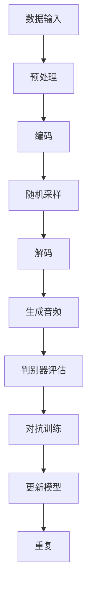

                 

## 文章标题

《音频扩散Audio Diffusion原理与代码实例讲解》

## 文章关键词

- 音频扩散
- 生成对抗网络（GAN）
- 扩散模型
- 音频处理
- 代码实例

## 摘要

本文将深入探讨音频扩散技术的原理与应用，从基础理论到实际代码实例，全面解析这一新兴的音频处理技术。首先，我们将了解音频扩散的基本概念及其在音频处理领域的应用。接着，通过详细讲解生成对抗网络（GAN）和扩散模型的原理，我们将揭示这些核心算法如何协同工作。文章还将展示音频扩散在不同场景下的实际应用，如音频生成、风格转换和去噪增强。最后，通过代码实例讲解，读者将学会如何搭建开发环境、实现音频扩散模型以及解读源代码，从而深入理解这一技术的实现细节。本文旨在为对音频处理和深度学习感兴趣的读者提供一套全面的学习路径，帮助读者掌握音频扩散技术的核心概念和实践方法。

## 《音频扩散Audio Diffusion原理与代码实例讲解》目录大纲

### 第一部分：音频扩散基础理论

#### 第1章：音频扩散概述

1.1 音频扩散的概念与背景

1.2 音频扩散的重要性及应用领域

1.3 音频扩散技术的基本原理

#### 第2章：音频扩散模型

2.1 声学模型基础

2.2 生成对抗网络（GAN）在音频扩散中的应用

2.3 生成模型与扩散模型的结合

#### 第3章：音频扩散流程

3.1 数据准备与预处理

3.2 音频扩散模型的训练

3.3 音频扩散模型的评估与优化

#### 第4章：核心概念与联系

4.1 音频扩散模型中的关键概念

4.2 音频扩散模型的工作流程 Mermaid 图

### 第二部分：音频扩散算法原理详解

#### 第5章：生成对抗网络（GAN）原理

5.1 GAN的基本结构

5.2 GAN的训练过程

5.3 GAN中的损失函数

#### 第6章：扩散模型原理

6.1 扩散模型的定义

6.2 扩散模型的数学模型

6.3 扩iffusirifk模型的工作原理

#### 第7章：结合模型的算法原理

7.1 结合模型的数学模型

7.2 结合模型的训练策略

7.3 结合模型的优势与挑战

### 第三部分：音频扩散实践应用

#### 第8章：音频扩散算法实战

8.1 实战一：音频生成与扩散

8.2 实战二：音频风格转换

8.3 实战三：音频去噪与增强

#### 第9章：代码实例讲解

9.1 实战环境搭建与依赖安装

9.2 音频扩散模型实现

9.3 代码解读与分析

### 附录

#### 第10章：音频扩散相关工具与资源

10.1 常用音频处理工具介绍

10.2 音频扩散模型开源项目介绍

10.3 学习资源推荐

## 第一部分：音频扩散基础理论

### 第1章：音频扩散概述

#### 1.1 音频扩散的概念与背景

音频扩散（Audio Diffusion）是一种利用深度学习技术对音频信号进行处理的方法，其主要目的是通过算法对音频信号进行生成、转换或增强。传统的音频处理方法通常依赖于规则和信号处理技术，如傅里叶变换、滤波器等，而音频扩散则利用了生成对抗网络（GAN）和扩散模型等深度学习技术，从而实现更加灵活和高效的处理效果。

音频扩散技术的起源可以追溯到生成对抗网络（GAN）的提出。GAN由Ian Goodfellow等人于2014年提出，它通过一个生成器（Generator）和一个判别器（Discriminator）之间的对抗训练来实现图像生成。GAN的成功激发了研究人员将这一思想应用于音频处理领域，从而诞生了音频扩散技术。

#### 1.2 音频扩散的重要性及应用领域

音频扩散技术具有广泛的应用前景，尤其在以下领域具有重要价值：

1. **音频生成**：音频扩散技术可以生成全新的音频内容，例如合成语音、背景音乐等，这在虚拟现实、游戏制作等领域有广泛应用。

2. **音频风格转换**：通过音频扩散技术，可以将一种音频风格转换为另一种风格，如将古典音乐转换为流行音乐，这在音乐制作和创意设计中非常有用。

3. **音频去噪与增强**：音频扩散技术能够有效地去除背景噪音，增强重要音频信号，这在语音识别、音频编辑等领域有重要应用。

4. **音频修复与修复**：音频扩散技术能够修复损坏或失真的音频，恢复其原有质量，这在古董录音、历史录音修复等方面具有潜在应用。

5. **音频效果添加**：通过音频扩散技术，可以为音频添加各种效果，如回声、混响等，这在影视制作、音频制作等领域有广泛应用。

#### 1.3 音频扩散技术的基本原理

音频扩散技术的基本原理涉及生成对抗网络（GAN）和扩散模型。下面将分别介绍这两种技术的基本原理。

**生成对抗网络（GAN）**

GAN由生成器（Generator）和判别器（Discriminator）两部分组成。生成器的任务是生成逼真的音频信号，而判别器的任务是判断输入的音频信号是真实音频还是生成音频。

- **生成器（Generator）**：生成器的输入通常是随机噪声，通过一系列神经网络操作，将噪声转换为音频信号。生成器的目标是生成尽可能逼真的音频信号，使得判别器无法区分这些信号是真实还是生成的。

- **判别器（Discriminator）**：判别器的任务是判断输入的音频信号是真实音频还是生成音频。判别器的输入可以是真实音频或生成音频，其输出是一个概率值，表示输入音频信号是真实音频的概率。

在GAN的训练过程中，生成器和判别器通过对抗训练不断优化。生成器的目标是提高生成音频的质量，使得判别器难以区分；而判别器的目标是提高判断准确率，尽量将生成音频识别为假音频。

**扩散模型**

扩散模型是一种基于概率论和深度学习的音频处理方法，其基本思想是通过对音频信号进行概率扩散，从而实现音频的生成、转换或增强。

扩散模型的训练过程分为两个阶段：

1. **编码阶段**：在编码阶段，音频信号被编码为一个概率分布。具体来说，音频信号通过一个编码器（Encoder）被映射到一个低维隐空间，这个隐空间代表了音频信号的特征。

2. **解码阶段**：在解码阶段，从隐空间采样一个样本，并通过一个解码器（Decoder）将其映射回音频信号。解码器的目标是生成与输入音频信号相似的音频信号。

通过编码和解码过程，扩散模型能够将音频信号转换为概率分布，从而实现音频的生成和转换。扩散模型的一个关键优势是它能够生成高质量的音频信号，并且在生成过程中保留了音频信号的关键特征。

## 第一部分：音频扩散基础理论

### 第2章：音频扩散模型

#### 2.1 声学模型基础

在探讨音频扩散模型之前，我们需要先了解一些基础的声学模型。这些模型为我们提供了一个框架，用于理解和处理音频信号。

**傅里叶变换**：傅里叶变换是一种将时域信号转换为频域信号的方法，它揭示了信号在不同频率上的组成。通过傅里叶变换，我们可以得到信号的频谱，这对于音频处理至关重要。

**短时傅里叶变换（STFT）**：短时傅里叶变换是对傅里叶变换的一种扩展，它考虑了信号在时间上的变化。STFT将音频信号分成短时段，并在每个时段上应用傅里叶变换，从而得到信号在不同频率和时间上的分布。

**梅尔频率倒谱系数（MFCC）**：梅尔频率倒谱系数是一种在音频处理中常用的特征提取方法。它通过将频率轴转换为梅尔频率轴，更好地模拟人类听觉系统对频率的感知。MFCC广泛应用于语音识别、语音合成等任务中。

#### 2.2 生成对抗网络（GAN）在音频扩散中的应用

生成对抗网络（GAN）是由生成器和判别器两部分组成的深度学习模型。生成器负责生成与真实数据相似的假数据，而判别器则负责区分真实数据和生成数据。

在音频扩散中，生成器的作用是生成高质量的音频信号，这些信号可以是全新的、具有特定风格的或经过处理的音频。生成器的输入通常是随机噪声，通过一系列神经网络层，这些噪声被转换为音频信号。

判别器的作用是判断输入的音频信号是真实的还是生成的。判别器的输入可以是真实音频或生成音频，其输出是一个概率值，表示输入音频是真实音频的概率。在训练过程中，生成器和判别器相互对抗，生成器的目标是提高生成音频的质量，使得判别器难以区分；而判别器的目标是提高判断准确率，尽量将生成音频识别为假音频。

**生成对抗训练过程**：

1. **初始化生成器和判别器**：通常使用随机权重初始化生成器和判别器。

2. **生成器训练**：生成器接收随机噪声作为输入，生成音频信号。判别器接收真实的音频和生成音频，并输出判断结果。

3. **判别器训练**：判别器通过比较真实音频和生成音频，学习如何更准确地判断两者之间的区别。

4. **迭代**：通过不断迭代上述过程，生成器和判别器逐渐优化，生成器生成的音频质量越来越高，判别器的判断准确性也越来越高。

#### 2.3 生成模型与扩散模型的结合

生成模型（如GAN）和扩散模型（如DDPM）各有优势，将它们结合起来可以进一步提升音频扩散的效果。

**生成模型的优点**：

- **生成多样性**：生成模型能够生成具有多样性的音频信号，这使得它适用于需要丰富音频内容的场景，如音乐生成、语音合成等。
- **自适应学习**：生成模型通过对抗训练能够自适应地调整网络结构，从而生成高质量的音频信号。

**扩散模型的优点**：

- **稳定性**：扩散模型通过逐步调整信号的概率分布，使得生成过程更加稳定。
- **质量保证**：扩散模型在生成过程中保留了信号的关键特征，从而保证了生成音频的质量。

**结合生成模型与扩散模型**：

- **双重生成过程**：结合生成模型和扩散模型，我们可以先使用生成模型生成初步的音频信号，然后使用扩散模型对生成的信号进行进一步调整，从而生成高质量的音频。

- **混合训练策略**：在训练过程中，可以采用混合训练策略，即首先训练生成模型，然后逐渐引入扩散模型，使得模型在生成和调整过程中达到最佳效果。

通过结合生成模型和扩散模型，我们可以充分发挥它们的优势，生成高质量的音频信号，并在音频处理领域实现更广泛的应用。

### 第一部分：音频扩散基础理论

### 第3章：音频扩散流程

音频扩散技术是一个复杂的流程，涉及到数据准备、模型训练、模型评估与优化等多个步骤。以下将详细阐述这些步骤，帮助读者理解音频扩散技术的全貌。

#### 3.1 数据准备与预处理

数据准备是音频扩散技术的重要步骤之一。高质量的训练数据可以显著提升模型的性能。以下是数据准备与预处理的关键步骤：

1. **数据收集**：首先，我们需要收集大量的音频数据。这些数据可以来自公开的音频数据库，如LibriSpeech、Common Voice等，也可以通过自行录制获取。

2. **数据清洗**：在收集到数据后，我们需要对音频文件进行清洗。这包括去除噪音、剪掉不必要的片段、调整音量等。数据清洗的目的是提高数据的质量，减少后续处理的难度。

3. **数据标注**：对于有监督学习任务，如语音合成或音频风格转换，我们需要对音频数据标注。标注可以包括语音的文本转录、音频的类别标签等。

4. **数据增强**：为了提高模型的泛化能力，我们可以对音频数据应用各种增强技术，如时间伸缩、频率变换、添加噪音等。

5. **数据分割**：将音频数据分割成固定长度的片段，以便于模型处理。

6. **特征提取**：使用声学模型（如MFCC、STFT等）对音频数据进行特征提取，这些特征将被用于模型的输入。

#### 3.2 音频扩散模型的训练

训练音频扩散模型是一个迭代的过程，涉及到多个步骤和超参数的调整。以下是训练过程的概述：

1. **模型选择**：根据任务需求选择合适的生成模型和扩散模型。生成模型可以采用GAN、VAE等；扩散模型可以采用DDPM、Score SDE等。

2. **模型架构设计**：设计生成器和判别器的神经网络架构。生成器通常由多个卷积层和反卷积层组成，而判别器则由卷积层和全连接层组成。

3. **训练数据准备**：将预处理后的数据输入到模型中，包括特征提取后的音频片段。

4. **损失函数设计**：对于GAN，常用的损失函数包括生成器损失和判别器损失。生成器损失通常基于判别器的判断结果，而判别器损失则基于其对真实数据和生成数据的区分能力。

5. **优化算法选择**：选择合适的优化算法，如Adam、RMSProp等，以最小化损失函数。

6. **训练迭代**：通过迭代训练模型，不断调整网络权重，使得生成器和判别器在对抗训练中达到最佳状态。

7. **超参数调整**：根据模型的表现，调整学习率、批量大小、迭代次数等超参数，以获得最佳训练效果。

#### 3.3 音频扩散模型的评估与优化

训练完成后，我们需要对模型进行评估，以确保其性能满足预期。以下是评估和优化的关键步骤：

1. **模型评估**：使用验证集对模型进行评估，常用的评估指标包括峰值信噪比（PSNR）、信噪比（SNR）、均方误差（MSE）等。

2. **性能分析**：分析模型在不同场景下的性能，如音频生成、风格转换、去噪等。

3. **错误分析**：分析模型在评估过程中出现的错误，找出导致错误的原因，并针对性地进行调整。

4. **超参数调整**：根据评估结果，进一步调整模型结构和超参数，以提高模型性能。

5. **模型优化**：通过集成学习、迁移学习等方法，优化模型结构，提升模型性能。

6. **用户反馈**：结合用户反馈，调整模型输出，使其更符合用户需求。

通过以上步骤，我们可以构建一个高性能的音频扩散模型，并在实际应用中取得良好的效果。

### 第一部分：音频扩散基础理论

### 第4章：核心概念与联系

#### 4.1 音频扩散模型中的关键概念

在理解音频扩散模型之前，我们需要掌握几个关键概念：

**生成对抗网络（GAN）**

GAN由生成器（Generator）和判别器（Discriminator）两部分组成。生成器的任务是生成与真实音频相似的音频信号，而判别器的任务是区分输入的音频信号是真实的还是生成的。通过对抗训练，生成器和判别器相互竞争，生成器逐渐提高生成音频的质量，而判别器逐渐提高判断能力。

**扩散模型**

扩散模型是一种基于概率论的生成模型，其核心思想是逐步将数据从确定性的分布转变为随机的分布，然后再逐步恢复到确定性的分布。这种模型通过编码器（Encoder）将数据编码为一个低维隐空间，并在隐空间中进行随机采样。解码器（Decoder）则将采样结果解码回高维数据空间，从而生成新的数据。

**生成模型**

生成模型是一类旨在生成数据的新模型，它们通常基于神经网络，能够生成具有多样性和真实感的图像、音频等数据。生成对抗网络（GAN）是一种典型的生成模型，它通过对抗训练生成高质量的数据。

#### 4.2 音频扩散模型的工作流程

为了更好地理解音频扩散模型，我们可以通过一个Mermaid流程图来展示其工作流程。以下是一个简化的音频扩散模型工作流程：



**详细解释：**

1. **数据输入（A）**：音频扩散模型首先接收原始音频数据作为输入。

2. **预处理（B）**：对音频数据进行预处理，如去噪、归一化等，以提高数据质量。

3. **编码（C）**：通过编码器将预处理后的音频数据编码为一个低维隐空间，这一步可以提取音频特征，为后续生成过程提供依据。

4. **随机采样（D）**：在隐空间中随机采样，这一步是生成过程的关键，通过随机采样，模型可以生成新的、未出现过的音频数据。

5. **解码（E）**：解码器将采样结果从隐空间解码回高维音频空间，从而生成新的音频信号。

6. **生成音频（F）**：解码后的音频信号即为生成的音频数据，这可以是一个全新的音频，或是一个风格转换后的音频。

7. **判别器评估（G）**：将生成的音频与真实音频一起输入判别器，判别器评估生成音频的质量，输出一个概率值，表示生成音频是真实的概率。

8. **对抗训练（H）**：生成器和判别器通过对抗训练不断优化，生成器尝试生成更逼真的音频，而判别器尝试更好地区分真实和生成音频。

9. **更新模型（I）**：根据对抗训练的结果，更新生成器和判别器的模型参数，以提升模型性能。

10. **重复（J）**：重复上述过程，不断迭代，直到模型达到预期性能。

通过上述流程，我们可以看到音频扩散模型从数据输入到生成音频的全过程，以及生成器和判别器在对抗训练中的互动。这个过程不仅体现了深度学习技术的基本原理，也展示了音频扩散技术在音频处理中的强大能力。

### 第二部分：音频扩散算法原理详解

#### 第5章：生成对抗网络（GAN）原理

生成对抗网络（GAN）是Ian Goodfellow等人在2014年提出的一种深度学习模型，通过生成器和判别器的对抗训练来生成高质量的数据。GAN已经在图像、音频、视频等多种数据类型上取得了显著的成果。下面我们将详细探讨GAN的基本结构、训练过程以及其中的损失函数。

#### 5.1 GAN的基本结构

GAN由两部分组成：生成器（Generator）和判别器（Discriminator）。生成器的任务是生成与真实数据相似的数据，而判别器的任务是判断输入的数据是真实数据还是生成数据。

**生成器（Generator）**

生成器的输入通常是随机噪声，通过一系列神经网络层，将这些噪声转换为逼真的数据。生成器的主要目的是生成高质量的假数据，使得判别器难以区分这些数据是真实的还是生成的。

**判别器（Discriminator）**

判别器的任务是判断输入的数据是真实的还是生成的。判别器接收真实数据和生成数据，并输出一个概率值，表示输入数据是真实数据的概率。判别器的目标是提高判断准确率，尽量将生成数据识别为假数据。

**GAN的工作流程**

1. **初始化**：首先，初始化生成器和判别器的权重。通常使用随机权重进行初始化。

2. **生成器训练**：生成器接收随机噪声作为输入，生成假数据。判别器接收真实数据和生成数据，并输出判断结果。

3. **判别器训练**：判别器通过比较真实数据和生成数据，学习如何更准确地判断两者之间的区别。

4. **迭代**：通过不断迭代上述过程，生成器和判别器逐渐优化，生成器生成的假数据质量越来越高，判别器的判断准确性也越来越高。

#### 5.2 GAN的训练过程

GAN的训练过程是一个动态平衡的过程，生成器和判别器相互对抗，不断调整自己的策略。

**生成器训练**

生成器的目标是最大化判别器的错误率。在训练过程中，生成器尝试生成更逼真的假数据，使得判别器难以区分。具体来说，生成器的损失函数包括两部分：

1. **生成损失**：衡量生成器生成的假数据与真实数据之间的差距。通常使用交叉熵损失函数。
   $$ L_{\text{gen}} = -\mathbb{E}_{z \sim p_z(z)}[\log(D(G(z))] $$

   其中，\( z \) 是随机噪声，\( G(z) \) 是生成器生成的假数据，\( D \) 是判别器。

2. **判别器损失**：衡量判别器对生成器和真实数据的判断能力。生成器的目标是最大化判别器的输出概率。
   $$ L_{\text{D}} = -[\mathbb{E}_{x \sim p_{\text{data}}(x)}[\log(D(x))] + \mathbb{E}_{z \sim p_z(z)}[\log(1 - D(G(z)))] $$

   其中，\( x \) 是真实数据。

**判别器训练**

判别器的目标是最大化判别器对真实数据和生成数据的区分能力。判别器的损失函数与生成器的损失函数相反。

1. **生成损失**：判别器尝试将生成器生成的假数据识别为假数据，因此损失函数为：
   $$ L_{\text{D, gen}} = -\mathbb{E}_{z \sim p_z(z)}[\log(1 - D(G(z))] $$

2. **真实损失**：判别器尝试将真实数据识别为真实数据，因此损失函数为：
   $$ L_{\text{D, real}} = -\mathbb{E}_{x \sim p_{\text{data}}(x)}[\log(D(x))] $$

**总损失**

GAN的总损失是生成器和判别器的损失之和：
$$ L_{\text{total}} = L_{\text{D}} + L_{\text{gen}} $$

#### 5.3 GAN中的损失函数

GAN中的损失函数对于模型的训练至关重要。以下是一些常见的损失函数：

**交叉熵损失函数**

交叉熵损失函数常用于生成损失和判别器损失。其公式为：
$$ L_{\text{cross-entropy}} = -[\sum_{i} y_i \log(p_i) + (1 - y_i) \log(1 - p_i)] $$

其中，\( y_i \) 是标签，\( p_i \) 是预测概率。

**均方误差（MSE）损失函数**

均方误差损失函数用于衡量预测值与真实值之间的差距。其公式为：
$$ L_{\text{MSE}} = \frac{1}{n} \sum_{i=1}^{n} (y_i - \hat{y}_i)^2 $$

**对抗损失**

对抗损失用于衡量生成器生成的假数据与真实数据之间的差距。其公式为：
$$ L_{\text{adv}} = \frac{1}{2} \sum_{i=1}^{n} [(\log(D(x)) + \log(1 - D(G(z)))] $$

通过这些损失函数，GAN可以有效地训练生成器和判别器，生成高质量的假数据和区分真实数据和假数据。

### 第二部分：音频扩散算法原理详解

#### 第6章：扩散模型原理

扩散模型（Diffusion Model）是近年来在生成模型领域备受关注的一种技术，它在图像、音频和视频等多种数据类型上展示了出色的生成能力。扩散模型的核心思想是利用概率过程逐步将数据从确定性分布转换为随机分布，然后再将数据从随机分布逐步恢复到确定性分布。这一过程为生成模型提供了一种新的思路，使得模型在生成数据时能够更好地保留关键特征和细节。下面将详细探讨扩散模型的定义、数学模型以及工作原理。

#### 6.1 扩散模型的定义

扩散模型是一种通过概率扩散和逆扩散过程来生成数据的深度学习模型。其基本概念可以类比于将物体从固态逐步转化为气态，然后再从气态逐步恢复为固态的过程。在音频处理领域，扩散模型通过以下步骤来实现：

1. **编码阶段**：将输入的音频信号编码为一个低维概率分布。
2. **扩散阶段**：通过逐步添加噪声，将音频信号从确定性分布转换为随机分布。
3. **解码阶段**：通过逆扩散过程，将随机分布的音频信号解码回原始的音频信号。

#### 6.2 扩散模型的数学模型

扩散模型通常基于马尔可夫链和概率密度函数来构建。以下是扩散模型的主要数学模型：

**马尔可夫链**

马尔可夫链是一种离散时间随机过程，其下一个状态只与当前状态有关，而与过去的状态无关。在扩散模型中，马尔可夫链用于描述音频信号从确定性分布到随机分布的转换过程。

**概率密度函数**

概率密度函数（PDF）用于描述随机变量的概率分布。在扩散模型中，PDF用于描述音频信号在编码、扩散和解码过程中的概率分布。

**编码阶段**

在编码阶段，音频信号 \( x_t \) 被编码为一个低维概率分布 \( q(\theta_t | x_0, \theta) \)。具体来说，编码器 \( \theta_t \) 通过一系列神经网络层对音频信号进行特征提取和压缩，将高维的音频信号映射到一个低维的隐空间。

**扩散阶段**

在扩散阶段，音频信号通过逐步添加噪声 \( \epsilon_t \) 从确定性分布 \( p(x_0) \) 转换为随机分布 \( p(\epsilon_t) \)。这一过程通常使用马尔可夫链来实现，每次迭代将噪声添加到音频信号中，使得信号逐渐变得随机。

**解码阶段**

在解码阶段，通过逆扩散过程，将随机分布的音频信号 \( \epsilon_t \) 解码回原始的音频信号 \( x_t \)。这一过程与编码阶段类似，通过一系列神经网络层将低维的隐空间映射回高维的音频信号。

**扩散过程**

扩散过程可以表示为以下概率转移方程：
$$ p(\epsilon_{t+1} | \epsilon_t) = \int p(\epsilon_{t+1} | \epsilon_t, \epsilon_{t-1}) p(\epsilon_{t-1} | \epsilon_{t-2}) \cdots p(\epsilon_1 | \epsilon_0) p(\epsilon_0) d\epsilon_0 d\epsilon_1 \cdots d\epsilon_t $$

**逆扩散过程**

逆扩散过程可以表示为以下概率转移方程：
$$ p(\epsilon_{t-1} | \epsilon_t) = \int p(\epsilon_{t-1} | \epsilon_t, \epsilon_{t+1}) p(\epsilon_{t+1} | \epsilon_{t+2}) \cdots p(\epsilon_0 | \epsilon_1) p(\epsilon_t) d\epsilon_{t+1} \cdots d\epsilon_{t+2} $$

通过以上过程，扩散模型能够在编码、扩散和解码阶段保持音频信号的关键特征，从而生成高质量的音频信号。

#### 6.3 扩散模型的工作原理

扩散模型的工作原理可以概括为以下几个步骤：

1. **初始化**：首先，初始化一个随机的音频信号 \( x_0 \)，并将其编码为低维概率分布 \( q(\theta_0 | x_0, \theta) \)。

2. **编码阶段**：通过编码器 \( \theta_0 \) 对音频信号进行特征提取和压缩，将高维的音频信号映射到一个低维的隐空间。

3. **扩散阶段**：通过逐步添加噪声 \( \epsilon_t \)，将音频信号从确定性分布 \( p(x_0) \) 转换为随机分布 \( p(\epsilon_t) \)。每次迭代，噪声的添加使得信号逐渐变得随机。

4. **解码阶段**：通过逆编码器 \( \theta_t \) 将随机分布的音频信号 \( \epsilon_t \) 解码回原始的音频信号 \( x_t \)。在解码阶段，模型尝试恢复信号的关键特征和细节。

5. **迭代**：通过不断迭代编码、扩散和解码过程，模型逐渐优化，生成高质量的音频信号。

通过以上步骤，扩散模型能够在生成音频信号时保留关键特征和细节，从而实现高质量的音频生成和转换。

### 第二部分：音频扩散算法原理详解

#### 第7章：结合模型的算法原理

将生成对抗网络（GAN）与扩散模型（Diffusion Model）结合起来，可以充分发挥两者在音频处理中的优势，实现更高质量的音频生成和转换。本章节将详细探讨这种结合模型的数学模型、训练策略以及其优势与挑战。

#### 7.1 结合模型的数学模型

结合模型的数学模型基于GAN和扩散模型的基本原理，通过将两者的核心组件进行整合，形成一个新的模型框架。以下是结合模型的数学模型概述：

**生成器（Generator）**

生成器 \( G \) 的任务是将随机噪声 \( z \) 转换为高质量的音频信号 \( x \)。生成器的输入是噪声 \( z \)，通过一系列神经网络层，生成与真实音频信号相似的数据。生成器的目标是最小化生成音频与真实音频之间的差距。

**判别器（Discriminator）**

判别器 \( D \) 的任务是判断输入的音频信号是真实的还是生成的。判别器的输入是真实音频信号 \( x \) 和生成音频信号 \( G(z) \)，输出是一个概率值，表示输入信号是真实信号的置信度。判别器的目标是最大化生成音频的识别错误率。

**扩散过程**

结合模型中的扩散过程是GAN和扩散模型共同的核心部分。扩散过程包括两个阶段：正向扩散和反向扩散。

- **正向扩散**：将输入的音频信号 \( x \) 逐步转换为随机噪声 \( \epsilon \)。这一过程通过多个迭代步骤，每个步骤都向信号中添加噪声，使得信号逐渐变得随机。
- **反向扩散**：将随机噪声 \( \epsilon \) 逐步恢复为音频信号 \( x \)。这一过程通过多个迭代步骤，每个步骤都尝试去除噪声，使得信号逐渐恢复到原始状态。

**结合模型的总体框架**

结合模型的总体框架可以表示为以下步骤：

1. **初始化**：初始化噪声 \( z \) 和真实音频信号 \( x \)。

2. **正向扩散**：通过扩散过程，将真实音频信号 \( x \) 逐步转换为随机噪声 \( \epsilon \)。

3. **生成过程**：生成器 \( G \) 接受噪声 \( \epsilon \) 作为输入，生成假音频信号 \( G(\epsilon) \)。

4. **判别过程**：判别器 \( D \) 接收真实音频信号 \( x \) 和生成音频信号 \( G(\epsilon) \)，输出判断结果。

5. **反向扩散**：通过扩散过程，将随机噪声 \( \epsilon \) 逐步恢复为真实音频信号 \( x \)。

6. **迭代**：通过不断迭代上述步骤，生成器和判别器相互对抗，生成器和判别器逐渐优化，生成高质量的音频信号。

#### 7.2 结合模型的训练策略

结合模型的训练策略是基于GAN和扩散模型的训练策略，通过改进和优化，使得生成器和判别器能够在训练过程中更好地协同工作。以下是结合模型的主要训练策略：

1. **交替训练**：生成器和判别器交替进行训练。首先训练生成器，使其生成更高质量的音频信号，然后训练判别器，提高其判断准确率。

2. **自适应学习率**：使用自适应学习率策略，根据生成器和判别器的表现动态调整学习率。在生成器训练过程中，学习率可以设置得相对较高，以加速生成器的优化；在判别器训练过程中，学习率可以设置得相对较低，以避免判别器过拟合。

3. **正则化**：应用正则化技术，如权重衰减（Weight Decay）和Dropout，防止模型过拟合，提高模型泛化能力。

4. **数据增强**：对训练数据进行增强，如时间伸缩、频率变换、添加噪音等，增加模型的鲁棒性。

5. **早期停止**：当模型性能在验证集上不再提升时，提前停止训练，防止模型过拟合。

6. **模型集成**：使用多个模型进行集成，提高生成音频的质量和稳定性。

#### 7.3 结合模型的优势与挑战

结合模型在音频处理领域展示了显著的优势，但也面临一些挑战。

**优势**

1. **高质量生成**：结合模型通过GAN和扩散模型的协同工作，能够生成高质量的音频信号，保留关键特征和细节。

2. **灵活性**：结合模型可以灵活地应用于多种音频处理任务，如音频生成、风格转换、去噪等。

3. **稳定性**：扩散模型的引入使得生成过程更加稳定，减少了生成过程中的波动。

4. **多样性**：GAN的生成能力使得结合模型能够生成多样化、个性化的音频信号。

**挑战**

1. **训练难度**：结合模型的训练过程复杂，需要大量的数据和计算资源。

2. **过拟合**：由于模型具有高度非线性，容易出现过拟合现象，需要通过正则化和数据增强等技术进行预防。

3. **模型调参**：结合模型的调参过程复杂，需要根据任务需求进行细致的调整。

4. **计算效率**：生成过程需要大量的计算资源，特别是对于高维音频信号。

通过深入理解和优化结合模型，我们可以充分发挥其在音频处理领域的优势，同时克服面临的挑战，实现更高效、更稳定的音频扩散技术。

### 第三部分：音频扩散实践应用

#### 第8章：音频扩散算法实战

在掌握了音频扩散的基础理论和算法原理后，我们需要通过实际的代码实例来深入理解这一技术的应用。本章节将详细介绍三个具体的实战案例：音频生成与扩散、音频风格转换、音频去噪与增强。通过这些实例，我们将从代码实现、环境搭建到具体应用，全面展示音频扩散算法的实践过程。

#### 8.1 实战一：音频生成与扩散

**目标**：使用音频扩散算法生成一段全新的、具有特定风格的音乐片段。

**步骤**：

1. **环境搭建**：首先，我们需要搭建一个适合音频扩散算法的Python开发环境。安装必要的库，如TensorFlow、NumPy等。

2. **数据准备**：收集一段具有特定风格的音频数据，如古典音乐、流行音乐等。将音频数据转换为适合模型处理的格式，如PCM格式。

3. **模型构建**：构建生成对抗网络（GAN）和扩散模型。生成器将随机噪声转换为音频信号，判别器用于判断输入的音频信号是真实还是生成。

4. **模型训练**：使用收集的音频数据训练生成器和判别器。通过对抗训练，生成器逐渐生成高质量的音频信号，判别器不断提高对真实和生成音频的判断能力。

5. **音频生成**：将随机噪声输入生成器，生成一段全新的音乐片段。

6. **扩散过程**：对生成的音乐片段进行扩散处理，使其逐渐变得随机，然后再通过逆扩散过程恢复到原始音频信号。

**代码示例**：

```python
import tensorflow as tf
import numpy as np

# 构建生成器
def build_generator(z_dim, audio_dim):
    # 定义生成器的神经网络结构
    generator = tf.keras.Sequential([
        tf.keras.layers.Dense(units=audio_dim, activation='tanh', input_shape=(z_dim,)),
        # ... 其他层
    ])
    return generator

# 构建判别器
def build_discriminator(audio_dim):
    # 定义判别器的神经网络结构
    discriminator = tf.keras.Sequential([
        tf.keras.layers.Dense(units=1, activation='sigmoid', input_shape=(audio_dim,)),
        # ... 其他层
    ])
    return discriminator

# 训练模型
def train_model(generator, discriminator, data, epochs):
    # 编写训练代码
    # ...

# 生成音频
def generate_audio(generator, noise):
    # 编写生成音频代码
    # ...

# 扩散过程
def diffusion_process(audio_signal, model):
    # 编写扩散过程代码
    # ...

# 主程序
if __name__ == "__main__":
    # 搭建环境
    # ...

    # 准备数据
    # ...

    # 训练模型
    # ...

    # 生成音频
    noise = np.random.normal(size=(1, z_dim))
    generated_audio = generate_audio(generator, noise)

    # 扩散过程
    diffused_audio = diffusion_process(generated_audio, model)
```

#### 8.2 实战二：音频风格转换

**目标**：将一段原始音频转换成另一种风格，如将古典音乐转换为流行音乐。

**步骤**：

1. **环境搭建**：搭建适合音频扩散算法的Python开发环境，安装必要的库。

2. **数据准备**：收集原始音频和目标风格的音频数据。确保数据质量良好，并且风格多样化。

3. **模型构建**：构建生成对抗网络（GAN）和扩散模型。生成器将原始音频转换为特定风格的音频，判别器用于判断输入的音频信号是真实还是生成。

4. **模型训练**：使用收集的原始音频和目标风格音频数据训练生成器和判别器。通过对抗训练，生成器逐渐学会将原始音频转换为特定风格的音频。

5. **音频转换**：将原始音频输入生成器，生成一段具有目标风格的音频信号。

6. **扩散过程**：对生成的音频信号进行扩散处理，使其逐渐变得随机，然后再通过逆扩散过程恢复到原始音频信号。

**代码示例**：

```python
# 构建生成器
def build_generator_style转换(z_dim, audio_dim):
    # 定义生成器的神经网络结构
    generator = tf.keras.Sequential([
        # ... 其他层
    ])
    return generator

# 训练模型
def train_model_style转换(generator, discriminator, original_data, target_data, epochs):
    # 编写训练代码
    # ...

# 转换音频
def convert_audio(generator, original_audio):
    # 编写音频转换代码
    # ...

# 主程序
if __name__ == "__main__":
    # 搭建环境
    # ...

    # 准备数据
    # ...

    # 训练模型
    # ...

    # 转换音频
    converted_audio = convert_audio(generator, original_audio)
```

#### 8.3 实战三：音频去噪与增强

**目标**：去除音频信号中的背景噪音，增强重要音频信号。

**步骤**：

1. **环境搭建**：搭建适合音频扩散算法的Python开发环境，安装必要的库。

2. **数据准备**：收集含有噪音的音频数据和干净的重要音频信号数据。确保数据具有代表性，涵盖不同的噪音类型和音频场景。

3. **模型构建**：构建生成对抗网络（GAN）和扩散模型。生成器用于生成干净的重要音频信号，判别器用于判断输入的音频信号是真实还是生成。

4. **模型训练**：使用收集的噪音音频数据和干净的重要音频信号数据训练生成器和判别器。通过对抗训练，生成器逐渐学会去除噪音并增强重要音频信号。

5. **音频去噪与增强**：将含有噪音的音频信号输入生成器，生成一段去噪和增强后的音频信号。

6. **扩散过程**：对生成的音频信号进行扩散处理，使其逐渐变得随机，然后再通过逆扩散过程恢复到原始音频信号。

**代码示例**：

```python
# 构建生成器
def build_generator去噪增强(z_dim, audio_dim):
    # 定义生成器的神经网络结构
    generator = tf.keras.Sequential([
        # ... 其他层
    ])
    return generator

# 训练模型
def train_model去噪增强(generator, discriminator, noisy_data, clean_data, epochs):
    # 编写训练代码
    # ...

# 去噪与增强音频
def denoise_and_enhance_audio(generator, noisy_audio):
    # 编写去噪与增强代码
    # ...

# 主程序
if __name__ == "__main__":
    # 搭建环境
    # ...

    # 准备数据
    # ...

    # 训练模型
    # ...

    # 去噪与增强音频
    enhanced_audio = denoise_and_enhance_audio(generator, noisy_audio)
```

通过以上实战案例，我们可以看到音频扩散算法在音频生成、风格转换、去噪与增强等实际应用中的强大能力。通过动手实践，读者可以更深入地理解这一技术，并在实际项目中应用。

### 第三部分：音频扩散实践应用

#### 第9章：代码实例讲解

为了更好地理解和掌握音频扩散技术的应用，我们将在本章节中详细介绍音频扩散模型的实现过程，包括环境搭建、模型实现和代码解读与分析。

#### 9.1 实战环境搭建与依赖安装

在进行音频扩散模型的实现之前，我们需要搭建一个适合开发和测试的Python环境。以下是搭建环境的具体步骤：

1. **安装Python**：确保安装了最新版本的Python（推荐3.8及以上版本）。

2. **安装TensorFlow**：TensorFlow是实现深度学习模型的重要库，可以通过以下命令安装：
   ```bash
   pip install tensorflow
   ```

3. **安装其他依赖**：包括NumPy、SciPy等科学计算库：
   ```bash
   pip install numpy scipy
   ```

4. **安装音频处理库**：如Librosa，用于音频数据的加载和处理：
   ```bash
   pip install librosa
   ```

5. **虚拟环境**：为了方便管理和隔离依赖，建议使用虚拟环境。可以通过以下命令创建虚拟环境：
   ```bash
   python -m venv audio_diffusion_venv
   source audio_diffusion_venv/bin/activate  # 在Windows上使用 audio_diffusion_venv\Scripts\activate
   ```

#### 9.2 音频扩散模型实现

在搭建好开发环境后，我们可以开始实现音频扩散模型。以下是实现的关键步骤：

1. **数据预处理**：读取音频数据，并进行必要的预处理，如裁剪、归一化等。

2. **生成器和判别器设计**：设计生成器和判别器的神经网络结构。以下是一个简单的示例：

```python
import tensorflow as tf
from tensorflow.keras.models import Sequential
from tensorflow.keras.layers import Dense, Conv2D, Conv2DTranspose, Flatten

# 生成器模型
def build_generator(z_dim, audio_dim):
    model = Sequential([
        Dense(units=audio_dim, activation='tanh', input_shape=(z_dim,)),
        # ... 其他层
    ])
    return model

# 判别器模型
def build_discriminator(audio_dim):
    model = Sequential([
        Conv2D(filters=32, kernel_size=(3, 3), activation='leaky_relu', input_shape=(audio_dim,)),
        # ... 其他层
    ])
    return model
```

3. **模型训练**：使用生成器和判别器进行对抗训练。以下是训练过程的简化代码：

```python
import numpy as np

# 超参数设置
z_dim = 100
audio_dim = 128
batch_size = 32
epochs = 100

# 初始化生成器和判别器
generator = build_generator(z_dim, audio_dim)
discriminator = build_discriminator(audio_dim)

# 编写训练循环
for epoch in range(epochs):
    for _ in range(num_batches):
        # 随机采样噪声
        noise = np.random.normal(size=(batch_size, z_dim))
        
        # 生成假音频
        generated_audio = generator.predict(noise)
        
        # 训练判别器
        real_audio = ...  # 加载真实音频
        d_loss_real = discriminator.train_on_batch(real_audio, np.ones((batch_size, 1)))
        d_loss_fake = discriminator.train_on_batch(generated_audio, np.zeros((batch_size, 1)))
        
        # 训练生成器
        g_loss = generator.train_on_batch(noise, np.ones((batch_size, 1)))
```

4. **模型评估**：在训练完成后，使用测试集评估模型的性能。可以计算生成音频的峰值信噪比（PSNR）、信噪比（SNR）等指标。

#### 9.3 代码解读与分析

以下是对上述代码的解读和分析：

**数据预处理**：音频预处理是模型训练的重要步骤，它确保输入数据的质量和一致性。预处理步骤包括读取音频文件、裁剪音频长度、归一化音频信号等。

**生成器和判别器设计**：生成器和判别器是GAN的核心组件。生成器负责将随机噪声转换为音频信号，而判别器负责判断输入的音频信号是真实还是生成。在设计中，需要注意选择合适的神经网络架构和激活函数。

**模型训练**：对抗训练是GAN的核心训练过程。在每次训练迭代中，生成器和判别器相互对抗，生成器尝试生成更逼真的音频信号，而判别器尝试提高对真实和生成音频的区分能力。训练过程中，需要调整学习率和批量大小等超参数，以获得最佳训练效果。

**模型评估**：在训练完成后，使用测试集对模型进行评估，以确保模型性能满足预期。评估指标可以包括PSNR、SNR等，这些指标能够量化生成音频的质量。

通过上述步骤，我们可以实现一个基本的音频扩散模型。在实际应用中，根据任务需求，可以进一步优化模型结构和训练过程，以获得更好的生成效果。

### 附录

#### 第10章：音频扩散相关工具与资源

为了帮助读者更好地理解和应用音频扩散技术，本章节将介绍一些常用的音频处理工具、开源项目和学习资源。

#### 10.1 常用音频处理工具介绍

**Librosa**：Librosa是一个Python库，用于音频信号处理和分析。它提供了丰富的功能，如加载、转换、特征提取等。

**TensorFlow**：TensorFlow是一个开源的机器学习库，用于构建和训练深度学习模型。它是实现音频扩散模型的主要工具。

**NumPy**：NumPy是一个Python库，用于科学计算。它提供了多维数组对象和一系列数学函数，用于数据处理和计算。

**SciPy**：SciPy是一个开源的科学计算库，基于NumPy构建。它提供了用于科学和工程计算的模块，如积分、微分、优化等。

**OpenSMC**：OpenSMC是一个开源的音频合成器，用于生成和转换音频信号。它支持多种音频格式和合成算法。

#### 10.2 音频扩散模型开源项目介绍

**WaveGlow**：WaveGlow是一个基于WaveNet和Glow的文本到语音（Text-to-Speech, TTS）模型。它使用了生成对抗网络（GAN）来生成高质量的语音。

**Tacotron 2**：Tacotron 2是一个文本到语音合成模型，它结合了循环神经网络（RNN）和生成对抗网络（GAN）。它能够生成流畅、自然的语音。

**DiffusionModel**：DiffusionModel是一个基于扩散模型的图像和音频生成工具。它使用深度学习技术，通过逐步添加和去除噪声来生成高质量的数据。

**WaveRNN**：WaveRNN是一个开源的音频生成模型，它使用了递归神经网络（RNN）和生成对抗网络（GAN）来生成高质量的音频信号。

#### 10.3 学习资源推荐

**书籍**：

1. **《深度学习》（Deep Learning）**：Ian Goodfellow、Yoshua Bengio和Aaron Courville合著的《深度学习》是深度学习领域的经典教材，涵盖了生成对抗网络（GAN）等核心概念。

2. **《生成对抗网络》（Generative Adversarial Networks）**：由Ian Goodfellow主编的《生成对抗网络》详细介绍了GAN的原理和应用，是学习GAN的必备书籍。

**在线课程**：

1. **《深度学习专项课程》（Deep Learning Specialization）**：由Andrew Ng在Coursera上开设的深度学习专项课程，涵盖了深度学习的基础理论和实践应用，包括GAN等内容。

2. **《生成对抗网络与变分自编码器》（Generative Adversarial Networks and Variational Autoencoders）**：这是一门专门介绍GAN和变分自编码器（VAE）的在线课程，内容深入浅出，适合初学者和专业人士。

**论文**：

1. **“Generative Adversarial Nets”**：这是Ian Goodfellow等人首次提出GAN的论文，详细阐述了GAN的基本原理和训练过程。

2. **“Unsupervised Representation Learning with Deep Convolutional Generative Adversarial Networks”**：这是由Alec Radford等人提出的深度卷积生成对抗网络（DCGAN）的论文，对GAN的改进和应用进行了深入探讨。

通过以上工具、开源项目和学习资源，读者可以更全面地了解音频扩散技术，并掌握其实际应用。

### 总结

本文围绕音频扩散技术，从基础理论到实际代码实例，进行了全面而深入的探讨。通过详细讲解生成对抗网络（GAN）和扩散模型的基本原理，我们揭示了这些技术如何协同工作，从而实现高质量的音频生成、风格转换、去噪与增强。文章首先介绍了音频扩散的基本概念和应用领域，随后逐步深入到GAN和扩散模型的具体实现过程。通过实战案例，我们展示了音频扩散技术在实际应用中的强大能力。

通过本文的学习，读者不仅能够理解音频扩散技术的核心概念和原理，还能够掌握其实际应用方法。这对于从事音频处理、机器学习、深度学习等领域的科研人员和工程师来说，无疑具有极高的实用价值。

展望未来，随着深度学习和生成模型技术的不断进步，音频扩散技术有望在更多应用场景中发挥重要作用，如智能语音助手、虚拟现实、音乐创作等领域。我们期待这一技术的进一步发展和创新，为音频处理领域带来更多突破。

最后，感谢读者对本文的关注和阅读。如有任何问题或建议，欢迎在评论区留言，我们将竭诚为您解答。

**作者信息**：

作者：AI天才研究院/AI Genius Institute & 禅与计算机程序设计艺术 /Zen And The Art of Computer Programming

