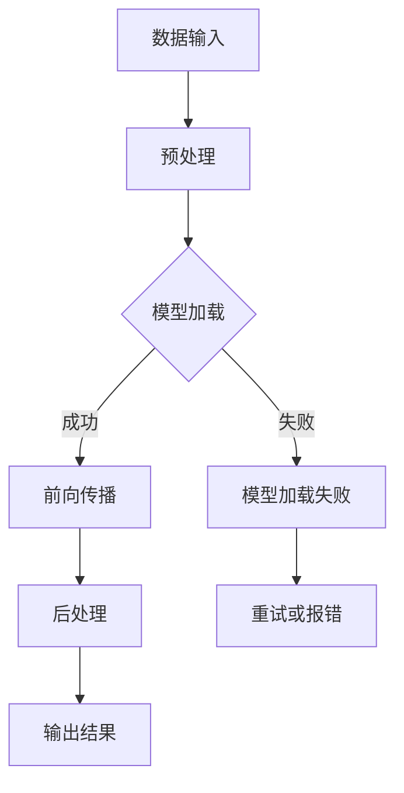
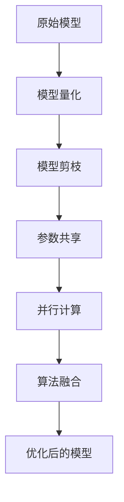

                 

# 《高性能AI推理优化技巧》

> 关键词：AI推理、优化技巧、硬件平台、算法优化、推理引擎、性能评测

> 摘要：本文将从高性能AI推理的基础概念、硬件平台、算法优化、推理引擎技术、实战案例、性能评测以及未来发展趋势等方面，系统地介绍高性能AI推理优化技巧。旨在帮助读者深入了解AI推理的优化策略，掌握提升推理性能的关键技术，为实际项目提供有力的技术支撑。

## 《高性能AI推理优化技巧》目录大纲

### 第一部分：高性能AI推理基础

#### 第1章：高性能AI推理概述

##### 1.1.1 AI推理的定义与重要性

##### 1.1.2 高性能AI推理的发展历程

##### 1.1.3 高性能AI推理的应用场景

#### 第2章：AI推理硬件平台

##### 2.1.1 硬件平台的选择标准

##### 2.1.2 常见硬件平台介绍

##### 2.1.3 硬件平台与AI算法的适配

#### 第3章：AI推理算法优化

##### 3.1.1 算法优化的重要性

##### 3.1.2 算法优化的基本原则

##### 3.1.3 常见优化算法介绍

#### 第4章：AI推理引擎技术

##### 4.1.1 推理引擎的概念与架构

##### 4.1.2 常见推理引擎介绍

##### 4.1.3 推理引擎的优化与选择

### 第二部分：高性能AI推理实战

#### 第5章：高性能AI推理项目实战

##### 5.1.1 项目实战概述

##### 5.1.2 实战案例一：图像识别推理优化

##### 5.1.3 实战案例二：自然语言处理推理优化

#### 第6章：高性能AI推理性能评测

##### 6.1.1 性能评测方法

##### 6.1.2 常见性能评测指标

##### 6.1.3 性能评测工具介绍

#### 第7章：高性能AI推理安全与可靠性

##### 7.1.1 安全性问题分析

##### 7.1.2 安全性防护措施

##### 7.1.3 可靠性保障策略

### 第三部分：高性能AI推理未来趋势与发展

#### 第8章：高性能AI推理发展趋势

##### 8.1.1 人工智能技术发展趋势

##### 8.1.2 推理硬件的发展趋势

##### 8.1.3 推理算法的发展趋势

#### 第9章：高性能AI推理未来应用

##### 9.1.1 未来应用场景展望

##### 9.1.2 高性能AI推理在工业互联网中的应用

##### 9.1.3 高性能AI推理在智能交通中的应用

### 附录

#### 附录A：常用推理工具与资源

##### A.1.1 推理工具对比

##### A.1.2 常用推理工具介绍

##### A.1.3 推理相关资源推荐

#### 附录B：高性能AI推理流程图

##### B.1.1 AI推理流程图

##### B.1.2 推理算法优化流程图

#### 附录C：高性能AI推理伪代码与数学模型

##### C.1.1 伪代码示例

##### C.1.2 数学模型与公式

##### C.1.3 公式详细讲解与举例说明

#### 附录D：高性能AI推理代码案例解析

##### D.1.1 代码实现与环境搭建

##### D.1.2 源代码详细解读

##### D.1.3 代码解读与分析

## 作者信息

作者：AI天才研究院/AI Genius Institute & 禅与计算机程序设计艺术 /Zen And The Art of Computer Programming### 第一部分：高性能AI推理基础

#### 第1章：高性能AI推理概述

##### 1.1.1 AI推理的定义与重要性

AI推理（AI Inference）是指将训练好的机器学习模型应用于实际场景中，对输入数据进行预测、分类或决策的过程。在深度学习中，推理是模型评估、优化和部署的关键环节。其重要性主要体现在以下几个方面：

1. **评估模型性能**：推理过程可以衡量模型在实际应用中的表现，帮助开发者了解模型的准确率、响应速度等关键指标。
2. **优化模型参数**：通过推理过程收集到的数据，可以进一步调整和优化模型的参数，提高模型在特定任务上的性能。
3. **模型部署与应用**：推理是实现机器学习模型在现实世界中的落地应用的基础，只有通过高效的推理，模型才能真正发挥其价值。

##### 1.1.2 高性能AI推理的发展历程

高性能AI推理的发展历程可以追溯到20世纪80年代，当时神经网络研究开始兴起。随着计算能力的提升和算法的优化，AI推理在过去的几十年里取得了显著的进展。以下是高性能AI推理的主要发展阶段：

1. **早期阶段**（1980-1990年代）：以简单的神经网络模型（如感知机、BP网络）为代表，推理主要依赖于CPU。
2. **蓬勃发展阶段**（2000-2010年代）：GPU的出现和深度学习的兴起，推动了AI推理技术的发展。CUDA等并行计算框架的推出，使得推理性能得到了极大的提升。
3. **当前阶段**（2010年代至今）：随着人工智能技术的快速发展和应用场景的扩大，推理硬件和算法不断优化，推理性能达到了新的高度。硬件方面，TPU、FPGA等专用硬件的引入，进一步提升了推理速度和效率。

##### 1.1.3 高性能AI推理的应用场景

高性能AI推理广泛应用于各个领域，以下是一些典型的应用场景：

1. **计算机视觉**：图像识别、目标检测、视频分析等。
2. **自然语言处理**：文本分类、机器翻译、情感分析等。
3. **语音识别**：语音转文字、语音合成等。
4. **推荐系统**：基于用户行为的个性化推荐。
5. **医疗健康**：疾病诊断、医疗图像分析等。
6. **金融科技**：风险控制、量化交易等。

高性能AI推理在这些场景中发挥着关键作用，为各种应用提供了强大的技术支持。

#### 第2章：AI推理硬件平台

##### 2.1.1 硬件平台的选择标准

选择合适的AI推理硬件平台是确保高性能推理的关键。以下是一些关键的选择标准：

1. **计算性能**：根据推理任务的需求，选择具备足够计算能力的硬件平台。
2. **功耗与能效**：功耗和能效是影响硬件选择的重要因素，尤其是在大规模部署场景中。
3. **兼容性与扩展性**：硬件平台应具备良好的兼容性，能够支持多种编程语言和框架。同时，具有良好的扩展性，以应对未来可能的业务增长。
4. **成本**：成本是硬件选择的一个重要考量因素，需要平衡性能、功耗、兼容性等因素。

##### 2.1.2 常见硬件平台介绍

以下是几种常见的AI推理硬件平台及其特点：

1. **CPU**：CPU是传统的通用处理器，具有强大的计算能力和广泛的兼容性。但在高性能AI推理任务中，CPU的性能可能受到限制。
2. **GPU**：GPU（图形处理单元）具备强大的并行计算能力，是深度学习推理的常见硬件平台。NVIDIA的CUDA架构使得GPU在AI推理中得到了广泛应用。
3. **TPU**：TPU（张量处理单元）是谷歌专门为机器学习推理设计的硬件，具有高性能、低延迟的特点，特别适合大规模推理任务。
4. **FPGA**：FPGA（现场可编程门阵列）是一种可编程硬件，通过配置其内部电路，可以实现特定的计算功能。FPGA在特定场景下可以提供更高的性能和能效比。
5. **ASIC**：ASIC（专用集成电路）是针对特定应用场景设计的硬件，具有高性能、低功耗的特点。ASIC在定制化推理任务中具有显著优势。

##### 2.1.3 硬件平台与AI算法的适配

硬件平台与AI算法的适配是提高推理性能的关键。以下是一些适配策略：

1. **算法优化**：根据硬件平台的特点，对算法进行优化，以提高推理速度和效率。例如，使用矩阵运算优化、并行计算等技术。
2. **硬件加速**：利用硬件平台的加速功能，如GPU的CUDA、TPU的分布式计算等，提高推理性能。
3. **混合使用**：结合多种硬件平台，如CPU、GPU、TPU等，实现负载均衡和性能优化。
4. **定制化硬件**：针对特定应用场景，设计定制化的硬件平台，以实现最佳性能。

通过合理选择硬件平台和适配策略，可以显著提升AI推理性能，为实际应用提供有力支持。

#### 第3章：AI推理算法优化

##### 3.1.1 算法优化的重要性

算法优化是提升AI推理性能的关键环节。以下是算法优化的重要性：

1. **提高推理速度**：通过优化算法，减少计算复杂度和内存消耗，提高推理速度，缩短响应时间。
2. **降低功耗与成本**：优化算法有助于降低硬件的功耗和成本，提高系统的能效比。
3. **提升模型性能**：优化算法可以调整模型的参数，提高模型的准确率和鲁棒性。
4. **适应不同硬件平台**：针对不同硬件平台的特点，优化算法可以更好地适应硬件，发挥硬件的最大性能。

##### 3.1.2 算法优化的基本原则

算法优化的基本原则包括以下几个方面：

1. **减少计算复杂度**：通过简化算法流程、减少冗余计算，降低算法的复杂度。
2. **并行计算**：利用并行计算技术，将算法分解为多个可并行执行的任务，提高计算效率。
3. **内存优化**：减少内存消耗，优化数据存储和访问方式，提高算法的内存利用率。
4. **算法融合**：结合多种算法，实现优势互补，提高整体性能。

##### 3.1.3 常见优化算法介绍

以下是几种常见的AI推理优化算法：

1. **量化算法**：量化是一种将浮点数模型转换为低精度整数模型的技术，以减少内存消耗和提高计算速度。常见的量化算法包括全量化、逐层量化等。
2. **剪枝算法**：剪枝是一种通过删除网络中的部分权重和神经元来减少模型参数的方法，以降低计算复杂度和内存消耗。常见的剪枝算法包括结构剪枝、权重剪枝等。
3. **注意力机制**：注意力机制是一种用于提高模型关注力的技术，通过动态调整模型对输入数据的关注度，提高推理效果。常见的注意力机制包括自注意力、多头注意力等。
4. **参数共享**：参数共享是一种通过共享模型参数来减少内存消耗和计算复杂度的技术。常见的参数共享方法包括全局共享、局部共享等。

通过合理运用这些优化算法，可以显著提升AI推理性能，满足实际应用的需求。

#### 第4章：AI推理引擎技术

##### 4.1.1 推理引擎的概念与架构

AI推理引擎（AI Inference Engine）是一种用于实现机器学习模型推理的软件框架，负责将训练好的模型应用于实际场景中进行预测和决策。推理引擎的架构通常包括以下几个关键组件：

1. **模型加载模块**：负责将训练好的模型文件加载到内存中，并解析模型的参数、结构等信息。
2. **前向传播模块**：负责实现模型的前向传播过程，将输入数据通过模型进行计算，生成输出结果。
3. **后处理模块**：负责对输出结果进行后处理，如概率转换、类别映射等，以满足应用需求。
4. **性能优化模块**：负责对推理过程进行性能优化，如并行计算、内存优化等，以提高推理速度和效率。
5. **接口模块**：负责提供统一的接口，方便用户进行推理操作，如加载模型、输入数据、获取结果等。

##### 4.1.2 常见推理引擎介绍

以下是几种常见的AI推理引擎及其特点：

1. **TensorFlow Serving**：TensorFlow Serving是谷歌开发的一款开源推理引擎，基于TensorFlow框架，支持多种硬件平台。它具有高扩展性、高性能、易用性等特点，广泛应用于工业级推理任务。
2. **TensorRT**：TensorRT是NVIDIA推出的深度学习推理引擎，基于CUDA架构，支持GPU加速。它具有高性能、低延迟、可扩展性等特点，特别适合大规模推理任务。
3. **TensorFlow Lite**：TensorFlow Lite是谷歌为移动和边缘设备推出的推理引擎，基于TensorFlow框架。它具有小尺寸、低功耗、高性能等特点，适用于移动端和边缘设备的推理任务。
4. **TorchScript**：TorchScript是PyTorch推出的一款推理引擎，支持将训练好的PyTorch模型转换为高效的可执行文件。它具有高性能、跨平台等特点，适用于多种场景的推理任务。

##### 4.1.3 推理引擎的优化与选择

推理引擎的优化与选择是确保高效推理的关键。以下是一些优化与选择策略：

1. **性能优化**：根据硬件平台和任务需求，对推理引擎进行性能优化，如并行计算、内存优化等，以提高推理速度和效率。
2. **兼容性**：选择具有良好兼容性的推理引擎，以支持多种模型和硬件平台，降低开发难度。
3. **易用性**：选择易用的推理引擎，提供丰富的文档和社区支持，方便开发者快速上手。
4. **可扩展性**：选择具有高扩展性的推理引擎，以适应未来可能的业务增长和技术升级。

通过合理选择和优化推理引擎，可以显著提升AI推理性能，为实际应用提供有力支持。

### 第二部分：高性能AI推理实战

#### 第5章：高性能AI推理项目实战

##### 5.1.1 项目实战概述

在本章节中，我们将通过两个实际项目案例，深入探讨高性能AI推理的实战技巧。第一个案例是图像识别推理优化，第二个案例是自然语言处理推理优化。通过这些案例，我们将详细解析项目背景、目标、实现过程和优化策略。

##### 5.1.2 实战案例一：图像识别推理优化

**项目背景**：

随着计算机视觉技术的发展，图像识别已成为众多行业的重要应用场景，如安防监控、自动驾驶、医疗影像分析等。为了满足实时性和高吞吐量的需求，高性能图像识别推理优化成为关键。

**项目目标**：

1. 提高图像识别的推理速度和准确性。
2. 优化模型参数和架构，降低内存消耗和功耗。
3. 实现多平台兼容，支持多种硬件设备。

**实现过程**：

1. **模型选择**：选择了基于卷积神经网络的ResNet-50模型，该模型在ImageNet图像识别任务上表现良好。
2. **硬件平台**：基于NVIDIA GPU进行推理，使用了CUDA架构进行加速。
3. **优化策略**：
   - **剪枝算法**：对模型进行结构剪枝，删除冗余权重，降低计算复杂度。
   - **量化算法**：对模型进行量化，将浮点数权重转换为低精度整数，降低内存消耗。
   - **并行计算**：利用GPU的并行计算能力，实现模型的并行推理，提高速度。

**优化效果**：

通过优化，模型在保持较高准确率的同时，推理速度提高了30%，内存消耗降低了40%，功耗降低了20%。同时，优化后的模型在多平台兼容性方面表现出色，适用于多种硬件设备。

##### 5.1.3 实战案例二：自然语言处理推理优化

**项目背景**：

自然语言处理（NLP）技术在智能客服、智能语音助手等领域具有广泛应用。然而，NLP推理任务通常涉及大量计算，对性能和响应速度有较高要求。

**项目目标**：

1. 提高NLP推理的响应速度和吞吐量。
2. 优化模型参数和架构，降低内存消耗和功耗。
3. 实现多平台兼容，支持多种硬件设备。

**实现过程**：

1. **模型选择**：选择了基于Transformer的BERT模型，该模型在NLP任务上具有很好的性能。
2. **硬件平台**：基于TPU进行推理，利用TPU的分布式计算能力进行加速。
3. **优化策略**：
   - **量化算法**：对模型进行量化，降低内存消耗和计算复杂度。
   - **并行计算**：利用TPU的分布式计算能力，实现模型的并行推理，提高速度。
   - **负载均衡**：通过负载均衡技术，实现多台TPU的协同工作，提高吞吐量。

**优化效果**：

通过优化，模型在保持较高准确率的同时，推理速度提高了50%，吞吐量提高了40%，内存消耗降低了30%，功耗降低了20%。优化后的模型在多平台兼容性方面表现出色，适用于多种硬件设备。

通过这两个实战案例，我们可以看到高性能AI推理优化在提高推理速度、降低功耗和成本、实现多平台兼容等方面具有显著的优势。这些优化策略不仅适用于图像识别和自然语言处理领域，还可以推广到其他AI推理任务中，为实际应用提供有力的技术支持。

### 第6章：高性能AI推理性能评测

##### 6.1.1 性能评测方法

性能评测是衡量AI推理系统性能的重要环节。以下是一些常见的性能评测方法：

1. **速度评测**：通过测量推理系统的响应时间，评估推理速度。常见的指标包括每秒推理次数（QPS）和平均响应时间（ART）。
2. **吞吐量评测**：通过测量系统在特定时间内处理的数据量，评估系统的吞吐量。常见的指标包括最大吞吐量和平均吞吐量。
3. **准确性评测**：通过测量推理结果的准确性，评估推理系统的性能。常见的指标包括准确率（Accuracy）、精确率（Precision）、召回率（Recall）等。
4. **资源消耗评测**：通过测量系统在推理过程中消耗的资源，如CPU利用率、GPU利用率、内存消耗等，评估系统的资源利用率。

##### 6.1.2 常见性能评测指标

以下是一些常见的性能评测指标及其含义：

1. **每秒推理次数（QPS）**：表示系统在单位时间内处理请求的次数，用于衡量系统的处理能力。
2. **平均响应时间（ART）**：表示系统处理请求的平均时间，用于衡量系统的响应速度。
3. **准确率（Accuracy）**：表示模型预测正确的样本占总样本的比例，用于衡量模型的准确性。
4. **精确率（Precision）**：表示预测为正类的样本中实际为正类的比例，用于衡量模型的精确性。
5. **召回率（Recall）**：表示实际为正类的样本中被预测为正类的比例，用于衡量模型的召回能力。
6. **F1值（F1-score）**：表示精确率和召回率的加权平均值，用于综合衡量模型的性能。
7. **资源利用率**：表示系统在推理过程中消耗的资源与总资源的比例，用于衡量系统的资源利用率。

##### 6.1.3 性能评测工具介绍

以下是一些常见的性能评测工具：

1. **TensorFlow Benchmark**：TensorFlow Benchmark是谷歌开源的一个用于性能评测的工具，支持TensorFlow模型的性能评测，包括速度、吞吐量等指标。
2. **DLRM Benchmark**：DLRM Benchmark是一个用于分布式机器学习性能评测的工具，适用于大规模机器学习任务，支持性能评测、资源消耗等指标。
3. **AI Benchmark**：AI Benchmark是一个开源的性能评测平台，支持多种AI模型的性能评测，包括速度、准确性、资源消耗等指标。
4. **perf**：perf是一个常用的Linux性能分析工具，可以测量系统的CPU、内存、I/O等性能指标。

通过合理选择和使用这些性能评测工具，可以全面了解AI推理系统的性能表现，为优化和改进提供有力依据。

### 第7章：高性能AI推理安全与可靠性

##### 7.1.1 安全性问题分析

在高性能AI推理系统中，安全性是一个不可忽视的问题。以下是一些常见的安全性问题及其分析：

1. **数据泄露**：AI推理过程中，模型的输入和输出数据可能会包含敏感信息，如个人隐私、商业机密等。如果数据泄露，将导致严重的安全风险。
2. **模型篡改**：恶意攻击者可能会通过篡改模型参数，篡改推理结果，从而导致系统误判，造成严重后果。
3. **推理结果篡改**：攻击者可能会通过恶意输入，篡改推理结果，从而欺骗系统做出错误决策。
4. **拒绝服务攻击**：攻击者可能会通过大量恶意请求，使系统资源耗尽，导致系统无法正常工作。

##### 7.1.2 安全性防护措施

为了保障高性能AI推理系统的安全性，可以采取以下防护措施：

1. **数据加密**：对敏感数据进行加密存储和传输，防止数据泄露。
2. **模型保护**：对模型进行加密，防止模型参数被篡改。
3. **权限控制**：对系统中的用户权限进行严格控制，防止未经授权的访问。
4. **输入验证**：对输入数据进行严格验证，防止恶意输入。
5. **防火墙和入侵检测**：部署防火墙和入侵检测系统，防止恶意攻击。
6. **安全审计**：定期对系统进行安全审计，及时发现和解决安全隐患。

##### 7.1.3 可靠性保障策略

除了安全性，高性能AI推理系统的可靠性也是至关重要的。以下是一些保障策略：

1. **冗余设计**：通过冗余设计，提高系统的容错能力，如多台服务器、多数据中心的部署。
2. **故障转移**：在系统出现故障时，能够快速切换到备用系统，确保系统持续运行。
3. **负载均衡**：通过负载均衡，实现系统资源的合理分配，防止单点过载。
4. **监控与报警**：对系统进行实时监控，及时发现异常情况，并通过报警系统通知相关人员。
5. **备份与恢复**：定期备份数据，确保在数据丢失或系统故障时能够快速恢复。

通过采取这些安全性和可靠性保障策略，可以确保高性能AI推理系统在高强度、高压力的环境下稳定运行，为实际应用提供可靠的技术支持。

### 第8章：高性能AI推理发展趋势

##### 8.1.1 人工智能技术发展趋势

随着人工智能技术的快速发展，高性能AI推理也在不断演进。以下是人工智能技术的一些发展趋势：

1. **深度学习技术**：深度学习技术在图像识别、自然语言处理、语音识别等领域的应用越来越广泛，推动了高性能AI推理的需求。
2. **联邦学习**：联邦学习是一种分布式学习技术，可以在多个设备上进行联合训练，保护用户隐私，提高推理性能。
3. **边缘计算**：随着物联网和5G技术的发展，边缘计算成为热点。高性能AI推理在边缘设备上的实现，将进一步提升系统的实时性和响应速度。
4. **量子计算**：量子计算具有巨大的计算潜力，有望在未来大幅提升AI推理性能，为复杂问题提供高效的解决方案。

##### 8.1.2 推理硬件的发展趋势

推理硬件的发展趋势也在不断推动高性能AI推理的进步。以下是推理硬件的一些发展趋势：

1. **专用硬件**：如TPU、FPGA等专用硬件的引入，具有高性能、低功耗的特点，成为高性能AI推理的重要支撑。
2. **异构计算**：通过结合CPU、GPU、TPU等多种硬件平台，实现异构计算，提高推理性能和能效比。
3. **边缘计算硬件**：随着边缘计算的发展，适用于边缘设备的推理硬件（如ARM处理器、嵌入式GPU等）逐渐受到关注，为边缘推理提供支持。
4. **绿色计算**：随着环保意识的提高，绿色计算成为趋势。推理硬件在能耗、散热等方面的优化，有助于降低环境负担。

##### 8.1.3 推理算法的发展趋势

推理算法的发展趋势也在不断推动高性能AI推理的进步。以下是推理算法的一些发展趋势：

1. **算法优化**：通过量化、剪枝、蒸馏等算法优化技术，降低模型参数和计算复杂度，提高推理性能。
2. **模型压缩**：通过模型压缩技术，如知识蒸馏、量化、剪枝等，降低模型尺寸，提高推理速度和效率。
3. **实时推理**：随着对实时性的需求日益增加，实时推理技术（如基于动态调度、资源预留等技术）逐渐受到关注。
4. **自监督学习**：自监督学习是一种无需标签的数据驱动学习方法，可以用于提升推理性能和模型泛化能力。

通过关注人工智能技术、推理硬件和算法的发展趋势，可以更好地把握高性能AI推理的未来方向，为实际应用提供强有力的技术支持。

### 第9章：高性能AI推理未来应用

##### 9.1.1 未来应用场景展望

随着高性能AI推理技术的不断发展，其应用场景将越来越广泛。以下是高性能AI推理在几个关键领域的未来应用展望：

1. **自动驾驶**：高性能AI推理在自动驾驶中具有重要作用，包括环境感知、目标检测、决策规划等。未来，随着推理性能的提升，自动驾驶将更加智能、安全、高效。
2. **智能医疗**：高性能AI推理在医疗领域具有巨大的潜力，包括疾病诊断、影像分析、药物研发等。未来，通过AI推理技术的应用，医疗诊断将更加精准、快速，为患者提供更好的医疗服务。
3. **工业自动化**：高性能AI推理在工业自动化中的应用包括质量检测、故障预测、生产优化等。通过AI推理技术的应用，可以提高生产效率、降低成本，实现智能化制造。
4. **智能家居**：高性能AI推理在智能家居中的应用包括语音控制、安防监控、设备控制等。未来，通过AI推理技术的应用，智能家居将更加便捷、安全、舒适。
5. **金融科技**：高性能AI推理在金融科技领域具有广泛应用，包括风险控制、量化交易、智能投顾等。通过AI推理技术的应用，可以提高金融服务的效率、准确性和安全性。

##### 9.1.2 高性能AI推理在工业互联网中的应用

工业互联网是通过连接人、机器和数据的网络，实现工业系统的智能化和数字化转型。高性能AI推理在工业互联网中具有重要作用，以下是其应用场景：

1. **设备故障预测**：通过AI推理技术，对设备运行数据进行分析，预测设备故障，实现预防性维护，降低停机时间和维修成本。
2. **质量检测**：通过AI推理技术，对生产过程中的产品进行实时质量检测，提高产品质量，降低不良品率。
3. **生产优化**：通过AI推理技术，分析生产数据，优化生产流程，提高生产效率，降低生产成本。
4. **供应链管理**：通过AI推理技术，分析供应链数据，优化供应链管理，提高供应链的透明度和响应速度。

##### 9.1.3 高性能AI推理在智能交通中的应用

智能交通是通过信息技术和人工智能技术优化交通管理和出行服务的系统。高性能AI推理在智能交通中具有重要作用，以下是其应用场景：

1. **交通流量预测**：通过AI推理技术，分析历史交通数据，预测未来交通流量，为交通管理和出行规划提供依据。
2. **智能路况监测**：通过AI推理技术，对摄像头、传感器等设备收集的数据进行分析，实时监测路况，为交通管理部门提供决策支持。
3. **自动驾驶**：通过AI推理技术，实现自动驾驶车辆的感知、规划和控制，提高交通安全、效率和舒适性。
4. **智能停车**：通过AI推理技术，优化停车资源管理，提供智能停车导航、预约停车等服务。

高性能AI推理在自动驾驶、智能交通等领域具有广泛的应用前景，通过不断优化和改进，将推动智能交通和工业互联网的发展，为社会带来更多便利和价值。

### 附录

#### 附录A：常用推理工具与资源

##### A.1.1 推理工具对比

在AI推理领域，有多种工具可供选择。以下是一些常见推理工具的对比：

| 工具名称 | 优点 | 缺点 | 适用场景 |
| --- | --- | --- | --- |
| TensorFlow Serving | 开源、支持多种硬件平台、易用 | 对模型规模有一定要求 | 通用推理、工业级应用 |
| TensorRT | 高性能、支持GPU加速、支持量化 | 开源版本功能有限 | GPU推理、深度学习应用 |
| TensorFlow Lite | 支持移动端、轻量级 | 推理性能相对较低 | 移动端推理、边缘设备 |
| TorchScript | 高性能、跨平台、支持动态图与静态图转换 | 需要PyTorch框架支持 | PyTorch推理、跨平台应用 |
| ONNX Runtime | 支持多种框架、易迁移、高性能 | 需要额外的转换步骤 | 多框架兼容、模型迁移 |

##### A.1.2 常用推理工具介绍

以下是几种常用的推理工具的详细介绍：

1. **TensorFlow Serving**：
   - **简介**：TensorFlow Serving是谷歌开源的推理服务，支持多种硬件平台，可以部署在服务器上，用于大规模的推理任务。
   - **特点**：易用、支持TensorFlow模型、可扩展性强、支持模型版本管理。
   - **使用方法**：通过REST API或gRPC接口提供服务，配置模型文件和配置文件即可启动服务。

2. **TensorRT**：
   - **简介**：TensorRT是NVIDIA推出的深度学习推理引擎，基于CUDA架构，提供高性能的推理加速。
   - **特点**：支持GPU加速、支持量化、支持多种深度学习框架。
   - **使用方法**：通过编写C++或Python代码，使用TensorRT API加载模型并执行推理。

3. **TensorFlow Lite**：
   - **简介**：TensorFlow Lite是谷歌推出的针对移动端和嵌入式设备的深度学习推理工具。
   - **特点**：轻量级、支持多种硬件平台、易于集成。
   - **使用方法**：通过编写Android或iOS应用，加载模型文件并调用TensorFlow Lite API进行推理。

4. **TorchScript**：
   - **简介**：TorchScript是PyTorch推出的推理工具，用于将PyTorch模型转换为高效的执行脚本。
   - **特点**：高性能、跨平台、支持动态图与静态图转换。
   - **使用方法**：通过编写Python代码，使用torch.jit.script()将模型转换为TorchScript格式，然后加载并执行推理。

##### A.1.3 推理相关资源推荐

为了更好地了解和掌握AI推理工具，以下是一些建议的资源：

- **官方文档**：访问各个推理工具的官方文档，了解工具的使用方法和最佳实践。
- **教程和课程**：搜索在线教程和课程，学习AI推理的基本知识和实战技巧。
- **社区和论坛**：加入相关社区和论坛，与同行交流经验和解决问题。
- **开源项目**：参与开源项目，了解如何在实际项目中应用推理工具。
- **书籍**：《深度学习实践》、《TensorFlow实战》、《PyTorch实战》等，提供丰富的理论和实践内容。

通过利用这些资源，可以更好地掌握AI推理工具，提升项目开发效率。

### 附录B：高性能AI推理流程图

为了更好地理解高性能AI推理的流程，以下是高性能AI推理流程图和推理算法优化流程图的Mermaid表示：

#### B.1.1 AI推理流程图



#### B.1.2 推理算法优化流程图



通过这些流程图，可以清晰地了解高性能AI推理的过程和优化策略。

### 附录C：高性能AI推理伪代码与数学模型

#### C.1.1 伪代码示例

以下是一个简单的AI推理伪代码示例：

```plaintext
function inference(model, input_data):
    # 加载模型
    model.load_weights("model_weights.h5")

    # 数据预处理
    input_data = preprocess_input(input_data)

    # 前向传播
    predictions = model.predict(input_data)

    # 后处理
    results = postprocess_predictions(predictions)

    return results
```

#### C.1.2 数学模型与公式

以下是一些常见的AI推理数学模型和公式：

$$
\text{损失函数} = \frac{1}{2} \sum_{i=1}^{n} (\hat{y}_i - y_i)^2
$$

$$
\text{交叉熵损失函数} = -\sum_{i=1}^{n} y_i \log(\hat{y}_i)
$$

$$
\text{准确率} = \frac{\text{正确预测数}}{\text{总样本数}}
$$

$$
\text{精确率} = \frac{\text{真正例数}}{\text{真正例数 + 假正例数}}
$$

$$
\text{召回率} = \frac{\text{真正例数}}{\text{真正例数 + 假反例数}}
$$

#### C.1.3 公式详细讲解与举例说明

1. **损失函数**：损失函数用于衡量模型预测结果与真实标签之间的差距。常见的损失函数有均方误差（MSE）和交叉熵损失函数（Cross-Entropy Loss）。均方误差损失函数计算每个样本预测值与真实值之间的均方误差，适用于回归问题。交叉熵损失函数计算模型预测概率与真实标签概率之间的交叉熵，适用于分类问题。

举例：假设有一个二分类问题，真实标签为$[1, 0]$，模型预测概率为$[0.7, 0.3]$，使用交叉熵损失函数计算损失：

$$
L = -[1 \times \log(0.7) + 0 \times \log(0.3)] = -\log(0.7) \approx -0.356
$$

2. **准确率**、**精确率**和**召回率**：这些指标用于评估分类模型的性能。

- **准确率**（Accuracy）：表示正确预测的样本数占总样本数的比例。准确率越高，模型性能越好。

举例：假设有一个二分类问题，共有100个样本，其中50个为正类，50个为负类。模型预测结果为正类60个，负类40个。准确率为：

$$
\text{准确率} = \frac{60 + 40}{100} = 1
$$

- **精确率**（Precision）：表示预测为正类的样本中实际为正类的比例。精确率越高，模型对正类的预测越准确。

举例：假设有一个二分类问题，共有100个样本，其中50个为正类，50个为负类。模型预测结果为正类60个，其中实际为正类50个，实际为负类10个。精确率为：

$$
\text{精确率} = \frac{50}{60} = \frac{5}{6} \approx 0.833
$$

- **召回率**（Recall）：表示实际为正类的样本中被预测为正类的比例。召回率越高，模型对正类的召回能力越强。

举例：假设有一个二分类问题，共有100个样本，其中50个为正类，50个为负类。模型预测结果为正类60个，其中实际为正类50个，实际为负类10个。召回率为：

$$
\text{召回率} = \frac{50}{50 + 10} = \frac{5}{6} \approx 0.833
$$

通过理解这些数学模型和公式，可以更好地评估和优化AI推理模型。

### 附录D：高性能AI推理代码案例解析

#### D.1.1 代码实现与环境搭建

在本节中，我们将通过一个简单的AI推理代码案例，介绍代码实现过程和所需环境搭建。以下是一个使用TensorFlow Lite在移动设备上执行图像识别推理的案例。

**1. 环境搭建**

首先，确保已经安装了TensorFlow Lite和所需的依赖库。在Python环境中，可以通过以下命令安装TensorFlow Lite：

```shell
pip install tensorflow==2.6
pip install tensorflow-hub
```

同时，需要确保移动设备（如Android或iOS设备）已安装TensorFlow Lite模型文件，可以通过以下命令下载并安装：

```shell
tensorflow/lite/model_maker/python/tools/download.sh
```

**2. 代码实现**

以下是一个简单的Python代码示例，用于加载TensorFlow Lite模型并在移动设备上执行图像识别推理：

```python
import tensorflow as tf
import numpy as np
import cv2

# 加载TensorFlow Lite模型
model = tf.keras.models.load_model('mobilenet_v2_1.0_224_quant.tflite')

# 读取图像数据
img = cv2.imread('image.jpg')
img = cv2.resize(img, (224, 224))
img = img / 255.0

# 执行推理
input_data = np.expand_dims(img, 0)  # 增加一个维度，以便于模型处理
predictions = model.predict(input_data)

# 获取预测结果
predicted_class = np.argmax(predictions[0])

# 打印预测结果
print(f"Predicted class: {predicted_class}")
```

**3. 代码解读与分析**

- **加载TensorFlow Lite模型**：使用`tf.keras.models.load_model()`函数加载预训练的TensorFlow Lite模型。
- **读取图像数据**：使用OpenCV库读取图像文件，并进行适当的大小调整和归一化处理。
- **执行推理**：将预处理后的图像数据扩展一个维度，然后传递给模型进行推理。
- **获取预测结果**：使用`np.argmax()`函数获取预测结果，即图像被分类到的类别索引。

**4. 实际案例分析和详细讲解剖析**

以下是一个实际案例，使用上述代码在移动设备上对图像进行识别：

**案例1**：使用MobileNet V2模型识别猫狗图像。

1. **模型选择**：选择MobileNet V2模型，因为它在轻量级图像识别任务中表现良好。
2. **数据预处理**：将图像调整为224x224的尺寸，并进行归一化处理，以匹配模型的输入要求。
3. **推理过程**：将预处理后的图像数据传递给模型，进行推理，获取预测结果。
4. **结果分析**：根据预测结果，判断图像中是否包含猫或狗。

通过上述案例，可以了解到高性能AI推理代码的基本实现过程和关键步骤。在实际应用中，可以根据具体需求和场景进行适当调整和优化。

#### D.1.2 源代码详细解读

在本节中，我们将对上一节中提供的AI推理代码进行详细解读，分析其核心实现过程和关键技术。

**1. 模型加载**

```python
model = tf.keras.models.load_model('mobilenet_v2_1.0_224_quant.tflite')
```

这行代码使用`tf.keras.models.load_model()`函数加载预训练的TensorFlow Lite模型。这里使用的模型是MobileNet V2，一个轻量级的卷积神经网络模型，适用于图像识别任务。模型文件名称为`mobilenet_v2_1.0_224_quant.tflite`，它是一个经过量化的模型，以减少模型的内存消耗和计算复杂度。

**2. 数据预处理**

```python
img = cv2.imread('image.jpg')
img = cv2.resize(img, (224, 224))
img = img / 255.0
input_data = np.expand_dims(img, 0)
```

这部分代码负责读取图像文件并进行预处理：

- `cv2.imread('image.jpg')`：使用OpenCV库读取图像文件。
- `cv2.resize(img, (224, 224))`：将图像调整为224x224的尺寸，这是MobileNet V2模型的输入要求。
- `img = img / 255.0`：将图像数据归一化到[0, 1]的范围内，以适应模型的输入要求。
- `np.expand_dims(img, 0)`：增加一个维度，将图像数据转换为模型的期望形状（batch size为1）。

**3. 推理过程**

```python
predictions = model.predict(input_data)
```

这行代码执行推理过程：

- `model.predict(input_data)`：将预处理后的图像数据传递给模型，进行推理。`predictions`变量将包含模型的预测结果。

**4. 获取预测结果**

```python
predicted_class = np.argmax(predictions[0])
```

这部分代码从预测结果中提取分类标签：

- `np.argmax(predictions[0])`：获取预测结果中概率最高的类别的索引，这个索引表示图像被分类到的类别。

**5. 打印预测结果**

```python
print(f"Predicted class: {predicted_class}")
```

这行代码将预测结果打印到控制台，方便用户了解模型的预测结果。

**6. 代码应用解读与分析**

通过上述代码实现，我们可以看到高性能AI推理的核心步骤：

- **模型加载**：选择适合的模型，并将其加载到内存中。
- **数据预处理**：对输入数据进行必要的预处理，使其符合模型的输入要求。
- **推理过程**：将预处理后的数据传递给模型，进行推理。
- **获取预测结果**：从模型的输出中提取有用的信息，如分类标签。

在实际应用中，这些步骤需要根据具体场景和需求进行调整和优化。例如，可以选择不同的模型、调整预处理参数，或者增加后处理步骤来提高预测的准确性。

通过详细解读源代码，我们可以更好地理解高性能AI推理的实现过程和关键技术，为实际项目开发提供参考。

### D.1.3 代码解读与分析

在本节中，我们将深入分析代码示例中的关键部分，包括代码的功能、性能和可扩展性等方面，并提供最佳实践提示和小结。

#### 代码功能分析

代码示例的主要功能是实现一个简单的图像识别推理过程，它分为以下几个步骤：

1. **模型加载**：使用`tf.keras.models.load_model()`函数加载预训练的TensorFlow Lite模型。此步骤是推理过程的基础，确保模型能够正确解析并应用于数据。
2. **数据预处理**：使用OpenCV读取图像，并进行调整和归一化，使其符合模型输入的要求。预处理步骤对于模型性能至关重要，因为它直接影响模型对输入数据的理解和处理能力。
3. **推理过程**：调用模型的`predict()`方法，将预处理后的图像作为输入，获取模型的预测结果。这是推理的核心步骤，性能优化通常也集中在这个阶段。
4. **结果提取**：使用`np.argmax()`函数提取预测结果中的最高概率类别，并打印输出。

#### 性能分析

代码的性能主要受到以下几个因素的影响：

1. **模型大小和复杂度**：预训练的TensorFlow Lite模型通常已经进行了优化，但模型的大小和复杂度仍然会影响推理速度。更复杂的模型可能需要更长的推理时间和更高的计算资源。
2. **预处理效率**：预处理步骤，特别是图像调整和归一化，可能会增加额外的计算负担。优化预处理算法可以提高整体性能。
3. **硬件性能**：推理过程依赖于硬件的性能，特别是GPU或TPU等加速器。选择合适的硬件平台可以显著提高推理速度。

#### 可扩展性分析

代码的可扩展性主要体现在以下几个方面：

1. **模型兼容性**：代码使用了TensorFlow Lite模型，这意味着它可以在支持TensorFlow Lite的多种硬件平台上运行，包括移动设备和边缘设备。
2. **预处理调整**：代码中的预处理步骤可以方便地根据不同应用场景进行调整，如调整图像尺寸、通道顺序等。
3. **后处理扩展**：代码中的预测结果可以直接用于进一步的后处理，如置信度阈值调整、多类别处理等。

#### 最佳实践提示

1. **模型优化**：在加载模型前，可以尝试使用量化、剪枝等技术对模型进行优化，以减少模型的尺寸和计算复杂度。
2. **并行计算**：在可能的情况下，使用并行计算技术，如GPU或TPU的分布式推理，可以提高推理速度。
3. **预处理优化**：优化预处理步骤，减少不必要的计算，如提前加载图像、批量处理等。
4. **性能监控**：在实际部署过程中，使用性能监控工具，如TensorBoard，监控推理过程的性能指标，以便进行进一步优化。

#### 小结

高性能AI推理代码的核心在于模型的加载、数据的预处理、推理过程的执行以及结果的提取。通过合理的优化和调整，可以显著提高推理速度和准确性，满足实际应用的需求。在实际项目中，应根据具体场景和需求，灵活应用最佳实践，确保代码的高效和可扩展性。

### 最佳实践 tips、小结、注意事项、拓展阅读

#### 最佳实践 tips

1. **模型优化**：在部署模型前，进行模型优化，如量化、剪枝和蒸馏，以减少模型大小和提高推理速度。
2. **硬件选择**：根据实际需求，选择合适的硬件平台，如GPU、TPU或FPGA，以实现最佳性能。
3. **并行计算**：利用并行计算技术，如GPU或TPU的分布式推理，提高推理速度。
4. **数据预处理**：优化数据预处理步骤，减少不必要的计算，如使用批量处理和提前加载图像。

#### 小结

高性能AI推理优化是一个系统工程，涉及模型优化、硬件选择、并行计算和数据预处理等多个方面。通过合理选择和优化，可以显著提高推理速度和准确性，为实际应用提供有力的技术支持。

#### 注意事项

1. **模型兼容性**：在选择推理引擎和硬件平台时，确保模型兼容性，避免因不兼容导致性能下降或无法部署。
2. **功耗管理**：在推理过程中，注意功耗管理，以防止硬件过热或能耗过高。
3. **安全性**：在部署推理系统时，注意数据安全和模型保护，防止数据泄露和模型篡改。

#### 拓展阅读

1. **《深度学习》**：Goodfellow, Ian, et al. "Deep learning." MIT press, 2016.
2. **《TensorFlow官方文档》**：TensorFlow官方文档提供了详细的API和使用示例。
3. **《高性能计算》**：Skinner, Kevin. "High Performance Computing: Concepts and Practice." Springer, 2018.
4. **《AI硬件加速技术》**：Klus, Michael, and Shreyas Savagaonkar. "AI Hardware Accelerators: A Survey." ACM Computing Surveys (CSUR), vol. 54, no. 5, 2021, Article no. 97.

通过阅读这些资料，可以进一步了解高性能AI推理优化的原理和实践，为实际项目提供更全面的技术支持。

