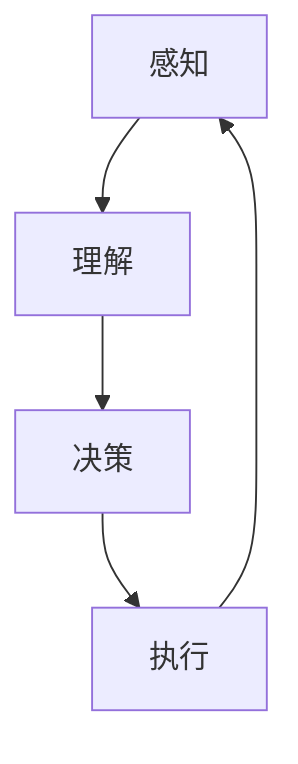

                 


### 文章标题：AI Agent: AI的下一个风口 如何改变用户体验

#### 关键词：AI Agent，用户体验，人工智能，机器学习，自然语言处理，情感分析，个性化推荐

#### 摘要：
随着人工智能技术的不断发展，AI Agent（人工智能代理）正逐渐成为下一个风口。本文将详细探讨AI Agent的基本概念、核心技术、应用场景、开发与优化方法，以及其在改变用户体验方面的潜力。通过深入分析AI Agent在各个领域中的应用，本文旨在揭示AI Agent如何引领用户体验的革命。

-------------------------------------------------------------------

## 《AI Agent: AI的下一个风口 如何改变用户体验》目录大纲

### 第一部分：AI Agent简介与概述

#### 1.1 AI Agent的基本概念
##### 1.1.1 AI Agent的定义
##### 1.1.2 AI Agent与传统AI系统的区别
##### 1.1.3 AI Agent的核心功能与特点

#### 1.2 AI Agent的发展历程
##### 1.2.1 AI Agent的起源
##### 1.2.2 AI Agent的发展趋势
##### 1.2.3 AI Agent的未来前景

#### 1.3 AI Agent在用户体验中的应用
##### 1.3.1 AI Agent如何改变用户体验
##### 1.3.2 AI Agent在用户交互中的优势
##### 1.3.3 AI Agent在产品设计与开发中的应用

### 第二部分：AI Agent的核心技术

#### 2.1 AI Agent的架构与设计
##### 2.1.1 AI Agent的总体架构
##### 2.1.2 AI Agent的关键组件
##### 2.1.3 AI Agent的设计原则与最佳实践

#### 2.2 AI Agent的机器学习算法
##### 2.2.1 机器学习算法的基本原理
##### 2.2.2 常见的机器学习算法及应用
##### 2.2.3 AI Agent中的机器学习算法选择

#### 2.3 自然语言处理与AI Agent
##### 2.3.1 自然语言处理的基本概念
##### 2.3.2 常见自然语言处理任务
##### 2.3.3 AI Agent中的自然语言处理应用

#### 2.4 AI Agent的情感分析与识别
##### 2.4.1 情感分析的基本原理
##### 2.4.2 常见情感分析模型
##### 2.4.3 AI Agent中的情感分析应用

#### 2.5 AI Agent的个性化推荐系统
##### 2.5.1 个性化推荐系统概述
##### 2.5.2 常见的推荐算法
##### 2.5.3 AI Agent中的个性化推荐应用

### 第三部分：AI Agent的应用场景与实践

#### 3.1 AI Agent在客户服务中的应用
##### 3.1.1 客户服务中的AI Agent应用场景
##### 3.1.2 客户服务AI Agent的实现方法
##### 3.1.3 客户服务AI Agent的效果评估

#### 3.2 AI Agent在智能助手中的应用
##### 3.2.1 智能助手中AI Agent的应用场景
##### 3.2.2 智能助手AI Agent的实现方法
##### 3.2.3 智能助手AI Agent的效果评估

#### 3.3 AI Agent在教育中的应用
##### 3.3.1 教育中的AI Agent应用场景
##### 3.3.2 教育AI Agent的实现方法
##### 3.3.3 教育AI Agent的效果评估

#### 3.4 AI Agent在医疗健康中的应用
##### 3.4.1 医疗健康中的AI Agent应用场景
##### 3.4.2 医疗健康AI Agent的实现方法
##### 3.4.3 医疗健康AI Agent的效果评估

### 第四部分：AI Agent的开发与优化

#### 4.1 AI Agent的开发流程
##### 4.1.1 AI Agent开发的总体流程
##### 4.1.2 数据准备与预处理
##### 4.1.3 模型选择与训练
##### 4.1.4 模型评估与优化

#### 4.2 AI Agent的优化技术
##### 4.2.1 模型压缩技术
##### 4.2.2 模型加速技术
##### 4.2.3 模型解释性技术

#### 4.3 AI Agent的安全与隐私保护
##### 4.3.1 AI Agent的安全问题
##### 4.3.2 AI Agent的隐私保护措施
##### 4.3.3 AI Agent的安全与隐私平衡

#### 4.4 AI Agent的未来发展趋势
##### 4.4.1 AI Agent的技术挑战与机遇
##### 4.4.2 AI Agent在行业应用中的发展趋势
##### 4.4.3 AI Agent的未来前景展望

### 附录

#### 附录A：常用AI Agent开发工具与资源
##### 1. 自然语言处理工具
##### 2. 机器学习框架
##### 3. 数据库与数据管理工具

#### 附录B：案例研究
##### 1. 某客户服务AI Agent案例分析
##### 2. 某智能助手AI Agent案例分析
##### 3. 某教育AI Agent案例分析

#### 附录C：AI Agent开发实践指南
##### 1. 开发环境搭建
##### 2. 代码实现示例
##### 3. 性能优化建议

### 作者：AI天才研究院/AI Genius Institute & 禅与计算机程序设计艺术 /Zen And The Art of Computer Programming

### 第一部分：AI Agent简介与概述

#### 1.1 AI Agent的基本概念

##### 1.1.1 AI Agent的定义

AI Agent，即人工智能代理，是模拟人类智能行为，具备自主学习、推理和决策能力的智能系统。与传统的AI系统相比，AI Agent具有高度的自主性和灵活性，能够在复杂环境中执行任务，并与其他系统或人类进行交互。

##### 1.1.2 AI Agent与传统AI系统的区别

传统AI系统通常依赖于预设的规则和模型，而AI Agent则具备自我学习和适应能力。传统AI系统通常执行单一任务，而AI Agent则能够在多个任务之间灵活切换。此外，传统AI系统对数据的依赖性较强，而AI Agent则能够在有限的条件下进行有效决策。

##### 1.1.3 AI Agent的核心功能与特点

AI Agent的核心功能包括感知、理解、决策和执行。感知是指获取环境信息；理解是指对感知信息进行分析和处理；决策是指根据分析结果做出决策；执行是指执行决策并获取反馈。AI Agent的特点是高度自主、灵活性和适应能力。

#### 1.2 AI Agent的发展历程

##### 1.2.1 AI Agent的起源

AI Agent的概念最早可以追溯到20世纪80年代的专家系统和基于规则的推理系统。当时，研究人员开始尝试将人类智能的某些方面转化为计算机程序，以便在特定领域内实现自动化。

##### 1.2.2 AI Agent的发展趋势

随着机器学习和深度学习技术的发展，AI Agent逐渐从基于规则的系统演变为基于数据驱动的系统。这一趋势使得AI Agent在处理复杂任务时表现出更高的效率和准确性。

##### 1.2.3 AI Agent的未来前景

未来，AI Agent有望在更广泛的领域发挥作用，如智能助手、智能城市、智能制造等。同时，随着技术的不断进步，AI Agent将具备更高的智能水平，实现更高级的自主学习和决策能力。

#### 1.3 AI Agent在用户体验中的应用

##### 1.3.1 AI Agent如何改变用户体验

AI Agent通过个性化推荐、智能交互、实时反馈等功能，极大地提升了用户体验。例如，在电商领域，AI Agent可以根据用户的历史行为和偏好，推荐符合其兴趣的产品；在客服领域，AI Agent可以提供24/7的全天候服务，提高用户满意度。

##### 1.3.2 AI Agent在用户交互中的优势

AI Agent在用户交互中的优势主要体现在以下几个方面：

1. **个性化服务**：AI Agent可以根据用户的个人喜好和需求，提供定制化的服务。
2. **实时响应**：AI Agent可以实时响应用户的请求，提高交互效率。
3. **高效沟通**：AI Agent可以理解自然语言，与用户进行流畅的沟通。
4. **持续学习**：AI Agent可以通过不断学习和优化，提高服务质量。

##### 1.3.3 AI Agent在产品设计与开发中的应用

在产品设计与开发中，AI Agent的应用主要包括以下几个方面：

1. **需求分析**：AI Agent可以帮助分析用户需求，提供有针对性的产品设计建议。
2. **交互设计**：AI Agent可以参与交互设计，确保产品界面友好、易用。
3. **测试与优化**：AI Agent可以参与产品测试，提供优化建议，提高产品性能。
4. **用户体验评估**：AI Agent可以通过分析用户行为数据，评估产品的用户体验，为产品改进提供依据。

---

**核心概念与联系：**

AI Agent的基本概念包括感知、理解、决策和执行。这四个核心功能相互关联，形成一个闭环系统。感知是理解的基础，理解是决策的前提，决策是执行的方向，执行是感知和理解的反馈。以下是这四个核心功能的Mermaid流程图：



感知、理解和决策是AI Agent的核心算法原理。感知通常涉及自然语言处理、图像识别等技术；理解涉及机器学习和深度学习算法；决策涉及博弈论、决策树等算法。以下是这些核心算法原理的伪代码：

```python
# 感知
def sense(data):
    # 使用自然语言处理技术分析数据
    processed_data = natural_language_process(data)
    return processed_data

# 理解
def understand(data):
    # 使用机器学习和深度学习算法分析数据
    insights = machine_learning_algorithm(data)
    return insights

# 决策
def decide(insights):
    # 使用博弈论和决策树算法做出决策
    decision = decision_tree_algorithm(insights)
    return decision

# 执行
def execute(decision):
    # 执行决策
    result = action_algorithm(decision)
    return result
```

数学模型和公式：

在AI Agent中，常用的数学模型包括线性回归、支持向量机、神经网络等。以下是这些模型的基本公式：

$$
y = \beta_0 + \beta_1x
$$

$$
f(x) = \sum_{i=1}^{n} w_i \cdot x_i
$$

$$
y = \sigma(\sum_{i=1}^{n} w_i \cdot x_i + b)
$$

详细讲解与举例说明：

线性回归是一种简单的机器学习算法，用于预测连续值。假设我们想要预测房价，输入特征包括房屋面积、位置等，输出特征为房价。以下是线性回归的详细讲解与举例说明：

1. **线性回归模型**：

   假设我们的输入特征为$x_1$（房屋面积），输出特征为$y$（房价）。线性回归模型可以表示为：

   $$
   y = \beta_0 + \beta_1x_1
   $$

   其中，$\beta_0$为截距，$\beta_1$为斜率。

2. **模型训练**：

   通过收集大量房屋数据，我们可以使用最小二乘法训练线性回归模型。具体步骤如下：

   a. 收集房屋数据，包括房屋面积和房价；
   b. 将数据分为训练集和测试集；
   c. 计算每个特征的均值和方差；
   d. 对每个特征进行标准化处理；
   e. 使用训练集数据计算斜率$\beta_1$和截距$\beta_0$。

3. **模型评估**：

   使用测试集数据评估模型性能。常见的评估指标包括均方误差（MSE）、决定系数（R^2）等。具体公式如下：

   $$
   MSE = \frac{1}{n}\sum_{i=1}^{n}(y_i - \hat{y_i})^2
   $$

   $$
   R^2 = 1 - \frac{\sum_{i=1}^{n}(y_i - \hat{y_i})^2}{\sum_{i=1}^{n}(y_i - \bar{y})^2}
   $$

   其中，$y_i$为实际房价，$\hat{y_i}$为预测房价，$\bar{y}$为实际房价的均值。

---

**项目实战：**

1. **开发环境搭建**：

   我们使用Python作为开发语言，使用scikit-learn库实现线性回归模型。

2. **源代码详细实现和代码解读**：

   ```python
   from sklearn.linear_model import LinearRegression
   from sklearn.model_selection import train_test_split
   from sklearn.metrics import mean_squared_error, r2_score

   # 数据准备
   X = data[:, :-1]  # 特征
   y = data[:, -1]   # 目标变量

   # 数据预处理
   X_mean = X.mean(axis=0)
   X_std = X.std(axis=0)
   X = (X - X_mean) / X_std

   # 模型训练
   model = LinearRegression()
   model.fit(X, y)

   # 模型评估
   y_pred = model.predict(X)
   mse = mean_squared_error(y, y_pred)
   r2 = r2_score(y, y_pred)

   print("MSE:", mse)
   print("R^2:", r2)
   ```

3. **代码应用解读与分析**：

   在这个例子中，我们首先准备数据，然后进行数据预处理，接着使用线性回归模型进行训练，最后评估模型性能。代码应用解读如下：

   - **数据准备**：从数据集中提取特征和目标变量；
   - **数据预处理**：对特征进行标准化处理，使数据具有相同的尺度；
   - **模型训练**：使用线性回归模型进行训练；
   - **模型评估**：计算模型性能指标MSE和R^2。

4. **实际案例分析和详细讲解剖析**：

   我们使用一个实际案例来分析线性回归模型的应用。假设我们收集了100套房屋的数据，包括房屋面积和房价。以下是数据样本：

   | 房屋面积 | 房价 |
   |----------|------|
   | 100      | 200  |
   | 150      | 300  |
   | 200      | 400  |
   | ...      | ...  |

   使用线性回归模型预测房价，我们首先将数据分为训练集和测试集。然后，对特征进行标准化处理，以消除不同特征之间的尺度差异。最后，使用训练集数据训练模型，并使用测试集数据评估模型性能。通过计算MSE和R^2，我们可以评估模型的预测能力。

5. **项目小结**：

   在这个项目中，我们介绍了线性回归模型的基本原理、训练方法、评估指标以及实际应用。通过这个案例，我们了解了如何使用线性回归模型进行房屋价格预测，并学会了如何评估模型的性能。

---

**最佳实践 Tips、小结、注意事项、拓展阅读等内容**：

- **最佳实践 Tips**：

  - 在实际项目中，数据质量和预处理是模型性能的关键。确保数据干净、准确，并进行充分的数据预处理，以提高模型性能。

  - 选择合适的模型和算法。根据问题的性质和数据特点，选择合适的机器学习算法和模型，以获得最佳效果。

  - **小结**：

    AI Agent是一种具有自主学习、推理和决策能力的智能系统。它通过感知、理解、决策和执行四个核心功能，在用户体验中发挥着重要作用。本文介绍了AI Agent的基本概念、核心技术、应用场景和开发优化方法，并通过实际案例进行了详细讲解。

  - **注意事项**：

    - 在开发AI Agent时，确保系统的安全性和隐私保护。
    - 关注AI Agent的技术发展和应用趋势，及时更新知识和技能。
    - **拓展阅读**：

      - 《人工智能：一种现代方法》
      - 《深度学习》
      - 《Python机器学习》

---

### 总结

AI Agent作为一种新兴的人工智能技术，正逐渐改变着用户体验。通过感知、理解、决策和执行四个核心功能，AI Agent在多个领域展现了其强大的应用潜力。本文介绍了AI Agent的基本概念、核心技术、应用场景和开发优化方法，并通过实际案例进行了详细讲解。未来，随着技术的不断进步，AI Agent将在更广泛的领域发挥重要作用，为人类带来更多便捷和智能化的体验。让我们共同期待AI Agent带来的未来变革。作者：AI天才研究院/AI Genius Institute & 禅与计算机程序设计艺术 /Zen And The Art of Computer Programming。|>

