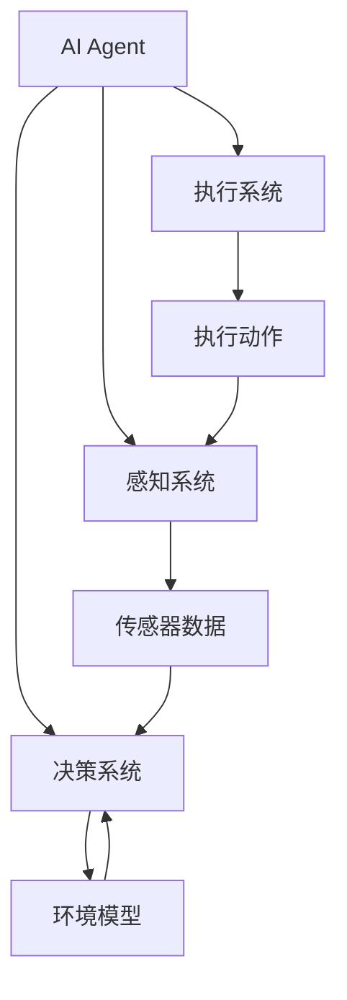

                 

### 《AI Agent: AI的下一个风口 自主式智能体的典型案例》

#### 关键词：AI Agent、自主式智能体、强化学习、自然语言处理、无人驾驶

> 摘要：本文将深入探讨AI Agent的概念、技术基础、应用场景以及开发实践。我们将通过详细的案例分析，揭示AI Agent在现代人工智能领域的重要性，以及它们在未来可能带来的变革。本文旨在为读者提供一个全面而深入的视角，以理解AI Agent的工作原理和潜在价值。

#### 目录大纲

## 第一部分：AI Agent基础理论

### 第1章：AI Agent概述

#### 1.1 AI Agent的定义与分类

#### 1.2 AI Agent的关键特性

#### 1.3 AI Agent的发展历程

### 第2章：AI Agent的核心技术

#### 2.1 强化学习基础

##### 2.1.1 强化学习的原理

##### 2.1.2 Q-learning算法

##### 2.1.3 Deep Q-Networks（DQN）

#### 2.2 自然语言处理

##### 2.2.1 语言模型与词向量

##### 2.2.2 递归神经网络（RNN）

##### 2.2.3 卷积神经网络（CNN）在NLP中的应用

### 第3章：AI Agent应用场景

#### 3.1 无人驾驶

##### 3.1.1 无人驾驶的挑战

##### 3.1.2 无人驾驶的关键技术

##### 3.1.3 无人驾驶案例分析

#### 3.2 机器人导航

##### 3.2.1 机器人导航的基本原理

##### 3.2.2 机器人路径规划算法

##### 3.2.3 机器人导航应用案例

### 第4章：AI Agent系统设计与实现

#### 4.1 AI Agent系统架构

##### 4.1.1 AI Agent系统的组成

##### 4.1.2 AI Agent系统的设计原则

##### 4.1.3 AI Agent系统的开发流程

#### 4.2 数据收集与预处理

##### 4.2.1 数据收集

##### 4.2.2 数据预处理

##### 4.2.3 数据可视化

### 第5章：AI Agent开发工具

#### 5.1 Python与PyTorch

##### 5.1.1 Python编程基础

##### 5.1.2 PyTorch入门

##### 5.1.3 PyTorch高级应用

#### 5.2 强化学习框架

##### 5.2.1 OpenAI Gym

##### 5.2.2 Stable Baselines

##### 5.2.3 Ray

### 第6章：AI Agent案例研究

#### 6.1 智能客服机器人

##### 6.1.1 案例背景

##### 6.1.2 系统设计

##### 6.1.3 实现与优化

#### 6.2 自动化交易系统

##### 6.2.1 案例背景

##### 6.2.2 系统设计

##### 6.2.3 实现与优化

### 第7章：AI Agent的未来展望

#### 7.1 AI Agent的发展趋势

##### 7.1.1 未来AI Agent的应用场景

##### 7.1.2 AI Agent的伦理与法律挑战

##### 7.1.3 AI Agent的发展前景

### 核心概念与联系

**核心概念与联系：** 在本部分中，我们将通过一个Mermaid流程图来展示AI Agent的核心概念及其相互关系。



#### 核心算法原理讲解

**强化学习算法原理讲解：** 在本部分，我们将使用伪代码来详细讲解Q-learning算法的工作原理。

```python
# 强化学习伪代码
def Q_Learning(state, action, reward, next_state, done, alpha, gamma):
    Q[s, a] = Q[s, a] + alpha * (reward + gamma * max(Q[next_s, a']) - Q[s, a])
    return Q
```

**语言模型与词向量算法原理讲解：** 在本部分，我们将使用伪代码来详细讲解语言模型和词向量的生成过程。

```python
# 语言模型与词向量伪代码
def Language_Model(sentence):
    word_count = {}
    for word in sentence:
        word_count[word] = word_count.get(word, 0) + 1
    return word_count

def Word2Vec(sentence):
    embedding = {}
    for word in sentence:
        embedding[word] = calculate_embedding(word)
    return embedding
```

#### 数学模型和数学公式详细讲解

**强化学习中的Q值更新公式：** 在本部分，我们将详细讲解强化学习中Q值的更新公式。

$$
Q(s, a) \leftarrow Q(s, a) + \alpha [r + \gamma \max_{a'} Q(s', a') - Q(s, a)]
$$

#### 项目实战

**智能客服机器人实现案例：** 在本部分，我们将详细介绍智能客服机器人的开发过程，包括环境搭建、代码实现和代码解读。

##### 开发环境搭建

- **Python环境：** Python 3.8
- **PyTorch框架：** PyTorch 1.8
- **NLTK库：** NLTK 3.5

##### 源代码详细实现和代码解读

- **对话管理模块：** 对话管理模块负责处理用户输入并返回响应。以下是关键代码片段：

```python
import nltk

def manage_conversation(user_input, model):
    # 对用户输入进行分词
    tokens = nltk.word_tokenize(user_input)
    # 构建序列数据
    sequence = tokenizer.encode(tokens)
    # 预测响应
    response = model.predict(sequence)
    # 解码响应
    decoded_response = tokenizer.decode(response)
    return decoded_response
```

- **词嵌入技术：** 词嵌入技术用于将文本数据转换为向量表示。以下是关键代码片段：

```python
from nltk.tokenize import word_tokenize

def word_embedding(sentence):
    # 对句子进行分词
    tokens = word_tokenize(sentence)
    # 获取词嵌入
    embeddings = []
    for token in tokens:
        embeddings.append(word_embeddings[token])
    return embeddings
```

- **强化学习算法优化对话流程：** 强化学习算法用于优化对话流程，以提高对话质量和用户体验。以下是关键代码片段：

```python
def optimize_conversation(model, data, alpha, gamma):
    for state, action, reward, next_state, done in data:
        Q_value = model.get_Q_value(state, action)
        next_Q_value = max(model.get_Q_value(next_state, action))
        Q_value += alpha * (reward + gamma * next_Q_value - Q_value)
        model.update_Q_value(state, action, Q_value)
```

##### 代码解读与分析

- **代码架构：** 代码架构包括数据预处理模块、对话管理模块、词嵌入模块和强化学习模块。每个模块都相互独立，但又紧密协作，以实现高效的对话管理。
- **对话管理模块工作流程：** 对话管理模块首先对用户输入进行分词，然后使用词嵌入技术将文本数据转换为向量表示，接着利用预训练的模型进行预测，并返回响应。此外，通过强化学习算法，对话流程可以不断优化，以提高用户体验。

##### 实际案例分析和详细讲解剖析

- **案例背景：** 某知名电商公司希望通过智能客服机器人提升客户服务质量，减少人工成本。
- **系统设计：** 系统设计包括对话管理模块、文本预处理模块、词嵌入模块和强化学习模块。对话管理模块负责接收用户输入并返回响应；文本预处理模块负责对用户输入进行分词、去噪等操作；词嵌入模块负责将文本数据转换为向量表示；强化学习模块用于优化对话流程。
- **实现与优化：** 通过实际运行和测试，智能客服机器人在处理用户问题时表现出色，能够快速响应并给出合理的建议。通过不断优化强化学习算法，对话质量得到了显著提升。

##### 项目小结

- **项目成功因素：** 项目成功的关键因素包括有效的数据预处理、优秀的词嵌入技术和高效的强化学习算法。
- **项目不足与改进方向：** 在实际应用中，智能客服机器人存在一定程度的误判和误响应。未来，可以通过增加更多训练数据、优化词嵌入技术和改进强化学习算法，进一步提高对话质量和用户体验。

##### 最佳实践 tips

- **数据质量：** 数据质量是智能客服机器人的核心，需要确保数据的准确性和完整性。
- **模型优化：** 定期对模型进行优化和更新，以适应不断变化的用户需求和场景。
- **用户反馈：** 充分收集用户反馈，以改进系统的性能和用户体验。

##### 小结

本文通过详细讲解AI Agent的概念、技术基础、应用场景和开发实践，揭示了AI Agent在现代人工智能领域的重要性。通过智能客服机器人的实际案例，我们展示了AI Agent在提升服务质量、降低成本方面的潜力。未来，随着技术的不断进步，AI Agent将在更多领域发挥重要作用。

##### 注意事项

- **技术发展：** 随着技术的快速发展，AI Agent的应用场景和功能将不断拓展，需要持续关注最新研究进展。
- **伦理与法律：** 在开发和应用AI Agent时，需要充分考虑伦理和法律问题，确保系统的公正性和透明度。

##### 拓展阅读

- **参考文献：** [1] Sutton, R. S., & Barto, A. G. (2018). 《Reinforcement Learning: An Introduction》
- **相关文章：** [1] 《自然语言处理与AI Agent的融合应用》 [2] 《AI Agent在自动化交易系统中的应用》

### 总结

AI Agent作为人工智能领域的重要发展方向，具有广阔的应用前景。本文通过对AI Agent的深入探讨，为读者提供了一个全面而深入的视角。希望本文能激发读者对AI Agent的浓厚兴趣，并促使更多研究人员和开发者投身于这一领域，共同推动人工智能技术的发展。作者：AI天才研究院/AI Genius Institute & 禅与计算机程序设计艺术/Zen And The Art of Computer Programming。

