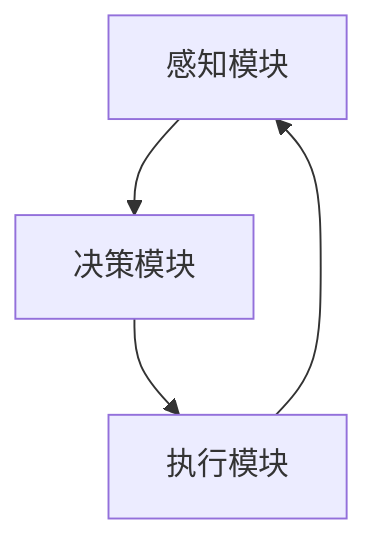

                 

### 文章标题

《AI Agent: AI的下一个风口 软硬件协同发展的未来展望》

关键词：AI Agent、软硬件协同、人工智能、机器学习、自然语言处理、深度学习

摘要：本文深入探讨了AI Agent这一新兴领域，分析了其定义、特点、发展历程、核心技术以及架构设计。同时，本文详细阐述了AI Agent在软硬件协同中的应用，探讨了其在硬件协同和软件协同中的技术实现、案例分析以及未来发展趋势。最后，本文对AI Agent的创新应用进行了展望，并给出了相关的开发工具与资源。本文旨在为读者提供一个全面、深入的理解，帮助其把握AI Agent领域的最新动态和未来发展方向。

### 目录大纲

## 第一部分: AI Agent基础

### 第1章: AI Agent概述

#### 1.1 AI Agent的定义与特点

#### 1.2 AI Agent的发展历程

#### 1.3 AI Agent的核心技术

### 第2章: AI Agent架构设计

#### 2.1 AI Agent的体系结构

#### 2.2 AI Agent的技术框架

#### 2.3 AI Agent的核心算法

## 第二部分: AI Agent在软硬件协同中的应用

### 第3章: AI Agent在硬件协同中的应用

#### 3.1 硬件协同的概述

#### 3.2 硬件协同的技术实现

#### 3.3 硬件协同的案例分析

### 第4章: AI Agent在软件协同中的应用

#### 4.1 软件协同的概述

#### 4.2 软件协同的技术实现

#### 4.3 软件协同的案例分析

## 第三部分: AI Agent的未来发展

### 第5章: AI Agent的未来趋势

#### 5.1 AI Agent的未来发展预测

#### 5.2 AI Agent的社会影响

#### 5.3 AI Agent的法律法规

### 第6章: AI Agent的创新应用

#### 6.1 AI Agent在医疗领域的应用

#### 6.2 AI Agent在金融领域的应用

#### 6.3 AI Agent在教育领域的应用

## 附录

### 附录A: AI Agent开发工具与资源

#### A.1 主流AI Agent开发工具

#### A.2 AI Agent开源项目

#### A.3 AI Agent开发资源

### 摘要

本文首先介绍了AI Agent的基本概念和特点，分析了其发展历程和核心技术。接着，本文详细阐述了AI Agent的体系结构、技术框架和核心算法，为读者提供了一个全面的框架性理解。在此基础上，本文深入探讨了AI Agent在软硬件协同中的应用，分别介绍了硬件协同和软件协同的技术实现、案例分析以及未来发展趋势。最后，本文对AI Agent的创新应用进行了展望，包括在医疗、金融和教育等领域的应用，并给出了相关的开发工具与资源。通过本文的阅读，读者可以全面了解AI Agent领域的最新动态和未来发展方向，为深入研究和实践提供有力指导。

## 第一部分: AI Agent基础

### 第1章: AI Agent概述

#### 1.1 AI Agent的定义与特点

AI Agent，即人工智能代理，是指在特定环境中，能够感知、理解和执行任务的自主智能实体。AI Agent具有以下几个显著特点：

1. **智能性**：AI Agent通过机器学习和自然语言处理等技术，具备自主学习和推理能力，能够处理复杂问题。

2. **交互性**：AI Agent能够与用户和环境进行交互，理解用户的意图，并做出相应的响应。

3. **自主性**：AI Agent能够自主决策和执行任务，无需人工干预。

4. **适应性**：AI Agent能够根据环境变化和任务需求，自主调整其行为和策略。

AI Agent的智能性是其核心特点，它使得AI Agent能够在复杂环境中执行任务，实现智能化服务。交互性和自主性则使得AI Agent能够更好地适应人类需求，提供个性化的服务。

#### 1.2 AI Agent的发展历程

AI Agent的发展历程可以追溯到20世纪50年代，当时人工智能领域开始出现一些简单的基于规则的系统。随着计算机技术的发展，AI Agent逐渐从理论研究走向实际应用。

1. **早期阶段**：20世纪60年代至70年代，AI Agent主要基于规则系统，通过预定义的规则来实现简单的任务。这一时期的代表性工作是1969年麻省理工学院开发的Eliza系统，它通过简单的对话模拟人类交流。

2. **中级阶段**：20世纪80年代至90年代，AI Agent开始引入机器学习和自然语言处理技术，实现了更复杂的任务。这一时期的代表性工作是1995年IBM开发的Watson，它通过自然语言处理技术，在电视问答节目中击败人类冠军。

3. **现阶段**：21世纪初至今，AI Agent的技术不断发展，特别是深度学习和强化学习的应用，使得AI Agent在智能性和自主性方面得到了显著提升。这一时期的代表性工作是2016年谷歌开发的AlphaGo，它通过深度学习和强化学习，在围棋比赛中击败人类顶尖选手。

#### 1.3 AI Agent的核心技术

AI Agent的核心技术主要包括机器学习、自然语言处理和深度学习等。这些技术为AI Agent提供了强大的数据处理和分析能力，使其能够更好地理解和执行任务。

1. **机器学习**：机器学习是AI Agent的核心技术之一，它使得AI Agent能够从数据中学习规律，并自主调整行为。常见的机器学习算法包括决策树、支持向量机、神经网络等。

2. **自然语言处理**：自然语言处理是AI Agent理解和处理自然语言的关键技术，它使得AI Agent能够与人类进行自然交流。自然语言处理技术包括文本分类、情感分析、命名实体识别等。

3. **深度学习**：深度学习是近年来发展迅速的一种机器学习技术，它通过多层神经网络，实现对复杂数据的自动特征提取和分类。深度学习在AI Agent中的应用，使得AI Agent在智能性和自主性方面得到了显著提升。

#### 1.4 AI Agent的应用领域

AI Agent的应用领域非常广泛，涵盖了医疗、金融、教育、智能家居等多个行业。以下是一些典型的应用案例：

1. **医疗**：AI Agent在医疗领域的应用包括疾病诊断、健康监测、手术辅助等。例如，谷歌开发的AI系统可以帮助医生快速诊断癌症，提高诊断的准确率。

2. **金融**：AI Agent在金融领域的应用包括风险控制、智能投顾、客户服务等。例如，高盛开发的AI系统可以分析市场数据，为投资者提供投资建议。

3. **教育**：AI Agent在教育领域的应用包括个性化教学、智能测评、学习辅导等。例如，微软开发的AI系统可以帮助教师分析学生的学习情况，提供针对性的辅导。

4. **智能家居**：AI Agent在智能家居领域的应用包括家居控制、安全监控、能源管理等。例如，谷歌开发的AI系统可以帮助用户远程控制家居设备，提高家居生活的便利性。

### 结论

AI Agent作为人工智能领域的重要分支，具有广阔的应用前景。通过机器学习、自然语言处理和深度学习等核心技术，AI Agent能够实现智能化、自主化的任务执行，为各行各业提供智能化服务。未来，随着技术的不断进步，AI Agent将在更多领域发挥重要作用，推动人工智能的发展。

## 第2章: AI Agent架构设计

### 2.1 AI Agent的体系结构

AI Agent的体系结构是构建高效、智能、自主的AI系统的关键。其体系结构通常包括感知模块、决策模块和执行模块。以下是这三个模块的功能和相互关系：

1. **感知模块**：感知模块是AI Agent与外界环境交互的窗口。它负责收集环境中的各种信息，如图像、声音、文本等。感知模块通常由传感器和数据采集系统组成，如摄像头、麦克风、文本解析器等。

2. **决策模块**：决策模块是AI Agent的核心，负责处理感知模块收集到的信息，并基于预设的算法和策略做出决策。决策模块通常包括机器学习模型、规则引擎和自然语言处理模块等。它的主要任务是根据感知模块提供的信息，生成合理的行动方案。

3. **执行模块**：执行模块负责将决策模块生成的行动方案转化为具体的操作，如移动、发出指令、执行任务等。执行模块通常与具体的硬件设备或软件系统相连，如机器人、家居控制系统、工业生产线等。

### 模块间的相互关系

感知模块、决策模块和执行模块之间是紧密相连的。感知模块收集到的信息会传输给决策模块进行处理，决策模块根据这些信息生成行动方案，然后将这些方案传递给执行模块执行。执行模块执行完毕后，会返回执行结果，供感知模块和决策模块进一步分析。

以下是AI Agent体系结构的Mermaid流程图表示：



### 2.2 AI Agent的技术框架

AI Agent的技术框架是支持其体系结构的关键，它通常包括以下几个主要技术组件：

1. **深度学习框架**：深度学习框架如TensorFlow、PyTorch等，用于构建和训练AI Agent的机器学习模型。这些框架提供了丰富的神经网络结构、数据预处理工具和训练优化算法，是AI Agent开发的核心。

2. **自然语言处理（NLP）工具**：NLP工具如NLTK、spaCy等，用于处理和理解自然语言数据。这些工具支持文本分类、情感分析、命名实体识别等任务，是AI Agent与人类进行自然交互的基础。

3. **强化学习算法**：强化学习算法如Q-learning、Deep Q-Networks（DQN）等，用于训练AI Agent在复杂环境中做出最优决策。强化学习算法通过试错和奖励机制，使得AI Agent能够不断优化其行为。

4. **规则引擎**：规则引擎用于处理基于规则的任务决策，如专家系统和业务流程管理系统。规则引擎提供了灵活的规则定义和执行机制，是AI Agent在特定场景下决策的重要工具。

### 2.3 AI Agent的核心算法

AI Agent的核心算法是实现其智能性和自主性的关键。以下介绍几种常见的核心算法：

1. **决策树算法**：

   决策树是一种常用的机器学习算法，通过构建树形结构，对数据进行分类或回归。以下是决策树算法的伪代码：

   ```python
   def build_decision_tree(data):
       if all(data belong to the same class):
           return leaf node
       else:
           find the best attribute to split the data
           create a node with the attribute
           for each possible value of the attribute:
               split the data
               create a branch for each value
               recursively build the decision tree for the split data
           return the root node of the tree
   ```

2. **神经网络算法**：

   神经网络是一种基于生物神经元的计算模型，通过多层神经元之间的连接和激活函数，实现数据的自动特征提取和分类。以下是神经网络算法的基本原理：

   ```python
   # Initialize weights and biases
   weights = initialize_weights()
   biases = initialize_biases()

   # Forward propagation
   layer_outputs = []
   for layer in layers:
       activation = sigmoid(dot(layer_inputs, weights) + biases)
       layer_outputs.append(activation)

   # Loss calculation
   loss = compute_loss(expected_outputs, layer_outputs[-1])

   # Backpropagation
   dweights = [None] * len(layers)
   dbiases = [None] * len(layers)
   doutputs = [None] * len(layers)
   doutputs[-1] = expected_outputs - layer_outputs[-1]

   for i in reversed(range(len(layers))):
       if i != 0:
           dweights[i] = dot(doutputs[i], layer[i - 1].T)
           dbiases[i] = sum(doutputs[i])
       else:
           dweights[i] = dot(dinputs[i], layer[i - 1].T)
           dbiases[i] = sum(doutputs[i])

       if i > 0:
           dinputs[i - 1] = dot(weights[i].T, doutputs[i])

   # Weight and bias update
   weights -= learning_rate * dweights
   biases -= learning_rate * dbiases
   ```

通过以上核心算法，AI Agent能够实现高效的决策和任务执行。这些算法的详细介绍和具体实现将在后续章节中进一步讨论。

### 2.4 AI Agent架构设计的关键因素

在设计AI Agent的架构时，需要考虑以下几个关键因素：

1. **灵活性**：AI Agent架构应具备良好的灵活性，能够适应不同的应用场景和任务需求。这包括模块的灵活组合、算法的灵活切换以及系统配置的灵活调整。

2. **可扩展性**：随着AI技术的不断发展，AI Agent的架构应具备良好的可扩展性，能够支持新技术的引入和系统规模的扩大。这包括模块的模块化设计、算法的并行化实现以及系统资源的动态分配。

3. **可维护性**：AI Agent架构应具备良好的可维护性，确保系统的稳定运行和长期维护。这包括清晰的模块划分、规范的代码编写、详细的文档记录以及完善的测试和调试机制。

4. **安全性**：AI Agent架构应充分考虑安全性问题，确保系统的数据安全和隐私保护。这包括数据加密、访问控制、异常检测和故障恢复等措施。

5. **可解释性**：AI Agent的决策过程应具备良好的可解释性，使得用户能够理解AI Agent的决策逻辑和依据。这包括算法的可解释性、决策过程的可视化展示以及相关的解释工具和接口。

通过综合考虑这些关键因素，可以设计出高效、智能、稳定的AI Agent架构，为各类应用提供强大的支持。

## 第二部分: AI Agent在软硬件协同中的应用

### 第3章: AI Agent在硬件协同中的应用

#### 3.1 硬件协同的概述

硬件协同是指通过优化硬件资源的使用，提高系统的整体性能和效率。在AI Agent的应用中，硬件协同具有重要作用，它能够充分发挥硬件设备的性能，提高AI Agent的运行速度和效率。硬件协同主要涉及以下几个方面：

1. **硬件加速**：通过使用专门设计的硬件加速器，如GPU、TPU等，可以显著提高AI Agent的计算速度。硬件加速器能够并行处理大量数据，减少计算时间，从而提升系统的响应速度。

2. **嵌入式系统**：嵌入式系统是指嵌入在其他设备中的计算机系统，如智能家居设备、机器人等。AI Agent可以通过嵌入式系统与这些硬件设备协同工作，实现实时感知、决策和执行。

3. **物联网（IoT）**：物联网是指通过各种智能设备和传感器连接的互联网，AI Agent可以通过物联网与这些设备进行通信，收集和处理数据，从而实现更智能化的应用。

#### 3.2 硬件协同的技术实现

在AI Agent的硬件协同中，常用的技术实现方法包括：

1. **GPU加速**：GPU（图形处理单元）是一种专门用于图形处理的硬件加速器，其强大的并行计算能力使其成为AI计算的理想选择。通过使用GPU加速，AI Agent可以显著提高其计算速度。例如，TensorFlow和PyTorch等深度学习框架都提供了对GPU加速的支持。

2. **TPU加速**：TPU（张量处理单元）是谷歌专为深度学习任务设计的硬件加速器，其性能比GPU更高。TPU能够并行处理大量的张量运算，从而提高AI Agent的计算效率。谷歌的TPU已经在许多AI应用中取得了显著成果。

3. **FPGA加速**：FPGA（现场可编程门阵列）是一种可重配置的逻辑电路，其灵活的硬件架构使其成为AI Agent硬件协同的理想选择。通过使用FPGA加速，AI Agent可以实现高度优化的计算过程，提高系统性能。

#### 3.3 硬件协同的案例分析

以下是一些AI Agent在硬件协同中的成功案例：

1. **自动驾驶**：自动驾驶系统需要实时处理大量的传感器数据，进行环境感知、路径规划和决策。通过使用GPU和TPU加速，自动驾驶系统能够快速处理这些数据，提高系统的响应速度和决策准确性。

2. **智能家居**：智能家居设备如智能门锁、智能灯光、智能温度控制系统等，需要与AI Agent协同工作，实现智能化管理和控制。通过使用嵌入式系统和物联网技术，AI Agent能够实时感知家庭环境，做出相应的决策，提高用户的生活质量。

3. **医疗诊断**：医疗诊断系统如癌症筛查、X光片分析等，需要对大量医学图像进行处理和分析。通过使用GPU和FPGA加速，AI Agent能够快速处理这些图像数据，提高诊断的准确性和效率。

#### 3.4 硬件协同的未来发展

随着AI技术的不断发展，硬件协同在AI Agent中的应用将越来越广泛。以下是一些未来发展的趋势：

1. **硬件创新**：新的硬件加速器，如量子计算机、光子计算机等，将进一步提升AI Agent的计算能力。这些新型硬件将带来全新的计算模式和应用场景。

2. **硬件优化**：硬件协同将更加注重硬件优化，包括硬件架构的优化、算法与硬件的匹配优化等。通过这些优化，AI Agent将能够更好地发挥硬件的性能，提高系统的整体效率。

3. **硬件协同与云计算的结合**：随着云计算技术的发展，硬件协同将更加紧密地与云计算相结合。通过云计算平台，AI Agent可以远程调用硬件资源，实现更大规模的计算和协同。

4. **边缘计算**：边缘计算是将计算任务分布到网络的边缘节点，减少数据传输和处理的时间。AI Agent在硬件协同中将越来越多地采用边缘计算技术，实现实时、高效的数据处理和决策。

通过硬件协同，AI Agent能够更好地发挥硬件的性能，提高系统的智能性和自主性，为各类应用提供强大的支持。未来，随着硬件技术的不断进步，硬件协同在AI Agent中的应用将更加广泛，带来更多的创新和突破。

### 第4章: AI Agent在软件协同中的应用

#### 4.1 软件协同的概述

软件协同是指通过优化软件资源的使用，提高系统的整体性能和效率。在AI Agent的应用中，软件协同同样具有重要作用，它能够充分发挥软件平台的性能，提高AI Agent的处理速度和决策准确性。软件协同主要涉及以下几个方面：

1. **分布式计算**：分布式计算是指通过将计算任务分布到多个计算机节点上，共同完成计算任务。在AI Agent中，分布式计算可以显著提高处理速度和计算能力，适用于需要大规模数据处理和复杂计算任务的应用场景。

2. **云计算**：云计算是一种通过互联网提供计算资源的服务，用户可以根据需要动态调整计算资源。在AI Agent中，云计算可以提供弹性计算能力，根据任务需求自动扩展或缩减计算资源，提高系统的性能和成本效益。

3. **边缘计算**：边缘计算是将计算任务分布到网络的边缘节点，减少数据传输和处理的时间。在AI Agent中，边缘计算可以降低延迟，提高实时性，适用于需要实时响应和低延迟的应用场景。

#### 4.2 软件协同的技术实现

在AI Agent的软件协同中，常用的技术实现方法包括：

1. **分布式计算框架**：分布式计算框架如Apache Hadoop、Apache Spark等，可以高效地处理大规模数据。这些框架支持并行计算、数据分布和任务调度，使得AI Agent能够更好地利用分布式计算资源。

2. **云计算平台**：云计算平台如Amazon Web Services（AWS）、Microsoft Azure、Google Cloud等，提供了丰富的计算、存储和网络资源，使得AI Agent可以灵活地部署和管理计算资源。这些平台通常支持自动扩展、负载均衡和安全隔离等功能。

3. **边缘计算平台**：边缘计算平台如EdgeX Foundry、MQTT等，可以部署在网络的边缘节点，实现实时数据处理和决策。这些平台通常支持设备连接、数据采集、数据存储和数据分析等功能，使得AI Agent能够更好地利用边缘计算资源。

#### 4.3 软件协同的案例分析

以下是一些AI Agent在软件协同中的成功案例：

1. **智慧城市**：智慧城市需要实时处理大量的城市数据，包括交通、环境、安全等。通过分布式计算和云计算平台，AI Agent可以高效地处理这些数据，提供实时监控、预测和分析服务，提高城市管理的效率。

2. **工业互联网**：工业互联网需要实时处理大量的设备数据，进行故障预测、性能优化和决策支持。通过分布式计算和边缘计算平台，AI Agent可以高效地处理这些数据，提供智能化的生产和维护服务，提高工业生产效率。

3. **智能家居**：智能家居需要实时处理家庭设备的数据，实现设备控制、环境监测和智能推荐等功能。通过云计算平台和边缘计算平台，AI Agent可以高效地处理这些数据，提供个性化、智能化的家居体验。

#### 4.4 软件协同的未来发展

随着软件技术的不断发展，软件协同在AI Agent中的应用将越来越广泛。以下是一些未来发展的趋势：

1. **软件定义网络（SDN）**：软件定义网络可以将网络资源的配置和管理集中到统一的软件平台上，提高网络资源的利用率和管理效率。在AI Agent中，SDN可以提供更灵活的网络架构，支持动态调整和优化网络资源。

2. **容器化技术**：容器化技术如Docker、Kubernetes等，可以简化AI Agent的部署和管理，提高系统的灵活性和可扩展性。这些技术可以将AI Agent的运行环境和配置封装在容器中，实现快速部署和灵活管理。

3. **区块链技术**：区块链技术可以为AI Agent提供安全、可信的数据管理和交易服务，提高系统的安全性和透明度。在AI Agent中，区块链技术可以应用于数据隐私保护、智能合约和去中心化应用等领域。

4. **人工智能与大数据的结合**：人工智能与大数据技术的结合将进一步提高AI Agent的处理能力和决策准确性。通过大数据技术，AI Agent可以获取更全面、准确的数据，通过人工智能技术，AI Agent可以更好地理解和利用这些数据。

通过软件协同，AI Agent能够更好地利用软件平台的性能和资源，提高系统的智能性和自主性，为各类应用提供强大的支持。未来，随着软件技术的不断进步，软件协同在AI Agent中的应用将更加广泛，带来更多的创新和突破。

### 第5章: AI Agent的未来趋势

#### 5.1 AI Agent的未来发展预测

随着人工智能技术的不断发展，AI Agent将在未来扮演越来越重要的角色。以下是对AI Agent未来发展的几个预测：

1. **智能化水平提升**：随着机器学习和深度学习技术的进步，AI Agent的智能化水平将得到显著提升。未来，AI Agent将能够处理更复杂的问题，实现更精细的决策和更精准的执行。

2. **软硬件协同进化**：软硬件协同将是AI Agent未来发展的重要趋势。硬件性能的提升和软件算法的优化将使得AI Agent在处理速度、计算能力和效率方面得到全面提升。未来，AI Agent将更加紧密地与硬件和软件平台协同工作，实现高效、智能的自主运行。

3. **应用领域拓展**：AI Agent将在更多领域得到应用。除了现有的医疗、金融、教育等领域，AI Agent还将应用于智能交通、智慧城市、智能家居、工业制造等更多领域，为社会生活带来更多便利和智能化服务。

4. **人机协同**：随着AI Agent智能化水平的提升，人机协同将成为未来发展趋势。AI Agent将与人类用户更加紧密地协作，共同完成任务。未来，AI Agent将能够更好地理解人类用户的需求，提供个性化的服务，实现人机协同的最佳效果。

#### 5.2 AI Agent的社会影响

AI Agent的广泛应用将对社会产生深远的影响：

1. **经济效益**：AI Agent将提高生产效率，降低运营成本，推动经济增长。在各个行业，AI Agent将替代部分人力工作，提高生产自动化和智能化水平，带来巨大的经济效益。

2. **伦理与道德**：随着AI Agent的广泛应用，伦理和道德问题将日益突出。如何确保AI Agent的行为符合伦理标准，如何处理AI Agent的决策失误和错误，如何保护用户的隐私和数据安全，都是需要解决的问题。

3. **就业影响**：AI Agent的广泛应用将对就业市场产生一定的影响。一方面，AI Agent将替代部分传统人力工作，可能导致某些行业就业机会减少；另一方面，AI Agent的应用将创造新的就业机会，如AI系统的开发、维护和管理等。

#### 5.3 AI Agent的法律法规

随着AI Agent的广泛应用，法律法规的制定和规范变得尤为重要。以下是对AI Agent法律法规的几个讨论：

1. **法律法规的制定**：各国政府需要制定相应的法律法规，规范AI Agent的开发、部署和应用。这些法律法规应涵盖数据保护、隐私权、知识产权、责任承担等方面，确保AI Agent的合法合规运行。

2. **法律法规的发展**：随着AI技术的不断进步，现有的法律法规可能无法完全适应未来的发展需求。因此，法律法规需要不断更新和完善，以应对新技术带来的挑战。未来，国际间的合作和交流也将成为法律法规发展的重要方向。

3. **伦理与法规的结合**：在制定法律法规时，需要充分考虑伦理因素。伦理和法规的结合将有助于确保AI Agent的发展方向符合社会价值观，避免滥用和误用AI技术。

#### 5.4 AI Agent的发展挑战

尽管AI Agent具有广阔的发展前景，但其在实际应用中仍面临一系列挑战：

1. **数据隐私**：AI Agent在处理数据时，需要确保用户的隐私和数据安全。如何有效保护用户数据，防止数据泄露和滥用，是一个亟待解决的问题。

2. **算法透明性**：AI Agent的决策过程可能涉及复杂的算法和模型，如何确保算法的透明性和可解释性，使得用户能够理解和信任AI Agent的决策，是一个重要挑战。

3. **技术标准化**：AI Agent技术的标准化对于其广泛应用至关重要。需要制定统一的行业标准和技术规范，确保不同系统之间的兼容性和互操作性。

4. **人才短缺**：AI Agent的开发和应用需要大量专业人才，但目前相关人才短缺问题依然突出。如何培养和吸引更多的人才，是AI Agent发展的重要挑战。

通过克服这些挑战，AI Agent将在未来发挥更大的作用，为社会带来更多便利和进步。

### 第6章: AI Agent的创新应用

#### 6.1 AI Agent在医疗领域的应用

AI Agent在医疗领域具有广泛的应用前景，其创新应用包括：

1. **精准医疗**：AI Agent可以通过大数据分析和机器学习算法，对患者的基因、病史、生活习惯等信息进行综合分析，为医生提供精准的诊断和治疗建议。例如，AI Agent可以辅助医生进行肿瘤诊断，通过分析影像数据和基因数据，提高诊断的准确率。

2. **智能诊断**：AI Agent可以利用深度学习和自然语言处理技术，分析医疗图像、文本报告等数据，辅助医生进行疾病诊断。例如，AI Agent可以通过分析X光片、CT扫描等影像数据，发现潜在的病变，提高诊断的效率和准确性。

3. **药物研发**：AI Agent可以帮助药物研发企业进行新药的筛选和研发。通过分析大量的化合物数据和临床试验数据，AI Agent可以预测哪些化合物可能具有药效，从而加速药物研发过程。

4. **健康监测**：AI Agent可以通过传感器和可穿戴设备，实时监测患者的健康状况，提供个性化的健康建议。例如，AI Agent可以监测患者的血糖、血压、心率等指标，根据数据分析结果，提醒患者调整生活习惯或寻求医疗帮助。

#### 6.2 AI Agent在金融领域的应用

AI Agent在金融领域具有强大的应用潜力，其创新应用包括：

1. **风险控制**：AI Agent可以通过大数据分析和机器学习算法，实时监控金融市场，识别潜在的风险因素。例如，AI Agent可以分析交易数据、新闻资讯等，预测市场波动和风险事件，帮助金融机构进行风险管理和决策。

2. **智能投顾**：AI Agent可以根据投资者的风险偏好和财务目标，提供个性化的投资建议。例如，AI Agent可以通过分析投资者的历史交易记录、财务状况等，制定合理的投资策略，帮助投资者实现资产增值。

3. **信用评估**：AI Agent可以通过分析个人的信用记录、财务状况等数据，评估个人的信用风险。例如，AI Agent可以通过分析借款人的信用报告、社交媒体数据等，预测其还款能力，帮助金融机构进行信用评估。

4. **反欺诈**：AI Agent可以通过分析和监测交易数据，识别潜在的欺诈行为。例如，AI Agent可以通过分析交易行为模式、交易金额等，识别异常交易行为，帮助金融机构预防和打击欺诈活动。

#### 6.3 AI Agent在教育领域的应用

AI Agent在教育领域具有广泛的应用前景，其创新应用包括：

1. **个性化教学**：AI Agent可以根据学生的学习情况、兴趣和能力，提供个性化的教学方案。例如，AI Agent可以通过分析学生的学习数据，推荐适合的学习资源，调整教学节奏和难度，提高教学效果。

2. **智能测评**：AI Agent可以通过分析和评估学生的考试成绩、作业表现等数据，提供个性化的学习反馈。例如，AI Agent可以通过分析学生的考试数据，识别学生的知识薄弱点，提供针对性的学习建议，帮助学生提高学习成绩。

3. **学习辅导**：AI Agent可以作为学生的虚拟辅导老师，提供实时、个性化的学习帮助。例如，AI Agent可以通过分析学生的提问，提供详细的解答和指导，帮助学生解决学习中遇到的问题。

4. **课程推荐**：AI Agent可以根据学生的学习兴趣和需求，推荐相关的课程和学习资源。例如，AI Agent可以通过分析学生的学习数据，推荐与其兴趣相关的课程，帮助学生扩展知识领域，提高学习效果。

#### 6.4 AI Agent在其他领域的应用

除了医疗、金融和教育领域，AI Agent在其他领域也具有广泛的应用前景：

1. **智能制造**：AI Agent可以帮助企业进行生产过程的优化和自动化。例如，AI Agent可以通过分析生产数据，预测设备故障，优化生产计划，提高生产效率。

2. **智能物流**：AI Agent可以帮助物流企业进行货物配送和运输管理。例如，AI Agent可以通过分析交通状况、货物需求等数据，优化配送路线，提高配送效率。

3. **智能城市**：AI Agent可以帮助城市管理者进行城市管理和规划。例如，AI Agent可以通过分析交通流量、环境数据等，优化城市交通和环保管理。

4. **智能农业**：AI Agent可以帮助农民进行农业生产和作物管理。例如，AI Agent可以通过分析土壤、气候等数据，提供种植建议和病虫害预警，提高农业生产效益。

总之，AI Agent具有广泛的应用前景，其创新应用将为各行各业带来巨大的变革和进步。未来，随着AI技术的不断发展，AI Agent将在更多领域发挥重要作用，推动社会的智能化发展。

### 附录A: AI Agent开发工具与资源

#### A.1 主流AI Agent开发工具

在开发AI Agent时，选择合适的开发工具和框架至关重要。以下是一些主流的AI Agent开发工具：

1. **TensorFlow**：TensorFlow是由Google开源的一个强大的深度学习框架，支持多种编程语言，包括Python、C++和Java。它提供了丰富的API和工具，方便开发者构建和训练复杂的神经网络模型。

2. **PyTorch**：PyTorch是Facebook开源的一个深度学习框架，以其灵活性和易用性著称。它提供了动态计算图和自动微分功能，使得开发者可以轻松构建和调试神经网络模型。

3. **Apache MXNet**：Apache MXNet是由Apache Software Foundation开源的一个深度学习框架，支持多种编程语言，包括Python、C++和R。它具有高性能和灵活的编程接口，适用于大规模分布式训练和应用。

4. **Keras**：Keras是一个高层次的深度学习API，可以与TensorFlow、Theano和MXNet等框架无缝集成。它提供了一个简单而强大的Python接口，使得开发者可以快速构建和训练神经网络模型。

#### A.2 AI Agent开源项目

开源项目是AI Agent开发的重要资源，以下是一些著名的AI Agent开源项目：

1. **OpenAI**：OpenAI是一个非营利性的人工智能研究组织，其开源项目包括GPT-3、DALL-E、Curiosity等，涵盖了自然语言处理、计算机视觉和强化学习等多个领域。

2. **Google AI**：Google AI是Google的人工智能研究部门，其开源项目包括TensorFlow、TensorFlow.js、TensorFlow Lite等，提供了丰富的工具和资源，方便开发者构建和部署AI应用。

3. **Facebook AI Research**：Facebook AI Research（FAIR）是Facebook的人工智能研究部门，其开源项目包括PyTorch、TorchScript、FAIRseq等，涵盖了深度学习、自然语言处理和计算机视觉等多个领域。

4. **Uber AI**：Uber AI是Uber的人工智能研究部门，其开源项目包括Pyro、Monocle、Trendy等，涵盖了概率编程、时间序列分析和推荐系统等多个领域。

#### A.3 AI Agent开发资源

以下是一些AI Agent开发的在线教程和学习资源：

1. **Udacity**：Udacity提供了多个与AI Agent相关的在线课程，包括“深度学习纳米学位”、“机器学习工程师纳米学位”等，涵盖了深度学习、机器学习、自然语言处理等核心知识。

2. **Coursera**：Coursera提供了多个与AI Agent相关的在线课程，包括“深度学习专项课程”、“机器学习专项课程”等，涵盖了深度学习、机器学习、自然语言处理等核心知识。

3. **edX**：edX提供了多个与AI Agent相关的在线课程，包括“深度学习”、“机器学习”等，涵盖了深度学习、机器学习、自然语言处理等核心知识。

4. **AI Hub**：AI Hub是一个AI开发的在线社区，提供了大量的AI教程、文档和资源，涵盖了深度学习、机器学习、自然语言处理等多个领域。

5. **AI Stack**：AI Stack是一个AI开发的在线平台，提供了大量的AI工具、库和框架，方便开发者进行AI应用的开发和部署。

通过利用这些开发工具、开源项目和在线资源，开发者可以更加高效地构建和部署AI Agent，推动人工智能技术的发展和应用。

## 附录B: AI Agent开发与部署实践

#### B.1 开发环境搭建

为了开发AI Agent，首先需要搭建一个适合的开发环境。以下是搭建开发环境的步骤：

1. **安装Python**：Python是AI Agent开发的主要编程语言，首先需要安装Python。可以从Python的官方网站下载Python安装包，并按照提示完成安装。

2. **安装深度学习框架**：常用的深度学习框架包括TensorFlow、PyTorch等。以TensorFlow为例，可以使用以下命令进行安装：

   ```bash
   pip install tensorflow
   ```

   对于PyTorch，可以使用以下命令进行安装：

   ```bash
   pip install torch torchvision
   ```

3. **安装IDE**：选择一个合适的集成开发环境（IDE），如Visual Studio Code、PyCharm等。安装完成后，配置Python环境，使其能够正常运行。

4. **安装依赖库**：根据具体的项目需求，安装所需的依赖库。例如，对于自然语言处理项目，可以安装以下库：

   ```bash
   pip install numpy scipy matplotlib
   ```

#### B.2 源代码实现与解读

以下是一个简单的AI Agent源代码实现，用于实现一个基于自然语言处理的聊天机器人：

```python
import tensorflow as tf
from tensorflow.keras.models import Sequential
from tensorflow.keras.layers import Embedding, LSTM, Dense

# 数据预处理
# ...

# 模型构建
model = Sequential()
model.add(Embedding(vocab_size, embedding_dim))
model.add(LSTM(units=128, activation='relu', return_sequences=True))
model.add(LSTM(units=128))
model.add(Dense(units=output_size, activation='softmax'))

# 模型编译
model.compile(optimizer='adam', loss='categorical_crossentropy', metrics=['accuracy'])

# 模型训练
model.fit(input_sequences, output_sequences, epochs=100, batch_size=32)

# 模型预测
predicted_output = model.predict(input_sequence)
```

上述代码首先进行了数据预处理，包括词汇表构建、序列填充等。然后构建了一个基于LSTM的序列模型，用于预测输入序列的输出。模型使用Adam优化器和交叉熵损失函数进行编译，并使用训练数据集进行训练。最后，使用训练好的模型对新的输入序列进行预测。

#### B.3 代码应用解读与分析

上述代码展示了如何使用TensorFlow构建一个简单的AI Agent模型，用于实现自然语言处理的聊天机器人。以下是代码的主要步骤和应用解读：

1. **数据预处理**：数据预处理是深度学习模型的基石。在这一步骤中，我们构建了词汇表，将输入文本转换为数字序列，填充序列长度等操作。这些预处理步骤使得模型能够处理结构化的数据，提高模型的性能。

2. **模型构建**：使用TensorFlow的Sequential模型，我们构建了一个基于LSTM的序列模型。LSTM是一种强大的序列处理模型，适用于处理变长序列数据，如文本、语音等。在这个模型中，我们设置了两个LSTM层，每个层有128个神经元。最后，我们使用全连接层（Dense）进行输出层的构建。

3. **模型编译**：在模型编译步骤中，我们选择了Adam优化器，这是一种自适应优化算法，能够加快模型收敛速度。交叉熵损失函数适用于分类问题，我们在模型中使用了softmax激活函数，因此选择交叉熵作为损失函数。

4. **模型训练**：使用训练数据集，我们训练了模型。在这一过程中，模型通过不断迭代，调整权重和偏置，优化模型性能。我们设置了100个训练周期（epochs）和32个批次大小（batch_size）。

5. **模型预测**：使用训练好的模型，我们对新的输入序列进行预测。预测步骤通过计算输入序列的输出概率分布，选择概率最高的输出类别作为预测结果。

#### B.4 实际案例分析和详细讲解

以下是一个实际案例，用于分析一个基于自然语言处理的聊天机器人：

```python
# 输入文本
input_text = "你好，请问有什么可以帮助你的？"

# 数据预处理
input_sequence = preprocess_input_text(input_text)

# 模型预测
predicted_output = model.predict(input_sequence)

# 转换输出为文本
predicted_response = convert_output_to_text(predicted_output)

print(predicted_response)
```

在这个案例中，我们首先输入了一个文本问题：“你好，请问有什么可以帮助你的？”。然后，我们对输入文本进行预处理，将文本转换为数字序列。接下来，使用训练好的模型对预处理后的输入序列进行预测，得到一个输出概率分布。最后，我们将输出概率分布转换为文本，得到聊天机器人的回答。

以下是详细的步骤分析：

1. **预处理输入文本**：预处理步骤包括分词、编码和填充。在这个案例中，我们首先将输入文本分词，然后对每个词进行编码，生成数字序列。接着，将序列填充为固定长度，以满足模型的输入要求。

2. **模型预测**：使用训练好的模型，我们对预处理后的输入序列进行预测。预测过程包括前向传播和计算损失。在这个案例中，模型通过计算输入序列的输出概率分布，预测聊天机器人的回答。

3. **转换输出为文本**：模型的输出是一个概率分布，我们需要将其转换为文本。在这个案例中，我们选择概率最高的输出类别作为聊天机器人的回答。这可以通过查找词汇表并解码输出概率分布实现。

通过上述步骤，我们成功使用AI Agent实现了自然语言处理聊天机器人的功能。这个案例展示了AI Agent在自然语言处理领域的实际应用，为开发者提供了一个参考模板。

#### B.5 项目小结与最佳实践

在AI Agent开发与部署项目中，需要注意以下几个关键点：

1. **数据质量**：数据是AI Agent的核心资源，高质量的数据能够提高模型的性能。因此，在项目开发过程中，应确保数据的准确性和多样性，对数据质量进行严格把控。

2. **模型选择**：选择合适的模型对于项目成功至关重要。根据具体应用场景和数据特征，选择合适的深度学习模型和算法。对于序列数据，可以使用LSTM、GRU等模型；对于图像数据，可以使用卷积神经网络（CNN）。

3. **模型优化**：模型优化是提高模型性能的重要手段。可以通过调整模型参数、增加训练迭代次数、使用数据增强等方法，优化模型性能。

4. **代码可读性**：编写可读性强的代码可以提高项目的可维护性和可扩展性。遵循编程规范，使用清晰的命名和注释，使得代码易于理解和修改。

5. **测试与验证**：在项目开发过程中，应进行充分的测试和验证，确保模型的稳定性和可靠性。通过交叉验证、测试集验证等方法，评估模型性能。

通过遵循最佳实践，开发者可以构建出高效、可靠的AI Agent，推动人工智能技术的发展和应用。

#### B.6 注意事项与拓展阅读

在AI Agent开发与部署过程中，需要注意以下事项：

1. **数据隐私与安全**：在处理用户数据时，需要严格保护用户隐私和安全。遵循相关法律法规，采取数据加密、访问控制等措施，确保用户数据的安全。

2. **模型解释性**：为了增强用户对AI Agent的信任，提高模型的可解释性至关重要。可以采用可解释的机器学习技术，如LIME、SHAP等，为模型提供透明的解释。

3. **硬件资源管理**：在硬件协同中，合理管理硬件资源，如GPU、TPU等，能够提高系统的性能和效率。使用分布式计算和云计算平台，可以实现硬件资源的弹性分配和优化利用。

4. **持续学习与更新**：AI Agent需要不断学习和更新，以适应不断变化的应用场景和数据特征。定期进行数据更新和模型重新训练，确保AI Agent的性能和准确性。

以下是一些拓展阅读资源，供开发者参考：

1. **深度学习书籍**：《深度学习》（Goodfellow, Bengio, Courville著）、《神经网络与深度学习》（邱锡鹏著）。
2. **自然语言处理书籍**：《自然语言处理综合教程》（赵伟著）、《Python自然语言处理实践》（约翰·派克著）。
3. **机器学习在线课程**：Coursera上的“机器学习”（吴恩达著）、edX上的“深度学习”（阿里莎·范尔德米尔克著）。
4. **AI开源项目**：OpenAI、Google AI、Facebook AI Research等开源项目的官方网站，提供了丰富的AI模型和工具。
5. **AI社区与论坛**：AI Stack、AI Hub等在线社区，提供了大量的AI教程、文档和讨论，方便开发者交流和分享经验。

通过阅读这些资源，开发者可以进一步了解AI Agent的开发与部署，提升自身的技术水平。

