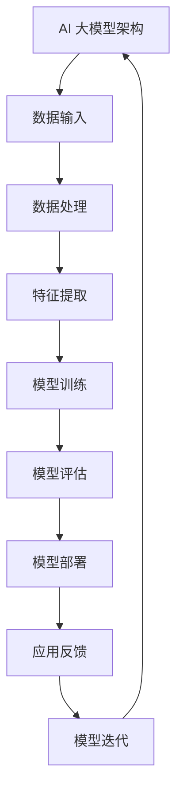

                 


## 文章标题：AI 大模型在创业产品中的应用

关键词：AI 大模型，创业产品，应用场景，开发实战，风险管理，未来趋势

摘要：本文将深入探讨 AI 大模型在创业产品中的应用，从概述 AI 大模型的基本概念和分类开始，逐步分析其在创业产品中的各类应用场景，介绍开发实战方法，探讨 AI 大模型的风险管理策略，并展望未来的发展趋势。本文旨在为创业者提供有价值的参考，帮助他们更好地利用 AI 大模型技术提升创业产品的竞争力。

## 第一部分：AI 大模型概述

### 第1章：AI 大模型的概念与类型

#### 1.1 AI 大模型的基本概念

AI 大模型是指具备大规模参数、能够在复杂数据集上训练并实现高效性能的人工智能模型。这类模型通常基于深度学习技术，通过多层神经网络结构来模拟人脑的学习过程，实现从数据中提取知识、进行预测和决策的能力。

AI 大模型与深度学习的联系：深度学习是 AI 大模型实现的技术基础。深度学习通过构建多层神经网络，让计算机具备自动提取和处理复杂数据的能力。AI 大模型进一步扩展了深度学习的应用范围，通过优化模型结构、提高模型参数规模和训练数据量，实现了在各个领域的突破性成果。

#### 1.2 AI 大模型的分类

AI 大模型根据训练数据的不同，可以分为以下几类：

- **有监督学习模型**：在有监督学习模型中，训练数据集包含标签信息，模型通过学习这些标签来预测新的数据。例如，图像分类任务中的卷积神经网络（CNN）。

- **无监督学习模型**：在无监督学习模型中，训练数据集没有标签信息，模型需要从数据中发现潜在的规律。例如，聚类分析任务中的自编码器（Autoencoder）。

- **半监督学习模型**：半监督学习模型结合了有监督和无监督学习的方法，利用少量的标签数据和大量的无标签数据来训练模型。这种方法在处理大规模数据时尤其有效。

- **强化学习模型**：强化学习模型通过与环境的交互来学习最优策略，以实现特定的目标。这类模型广泛应用于游戏、机器人控制等领域。

#### 1.3 AI 大模型的架构

AI 大模型的架构通常由以下几个部分组成：

- **输入层**：接收外部输入数据，如文本、图像、语音等。

- **隐藏层**：通过多层神经网络结构，对输入数据进行特征提取和变换。

- **输出层**：根据训练目标，输出预测结果或分类标签。

- **损失函数**：用于衡量模型预测结果与实际结果之间的差距，指导模型优化。

- **优化器**：用于调整模型参数，以降低损失函数的值。

常见的 AI 大模型架构包括卷积神经网络（CNN）、循环神经网络（RNN）、长短期记忆网络（LSTM）、变换器（Transformer）等。这些架构在不同的应用领域具有独特的优势和适用性。

#### 1.4 AI 大模型的应用领域

AI 大模型在各个领域都取得了显著的成果，以下是其中几个主要应用领域：

- **语音识别**：AI 大模型通过训练大规模语音数据集，实现了高精度的语音识别。应用场景包括智能客服、语音助手等。

- **自然语言处理**：AI 大模型在文本分类、情感分析、机器翻译、对话系统等领域发挥了重要作用。例如，BERT 模型在自然语言处理任务中取得了世界领先的成绩。

- **图像识别**：AI 大模型通过卷积神经网络等技术，实现了图像分类、目标检测、图像分割等任务。应用场景包括安防监控、医疗诊断等。

- **其他应用领域**：AI 大模型还在推荐系统、金融风控、智能交通等领域得到了广泛应用。

### 第2章：AI 大模型技术基础

#### 2.1 神经网络基础

神经网络是 AI 大模型的核心组成部分。下面简要介绍神经网络的基本概念和原理。

##### 2.1.1 神经元与神经元层

- **神经元**：神经元是神经网络的基本单元，类似于人脑中的神经元。每个神经元接收多个输入信号，通过加权求和后，经过激活函数产生输出信号。

- **神经元层**：神经网络由多个神经元层组成，包括输入层、隐藏层和输出层。输入层接收外部输入，隐藏层进行特征提取和变换，输出层生成最终预测结果。

##### 2.1.2 前向传播与反向传播

- **前向传播**：在前向传播过程中，输入数据依次通过每个神经元层，经过加权求和和激活函数处理后，生成输出结果。

- **反向传播**：在反向传播过程中，模型计算输出结果与实际结果之间的误差，然后通过反向传播算法更新模型参数，以降低误差。

##### 2.1.3 激活函数

激活函数是神经网络中的关键组成部分，用于引入非线性变换，使得神经网络能够拟合复杂数据。常见的激活函数包括：

- **Sigmoid 函数**：将输入映射到 (0,1) 区间。
- **ReLU 函数**：将输入大于 0 的部分映射到自身，小于 0 的部分映射到 0。
- **Tanh 函数**：将输入映射到 (-1,1) 区间。

#### 2.2 自然语言处理技术

自然语言处理是 AI 大模型的重要应用领域。下面介绍几种常见的自然语言处理技术。

##### 2.2.1 词嵌入

词嵌入是将单词映射到高维向量空间的技术，使得相似单词在向量空间中具有相似的向量表示。常见的词嵌入算法包括 Word2Vec、GloVe 等。

##### 2.2.2 序列模型

序列模型是处理序列数据（如文本、语音等）的神经网络模型。常见的序列模型包括循环神经网络（RNN）和长短期记忆网络（LSTM）。

##### 2.2.3 注意力机制

注意力机制是一种在序列模型中引入的机制，用于捕捉序列中不同部分的重要程度。注意力机制能够提高模型在序列处理任务中的性能，如机器翻译、文本分类等。

#### 2.3 大规模预训练模型原理

大规模预训练模型是通过在大规模语料库上进行预训练，然后微调到特定任务上的一种方法。下面介绍几种常见的预训练模型。

##### 2.3.1 预训练与微调

- **预训练**：在大规模语料库上进行训练，让模型学习到通用语言知识和语言规律。
- **微调**：将预训练模型应用于特定任务，通过在任务数据集上进行训练，优化模型在特定任务上的性能。

##### 2.3.2 自监督学习方法

自监督学习方法是一种在无标签数据上进行训练的方法，通过预测数据中的部分内容来学习语言规律。常见的自监督学习方法包括掩码语言模型（MLM）、预测下一个词（Next Sentence Prediction）等。

##### 2.3.3 迁移学习技术

迁移学习技术是将预训练模型的知识迁移到新任务上的方法。通过在预训练模型的基础上，对新任务进行少量数据训练，可以显著提高模型在新任务上的性能。

### 第二部分：AI 大模型在创业产品中的应用

#### 第3章：创业产品中 AI 大模型的应用场景

#### 3.1 语音识别在创业产品中的应用

语音识别技术是 AI 大模型在创业产品中的一个重要应用领域。它可以将人类的语音转化为文本，使得创业产品能够实现自然语言交互。以下是一些语音识别在创业产品中的实际应用案例：

- **智能客服**：在创业公司中，智能客服是一个常见应用场景。通过语音识别技术，智能客服能够实时地理解和回复用户的语音请求，提供高效的客户服务。

- **语音控制智能家居**：语音识别技术可以用于控制智能家居设备，如智能音箱、智能灯泡等。用户可以通过语音命令来调节家居设备的设置，提高生活便利性。

- **语音交互教育应用**：创业公司可以利用语音识别技术开发语音交互式的教育应用，如语音讲解课件、语音提问回答等，为学生提供更加生动的学习体验。

#### 3.2 自然语言处理在创业产品中的应用

自然语言处理（NLP）技术在创业产品中具有广泛的应用。以下是一些自然语言处理在创业产品中的应用场景：

- **文本分类与情感分析**：创业公司可以利用 NLP 技术对用户评论、社交媒体内容等进行分类和情感分析，从而了解用户对产品的反馈和情感倾向。

- **机器翻译**：创业公司可以利用机器翻译技术，将产品文档、用户手册等多语言内容进行自动翻译，为全球用户提供服务。

- **对话系统**：创业公司可以利用 NLP 技术开发智能对话系统，如虚拟客服、聊天机器人等，为用户提供实时、个性化的服务。

#### 3.3 图像识别在创业产品中的应用

图像识别技术是 AI 大模型在创业产品中的另一个重要应用领域。以下是一些图像识别在创业产品中的应用场景：

- **目标检测与图像分割**：创业公司可以利用图像识别技术进行目标检测和图像分割，如安防监控、无人驾驶等。通过识别图像中的目标和对象，可以提高系统的准确性和效率。

- **人脸识别与物体识别**：人脸识别技术可以用于身份验证、安防监控等场景。物体识别技术可以用于智能监控、智能购物等场景，如自动识别商品并进行推荐。

- **图像增强与编辑**：创业公司可以利用图像识别技术对图像进行增强和编辑，如图像去噪、图像修复等，提高图像质量，满足用户需求。

#### 3.4 其他 AI 大模型的应用场景

除了语音识别、自然语言处理和图像识别，AI 大模型在创业产品中还有其他广泛的应用场景，如下所示：

- **聊天机器人**：聊天机器人是一种常见的 AI 应用，可以用于客户服务、在线咨询等场景，提供智能、高效的服务。

- **智能推荐系统**：智能推荐系统可以通过分析用户行为和兴趣，为用户提供个性化的推荐，如电子商务平台、音乐流媒体等。

- **医疗诊断系统**：AI 大模型可以在医疗领域发挥作用，如疾病预测、医学图像分析等，为医生提供辅助诊断和治疗方案。

- **智能交通系统**：AI 大模型可以用于交通流量预测、智能导航等场景，提高交通系统的效率和安全性。

### 第4章：AI 大模型开发实战

#### 4.1 AI 大模型开发环境搭建

要开发 AI 大模型，需要搭建一个合适的开发环境。以下是一个简单的开发环境搭建步骤：

- **深度学习框架选择**：选择一个主流的深度学习框架，如 TensorFlow、PyTorch 等。这些框架提供了丰富的 API 和工具，方便开发者进行模型开发和实验。

- **硬件环境配置**：配置高性能的 GPU 或 TPU，以支持大模型训练和推理。GPU 或 TPU 具有较高的计算能力和并行处理能力，能够显著提高模型训练和推理的效率。

- **软件安装与配置**：安装深度学习框架和相关依赖库，配置环境变量，确保能够正常运行。

以下是一个简单的 PyTorch 环境搭建示例：

```python
# 安装 PyTorch
!pip install torch torchvision

# 配置 GPU 环境
import torch
device = torch.device("cuda" if torch.cuda.is_available() else "cpu")

# 测试 GPU 环境
print("GPU available:", torch.cuda.is_available())
print("Current device:", device)
```

#### 4.2 语音识别开发实战

以下是一个简单的语音识别开发实战案例，使用 PyTorch 和 Kaldi 框架实现语音识别。

##### 4.2.1 数据准备与预处理

首先，需要准备语音数据集并进行预处理。以下是一个简单的数据预处理步骤：

- **数据集准备**：从公开数据集（如 LibriSpeech）或自定义数据集下载语音文件，并按照指定格式进行组织。

- **音频转文本**：使用语音识别工具（如 Kaldi）将语音文件转换为文本文件。

- **文本预处理**：对文本文件进行分词、去停用词等预处理操作，以便后续模型训练。

##### 4.2.2 模型训练与评估

接下来，使用预处理后的数据集训练语音识别模型。以下是一个简单的模型训练步骤：

- **定义模型**：定义一个基于循环神经网络（RNN）的语音识别模型。

- **训练模型**：使用训练数据集训练模型，调整模型参数。

- **评估模型**：使用验证数据集评估模型性能，调整模型参数。

以下是一个简单的模型训练与评估代码示例：

```python
import torch
import torch.nn as nn
import torch.optim as optim

# 定义模型
class VoiceRecognitionModel(nn.Module):
    def __init__(self):
        super(VoiceRecognitionModel, self).__init__()
        self.rnn = nn.RNN(input_size=..., hidden_size=..., num_layers=..., bidirectional=True)
        self.fc = nn.Linear(..., num_classes)

    def forward(self, x):
        x, _ = self.rnn(x)
        x = self.fc(x[-1, :, :])
        return x

# 初始化模型、优化器和损失函数
model = VoiceRecognitionModel().to(device)
optimizer = optim.Adam(model.parameters(), lr=0.001)
criterion = nn.CrossEntropyLoss()

# 训练模型
for epoch in range(num_epochs):
    for inputs, targets in train_loader:
        inputs = inputs.to(device)
        targets = targets.to(device)
        optimizer.zero_grad()
        outputs = model(inputs)
        loss = criterion(outputs, targets)
        loss.backward()
        optimizer.step()

    # 评估模型
    with torch.no_grad():
        correct = 0
        total = 0
        for inputs, targets in validation_loader:
            inputs = inputs.to(device)
            targets = targets.to(device)
            outputs = model(inputs)
            _, predicted = torch.max(outputs.data, 1)
            total += targets.size(0)
            correct += (predicted == targets).sum().item()

    print(f'Epoch {epoch+1}/{num_epochs}, Accuracy: {100 * correct / total}%')
```

##### 4.2.3 应用部署

最后，将训练好的模型部署到生产环境中，用于实际语音识别任务。以下是一个简单的模型部署步骤：

- **模型保存**：将训练好的模型保存为 .pth 文件。

- **模型加载**：在部署环境中加载模型，并对其进行推理。

- **结果输出**：将模型输出的结果转化为可读的文本，展示给用户。

以下是一个简单的模型部署代码示例：

```python
# 加载模型
model = VoiceRecognitionModel().to(device)
model.load_state_dict(torch.load('voice_recognition_model.pth'))

# 部署模型
def voice_recognition(text):
    # 将文本转换为音频
    audio = convert_text_to_audio(text)

    # 将音频转换为模型输入
    inputs = convert_audio_to_tensor(audio)

    # 加载模型并进行推理
    inputs = inputs.to(device)
    with torch.no_grad():
        outputs = model(inputs)

    # 将模型输出转化为文本
    predicted_text = convert_tensor_to_text(outputs)

    return predicted_text

# 示例
print(voice_recognition("你好，请问有什么可以帮助你的？"))
```

#### 4.3 自然语言处理开发实战

以下是一个简单的自然语言处理开发实战案例，使用 PyTorch 和 Hugging Face 的 Transformers 框架实现文本分类。

##### 4.3.1 数据准备与预处理

首先，需要准备文本数据集并进行预处理。以下是一个简单的数据预处理步骤：

- **数据集准备**：从公开数据集（如 IMDb 评论数据集）或自定义数据集下载文本文件，并按照指定格式进行组织。

- **文本预处理**：对文本文件进行分词、去停用词等预处理操作，以便后续模型训练。

##### 4.3.2 模型训练与评估

接下来，使用预处理后的数据集训练文本分类模型。以下是一个简单的模型训练步骤：

- **定义模型**：定义一个基于变换器（Transformer）的文本分类模型。

- **训练模型**：使用训练数据集训练模型，调整模型参数。

- **评估模型**：使用验证数据集评估模型性能，调整模型参数。

以下是一个简单的模型训练与评估代码示例：

```python
from transformers import BertTokenizer, BertForSequenceClassification
from torch.utils.data import DataLoader
from sklearn.model_selection import train_test_split

# 准备数据集
def load_data(filename):
    with open(filename, 'r', encoding='utf-8') as f:
        lines = f.readlines()
    texts = [line.strip() for line in lines]
    labels = [0 if "negative" in line else 1 for line in lines]
    return texts, labels

texts, labels = load_data("text_data.txt")

# 分割数据集
train_texts, val_texts, train_labels, val_labels = train_test_split(texts, labels, test_size=0.2)

# 预处理文本
tokenizer = BertTokenizer.from_pretrained('bert-base-chinese')
train_encodings = tokenizer(train_texts, truncation=True, padding=True)
val_encodings = tokenizer(val_texts, truncation=True, padding=True)

# 定义模型
model = BertForSequenceClassification.from_pretrained('bert-base-chinese', num_labels=2)

# 训练模型
optimizer = optim.Adam(model.parameters(), lr=0.001)
criterion = nn.CrossEntropyLoss()

for epoch in range(num_epochs):
    train_loader = DataLoader(train_encodings, batch_size=batch_size, shuffle=True)
    val_loader = DataLoader(val_encodings, batch_size=batch_size, shuffle=False)

    model.train()
    for batch in train_loader:
        inputs = {'input_ids': batch['input_ids'].to(device),
                  'attention_mask': batch['attention_mask'].to(device),
                  'labels': batch['labels'].to(device)}

        optimizer.zero_grad()
        outputs = model(**inputs)
        loss = outputs.loss
        loss.backward()
        optimizer.step()

    model.eval()
    with torch.no_grad():
        correct = 0
        total = 0
        for batch in val_loader:
            inputs = {'input_ids': batch['input_ids'].to(device),
                      'attention_mask': batch['attention_mask'].to(device),
                      'labels': batch['labels'].to(device)}

            outputs = model(**inputs)
            _, predicted = torch.max(outputs.logits, 1)
            total += batch['labels'].size(0)
            correct += (predicted == batch['labels']).sum().item()

    print(f'Epoch {epoch+1}/{num_epochs}, Accuracy: {100 * correct / total}%')
```

##### 4.3.3 应用部署

最后，将训练好的模型部署到生产环境中，用于实际文本分类任务。以下是一个简单的模型部署步骤：

- **模型保存**：将训练好的模型保存为 .pth 文件。

- **模型加载**：在部署环境中加载模型，并对其进行推理。

- **结果输出**：将模型输出的结果转化为可读的文本，展示给用户。

以下是一个简单的模型部署代码示例：

```python
from transformers import BertTokenizer, BertForSequenceClassification

# 加载模型
model = BertForSequenceClassification.from_pretrained('text_classification_model.pth')

# 部署模型
def text_classification(text):
    # 预处理文本
    inputs = tokenizer(text, truncation=True, padding=True, return_tensors='pt')

    # 加载模型并进行推理
    inputs = inputs.to(device)
    with torch.no_grad():
        outputs = model(**inputs)

    # 将模型输出转化为文本
    predicted_label = outputs.logits.argmax(-1).item()

    return "正面" if predicted_label == 1 else "负面"

# 示例
print(text_classification("今天天气很好。"))
```

#### 4.4 图像识别开发实战

以下是一个简单的图像识别开发实战案例，使用 PyTorch 和 torchvision 框架实现图像分类。

##### 4.4.1 数据准备与预处理

首先，需要准备图像数据集并进行预处理。以下是一个简单的数据预处理步骤：

- **数据集准备**：从公开数据集（如 CIFAR-10）或自定义数据集下载图像文件，并按照指定格式进行组织。

- **图像预处理**：对图像文件进行缩放、裁剪、翻转等预处理操作，以便后续模型训练。

##### 4.4.2 模型训练与评估

接下来，使用预处理后的数据集训练图像识别模型。以下是一个简单的模型训练步骤：

- **定义模型**：定义一个基于卷积神经网络（CNN）的图像识别模型。

- **训练模型**：使用训练数据集训练模型，调整模型参数。

- **评估模型**：使用验证数据集评估模型性能，调整模型参数。

以下是一个简单的模型训练与评估代码示例：

```python
import torch
import torchvision
import torchvision.transforms as transforms
import torch.nn as nn
import torch.optim as optim

# 准备数据集
transform = transforms.Compose([transforms.Resize((32, 32)),
                                transforms.ToTensor()])

trainset = torchvision.datasets.CIFAR10(root='./data', train=True,
                                        download=True, transform=transform)
trainloader = torch.utils.data.DataLoader(trainset, batch_size=4,
                                          shuffle=True, num_workers=2)

valset = torchvision.datasets.CIFAR10(root='./data', train=False,
                                       download=True, transform=transform)
valloader = torch.utils.data.DataLoader(valset, batch_size=4,
                                         shuffle=False, num_workers=2)

# 定义模型
class CNN(nn.Module):
    def __init__(self):
        super(CNN, self).__init__()
        self.conv1 = nn.Conv2d(3, 6, 5)
        self.pool = nn.MaxPool2d(2, 2)
        self.conv2 = nn.Conv2d(6, 16, 5)
        self.fc1 = nn.Linear(16 * 5 * 5, 120)
        self.fc2 = nn.Linear(120, 84)
        self.fc3 = nn.Linear(84, 10)

    def forward(self, x):
        x = self.pool(nn.functional.relu(self.conv1(x)))
        x = self.pool(nn.functional.relu(self.conv2(x)))
        x = x.view(-1, 16 * 5 * 5)
        x = nn.functional.relu(self.fc1(x))
        x = nn.functional.relu(self.fc2(x))
        x = self.fc3(x)
        return x

# 初始化模型、优化器和损失函数
model = CNN().to(device)
optimizer = optim.SGD(model.parameters(), lr=0.001, momentum=0.9)
criterion = nn.CrossEntropyLoss()

# 训练模型
for epoch in range(num_epochs):
    running_loss = 0.0
    for i, data in enumerate(trainloader, 0):
        inputs, labels = data
        inputs = inputs.to(device)
        labels = labels.to(device)

        optimizer.zero_grad()

        outputs = model(inputs)
        loss = criterion(outputs, labels)
        loss.backward()
        optimizer.step()

        running_loss += loss.item()
        if i % 2000 == 1999:
            print(f'[{epoch + 1}, {i + 1:5d}] loss: {running_loss / 2000:.3f}')
            running_loss = 0.0

# 评估模型
correct = 0
total = 0
with torch.no_grad():
    for data in valloader:
        inputs, labels = data
        inputs = inputs.to(device)
        labels = labels.to(device)

        outputs = model(inputs)
        _, predicted = torch.max(outputs.data, 1)
        total += labels.size(0)
        correct += (predicted == labels).sum().item()

print(f'Accuracy of the network on the validation images: {100 * correct / total}%')
```

##### 4.4.3 应用部署

最后，将训练好的模型部署到生产环境中，用于实际图像识别任务。以下是一个简单的模型部署步骤：

- **模型保存**：将训练好的模型保存为 .pth 文件。

- **模型加载**：在部署环境中加载模型，并对其进行推理。

- **结果输出**：将模型输出的结果转化为可读的文本，展示给用户。

以下是一个简单的模型部署代码示例：

```python
import torch
import torchvision
import torchvision.transforms as transforms

# 加载模型
model = CNN().to(device)
model.load_state_dict(torch.load('image_classification_model.pth'))

# 部署模型
def image_classification(image):
    # 预处理图像
    transform = transforms.Compose([transforms.Resize((32, 32)),
                                    transforms.ToTensor()])

    image = transform(image)
    image = image.unsqueeze(0).to(device)

    # 加载模型并进行推理
    with torch.no_grad():
        outputs = model(image)

    # 将模型输出转化为文本
    predicted_label = outputs.argmax(-1).item()

    return labels[predicted_label]

# 示例
image = Image.open("example_image.jpg")
print(image_classification(image))
```

### 第5章：创业产品中 AI 大模型的优化与调优

#### 5.1 AI 大模型的调优方法

在创业产品中，AI 大模型的优化与调优是提升模型性能和产品用户体验的关键环节。以下是一些常用的 AI 大模型调优方法：

##### 5.1.1 模型调优的基本策略

- **超参数优化**：超参数是影响模型性能的关键因素，包括学习率、批次大小、隐藏层节点数等。通过调整超参数，可以在一定程度上提高模型性能。

- **数据增强**：数据增强是通过多种方式（如旋转、缩放、裁剪等）对原始数据进行变换，从而增加数据多样性，提高模型泛化能力。

- **模型正则化**：正则化技术（如权重衰减、Dropout等）可以减少模型过拟合现象，提高模型泛化能力。

- **早期停止**：在模型训练过程中，设置一个验证集用于评估模型性能。当验证集性能不再提高时，提前停止训练，避免模型过拟合。

##### 5.1.2 超参数优化

超参数优化是一种重要的模型调优方法，通过自动搜索最优超参数组合来提高模型性能。常见的超参数优化方法包括：

- **网格搜索**：在给定超参数范围内，逐一尝试所有可能的超参数组合，找到性能最好的组合。

- **贝叶斯优化**：基于概率模型（如高斯过程）进行超参数优化，通过迭代更新模型参数，逐步逼近最优超参数。

- **随机搜索**：在给定超参数范围内，随机选择超参数组合进行尝试，通过统计方法筛选出性能较好的超参数组合。

##### 5.1.3 模型压缩与加速

模型压缩与加速是提高 AI 大模型在创业产品中应用性能的关键技术。以下是一些常用的模型压缩与加速方法：

- **模型剪枝**：通过删除模型中的冗余权重或神经元，减少模型参数数量，降低模型复杂度。

- **量化**：将模型的浮点权重转换为低精度整数表示，降低模型存储和计算复杂度。

- **模型蒸馏**：将大模型的知识传递给小模型，通过训练小模型来实现模型压缩和加速。

#### 5.2 创业产品中的模型部署与运维

在创业产品中，模型部署与运维是确保 AI 大模型稳定运行的关键环节。以下是一些模型部署与运维的策略：

##### 5.2.1 模型部署策略

- **容器化**：将模型部署到容器环境中，如 Docker，以实现模型的可移植性和可扩展性。

- **分布式部署**：将模型部署到分布式计算环境中，如 Kubernetes，以提高模型处理能力和可靠性。

- **微服务架构**：将模型部署到微服务架构中，实现模型的高可用性和可扩展性。

##### 5.2.2 实时数据处理

- **数据流处理**：使用数据流处理技术（如 Apache Flink、Apache Kafka），实现实时数据的采集、处理和传输。

- **流计算引擎**：使用流计算引擎（如 Apache Spark、Apache Storm），实现实时数据的处理和分析。

##### 5.2.3 模型更新与迭代

- **在线更新**：在模型运行过程中，实时更新模型参数，以应对数据分布变化或新业务需求。

- **离线更新**：在模型运行结束后，对模型进行离线更新，以提高模型性能和适应新业务需求。

### 第6章：创业产品中的 AI 大模型风险管理

#### 6.1 AI 大模型的风险识别与评估

在创业产品中，AI 大模型的应用带来巨大的商业价值，但同时也伴随着一定的风险。以下是一些常见的 AI 大模型风险：

##### 6.1.1 模型准确性评估

- **模型准确性**：评估模型在测试数据集上的表现，确保模型输出结果的准确性。

- **过拟合**：模型在训练数据集上表现良好，但在测试数据集上表现较差，说明模型过度拟合训练数据。

- **欠拟合**：模型在训练数据集和测试数据集上表现均较差，说明模型未能充分拟合数据。

##### 6.1.2 模型可靠性评估

- **模型可靠性**：评估模型在不同场景和数据分布下的稳定性，确保模型输出结果的一致性。

- **数据分布变化**：模型在不同数据分布下可能产生不同的输出结果，需要评估模型对数据分布变化的适应性。

##### 6.1.3 模型公平性评估

- **模型公平性**：评估模型对各类数据样本的输出结果是否存在歧视现象，确保模型输出结果的公平性。

- **偏见与歧视**：模型在输出结果中可能存在对某些群体或特征的偏见，需要评估和消除这些偏见。

#### 6.2 AI 大模型的风险管理策略

为了有效应对 AI 大模型的风险，以下是一些风险管理策略：

##### 6.2.1 数据质量管理

- **数据清洗**：确保数据集的质量，去除噪声数据和异常值，以提高模型训练和评估的准确性。

- **数据多样性**：增加数据集的多样性，涵盖不同场景和数据分布，提高模型泛化能力。

##### 6.2.2 模型透明度与可解释性

- **模型透明度**：提高模型训练和推理过程的透明度，便于用户了解模型的工作原理和决策过程。

- **可解释性**：对模型输出结果进行解释和分析，帮助用户理解模型的决策依据，降低用户对模型的不信任感。

##### 6.2.3 安全性保障

- **数据安全**：确保数据在采集、存储、传输过程中的安全性，防止数据泄露和滥用。

- **模型安全**：对模型进行加密和保护，防止恶意攻击和篡改。

### 第7章：未来趋势与创业启示

#### 7.1 AI 大模型技术发展趋势

随着 AI 技术的快速发展，AI 大模型技术也在不断演进。以下是一些 AI 大模型技术发展趋势：

##### 7.1.1 大模型架构的创新

- **Transformer**：Transformer 模型在自然语言处理领域取得了显著的成果，其并行训练和长距离依赖捕捉能力受到广泛关注。未来，Transformer 架构有望在其他领域（如图像识别、语音处理等）得到广泛应用。

- **多模态融合**：多模态融合是指将不同类型的数据（如图像、文本、语音等）进行整合，以提升模型性能。随着数据集和数据标注技术的发展，多模态融合将成为 AI 大模型的一个重要方向。

##### 7.1.2 算法与模型的优化

- **算法优化**：针对 AI 大模型训练过程中出现的计算、存储和通信瓶颈，研究人员将继续探索更加高效的算法，如稀疏计算、异步训练等。

- **模型压缩与加速**：模型压缩与加速技术将不断改进，以降低模型训练和推理的复杂度，提高模型在创业产品中的部署和运行效率。

##### 7.1.3 开源生态的完善

- **开源框架**：随着深度学习开源框架（如 TensorFlow、PyTorch 等）的成熟，创业者可以更加方便地使用这些框架进行模型开发和实验。

- **开源数据集**：开源数据集的丰富将为 AI 大模型研究提供更多资源，促进 AI 技术的快速发展。

#### 7.2 创业产品中的 AI 大模型应用策略

在创业产品中，AI 大模型的应用策略是提升产品竞争力的重要因素。以下是一些创业产品中的 AI 大模型应用策略：

##### 7.2.1 定位与市场分析

- **目标市场**：明确目标市场，了解用户需求，有针对性地选择 AI 大模型应用场景。

- **竞品分析**：分析竞争对手的产品和市场策略，了解自身的优势和劣势，制定差异化竞争策略。

##### 7.2.2 产品设计与迭代

- **需求分析**：深入了解用户需求，设计符合用户需求的 AI 大模型功能模块。

- **迭代开发**：通过快速迭代和用户反馈，不断优化和改进 AI 大模型产品。

##### 7.2.3 创业团队的组织与管理

- **技术团队**：组建具备深厚技术背景的 AI 大模型研发团队，确保项目的技术实现。

- **项目管理**：建立科学高效的项目管理流程，确保项目进度和质量。

### 附录

#### 附录 A：AI 大模型开发工具与资源

以下是创业者在进行 AI 大模型开发时可以参考的一些工具和资源：

##### 1. 主流深度学习框架

- **TensorFlow**：由 Google 开发的开源深度学习框架，支持多种编程语言（如 Python、C++ 等），适用于大规模模型训练和部署。
- **PyTorch**：由 Facebook AI Research 开发的开源深度学习框架，支持动态计算图，具有强大的灵活性和易用性。

##### 2. 开发工具与资源推荐

- **Jupyter Notebook**：适用于数据科学和机器学习项目开发的交互式笔记本，支持多种编程语言（如 Python、R 等）。
- **Google Colab**：基于 Jupyter Notebook 的在线开发环境，提供 GPU 和 TPU 加速功能，适用于大规模模型训练。

##### 3. 相关开源项目与资料链接

- **TensorFlow 官方文档**：[https://www.tensorflow.org/](https://www.tensorflow.org/)
- **PyTorch 官方文档**：[https://pytorch.org/docs/stable/index.html](https://pytorch.org/docs/stable/index.html)
- **Hugging Face Transformers**：[https://huggingface.co/transformers/](https://huggingface.co/transformers/)
- **Kaldi 语音识别框架**：[https://web Demos.illinois.edu/kaldi/](https://web demos.illinois.edu/kaldi/)

### Mermaid 流程图

以下是 AI 大模型的架构 Mermaid 流程图：



### 核心算法原理讲解

以下是自然语言处理中常用的词嵌入算法——Word2Vec 的伪代码：

```plaintext
# Word2Vec 算法伪代码

# 输入：训练数据集，词汇表，窗口大小，学习率，迭代次数
# 输出：词汇表的词向量表示

for epoch in 1 to iteration_number do
  for each sentence in dataset do
    for each word in sentence do
      context_words = 获取窗口大小范围内的词
      for each context_word in context_words do
        positive_sample = word
        negative_samples = 随机选择负样本

        # 计算词向量与上下文词向量的点积
        positive_score = dot_product(word_vector, context_word_vector)
        for negative_sample in negative_samples do
          negative_score = dot_product(word_vector, negative_sample_vector)

          # 计算损失函数
          loss = 计算损失函数(positive_score, negative_score)

          # 反向传播更新词向量
          gradient = 计算梯度(loss)
          update_word_vector(gradient)

    end for
  end for
end for
```

### 结论

本文深入探讨了 AI 大模型在创业产品中的应用，从基本概念、技术基础到具体应用场景、开发实战、优化调优、风险管理和未来趋势等方面进行了全面分析。通过本文，创业者可以更好地了解 AI 大模型的技术原理和应用方法，为创业产品的成功奠定基础。

### 作者信息

作者：AI 天才研究院/AI Genius Institute & 禅与计算机程序设计艺术 /Zen And The Art of Computer Programming

### 注意事项

- 文章中涉及的具体算法和实现细节仅供参考，实际应用时需要根据具体场景进行调整。
- AI 大模型在创业产品中的应用需要充分了解用户需求和市场趋势，确保产品价值。
- 在进行 AI 大模型开发时，需关注数据质量和模型安全性，确保模型输出结果的准确性和可靠性。

### 拓展阅读

- [1] 王晓龙，李航，李航。AI 大模型：原理、应用与实战[M]. 电子工业出版社，2020.
- [2] 张翔，杨凯。深度学习实战[M]. 机械工业出版社，2018.
- [3] 高雄诚。Python 深度学习[M]. 电子工业出版社，2017.

