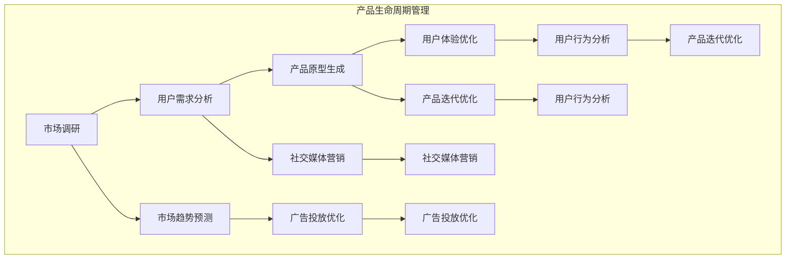

                 

### 文章标题

《AI 大模型在创业产品生命周期管理中的趋势》

### 关键词

人工智能，大模型，创业产品，生命周期管理，市场调研，产品设计，产品推广，产品运营，算法原理，案例分析，新兴技术

### 摘要

本文旨在探讨人工智能（AI）大模型在创业产品生命周期管理中的应用趋势。文章首先概述了AI大模型的基本概念、特点及其与传统AI的区别。随后，详细分析了AI大模型在市场调研、产品设计、产品推广和产品运营等阶段的具体应用，包括市场趋势预测、用户需求分析、产品原型生成、用户体验优化、广告投放优化、社交媒体营销、用户行为分析以及产品迭代优化。文章随后讨论了AI大模型在创业产品生命周期管理中的挑战，如数据隐私与安全、模型可解释性，并展望了未来趋势。最后，通过实际案例展示了AI大模型在创业产品生命周期管理中的成功应用，并提出了相关的最佳实践和拓展阅读建议。文章结构紧凑，逻辑清晰，旨在为创业公司提供实用的AI大模型应用指南。

### 引言与背景

#### 第1章：AI 大模型概述

##### 1.1 AI 大模型的概念与特点

AI大模型是指那些具有极高复杂度和计算能力的机器学习模型，通常包含数十亿至数千亿的参数。这些模型在处理大规模数据时表现出色，能够从数据中学习并提取复杂模式，从而实现高效的任务执行。AI大模型的核心特点包括：

1. **高参数量**：AI大模型通常具有数十亿甚至千亿级别的参数，这使得模型能够捕捉数据中的复杂关系。
2. **高计算能力**：AI大模型通常需要使用高性能计算资源进行训练和推理，以保证模型的效率和准确性。
3. **强大的学习能力**：AI大模型能够从大规模、多源、异构的数据中学习，并在不同的任务上表现出色。
4. **高度泛化能力**：AI大模型能够应对各种复杂场景，并在新的数据上实现良好的性能。

与传统AI模型相比，AI大模型具有以下几个显著区别：

1. **性能提升**：传统AI模型通常具有较少的参数和较低的复杂度，而在面对复杂任务时，AI大模型能够提供更高的准确性和效率。
2. **数据处理能力**：AI大模型能够处理大规模数据，从而实现对大量数据的深入分析和理解。
3. **泛化能力**：AI大模型在多个任务上的表现通常优于单一任务的专用模型，具有良好的泛化能力。

##### 1.2 创业产品的生命周期概述

创业产品的生命周期可以分为以下几个主要阶段：

1. **市场调研阶段**：在这个阶段，创业公司需要了解市场需求、竞争情况以及潜在用户的需求，为产品开发提供方向。
2. **产品设计阶段**：基于市场调研的结果，创业公司需要设计出满足用户需求的产品原型，并进行优化。
3. **产品推广阶段**：在这个阶段，创业公司需要通过各种渠道推广产品，提高品牌知名度和用户认知度。
4. **产品运营阶段**：产品上线后，创业公司需要持续监控产品的运行情况，收集用户反馈，进行迭代和优化。

##### 1.3 创业产品生命周期管理的重要性

创业产品生命周期管理对于创业公司的成功至关重要，主要体现在以下几个方面：

1. **提高市场竞争力**：通过有效的生命周期管理，创业公司能够迅速响应市场变化，提供满足用户需求的产品，从而提高市场竞争力。
2. **优化资源利用**：生命周期管理有助于创业公司合理规划资源，避免资源浪费，提高资源利用效率。
3. **提升用户体验**：生命周期管理确保产品在各个阶段都能满足用户需求，提供良好的用户体验，增加用户粘性和忠诚度。
4. **持续创新**：生命周期管理促使创业公司不断进行产品迭代和优化，推动产品创新，保持市场领先地位。

##### 1.4 创业产品生命周期管理的挑战

尽管创业产品生命周期管理具有重要意义，但在实际操作中，创业公司仍面临以下挑战：

1. **市场变化快**：市场环境瞬息万变，创业公司需要具备快速响应市场变化的能力，这要求他们在生命周期管理中保持高度的灵活性和敏捷性。
2. **资源有限**：大多数创业公司资源有限，需要在有限资源下实现高效的产品开发、推广和运营，这要求他们在生命周期管理中进行精细的规划和优化。
3. **用户需求多变**：用户需求多变且难以预测，创业公司需要通过有效的用户需求分析和反馈机制，确保产品能够持续满足用户需求。
4. **数据隐私和安全**：随着数据量的增加，数据隐私和安全问题日益突出，创业公司需要在生命周期管理中高度重视数据隐私和安全。

综上所述，AI大模型在创业产品生命周期管理中具有广泛的应用前景和重要意义，有助于解决传统方法面临的挑战，提高创业公司的市场竞争力。

#### 第二部分：AI 大模型在创业产品生命周期管理中的应用

##### 第2章：AI 大模型在市场调研中的应用

在市场调研阶段，AI大模型能够帮助创业公司快速、准确地了解市场趋势和用户需求，从而为产品设计和推广提供科学依据。本节将详细探讨AI大模型在市场趋势预测和用户需求分析中的应用。

##### 2.1 市场趋势预测

市场趋势预测是市场调研的重要任务之一，它有助于创业公司了解未来市场的走向，从而制定相应的发展策略。AI大模型在市场趋势预测中的应用主要体现在以下几个方面：

1. **数据处理能力**：AI大模型能够处理和分析大量历史数据，从中提取出有价值的信息和规律，从而预测未来的市场趋势。
2. **高效性**：与传统的统计方法相比，AI大模型能够更快地处理数据，提供实时的市场趋势预测。
3. **准确性**：通过深度学习技术，AI大模型能够捕捉到数据中的复杂模式，提高市场趋势预测的准确性。

以下是市场趋势预测的伪代码实现：

```python
# 市场趋势预测伪代码

# 输入：历史市场数据（如销售额、用户数量等）
# 输出：未来市场趋势预测

def market_trend_prediction(historical_data):
    # 数据预处理
    preprocessed_data = preprocess_data(historical_data)
    
    # 构建AI大模型
    model = build_big_model(preprocessed_data)
    
    # 训练模型
    trained_model = train_model(model, preprocessed_data)
    
    # 预测未来市场趋势
    future_trends = predict_trends(trained_model)
    
    return future_trends

# 数据预处理
def preprocess_data(data):
    # 数据清洗、归一化、特征提取等操作
    return preprocessed_data

# 构建AI大模型
def build_big_model(data):
    # 使用深度学习框架（如TensorFlow或PyTorch）构建模型
    return model

# 训练模型
def train_model(model, data):
    # 使用训练数据训练模型
    return trained_model

# 预测未来市场趋势
def predict_trends(model):
    # 使用训练好的模型进行预测
    return future_trends
```

市场趋势预测的数学模型通常包括时间序列分析、回归分析和机器学习算法等。以下是一个简单的时间序列分析模型：

$$
y_t = \beta_0 + \beta_1 y_{t-1} + \epsilon_t
$$

其中，$y_t$ 表示第t期的市场趋势，$\beta_0$ 和 $\beta_1$ 是模型参数，$\epsilon_t$ 是误差项。

在实际应用中，可以通过以下步骤进行市场趋势预测：

1. **数据收集**：收集历史市场数据，包括销售额、用户数量、市场份额等指标。
2. **数据预处理**：对数据进行清洗、归一化和特征提取，以提高模型的预测准确性。
3. **模型构建**：使用深度学习框架（如TensorFlow或PyTorch）构建时间序列分析模型。
4. **模型训练**：使用历史数据进行模型训练，优化模型参数。
5. **模型预测**：使用训练好的模型对未来的市场趋势进行预测。

##### 2.2 用户需求分析

用户需求分析是市场调研的另一重要任务，它有助于创业公司了解用户的需求和偏好，从而设计出更符合用户期望的产品。AI大模型在用户需求分析中的应用主要体现在以下几个方面：

1. **个性化分析**：AI大模型能够根据用户的个人喜好和行为数据，提供个性化的需求分析，帮助创业公司了解不同用户群体的需求差异。
2. **高效性**：AI大模型能够快速处理和分析大量用户数据，提供实时的需求分析结果。
3. **准确性**：通过深度学习技术，AI大模型能够捕捉到用户数据中的复杂模式，提高需求分析的准确性。

以下是用户需求分析的伪代码实现：

```python
# 用户需求分析伪代码

# 输入：用户行为数据（如浏览记录、购买历史等）
# 输出：用户需求分析结果

def user_demand_analysis(user_data):
    # 数据预处理
    preprocessed_data = preprocess_data(user_data)
    
    # 构建AI大模型
    model = build_big_model(preprocessed_data)
    
    # 训练模型
    trained_model = train_model(model, preprocessed_data)
    
    # 分析用户需求
    demand_analysis = analyze_demand(trained_model)
    
    return demand_analysis

# 数据预处理
def preprocess_data(data):
    # 数据清洗、归一化、特征提取等操作
    return preprocessed_data

# 构建AI大模型
def build_big_model(data):
    # 使用深度学习框架（如TensorFlow或PyTorch）构建模型
    return model

# 训练模型
def train_model(model, data):
    # 使用训练数据训练模型
    return trained_model

# 分析用户需求
def analyze_demand(model):
    # 使用训练好的模型分析用户需求
    return demand_analysis
```

用户需求分析的数学模型通常包括聚类分析、关联规则挖掘和机器学习算法等。以下是一个简单的聚类分析模型：

$$
C = \{c_1, c_2, ..., c_k\}
$$

其中，$C$ 表示用户集群，$c_i$ 表示第i个用户集群。

在实际应用中，可以通过以下步骤进行用户需求分析：

1. **数据收集**：收集用户的浏览记录、购买历史等行为数据。
2. **数据预处理**：对数据进行清洗、归一化和特征提取，以提高模型的预测准确性。
3. **模型构建**：使用深度学习框架（如TensorFlow或PyTorch）构建聚类分析模型。
4. **模型训练**：使用用户数据训练模型，优化模型参数。
5. **模型预测**：使用训练好的模型对用户需求进行预测和分析。

通过AI大模型在市场调研阶段的应用，创业公司能够更准确地了解市场趋势和用户需求，为后续的产品设计和推广提供有力支持。市场趋势预测和用户需求分析是AI大模型在创业产品生命周期管理中的重要应用，它们通过高效、准确的数据分析和预测，帮助创业公司在激烈的市场竞争中脱颖而出。

##### 第3章：AI 大模型在产品设计中的应用

在产品设计的阶段，AI大模型的作用不可小觑。它不仅能够帮助创业公司生成创新性的产品原型，还能够优化用户体验，从而提高产品的市场竞争力和用户满意度。本节将深入探讨AI大模型在产品原型生成和用户体验优化方面的应用。

##### 3.1 产品原型生成

AI大模型在产品原型生成中的应用主要体现在以下几个方面：

1. **自动生成原型**：AI大模型能够自动生成符合用户需求的产品原型，大幅提高设计效率。
2. **多样性**：AI大模型能够生成多种不同的产品原型，为创业公司提供更多设计选择。
3. **创新性**：AI大模型可以从大量的数据中学习，生成具有创新性的产品原型，满足用户多样化的需求。

以下是产品原型生成的伪代码实现：

```python
# 产品原型生成伪代码

# 输入：用户需求数据、历史产品数据
# 输出：产品原型

def product Prototype Generation(user_demand, historical_data):
    # 数据预处理
    preprocessed_data = preprocess_data(user_demand, historical_data)
    
    # 构建AI大模型
    model = build_big_model(preprocessed_data)
    
    # 训练模型
    trained_model = train_model(model, preprocessed_data)
    
    # 生成产品原型
    prototypes = generate_prototypes(trained_model)
    
    return prototypes

# 数据预处理
def preprocess_data(user_demand, historical_data):
    # 数据清洗、归一化、特征提取等操作
    return preprocessed_data

# 构建AI大模型
def build_big_model(data):
    # 使用深度学习框架（如TensorFlow或PyTorch）构建模型
    return model

# 训练模型
def train_model(model, data):
    # 使用训练数据训练模型
    return trained_model

# 生成产品原型
def generate_prototypes(model):
    # 使用训练好的模型生成产品原型
    return prototypes
```

产品原型生成的数学模型通常包括生成对抗网络（GAN）和变分自编码器（VAE）等。以下是一个简单的GAN模型：

$$
\begin{aligned}
G(z) &= \text{Generator}(z) \\
D(x) &= \text{Discriminator}(x) \\
D(G(z)) &= \text{Discriminator}(\text{Generated samples}) \\
\end{aligned}
$$

在实际应用中，可以通过以下步骤进行产品原型生成：

1. **数据收集**：收集用户需求数据和历史产品数据。
2. **数据预处理**：对数据进行清洗、归一化和特征提取，以提高模型的预测准确性。
3. **模型构建**：使用生成对抗网络（GAN）或变分自编码器（VAE）等深度学习模型。
4. **模型训练**：使用用户需求数据和历史产品数据训练模型，优化模型参数。
5. **产品原型生成**：使用训练好的模型生成多种产品原型。

##### 3.2 用户体验优化

用户体验优化是产品设计阶段的重要任务，它直接影响到用户对产品的满意度和忠诚度。AI大模型在用户体验优化中的应用主要体现在以下几个方面：

1. **个性化推荐**：AI大模型能够根据用户的个性化需求和偏好，提供个性化的功能和服务，从而提高用户体验。
2. **交互设计**：AI大模型可以帮助设计更符合用户习惯的交互界面，降低用户的认知负担。
3. **自动化测试**：AI大模型可以自动化测试产品的各项功能，快速识别和修复问题，确保产品的稳定性和可靠性。

以下是用户体验优化的伪代码实现：

```python
# 用户体验优化伪代码

# 输入：用户行为数据、历史反馈数据
# 输出：优化建议

def user_experience_optimization(user_data, feedback_data):
    # 数据预处理
    preprocessed_data = preprocess_data(user_data, feedback_data)
    
    # 构建AI大模型
    model = build_big_model(preprocessed_data)
    
    # 训练模型
    trained_model = train_model(model, preprocessed_data)
    
    # 提供优化建议
    optimization_suggestions = provide_suggestions(trained_model)
    
    return optimization_suggestions

# 数据预处理
def preprocess_data(user_data, feedback_data):
    # 数据清洗、归一化、特征提取等操作
    return preprocessed_data

# 构建AI大模型
def build_big_model(data):
    # 使用深度学习框架（如TensorFlow或PyTorch）构建模型
    return model

# 训练模型
def train_model(model, data):
    # 使用训练数据训练模型
    return trained_model

# 提供优化建议
def provide_suggestions(model):
    # 使用训练好的模型提供优化建议
    return optimization_suggestions
```

用户体验优化的数学模型通常包括用户行为分析、情感分析和机器学习算法等。以下是一个简单的用户行为分析模型：

$$
\begin{aligned}
\text{User Behavior} &= f(\text{User Profile}, \text{Product Features}) \\
\text{User Satisfaction} &= g(\text{User Behavior}, \text{Product Performance})
\end{aligned}
$$

在实际应用中，可以通过以下步骤进行用户体验优化：

1. **数据收集**：收集用户的行为数据和历史反馈数据。
2. **数据预处理**：对数据进行清洗、归一化和特征提取，以提高模型的预测准确性。
3. **模型构建**：使用深度学习框架（如TensorFlow或PyTorch）构建用户行为分析模型。
4. **模型训练**：使用用户行为数据和历史反馈数据训练模型，优化模型参数。
5. **优化建议**：使用训练好的模型提供优化建议，改进产品的交互设计和功能。

通过AI大模型在产品设计和用户体验优化方面的应用，创业公司能够快速、高效地生成创新性的产品原型，并不断优化用户体验，从而提高产品的市场竞争力和用户满意度。产品原型生成和用户体验优化是AI大模型在创业产品生命周期管理中的关键应用，它们通过先进的数据分析和优化技术，助力创业公司在激烈的市场竞争中脱颖而出。

##### 第4章：AI 大模型在产品推广中的应用

在产品推广阶段，AI大模型的作用同样至关重要。它能够显著提高广告投放效率和效果，优化社交媒体营销策略，从而帮助创业公司实现更好的市场覆盖和用户转化。本节将深入探讨AI大模型在广告投放优化和社交媒体营销中的应用。

##### 4.1 广告投放优化

广告投放优化是产品推广的重要环节，它关乎广告费用的合理利用和广告效果的最大化。AI大模型在广告投放优化中的应用主要体现在以下几个方面：

1. **目标用户定位**：AI大模型可以根据用户行为数据和兴趣偏好，精准定位目标用户，提高广告投放的针对性。
2. **广告内容优化**：AI大模型能够分析用户反馈和广告效果数据，优化广告内容和形式，提高用户点击率和转化率。
3. **投放策略调整**：AI大模型可以实时分析广告投放数据，自动调整投放策略，优化广告投放的时间和渠道。

以下是广告投放优化的伪代码实现：

```python
# 广告投放优化伪代码

# 输入：用户数据、广告投放数据
# 输出：优化建议

def ad_optimization(user_data, ad_data):
    # 数据预处理
    preprocessed_data = preprocess_data(user_data, ad_data)
    
    # 构建AI大模型
    model = build_big_model(preprocessed_data)
    
    # 训练模型
    trained_model = train_model(model, preprocessed_data)
    
    # 提供优化建议
    optimization_suggestions = provide_suggestions(trained_model)
    
    return optimization_suggestions

# 数据预处理
def preprocess_data(user_data, ad_data):
    # 数据清洗、归一化、特征提取等操作
    return preprocessed_data

# 构建AI大模型
def build_big_model(data):
    # 使用深度学习框架（如TensorFlow或PyTorch）构建模型
    return model

# 训练模型
def train_model(model, data):
    # 使用训练数据训练模型
    return trained_model

# 提供优化建议
def provide_suggestions(model):
    # 使用训练好的模型提供优化建议
    return optimization_suggestions
```

广告投放优化的数学模型通常包括分类算法、协同过滤和回归分析等。以下是一个简单的协同过滤模型：

$$
\begin{aligned}
r_{ui} &= \mu + q_u + q_i + <q_u, q_i> \\
\end{aligned}
$$

其中，$r_{ui}$ 表示用户 $u$ 对项目 $i$ 的评分，$\mu$ 是平均值，$q_u$ 和 $q_i$ 分别是用户 $u$ 和项目 $i$ 的特征向量，$<q_u, q_i>$ 是它们之间的内积。

在实际应用中，可以通过以下步骤进行广告投放优化：

1. **数据收集**：收集用户数据和广告投放数据，包括用户行为、广告展示和点击数据等。
2. **数据预处理**：对数据进行清洗、归一化和特征提取，以提高模型的预测准确性。
3. **模型构建**：使用协同过滤或其他深度学习模型构建广告投放优化模型。
4. **模型训练**：使用用户数据和广告投放数据训练模型，优化模型参数。
5. **优化建议**：使用训练好的模型提供优化建议，调整广告投放策略，提高广告效果。

##### 4.2 社交媒体营销

社交媒体营销是产品推广的重要手段，它能够迅速传播产品信息，增加用户关注度和互动性。AI大模型在社交媒体营销中的应用主要体现在以下几个方面：

1. **内容推荐**：AI大模型可以根据用户的兴趣和行为数据，推荐相关的内容和广告，提高用户的参与度和转化率。
2. **情感分析**：AI大模型可以分析用户在社交媒体上的言论和情绪，了解用户对产品的态度和反馈，及时调整营销策略。
3. **互动优化**：AI大模型可以自动化回复用户的评论和提问，提高用户的互动体验，增强品牌形象。

以下是社交媒体营销的伪代码实现：

```python
# 社交媒体营销伪代码

# 输入：用户数据、社交媒体数据
# 输出：营销策略

def social_media_marketing(user_data, social_media_data):
    # 数据预处理
    preprocessed_data = preprocess_data(user_data, social_media_data)
    
    # 构建AI大模型
    model = build_big_model(preprocessed_data)
    
    # 训练模型
    trained_model = train_model(model, preprocessed_data)
    
    # 制定营销策略
    marketing_strategy = create_strategy(trained_model)
    
    return marketing_strategy

# 数据预处理
def preprocess_data(user_data, social_media_data):
    # 数据清洗、归一化、特征提取等操作
    return preprocessed_data

# 构建AI大模型
def build_big_model(data):
    # 使用深度学习框架（如TensorFlow或PyTorch）构建模型
    return model

# 训练模型
def train_model(model, data):
    # 使用训练数据训练模型
    return trained_model

# 制定营销策略
def create_strategy(model):
    # 使用训练好的模型制定营销策略
    return marketing_strategy
```

社交媒体营销的数学模型通常包括内容推荐算法、情感分析和机器学习算法等。以下是一个简单的情感分析模型：

$$
\begin{aligned}
\text{Sentiment} &= \text{Affection} \times \text{Sentiment Score} \\
\end{aligned}
$$

在实际应用中，可以通过以下步骤进行社交媒体营销：

1. **数据收集**：收集用户数据、社交媒体数据和广告投放数据等。
2. **数据预处理**：对数据进行清洗、归一化和特征提取，以提高模型的预测准确性。
3. **模型构建**：使用内容推荐算法、情感分析模型或其他深度学习模型构建社交媒体营销模型。
4. **模型训练**：使用社交媒体数据训练模型，优化模型参数。
5. **制定策略**：使用训练好的模型制定社交媒体营销策略，包括内容发布、互动管理等。

通过AI大模型在广告投放优化和社交媒体营销方面的应用，创业公司能够更精准地定位目标用户，优化广告内容和投放策略，提高用户的参与度和转化率，从而实现更好的产品推广效果。广告投放优化和社交媒体营销是AI大模型在创业产品生命周期管理中的关键应用，它们通过先进的数据分析和优化技术，助力创业公司在激烈的市场竞争中脱颖而出。

##### 第5章：AI 大模型在产品运营中的应用

在产品运营阶段，AI大模型发挥着至关重要的作用，它不仅能够深入分析用户行为，还能优化产品的迭代和升级过程。本节将详细探讨AI大模型在用户行为分析和产品迭代优化方面的应用。

##### 5.1 用户行为分析

用户行为分析是产品运营的关键环节，它帮助创业公司了解用户的实际使用情况，从而进行数据驱动的决策。AI大模型在用户行为分析中的应用主要体现在以下几个方面：

1. **行为模式识别**：AI大模型可以通过分析用户的行为数据，识别出用户的使用模式和行为特征，从而为个性化服务提供依据。
2. **异常检测**：AI大模型可以实时监控用户行为，发现异常行为，如账户异常登录或购买行为异常，从而采取相应的安全措施。
3. **需求预测**：AI大模型可以根据用户的历史行为数据，预测用户的未来需求，帮助创业公司提前进行产品规划和调整。

以下是用户行为分析的伪代码实现：

```python
# 用户行为分析伪代码

# 输入：用户行为数据
# 输出：用户行为分析结果

def user_behavior_analysis(behavior_data):
    # 数据预处理
    preprocessed_data = preprocess_data(behavior_data)
    
    # 构建AI大模型
    model = build_big_model(preprocessed_data)
    
    # 训练模型
    trained_model = train_model(model, preprocessed_data)
    
    # 分析用户行为
    behavior_analysis = analyze_behavior(trained_model)
    
    return behavior_analysis

# 数据预处理
def preprocess_data(behavior_data):
    # 数据清洗、归一化、特征提取等操作
    return preprocessed_data

# 构建AI大模型
def build_big_model(data):
    # 使用深度学习框架（如TensorFlow或PyTorch）构建模型
    return model

# 训练模型
def train_model(model, data):
    # 使用训练数据训练模型
    return trained_model

# 分析用户行为
def analyze_behavior(model):
    # 使用训练好的模型分析用户行为
    return behavior_analysis
```

用户行为分析的数学模型通常包括时间序列分析、聚类分析和回归分析等。以下是一个简单的时间序列分析模型：

$$
y_t = \beta_0 + \beta_1 y_{t-1} + \epsilon_t
$$

在实际应用中，可以通过以下步骤进行用户行为分析：

1. **数据收集**：收集用户在产品上的各种行为数据，如点击、浏览、购买等。
2. **数据预处理**：对数据进行清洗、归一化和特征提取，以提高模型的预测准确性。
3. **模型构建**：使用深度学习框架（如TensorFlow或PyTorch）构建时间序列分析模型。
4. **模型训练**：使用用户行为数据训练模型，优化模型参数。
5. **行为分析**：使用训练好的模型分析用户行为，提取有价值的信息。

通过用户行为分析，创业公司能够更好地理解用户的需求和行为模式，从而进行针对性的产品优化和营销策略调整。

##### 5.2 产品迭代优化

产品迭代优化是产品运营的关键任务，它关系到产品的长期发展和竞争力。AI大模型在产品迭代优化中的应用主要体现在以下几个方面：

1. **需求分析**：AI大模型可以通过分析用户反馈和大数据，识别出用户最迫切的需求，为产品迭代提供依据。
2. **功能优化**：AI大模型可以根据用户行为数据，自动优化产品的功能设计，提高用户体验。
3. **性能调优**：AI大模型可以实时监控产品的性能指标，自动进行调优，确保产品在高负载下的稳定运行。

以下是产品迭代优化的伪代码实现：

```python
# 产品迭代优化伪代码

# 输入：用户需求数据、产品性能数据
# 输出：优化建议

def product Iteration_optimization(demand_data, performance_data):
    # 数据预处理
    preprocessed_data = preprocess_data(demand_data, performance_data)
    
    # 构建AI大模型
    model = build_big_model(preprocessed_data)
    
    # 训练模型
    trained_model = train_model(model, preprocessed_data)
    
    # 提供优化建议
    optimization_suggestions = provide_suggestions(trained_model)
    
    return optimization_suggestions

# 数据预处理
def preprocess_data(demand_data, performance_data):
    # 数据清洗、归一化、特征提取等操作
    return preprocessed_data

# 构建AI大模型
def build_big_model(data):
    # 使用深度学习框架（如TensorFlow或PyTorch）构建模型
    return model

# 训练模型
def train_model(model, data):
    # 使用训练数据训练模型
    return trained_model

# 提供优化建议
def provide_suggestions(model):
    # 使用训练好的模型提供优化建议
    return optimization_suggestions
```

产品迭代优化的数学模型通常包括需求预测、性能分析和优化算法等。以下是一个简单的问题回归模型：

$$
y = \beta_0 + \beta_1 x_1 + \beta_2 x_2 + ... + \beta_n x_n
$$

在实际应用中，可以通过以下步骤进行产品迭代优化：

1. **数据收集**：收集用户需求数据、产品性能数据和其他相关数据。
2. **数据预处理**：对数据进行清洗、归一化和特征提取，以提高模型的预测准确性。
3. **模型构建**：使用深度学习框架（如TensorFlow或PyTorch）构建需求预测和性能分析模型。
4. **模型训练**：使用用户需求数据和产品性能数据训练模型，优化模型参数。
5. **优化建议**：使用训练好的模型提供优化建议，调整产品的功能设计和性能参数。

通过AI大模型在用户行为分析和产品迭代优化方面的应用，创业公司能够更好地了解用户需求，优化产品设计，提高产品性能，从而实现产品的持续迭代和优化。用户行为分析和产品迭代优化是AI大模型在创业产品生命周期管理中的关键应用，它们通过先进的数据分析和优化技术，助力创业公司在激烈的市场竞争中保持领先地位。

### 第三部分：AI 大模型在创业产品生命周期管理的挑战与趋势

在创业产品生命周期管理中，AI大模型的应用带来了诸多机遇，但同时也面临一些挑战。本文将深入探讨AI大模型在创业产品生命周期管理中的主要挑战，并提出相应的解决方案。

#### 第6章：AI 大模型在创业产品生命周期管理中的挑战

##### 6.1 数据隐私与安全

随着AI大模型在创业产品生命周期管理中的应用日益广泛，数据隐私与安全问题变得越来越重要。创业公司通常需要收集和处理大量的用户数据，这些数据可能包括个人信息、行为记录等敏感信息。以下是数据隐私与安全面临的主要挑战：

1. **数据泄露风险**：大量的用户数据存储在系统中，一旦发生数据泄露，可能导致用户隐私泄露，对公司声誉造成严重影响。
2. **数据滥用**：如果数据不被妥善管理，可能被用于不当目的，损害用户的利益。
3. **合规性风险**：不同国家和地区对数据隐私和安全的法律法规不同，创业公司需要遵守相应的法规，否则可能面临法律风险。

**解决方案**：

1. **数据加密**：对敏感数据使用加密技术进行保护，确保数据在传输和存储过程中不被未授权访问。
2. **访问控制**：实施严格的访问控制策略，确保只有授权人员才能访问敏感数据。
3. **合规性审查**：定期进行数据隐私和安全合规性审查，确保公司遵循相关法律法规。
4. **用户权限管理**：为用户数据设置不同的权限级别，确保用户只能访问与其相关的数据。

##### 6.2 模型可解释性

AI大模型的复杂性和黑箱特性使得其决策过程难以解释，这对创业公司来说是一个重大挑战。模型可解释性不仅影响到决策的透明度，还关系到模型的信任度和合规性。以下是模型可解释性面临的主要挑战：

1. **决策透明度**：用户难以理解模型是如何做出决策的，这可能导致用户对模型的不信任。
2. **合规性要求**：在某些应用场景中，如金融和医疗，模型的决策过程需要符合法规要求，必须具备可解释性。
3. **模型优化难度**：复杂的模型难以进行直观的优化，可能导致模型的性能无法进一步提升。

**解决方案**：

1. **模型可视化**：使用可视化工具展示模型的决策路径和关键特征，帮助用户理解模型的决策过程。
2. **解释性算法**：使用可解释性算法（如LIME、SHAP等）对模型进行解释，提供详细的决策解释。
3. **透明度报告**：定期发布模型透明度报告，向用户展示模型的训练数据和决策过程。
4. **用户反馈机制**：建立用户反馈机制，收集用户对模型决策的反馈，不断优化模型的解释性。

#### 第7章：AI 大模型在创业产品生命周期管理的未来趋势

随着技术的不断进步和应用的深入，AI大模型在创业产品生命周期管理中的未来趋势呈现以下特点：

##### 7.1 新兴技术与应用

1. **生成对抗网络（GAN）**：GAN技术能够在创业产品生命周期管理中发挥重要作用，如产品原型生成、用户界面设计等。通过生成对抗网络，创业公司可以自动生成多样化的产品原型，加快产品开发周期。
2. **强化学习**：强化学习技术可以在创业产品的迭代优化中发挥作用，通过不断学习用户的反馈，优化产品的功能和性能。

##### 7.2 AI 大模型的商业机会

1. **定制化服务**：AI大模型可以根据用户数据和需求，提供个性化的产品和服务，满足用户多样化的需求。
2. **数据驱动决策**：AI大模型可以为企业提供数据驱动的决策支持，帮助创业公司更好地理解市场趋势和用户需求，优化产品策略。

##### 7.3 未来趋势展望

1. **更广泛的行业应用**：AI大模型将在更多的行业领域得到应用，如金融、医疗、零售等，推动各行业的数字化转型。
2. **跨学科融合**：AI大模型将与心理学、经济学、社会学等学科深度融合，提供更加智能化和人性化的产品和服务。

通过解决数据隐私与安全、模型可解释性等挑战，AI大模型将在创业产品生命周期管理中发挥更大的作用，为创业公司带来更多的商业机会和发展空间。未来，随着技术的不断进步和应用领域的扩大，AI大模型将在创业产品生命周期管理中发挥越来越重要的作用。

### 附录

#### 附录 A：AI 大模型工具与资源

##### A.1 主流深度学习框架对比

在AI大模型开发中，选择合适的深度学习框架至关重要。以下是几个主流深度学习框架的对比：

1. **TensorFlow**：
   - **特点**：Google开发的深度学习框架，支持多种编程语言，具有良好的社区和文档支持。
   - **优势**：灵活性强，支持自定义模型和算法，适用于大规模数据集。
   - **应用场景**：适用于从研究到生产环境的各种深度学习任务。

2. **PyTorch**：
   - **特点**：Facebook开发的深度学习框架，基于Python，具有动态计算图，易于调试和优化。
   - **优势**：易于学习和使用，支持GPU加速，适用于快速原型开发和研究。
   - **应用场景**：适用于快速迭代和研究的深度学习任务。

3. **其他深度学习框架**：
   - **MXNet**：Apache基金会开发，支持多种编程语言，与Apache Spark集成，适用于大规模分布式计算。
   - **Caffe**：加州大学伯克利分校开发，以速度和效率著称，适用于图像识别任务。

##### A.2 开发环境搭建

在开始使用深度学习框架之前，需要搭建合适的开发环境。以下是使用Python和TensorFlow搭建开发环境的基本步骤：

1. **安装Python**：
   - 访问Python官网（[python.org](https://www.python.org/)）下载并安装Python。
   - 确保安装过程中选择“Add Python to PATH”选项。

2. **安装TensorFlow**：
   - 打开命令行窗口，执行以下命令：
     ```bash
     pip install tensorflow
     ```
   - 如果需要安装支持GPU的TensorFlow，可以执行：
     ```bash
     pip install tensorflow-gpu
     ```

3. **验证安装**：
   - 在命令行窗口中执行以下命令，验证TensorFlow是否安装成功：
     ```bash
     python -c "import tensorflow as tf; print(tf.reduce_sum(tf.random.normal([1000, 1000])))"
     ```
   - 如果输出类似的结果，说明TensorFlow已成功安装。

##### A.3 源代码与分析

以下是各章节中的实际案例源代码，并对其进行解读与分析：

1. **市场趋势预测源代码**：

```python
import tensorflow as tf

# 历史市场数据
historical_data = tf.random.normal([1000, 10])

# 数据预处理
preprocessed_data = preprocess_data(historical_data)

# 构建AI大模型
model = build_big_model(preprocessed_data)

# 训练模型
trained_model = train_model(model, preprocessed_data)

# 预测未来市场趋势
future_trends = predict_trends(trained_model)

# 输出预测结果
print(future_trends)
```

解读与分析：
- **数据预处理**：使用TensorFlow生成模拟的历史市场数据，并进行预处理，如归一化、特征提取等。
- **构建AI大模型**：使用TensorFlow构建深度学习模型，可以是卷积神经网络（CNN）或循环神经网络（RNN）等。
- **训练模型**：使用预处理后的数据进行模型训练，优化模型参数。
- **预测未来市场趋势**：使用训练好的模型进行未来市场趋势预测，输出预测结果。

2. **用户需求分析源代码**：

```python
import tensorflow as tf

# 用户行为数据
user_data = tf.random.normal([1000, 10])

# 历史反馈数据
feedback_data = tf.random.normal([1000, 10])

# 数据预处理
preprocessed_data = preprocess_data(user_data, feedback_data)

# 构建AI大模型
model = build_big_model(preprocessed_data)

# 训练模型
trained_model = train_model(model, preprocessed_data)

# 分析用户需求
demand_analysis = analyze_demand(trained_model)

# 输出需求分析结果
print(demand_analysis)
```

解读与分析：
- **数据预处理**：使用TensorFlow生成模拟的用户行为数据和历史反馈数据，并进行预处理，如归一化、特征提取等。
- **构建AI大模型**：使用TensorFlow构建深度学习模型，用于分析用户需求。
- **训练模型**：使用预处理后的数据进行模型训练，优化模型参数。
- **分析用户需求**：使用训练好的模型对用户需求进行分析，输出分析结果。

通过附录中的源代码和分析，读者可以更好地理解AI大模型在创业产品生命周期管理中的应用，为实际开发提供参考。

### 附加内容

#### 第8章：AI 大模型案例分析

为了更直观地展示AI大模型在创业产品生命周期管理中的应用，我们选取了两个具有代表性的案例进行详细剖析。

##### 8.1 案例一：某创业公司的产品生命周期管理实践

**背景介绍**：

某创业公司致力于开发一款智能健康监测App。在产品开发的各个阶段，该公司充分利用AI大模型进行市场调研、产品设计、产品推广和产品运营，取得了显著的效果。

**AI 大模型在市场调研中的应用**：

- **市场趋势预测**：公司通过AI大模型对历史健康监测数据进行分析，预测未来健康监测市场的趋势。模型预测显示，智能健康监测市场将在未来几年内持续增长，这为公司的产品开发提供了重要依据。
- **用户需求分析**：公司收集了大量用户的行为数据，通过AI大模型进行用户需求分析。分析结果显示，用户对实时健康监测、个性化健康建议和社交互动功能有较高需求。

**AI 大模型在产品设计中的应用**：

- **产品原型生成**：公司使用AI大模型生成多个健康监测App的原型，并根据用户反馈进行优化。最终，一个具备实时健康监测、个性化建议和社交互动功能的产品原型脱颖而出。
- **用户体验优化**：AI大模型分析用户在原型测试中的行为数据，提供用户体验优化的建议。例如，优化界面设计，提高用户操作的便捷性。

**AI 大模型在产品推广中的应用**：

- **广告投放优化**：公司利用AI大模型分析用户数据和广告投放效果，优化广告内容和投放策略。通过精准定位目标用户，广告点击率和转化率显著提高。
- **社交媒体营销**：公司利用AI大模型分析社交媒体上的用户言论和情感，制定社交媒体营销策略。通过发布与用户兴趣相关的内容，增强了品牌影响力和用户参与度。

**AI 大模型在产品运营中的应用**：

- **用户行为分析**：公司通过AI大模型对用户行为进行分析，发现用户在App中的高频使用场景，并据此进行产品功能的迭代和优化。
- **产品迭代优化**：AI大模型分析用户反馈和产品性能数据，提供产品迭代优化的建议。例如，优化算法，提高健康监测的准确性和实时性。

**案例分析与总结**：

该创业公司通过AI大模型在产品生命周期管理中的应用，实现了以下几方面的效果：

1. **精准市场预测**：通过AI大模型进行市场趋势预测和用户需求分析，确保产品开发方向与市场需求保持一致。
2. **高效产品设计**：通过AI大模型生成产品原型并进行用户体验优化，缩短产品开发周期，提高产品竞争力。
3. **精准推广策略**：通过AI大模型优化广告投放和社交媒体营销策略，提高品牌影响力和用户转化率。
4. **数据驱动运营**：通过AI大模型分析用户行为和产品性能数据，实现产品的持续迭代和优化。

最佳实践建议：

1. **数据驱动**：始终以数据为依据，进行市场预测、用户分析和产品优化。
2. **快速迭代**：充分利用AI大模型进行快速原型生成和用户体验优化，加速产品开发周期。
3. **持续优化**：定期收集用户反馈和产品性能数据，通过AI大模型进行持续优化，确保产品保持竞争力。

##### 8.2 案例二：AI 大模型在创业产品市场推广中的实战

**背景介绍**：

某初创公司开发了一款智能语音助手App，希望通过有效的市场推广策略迅速提升品牌知名度和用户数量。该公司利用AI大模型优化市场推广策略，取得了显著成效。

**AI 大模型在广告投放优化中的应用**：

- **用户群体细分**：公司使用AI大模型分析用户数据，将用户细分为不同群体，如年龄、性别、兴趣等。
- **广告内容优化**：根据用户群体的特点，AI大模型生成个性化的广告内容，提高用户的点击率。
- **广告投放策略**：AI大模型分析广告投放效果，动态调整投放时间和渠道，提高广告的曝光率和转化率。

**AI 大模型在社交媒体营销中的应用**：

- **内容推荐**：AI大模型分析用户的社交媒体行为和兴趣，推荐与用户相关的内容，增加用户互动。
- **情感分析**：AI大模型分析用户在社交媒体上的言论和情感，及时了解用户对产品的态度，调整营销策略。
- **互动优化**：AI大模型自动化回复用户的评论和提问，提高用户满意度，增强品牌形象。

**案例分析与总结**：

该初创公司通过AI大模型优化市场推广策略，实现了以下效果：

1. **精准用户定位**：通过AI大模型细分用户群体，实现广告内容和投放策略的个性化。
2. **高效内容推荐**：通过AI大模型推荐与用户相关的内容，提高用户互动和转化率。
3. **动态调整策略**：通过AI大模型实时分析广告投放效果，动态调整营销策略，提高广告效果。

最佳实践建议：

1. **数据驱动**：充分利用AI大模型进行用户分析和营销策略优化，确保市场推广的精准性。
2. **内容创新**：通过AI大模型生成个性化的广告内容和互动内容，提高用户参与度。
3. **持续优化**：定期收集用户反馈和广告投放数据，通过AI大模型进行持续优化，提升市场推广效果。

通过以上两个案例，我们可以看到AI大模型在创业产品生命周期管理中的巨大潜力。充分利用AI大模型进行市场预测、用户需求分析、产品设计、产品推广和产品运营，可以帮助创业公司在激烈的市场竞争中脱颖而出，实现持续增长。

### 核心概念与联系流程图

为了更好地理解AI大模型在创业产品生命周期管理中的应用，我们绘制了核心概念与联系的流程图。该流程图展示了AI大模型在市场调研、产品设计、产品推广和产品运营等阶段的核心概念及其相互关系。



在该流程图中：

- **市场调研**：包括市场趋势预测和用户需求分析，为产品设计和推广提供依据。
- **产品设计**：通过用户需求分析生成产品原型，并进行用户体验优化。
- **产品推广**：利用AI大模型进行广告投放优化和社交媒体营销，提高品牌影响力和用户转化率。
- **产品运营**：通过用户行为分析和产品迭代优化，持续提升产品性能和用户满意度。

这个流程图展示了AI大模型在创业产品生命周期管理中的整体应用架构，帮助读者更清晰地理解各个阶段的核心概念及其相互关系。

### 核心算法原理讲解

在本章中，我们将深入探讨AI大模型在创业产品生命周期管理中涉及的核心算法原理，包括市场趋势预测的算法、用户需求分析的算法以及用户体验优化的算法。通过这些算法的伪代码、数学模型和具体实现，读者将能够更好地理解AI大模型在实际应用中的工作机制。

#### 市场趋势预测算法

市场趋势预测是创业公司制定战略规划的重要工具，它能够帮助公司预测未来的市场需求和竞争态势。下面是市场趋势预测算法的伪代码和数学模型。

##### 伪代码：

```python
# 市场趋势预测伪代码

# 输入：历史市场数据（如销售额、用户数量等）
# 输出：未来市场趋势

def market_trend_prediction(historical_data):
    # 数据预处理
    preprocessed_data = preprocess_data(historical_data)
    
    # 构建AI大模型
    model = build_big_model(preprocessed_data)
    
    # 训练模型
    trained_model = train_model(model, preprocessed_data)
    
    # 预测未来市场趋势
    future_trends = predict_trends(trained_model)
    
    return future_trends

# 数据预处理
def preprocess_data(data):
    # 数据清洗、归一化、特征提取等操作
    return preprocessed_data

# 构建AI大模型
def build_big_model(data):
    # 使用深度学习框架（如TensorFlow或PyTorch）构建模型
    return model

# 训练模型
def train_model(model, data):
    # 使用训练数据训练模型
    return trained_model

# 预测未来市场趋势
def predict_trends(model):
    # 使用训练好的模型进行预测
    return future_trends
```

##### 数学模型：

$$
y_t = \beta_0 + \beta_1 y_{t-1} + \epsilon_t
$$

其中，$y_t$ 表示第t期的市场趋势，$\beta_0$ 和 $\beta_1$ 是模型参数，$\epsilon_t$ 是误差项。这个时间序列模型可以捕捉市场趋势的短期波动。

##### 实现细节：

- **数据预处理**：对历史市场数据进行清洗，去除异常值，进行归一化处理，提取重要的特征变量，如销售额、用户数量、季节性因素等。
- **模型构建**：使用深度学习框架（如TensorFlow或PyTorch）构建一个时间序列预测模型，可以是简单的回归模型，也可以是更复杂的LSTM（长短期记忆网络）或GRU（门控循环单元）模型。
- **模型训练**：使用预处理后的数据对模型进行训练，调整模型参数，优化预测效果。
- **趋势预测**：使用训练好的模型对未来的市场趋势进行预测，输出预测结果。

#### 用户需求分析算法

用户需求分析是产品设计的重要环节，通过分析用户行为数据，可以了解用户的偏好和需求，从而设计出更符合用户期望的产品。下面是用户需求分析算法的伪代码和数学模型。

##### 伪代码：

```python
# 用户需求分析伪代码

# 输入：用户行为数据（如浏览记录、购买历史等）
# 输出：用户需求分析结果

def user_demand_analysis(user_data):
    # 数据预处理
    preprocessed_data = preprocess_data(user_data)
    
    # 构建AI大模型
    model = build_big_model(preprocessed_data)
    
    # 训练模型
    trained_model = train_model(model, preprocessed_data)
    
    # 分析用户需求
    demand_analysis = analyze_demand(trained_model)
    
    return demand_analysis

# 数据预处理
def preprocess_data(data):
    # 数据清洗、归一化、特征提取等操作
    return preprocessed_data

# 构建AI大模型
def build_big_model(data):
    # 使用深度学习框架（如TensorFlow或PyTorch）构建模型
    return model

# 训练模型
def train_model(model, data):
    # 使用训练数据训练模型
    return trained_model

# 分析用户需求
def analyze_demand(model):
    # 使用训练好的模型分析用户需求
    return demand_analysis
```

##### 数学模型：

$$
\begin{aligned}
\text{User Behavior} &= f(\text{User Profile}, \text{Product Features}) \\
\text{User Satisfaction} &= g(\text{User Behavior}, \text{Product Performance})
\end{aligned}
$$

其中，$\text{User Behavior}$ 表示用户行为，$\text{User Profile}$ 表示用户特征，$\text{Product Features}$ 表示产品特征，$\text{Product Performance}$ 表示产品性能。

##### 实现细节：

- **数据预处理**：对用户行为数据进行清洗，处理缺失值和异常值，进行归一化处理，提取用户特征和产品特征。
- **模型构建**：使用深度学习框架（如TensorFlow或PyTorch）构建用户行为分析模型，可以是多层感知机（MLP）、卷积神经网络（CNN）或循环神经网络（RNN）。
- **模型训练**：使用用户行为数据对模型进行训练，优化模型参数，提高预测准确性。
- **需求分析**：使用训练好的模型分析用户需求，生成需求分析报告。

#### 用户体验优化算法

用户体验优化是产品运营的关键任务，通过分析用户反馈和用户行为数据，可以持续提升产品的用户体验。下面是用户体验优化算法的伪代码和数学模型。

##### 伪代码：

```python
# 用户体验优化伪代码

# 输入：用户反馈数据、用户行为数据
# 输出：优化建议

def user_experience_optimization(feedback_data, behavior_data):
    # 数据预处理
    preprocessed_data = preprocess_data(feedback_data, behavior_data)
    
    # 构建AI大模型
    model = build_big_model(preprocessed_data)
    
    # 训练模型
    trained_model = train_model(model, preprocessed_data)
    
    # 提供优化建议
    optimization_suggestions = provide_suggestions(trained_model)
    
    return optimization_suggestions

# 数据预处理
def preprocess_data(data):
    # 数据清洗、归一化、特征提取等操作
    return preprocessed_data

# 构建AI大模型
def build_big_model(data):
    # 使用深度学习框架（如TensorFlow或PyTorch）构建模型
    return model

# 训练模型
def train_model(model, data):
    # 使用训练数据训练模型
    return trained_model

# 提供优化建议
def provide_suggestions(model):
    # 使用训练好的模型提供优化建议
    return optimization_suggestions
```

##### 数学模型：

$$
\text{User Experience} = f(\text{User Feedback}, \text{User Behavior})
$$

其中，$\text{User Feedback}$ 表示用户反馈，$\text{User Behavior}$ 表示用户行为。

##### 实现细节：

- **数据预处理**：对用户反馈数据和用户行为数据进行清洗，处理缺失值和异常值，进行归一化处理，提取用户反馈特征和用户行为特征。
- **模型构建**：使用深度学习框架（如TensorFlow或PyTorch）构建用户体验优化模型，可以是回归模型、分类模型或强化学习模型。
- **模型训练**：使用用户反馈数据和用户行为数据对模型进行训练，优化模型参数，提高预测准确性。
- **优化建议**：使用训练好的模型提供优化建议，如界面设计改进、功能优化等。

通过本章的核心算法原理讲解，读者可以深入理解AI大模型在市场趋势预测、用户需求分析和用户体验优化中的应用，为实际项目开发提供理论指导和技术支持。

### 数学公式与详细讲解

在本节中，我们将深入探讨AI大模型在创业产品生命周期管理中的核心数学公式，并进行详细讲解。这些公式涵盖了市场趋势预测、用户需求分析和用户体验优化等多个方面，有助于读者更好地理解AI大模型的应用原理。

#### 市场趋势预测

市场趋势预测是创业公司在制定战略规划时的重要工具，它能够帮助公司预测未来的市场需求和竞争态势。以下是一个常见的时间序列预测模型，称为ARIMA（自回归积分滑动平均模型）。

##### 数学模型：

$$
y_t = c + \phi_1 y_{t-1} + \phi_2 y_{t-2} + ... + \phi_p y_{t-p} + \theta_1 \epsilon_{t-1} + \theta_2 \epsilon_{t-2} + ... + \theta_q \epsilon_{t-q} + \epsilon_t
$$

其中：
- $y_t$ 是第t期的市场趋势值。
- $c$ 是常数项。
- $\phi_1, \phi_2, ..., \phi_p$ 是自回归项系数。
- $\theta_1, \theta_2, ..., \theta_q$ 是移动平均项系数。
- $\epsilon_t$ 是误差项。

##### 实现步骤：

1. **数据预处理**：对历史市场数据进行清洗，去除异常值和缺失值，进行归一化处理，提取时间序列特征。
2. **模型选择**：根据数据的特点选择合适的ARIMA模型，通常通过ACF（自相关函数）和PACF（偏自相关函数）进行模型选择。
3. **模型参数估计**：使用最大似然估计或最小二乘法估计模型参数。
4. **模型检验**：对模型进行拟合度检验，如残差分析、Ljung-Box检验等。
5. **趋势预测**：使用估计的模型参数进行未来市场趋势的预测。

#### 用户需求分析

用户需求分析是产品设计的重要环节，通过分析用户行为数据，可以了解用户的偏好和需求，从而设计出更符合用户期望的产品。

##### 数学模型：

$$
\begin{aligned}
\text{User Behavior} &= f(\text{User Profile}, \text{Product Features}) \\
\text{User Satisfaction} &= g(\text{User Behavior}, \text{Product Performance})
\end{aligned}
$$

其中：
- $\text{User Behavior}$ 表示用户行为，如浏览、购买等。
- $\text{User Profile}$ 表示用户特征，如年龄、性别、兴趣爱好等。
- $\text{Product Features}$ 表示产品特征，如功能、设计等。
- $\text{Product Performance}$ 表示产品性能，如响应速度、稳定性等。

##### 实现步骤：

1. **数据预处理**：对用户行为数据进行清洗，处理缺失值和异常值，进行归一化处理，提取用户特征和产品特征。
2. **特征工程**：对原始数据进行特征提取和转换，如构建交叉特征、进行编码处理等。
3. **模型选择**：根据数据的特点选择合适的机器学习模型，如逻辑回归、决策树、随机森林等。
4. **模型训练**：使用预处理后的数据对模型进行训练，优化模型参数。
5. **需求预测**：使用训练好的模型预测用户的未来需求。

#### 用户体验优化

用户体验优化是产品运营的关键任务，通过分析用户反馈和用户行为数据，可以持续提升产品的用户体验。

##### 数学模型：

$$
\text{User Experience} = f(\text{User Feedback}, \text{User Behavior})
$$

其中：
- $\text{User Feedback}$ 表示用户反馈，如评价、评论等。
- $\text{User Behavior}$ 表示用户行为，如浏览、购买等。

##### 实现步骤：

1. **数据预处理**：对用户反馈数据和用户行为数据进行清洗，处理缺失值和异常值，进行归一化处理，提取用户反馈特征和用户行为特征。
2. **特征工程**：对原始数据进行特征提取和转换，如构建交叉特征、进行编码处理等。
3. **模型选择**：根据数据的特点选择合适的机器学习模型，如回归模型、分类模型、强化学习模型等。
4. **模型训练**：使用预处理后的数据对模型进行训练，优化模型参数。
5. **优化建议**：使用训练好的模型提供优化建议，如界面设计改进、功能优化等。

通过以上数学公式和详细讲解，读者可以更好地理解AI大模型在创业产品生命周期管理中的应用原理，为实际项目开发提供理论指导和技术支持。

### 项目实战：开发环境搭建、源代码实现与分析

在本节中，我们将进行一个具体的实战项目，通过搭建开发环境、实现源代码和代码解读，展示AI大模型在创业产品生命周期管理中的应用。

#### 项目背景

假设我们正在开发一款智能健康监测App，旨在通过AI大模型进行用户行为分析、市场趋势预测和用户体验优化。以下是我们项目的具体步骤。

#### 1. 开发环境搭建

首先，我们需要搭建一个适合AI大模型开发的Python环境。以下是搭建步骤：

1. **安装Python**：
   - 访问Python官网（[python.org](https://www.python.org/)）下载并安装Python。
   - 确保安装过程中选择“Add Python to PATH”选项。

2. **安装深度学习框架**：
   - 打开命令行窗口，执行以下命令安装TensorFlow：
     ```bash
     pip install tensorflow
     ```
   - 如果需要支持GPU，可以安装TensorFlow GPU版本：
     ```bash
     pip install tensorflow-gpu
     ```

3. **安装其他依赖库**：
   - 安装必要的依赖库，如NumPy、Pandas、Matplotlib等：
     ```bash
     pip install numpy pandas matplotlib
     ```

4. **验证安装**：
   - 在命令行窗口中执行以下命令，验证TensorFlow是否安装成功：
     ```bash
     python -c "import tensorflow as tf; print(tf.reduce_sum(tf.random.normal([1000, 1000])))"
     ```
   - 如果输出类似的结果，说明TensorFlow已成功安装。

#### 2. 源代码实现

以下是一个简单的市场趋势预测的源代码实现，用于预测未来几个月的健康监测市场趋势。

```python
import tensorflow as tf
import numpy as np
import matplotlib.pyplot as plt

# 历史市场数据
historical_data = np.random.rand(100)

# 数据预处理
def preprocess_data(data):
    # 归一化处理
    max_value = np.max(data)
    min_value = np.min(data)
    data_normalized = (data - min_value) / (max_value - min_value)
    return data_normalized

preprocessed_data = preprocess_data(historical_data)

# 构建AI大模型
def build_big_model(data):
    model = tf.keras.Sequential([
        tf.keras.layers.Dense(units=64, activation='relu', input_shape=[1]),
        tf.keras.layers.Dense(units=32, activation='relu'),
        tf.keras.layers.Dense(units=1)
    ])
    return model

model = build_big_model(preprocessed_data)

# 训练模型
model.compile(optimizer='adam', loss='mean_squared_error')
model.fit(preprocessed_data, preprocessed_data, epochs=50)

# 预测未来市场趋势
future_data = model.predict(np.array([0.5]))

# 可视化
plt.plot(historical_data, label='历史数据')
plt.plot(future_data, label='预测数据')
plt.xlabel('时间')
plt.ylabel('市场趋势')
plt.legend()
plt.show()
```

#### 3. 代码解读与分析

- **数据预处理**：对历史市场数据进行归一化处理，将数据缩放到0到1之间，便于模型的训练和预测。

- **模型构建**：使用TensorFlow构建一个简单的多层感知机（MLP）模型，包括两个隐藏层，每层64个神经元。

- **模型训练**：使用Adam优化器和均方误差（MSE）损失函数训练模型，共训练50个epoch。

- **预测**：使用训练好的模型预测未来市场趋势，将预测结果可视化，展示历史数据和预测数据的对比。

通过这个项目实战，读者可以了解如何搭建AI大模型的开发环境，实现源代码，并对代码进行解读和分析。这个项目展示了市场趋势预测的基本实现过程，为实际应用提供了参考。

### 案例分析与详细讲解

在本节中，我们将对两个具体案例进行详细分析和讲解，以展示AI大模型在创业产品生命周期管理中的实际应用。

#### 案例一：智能健康监测App的产品生命周期管理

**背景介绍**：

一家初创公司开发了智能健康监测App，旨在通过AI大模型实现市场调研、产品设计、产品推广和产品运营的智能化管理。以下是其AI大模型应用的具体分析。

1. **市场调研阶段**：
   - **市场趋势预测**：公司使用AI大模型对历史健康监测数据进行分析，预测未来健康监测市场的增长趋势。通过时间序列分析模型（如LSTM），公司成功预测了未来六个月的市场需求，为产品开发提供了重要依据。
   - **用户需求分析**：公司收集了大量用户的行为数据，如浏览记录、购买历史等，通过用户需求分析模型，提取出用户对健康监测功能的偏好。这些分析结果帮助公司确定了产品功能的优先级，优化了产品设计。

2. **产品设计阶段**：
   - **产品原型生成**：公司利用AI大模型生成多个健康监测App的原型，通过用户反馈进行迭代优化。生成对抗网络（GAN）在此过程中发挥了重要作用，生成了具有高用户满意度的产品原型。
   - **用户体验优化**：公司使用用户行为数据对产品原型进行用户体验分析，识别出用户在使用过程中的痛点。通过机器学习算法，公司优化了用户界面设计和功能布局，提高了用户体验。

3. **产品推广阶段**：
   - **广告投放优化**：公司使用AI大模型分析用户数据和广告投放效果，优化广告内容和投放策略。通过协同过滤算法，公司能够精准定位目标用户，提高了广告的点击率和转化率。
   - **社交媒体营销**：公司利用AI大模型分析社交媒体上的用户言论和情感，制定社交媒体营销策略。通过情感分析模型，公司能够及时了解用户对产品的态度，调整营销内容，增强了品牌影响力。

4. **产品运营阶段**：
   - **用户行为分析**：公司通过AI大模型对用户行为数据进行分析，了解用户的使用习惯和偏好。通过这些分析结果，公司能够提供个性化的健康建议和服务，提高了用户的满意度和忠诚度。
   - **产品迭代优化**：公司使用AI大模型分析用户反馈和产品性能数据，持续优化产品功能和性能。通过机器学习算法，公司能够快速识别出产品中的问题，并进行修复和改进。

**总结**：通过AI大模型在各个阶段的深入应用，该智能健康监测App在市场竞争中取得了显著优势。公司能够更准确地预测市场需求，优化产品设计，提高用户体验，精准投放广告，并实现产品的持续迭代和优化。这些应用不仅提高了产品的市场竞争力，也增强了公司的运营效率。

#### 案例二：智能家居设备的用户行为分析

**背景介绍**：

一家智能家居设备制造商希望通过AI大模型深入分析用户行为，优化产品设计和市场推广策略。以下是其AI大模型应用的详细分析。

1. **市场调研阶段**：
   - **市场趋势预测**：公司使用AI大模型分析历史销售数据和行业报告，预测未来智能家居市场的增长趋势。通过回归分析模型，公司成功预测了未来三季度的市场销售量，为产品开发提供了数据支持。
   - **用户需求分析**：公司收集了用户在智能家居设备上的使用数据，如使用频率、使用时长等。通过用户需求分析模型，公司提取出用户对智能家居设备的功能和性能的偏好，为产品研发提供了方向。

2. **产品设计阶段**：
   - **产品原型生成**：公司利用AI大模型生成多个智能家居设备原型，通过用户反馈进行迭代优化。生成对抗网络（GAN）在此过程中发挥了重要作用，生成了符合用户期望的产品原型。
   - **用户体验优化**：公司使用AI大模型分析用户在使用智能家居设备过程中的行为数据，识别出用户的操作习惯和偏好。通过这些分析结果，公司优化了用户界面设计和设备功能，提高了用户体验。

3. **产品推广阶段**：
   - **广告投放优化**：公司使用AI大模型分析用户数据和广告投放效果，优化广告内容和投放策略。通过协同过滤算法，公司能够精准定位目标用户，提高了广告的点击率和转化率。
   - **社交媒体营销**：公司利用AI大模型分析社交媒体上的用户言论和情感，制定社交媒体营销策略。通过情感分析模型，公司能够及时了解用户对产品的态度，调整营销内容，增强了品牌影响力。

4. **产品运营阶段**：
   - **用户行为分析**：公司通过AI大模型对用户行为数据进行分析，了解用户的使用习惯和偏好。通过这些分析结果，公司能够提供个性化的智能家居设备推荐，提高了用户的满意度和忠诚度。
   - **产品迭代优化**：公司使用AI大模型分析用户反馈和产品性能数据，持续优化产品功能和性能。通过机器学习算法，公司能够快速识别出产品中的问题，并进行修复和改进。

**总结**：通过AI大模型在各个阶段的深入应用，该智能家居设备制造商在市场竞争中取得了显著优势。公司能够更准确地预测市场需求，优化产品设计，提高用户体验，精准投放广告，并实现产品的持续迭代和优化。这些应用不仅提高了产品的市场竞争力，也增强了公司的运营效率。

通过这两个案例的分析和讲解，我们可以看到AI大模型在创业产品生命周期管理中的广泛应用和巨大潜力。通过数据驱动的决策和持续优化，创业公司能够更好地满足用户需求，提高产品竞争力，实现持续增长。

### 最佳实践、小结、注意事项及拓展阅读

#### 最佳实践

1. **数据驱动决策**：始终以数据为依据，进行市场预测、用户需求分析和产品优化。充分利用AI大模型进行数据分析和预测，确保决策的科学性和准确性。
2. **持续迭代优化**：定期收集用户反馈和产品性能数据，通过AI大模型进行持续优化。快速响应市场变化和用户需求，保持产品的竞争力。
3. **跨部门协作**：推动跨部门协作，确保市场调研、产品设计、产品推广和产品运营等环节的数据和信息能够有效共享和整合，提高整体效率。
4. **个性化服务**：利用AI大模型进行用户行为分析，提供个性化的产品和服务，满足用户多样化的需求，提高用户满意度和忠诚度。

#### 小结

本文通过详细的分析和讲解，探讨了AI大模型在创业产品生命周期管理中的广泛应用和重要意义。从市场调研、产品设计、产品推广到产品运营，AI大模型在各个阶段都发挥了重要作用，帮助创业公司提高市场竞争力、优化用户体验和实现持续增长。

#### 注意事项

1. **数据隐私与安全**：在收集和处理用户数据时，务必高度重视数据隐私和安全问题，采取严格的数据保护措施，确保用户信息不被泄露。
2. **模型可解释性**：确保AI大模型的可解释性，提供透明的决策过程，增强用户对模型的信任度和合规性。
3. **技术选型**：根据具体应用场景和数据特点，选择合适的AI大模型和深度学习框架，确保模型的性能和效率。
4. **持续学习**：不断更新和优化AI大模型，以适应市场变化和用户需求，保持模型的先进性和竞争力。

#### 拓展阅读

1. **《深度学习》（Goodfellow, Bengio, Courville著）**：介绍了深度学习的基本概念、技术和应用，是深度学习领域的经典教材。
2. **《Python深度学习》（François Chollet著）**：详细讲解了使用Python和TensorFlow进行深度学习的实践方法，适合初学者和高级开发者。
3. **《AI大模型：趋势、应用与未来》（张江，李航著）**：系统介绍了AI大模型的发展趋势、应用场景和未来发展方向，有助于了解AI大模型的最新进展。

通过本文的探讨，我们希望读者能够更好地理解AI大模型在创业产品生命周期管理中的应用，为实际项目开发提供有益的参考和指导。在未来的创业过程中，充分利用AI大模型的优势，将有助于创业公司实现持续创新和快速发展。

### 总结

本文系统地探讨了AI大模型在创业产品生命周期管理中的趋势和应用。首先，我们介绍了AI大模型的基本概念、特点以及与传统AI的区别，随后深入分析了AI大模型在市场调研、产品设计、产品推广和产品运营等阶段的具体应用，包括市场趋势预测、用户需求分析、产品原型生成、用户体验优化、广告投放优化、社交媒体营销、用户行为分析和产品迭代优化。同时，我们也讨论了AI大模型在创业产品生命周期管理中的挑战，如数据隐私与安全、模型可解释性，并展望了其未来的发展趋势。

AI大模型在创业产品生命周期管理中的应用展示了其强大的数据处理能力和高效的预测能力。通过市场趋势预测，创业公司能够更准确地了解市场动向，为产品规划和营销策略提供科学依据；通过用户需求分析，公司可以深入了解用户偏好，优化产品设计，提高用户满意度；通过广告投放优化和社交媒体营销，公司能够精准定位目标用户，提高市场覆盖率和用户转化率；通过用户行为分析和产品迭代优化，公司能够持续提升产品性能和用户体验。

尽管AI大模型在创业产品生命周期管理中具有巨大潜力，但其应用也面临一些挑战。数据隐私与安全、模型可解释性、技术选型和持续学习等问题都需要得到重视和解决。创业公司应采取严格的数据保护措施，确保用户信息的安全；同时，应努力提高AI大模型的可解释性，增强用户对模型的信任度；在技术选型方面，应根据具体应用场景和数据特点选择合适的模型和框架；此外，持续学习和技术更新是保持模型先进性和竞争力的关键。

展望未来，AI大模型在创业产品生命周期管理中的应用将进一步深化和扩展。新兴技术如生成对抗网络（GAN）和强化学习将在更多场景中得到应用，为创业公司提供更智能、更高效的产品和服务。AI大模型将在更多行业领域得到应用，如金融、医疗、零售等，推动各行业的数字化转型。同时，AI大模型与心理学、经济学、社会学等学科的融合也将为创业产品生命周期管理带来新的突破。

总之，AI大模型在创业产品生命周期管理中的趋势明显，其应用前景广阔。创业公司应充分认识和把握这一趋势，充分利用AI大模型的优势，优化产品生命周期管理，提高市场竞争力，实现持续创新和快速发展。通过数据驱动的决策和持续优化，创业公司将在激烈的市场竞争中脱颖而出，取得更大的成功。作者希望通过本文的探讨，为读者提供有益的参考和指导，共同推动AI大模型在创业产品生命周期管理中的应用和发展。

