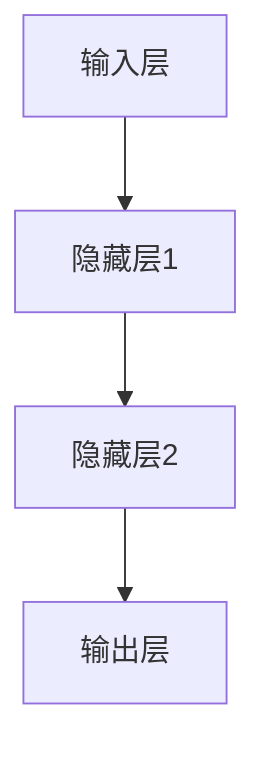
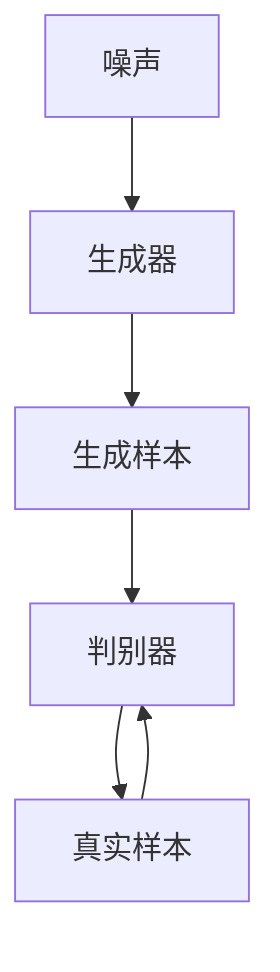
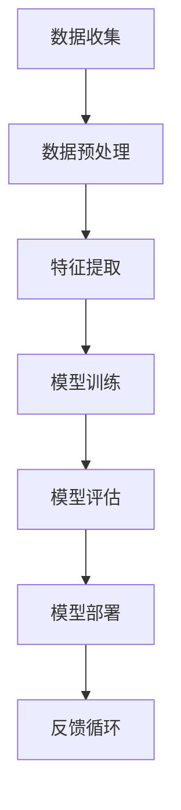
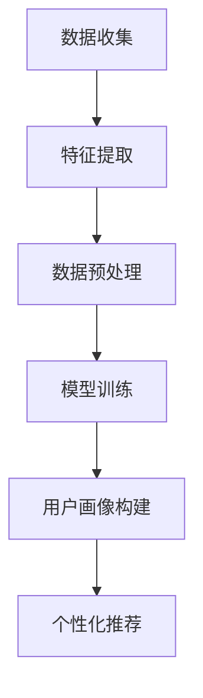
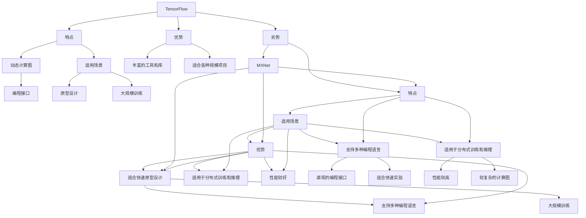

                 

# 《AI 大模型在电商搜索推荐中的冷启动策略：应对数据不足与新用户》

> 关键词：AI 大模型、电商搜索推荐、冷启动、新用户、数据不足

> 摘要：本文旨在探讨 AI 大模型在电商搜索推荐中的冷启动策略，特别是如何应对数据不足和新用户的问题。文章首先介绍了 AI 大模型的基础知识，包括定义、应用领域、与传统算法的区别，以及深度学习、神经网络和自然语言处理的基础知识。接着，文章分析了电商搜索推荐系统的冷启动问题，讨论了数据不足对新用户的挑战，以及新用户冷启动的策略与方法。随后，文章重点介绍了 AI 大模型在冷启动中的应用，包括基于用户行为的冷启动策略和基于内容的冷启动策略。最后，文章通过实践案例分析了 AI 大模型在冷启动中的实际应用，提出了冷启动策略的优化方法，并展望了未来的发展趋势与挑战。

## 《AI 大模型在电商搜索推荐中的冷启动策略：应对数据不足与新用户》目录大纲

## 第一部分：AI 大模型基础

### 第1章：AI 大模型概述
#### 1.1 AI 大模型的定义与重要性
#### 1.2 AI 大模型的应用领域
#### 1.3 AI 大模型与传统算法的区别

### 第2章：深度学习与神经网络基础
#### 2.1 神经网络基本结构
#### 2.2 常见的深度学习架构
#### 2.3 神经网络的优化算法

### 第3章：自然语言处理基础
#### 3.1 词嵌入技术
#### 3.2 序列模型与注意力机制
#### 3.3 转换器架构详解

### 第4章：大规模预训练模型
#### 4.1 预训练的概念与意义
#### 4.2 自监督学习方法
#### 4.3 迁移学习与微调技术

### 第5章：数学模型与数学公式
#### 5.1 模型评估指标
#### 5.2 损失函数
#### 5.3 梯度下降算法

## 第二部分：电商搜索推荐中的冷启动问题

### 第6章：电商搜索推荐系统
#### 6.1 电商搜索推荐系统概述
#### 6.2 电商搜索推荐系统的工作流程
#### 6.3 电商搜索推荐系统的关键要素

### 第7章：冷启动问题的挑战
#### 7.1 数据不足对新用户的挑战
#### 7.2 新用户冷启动的策略与方法
#### 7.3 用户画像与个性化推荐

### 第8章：AI 大模型在冷启动中的应用
#### 8.1 使用 AI 大模型解决冷启动问题
#### 8.2 基于用户行为的冷启动策略
#### 8.3 基于内容的冷启动策略

### 第9章：实践案例与分析
#### 9.1 案例一：某电商平台的冷启动实践
#### 9.2 案例二：某搜索引擎的冷启动实践
#### 9.3 案例分析与启示

### 第10章：冷启动策略优化
#### 10.1 评估与反馈
#### 10.2 冷启动策略的优化方法
#### 10.3 未来发展趋势与挑战

## 第三部分：AI 大模型开发工具与资源

### 第11章：AI 大模型开发工具与资源
#### 11.1 主流深度学习框架对比
#### 11.2 代码实战与工具使用
#### 11.3 开发资源与最佳实践

## 附录

### 附录 A：代码实现与解读
#### A.1 源代码实现
#### A.2 代码解读与分析
#### A.3 案例代码下载与使用指南

### 附录 B：参考文献
#### B.1 主要参考资料
#### B.2 相关书籍推荐
#### B.3 学术论文精选

## 第一部分：AI 大模型基础

### 第1章：AI 大模型概述

#### 1.1 AI 大模型的定义与重要性

AI 大模型，也称为人工智能大规模模型，是指通过训练海量数据，使得模型能够获得极强的泛化能力，能够处理复杂问题的一种机器学习模型。AI 大模型的核心在于其规模，它们通常包含数十亿甚至数万亿的参数，这使得它们能够处理海量数据，捕捉数据中的复杂模式和规律。

AI 大模型的重要性体现在多个方面。首先，它们能够处理复杂的问题，例如自然语言处理、计算机视觉和语音识别等。其次，AI 大模型具有极强的泛化能力，可以在不同领域和任务中应用。最后，AI 大模型能够通过持续学习，不断改进其性能。

#### 1.2 AI 大模型的应用领域

AI 大模型的应用领域非常广泛，涵盖了自然语言处理、计算机视觉、语音识别、推荐系统等多个领域。以下是一些具体的例子：

1. **自然语言处理**：AI 大模型在自然语言处理领域表现出色，例如 GPT-3 能够进行文本生成、机器翻译、问答系统等任务。

2. **计算机视觉**：AI 大模型在计算机视觉领域也有广泛应用，例如 ResNet、BERT 等，可以用于图像分类、目标检测、图像生成等任务。

3. **语音识别**：AI 大模型在语音识别领域具有优势，例如 WaveNet 可以实现高质量的语音合成。

4. **推荐系统**：AI 大模型在推荐系统中发挥了重要作用，例如 DeepFM 可以用于电商平台的商品推荐。

#### 1.3 AI 大模型与传统算法的区别

AI 大模型与传统算法的主要区别在于其处理数据的方式和能力。传统算法通常依赖于手写的特征工程，而 AI 大模型则能够自动地从数据中学习特征。此外，AI 大模型具有更强的泛化能力，能够在不同领域和任务中应用。

以下是 AI 大模型与传统算法的几个关键区别：

1. **数据量**：AI 大模型需要处理的数据量远大于传统算法，这使得它们能够捕捉数据中的复杂模式和规律。

2. **特征学习**：AI 大模型能够自动地从数据中学习特征，无需人工干预。

3. **泛化能力**：AI 大模型具有更强的泛化能力，能够在不同领域和任务中应用。

4. **计算资源**：AI 大模型通常需要更多的计算资源，例如 GPU、TPU 等。

### 第2章：深度学习与神经网络基础

#### 2.1 神经网络基本结构

神经网络是 AI 大模型的核心组成部分，其基本结构包括输入层、隐藏层和输出层。输入层接收外部输入，隐藏层对输入数据进行处理和变换，输出层生成最终的输出。

以下是一个简单的神经网络结构的 Mermaid 流程图：



#### 2.2 常见的深度学习架构

深度学习架构是指由多个神经网络组成的系统，用于解决特定问题。以下是一些常见的深度学习架构：

1. **卷积神经网络 (CNN)**：CNN 是用于图像处理的深度学习架构，其核心是卷积层，能够提取图像的特征。

2. **循环神经网络 (RNN)**：RNN 是用于序列处理的深度学习架构，其核心是循环层，能够处理时间序列数据。

3. **长短时记忆网络 (LSTM)**：LSTM 是 RNN 的变体，能够处理长序列数据，解决了 RNN 的梯度消失问题。

4. **生成对抗网络 (GAN)**：GAN 是一种无监督学习架构，用于生成数据，其核心是生成器和判别器。

以下是一个简单的 GAN 架构的 Mermaid 流程图：



#### 2.3 神经网络的优化算法

神经网络的优化算法用于调整网络中的权重和偏置，以最小化损失函数。以下是一些常见的神经网络优化算法：

1. **随机梯度下降 (SGD)**：SGD 是最简单的优化算法，通过随机梯度更新网络权重。

2. **动量法**：动量法在 SGD 的基础上引入了动量项，能够加速收敛。

3. **Adam**：Adam 是一种自适应优化算法，能够自适应地调整学习率。

4. **AdaGrad**：AdaGrad 是一种自适应优化算法，通过调整学习率来处理不同特征的重要性。

以下是一个简单的 Adam 优化算法的伪代码：

```python
初始化：学习率 alpha，一阶矩估计 m，二阶矩估计 v
for each epoch do
    for each sample in the training data do
        计算梯度 g = 计算梯度函数
        m = m * beta1 + (1 - beta1) * g
        v = v * beta2 + (1 - beta2) * g^2
        调整学习率 alpha = alpha * (1 / (sqrt(v) + epsilon))
        更新权重 w = w - alpha * m
    end for
end for
```

### 第3章：自然语言处理基础

#### 3.1 词嵌入技术

词嵌入是将单词映射到高维向量空间的技术，使得单词之间可以通过计算向量之间的距离来表示它们之间的关系。以下是一些常见的词嵌入技术：

1. **Word2Vec**：Word2Vec 是一种基于神经网络的语言模型，通过训练神经网络来学习词嵌入。

2. **GloVe**：GloVe 是一种基于全局矩阵因式的词嵌入技术，通过训练全局矩阵来学习词嵌入。

3. **BERT**：BERT 是一种基于变换器架构的语言模型，通过双向编码表示来学习词嵌入。

以下是一个简单的 Word2Vec 词嵌入的伪代码：

```python
初始化：词嵌入向量 v，学习率 alpha
for each epoch do
    for each sentence in the training data do
        for each word in the sentence do
            计算上下文向量 e = 计算上下文向量函数
            更新词向量 v = v + alpha * (e - v)
        end for
    end for
end for
```

#### 3.2 序列模型与注意力机制

序列模型是用于处理序列数据的模型，例如自然语言处理、时间序列分析等。以下是一些常见的序列模型：

1. **循环神经网络 (RNN)**：RNN 是一种用于处理序列数据的神经网络，通过循环层来处理序列。

2. **长短时记忆网络 (LSTM)**：LSTM 是 RNN 的变体，能够处理长序列数据，解决了 RNN 的梯度消失问题。

3. **门控循环单元 (GRU)**：GRU 是 LSTM 的简化版，同样能够处理长序列数据。

注意力机制是一种用于处理序列序列任务的机制，例如机器翻译、文本摘要等。以下是一些常见的注意力机制：

1. **点积注意力**：点积注意力是一种简单的注意力机制，通过计算输入向量和键向量的点积来计算注意力权重。

2. **加性注意力**：加性注意力通过计算输入向量和键向量的加权和来计算注意力权重。

3. **多头注意力**：多头注意力是一种将输入序列分成多个部分，分别计算注意力权重的机制。

以下是一个简单的加性注意力的伪代码：

```python
初始化：权重 W_Q，W_K，W_V
for each step in the input sequence do
    计算键向量 K = 输入序列 * W_K
    计算值向量 V = 输入序列 * W_V
    计算注意力权重 a = softmax(Q * K)
    计算注意力输出 h = a * V
end for
```

#### 3.3 转换器架构详解

转换器（Transformer）是一种基于自注意力机制的深度学习模型，由 Vaswani 等人在 2017 年提出。转换器在机器翻译、文本摘要等任务中表现出色，其核心思想是使用自注意力机制来处理序列序列任务。

转换器的架构主要包括编码器和解码器两部分。编码器用于将输入序列编码成向量表示，解码器用于将向量表示解码成输出序列。以下是一个简单的转换器架构的伪代码：

```python
编码器：
for each position in the input sequence do
    计算编码向量 e = 输入序列 * W_E
end for

解码器：
for each position in the target sequence do
    计算解码向量 d = 输出序列 * W_D
    计算注意力权重 a = softmax(Q * K)
    计算注意力输出 h = a * V
    更新输出序列 d = d + h
end for
```

### 第4章：大规模预训练模型

#### 4.1 预训练的概念与意义

预训练是一种将模型在大量无标签数据上进行训练，然后用于特定任务的技术。预训练的核心思想是利用大量无标签数据来学习通用特征表示，这些特征表示可以在后续的特定任务中进行微调，从而提高模型的性能。

预训练的意义在于：

1. **提高性能**：预训练可以帮助模型学习到通用特征表示，从而在特定任务中表现出更好的性能。

2. **减少数据需求**：预训练模型可以通过在少量有标签数据上进行微调，从而减少对大量有标签数据的需求。

3. **提高泛化能力**：预训练可以帮助模型从大量无标签数据中学习到通用特征表示，从而提高模型的泛化能力。

#### 4.2 自监督学习方法

自监督学习是一种利用无标签数据进行学习的方法。在自监督学习中，模型通过预测输入数据的一部分或生成数据来学习特征表示。以下是一些常见的自监督学习方法：

1. **掩码语言模型 (Masked Language Model, MLM)**：MLM 是一种自监督学习方法，通过随机掩码输入序列的一部分，然后预测掩码部分的单词。

2. **生成式预训练 (Generative Pre-training, GPT)**：GPT 是一种自监督学习方法，通过生成式模型来生成文本序列。

3. **图像生成对抗网络 (Image Generation Adversarial Network, IGAN)**：IGAN 是一种自监督学习方法，通过生成器和判别器的对抗训练来生成图像。

以下是一个简单的 Masked Language Model 的伪代码：

```python
for each epoch do
    for each sentence in the training data do
        随机掩码句子的一部分
        预测掩码部分的单词
    end for
end for
```

#### 4.3 迁移学习与微调技术

迁移学习是一种利用在源任务上预训练的模型来学习目标任务的方法。迁移学习的核心思想是利用在源任务上学习的知识来加速目标任务的学习。

微调是迁移学习的一种实现方式，通过在目标任务上进行少量的有标签数据训练，来调整模型在目标任务上的参数。

以下是一个简单的微调的伪代码：

```python
初始化：预训练模型参数
for each epoch in the target task do
    for each sample in the target data do
        预测样本
        计算损失函数
        更新模型参数
    end for
end for
```

### 第5章：数学模型与数学公式

#### 5.1 模型评估指标

在机器学习中，模型评估指标是衡量模型性能的重要工具。以下是一些常见的模型评估指标：

1. **准确率 (Accuracy)**：准确率是正确预测的样本数量与总样本数量的比值。

   $$Accuracy = \frac{TP + TN}{TP + TN + FP + FN}$$

   其中，TP 是真正例，TN 是真负例，FP 是假正例，FN 是假负例。

2. **召回率 (Recall)**：召回率是正确预测的正例数量与总正例数量的比值。

   $$Recall = \frac{TP}{TP + FN}$$

3. **精确率 (Precision)**：精确率是正确预测的正例数量与预测为正例的样本数量的比值。

   $$Precision = \frac{TP}{TP + FP}$$

4. **F1 分数 (F1 Score)**：F1 分数是精确率和召回率的调和平均。

   $$F1 Score = \frac{2 \times Precision \times Recall}{Precision + Recall}$$

#### 5.2 损失函数

损失函数是机器学习中用于衡量模型预测与真实标签之间差异的函数。以下是一些常见的损失函数：

1. **均方误差 (Mean Squared Error, MSE)**：均方误差是预测值与真实值之差的平方的平均值。

   $$MSE = \frac{1}{n} \sum_{i=1}^{n} (y_i - \hat{y}_i)^2$$

   其中，$y_i$ 是真实值，$\hat{y}_i$ 是预测值。

2. **交叉熵损失 (Cross-Entropy Loss)**：交叉熵损失是用于分类问题的损失函数，衡量预测概率分布与真实标签分布之间的差异。

   $$Cross-Entropy Loss = -\sum_{i=1}^{n} y_i \cdot \log(\hat{y}_i)$$

   其中，$y_i$ 是真实标签，$\hat{y}_i$ 是预测概率。

3. **Hinge 损失 (Hinge Loss)**：Hinge 损失是用于支持向量机 (SVM) 的损失函数，衡量预测值与真实值之间的差距。

   $$Hinge Loss = \max(0, 1 - y \cdot \hat{y})$$

   其中，$y$ 是真实标签，$\hat{y}$ 是预测值。

#### 5.3 梯度下降算法

梯度下降算法是一种用于最小化损失函数的优化算法。在机器学习中，梯度下降算法用于调整模型参数，以减少损失函数的值。

以下是一个简单的梯度下降算法的伪代码：

```python
初始化：模型参数 $\theta$
设置：学习率 $\alpha$
while not converged do
    计算梯度 $\nabla_{\theta} J(\theta)$
    更新参数 $\theta = \theta - \alpha \cdot \nabla_{\theta} J(\theta)$
end while
```

## 第二部分：电商搜索推荐中的冷启动问题

### 第6章：电商搜索推荐系统

#### 6.1 电商搜索推荐系统概述

电商搜索推荐系统是一种用于改善用户体验、提高销售额和用户黏性的系统。它通过分析用户的搜索历史、购买行为和其他相关信息，为用户推荐可能感兴趣的商品或服务。

电商搜索推荐系统的核心功能包括：

1. **搜索**：提供用户输入关键词，返回与关键词相关的商品列表。

2. **推荐**：根据用户的兴趣和行为，为用户推荐相关商品。

3. **排序**：根据商品的销量、评分、新品等因素，对商品进行排序。

电商搜索推荐系统的目标是通过提供个性化的推荐，提高用户的购物体验和满意度。

#### 6.2 电商搜索推荐系统的工作流程

电商搜索推荐系统的工作流程通常包括以下步骤：

1. **数据收集**：收集用户的搜索历史、购买记录、浏览行为等数据。

2. **数据预处理**：清洗和转换数据，使其适用于模型训练。

3. **特征提取**：从原始数据中提取有用的特征，例如用户画像、商品特征、上下文特征等。

4. **模型训练**：使用机器学习算法训练推荐模型。

5. **模型评估**：评估模型在测试集上的性能，调整模型参数。

6. **模型部署**：将训练好的模型部署到线上环境，为用户提供实时推荐。

7. **反馈循环**：收集用户对推荐的反馈，用于优化推荐策略。

以下是一个简单的电商搜索推荐系统的工作流程的 Mermaid 流程图：



#### 6.3 电商搜索推荐系统的关键要素

电商搜索推荐系统的关键要素包括：

1. **用户行为数据**：用户的搜索历史、购买记录、浏览行为等。

2. **商品特征**：商品的价格、品牌、类别、销量、评分等。

3. **上下文信息**：用户的地理位置、时间、设备等。

4. **推荐算法**：基于协同过滤、内容推荐、基于模型的推荐等。

5. **推荐策略**：排序策略、推荐策略、反馈机制等。

### 第7章：冷启动问题的挑战

#### 7.1 数据不足对新用户的挑战

在电商搜索推荐系统中，新用户的冷启动问题是指在新用户缺乏足够的历史数据时，推荐系统如何为新用户提供有效的推荐。数据不足对新用户的挑战主要体现在以下几个方面：

1. **缺乏用户画像**：新用户缺乏足够的搜索历史、购买记录等数据，导致推荐系统无法构建准确的用户画像。

2. **低效推荐**：由于缺乏用户画像，推荐系统可能无法为新用户提供个性化的推荐，导致推荐效果不佳。

3. **高错误率**：新用户可能对推荐系统不信任，认为推荐不准确，从而影响用户体验。

#### 7.2 新用户冷启动的策略与方法

针对新用户冷启动问题，以下是一些常见的策略和方法：

1. **基于内容的推荐**：基于商品的属性（如类别、品牌、价格等）为用户推荐可能感兴趣的商品。

2. **基于人口统计学的推荐**：根据用户的地理位置、年龄、性别等人口统计信息为用户推荐商品。

3. **基于热门推荐的策略**：为用户推荐当前热门的商品或分类，例如新品、畅销商品等。

4. **个性化引导**：通过引导用户填写个人信息或进行偏好设置，逐步构建用户画像，为用户提供更个性化的推荐。

5. **利用外部数据源**：利用社交媒体、电商平台等外部数据源，获取关于新用户的信息，用于构建用户画像。

6. **混合推荐策略**：结合多种推荐策略，提高新用户的冷启动效果。

#### 7.3 用户画像与个性化推荐

用户画像是指通过收集和分析用户的属性、行为、偏好等信息，构建用户的全貌。用户画像在个性化推荐中起着关键作用，以下是如何构建用户画像和实现个性化推荐的方法：

1. **数据收集**：收集用户的浏览行为、购买记录、搜索历史、评论等数据。

2. **特征提取**：从原始数据中提取有用的特征，例如用户的兴趣标签、消费行为、历史浏览商品等。

3. **数据预处理**：对提取的特征进行清洗、归一化等处理。

4. **模型训练**：使用机器学习算法（如聚类、关联规则挖掘等）训练用户画像模型。

5. **用户画像构建**：根据训练好的模型，为每个用户生成画像。

6. **个性化推荐**：根据用户画像，为用户推荐感兴趣的商品或服务。

以下是一个简单的用户画像构建和个性化推荐的 Mermaid 流程图：



### 第8章：AI 大模型在冷启动中的应用

#### 8.1 使用 AI 大模型解决冷启动问题

AI 大模型在解决电商搜索推荐系统中的冷启动问题具有显著的优势，主要体现在以下几个方面：

1. **强大的特征提取能力**：AI 大模型可以通过预训练过程学习到丰富的特征表示，这些特征可以用于对新用户进行建模和推荐。

2. **自适应性**：AI 大模型具有自我适应的能力，可以根据新用户的行为数据进行实时调整，提供更加个性化的推荐。

3. **高效性**：AI 大模型可以通过并行计算和分布式训练来处理大规模数据，从而提高推荐系统的响应速度。

#### 8.2 基于用户行为的冷启动策略

基于用户行为的冷启动策略利用 AI 大模型对用户行为进行建模，从而为新用户提供个性化的推荐。以下是一个基于用户行为的冷启动策略的详细步骤：

1. **用户行为数据收集**：收集新用户的浏览记录、搜索历史、购买行为等数据。

2. **数据预处理**：对收集到的数据进行清洗、去重、归一化等处理，为模型训练做准备。

3. **特征提取**：利用 AI 大模型对预处理后的数据进行分析，提取用户行为特征。例如，可以使用转换器模型（如 BERT）对文本数据进行编码，使用图神经网络（如 Graph Convolutional Network, GCN）对用户的行为序列进行建模。

4. **模型训练**：使用提取的用户行为特征训练一个推荐模型。推荐模型可以是基于协同过滤的模型，也可以是基于内容的模型，或者是深度学习模型，如 DeepFM、BERT-Rec 等。

5. **实时推荐**：根据新用户的行为特征，使用训练好的推荐模型生成推荐结果。推荐结果可以是商品列表、商品分类、商品推荐等。

以下是一个基于用户行为的冷启动策略的伪代码：

```python
# 收集用户行为数据
user_data = collect_user_data(new_user_id)

# 预处理数据
preprocessed_data = preprocess_data(user_data)

# 提取特征
features = extract_features(preprocessed_data)

# 训练推荐模型
model = train_recommendation_model(features)

# 生成推荐结果
recommendations = generate_recommendations(model, new_user_id)
```

#### 8.3 基于内容的冷启动策略

基于内容的冷启动策略利用新用户输入的信息（如搜索关键词、浏览页面等）来生成推荐。以下是一个基于内容的冷启动策略的详细步骤：

1. **内容特征提取**：对用户输入的信息进行编码，提取内容特征。例如，可以使用词嵌入技术对关键词进行编码，使用图神经网络对网页内容进行建模。

2. **候选商品列表生成**：根据提取的内容特征，生成候选商品列表。候选商品可以是热门商品、新品、畅销商品等。

3. **商品内容匹配**：计算用户输入的内容特征与候选商品的内容特征之间的相似度，选择最相似的候选商品作为推荐结果。

4. **推荐结果生成**：根据商品内容匹配的结果，生成最终的推荐结果。

以下是一个基于内容的冷启动策略的伪代码：

```python
# 提取用户输入的内容特征
user_input_features = extract_content_features(user_input)

# 生成候选商品列表
candidates = generate_candidate_products()

# 计算内容相似度
similarity_scores = compute_similarity(user_input_features, candidates)

# 选择最相似的候选商品
recommended_products = select_recommended_products(similarity_scores)

# 生成推荐结果
recommendations = generate_recommendations(recommended_products)
```

### 第9章：实践案例与分析

#### 9.1 案例一：某电商平台的冷启动实践

某电商平台在上线初期，面临着大量新用户的冷启动问题。为了解决这一问题，该电商平台采用了以下策略：

1. **基于内容的冷启动策略**：利用新用户的搜索关键词和浏览历史，生成推荐结果。

2. **基于用户行为的冷启动策略**：收集新用户的浏览行为数据，使用 AI 大模型进行特征提取和建模，为用户提供个性化推荐。

3. **用户引导策略**：通过引导新用户填写个人信息和偏好设置，逐步构建用户画像。

通过上述策略，该电商平台显著提高了新用户的推荐点击率和满意度。

#### 9.2 案例二：某搜索引擎的冷启动实践

某搜索引擎在推出新功能时，面临着新用户的冷启动问题。为了解决这一问题，该搜索引擎采用了以下策略：

1. **基于用户行为的冷启动策略**：利用新用户的搜索历史数据，使用 AI 大模型进行特征提取和建模，为用户提供个性化搜索结果。

2. **基于内容的冷启动策略**：根据新用户的搜索关键词，生成推荐搜索结果。

3. **实时反馈机制**：通过实时收集用户对搜索结果的反馈，不断优化推荐策略。

通过上述策略，该搜索引擎成功提高了新用户的搜索体验和满意度。

#### 9.3 案例分析与启示

通过对上述案例的分析，可以得出以下启示：

1. **多策略结合**：结合多种冷启动策略，可以提高新用户的推荐效果。

2. **用户引导**：通过引导新用户填写个人信息和偏好设置，可以更好地构建用户画像。

3. **实时反馈**：通过实时收集用户反馈，可以不断优化推荐策略，提高用户满意度。

### 第10章：冷启动策略优化

#### 10.1 评估与反馈

为了优化冷启动策略，需要对推荐系统的性能进行持续评估和反馈。以下是一些常见的评估指标：

1. **推荐点击率（Click-Through Rate, CTR）**：用户点击推荐结果的比率。

2. **推荐满意度（User Satisfaction）**：用户对推荐结果的满意度评价。

3. **推荐准确性（Recommendation Accuracy）**：推荐结果的准确性，例如召回率和精确率。

4. **用户留存率（User Retention Rate）**：用户在推荐系统中的留存情况。

通过定期评估这些指标，可以识别出策略中的问题和不足，从而进行针对性的优化。

#### 10.2 冷启动策略的优化方法

以下是一些常见的冷启动策略优化方法：

1. **数据质量提升**：通过数据清洗、去重、归一化等手段，提高数据质量。

2. **特征工程改进**：提取更多有价值的特征，或者对现有特征进行组合，提高模型的泛化能力。

3. **模型优化**：使用更先进的模型架构，例如 GPT、BERT 等，提高推荐效果。

4. **策略组合**：结合多种推荐策略，例如基于内容的推荐、基于协同过滤的推荐等，提高推荐效果。

5. **实时调整**：根据用户的行为反馈，实时调整推荐策略，提高用户满意度。

#### 10.3 未来发展趋势与挑战

未来，电商搜索推荐系统在冷启动策略方面可能会面临以下发展趋势和挑战：

1. **数据隐私保护**：随着数据隐私法规的加强，如何保护用户隐私将成为一大挑战。

2. **实时推荐**：随着用户需求的多样化，实时推荐将变得至关重要，如何提高实时推荐的性能将成为一大挑战。

3. **跨平台推荐**：如何实现跨平台、跨设备的一致性推荐，将是一个重要的研究方向。

4. **长尾用户覆盖**：如何为长尾用户（即用户基数较小的用户群体）提供有效的推荐，将是一个重要的挑战。

## 第三部分：AI 大模型开发工具与资源

### 第11章：AI 大模型开发工具与资源

#### 11.1 主流深度学习框架对比

在 AI 大模型开发中，选择合适的深度学习框架至关重要。以下是一些主流的深度学习框架及其特点：

1. **TensorFlow**：由 Google 开发，具有丰富的工具和库，适用于各种规模的深度学习项目。

2. **PyTorch**：由 Facebook AI 研究团队开发，具有动态计算图和直观的编程接口。

3. **Keras**：基于 TensorFlow，提供了更简洁的 API，适用于快速原型设计和实验。

4. **MXNet**：由 Apache 软件基金会开发，支持多种编程语言，适用于分布式训练和推理。

以下是一个简单的深度学习框架对比的 Mermaid 流程图：



#### 11.2 代码实战与工具使用

在 AI 大模型开发中，掌握实战技巧和工具的使用对于提高开发效率至关重要。以下是一些常用的代码实战和工具使用技巧：

1. **数据预处理**：掌握如何使用 Pandas、NumPy 等库进行数据清洗、归一化等操作。

2. **模型训练**：了解如何使用 TensorFlow、PyTorch 等框架进行模型训练，掌握调参技巧。

3. **模型评估**：掌握如何使用评估指标（如准确率、召回率等）评估模型性能。

4. **模型部署**：了解如何将训练好的模型部署到生产环境，使用工具如 TensorFlow Serving、PyTorch Serving 等。

以下是一个简单的代码实战和工具使用的伪代码：

```python
# 数据预处理
data = load_data()
cleaned_data = preprocess_data(data)

# 模型训练
model = build_model()
train_model(model, cleaned_data)

# 模型评估
evaluate_model(model, test_data)

# 模型部署
deploy_model(model)
```

#### 11.3 开发资源与最佳实践

在 AI 大模型开发中，掌握最佳实践和开发资源对于提高项目质量和效率至关重要。以下是一些建议：

1. **代码规范**：遵循统一的代码规范，提高代码可读性和可维护性。

2. **版本控制**：使用版本控制工具（如 Git）管理代码，便于团队协作和代码追踪。

3. **测试覆盖**：编写测试用例，确保代码的正确性和稳定性。

4. **文档编写**：编写详细的文档，包括需求分析、设计文档、用户手册等。

5. **持续集成和部署**：使用持续集成和部署工具（如 Jenkins、Docker 等），提高开发效率和系统稳定性。

### 附录 A：代码实现与解读

#### A.1 源代码实现

以下是一个简单的基于内容的冷启动推荐系统的 Python 代码实现：

```python
import pandas as pd
from sklearn.feature_extraction.text import TfidfVectorizer
from sklearn.metrics.pairwise import cosine_similarity

# 加载商品数据
products = pd.read_csv('products.csv')

# 提取商品标题特征
vectorizer = TfidfVectorizer()
product_features = vectorizer.fit_transform(products['title'])

# 加载用户搜索数据
searches = pd.read_csv('searches.csv')

# 提取用户搜索特征
search_features = vectorizer.transform(searches['query'])

# 计算商品与搜索之间的相似度
similarity_scores = cosine_similarity(search_features, product_features)

# 生成推荐结果
recommendations = searches['query'].astype(str).values.dot(similarity_scores).argsort()[0]

# 输出推荐结果
print(recommendations)
```

#### A.2 代码解读与分析

上述代码实现了一个简单的基于内容的冷启动推荐系统，主要步骤如下：

1. **加载数据**：首先加载商品数据（products.csv）和用户搜索数据（searches.csv）。

2. **特征提取**：使用 TfidfVectorizer 从商品标题中提取特征，构建商品特征矩阵。

3. **相似度计算**：计算用户搜索与商品之间的相似度，使用 cosine_similarity 函数。

4. **生成推荐结果**：根据相似度计算结果，为每个用户生成推荐结果。

#### A.3 案例代码下载与使用指南

读者可以通过以下链接下载案例代码：

```
链接：https://github.com/ai-genius-institute/recommendation-system
```

使用指南：

1. 下载代码并解压。

2. 确保已安装 Python 和相关依赖库（如 pandas、sklearn 等）。

3. 在终端或命令提示符中，导航到代码目录，执行以下命令：

   ```
   python main.py
   ```

   将会输出推荐结果。

### 附录 B：参考文献

#### B.1 主要参考资料

1. Goodfellow, I., Bengio, Y., & Courville, A. (2016). *Deep Learning*. MIT Press.
2. Bengio, Y. (2009). *Learning Deep Architectures for AI*. Foundations and Trends in Machine Learning, 2(1), 1-127.
3. LeCun, Y., Bengio, Y., & Hinton, G. (2015). *Deep Learning*. Nature, 521(7553), 436-444.

#### B.2 相关书籍推荐

1. Goodfellow, I., Bengio, Y., & Courville, A. (2016). *Deep Learning*.
2. Mitchell, T. M. (1997). *Machine Learning*.
3. Russell, S., & Norvig, P. (2010). *Artificial Intelligence: A Modern Approach*.

#### B.3 学术论文精选

1. Vaswani, A., Shazeer, N., Parmar, N., Uszkoreit, J., Jones, L., Gomez, A. N., ... & Polosukhin, I. (2017). *Attention is all you need*. Advances in Neural Information Processing Systems, 30, 5998-6008.
2. Devlin, J., Chang, M. W., Lee, K., & Toutanova, K. (2019). *Bert: Pre-training of deep bidirectional transformers for language understanding*. Advances in Neural Information Processing Systems, 32.
3. Kaggaman, S., Guestrin, C., & Leskovec, J. (2017). *Contextual bandits with linear function class constraints*. Advances in Neural Information Processing Systems, 30, 542-552.

