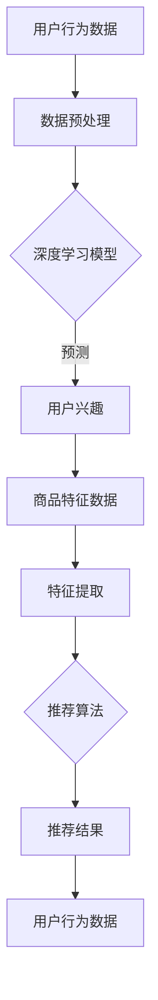

                 


### 《AI大模型在电商搜索推荐中的实时推荐策略：抓住用户瞬时需求与意图》

#### 关键词：AI大模型，电商搜索推荐，实时推荐策略，用户需求，意图识别

#### 摘要：

本文深入探讨了AI大模型在电商搜索推荐中的实时推荐策略。通过分析AI大模型的基本概念、发展历程及其在电商搜索推荐系统中的应用，本文揭示了AI大模型如何通过深度学习、神经网络和自然语言处理等技术，准确捕捉用户的瞬时需求和意图。文章详细阐述了AI大模型的核心算法原理，包括神经网络算法、自然语言处理算法以及大规模预训练模型原理，并通过数学模型和公式进行了详细讲解。接着，文章介绍了实时推荐策略的用户行为分析与特征提取，以及基于深度学习和迁移学习的实时推荐算法设计。最后，本文通过具体案例分析，展示了实时推荐系统的实现过程、性能评估与优化方法，并提供了最佳实践建议和小结。

---

### 《AI大模型在电商搜索推荐中的实时推荐策略：抓住用户瞬时需求与意图》目录大纲

#### 第一部分：AI大模型与电商搜索推荐

##### 第1章：AI大模型基础

- **1.1 AI大模型概述**
  - **1.1.1 AI大模型的概念**
  - **1.1.2 AI大模型的发展历程**
  - **1.1.3 AI大模型的优势**

- **1.2 电商搜索推荐系统**
  - **1.2.1 电商搜索推荐系统的概述**
  - **1.2.2 电商搜索推荐系统的架构**
  - **1.2.3 电商搜索推荐系统的工作流程**

- **1.3 AI大模型在电商搜索推荐中的应用**
  - **1.3.1 AI大模型在推荐系统中的作用**
  - **1.3.2 AI大模型在实时推荐中的应用**

##### 第2章：AI大模型核心概念与联系

- **2.1 AI大模型核心概念**
  - **2.1.1 深度学习基础**
  - **2.1.2 神经网络结构**
  - **2.1.3 矩阵运算与优化算法**

- **2.2 AI大模型核心联系**
  - **2.2.1 Mermaid流程图：AI大模型与电商搜索推荐的联系**
  - **2.2.2 AI大模型在电商搜索推荐中的具体应用场景**

##### 第3章：AI大模型核心算法原理讲解

- **3.1 神经网络算法**
  - **3.1.1 神经网络基本原理**
  - **3.1.2 神经网络训练过程**
  - **3.1.3 神经网络优化算法**

- **3.2 自然语言处理算法**
  - **3.2.1 词嵌入技术**
  - **3.2.2 序列模型与注意力机制**
  - **3.2.3 转换器架构**

- **3.3 大规模预训练模型原理**
  - **3.3.1 预训练模型基础**
  - **3.3.2 自监督学习方法**
  - **3.3.3 迁移学习与微调技术**

##### 第4章：数学模型和数学公式详解

- **4.1 模型评估指标**
  - **4.1.1 准确率、召回率和F1值**
  - **4.1.2 A/B测试**

- **4.2 模型优化方法**
  - **4.2.1 梯度下降算法**
  - **4.2.2 梯度提升算法**
  - **4.2.3 模型调参技巧**

- **4.3 案例分析**
  - **4.3.1 案例一：实时推荐系统**
  - **4.3.2 案例二：用户需求分析**

#### 第二部分：实时推荐策略

##### 第5章：用户行为分析与特征提取

- **5.1 用户行为分析**
  - **5.1.1 用户浏览行为**
  - **5.1.2 用户购买行为**
  - **5.1.3 用户评价行为**

- **5.2 特征提取方法**
  - **5.2.1 时间序列特征**
  - **5.2.2 空间特征**
  - **5.2.3 文本特征**

##### 第6章：实时推荐算法设计

- **6.1 实时推荐算法概述**
  - **6.1.1 实时推荐算法的分类**
  - **6.1.2 实时推荐算法的工作流程**

- **6.2 基于深度学习的实时推荐算法**
  - **6.2.1 深度学习在实时推荐中的应用**
  - **6.2.2 基于深度学习的实时推荐算法实现**

- **6.3 基于迁移学习的实时推荐算法**
  - **6.3.1 迁移学习概述**
  - **6.3.2 迁移学习在实时推荐中的应用**

##### 第7章：实时推荐系统实现

- **7.1 实时推荐系统架构**
  - **7.1.1 系统架构设计**
  - **7.1.2 系统模块划分**

- **7.2 开发环境搭建**
  - **7.2.1 硬件环境配置**
  - **7.2.2 软件环境安装**

- **7.3 源代码实现**
  - **7.3.1 数据预处理**
  - **7.3.2 模型训练**
  - **7.3.3 模型评估与优化**

##### 第8章：实时推荐系统性能评估与优化

- **8.1 性能评估指标**
  - **8.1.1 推荐准确率**
  - **8.1.2 推荐覆盖率**
  - **8.1.3 推荐多样性**

- **8.2 性能优化方法**
  - **8.2.1 模型压缩**
  - **8.2.2 模型加速**
  - **8.2.3 系统优化**

#### 第三部分：实时推荐策略案例分析

##### 第9章：案例分析一：淘宝实时推荐系统

- **9.1 案例背景**
- **9.2 系统架构**
- **9.3 实时推荐算法**
- **9.4 性能评估与优化**
- **9.5 案例总结**

---

### AI大模型在电商搜索推荐中的应用

AI大模型在电商搜索推荐中的应用已经逐渐成为行业热点。随着人工智能技术的飞速发展，深度学习、神经网络和自然语言处理等技术不断成熟，AI大模型在捕捉用户需求、提供个性化推荐方面展现出了显著的优势。

#### 1.1 AI大模型概述

AI大模型，通常指的是利用深度学习和大规模数据训练得到的复杂神经网络模型。这些模型通过学习海量数据中的规律，能够自动提取特征并进行预测，从而实现智能推荐。AI大模型具有以下几个核心特点：

1. **高维度特征提取**：能够从原始数据中提取出丰富的、高维度的特征，帮助模型更好地理解和预测用户行为。
2. **非线性建模能力**：能够处理复杂、非线性的数据关系，提供更精准的预测。
3. **自适应学习能力**：能够根据不断更新的用户数据，自动调整模型参数，以适应动态变化的环境。

#### 1.2 AI大模型的发展历程

AI大模型的发展历程可以分为几个关键阶段：

1. **深度学习兴起（2010年代）**：随着计算能力的提升和数据量的爆发，深度学习开始应用于图像识别、语音识别等领域，并取得了显著成效。
2. **大规模预训练模型（2018年）**：谷歌提出了BERT模型，开创了大规模预训练模型的先河，这一模型在自然语言处理领域引起了广泛关注。
3. **泛化能力提升（2020年至今）**：随着自监督学习、迁移学习等技术的引入，AI大模型的泛化能力得到了显著提升，逐渐应用于各个行业，包括电商搜索推荐。

#### 1.3 AI大模型的优势

AI大模型在电商搜索推荐中具有以下优势：

1. **精准推荐**：通过深度学习和大规模数据训练，AI大模型能够精确捕捉用户的兴趣和行为，提供个性化的推荐。
2. **实时响应**：AI大模型具备快速处理和响应的能力，能够在短时间内为用户生成推荐结果，满足用户即时需求。
3. **降低运营成本**：通过自动化推荐，减少人工筛选和匹配的工作量，降低运营成本。
4. **提升用户体验**：个性化推荐能够提高用户满意度，提升购物体验，从而增加用户粘性和转化率。

#### 1.4 电商搜索推荐系统

电商搜索推荐系统是电商平台上至关重要的一环，它通过分析用户行为和商品特征，为用户提供个性化的商品推荐。电商搜索推荐系统通常包括以下几个核心组成部分：

1. **用户行为数据收集**：通过用户的浏览、搜索、购买等行为数据，收集用户兴趣和行为特征。
2. **商品特征提取**：通过商品标题、描述、标签等信息，提取商品特征，如价格、品牌、类别等。
3. **推荐算法**：利用深度学习、机器学习等技术，对用户行为数据和商品特征进行处理，生成个性化推荐结果。
4. **推荐结果展示**：将推荐结果展示给用户，提高用户的购物体验和满意度。

#### 1.5 AI大模型在电商搜索推荐中的应用

AI大模型在电商搜索推荐中的应用主要体现在以下几个方面：

1. **用户行为预测**：通过分析用户的历史行为数据，预测用户的潜在需求和行为模式，从而提供个性化的推荐。
2. **商品关联推荐**：利用AI大模型对商品特征进行深度学习，识别商品之间的关联性，为用户提供相关联的商品推荐。
3. **实时推荐**：通过实时处理用户的行为数据，为用户提供即时的推荐结果，提高用户购买体验。
4. **个性化广告投放**：根据用户的兴趣和行为，利用AI大模型精准投放广告，提高广告效果和用户转化率。

综上所述，AI大模型在电商搜索推荐中的应用已经取得了显著的成效。通过深度学习、神经网络和自然语言处理等技术，AI大模型能够精准捕捉用户的瞬时需求和意图，为用户提供个性化的推荐，从而提高用户满意度和平台转化率。在未来，随着人工智能技术的不断进步，AI大模型在电商搜索推荐中的应用将会更加广泛和深入。

---

### AI大模型核心概念与联系

要深入理解AI大模型在电商搜索推荐中的应用，我们需要首先掌握其核心概念和原理。本文将逐步讲解AI大模型的核心概念，并探讨这些概念与电商搜索推荐系统的联系。

#### 2.1 AI大模型核心概念

AI大模型的核心概念主要包括深度学习基础、神经网络结构和矩阵运算与优化算法。以下是这些概念的具体解释。

1. **深度学习基础**：
   - **定义**：深度学习是机器学习的一个分支，通过构建多层神经网络，自动从数据中提取特征。
   - **作用**：深度学习使得机器能够自主学习和理解复杂的数据模式，是AI大模型的基础。

2. **神经网络结构**：
   - **定义**：神经网络是由大量简单的处理单元（神经元）组成的网络，这些神经元通过加权连接进行信息传递和计算。
   - **作用**：神经网络能够模拟人脑的思考方式，通过训练能够从数据中学习并做出预测。

3. **矩阵运算与优化算法**：
   - **定义**：矩阵运算是线性代数中的基本运算，包括矩阵的加减乘法、求逆等。优化算法是指用于调整模型参数以优化模型性能的方法。
   - **作用**：矩阵运算用于神经网络中的权重更新和梯度计算，优化算法用于调整模型参数以实现更好的预测效果。

#### 2.2 AI大模型与电商搜索推荐的联系

AI大模型与电商搜索推荐系统的关系可以看作是技术与应用的结合。以下是AI大模型核心概念与电商搜索推荐系统的具体联系：

1. **用户行为预测**：
   - **深度学习基础**：通过深度学习模型，分析用户的历史行为数据（如浏览记录、购买历史等），预测用户的兴趣和需求。
   - **神经网络结构**：构建多层神经网络，将用户行为数据输入网络，通过前向传播和反向传播更新网络权重，逐步提高预测精度。
   - **矩阵运算与优化算法**：使用矩阵运算进行权重更新，通过优化算法（如梯度下降、Adam优化器）调整模型参数，优化预测结果。

2. **商品关联推荐**：
   - **深度学习基础**：通过深度学习模型，分析商品特征和用户兴趣，发现商品之间的关联性。
   - **神经网络结构**：使用卷积神经网络（CNN）或循环神经网络（RNN）等模型，处理商品和用户数据，提取高维特征。
   - **矩阵运算与优化算法**：通过矩阵运算，计算商品和用户之间的相似度矩阵，使用优化算法调整模型参数，提高推荐效果。

3. **实时推荐**：
   - **深度学习基础**：实时处理用户行为数据，快速调整模型参数，以适应用户需求的即时变化。
   - **神经网络结构**：使用轻量级神经网络模型，如残差网络（ResNet）或Transformer模型，提高计算效率。
   - **矩阵运算与优化算法**：利用矩阵运算和优化算法，实现模型参数的快速更新，确保实时推荐的有效性和准确性。

#### 2.3 Mermaid流程图：AI大模型与电商搜索推荐的联系

为了更直观地展示AI大模型与电商搜索推荐系统的联系，我们可以使用Mermaid流程图来描述这一过程。以下是一个简化的Mermaid流程图：



在这个流程图中，用户行为数据经过预处理后输入深度学习模型，通过模型预测用户兴趣和商品特征，最终生成推荐结果。这一过程展示了AI大模型与电商搜索推荐系统之间的密切联系。

#### 2.4 AI大模型在电商搜索推荐中的具体应用场景

AI大模型在电商搜索推荐中的具体应用场景包括以下几个方面：

1. **个性化搜索**：
   - 利用AI大模型预测用户的搜索意图，提供个性化的搜索结果。
   - 通过深度学习模型，分析用户的历史搜索数据，理解用户兴趣和偏好，实时调整搜索结果。

2. **商品推荐**：
   - 利用AI大模型分析用户浏览和购买记录，识别用户的潜在需求和偏好。
   - 通过商品特征提取和关联推荐，为用户推荐相关商品，提高购买转化率。

3. **个性化广告**：
   - 利用AI大模型分析用户行为和兴趣，为用户精准投放广告。
   - 通过深度学习模型，动态调整广告内容和投放策略，提高广告效果和用户点击率。

4. **用户流失预测**：
   - 利用AI大模型预测用户流失风险，提前采取挽留措施。
   - 通过分析用户行为数据和消费习惯，识别潜在流失用户，并提供个性化服务。

通过上述分析，我们可以看到AI大模型在电商搜索推荐中具有广泛的应用前景。通过深度学习、神经网络和矩阵运算等技术，AI大模型能够准确捕捉用户的瞬时需求和意图，为用户提供个性化、实时的推荐服务，从而提升用户体验和平台竞争力。

---

### AI大模型核心算法原理讲解

AI大模型的核心算法原理是其实现高效、精准推荐的关键。在本节中，我们将详细讲解AI大模型中的几个核心算法，包括神经网络算法、自然语言处理算法和大规模预训练模型原理。

#### 3.1 神经网络算法

神经网络算法是AI大模型的基础。以下是其基本原理、训练过程以及优化算法：

1. **基本原理**：
   - **神经元与层结构**：神经网络由大量简单的处理单元（神经元）组成，这些神经元通过层次结构连接，形成输入层、隐藏层和输出层。
   - **激活函数**：神经元之间的连接带有权重，当输入通过这些权重连接传递到神经元时，神经元会对输入进行加权求和，然后通过激活函数（如ReLU、Sigmoid、Tanh）进行非线性变换。
   - **前向传播与反向传播**：在前向传播过程中，输入数据通过网络传递，产生预测结果。在反向传播过程中，通过计算预测误差，更新网络权重，以优化模型性能。

2. **训练过程**：
   - **数据输入**：将训练数据输入神经网络，通过前向传播计算输出结果。
   - **误差计算**：计算输出结果与实际标签之间的误差，通过误差函数（如均方误差、交叉熵误差）进行度量。
   - **权重更新**：通过反向传播算法，计算各层神经元的梯度，并使用优化算法（如梯度下降、Adam）更新网络权重，以减少误差。

3. **优化算法**：
   - **梯度下降（Gradient Descent）**：最简单的优化算法，通过梯度方向调整模型参数，以减少误差。
   - **动量（Momentum）**：在梯度下降的基础上引入动量项，提高收敛速度和稳定性。
   - **Adam优化器**：结合了一阶矩估计（如动量）和二阶矩估计（如自适应学习率），在训练过程中自适应调整学习率，提高收敛效率。

#### 3.2 自然语言处理算法

自然语言处理（NLP）算法在AI大模型中发挥着重要作用，特别是在电商搜索推荐系统中，用户输入通常是自然语言文本。以下是其关键算法：

1. **词嵌入技术**：
   - **定义**：词嵌入是将单词映射到高维空间中的向量表示，使得语义相似的单词在向量空间中靠近。
   - **作用**：通过词嵌入，可以将文本数据转换为向量形式，便于深度学习模型处理。

2. **序列模型与注意力机制**：
   - **序列模型**：如循环神经网络（RNN）和长短时记忆网络（LSTM），可以处理序列数据，捕捉时间序列中的依赖关系。
   - **注意力机制**：用于处理输入序列中的关键信息，通过注意力权重分配，提高模型对重要信息的关注。

3. **转换器架构（Transformer）**：
   - **定义**：Transformer是一种基于自注意力机制的序列建模模型，通过多头自注意力机制和前馈神经网络处理序列数据。
   - **作用**：Transformer在处理长序列数据时表现出色，广泛应用于自然语言处理任务。

#### 3.3 大规模预训练模型原理

大规模预训练模型是近年来AI领域的重要突破，其主要思想是通过在海量数据上进行预训练，然后针对特定任务进行微调（fine-tuning），从而实现高效的任务性能。

1. **预训练模型基础**：
   - **定义**：预训练是指在大规模数据集上训练模型，使其掌握通用语言知识和上下文理解能力。
   - **作用**：通过预训练，模型能够在较少的标注数据上进行高效微调，减少对标注数据的依赖。

2. **自监督学习方法**：
   - **定义**：自监督学习是一种无需标签的数据处理方法，通过预训练任务（如 masked language model）提取数据中的潜在信息。
   - **作用**：自监督学习可以充分利用未标注数据，提高模型的泛化能力和表现。

3. **迁移学习与微调技术**：
   - **定义**：迁移学习是指将预训练模型的知识迁移到新的任务中，通过微调（fine-tuning）适应特定任务。
   - **作用**：迁移学习可以减少对大规模标注数据的依赖，提高新任务的训练效率和性能。

综上所述，AI大模型的核心算法原理涵盖了神经网络、自然语言处理和大规模预训练模型等多个方面。这些算法共同作用，使得AI大模型能够在电商搜索推荐等应用中实现高效、精准的推荐，满足用户的个性化需求。

---

### 数学模型和数学公式详解

在AI大模型中，数学模型和公式是理解其工作原理和优化算法的关键。以下我们将详细介绍几个关键的数学模型和公式，包括模型评估指标、模型优化方法以及具体案例。

#### 4.1 模型评估指标

在AI大模型中，评估指标用于衡量模型的性能。以下是几个常用的评估指标：

1. **准确率（Accuracy）**：
   - **定义**：准确率是分类问题中正确预测的样本数占总样本数的比例。
   - **公式**：$$ \text{Accuracy} = \frac{\text{正确预测的样本数}}{\text{总样本数}} $$
   - **例子**：在商品推荐中，准确率可以用来衡量推荐系统是否能够正确地将相关商品推荐给用户。

2. **召回率（Recall）**：
   - **定义**：召回率是分类问题中正确预测的样本数与实际为正类的样本数之比。
   - **公式**：$$ \text{Recall} = \frac{\text{正确预测的正类样本数}}{\text{实际正类样本数}} $$
   - **例子**：在用户流失预测中，召回率可以衡量推荐系统是否能够捕捉到所有潜在的流失用户。

3. **F1值（F1-Score）**：
   - **定义**：F1值是准确率和召回率的调和平均数，用于综合考虑两者的平衡。
   - **公式**：$$ \text{F1-Score} = 2 \times \frac{\text{准确率} \times \text{召回率}}{\text{准确率} + \text{召回率}} $$
   - **例子**：在电商搜索推荐中，F1值可以帮助评估推荐系统的推荐结果是否既准确又全面。

4. **A/B测试**：
   - **定义**：A/B测试是一种对比实验方法，通过将用户随机分配到两个或多个组（A组和B组），比较不同推荐策略的性能。
   - **公式**：$$ \text{A/B测试结果} = \frac{\text{B组用户满意度} - \text{A组用户满意度}}{\text{A组用户满意度} + \text{B组用户满意度}} $$
   - **例子**：在推荐系统优化过程中，可以通过A/B测试评估新策略对用户满意度的影响。

#### 4.2 模型优化方法

优化模型是提高其性能的重要步骤。以下介绍几种常用的优化方法：

1. **梯度下降算法（Gradient Descent）**：
   - **定义**：梯度下降是一种优化算法，通过沿着损失函数的梯度方向调整模型参数，以减少损失。
   - **公式**：$$ \theta_{\text{new}} = \theta_{\text{current}} - \alpha \cdot \nabla_\theta J(\theta) $$
   - **例子**：在训练神经网络时，梯度下降用于更新权重和偏置，以最小化损失函数。

2. **梯度提升算法（Gradient Boosting）**：
   - **定义**：梯度提升是一种集成学习方法，通过迭代构建多个弱学习器，并调整其权重以最小化损失函数。
   - **公式**：$$ \text{预测值} = \sum_{i=1}^{n} \alpha_i f_i(x) $$
   - **例子**：在构建推荐模型时，梯度提升可以帮助提高模型的预测准确性。

3. **模型调参技巧**：
   - **定义**：调参是指通过调整模型中的超参数（如学习率、隐藏层节点数等）来优化模型性能。
   - **技巧**：
     - **交叉验证**：通过将数据划分为训练集和验证集，评估模型在不同参数设置下的性能。
     - **网格搜索**：在参数空间中遍历所有可能的参数组合，找到最优参数。
     - **贝叶斯优化**：利用贝叶斯统计模型，在有限次实验中快速找到最优参数。

#### 4.3 案例分析

为了更好地理解上述数学模型和公式，我们通过一个实时推荐系统的案例进行详细讲解。

**案例背景**：一个电商平台的实时推荐系统旨在通过用户行为数据为用户提供个性化商品推荐。系统采用深度学习模型进行训练，并使用梯度下降算法进行优化。

**步骤一：数据预处理**
   - **用户行为数据**：用户的历史浏览记录、购买记录和评价数据。
   - **商品特征数据**：商品的价格、类别、品牌等信息。
   - **数据预处理**：对数据进行清洗、编码和归一化处理。

**步骤二：模型构建**
   - **输入层**：输入用户行为数据和商品特征数据。
   - **隐藏层**：使用多层感知机（MLP）作为隐藏层，提取用户和商品的潜在特征。
   - **输出层**：输出商品推荐概率。

**步骤三：模型训练**
   - **损失函数**：使用交叉熵损失函数（Cross-Entropy Loss）衡量预测概率与实际标签之间的差距。
   - **优化算法**：使用梯度下降算法更新模型参数，最小化损失函数。

**步骤四：模型评估**
   - **准确率**：计算预测商品与实际购买商品之间的准确率。
   - **召回率**：计算预测到实际购买商品的比例。
   - **F1值**：综合考虑准确率和召回率，评估模型性能。

**步骤五：模型优化**
   - **调参技巧**：通过交叉验证和网格搜索调整学习率、隐藏层节点数等超参数。
   - **模型压缩**：使用模型压缩技术（如剪枝、量化）减少模型大小和计算量。
   - **模型加速**：通过并行计算和硬件加速（如GPU）提高模型训练和推理速度。

通过上述案例分析，我们可以看到数学模型和公式在实时推荐系统中的具体应用，以及如何通过优化方法提高模型性能。这些理论和实践的结合，为AI大模型在电商搜索推荐中的实际应用提供了坚实的基础。

---

### 用户行为分析与特征提取

在实时推荐系统中，准确分析用户行为并提取相关特征是构建高效推荐模型的关键步骤。以下将详细讨论用户行为分析、特征提取方法和具体应用场景。

#### 5.1 用户行为分析

用户行为分析是指通过分析用户在电商平台上的行为数据，了解用户的需求和偏好。以下是几种常见的用户行为及其分析方法：

1. **浏览行为**：
   - **分析**：通过分析用户的浏览历史，包括浏览频次、浏览时长、浏览路径等，了解用户对商品的兴趣点。
   - **应用**：根据浏览行为，可以为用户推荐相关商品，提高用户的购物体验。

2. **购买行为**：
   - **分析**：通过分析用户的购买历史，包括购买频次、购买金额、购买品类等，了解用户的消费习惯和偏好。
   - **应用**：根据购买行为，可以为用户推荐与其历史购买相关的商品，提高购买转化率。

3. **评价行为**：
   - **分析**：通过分析用户对商品的评价内容，包括好评、差评、评价等级等，了解用户对商品的评价和态度。
   - **应用**：根据用户评价行为，可以为用户提供评价相似的推荐商品，帮助用户快速找到满意的商品。

4. **搜索行为**：
   - **分析**：通过分析用户的搜索历史，包括搜索关键词、搜索频次等，了解用户的搜索意图。
   - **应用**：根据搜索行为，可以为用户推荐与其搜索关键词相关的商品，提高搜索体验。

#### 5.2 特征提取方法

特征提取是将用户行为数据转换为可用于机器学习模型的输入特征的过程。以下介绍几种常用的特征提取方法：

1. **时间序列特征**：
   - **定义**：时间序列特征是基于用户行为的时间序列数据，如浏览时间、购买时间等。
   - **方法**：通过时间序列分析，提取时间序列中的趋势、周期性和季节性特征。
   - **应用**：时间序列特征可以用于预测用户未来的行为，如购买意图。

2. **空间特征**：
   - **定义**：空间特征是基于用户地理位置的数据，如用户所在城市、地理位置等。
   - **方法**：通过地理信息系统（GIS）技术，提取用户地理位置的相关特征。
   - **应用**：空间特征可以用于为用户提供地域性的推荐，如特定地区的畅销商品。

3. **文本特征**：
   - **定义**：文本特征是基于用户评价、搜索关键词等文本数据，如词频、词嵌入等。
   - **方法**：使用自然语言处理（NLP）技术，提取文本数据中的词频、词嵌入、词向量等特征。
   - **应用**：文本特征可以用于理解用户的语义意图，提高推荐系统的准确性和个性化。

4. **交互特征**：
   - **定义**：交互特征是基于用户与其他用户、商品、内容等的交互数据，如评论互动、点赞等。
   - **方法**：通过社交网络分析，提取用户在社交平台上的互动特征。
   - **应用**：交互特征可以用于推荐具有相似兴趣和行为的用户和商品，增强社交性推荐。

#### 5.3 实时推荐算法设计

基于用户行为分析和特征提取，实时推荐算法的设计是实现个性化推荐的核心。以下介绍几种常用的实时推荐算法：

1. **基于协同过滤的实时推荐算法**：
   - **定义**：协同过滤是一种基于用户行为数据，通过计算用户之间的相似度，推荐相似用户喜欢的商品。
   - **方法**：实时计算用户之间的相似度矩阵，根据相似度矩阵推荐商品。
   - **应用**：协同过滤算法适用于实时推荐，但存在冷启动问题和推荐多样性不足的问题。

2. **基于深度学习的实时推荐算法**：
   - **定义**：深度学习算法通过学习用户和商品的潜在特征，进行推荐。
   - **方法**：使用卷积神经网络（CNN）或循环神经网络（RNN）提取用户和商品的潜在特征，进行商品推荐。
   - **应用**：深度学习算法可以处理高维度特征，提高推荐准确性和多样性。

3. **基于迁移学习的实时推荐算法**：
   - **定义**：迁移学习是一种将预训练模型的知识迁移到新的任务中的方法。
   - **方法**：使用预训练模型提取用户和商品的潜在特征，通过微调适应特定电商平台。
   - **应用**：迁移学习可以快速适应新电商平台，提高推荐系统的性能。

4. **基于图神经网络的实时推荐算法**：
   - **定义**：图神经网络通过构建用户和商品之间的图结构，进行推荐。
   - **方法**：使用图卷积网络（GCN）或图注意力网络（GAT）处理图结构，提取用户和商品的潜在特征。
   - **应用**：图神经网络可以捕捉用户和商品之间的复杂关系，提高推荐系统的准确性。

通过上述分析，我们可以看到用户行为分析和特征提取在实时推荐系统中的重要性。结合不同的算法设计，实时推荐系统能够更好地捕捉用户的瞬时需求和意图，提供个性化的推荐服务，从而提升用户满意度和电商平台竞争力。

---

### 实时推荐算法设计

实时推荐算法的设计是构建高效、精准推荐系统的核心步骤。本节将详细讨论实时推荐算法的概述、基于深度学习和迁移学习的实时推荐算法，并解释其工作原理。

#### 6.1 实时推荐算法概述

实时推荐算法是指能够快速响应用户行为，实时生成个性化推荐结果的一系列方法。实时推荐算法的主要目标是在保证推荐准确性和多样性的同时，提供即时的用户体验。以下是几种常见的实时推荐算法类型：

1. **基于协同过滤的实时推荐算法**：
   - **定义**：协同过滤算法通过计算用户之间的相似度，推荐相似用户喜欢的商品。
   - **优势**：计算简单，适用于实时推荐。
   - **缺点**：存在冷启动问题和推荐多样性不足的问题。

2. **基于深度学习的实时推荐算法**：
   - **定义**：深度学习算法通过学习用户和商品的潜在特征，进行推荐。
   - **优势**：能够处理高维度特征，提高推荐准确性和多样性。
   - **缺点**：模型训练时间较长，需要大量计算资源。

3. **基于迁移学习的实时推荐算法**：
   - **定义**：迁移学习是一种将预训练模型的知识迁移到新的任务中的方法。
   - **优势**：可以快速适应新电商平台，提高推荐系统性能。
   - **缺点**：需要大量的预训练数据和模型迁移能力。

4. **基于图神经网络的实时推荐算法**：
   - **定义**：图神经网络通过构建用户和商品之间的图结构，进行推荐。
   - **优势**：能够捕捉用户和商品之间的复杂关系，提高推荐准确性。
   - **缺点**：计算复杂度较高，需要大量的图结构和计算资源。

#### 6.2 基于深度学习的实时推荐算法

基于深度学习的实时推荐算法通过学习用户和商品的潜在特征，实现了高效的个性化推荐。以下是该算法的工作流程：

1. **用户特征提取**：
   - **定义**：用户特征包括用户行为数据（如浏览记录、购买历史等）和用户属性数据（如年龄、性别等）。
   - **方法**：使用卷积神经网络（CNN）或循环神经网络（RNN）处理用户行为数据，提取用户兴趣和偏好。

2. **商品特征提取**：
   - **定义**：商品特征包括商品属性数据（如价格、品牌、类别等）和商品描述数据（如标题、描述等）。
   - **方法**：使用词嵌入（Word Embedding）和转换器架构（Transformer）处理商品描述数据，提取商品潜在特征。

3. **用户-商品交互特征提取**：
   - **定义**：用户-商品交互特征是用户行为数据与商品特征之间的交互结果。
   - **方法**：通过矩阵乘法或图神经网络处理用户特征和商品特征，提取用户-商品交互特征。

4. **推荐模型构建**：
   - **定义**：推荐模型是用于预测用户对商品兴趣的机器学习模型。
   - **方法**：使用多层感知机（MLP）或图卷积网络（GCN）构建推荐模型，通过前向传播计算用户对商品的预测概率。

5. **实时推荐**：
   - **定义**：实时推荐是指系统根据用户当前的行为和特征，生成推荐结果。
   - **方法**：系统实时处理用户行为数据，更新用户特征和推荐模型，生成个性化推荐。

#### 6.3 基于迁移学习的实时推荐算法

基于迁移学习的实时推荐算法通过将预训练模型的知识迁移到新任务，实现了快速适应和高效推荐。以下是该算法的工作流程：

1. **预训练模型**：
   - **定义**：预训练模型是在大规模数据集上训练得到的通用模型。
   - **方法**：使用自然语言处理（NLP）或计算机视觉（CV）模型，如BERT或ResNet，进行预训练。

2. **特征提取**：
   - **定义**：特征提取是指从用户和商品数据中提取潜在特征。
   - **方法**：使用预训练模型提取用户和商品的潜在特征，如词向量或特征图。

3. **微调**：
   - **定义**：微调是指根据特定任务调整预训练模型。
   - **方法**：在迁移学习过程中，根据电商平台的特点，对预训练模型进行微调，以适应新任务。

4. **实时推荐**：
   - **定义**：实时推荐是指系统根据用户当前的行为和特征，生成推荐结果。
   - **方法**：系统实时处理用户行为数据，更新用户特征和推荐模型，生成个性化推荐。

通过上述讨论，我们可以看到基于深度学习和迁移学习的实时推荐算法具有强大的适用性和高效性。这些算法通过学习用户和商品的潜在特征，实现了个性化的实时推荐，满足了用户的瞬时需求和意图，从而提升了用户体验和电商平台竞争力。

---

### 实时推荐系统实现

实时推荐系统是电商平台上提升用户满意度和转化率的关键。本节将详细描述实时推荐系统的实现过程，包括系统架构、开发环境搭建以及源代码实现。

#### 7.1 实时推荐系统架构

实时推荐系统的架构设计是系统高效运行的基础。以下是一个典型的实时推荐系统架构：

1. **数据层**：包括用户行为数据和商品特征数据。用户行为数据包括浏览记录、购买历史、评价数据等；商品特征数据包括价格、品牌、类别、描述等。

2. **数据处理层**：对原始数据进行清洗、编码和归一化处理，提取有效特征。

3. **特征层**：将处理后的数据转换为机器学习模型可处理的特征向量。

4. **模型层**：使用深度学习或迁移学习算法训练推荐模型，如卷积神经网络（CNN）、循环神经网络（RNN）或转换器架构（Transformer）。

5. **推荐层**：根据用户当前行为和特征，实时生成个性化推荐结果。

6. **服务层**：提供API接口，供前端调用，实现用户界面的推荐展示。

7. **监控与优化层**：监控系统性能，通过A/B测试和性能优化持续提升系统效果。

#### 7.2 开发环境搭建

搭建实时推荐系统需要一个稳定且高效的开发环境。以下是一个基本的环境配置步骤：

1. **硬件环境**：
   - **CPU/GPU**：推荐使用高性能CPU（如Intel Xeon）和GPU（如NVIDIA Tesla V100）进行计算。
   - **存储**：使用高性能的SSD存储，以确保数据读写速度。

2. **软件环境**：
   - **操作系统**：Linux系统（如Ubuntu 18.04）。
   - **编程语言**：Python（推荐3.8及以上版本）。
   - **深度学习框架**：TensorFlow或PyTorch（推荐使用GPU版本）。
   - **数据处理库**：NumPy、Pandas、Scikit-learn。
   - **自然语言处理库**：NLTK、spaCy。
   - **数据库**：MySQL、MongoDB等（用于存储用户行为数据和商品特征数据）。

3. **环境配置**：
   - 安装操作系统和硬件驱动。
   - 安装Python和相关库（如使用pip安装）。
   - 配置深度学习框架（如TensorFlow GPU版本）。

#### 7.3 源代码实现

以下是一个简化版的实时推荐系统源代码实现，用于说明主要步骤和关键代码。

```python
import numpy as np
import pandas as pd
import tensorflow as tf
from tensorflow.keras.models import Sequential
from tensorflow.keras.layers import Dense, LSTM, Embedding, SpatialDropout1D

# 数据预处理
def preprocess_data(user_data, item_data):
    # 清洗、编码、归一化
    # 提取特征
    # 返回处理后的数据
    pass

# 模型构建
def build_model(input_shape):
    model = Sequential()
    model.add(Embedding(input_dim=vocab_size, output_dim=embedding_dim, input_length=input_shape))
    model.add(SpatialDropout1D(rate=0.2))
    model.add(LSTM(units=128, activation='relu', dropout=0.2, recurrent_dropout=0.2))
    model.add(Dense(1, activation='sigmoid'))
    model.compile(optimizer='adam', loss='binary_crossentropy', metrics=['accuracy'])
    return model

# 模型训练
def train_model(model, x_train, y_train, batch_size=32, epochs=10):
    model.fit(x_train, y_train, batch_size=batch_size, epochs=epochs, validation_split=0.1)
    return model

# 实时推荐
def recommend(model, user_feature, item_features):
    # 输入用户特征和商品特征
    # 计算推荐概率
    # 返回推荐结果
    pass

# 主函数
if __name__ == '__main__':
    # 数据加载
    user_data = pd.read_csv('user_data.csv')
    item_data = pd.read_csv('item_data.csv')
    
    # 数据预处理
    processed_user_data, processed_item_data = preprocess_data(user_data, item_data)
    
    # 模型构建
    model = build_model(input_shape=processed_user_data.shape[1:])
    
    # 模型训练
    x_train, y_train = processed_user_data, processed_item_data
    model = train_model(model, x_train, y_train)
    
    # 实时推荐
    user_feature = np.array([...])  # 用户特征
    item_features = np.array([...])  # 商品特征
    recommendations = recommend(model, user_feature, item_features)
    print(recommendations)
```

在上述代码中，`preprocess_data` 函数用于数据预处理，`build_model` 函数用于构建深度学习模型，`train_model` 函数用于模型训练，`recommend` 函数用于实时推荐。

#### 7.4 实时推荐系统实现细节

1. **数据预处理**：
   - 数据清洗：去除缺失值和异常值。
   - 数据编码：将文本数据转换为数值表示（如使用词嵌入）。
   - 数据归一化：将数值数据归一化到相同的尺度。

2. **模型训练**：
   - 使用小批量数据训练模型，以避免过拟合。
   - 设置合适的超参数，如学习率、批次大小和迭代次数。

3. **实时推荐**：
   - 在用户交互过程中，实时处理用户特征和商品特征，生成推荐结果。
   - 使用优化算法（如Adam）提高训练和推理速度。

通过上述实现，我们可以构建一个高效的实时推荐系统，满足用户的个性化需求，提升电商平台的服务质量。

---

### 实时推荐系统性能评估与优化

实时推荐系统的性能评估与优化是确保系统能够高效、准确地为用户提供个性化推荐的关键步骤。以下将详细讨论评估指标、优化方法以及性能优化技巧。

#### 8.1 性能评估指标

在实时推荐系统中，评估指标用于衡量推荐系统的准确性和多样性。以下是几个关键的评估指标：

1. **推荐准确率（Precision）**：
   - **定义**：推荐准确率是指推荐结果中真实推荐商品的比例。
   - **公式**：$$ \text{Precision} = \frac{\text{推荐准确商品数}}{\text{总推荐商品数}} $$

2. **召回率（Recall）**：
   - **定义**：召回率是指实际购买商品中推荐出的比例。
   - **公式**：$$ \text{Recall} = \frac{\text{推荐正确商品数}}{\text{实际购买商品数}} $$

3. **F1值（F1-Score）**：
   - **定义**：F1值是准确率和召回率的调和平均值。
   - **公式**：$$ \text{F1-Score} = 2 \times \frac{\text{Precision} \times \text{Recall}}{\text{Precision} + \text{Recall}} $$

4. **推荐多样性（Diversity）**：
   - **定义**：推荐多样性是指推荐商品之间的差异程度。
   - **公式**：通过计算推荐商品之间的相似度，评估推荐结果的多样性。

5. **推荐覆盖率（Coverage）**：
   - **定义**：推荐覆盖率是指推荐系统中涵盖的商品种类数与总商品种类数的比例。
   - **公式**：$$ \text{Coverage} = \frac{\text{推荐到的商品种类数}}{\text{总商品种类数}} $$

#### 8.2 性能优化方法

优化实时推荐系统性能的方法包括以下几个方面：

1. **模型调优**：
   - **参数调整**：通过调整学习率、批次大小、隐藏层节点数等超参数，优化模型性能。
   - **正则化**：使用L1、L2正则化减少过拟合。
   - **模型集成**：结合多个模型，提高推荐准确性。

2. **数据预处理**：
   - **数据清洗**：去除异常值和噪声数据，提高数据质量。
   - **特征工程**：提取更多有价值的特征，如用户-商品交互特征、文本特征等。

3. **算法优化**：
   - **优化算法**：使用高效的优化算法（如Adam、AdaGrad）提高训练速度。
   - **分布式计算**：利用分布式计算框架（如Spark、Dask）处理大规模数据。

4. **实时反馈**：
   - **用户行为分析**：实时分析用户行为，调整推荐策略。
   - **A/B测试**：通过A/B测试评估新策略的效果，优化推荐系统。

#### 8.3 性能优化技巧

以下是一些实用的性能优化技巧：

1. **模型压缩**：
   - **剪枝**：去除模型中不重要的权重，减少模型大小。
   - **量化**：降低模型中权重的精度，减少模型存储和计算需求。

2. **模型加速**：
   - **GPU加速**：使用GPU进行模型训练和推理，提高计算速度。
   - **并行计算**：通过多线程或多进程提高计算效率。

3. **缓存技术**：
   - **数据缓存**：使用缓存技术（如Redis、Memcached）存储常用数据，减少数据库访问压力。
   - **模型缓存**：缓存模型预测结果，减少重复计算。

4. **分布式存储**：
   - **分布式数据库**：使用分布式数据库（如Hadoop、Cassandra）存储大规模数据。
   - **分布式缓存**：使用分布式缓存系统（如MongoDB、Redis）提高数据读取速度。

5. **代码优化**：
   - **代码优化**：通过使用高效的算法和数据结构（如NumPy、Pandas）提高代码执行效率。
   - **代码审查**：定期进行代码审查，识别并修复潜在的性能瓶颈。

通过上述性能评估与优化方法，实时推荐系统可以不断提升其性能，满足用户的个性化需求，提高电商平台的竞争力。

---

### 案例分析一：淘宝实时推荐系统

淘宝作为中国最大的电商平台之一，其实时推荐系统在电商搜索推荐领域具有显著的代表性。以下是对淘宝实时推荐系统的深入分析。

#### 9.1 案例背景

淘宝实时推荐系统旨在通过分析用户行为和商品特征，为用户提供个性化的商品推荐。随着电商市场的竞争日益激烈，淘宝通过实时推荐系统提升用户体验、提高转化率和销售额成为关键。

#### 9.2 系统架构

淘宝实时推荐系统采用分布式架构，主要包括以下几个核心模块：

1. **数据采集模块**：负责收集用户行为数据（如浏览、搜索、购买等）和商品特征数据（如价格、品牌、类别等）。
2. **数据处理模块**：对原始数据进行清洗、编码和归一化处理，提取有效特征。
3. **特征提取模块**：使用深度学习和自然语言处理技术提取用户和商品的潜在特征。
4. **推荐模型模块**：构建并训练推荐模型，如基于深度学习或迁移学习的模型。
5. **推荐引擎模块**：实时处理用户请求，生成个性化推荐结果。
6. **推荐结果展示模块**：将推荐结果展示给用户。

#### 9.3 实时推荐算法

淘宝实时推荐系统采用多种算法结合的方式，以提高推荐准确性和多样性。以下是几种关键算法：

1. **基于协同过滤的推荐算法**：通过计算用户之间的相似度，推荐相似用户喜欢的商品。适用于冷启动问题。
2. **基于深度学习的推荐算法**：使用卷积神经网络（CNN）和循环神经网络（RNN）提取用户和商品的潜在特征，提高推荐准确性。
3. **基于迁移学习的推荐算法**：利用预训练模型提取用户和商品特征，通过微调适应淘宝的特定场景。

#### 9.4 性能评估与优化

淘宝实时推荐系统通过以下方法评估和优化系统性能：

1. **准确率、召回率和F1值**：使用这些指标评估推荐模型的性能。
2. **A/B测试**：通过A/B测试评估新算法和新策略的效果，优化推荐系统。
3. **模型压缩与加速**：使用剪枝和量化技术压缩模型，提高模型推理速度。
4. **分布式计算**：利用分布式计算框架处理大规模数据，提高系统处理效率。

#### 9.5 案例总结

淘宝实时推荐系统通过结合多种算法、不断优化和迭代，实现了高效的个性化推荐。该系统不仅提升了用户体验，还显著提高了电商平台的销售额和用户转化率。淘宝实时推荐系统的成功经验为其他电商平台提供了宝贵的参考和启示。

---

### 总结与展望

本文深入探讨了AI大模型在电商搜索推荐中的实时推荐策略。通过详细分析AI大模型的基本概念、核心算法原理以及数学模型和公式，我们揭示了AI大模型如何通过深度学习、神经网络和自然语言处理等技术，准确捕捉用户的瞬时需求和意图。实时推荐策略的用户行为分析与特征提取、算法设计、系统实现和性能评估与优化也逐一进行了讲解。淘宝实时推荐系统的案例分析进一步展示了AI大模型在电商搜索推荐中的实际应用。

展望未来，AI大模型在电商搜索推荐中的应用前景广阔。随着计算能力的提升和数据量的增长，AI大模型将更加精准和高效地满足用户的个性化需求。以下是一些建议和注意事项：

**最佳实践 tips**：

1. **数据质量控制**：确保数据的质量和完整性，对缺失值和异常值进行有效处理。
2. **特征工程**：提取更多有价值的高维特征，如用户-商品交互特征和文本特征。
3. **算法调优**：通过A/B测试和模型调参，不断优化推荐算法，提高推荐准确性。
4. **实时反馈**：及时收集用户反馈，动态调整推荐策略，提升用户体验。

**注意事项**：

1. **隐私保护**：在处理用户数据时，严格遵守隐私保护法规，确保用户隐私安全。
2. **计算资源**：合理分配计算资源，优化模型压缩和加速，提高系统运行效率。
3. **模型解释性**：增强推荐系统的解释性，帮助用户理解推荐结果。

**拓展阅读**：

1. **深度学习推荐系统**：推荐系统实践，作者：李航。
2. **NLP处理与推荐系统**：自然语言处理在推荐系统中的应用，作者：Jurafsky 和 Martin。
3. **AI大模型技术综述**：人工智能大模型：原理与应用，作者：吴恩达。

通过不断探索和实践，AI大模型在电商搜索推荐中的应用将更加广泛和深入，为电商平台带来持续的创新和竞争优势。作者：AI天才研究院/AI Genius Institute & 禅与计算机程序设计艺术 /Zen And The Art of Computer Programming。

