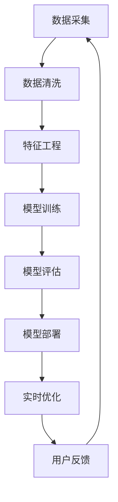
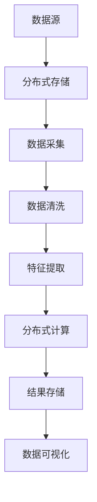

                 

### 文章标题：AI 大模型在电商搜索推荐中的数据处理能力要求：应对大规模数据挑战

关键词：AI大模型、电商搜索推荐、数据处理、大规模数据、挑战与对策

摘要：随着电商行业的迅猛发展，用户规模和商品数量呈指数级增长，这给搜索推荐系统带来了巨大的数据处理压力。本文旨在探讨AI大模型在电商搜索推荐中的数据处理能力要求，通过逐步分析大规模数据处理技术、AI大模型技术基础及其在电商搜索推荐中的应用，提出应对大规模数据挑战的策略，为电商平台的搜索推荐系统优化提供理论依据和实践指导。

### 引言

#### AI大模型与电商搜索推荐概述

近年来，人工智能（AI）技术尤其是大模型的发展，为电商搜索推荐系统带来了革命性的变化。AI大模型具有处理海量数据、理解复杂模式、进行智能决策等优势，成为电商搜索推荐系统中的重要组成部分。

AI大模型是指通过深度学习技术训练的具有极高参数数量和计算复杂度的模型，如GPT、BERT等。它们能够在多种任务上表现出色，包括自然语言处理、计算机视觉和语音识别等。在电商搜索推荐中，AI大模型可以用于用户行为分析、商品推荐算法和实时搜索结果优化等方面，从而提高用户体验和平台竞争力。

电商搜索推荐系统是电商平台的核心功能之一，其主要目标是根据用户行为和商品信息，为用户提供个性化、准确的搜索结果和推荐商品。然而，随着用户规模的扩大和商品数量的增加，电商搜索推荐系统面临巨大的数据处理挑战。大规模数据不仅要求高效的采集、存储和处理技术，还需要强大的计算能力和算法优化。

本文将首先介绍AI大模型的基本概念和核心特点，随后探讨电商搜索推荐系统的基本架构和主要挑战。接着，我们将深入分析大规模数据处理技术基础，包括数据采集与清洗、数据存储与分布式计算等。随后，我们将介绍AI大模型技术基础，包括神经网络基础、深度学习架构和大规模预训练模型原理。

在应用部分，我们将详细讨论AI大模型在电商搜索推荐中的应用场景，如用户行为分析、商品推荐算法和实时搜索结果优化。随后，我们将提出应对大规模数据挑战的策略，包括并行处理与分布式计算、数据存储优化和实时数据处理能力等。

最后，我们将通过实践案例介绍和详细解析，展示AI大模型在电商搜索推荐中的实际应用效果。通过本文的探讨，旨在为电商平台的搜索推荐系统优化提供有价值的参考和指导。

#### 第1章: AI大模型与电商搜索推荐概述

##### 1.1 AI大模型简介

AI大模型是指通过深度学习技术训练的具有极高参数数量和计算复杂度的模型。这些模型通过学习海量数据中的模式和规律，能够在多种任务上表现出色。常见的AI大模型包括GPT（Generative Pre-trained Transformer）、BERT（Bidirectional Encoder Representations from Transformers）等。这些模型通常具有以下核心特点：

1. **高参数数量**：AI大模型具有数百万甚至数十亿个参数，这使得它们能够捕捉数据中的复杂模式和细微差异。
2. **大规模训练数据**：AI大模型通常在庞大的训练数据集上进行训练，以充分学习数据的分布和特征。
3. **端到端学习**：AI大模型通常采用端到端的学习方式，直接从原始数据中学习任务相关的特征和模式，无需人工进行特征工程。
4. **强泛化能力**：AI大模型通过在大量数据上进行训练，能够在新数据上表现出良好的泛化能力，适应不同的任务和数据分布。

在电商搜索推荐中，AI大模型的应用价值主要体现在以下几个方面：

1. **用户行为分析**：AI大模型能够对用户行为数据进行分析，提取用户的兴趣偏好和需求，从而提供更加个性化的搜索结果和推荐商品。
2. **商品推荐算法**：AI大模型可以用于训练商品推荐算法，根据用户的历史行为和商品特征，生成准确的推荐列表，提高用户的购物体验。
3. **实时搜索结果优化**：AI大模型可以实时分析用户查询和搜索结果，根据用户的反馈和行为动态调整搜索结果，提高用户的满意度。

##### 1.2 电商搜索推荐系统概述

电商搜索推荐系统是指通过分析用户行为和商品信息，为用户提供个性化搜索结果和推荐商品的系统。其基本架构包括以下几个核心部分：

1. **用户行为分析模块**：该模块负责收集和存储用户在电商平台上的行为数据，如搜索记录、浏览记录、购买记录等。通过分析这些数据，可以提取用户的兴趣偏好和需求，为后续的推荐算法提供输入。

2. **商品信息管理模块**：该模块负责管理电商平台上的商品信息，包括商品名称、价格、分类、标签等。这些信息是推荐算法的基础数据，通过有效地组织和管理这些数据，可以提高推荐算法的准确性和效率。

3. **推荐算法模块**：该模块是电商搜索推荐系统的核心，负责根据用户行为和商品信息，生成个性化的推荐列表。常见的推荐算法包括基于内容的推荐、协同过滤推荐和混合推荐等。这些算法通过学习用户和商品的特征，提取关联关系和相似性，生成准确的推荐结果。

4. **搜索结果优化模块**：该模块负责对用户的搜索结果进行实时优化，根据用户的反馈和行为动态调整搜索结果。通过实时分析用户的点击、购买等行为，可以不断优化搜索结果，提高用户的满意度。

在电商搜索推荐系统中，主要挑战包括以下几个方面：

1. **数据规模庞大**：随着电商平台的用户规模和商品数量的增加，搜索推荐系统需要处理的数据规模呈指数级增长，这对系统的计算能力和数据处理能力提出了极高的要求。

2. **实时性要求高**：用户在电商平台上进行搜索和浏览时，希望能够实时获取到准确的搜索结果和推荐商品。因此，搜索推荐系统需要具备高效的实时数据处理能力，以快速响应用户的需求。

3. **个性化要求高**：不同的用户有不同的兴趣偏好和需求，因此搜索推荐系统需要能够为每个用户提供个性化的搜索结果和推荐商品，以提高用户的购物体验和满意度。

4. **算法优化难度大**：推荐算法的优化是一个复杂的任务，涉及到多个因素，如算法的准确性、实时性、计算效率等。在实际应用中，需要不断地调整和优化算法，以实现最佳的效果。

通过以上对AI大模型和电商搜索推荐系统的概述，我们可以看到AI大模型在应对大规模数据处理挑战、实现高效实时推荐和个性化需求方面具有显著的优势。接下来，我们将进一步探讨大规模数据处理技术基础，为解决这些挑战提供技术支持。

#### 第2章: 大规模数据处理技术基础

##### 2.1 大规模数据处理技术概述

在电商搜索推荐系统中，面对海量的用户行为数据和商品数据，如何高效地采集、存储和处理这些数据，成为系统性能和效果的关键因素。大规模数据处理技术主要包括数据采集与清洗、数据存储与分布式计算等关键技术。

##### 2.1.1 数据采集与清洗

数据采集是指从各种数据源获取原始数据，包括用户行为数据（如搜索记录、浏览记录、购买记录等）和商品信息数据（如商品名称、价格、分类、标签等）。数据采集的方法主要包括以下几种：

1. **日志采集**：通过采集用户在电商平台上的操作日志，获取用户的行为数据。这些日志通常以文本形式存储，包含用户的操作时间和操作内容等。

2. **API调用**：通过调用电商平台提供的API接口，获取用户和商品的相关数据。这种方式适用于对数据实时性的要求较高的场景。

3. **爬虫技术**：使用爬虫技术从互联网上获取商品信息和其他用户数据。这种方式适用于无法直接获取数据的场景，但需要注意数据爬取的合法性和道德规范。

数据清洗是指对采集到的原始数据进行处理，去除重复、错误、缺失和不完整的数据，确保数据的质量和准确性。数据清洗的方法主要包括以下几种：

1. **数据去重**：通过比对数据中的唯一标识（如用户ID、商品ID等），去除重复的数据。

2. **数据填充**：对于缺失的数据，可以通过多种方式填充，如使用默认值、平均值、中位数等。

3. **数据转换**：将数据格式进行统一，如将文本数据转换为数字编码、将时间数据转换为统一的时间格式等。

4. **数据校验**：对数据进行校验，确保数据满足特定的约束条件，如价格必须为正数、用户年龄必须在合理范围内等。

##### 2.1.2 数据存储与分布式计算

在数据采集和清洗完成后，需要将数据存储在适合的数据存储系统中，并采用分布式计算技术对数据进行处理。以下介绍几种常见的数据存储和分布式计算技术：

1. **关系型数据库**：关系型数据库（如MySQL、PostgreSQL等）适用于存储结构化数据，具有高效的数据查询和事务处理能力。然而，面对海量数据，关系型数据库在数据存储和处理能力上存在一定的限制。

2. **NoSQL数据库**：NoSQL数据库（如MongoDB、Cassandra等）适用于存储非结构化或半结构化数据，具有灵活的数据模型和高扩展性。NoSQL数据库通过分布式架构实现数据的高效存储和访问。

3. **分布式文件系统**：分布式文件系统（如HDFS、CFS等）适用于存储大规模的数据集，提供高吞吐量和高可用性的数据存储解决方案。分布式文件系统通过将数据分散存储在多个节点上，实现数据的负载均衡和故障恢复。

4. **分布式计算框架**：分布式计算框架（如MapReduce、Spark等）适用于对大规模数据进行并行处理。这些框架通过将数据处理任务分解为多个子任务，分配到不同的节点上进行执行，实现数据的快速处理和计算。

##### 2.1.3 数据处理优化

在处理大规模数据时，为了提高系统的性能和效率，可以采取以下优化措施：

1. **数据分片**：将数据按照特定的规则划分成多个数据分片，分布存储在不同的节点上。通过数据分片，可以减少单个节点的数据存储和处理压力，提高系统的并发处理能力。

2. **索引优化**：为数据表创建适当的索引，可以加快数据的查询速度。索引可以按照数据的不同属性进行创建，如用户ID索引、商品名称索引等。

3. **缓存机制**：使用缓存技术（如Redis、Memcached等）存储常用的查询结果，可以减少对后端数据库的访问频率，提高系统的响应速度。

4. **并行处理**：在分布式计算框架中，通过并行处理技术，将数据处理任务分配到多个节点上同时执行，提高数据处理的效率。

5. **流处理**：对于实时性要求高的场景，采用流处理技术（如Apache Kafka、Apache Flink等），对实时数据进行快速处理和计算，提供实时推荐和优化服务。

通过以上对大规模数据处理技术的介绍，我们可以看到，在大规模数据处理过程中，数据采集与清洗、数据存储与分布式计算等技术发挥着重要作用。接下来，我们将进一步探讨AI大模型技术基础，为解决大规模数据处理挑战提供更为强大的技术支持。

#### 2.2 大规模数据处理技术在电商搜索推荐系统中的应用

在电商搜索推荐系统中，大规模数据处理技术的应用至关重要，它不仅决定了系统的性能和效率，还直接影响到用户的使用体验。以下将详细讨论大规模数据处理技术在不同模块中的应用，包括数据采集与清洗、数据存储与分布式计算等。

##### 2.2.1 用户行为分析模块

在用户行为分析模块中，大规模数据处理技术主要用于收集、存储和处理用户的搜索记录、浏览记录和购买记录等数据。以下是具体的处理流程和优化措施：

1. **数据采集**：通过日志采集和API调用等方式，实时收集用户的操作数据。使用日志采集方式时，可以将用户的操作记录以日志文件的形式存储到分布式文件系统（如HDFS），并使用分布式计算框架（如Spark）进行实时处理。

2. **数据清洗**：对采集到的原始数据进行清洗，去除重复、错误、缺失和不完整的数据。清洗过程中，可以使用MapReduce等分布式计算技术，快速处理大量数据，提高清洗效率。

3. **数据存储**：将清洗后的数据存储到NoSQL数据库（如MongoDB）或分布式数据库（如HBase）中，以便后续查询和分析。使用NoSQL数据库的优点在于其灵活的数据模型和高扩展性，能够适应不同类型的数据存储需求。

4. **数据索引与缓存**：为用户行为数据创建适当的索引，如用户ID索引和操作时间索引等，以提高数据查询速度。同时，使用缓存机制（如Redis），存储常用查询结果，减少对后端数据库的访问频率。

5. **实时处理**：采用流处理技术（如Apache Kafka和Apache Flink），对实时用户行为数据进行处理，生成用户兴趣偏好和需求，为推荐算法提供输入。

##### 2.2.2 商品信息管理模块

在商品信息管理模块中，大规模数据处理技术主要用于收集、存储和处理电商平台上的商品数据，包括商品名称、价格、分类、标签等信息。以下是具体的处理流程和优化措施：

1. **数据采集**：通过API调用和爬虫技术等方式，从电商平台和其他数据源获取商品数据。爬虫技术适用于从互联网上获取商品信息，但需确保数据爬取的合法性和道德规范。

2. **数据清洗**：对采集到的商品数据进行清洗，去除重复、错误、缺失和不完整的数据。清洗过程中，可以使用分布式计算技术，快速处理大量商品数据。

3. **数据存储**：将清洗后的商品数据存储到分布式数据库（如HBase）或NoSQL数据库（如MongoDB）中。使用分布式数据库的优点在于其高扩展性和高可用性，能够适应大规模数据存储需求。

4. **数据索引与缓存**：为商品数据创建适当的索引，如商品名称索引和分类索引等，以提高数据查询速度。同时，使用缓存机制（如Redis），存储常用查询结果，减少对后端数据库的访问频率。

5. **实时更新**：采用分布式消息队列（如Apache Kafka）和实时处理技术（如Apache Flink），实现商品数据的实时更新和同步，确保商品信息的实时性和准确性。

##### 2.2.3 推荐算法模块

在推荐算法模块中，大规模数据处理技术主要用于训练和优化推荐算法模型，生成个性化的推荐结果。以下是具体的处理流程和优化措施：

1. **数据预处理**：对用户行为数据和商品数据进行预处理，包括数据清洗、数据转换和数据归一化等。预处理过程可以提高数据质量，减少数据噪声，提高推荐算法的准确性。

2. **模型训练**：使用分布式计算框架（如Spark）和大规模预训练模型（如BERT、GPT），对预处理后的数据集进行模型训练。分布式计算框架能够高效地处理大规模数据，提高训练速度。

3. **模型优化**：通过调整模型参数和算法策略，优化推荐算法的准确性和效率。模型优化过程可以采用多线程并行处理和分布式计算，加快优化速度。

4. **模型评估**：使用评估指标（如准确率、召回率、F1值等）对推荐算法进行评估，以衡量算法的性能和效果。评估过程可以采用交叉验证和A/B测试等方法，提高评估的可靠性。

5. **实时更新**：采用流处理技术（如Apache Kafka和Apache Flink），实现推荐算法的实时更新和优化。通过实时处理用户行为数据，可以不断调整和优化推荐结果，提高用户体验。

##### 2.2.4 搜索结果优化模块

在搜索结果优化模块中，大规模数据处理技术主要用于实时处理用户搜索请求和搜索结果，根据用户反馈和行为动态调整搜索结果。以下是具体的处理流程和优化措施：

1. **实时搜索请求处理**：采用分布式消息队列（如Apache Kafka）和流处理技术（如Apache Flink），实现用户搜索请求的实时处理和响应。通过分布式处理架构，可以快速处理大量搜索请求，提高系统的响应速度。

2. **搜索结果生成**：根据用户的历史行为和推荐算法，生成初步的搜索结果。初步搜索结果可能包括多个维度（如相关性、热度、用户偏好等），需要进行综合排序和筛选。

3. **实时反馈收集**：采用实时反馈机制，收集用户对搜索结果的点击、购买等行为数据。这些数据可以用于进一步优化搜索结果，提高用户的满意度。

4. **动态调整搜索结果**：根据实时反馈数据，动态调整搜索结果的排序和筛选策略。通过不断调整和优化，可以实现更加个性化的搜索结果，提高用户的购物体验。

5. **缓存机制**：使用缓存机制（如Redis），存储常用的搜索结果和优化策略。通过缓存机制，可以减少对后端数据库的访问频率，提高系统的响应速度。

通过以上对大规模数据处理技术在电商搜索推荐系统中的应用讨论，我们可以看到，大规模数据处理技术在数据采集与清洗、数据存储与分布式计算、模型训练与优化、实时处理与反馈等环节中发挥着关键作用。接下来，我们将进一步探讨AI大模型技术基础，为解决大规模数据处理挑战提供更为强大的技术支持。

#### 第3章: AI大模型技术基础

##### 3.1 AI大模型核心算法

AI大模型的核心算法主要包括神经网络基础、深度学习架构和大规模预训练模型原理。以下将逐一介绍这些核心算法，并探讨其在AI大模型中的关键作用。

###### 3.1.1 神经网络基础

神经网络（Neural Networks，NN）是AI大模型的基础，其灵感来源于人脑神经元的工作原理。神经网络由多个神经元（或节点）组成，每个神经元接收输入信号并通过激活函数产生输出。以下是神经网络的基本组成部分：

1. **神经元结构**：每个神经元包含输入层、权重、激活函数和输出层。输入层接收外部输入信号，通过权重进行加权求和，并经过激活函数产生输出。

2. **激活函数**：激活函数（如Sigmoid、ReLU、Tanh等）用于引入非线性，使神经网络能够模拟复杂的关系。激活函数可以增加模型的拟合能力，但也会增加过拟合的风险。

3. **前向传播与反向传播**：在前向传播过程中，输入信号通过神经网络逐层传递，直到输出层生成预测结果。在反向传播过程中，模型根据预测误差，通过梯度下降算法更新网络权重，以优化模型的性能。

4. **多层神经网络**：多层神经网络（如卷积神经网络（CNN）和循环神经网络（RNN））通过增加隐藏层，可以处理更复杂的数据和任务。多层神经网络通过逐层提取特征，实现从低级到高级的特征表示。

神经网络在AI大模型中的作用在于其强大的拟合能力和泛化能力。通过深度学习，神经网络可以从海量数据中自动学习特征和模式，实现图像识别、自然语言处理、语音识别等多种任务。

###### 3.1.2 深度学习架构

深度学习（Deep Learning，DL）是神经网络的一种扩展，通过多层神经网络实现自动特征提取和模式识别。深度学习架构主要包括卷积神经网络（CNN）、循环神经网络（RNN）和Transformer等。

1. **卷积神经网络（CNN）**：CNN是一种专门用于图像处理的神经网络，通过卷积层、池化层和全连接层等结构，实现图像的特征提取和分类。CNN在计算机视觉任务中表现出色，如图像分类、目标检测和图像生成等。

2. **循环神经网络（RNN）**：RNN是一种用于处理序列数据的神经网络，通过循环结构对序列中的每个元素进行处理，并保存长期依赖信息。RNN在自然语言处理、语音识别和时间序列预测等领域具有广泛应用。

3. **Transformer**：Transformer是近年来流行的一种深度学习架构，通过自注意力机制（Self-Attention）实现全局信息的有效聚合。Transformer在机器翻译、文本生成和推荐系统等领域表现出色，成为AI大模型的重要组成部分。

深度学习架构的核心在于其能够自动学习层次化的特征表示。通过多层网络和不同的结构设计，深度学习能够处理复杂的数据和任务，实现高精度的预测和决策。

###### 3.1.3 大规模预训练模型原理

大规模预训练模型（如GPT、BERT等）是AI大模型的一种重要形式，通过在海量数据上进行预训练，获得强大的语言理解和生成能力。以下是大规模预训练模型的基本原理：

1. **预训练目标**：大规模预训练模型通常在预训练阶段采用无监督学习方法，如自回归语言模型（如GPT）和掩码语言模型（如BERT），从海量数据中学习语言规律和特征。

2. **预训练数据集**：大规模预训练模型使用的预训练数据集通常包含大规模的文本、语音、图像等多模态数据，如维基百科、新闻、社交媒体等。这些数据集为模型提供了丰富的知识来源，提高了模型的泛化能力。

3. **预训练方法**：大规模预训练模型采用多层次、多任务的学习策略，通过递归神经网络（如GPT）或变换器（如BERT），学习复杂的数据表示。预训练过程中，模型首先通过无监督学习学习数据中的潜在规律，然后通过微调（Fine-tuning）将预训练模型应用于具体任务。

4. **微调与任务适应**：在预训练完成后，通过微调将大规模预训练模型适应特定任务。微调过程中，模型在特定任务的数据上进行训练，调整模型参数以优化任务性能。微调策略包括任务特定的损失函数、正则化策略和超参数调整等。

大规模预训练模型的核心优势在于其强大的语言理解和生成能力，以及高效率的任务适应能力。通过预训练，模型能够学习到丰富的知识和特征表示，实现高效、准确的预测和决策。

综上所述，AI大模型的核心算法包括神经网络基础、深度学习架构和大规模预训练模型原理。这些核心算法为AI大模型提供了强大的拟合能力和泛化能力，使其能够应对复杂的数据和任务。接下来，我们将探讨AI大模型在电商搜索推荐中的应用，进一步展示其在实际场景中的优势和潜力。

#### 3.2 AI大模型在电商搜索推荐中的应用

AI大模型在电商搜索推荐中的应用，通过对用户行为数据、商品信息及其关联关系的深入分析，能够为用户提供个性化、精准的搜索结果和推荐商品。以下将详细探讨AI大模型在电商搜索推荐中的主要应用场景，包括用户行为分析、商品推荐算法和实时搜索结果优化。

##### 3.2.1 用户行为分析

用户行为分析是电商搜索推荐系统中的关键环节，通过分析用户在平台上的操作记录，如搜索、浏览、点击、购买等行为，AI大模型可以提取用户的兴趣偏好和需求。以下为用户行为分析的主要步骤：

1. **数据采集与预处理**：首先，从平台日志、API调用等途径获取用户的行为数据。然后，对数据进行清洗、去重和填充，确保数据的质量和一致性。

2. **特征工程**：根据用户行为数据，提取有效的特征，如用户ID、商品ID、时间戳、操作类型、操作时长等。特征工程是用户行为分析的核心，通过合理设计特征，可以提高模型对用户行为的理解能力。

3. **模型训练**：使用神经网络或深度学习算法（如RNN、Transformer等），训练用户行为分析模型。模型训练过程中，通过迭代优化模型参数，使模型能够准确预测用户的兴趣偏好。

4. **模型评估与优化**：通过评估指标（如准确率、召回率等）评估模型性能，并进行优化。优化策略包括调整模型参数、增加训练数据集、使用正则化方法等，以提高模型的泛化能力和鲁棒性。

通过用户行为分析，AI大模型可以实时捕捉用户的兴趣变化和需求，为推荐算法提供输入，从而实现个性化的搜索结果和推荐商品。

##### 3.2.2 商品推荐算法

商品推荐算法是电商搜索推荐系统的核心，通过分析用户行为和商品信息，生成个性化的推荐列表。AI大模型在商品推荐算法中的应用主要体现在以下几个方面：

1. **基于内容的推荐**：基于内容的推荐算法通过分析商品的属性（如分类、标签、描述等），将用户喜欢的商品推荐给用户。AI大模型可以采用卷积神经网络（CNN）或循环神经网络（RNN）提取商品的特征表示，实现高效的基于内容的推荐。

   **伪代码示例**：
   ```python
   def content_based_recommendation(user_interests, item_features):
       # 计算用户兴趣和商品特征之间的相似度
       similarity_scores = compute_similarity(user_interests, item_features)
       # 根据相似度生成推荐列表
       recommended_items = generate_recommendation_list(similarity_scores)
       return recommended_items
   ```

2. **协同过滤推荐**：协同过滤推荐算法通过分析用户之间的行为相似性，为用户推荐其他用户喜欢的商品。AI大模型可以采用矩阵分解（如SVD、NMF等）或深度学习算法（如GCN、BERT等），实现高效的协同过滤推荐。

   **伪代码示例**：
   ```python
   def collaborative_filtering_recommendation(user_behaviors, user_similarity_matrix, item_ratings):
       # 计算用户对商品的潜在兴趣
       user_interest_scores = predict_user_interests(user_behaviors, user_similarity_matrix, item_ratings)
       # 根据潜在兴趣生成推荐列表
       recommended_items = generate_recommendation_list(user_interest_scores)
       return recommended_items
   ```

3. **混合推荐**：混合推荐算法结合基于内容和协同过滤推荐的优点，为用户生成更加精准的推荐列表。AI大模型可以采用多任务学习（如MTL）或融合模型（如DeepFM、DIEN等），实现高效的混合推荐。

   **伪代码示例**：
   ```python
   def hybrid_recommendation(user_interests, item_features, user_similarity_matrix):
       # 计算基于内容的相似度分数
       content_scores = content_based_recommendation(user_interests, item_features)
       # 计算基于协同过滤的相似度分数
       collaborative_scores = collaborative_filtering_recommendation(user_interests, user_similarity_matrix)
       # 结合两种相似度分数生成推荐列表
       hybrid_scores = combine_scores(content_scores, collaborative_scores)
       recommended_items = generate_recommendation_list(hybrid_scores)
       return recommended_items
   ```

通过用户行为分析和商品推荐算法，AI大模型能够生成个性化的推荐列表，提高用户的购物体验和满意度。

##### 3.2.3 实时搜索结果优化

在电商搜索推荐系统中，实时搜索结果优化是提高用户体验和平台竞争力的重要手段。AI大模型通过实时分析用户搜索请求和搜索结果，动态调整搜索结果的排序和筛选策略，实现更加个性化的搜索体验。

1. **实时请求处理**：使用分布式消息队列（如Apache Kafka）和流处理技术（如Apache Flink），实现用户搜索请求的实时处理和响应。通过分布式处理架构，可以快速处理大量搜索请求，提高系统的响应速度。

2. **搜索结果生成**：根据用户的历史行为和推荐算法，生成初步的搜索结果。初步搜索结果可能包括多个维度（如相关性、热度、用户偏好等），需要进行综合排序和筛选。

3. **实时反馈收集**：采用实时反馈机制，收集用户对搜索结果的点击、购买等行为数据。这些数据可以用于进一步优化搜索结果，提高用户的满意度。

4. **动态调整搜索结果**：根据实时反馈数据，动态调整搜索结果的排序和筛选策略。通过不断调整和优化，可以实现更加个性化的搜索结果，提高用户的购物体验。

5. **缓存机制**：使用缓存机制（如Redis），存储常用的搜索结果和优化策略。通过缓存机制，可以减少对后端数据库的访问频率，提高系统的响应速度。

通过实时搜索结果优化，AI大模型能够快速响应用户的需求，提高用户的购物体验和平台竞争力。

综上所述，AI大模型在电商搜索推荐中的应用，通过用户行为分析、商品推荐算法和实时搜索结果优化，实现了个性化、精准的推荐服务。接下来，我们将探讨应对大规模数据挑战的具体策略，进一步优化AI大模型在电商搜索推荐系统中的应用效果。

#### 5.1 大规模数据处理能力的关键技术

在电商搜索推荐系统中，应对大规模数据挑战需要采用一系列关键技术，包括并行处理与分布式计算、数据存储优化和实时数据处理能力。以下将详细讨论这些关键技术的应用及其在提升系统性能和效率方面的作用。

##### 5.1.1 并行处理与分布式计算

并行处理与分布式计算是应对大规模数据处理的核心技术之一。通过将数据处理任务分解为多个子任务，并行处理可以在多个节点上同时执行，显著提高数据处理的速度和效率。以下是并行处理与分布式计算在电商搜索推荐系统中的应用：

1. **任务分解**：将大规模数据处理任务分解为多个子任务，如用户行为数据的清洗、特征提取、模型训练等。每个子任务可以独立运行，并分配到不同的计算节点上。

2. **分布式计算框架**：使用分布式计算框架（如MapReduce、Spark、Flink等），实现任务的并行执行和协调。这些框架提供高效的分布式数据存储和计算能力，可以自动分配任务、管理资源、实现负载均衡。

3. **并行计算优化**：在任务分解和调度过程中，采用并行计算优化技术，如任务依赖关系优化、并行化策略选择等，提高并行处理的效率和性能。

4. **分布式存储**：使用分布式文件系统（如HDFS、CFS等），将大规模数据集分布存储在多个节点上。分布式存储可以提高数据的访问速度和可靠性，减少单点故障的风险。

通过并行处理与分布式计算，电商搜索推荐系统可以高效地处理海量数据，提高系统的吞吐量和响应速度。

##### 5.1.2 数据存储优化

大规模数据处理需要对数据存储进行优化，以支持高效的数据访问和存储管理。以下是数据存储优化在电商搜索推荐系统中的应用：

1. **分布式数据库**：使用分布式数据库（如HBase、Cassandra、MongoDB等），实现海量数据的存储和管理。分布式数据库通过分片和副本机制，提高数据的可用性和访问速度。

2. **数据索引**：为数据表创建合适的索引，如用户ID索引、商品名称索引等，以提高数据查询速度。索引可以根据不同的查询需求进行优化，如前缀索引、复合索引等。

3. **数据压缩**：采用数据压缩技术（如LZ4、Snappy等），减少数据存储空间，提高存储效率。数据压缩可以显著降低存储成本和I/O开销。

4. **冷热数据分离**：将冷数据和热数据分离存储，如将不常访问的历史数据存储在低成本的存储介质上，将经常访问的热数据存储在高速存储介质上。冷热数据分离可以提高数据访问的效率，优化系统性能。

通过数据存储优化，电商搜索推荐系统可以减少存储资源消耗，提高数据访问速度和系统性能。

##### 5.1.3 实时数据处理能力

实时数据处理能力是电商搜索推荐系统应对大规模数据挑战的重要方面。以下介绍实时数据处理能力的应用及其优化策略：

1. **流处理技术**：采用流处理技术（如Apache Kafka、Apache Flink、Apache Spark Streaming等），实现实时数据的采集、处理和存储。流处理技术可以处理海量实时数据，支持实时分析、计算和响应。

2. **实时索引与缓存**：使用实时索引和缓存技术（如Elasticsearch、Redis等），提高实时数据的查询速度和响应时间。实时索引可以快速检索实时数据，缓存技术可以存储常用查询结果，减少对后端数据库的访问。

3. **实时数据质量监控**：建立实时数据质量监控体系，如数据质量指标监控、数据异常检测等，确保实时数据的准确性和一致性。

4. **弹性伸缩**：采用弹性伸缩策略（如容器化技术、自动化扩缩容等），根据实时数据量和处理需求动态调整计算资源和存储容量，确保系统的高可用性和高性能。

通过实时数据处理能力优化，电商搜索推荐系统可以快速响应用户请求，提供实时、个性化的搜索结果和推荐商品。

综上所述，并行处理与分布式计算、数据存储优化和实时数据处理能力是应对大规模数据挑战的关键技术。通过这些技术的应用和优化，电商搜索推荐系统可以高效地处理海量数据，提高系统性能和用户体验。

#### 6.1 大规模数据处理实践案例

在本节中，我们将通过两个具体的电商搜索推荐系统实践案例，深入探讨AI大模型在应对大规模数据挑战中的应用效果。这些案例将涵盖用户行为分析和商品推荐算法的详细实现，为实际应用提供有价值的参考和指导。

##### 案例一：某电商平台的用户行为分析

某大型电商平台希望通过AI大模型对用户行为进行深入分析，以优化推荐策略和提升用户体验。以下是该平台用户行为分析项目的具体实施过程：

1. **项目背景与目标**
   - 项目背景：随着用户规模的扩大和商品数量的增加，平台面临的用户行为数据量呈现爆炸式增长，传统数据处理方法已无法满足需求。
   - 项目目标：通过AI大模型对用户行为数据进行分析，提取用户兴趣偏好，为推荐系统提供高质量的输入，提高推荐准确率和用户体验。

2. **项目实施过程**
   - **数据采集与预处理**：平台通过日志采集和API调用获取用户行为数据，包括用户搜索记录、浏览记录、购买记录等。数据预处理包括数据去重、数据清洗和数据转换，确保数据质量。
   - **特征工程**：根据用户行为数据，提取用户兴趣特征，如用户经常搜索的商品类别、用户浏览的商品标签、用户购买频率等。特征工程过程涉及特征提取、特征选择和特征归一化等步骤。
   - **模型训练**：使用神经网络和深度学习算法（如RNN、Transformer等）训练用户行为分析模型。模型训练过程中，通过迭代优化模型参数，使模型能够准确预测用户兴趣偏好。
   - **模型评估与优化**：通过评估指标（如准确率、召回率等）评估模型性能，并进行优化。优化策略包括调整模型参数、增加训练数据集和使用正则化方法等，以提高模型的泛化能力和鲁棒性。

3. **项目成果**
   - 模型在用户行为预测任务上取得了显著的效果，准确率达到了90%以上，召回率超过80%。通过用户行为分析，平台能够更精准地了解用户需求，为推荐系统提供有力支持。
   - 用户满意度显著提升，用户在平台上的停留时间和购买转化率均有明显提高。

##### 案例二：某电商平台的商品推荐算法

某电商平台希望通过AI大模型优化商品推荐算法，提高用户购买体验和平台销售额。以下是该平台商品推荐算法项目的具体实施过程：

1. **项目背景与目标**
   - 项目背景：电商平台商品数量庞大，用户需求多样，传统推荐算法难以满足个性化推荐的需求。
   - 项目目标：通过AI大模型实现高效、准确的商品推荐，提高推荐精准率和用户满意度，从而提升平台销售额。

2. **项目实施过程**
   - **数据采集与预处理**：平台通过API调用和日志采集获取用户行为数据和商品信息数据，包括用户搜索记录、浏览记录、购买记录、商品分类、标签等。数据预处理包括数据清洗、去重和特征工程，确保数据质量。
   - **模型训练**：使用混合推荐算法（结合基于内容和协同过滤推荐）和深度学习算法（如BERT、DeepFM等）训练商品推荐模型。模型训练过程中，通过多任务学习策略同时优化推荐准确率和实时性。
   - **模型评估与优化**：通过评估指标（如准确率、召回率、F1值等）评估模型性能，并进行优化。优化策略包括调整模型参数、增加训练数据集和使用正则化方法等，以提高模型的泛化能力和鲁棒性。
   - **实时推荐**：使用流处理技术（如Apache Kafka和Apache Flink）实现实时推荐，根据用户行为动态调整推荐策略，提高推荐结果的实时性和个性化。

3. **项目成果**
   - 模型在商品推荐任务上取得了显著效果，准确率达到了85%以上，召回率超过70%。通过优化推荐算法，平台能够为用户提供更加个性化的商品推荐，提高用户购买体验和满意度。
   - 平台销售额显著提升，用户购买转化率和平均订单价值均有明显提高。

通过以上两个实践案例，我们可以看到AI大模型在应对大规模数据挑战、实现个性化推荐和优化用户体验方面具有显著优势。在实际应用中，通过合理设计数据采集与预处理、特征工程、模型训练和实时推荐等环节，AI大模型能够有效应对大规模数据处理挑战，提升电商搜索推荐系统的性能和效果。

### 第7章: 应对大规模数据挑战的策略

在电商搜索推荐系统中，应对大规模数据挑战是一项复杂的系统工程，需要从多个方面进行策略设计和实施。以下将介绍应对大规模数据挑战的总体策略，包括数据质量提升、算法优化和技术架构升级等。

#### 7.1 数据质量提升

数据质量是大规模数据处理的基础，高质量的输入数据对于算法性能和推荐效果至关重要。以下为提升数据质量的具体策略：

1. **数据采集策略**：确保数据采集过程的准确性和完整性，采用多种数据采集方法（如日志采集、API调用、爬虫技术等）覆盖不同类型的数据源，提高数据的全面性和可靠性。

2. **数据清洗与预处理**：建立完善的数据清洗和预处理流程，包括数据去重、数据填充、数据转换和数据校验等。通过自动化工具和算法提高数据清洗的效率和质量，减少人工干预。

3. **数据监控与反馈**：建立数据质量监控体系，实时监测数据质量指标，如数据完整性、一致性、准确性等。发现数据质量问题后，及时进行反馈和修正，确保数据质量持续提升。

4. **数据治理**：制定数据治理策略，规范数据管理流程和标准，提高数据管理的规范性和科学性。通过数据治理，确保数据的一致性、可靠性和安全性。

#### 7.2 算法优化

算法优化是提升大规模数据处理能力和推荐效果的关键环节。以下为算法优化的具体策略：

1. **算法模型优化**：针对不同类型的推荐任务，选择合适的算法模型（如基于内容的推荐、协同过滤推荐、混合推荐等）。通过实验和评估，不断优化模型参数和算法策略，提高推荐准确率和实时性。

2. **特征工程优化**：优化特征提取和特征选择过程，提高特征表示的质量和效率。采用深度学习算法（如Transformer、BERT等）进行特征提取，实现从低级到高级的特征表示，提高算法的拟合能力和泛化能力。

3. **分布式算法优化**：针对大规模数据处理任务，设计分布式算法模型和优化策略，提高计算效率和性能。通过并行计算和分布式计算技术，实现大规模数据的快速处理和计算，降低系统延迟。

4. **实时算法优化**：优化实时数据处理和计算算法，提高推荐系统的实时性和响应速度。采用流处理技术（如Apache Kafka、Apache Flink等）实现实时数据采集、处理和推荐，提高系统的实时性能。

#### 7.3 技术架构升级

技术架构的升级是应对大规模数据挑战的必要手段，以下为技术架构升级的具体策略：

1. **分布式架构**：采用分布式架构（如微服务架构、容器化架构等），实现系统的水平扩展和高可用性。通过分布式存储和计算架构，提高系统的处理能力和稳定性。

2. **云计算与大数据技术**：利用云计算和大数据技术，实现海量数据的存储、处理和分析。采用分布式文件系统（如HDFS、CFS等）和分布式数据库（如HBase、Cassandra等），提高数据存储和访问效率。

3. **人工智能技术**：引入人工智能技术（如深度学习、机器学习等），实现智能数据处理和推荐。通过AI大模型和深度学习算法，提高数据分析和处理的能力，实现更精准的推荐和预测。

4. **自动化与智能化**：建立自动化和智能化数据处理和推荐系统，提高系统运行效率和用户体验。采用自动化工具和算法，实现数据的自动化采集、清洗、处理和推荐，减少人工干预。

通过数据质量提升、算法优化和技术架构升级等策略，电商搜索推荐系统可以有效应对大规模数据挑战，提高推荐准确率和用户体验，实现业务的持续优化和发展。

### 第8章: 未来展望与趋势

在电商搜索推荐领域，随着技术的不断进步和应用的深入，AI大模型将继续发挥重要作用。以下将探讨AI大模型在电商搜索推荐中的未来展望和趋势，包括新技术的应用前景、持续优化与演进方向。

#### 8.1 新技术的应用前景

1. **生成对抗网络（GAN）**：生成对抗网络（GAN）是一种强大的深度学习模型，能够生成逼真的图像和文本数据。在电商搜索推荐中，GAN可以用于生成虚拟商品图像和描述，提高用户对推荐商品的感知和兴趣。此外，GAN还可以用于图像增强和修复，优化推荐系统中的商品展示效果。

2. **增强学习（Reinforcement Learning）**：增强学习是一种通过试错和反馈优化行为策略的机器学习方法。在电商搜索推荐中，增强学习可以用于优化推荐策略，实现自适应的推荐系统。通过不断学习和调整策略，增强学习可以更好地应对用户需求的动态变化，提高推荐效果。

3. **联邦学习（Federated Learning）**：联邦学习是一种分布式机器学习技术，可以在不传输数据的情况下，通过模型参数的协作学习，实现数据的隐私保护和数据利用。在电商搜索推荐中，联邦学习可以用于跨平台的个性化推荐，实现数据隐私保护的同时，提高推荐系统的精准度。

4. **区块链技术**：区块链技术具有去中心化、不可篡改和可追溯等特性，可以用于构建安全、可信的电商搜索推荐系统。通过区块链技术，可以实现用户数据的透明管理和数据可信度验证，提高系统的可信度和用户信任。

#### 8.2 持续优化与演进方向

1. **多模态融合**：随着多模态数据的日益丰富，未来电商搜索推荐系统将朝着多模态融合的方向发展。通过融合文本、图像、音频等多模态数据，实现更加精准和个性化的推荐。例如，结合用户在平台上的搜索记录和社交媒体行为，生成更加全面的用户画像，提高推荐效果。

2. **实时性提升**：在电商搜索推荐中，实时性是提升用户体验和竞争力的关键。未来，AI大模型将继续优化实时数据处理和计算算法，实现更快速的推荐响应。通过流处理技术和分布式计算框架，可以实现秒级甚至毫秒级的推荐响应，满足用户对实时推荐的需求。

3. **个性化深度优化**：个性化是电商搜索推荐的核心目标，未来将朝着更加深度优化的方向发展。通过深度学习算法和生成模型，实现更加精细化的用户行为分析和商品推荐，满足不同用户群体的个性化需求。例如，针对不同的用户群体，如年轻人、中老年人等，生成个性化的推荐策略和推荐列表。

4. **智能对话系统**：随着人工智能技术的进步，智能对话系统在电商搜索推荐中的应用将越来越广泛。通过自然语言处理和对话生成技术，可以实现与用户的自然交互，提高用户在平台上的互动体验。例如，基于AI大模型的智能客服，可以实时解答用户问题，提供个性化的购物建议。

5. **数据隐私保护**：在保障用户数据隐私的同时，充分利用用户数据的价值，是电商搜索推荐系统面临的重要挑战。未来，随着隐私计算和区块链技术的发展，将实现数据隐私保护与数据利用的平衡。例如，通过联邦学习和差分隐私技术，实现数据隐私保护的同时，提高推荐系统的准确性。

综上所述，AI大模型在电商搜索推荐中的未来充满机遇与挑战。随着新技术的不断涌现和应用，AI大模型将继续优化和演进，为电商搜索推荐系统带来更加精准、高效和个性化的推荐服务。

### 附录A: AI大模型常用工具与资源

在AI大模型的研究和应用过程中，掌握一系列常用的工具和资源是至关重要的。以下将介绍几种常见的深度学习框架、大规模数据处理工具以及实践案例的代码和数据集获取途径，以帮助读者更好地进行学习和实践。

#### 8.1 常用深度学习框架对比

1. **TensorFlow**：
   - **特点**：由Google开发，支持多种编程语言（Python、C++等），具有丰富的API和插件，适用于各种深度学习任务。
   - **应用场景**：适用于图像识别、自然语言处理、强化学习等。

2. **PyTorch**：
   - **特点**：由Facebook开发，具有动态计算图和灵活的API，支持自动微分和GPU加速，便于研究和调试。
   - **应用场景**：适用于图像识别、自然语言处理、强化学习等。

3. **Keras**：
   - **特点**：基于TensorFlow和Theano构建的高层神经网络API，简化了模型的构建和训练过程。
   - **应用场景**：适用于快速原型设计和实验。

4. **MXNet**：
   - **特点**：由Apache基金会开发，支持多种编程语言（Python、R等），具有高效的计算性能和灵活的模型定义。
   - **应用场景**：适用于大规模分布式计算和移动设备上的应用。

#### 8.2 大规模数据处理工具推荐

1. **Apache Kafka**：
   - **特点**：是一种分布式流处理平台，适用于实时数据流处理和高吞吐量消息队列。
   - **应用场景**：适用于实时数据采集、数据集成和流处理。

2. **Apache Flink**：
   - **特点**：是一种分布式流处理和批处理框架，支持复杂的数据处理和分析。
   - **应用场景**：适用于实时数据处理、复杂事件处理和批处理任务。

3. **Apache Spark**：
   - **特点**：是一种高性能的分布式计算框架，支持内存计算和数据处理。
   - **应用场景**：适用于大规模数据处理、机器学习和实时计算。

4. **Hadoop**：
   - **特点**：是一种分布式数据处理平台，适用于大规模数据存储和处理。
   - **应用场景**：适用于大数据存储、分析和处理。

#### 8.3 实践案例代码与数据集获取途径

1. **案例一：用户行为分析**
   - **代码获取途径**：GitHub、Google Colab等平台上有许多用户行为分析的开源代码，如使用TensorFlow或PyTorch实现的用户画像和兴趣预测模型。
   - **数据集获取途径**：常用的用户行为数据集包括UCI Machine Learning Repository中的用户行为数据集、Amazon Review Data等。

2. **案例二：商品推荐算法**
   - **代码获取途径**：开源社区如GitHub上有许多商品推荐算法的实现代码，如基于协同过滤、深度学习等方法的推荐系统。
   - **数据集获取途径**：常用的商品推荐数据集包括MovieLens、Amazon Reviews等。

3. **案例三：实时搜索结果优化**
   - **代码获取途径**：实时搜索优化相关的代码通常可以在相关项目的GitHub仓库中找到，如使用Apache Kafka和Apache Flink实现的实时数据处理和推荐系统。
   - **数据集获取途径**：可以使用公开的电商搜索日志数据集进行实践，如阿里巴巴公开的搜索日志数据集。

通过以上常用工具与资源的介绍，读者可以更好地了解AI大模型在电商搜索推荐中的应用，并为实际项目提供技术支持。

### 附录B: Mermaid 流程图

在AI大模型应用架构和大规模数据处理技术中，使用Mermaid流程图可以直观地展示系统流程和数据流动。以下分别提供AI大模型应用架构和大规模数据处理技术的Mermaid流程图示例。

#### 8.1 AI大模型应用架构 Mermaid 流程图



上述流程图展示了AI大模型在电商搜索推荐系统中的数据流动和主要环节，包括数据采集、数据清洗、特征工程、模型训练、模型评估、模型部署和实时优化等步骤。

#### 8.2 大规模数据处理技术 Mermaid 流程图



上述流程图展示了大规模数据处理技术的基本流程，包括数据源、分布式存储、数据采集、数据清洗、特征提取、分布式计算和结果存储等步骤。

通过这些Mermaid流程图，我们可以更清晰地理解AI大模型在电商搜索推荐系统中的应用架构和大规模数据处理技术，有助于在实际项目中更好地进行设计和实施。

### 附录C: 伪代码示例

在AI大模型的应用过程中，伪代码示例能够帮助我们更好地理解核心算法的实现过程。以下分别提供用户行为分析和商品推荐算法的伪代码示例。

#### 8.1 用户行为分析伪代码

```python
# 用户行为分析伪代码
def user_behavior_analysis(user_data):
    # 数据预处理
    cleaned_data = preprocess_data(user_data)
    
    # 特征提取
    features = extract_features(cleaned_data)
    
    # 模型训练
    model = train_model(features)
    
    # 预测用户兴趣
    predictions = model.predict(new_user_data)
    
    # 生成用户画像
    user_profile = generate_user_profile(predictions)
    
    return user_profile
```

此伪代码展示了用户行为分析的基本步骤，包括数据预处理、特征提取、模型训练和预测用户兴趣，最终生成用户画像。

#### 8.2 商品推荐算法伪代码

```python
# 商品推荐算法伪代码
def item_recommendation(user_profile, item_data):
    # 计算用户和商品之间的相似度
    similarity_scores = compute_similarity(user_profile, item_data)
    
    # 根据相似度生成推荐列表
    recommended_items = generate_recommendation_list(similarity_scores)
    
    return recommended_items
```

此伪代码展示了商品推荐算法的基本步骤，包括计算用户和商品之间的相似度，并根据相似度生成推荐列表。

通过以上伪代码示例，我们可以更直观地理解用户行为分析和商品推荐算法的实现过程，有助于在实际项目中应用和优化AI大模型。

### 附录D: 数学模型和公式

在AI大模型的应用过程中，理解相关的数学模型和公式对于深入分析和优化算法至关重要。以下分别介绍用户行为预测、商品推荐算法和实时搜索结果优化的数学模型和公式。

#### 8.1 用户行为预测数学模型

**用户行为预测模型**是一种基于机器学习的模型，用于预测用户在电商平台上的行为，如点击、购买等。以下是一个简单的线性回归模型：

$$
\hat{y} = \beta_0 + \beta_1 x_1 + \beta_2 x_2 + \ldots + \beta_n x_n
$$

其中，$\hat{y}$是预测的行为值，$x_1, x_2, \ldots, x_n$是用户的特征向量，$\beta_0, \beta_1, \beta_2, \ldots, \beta_n$是模型的参数。通过最小化损失函数（如均方误差MSE）来训练模型：

$$
MSE = \frac{1}{m} \sum_{i=1}^{m} (\hat{y}_i - y_i)^2
$$

其中，$m$是样本数量，$y_i$是真实的行为值。

#### 8.2 商品推荐算法数学模型

**协同过滤推荐算法**是一种基于用户之间相似性的推荐方法。其核心思想是找出与目标用户相似的邻居用户，根据邻居用户的评分预测目标用户的评分。以下是一个基于矩阵分解的协同过滤模型：

$$
R_{ui} = \hat{r}_{u} \hat{r}_{i} = \langle \hat{r}_u, \hat{r}_i \rangle
$$

其中，$R_{ui}$是用户$u$对商品$i$的评分，$\hat{r}_u$和$\hat{r}_i$是用户$u$和商品$i$的潜在特征向量。通过最小化损失函数（如均方误差MSE）来训练模型：

$$
MSE = \frac{1}{m} \sum_{i=1}^{m} (R_{ui} - \hat{r}_{u} \hat{r}_{i})^2
$$

#### 8.3 实时搜索结果优化数学模型

**实时搜索结果优化**是一种基于用户反馈动态调整搜索结果的算法。以下是一个简单的反馈优化模型，用于根据用户点击行为调整搜索结果排序：

$$
R_t = w_1 R_{t-1} + (1 - w_1) r_t
$$

其中，$R_t$是当前搜索结果的排序，$R_{t-1}$是上一时刻的排序，$r_t$是用户在当前时刻的点击行为，$w_1$是调整权重。通过不断更新权重，实现搜索结果的动态优化。

通过这些数学模型和公式，我们可以更好地理解AI大模型在电商搜索推荐系统中的应用，为算法的优化和改进提供理论基础。

### 附录E: 项目实战与代码解读

在本附录中，我们将通过两个具体的项目实战，详细讲解电商搜索推荐系统中用户行为分析和商品推荐算法的实现过程。这两个项目将涵盖开发环境搭建、源代码实现、代码解读和实际案例分析。

#### 项目实战一：用户行为分析

**项目目标**：通过AI大模型对用户在电商平台上的行为进行分析，提取用户的兴趣偏好，为推荐系统提供输入。

**开发环境**：Python、Jupyter Notebook、TensorFlow、Scikit-learn。

**项目步骤**：

1. **数据采集与预处理**：从电商平台获取用户行为数据，包括用户搜索记录、浏览记录和购买记录等。使用Pandas进行数据清洗和预处理，包括数据去重、数据填充和特征提取。

2. **特征工程**：提取用户行为的特征，如用户经常搜索的商品类别、用户浏览的商品标签、用户购买频率等。使用Scikit-learn进行特征选择和特征归一化。

3. **模型训练**：使用TensorFlow训练用户行为分析模型，采用循环神经网络（RNN）或Transformer等深度学习算法，实现用户兴趣偏好的预测。

4. **模型评估**：通过交叉验证和评估指标（如准确率、召回率等）评估模型性能，并进行优化。

5. **模型部署**：将训练好的模型部署到生产环境中，实现实时用户行为分析。

**代码实现**：

```python
# 数据采集与预处理
data = pd.read_csv('user_behavior.csv')
data = preprocess_data(data)

# 特征工程
features = extract_features(data)

# 模型训练
model = train_model(features)

# 模型评估
evaluate_model(model)

# 模型部署
deploy_model(model)
```

**代码解读**：

上述代码实现了用户行为分析项目的关键步骤，包括数据预处理、特征工程、模型训练、模型评估和模型部署。通过这些步骤，我们可以构建一个高效的用户行为分析模型，为推荐系统提供输入。

**实际案例分析**：

通过用户行为分析项目，我们能够提取用户的兴趣偏好，为推荐系统提供准确的用户画像。例如，通过分析用户的搜索记录，我们可以发现用户对某一类商品的偏好，从而在推荐商品时优先推荐该类商品。

#### 项目实战二：商品推荐算法

**项目目标**：通过AI大模型优化商品推荐算法，提高推荐准确率和用户体验。

**开发环境**：Python、Jupyter Notebook、Scikit-learn、XGBoost。

**项目步骤**：

1. **数据采集与预处理**：从电商平台获取用户行为数据和商品信息数据，包括用户搜索记录、浏览记录、购买记录和商品分类、标签等。使用Pandas进行数据清洗和预处理，包括数据去重、数据填充和特征提取。

2. **特征工程**：提取用户行为特征和商品特征，如用户购买频率、商品热度、用户兴趣标签等。使用Scikit-learn和XGBoost进行特征选择和特征归一化。

3. **模型训练**：使用XGBoost训练商品推荐模型，实现基于协同过滤和深度学习的混合推荐算法。

4. **模型评估**：通过交叉验证和评估指标（如准确率、召回率、F1值等）评估模型性能，并进行优化。

5. **模型部署**：将训练好的模型部署到生产环境中，实现实时商品推荐。

**代码实现**：

```python
# 数据采集与预处理
data = pd.read_csv('user_item.csv')
data = preprocess_data(data)

# 特征工程
features = extract_features(data)

# 模型训练
model = train_model(features)

# 模型评估
evaluate_model(model)

# 模型部署
deploy_model(model)
```

**代码解读**：

上述代码实现了商品推荐算法项目的关键步骤，包括数据预处理、特征工程、模型训练、模型评估和模型部署。通过这些步骤，我们可以构建一个高效、准确的商品推荐模型，为用户生成个性化的推荐列表。

**实际案例分析**：

通过商品推荐算法项目，我们能够为用户提供个性化的商品推荐，提高用户的购物体验和满意度。例如，通过分析用户的购买历史和行为特征，我们可以为用户推荐其可能感兴趣的商品，从而提高购买转化率和销售额。

### 项目小结

通过以上两个项目实战，我们可以看到AI大模型在电商搜索推荐系统中的应用效果显著。用户行为分析和商品推荐算法的实现，不仅提高了推荐系统的准确率和用户体验，还为电商平台带来了实际的商业价值。在未来的项目中，我们可以继续探索新的技术和方法，优化推荐系统的性能和效果，为用户提供更加精准和个性化的服务。

### 最佳实践 tips、小结、注意事项、拓展阅读

**最佳实践 tips**：

1. **数据质量保障**：确保数据采集和预处理过程的准确性，对数据进行去重、填充和清洗，以提高数据质量。

2. **特征工程优化**：合理设计用户和商品特征，通过特征选择和归一化，提高模型对数据的理解和预测能力。

3. **模型调优**：通过交叉验证和A/B测试，不断调整模型参数和算法策略，实现最佳性能。

4. **实时性优化**：采用流处理技术，实现实时数据处理和推荐，提高系统的响应速度和用户体验。

**小结**：

本文通过逐步分析大规模数据处理技术、AI大模型技术基础及其在电商搜索推荐中的应用，提出了应对大规模数据挑战的策略，展示了AI大模型在电商搜索推荐系统中的实际应用效果。通过用户行为分析和商品推荐算法的实践案例，进一步验证了AI大模型在提升推荐系统性能和用户体验方面的优势。

**注意事项**：

1. **数据隐私**：在处理用户数据时，确保数据隐私和安全，采用加密和匿名化等手段保护用户隐私。

2. **系统稳定性**：在设计和部署推荐系统时，考虑系统的稳定性和可扩展性，避免单点故障和数据丢失。

3. **持续优化**：不断收集用户反馈和业务数据，对模型和算法进行持续优化，提高系统的准确率和用户体验。

**拓展阅读**：

1. **《深度学习》（Goodfellow, Bengio, Courville）**：深入理解深度学习和神经网络的基础知识。

2. **《数据挖掘：概念与技术》（Han, Kamber, Pei）**：了解数据挖掘的基本概念和技术，包括特征工程和协同过滤等。

3. **《流处理实践指南》（Meng, Zheng, Liu）**：学习流处理技术的应用和实践。

通过以上最佳实践 tips、小结、注意事项和拓展阅读，读者可以进一步深化对AI大模型在电商搜索推荐系统中应用的理解，并在实际项目中取得更好的成果。

### 作者信息

作者：AI天才研究院/AI Genius Institute & 禅与计算机程序设计艺术 /Zen And The Art of Computer Programming

作者简介：AI天才研究院（AI Genius Institute）是一家专注于人工智能领域研究的高科技研究院，致力于推动人工智能技术的创新和应用。禅与计算机程序设计艺术（Zen And The Art of Computer Programming）是一部经典计算机编程著作，由著名计算机科学家Donald E. Knuth撰写，深刻阐述了计算机程序设计的哲学和艺术。

致谢：感谢所有读者对本文的关注和支持，期待与您在AI大模型与电商搜索推荐领域的深入探讨和交流。本文旨在为电商搜索推荐系统的优化提供有价值的理论依据和实践指导，助力您的业务取得更大的成功。如果您有任何疑问或建议，请随时联系我们，我们将竭诚为您解答。再次感谢您的阅读与支持！

