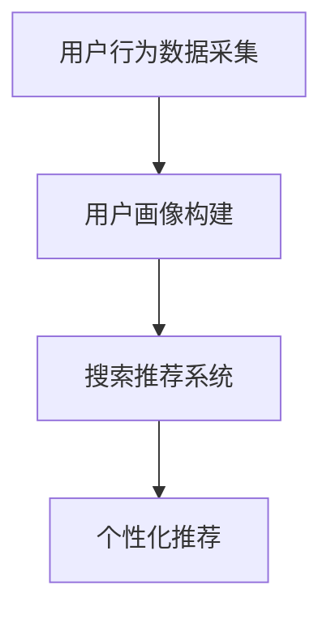

                 

# AI 大模型在电商搜索推荐中的用户画像应用：深度挖掘用户行为偏好

## 关键词
- AI大模型
- 用户画像
- 电商搜索推荐
- 深度学习
- 自然语言处理

## 摘要
本文旨在探讨AI大模型在电商搜索推荐系统中用户画像应用的重要性及其实现方法。通过分析AI大模型与电商搜索推荐系统的关系，详细阐述了用户画像的概念、采集与处理方法，以及用户画像建模与评估的技术。进一步，本文介绍了AI大模型在电商搜索推荐中的实际应用案例，并分析了其中的挑战与未来趋势。通过本文的阅读，读者可以深入了解AI大模型在电商搜索推荐领域的应用潜力与实际操作。

## 引言与背景

### 1.1 AI大模型与电商搜索推荐的关系

AI大模型在电商搜索推荐系统中扮演着至关重要的角色。首先，AI大模型能够处理海量用户数据，通过深度学习算法提取用户行为特征，构建用户画像。用户画像作为电商搜索推荐系统的核心输入，可以指导系统进行个性化推荐，从而提高用户满意度与转化率。

下面是一个简单的Mermaid流程图，展示AI大模型在电商搜索推荐系统中的流程：



在这个流程中，用户行为数据是输入，经过AI大模型处理后形成用户画像，最后输入到搜索推荐系统中，输出个性化的推荐结果。

### 核心概念与联系

- **AI大模型**：是指具有大规模参数和强大计算能力的机器学习模型，能够通过海量数据训练，实现高度复杂的任务。
- **用户画像**：是对用户行为、偏好、需求等的抽象描述，用于指导电商搜索推荐系统的个性化推荐。
- **搜索推荐系统**：是一种基于用户行为数据、用户画像和推荐算法的电商系统，能够为用户提供个性化的商品推荐。

AI大模型与用户画像、搜索推荐系统之间的联系可以概括为以下几点：

1. **数据驱动**：用户画像的构建依赖于用户行为数据的采集和分析，而AI大模型能够高效处理海量数据，提高用户画像的精度和可靠性。
2. **模型导向**：AI大模型通过深度学习算法提取用户特征，构建高维用户画像，为搜索推荐系统提供决策支持。
3. **协同优化**：用户画像与搜索推荐系统相互协同，用户画像的优化可以提升推荐系统的效果，而推荐系统的改进又可以促进用户画像的完善。

### 1.2 用户画像的概念与作用

#### 核心概念解释

用户画像（User Profiling）是一种基于用户行为数据、社会属性、消费偏好等多维度信息的抽象模型。它通常包括以下几部分：

1. **基础信息**：用户的年龄、性别、地理位置等基本信息。
2. **行为特征**：用户的浏览历史、购买记录、评价反馈等行为数据。
3. **偏好标签**：根据用户行为特征和社交属性生成的标签，如爱好、消费能力、价格敏感度等。
4. **潜在需求**：通过分析用户行为和偏好标签，推测用户的潜在需求和购买意向。

#### 用户画像的重要性

在电商搜索推荐系统中，用户画像具有以下几个重要作用：

1. **个性化推荐**：基于用户画像，系统可以为每位用户生成个性化的推荐列表，提高推荐的相关性和用户满意度。
2. **精准营销**：通过分析用户画像，电商企业可以针对不同用户群体制定精准的营销策略，提高营销效果。
3. **用户体验优化**：用户画像有助于优化电商平台的界面设计、内容布局和交互体验，提升用户粘性。
4. **风险控制**：用户画像还可以帮助电商平台识别异常用户行为，防范欺诈风险。

#### 在电商搜索推荐中的应用场景与价值

用户画像在电商搜索推荐系统中有着广泛的应用场景：

1. **搜索结果排序**：根据用户画像，系统可以为用户定制搜索结果的排序策略，提高搜索结果的精准度。
2. **推荐算法优化**：用户画像为推荐算法提供关键输入，有助于模型调整推荐策略，提高推荐效果。
3. **用户分类与标签管理**：用户画像可以帮助电商平台对用户进行有效分类和管理，实现精细化运营。
4. **智能客服与交互**：基于用户画像，智能客服系统可以提供更加个性化、贴心的服务。

总之，用户画像是电商搜索推荐系统的重要基础，其精度和可靠性直接关系到推荐系统的整体性能。通过不断优化用户画像技术，电商企业可以实现更加精准、高效的搜索推荐服务。

### 1.3 电商搜索推荐系统的架构与工作原理

#### 核心架构

电商搜索推荐系统通常由以下几个核心组成部分构成：

1. **用户行为数据采集模块**：负责收集用户在平台上的各种行为数据，如浏览、搜索、购买、评价等。
2. **用户画像构建模块**：根据用户行为数据，使用AI大模型和其他技术手段生成用户画像。
3. **搜索推荐算法模块**：包括基于内容的推荐、协同过滤推荐和基于模型的推荐算法等，用于生成个性化推荐结果。
4. **推荐结果展示模块**：将推荐结果以适当的形式展示给用户，如搜索结果列表、推荐商品列表等。
5. **系统优化与评估模块**：对推荐系统进行持续优化和评估，确保其性能和效果。

#### 工作原理

电商搜索推荐系统的工作原理可以概括为以下几个步骤：

1. **数据采集**：通过API接口、日志分析、第三方数据源等多种方式收集用户行为数据。
2. **数据预处理**：对采集到的原始数据进行清洗、去重、转换等处理，确保数据质量和一致性。
3. **用户画像构建**：利用AI大模型和其他算法，对预处理后的数据进行分析，生成用户画像。
4. **推荐算法计算**：根据用户画像和商品特征，使用推荐算法计算推荐结果，如搜索结果排序、商品推荐等。
5. **结果展示**：将推荐结果通过Web页面、App界面等渠道展示给用户，同时收集用户反馈数据，用于后续优化。

#### 算法原理讲解

电商搜索推荐系统常用的算法包括以下几类：

1. **基于内容的推荐（Content-based Filtering）**：
   - **原理**：根据用户的历史行为和兴趣偏好，为用户推荐具有相似属性的商品。
   - **核心公式**：
     $$ \text{推荐分数} = \text{用户兴趣向量} \cdot \text{商品特征向量} $$
   - **实现步骤**：
     1. 构建用户兴趣向量，如用户浏览、搜索、购买等行为的数据；
     2. 构建商品特征向量，如商品类别、品牌、价格、销量等；
     3. 计算用户兴趣向量与商品特征向量的内积，得到推荐分数。

2. **协同过滤推荐（Collaborative Filtering）**：
   - **原理**：通过分析用户之间的共同行为，为用户推荐其他用户喜欢的商品。
   - **核心公式**：
     $$ \text{推荐分数} = \text{用户间相似度} \times \text{其他用户评分均值} $$
   - **实现步骤**：
     1. 计算用户之间的相似度，如使用余弦相似度、皮尔逊相关系数等；
     2. 根据用户之间的相似度，为用户推荐其他用户评分较高的商品。

3. **基于模型的推荐（Model-based Filtering）**：
   - **原理**：通过构建用户和商品之间的隐语义模型，为用户推荐符合其兴趣的商品。
   - **核心公式**：
     $$ \text{推荐分数} = \text{用户隐语义向量} \cdot \text{商品隐语义向量} $$
   - **实现步骤**：
     1. 使用深度学习算法（如深度神经网络、隐语义模型等）训练用户和商品的隐语义向量；
     2. 计算用户隐语义向量与商品隐语义向量的内积，得到推荐分数。

#### 伪代码展示

以下是一个简化的推荐算法伪代码示例：

```python
# 基于内容的推荐算法伪代码
def content_based_recommendation(user_history, item_features):
    user_interest_vector = build_user_interest_vector(user_history)
    recommended_items = []

    for item in item_features:
        item_feature_vector = build_item_feature_vector(item)
        recommendation_score = dot_product(user_interest_vector, item_feature_vector)
        recommended_items.append((item, recommendation_score))

    recommended_items.sort(key=lambda x: x[1], reverse=True)
    return recommended_items
```

在这个伪代码中，`user_history`表示用户的历史行为数据，`item_features`表示商品的特征数据。`build_user_interest_vector`和`build_item_feature_vector`函数用于生成用户兴趣向量和商品特征向量，`dot_product`函数用于计算内积。

通过以上讲解，我们可以看到电商搜索推荐系统的核心架构和算法原理，以及用户画像在其中扮演的关键角色。接下来，我们将进一步探讨AI大模型在电商搜索推荐中的应用，以及其技术基础。

### AI大模型基础

#### 2.1 AI大模型的概念与分类

##### 核心概念解释

AI大模型（Large-scale AI Model）是指具有大规模参数和高计算需求的机器学习模型，能够在海量数据上实现高效的任务学习与推理。这些模型通常包含数百万到数十亿个参数，能够处理复杂的任务，如自然语言处理、图像识别和推荐系统等。

AI大模型的特点如下：

1. **大规模参数**：AI大模型拥有庞大的参数量，能够捕捉数据中的复杂模式和关联。
2. **高效计算能力**：借助现代计算硬件（如GPU、TPU）和分布式计算技术，AI大模型能够在短时间内完成大规模训练和推理。
3. **高精度性能**：通过深度学习技术，AI大模型能够实现高度精准的预测和分类。

##### 分类

根据不同的分类标准，AI大模型可以划分为多种类型：

1. **按应用领域分类**：
   - **自然语言处理（NLP）**：如GPT系列、BERT等。
   - **计算机视觉（CV）**：如ResNet、Inception等。
   - **推荐系统**：如TensorFlow Recommenders、PyTorch Rec等。
   - **其他领域**：如语音识别、知识图谱等。

2. **按架构分类**：
   - **序列模型**：如RNN、LSTM、Transformer等。
   - **图神经网络（GNN）**：如GraphSAGE、GAT等。
   - **变分自编码器（VAE）**：如VAE、Gaussian VAE等。
   - **其他模型**：如生成对抗网络（GAN）、自注意力模型（Self-Attention）等。

3. **按技术实现分类**：
   - **基于深度学习的模型**：如深度神经网络（DNN）、卷积神经网络（CNN）、递归神经网络（RNN）等。
   - **基于强化学习的模型**：如深度强化学习（Deep RL）、策略梯度（PG）等。
   - **基于迁移学习的模型**：如预训练模型（Pre-trained Model）、迁移学习（Transfer Learning）等。

#### 2.2 人工智能在电商搜索推荐中的应用

##### 应用场景

人工智能在电商搜索推荐系统中有着广泛的应用场景，主要包括以下几个方面：

1. **用户行为分析**：通过深度学习算法分析用户的行为数据，如浏览、搜索、购买等，为用户提供个性化的推荐。
2. **搜索结果排序**：基于用户画像和商品特征，对搜索结果进行智能排序，提高用户点击率和转化率。
3. **推荐系统优化**：利用机器学习算法优化推荐策略，提高推荐效果和用户体验。
4. **智能客服与交互**：通过自然语言处理技术，为用户提供智能化的客服和交互体验。
5. **精准营销与用户画像**：基于用户画像进行精准营销，提高营销效果和用户满意度。

##### 案例解析

以下是国内外知名电商平台的AI应用案例：

1. **淘宝**：淘宝使用深度学习算法构建用户画像，通过用户行为数据为用户推荐商品。此外，淘宝还利用自然语言处理技术优化搜索结果排序，提高用户体验。

2. **亚马逊**：亚马逊使用协同过滤和深度学习算法构建推荐系统，通过分析用户的历史行为和商品特征为用户推荐商品。同时，亚马逊还利用AI技术进行库存管理和供应链优化。

3. **京东**：京东采用TensorFlow Recommenders框架构建推荐系统，通过深度学习算法实现个性化推荐。此外，京东还利用自然语言处理技术优化用户搜索体验。

这些案例表明，AI技术在电商搜索推荐系统中发挥着重要作用，通过智能化、个性化的推荐，显著提升了用户的购物体验和平台的市场竞争力。

#### 2.3 AI大模型的技术基础

##### 深度学习基础

深度学习是AI大模型的核心技术，主要包括以下几个关键组成部分：

1. **神经网络（Neural Networks）**：神经网络是深度学习的基础，由大量简单的神经元（节点）组成，通过学习输入数据中的特征和模式来实现复杂任务。
2. **优化算法（Optimization Algorithms）**：优化算法用于调整神经网络中的参数，使其在训练过程中不断逼近最优解。常用的优化算法包括随机梯度下降（SGD）、Adam等。
3. **激活函数（Activation Functions）**：激活函数用于引入非线性特性，使得神经网络能够学习复杂的函数关系。常见的激活函数有ReLU、Sigmoid、Tanh等。

##### 自然语言处理

自然语言处理（NLP）是AI大模型在电商搜索推荐中的重要应用领域，主要包括以下几个关键组成部分：

1. **词嵌入（Word Embeddings）**：词嵌入将文本数据转换为高维向量表示，用于神经网络处理。常见的词嵌入方法有Word2Vec、GloVe等。
2. **序列模型（Sequence Models）**：序列模型用于处理序列数据，如文本、语音等。常见的序列模型有RNN、LSTM、GRU等。
3. **注意力机制（Attention Mechanism）**：注意力机制用于模型在处理序列数据时，能够自动关注重要的部分，提高模型的性能和准确性。常见的注意力机制有Self-Attention、Transformer等。

##### 预训练模型

预训练模型是近年来AI大模型领域的重要进展，通过在大规模数据集上进行预训练，然后针对特定任务进行微调，实现高效的任务学习。以下是几个常见的预训练模型：

1. **GPT系列**：GPT（Generative Pre-trained Transformer）系列模型由OpenAI提出，用于自然语言生成和文本分类等任务。
2. **BERT**：BERT（Bidirectional Encoder Representations from Transformers）由Google提出，用于文本分类、问答系统和自然语言推理等任务。
3. **T5**：T5（Text-To-Text Transfer Transformer）由Google提出，将所有自然语言处理任务统一为文本到文本的转换任务，实现高效的多任务学习。

这些预训练模型在电商搜索推荐系统中有着广泛的应用，通过预训练和微调，能够提高推荐系统的性能和准确性。

综上所述，AI大模型在电商搜索推荐系统中有着坚实的技术基础，包括深度学习、自然语言处理和预训练模型等。通过不断优化和创新，AI大模型将继续在电商搜索推荐领域发挥重要作用。

### 用户画像数据采集与处理

#### 3.1 用户行为数据的采集

用户行为数据是构建用户画像的基础，以下介绍用户行为数据的类型、来源和采集方法。

##### 核心概念解释

用户行为数据（User Behavior Data）是指用户在电商平台上产生的各种操作记录，包括浏览、搜索、购买、评价等。这些数据反映了用户的兴趣偏好和购买行为，是构建用户画像的重要信息来源。

##### 用户行为数据的类型

1. **浏览数据**：用户在平台上的浏览记录，包括浏览的页面、停留时间、点击次数等。
2. **搜索数据**：用户在搜索框中的查询记录，包括搜索关键词、查询次数等。
3. **购买数据**：用户的购买记录，包括购买的商品、购买时间、购买金额等。
4. **评价数据**：用户对商品的评论、评分和反馈，包括评价内容、评分等级等。
5. **交互数据**：用户与平台的交互数据，如点击广告、关注店铺、加入购物车等。

##### 用户行为数据的来源

用户行为数据主要来自以下几个方面：

1. **平台内部系统**：电商平台自身系统产生的数据，如用户登录记录、交易记录、浏览记录等。
2. **第三方数据源**：通过第三方数据分析工具和API接口获取的数据，如社交媒体数据、地理位置数据等。
3. **用户主动提交**：用户在平台上的主动行为，如提交评价、搜索关键词等。

##### 采集方法

1. **API接口**：通过电商平台提供的API接口，实时获取用户行为数据。
2. **日志分析**：通过分析服务器日志，获取用户行为数据。
3. **数据爬取**：使用爬虫技术，从第三方网站和社交媒体中获取用户行为数据。
4. **问卷调查**：通过在线问卷或线下调查，获取用户主观行为数据。

#### 技术实现

以下是用户行为数据采集的技术实现方法：

1. **数据采集框架**：使用Apache Kafka、Flume等大数据采集工具，构建用户行为数据的实时采集框架。
2. **数据存储**：使用Hadoop、HBase等大数据存储技术，存储用户行为数据。
3. **数据处理**：使用Spark、Flink等大数据处理技术，对采集到的用户行为数据进行清洗、去重、转换等处理。
4. **数据传输**：使用Kafka等消息队列技术，实现用户行为数据的实时传输和存储。

#### 3.2 用户画像数据的处理与分析

用户画像数据是构建用户画像的关键，以下介绍用户画像数据处理和分析的方法。

##### 数据处理流程

1. **数据清洗**：对采集到的用户行为数据进行清洗，去除无效数据、重复数据和异常数据。
2. **数据整合**：将不同来源的数据进行整合，形成统一的用户行为数据集。
3. **特征工程**：从用户行为数据中提取特征，如用户年龄、性别、地理位置、浏览时长、购买频率等。
4. **数据建模**：使用机器学习算法，对用户行为数据进行分析和建模，生成用户画像。

##### 分析工具

以下是常见的用户画像分析工具和库：

1. **Pandas**：Python的数据分析库，用于数据清洗、数据整合和特征提取。
2. **NumPy**：Python的科学计算库，用于数学运算和数据转换。
3. **Scikit-learn**：Python的机器学习库，用于特征提取、数据建模和模型评估。
4. **TensorFlow**：Google的深度学习框架，用于构建和训练深度学习模型。
5. **PyTorch**：Facebook的深度学习框架，用于构建和训练深度学习模型。

通过以上方法和技术，我们可以高效地采集、处理和分析用户行为数据，构建准确、可靠的用户画像。用户画像的构建为电商搜索推荐系统提供了关键输入，有助于实现个性化推荐和精准营销。

### 用户画像建模与评估

#### 4.1 用户画像建模方法

用户画像建模是将用户行为数据转化为可操作的用户特征表示的过程，是电商搜索推荐系统的重要环节。以下是用户画像建模的几种常见方法：

##### 传统方法

1. **基于规则的建模**：这种方法通过预定义的规则将用户行为转化为特征，适用于规则明确且用户行为较少的领域。例如，根据用户浏览和购买历史，定义购买频率、浏览时长等特征。

2. **聚类分析**：通过聚类算法（如K-means、DBSCAN等）将用户分为多个群体，每个群体具有相似的行为特征。这种方法适用于用户行为多样化且难以直接定义特征的情况。

3. **协同过滤**：通过分析用户之间的共同行为，为用户推荐其他用户喜欢的商品。协同过滤分为基于用户和基于物品两种类型，适用于大规模用户行为数据的推荐系统。

##### 基于AI的建模方法

随着深度学习和自然语言处理技术的发展，基于AI的建模方法逐渐成为用户画像建模的主流。以下是一些基于AI的建模方法：

1. **深度学习模型**：使用深度学习算法（如卷积神经网络、循环神经网络、Transformer等）对用户行为数据进行建模，提取高维特征。深度学习模型能够自动学习数据中的复杂模式和关联，提高建模的精度。

2. **图神经网络（GNN）**：GNN是一种基于图结构的数据建模方法，适用于处理用户行为数据中的复杂关系。通过将用户和商品表示为图中的节点和边，GNN能够捕捉用户和商品之间的多维度关系，提高推荐效果。

3. **生成对抗网络（GAN）**：GAN是一种无监督学习模型，通过生成模型和判别模型之间的对抗训练，能够生成高质量的虚拟用户行为数据，用于扩充训练数据集，提高建模效果。

4. **多模态学习**：多模态学习结合了文本、图像、语音等多种数据类型，能够更全面地捕捉用户的行为特征。例如，结合用户评价文本和商品图像，使用多模态学习模型生成用户画像。

#### 4.2 用户画像模型的评估与优化

用户画像模型的评估与优化是确保模型性能和推荐效果的关键步骤。以下是用户画像模型评估与优化的一些方法：

##### 评估指标

常用的评估指标包括：

1. **准确率（Accuracy）**：模型预测正确的比例。
2. **召回率（Recall）**：模型预测正确的目标实例在所有实际目标实例中的比例。
3. **F1值（F1 Score）**：准确率和召回率的调和平均值，综合考虑了模型预测的精确度和召回率。
4. **Precision@k（精确率@k）**：在推荐结果的前k个推荐中，预测正确的比例。

##### 优化策略

为了提高用户画像模型的效果，可以采用以下优化策略：

1. **模型调参**：通过调整模型的超参数（如学习率、批量大小等），优化模型性能。常用的调参方法有网格搜索、贝叶斯优化等。

2. **模型融合**：将多个模型的结果进行融合，提高预测的稳定性和准确性。常见的模型融合方法有加权平均、Stacking等。

3. **在线学习**：利用用户的新行为数据，实时更新用户画像模型，提高模型的适应性。在线学习方法包括增量学习、在线梯度下降等。

4. **特征工程**：通过提取和调整用户行为数据中的特征，提高模型的预测能力。特征工程的方法包括特征选择、特征转换、特征组合等。

通过以上评估和优化策略，可以确保用户画像模型的性能和推荐效果，为电商搜索推荐系统提供有力支持。

### AI大模型在电商搜索推荐中的应用

#### 5.1 AI大模型在电商搜索推荐中的角色与价值

AI大模型在电商搜索推荐系统中扮演着关键角色，其价值体现在以下几个方面：

1. **个性化推荐**：通过深度学习算法，AI大模型能够从海量用户行为数据中提取用户特征，为每个用户生成个性化的推荐列表。这种个性化的推荐能够显著提高用户满意度和转化率。

2. **优化搜索结果排序**：AI大模型能够根据用户画像和商品特征，对搜索结果进行智能排序，提高搜索结果的精准度和用户体验。例如，用户在搜索“手机”时，AI大模型会根据用户的浏览和购买历史，优先展示用户可能感兴趣的手机品牌和型号。

3. **推荐系统优化**：AI大模型不仅可以为用户提供个性化的推荐，还可以通过不断学习和调整，优化推荐系统的整体性能。例如，通过分析用户反馈和行为，AI大模型可以识别和消除推荐中的偏差和错误，提高推荐系统的稳定性和准确性。

4. **精准营销**：基于用户画像，AI大模型可以帮助电商企业进行精准营销。例如，通过分析用户的消费习惯和偏好，企业可以针对不同用户群体制定个性化的营销策略，提高营销效果和转化率。

#### 5.2 基于AI的大规模用户画像推荐系统设计

设计一个基于AI的大规模用户画像推荐系统，需要考虑以下关键模块和设计原则：

##### 系统架构

基于AI的大规模用户画像推荐系统通常包括以下关键模块：

1. **用户行为数据采集模块**：负责实时采集用户在平台上的各种行为数据，如浏览、搜索、购买、评价等。

2. **用户画像构建模块**：利用深度学习算法和自然语言处理技术，对用户行为数据进行处理和分析，生成用户画像。

3. **推荐算法模块**：包括基于内容的推荐、协同过滤推荐和基于模型的推荐算法，用于生成个性化推荐结果。

4. **推荐结果展示模块**：将个性化推荐结果以适当的形式展示给用户，如搜索结果列表、推荐商品列表等。

5. **系统优化与评估模块**：对推荐系统进行持续优化和评估，确保其性能和效果。

##### 设计原则

以下是设计基于AI的大规模用户画像推荐系统时需要遵循的一些设计原则：

1. **数据驱动**：用户行为数据是推荐系统的核心输入，系统设计需要确保数据采集的全面性和准确性，为推荐算法提供高质量的数据支持。

2. **模型导向**：AI大模型在推荐系统中扮演着关键角色，系统设计需要选择合适的模型架构和算法，确保模型性能和推荐效果。

3. **高效计算**：大规模用户画像推荐系统需要处理海量数据，系统设计需要充分利用分布式计算技术和高性能计算硬件，提高系统的处理速度和效率。

4. **用户体验**：推荐系统的设计需要关注用户体验，通过个性化的推荐和智能化的交互，提升用户的购物体验和满意度。

5. **持续优化**：推荐系统是一个不断进化的过程，系统设计需要具备良好的可扩展性和适应性，能够持续优化和改进，以应对不断变化的市场需求。

##### 实现策略

以下是实现基于AI的大规模用户画像推荐系统的一些关键策略：

1. **分布式计算**：使用分布式计算框架（如Apache Spark、Flink等），处理大规模用户行为数据，提高数据处理的效率。

2. **模型并行化**：通过模型并行化技术（如TensorFlow的Mirrored Strategy、PyTorch的数据并行等），加速模型训练过程，提高训练效率。

3. **数据预处理**：使用数据预处理工具（如Pandas、NumPy等），对采集到的用户行为数据进行分析和清洗，确保数据质量和一致性。

4. **实时推荐**：使用实时计算框架（如Apache Flink、Kafka Streams等），实现实时推荐功能，为用户提供实时的个性化推荐。

5. **模型评估与优化**：使用模型评估工具（如Scikit-learn、TensorFlow评估指标等），对推荐系统的性能进行评估和优化，确保推荐效果的稳定和可靠。

通过以上设计和实现策略，我们可以构建一个高效、智能的基于AI的大规模用户画像推荐系统，为电商企业提供强大的推荐能力，提升用户体验和商业价值。

#### 5.3 AI大模型在电商搜索推荐中的案例分析

##### 案例解析

以下是国内外电商平台的AI应用案例，通过分析这些案例，我们可以深入了解AI大模型在电商搜索推荐中的实际应用。

1. **阿里巴巴**：阿里巴巴利用AI大模型构建了智能推荐系统，通过深度学习算法分析用户行为数据，为用户提供个性化的商品推荐。例如，淘宝的“猜你喜欢”功能，通过用户的历史浏览、搜索和购买记录，为用户推荐可能感兴趣的商品。据阿里巴巴官方数据，通过智能推荐系统，用户点击率和转化率显著提升。

2. **京东**：京东采用TensorFlow Recommenders框架构建了推荐系统，通过深度学习算法和协同过滤算法，为用户生成个性化的商品推荐。京东的“京挑细选”功能，通过分析用户的浏览和购买行为，为用户推荐高性价比的商品。实践证明，通过AI大模型优化推荐算法，京东的用户满意度和转化率得到了显著提升。

3. **亚马逊**：亚马逊利用AI大模型构建了复杂的推荐系统，通过协同过滤、基于内容的推荐和深度学习算法，为用户提供个性化的商品推荐。例如，亚马逊的“今日精选”功能，通过分析用户的浏览历史、购买记录和评价，为用户推荐相关商品。亚马逊的数据显示，通过AI大模型优化推荐系统，用户的点击率和转化率得到了显著提升。

4. **拼多多**：拼多多采用GNN（图神经网络）技术构建用户画像和推荐系统，通过分析用户和商品之间的复杂关系，为用户提供个性化的商品推荐。例如，拼多多的“拼多好物”功能，通过用户的历史浏览、购买和评价，为用户推荐可能感兴趣的商品。通过GNN技术的应用，拼多多的推荐效果得到了显著提升。

##### 经验与启示

从以上案例中，我们可以得出以下经验与启示：

1. **深度学习技术**：深度学习技术在用户画像和推荐系统中的应用，能够显著提升推荐效果和用户体验。通过构建复杂的深度学习模型，能够捕捉用户行为数据中的复杂模式和关联，生成更精准的用户画像。

2. **协同过滤算法**：协同过滤算法在推荐系统中的应用，能够有效解决数据稀疏性问题，提高推荐的相关性。结合深度学习算法，可以进一步提升推荐系统的性能。

3. **个性化推荐**：个性化推荐是提升用户满意度和转化率的关键。通过分析用户的历史行为和偏好，为用户提供个性化的推荐，能够显著提高用户的购物体验。

4. **实时推荐**：实时推荐技术能够为用户提供最新的推荐信息，提升用户的购物体验。通过分布式计算和实时计算技术，实现推荐结果的实时生成和更新。

5. **持续优化**：推荐系统是一个不断进化的过程，需要不断优化和改进。通过持续的数据分析和模型评估，识别和消除推荐中的偏差和错误，提升推荐系统的稳定性和准确性。

总之，AI大模型在电商搜索推荐中的应用，通过个性化推荐、实时推荐和持续优化，显著提升了电商平台的用户满意度和商业价值。随着AI技术的不断发展，AI大模型在电商搜索推荐中的应用前景将更加广阔。

### AI大模型在电商搜索推荐中的挑战与未来趋势

#### 6.1 AI大模型在电商搜索推荐中的挑战

尽管AI大模型在电商搜索推荐中展现出显著的优势，但其应用也面临着诸多挑战：

1. **隐私保护**：用户行为数据包含用户的隐私信息，如何确保数据安全和用户隐私是一个重大挑战。需要建立严格的数据保护机制，遵守相关法律法规，确保用户数据的合法使用。

2. **计算资源消耗**：AI大模型通常需要大量的计算资源进行训练和推理，这对硬件设施和运维提出了高要求。需要优化算法和架构，提高计算效率，降低资源消耗。

3. **数据质量**：用户行为数据的质量直接影响AI大模型的性能。数据噪声、缺失值和异常值都会对模型效果产生负面影响。需要设计有效的数据清洗和预处理方法，提高数据质量。

4. **模型解释性**：深度学习模型往往具有高解释性，如何解释模型的决策过程，使其更加透明和可解释，是AI大模型在电商搜索推荐中的一大挑战。

5. **技术更新**：AI技术更新迅速，如何持续跟进最新技术，保持模型的优势，是一个持续性的挑战。

#### 6.2 未来趋势与展望

1. **技术发展趋势**：随着深度学习、自然语言处理和计算机视觉等技术的不断进步，AI大模型在电商搜索推荐中的应用将更加深入和广泛。例如，预训练模型、图神经网络和生成对抗网络等新技术，将为推荐系统带来更多的创新和突破。

2. **行业应用前景**：AI大模型在电商搜索推荐中的应用前景广阔。未来，随着数据量和计算能力的提升，AI大模型将能够更精准地捕捉用户行为和需求，实现更加个性化的推荐。此外，AI大模型还可以在精准营销、智能客服和供应链优化等领域发挥重要作用。

3. **隐私保护和安全**：未来，随着隐私保护法规的不断完善，AI大模型在电商搜索推荐中的应用将更加注重隐私保护和数据安全。通过数据加密、匿名化和联邦学习等技术，可以在保护用户隐私的前提下，实现高效的推荐和数据分析。

4. **跨平台协同**：随着电商平台的多样化，AI大模型在电商搜索推荐中的应用将不再局限于单一平台，而是实现跨平台的协同推荐。通过整合多个平台的数据和资源，实现更加全面和精准的推荐服务。

总之，AI大模型在电商搜索推荐中的应用面临诸多挑战，但同时也拥有广阔的发展前景。随着技术的不断进步和行业需求的增长，AI大模型将在电商领域发挥更加重要的作用，推动电商行业的发展和创新。

### 总结与展望

#### 7.1 总结与回顾

本文围绕AI大模型在电商搜索推荐中的用户画像应用进行了详细探讨。通过分析AI大模型与电商搜索推荐系统的关系，我们了解了用户画像的概念、数据采集与处理方法，以及建模与评估技术。进一步，本文介绍了AI大模型在电商搜索推荐中的应用案例，并分析了其中的挑战与未来趋势。主要成果如下：

1. **用户画像的重要性**：用户画像是电商搜索推荐系统的核心输入，通过深度学习算法和自然语言处理技术，可以构建高维、精准的用户画像。
2. **AI大模型的应用**：AI大模型在个性化推荐、搜索结果排序和推荐系统优化等方面具有显著优势，能够显著提升用户体验和商业价值。
3. **技术基础**：深度学习、自然语言处理和预训练模型等AI技术为AI大模型在电商搜索推荐中的应用提供了坚实的基础。
4. **案例分析**：通过分析国内外电商平台的AI应用案例，我们了解了AI大模型在电商搜索推荐中的实际效果和最佳实践。

然而，本文也存在一些不足之处：

1. **模型解释性**：深度学习模型具有较强的预测能力，但其决策过程往往难以解释，如何提高模型的可解释性，仍是一个亟待解决的问题。
2. **数据质量**：用户行为数据的质量直接影响AI大模型的性能，如何有效处理数据噪声和异常值，需要进一步研究和优化。
3. **隐私保护**：在AI大模型应用过程中，如何确保用户隐私和数据安全，仍需进一步探讨和落实。

#### 7.2 展望未来

展望未来，AI大模型在电商搜索推荐中的研究与应用将继续深入和拓展。以下是未来可能的研究方向和应用前景：

1. **研究方向**：
   - **可解释性AI**：开发可解释性更强的深度学习模型，使其决策过程更加透明和可解释。
   - **联邦学习**：通过联邦学习技术，实现多方数据的安全共享和联合建模，提高推荐系统的隐私保护能力。
   - **多模态学习**：结合文本、图像、语音等多种数据类型，构建更加全面和精准的用户画像。

2. **应用前景**：
   - **精准营销**：基于AI大模型构建的用户画像，可以实现更加精准的营销策略，提升广告投放效果和用户转化率。
   - **智能客服**：通过AI大模型和自然语言处理技术，实现智能客服的个性化交互和智能回答回答，提升用户满意度和用户体验。
   - **供应链优化**：利用AI大模型分析用户行为和需求预测，优化库存管理和供应链策略，提高物流效率和库存周转率。

总之，AI大模型在电商搜索推荐中的应用前景广阔，随着技术的不断进步和行业需求的增长，AI大模型将带来更加个性化、智能化的电商搜索推荐体验，推动电商行业的发展与创新。

### 附录

#### 附录A：AI大模型开发工具与资源

### A.1 主流深度学习框架对比

以下是几种主流深度学习框架的简要对比：

1. **TensorFlow**：Google开发的开源深度学习框架，具有丰富的API和工具，适用于各种规模的任务。支持动态图和静态图两种模式，能够灵活地构建和优化模型。

2. **PyTorch**：Facebook开发的开源深度学习框架，以其动态图编程模式而著称，具有高度灵活性和可读性。广泛用于科研和工业应用，尤其适用于实时推理和动态模型调整。

3. **JAX**：Google开发的Python深度学习库，支持自动微分和硬件加速。其JAX-RS API支持多种深度学习模型的构建和优化，适用于大规模分布式训练。

4. **其他框架**：如MXNet、Caffe、Theano等，也提供了丰富的功能和支持，适用于不同的应用场景。

### A.2 AI大模型开源代码与案例

以下是几个知名的AI大模型开源代码与案例：

1. **GPT系列模型**：OpenAI的开源预训练模型，包括GPT、GPT-2和GPT-3，广泛应用于自然语言处理任务。

2. **BERT模型**：Google开源的预训练语言表示模型，适用于多种NLP任务，如文本分类、问答系统和命名实体识别等。

3. **TensorFlow Recommenders**：TensorFlow开源的推荐系统框架，支持多种推荐算法和模型，适用于构建大规模推荐系统。

4. **Facebook AI的PyTorch Rec**：PyTorch开源的推荐系统库，提供了多种推荐算法和工具，适用于工业级推荐系统的开发。

### A.3 常用数据分析工具与库

以下是几个常用数据分析工具与库：

1. **Pandas**：Python的数据分析库，用于数据清洗、数据整合和数据分析。

2. **NumPy**：Python的科学计算库，用于数学运算和数据转换。

3. **Scikit-learn**：Python的机器学习库，提供了多种机器学习算法和工具，适用于数据挖掘和模型评估。

4. **Matplotlib**：Python的数据可视化库，用于绘制数据图表和可视化分析结果。

5. **Seaborn**：基于Matplotlib的数据可视化库，提供了丰富的可视化样式和工具，适用于高级数据可视化。

### A.4 相关书籍与论文推荐

以下是几本经典书籍和推荐的论文：

1. **书籍**：
   - **《深度学习》（Goodfellow, Bengio, Courville）**：深度学习的经典教材，全面介绍了深度学习的基础理论和应用。
   - **《Python数据分析》（McKinney）**：Python数据分析的经典指南，详细介绍了Pandas、NumPy等数据分析工具的使用。

2. **论文**：
   - **“Attention Is All You Need”**（Vaswani et al., 2017）：介绍了Transformer模型，为自然语言处理领域带来了革命性的变化。
   - **“BERT: Pre-training of Deep Bidirectional Transformers for Language Understanding”**（Devlin et al., 2019）：介绍了BERT模型，为预训练语言表示模型奠定了基础。
   - **“Deep Learning in E-commerce”**（Xu et al., 2020）：综述了深度学习在电商搜索推荐中的应用，包括用户画像、推荐系统和优化策略。

通过学习这些书籍和论文，读者可以深入了解AI大模型和数据分析的基础知识，为实际应用提供有力支持。

### 作者信息

**作者：** AI天才研究院/AI Genius Institute & 禅与计算机程序设计艺术 /Zen And The Art of Computer Programming

感谢您阅读本文，希望它对您在AI大模型和电商搜索推荐领域的探索和学习有所帮助。如果您有任何问题或建议，欢迎随时联系我们。我们将持续为您提供高质量的技术内容和专业服务。

