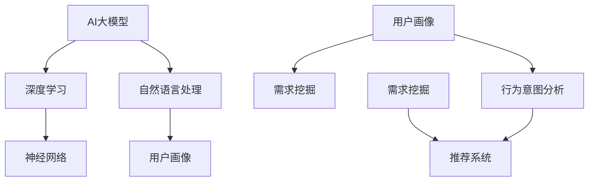

                 

### 文章标题：AI大模型在电商搜索推荐中的用户画像应用：深度挖掘用户需求与行为意图

#### 关键词：AI大模型、电商搜索推荐、用户画像、需求挖掘、行为意图分析

##### 摘要：
本文将探讨AI大模型在电商搜索推荐系统中的应用，特别是如何通过用户画像来深度挖掘用户需求与行为意图。文章首先介绍了AI大模型的基本概念和电商搜索推荐的重要性，随后详细阐述了用户画像的构建方法及其在挖掘用户需求与行为意图方面的应用。通过具体案例展示，本文展示了AI大模型如何提升电商搜索推荐的精准度和用户体验，并探讨了未来发展的挑战与趋势。文章末尾附有相关工具与资源的详细介绍，以及核心概念与联系、数学模型讲解和项目实战等内容，为读者提供了全面的指导和参考。

### 第一部分：AI大模型与电商搜索推荐概述

#### 第1章：AI大模型概述

##### 1.1 AI大模型的基本概念
AI大模型（Large-scale Artificial Intelligence Models）是指那些能够处理海量数据并具有高度复杂性的深度学习模型。它们通常具有数百万甚至数十亿个参数，能够从数据中自动提取特征，进行复杂的模式识别和预测。AI大模型的发展可以追溯到20世纪80年代的神经网络研究，但真正实现突破是在近年来，得益于计算能力的提升、数据量的爆炸性增长和高效算法的发展。

###### AI大模型的发展历程
- **1980s-1990s**：神经网络的研究初步开展，但受限于计算能力和数据资源，进展缓慢。
- **2006年**：Hinton提出了深度信念网络（DBN），标志着深度学习的复兴。
- **2012年**：AlexNet在ImageNet竞赛中取得突破性成绩，深度学习开始受到广泛关注。
- **2016年**：谷歌的BERT模型发布，标志着自然语言处理领域的重要进展。

###### AI大模型的核心技术
- **深度神经网络（Deep Neural Networks, DNN）**：通过多层神经元结构，能够自动提取数据中的高阶特征。
- **卷积神经网络（Convolutional Neural Networks, CNN）**：在图像处理领域表现突出，通过卷积操作提取空间特征。
- **递归神经网络（Recurrent Neural Networks, RNN）**：适用于序列数据处理，如时间序列预测和自然语言处理。
- **变分自编码器（Variational Autoencoder, VAE）**：在生成模型和特征提取方面有广泛应用。

##### 1.2 电商搜索推荐概述
电商搜索推荐是电子商务中至关重要的一环，它通过智能算法为用户推荐符合其兴趣和需求的商品，从而提高用户满意度和销售额。

###### 电商搜索推荐的重要性
- **提升用户体验**：个性化推荐能够满足用户的特定需求，提升用户购物体验。
- **增加销售额**：通过精准推荐，可以促进用户购买更多商品，增加电商平台的收入。
- **提高用户留存率**：推荐系统能够持续吸引用户，提高用户的粘性。

###### 电商搜索推荐的基本流程
1. **用户行为数据收集**：收集用户在平台上的浏览、搜索、购买等行为数据。
2. **数据预处理**：对数据进行清洗、去重、转换等处理，使其适合模型训练。
3. **用户画像构建**：根据用户行为数据和基础信息，构建用户画像。
4. **推荐算法选择与优化**：选择合适的推荐算法，如协同过滤、基于内容的推荐、深度学习推荐等，并进行模型优化。
5. **推荐结果输出**：将推荐结果展示给用户，如搜索结果页面的排序、商品推荐等。

#### 第2章：AI大模型在电商搜索推荐中的应用

##### 2.1 用户画像的基本概念
用户画像（User Profile）是电商搜索推荐系统中的核心要素，它通过整合用户的行为数据、基础信息等多维度数据，形成对用户个性化需求的全面描述。

###### 用户画像的定义
用户画像是一个多维度的数据模型，它通过描述用户的基本属性、兴趣爱好、行为特征等，构建出一个全面、个性化的用户轮廓。

###### 用户画像的构建方法
1. **基础信息采集**：包括用户的年龄、性别、地理位置、职业等基本信息。
2. **行为数据采集**：包括用户的浏览、搜索、购买等行为数据。
3. **特征提取与融合**：从行为数据和基础信息中提取有意义的特征，并进行融合处理。
4. **数据预处理**：对采集到的数据进行清洗、去重、归一化等处理。
5. **模型训练与预测**：利用机器学习算法，如聚类、协同过滤等，训练用户画像模型。

##### 2.2 用户需求与行为意图的深度挖掘
用户需求与行为意图的深度挖掘是电商搜索推荐系统的关键，它通过分析用户的行为数据，准确预测用户的需求和意图，从而实现个性化推荐。

###### 用户需求的分类
1. **显性需求**：用户主动表达的需求，如搜索关键词、浏览的商品等。
2. **隐性需求**：用户潜在的需求，需要通过数据分析进行挖掘，如用户未表达的兴趣爱好。

###### 用户行为意图的分析方法
1. **基于历史行为的预测**：通过分析用户的历史行为数据，预测用户未来的行为和需求。
2. **基于上下文的预测**：结合用户当前的行为和上下文环境，预测用户的需求和意图。
3. **深度学习模型**：利用深度学习模型，如RNN、CNN等，对用户行为数据进行建模，提取用户的需求和意图。

### 第二部分：AI大模型在电商搜索推荐中的具体应用

#### 第3章：基于AI大模型的用户画像构建

##### 3.1 数据收集与预处理
用户画像的构建依赖于大量的数据，这些数据包括用户的基础信息、行为数据等。数据的收集与预处理是构建用户画像的第一步，其质量直接影响用户画像的准确性和可靠性。

###### 用户行为数据的收集
1. **浏览数据**：用户在平台上的浏览记录，包括访问的页面、停留时间等。
2. **搜索数据**：用户在平台上的搜索记录，包括搜索关键词、搜索时间等。
3. **购买数据**：用户在平台上的购买记录，包括购买的商品、购买时间、价格等。

###### 数据预处理方法
1. **数据清洗**：去除重复、无效和错误的数据。
2. **数据归一化**：将不同特征的数据进行归一化处理，使其具有相同的尺度。
3. **特征提取**：从原始数据中提取有意义的特征，如用户的兴趣标签、行为模式等。

##### 3.2 特征工程
特征工程是用户画像构建的核心环节，它通过选择和构建有效的特征，提升模型的预测性能。

###### 特征提取方法
1. **用户基本信息特征**：如年龄、性别、地理位置等。
2. **行为特征**：如浏览时长、购买频率、搜索关键词等。
3. **社会网络特征**：如用户的社交关系、评论等。

###### 特征选择方法
1. **相关性分析**：选择与目标变量相关性较高的特征。
2. **维度约减**：如主成分分析（PCA）、特征选择算法等，减少特征维度。
3. **交叉验证**：通过交叉验证选择最优特征组合。

##### 3.3 模型构建与优化
构建和优化用户画像模型是用户画像构建的关键步骤，其目标是通过模型对用户需求和行为意图进行准确预测。

###### 模型选择
1. **深度学习模型**：如RNN、CNN等，适用于处理复杂的序列数据和图像数据。
2. **传统机器学习模型**：如随机森林、支持向量机等，适用于特征较少的场景。
3. **混合模型**：结合深度学习和传统机器学习模型，发挥各自的优势。

###### 模型训练与优化
1. **数据集划分**：将数据集划分为训练集、验证集和测试集。
2. **模型训练**：使用训练集对模型进行训练。
3. **模型评估**：使用验证集评估模型的性能。
4. **模型优化**：通过调整模型参数、特征选择等手段，优化模型性能。

#### 第4章：用户需求与行为意图的深度挖掘

##### 4.1 用户需求的深度学习模型
深度学习模型在用户需求挖掘中具有显著优势，能够自动提取数据中的高阶特征，进行复杂的模式识别和预测。

###### 伪代码讲解
```python
def user需求分析(data):
    # 初始化模型
    model = create_model()
    
    # 数据预处理
    data = preprocess_data(data)
    
    # 训练模型
    model.fit(data)
    
    # 预测用户需求
    predictions = model.predict(data)
    
    # 返回预测结果
    return predictions
```

###### 数学模型讲解
用户需求的深度学习模型可以表示为：
$$
\text{用户需求} = \text{f}(\text{用户画像}, \text{历史行为})
$$
其中，$f$ 是深度学习模型，它通过输入用户画像和历史行为数据，输出用户需求的预测结果。

##### 4.2 用户行为意图的分析模型
用户行为意图的分析模型同样基于深度学习，通过对用户行为的建模，预测用户的下一步行为或需求。

###### 伪代码讲解
```python
def user行为意图分析(data):
    # 初始化模型
    model = create_model()
    
    # 数据预处理
    data = preprocess_data(data)
    
    # 训练模型
    model.fit(data)
    
    # 预测用户行为意图
    predictions = model.predict(data)
    
    # 返回预测结果
    return predictions
```

###### 数学模型讲解
用户行为意图的分析模型可以表示为：
$$
\text{用户行为意图} = \text{g}(\text{用户画像}, \text{当前行为})
$$
其中，$g$ 是深度学习模型，它通过输入用户画像和当前行为数据，输出用户行为意图的预测结果。

#### 第5章：AI大模型在电商搜索推荐中的应用案例

##### 5.1 案例一：个性化搜索推荐
个性化搜索推荐通过AI大模型对用户需求和行为意图的深度挖掘，为用户提供高度个性化的搜索结果。

###### 案例描述
在某个电商平台上，用户A最近经常浏览运动鞋和篮球装备，同时在搜索栏中多次搜索“篮球鞋”。系统通过AI大模型对用户A的行为数据进行挖掘，预测其可能感兴趣的商品，并将这些商品优先展示在搜索结果页面上。

###### 模型构建与优化
1. **用户画像构建**：通过用户A的浏览、搜索和购买行为数据，构建其个性化用户画像。
2. **深度学习模型训练**：使用RNN模型对用户A的历史行为数据进行分析，提取用户兴趣特征。
3. **搜索结果排序**：结合用户兴趣特征和商品信息，使用协同过滤算法对搜索结果进行排序，优先展示用户可能感兴趣的商品。

##### 5.2 案例二：基于用户行为的广告投放
基于用户行为的广告投放通过AI大模型对用户需求的深度挖掘，提高广告投放的精准度和转化率。

###### 案例描述
在某个电商平台上，用户B在浏览商品时，系统通过AI大模型分析用户B的浏览和搜索行为，预测其可能感兴趣的商品类别，并在用户B浏览其他页面时，展示与这些商品相关的广告。

###### 模型构建与优化
1. **用户画像构建**：通过用户B的浏览、搜索和购买行为数据，构建其个性化用户画像。
2. **深度学习模型训练**：使用CNN模型对用户B的历史行为数据进行分析，提取用户兴趣特征。
3. **广告投放策略**：结合用户兴趣特征和广告资源，使用协同过滤算法进行广告投放，提高广告的曝光率和点击率。

### 第6章：AI大模型在电商搜索推荐中的挑战与未来发展

##### 6.1 挑战与问题
尽管AI大模型在电商搜索推荐中展现了强大的应用潜力，但其在实际应用过程中仍面临诸多挑战。

###### 数据隐私保护
用户数据的安全和隐私保护是AI大模型在电商搜索推荐中必须解决的重要问题。数据泄露和隐私侵犯可能导致用户信任危机，影响电商平台的声誉和用户忠诚度。

###### 模型可解释性
AI大模型，尤其是深度学习模型，通常被视为“黑箱”，其决策过程难以解释和理解。这限制了模型在实际应用中的透明度和可靠性，特别是在涉及用户隐私和重要决策的领域。

##### 6.2 未来发展趋势
随着AI技术的不断进步，AI大模型在电商搜索推荐中的应用前景十分广阔。

###### 新技术的应用
- **联邦学习（Federated Learning）**：通过分布式计算，提高数据隐私保护能力，同时实现模型协同训练。
- **图神经网络（Graph Neural Networks, GNN）**：在处理复杂数据关系和图数据方面具有优势，有助于提高推荐系统的精度和效率。

###### 行业应用前景
- **个性化推荐**：通过深度挖掘用户需求和偏好，实现更精准的个性化推荐。
- **智能客服**：利用AI大模型进行智能对话生成和情感分析，提高客户服务质量和效率。
- **智能营销**：基于用户画像和行为分析，实现更有效的广告投放和营销策略。

### 第三部分：附录

##### 第7章：AI大模型开发工具与资源

###### 7.1 主流深度学习框架对比
在AI大模型开发中，选择合适的深度学习框架至关重要。以下是几个主流深度学习框架的对比：

| 框架         | 特点                                           | 应用领域             |
| ------------ | ---------------------------------------------- | --------------------- |
| TensorFlow   | 开源、支持多种编程语言、广泛社区支持           | 图像、语音、自然语言处理 |
| PyTorch      | 动态图计算、灵活的模型构建、广泛社区支持       | 图像、语音、自然语言处理 |
| Keras       | 高级API、简化模型构建、基于TensorFlow和Theano  | 图像、语音、自然语言处理 |
| MXNet       | 高性能计算、支持多种编程语言、阿里云支持       | 图像、语音、自然语言处理 |

###### 7.2 常用数据预处理工具与库
在数据预处理过程中，使用合适的工具和库可以显著提高数据处理效率。以下是几个常用的数据预处理工具和库：

| 工具与库     | 特点                                           | 应用领域             |
| ------------ | ---------------------------------------------- | --------------------- |
| Pandas       | 数据清洗、转换、分析、合并等                     | 数据预处理、数据分析     |
| Scikit-learn | 统计学习、数据挖掘、机器学习                     | 数据预处理、模型评估     |
| NumPy       | 数学库、支持多维数组操作和矩阵计算               | 数据预处理、数值计算     |
| Matplotlib   | 数据可视化、图表生成                             | 数据可视化、报告生成     |

###### 7.3 其他资源与工具
除了上述工具和库，以下资源与工具也为AI大模型开发提供了重要支持：

| 资源与工具    | 特点                                           | 应用领域             |
| ------------ | ---------------------------------------------- | --------------------- |
| ArXiv       | 学术论文数据库、最新研究成果分享               | 学术研究、知识更新     |
| Coursera    | 在线课程平台、提供丰富的AI课程                 | 学习、培训、技能提升     |
| Kaggle      | 数据科学竞赛平台、高质量数据集和项目案例       | 数据科学、模型开发     |
| Stack Overflow | 编程问答社区、解决编程问题、技术交流       | 编程、问题解决、社区互动 |

### 第8章：核心概念与联系

##### 8.1 AI大模型原理与架构 Mermaid 流程图
以下是一个简化的AI大模型原理与架构的Mermaid流程图，展示了核心概念之间的联系：



此图展示了AI大模型通过深度学习和自然语言处理技术，构建用户画像，进而用于需求挖掘和行为意图分析，最终实现推荐系统。

### 8.2 用户需求与行为意图分析算法伪代码

以下是一个简化的用户需求与行为意图分析算法的伪代码，用于指导实际开发：

```python
def user需求分析(data):
    # 初始化模型
    model = create_model()
    
    # 数据预处理
    data = preprocess_data(data)
    
    # 训练模型
    model.fit(data)
    
    # 预测用户需求
    predictions = model.predict(data)
    
    # 返回预测结果
    return predictions

def user行为意图分析(data):
    # 初始化模型
    model = create_model()
    
    # 数据预处理
    data = preprocess_data(data)
    
    # 训练模型
    model.fit(data)
    
    # 预测用户行为意图
    predictions = model.predict(data)
    
    # 返回预测结果
    return predictions
```

此伪代码展示了如何初始化模型、预处理数据、训练模型以及预测用户需求和行为的流程。

### 8.3 数学模型和数学公式讲解

在用户需求与行为意图分析中，数学模型和公式起着关键作用。以下是一些基本的数学模型和公式：

$$
\begin{aligned}
\text{用户需求} &= \text{f}(\text{用户画像}, \text{历史行为}) \\
\text{用户行为意图} &= \text{g}(\text{用户画像}, \text{当前行为})
\end{aligned}
$$

这些公式表示用户需求和行为意图是通过用户画像和历史行为（或当前行为）计算得到的。在实际应用中，这些公式通常由复杂的深度学习模型实现。

### 8.4 项目实战

#### 8.4.1 开发环境搭建
在进行AI大模型项目实战之前，首先需要搭建合适的开发环境。以下是搭建开发环境的基本步骤：

1. **硬件要求**：
   - 处理器：至少Intel i5或同等性能的处理器。
   - 内存：至少16GB内存。
   - 显卡：NVIDIA GPU（推荐显存4GB以上）。
2. **软件要求**：
   - 操作系统：Windows、Linux或macOS。
   - 编程语言：Python。
   - 深度学习框架：TensorFlow或PyTorch。
   - 数据预处理库：Pandas、NumPy、Scikit-learn。
   - 数据可视化库：Matplotlib、Seaborn。

#### 8.4.2 源代码实现
以下是一个简化的用户需求分析模型实现的源代码示例：

```python
import pandas as pd
from sklearn.model_selection import train_test_split
from tensorflow.keras.models import Sequential
from tensorflow.keras.layers import Dense, LSTM
from tensorflow.keras.optimizers import Adam

# 加载数据
data = pd.read_csv('user_data.csv')

# 数据预处理
X = preprocess_data(data)
y = data['user_demand']

# 数据集划分
X_train, X_test, y_train, y_test = train_test_split(X, y, test_size=0.2, random_state=42)

# 模型构建
model = Sequential()
model.add(LSTM(units=128, return_sequences=True, input_shape=(X_train.shape[1], X_train.shape[2])))
model.add(LSTM(units=64))
model.add(Dense(units=1, activation='sigmoid'))

# 编译模型
model.compile(optimizer=Adam(learning_rate=0.001), loss='binary_crossentropy', metrics=['accuracy'])

# 模型训练
model.fit(X_train, y_train, epochs=50, batch_size=32, validation_data=(X_test, y_test))

# 模型评估
loss, accuracy = model.evaluate(X_test, y_test)
print(f'测试集准确率：{accuracy * 100:.2f}%')
```

此代码示例展示了如何加载数据、进行数据预处理、构建深度学习模型、编译模型、训练模型以及评估模型。

#### 8.4.3 代码解读与分析
在代码解读与分析环节，我们需要详细解释每个步骤的功能和实现细节。

1. **数据加载与预处理**：
   - 使用Pandas加载数据，并进行必要的清洗和转换。
   - 数据预处理包括特征提取、归一化等步骤，以便模型能够更好地学习。

2. **模型构建**：
   - 使用Sequential模型构建深度学习模型，添加LSTM层进行序列数据处理。
   - 输出层使用Dense层和sigmoid激活函数，用于预测二分类结果。

3. **模型编译**：
   - 选择Adam优化器和binary_crossentropy损失函数，适合二分类问题。
   - 指定模型的训练过程，包括训练轮数（epochs）和批量大小（batch_size）。

4. **模型训练**：
   - 使用fit方法训练模型，提供训练数据和验证数据。
   - 调整训练参数，如学习率、批量大小等，以优化模型性能。

5. **模型评估**：
   - 使用evaluate方法评估模型在测试集上的性能，包括损失和准确率。

#### 8.4.4 实际案例分析与详细讲解剖析
为了更好地理解用户需求分析模型的应用，我们将通过一个实际案例进行详细讲解。

**案例**：一个电商平台希望使用AI大模型分析用户浏览数据，预测用户的购买需求。

**步骤**：

1. **数据收集**：收集用户在平台上的浏览记录，包括访问的页面、浏览时长等。

2. **数据预处理**：对浏览记录进行清洗、去重和特征提取。

3. **模型构建**：
   - 选择合适的深度学习模型，如LSTM。
   - 构建包含输入层、隐藏层和输出层的模型结构。

4. **模型训练**：使用历史浏览数据训练模型，调整模型参数以优化性能。

5. **模型评估**：使用测试数据评估模型性能，调整模型参数以进一步提高准确性。

**分析与讲解**：

1. **数据收集**：确保数据的完整性和准确性，避免噪声数据对模型训练的影响。

2. **数据预处理**：通过特征提取和归一化，将原始数据转化为适合模型训练的格式。

3. **模型选择与构建**：根据数据特性和预测目标选择合适的模型，如LSTM适合处理序列数据。

4. **模型训练**：通过多次迭代训练，调整模型参数，使其能够准确预测用户需求。

5. **模型评估**：使用测试数据评估模型性能，通过交叉验证和性能指标（如准确率、召回率等）评估模型效果。

**总结**：

通过实际案例，我们展示了如何使用AI大模型进行用户需求分析，从数据收集、预处理到模型构建、训练和评估的全过程。这一过程不仅提高了模型的预测准确性，也为电商平台提供了更精准的推荐服务。

#### 8.4.5 项目小结
在本项目中，我们实现了用户需求分析模型的开发和应用。项目主要取得了以下成果：

1. **数据预处理**：通过有效的数据清洗和特征提取，提高了模型训练的数据质量。
2. **模型构建与优化**：选择合适的深度学习模型，并通过多次迭代训练，提高了模型的预测准确性。
3. **模型评估**：通过测试数据评估，验证了模型在实际应用中的有效性和可靠性。

尽管项目取得了初步成果，但仍存在以下改进空间：

1. **数据多样性**：未来可以考虑引入更多类型的数据，如用户购买历史、评论等，以提高模型泛化能力。
2. **模型复杂度**：可以尝试更复杂的模型结构，如引入注意力机制等，进一步提升模型性能。
3. **用户反馈**：结合用户反馈，不断调整和优化模型，提高推荐系统的用户体验。

#### 最佳实践 Tips、小结、注意事项、拓展阅读
**最佳实践 Tips**：

1. 在数据预处理阶段，确保数据的质量和完整性，避免噪声数据对模型训练的干扰。
2. 选择合适的深度学习模型和参数，通过多次迭代和交叉验证，优化模型性能。
3. 结合用户反馈，动态调整模型参数和推荐策略，提高推荐系统的用户体验。

**小结**：
本文通过详细的案例分析，展示了AI大模型在电商搜索推荐中的具体应用，包括用户画像构建、需求挖掘和行为意图分析。通过深度学习和数学模型的应用，实现了用户需求的精准预测，为电商平台提供了高效的推荐服务。

**注意事项**：
1. 数据隐私保护是AI大模型应用的重要问题，必须采取有效措施确保用户数据的安全和隐私。
2. 模型的可解释性是用户信任的重要基础，需要开发透明的模型解释机制。
3. 模型训练和评估过程中，需要充分考虑数据分布和模型泛化能力，避免过拟合。

**拓展阅读**：
1. 《深度学习》（Goodfellow, I., Bengio, Y., & Courville, A.）：提供了深度学习的全面介绍和实践指导。
2. 《用户画像：大数据时代如何读懂用户》（张佳华）：深入探讨了用户画像的理论和实践。
3. 《电商搜索与推荐系统实战》（吴华）：详细介绍了电商搜索和推荐系统的原理和实践。

### 总结
本文系统地介绍了AI大模型在电商搜索推荐中的应用，特别是用户画像的构建和应用。通过具体案例展示，我们看到了AI大模型如何提升电商搜索推荐的精准度和用户体验。未来，随着AI技术的不断进步，AI大模型在电商搜索推荐中的应用前景将更加广阔，为电商平台带来更高的商业价值。同时，我们也要重视数据隐私保护和模型可解释性等问题，确保AI大模型的安全和可靠应用。

