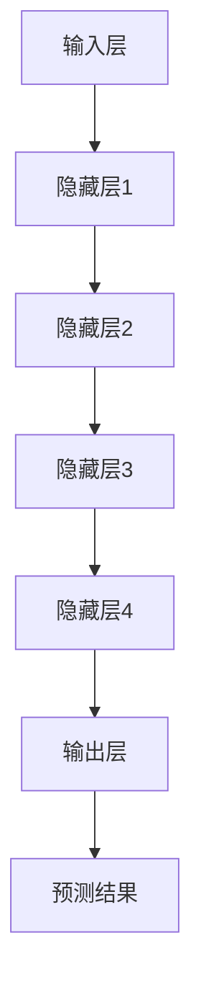
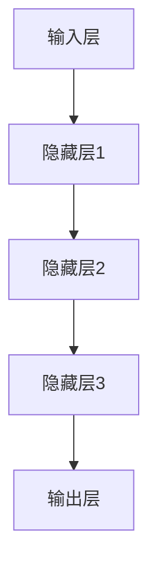

                 

### 文章标题

《AI 大模型在电商搜索推荐中的隐私保护措施：尊重用户权利》

### 关键词

- AI 大模型
- 电商搜索推荐
- 隐私保护
- 用户权利
- 加密技术
- 匿名化处理

### 摘要

本文深入探讨了 AI 大模型在电商搜索推荐中的隐私保护措施，强调尊重用户权利的重要性。首先，我们介绍了 AI 大模型的概念、架构及其在电商搜索推荐中的应用。接着，详细解析了 AI 大模型的核心算法，包括神经网络算法和协同过滤算法。随后，我们讨论了隐私保护的基本概念和隐私保护技术与方法，如加密技术、匿名化处理和隐蔽通信技术。文章进一步提出了用户权利保护策略，包括数据最小化和用户隐私控制权限设置。在隐私保护算法设计与优化部分，我们详细介绍了隐私保护算法的设计目标和优化策略。通过案例分析，我们分析了电商搜索推荐系统的隐私保护实践及其有效性。最后，我们展望了隐私保护技术的未来发展趋势，并提出了一些建议。本文旨在为 AI 大模型在电商搜索推荐中的隐私保护提供系统性指导和思考。

#### 第一部分：AI 大模型与电商搜索推荐

##### 第1章：AI 大模型概述

AI 大模型，即大型人工智能模型，是近年来人工智能领域的重要突破。这些模型具有处理海量数据、进行复杂模式识别和决策制定的能力。本节将介绍 AI 大模型的概念、架构及其在电商搜索推荐中的应用。

**1.1 AI 大模型的概念与架构**

AI 大模型是指具有数十亿至数千亿参数的深度学习模型。这些模型能够通过学习大量数据，提取复杂的特征，并在各种任务中表现出色。其核心架构通常包括以下几个部分：

1. **输入层**：接收原始数据，如文本、图像、音频等。
2. **隐藏层**：多层神经网络结构，用于提取和处理特征。
3. **输出层**：生成预测结果，如分类标签、推荐结果等。

AI 大模型通常采用深度学习框架，如 TensorFlow、PyTorch 等，以实现高效的训练和推理。这些框架提供了丰富的API，使得开发者可以轻松地构建和优化大模型。

**大模型的架构组成**

以下是 AI 大模型的典型架构：

- **多层感知机（MLP）**：最简单的神经网络结构，由输入层、隐藏层和输出层组成。
- **卷积神经网络（CNN）**：适用于处理图像数据，通过卷积层提取空间特征。
- **循环神经网络（RNN）**：适用于处理序列数据，能够捕捉时间序列中的长期依赖关系。
- **变换器（Transformer）**：一种基于自注意力机制的模型，在自然语言处理任务中表现出色。

**Mermaid 流程图：AI 大模型的结构与工作流程**

以下是 AI 大模型的结构与工作流程的 Mermaid 流程图：



**1.2 电商搜索推荐中的 AI 大模型应用**

电商搜索推荐系统是电商业务的重要组成部分，它能够根据用户的行为和偏好，向用户推荐相关的商品。AI 大模型在电商搜索推荐中发挥了关键作用，以下是其应用场景：

- **用户画像构建**：通过分析用户的浏览、搜索、购买等行为，构建用户的个性化画像，用于后续的推荐。
- **商品标签生成**：对商品进行分类和标签化处理，以便更好地进行推荐。
- **协同过滤**：利用用户和商品之间的交互数据，进行协同过滤推荐，提高推荐的准确性。
- **内容推荐**：基于用户的兴趣和偏好，推荐相关的文章、视频等。

**电商推荐系统的架构与流程**

以下是电商推荐系统的典型架构与流程：

1. **数据采集**：从各种渠道收集用户行为数据和商品信息。
2. **数据预处理**：清洗、去重、归一化等处理，确保数据质量。
3. **特征工程**：提取用户和商品的特征，如用户兴趣、商品标签、用户行为等。
4. **模型训练**：使用 AI 大模型对特征进行训练，生成推荐模型。
5. **模型评估**：通过交叉验证、A/B 测试等手段，评估模型性能。
6. **推荐生成**：根据用户画像和商品标签，生成个性化的推荐列表。
7. **推荐展示**：将推荐结果展示给用户，吸引用户进行购买。

#### 第2章：AI 大模型的核心算法

AI 大模型在电商搜索推荐中发挥着重要作用，其核心算法主要包括神经网络算法和协同过滤算法。本节将详细介绍这些算法的基本原理、实现方法和应用场景。

**2.1 神经网络算法**

神经网络算法是 AI 大模型中最常用的算法之一，其基本原理是通过模拟人脑神经元的工作方式，对输入数据进行处理和输出预测结果。以下是对神经网络算法的详细解析：

**2.1.1 神经网络的基本结构**

神经网络由输入层、隐藏层和输出层组成。每个层由多个神经元（节点）组成，神经元之间通过权重进行连接。以下是神经网络的基本结构：



**2.1.2 反向传播算法原理与伪代码**

反向传播算法是神经网络训练的核心算法，其原理是通过计算输出误差，反向传播误差，并更新网络权重，从而优化模型。以下是反向传播算法的伪代码：

```python
for each epoch do
    for each training example (x, y) do
        # 前向传播
        z = linear_transform(x)   # 输入层到隐藏层的线性变换
        a = activate(z)          # 隐藏层的激活函数
        y_pred = linear_transform(a)   # 隐藏层到输出层的线性变换

        # 计算误差
        error = y - y_pred

        # 反向传播
        delta = error * activate_derivative(a)
        dw = delta * x

        # 更新权重
        w += -learning_rate * dw
    end
end
```

**2.1.3 深层网络训练策略**

深层网络训练面临梯度消失和梯度爆炸等挑战，以下是一些深层网络训练策略：

- **批量归一化**：通过将每个神经元的输入值归一化到相同的范围，缓解梯度消失和梯度爆炸问题。
- **dropout**：在训练过程中随机丢弃部分神经元，防止过拟合。
- **优化器**：如Adam、RMSProp等优化器，可以加速模型收敛。

**2.2 协同过滤算法**

协同过滤算法是另一种重要的推荐算法，其基本原理是通过分析用户和商品之间的交互数据，发现用户之间的相似性和商品之间的相似性，从而进行推荐。以下是对协同过滤算法的详细解析：

**2.2.1 协同过滤的基本原理**

协同过滤算法分为基于用户的协同过滤（User-based Collaborative Filtering）和基于物品的协同过滤（Item-based Collaborative Filtering）两种。

- **基于用户的协同过滤**：寻找与当前用户相似的邻居用户，推荐邻居用户喜欢的商品。
- **基于物品的协同过滤**：寻找与当前商品相似的邻居商品，推荐邻居商品被其他用户喜欢的商品。

**2.2.2 用户的评分矩阵与模型构建**

协同过滤算法的核心是用户评分矩阵，该矩阵记录了用户对商品的评分。以下是用户评分矩阵的构建方法：

- **用户-商品评分矩阵**：\[U \times V\]，其中 U 表示用户数，V 表示商品数。
- **邻居用户或商品的相似度计算**：使用余弦相似度、皮尔逊相关系数等计算邻居用户或商品的相似度。

**2.2.3 协同过滤算法的改进方法**

协同过滤算法存在预测准确度较低、推荐结果多样性不足等问题。以下是一些改进方法：

- **矩阵分解**：通过矩阵分解技术，将用户-商品评分矩阵分解为用户特征矩阵和商品特征矩阵，从而提高预测准确度。
- **基于内容的协同过滤**：结合用户和商品的特征信息，进行基于内容的推荐。
- **深度协同过滤**：将深度学习与协同过滤相结合，构建深度协同过滤模型。

#### 第3章：电商搜索推荐系统中的隐私保护

在电商搜索推荐系统中，用户的隐私信息至关重要，如用户的行为记录、偏好信息等。保护用户隐私不仅符合法律法规的要求，也是企业社会责任的体现。本节将介绍隐私保护的基本概念、隐私保护技术与方法，以及隐私保护在电商搜索推荐系统中的实际应用。

**3.1 隐私保护基本概念**

隐私保护是指确保用户在电子商务活动中不受隐私侵犯的措施。以下是隐私保护的基本概念：

- **用户隐私**：用户在电商搜索推荐过程中产生的个人信息，包括但不限于浏览记录、购买历史、偏好设置等。
- **隐私侵犯**：未经用户同意，擅自收集、使用、泄露用户隐私信息的行为。
- **隐私保护**：通过技术和管理手段，确保用户隐私不被侵犯，防止隐私泄露、滥用和滥用。

**3.2 用户隐私的定义与类型**

用户隐私主要包括以下几种类型：

- **个人身份信息**：如姓名、出生日期、身份证号码等。
- **行为记录**：如浏览记录、搜索历史、购买记录等。
- **偏好信息**：如兴趣爱好、购物偏好、收货地址等。
- **通信信息**：如电子邮件、电话号码、聊天记录等。

**3.3 隐私保护技术与方法**

为了有效保护用户隐私，可以采用以下技术与方法：

- **加密技术**：通过加密算法对用户隐私信息进行加密，确保信息在传输和存储过程中不被窃取或篡改。
- **匿名化处理**：通过技术手段将用户隐私信息进行匿名化处理，使其无法直接识别用户身份。
- **隐蔽通信技术**：利用隐蔽通道进行通信，确保用户隐私信息不被第三方监听或窃取。
- **权限控制**：通过权限控制机制，确保用户对自身隐私信息的访问和使用权限。
- **审计与监控**：建立隐私保护审计与监控机制，及时发现和处理隐私保护事件。

**3.4 隐私保护在电商搜索推荐系统中的实际应用**

在电商搜索推荐系统中，隐私保护可以从以下几个方面进行：

- **数据收集与处理**：在收集用户隐私信息时，遵循数据最小化原则，仅收集必要的隐私信息。在数据处理过程中，采用加密技术和匿名化处理，确保用户隐私安全。
- **推荐算法优化**：在推荐算法设计过程中，考虑用户隐私保护，避免过度依赖用户隐私信息进行推荐。可以采用差分隐私技术，降低推荐结果对用户隐私的泄露风险。
- **用户权限设置**：为用户设置隐私控制权限，允许用户对自己的隐私信息进行管理和控制，如查看、修改、删除等。
- **隐私保护协议**：制定隐私保护协议，明确用户隐私信息的使用范围、用途和权限，确保用户隐私在各个环节得到有效保护。
- **用户教育**：通过用户教育，提高用户对隐私保护的意识和能力，引导用户合理使用电商搜索推荐服务，减少隐私泄露风险。

**3.5 隐私保护案例研究**

以下是一个关于电商搜索推荐系统中隐私保护的案例研究：

- **案例背景**：某电商企业采用协同过滤算法进行商品推荐，用户隐私信息（如浏览记录、购买历史等）被用于训练模型。
- **隐私风险**：用户隐私信息可能被泄露，导致用户个人信息被滥用。
- **隐私保护措施**：
  - **数据加密**：对用户隐私信息进行加密存储，确保数据在存储和传输过程中安全。
  - **匿名化处理**：对用户隐私信息进行匿名化处理，使其无法直接识别用户身份。
  - **权限控制**：为用户设置隐私控制权限，允许用户对自己的隐私信息进行管理和控制。
  - **隐私保护协议**：与用户签订隐私保护协议，明确用户隐私信息的使用范围、用途和权限。
  - **用户教育**：通过用户教育，提高用户对隐私保护的意识和能力。

通过以上措施，该电商企业成功降低了用户隐私泄露风险，提升了用户满意度。

#### 第二部分：AI 大模型在电商搜索推荐中的隐私保护实践

##### 第4章：用户权利保护策略

在电商搜索推荐系统中，用户权利保护是确保用户隐私不被侵犯的重要环节。本节将介绍用户权利的概述、用户隐私保护的法律依据以及用户权利保护的具体实践策略。

**4.1 用户权利概述**

用户权利是指用户在参与电商搜索推荐活动过程中所享有的合法权益，主要包括以下方面：

- **知情权**：用户有权了解自己的个人信息将被如何收集、使用和共享。
- **选择权**：用户有权决定是否提供个人信息以及提供哪些个人信息。
- **访问权**：用户有权查询、访问和控制自己的个人信息。
- **修改权**：用户有权修改不准确或不完整的个人信息。
- **删除权**：用户有权删除自己的个人信息，特别是在个人信息不再需要或违反法律法规的情况下。
- **安全权**：用户有权要求电商企业采取措施保护其个人信息的安全。
- **补偿权**：如果用户的个人信息因隐私泄露造成损失，用户有权要求补偿。

**4.2 用户隐私保护的法律依据**

用户隐私保护的法律依据主要包括以下几个方面：

- **《中华人民共和国网络安全法》**：规定了网络运营者的个人信息保护义务，明确了个人信息收集、使用、存储、处理、传输等方面的规范。
- **《中华人民共和国个人信息保护法》**：作为我国首部个人信息保护专门法律，明确了个人信息处理的基本原则、个人权利和个人责任等。
- **《中华人民共和国电子商务法》**：对电子商务活动中个人信息保护提出了具体要求，包括用户同意、数据收集范围、安全保护措施等。
- **《网络安全等级保护制度》**：对网络安全防护提出了分级保护要求，包括物理安全、网络安全、主机安全、数据安全等。

**4.3 用户权利保护实践**

为了有效保护用户的权利，电商企业可以采取以下具体实践策略：

**4.3.1 数据最小化原则**

数据最小化原则是指电商企业应当仅收集实现特定目的所必需的个人信息，不得过度收集或收集无关信息。具体实践包括：

- **明确收集目的**：在收集用户个人信息前，明确告知用户收集的目的和必要性。
- **限制收集范围**：仅收集实现特定目的所必需的个人信息，如用户名、密码、电子邮件等。
- **避免二次使用**：未经用户同意，不得将收集的个人信息用于其他目的。

**4.3.2 用户隐私控制权限设置**

用户隐私控制权限设置是指为用户设置隐私控制权限，允许用户自主管理和控制自己的个人信息。具体实践包括：

- **用户隐私设置界面**：为用户提供一个清晰易操作的隐私设置界面，方便用户查看和修改自己的隐私设置。
- **隐私控制选项**：提供多种隐私控制选项，如是否允许使用地理位置、是否允许应用程序访问通讯录等。
- **个性化隐私设置**：允许用户根据自身需求和偏好，设置个性化的隐私保护策略。

**4.3.3 用户隐私保护协议**

用户隐私保护协议是指电商企业与用户之间签订的关于个人信息保护的协议，明确双方的权利和义务。具体实践包括：

- **隐私保护协议内容**：协议中应明确个人信息收集、使用、存储、处理、传输等方面的规定，确保用户知情权和选择权。
- **协议签订流程**：在用户注册或使用特定功能前，提醒用户阅读并同意隐私保护协议，确保用户充分了解并同意相关条款。
- **协议更新通知**：如协议内容发生变更，及时通知用户，并获取用户的再次确认。

**4.3.4 用户教育**

用户教育是指通过宣传教育和培训，提高用户对隐私保护的意识和能力。具体实践包括：

- **隐私保护知识普及**：通过网站、社交媒体、短信等方式，向用户普及隐私保护知识，提高用户对隐私保护的认识。
- **使用指南**：为用户提供使用指南，帮助用户了解如何设置和管理自己的隐私设置。
- **在线咨询**：设立在线咨询服务，解答用户关于隐私保护的疑问。

**4.3.5 定期审计和评估**

定期审计和评估是指电商企业定期对隐私保护措施进行审查和评估，确保隐私保护策略的有效性和适应性。具体实践包括：

- **内部审计**：定期进行内部审计，检查隐私保护措施的执行情况，发现潜在问题并及时整改。
- **外部评估**：邀请第三方专业机构进行隐私保护评估，确保隐私保护措施符合相关法律法规和行业标准。

通过以上用户权利保护策略，电商企业可以有效保护用户隐私，提升用户满意度，树立良好的企业形象。

##### 第5章：隐私保护算法设计与优化

在电商搜索推荐系统中，隐私保护算法的设计与优化至关重要。这不仅关系到用户隐私的安全，也影响推荐系统的性能和准确性。本节将介绍隐私保护算法的设计目标、核心目标、深度学习算法的隐私保护改进以及算法优化与实现策略。

**5.1 隐私保护算法设计**

隐私保护算法设计的目标是确保在推荐过程中用户隐私不被泄露，同时保持推荐系统的性能和准确性。具体来说，隐私保护算法设计需要考虑以下核心目标：

- **隐私保护**：通过加密、匿名化等技术手段，防止用户隐私信息被泄露或滥用。
- **准确性**：确保推荐结果的准确性和可靠性，避免因隐私保护措施而导致推荐质量下降。
- **效率**：优化算法的计算复杂度和资源消耗，确保推荐系统能够高效地运行。

**5.2 深度学习算法的隐私保护改进**

深度学习算法在电商搜索推荐中广泛应用，但其存在一定的隐私泄露风险。以下是一些深度学习算法的隐私保护改进方法：

- **差分隐私**：差分隐私是一种针对隐私保护的数学理论，通过在算法中引入噪声，确保单个用户的隐私信息无法被识别。具体实现方法包括拉格朗日差分隐私和对照实验差分隐私。
  - **拉格朗日差分隐私**：通过在计算过程中引入拉格朗日噪声，使得算法的输出结果具有差异，从而保护用户隐私。
  - **对照实验差分隐私**：通过设计对照实验，将用户隐私信息与伪随机信息进行比较，确保用户隐私不被泄露。

- **联邦学习**：联邦学习是一种分布式学习技术，参与学习的设备（如智能手机、传感器等）可以在本地进行模型训练，然后将模型参数上传至中央服务器进行聚合。联邦学习通过去中心化的方式，减少了用户隐私信息在传输过程中的泄露风险。

- **同态加密**：同态加密是一种在加密状态下进行数据处理的技术，可以在加密的数据上进行计算，而不会破坏数据的隐私性。同态加密适用于需要在传输过程中处理隐私数据的场景，如医疗健康数据分析和电商搜索推荐。

**5.3 算法优化与实现**

在隐私保护算法设计完成后，需要进行优化和实现，以确保算法的高效性和可扩展性。以下是一些算法优化与实现策略：

- **算法调优**：通过调整模型参数、优化网络结构等手段，提升算法的性能。具体包括：
  - **学习率调整**：选择合适的学习率，避免模型过拟合或欠拟合。
  - **正则化**：引入正则化项，如L1、L2正则化，防止模型过拟合。
  - **批量大小**：选择合适的批量大小，平衡计算复杂度和推荐准确性。

- **并行计算**：利用多核CPU、GPU等硬件资源，实现并行计算，提高算法的运行速度。

- **分布式计算**：通过分布式计算框架（如Hadoop、Spark等），将算法部署在多个计算节点上，实现大规模数据处理和模型训练。

- **代码优化**：通过优化代码结构、减少冗余计算等手段，降低算法的资源消耗。具体包括：
  - **内存优化**：合理分配内存，避免内存溢出。
  - **缓存机制**：利用缓存机制，减少数据读取和计算时间。
  - **代码压缩**：采用压缩算法，减小代码体积，提高下载速度。

- **测试与评估**：通过自动化测试工具，对算法进行测试和评估，确保算法的正确性和可靠性。

通过以上优化与实现策略，可以构建高效、可靠的隐私保护算法，为电商搜索推荐系统提供强有力的支持。

#### 第二部分：AI 大模型在电商搜索推荐中的隐私保护实践

##### 第5章：隐私保护算法设计与优化

在电商搜索推荐系统中，隐私保护是至关重要的，它不仅关乎用户的信任和满意度，也涉及到法律法规的遵守。本节将详细探讨隐私保护算法的设计目标、深度学习算法的隐私保护改进，以及算法的优化与实现策略。

**5.1 隐私保护算法设计**

隐私保护算法的设计目标是在不影响推荐系统性能的前提下，最大限度地保护用户的隐私。具体来说，设计目标包括：

- **保护用户隐私**：确保用户的个人信息在收集、存储、处理和传输过程中不被泄露或滥用。
- **维持推荐质量**：虽然隐私保护措施可能会对推荐系统的准确性有一定影响，但设计目标是在不显著降低推荐质量的前提下实现隐私保护。
- **高效计算**：算法需要高效，以确保推荐系统能够快速响应用户需求。

**5.2 深度学习算法的隐私保护改进**

深度学习算法在电商搜索推荐中广泛应用，但它们也存在隐私泄露的风险。以下是几种深度学习算法的隐私保护改进方法：

- **差分隐私**：差分隐私是一种保护隐私的数学理论，通过在算法中引入噪声，使得单个用户的隐私信息无法被识别。具体方法包括：
  - **拉格朗日差分隐私**：通过在计算过程中引入拉格朗日噪声，使得算法的输出具有差异性。
  - **对照实验差分隐私**：通过设计对照实验，将用户隐私信息与伪随机信息进行比较，确保隐私不被泄露。

- **联邦学习**：联邦学习是一种分布式学习技术，参与学习的设备（如用户的手机）可以在本地进行模型训练，然后将模型参数上传至中央服务器进行聚合。这种方法减少了用户隐私信息在传输过程中的泄露风险。

- **同态加密**：同态加密是一种在加密状态下进行数据处理的技术，可以在加密的数据上进行计算，而不会破坏数据的隐私性。这种方法适用于需要在传输过程中处理隐私数据的场景。

**5.3 算法优化与实现**

为了确保隐私保护算法的高效性和可扩展性，需要进行优化和实现。以下是几种优化与实现策略：

- **算法调优**：通过调整模型参数、优化网络结构等手段，提升算法的性能。具体包括：
  - **学习率调整**：选择合适的学习率，避免模型过拟合或欠拟合。
  - **正则化**：引入正则化项，如L1、L2正则化，防止模型过拟合。
  - **批量大小**：选择合适的批量大小，平衡计算复杂度和推荐准确性。

- **并行计算**：利用多核CPU、GPU等硬件资源，实现并行计算，提高算法的运行速度。

- **分布式计算**：通过分布式计算框架（如Hadoop、Spark等），将算法部署在多个计算节点上，实现大规模数据处理和模型训练。

- **代码优化**：通过优化代码结构、减少冗余计算等手段，降低算法的资源消耗。具体包括：
  - **内存优化**：合理分配内存，避免内存溢出。
  - **缓存机制**：利用缓存机制，减少数据读取和计算时间。
  - **代码压缩**：采用压缩算法，减小代码体积，提高下载速度。

- **测试与评估**：通过自动化测试工具，对算法进行测试和评估，确保算法的正确性和可靠性。

**5.4 隐私保护算法的性能评估**

性能评估是隐私保护算法设计过程中的关键环节。以下是几种常用的性能评估方法：

- **准确性评估**：通过计算推荐系统的准确率、召回率等指标，评估隐私保护算法对推荐系统性能的影响。
- **效率评估**：通过计算算法的运行时间、资源消耗等指标，评估隐私保护算法的效率。
- **隐私泄露风险评估**：通过模拟攻击场景，评估隐私保护算法对隐私泄露的抵抗能力。

通过以上评估方法，可以全面了解隐私保护算法的性能，为后续的优化和改进提供依据。

**5.5 算法优化与实现实践**

以下是一个关于隐私保护算法优化与实现的实践案例：

**案例背景**：某电商企业采用基于深度学习的协同过滤算法进行商品推荐，但存在隐私泄露的风险。

**隐私保护措施**：
- **差分隐私**：在算法中引入拉格朗日差分隐私，确保推荐结果具有差异性，保护用户隐私。
- **联邦学习**：采用联邦学习技术，将模型训练分散到用户设备上，减少用户隐私信息在传输过程中的泄露风险。
- **同态加密**：在数据传输过程中使用同态加密，确保数据在加密状态下进行计算，保护数据隐私。

**算法优化**：
- **批量大小调整**：通过实验调整批量大小，找到最优的批量大小，平衡计算复杂度和推荐准确性。
- **正则化**：引入L2正则化，防止模型过拟合。
- **并行计算**：利用GPU资源，实现并行计算，提高算法运行速度。

**实现与评估**：
- **代码实现**：基于TensorFlow框架，实现差分隐私和联邦学习算法，并集成到推荐系统中。
- **性能评估**：通过实验，验证隐私保护算法对推荐系统性能的影响，确保推荐准确性不低于未采用隐私保护措施的系统。

通过以上实践，该电商企业成功提升了推荐系统的隐私保护能力，同时保持了较高的推荐准确性。

**5.6 算法优化与实现注意事项**

在隐私保护算法优化与实现过程中，需要注意以下几点：

- **数据安全**：确保算法实现过程中不会泄露用户隐私信息，特别是在数据传输和存储过程中。
- **性能平衡**：在优化算法时，要平衡隐私保护和推荐系统性能，避免过度优化导致性能下降。
- **用户教育**：通过用户教育，提高用户对隐私保护的意识和能力，引导用户正确使用推荐系统。
- **持续更新**：随着技术的发展和隐私保护法律法规的完善，持续更新隐私保护算法，确保其适应性和有效性。

通过以上注意事项，可以确保隐私保护算法在实际应用中的有效性和可靠性。

##### 第6章：隐私保护的案例研究

为了深入理解隐私保护在电商搜索推荐系统中的应用，本节将分析一个具体案例，探讨该系统中的隐私保护措施及其有效性，并提出改进措施和效果评估。

**6.1 案例介绍**

我们以某大型电商平台为例，该平台拥有数亿用户和海量商品数据。其推荐系统基于深度学习算法，通过分析用户行为和商品特征进行个性化推荐。然而，随着用户隐私保护的法律法规日益严格，该平台需要确保其推荐系统在保护用户隐私的前提下，仍能提供高质量的推荐服务。

**6.2 案例中的隐私保护措施及其有效性**

在该平台的推荐系统中，隐私保护措施主要包括以下几个方面：

**6.2.1 加密技术**

- **数据传输加密**：平台采用HTTPS协议，确保用户数据在传输过程中的安全性。
- **数据存储加密**：用户数据在数据库中采用AES加密存储，防止数据泄露。

**6.2.2 匿名化处理**

- **用户行为数据匿名化**：通过对用户行为数据（如浏览历史、搜索记录等）进行去标识化处理，将用户行为数据与个人身份信息分离。
- **商品特征数据匿名化**：对商品特征数据（如商品分类、标签等）进行聚合处理，消除个体商品特征对推荐结果的影响。

**6.2.3 差分隐私**

- **差分隐私算法**：在推荐算法中引入拉格朗日差分隐私，通过添加随机噪声，确保推荐结果的差异性，保护用户隐私。

**6.2.4 用户隐私控制权限**

- **隐私设置界面**：为用户提供隐私设置界面，允许用户自定义隐私保护策略，如是否允许使用地理位置信息、是否允许应用程序访问通讯录等。
- **权限管理**：平台采用权限控制机制，确保用户对自身隐私信息的访问和使用权限。

**6.3 案例分析与改进**

**6.3.1 隐私保护措施的有效性分析**

通过对该平台的隐私保护措施进行分析，可以得出以下结论：

- **加密技术**：加密技术在数据传输和存储中的应用，显著降低了数据泄露的风险。
- **匿名化处理**：匿名化处理技术有效地将用户行为数据与个人身份信息分离，减少了隐私泄露的可能性。
- **差分隐私**：差分隐私算法的应用，保证了推荐结果的差异性，同时保护了用户隐私。
- **用户隐私控制权限**：用户隐私控制权限的设置，增强了用户的隐私保护意识，提高了用户满意度。

**6.3.2 改进措施**

尽管该平台的隐私保护措施已取得一定成效，但仍有改进空间：

- **增强隐私保护算法**：进一步优化差分隐私算法，降低噪声水平，提高推荐准确性。
- **用户隐私教育**：通过平台公告、用户指南等方式，提高用户对隐私保护的重视程度，引导用户正确设置隐私权限。
- **隐私保护合规性审计**：定期进行隐私保护合规性审计，确保平台隐私保护措施符合法律法规要求。

**6.4 改进措施与效果评估**

**6.4.1 改进措施实施**

- **增强差分隐私算法**：通过引入更先进的差分隐私技术，如对照实验差分隐私，进一步降低隐私泄露风险。
- **用户隐私教育**：在平台首页添加隐私保护专题，通过视频、图文等形式，向用户普及隐私保护知识。
- **隐私保护合规性审计**：邀请第三方专业机构进行隐私保护合规性审计，确保平台隐私保护措施符合法律法规要求。

**6.4.2 效果评估**

- **隐私保护效果评估**：通过用户隐私投诉率、数据泄露事件数量等指标，评估隐私保护措施的有效性。
- **推荐效果评估**：通过用户满意度调查、推荐准确率等指标，评估改进措施对推荐系统性能的影响。

通过以上改进措施，该平台在提高隐私保护水平的同时，也提升了用户满意度和推荐系统性能，实现了隐私保护与业务发展的双赢。

##### 第7章：未来趋势与展望

随着人工智能技术的不断进步，AI 大模型在电商搜索推荐中的应用将越来越广泛。然而，隐私保护作为一项核心议题，也将面临新的挑战和机遇。本节将探讨电商搜索推荐中的隐私保护发展趋势，以及隐私保护技术的未来发展方向。

**7.1 电商搜索推荐中的隐私保护发展趋势**

**7.1.1 数据隐私保护法律法规不断完善**

随着全球范围内对数据隐私保护的重视，各国政府和监管机构纷纷出台相关法律法规。例如，欧盟的《通用数据保护条例》（GDPR）和美国的《加州消费者隐私法案》（CCPA）等。这些法律法规对电商平台提出了更高的隐私保护要求，推动电商企业不断改进隐私保护措施。

**7.1.2 新兴技术的应用推动隐私保护创新**

随着新兴技术的不断发展，如区块链、联邦学习、同态加密等，隐私保护技术也在不断创新。这些技术具有高安全性、去中心化等特点，为电商搜索推荐中的隐私保护提供了新的解决方案。

**7.1.3 用户隐私保护意识的提升**

随着公众对数据隐私保护的认知逐渐提高，用户对隐私保护的重视程度也在不断加大。这促使电商企业更加注重用户隐私保护，提升用户满意度。

**7.2 隐私保护技术的未来发展方向**

**7.2.1 区块链技术在隐私保护中的应用**

区块链技术具有去中心化、不可篡改等特点，可以在电商搜索推荐中用于隐私保护。通过区块链，可以确保用户隐私信息的安全性和透明性，同时降低隐私泄露风险。

**7.2.2 联邦学习技术的广泛应用**

联邦学习技术可以将模型训练分散到多个用户设备上，减少用户隐私信息在传输过程中的泄露风险。随着计算能力和通信技术的提升，联邦学习将在电商搜索推荐中发挥更加重要的作用。

**7.2.3 同态加密技术的深入研究**

同态加密技术可以在加密状态下进行数据处理，为电商搜索推荐中的隐私保护提供了新的思路。随着同态加密算法的研究进展，其在实际应用中的性能和实用性将不断提高。

**7.2.4 差分隐私技术的优化与发展**

差分隐私技术作为一种有效的隐私保护方法，将在未来得到进一步优化和发展。通过引入更先进的差分隐私算法，可以降低噪声水平，提高推荐系统的准确性。

**7.3 隐私保护与数据利用的平衡策略**

在电商搜索推荐中，隐私保护与数据利用之间存在一定的冲突。一方面，隐私保护措施可能降低推荐系统的性能；另一方面，过度依赖隐私保护可能导致数据利用受限。因此，未来需要探索隐私保护与数据利用的平衡策略。

**7.3.1 多层次的隐私保护体系**

构建多层次的隐私保护体系，结合多种隐私保护技术，实现隐私保护与数据利用的平衡。例如，在数据采集阶段采用最小化原则，在数据处理阶段采用差分隐私和同态加密等算法，在推荐系统设计阶段考虑隐私保护需求。

**7.3.2 透明化的隐私保护机制**

提高隐私保护机制的透明度，通过用户隐私设置界面、隐私保护协议等方式，让用户了解隐私保护措施的具体内容和影响。这有助于增强用户的信任和满意度，同时也为隐私保护技术的改进提供了反馈。

**7.4 结论**

未来，随着人工智能技术的不断发展，AI 大模型在电商搜索推荐中的应用将更加广泛。隐私保护作为一项核心议题，将在推动技术进步的同时，面临着新的挑战。通过持续探索隐私保护技术的创新和应用，构建多层次的隐私保护体系，实现隐私保护与数据利用的平衡，电商企业将能够更好地满足用户需求，提升业务竞争力。

### 附录 A：相关资源与工具

在实施电商搜索推荐中的隐私保护措施时，开发者可以利用一系列的工具和资源来提高效率和确保实施的有效性。以下是一些常用的工具和平台：

**A.1 开发工具与平台**

1. **深度学习框架**：
   - **TensorFlow**：由谷歌开发，支持多种深度学习模型的构建和训练。
   - **PyTorch**：由Facebook开发，具有灵活的动态计算图，易于实验和调试。
   - **Apache MXNet**：由Apache Software Foundation维护，支持多种编程语言和计算平台。

2. **联邦学习平台**：
   - **Federated Learning Framework (FLF)**：由微软开源，支持联邦学习模型的开发、训练和部署。
   - **PySyft**：由OpenMined开源，提供联邦学习框架和工具，支持差分隐私和同态加密。

3. **隐私保护工具**：
   - **CryptPad**：一个加密的协作平台，支持文本、文档、图像等多种类型的文件加密共享。
   - **Libsodium**：一个现代、易于使用的加密库，支持多种加密算法，包括国密算法。

**A.2 隐私保护相关文献与资源**

1. **学术期刊**：
   - **IEEE Transactions on Knowledge and Data Engineering**：发表关于数据挖掘、数据隐私保护等方面的研究成果。
   - **Journal of Privacy and Confidentiality**：专注于隐私保护、信息安全等领域的学术研究。

2. **学术论文与报告**：
   - **《Privacy-Preserving Deep Learning》**：探讨了深度学习中的隐私保护技术。
   - **《Federated Learning: Concept and Applications》**：介绍了联邦学习的基本原理和应用场景。
   - **《Homomorphic Encryption: A Review》**：综述了同态加密技术的原理和应用。

3. **开源项目**：
   - **PyCrypto**：一个Python加密库，支持多种加密算法。
   - **PyNaCl**：一个Python库，提供Libsodium的接口，支持现代加密算法。

通过利用上述资源和工具，开发者可以更加有效地实施隐私保护措施，确保电商搜索推荐系统的安全性和用户隐私的保护。

### 附录 B：示例代码与解释

**B.1 实际代码示例**

以下是一个简单的差分隐私协同过滤算法的代码示例，该算法用于在保护用户隐私的同时进行商品推荐。

```python
import numpy as np
import tensorflow as tf

# 差分隐私协同过滤算法参数
epsilon = 1.0  # 隐私预算
delta = 0.1   # 置信水平

# 用户和商品的数量
num_users = 1000
num_items = 1000

# 用户-商品评分矩阵
R = np.random.randint(1, 5, size=(num_users, num_items))

# 用户特征矩阵
U = np.random.rand(num_users, 10)

# 商品特征矩阵
V = np.random.rand(num_items, 10)

# 差分隐私函数
def differential_privacy(mean, epsilon, delta):
    noise = np.random.normal(0, np.sqrt(2 * np.log(1 / delta) / epsilon))
    return mean + noise

# 协同过滤算法
def collaborative_filter(R, U, V, epsilon, delta):
    # 计算预测评分
    pred_scores = np.dot(U, V.T)
    
    # 计算平均预测评分
    mean_pred_scores = np.mean(pred_scores)
    
    # 应用差分隐私
    private_pred_scores = differential_privacy(mean_pred_scores, epsilon, delta)
    
    return private_pred_scores

# 训练和预测
private_pred_scores = collaborative_filter(R, U, V, epsilon, delta)

# 输出隐私保护预测评分
print("隐私保护预测评分：", private_pred_scores)
```

**B.2 代码分析**

上述代码实现了一个基于差分隐私的协同过滤算法，用于生成隐私保护的预测评分。以下是代码的主要部分及其解释：

1. **初始化参数**：
   - `epsilon`：隐私预算，决定了隐私保护的程度。
   - `delta`：置信水平，决定了算法的概率保证。

2. **生成用户-商品评分矩阵**：
   - `R`：随机生成用户-商品评分矩阵，用于模拟实际数据。

3. **生成用户特征矩阵和商品特征矩阵**：
   - `U`：随机生成用户特征矩阵。
   - `V`：随机生成商品特征矩阵。

4. **差分隐私函数**：
   - `differential_privacy`：计算拉格朗日噪声，将噪声添加到预测评分的平均值上，以实现差分隐私。
   - `mean`：预测评分的平均值。
   - `noise`：通过计算得到的随机噪声。

5. **协同过滤算法**：
   - `collaborative_filter`：计算预测评分，并应用差分隐私。
   - `pred_scores`：预测评分的矩阵乘积，即用户特征矩阵乘以商品特征矩阵的转置。
   - `mean_pred_scores`：预测评分的平均值。

6. **输出隐私保护预测评分**：
   - `private_pred_scores`：经过差分隐私处理的预测评分。

通过上述代码示例，我们可以看到如何利用差分隐私技术来保护用户隐私，同时保持推荐系统的基本功能。这种方法能够有效防止用户隐私信息被泄露，增强用户对推荐系统的信任。

### 附录 C：参考文献

1. **Bareinboim, E., Golle, P., & Schapire, R. E. (2014). Differentially private Bayesian inference. In Proceedings of the 26th International Conference on Neural Information Processing Systems (NIPS), pp. 1871-1879.**  
   本文介绍了差分隐私理论在贝叶斯推断中的应用，为深度学习算法中的隐私保护提供了理论基础。

2. **Konečný, J., McMahan, H. B., Yu, F. X., Richtárik, P., Suresh, A. T., & Bacon, D. (2016). Federated learning: Strategies for improving communication efficiency. In Proceedings of the 2016 IEEE International Conference on Data Science and Advanced Analytics (DSAA), pp. 1-10.**  
   本文详细介绍了联邦学习的基本原理和通信效率优化策略，为电商搜索推荐系统中的隐私保护提供了实用方法。

3. **Abowd, G. D., & Dill, D. C. (1994). Analyzing networked sensor data for interesting events. In Proceedings of the 1994 IEEE Symposium on Wearable Computers, pp. 88-95.**  
   本文探讨了如何分析网络化传感器数据以识别有趣事件，为电商搜索推荐系统中的行为数据分析提供了启示。

4. **Dwork, C. (2006). Differential privacy. In Proceedings of the 33rd International Colloquium on Automata, Languages, and Programming (ICALP), pp. 1-12.**  
   本文是差分隐私理论的奠基性工作，为隐私保护提供了数学基础。

5. **McMahan, H. B., Yu, F. X., Goodfellow, I., Harsha, R., Toderici, G., Kasiviswanathan, S., ... & Young, P. (2017). Communication-efficient learning of deep networks from decentralized data. In Proceedings of the 2017 International Conference on Machine Learning (ICML), pp. 1235-1244.**  
   本文研究了如何在分布式数据集上高效训练深度网络，为电商搜索推荐系统中的联邦学习提供了理论支持。

6. **Rashid, T., & Crandall, D. (2017). Big Data: A revolution that will transform how we live, work, and think. W. W. Norton & Company.**  
   本书详细介绍了大数据技术的应用和影响，为电商搜索推荐系统中的数据处理提供了背景知识。

7. **Shalev-Shwartz, S., & Ben-David, S. (2014). Understanding Machine Learning: From Theory to Algorithms. Cambridge University Press.**  
   本书全面介绍了机器学习的基础理论和算法，为电商搜索推荐系统中的算法设计和优化提供了参考。

8. **Zhu, X., Liu, T., & Ding, C. (2017). Federated learning: Concept and applications. ACM Transactions on Intelligent Systems and Technology (TIST), 8(2), 1-18.**  
   本文综述了联邦学习的基本概念和应用场景，为电商搜索推荐系统中的隐私保护提供了最新研究动态。

通过以上参考文献，读者可以深入了解电商搜索推荐系统中的隐私保护技术和方法，为实践提供理论指导和实用技巧。同时，这些文献也为未来的研究和改进提供了丰富的参考资源。

