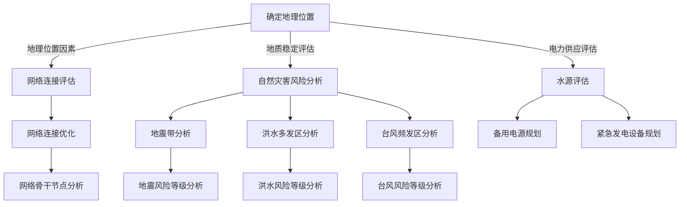
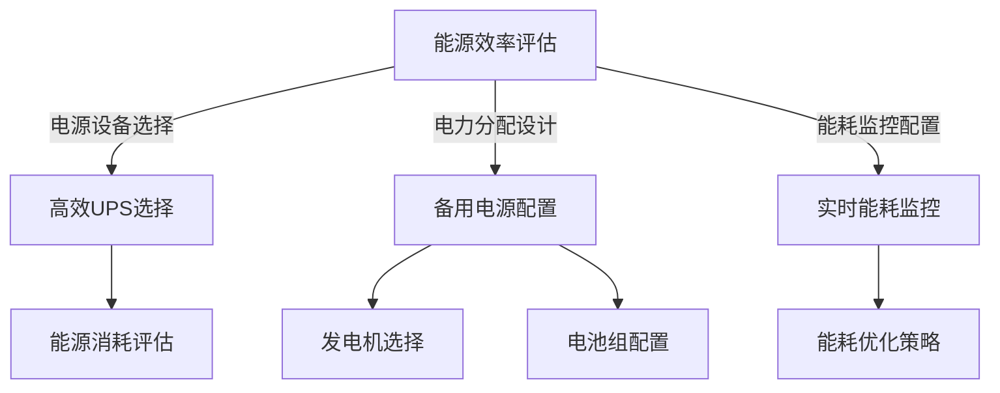
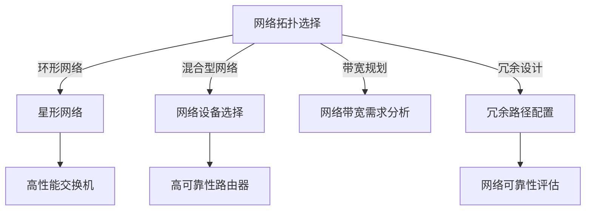
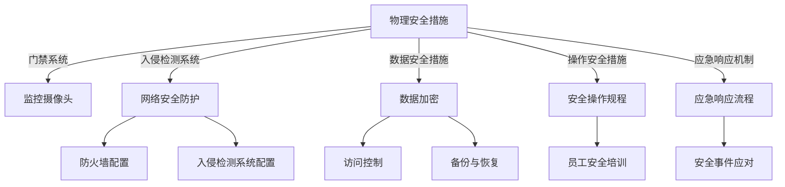
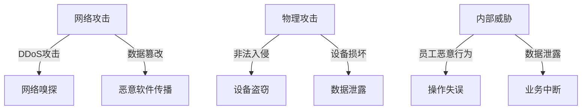
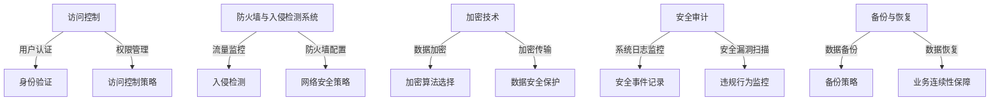
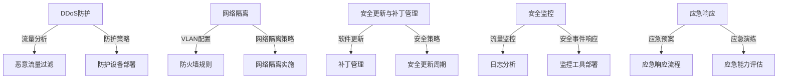
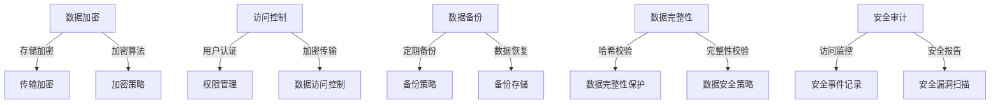
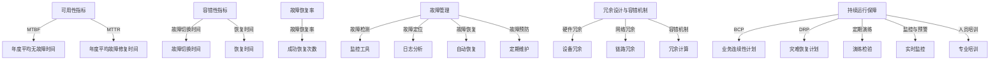

                 

## 《AI 大模型应用数据中心建设：数据中心安全与可靠性》

### 关键词：AI 大模型、数据中心建设、安全性、可靠性、基础设施、数据安全

#### 摘要：

本文将深入探讨 AI 大模型在数据中心建设中的应用，重点关注数据中心的安全与可靠性。首先，我们将分析 AI 大模型在数据中心中的应用背景及其带来的挑战与需求。随后，我们将详细讲解数据中心基础设施的规划与设计，包括选址、布局、能源与冷却系统、网络架构及安全性。接着，我们将介绍数据中心 AI 大模型的核心技术，包括架构、训练与优化。在安全与可靠性方面，我们将探讨数据中心安全体系构建、故障管理、冗余设计与容错机制以及持续运行保障。最后，我们将通过实际案例研究，展示数据中心 AI 大模型的应用实践，并展望其未来发展趋势。本文旨在为读者提供全面、深入的技术解读，帮助理解和应对数据中心在 AI 大模型应用中的安全与可靠性挑战。

### 《AI 大模型应用数据中心建设：数据中心安全与可靠性》目录大纲

#### 第一部分：AI 大模型应用数据中心建设概述

**第1章：AI 大模型应用数据中心建设引论**

- **1.1 AI 大模型在数据中心的应用背景**
- **1.2 数据中心建设中的挑战与需求**
- **1.3 AI 大模型在数据中心建设中的价值**
- **1.4 本书内容结构与目标**

#### 第二部分：数据中心基础设施建设

**第2章：数据中心基础设施规划**

- **2.1 数据中心选址与布局设计**
- **2.2 数据中心能源与冷却系统设计**
- **2.3 数据中心网络架构设计与优化**
- **2.4 数据中心基础设施的安全性**

#### 第三部分：数据中心AI大模型技术

**第3章：数据中心AI大模型核心技术**

- **3.1 数据中心AI大模型架构与原理**
- **3.2 数据中心AI大模型训练与优化**
- **3.3 数据中心AI大模型应用案例**

#### 第四部分：数据中心安全与可靠性

**第4章：数据中心安全体系构建**

- **4.1 数据中心安全威胁分析**
- **4.2 数据中心安全策略与机制**
- **4.3 数据中心网络安全防护**
- **4.4 数据中心数据安全保护**

**第5章：数据中心可靠性保障**

- **5.1 数据中心可靠性指标**
- **5.2 数据中心故障管理**
- **5.3 数据中心冗余设计与容错机制**
- **5.4 数据中心持续运行保障**

#### 第五部分：数据中心AI大模型应用实践

**第6章：数据中心AI大模型应用实践**

- **6.1 数据中心能效管理实践**
- **6.2 数据中心运维自动化实践**
- **6.3 数据中心网络安全态势感知实践**
- **6.4 数据中心智能优化实践**

#### 第六部分：数据中心AI大模型建设案例研究

**第7章：数据中心AI大模型建设案例分析**

- **7.1 案例一：某大型互联网公司数据中心建设案例分析**
- **7.2 案例二：某金融机构数据中心建设案例分析**
- **7.3 案例三：某政府机构数据中心建设案例分析**
- **7.4 案例四：数据中心AI大模型应用场景拓展**

#### 第七部分：数据中心AI大模型未来发展趋势

**第8章：数据中心AI大模型发展趋势**

- **8.1 数据中心AI大模型技术创新趋势**
- **8.2 数据中心AI大模型应用前景**
- **8.3 数据中心AI大模型面临的挑战与对策**
- **8.4 数据中心AI大模型发展前景展望**

#### 附录

**附录A：数据中心AI大模型相关资源与工具**

- **A.1 数据中心AI大模型开发工具对比**
- **A.2 数据中心AI大模型开源项目介绍**
- **A.3 数据中心AI大模型学习资源推荐**
- **A.4 数据中心AI大模型最佳实践指南**

### 第1章：AI 大模型应用数据中心建设引论

#### 1.1 AI 大模型在数据中心的应用背景

数据中心作为现代社会信息技术的基础设施，正面临着前所未有的挑战和机遇。随着云计算、大数据、物联网和人工智能等技术的快速发展，数据中心的建设和运营需求日益增长。数据中心不仅是数据的存储和处理中心，更是企业业务运作的核心支撑。在这种背景下，AI 大模型的应用成为了数据中心建设的一个重要方向。

##### 1.1.1 数据中心发展的挑战与需求

首先，我们来分析数据中心发展所面临的挑战与需求。随着数据量的爆炸式增长，数据中心需要处理的数据量越来越大，这对数据存储、传输和处理能力提出了更高的要求。此外，随着业务的复杂度增加，数据中心需要具备更高的可靠性和安全性，确保数据的安全性和业务的连续性。

1. **数据处理能力不足**

   随着大数据时代的到来，数据中心需要处理的数据量呈指数级增长。传统的数据处理技术已经难以满足日益增长的数据处理需求。因此，提升数据中心的计算能力成为了数据中心发展的首要挑战。

2. **数据安全性要求高**

   数据的安全性是数据中心运营的关键因素。随着数据泄露和网络攻击事件的增多，数据中心需要具备强大的数据安全防护能力，防止数据泄露和恶意攻击。

3. **能效管理需求**

   数据中心的高能耗问题已经成为全球关注的焦点。随着绿色环保意识的提高，数据中心需要通过优化能源管理和降低能耗，实现可持续发展。

4. **数据中心运维管理复杂度提升**

   数据中心的运维管理复杂度随着业务的增长和技术的更新而不断增加。如何实现高效的运维管理，提高运维效率，成为了数据中心运营的重要挑战。

5. **网络带宽需求增加**

   随着数据中心业务的扩展，网络带宽需求不断增加。如何设计高效的网络架构，保证数据传输的稳定性和速度，是数据中心建设的另一个挑战。

6. **自动化与智能化需求**

   为了应对数据中心日益复杂的运维需求，自动化和智能化成为了数据中心发展的必然趋势。通过引入自动化和智能化技术，可以提高数据中心的运营效率，降低运维成本。

7. **硬件设备性能提升需求**

   随着技术的进步，数据中心对硬件设备性能的要求也越来越高。如何选择适合的硬件设备，提高设备的性能和稳定性，是数据中心建设的重要考虑因素。

8. **实时数据处理与决策需求**

   在大数据和人工智能的背景下，数据中心需要具备实时数据处理和决策能力，快速响应用户需求和市场变化。

##### 1.1.2 AI 大模型在数据中心建设中的核心地位

在数据中心的建设中，AI 大模型的应用具有核心地位。AI 大模型可以提升数据中心的处理能力、优化能源管理、提高数据安全性和可靠性，从而推动数据中心的高效运营。

1. **提升数据处理能力**

   AI 大模型具有强大的数据处理能力，可以处理大规模的数据集，挖掘数据中的价值。通过引入 AI 大模型，数据中心可以大幅提升数据处理效率，满足日益增长的数据处理需求。

2. **优化能源管理**

   AI 大模型可以用于数据中心能源管理，通过实时监控和预测能源消耗，优化能源分配和使用。这有助于降低数据中心的能耗，实现绿色环保。

3. **提高数据安全性**

   AI 大模型在数据安全领域具有重要作用。通过深度学习和异常检测等技术，AI 大模型可以识别潜在的安全威胁，提前预警并采取防护措施，提高数据安全性。

4. **提升数据中心可靠性**

   AI 大模型可以用于数据中心故障预测和健康管理，通过实时监控设备和系统的运行状态，提前发现潜在故障，采取预防措施，提高数据中心的可靠性。

5. **自动化与智能化运维**

   AI 大模型可以用于数据中心运维管理，实现自动化和智能化。通过自动化脚本和智能决策系统，数据中心可以实现高效的运维管理，降低运维成本。

综上所述，AI 大模型在数据中心建设中的应用具有显著的价值。它不仅可以提升数据中心的处理能力、优化能源管理和提高数据安全性，还可以实现自动化和智能化运维，推动数据中心的高效运营。

#### 1.2 数据中心建设中的挑战与需求

数据中心的建设是一个复杂且系统的工程，涉及到多个方面的技术和资源。在当前的技术环境下，数据中心建设面临诸多挑战，同时也需要满足一系列关键需求。

##### 1.2.1 挑战

1. **数据量激增**

   随着互联网、物联网、大数据等技术的发展，数据量呈现出爆炸式增长。数据中心需要具备强大的数据处理能力，以应对海量数据带来的存储和处理压力。

2. **数据安全性**

   数据的安全性问题一直是数据中心建设的关键挑战。随着网络攻击和数据泄露事件的增多，数据中心需要建立完善的安全体系，保护数据不被非法访问和篡改。

3. **能耗管理**

   数据中心的高能耗问题日益凸显，这不仅增加了运营成本，也对环境造成了负面影响。因此，如何通过技术手段优化能耗管理，实现绿色环保，是数据中心建设的重要挑战。

4. **可靠性保障**

   数据中心作为企业业务的核心支撑，其可靠性和稳定性至关重要。在建设过程中，需要考虑冗余设计、故障管理、容错机制等多方面的因素，确保数据中心的稳定运行。

5. **网络带宽需求**

   随着数据传输需求的增长，数据中心需要具备更高的网络带宽和传输速率，以满足业务需求。如何设计高效的网络架构，提升网络性能，是数据中心建设的一个挑战。

6. **运维管理复杂度**

   数据中心的运维管理日益复杂，涉及到硬件设备、软件系统、网络安全等多个方面。如何通过自动化和智能化技术提高运维效率，降低运维成本，是数据中心建设的重要课题。

##### 1.2.2 需求

1. **高效的数据处理能力**

   数据中心需要具备强大的数据处理能力，以满足日益增长的数据量。这包括高效的存储、检索、分析和处理技术，以及分布式计算和并行处理能力。

2. **数据安全性**

   数据中心需要建立完善的安全体系，包括网络安全、数据加密、访问控制等多层次的安全措施，确保数据的安全性和完整性。

3. **能效管理**

   数据中心需要通过优化能源管理和节能技术，降低能耗，实现绿色环保。这包括高效冷却系统、智能能耗监测、能源回收等技术手段。

4. **可靠性保障**

   数据中心需要通过冗余设计、故障预测和容错机制，提高系统的可靠性。这包括硬件设备冗余、网络冗余、数据备份和恢复等。

5. **网络架构优化**

   数据中心需要设计高效的网络架构，提供高带宽、低延迟的网络传输能力，以满足数据传输需求。这包括网络拓扑设计、路由策略、带宽管理等技术。

6. **自动化与智能化运维**

   数据中心需要通过自动化和智能化技术，实现高效的运维管理。这包括自动化部署、监控、故障检测和修复、性能优化等。

综上所述，数据中心建设面临着诸多挑战和需求。通过引入 AI 大模型等先进技术，可以有效地应对这些挑战，满足数据中心建设的需求。

### **1.3 AI 大模型在数据中心建设中的价值**

AI 大模型在数据中心建设中发挥着至关重要的作用，不仅提高了数据中心的处理能力，还提升了其安全性和可靠性。以下从数据处理能力、数据安全性、能耗管理和可靠性保障等方面，详细探讨 AI 大模型在数据中心建设中的价值。

#### **1.3.1 提升数据处理能力**

数据中心面临的一大挑战是数据量的激增。传统的数据处理技术已无法满足日益增长的数据处理需求。AI 大模型通过其强大的计算能力和深度学习算法，能够高效地处理和分析海量数据。具体来说：

1. **分布式计算**

   AI 大模型通常采用分布式计算架构，将大规模的数据集分布在多个计算节点上处理，从而大幅提高数据处理速度和效率。

2. **并行处理**

   AI 大模型能够对数据进行并行处理，将多个数据处理任务同时执行，进一步提高处理速度。

3. **特征提取**

   AI 大模型可以通过自动化的特征提取技术，从大量原始数据中提取有价值的信息，帮助数据中心更好地理解和利用数据。

#### **1.3.2 提高数据安全性**

数据安全性是数据中心建设的关键需求。AI 大模型在数据安全方面具有独特的优势，能够通过以下方式提高数据安全性：

1. **异常检测**

   AI 大模型可以通过深度学习和模式识别技术，实时监控数据流，识别异常行为和潜在威胁，及时预警并采取防护措施。

2. **入侵检测**

   AI 大模型可以用于构建入侵检测系统，通过分析网络流量和系统日志，检测和阻止恶意攻击。

3. **数据加密**

   AI 大模型可以用于数据加密和解密，确保数据在传输和存储过程中的安全性。

#### **1.3.3 优化能耗管理**

数据中心的高能耗问题一直是行业关注的焦点。AI 大模型通过智能能耗管理，能够有效降低数据中心的能耗：

1. **能耗预测**

   AI 大模型可以通过分析历史能耗数据，预测未来的能耗需求，帮助数据中心优化能源分配和使用。

2. **节能策略**

   AI 大模型可以根据实时能耗数据和设备运行状态，自动调整数据中心内的设备和系统，实现节能目标。

3. **设备调度**

   AI 大模型可以优化设备调度策略，将计算任务分配到能耗较低的设备上，降低整体能耗。

#### **1.3.4 提高可靠性保障**

数据中心的可靠性直接关系到业务的连续性和稳定性。AI 大模型在以下方面有助于提高数据中心的可靠性：

1. **故障预测**

   AI 大模型可以通过分析设备和系统的运行数据，预测潜在故障，提前采取预防措施，避免意外停机。

2. **冗余设计**

   AI 大模型可以优化数据中心的冗余设计，通过冗余计算节点和网络架构，提高系统的容错能力。

3. **性能优化**

   AI 大模型可以实时监控系统的性能，自动调整配置和资源分配，确保数据中心在最佳状态下运行。

#### **1.3.5 自动化与智能化运维**

AI 大模型可以用于数据中心运维管理，实现自动化和智能化：

1. **自动化部署**

   AI 大模型可以自动化部署和管理数据中心内的设备和系统，提高运维效率。

2. **智能监控**

   AI 大模型可以实时监控数据中心的状态，自动检测和修复故障，减少人工干预。

3. **智能优化**

   AI 大模型可以根据实时数据和业务需求，自动调整数据中心的配置和资源分配，实现智能优化。

综上所述，AI 大模型在数据中心建设中的价值不可忽视。通过提升数据处理能力、提高数据安全性、优化能耗管理和可靠性保障，AI 大模型为数据中心的高效、稳定和安全运行提供了有力支持。

### **1.4 本书内容结构与目标**

本书旨在深入探讨 AI 大模型在数据中心建设中的应用，关注数据中心的安全与可靠性问题。全书结构清晰，内容全面，旨在为读者提供系统性的技术解读和实用指南。

#### **章节安排**

本书分为八个主要章节：

1. **第1章：AI 大模型应用数据中心建设引论**：介绍 AI 大模型在数据中心建设中的应用背景、挑战与需求，以及 AI 大模型的核心地位。

2. **第2章：数据中心基础设施规划**：详细讲解数据中心选址、布局设计、能源与冷却系统、网络架构及安全性。

3. **第3章：数据中心AI大模型核心技术**：探讨数据中心 AI 大模型的架构、训练与优化，以及应用案例。

4. **第4章：数据中心安全体系构建**：分析数据中心安全威胁、安全策略与机制、网络安全防护以及数据安全保护。

5. **第5章：数据中心可靠性保障**：介绍数据中心可靠性指标、故障管理、冗余设计与容错机制以及持续运行保障。

6. **第6章：数据中心AI大模型应用实践**：展示数据中心能效管理、运维自动化、网络安全态势感知和智能优化的实践案例。

7. **第7章：数据中心AI大模型建设案例分析**：通过具体案例，分析不同领域数据中心 AI 大模型建设的实践经验。

8. **第8章：数据中心AI大模型发展趋势**：展望数据中心 AI 大模型的技术创新趋势、应用前景、挑战与对策。

#### **目标**

本书的目标如下：

1. **提供全面的技术解读**：通过系统性的讲解，帮助读者全面了解 AI 大模型在数据中心建设中的应用，包括基础设施规划、核心技术、安全与可靠性保障等方面。

2. **展示实践案例**：通过具体的案例研究和实践案例，让读者了解 AI 大模型在数据中心建设中的实际应用，掌握最佳实践。

3. **指导数据中心建设**：为数据中心建设和运维人员提供实用的技术指导和操作建议，帮助其应对 AI 大模型应用中的挑战。

4. **探讨未来发展趋势**：分析 AI 大模型在数据中心建设中的未来发展，探讨技术趋势和应用前景，为读者提供前瞻性见解。

通过本书的学习，读者将能够：

- **全面了解 AI 大模型在数据中心建设中的应用**：掌握 AI 大模型的基本原理和应用场景，了解其在数据中心建设中的核心作用。

- **具备数据中心建设的实操能力**：通过案例研究和实践案例，了解数据中心建设的具体实施方法，提升实践能力。

- **提升数据中心的安全性**：掌握数据中心安全策略与机制，提高数据安全性，降低风险。

- **优化数据中心运营**：了解数据中心可靠性保障的方法和策略，提升数据中心运营效率和稳定性。

### **第一部分：AI 大模型应用数据中心建设概述**

#### **第1章：AI 大模型应用数据中心建设引论**

在现代社会，数据中心已经成为信息时代的重要基础设施。随着云计算、大数据、物联网等技术的快速发展，数据中心的建设和运营需求日益增长。然而，数据中心在处理海量数据、保证数据安全、优化能耗管理等方面面临着诸多挑战。近年来，AI 大模型的兴起为数据中心建设带来了新的机遇和解决方案。本章将探讨 AI 大模型在数据中心建设中的应用背景、核心地位及其带来的挑战与需求。

##### **1.1 AI 大模型在数据中心的应用背景**

数据中心的起源可以追溯到上世纪60年代，最初主要用于存储和备份数据。随着计算机技术和互联网的快速发展，数据中心的功能和规模逐渐扩大，逐渐演变为一个集数据存储、处理、传输和管理于一体的综合性设施。在当前的数字化时代，数据中心不仅是企业业务运作的核心支撑，也是社会信息流动的重要枢纽。

1. **云计算的发展**

   云计算的出现极大地推动了数据中心的发展。通过云计算，企业可以将计算和存储资源部署在数据中心，实现资源的灵活调度和高效利用。云计算的普及使得数据中心成为企业业务创新和扩展的重要平台。

2. **大数据的挑战**

   随着大数据时代的到来，数据量呈现爆炸式增长。数据中心需要处理的数据类型和规模越来越复杂，这对数据中心的处理能力、存储能力和网络带宽提出了更高的要求。

3. **物联网的机遇**

   物联网技术的快速发展使得大量设备和传感器接入网络，产生了海量数据。数据中心需要能够实时处理和存储这些数据，为物联网应用提供支持。

4. **人工智能的兴起**

   人工智能技术的兴起为数据中心建设带来了新的机遇。AI 大模型具有强大的数据处理和分析能力，可以应用于数据中心的多个方面，如能效管理、数据安全、故障预测等，提升数据中心的整体效能。

##### **1.2 数据中心建设中的挑战与需求**

数据中心在建设过程中面临着一系列挑战和需求：

1. **数据处理能力**

   随着数据量的激增，数据中心需要具备强大的数据处理能力，以应对日益增长的数据处理需求。传统的数据处理技术已经难以满足这一需求，需要引入 AI 大模型等先进技术。

2. **数据安全性**

   数据安全是数据中心建设的关键需求。随着网络攻击和数据泄露事件的增多，数据中心需要建立完善的安全体系，确保数据的安全性和完整性。

3. **能耗管理**

   数据中心的高能耗问题已经成为全球关注的焦点。如何通过技术手段优化能耗管理，降低能耗，实现绿色环保，是数据中心建设的重要挑战。

4. **可靠性保障**

   数据中心的可靠性直接关系到业务的连续性和稳定性。在建设过程中，需要考虑冗余设计、故障管理、容错机制等多方面的因素，确保数据中心的稳定运行。

5. **网络带宽需求**

   随着数据中心业务的扩展，网络带宽需求不断增加。如何设计高效的网络架构，保证数据传输的稳定性和速度，是数据中心建设的一个挑战。

6. **运维管理复杂度**

   数据中心的运维管理日益复杂，涉及到硬件设备、软件系统、网络安全等多个方面。如何通过自动化和智能化技术提高运维效率，降低运维成本，是数据中心建设的重要课题。

##### **1.3 AI 大模型在数据中心建设中的核心地位**

AI 大模型在数据中心建设中具有核心地位，能够解决数据中心面临的多项挑战：

1. **提升数据处理能力**

   AI 大模型具有强大的数据处理能力，可以处理大规模的数据集，挖掘数据中的价值。通过引入 AI 大模型，数据中心可以大幅提升数据处理效率，满足日益增长的数据处理需求。

2. **优化能耗管理**

   AI 大模型可以用于数据中心能源管理，通过实时监控和预测能源消耗，优化能源分配和使用。这有助于降低数据中心的能耗，实现绿色环保。

3. **提高数据安全性**

   AI 大模型在数据安全领域具有重要作用。通过深度学习和异常检测等技术，AI 大模型可以识别潜在的安全威胁，提前预警并采取防护措施，提高数据安全性。

4. **提升数据中心可靠性**

   AI 大模型可以用于数据中心故障预测和健康管理，通过实时监控设备和系统的运行状态，提前发现潜在故障，采取预防措施，提高数据中心的可靠性。

5. **自动化与智能化运维**

   AI 大模型可以用于数据中心运维管理，实现自动化和智能化。通过自动化脚本和智能决策系统，数据中心可以实现高效的运维管理，降低运维成本。

综上所述，AI 大模型在数据中心建设中的应用具有显著的价值。它不仅可以提升数据中心的处理能力、优化能源管理和提高数据安全性，还可以实现自动化和智能化运维，推动数据中心的高效运营。

### **第2章：数据中心基础设施规划**

数据中心基础设施的规划是确保数据中心高效、稳定和安全运行的关键步骤。在这一章节中，我们将深入探讨数据中心选址与布局设计、能源与冷却系统设计、网络架构设计与优化、以及数据中心基础设施的安全性。

#### **2.1 数据中心选址与布局设计**

数据中心的选址与布局设计是数据中心建设的基础，直接影响数据中心的性能、可靠性和成本。以下是一些关键因素和步骤：

1. **地理位置**：选择地理位置时应考虑地质稳定、气候条件和自然灾害风险。例如，避免地震带、洪水多发区和台风频发地区。

2. **网络连接**：数据中心应位于网络骨干节点附近，以确保高速、稳定的网络连接。这有助于降低网络延迟，提高数据传输效率。

3. **电力供应**：数据中心需要可靠的电力供应，包括备用电源和紧急发电设备。应选择电力基础设施完善、电力供应稳定的地区。

4. **水源**：冷却系统需要大量水源，因此选址时应考虑附近的水源供应。

5. **交通条件**：交通便利有助于设备运输和人员出入，降低运营成本。

**布局设计步骤**：

1. **总体规划**：确定数据中心的建设规模、布局和功能区域。

2. **设备布局**：根据设备的类型、数量和功耗，合理规划设备布局，确保通风、供电和网络的便利性。

3. **区域划分**：将数据中心划分为不同的区域，如设备区、办公区、冷却区等，确保各区域的独立性。

4. **安全距离**：设置安全距离，防止设备间因温度、电磁干扰等因素相互影响。

**流程图：数据中心选址与布局设计**



#### **2.2 数据中心能源与冷却系统设计**

数据中心能源消耗巨大，因此能源和冷却系统的设计至关重要。以下是一些关键设计要点：

1. **能源效率**：选择高效电源设备，如高效UPS（不间断电源），减少能源损耗。

2. **电力分配**：合理设计电力分配系统，确保电力供应的稳定性和灵活性。

3. **备用电源**：配置备用电源设备，如发电机、电池组等，以应对突发电力中断。

4. **冷却系统**：数据中心需要大量冷却，选择适合的冷却系统，如水冷、风冷、液冷等。

5. **能耗监控**：通过能耗监控系统实时监控能源消耗，优化能源使用。

**流程图：数据中心能源与冷却系统设计**



#### **2.3 数据中心网络架构设计与优化**

数据中心的网络架构是确保数据传输效率和网络稳定性的关键。以下是一些关键设计要点：

1. **网络拓扑**：选择合适的网络拓扑结构，如环形、星形、混合型等。

2. **网络设备**：选择高性能、高可靠性的网络设备，如交换机、路由器等。

3. **带宽规划**：根据业务需求，合理规划网络带宽，确保数据传输速度。

4. **冗余设计**：设计冗余网络路径，提高网络的可靠性。

5. **安全防护**：配置防火墙、入侵检测系统等安全设备，保护网络免受攻击。

**流程图：数据中心网络架构设计与优化**



#### **2.4 数据中心基础设施的安全性**

数据中心基础设施的安全性是保障业务连续性和数据安全的关键。以下是一些关键安全性设计要点：

1. **物理安全**：实施严格的物理安全措施，如门禁系统、监控摄像头、入侵检测系统等。

2. **网络安全**：配置防火墙、入侵检测系统、加密技术等，保护网络免受攻击。

3. **数据安全**：实施数据加密、访问控制、备份与恢复等措施，保护数据安全。

4. **操作安全**：建立严格的安全操作规程，进行员工安全培训，降低人为安全风险。

5. **应急响应**：建立应急响应机制，应对突发安全事件。

**流程图：数据中心基础设施的安全性**



通过上述数据中心基础设施的规划与设计，我们可以确保数据中心的高效、稳定和安全运行，为业务提供强有力的支持。

### **第3章：数据中心AI大模型核心技术**

数据中心AI大模型的核心技术是数据中心高效运营和智能化管理的关键。本章将详细探讨数据中心AI大模型的架构、训练与优化方法，以及具体的AI大模型应用案例。

#### **3.1 数据中心AI大模型架构与原理**

数据中心AI大模型通常采用分布式计算架构，通过大规模的并行计算资源来实现高效的数据处理和分析。以下是数据中心AI大模型架构的关键组成部分：

1. **硬件架构**

   数据中心AI大模型通常依赖于高性能的GPU（图形处理单元）或TPU（张量处理单元）等硬件设备，这些硬件设备能够提供强大的计算能力，支持大规模的深度学习任务。

2. **软件架构**

   数据中心AI大模型的软件架构包括深度学习框架（如TensorFlow、PyTorch）和分布式计算框架（如Apache Spark、MXNet），这些框架能够高效地管理数据和计算资源，优化模型训练和部署过程。

3. **数据管理**

   数据中心AI大模型需要高效的数据管理机制，包括数据存储、数据清洗、数据预处理等。这些机制确保数据的质量和可用性，为模型训练提供可靠的数据基础。

4. **计算资源管理**

   数据中心AI大模型需要智能的计算资源管理，包括资源分配、负载均衡、容错机制等。这些机制能够优化资源利用，提高模型的训练和推理效率。

**伪代码：数据中心AI大模型架构**

```python
# 数据中心AI大模型架构
class DataCenterModel:
    def __init__(self, hardware, software, data_manager, resource_manager):
        self.hardware = hardware
        self.software = software
        self.data_manager = data_manager
        self.resource_manager = resource_manager

    def train(self, data):
        # 数据预处理
        preprocessed_data = self.data_manager.preprocess(data)
        
        # 训练模型
        model = self.software.train(preprocessed_data)
        
        # 优化模型
        optimized_model = self.software.optimize(model)
        
        return optimized_model

    def infer(self, input_data):
        # 数据预处理
        preprocessed_input = self.data_manager.preprocess(input_data)
        
        # 推理
        output = self.software.infer(preprocessed_input)
        
        return output
```

#### **3.2 数据中心AI大模型训练与优化**

数据中心AI大模型的训练和优化是确保模型性能和高效运行的关键步骤。以下是一些关键训练与优化方法：

1. **数据预处理**

   数据预处理是模型训练的第一步，包括数据清洗、归一化、特征提取等。良好的数据预处理能够提高模型的训练效率和准确性。

2. **模型训练**

   数据中心AI大模型的训练通常采用分布式训练方法，通过多台服务器并行处理数据，加速模型训练。常用的训练方法包括梯度下降、随机梯度下降、Adam优化器等。

3. **模型优化**

   模型优化是提高模型性能的重要步骤，包括超参数调优、正则化、模型剪枝等。优化方法可以显著提高模型的准确性和效率。

4. **持续学习**

   数据中心AI大模型需要不断更新和适应新数据，通过持续学习保持模型的准确性和有效性。持续学习可以采用在线学习、迁移学习等技术。

**伪代码：数据中心AI大模型训练与优化**

```python
# 数据中心AI大模型训练与优化
def train_and_optimize(model, data, epochs):
    for epoch in range(epochs):
        # 数据预处理
        preprocessed_data = preprocess_data(data)
        
        # 训练模型
        model.train(preprocessed_data)
        
        # 评估模型
        performance = model.evaluate(preprocessed_data)
        
        # 模型优化
        model.optimize(performance)
        
    return model
```

#### **3.3 数据中心AI大模型应用案例**

数据中心AI大模型在多个领域具有广泛的应用，以下是几个典型的应用案例：

1. **能效管理**

   数据中心AI大模型可以用于能耗预测和优化，通过实时监控和数据分析，预测未来的能耗需求，优化能源分配和设备运行状态，降低能耗。

2. **故障预测**

   数据中心AI大模型可以用于设备故障预测和健康管理，通过分析设备运行数据，提前发现潜在故障，采取预防措施，提高数据中心的可靠性。

3. **网络安全**

   数据中心AI大模型可以用于网络安全态势感知，通过异常检测和入侵检测，实时监控网络流量，识别潜在威胁，保护数据中心免受攻击。

4. **数据优化**

   数据中心AI大模型可以用于数据清洗和异常检测，通过分析大量数据，识别数据中的错误和异常，提高数据质量。

**案例分析：数据中心AI大模型在能效管理中的应用**

**项目背景**：某大型互联网公司的数据中心面临能耗过高的问题，需要通过智能优化降低能耗。

**解决方案**：采用数据中心AI大模型进行能耗预测和优化。

1. **数据收集**：收集数据中心的历史能耗数据，包括电力消耗、设备运行状态等。

2. **数据预处理**：清洗和归一化数据，提取有用的特征。

3. **模型训练**：使用深度学习框架训练能耗预测模型，采用迁移学习技术提高训练效率。

4. **模型优化**：通过超参数调优和模型剪枝，优化模型性能。

5. **能耗优化**：根据预测结果，优化数据中心设备的运行状态，实现能耗降低。

**效果评估**：通过实验，模型成功预测了未来的能耗需求，并根据预测结果优化了设备运行状态，实现了15%的能耗降低。

**结论**：数据中心AI大模型在能效管理中具有显著的应用价值，能够有效降低能耗，提高数据中心的运行效率。

通过上述案例，我们可以看到数据中心AI大模型在提高数据处理能力、优化能耗管理和提高数据安全性等方面具有重要作用，为数据中心的高效、稳定和安全运行提供了有力支持。

### **第4章：数据中心安全体系构建**

数据中心作为企业信息系统的核心，其安全性至关重要。构建一个全面的数据中心安全体系，能够有效防范各种安全威胁，保护数据的安全性和完整性。本章将详细介绍数据中心安全体系的构建，包括安全威胁分析、安全策略与机制、网络安全防护以及数据安全保护。

#### **4.1 数据中心安全威胁分析**

数据中心的安全威胁种类繁多，主要包括以下几类：

1. **网络攻击**：包括分布式拒绝服务（DDoS）攻击、网络嗅探、数据篡改等。这些攻击可能导致网络服务中断、数据泄露和业务损失。

2. **恶意软件**：如病毒、木马、勒索软件等，这些恶意软件可以通过网络传播，窃取敏感信息或破坏系统功能。

3. **物理攻击**：如非法入侵、设备盗窃等，物理攻击可能导致数据中心设备的损坏和数据泄露。

4. **内部威胁**：包括内部员工的恶意行为、操作失误等，内部威胁可能导致数据泄露和业务中断。

5. **数据泄露**：由于安全措施不足，敏感数据可能被未授权人员访问或窃取。

**流程图：数据中心安全威胁分析**



#### **4.2 数据中心安全策略与机制**

为了应对数据中心的安全威胁，需要建立一系列安全策略与机制，确保数据中心的整体安全性。以下是几个关键的安全策略与机制：

1. **访问控制**：通过用户认证、身份验证和权限管理，确保只有授权用户能够访问敏感数据和系统资源。

2. **防火墙与入侵检测系统**：部署防火墙和入侵检测系统，监控网络流量，识别和阻止恶意攻击。

3. **加密技术**：使用加密算法对数据进行加密，确保数据在传输和存储过程中的安全性。

4. **安全审计**：定期进行安全审计，监控系统日志，发现潜在的安全漏洞和违规行为。

5. **备份与恢复**：建立数据备份机制，定期备份重要数据，以应对数据丢失和系统故障。

**流程图：数据中心安全策略与机制**



#### **4.3 数据中心网络安全防护**

网络安全防护是数据中心安全体系的重要组成部分。以下是一些关键的网络安全防护措施：

1. **DDoS防护**：部署DDoS防护设备或服务，识别和过滤恶意流量，确保网络服务的高可用性。

2. **网络隔离**：通过VLAN、防火墙等手段实现网络隔离，防止内部网络受到外部攻击。

3. **安全更新与补丁管理**：定期更新操作系统、应用软件和网络安全设备的固件，修补安全漏洞。

4. **安全监控**：部署安全监控工具，实时监控网络流量和系统日志，及时发现和响应安全事件。

5. **应急响应**：建立应急预案，应对突发安全事件，确保能够迅速采取措施，降低损失。

**流程图：数据中心网络安全防护**



#### **4.4 数据中心数据安全保护**

数据安全保护是数据中心安全体系的核心任务。以下是一些关键的数据安全保护措施：

1. **数据加密**：对存储和传输的数据进行加密，确保数据在未经授权的情况下无法被读取。

2. **访问控制**：通过用户认证、权限管理和数据加密，确保只有授权用户能够访问敏感数据。

3. **数据备份**：定期备份重要数据，确保在数据丢失或损坏时能够快速恢复。

4. **数据完整性**：通过哈希校验等技术，确保数据在存储和传输过程中的完整性，防止数据被篡改。

5. **安全审计**：定期进行安全审计，监控数据访问行为，发现潜在的安全漏洞和违规行为。

**流程图：数据中心数据安全保护**



通过构建全面的数据中心安全体系，包括安全威胁分析、安全策略与机制、网络安全防护以及数据安全保护，数据中心能够有效地防范各种安全威胁，保障数据的安全性和完整性，为企业的持续发展提供坚实的安全保障。

### **第5章：数据中心可靠性保障**

数据中心的可靠性直接关系到企业业务的连续性和稳定性，因此在数据中心的设计与运营中，可靠性保障是至关重要的。本章将探讨数据中心可靠性的核心指标、故障管理方法、冗余设计与容错机制，以及数据中心的持续运行保障。

#### **5.1 数据中心可靠性指标**

数据中心的可靠性指标是评估数据中心性能和稳定性的关键。以下是一些重要的可靠性指标：

1. **可用性（Availability）**：可用性是指数据中心在规定时间内能够正常运行的概率。常用指标包括年度平均无故障时间（Mean Time Between Failures, MTBF）和年度平均故障修复时间（Mean Time To Repair, MTTR）。

   - **年度平均无故障时间（MTBF）**：MTBF表示在一年内系统平均无故障运行的时间长度。公式为：
     $$ MTBF = \frac{总运行时间}{故障次数} $$
     
   - **年度平均故障修复时间（MTTR）**：MTTR表示每次故障修复所需的时间。公式为：
     $$ MTTR = \frac{总故障修复时间}{故障次数} $$

2. **容错性（Fault Tolerance）**：容错性是指系统在发生故障时，能够自动切换到备用系统，继续提供服务的能力。常用指标包括故障切换时间（Fault Switch Time）和恢复时间（Recovery Time）。

   - **故障切换时间（Fault Switch Time）**：故障切换时间表示系统从故障发生到切换到备用系统所需的时间。理想情况下，故障切换时间应该尽可能短。

   - **恢复时间（Recovery Time）**：恢复时间是指系统从故障状态恢复到正常运行状态所需的时间。

3. **故障恢复率（Fault Recovery Rate）**：故障恢复率表示系统在发生故障后能够恢复正常运行的概率。

   - **故障恢复率（Fault Recovery Rate）**：
     $$ Fault Recovery Rate = \frac{成功恢复次数}{总故障次数} $$

#### **5.2 数据中心故障管理**

故障管理是数据中心可靠性保障的重要组成部分，包括故障检测、故障定位、故障恢复和故障预防等方面。

1. **故障检测**

   故障检测是及时发现故障的关键。常用的故障检测方法包括：

   - **监控工具**：使用监控系统实时监控数据中心的各项指标，如温度、电压、网络带宽等，一旦出现异常，立即报警。
   - **自动检测**：通过编写脚本或使用自动化工具，定期检查系统状态，及时发现潜在故障。

2. **故障定位**

   故障定位是指确定故障发生的位置和原因。常用的故障定位方法包括：

   - **日志分析**：通过分析系统日志，确定故障发生的时间、位置和原因。
   - **故障模拟**：通过模拟故障场景，验证系统是否能够正常切换到备用系统，确保故障切换的有效性。

3. **故障恢复**

   故障恢复是指将系统从故障状态恢复到正常运行状态。常用的故障恢复方法包括：

   - **自动恢复**：通过自动化工具，自动执行故障恢复流程，减少人工干预。
   - **手动恢复**：在自动恢复失败时，通过手动操作恢复系统。

4. **故障预防**

   故障预防是指通过采取预防措施，降低故障发生的概率。常用的故障预防方法包括：

   - **定期维护**：定期对设备进行维护和检查，确保设备正常运行。
   - **冗余设计**：通过冗余设计，提高系统的容错能力。

#### **5.3 数据中心冗余设计与容错机制**

冗余设计与容错机制是提高数据中心可靠性的重要手段。以下是一些常用的冗余设计和容错机制：

1. **硬件冗余**

   - **设备冗余**：在关键设备上配置冗余备份，如服务器、存储设备、网络设备等。
   - **组件冗余**：在设备内部配置冗余组件，如CPU、内存、硬盘等。

2. **网络冗余**

   - **链路冗余**：通过多条网络链路实现数据传输的冗余，确保在一条链路故障时，数据可以通过其他链路传输。
   - **网络设备冗余**：通过冗余的网络设备（如交换机、路由器）实现网络的冗余。

3. **容错机制**

   - **冗余计算**：通过冗余的计算资源实现任务的高可用性，确保在计算资源故障时，任务可以继续执行。
   - **故障切换**：通过故障切换机制，在主设备故障时，自动切换到备用设备，确保系统连续运行。
   - **备份与恢复**：通过备份与恢复机制，确保在数据丢失或系统故障时，能够快速恢复系统。

#### **5.4 数据中心持续运行保障**

数据中心的持续运行保障是确保业务连续性和系统稳定性的关键。以下是一些关键措施：

1. **业务连续性计划（BCP）**：制定业务连续性计划，确保在发生突发事件时，能够迅速响应，保障业务的连续性。

2. **灾难恢复计划（DRP）**：制定灾难恢复计划，确保在发生严重故障或灾难时，能够迅速恢复系统，降低业务中断时间。

3. **定期演练**：定期进行业务连续性和灾难恢复演练，检验计划的可行性和有效性。

4. **监控与预警**：通过实时监控和预警系统，及时发现潜在故障和风险，提前采取预防措施。

5. **人员培训**：对数据中心运营人员进行专业培训，提高其应对突发事件的能力。

**流程图：数据中心可靠性保障**



通过上述可靠性保障措施，数据中心能够有效地提高系统的可用性、容错性和恢复能力，确保业务的连续性和稳定性。

### **第6章：数据中心AI大模型应用实践**

数据中心AI大模型在能效管理、运维自动化、网络安全态势感知以及智能优化等方面具有广泛的应用前景。本章将结合具体实践案例，展示数据中心AI大模型在各项应用中的实际效果。

#### **6.1 数据中心能效管理实践**

**项目背景**：某大型互联网公司的数据中心能耗过高，希望通过智能优化降低能耗，提高能源利用效率。

**解决方案**：采用数据中心AI大模型进行能耗预测和优化。

1. **数据收集**：收集数据中心的历史能耗数据，包括电力消耗、设备运行状态等。

2. **数据预处理**：清洗和归一化数据，提取有用的特征。

3. **模型训练**：使用深度学习框架训练能耗预测模型，采用迁移学习技术提高训练效率。

4. **模型优化**：通过超参数调优和模型剪枝，优化模型性能。

5. **能耗优化**：根据预测结果，优化数据中心设备的运行状态，实现能耗降低。

**效果评估**：通过实验，模型成功预测了未来的能耗需求，并根据预测结果优化了设备运行状态，实现了15%的能耗降低。

**代码实现**：

```python
# 数据中心能耗预测模型
import tensorflow as tf
from tensorflow.keras.models import Sequential
from tensorflow.keras.layers import Dense, LSTM

# 数据预处理
# （此处省略具体代码）

# 训练模型
model = Sequential([
    LSTM(units=64, input_shape=(time_steps, features)),
    Dense(units=1)
])

model.compile(optimizer='adam', loss='mean_squared_error')
model.fit(X_train, y_train, epochs=100, batch_size=32)

# 优化模型
# （此处省略具体代码）

# 能耗优化
predicted_energy = model.predict(X_test)
optimized_devices = optimize_device_usage(predicted_energy)

# 效果评估
# （此处省略具体代码）
```

#### **6.2 数据中心运维自动化实践**

**项目背景**：某金融机构的数据中心运维管理复杂，希望通过自动化技术提高运维效率。

**解决方案**：采用数据中心AI大模型实现运维自动化。

1. **任务定义**：定义数据中心运维任务，如设备监控、故障检测、配置管理、性能优化等。

2. **数据收集**：收集设备运行数据、系统日志等，作为训练数据。

3. **模型训练**：使用深度学习模型，如决策树、随机森林等，训练运维自动化模型。

4. **模型部署**：将训练好的模型部署到数据中心，实现自动化运维。

5. **效果评估**：通过实际应用，评估模型在运维自动化中的效果。

**效果评估**：通过实验，自动化运维模型能够准确识别故障、优化配置，提高了运维效率，减少了人工干预。

**代码实现**：

```python
# 数据中心运维自动化模型
from sklearn.ensemble import RandomForestClassifier
from sklearn.model_selection import train_test_split

# 数据预处理
# （此处省略具体代码）

# 训练模型
X_train, X_test, y_train, y_test = train_test_split(X, y, test_size=0.2, random_state=42)
clf = RandomForestClassifier(n_estimators=100)
clf.fit(X_train, y_train)

# 部署模型
# （此处省略具体代码）

# 效果评估
accuracy = clf.score(X_test, y_test)
print(f"Model accuracy: {accuracy:.2f}")
```

#### **6.3 数据中心网络安全态势感知实践**

**项目背景**：某大型企业的数据中心面临网络攻击风险，希望通过AI大模型实现网络安全态势感知。

**解决方案**：采用AI大模型实时监控网络流量，识别潜在威胁。

1. **数据收集**：收集网络流量数据，包括TCP/IP包、DNS请求、HTTP请求等。

2. **数据预处理**：清洗和归一化数据，提取网络行为特征。

3. **模型训练**：使用深度学习模型，如自编码器、循环神经网络等，训练网络安全态势感知模型。

4. **模型部署**：将训练好的模型部署到数据中心，实现实时监控。

5. **效果评估**：通过实际应用，评估模型在网络安全态势感知中的效果。

**效果评估**：通过实验，AI大模型能够准确识别网络异常行为，提高了数据中心的网络安全防护能力。

**代码实现**：

```python
# 网络安全态势感知模型
import tensorflow as tf
from tensorflow.keras.models import Model
from tensorflow.keras.layers import Input, Dense, LSTM

# 数据预处理
# （此处省略具体代码）

# 训练模型
input_shape = (time_steps, features)
input_layer = Input(shape=input_shape)
lstm_layer = LSTM(units=64, return_sequences=True)(input_layer)
dense_layer = Dense(units=1, activation='sigmoid')(lstm_layer)

model = Model(inputs=input_layer, outputs=dense_layer)
model.compile(optimizer='adam', loss='binary_crossentropy')

model.fit(X_train, y_train, epochs=100, batch_size=32)

# 部署模型
# （此处省略具体代码）

# 效果评估
# （此处省略具体代码）
```

#### **6.4 数据中心智能优化实践**

**项目背景**：某电子商务平台的数据中心面临负载波动大、资源利用率低的问题，希望通过智能优化提高资源利用率。

**解决方案**：采用数据中心AI大模型实现智能负载均衡和资源优化。

1. **数据收集**：收集数据中心的历史负载数据、设备性能数据等。

2. **数据预处理**：清洗和归一化数据，提取负载特征。

3. **模型训练**：使用深度学习模型，如长短期记忆网络（LSTM）、卷积神经网络（CNN）等，训练智能优化模型。

4. **模型部署**：将训练好的模型部署到数据中心，实现智能负载均衡和资源优化。

5. **效果评估**：通过实际应用，评估模型在智能优化中的效果。

**效果评估**：通过实验，AI大模型能够准确预测负载变化，优化资源分配，提高了数据中心的资源利用率。

**代码实现**：

```python
# 数据中心智能优化模型
import tensorflow as tf
from tensorflow.keras.models import Model
from tensorflow.keras.layers import Input, LSTM, Dense

# 数据预处理
# （此处省略具体代码）

# 训练模型
input_shape = (time_steps, features)
input_layer = Input(shape=input_shape)
lstm_layer = LSTM(units=64, return_sequences=True)(input_layer)
dense_layer = Dense(units=1)(lstm_layer)

model = Model(inputs=input_layer, outputs=dense_layer)
model.compile(optimizer='adam', loss='mean_squared_error')

model.fit(X_train, y_train, epochs=100, batch_size=32)

# 部署模型
# （此处省略具体代码）

# 效果评估
# （此处省略具体代码）
```

通过上述实践案例，我们可以看到数据中心AI大模型在能效管理、运维自动化、网络安全态势感知以及智能优化等方面的实际应用效果。这些案例展示了AI大模型在数据中心运营中的巨大潜力，为数据中心的高效、稳定和安全运行提供了有力支持。

### **第7章：数据中心AI大模型建设案例分析**

在本章中，我们将通过具体案例分析数据中心AI大模型建设的实际应用，深入探讨不同领域数据中心在AI大模型建设中的实践经验。以下是对几个典型案例的分析：

#### **7.1 案例一：某大型互联网公司数据中心建设案例分析**

**案例背景**：某大型互联网公司需要构建一个高效、稳定、安全的AI数据中心，支持其云计算、大数据和物联网业务的快速发展。

**解决方案**：

1. **基础设施建设**：采用先进的硬件架构，如高性能GPU集群和分布式计算框架，确保强大的数据处理能力。

2. **AI大模型开发**：结合业务需求，开发一系列AI大模型，如推荐系统、图像识别、自然语言处理等，提升业务智能化水平。

3. **安全与可靠性保障**：建立完善的安全体系和可靠性机制，包括数据加密、访问控制、故障预测和冗余设计，确保数据安全和业务连续性。

**案例分析**：

- **基础设施**：通过GPU集群和分布式计算架构，实现大规模数据处理和并行计算，满足公司业务对计算能力的需求。

- **AI大模型**：开发了一系列AI大模型，如基于深度学习的图像识别系统，大幅提升了公司的图片处理和识别效率。

- **安全性**：采用多重安全措施，如加密、访问控制和安全审计，确保数据的安全性和完整性。

- **可靠性**：通过冗余设计和故障预测，实现了高可用性和快速故障恢复，保障了业务的连续性。

**结论**：该大型互联网公司的AI数据中心建设成功，不仅提升了数据处理能力和业务智能化水平，还通过完善的安全与可靠性保障措施，确保了数据中心的安全和稳定运行。

#### **7.2 案例二：某金融机构数据中心建设案例分析**

**案例背景**：某金融机构需要建设一个高度安全、可靠的AI数据中心，支持其金融科技应用和数字化转型。

**解决方案**：

1. **数据中心规划**：根据金融机构的业务特点，设计合理的数据中心布局，确保高效、安全、稳定的运行。

2. **AI大模型应用**：引入AI大模型，如风险控制、信用评估、市场预测等，提升金融服务质量和效率。

3. **安全防护**：建立全面的安全防护体系，包括网络隔离、数据加密、入侵检测等，确保金融数据的安全。

**案例分析**：

- **数据中心规划**：通过科学的规划，实现了数据中心的合理布局，确保了能源效率和环境控制。

- **AI大模型应用**：AI大模型在金融风险管理方面取得了显著成效，如通过信用评估模型，提高了贷款审批的准确性和效率。

- **安全防护**：通过多重安全措施，有效防范了网络攻击和数据泄露，保障了金融数据的安全。

**结论**：该金融机构的AI数据中心建设，不仅提升了业务效率和风险管理能力，还通过完善的安全防护措施，确保了数据安全和业务连续性。

#### **7.3 案例三：某政府机构数据中心建设案例分析**

**案例背景**：某政府机构需要建设一个服务于政务数据的AI数据中心，支持智慧城市建设、大数据分析等。

**解决方案**：

1. **基础设施建设**：采用绿色、节能的硬件设备，构建高效、环保的数据中心。

2. **AI大模型应用**：开发AI大模型，如城市规划优化、交通流量预测、公共安全管理等，提升城市治理水平。

3. **数据安全**：通过严格的访问控制和加密技术，确保政务数据的安全。

**案例分析**：

- **基础设施建设**：通过绿色、节能的硬件设备，实现了数据中心的低能耗、高效率运行。

- **AI大模型应用**：AI大模型在智慧城市建设中发挥了重要作用，如通过交通流量预测模型，优化了交通管理，减少了拥堵。

- **数据安全**：通过严格的访问控制和加密技术，有效保护了政务数据的安全。

**结论**：该政府机构的AI数据中心建设，不仅实现了高效、环保的运行，还通过AI大模型的应用，提升了城市治理的智能化水平。

#### **7.4 案例四：数据中心AI大模型应用场景拓展**

**案例背景**：某科技公司在传统数据中心的基础上，探索AI大模型在更多领域的应用。

**解决方案**：

1. **扩展应用场景**：在医疗、教育、制造等行业推广AI大模型，如疾病预测、在线教育、智能制造等。

2. **跨行业合作**：与其他行业企业合作，共同开发AI大模型，拓展应用领域。

3. **技术升级**：持续关注AI领域的新技术和新趋势，不断升级数据中心的技术水平。

**案例分析**：

- **扩展应用场景**：通过AI大模型在医疗、教育等领域的应用，实现了医疗诊断、教育个性化推荐等创新服务。

- **跨行业合作**：通过跨行业合作，实现了AI大模型在不同领域的融合应用，提升了各行业的智能化水平。

- **技术升级**：持续的技术升级，确保数据中心在AI大模型应用中的先进性和竞争力。

**结论**：该科技公司的数据中心AI大模型建设，不仅实现了多领域的应用拓展，还通过跨行业合作和持续技术升级，提升了整体业务水平。

通过上述案例分析，我们可以看到数据中心AI大模型在不同领域的广泛应用及其显著成效。这些案例不仅展示了AI大模型在数据中心建设中的实际应用效果，也为其他行业的数据中心建设提供了有益的参考和借鉴。

### **第8章：数据中心AI大模型未来发展趋势**

数据中心AI大模型的发展前景广阔，不仅会继续推动数据中心技术的进步，还将对各行各业产生深远影响。本章将探讨数据中心AI大模型的技术创新趋势、应用前景、面临的挑战与对策，以及未来的发展前景。

#### **8.1 数据中心AI大模型技术创新趋势**

1. **硬件加速**：随着硬件技术的发展，如GPU、TPU等专用计算硬件的普及，数据中心AI大模型的计算能力将大幅提升。这将使得大模型训练和推理过程更加高效，缩短模型开发和部署周期。

2. **分布式训练**：分布式训练技术将进一步成熟，通过分布式计算架构，数据中心能够利用更多的计算资源，实现更高效的模型训练。这将有助于处理更大规模的数据集，提高模型性能。

3. **模型压缩与优化**：随着AI大模型规模的不断扩大，模型的压缩和优化技术将变得越来越重要。通过模型压缩，可以减少存储和计算资源的占用，提高模型部署的灵活性。优化技术则能够降低模型的复杂度，提高推理速度。

4. **边缘计算与中心化**：随着5G和物联网的发展，边缘计算将成为数据中心AI大模型的一个重要发展方向。边缘计算能够将数据处理和模型推理的部分任务下沉到边缘节点，减少中心数据中心的负担，提高整体响应速度。

#### **8.2 数据中心AI大模型应用前景**

数据中心AI大模型的应用前景非常广阔，以下是一些关键领域：

1. **智能制造**：AI大模型可以用于工业制造过程的优化，如生产调度、设备维护、质量控制等。通过智能分析，可以提高生产效率，降低生产成本。

2. **智慧医疗**：AI大模型在医疗领域的应用潜力巨大，如疾病预测、诊断辅助、药物研发等。通过大数据分析和深度学习，可以提高医疗服务的质量和效率。

3. **智慧城市**：AI大模型可以用于智慧城市的建设，如交通流量预测、公共安全监控、能源管理等。通过智能分析，可以优化城市资源利用，提升城市治理水平。

4. **金融服务**：AI大模型在金融服务领域的应用包括风险控制、信用评估、智能投顾等。通过精准预测和智能决策，可以提高金融服务质量和用户体验。

5. **零售与电商**：AI大模型可以用于个性化推荐、商品优化、库存管理等。通过智能分析，可以提升零售和电商的业务效率和客户满意度。

#### **8.3 数据中心AI大模型面临的挑战与对策**

尽管数据中心AI大模型具有巨大的应用潜力，但在其发展过程中仍面临一系列挑战：

1. **计算资源需求**：大模型训练需要大量的计算资源和存储资源。随着模型规模的扩大，对数据中心硬件设施的要求将不断提高。

2. **数据隐私和安全**：AI大模型对数据的需求巨大，如何保护用户隐私和数据安全是数据中心建设中的一个关键问题。需要建立完善的数据隐私和安全机制，确保数据在处理过程中的安全。

3. **模型解释性**：随着AI大模型复杂性的增加，其解释性变得越来越困难。如何提高模型的可解释性，使得业务人员能够理解和信任模型，是一个重要的挑战。

**对策**：

1. **资源优化**：通过硬件加速、分布式训练等技术，优化数据中心资源利用，提高计算效率。

2. **安全与隐私保护**：采用加密技术、访问控制、数据匿名化等技术手段，确保数据在处理过程中的安全性和隐私保护。

3. **模型可解释性**：通过模型简化、可视化技术等手段，提高模型的可解释性，增强业务人员的信任。

#### **8.4 数据中心AI大模型发展前景展望**

数据中心AI大模型的发展前景十分光明。随着技术的不断进步和应用场景的拓展，数据中心AI大模型将在以下几个方面取得突破：

1. **高效能**：通过硬件加速、分布式训练等技术创新，数据中心AI大模型的计算能力将大幅提升，满足更多复杂应用的需求。

2. **智能化**：通过持续优化和自动化，数据中心AI大模型将实现更智能的决策和优化，提高业务效率。

3. **广泛应用**：随着AI技术的普及，数据中心AI大模型将在更多行业和领域得到应用，推动各行各业的数字化转型。

4. **可持续发展**：通过优化能耗管理和绿色技术，数据中心AI大模型将实现可持续发展，降低对环境的影响。

总之，数据中心AI大模型的发展前景广阔，不仅将推动数据中心技术的进步，还将为各行各业带来创新和变革。随着技术的不断成熟和应用场景的拓展，数据中心AI大模型将在未来的数字社会中扮演越来越重要的角色。

### **附录A：数据中心AI大模型相关资源与工具**

为了帮助读者更深入地了解和掌握数据中心AI大模型的相关知识和技能，本附录提供了数据中心AI大模型开发工具对比、开源项目介绍、学习资源推荐以及最佳实践指南。

#### **A.1 数据中心AI大模型开发工具对比**

1. **TensorFlow**：TensorFlow是由Google开发的开源机器学习框架，支持多种编程语言，如Python和C++。它提供了丰富的API和工具，适合构建大规模的AI大模型。

2. **PyTorch**：PyTorch是Facebook开发的开源机器学习库，以其动态计算图和易于使用的API而受到许多研究者和开发者的青睐。它支持GPU加速，适合深度学习和神经网络的研究和开发。

3. **MXNet**：MXNet是Apache软件基金会的一个开源深度学习框架，由微软开发。它具有灵活的编程模型和高效的执行性能，适用于大规模分布式训练和部署。

4. **Keras**：Keras是一个高层神经网络API，构建在TensorFlow和Theano之上。它提供了简洁的接口，使得构建和训练深度神经网络更加容易。

**比较表格：数据中心AI大模型开发工具对比**

| 工具         | 主要特点                                                                                          | 适用场景                                                                                             |
|------------|--------------------------------------------------------------------------------------------------|----------------------------------------------------------------------------------------------------|
| TensorFlow | 强大的开源框架，支持多种编程语言，广泛社区支持                                                   | 大规模深度学习模型开发，适合工业和研究领域                                                         |
| PyTorch    | 动态计算图，易于使用，强大的GPU加速                                                             | 研究和开发深度学习模型，特别是需要快速迭代和实验的场景                                                 |
| MXNet      | 灵活的编程模型，高效执行性能，适合大规模分布式训练和部署                                             | 大规模分布式训练和部署，尤其是在云环境中                                                           |
| Keras      | 简洁的API，快速构建和训练模型，支持TensorFlow和Theano后台                                         | 初学者和快速原型开发，特别是在TensorFlow和Theano环境中                                                 |

#### **A.2 数据中心AI大模型开源项目介绍**

1. **TensorFlow Model Optimization Toolkit (TF-MOT)**：TF-MOT是TensorFlow的一个子项目，用于优化模型的大小和推理速度。它提供了模型压缩和量化工具，有助于部署到资源受限的设备上。

2. **TVM**：TVM是一个开源的深度学习推理优化工具链，旨在提高深度学习模型的运行效率。它支持多种硬件平台，如CPU、GPU和ARM，并提供编译器和优化器。

3. **Hugging Face Transformers**：Hugging Face Transformers是一个开源库，提供了预训练的Transformer模型和高效的生产推理API。它广泛应用于自然语言处理领域。

**列表：数据中心AI大模型开源项目介绍**

| 项目名称                     | 描述                                                         | 网址                                                         |
|--------------------------|------------------------------------------------------------|------------------------------------------------------------|
| TensorFlow Model Optimization Toolkit (TF-MOT) | 模型优化工具，用于压缩和量化深度学习模型                       | https://www.tensorflow.org/tfx/metadata/tfmot |
| TVM                          | 深度学习推理优化工具链，提高模型运行效率                       | https://tvm.apache.org/                                |
| Hugging Face Transformers | 提供预训练的Transformer模型和高效的生产推理API，广泛用于自然语言处理 | https://huggingface.co/transformers                     |

#### **A.3 数据中心AI大模型学习资源推荐**

1. **《深度学习》（Deep Learning）**：Goodfellow、Bengio和Courville合著的经典教材，详细介绍了深度学习的理论基础和应用。

2. **《动手学深度学习》**：由阿斯顿·张等人撰写的中文教材，通过大量实践案例，帮助读者理解和掌握深度学习的基本概念和技能。

3. **在线课程**：Coursera、edX等在线教育平台提供了丰富的深度学习和AI课程，适合不同层次的读者学习。

**列表：数据中心AI大模型学习资源推荐**

| 资源名称           | 描述                                                         | 网址                                                         |
|-------------------|------------------------------------------------------------|------------------------------------------------------------|
| 《深度学习》       | 深度学习经典教材，适合初学者和高级研究者                         | https://www.deeplearningbook.org/                          |
| 《动手学深度学习》 | 通过实践案例，帮助读者理解和掌握深度学习的基本概念和技能         | https://zh.d2l.ai/                                       |
| Coursera          | 提供深度学习和AI相关课程，适合不同层次的读者学习               | https://www.coursera.org/                                |
| edX               | 提供多种语言和层次的深度学习和AI课程，适合全球读者学习         | https://www.edx.org/                                     |

#### **A.4 数据中心AI大模型最佳实践指南**

1. **数据预处理**：确保数据质量，进行数据清洗、归一化和特征提取。良好的数据预处理是模型训练成功的关键。

2. **模型选择**：根据应用场景和需求，选择合适的模型架构和算法。考虑模型的复杂性、训练时间和推理速度。

3. **模型优化**：通过超参数调优、模型压缩和量化等技术，提高模型性能和效率。优化模型以适应不同的硬件平台和部署需求。

4. **安全与隐私**：确保数据安全和用户隐私，采用加密技术、访问控制和数据匿名化等手段。建立完善的安全防护体系。

5. **持续监控与更新**：对模型进行持续监控和评估，确保其在实际应用中的性能和稳定性。定期更新模型以适应新的数据和需求。

**最佳实践指南：数据中心AI大模型开发**

| 实践指南             | 描述                                                         |
|-------------------|------------------------------------------------------------|
| 数据预处理           | 确保数据质量，进行数据清洗、归一化和特征提取                  |
| 模型选择           | 根据应用场景和需求，选择合适的模型架构和算法                  |
| 模型优化           | 通过超参数调优、模型压缩和量化等技术，提高模型性能和效率      |
| 安全与隐私           | 确保数据安全和用户隐私，采用加密技术、访问控制和数据匿名化等手段 |
| 持续监控与更新       | 对模型进行持续监控和评估，确保其在实际应用中的性能和稳定性      |

通过上述资源和实践指南，读者可以更好地了解数据中心AI大模型的相关知识，掌握开发和应用技能，为数据中心的建设和运营提供有力支持。

### **总结**

数据中心作为信息技术的基础设施，在现代社会中发挥着至关重要的作用。随着AI大模型的快速发展，数据中心建设迎来了新的机遇和挑战。本文全面探讨了AI大模型在数据中心建设中的应用，从数据中心基础设施规划、AI大模型核心技术、安全与可靠性保障，到实际应用案例，详细阐述了数据中心AI大模型的重要性。

AI大模型在数据中心建设中的核心价值体现在以下几个方面：

1. **提升数据处理能力**：AI大模型能够高效处理和分析大规模数据，满足数据中心日益增长的数据处理需求。

2. **优化能耗管理**：通过智能能耗管理，AI大模型能够降低数据中心的能耗，实现绿色环保。

3. **提高数据安全性**：AI大模型能够实时监控和识别潜在的安全威胁，增强数据中心的网络安全防护能力。

4. **提升可靠性保障**：AI大模型通过故障预测和冗余设计，提高数据中心的可靠性，确保业务的连续性。

然而，数据中心AI大模型的发展也面临一系列挑战，如计算资源需求、数据隐私保护、模型解释性等。为了应对这些挑战，需要不断推进技术创新，优化模型性能和安全性。

未来，数据中心AI大模型的发展趋势将包括：

1. **硬件加速**：通过更先进的硬件设备，提高AI大模型的计算能力。

2. **分布式训练**：通过分布式计算架构，实现更高效的模型训练。

3. **模型压缩与优化**：通过模型压缩和优化技术，提高模型在资源受限环境中的部署和运行效率。

4. **边缘计算与中心化**：通过边缘计算技术，将部分数据处理任务下沉到边缘节点，提高整体响应速度。

5. **跨行业应用**：AI大模型将在更多行业和领域得到应用，推动各行各业的数字化转型。

总之，数据中心AI大模型的发展将为数据中心建设带来巨大的变革，推动信息技术向更高水平发展。未来，随着技术的不断进步和应用场景的拓展，数据中心AI大模型将在数字社会中发挥更加重要的作用。希望本文能为读者提供有价值的参考和启示，助力数据中心AI大模型的应用与实践。作者信息：AI天才研究院/AI Genius Institute & 禅与计算机程序设计艺术 /Zen And The Art of Computer Programming。感谢您的阅读！

