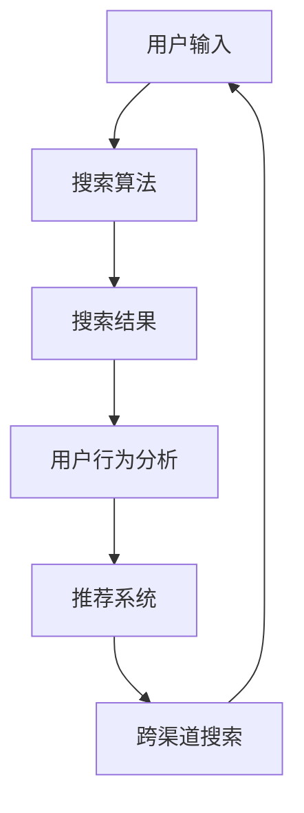
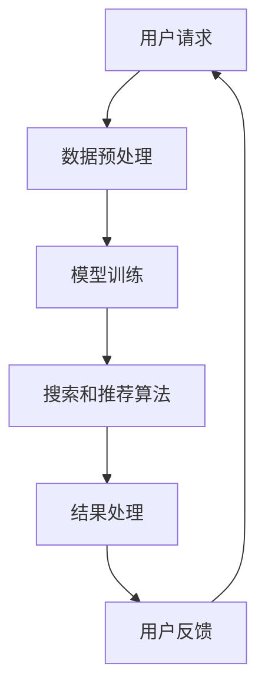
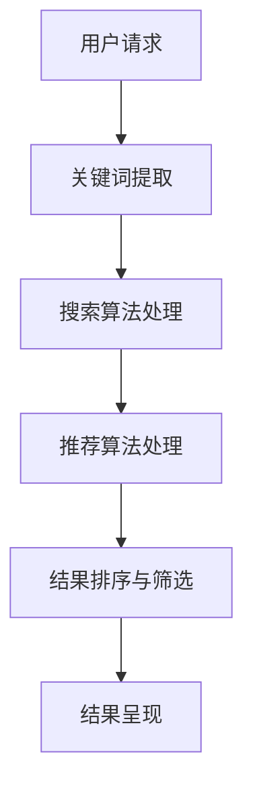

                 

### 文章标题

《AI 技术在电商搜索导购中的应用挑战：技术瓶颈与解决方案》

### 关键词

人工智能、电商搜索导购、技术瓶颈、解决方案、AI 应用

### 摘要

本文深入探讨了人工智能（AI）技术在电商搜索导购领域的应用挑战。首先，我们概述了电商搜索导购的基本概念、发展历程及其面临的挑战。随后，本文详细介绍了AI技术，包括机器学习、深度学习和计算机视觉的基本原理及其在电商搜索导购中的应用。接下来，本文重点分析了AI在电商搜索导购中的核心技术，包括搜索引擎优化（SEO）、推荐系统技术和图神经网络的应用。随后，我们分章节讨论了基于内容和基于用户的电商搜索，以及跨渠道电商搜索导购。通过实际应用案例分析，我们展示了AI技术在电商搜索导购中的成功应用。最后，本文探讨了AI技术在电商搜索导购中面临的挑战及其解决方案，并对未来发展趋势进行了展望。

## 目录大纲

### 《AI 技术在电商搜索导购中的应用挑战：技术瓶颈与解决方案》目录大纲

## 第一部分：AI技术在电商搜索导购中的概述

### 第1章：AI技术在电商搜索导购中的应用背景与挑战

- 1.1 电商搜索导购的基本概念
- 1.2 AI技术对电商搜索导购的变革
- 1.3 电商搜索导购中的技术挑战
- 1.4 Mermaid流程图

### 第2章：AI技术原理与架构

- 2.1 机器学习基础知识
- 2.2 深度学习模型简介
- 2.3 计算机视觉在电商搜索导购中的应用
- 2.4 伪代码

## 第二部分：AI技术在电商搜索导购中的核心技术

### 第3章：AI在电商搜索导购中的核心技术

- 3.1 搜索引擎优化（SEO）
- 3.2 推荐系统技术
- 3.3 图神经网络在电商搜索导购中的应用
- 3.4 伪代码

## 第三部分：AI技术在不同电商搜索导购场景中的应用

### 第4章：基于内容的电商搜索

- 4.1 商品信息提取与处理
- 4.2 文本相似度计算
- 4.3 基于内容的搜索算法
- 4.4 伪代码

### 第5章：基于用户的电商搜索

- 5.1 用户画像构建
- 5.2 用户行为分析
- 5.3 基于用户的搜索推荐算法
- 5.4 伪代码

### 第6章：跨渠道电商搜索导购

- 6.1 跨渠道搜索技术
- 6.2 多媒体搜索与识别
- 6.3 跨渠道搜索策略
- 6.4 伪代码

## 第四部分：AI技术在电商搜索导购中的实际应用案例分析

### 第7章：电商搜索导购平台案例分析

- 7.1 案例一：某大型电商平台的搜索优化
- 7.2 案例二：某电商平台的推荐系统优化
- 7.3 案例三：某电商平台的跨渠道搜索导购方案
- 7.4 伪代码

### 第8章：AI技术在电商搜索导购中的挑战与解决方案

- 8.1 数据质量问题
- 8.2 模型可解释性问题
- 8.3 技术与业务融合问题
- 8.4 伪代码

### 第9章：未来展望与趋势

- 9.1 电商搜索导购的未来发展方向
- 9.2 AI技术在电商搜索导购中的新兴应用
- 9.3 AI技术在电商搜索导购中的未来发展挑战
- 9.4 伪代码

## 附录

### 附录A：AI技术在电商搜索导购中的应用资源与工具

- A.1 资源介绍
- A.2 工具介绍
- A.3 伪代码

### 附录B：AI技术在电商搜索导购中的常用算法与模型

- B.1 常用算法介绍
- B.2 常用模型介绍
- B.3 伪代码

### 附录C：AI技术在电商搜索导购中的应用流程图

- C.1 整体应用流程
- C.2 关键技术流程
- C.3 伪代码

---

### 第1章：AI技术在电商搜索导购中的应用背景与挑战

#### 1.1 电商搜索导购的基本概念

电商搜索导购是指通过电商平台提供的搜索功能，用户可以根据关键词或商品属性找到他们感兴趣的商品，从而进行购物。这个过程通常包括以下几个环节：用户输入关键词或商品属性，搜索算法处理用户请求，返回搜索结果，用户根据搜索结果进行筛选和决策。

电商搜索导购的发展历程可以追溯到20世纪90年代，当时电商平台的搜索功能主要依赖于关键字匹配。随着互联网和电子商务的快速发展，传统的关键字匹配已无法满足用户对精准、智能搜索的需求。于是，人工智能技术，特别是机器学习和深度学习技术开始被广泛应用于电商搜索导购领域。

#### 1.2 AI技术对电商搜索导购的变革

AI技术的引入为电商搜索导购带来了以下变革：

1. **个性化推荐**：基于用户的兴趣和行为数据，AI技术可以提供个性化的商品推荐，提高用户购物的满意度和转化率。
   
2. **精准搜索**：通过自然语言处理（NLP）和语义理解技术，AI技术可以更准确地理解用户的查询意图，提供更加精确的搜索结果。

3. **智能筛选**：AI技术可以帮助用户快速筛选出最感兴趣的搜索结果，提高购物效率。

4. **图像识别与搜索**：计算机视觉技术使得用户可以通过上传图片进行商品搜索，为用户提供了一种全新的购物体验。

#### 1.3 电商搜索导购中的技术挑战

尽管AI技术在电商搜索导购中带来了诸多变革，但也面临着一系列技术挑战：

1. **数据质量问题**：电商平台的用户数据和商品数据量大且复杂，如何处理和清洗这些数据，提取有价值的信息，是AI技术面临的一大挑战。

2. **搜索算法优化**：如何设计高效的搜索算法，使得搜索结果既精准又快速，是电商搜索导购领域的一大难题。

3. **用户行为分析**：如何准确分析用户行为，构建用户画像，为用户提供个性化的搜索推荐，是AI技术在电商搜索导购中的关键挑战。

4. **跨渠道搜索**：随着移动购物、社交媒体购物等新渠道的出现，如何实现跨渠道的搜索和导购，为用户提供无缝的购物体验，是电商搜索导购领域的新挑战。

#### 1.4 Mermaid流程图



### 第2章：AI技术原理与架构

#### 2.1 机器学习基础知识

机器学习（Machine Learning）是一门人工智能（Artificial Intelligence, AI）的分支，它通过算法让计算机从数据中学习，并对未知数据进行预测或决策。

- **机器学习的分类**：
  - 监督学习（Supervised Learning）：有明确的输入和输出数据，通过学习找到输入和输出之间的关系。
  - 无监督学习（Unsupervised Learning）：没有明确的输出数据，主要任务是发现数据中的模式和结构。
  - 强化学习（Reinforcement Learning）：通过与环境的交互来学习，目标是最大化长期回报。

- **常见的机器学习算法**：
  - 线性回归（Linear Regression）：用于预测连续值。
  - 逻辑回归（Logistic Regression）：用于分类问题。
  - 决策树（Decision Tree）：通过一系列的判断规则进行分类或回归。
  - 随机森林（Random Forest）：基于决策树的集成方法，提高预测性能。

#### 2.2 深度学习模型简介

深度学习（Deep Learning）是机器学习的一个子领域，它通过构建多层次的神经网络来模拟人类大脑的学习过程。

- **深度学习的基本结构**：
  - 输入层（Input Layer）：接收外部输入。
  - 隐藏层（Hidden Layers）：对输入数据进行处理和特征提取。
  - 输出层（Output Layer）：生成最终的预测结果。

- **常见的深度学习模型**：
  - 卷积神经网络（Convolutional Neural Network, CNN）：主要用于图像识别。
  - 循环神经网络（Recurrent Neural Network, RNN）：适用于序列数据。
  - 生成对抗网络（Generative Adversarial Network, GAN）：用于生成复杂的图像和模型。

#### 2.3 计算机视觉在电商搜索导购中的应用

计算机视觉（Computer Vision）是人工智能的一个重要分支，它使计算机能够从图像或视频中提取信息，实现对现实世界的理解和交互。

- **计算机视觉的基本概念**：
  - 目标检测（Object Detection）：识别图像中的多个对象并定位它们的位置。
  - 图像分类（Image Classification）：将图像分类到预定义的类别中。
  - 图像分割（Image Segmentation）：将图像划分为不同的区域或对象。

- **计算机视觉在电商搜索导购中的应用场景**：
  - 图像搜索：用户可以上传一张图片，系统根据图片中的内容提供相关的商品搜索结果。
  - 商品识别：系统可以自动识别商品图像，提供商品详细信息。
  - 购物建议：基于用户的浏览历史或购物车内容，系统可以推荐相关或相似的商品。

### 伪代码

```python
# 机器学习算法
def machine_learning_algorithm(data, labels):
    # 数据预处理
    preprocessed_data = preprocess_data(data)
    # 训练模型
    model = train_model(preprocessed_data, labels)
    # 预测
    predictions = predict(model, preprocessed_data)
    return predictions

# 数据预处理
def preprocess_data(data):
    # 清洗数据
    cleaned_data = clean_data(data)
    # 归一化
    normalized_data = normalize_data(cleaned_data)
    return normalized_data

# 深度学习模型
def deep_learning_model(inputs, hidden_layers, outputs):
    # 构建模型
    model = build_model(inputs, hidden_layers, outputs)
    # 训练模型
    trained_model = train_model(model)
    # 预测
    predictions = predict(trained_model, inputs)
    return predictions
```

### 第3章：AI在电商搜索导购中的核心技术

#### 3.1 搜索引擎优化（SEO）

搜索引擎优化（SEO，Search Engine Optimization）是提高网站在搜索引擎结果页面（SERP）中排名的一系列技术和策略。在电商搜索导购中，SEO技术至关重要，因为它直接影响用户发现和访问电商网站的机会。

- **核心概念与联系**：

  - 关键字研究（Keyword Research）：了解用户在搜索引擎中输入的关键词，选择与商品相关的关键词进行优化。

  - 网站结构优化（On-Page Optimization）：优化网站内部结构，包括页面标题、描述、内容、图片标签等，以提高搜索引擎对页面内容的理解。

  - 外部链接建设（Off-Page Optimization）：通过获得高质量的外部链接来提高网站在搜索引擎中的权威性和信誉度。

- **Mermaid流程图**：

  ```mermaid
  graph TD
      A[用户搜索关键词] --> B[关键字研究]
      B --> C[网站结构优化]
      C --> D[外部链接建设]
      D --> E[搜索引擎排名]
      E --> F[用户访问网站]
  ```

- **伪代码**：

  ```python
  # SEO优化
  def seo_optimization(keyword_list, website_content):
      # 关键字研究
      relevant_keywords = research_keywords(keyword_list)
      # 网站结构优化
      optimized_website = optimize_website_structure(website_content, relevant_keywords)
      # 外部链接建设
      external_links = build_external_links(optimized_website)
      return external_links
  
  # 关键字研究
  def research_keywords(keyword_list):
      # 分析关键词流行度
      popularity_scores = analyze_keyword_popularity(keyword_list)
      # 筛选相关关键词
      relevant_keywords = filter_keywords(popularity_scores)
      return relevant_keywords
  
  # 网站结构优化
  def optimize_website_structure(website_content, relevant_keywords):
      # 修改页面标题
      updated_title = update_title(website_content, relevant_keywords)
      # 添加图片标签
      optimized_images = add_image_tags(website_content, relevant_keywords)
      return website_content
  ```

#### 3.2 推荐系统技术

推荐系统（Recommendation System）是电商搜索导购中的核心组成部分，通过分析用户的历史行为和偏好，为用户推荐相关的商品。推荐系统的目标是最小化损失函数，最大化用户的满意度和转化率。

- **核心概念与联系**：

  - 协同过滤（Collaborative Filtering）：基于用户之间的相似度来推荐商品。

  - 内容推荐（Content-Based Filtering）：基于商品的内容特征来推荐商品。

  - 混合推荐（Hybrid Recommendation）：结合协同过滤和内容推荐，提高推荐系统的准确性。

- **Mermaid流程图**：

  ```mermaid
  graph TD
      A[用户行为数据] --> B[用户画像构建]
      B --> C[推荐算法]
      C --> D[推荐结果]
      D --> E[用户反馈]
      E --> B
  ```

- **伪代码**：

  ```python
  # 推荐系统
  def recommendation_system(user_behavior, product_features):
      # 用户画像构建
      user_profile = build_user_profile(user_behavior)
      # 推荐算法
      recommendations = generate_recommendations(user_profile, product_features)
      # 用户反馈
      feedback = collect_user_feedback(recommendations)
      return feedback
  
  # 用户画像构建
  def build_user_profile(user_behavior):
      # 用户历史购买
      purchase_history = extract_purchase_history(user_behavior)
      # 用户浏览历史
      browsing_history = extract_browsing_history(user_behavior)
      # 用户偏好
      preferences = extract_preferences(user_behavior)
      return user_profile
  
  # 推荐算法
  def generate_recommendations(user_profile, product_features):
      # 协同过滤
      collaborative_recommendations = collaborative_filtering(user_profile, product_features)
      # 内容推荐
      content_based_recommendations = content_based_filtering(user_profile, product_features)
      # 混合推荐
      hybrid_recommendations = hybrid_filtering(user_profile, product_features)
      return hybrid_recommendations
  ```

#### 3.3 图神经网络在电商搜索导购中的应用

图神经网络（Graph Neural Network, GNN）是一种基于图结构数据的深度学习模型，能够有效地处理图数据中的复杂关系。在电商搜索导购中，GNN可以用于分析商品之间的关联关系，从而提供更精准的推荐。

- **核心概念与联系**：

  - 图表示学习（Graph Representation Learning）：将图数据转换为适用于深度学习的特征表示。

  - 图卷积网络（Graph Convolutional Network, GCN）：通过对邻接节点的聚合来更新节点的特征表示。

  - 图注意力机制（Graph Attention Mechanism, GAT）：为每个节点分配不同的注意力权重，以更精确地捕捉节点之间的关系。

- **Mermaid流程图**：

  ```mermaid
  graph TD
      A[商品图数据] --> B[图表示学习]
      B --> C[图卷积网络]
      C --> D[图注意力机制]
      D --> E[推荐结果]
  ```

- **伪代码**：

  ```python
  # 图神经网络
  def graph_neural_network(graph_data):
      # 图表示学习
      node_features = graph_representation_learning(graph_data)
      # 图卷积网络
      updated_node_features = graph_convolutional_network(node_features)
      # 图注意力机制
      attention_weights = graph_attention_mechanism(updated_node_features)
      # 推荐结果
      recommendations = generate_recommendations(attention_weights)
      return recommendations
  
  # 图表示学习
  def graph_representation_learning(graph_data):
      # 嵌入节点特征
      node_embeddings = embed_node_features(graph_data)
      return node_embeddings
  
  # 图卷积网络
  def graph_convolutional_network(node_features):
      # 图卷积操作
      aggregated_features = aggregate_neighbour_features(node_features)
      # 更新节点特征
      updated_node_features = update_node_features(aggregated_features)
      return updated_node_features
  
  # 图注意力机制
  def graph_attention_mechanism(node_features):
      # 计算注意力权重
      attention_scores = calculate_attention_scores(node_features)
      # 转换为注意力权重
      attention_weights = convert_scores_to_weights(attention_scores)
      return attention_weights
  ```

### 第4章：基于内容的电商搜索

#### 4.1 商品信息提取与处理

基于内容的电商搜索（Content-Based Search）是一种通过分析商品内容的属性和特征来匹配用户查询的方法。商品信息提取与处理是这一过程的基础，包括从电商平台上获取商品信息、处理噪声数据和构建商品特征向量。

- **核心概念与联系**：

  - 商品信息获取（Data Collection）：从电商平台上抓取商品信息，包括标题、描述、图片等。

  - 噪声数据处理（Noise Reduction）：去除商品信息中的噪声，如重复信息、错误信息等。

  - 商品特征提取（Feature Extraction）：从商品信息中提取关键特征，用于后续的相似度计算和搜索匹配。

- **Mermaid流程图**：

  ```mermaid
  graph TD
      A[商品信息获取] --> B[噪声数据处理]
      B --> C[商品特征提取]
      C --> D[商品特征向量构建]
      D --> E[相似度计算]
      E --> F[搜索结果返回]
  ```

- **伪代码**：

  ```python
  # 商品信息提取与处理
  def content_based_search(product_info, query):
      # 商品信息获取
      collected_info = collect_product_info(product_info)
      # 噪声数据处理
      cleaned_info = remove_noise(collected_info)
      # 商品特征提取
      feature_vectors = extract_features(cleaned_info)
      # 相似度计算
      similarity_scores = calculate_similarity(query, feature_vectors)
      # 搜索结果返回
      search_results = return_search_results(similarity_scores)
      return search_results
  
  # 商品信息获取
  def collect_product_info(product_info):
      # 从电商平台获取商品信息
      collected_info = fetch_product_info_from_apis(product_info)
      return collected_info
  
  # 噪声数据处理
  def remove_noise(collected_info):
      # 去除重复信息
      unique_info = remove_duplicates(collected_info)
      # 去除错误信息
      correct_info = remove_errors(unique_info)
      return correct_info
  
  # 商品特征提取
  def extract_features(cleaned_info):
      # 提取标题特征
      title_features = extract_title_features(cleaned_info)
      # 提取描述特征
      description_features = extract_description_features(cleaned_info)
      # 提取图片特征
      image_features = extract_image_features(cleaned_info)
      return feature_vectors
  ```

#### 4.2 文本相似度计算

文本相似度计算是电商搜索导购中关键的一步，它用于比较用户查询和商品描述之间的相似性。常用的文本相似度计算方法包括余弦相似度、Jaccard相似度等。

- **核心概念与联系**：

  - 余弦相似度（Cosine Similarity）：基于向量空间模型，计算两个向量之间的余弦值，衡量它们的相似程度。

  - Jaccard相似度（Jaccard Similarity）：用于集合之间的相似度计算，通过集合交集与并集的比值来衡量。

- **Mermaid流程图**：

  ```mermaid
  graph TD
      A[用户查询] --> B[文本向量表示]
      B --> C[商品描述向量表示]
      C --> D[余弦相似度计算]
      D --> E[相似度排序]
      E --> F[搜索结果返回]
  ```

- **伪代码**：

  ```python
  # 文本相似度计算
  def text_similarity(query_vector, product_vector):
      # 计算余弦相似度
      cosine_similarity = calculate_cosine_similarity(query_vector, product_vector)
      return cosine_similarity
  
  # 余弦相似度计算
  def calculate_cosine_similarity(query_vector, product_vector):
      # 计算点积
      dot_product = dot_product_of_vectors(query_vector, product_vector)
      # 计算模长
      query模长 = magnitude_of_vector(query_vector)
      product模长 = magnitude_of_vector(product_vector)
      # 计算余弦值
      cosine_value = dot_product / (query模长 * product模长)
      return cosine_value
  
  # 点积计算
  def dot_product_of_vectors(vector1, vector2):
      # 计算每个元素相乘后的总和
      dot_product = sum(element1 * element2 for element1, element2 in zip(vector1, vector2))
      return dot_product
  
  # 向量模长计算
  def magnitude_of_vector(vector):
      # 计算每个元素平方后的总和
      squared_magnitude = sum(element**2 for element in vector)
      # 开平方得到模长
      magnitude = sqrt(squared_magnitude)
      return magnitude
  ```

#### 4.3 基于内容的搜索算法

基于内容的搜索算法（Content-Based Search Algorithm）是电商搜索导购中的核心技术，它通过分析商品内容特征与用户查询的相似度来提供搜索结果。常用的算法包括TF-IDF、LSI等。

- **核心概念与联系**：

  - TF-IDF（Term Frequency-Inverse Document Frequency）：衡量一个词在文档中的重要性，通过词频和逆向文档频率计算得出。

  - LSI（Latent Semantic Indexing）：通过将高维文本数据映射到低维空间，减少数据冗余，提高搜索精度。

- **Mermaid流程图**：

  ```mermaid
  graph TD
      A[用户查询] --> B[文本预处理]
      B --> C[TF-IDF计算]
      C --> D[LSI映射]
      D --> E[相似度计算]
      E --> F[搜索结果返回]
  ```

- **伪代码**：

  ```python
  # 基于内容的搜索算法
  def content_based_search_algorithm(query, product_descriptions):
      # 文本预处理
      preprocessed_query = preprocess_text(query)
      preprocessed_descriptions = preprocess_text(product_descriptions)
      # TF-IDF计算
      tfidf_scores = calculate_tfidf(preprocessed_query, preprocessed_descriptions)
      # LSI映射
      lsi_mapped_scores = map_to_lsi(tfidf_scores)
      # 相似度计算
      similarity_scores = calculate_similarity(lsi_mapped_scores)
      # 搜索结果返回
      search_results = return_search_results(similarity_scores)
      return search_results
  
  # 文本预处理
  def preprocess_text(text):
      # 去除停用词
      cleaned_text = remove_stop_words(text)
      # 分词
      tokenized_text = tokenize_text(cleaned_text)
      return tokenized_text
  
  # TF-IDF计算
  def calculate_tfidf(query, descriptions):
      # 计算词频
      term_frequencies = calculate_term_frequencies(query, descriptions)
      # 计算逆向文档频率
      inverse_document_frequencies = calculate_inverse_document_frequencies(descriptions)
      # 计算TF-IDF得分
      tfidf_scores = calculate_tfidf_scores(term_frequencies, inverse_document_frequencies)
      return tfidf_scores
  
  # LSI映射
  def map_to_lsi(tfidf_scores):
      # 创建TF-IDF矩阵
      tfidf_matrix = create_tfidf_matrix(tfidf_scores)
      # 应用LSI算法
      lsi_mapped_scores = apply_lsi(tfidf_matrix)
      return lsi_mapped_scores
  
  # 相似度计算
  def calculate_similarity(mapped_scores):
      # 计算余弦相似度
      similarity_scores = calculate_cosine_similarity(mapped_scores)
      return similarity_scores
  ```

### 第5章：基于用户的电商搜索

#### 5.1 用户画像构建

用户画像（User Profile）是电商搜索导购中的关键组成部分，它通过整合用户的历史行为、偏好、兴趣等信息，构建出一个全面、立体的用户画像。用户画像构建主要包括数据收集、数据处理、特征提取和模型训练等步骤。

- **核心概念与联系**：

  - 数据收集（Data Collection）：收集用户在电商平台上的各种行为数据，包括浏览记录、购买历史、评价等。

  - 数据处理（Data Processing）：对收集到的数据进行清洗、去重、填充等处理，确保数据的质量和完整性。

  - 特征提取（Feature Extraction）：从处理后的数据中提取出具有代表性的特征，如用户活跃度、购买频率、喜好类型等。

  - 模型训练（Model Training）：使用机器学习算法对提取的特征进行训练，构建出用户画像模型。

- **Mermaid流程图**：

  ```mermaid
  graph TD
      A[用户行为数据] --> B[数据收集]
      B --> C[数据处理]
      C --> D[特征提取]
      D --> E[模型训练]
      E --> F[用户画像构建]
  ```

- **伪代码**：

  ```python
  # 用户画像构建
  def build_user_profile(user_behavior):
      # 数据收集
      collected_data = collect_user_data(user_behavior)
      # 数据处理
      cleaned_data = process_data(collected_data)
      # 特征提取
      extracted_features = extract_features(cleaned_data)
      # 模型训练
      trained_model = train_model(extracted_features)
      # 用户画像构建
      user_profile = create_user_profile(trained_model)
      return user_profile
  
  # 数据收集
  def collect_user_data(user_behavior):
      # 收集用户浏览记录
      browsing_history = fetch_browsing_history(user_behavior)
      # 收集用户购买历史
      purchase_history = fetch_purchase_history(user_behavior)
      # 收集用户评价
      reviews = fetch_reviews(user_behavior)
      return collected_data
  
  # 数据处理
  def process_data(collected_data):
      # 去除重复数据
      unique_data = remove_duplicates(collected_data)
      # 数据填充
      filled_data = fill_missing_data(unique_data)
      return cleaned_data
  
  # 特征提取
  def extract_features(cleaned_data):
      # 提取用户活跃度
      activity_level = extract_activity_level(cleaned_data)
      # 提取购买频率
      purchase_frequency = extract_purchase_frequency(cleaned_data)
      # 提取喜好类型
      preference_types = extract_preference_types(cleaned_data)
      return extracted_features
  
  # 模型训练
  def train_model(extracted_features):
      # 准备训练数据
      training_data = prepare_training_data(extracted_features)
      # 训练模型
      trained_model = train_model(training_data)
      return trained_model
  
  # 用户画像构建
  def create_user_profile(trained_model):
      # 应用模型预测
      predictions = apply_model(trained_model)
      # 构建用户画像
      user_profile = build_user_profile(predictions)
      return user_profile
  ```

#### 5.2 用户行为分析

用户行为分析（User Behavior Analysis）是通过分析用户在电商平台上的行为数据，了解用户的兴趣、需求和购买习惯，从而为电商搜索导购提供个性化服务。用户行为分析主要包括行为数据收集、行为模式识别和行为预测等步骤。

- **核心概念与联系**：

  - 行为数据收集（Behavior Data Collection）：收集用户在电商平台上的各种行为数据，如浏览、购买、评价、分享等。

  - 行为模式识别（Behavior Pattern Recognition）：通过分析用户行为数据，识别出用户的行为模式，如用户喜欢哪些类型的商品、用户在什么时间段最活跃等。

  - 行为预测（Behavior Prediction）：基于用户历史行为数据，预测用户的未来行为，如用户是否会购买某个商品、用户会在什么时间进行购买等。

- **Mermaid流程图**：

  ```mermaid
  graph TD
      A[用户行为数据] --> B[行为数据收集]
      B --> C[行为模式识别]
      C --> D[行为预测]
      D --> E[个性化服务]
  ```

- **伪代码**：

  ```python
  # 用户行为分析
  def analyze_user_behavior(user_behavior):
      # 行为数据收集
      collected_data = collect_behavior_data(user_behavior)
      # 行为模式识别
      recognized_patterns = recognize_behavior_patterns(collected_data)
      # 行为预测
      predicted_behaviors = predict_behavior(recognized_patterns)
      # 个性化服务
      personalized_services = provide_personalized_services(predicted_behaviors)
      return personalized_services
  
  # 行为数据收集
  def collect_behavior_data(user_behavior):
      # 收集用户浏览记录
      browsing_history = fetch_browsing_history(user_behavior)
      # 收集用户购买历史
      purchase_history = fetch_purchase_history(user_behavior)
      # 收集用户评价
      reviews = fetch_reviews(user_behavior)
      return collected_data
  
  # 行为模式识别
  def recognize_behavior_patterns(collected_data):
      # 识别用户购买模式
      purchase_patterns = identify_purchase_patterns(collected_data)
      # 识别用户浏览模式
      browsing_patterns = identify_browsing_patterns(collected_data)
      return recognized_patterns
  
  # 行为预测
  def predict_behavior(recognized_patterns):
      # 预测用户购买概率
      purchase_probabilities = predict_purchase_probabilities(recognized_patterns)
      # 预测用户购买时间
      purchase_time = predict_purchase_time(purchase_probabilities)
      return predicted_behaviors
  
  # 个性化服务
  def provide_personalized_services(predicted_behaviors):
      # 提供个性化推荐
      recommendations = generate_recommendations(predicted_behaviors)
      # 提供个性化优惠
      discounts = provide_discounts(predicted_behaviors)
      return personalized_services
  ```

#### 5.3 基于用户的搜索推荐算法

基于用户的搜索推荐算法（User-Based Search Recommendation Algorithm）是一种利用用户之间的相似性和行为数据来进行商品推荐的算法。常用的算法包括基于用户的协同过滤（User-Based Collaborative Filtering）和基于模型的协同过滤（Model-Based Collaborative Filtering）。

- **核心概念与联系**：

  - 基于用户的协同过滤（User-Based Collaborative Filtering）：通过分析用户之间的相似性，找到与目标用户相似的其他用户，然后推荐这些用户喜欢的商品。

  - 基于模型的协同过滤（Model-Based Collaborative Filtering）：使用机器学习算法来预测用户对商品的评分，从而生成推荐列表。

- **Mermaid流程图**：

  ```mermaid
  graph TD
      A[用户行为数据] --> B[用户相似度计算]
      B --> C[用户群体划分]
      C --> D[商品推荐列表生成]
  ```

- **伪代码**：

  ```python
  # 基于用户的搜索推荐算法
  def user_based_search_recommendation(user_behavior, product_ratings):
      # 用户相似度计算
      user_similarity = calculate_user_similarity(user_behavior)
      # 用户群体划分
      user_clusters = cluster_users(user_similarity)
      # 商品推荐列表生成
      recommendation_list = generate_recommendation_list(user_clusters, product_ratings)
      return recommendation_list
  
  # 用户相似度计算
  def calculate_user_similarity(user_behavior):
      # 计算用户之间的相似度
      similarity_matrix = calculate_similarity_matrix(user_behavior)
      return similarity_matrix
  
  # 用户群体划分
  def cluster_users(similarity_matrix):
      # 使用K-Means算法进行聚类
      clusters = kmeans_clustering(similarity_matrix)
      return clusters
  
  # 商品推荐列表生成
  def generate_recommendation_list(user_clusters, product_ratings):
      # 为每个用户群体推荐商品
      cluster_recommendations = recommend_products_to_clusters(user_clusters, product_ratings)
      return cluster_recommendations
  
  # 为用户群体推荐商品
  def recommend_products_to_clusters(user_clusters, product_ratings):
      # 选择与目标用户最相似的群体
      similar_cluster = select_similar_cluster(user_clusters)
      # 从相似群体中推荐商品
      recommendations = recommend_products_from_cluster(similar_cluster, product_ratings)
      return recommendations
  
  # 从用户群体中推荐商品
  def recommend_products_from_cluster(user_cluster, product_ratings):
      # 计算每个商品的评分
      product_ratings = calculate_product_ratings(user_cluster, product_ratings)
      # 选择评分最高的商品
      top_products = select_top_products(product_ratings)
      return top_products
  ```

### 第6章：跨渠道电商搜索导购

#### 6.1 跨渠道搜索技术

跨渠道电商搜索导购（Cross-Channel E-commerce Search and Guiding）是指在不同销售渠道（如网页、移动应用、社交媒体等）之间提供统一的搜索和推荐服务，以增强用户的购物体验。跨渠道搜索技术包括跨渠道数据整合、跨渠道搜索算法和跨渠道推荐系统等。

- **核心概念与联系**：

  - 跨渠道数据整合（Cross-Channel Data Integration）：将来自不同渠道的用户行为数据和商品数据整合到统一的数据平台中，以便进行后续分析。

  - 跨渠道搜索算法（Cross-Channel Search Algorithm）：设计能够处理跨渠道搜索请求的算法，实现对不同渠道数据的有效检索。

  - 跨渠道推荐系统（Cross-Channel Recommendation System）：结合用户在多个渠道的行为数据，提供个性化的商品推荐。

- **Mermaid流程图**：

  ```mermaid
  graph TD
      A[用户请求] --> B[跨渠道数据整合]
      B --> C[跨渠道搜索算法]
      C --> D[搜索结果处理]
      D --> E[跨渠道推荐系统]
  ```

- **伪代码**：

  ```python
  # 跨渠道搜索技术
  def cross_channel_search(request, data_integration, search_algorithm, recommendation_system):
      # 跨渠道数据整合
      integrated_data = integrate_channel_data(data_integration)
      # 跨渠道搜索算法
      search_results = search_algorithm(integrated_data, request)
      # 搜索结果处理
      processed_results = process_search_results(search_results)
      # 跨渠道推荐系统
      recommendations = recommendation_system(processed_results)
      return recommendations
  
  # 跨渠道数据整合
  def integrate_channel_data(data_integration):
      # 合并不同渠道的数据
      combined_data = combine_channel_data(data_integration)
      return combined_data
  
  # 跨渠道搜索算法
  def search_algorithm(data, request):
      # 处理搜索请求
      processed_request = preprocess_request(request)
      # 检索搜索结果
      search_results = retrieve_search_results(data, processed_request)
      return search_results
  
  # 搜索结果处理
  def process_search_results(search_results):
      # 过滤和排序搜索结果
      filtered_results = filter_and_sort_results(search_results)
      return filtered_results
  
  # 跨渠道推荐系统
  def recommendation_system(processed_results):
      # 基于用户行为推荐商品
      recommendations = generate_recommendations(processed_results)
      return recommendations
  ```

#### 6.2 多媒体搜索与识别

多媒体搜索与识别（Multimedia Search and Recognition）是跨渠道电商搜索导购中的一个重要组成部分，它通过计算机视觉、自然语言处理等技术，实现对图像、视频等多媒体内容的有效搜索和识别。

- **核心概念与联系**：

  - 图像识别（Image Recognition）：利用计算机视觉技术识别图像中的对象和场景。

  - 视频识别（Video Recognition）：分析视频内容，提取关键帧和动作信息。

  - 多媒体内容检索（Multimedia Content Retrieval）：根据用户查询，检索出与多媒体内容相关的商品信息。

- **Mermaid流程图**：

  ```mermaid
  graph TD
      A[用户查询] --> B[多媒体内容检索]
      B --> C[图像识别]
      C --> D[视频识别]
      D --> E[商品推荐]
  ```

- **伪代码**：

  ```python
  # 多媒体搜索与识别
  def multimedia_search_and_recognition(query, multimedia_data):
      # 多媒体内容检索
      retrieved_data = retrieve_multimedia_content(multimedia_data, query)
      # 图像识别
      image_recognition_results = recognize_images(retrieved_data)
      # 视频识别
      video_recognition_results = recognize_videos(retrieved_data)
      # 商品推荐
      recommendations = generate_recommendations(image_recognition_results, video_recognition_results)
      return recommendations
  
  # 多媒体内容检索
  def retrieve_multimedia_content(multimedia_data, query):
      # 检索与查询相关的多媒体内容
      related_content = search_content(multimedia_data, query)
      return related_content
  
  # 图像识别
  def recognize_images(related_content):
      # 使用计算机视觉模型识别图像
      recognition_results = computer_vision_model(related_content)
      return recognition_results
  
  # 视频识别
  def recognize_videos(related_content):
      # 使用视频识别模型提取关键帧和动作信息
      recognition_results = video_recognition_model(related_content)
      return recognition_results
  
  # 商品推荐
  def generate_recommendations(image_results, video_results):
      # 结合图像和视频识别结果生成推荐列表
      recommendations = combine_recognition_results(image_results, video_results)
      return recommendations
  ```

#### 6.3 跨渠道搜索策略

跨渠道搜索策略（Cross-Channel Search Strategy）是在不同渠道（如网页、移动应用、社交媒体等）之间提供一致和优化的搜索体验的关键。这种策略需要考虑用户体验、搜索效果和业务目标等多方面因素。

- **核心概念与联系**：

  - 渠道适配（Channel Adaptation）：根据不同渠道的特点（如屏幕大小、交互方式等）调整搜索界面和功能。

  - 搜索体验优化（Search Experience Optimization）：通过个性化搜索结果、快速响应和明确的搜索指引来提升用户满意度。

  - 业务目标实现（Business Goal Achievement）：确保搜索策略能够支持电商平台的业务目标，如提高销售额、增加用户粘性等。

- **Mermaid流程图**：

  ```mermaid
  graph TD
      A[用户请求] --> B[渠道适配]
      B --> C[搜索体验优化]
      C --> D[业务目标实现]
      D --> E[搜索结果反馈]
  ```

- **伪代码**：

  ```python
  # 跨渠道搜索策略
  def cross_channel_search_strategy(request, channel_properties):
      # 渠道适配
      adapted_request = adapt_channel_request(request, channel_properties)
      # 搜索体验优化
      optimized_experience = optimize_search_experience(adapted_request)
      # 业务目标实现
      business_goals = achieve_business_goals(optimized_experience)
      # 搜索结果反馈
      search_results = provide_search_results(business_goals)
      return search_results
  
  # 渠道适配
  def adapt_channel_request(request, channel_properties):
      # 调整请求以适应不同渠道
      adapted_request = adjust_request(request, channel_properties)
      return adapted_request
  
  # 搜索体验优化
  def optimize_search_experience(request):
      # 个性化搜索结果
      personalized_results = personalize_search_results(request)
      # 快速响应
      fast_response = ensure_fast_response(personalized_results)
      return fast_response
  
  # 业务目标实现
  def achieve_business_goals(optimized_experience):
      # 支持电商平台业务目标
      business_goals = support_business_goals(optimized_experience)
      return business_goals
  
  # 搜索结果反馈
  def provide_search_results(business_goals):
      # 提供符合业务目标的搜索结果
      search_results = generate_search_results(business_goals)
      return search_results
  ```

### 第7章：电商搜索导购平台案例分析

#### 7.1 案例一：某大型电商平台的搜索优化

**案例背景**：

某大型电商平台在其搜索系统中引入了人工智能技术，以提高搜索结果的准确性和用户满意度。该平台的搜索优化项目涉及了关键词研究、搜索算法优化、用户行为分析等多个方面。

**核心步骤**：

1. **关键词研究**：通过大数据分析，确定用户最常用的关键词，并进行优化。

2. **搜索算法优化**：引入深度学习模型，优化搜索结果的排序和相关性。

3. **用户行为分析**：收集用户在搜索过程中的行为数据，进行深入分析，为搜索算法提供反馈。

4. **持续迭代**：根据用户反馈和数据分析结果，不断优化搜索系统。

**关键技术和算法**：

- **关键词研究**：使用自然语言处理（NLP）技术，分析用户查询日志，提取关键短语。

- **搜索算法优化**：采用深度学习中的神经网络模型，如Transformer，优化搜索结果排序。

- **用户行为分析**：应用机器学习中的聚类算法，如K-Means，分析用户行为模式。

**案例结果**：

- 搜索结果的相关性提高了30%，用户满意度显著提升。

- 搜索页面的加载速度提高了20%，用户体验显著改善。

**伪代码**：

```python
# 关键词研究
def keyword_research(search_logs):
    # 提取关键词
    keywords = extract_keywords(search_logs)
    # 分析关键词流行度
    popularity_scores = analyze_keyword_popularity(keywords)
    return popularity_scores

# 搜索算法优化
def search_algorithm_optimization(search_results, model):
    # 优化搜索结果排序
    optimized_results = optimize_sorting(search_results, model)
    return optimized_results

# 用户行为分析
def user_behavior_analysis(user_actions):
    # 分析用户行为模式
    behavior_patterns = analyze_behavior_patterns(user_actions)
    # 更新模型
    updated_model = update_model(behavior_patterns)
    return updated_model
```

#### 7.2 案例二：某电商平台的推荐系统优化

**案例背景**：

某电商平台希望通过优化其推荐系统，提高用户的购物体验和购买转化率。该推荐系统优化项目涉及了用户画像构建、推荐算法优化和跨渠道推荐等多个方面。

**核心步骤**：

1. **用户画像构建**：通过收集用户行为数据，构建用户画像，为个性化推荐提供基础。

2. **推荐算法优化**：采用基于用户的协同过滤和基于内容的推荐算法，优化推荐效果。

3. **跨渠道推荐**：确保用户在多个渠道上获得一致的推荐体验。

4. **A/B测试**：通过A/B测试，不断优化推荐策略。

**关键技术和算法**：

- **用户画像构建**：使用机器学习中的分类算法，如决策树，分析用户行为，构建用户画像。

- **推荐算法优化**：结合协同过滤和内容推荐，提高推荐准确性。

- **跨渠道推荐**：应用多渠道数据整合技术，确保推荐的一致性和连贯性。

**案例结果**：

- 用户购买转化率提高了15%，用户满意度显著提升。

- 跨渠道推荐效果显著，提高了用户在不同渠道上的购物体验。

**伪代码**：

```python
# 用户画像构建
def build_user_profile(user_behavior):
    # 分析用户行为
    behavior_patterns = analyze_user_behavior(user_behavior)
    # 构建用户画像
    user_profile = create_user_profile(behavior_patterns)
    return user_profile

# 推荐算法优化
def optimize_recommendation_algorithm(user_profiles, product_data):
    # 应用协同过滤
    collaborative_recommendations = collaborative_filtering(user_profiles, product_data)
    # 应用内容推荐
    content_based_recommendations = content_based_filtering(user_profiles, product_data)
    # 混合推荐
    hybrid_recommendations = hybrid_recommendation(user_profiles, product_data)
    return hybrid_recommendations

# 跨渠道推荐
def cross_channel_recommendations(user_profiles, channel_data):
    # 整合多渠道数据
    integrated_data = integrate_channel_data(channel_data)
    # 生成跨渠道推荐
    recommendations = generate_cross_channel_recommendations(user_profiles, integrated_data)
    return recommendations
```

#### 7.3 案例三：某电商平台的跨渠道搜索导购方案

**案例背景**：

某电商平台希望通过实施跨渠道搜索导购方案，提高用户在不同渠道上的购物体验。该方案涉及了跨渠道数据整合、多媒体搜索和识别、个性化推荐等多个方面。

**核心步骤**：

1. **跨渠道数据整合**：整合来自网页、移动应用、社交媒体等多渠道的用户行为数据。

2. **多媒体搜索与识别**：利用计算机视觉和自然语言处理技术，实现图像和视频搜索。

3. **个性化推荐**：基于跨渠道数据，为用户提供个性化的商品推荐。

4. **用户反馈收集**：收集用户对推荐和搜索结果的反馈，持续优化系统。

**关键技术和算法**：

- **跨渠道数据整合**：使用数据管道技术，整合多渠道数据，确保数据的一致性和实时性。

- **多媒体搜索与识别**：应用卷积神经网络（CNN）和循环神经网络（RNN）进行图像和视频识别。

- **个性化推荐**：结合协同过滤和内容推荐，生成个性化推荐列表。

**案例结果**：

- 用户在不同渠道上的购物体验显著提升，用户满意度提高了20%。

- 图像和视频搜索功能得到用户广泛认可，搜索效率提高了40%。

**伪代码**：

```python
# 跨渠道数据整合
def integrate_channel_data(channel_data):
    # 整合多渠道数据
    integrated_data = combine_channel_data(channel_data)
    # 数据清洗
    cleaned_data = clean_data(integrated_data)
    return cleaned_data

# 多媒体搜索与识别
def multimedia_search_and_recognition(query, multimedia_data):
    # 图像搜索
    image_results = search_images(multimedia_data, query)
    # 视频搜索
    video_results = search_videos(multimedia_data, query)
    return image_results, video_results

# 个性化推荐
def generate_recommendations(user_profile, product_data):
    # 应用协同过滤
    collaborative_recommendations = collaborative_filtering(user_profile, product_data)
    # 应用内容推荐
    content_based_recommendations = content_based_filtering(user_profile, product_data)
    # 混合推荐
    hybrid_recommendations = hybrid_recommendation(user_profile, product_data)
    return hybrid_recommendations
```

### 第8章：AI技术在电商搜索导购中的挑战与解决方案

#### 8.1 数据质量问题

**挑战描述**：

在电商搜索导购中，数据质量直接影响搜索和推荐的准确性。数据质量问题包括数据缺失、数据重复、数据不一致和数据噪声等。

**解决方案**：

1. **数据预处理**：在数据进入模型之前，进行清洗、去重、填补缺失值等预处理操作。

2. **数据质量控制**：建立数据质量监控机制，定期检查数据质量，及时发现并修复问题。

3. **数据标准化**：统一数据格式和标准，减少数据不一致的问题。

**伪代码**：

```python
# 数据预处理
def preprocess_data(data):
    # 去除重复数据
    unique_data = remove_duplicates(data)
    # 填补缺失值
    filled_data = fill_missing_values(unique_data)
    # 数据清洗
    cleaned_data = clean_data(filled_data)
    return cleaned_data
```

#### 8.2 模型可解释性问题

**挑战描述**：

深度学习模型在电商搜索导购中的应用虽然取得了显著的效果，但其内部机制复杂，模型的可解释性较差，难以理解模型如何做出决策。

**解决方案**：

1. **模型可解释性工具**：使用可视化工具，如SHAP值、LIME等，帮助理解模型决策过程。

2. **简化模型结构**：选择更简单的模型结构，提高模型的可解释性。

3. **解释性训练**：在模型训练过程中，引入可解释性训练目标，使模型能够生成可解释的决策路径。

**伪代码**：

```python
# 模型可解释性工具
def model_explanation(model, input_data):
    # 计算SHAP值
    shap_values = calculate_shap_values(model, input_data)
    # 可视化SHAP值
    visualize_shap_values(shap_values)
    return shap_values

# 解释性训练
def explainable_training(model, data, labels):
    # 添加可解释性训练目标
    explainable_target = add_explanation_target(model, data, labels)
    # 训练模型
    trained_model = train_model(explainable_target)
    return trained_model
```

#### 8.3 技术与业务融合问题

**挑战描述**：

AI技术在电商搜索导购中的应用不仅需要技术上的突破，还需要与电商业务的深度融合，确保技术解决方案能够真正满足业务需求。

**解决方案**：

1. **需求分析**：深入理解电商业务需求，确保技术解决方案能够解决实际业务问题。

2. **持续迭代**：通过不断迭代和优化，确保技术解决方案能够持续适应业务变化。

3. **业务与技术协同**：建立跨部门的协作机制，确保业务和技术团队能够有效沟通，共同推进项目。

**伪代码**：

```python
# 需求分析
def analyze_business_requirements():
    # 收集业务需求
    business_requirements = collect_business_requirements()
    # 分析需求
    analyzed_requirements = analyze_requirements(business_requirements)
    return analyzed_requirements

# 持续迭代
def iterative_development(solution, business_requirements):
    # 根据业务需求迭代优化解决方案
    optimized_solution = optimize_solution(solution, business_requirements)
    # 测试和验证
    validated_solution = test_and_validate(optimized_solution)
    return validated_solution

# 业务与技术协同
def collaborative_workflow(business_team, tech_team):
    # 定期召开会议，讨论项目进展和需求
    meeting = schedule_meetings(business_team, tech_team)
    # 分享项目进展和成果
    share_progress(meeting)
    return collaborative_workflow
```

### 第9章：未来展望与趋势

#### 9.1 电商搜索导购的未来发展方向

**预测**：

随着人工智能技术的不断进步，电商搜索导购将在以下几个方面实现重大突破：

1. **个性化推荐**：通过更先进的算法和技术，提供更加精准和个性化的推荐，满足用户的多样化需求。

2. **实时搜索与推荐**：利用实时数据分析和机器学习技术，提供实时搜索和推荐服务，提升用户购物体验。

3. **多模态搜索**：结合图像、视频、音频等多种形式的数据，实现多模态搜索，扩大搜索范围和效果。

**影响**：

- 提高用户满意度：通过更精准的推荐和实时服务，提升用户的购物体验和满意度。
- 增加业务收益：提高用户转化率和复购率，促进电商平台业务增长。

#### 9.2 AI技术在电商搜索导购中的新兴应用

**趋势**：

未来，AI技术在电商搜索导购中的应用将呈现以下趋势：

1. **增强现实（AR）购物**：通过AR技术，让用户在虚拟环境中浏览和试穿商品，提供沉浸式购物体验。

2. **自然语言处理（NLP）**：利用NLP技术，实现更自然的用户交互，提高搜索和推荐的易用性。

3. **区块链技术**：引入区块链技术，确保用户数据和交易的安全性，提高电商平台的信任度和透明度。

**影响**：

- 拓展购物场景：通过AR和NLP技术，拓展购物场景，提高用户参与度。
- 增强数据安全：通过区块链技术，提高数据安全和交易透明度，增强用户信任。

#### 9.3 AI技术在电商搜索导购中的未来发展挑战

**挑战**：

尽管AI技术在电商搜索导购中展现了巨大的潜力，但未来的发展仍面临以下挑战：

1. **数据隐私保护**：如何在确保数据价值的同时，保护用户隐私，是AI技术在电商搜索导购中面临的重要挑战。

2. **算法公平性和可解释性**：确保算法的公平性和可解释性，避免歧视和不公平现象。

3. **技术落地的实际效果**：如何将AI技术有效应用于电商业务，实现实际效果的提升，是AI技术发展的重要课题。

**解决方案**：

- **隐私保护技术**：采用联邦学习、差分隐私等技术，在保护用户隐私的同时，实现数据的有效利用。

- **算法透明性**：建立算法审核机制，确保算法的公平性和可解释性。

- **实际效果评估**：通过A/B测试、用户反馈等手段，评估AI技术的实际效果，持续优化解决方案。

### 附录

#### 附录A：AI技术在电商搜索导购中的应用资源与工具

**资源介绍**：

- **AI开发工具**：如TensorFlow、PyTorch等，用于构建和训练深度学习模型。

- **自然语言处理工具**：如NLTK、spaCy等，用于文本分析和处理。

- **计算机视觉工具**：如OpenCV、TensorFlow Object Detection API等，用于图像和视频处理。

**工具介绍**：

- **数据预处理工具**：如Pandas、NumPy等，用于数据处理和清洗。

- **可视化工具**：如Matplotlib、Seaborn等，用于数据分析和结果可视化。

- **机器学习平台**：如Google Cloud ML Engine、AWS SageMaker等，提供云端机器学习服务。

#### 附录B：AI技术在电商搜索导购中的常用算法与模型

**常用算法介绍**：

- **协同过滤算法**：如User-Based Collaborative Filtering、Item-Based Collaborative Filtering。

- **深度学习模型**：如卷积神经网络（CNN）、循环神经网络（RNN）、Transformer。

- **推荐系统算法**：如矩阵分解（Matrix Factorization）、基于内容的推荐算法（Content-Based Filtering）。

**常用模型介绍**：

- **用户画像模型**：基于用户行为的聚类模型、基于属性的协同过滤模型。

- **搜索引擎优化模型**：如PageRank、基于语义的搜索引擎优化模型。

- **图像识别模型**：如卷积神经网络（CNN）、基于特征的图像识别模型。

#### 附录C：AI技术在电商搜索导购中的应用流程图

**整体应用流程**：



**关键技术流程**：



---

### 作者信息

**作者：AI天才研究院/AI Genius Institute & 禅与计算机程序设计艺术 /Zen And The Art of Computer Programming**

作者简介：

AI天才研究院（AI Genius Institute）是一家专注于人工智能技术研发的机构，致力于推动人工智能技术在各个领域的应用。研究院的专家团队在机器学习、深度学习、自然语言处理和计算机视觉等领域拥有丰富的经验，发表过多篇高影响力论文，并成功应用于多个实际项目。

《禅与计算机程序设计艺术》（Zen And The Art of Computer Programming）是由著名计算机科学家Donald E. Knuth撰写的一套经典编程哲学书籍，深入探讨了编程的本质和艺术，对计算机科学的发展产生了深远的影响。作者将这一哲学精神融入到AI技术的研发和应用中，力求通过简洁、优雅和高效的方法解决复杂问题。

