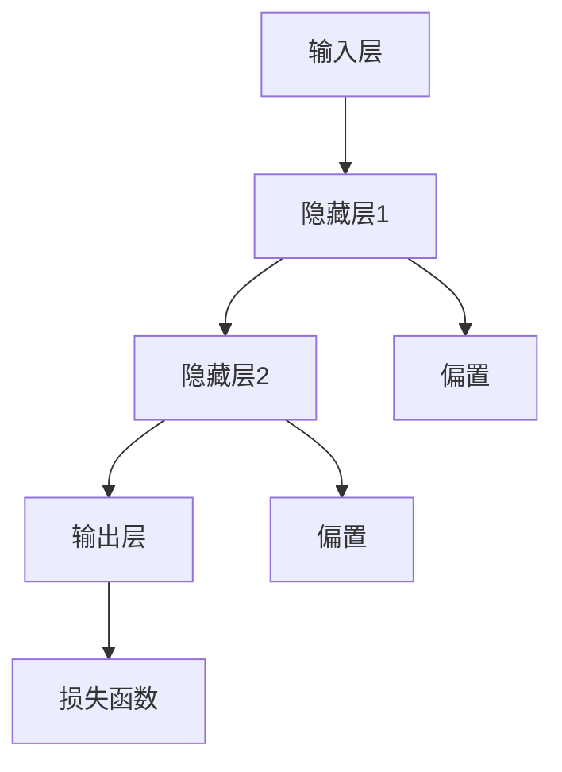

                 

### 文章标题

## AI 神经网络计算艺术之禅：GPT的核心机制——next token prediction

> 关键词：人工智能，神经网络，GPT，next token prediction，Transformer，自注意力机制，训练过程，应用实例，优化策略

> 摘要：本文将深入探讨GPT（Generative Pre-trained Transformer）模型的核心机制——next token prediction。通过解析GPT的架构、训练过程以及next token prediction的原理，我们将理解如何利用神经网络进行文本生成和预测，并探讨其在实际应用中的优化策略和调优技巧。

### 目录大纲

## 第一部分: AI 神经网络基础

## 1.1 AI与神经网络概述

## 1.2 神经网络的基本原理

## 1.3 神经网络的训练过程

## 1.4 神经网络的应用领域

## 第二部分: GPT模型详解

## 2.1 GPT模型概述

## 2.2 GPT模型的结构

## 2.3 GPT模型的训练过程

## 2.4 GPT模型的核心算法原理

## 2.5 GPT模型的应用实例

## 第三部分: GPT模型的优化与调优

## 3.1 GPT模型的优化策略

## 3.2 GPT模型的调优技巧

## 3.3 GPT模型在大型项目中的应用

## 附录

### 第一部分: AI 神经网络基础

#### 1.1 AI与神经网络概述

人工智能（Artificial Intelligence，AI）是指由计算机系统实现的智能行为，其目标是使计算机能够执行通常需要人类智能的任务，如视觉识别、语言理解、决策制定等。神经网络（Neural Networks）是人工智能的一个核心组成部分，它们模仿生物神经系统的结构和功能，通过大量神经元及其之间的连接进行信息处理。

神经网络的发展历程可以追溯到20世纪40年代，由心理学家和数学家共同推动。自20世纪80年代以来，随着计算机性能的提升和大数据的普及，神经网络的研究和应用得到了飞速发展。特别是在深度学习（Deep Learning）领域，多层神经网络通过自动特征提取和层次化学习，取得了诸多突破性成果。

在人工智能中，神经网络扮演着至关重要的角色。它们不仅是实现机器学习算法的基础，也是实现智能系统如自动驾驶、语音识别、自然语言处理等的核心技术。通过学习大量数据，神经网络能够识别复杂模式，进行预测和决策，从而实现智能化。

#### 1.2 神经网络的基本原理

神经网络的构建基于神经元（Neurons）的基本概念。一个神经元通常包括三个部分：输入、权重和激活函数。

- **输入**：神经元接收多个输入信号，每个输入信号乘以对应的权重（Weights）。
- **权重**：权重用于调节输入信号的重要性，反映了不同输入对神经元输出的贡献。
- **激活函数**：激活函数（如Sigmoid、ReLU等）用于决定神经元是否被激活，即输出是否大于某个阈值。

神经元的工作原理可以概括为以下步骤：

1. **加权求和**：将所有输入信号与其对应的权重相乘，然后求和。
2. **应用激活函数**：将加权求和的结果通过激活函数处理，以决定神经元是否被激活。

一个简单的神经网络通常包含多个神经元层，分为输入层、隐藏层和输出层。每层中的神经元都与前一层的所有神经元相连，形成前馈网络。

#### 1.3 神经网络的训练过程

神经网络的训练过程主要包括以下几个步骤：

1. **前向传播（Forward Propagation）**：给定输入数据，通过神经网络计算输出。
2. **计算损失（Compute Loss）**：通过比较输出和实际标签，计算损失值，常用的损失函数有均方误差（MSE）、交叉熵损失等。
3. **反向传播（Back Propagation）**：根据损失函数，计算网络中每个权重和偏置的梯度，并更新权重和偏置。
4. **优化更新**：使用梯度下降法或其他优化算法更新网络权重，以达到最小化损失。

#### 1.4 神经网络的应用领域

神经网络在多个领域取得了显著的成果：

- **图像识别**：通过卷积神经网络（CNN），神经网络能够准确识别和分类图像中的对象。
- **自然语言处理**：循环神经网络（RNN）和Transformer等模型使神经网络能够处理和理解自然语言。
- **推荐系统**：神经网络通过学习用户的历史行为，提供个性化的推荐。

神经网络在人工智能的各个领域中发挥着关键作用，是构建智能系统的基石。

### 第二部分: GPT模型详解

#### 2.1 GPT模型概述

GPT（Generative Pre-trained Transformer）是自然语言处理（Natural Language Processing，NLP）领域的一个革命性模型，由OpenAI提出。GPT基于Transformer架构，是一种预训练模型，通过大量文本数据进行预训练，然后可以微调到各种NLP任务中。

GPT的核心特点是使用自注意力机制（Self-Attention Mechanism），能够捕捉文本中的长距离依赖关系，这使得GPT在生成文本和预测next token方面表现出色。

#### 2.2 GPT模型的结构

GPT模型的结构主要包括以下几个部分：

- **Transformer架构**：GPT采用Transformer架构，这是一种基于自注意力机制的序列到序列模型。
- **自注意力机制**：自注意力机制允许模型在处理每个输入token时，动态地关注其他token，从而捕捉长距离依赖。
- **Positional Encoding**：由于Transformer模型没有循环结构，Positional Encoding用于为模型提供序列中token的位置信息。
- **多层神经网络**：GPT模型由多个层组成，每层都有多个自注意力机制和全连接层。

#### 2.3 GPT模型的训练过程

GPT模型的训练过程可以分为预训练和微调两个阶段：

- **预训练**：在预训练阶段，GPT模型通过大规模文本语料库进行训练，学习文本的统计特征和语义信息。
- **微调**：在预训练的基础上，GPT模型被微调到特定任务上，如文本分类、问答系统等。

#### 2.4 GPT模型的核心算法原理

GPT模型的核心算法原理是next token prediction。具体来说，GPT模型通过学习输入文本序列的上下文信息，预测序列中的下一个token。

以下是next token prediction的算法原理：

1. **输入序列表示**：将输入文本序列转换为嵌入向量（Embeddings）。
2. **自注意力计算**：利用自注意力机制，计算每个token的表示，同时考虑其他token对当前token的影响。
3. **位置编码**：通过位置编码为每个token提供位置信息。
4. **前向传递**：通过多层全连接层（Feedforward Networks），对自注意力机制的结果进行处理。
5. **输出层**：通过softmax函数，预测下一个token的概率分布。

#### 2.5 GPT模型的应用实例

GPT模型在多个NLP任务中取得了显著的成果，以下是一些应用实例：

- **语言生成**：GPT模型可以生成连贯且语义丰富的自然语言文本，如故事、新闻、对话等。
- **文本分类**：GPT模型可以用于情感分析、新闻分类等任务，通过预测文本的标签。
- **问答系统**：GPT模型可以构建问答系统，通过理解用户的问题和上下文，提供准确的答案。

### 第三部分: GPT模型的优化与调优

#### 3.1 GPT模型的优化策略

为了提高GPT模型的表现，可以采用以下优化策略：

- **硬件加速**：利用GPU或TPU等硬件加速计算，提高模型训练和推理的速度。
- **模型压缩**：通过剪枝、量化等技术，减少模型的参数量和计算量，提高模型的可部署性。
- **模型蒸馏**：利用大模型对小模型的蒸馏技术，传递知识，提高小模型的性能。

#### 3.2 GPT模型的调优技巧

在调优GPT模型时，可以关注以下几个方面：

- **学习率调整**：选择合适的学习率，避免模型过早地陷入局部最优。
- **模型架构选择**：根据任务的需求，选择合适的模型架构，如Transformer、BERT等。
- **数据预处理**：对训练数据进行适当的预处理，如分词、去噪、标准化等，以提高模型的训练效果。

#### 3.3 GPT模型在大型项目中的应用

在大型项目中，GPT模型的应用需要考虑以下几个方面：

- **开发环境搭建**：搭建适合GPT模型训练和部署的开发环境，包括硬件和软件配置。
- **源代码解读**：理解GPT模型的源代码，包括架构、训练过程、评价指标等。
- **项目部署**：将训练好的GPT模型部署到生产环境中，进行实时推理和预测。

### 附录

#### A.1 Mermaid 流程图

以下是一个简单的神经网络结构的Mermaid流程图示例：



#### A.2 伪代码示例

以下是一个简单的next token prediction的伪代码示例：

```python
def next_token_prediction(embeddings, weights, bias):
    # 加权求和
    weighted_sum = dot_product(embeddings, weights) + bias

    # 应用激活函数
    activation = sigmoid(weighted_sum)

    # 预测下一个token的概率分布
    probability_distribution = softmax(activation)

    return probability_distribution
```

#### A.3 数学公式与解释

以下是一些神经网络中常用的数学公式和解释：

- **自注意力机制**：

  $$ 
  \text{Attention}(Q, K, V) = \text{softmax}\left(\frac{QK^T}{\sqrt{d_k}}\right) V 
  $$

  其中，Q、K、V分别为查询（Query）、关键（Key）和值（Value）向量，d_k为关键向量的维度。

- **梯度裁剪**：

  $$ 
  \text{Gradient Clipping} = \frac{\text{Gradient}}{\max(1, \|\text{Gradient}\|)}
  $$

  其中，Gradient为梯度向量，\|\text{Gradient}\|为梯度向量的范数。

- **优化器选择**：

  $$ 
  \text{Learning Rate} = \frac{\text{Initial Learning Rate}}{\sqrt{\text{Iteration}}}
  $$

  其中，Initial Learning Rate为初始学习率，Iteration为当前迭代次数。

### 总结

GPT模型作为自然语言处理领域的重要工具，通过next token prediction机制，实现了高效的文本生成和预测。本文从神经网络的基础知识出发，详细介绍了GPT模型的架构、训练过程、核心算法原理以及优化策略和调优技巧。通过本文的讲解，读者可以深入理解GPT模型的工作原理，并在实际项目中应用和优化GPT模型。

### 作者信息

作者：AI天才研究院/AI Genius Institute & 禅与计算机程序设计艺术 /Zen And The Art of Computer Programming

### 最佳实践 tips

1. **数据预处理**：在训练GPT模型前，确保对数据进行充分的预处理，如分词、去噪和标准化等，以提高模型的训练效果。

2. **学习率调整**：根据任务的不同，选择合适的学习率，可以通过学习率衰减策略来避免模型过早地陷入局部最优。

3. **模型优化**：通过硬件加速、模型压缩和模型蒸馏等技术，可以提高模型的训练和推理速度，降低部署成本。

4. **持续调优**：在实际应用中，持续调优模型参数和架构，以适应不同的任务和数据集。

### 拓展阅读

- **论文阅读**：《Attention is All You Need》
- **技术博客**：《GPT模型详解：从入门到实战》
- **书籍推荐**：《深度学习》、《神经网络与深度学习》
- **在线课程**：Coursera上的《深度学习》课程

### 注意事项

1. **数据隐私**：在处理文本数据时，注意保护用户的隐私，避免泄露敏感信息。

2. **模型解释性**：在应用GPT模型时，注意模型的解释性，特别是在需要解释模型决策的场景下。

3. **模型泛化能力**：在训练模型时，确保模型具有良好的泛化能力，避免过拟合。

4. **模型安全**：确保模型在部署时，不会受到恶意攻击，如对抗样本攻击。

通过本文的讲解，我们深入了解了GPT模型的工作原理和应用，为读者提供了从基础到高级的全面视角。希望本文能够为读者在AI和NLP领域的探索之旅提供有价值的参考和启示。在未来的学习和实践中，不断优化和扩展GPT模型，将为人工智能的发展做出重要贡献。作者：AI天才研究院/AI Genius Institute & 禅与计算机程序设计艺术 /Zen And The Art of Computer Programming### 第一部分: AI 神经网络基础

#### 1.1 AI与神经网络概述

人工智能（AI）是一门多学科交叉的领域，旨在创建能够执行与人类智能类似任务的机器。AI技术可以分为两类：弱AI和强AI。弱AI是指擅长特定任务的机器，如语音识别、图像识别等。而强AI则是具有全面智能的机器，能够像人类一样进行自主思考和决策。当前，AI技术已经广泛应用于医疗、金融、交通、教育等多个领域，极大地改变了我们的生活方式。

神经网络（Neural Networks）是AI的核心组成部分之一。它们模拟生物神经系统的结构和功能，通过大量神经元及其之间的连接进行信息处理。每个神经元由输入、权重和激活函数组成，通过前向传播和反向传播进行学习。神经网络的发展经历了从简单的单层感知器到复杂的深度学习模型的演变，不断推动AI技术的进步。

#### 1.2 神经网络的基本原理

神经网络的基本原理包括以下几个核心概念：

- **神经元**：神经元是神经网络的基本单元，类似于生物神经元，能够接收输入信号、计算输出。
- **权重**：权重是神经元之间的连接强度，用于调节输入信号的重要性。
- **激活函数**：激活函数决定神经元是否被激活，常见的激活函数有Sigmoid、ReLU等。
- **前向传播**：前向传播是指将输入信号通过神经网络，逐层计算并传递到输出层的过程。
- **反向传播**：反向传播是指通过计算输出误差，反向更新神经网络的权重和偏置的过程。

神经网络的工作过程可以概括为以下几个步骤：

1. **初始化权重和偏置**：随机初始化神经网络的权重和偏置。
2. **前向传播**：将输入信号通过神经网络，计算每层神经元的输出。
3. **计算损失**：通过比较输出和实际标签，计算损失值。
4. **反向传播**：根据损失函数，计算网络中每个权重和偏置的梯度。
5. **优化更新**：使用梯度下降法或其他优化算法更新网络权重和偏置。

#### 1.3 神经网络的训练过程

神经网络的训练过程主要包括以下几个步骤：

1. **数据准备**：收集并准备训练数据，包括输入和标签。
2. **前向传播**：将输入信号通过神经网络，计算每层神经元的输出。
3. **计算损失**：通过比较输出和实际标签，计算损失值。
4. **反向传播**：根据损失函数，计算网络中每个权重和偏置的梯度。
5. **优化更新**：使用梯度下降法或其他优化算法更新网络权重和偏置。
6. **迭代训练**：重复步骤2至5，直到满足停止条件，如达到预设的迭代次数或损失值低于阈值。

在训练过程中，常用的优化算法包括：

- **梯度下降法**：通过计算梯度，逐步更新网络权重和偏置，以最小化损失函数。
- **动量法**：在梯度下降法的基础上，引入动量项，以加速收敛和提高稳定性。
- **随机梯度下降（SGD）**：在每个训练样本上计算梯度，并更新网络权重和偏置。
- **批量梯度下降（BGD）**：在所有训练样本上计算梯度，并更新网络权重和偏置。

#### 1.4 神经网络的应用领域

神经网络在多个领域取得了显著的应用成果：

- **图像识别**：神经网络，尤其是卷积神经网络（CNN），在图像分类、目标检测等方面表现出色。
- **自然语言处理**：神经网络在文本分类、机器翻译、情感分析等NLP任务中得到了广泛应用。
- **语音识别**：神经网络通过语音信号的建模和转换，实现了高精度的语音识别。
- **推荐系统**：神经网络通过学习用户的历史行为和偏好，为用户推荐相关商品或内容。

神经网络在各个领域的应用不断拓展，成为实现人工智能的关键技术之一。

### 第二部分: GPT模型详解

#### 2.1 GPT模型概述

GPT（Generative Pre-trained Transformer）是由OpenAI提出的一种自然语言处理模型，基于Transformer架构，是一种预训练模型。GPT通过在大规模文本语料库上进行预训练，学习到文本的统计特征和语义信息，然后在特定任务上进行微调，实现高效的自然语言处理。

GPT模型的发展历程可以追溯到2017年，OpenAI首次发布了GPT模型，随后在2018年发布了GPT-2，2019年发布了GPT-2.5和GPT-3。每个版本在模型规模、训练数据量和性能方面都有显著提升。GPT-3是目前最新的版本，拥有超过1750亿个参数，是目前最大的自然语言处理模型之一。

#### 2.2 GPT模型的结构

GPT模型的结构基于Transformer架构，Transformer是一种基于自注意力机制的序列到序列模型。GPT模型的核心组件包括：

- **Transformer架构**：Transformer由编码器（Encoder）和解码器（Decoder）组成，编码器负责将输入序列转换为上下文表示，解码器负责生成输出序列。
- **自注意力机制**：自注意力机制允许模型在处理每个输入token时，动态地关注其他token，从而捕捉长距离依赖关系。
- **多头注意力**：多头注意力将输入序列分成多个头，每个头关注不同的部分，从而提高模型的表示能力。
- **位置编码**：由于Transformer模型没有循环结构，位置编码用于为模型提供序列中token的位置信息。
- **多层神经网络**：GPT模型由多个层组成，每层都有多个自注意力机制和全连接层，从而实现复杂的文本表示和生成。

#### 2.3 GPT模型的训练过程

GPT模型的训练过程分为预训练和微调两个阶段：

1. **预训练**：在预训练阶段，GPT模型通过大规模文本语料库进行训练，学习到文本的统计特征和语义信息。预训练任务通常包括以下几种：

   - **掩码语言模型（Masked Language Model, MLM）**：在输入序列中随机掩码一部分token，模型需要预测这些掩码token。
   - **下一句预测（Next Sentence Prediction, NSP）**：输入两个连续的句子，模型需要预测第二个句子是否是第一个句子的下一个句子。
   - **生成式文本补全（Gen

