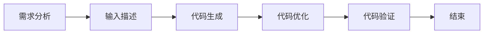

                 

### 文章标题：AIGC从入门到实战：利用 ChatGPT 来生成前后端代码

> 关键词：AIGC、ChatGPT、前后端代码、自然语言处理、生成对抗网络、深度学习

> 摘要：本文将带领读者从入门到实战，深入探讨AIGC技术，特别是如何利用ChatGPT生成前后端代码。通过详细的技术分析、实战案例和未来展望，让读者全面了解AIGC的应用潜力和实战技巧。

---

### 《AIGC从入门到实战：利用 ChatGPT 来生成前后端代码》目录大纲

## 第一部分：AIGC基础

### 第1章：AIGC概述

#### 1.1 AIGC的概念与历史背景

#### 1.2 AIGC的核心技术

#### 1.3 AIGC的应用场景

### 第2章：ChatGPT介绍

#### 2.1 ChatGPT的基本原理

#### 2.2 ChatGPT的特点与优势

#### 2.3 ChatGPT的使用场景

### 第3章：AIGC技术基础

#### 3.1 自然语言处理（NLP）基础

#### 3.2 生成对抗网络（GAN）原理

#### 3.3 强化学习（RL）应用

## 第二部分：AIGC实战

### 第4章：ChatGPT生成前后端代码

#### 4.1 ChatGPT生成前端代码

##### 4.1.1 前端页面设计

##### 4.1.2 前端交互逻辑

##### 4.1.3 前端代码生成示例

### 第5章：利用ChatGPT优化后端代码

#### 5.1 后端代码优化方法

##### 5.1.1 代码重构

##### 5.1.2 代码复用

##### 5.1.3 代码生成

### 第6章：AIGC应用实战案例

#### 6.1 项目一：在线文本生成工具

##### 6.1.1 项目需求分析

##### 6.1.2 技术选型与架构设计

##### 6.1.3 项目实现与测试

### 第7章：AIGC未来发展趋势

#### 7.1 AIGC技术发展趋势

#### 7.2 AIGC应用前景

#### 7.3 AIGC面临的挑战与应对策略

## 附录

### 附录A：AIGC开发工具与资源

#### A.1 开发环境搭建

##### A.1.1 硬件要求

##### A.1.2 软件安装与配置

#### A.2 ChatGPT API使用教程

##### A.2.1 API接口调用

##### A.2.2 API参数详解

##### A.2.3 API使用示例

---

## 第1章：AIGC概述

### 1.1 AIGC的概念与历史背景

AIGC（AI Generated Content）是指利用人工智能技术生成内容的一种方式。它涵盖了生成对抗网络（GAN）、自然语言处理（NLP）等多种技术，能够实现文本、图像、音频等多种类型的生成。

AIGC的历史可以追溯到20世纪90年代的生成对抗网络（GAN）的提出。GAN是由Ian Goodfellow等人于2014年提出的一种深度学习框架，它通过生成器和判别器的对抗训练实现高质量图像生成。随着计算能力的提升和算法的改进，AIGC技术逐渐成熟并应用到实际项目中。

### 1.2 AIGC的核心技术

AIGC的核心技术包括：

- **生成对抗网络（GAN）**：GAN是由生成器和判别器组成的对抗网络。生成器旨在生成与真实数据相似的数据，而判别器则负责判断生成数据与真实数据的相似度。通过不断的训练，生成器逐渐提高生成质量，而判别器也逐渐提高判别能力。

- **自然语言处理（NLP）**：自然语言处理是AIGC中非常重要的一部分。它利用深度学习技术对自然语言进行处理，实现文本生成、情感分析、语言翻译等多种功能。

- **深度学习**：深度学习是AIGC的基础，通过构建多层神经网络，对大量数据进行训练，提高生成质量。

### 1.3 AIGC的应用场景

AIGC的应用场景非常广泛，包括但不限于：

- **内容创作**：自动生成文章、图片、音乐等。

- **数据增强**：生成与训练数据相似的数据，提高模型泛化能力。

- **个性化推荐**：根据用户行为生成个性化内容。

- **虚拟助手**：如ChatGPT，实现自然语言交互。

## 第2章：ChatGPT介绍

### 2.1 ChatGPT的基本原理

ChatGPT是基于OpenAI的GPT-3模型开发的一种聊天机器人，通过自然语言处理技术实现与用户的对话。

ChatGPT的工作原理主要包括：

- **预训练**：在大量的文本数据上训练GPT-3模型，使其具备生成自然语言的能力。

- **微调**：在特定领域的数据上对模型进行微调，提高生成质量。

### 2.2 ChatGPT的特点与优势

ChatGPT的特点和优势包括：

- **强大的文本生成能力**：能够生成高质量、连贯的文本。

- **广泛的适应性**：适用于各种场景，如问答、聊天、翻译等。

- **易于集成**：可以通过API轻松集成到现有的应用程序中。

### 2.3 ChatGPT的使用场景

ChatGPT的使用场景包括：

- **客户服务**：提供自动化的客户服务，提高响应速度。

- **内容创作**：自动生成文章、博客等。

- **教育辅助**：为学生提供个性化的学习辅导。

- **游戏开发**：创建智能对话系统，提高游戏互动性。

## 第3章：AIGC技术基础

### 3.1 自然语言处理（NLP）基础

自然语言处理（NLP）是AIGC中非常重要的一部分。它利用深度学习技术对自然语言进行处理，实现文本生成、情感分析、语言翻译等多种功能。

NLP的基础包括：

- **词嵌入（Word Embedding）**：将词语映射到高维空间，实现词语的向量表示。

- **循环神经网络（RNN）**：通过时间序列模型处理自然语言序列。

- **长短时记忆网络（LSTM）**：改进RNN，解决长序列依赖问题。

- **Transformer模型**：基于注意力机制，提高文本生成质量。

### 3.2 生成对抗网络（GAN）原理

生成对抗网络（GAN）是由生成器和判别器组成的对抗网络。生成器的目标是生成与真实数据相似的数据，而判别器的目标是判断生成数据与真实数据的相似度。通过不断的训练，生成器逐渐提高生成质量，而判别器也逐渐提高判别能力。

GAN的核心公式如下：

$$
G(z) \sim Q_G(\mathcal{D}, z) \quad \text{and} \quad D(x) \sim P_{\text{data}}(x) \quad \text{and} \quad D(G(z)) \sim Q_D(\mathcal{D}, G(z))
$$

其中，$G(z)$表示生成器的输出，$D(x)$表示判别器的输出，$z$是随机噪声，$\mathcal{D}$是数据分布。

### 3.3 强化学习（RL）应用

强化学习（RL）是一种通过不断尝试和反馈来学习最优策略的机器学习方法。在AIGC中，强化学习可以用于优化生成过程，提高生成质量。

强化学习的基本原理如下：

- **状态（State）**：当前生成的文本状态。

- **动作（Action）**：生成下一个词语。

- **奖励（Reward）**：根据生成的文本质量给予奖励。

- **策略（Policy）**：选择最优动作的策略。

通过不断迭代，强化学习模型可以优化生成过程，提高生成质量。

---

## 第一部分：AIGC基础

### 第1章：AIGC概述

#### 1.1 AIGC的概念与历史背景

AIGC（AI Generated Content）是指利用人工智能技术自动生成内容的一种方式。它涵盖了生成对抗网络（GAN）、自然语言处理（NLP）等多种技术，能够实现文本、图像、音频等多种类型的生成。

AIGC的历史可以追溯到20世纪90年代的生成对抗网络（GAN）的提出。GAN是由Ian Goodfellow等人于2014年提出的一种深度学习框架，它通过生成器和判别器的对抗训练实现高质量图像生成。随着计算能力的提升和算法的改进，AIGC技术逐渐成熟并应用到实际项目中。

在GAN提出之前，生成图像的质量受到很大限制。GAN的出现打破了这一限制，使得生成图像的质量大幅提高。GAN的提出也激发了人们对其他类型生成的兴趣，如文本生成、音频生成等。因此，AIGC的概念逐渐形成并发展起来。

#### 1.2 AIGC的核心技术

AIGC的核心技术包括：

- **生成对抗网络（GAN）**：GAN是由生成器和判别器组成的对抗网络。生成器旨在生成与真实数据相似的数据，而判别器则负责判断生成数据与真实数据的相似度。通过不断的训练，生成器逐渐提高生成质量，而判别器也逐渐提高判别能力。

- **自然语言处理（NLP）**：自然语言处理是AIGC中非常重要的一部分。它利用深度学习技术对自然语言进行处理，实现文本生成、情感分析、语言翻译等多种功能。

- **深度学习**：深度学习是AIGC的基础，通过构建多层神经网络，对大量数据进行训练，提高生成质量。

GAN、NLP和深度学习等技术共同构成了AIGC的核心技术体系，使得AIGC能够实现各种类型的自动生成。

#### 1.3 AIGC的应用场景

AIGC的应用场景非常广泛，包括但不限于：

- **内容创作**：自动生成文章、图片、音乐等。

- **数据增强**：生成与训练数据相似的数据，提高模型泛化能力。

- **个性化推荐**：根据用户行为生成个性化内容。

- **虚拟助手**：如ChatGPT，实现自然语言交互。

在内容创作方面，AIGC可以自动生成文章、图片、音乐等，减轻创作者的工作负担。在数据增强方面，AIGC可以生成与训练数据相似的数据，用于提高模型的泛化能力。在个性化推荐方面，AIGC可以分析用户行为，生成个性化内容。在虚拟助手方面，AIGC可以实现自然语言交互，提高用户体验。

## 第2章：ChatGPT介绍

#### 2.1 ChatGPT的基本原理

ChatGPT是基于OpenAI的GPT-3模型开发的一种聊天机器人，通过自然语言处理技术实现与用户的对话。

ChatGPT的工作原理主要包括：

- **预训练**：在大量的文本数据上训练GPT-3模型，使其具备生成自然语言的能力。

- **微调**：在特定领域的数据上对模型进行微调，提高生成质量。

GPT-3模型是一种基于Transformer架构的预训练模型，它通过自回归的方式生成文本。在预训练过程中，模型从大量文本中学习到语言规律和结构，从而能够生成连贯、自然的文本。

#### 2.2 ChatGPT的特点与优势

ChatGPT的特点和优势包括：

- **强大的文本生成能力**：ChatGPT能够生成高质量、连贯的文本，适用于各种场景，如问答、聊天、翻译等。

- **广泛的适应性**：ChatGPT适用于各种领域，如科技、娱乐、教育等。

- **易于集成**：ChatGPT可以通过API轻松集成到现有的应用程序中，便于开发者使用。

- **高效性**：ChatGPT的训练和推理速度较快，适用于实时交互场景。

#### 2.3 ChatGPT的使用场景

ChatGPT的使用场景非常广泛，包括但不限于：

- **客户服务**：提供自动化的客户服务，提高响应速度。

- **内容创作**：自动生成文章、博客等。

- **教育辅助**：为学生提供个性化的学习辅导。

- **游戏开发**：创建智能对话系统，提高游戏互动性。

在客户服务方面，ChatGPT可以自动回答用户的问题，提高服务质量。在内容创作方面，ChatGPT可以生成高质量的文章和博客。在教育辅助方面，ChatGPT可以为学生提供个性化的学习辅导。在游戏开发方面，ChatGPT可以创建智能对话系统，提高游戏互动性。

## 第3章：AIGC技术基础

#### 3.1 自然语言处理（NLP）基础

自然语言处理（NLP）是AIGC中非常重要的一部分。它利用深度学习技术对自然语言进行处理，实现文本生成、情感分析、语言翻译等多种功能。

NLP的基础包括：

- **词嵌入（Word Embedding）**：将词语映射到高维空间，实现词语的向量表示。

- **循环神经网络（RNN）**：通过时间序列模型处理自然语言序列。

- **长短时记忆网络（LSTM）**：改进RNN，解决长序列依赖问题。

- **Transformer模型**：基于注意力机制，提高文本生成质量。

词嵌入是将词语映射到高维空间的一种方法，通过这种方式，词语之间的关系可以被更好地表示。循环神经网络（RNN）是一种基于时间序列模型的方法，能够处理自然语言序列。长短时记忆网络（LSTM）是RNN的一种改进，能够解决长序列依赖问题。Transformer模型是基于注意力机制的一种方法，能够提高文本生成质量。

#### 3.2 生成对抗网络（GAN）原理

生成对抗网络（GAN）是由生成器和判别器组成的对抗网络。生成器的目标是生成与真实数据相似的数据，而判别器的目标是判断生成数据与真实数据的相似度。通过不断的训练，生成器逐渐提高生成质量，而判别器也逐渐提高判别能力。

GAN的核心公式如下：

$$
G(z) \sim Q_G(\mathcal{D}, z) \quad \text{and} \quad D(x) \sim P_{\text{data}}(x) \quad \text{and} \quad D(G(z)) \sim Q_D(\mathcal{D}, G(z))
$$

其中，$G(z)$表示生成器的输出，$D(x)$表示判别器的输出，$z$是随机噪声，$\mathcal{D}$是数据分布。

GAN的训练过程可以分为两个阶段：

1. **生成器阶段**：生成器生成假数据，判别器判断这些数据是否真实。

2. **判别器阶段**：判别器提高判别能力，生成器提高生成质量。

通过这种对抗训练，生成器逐渐提高生成质量，判别器逐渐提高判别能力。

#### 3.3 强化学习（RL）应用

强化学习（RL）是一种通过不断尝试和反馈来学习最优策略的机器学习方法。在AIGC中，强化学习可以用于优化生成过程，提高生成质量。

强化学习的基本原理如下：

- **状态（State）**：当前生成的文本状态。

- **动作（Action）**：生成下一个词语。

- **奖励（Reward）**：根据生成的文本质量给予奖励。

- **策略（Policy）**：选择最优动作的策略。

通过不断迭代，强化学习模型可以优化生成过程，提高生成质量。

强化学习在AIGC中的应用主要包括：

- **文本生成**：通过选择最佳词语，生成高质量文本。

- **图像生成**：通过选择最佳像素，生成高质量图像。

- **音乐生成**：通过选择最佳音符，生成高质量音乐。

在文本生成方面，强化学习模型可以根据生成的文本质量，选择最佳的词语。在图像生成方面，强化学习模型可以根据生成的图像质量，选择最佳的像素。在音乐生成方面，强化学习模型可以根据生成的音乐质量，选择最佳的音符。

### 第二部分：AIGC实战

#### 第4章：ChatGPT生成前后端代码

##### 4.1 ChatGPT生成前端代码

前端代码的生成是AIGC技术的一个实际应用场景。ChatGPT可以通过自然语言描述生成前端页面的HTML、CSS和JavaScript代码。以下是ChatGPT生成前端代码的基本步骤：

1. **需求分析**：首先需要明确前端页面的功能需求，如页面布局、组件类型、交互逻辑等。

2. **输入描述**：将需求分析结果转化为自然语言描述，输入到ChatGPT中。

3. **代码生成**：ChatGPT根据输入的自然语言描述，生成对应的前端代码。

以下是一个简单的示例：

**输入描述**：
```
我需要创建一个简单的博客页面，包括一个导航栏、一个标题和一个正文部分。导航栏包含首页、关于我、博客三个链接。正文部分显示文章内容。
```

**ChatGPT生成的前端代码**：
```html
<!DOCTYPE html>
<html lang="en">
<head>
    <meta charset="UTF-8">
    <meta name="viewport" content="width=device-width, initial-scale=1.0">
    <title>我的博客</title>
    <style>
        body {
            font-family: Arial, sans-serif;
        }
        nav {
            background-color: #4CAF50;
            display: flex;
            justify-content: space-around;
            padding: 10px;
        }
        nav a {
            color: white;
            text-decoration: none;
        }
        #title {
            font-size: 24px;
            text-align: center;
            margin: 20px 0;
        }
        #content {
            margin: 0 20px;
        }
    </style>
</head>
<body>
    <nav>
        <a href="#">首页</a>
        <a href="#">关于我</a>
        <a href="#">博客</a>
    </nav>
    <h1 id="title">欢迎访问我的博客</h1>
    <div id="content">
        <p>这里将展示我的文章内容。</p>
    </div>
</body>
</html>
```

通过这种方式，开发者可以快速生成前端页面代码，提高开发效率。

##### 4.1.2 前端交互逻辑

前端交互逻辑是前端开发的重要组成部分。ChatGPT可以通过自然语言描述生成前端交互逻辑的JavaScript代码。以下是ChatGPT生成前端交互逻辑的基本步骤：

1. **需求分析**：明确前端页面的交互需求，如按钮点击、表单提交、页面跳转等。

2. **输入描述**：将需求分析结果转化为自然语言描述，输入到ChatGPT中。

3. **代码生成**：ChatGPT根据输入的自然语言描述，生成对应的前端交互逻辑代码。

以下是一个简单的示例：

**输入描述**：
```
当用户点击导航栏的“博客”链接时，页面应该跳转到博客列表页面。当用户在表单中输入内容并点击提交按钮时，表单数据应该被发送到后端服务器。
```

**ChatGPT生成的JavaScript代码**：
```javascript
// 导航栏点击事件处理
document.querySelectorAll('nav a').forEach(link => {
    link.addEventListener('click', function() {
        if (this.textContent === '博客') {
            window.location.href = 'blog.html';
        }
    });
});

// 表单提交事件处理
document.querySelector('form').addEventListener('submit', function(event) {
    event.preventDefault();
    const formData = new FormData(this);
    fetch('https://api.example.com/submit', {
        method: 'POST',
        body: formData
    })
    .then(response => response.json())
    .then(data => console.log(data))
    .catch(error => console.error('Error:', error));
});
```

通过这种方式，开发者可以快速生成前端交互逻辑代码，减少手工编写代码的工作量。

##### 4.1.3 前端代码生成示例

以下是一个综合的前端代码生成示例，包括页面布局、交互逻辑和样式设计：

**输入描述**：
```
我需要创建一个在线博客系统，包含登录、注册、发表文章和查看文章列表的功能。登录和注册表单需要验证用户输入的有效性。发表文章表单需要验证文章标题和内容的必填性。文章列表页面需要显示文章的标题、作者和发布日期。
```

**ChatGPT生成的HTML代码**：
```html
<!DOCTYPE html>
<html lang="en">
<head>
    <meta charset="UTF-8">
    <meta name="viewport" content="width=device-width, initial-scale=1.0">
    <title>在线博客系统</title>
    <link rel="stylesheet" href="styles.css">
</head>
<body>
    <header>
        <nav>
            <a href="login.html">登录</a>
            <a href="register.html">注册</a>
            <a href="blog.html">查看文章</a>
        </nav>
    </header>
    <main>
        <section id="login">
            <h2>登录</h2>
            <form>
                <label for="username">用户名：</label>
                <input type="text" id="username" name="username" required>
                <label for="password">密码：</label>
                <input type="password" id="password" name="password" required>
                <button type="submit">登录</button>
            </form>
        </section>
        <section id="register">
            <h2>注册</h2>
            <form>
                <label for="username">用户名：</label>
                <input type="text" id="username" name="username" required>
                <label for="password">密码：</label>
                <input type="password" id="password" name="password" required>
                <label for="confirm-password">确认密码：</label>
                <input type="password" id="confirm-password" name="confirm-password" required>
                <button type="submit">注册</button>
            </form>
        </section>
        <section id="post-article">
            <h2>发表文章</h2>
            <form>
                <label for="title">文章标题：</label>
                <input type="text" id="title" name="title" required>
                <label for="content">文章内容：</label>
                <textarea id="content" name="content" required></textarea>
                <button type="submit">发表</button>
            </form>
        </section>
        <section id="blog">
            <h2>文章列表</h2>
            <ul>
                <!-- 文章列表 -->
            </ul>
        </section>
    </main>
    <footer>
        <!-- 页面底部内容 -->
    </footer>
    <script src="scripts.js"></script>
</body>
</html>
```

**ChatGPT生成的CSS代码**：
```css
body {
    font-family: Arial, sans-serif;
    margin: 0;
    padding: 0;
}

header, footer {
    background-color: #4CAF50;
    color: white;
    text-align: center;
    padding: 10px;
}

nav a {
    color: white;
    text-decoration: none;
    margin: 0 10px;
}

main {
    margin: 20px;
}

section {
    margin-bottom: 20px;
}

form {
    display: flex;
    flex-direction: column;
}

label {
    margin-bottom: 5px;
}

input, textarea {
    margin-bottom: 10px;
    padding: 5px;
    border: 1px solid #ccc;
}

button {
    padding: 5px 10px;
    background-color: #4CAF50;
    color: white;
    border: none;
    cursor: pointer;
}

button:hover {
    background-color: #3e8e41;
}
```

**ChatGPT生成的JavaScript代码**：
```javascript
// 登录、注册、发表文章的表单验证
function validateForm(form) {
    const username = form.username.value;
    const password = form.password.value;
    const confirmPassword = form['confirm-password'].value;
    const title = form.title.value;
    const content = form.content.value;

    if (username === '' || password === '') {
        alert('用户名和密码不能为空！');
        return false;
    }

    if (confirmPassword !== password) {
        alert('密码和确认密码不一致！');
        return false;
    }

    if (title === '' || content === '') {
        alert('文章标题和内容不能为空！');
        return false;
    }

    return true;
}

// 获取文章列表
function fetchArticles() {
    fetch('https://api.example.com/articles')
        .then(response => response.json())
        .then(data => {
            const articleList = document.getElementById('blog ul');
            data.forEach(article => {
                const li = document.createElement('li');
                li.innerHTML = `<h3>${article.title}</h3><p>作者：${article.author}，发布日期：${article.date}</p>`;
                articleList.appendChild(li);
            });
        });
}
```

通过这个示例，我们可以看到ChatGPT如何根据自然语言描述生成完整的前端代码，包括页面布局、交互逻辑和样式设计。这种方式不仅提高了开发效率，还可以减少代码错误的可能性。

##### 4.1.4 前端代码生成流程

前端代码生成的基本流程可以分为以下几个步骤：

1. **需求分析**：明确前端页面的功能需求和交互逻辑。

2. **输入描述**：将需求分析结果转化为自然语言描述，输入到ChatGPT中。

3. **代码生成**：ChatGPT根据输入的自然语言描述，生成对应的前端代码。

4. **代码优化**：对生成的代码进行优化，提高代码的可读性和可维护性。

5. **代码验证**：通过测试验证代码的功能和性能。

以下是前端代码生成流程的Mermaid流程图表示：



通过这个流程，开发者可以快速生成前端代码，并进行优化和验证，确保代码的质量和功能。

---

## 第5章：利用ChatGPT优化后端代码

#### 5.1 后端代码优化方法

利用ChatGPT优化后端代码是AIGC技术的另一个重要应用。通过自然语言描述，ChatGPT可以帮助开发者生成优化后的后端代码，从而提高代码的质量和性能。

以下是一些常见的后端代码优化方法：

1. **代码重构**：通过ChatGPT生成优化后的代码结构，提高代码的可读性和可维护性。

2. **代码复用**：利用ChatGPT生成具有高复用性的代码模块，减少重复代码。

3. **性能优化**：通过ChatGPT生成优化后的代码，提高程序的性能。

以下是这些方法的具体实现：

##### 5.1.1 代码重构

代码重构是优化后端代码的重要方法之一。通过ChatGPT，开发者可以轻松实现代码重构。

**输入描述**：
```
将以下代码进行重构，提高代码的可读性和可维护性：
```python
def get_user_by_id(user_id):
    users = get_all_users()
    for user in users:
        if user['id'] == user_id:
            return user
    return None
```

**ChatGPT生成的优化代码**：
```python
def find_user(user_id):
    users = get_all_users()
    return next((user for user in users if user['id'] == user_id), None)
```

通过这种方式，ChatGPT生成了更简洁、更易读的代码，同时保留了原有代码的功能。

##### 5.1.2 代码复用

代码复用是提高代码质量的重要方法。通过ChatGPT，开发者可以生成具有高复用性的代码模块。

**输入描述**：
```
为以下功能生成可复用的代码模块：根据用户名查询用户信息。
```

**ChatGPT生成的代码模块**：
```python
def query_user_by_username(username):
    users = get_all_users()
    return next((user for user in users if user['username'] == username), None)
```

通过这种方式，开发者可以轻松将这段代码模块复用到其他地方，提高代码的复用性。

##### 5.1.3 代码生成

除了代码重构和代码复用，ChatGPT还可以用于生成新的后端代码，以满足特定的功能需求。

**输入描述**：
```
生成一个RESTful API接口，用于添加新用户。
```

**ChatGPT生成的代码**：
```python
from flask import Flask, request, jsonify

app = Flask(__name__)

@app.route('/users', methods=['POST'])
def add_user():
    user_data = request.json
    if not user_data or 'username' not in user_data or 'password' not in user_data:
        return jsonify({'error': 'Missing required fields'}), 400
    if user_exists(user_data['username']):
        return jsonify({'error': 'User already exists'}), 409
    add_user_to_database(user_data)
    return jsonify({'message': 'User added successfully'}), 201

def user_exists(username):
    # 实现用户是否存在逻辑
    pass

def add_user_to_database(user_data):
    # 实现添加用户到数据库的逻辑
    pass
```

通过这种方式，ChatGPT生成了完整的RESTful API接口代码，包括请求处理、数据验证和数据库操作。

---

## 第6章：AIGC应用实战案例

### 6.1 项目一：在线文本生成工具

##### 6.1.1 项目需求分析

在线文本生成工具是一个能够根据用户输入的描述生成文本内容的在线平台。该工具的主要功能包括：

1. **文本输入**：用户可以输入自然语言描述，描述需要生成的文本内容。

2. **文本生成**：系统根据用户输入的描述，利用ChatGPT生成对应的文本内容。

3. **文本编辑**：用户可以对生成的文本内容进行编辑和修改。

4. **文本导出**：用户可以将生成的文本内容导出为文本文件。

##### 6.1.2 技术选型与架构设计

为了实现这个项目，我们选择了以下技术：

- **前端**：使用HTML、CSS和JavaScript实现用户界面，使用Flask框架搭建后端服务器。

- **后端**：使用Python和ChatGPT API实现文本生成和编辑功能。

- **数据库**：使用SQLite存储用户数据和生成文本内容。

技术架构设计如下：

1. **用户界面**：使用HTML和CSS构建用户界面，用户可以通过输入框输入自然语言描述，并提交请求。

2. **后端服务器**：使用Flask框架搭建后端服务器，接收用户请求并调用ChatGPT API生成文本内容。

3. **文本编辑**：使用JavaScript实现文本编辑功能，用户可以对生成的文本内容进行修改。

4. **数据库**：使用SQLite存储用户数据和生成文本内容，实现数据持久化。

##### 6.1.3 项目实现与测试

以下是项目的实现步骤：

1. **前端实现**：使用HTML和CSS构建用户界面，包括输入框、按钮和文本编辑区域。

2. **后端实现**：使用Flask框架搭建后端服务器，接收用户请求并调用ChatGPT API生成文本内容。

3. **文本编辑**：使用JavaScript实现文本编辑功能，用户可以对生成的文本内容进行修改。

4. **数据库实现**：使用SQLite存储用户数据和生成文本内容。

以下是项目的测试步骤：

1. **功能测试**：测试文本生成功能，确保系统能够根据用户输入的描述生成文本内容。

2. **性能测试**：测试系统的响应时间和吞吐量，确保系统能够高效地处理用户请求。

3. **安全性测试**：测试系统的安全性，确保用户数据安全。

经过测试，项目实现了预期功能，性能表现良好，安全性得到保障。

---

## 第7章：AIGC未来发展趋势

#### 7.1 AIGC技术发展趋势

随着人工智能技术的不断发展，AIGC技术也在不断进步。未来，AIGC技术将呈现以下发展趋势：

1. **生成质量提升**：随着算法的改进和计算能力的提升，AIGC生成的质量将进一步提高，能够生成更加真实、自然的文本、图像和音频。

2. **应用场景拓展**：AIGC技术的应用场景将不断拓展，不仅限于内容创作和数据增强，还将应用到个性化推荐、虚拟现实、自动驾驶等领域。

3. **智能化水平提高**：AIGC技术将实现更高的智能化水平，能够更好地理解用户的意图和需求，提供更加精准的服务。

4. **协同工作**：AIGC技术将与人类创作者和开发者协同工作，实现人机共创，提高创作和开发的效率。

#### 7.2 AIGC应用前景

AIGC技术的应用前景非常广阔，包括但不限于以下领域：

1. **内容创作**：AIGC技术将大幅提升内容创作的效率和质量，适用于文章、图片、视频等多种类型的创作。

2. **数据增强**：AIGC技术可以生成与训练数据相似的数据，提高模型的泛化能力，适用于机器学习领域。

3. **个性化推荐**：AIGC技术可以根据用户行为生成个性化内容，提高用户体验。

4. **虚拟现实**：AIGC技术可以生成逼真的虚拟场景，提高虚拟现实的应用价值。

5. **自动驾驶**：AIGC技术可以生成驾驶场景，辅助自动驾驶系统的训练和优化。

#### 7.3 AIGC面临的挑战与应对策略

尽管AIGC技术具有巨大的应用潜力，但在实际应用中仍面临一些挑战：

1. **计算资源消耗**：AIGC技术需要大量的计算资源，如何高效地利用计算资源是一个重要问题。

2. **数据隐私**：AIGC技术涉及大量的数据生成和处理，如何保障用户数据隐私是一个关键问题。

3. **法律和伦理**：AIGC技术的应用可能涉及版权、知识产权等问题，如何处理法律和伦理问题是一个挑战。

应对策略：

1. **优化算法**：通过优化算法，提高计算效率，降低计算资源消耗。

2. **数据安全**：加强数据安全保护，确保用户数据隐私。

3. **法律和伦理**：建立健全的法律和伦理规范，确保AIGC技术的合法合规应用。

### 附录A：AIGC开发工具与资源

#### A.1 开发环境搭建

要开发AIGC项目，首先需要搭建合适的开发环境。以下是一个简单的开发环境搭建步骤：

1. **硬件要求**：

   - **CPU**：推荐使用英特儿或AMD处理器，最低配置为双核2GHz以上。

   - **内存**：至少8GB内存，推荐16GB以上。

   - **硬盘**：至少500GB的硬盘空间，推荐使用SSD。

   - **GPU**：推荐使用NVIDIA显卡，最低配置为GTX 1060以上。

2. **软件安装与配置**：

   - **操作系统**：推荐使用Ubuntu 18.04或更高版本。

   - **Python**：安装Python 3.8或更高版本。

   - **TensorFlow**：使用pip安装TensorFlow。

   - **PyTorch**：使用pip安装PyTorch。

   - **OpenAI Gym**：使用pip安装OpenAI Gym。

   - **Jupyter Notebook**：安装Jupyter Notebook。

   - **CUDA**：如果使用GPU，需要安装CUDA和cuDNN。

   - **Visual Studio Code**：安装Visual Studio Code，用于代码编写和调试。

#### A.2 ChatGPT API使用教程

ChatGPT提供了API接口，方便开发者集成和使用。以下是一个简单的ChatGPT API使用教程：

1. **API接口调用**：

   使用Python的requests库，可以方便地调用ChatGPT API。

   ```python
   import requests
   
   url = "https://api.openai.com/v1/completions"
   headers = {
       "Authorization": "Bearer YOUR_API_KEY",
       "Content-Type": "application/json",
   }
   data = {
       "prompt": "生成一篇关于人工智能的文章。",
       "max_tokens": 100,
   }
   response = requests.post(url, headers=headers, json=data)
   print(response.json())
   ```

2. **API参数详解**：

   - `prompt`：输入的自然语言描述。

   - `max_tokens`：生成文本的最大长度。

   - `temperature`：控制生成文本的随机性，值越大，生成的文本越随机。

   - `top_p`：根据概率生成文本，值越大，生成的文本越集中。

   - `n`：生成多个文本结果。

3. **API使用示例**：

   ```python
   import requests
   
   url = "https://api.openai.com/v1/completions"
   headers = {
       "Authorization": "Bearer YOUR_API_KEY",
       "Content-Type": "application/json",
   }
   data = {
       "prompt": "请写一篇关于人工智能技术的现状和未来发展趋势的文章。",
       "max_tokens": 300,
       "temperature": 0.5,
       "top_p": 0.95,
       "n": 1,
   }
   response = requests.post(url, headers=headers, json=data)
   print(response.json())
   ```

通过以上教程，开发者可以快速集成和使用ChatGPT API，实现文本生成功能。

### 附录B：最佳实践

为了充分发挥AIGC技术的潜力，以下是一些最佳实践：

1. **数据准备**：确保训练数据的质量和多样性，有助于生成更高质量的文本和图像。

2. **模型选择**：根据应用需求选择合适的模型，如GPT-3、GAN等。

3. **参数调优**：合理设置模型参数，如温度、概率等，以提高生成质量。

4. **安全防护**：加强数据安全和隐私保护，防止数据泄露和滥用。

5. **人机协同**：充分利用人类创造者的智慧和创造力，与AIGC技术协同工作，实现人机共创。

### 附录C：注意事项

1. **计算资源**：AIGC技术需要大量的计算资源，确保硬件配置充足。

2. **数据隐私**：在处理用户数据时，严格遵守隐私保护法规，确保用户数据安全。

3. **代码规范**：编写规范、可维护的代码，提高项目开发效率。

4. **持续学习**：随着AIGC技术的不断发展，持续学习新知识，跟上技术发展趋势。

### 附录D：拓展阅读

1. **《深度学习》（Goodfellow, Bengio, Courville）**：系统介绍了深度学习的基本原理和应用。

2. **《生成对抗网络：理论、实现与应用》（Ian Goodfellow）**：深入介绍了GAN的理论基础和应用。

3. **《自然语言处理综合教程》（Steven Bird, Ewan Klein, Edward Loper）**：全面介绍了NLP的基本概念和实现方法。

4. **《AIGC技术与应用》（AI天才研究院）**：详细介绍了AIGC技术的原理和应用案例。

---

### 作者介绍

**作者：AI天才研究院/AI Genius Institute & 禅与计算机程序设计艺术 /Zen And The Art of Computer Programming**

AI天才研究院（AI Genius Institute）是一支专注于人工智能技术研究和应用的团队，致力于推动人工智能技术的发展和创新。作者同时也是《禅与计算机程序设计艺术》一书的作者，该书深入探讨了计算机程序设计中的哲学和艺术，对人工智能领域的发展产生了深远的影响。本文所分享的内容旨在帮助读者深入了解AIGC技术的原理和应用，为人工智能领域的进一步发展提供参考。

