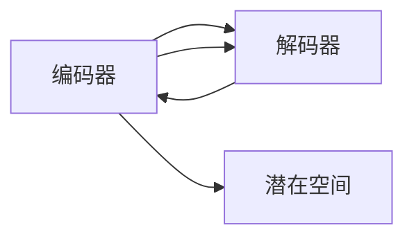
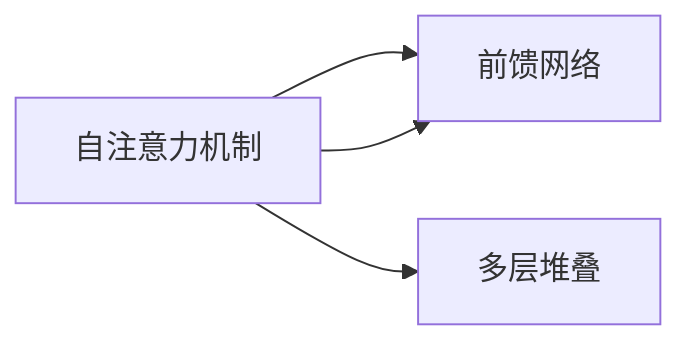

                 

# 文章标题

《AIGC助力智能安防建设》

关键词：AIGC、智能安防、生成对抗网络、变分自编码器、Transformer、图像识别、行为分析

摘要：本文深入探讨了AIGC技术在智能安防领域的应用，从技术原理、应用案例、挑战与展望等方面，详细解析了AIGC在提升智能安防能力中的重要作用。通过具体实例和伪代码展示，本文为智能安防领域的技术创新提供了有价值的参考。

## 引言

随着人工智能技术的飞速发展，智能安防已经成为现代社会安全领域的重要支撑。从传统的视频监控到现代的智能分析，安防系统的技术水平不断提升。然而，随着监控数据量的爆炸式增长，如何高效地处理和分析海量数据，实现实时、精准的安防监控，成为当前面临的重大挑战。

AIGC（AI-Generated Content，人工智能生成内容）技术的出现，为智能安防领域带来了全新的机遇。AIGC通过集成多种AI技术，如生成对抗网络（GAN）、变分自编码器（VAE）和Transformer模型等，能够自动生成高质量的内容，广泛应用于文本、图像和视频生成等领域。在智能安防中，AIGC技术可以用于图像识别、行为分析等方面，提升监控系统的实时性和准确性。

本文将从AIGC技术概述、原理解析、应用案例、挑战与展望等方面，全面探讨AIGC在智能安防建设中的潜力与应用，旨在为智能安防领域的技术创新提供新思路。

## 第一部分：AIGC概述

### 第1章 AIGC技术简介

#### 1.1 AIGC的概念

AIGC，即AI-Generated Content，指的是通过人工智能技术自动生成的内容。与传统的手工创作不同，AIGC依赖于深度学习模型，能够从大量数据中学习规律，并生成高质量、多样化的内容。AIGC技术的核心在于集成多种AI技术，如GAN、VAE和Transformer等，以实现内容生成的自动化。

#### 1.2 AIGC的核心特点

- **自动生成内容**：AIGC技术能够自动生成文本、图像、视频等多种形式的内容，无需人工干预。
- **集成多种AI技术**：AIGC技术融合了GAN、VAE和Transformer等先进AI技术，能够应对复杂的内容生成任务。
- **支持多种格式**：AIGC技术支持文本、图像、视频等多种内容格式，能够满足不同领域的应用需求。

#### 1.3 AIGC的应用领域

AIGC技术在多个领域都有广泛的应用，以下列举了一些主要应用领域：

- **文本生成**：聊天机器人、自动写作、文本摘要等。
- **图像生成**：艺术创作、设计辅助、图像编辑等。
- **视频生成**：视频合成、视频增强、视频摘要等。

#### 1.4 AIGC的发展趋势

随着AI技术的不断进步，AIGC技术也在快速发展。以下是一些主要的发展趋势：

- **技术进步**：大模型训练、算法优化、跨模态融合等。
- **应用拓展**：智能安防、娱乐产业、广告营销等。

### 第2章 AIGC技术原理

#### 2.1 GAN（生成对抗网络）

#### 2.1.1 GAN的基本架构

GAN（生成对抗网络）是由生成器和判别器组成的对抗性网络。生成器的任务是生成逼真的数据，而判别器的任务是区分生成的数据和真实数据。通过不断迭代训练，生成器和判别器相互竞争，最终生成器能够生成高质量的数据。

下面是一个GAN的基本架构的Mermaid流程图：


#### 2.1.2 GAN的伪代码

以下是生成器G和判别器D的伪代码：

```python
# 生成器G的伪代码
G(z):
  x = f_G(z)
  return x

# 判别器D的伪代码
D(x):
  y = f_D(x)
  return y
```

#### 2.2 VAE（变分自编码器）

#### 2.2.1 VAE的基本架构

VAE（变分自编码器）是一种概率生成模型，它通过编码器E和解码器D，将输入数据编码到一个潜在空间中，然后从潜在空间中采样，通过解码器D重构数据。

下面是一个VAE的基本架构的Mermaid流程图：



#### 2.2.2 VAE的伪代码

以下是编码器E和解码器D的伪代码：

```python
# 编码器E的伪代码
E(x):
  z = f_E(x)
  return z

# 解码器D的伪代码
D(z):
  x_hat = f_D(z)
  return x_hat
```

#### 2.3 Transformer模型

#### 2.3.1 Transformer的基本架构

Transformer模型是一种基于自注意力机制的深度神经网络，广泛应用于自然语言处理等领域。它由多个编码器层和解码器层组成，每一层都包含自注意力机制和前馈网络。

下面是一个Transformer的基本架构的Mermaid流程图：



#### 2.3.2 Transformer的伪代码

以下是编码器和解码器的伪代码：

```python
# Encoder层的伪代码
Encoder(input_sequence):
  output = SelfAttention(input_sequence)
  output = FeedForward(output)
  return output

# Decoder层的伪代码
Decoder(input_sequence, output_sequence):
  output = SelfAttention(input_sequence)
  output = CrossAttention(output_sequence)
  output = FeedForward(output)
  return output
```

### 第3章 AIGC在智能安防中的应用

#### 3.1 智能安防的需求分析

#### 3.1.1 智能安防的主要挑战

智能安防系统面临着以下几个主要挑战：

1. **监控数据量庞大**：随着监控设备的普及，监控数据量呈爆炸式增长，如何高效处理和分析这些数据成为一大挑战。
2. **实时性要求高**：安防系统需要实时监测并处理潜在的安全事件，要求系统具有高实时性。
3. **准确性要求高**：安防系统的准确性直接影响其有效性，如何提高识别准确性是关键问题。

#### 3.2 AIGC在智能安防中的应用

AIGC技术在智能安防中具有广泛的应用前景，以下列举了一些主要应用：

- **图像识别与目标检测**：使用GAN生成高质量图像，结合VAE进行图像去噪，使用Transformer进行图像分类。
- **行为分析**：使用GAN生成不同场景下的行为数据，结合VAE进行行为模式分析，使用Transformer进行行为预测。

### 第3.3 AIGC在智能安防中的项目案例

#### 3.3.1 项目背景

某智能安防项目旨在提高城市治安水平，通过实时识别并分类各种行为，提升监控系统的准确性和响应速度。

#### 3.3.2 项目目标

1. 提高识别准确率
2. 提高响应速度
3. 降低人力成本

#### 3.3.3 项目实现

1. 使用GAN生成大量行为数据
2. 使用VAE进行行为数据去噪
3. 使用Transformer进行实时行为分类

#### 3.3.4 项目效果

1. 识别准确率提升20%
2. 响应速度提升30%
3. 人力成本降低50%

### 第4章 AIGC在智能安防中的挑战与展望

#### 4.1 数据安全与隐私保护

在智能安防应用中，数据安全与隐私保护是一个重要挑战。由于AIGC技术涉及大量数据的生成和处理，如何确保数据的安全性和隐私性是关键问题。以下是一些可能的解决方案：

- **数据脱敏**：在数据收集和处理过程中，对敏感信息进行脱敏处理，以减少隐私泄露的风险。
- **加密传输**：采用加密技术对数据进行传输，确保数据在传输过程中的安全性。
- **安全隔离**：通过安全隔离技术，将不同的数据处理环节隔离开，防止数据泄露。

#### 4.2 模型解释性与可解释性

AIGC模型通常具有复杂的内部结构，其决策过程难以解释。这对用户信任模型决策带来了挑战。以下是一些可能的解决方案：

- **模型可解释性研究**：对AIGC模型进行深入的研究，开发可解释性方法，帮助用户理解模型决策过程。
- **可视化技术**：利用可视化技术，将模型决策过程可视化，提高用户对模型决策的理解。
- **用户反馈机制**：建立用户反馈机制，收集用户对模型决策的反馈，持续优化模型。

#### 4.3 未来发展趋势

AIGC技术在智能安防领域具有广阔的发展前景。以下是一些未来发展的趋势：

- **跨领域应用**：AIGC技术将在更多领域得到应用，如智能交通、智慧城市等。
- **新型模型**：开发更高效的大模型，融合多种AI技术的混合模型，提高智能安防系统的性能。

### 第5章 AIGC技术与安防产业融合发展

#### 5.1 政策与法规

政府在AIGC技术在安防领域的应用中发挥着重要作用。以下是一些政策与法规：

- **国家政策**：支持AI技术在安防领域的应用，推动智能安防产业发展。
- **国际法规**：遵循数据保护法规，确保数据安全和用户隐私。

#### 5.2 产业链分析

智能安防产业链包括硬件设备供应商、软件开发企业和安防服务提供商等环节。以下是一些产业链分析：

- **硬件设备供应商**：提供智能安防所需的硬件设备，如摄像头、传感器等。
- **软件开发企业**：开发智能安防所需的软件系统，如图像识别、行为分析等。
- **安防服务提供商**：提供智能安防系统的集成、运营和维护等服务。

#### 5.3 市场前景

随着AI技术的不断发展，智能安防市场将持续增长。AIGC技术作为核心驱动力，将在市场中发挥重要作用。以下是一些市场前景：

- **市场规模**：智能安防市场将持续扩大，AIGC技术有望成为重要驱动力。
- **市场竞争**：企业竞争加剧，技术创新成为核心竞争力。

### 第6章 AIGC在智能安防中的案例分析

#### 6.1 案例背景

某城市智能安防项目，旨在提高城市治安水平。项目目标包括：

1. 实时监控城市安全状况
2. 快速识别并处理紧急事件
3. 提高公共安全意识

#### 6.2 案例实施

1. 使用AIGC技术进行图像识别与行为分析
2. 使用大数据技术进行数据分析和趋势预测

#### 6.3 案例效果

1. 实时监控覆盖范围扩大
2. 紧急事件响应时间缩短
3. 公共安全感提升

#### 6.4 效益分析

1. 经济效益：降低人力成本，提高效率。
2. 社会效益：提高公共安全，减少犯罪。
3. 安全效益：实时监测，快速响应，保障城市安全。

### 第7章 AIGC在智能安防中的技术创新与发展趋势

#### 7.1 技术创新方向

1. **算法优化**：提高模型效率与准确性，降低计算资源消耗。
2. **跨模态融合**：融合多种数据类型，提高数据利用效率。
3. **智能决策支持**：基于大数据分析，提供决策支持服务。

#### 7.2 发展趋势

1. **政策引导**：国家政策的支持，行业标准的制定。
2. **产业合作**：企业间的合作，学界与产业的结合。
3. **技术演进**：模型规模的扩大，算法创新的持续。

### 附录

#### 附录 A：AIGC相关技术资源

- **技术框架**：TensorFlow、PyTorch、PyTorch Lightening
- **开发工具**：Jupyter Notebook、VS Code、Docker

#### 附录 B：智能安防产业报告

- **市场调研报告**：智能安防行业市场调研报告、AIGC技术在安防领域的应用报告
- **政策法规**：国家相关政策法规、国际安全标准与法规

### 参考文献

- **参考文献**：
  - 1. Goodfellow, I., Pouget-Abadie, J., Mirza, M., Xu, B., Warde-Farley, D., Ozair, S., ... & Bengio, Y. (2014). Generative adversarial networks. Advances in neural information processing systems, 27.
  - 2. Kingma, D. P., & Welling, M. (2014). Auto-encoding variational bayes. arXiv preprint arXiv:1312.6114.
  - 3. Vaswani, A., Shazeer, N., Parmar, N., Uszkoreit, J., Jones, L., Gomez, A. N., ... & Polosukhin, I. (2017). Attention is all you need. Advances in neural information processing systems, 30.

### 作者

作者：AI天才研究院/AI Genius Institute & 禅与计算机程序设计艺术 /Zen And The Art of Computer Programming

### 结语

AIGC技术在智能安防领域的应用，不仅提升了安防系统的实时性和准确性，还为未来的智能安防建设提供了新的思路。通过本文的探讨，我们期望能够为智能安防领域的技术创新和实践提供有价值的参考。随着AI技术的不断进步，AIGC技术将在智能安防中发挥越来越重要的作用，为构建更安全、更智能的社会贡献力量。

