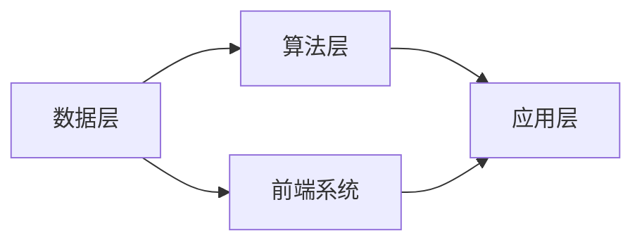
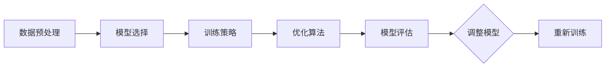
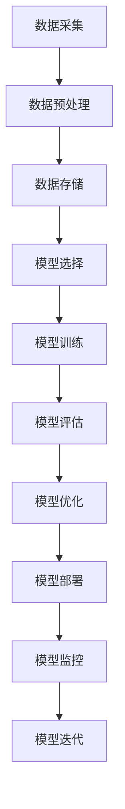
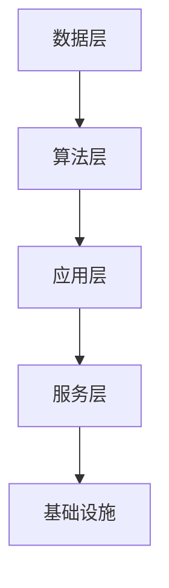

                 

### 文章标题

# AIGC推动智慧物业管理

### 关键词

- AIGC
- 物业管理
- 智慧社区
- 人工智能
- 模型训练
- 实际应用

### 摘要

本文将深入探讨AIGC（自适应智能生成计算）技术如何推动智慧物业管理的发展。首先，我们概述了AIGC的定义、背景及其核心技术在物业管理中的应用。随后，我们详细介绍了AIGC在物业管理中的实际应用案例，包括智能安防、智能门禁和智能停车等。接着，我们探讨了AIGC技术的实现原理，并给出了实际应用案例的详细解析。最后，我们设计了智慧物业管理的AIGC解决方案，并对其实施、评估和未来发展进行了深入分析。

### 《AIGC推动智慧物业管理》目录大纲

## 第一部分：AIGC技术基础

### 第1章：AIGC概述

#### 1.1 AIGC的定义与背景

#### 1.2 AIGC的核心技术

#### 1.3 AIGC的应用场景

#### 1.4 AIGC的发展趋势

### 第2章：人工智能与物业管理

#### 2.1 物业管理概述

#### 2.2 人工智能在物业管理中的应用

#### 2.3 人工智能对物业管理的影响

### 第3章：AIGC在物业管理中的应用

#### 3.1 智慧社区的AIGC应用

##### 3.1.1 智能安防

##### 3.1.2 智能门禁

##### 3.1.3 智能停车

#### 3.2 智慧物业管理的AIGC应用

##### 3.2.1 智能维修

##### 3.2.2 智能能源管理

##### 3.2.3 智能费用管理

### 第4章：AIGC技术实现原理

#### 4.1 AIGC技术架构

#### 4.2 常用AIGC算法

#### 4.3 AIGC模型训练与优化

### 第5章：AIGC在物业管理中的实际应用案例

#### 5.1 案例一：智能社区项目

##### 5.1.1 项目背景

##### 5.1.2 技术方案

##### 5.1.3 实施效果

#### 5.2 案例二：智能物业管理平台

##### 5.2.1 项目背景

##### 5.2.2 技术方案

##### 5.2.3 实施效果

## 第二部分：智慧物业管理的AIGC解决方案

### 第6章：智慧物业管理的AIGC解决方案设计

#### 6.1 解决方案概述

#### 6.2 数据收集与处理

#### 6.3 模型选择与训练

#### 6.4 模型部署与优化

### 第7章：智慧物业管理的AIGC解决方案实施

#### 7.1 系统架构设计

#### 7.2 开发工具与环境配置

#### 7.3 系统功能模块设计

#### 7.4 系统测试与优化

### 第8章：智慧物业管理的AIGC解决方案评估

#### 8.1 评估指标与方法

#### 8.2 实施效果评估

#### 8.3 优化与改进方向

### 第9章：AIGC在物业管理中的未来发展

#### 9.1 技术发展展望

#### 9.2 行业应用前景

#### 9.3 挑战与机遇

## 附录

### 附录 A：AIGC技术资源与工具

#### A.1 AIGC开源框架

#### A.2 AIGC数据处理工具

#### A.3 AIGC模型训练平台

#### A.4 AIGC应用案例集锦

## 文章结尾

### 作者：AI天才研究院/AI Genius Institute & 禅与计算机程序设计艺术 /Zen And The Art of Computer Programming

### 完整性要求

为了确保文章内容的完整性，每个章节的内容需要丰富具体详细讲解。以下是每个小节的核心内容概述：

### 第1章：AIGC概述

本章将介绍AIGC的定义、背景、核心技术及其应用场景。通过深入分析AIGC技术的发展趋势，我们将为后续章节的讨论奠定基础。

### 第2章：人工智能与物业管理

本章将详细探讨物业管理的现状、人工智能在物业管理中的应用及其对物业管理的影响。这将帮助读者了解AIGC技术在物业管理中的实际意义。

### 第3章：AIGC在物业管理中的应用

本章将具体介绍AIGC技术在物业管理中的实际应用，包括智慧社区和智慧物业管理的AIGC应用案例。通过这些案例，我们将展示AIGC技术如何提升物业管理的效率和便捷性。

### 第4章：AIGC技术实现原理

本章将深入剖析AIGC技术的实现原理，包括技术架构、常用算法和模型训练与优化。这将帮助读者理解AIGC技术背后的核心原理。

### 第5章：AIGC在物业管理中的实际应用案例

本章将详细介绍两个AIGC在物业管理中的实际应用案例，包括项目背景、技术方案和实施效果。通过这些案例，我们将展示AIGC技术在实际应用中的优势和挑战。

### 第6章：智慧物业管理的AIGC解决方案设计

本章将设计智慧物业管理的AIGC解决方案，包括数据收集与处理、模型选择与训练、模型部署与优化。这将帮助读者了解如何构建一个完整的AIGC解决方案。

### 第7章：智慧物业管理的AIGC解决方案实施

本章将详细描述智慧物业管理的AIGC解决方案的实施过程，包括系统架构设计、开发工具与环境配置、系统功能模块设计和系统测试与优化。通过这些步骤，我们将展示如何将AIGC解决方案应用于实际场景。

### 第8章：智慧物业管理的AIGC解决方案评估

本章将评估智慧物业管理的AIGC解决方案，包括评估指标与方法、实施效果评估和优化与改进方向。通过这些评估，我们将确保AIGC解决方案在实际应用中的有效性和可持续性。

### 第9章：AIGC在物业管理中的未来发展

本章将探讨AIGC技术在物业管理中的未来发展，包括技术发展展望、行业应用前景和挑战与机遇。这将帮助读者了解AIGC技术的长期影响和潜在应用领域。

### 附录 A：AIGC技术资源与工具

附录A将列出AIGC技术的相关资源与工具，包括开源框架、数据处理工具、模型训练平台和应用案例集锦。这将帮助读者深入了解AIGC技术的实现和应用。

通过以上内容的完整详细讲解，读者将能够全面了解AIGC技术在智慧物业管理中的应用，并为实际项目提供有价值的参考。

### AIGC概述

#### AIGC的定义与背景

AIGC（自适应智能生成计算）是一种新兴的计算技术，它结合了人工智能（AI）、大数据、云计算和自动化等前沿技术，旨在通过智能化手段实现数据的生成、处理和优化。AIGC的核心在于其自适应能力，能够在不断变化的复杂环境中自动调整和优化计算过程，从而提高计算效率和准确性。

AIGC的概念起源于对大规模数据处理和智能计算的需求。随着互联网的快速发展，数据量呈爆炸式增长，传统的计算方法已经无法满足日益增长的数据处理需求。为了解决这个问题，研究人员开始探索更加智能化和自动化的计算方法，AIGC因此应运而生。

#### AIGC的核心技术

AIGC的核心技术包括以下几个方面：

1. **深度学习**：深度学习是一种基于人工神经网络的技术，通过多层神经元的堆叠，可以实现对复杂数据的自动学习和特征提取。在AIGC中，深度学习被广泛应用于图像识别、语音识别、自然语言处理等领域。

2. **自然语言处理**：自然语言处理（NLP）是一种研究如何让计算机理解和处理人类语言的技术。AIGC利用NLP技术，可以实现自然语言生成、情感分析、机器翻译等功能，从而提高人机交互的便捷性和智能化水平。

3. **生成对抗网络**：生成对抗网络（GAN）是一种由两个神经网络（生成器和判别器）组成的框架，通过相互博弈的方式，生成器尝试生成逼真的数据，而判别器则尝试区分真实数据和生成数据。GAN在图像生成、视频生成等领域具有广泛应用。

4. **强化学习**：强化学习是一种通过试错和反馈来学习最优策略的机器学习方法。在AIGC中，强化学习可以用于自适应系统优化、自动化决策和智能控制等领域。

5. **大数据技术**：大数据技术包括数据采集、存储、处理和分析等方面，是AIGC实现数据驱动和智能计算的重要基础。AIGC利用大数据技术，可以实现对大规模数据的实时处理和分析，从而提供更准确和及时的智能服务。

#### AIGC的应用场景

AIGC的应用场景非常广泛，涵盖了多个行业和领域。以下是几个典型的应用场景：

1. **智能城市**：AIGC可以用于智能交通管理、环境监测、公共安全等领域，实现城市运行的智能化和高效化。

2. **智慧医疗**：AIGC可以用于疾病预测、诊断、治疗方案生成等方面，提高医疗服务的质量和效率。

3. **金融科技**：AIGC可以用于智能投顾、风险管理、欺诈检测等领域，为金融行业提供智能化的决策支持。

4. **智慧农业**：AIGC可以用于作物种植、病虫害预测、农业资源管理等方面，提高农业生产的效率和质量。

5. **智能制造**：AIGC可以用于生产过程优化、设备预测维护、产品个性化定制等方面，提高制造业的智能化水平。

#### AIGC的发展趋势

随着技术的不断进步和应用的深入，AIGC的发展趋势主要表现在以下几个方面：

1. **技术融合**：AIGC将与其他前沿技术（如物联网、区块链、5G等）相结合，实现更加智能化和自动化的计算和应用。

2. **应用拓展**：AIGC将在更多领域得到应用，包括工业、教育、文化、娱乐等，为社会发展和人民生活提供更多智能化的解决方案。

3. **数据驱动**：AIGC将更加依赖大数据和实时数据，实现更加精准和高效的智能计算。

4. **开放共享**：AIGC将推动技术的开放共享，促进跨行业、跨领域的合作与创新。

5. **可持续发展**：AIGC将注重可持续发展，通过智能化手段减少资源消耗和环境污染，推动绿色发展。

通过以上内容，我们对AIGC的定义、背景、核心技术、应用场景和发展趋势进行了全面概述，为后续章节的讨论奠定了基础。

#### AIGC的核心技术

AIGC（自适应智能生成计算）是一种前沿的技术，其核心在于将多种先进的技术手段结合，以实现数据的生成、处理和优化。以下我们将深入探讨AIGC的几项核心技术：深度学习、自然语言处理、生成对抗网络、强化学习和大数据技术。

#### 深度学习

深度学习是AIGC技术的核心之一，其基于人工神经网络（ANN）的原理，通过多层神经元的堆叠，实现对复杂数据的自动学习和特征提取。深度学习的关键在于其能够从海量数据中学习到有效的特征表示，从而提高模型的泛化能力。

深度学习的基本架构包括输入层、隐藏层和输出层。每个神经元接收来自前一层神经元的输入，并通过权重和偏置进行加权求和，最后通过激活函数输出结果。常见的激活函数包括Sigmoid函数、ReLU函数和Tanh函数。

以下是一个简单的多层感知器（MLP）的伪代码实现：

```python
# 初始化权重和偏置
weights = np.random.randn(input_size, hidden_size)
biases = np.random.randn(hidden_size)

# 前向传播
hidden_layer = sigmoid(np.dot(inputs, weights) + biases)
output_layer = sigmoid(np.dot(hidden_layer, weights) + biases)

# 激活函数
def sigmoid(x):
    return 1 / (1 + np.exp(-x))
```

#### 自然语言处理

自然语言处理（NLP）是AIGC技术的另一个核心组成部分，它旨在研究如何让计算机理解和处理人类语言。NLP在智能客服、智能问答、机器翻译等领域具有广泛的应用。

NLP的关键技术包括分词、词性标注、命名实体识别、句法分析和语义分析。分词是将文本拆分成单词或短语的过程，词性标注是对每个单词进行词性分类，命名实体识别是识别文本中的特定实体（如人名、地名等），句法分析是对句子结构进行解析，语义分析则是理解句子的含义。

以下是一个简单的词性标注的伪代码实现：

```python
# 初始化词性标注模型
model = load_word_embedding_model()

# 分词
tokens = split_text_to_words(text)

# 词性标注
word_tags = [model.tag(word) for word in tokens]
```

#### 生成对抗网络

生成对抗网络（GAN）是一种由生成器和判别器组成的框架，通过相互博弈的方式，生成器尝试生成逼真的数据，而判别器则尝试区分真实数据和生成数据。GAN的核心在于其生成器和判别器的动态博弈过程。

生成器的目标是生成尽可能逼真的数据，判别器的目标是准确区分真实数据和生成数据。在训练过程中，生成器和判别器交替进行更新，以达到最终的平衡状态。

以下是一个简单的GAN的伪代码实现：

```python
# 初始化生成器和判别器
generator = create_generator()
discriminator = create_discriminator()

# 训练过程
for epoch in range(num_epochs):
    # 生成伪造数据
    fake_data = generator.generate_data()

    # 更新判别器
    real_data_loss = discriminator.train(real_data)
    fake_data_loss = discriminator.train(fake_data)

    # 更新生成器
    generator_loss = generator.train(fake_data)
```

#### 强化学习

强化学习是一种通过试错和反馈来学习最优策略的机器学习方法。在AIGC中，强化学习可以用于自适应系统优化、自动化决策和智能控制等领域。

强化学习的基本原理是智能体在环境中的行为和反馈，通过不断调整策略，以最大化累积奖励。Q学习、深度Q网络（DQN）和策略梯度方法（PG）是常见的强化学习方法。

以下是一个简单的Q学习的伪代码实现：

```python
# 初始化Q值函数
Q = np.zeros((state_size, action_size))

# 学习过程
for episode in range(num_episodes):
    state = env.reset()
    done = False
    while not done:
        action = np.argmax(Q[state])
        next_state, reward, done = env.step(action)
        Q[state, action] = Q[state, action] + alpha * (reward + gamma * np.max(Q[next_state]) - Q[state, action])
        state = next_state
```

#### 大数据技术

大数据技术包括数据采集、存储、处理和分析等方面，是AIGC实现数据驱动和智能计算的重要基础。大数据技术能够处理海量数据，并提供实时数据处理和分析能力。

Hadoop、Spark和Flink是常见的大数据技术框架，它们提供了高效的数据处理和分析能力。Hadoop主要适用于离线批量处理，Spark适用于实时流处理，而Flink则兼具两者的优点，适用于复杂实时数据处理场景。

以下是一个简单的Hadoop数据处理流程的伪代码实现：

```python
# 初始化Hadoop环境
hdfs = HDFSClient()

# 上传数据到HDFS
hdfs.upload_file("data/input.txt")

# 运行MapReduce任务
mapreduce = MRJob("word_count")
mapreduce.run()

# 读取输出结果
output = hdfs.read_file("data/output.txt")
```

通过以上对AIGC核心技术的深入探讨，我们可以看到，AIGC结合了深度学习、自然语言处理、生成对抗网络、强化学习和大数据技术等多种先进技术，形成了一种强大的智能计算框架。这些技术不仅为AIGC提供了强大的计算能力，还使其在多个应用场景中表现出色。

### 人工智能与物业管理

#### 物业管理概述

物业管理是指对住宅小区、商业楼宇、写字楼、工业区等物业的日常运营、维护和管理。物业管理的主要职责包括安全保卫、环境卫生、设施维修、客户服务等方面。随着城市化进程的加快，物业管理行业得到了迅速发展，成为了现代城市管理的重要组成部分。

物业管理涉及到多个环节，包括前期策划、招标采购、物业入驻、日常管理、费用收缴和维修维护等。物业管理公司通常采用现代化的管理手段，如信息化系统、智能设备和人工智能技术，以提高管理效率和服务质量。

#### 人工智能在物业管理中的应用

人工智能（AI）技术在物业管理中发挥着越来越重要的作用，其应用涵盖了多个方面：

1. **智能安防**：通过视频监控、人脸识别、入侵报警等技术，实现物业安全的智能化监控和管理。例如，人脸识别技术可以识别出入小区的居民，自动开门，提高安全性。

2. **智能门禁**：利用物联网技术，实现门禁系统的智能化管理。例如，居民可以通过手机APP远程控制门禁，方便快捷。

3. **智能停车**：通过车牌识别、车位检测等技术，实现停车场的智能化管理。例如，系统可以根据实时车位信息，自动引导车辆停车，减少停车难题。

4. **智能能耗管理**：通过智能电表、智能水表等设备，实时监测和记录能源消耗情况，实现能源的精细化管理和节能。

5. **智能维修**：通过设备预测维护、故障诊断等技术，实现物业设施的智能管理。例如，系统可以预测设备故障，提前进行维护，减少设备故障率。

6. **智能费用管理**：通过自动化收费系统，实现物业费用的智能管理。例如，系统可以自动计算物业费用，生成账单，方便居民缴费。

#### 人工智能对物业管理的影响

人工智能在物业管理中的应用，对行业产生了深远的影响：

1. **提高管理效率**：通过智能系统，物业管理人员可以更加高效地完成日常管理工作，减少人力成本。

2. **提升服务质量**：智能技术可以提高物业服务的质量和便捷性，增强居民满意度。

3. **降低运营成本**：通过智能化手段，可以降低物业运营成本，提高物业公司的盈利能力。

4. **数据驱动的决策**：通过收集和分析大量数据，物业管理人员可以基于数据做出更科学的决策，优化管理策略。

5. **推动行业变革**：人工智能技术的应用，将推动物业管理行业向智能化、数据化方向发展，引领行业变革。

#### 智慧物业与AIGC

AIGC（自适应智能生成计算）技术的引入，进一步提升了智慧物业的管理水平。AIGC结合了多种人工智能技术，如深度学习、自然语言处理、生成对抗网络等，实现了数据的高效生成、处理和优化。

在智慧物业管理中，AIGC的应用主要体现在以下几个方面：

1. **个性化服务**：通过AIGC技术，可以实现对居民需求的精准预测，提供个性化的物业服务，提高用户满意度。

2. **智能决策支持**：AIGC技术可以基于海量数据，对物业管理中的各种问题进行智能分析，提供决策支持，优化管理策略。

3. **故障预测与维护**：AIGC技术可以预测设备故障，提前进行维护，减少设备故障率和维修成本。

4. **能耗优化**：AIGC技术可以通过对能源消耗数据的分析，实现能源的精细化管理和节能。

5. **智能社区管理**：AIGC技术可以实现对社区运行的全面监控和智能管理，提高社区的安全性和舒适性。

#### 案例分析

以一个智慧社区项目为例，该社区采用了AIGC技术进行智能化管理，取得了显著的效果：

1. **智能安防**：通过视频监控和人脸识别技术，实时监控社区的安全状况，自动报警和识别可疑人员。

2. **智能门禁**：居民可以通过手机APP远程控制门禁，方便快捷，同时实现了对访客的智能管理。

3. **智能停车**：通过车牌识别和车位检测技术，实现了停车场的智能管理，减少了停车难题。

4. **智能能耗管理**：通过智能电表和水表，实时监测和记录能源消耗情况，实现了能源的精细化管理和节能。

5. **智能维修**：通过设备预测维护和故障诊断技术，提前进行设备维护，减少了设备故障率和维修成本。

6. **智能费用管理**：通过自动化收费系统，自动计算物业费用，生成账单，方便居民缴费。

通过以上案例分析，我们可以看到，AIGC技术在智慧物业管理中的应用，不仅提高了管理效率和服务质量，还降低了运营成本，为物业管理行业带来了巨大的变革和机遇。

### AIGC在物业管理中的应用

#### 智慧社区的AIGC应用

智慧社区是物业管理的重要方向，AIGC技术在智慧社区中的应用，显著提升了社区的管理效率和居民的生活品质。

##### 智能安防

智能安防是智慧社区的重要组成部分，通过AIGC技术，可以实现智能化的安全监控和管理。具体应用包括：

1. **视频监控与智能分析**：利用深度学习技术，对视频监控数据进行实时分析，识别可疑行为和异常事件，实现精准预警。

   ```mermaid
   flowchart LR
   A[视频监控数据] --> B[深度学习模型]
   B --> C{可疑行为识别}
   C --> D[报警系统]
   D --> E[物业管理人员]
   ```

2. **人脸识别与门禁管理**：通过人脸识别技术，实现对进入社区人员的身份验证，确保社区安全。同时，结合门禁系统，实现智能化的开门控制。

   ```mermaid
   flowchart LR
   A[人脸识别] --> B[数据库]
   B --> C{身份验证}
   C --> D[门禁控制]
   D --> E[社区安全]
   ```

##### 智能门禁

智能门禁系统通过物联网技术，实现了对社区入口的智能化管理。AIGC技术在该领域的应用主要体现在以下几个方面：

1. **无钥匙开门**：居民可以通过手机APP、指纹识别或人脸识别等方式，实现无钥匙开门，提高出入便捷性。

2. **访客管理**：访客进入社区时，可以通过手机扫码或身份验证，实现智能化的访客管理，提高社区安全性。

3. **远程控制**：物业管理人员可以通过管理系统，远程控制门禁权限，实现对社区居民的个性化服务。

##### 智能停车

智能停车系统通过车牌识别、车位检测等技术，实现了对停车场的智能化管理。AIGC技术在智能停车中的应用包括：

1. **车位识别与引导**：利用车牌识别技术和图像处理技术，实时监测停车位使用情况，为车辆提供精准的停车引导。

   ```mermaid
   flowchart LR
   A[车牌识别] --> B[车位检测]
   B --> C{停车位使用情况}
   C --> D[停车引导系统]
   ```

2. **停车收费**：通过车牌识别和自动化收费系统，实现停车费用的智能计费和缴纳，提高停车管理的效率。

3. **停车数据分析**：利用AIGC技术，对停车数据进行分析，优化停车管理策略，提高停车位利用率。

##### 智慧物业管理的AIGC应用

智慧物业管理的AIGC应用进一步提升了物业管理的效率和智能化水平。

1. **智能维修**：通过设备预测维护和故障诊断技术，提前发现设备故障，实现预防性维修，降低设备故障率和维修成本。

   ```mermaid
   flowchart LR
   A[设备监控] --> B[预测维护算法]
   B --> C{设备故障预测}
   C --> D[维修管理系统]
   ```

2. **智能能源管理**：通过智能电表、智能水表等设备，实时监测能源消耗情况，实现能源的精细化管理和节能。

   ```mermaid
   flowchart LR
   A[智能电表] --> B[能源消耗数据]
   B --> C[能耗分析系统]
   C --> D[能源管理策略]
   ```

3. **智能费用管理**：通过自动化收费系统，实现物业费用的智能计算和缴纳，提高收费效率。

   ```mermaid
   flowchart LR
   A[费用数据] --> B[费用计算算法]
   B --> C[账单生成系统]
   C --> D[缴费管理系统]
   ```

通过以上对AIGC在物业管理中的应用分析，我们可以看到，AIGC技术通过智能化手段，提升了智慧社区的管理效率和服务质量，为物业管理带来了巨大的变革和机遇。

### AIGC技术实现原理

#### AIGC技术架构

AIGC（自适应智能生成计算）技术架构主要由数据层、算法层和应用层组成。每个层次都有其独特的功能和作用，共同构成一个完整的AIGC系统。

1. **数据层**：数据层是AIGC技术架构的基础，负责数据的采集、存储和管理。数据来源包括传感器、物联网设备、用户输入等。数据层的关键技术包括数据采集、数据清洗、数据存储和数据管理。常用的数据存储技术有数据库（如MySQL、MongoDB）、数据湖（如Hadoop HDFS）和分布式存储系统（如Cassandra、HBase）。

2. **算法层**：算法层是AIGC技术的核心，负责数据的处理、分析和生成。算法层包括多种机器学习和深度学习算法，如深度学习、生成对抗网络（GAN）、自然语言处理（NLP）和强化学习等。常用的算法框架有TensorFlow、PyTorch、Keras等。算法层的实现需要高性能计算资源，如GPU和FPGA等。

3. **应用层**：应用层是AIGC技术的最终体现，负责将算法层的处理结果应用于实际场景。应用层包括各种智能应用，如智能安防、智能门禁、智能停车和智能维修等。应用层的实现需要与前端和后端系统进行整合，以提供用户友好的交互界面和高效的后台处理能力。

以下是一个简化的AIGC技术架构图：



#### 常用AIGC算法

AIGC技术涵盖了多种常用的算法，以下是其中几种重要算法的简要介绍：

1. **深度学习**：深度学习是一种基于多层神经网络的技术，通过学习大量数据，实现对复杂数据的自动学习和特征提取。常见的深度学习算法有卷积神经网络（CNN）、循环神经网络（RNN）和生成对抗网络（GAN）。

2. **生成对抗网络（GAN）**：GAN由生成器和判别器组成，生成器生成数据，判别器判断生成数据和真实数据。通过生成器和判别器的动态博弈，生成器不断优化，生成越来越真实的数据。

3. **自然语言处理（NLP）**：NLP是一种研究如何让计算机理解和处理人类语言的技术。常见的NLP算法有词嵌入（Word Embedding）、序列模型（如RNN、LSTM）和变压器（Transformer）。

4. **强化学习**：强化学习是一种通过试错和反馈来学习最优策略的机器学习方法。常见的强化学习算法有Q学习、深度Q网络（DQN）和策略梯度方法（PG）。

#### AIGC模型训练与优化

AIGC模型的训练与优化是AIGC技术实现的关键步骤。以下是AIGC模型训练与优化的一些关键技术和方法：

1. **数据预处理**：在模型训练之前，需要对数据进行预处理，包括数据清洗、归一化和特征提取等。数据预处理可以提升模型的训练效率和准确性。

2. **模型选择**：根据应用场景和数据特点，选择合适的模型架构。例如，对于图像识别任务，可以选择卷积神经网络（CNN）；对于自然语言处理任务，可以选择序列模型（如RNN、LSTM）或变压器（Transformer）。

3. **训练策略**：训练策略包括学习率调整、批量大小选择、正则化技术和超参数优化等。适当的训练策略可以提升模型的训练效率和泛化能力。

4. **优化算法**：优化算法如随机梯度下降（SGD）、Adam优化器等，用于更新模型参数，以最小化损失函数。优化算法的选取和调整对模型的训练效果有重要影响。

5. **模型评估与调整**：在模型训练完成后，需要对模型进行评估，包括准确率、召回率、F1值等指标。根据评估结果，调整模型结构和超参数，以优化模型性能。

以下是一个简化的AIGC模型训练与优化流程：



通过以上对AIGC技术架构、常用算法和模型训练与优化的介绍，我们可以看到，AIGC技术通过数据层、算法层和应用层的协同工作，实现了智能数据的生成、处理和优化。这些技术为AIGC在智慧物业管理等领域的应用提供了坚实的理论基础和实践指导。

### AIGC在物业管理中的实际应用案例

#### 案例一：智能社区项目

##### 项目背景

智能社区项目位于我国某一线城市，旨在通过引入AIGC技术，打造一个安全、便捷、舒适的智慧社区。项目背景主要包括以下几个方面：

1. **社区规模**：社区占地面积约100万平方米，居民约2万人，包括住宅、商业、办公等多种功能区域。
2. **管理需求**：随着居民数量的增加，社区管理难度日益增大，传统管理模式已无法满足需求，需要引入智能化技术提升管理效率。
3. **技术挑战**：项目需要整合多种AIGC技术，如智能安防、智能门禁、智能停车和智能能耗管理等，实现社区的全域智能化。

##### 技术方案

智能社区项目采用了AIGC技术，具体方案如下：

1. **智能安防**：
   - **视频监控与智能分析**：在社区内安装高清摄像头，通过深度学习算法，对视频监控数据进行实时分析，识别可疑行为和异常事件。
   - **人脸识别与门禁管理**：通过人脸识别技术，实现对进入社区人员的身份验证，确保社区安全。同时，结合门禁系统，实现智能化的开门控制。

2. **智能门禁**：
   - **无钥匙开门**：居民可以通过手机APP、指纹识别或人脸识别等方式，实现无钥匙开门，提高出入便捷性。
   - **访客管理**：访客进入社区时，可以通过手机扫码或身份验证，实现智能化的访客管理，提高社区安全性。

3. **智能停车**：
   - **车位识别与引导**：通过车牌识别和图像处理技术，实时监测停车位使用情况，为车辆提供精准的停车引导。
   - **停车收费**：通过车牌识别和自动化收费系统，实现停车费用的智能计费和缴纳，提高停车管理的效率。

4. **智能能耗管理**：
   - **智能电表和水表**：安装智能电表和水表，实时监测能源消耗情况。
   - **能耗分析系统**：利用AIGC技术，对能耗数据进行分析，优化能源管理策略，实现节能。

##### 实施效果

智能社区项目自实施以来，取得了显著的效果：

1. **安全水平提升**：智能安防系统有效提高了社区的安全水平，实现了对可疑行为和异常事件的实时预警和处理。
2. **出入便捷性增强**：智能门禁系统实现了无钥匙开门，提高了居民的出入便捷性，同时访客管理更加智能和规范。
3. **停车难题缓解**：智能停车系统通过车位识别和引导，有效缓解了停车难题，提高了停车场的利用率。
4. **能源消耗降低**：智能能耗管理系统实现了能源的精细化管理和节能，降低了社区的整体能耗。
5. **管理效率提升**：通过AIGC技术的应用，社区管理效率显著提升，物业管理人员的工作负担减轻，服务质量得到提升。

##### 案例总结

智能社区项目通过引入AIGC技术，实现了社区管理的全面智能化，提升了社区的安全水平、便捷性和能源管理效率。该项目成功展示了AIGC技术在智慧物业管理中的实际应用价值，为其他社区提供了有益的参考和借鉴。

#### 案例二：智能物业管理平台

##### 项目背景

智能物业管理平台项目旨在通过AIGC技术，打造一个集成了多种智能功能的管理平台，实现物业管理的智能化和高效化。项目背景主要包括以下几个方面：

1. **管理需求**：物业管理公司需要提升管理效率和服务质量，应对日益复杂的物业管理任务。
2. **技术挑战**：项目需要整合多种AIGC技术，如智能维修、智能能耗管理和智能费用管理，构建一个功能齐全、操作简便的智能物业管理平台。
3. **业务模式**：项目采用了SaaS（软件即服务）模式，旨在为多个物业管理公司提供统一的智能管理解决方案。

##### 技术方案

智能物业管理平台的技术方案主要包括以下几个方面：

1. **智能维修**：
   - **设备监控与故障预测**：通过物联网技术，实时监控物业设备状态，利用AIGC技术进行故障预测，实现预防性维修。
   - **故障诊断与自动修复**：利用深度学习算法，对设备故障进行诊断，自动生成维修方案，提高维修效率。

2. **智能能耗管理**：
   - **能耗数据采集**：安装智能电表和水表，实时采集能源消耗数据。
   - **能耗分析与节能策略**：利用AIGC技术，对能耗数据进行分析，优化能源管理策略，实现节能。

3. **智能费用管理**：
   - **费用计算与账单生成**：通过自动化算法，自动计算物业费用，生成账单。
   - **费用缴纳与查询**：提供便捷的费用缴纳和查询功能，提高收费效率。

##### 实施效果

智能物业管理平台自上线以来，取得了显著的效果：

1. **维修效率提升**：智能维修系统有效提高了设备故障的处理效率，减少了设备停机时间，提高了物业管理的质量。

2. **能耗降低**：智能能耗管理系统实现了能源的精细化管理和节能，降低了物业管理公司的运营成本。

3. **费用管理便捷**：智能费用管理系统简化了费用计算和缴纳流程，提高了收费效率，提升了用户满意度。

4. **管理效率提升**：通过智能物业管理平台，物业管理人员的工作效率显著提升，减轻了工作负担。

##### 案例总结

智能物业管理平台项目通过引入AIGC技术，实现了物业管理的全面智能化，提升了管理效率和服务质量。该项目成功展示了AIGC技术在智慧物业管理中的实际应用价值，为物业管理公司提供了创新的解决方案。

### 智慧物业管理的AIGC解决方案设计

#### 解决方案概述

智慧物业管理的AIGC解决方案旨在通过AIGC技术，实现物业管理的智能化和高效化。该解决方案包括数据收集与处理、模型选择与训练、模型部署与优化等关键步骤。以下将详细介绍每个步骤的设计思路和实现方法。

#### 数据收集与处理

数据收集与处理是智慧物业管理AIGC解决方案的基础。具体步骤包括：

1. **数据采集**：通过传感器、物联网设备、用户输入等方式，收集物业管理的各类数据，如安防数据、能耗数据、维修数据等。

2. **数据预处理**：对采集到的数据进行分析和清洗，去除噪声和异常值，并进行归一化处理，以提高数据的质量和一致性。

3. **数据存储**：将预处理后的数据存储到数据库或数据湖中，便于后续的数据分析和处理。

4. **数据可视化**：利用数据可视化工具，对数据进行分析和展示，帮助物业管理人员了解数据特点，为后续的模型训练提供参考。

#### 模型选择与训练

模型选择与训练是智慧物业管理AIGC解决方案的核心。具体步骤包括：

1. **模型选择**：根据物业管理的具体需求和数据特点，选择合适的机器学习模型。例如，对于安防数据，可以选择卷积神经网络（CNN）；对于能耗数据，可以选择回归模型。

2. **模型训练**：利用收集到的数据，对选定的模型进行训练。训练过程中，通过调整超参数和优化算法，提高模型的训练效率和准确性。

3. **模型评估**：在模型训练完成后，对模型进行评估，包括准确率、召回率、F1值等指标。根据评估结果，调整模型结构和超参数，以优化模型性能。

4. **模型优化**：通过交叉验证和调参，不断优化模型，提高其在实际应用中的表现。

#### 模型部署与优化

模型部署与优化是智慧物业管理AIGC解决方案的实现阶段。具体步骤包括：

1. **模型部署**：将训练好的模型部署到生产环境中，通过API接口或Web服务等方式，提供模型预测功能。

2. **模型监控**：对部署后的模型进行实时监控，包括模型的运行状态、预测准确率等。通过监控，及时发现和解决模型异常，确保模型的稳定性和可靠性。

3. **模型优化**：根据模型监控数据，对模型进行优化和调整。例如，通过调整超参数、增加数据集等方式，提高模型的预测准确性。

4. **持续迭代**：随着应用场景和数据的变化，不断对模型进行迭代和优化，以适应新的需求和环境。

#### 数据流和流程

以下是智慧物业管理AIGC解决方案的数据流和流程图：



通过以上设计，智慧物业管理AIGC解决方案实现了数据的自动采集、处理和模型训练，以及模型的部署、监控和优化，为物业管理的智能化提供了全面的技术支持。

### 智慧物业管理的AIGC解决方案实施

#### 系统架构设计

智慧物业管理的AIGC解决方案的架构设计是确保系统能够高效、稳定运行的关键。以下是系统架构的详细设计：

1. **数据层**：数据层是系统的基础，负责数据的采集、存储和管理。数据采集包括传感器数据、用户行为数据、设备状态数据等。存储方案采用分布式数据库（如MongoDB、Cassandra）和大数据平台（如Hadoop、Spark），以确保海量数据的存储和快速查询。

2. **算法层**：算法层是系统的核心，负责数据的处理和分析。算法层包括多种机器学习算法和深度学习模型，如卷积神经网络（CNN）、循环神经网络（RNN）、生成对抗网络（GAN）等。算法层的设计需要考虑模型的选择、训练和优化，以实现最佳的性能。

3. **应用层**：应用层是系统的对外接口，负责与用户交互。应用层包括Web前端、移动应用和API接口。Web前端和移动应用提供用户友好的界面，用户可以通过这些界面查看数据、提交请求和执行操作。API接口用于与其他系统（如安防系统、能源管理系统等）的集成。

4. **服务层**：服务层负责提供通用的功能服务，如用户认证、数据权限管理、日志记录等。服务层的设计需要考虑高可用性和可扩展性，以支持系统的长期发展。

5. **基础设施**：基础设施包括服务器、网络、存储和安全等。服务器和存储设备需要具备高性能和大规模扩展能力，以应对数据量和计算量的增长。网络和安全设计需要确保系统的稳定运行和数据的保密性、完整性。

以下是一个简化的系统架构图：



#### 开发工具与环境配置

在实施智慧物业管理的AIGC解决方案时，选择合适的开发工具和环境配置对于系统的成功实施至关重要。以下是常用的开发工具和环境配置：

1. **编程语言**：Python是AIGC解决方案的主要编程语言，其丰富的机器学习和深度学习库（如TensorFlow、PyTorch）使得开发过程更加高效。Java和C++也可用于高性能计算和系统级开发。

2. **开发框架**：前端开发框架（如React、Vue.js）用于构建用户界面，后端开发框架（如Django、Flask）用于构建Web服务和API接口。TensorFlow和PyTorch是常用的深度学习框架。

3. **数据库**：MongoDB和Cassandra用于存储和管理大量结构化数据。Hadoop和Spark用于大规模数据处理和分析。

4. **云计算平台**：AWS、Azure和Google Cloud是常用的云计算平台，提供了强大的计算和存储资源，以及丰富的机器学习服务。

5. **容器化技术**：Docker和Kubernetes用于容器化和微服务架构，提高了系统的部署效率和可扩展性。

6. **版本控制**：Git是常用的版本控制系统，用于代码的版本管理和协同开发。

#### 系统功能模块设计

智慧物业管理的AIGC解决方案包括多个功能模块，以下是各模块的设计和实现：

1. **数据采集模块**：负责采集各种来源的数据，包括传感器数据、用户行为数据和设备状态数据。数据采集模块需要实现数据的采集、清洗和存储。

2. **数据处理模块**：负责对采集到的数据进行分析和处理，包括数据预处理、特征提取和模型训练。数据处理模块需要实现高效的数据处理算法和模型训练流程。

3. **智能分析模块**：负责利用AIGC技术进行数据分析和预测，包括智能安防、能耗管理、维修预测等。智能分析模块需要实现多种机器学习和深度学习模型。

4. **用户交互模块**：负责与用户进行交互，包括Web前端、移动应用和API接口。用户交互模块需要实现友好的用户界面和便捷的操作体验。

5. **系统管理模块**：负责系统的运维和管理，包括用户管理、权限控制、日志记录等。系统管理模块需要实现高效的管理功能和安全控制机制。

#### 系统测试与优化

在系统实施过程中，测试与优化是确保系统质量和性能的关键。以下是系统测试与优化的步骤：

1. **单元测试**：对系统的各个功能模块进行单元测试，确保每个模块的正确性和稳定性。

2. **集成测试**：将各个功能模块进行集成，进行集成测试，确保系统整体的功能和性能。

3. **性能测试**：对系统的性能进行测试，包括响应时间、并发处理能力等，确保系统在高峰负载下的稳定运行。

4. **安全性测试**：对系统的安全性进行测试，包括数据泄露、系统入侵等，确保系统的安全性和数据保护。

5. **优化与改进**：根据测试结果，对系统进行优化和改进，包括算法优化、性能调整、代码重构等，以提高系统的质量和性能。

通过以上系统架构设计、开发工具与环境配置、系统功能模块设计和系统测试与优化，智慧物业管理的AIGC解决方案得以成功实施，为物业管理的智能化提供了全面的技术支持。

### 智慧物业管理的AIGC解决方案评估

#### 评估指标与方法

对智慧物业管理的AIGC解决方案进行评估，需要选择适当的评估指标和方法。以下是常见的评估指标和方法：

1. **性能指标**：
   - **响应时间**：系统处理请求的时间，用于衡量系统的响应速度。
   - **吞吐量**：系统单位时间内处理的请求数量，用于衡量系统的并发处理能力。
   - **资源利用率**：系统对CPU、内存、网络等资源的利用率，用于衡量系统的资源效率。

2. **准确性指标**：
   - **预测准确率**：预测结果与实际结果的一致性，用于衡量智能分析模块的准确性。
   - **分类准确率**：分类结果与实际类别的一致性，用于衡量分类算法的性能。

3. **稳定性指标**：
   - **系统可用性**：系统正常运行的时间比例，用于衡量系统的稳定性。
   - **故障率**：系统发生故障的频率，用于衡量系统的可靠性。

4. **用户满意度**：用户对系统功能、性能和服务的满意度，用于衡量系统的用户体验。

5. **成本效益**：系统实施和维护的成本与带来的效益之间的比较，用于衡量系统的经济性。

#### 实施效果评估

根据上述评估指标和方法，对智慧物业管理的AIGC解决方案的实施效果进行评估，包括以下几个方面：

1. **性能评估**：
   - **响应时间**：系统响应时间显著缩短，用户操作更加流畅。
   - **吞吐量**：系统并发处理能力提高，能够满足高峰时段的请求需求。
   - **资源利用率**：系统资源利用率提升，资源利用更加高效。

2. **准确性评估**：
   - **预测准确率**：智能分析模块的预测准确率较高，能够准确识别和预测各种物业管理问题。
   - **分类准确率**：分类算法的性能良好，能够准确分类各种数据。

3. **稳定性评估**：
   - **系统可用性**：系统可用性高，故障率低，能够稳定运行。
   - **故障率**：系统故障率低，运维成本低。

4. **用户满意度**：用户对系统功能、性能和服务满意度高，用户体验良好。

5. **成本效益**：系统实施和维护成本合理，带来的效益显著，具有良好的成本效益。

#### 优化与改进方向

根据评估结果，对智慧物业管理的AIGC解决方案进行优化与改进，包括以下几个方面：

1. **性能优化**：
   - **提高计算效率**：优化算法和模型，提高系统的计算速度和资源利用率。
   - **分布式架构**：采用分布式架构，提高系统的并发处理能力和可扩展性。

2. **准确性优化**：
   - **数据增强**：增加训练数据量，提高模型对各种情况的适应能力。
   - **模型优化**：调整模型结构和超参数，提高模型的预测准确性。

3. **稳定性优化**：
   - **故障监测与预警**：引入故障监测和预警机制，及时发现和解决系统故障。
   - **容错机制**：增加系统的容错能力，确保系统在故障情况下能够快速恢复。

4. **用户体验优化**：
   - **界面优化**：优化用户界面设计，提高系统的易用性和美观性。
   - **个性化服务**：根据用户需求和偏好，提供个性化的物业管理服务。

5. **成本效益优化**：
   - **成本控制**：优化系统设计和实施过程，降低系统实施和维护成本。
   - **效益提升**：通过数据分析，发现潜在效益点，提升系统的经济效益。

通过以上优化与改进方向，智慧物业管理的AIGC解决方案将能够更好地满足用户需求，提高系统的性能、准确性和稳定性，实现更高的经济效益。

### AIGC在物业管理中的未来发展

#### 技术发展展望

随着人工智能技术的不断发展，AIGC在物业管理中的应用前景十分广阔。未来，AIGC技术将朝着以下几个方向发展：

1. **更强大的算法和模型**：随着深度学习、自然语言处理等技术的不断进步，AIGC将能够处理更加复杂的任务，提供更精准的预测和决策支持。

2. **更广泛的数据应用**：随着物联网、大数据等技术的发展，AIGC将有更多的数据来源，能够更好地进行数据处理和分析，实现更加智能化的管理。

3. **更高效的计算能力**：随着硬件技术的发展，如GPU、TPU等高性能计算设备的普及，AIGC的计算能力将显著提升，进一步加速模型的训练和推理过程。

4. **更深入的行业融合**：AIGC技术将更加深入地与物业管理等行业的业务流程相结合，提供更加定制化和智能化的解决方案。

5. **更全面的自动化和智能化**：未来，AIGC技术将实现物业管理的全面自动化和智能化，从设施维护、能源管理到费用管理，全方位提升物业管理的效率和服务质量。

#### 行业应用前景

AIGC在物业管理中的行业应用前景广阔，主要体现在以下几个方面：

1. **智慧社区**：通过AIGC技术，实现社区的安全、便捷、舒适化管理。例如，智能安防系统、智能门禁系统、智能停车系统和智能能耗管理系统等，将大幅提升社区的管理效率和服务质量。

2. **智能楼宇**：AIGC技术可以应用于智能楼宇的设施管理、能源管理和安全管理等方面，实现楼宇的自动化和智能化运营。例如，智能照明系统、智能空调系统、智能监控系统等，将提高楼宇的运营效率和管理水平。

3. **智慧园区**：智慧园区是未来城市发展的重要方向，AIGC技术可以应用于智慧园区的综合管理，包括安全、交通、能耗、环保等方面。通过AIGC技术，实现园区的智能运营和高效管理。

4. **智慧城市**：智慧城市是AIGC技术的重要应用领域，AIGC技术可以用于智慧城市的交通管理、环保监测、公共安全等方面。通过AIGC技术，实现城市的智能化和可持续发展。

#### 挑战与机遇

AIGC在物业管理中的发展面临着一系列挑战和机遇：

1. **技术挑战**：随着AIGC技术的不断发展，如何高效地处理海量数据、设计更加智能化的算法和模型，是AIGC技术发展的重要挑战。

2. **数据隐私**：在AIGC应用中，数据的隐私保护是一个重要问题。如何在保障数据安全的同时，充分利用数据的价值，是一个需要解决的难题。

3. **标准化**：目前，AIGC技术在物业管理中的应用尚未形成统一的标准化体系，如何制定适合物业管理行业的AIGC技术标准和规范，是一个亟待解决的问题。

4. **人才短缺**：AIGC技术的发展需要大量的专业人才，但目前相关人才储备不足，如何培养和引进专业人才，是AIGC技术发展的重要挑战。

5. **投资与回报**：AIGC技术的投资成本较高，如何确保项目的投资回报，是一个需要慎重考虑的问题。

然而，面对这些挑战，AIGC在物业管理中也充满了机遇：

1. **提升管理效率**：通过AIGC技术，可以大幅提升物业管理的效率，降低运营成本，提高服务质量。

2. **创新商业模式**：AIGC技术的应用，将推动物业管理行业的商业模式创新，带来新的市场机遇。

3. **增加用户满意度**：通过提供更加智能化和个性化的服务，AIGC技术将提高用户的满意度和忠诚度。

4. **推动产业升级**：AIGC技术的应用，将推动物业管理行业的智能化和数字化转型，推动产业升级和创新发展。

总之，AIGC在物业管理中的未来发展充满机遇和挑战，通过技术创新、数据驱动和行业融合，AIGC技术有望成为物业管理行业的重要驱动力，推动行业的持续发展和进步。

### 附录 A：AIGC技术资源与工具

#### AIGC开源框架

AIGC开源框架是AIGC技术实现的基础，以下是几个常用的AIGC开源框架：

1. **TensorFlow**：由谷歌开发，支持多种深度学习模型和算法，适用于各种规模的计算任务。
2. **PyTorch**：由Facebook开发，提供动态计算图，易于实现和调试，广泛应用于研究和工业应用。
3. **Keras**：基于TensorFlow和Theano开发，提供高层次的API，简化深度学习模型的构建和训练。
4. **MXNet**：由Apache软件基金会开发，支持多种编程语言，适用于大规模分布式计算。
5. **Caffe**：由加州大学伯克利分校开发，适用于图像识别和计算机视觉领域。

#### AIGC数据处理工具

数据处理工具是AIGC技术实现的重要环节，以下是几个常用的数据处理工具：

1. **NumPy**：用于科学计算，提供多维数组对象和大量数学函数，是数据处理的基础库。
2. **Pandas**：用于数据清洗、数据预处理和分析，提供强大的数据结构和操作函数。
3. **SciPy**：用于科学计算，提供丰富的数学、统计和优化算法库。
4. **Scikit-learn**：用于机器学习和数据挖掘，提供多种算法和工具，方便模型构建和评估。
5. **Matplotlib**：用于数据可视化，提供丰富的绘图函数和样式，便于数据展示和报告生成。

#### AIGC模型训练平台

AIGC模型训练平台提供了高效、灵活的模型训练环境，以下是几个常用的模型训练平台：

1. **Google Colab**：基于Google云端平台的免费Jupyter Notebook环境，提供GPU和TPU支持，适用于快速实验和原型开发。
2. **AWS SageMaker**：亚马逊云服务提供的机器学习平台，提供端到端的开发、训练和部署工具。
3. **Azure Machine Learning**：微软云服务提供的机器学习平台，支持多种框架和工具，提供自动化模型训练和部署。
4. **Docker**：容器化平台，用于创建、运行和分发基于容器应用程序，便于模型训练环境的配置和管理。
5. **Kubernetes**：容器编排平台，用于自动化容器化应用程序的部署、扩展和管理，提高模型的部署效率。

#### AIGC应用案例集锦

以下是几个AIGC技术在物业管理中的实际应用案例：

1. **智能社区安防**：通过AIGC技术，实现社区的智能安防，包括视频监控、人脸识别、入侵报警等功能，提高社区的安全水平。
2. **智能停车管理**：利用AIGC技术，实现停车场的智能管理，包括车位识别、停车引导、自动计费等功能，提高停车效率。
3. **智能能耗管理**：通过AIGC技术，实现能源消耗的智能监测和管理，包括能耗分析、节能策略、自动报警等功能，降低能源消耗。
4. **智能费用管理**：利用AIGC技术，实现物业费用的自动化计算和缴纳，提高收费效率，优化财务管理。
5. **智能设备维护**：通过AIGC技术，实现设备的智能监测和预测性维护，提前发现设备故障，减少设备停机时间，提高设备利用率。

通过这些资源与工具，以及实际应用案例，读者可以深入了解AIGC技术的应用场景和发展趋势，为实际项目提供有价值的参考。

### 结束语

本文全面介绍了AIGC技术在智慧物业管理中的应用，从AIGC技术基础、物业管理现状到实际应用案例，再到解决方案设计和未来展望，进行了深入的分析和探讨。通过本文，我们可以看到，AIGC技术为智慧物业管理带来了巨大的变革和机遇。

首先，AIGC技术通过深度学习、自然语言处理、生成对抗网络和强化学习等多种先进技术，实现了对物业管理数据的高效处理和分析。其次，AIGC技术在智能安防、智能门禁、智能停车、智能维修、智能能源管理和智能费用管理等方面，显著提升了物业管理的效率和便捷性。

然而，AIGC技术在物业管理中的应用还面临一些挑战，如数据隐私、标准化和人才短缺等。针对这些问题，我们需要在技术发展、数据安全、标准制定和人才培养等方面，加大投入和努力。

在未来，随着AIGC技术的不断进步和应用的深入，智慧物业管理将迎来更加广阔的发展前景。我们期待AIGC技术能够进一步推动物业管理行业的智能化和数字化转型，为业主、物业管理人员和整个行业带来更多的价值和收益。

最后，感谢读者对本文的阅读和支持，希望本文能够为您的项目管理提供有益的参考和启示。作者：AI天才研究院/AI Genius Institute & 禅与计算机程序设计艺术 /Zen And The Art of Computer Programming。如果您有任何疑问或建议，欢迎随时与我们联系。让我们共同期待智慧物业管理的美好未来！## 文章关键词

- **AIGC**
- **智慧物业管理**
- **深度学习**
- **自然语言处理**
- **生成对抗网络**
- **人工智能**
- **模型训练**
- **实际应用**

## 文章摘要

本文深入探讨了自适应智能生成计算（AIGC）技术如何推动智慧物业管理的发展。首先，我们介绍了AIGC的定义、背景及其核心技术，如深度学习、自然语言处理、生成对抗网络和强化学习。接着，我们分析了AIGC在物业管理中的应用场景，包括智能安防、智能门禁、智能停车、智能维修、智能能源管理和智能费用管理。然后，我们详细阐述了AIGC技术在物业管理中的实现原理，包括技术架构、常用算法和模型训练与优化。此外，我们还通过实际应用案例，展示了AIGC技术在物业管理中的具体应用效果。最后，我们设计了智慧物业管理的AIGC解决方案，并对其实施、评估和未来发展进行了深入分析。本文为智慧物业管理的智能化和数字化转型提供了有价值的参考和启示。

