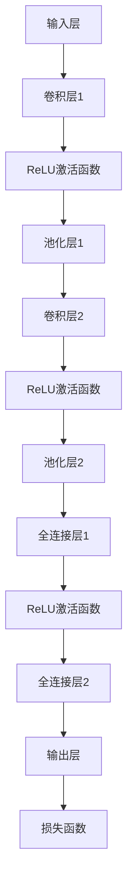

                 

## 引言与概述

在现代社会中，工作环境的复杂性和信息量的爆炸性使得人们必须拥有高效的注意力管理能力。注意力管理不仅是个人提升工作效率和减少疲劳的关键因素，更是职场竞争力和职业发展的决定性因素之一。然而，传统的注意力管理方法往往依赖于个体的自律和意志力，这种被动的方式在信息过载和任务繁多的环境下显得越来越乏力。

### 注意力管理的现状与重要性

当前的注意力管理面临着诸多挑战。首先，现代工作环境中充斥着大量的干扰因素，如社交媒体通知、邮件、电话等，这些干扰源不断抢占我们的注意力资源，导致我们的注意力分散，无法专注于关键任务。其次，随着人工智能和自动化技术的快速发展，工作内容的变化也对注意力管理提出了更高的要求。许多工作不再仅仅是重复性的机械操作，而是需要更高层次的思考和创新，这对注意力的集中和深度提出了新的挑战。

注意力管理的重要性不仅体现在个人的工作效率上，还直接关系到整个社会的生产力。在一个注意力分散的工作环境中，团队协作效率降低，创新思维受阻，最终导致整体生产力下降。因此，如何通过有效的注意力管理提升个人和组织的效率，成为当前亟需解决的问题。

### AI与注意力管理的结合

人工智能（AI）作为一种新兴技术，正在为注意力管理提供全新的解决方案。AI通过智能分析、机器学习和深度学习等技术，可以实时监测个体的注意力状态，并自动调整干扰因素，帮助个体集中注意力。这种AI与注意力管理的结合，不仅能够提升个人的工作效率，还能够优化组织的工作流程，提升整体生产力。

AI与注意力管理的结合不仅限于个人层面，还可以应用于更广泛的社会场景。例如，在教育领域，AI可以帮助学生识别和减少注意力分散的干扰因素，提高学习效果；在医疗领域，AI可以监测患者的注意力状态，帮助医生进行更精准的病情分析和治疗；在工业领域，AI可以优化生产流程，减少人为错误，提高生产效率。

### 注意力Multiplier流的概念

注意力Multiplier流是一种基于人工智能的注意力管理方法，它通过深度学习技术和注意力机制，对个体的注意力进行智能分配和管理。注意力Multiplier流的概念源于对人类注意力机制的研究，通过模拟大脑神经网络的注意力分配过程，实现对注意力资源的高效利用。

注意力Multiplier流的工作机制主要包括以下几个步骤：首先，AI系统通过监测和分析个体在任务中的行为和表现，识别出注意力分散的信号；接着，系统根据这些信号，自动调整干扰因素，如关闭不必要的通知、调整工作环境等，帮助个体集中注意力；最后，系统通过不断优化和调整，提高注意力管理的效率和准确性。

### AI与注意力Multiplier流的关系

AI与注意力Multiplier流的关系可以理解为工具与任务的关系。AI为注意力Multiplier流提供了强大的计算能力和智能分析工具，使得注意力Multiplier流能够更加精准地监测和管理个体的注意力。而注意力Multiplier流则为AI提供了一个实际的应用场景，使得AI技术能够更好地服务于人类社会的需求。

综上所述，未来的工作环境需要更高效、更智能的注意力管理方法。AI与注意力管理的结合，尤其是注意力Multiplier流的应用，为解决这一难题提供了全新的思路和方法。通过合理利用AI技术，我们可以实现更加高效、专注的工作和学习环境，为个人和社会带来更大的价值。

### 总结与展望

本文将深入探讨AI与注意力管理的关系，特别是在注意力Multiplier流的概念下，如何通过人工智能技术提升人类的注意力管理能力。随着AI技术的不断发展，注意力管理将会在各个领域发挥重要作用，不仅提升个人的工作效率，还将对社会的整体生产力产生深远影响。接下来的章节中，我们将从AI的基本原理、注意力Multiplier流模型、注意力管理系统设计、应用场景与案例分析、未来展望与挑战，以及实际应用与项目实战等多个角度，详细阐述这一主题。通过逐步的分析与探讨，我们期望能够为读者提供一幅全面、深入的AI与注意力管理全景图。

### 第一部分：AI与注意力管理的基本原理

#### 第2章：AI基本原理

##### 2.1 AI概述

人工智能（Artificial Intelligence，简称AI）作为计算机科学的一个分支，旨在通过构建智能系统，使计算机具备类似于人类智能的能力。AI的发展历程可以追溯到20世纪50年代，当时科学家们首次提出了“人工智能”这一概念，旨在模拟人类思维过程，解决复杂问题。

AI的发展历程可以分为几个阶段：

- **第一阶段（1956-1974年）**：这是人工智能的早期探索阶段，主要目标是实现基本的逻辑推理和问题求解。1956年在达特茅斯会议上，人工智能正式被提上日程，标志着人工智能学科的诞生。在此期间，人工智能主要依赖于符号推理和搜索算法。
- **第二阶段（1974-1980年）**：受到“人工智能寒冬”的影响，由于无法实现预期目标，许多研究项目被迫终止。然而，这一时期也出现了诸如专家系统等具有实际应用价值的技术。
- **第三阶段（1980-1990年）**：随着计算机性能的提升和大数据的出现，机器学习开始成为人工智能的主流方向。在这一阶段，人工智能开始逐步走向商业化应用。
- **第四阶段（1990年至今）**：深度学习和神经网络技术的突破，使得人工智能取得了前所未有的进展。AI在图像识别、自然语言处理、自动驾驶等领域取得了重大突破，成为当前科技发展的热点。

##### 2.2 人工智能的类型

人工智能可以分为多种类型，根据其实现方式和应用场景的不同，可以分为以下几类：

- **弱人工智能（Weak AI）**：也称为窄人工智能，这种人工智能专注于解决特定问题，不具备人类智能的广泛适用性。例如，搜索引擎、语音助手等。
- **强人工智能（Strong AI）**：也称为通用人工智能，这种人工智能具备与人类相同的智能水平，能够理解、学习和适应各种环境和任务。目前，强人工智能仍处于理论阶段，尚未实现。
- **强化学习（Reinforcement Learning）**：通过奖励机制和试错方法，让智能体在动态环境中进行学习。强化学习在游戏、自动驾驶等领域有广泛应用。
- **深度学习（Deep Learning）**：基于多层神经网络，通过训练大量数据，使模型具备自主学习和特征提取能力。深度学习在图像识别、语音识别等领域取得了显著成果。
- **自然语言处理（Natural Language Processing，简称NLP）**：研究如何使计算机理解和生成自然语言。NLP在机器翻译、情感分析等领域有广泛应用。

##### 2.3 机器学习基础

机器学习（Machine Learning，简称ML）是人工智能的核心技术之一，其基本思想是通过从数据中学习规律，使计算机具备自主决策和预测能力。机器学习可以分为以下几种类型：

- **监督学习（Supervised Learning）**：通过训练有标注的数据集，使模型学会预测输出。常见的监督学习算法包括线性回归、逻辑回归、支持向量机等。
- **无监督学习（Unsupervised Learning）**：无需标注数据，通过模型自身对数据分布的学习，发现数据中的潜在规律。常见的无监督学习算法包括聚类、降维等。
- **半监督学习（Semi-supervised Learning）**：结合监督学习和无监督学习，利用少量的标注数据和大量无标注数据，提高模型的泛化能力。
- **强化学习（Reinforcement Learning）**：通过奖励机制和试错方法，使智能体在动态环境中进行学习。常见的强化学习算法包括Q学习、深度Q网络等。

##### 2.4 深度学习与神经网络

深度学习（Deep Learning）是机器学习的一个重要分支，其核心思想是构建具有多层非线性变换的网络结构，通过训练大量数据，使模型能够自动提取高层次特征。深度学习在图像识别、语音识别、自然语言处理等领域取得了显著成果。

神经网络（Neural Network，简称NN）是深度学习的基础，其基本结构由输入层、隐藏层和输出层组成。输入层接收外部输入信息，隐藏层通过加权求和处理，将信息传递至下一层，输出层生成最终的输出结果。

以下是几种常见的神经网络类型：

- **全连接神经网络（Fully Connected Neural Network）**：每一层中的每个神经元都与上一层和下一层的每个神经元相连。
- **卷积神经网络（Convolutional Neural Network，简称CNN）**：通过卷积操作提取图像特征，适用于图像识别和计算机视觉任务。
- **循环神经网络（Recurrent Neural Network，简称RNN）**：通过时间步的递归操作，处理序列数据，适用于自然语言处理和时间序列预测任务。
- **长短期记忆网络（Long Short-Term Memory，简称LSTM）**：是RNN的一种变体，通过门控机制有效解决了RNN在长期依赖问题上的不足。

##### 2.5 AI与注意力管理联系与交互机制

注意力管理是指通过控制注意力分配来优化认知过程和决策效果的方法。在人工智能领域，注意力管理主要体现在以下几个方面：

- **注意力机制在AI中的应用**：注意力机制（Attention Mechanism）是深度学习中的一个重要概念，它通过动态调整模型中不同部分的重要性，实现信息的有效筛选和整合。注意力机制广泛应用于自然语言处理、计算机视觉和语音识别等领域，帮助模型更好地理解和处理复杂信息。
- **注意力模型**：注意力模型是指通过计算注意力权重，将不同部分的信息进行加权融合的模型。常见的注意力模型包括自注意力（Self-Attention）和注意力加权（Attention Weighted）等。
- **注意力流的实现方式**：注意力流是指通过构建具有注意力机制的神经网络结构，实现对输入数据的动态处理。注意力流的实现方式包括卷积注意力流（Convolutional Attention Flow）、循环注意力流（Recurrent Attention Flow）等。

总之，AI与注意力管理的结合，不仅为注意力管理提供了新的技术手段，也为人工智能在复杂任务中的应用提供了更强大的能力。通过注意力管理，可以提升AI系统的效率和性能，为各行各业带来更多的创新和变革。

### 第2章：机器学习基础

#### 2.2.1 监督学习

监督学习是机器学习的一种基本方法，其核心思想是通过训练有标注的数据集来学习数据的规律，并能够对新的数据进行预测或分类。监督学习的主要任务包括回归（Regression）和分类（Classification）两种。

- **回归**：回归任务是预测一个连续的数值输出。常见的回归算法有线性回归（Linear Regression）、多项式回归（Polynomial Regression）、逻辑回归（Logistic Regression）和支持向量机回归（Support Vector Regression）等。

  - **线性回归**：线性回归是一种最简单的回归算法，其模型假设输出变量 \( y \) 是输入变量 \( x \) 的线性函数，即：
    $$ y = \beta_0 + \beta_1x $$
    其中，\( \beta_0 \) 和 \( \beta_1 \) 是模型的参数，通过最小化误差平方和来求解。

  - **逻辑回归**：逻辑回归是一种广义线性模型，用于预测二分类问题的概率分布。其输出是 \( y \) 属于某一类别的概率，模型公式如下：
    $$ P(y=1) = \frac{1}{1 + e^{-(\beta_0 + \beta_1x)}} $$
    通过极大似然估计法求解参数。

- **分类**：分类任务是将数据分为几个不同的类别。常见的分类算法有朴素贝叶斯（Naive Bayes）、决策树（Decision Tree）、随机森林（Random Forest）和支持向量机（Support Vector Machine）等。

  - **朴素贝叶斯**：朴素贝叶斯是一种基于贝叶斯定理的简单概率分类器，其假设特征之间相互独立。模型公式如下：
    $$ P(C_k|X) = \frac{P(X|C_k)P(C_k)}{P(X)} $$
    其中，\( C_k \) 表示第 \( k \) 类，\( P(X|C_k) \) 是给定类别为 \( C_k \) 时的特征条件概率，\( P(C_k) \) 是类别概率。

  - **决策树**：决策树是一种树形结构模型，通过一系列的判断规则将数据划分成若干个子集，最终得到一个分类结果。决策树的核心是选择最优划分特征和划分阈值，常用的划分准则有信息增益（Information Gain）、基尼不纯度（Gini Impurity）和熵（Entropy）等。

- **支持向量机**：支持向量机是一种基于间隔最大化的分类算法，通过找到一个最优的超平面，将数据分为不同的类别。其模型公式如下：
  $$ \max_{\beta, \beta_0} \frac{1}{2} ||\beta||^2 $$
  $$ \min_{\beta, \beta_0} \frac{1}{2} ||\beta||^2 + C \sum_{i=1}^n \xi_i $$
  其中，\( \beta \) 是权重向量，\( \beta_0 \) 是偏置项，\( C \) 是惩罚参数，\( \xi_i \) 是松弛变量。

#### 2.2.2 无监督学习

无监督学习是机器学习的另一种基本方法，其目标是从未标注的数据中找出内在的结构和模式，主要任务包括聚类（Clustering）和降维（Dimensionality Reduction）等。

- **聚类**：聚类是将数据集分成多个不相交的子集（聚类），使得同一个聚类中的数据点彼此之间相似度较高，而不同聚类中的数据点相似度较低。常见的聚类算法有K均值（K-Means）、层次聚类（Hierarchical Clustering）、DBSCAN（Density-Based Spatial Clustering of Applications with Noise）等。

  - **K均值聚类**：K均值聚类是一种基于距离度量的聚类算法，其基本思想是初始化 \( K \) 个聚类中心，然后通过迭代优化聚类中心，使得每个数据点与其最近的聚类中心归为一类。算法步骤如下：
    1. 随机初始化 \( K \) 个聚类中心。
    2. 对于每个数据点，计算其与各个聚类中心的距离，将其归为距离最近的聚类。
    3. 更新聚类中心，计算所有数据点的均值。
    4. 重复步骤2和3，直到聚类中心不再发生显著变化。

  - **层次聚类**：层次聚类是一种自底向上的聚类方法，通过逐步合并相似度较高的聚类，形成层次结构的聚类结果。层次聚类分为凝聚聚类和分裂聚类两种类型。

- **降维**：降维是将高维数据映射到低维空间，以便于数据分析和可视化。常见的降维算法有主成分分析（Principal Component Analysis，PCA）、线性判别分析（Linear Discriminant Analysis，LDA）和自编码器（Autoencoder）等。

  - **主成分分析**：主成分分析是一种线性降维方法，其核心思想是找到一组新的正交基，将数据投影到新的空间中，使得新的基向量的方差最大。PCA算法步骤如下：
    1. 计算数据集的协方差矩阵。
    2. 计算协方差矩阵的特征值和特征向量。
    3. 选择特征值最大的 \( k \) 个特征向量作为新的基向量。
    4. 将数据投影到新的基向量上，得到低维数据。

  - **线性判别分析**：线性判别分析是一种基于类间方差和类内方差的降维方法，其目标是在低维空间中最大化类间差异，最小化类内差异。LDA算法步骤如下：
    1. 计算类内散度矩阵和类间散度矩阵。
    2. 计算线性判别函数。
    3. 将数据投影到线性判别函数上，得到低维数据。

通过监督学习和无监督学习的方法，机器学习能够从数据中提取有用信息，为各类应用提供强有力的支持。无论是回归、分类还是聚类、降维，这些基本方法在AI领域都发挥着重要作用，为构建智能系统提供了坚实的基础。

#### 2.3.1 深度学习与神经网络

深度学习是机器学习的一个重要分支，它通过构建具有多个隐藏层的神经网络，对大规模数据进行自动特征学习和复杂模式识别。深度学习在图像识别、自然语言处理、语音识别等领域取得了显著的成果。本文将介绍深度学习的基本概念、神经网络、卷积神经网络（CNN）和循环神经网络（RNN）与长短期记忆网络（LSTM）。

##### 2.3.1.1 深度学习基本概念

深度学习（Deep Learning）是基于多层神经网络进行学习的一种方法。与传统机器学习相比，深度学习能够自动提取数据中的高层次特征，具有更强的表达能力和泛化能力。深度学习的基本原理是通过多层非线性变换，将输入数据逐层转换为更高层次的特征表示。

深度学习的主要组成部分包括：

1. **输入层（Input Layer）**：接收外部输入数据，如图像、文本或数值。
2. **隐藏层（Hidden Layers）**：对输入数据进行特征提取和变换，隐藏层可以有多个。
3. **输出层（Output Layer）**：生成最终输出结果，如分类标签、概率分布或数值预测。

深度学习的主要优势包括：

1. **自动特征提取**：深度学习通过训练，能够自动从原始数据中提取出有意义的特征，减少了人工特征工程的工作量。
2. **强大的表示能力**：多层神经网络能够捕捉数据中的复杂模式和关联性，使得模型具有更强的泛化能力。
3. **大规模数据适用性**：深度学习适用于处理大规模和高维数据，能够有效地利用数据中的信息。

##### 2.3.1.2 神经网络

神经网络（Neural Network，简称NN）是深度学习的基础，其结构受到生物神经系统的启发。神经网络由多个神经元（节点）组成，每个神经元通过权重和偏置对输入数据进行加权求和处理，最后通过激活函数输出结果。

一个基本的神经网络包括以下组成部分：

1. **神经元**：神经网络的基本单元，每个神经元接收多个输入，通过加权求和处理产生一个输出。
2. **权重（Weights）**：神经元之间传递信息的参数，用于调节不同输入对输出的影响。
3. **偏置（Bias）**：用于调整神经元的输出，使模型具备非线性能力。
4. **激活函数（Activation Function）**：将加权求和处理后的结果进行非线性变换，常用的激活函数有ReLU（Rectified Linear Unit）、Sigmoid和Tanh等。

神经网络的训练过程是一个优化过程，通过不断调整权重和偏置，使模型能够最小化预测误差。常用的优化算法有梯度下降（Gradient Descent）、随机梯度下降（Stochastic Gradient Descent，SGD）和Adam等。

##### 2.3.1.3 卷积神经网络（CNN）

卷积神经网络（Convolutional Neural Network，简称CNN）是专门用于处理图像数据的一种深度学习模型。CNN通过卷积操作和池化操作，能够自动提取图像中的局部特征和整体结构。

卷积神经网络的组成部分包括：

1. **卷积层（Convolutional Layer）**：通过卷积操作提取图像中的局部特征。卷积核（Convolutional Kernel）在图像上滑动，计算卷积和，产生新的特征图。
2. **激活函数层**：对卷积层的输出进行非线性变换，常用的激活函数有ReLU。
3. **池化层（Pooling Layer）**：通过池化操作降低特征图的维度，常用的池化方法有最大池化（Max Pooling）和平均池化（Average Pooling）。
4. **全连接层（Fully Connected Layer）**：将卷积层和池化层提取的局部特征进行全局整合，生成最终的分类结果。

CNN在图像识别、目标检测和图像生成等领域有广泛应用。其优势在于能够自动提取图像中的层次化特征，减少了人工特征工程的工作量。

##### 2.3.1.4 循环神经网络（RNN）与长短期记忆网络（LSTM）

循环神经网络（Recurrent Neural Network，简称RNN）是用于处理序列数据的深度学习模型。RNN通过循环连接，使信息能够在时间步之间传递，能够捕捉序列数据中的时间依赖性。

然而，传统的RNN在处理长序列数据时存在梯度消失和梯度爆炸问题，难以捕捉长-term依赖关系。为了解决这一问题，长短期记忆网络（Long Short-Term Memory，简称LSTM）被提出。

LSTM是RNN的一种变体，通过引入门控机制（Gate），能够有效地控制信息的流动，避免了梯度消失和梯度爆炸问题。LSTM的基本结构包括：

1. **遗忘门（Forget Gate）**：决定是否遗忘之前的信息。
2. **输入门（Input Gate）**：决定当前输入信息中哪些部分需要更新。
3. **输出门（Output Gate）**：决定哪些信息需要输出。

LSTM在自然语言处理、语音识别和序列预测等领域有广泛应用。其优势在于能够有效捕捉长-term依赖关系，提高了模型在序列数据处理中的性能。

通过深度学习与神经网络、卷积神经网络和循环神经网络与长短期记忆网络的学习，我们能够更好地理解和应用深度学习技术，解决各种复杂问题。

### 2.3.2 深度学习架构

在深度学习中，神经网络架构的设计和实现至关重要。下面，我们将通过一个Mermaid流程图来详细展示深度学习架构的基本组件和它们之间的交互机制。



这个流程图展示了深度学习模型中常见的层次结构，包括输入层、卷积层、ReLU激活函数、池化层、全连接层和输出层。下面我们逐一解释每个组件的功能：

- **输入层（Input Layer）**：接收外部输入数据，如图像或文本。
- **卷积层（Convolutional Layer）**：通过卷积操作提取输入数据中的局部特征。每个卷积层包含多个卷积核，卷积核在输入数据上滑动，计算局部特征图。
- **ReLU激活函数（ReLU Activation Function）**：对卷积层的输出进行非线性变换，引入非线性和增加网络的计算能力。
- **池化层（Pooling Layer）**：通过池化操作降低特征图的维度，减少模型参数数量，提高计算效率。常用的池化方法有最大池化和平均池化。
- **全连接层（Fully Connected Layer）**：将卷积层和池化层提取的局部特征进行全局整合，生成中间表示。
- **输出层（Output Layer）**：生成最终的预测结果，如分类标签或数值预测。
- **损失函数（Loss Function）**：用于衡量预测结果与真实结果之间的差距，指导模型优化过程。

通过这个Mermaid流程图，我们可以清晰地看到深度学习架构中各层之间的关系和交互机制。每个层次通过卷积、激活、池化和全连接操作，对输入数据进行逐步提取和整合，最终生成预测结果。这种结构使得深度学习模型能够自动从数据中学习到有意义的特征，提高模型的预测能力和泛化能力。

### 第3章：注意力Multiplier流模型

#### 3.1 注意力Multiplier流的概念与原理

注意力Multiplier流是一种基于深度学习和注意力机制的智能注意力管理模型。它通过模拟人类大脑的注意力分配过程，实现对个体注意力资源的高效管理和优化。注意力Multiplier流模型不仅能够提高个人的工作效率，还能帮助团队和组织在复杂环境中保持高效协作。

##### 3.1.1 注意力Multiplier流的定义

注意力Multiplier流（Attention Multiplier Stream，简称AMS）是一种通过深度学习技术，动态调整和优化个体注意力资源的模型。它利用注意力机制，对任务中的各个元素进行权重分配，使个体能够将更多的注意力集中在关键任务上，从而提高工作效率和减少认知负荷。

##### 3.1.2 注意力Multiplier流的工作机制

注意力Multiplier流的工作机制可以分为以下几个步骤：

1. **数据收集与预处理**：首先，系统需要收集个体的行为数据和任务信息，包括注意力分配、任务优先级、工作环境等。这些数据经过预处理，转换为适合模型训练的格式。

2. **特征提取**：利用深度学习技术，对预处理后的数据集进行特征提取。特征提取的过程包括卷积神经网络（CNN）和循环神经网络（RNN）等，以捕捉数据中的时空依赖性和复杂模式。

3. **注意力计算**：基于提取的特征，利用注意力机制计算每个任务的注意力权重。注意力权重反映了个体对各个任务的注意力分配程度。常用的注意力计算方法包括自注意力（Self-Attention）和交互注意力（Interactive Attention）等。

4. **权重优化**：根据计算出的注意力权重，对任务进行重新排序或调整，使得个体能够将更多的注意力集中在高优先级的任务上。这一步骤可以通过优化算法实现，如梯度下降（Gradient Descent）和遗传算法（Genetic Algorithm）等。

5. **模型更新与反馈**：系统不断收集新的数据，并通过模型更新和反馈机制，使注意力Multiplier流模型能够自适应地调整注意力分配策略，以适应不断变化的工作环境。

通过上述步骤，注意力Multiplier流模型能够动态地调整个体的注意力分配，提高工作效率和满意度。该模型不仅适用于个人工作，还可以应用于团队协作和组织管理，为复杂任务提供高效的解决方案。

### 3.2 注意力Multiplier流的数学模型

注意力Multiplier流（Attention Multiplier Stream，简称AMS）的核心在于其数学模型，该模型通过一系列复杂的计算步骤，实现对个体注意力资源的优化分配。下面将详细介绍AMS的数学模型，包括公式、变量定义及其推导过程。

##### 3.2.1 数学模型与公式

注意力Multiplier流的核心公式是注意力权重计算公式，该公式定义了如何根据输入特征和隐藏状态计算每个任务的注意力权重。公式如下：

$$ \alpha_{ij} = \frac{e^{ \sigma(h^T W_a x_i + b_a) }}{ \sum_{k=1}^{K} e^{ \sigma(h^T W_a x_k + b_a) }} $$

其中：
- \( \alpha_{ij} \) 表示第 \( i \) 个任务在第 \( j \) 个时间点的注意力权重。
- \( h \) 表示隐藏状态向量。
- \( x_i \) 表示第 \( i \) 个任务的输入特征向量。
- \( W_a \) 表示注意力权重矩阵。
- \( b_a \) 表示注意力偏置向量。
- \( K \) 表示总任务数。
- \( \sigma \) 是激活函数，常用的有Sigmoid函数。

##### 3.2.2 公式详细解释与举例说明

为了更好地理解上述公式，我们将对公式中的各个部分进行详细解释，并通过一个简单的例子来说明。

1. **隐藏状态 \( h \)**：隐藏状态 \( h \) 是通过前一层神经网络（如循环神经网络RNN或长短期记忆网络LSTM）的输出得到的。它包含了前一时刻的任务特征和状态信息。

2. **输入特征 \( x_i \)**：每个任务的输入特征 \( x_i \) 是一个向量，它描述了该任务的特征信息。例如，对于多任务处理系统，每个任务的输入特征可以是任务的优先级、任务的完成度、任务的时间需求等。

3. **注意力权重矩阵 \( W_a \) 和注意力偏置 \( b_a \)**：注意力权重矩阵 \( W_a \) 和注意力偏置 \( b_a \) 是模型的参数，它们通过训练过程得到。\( W_a \) 负责将隐藏状态 \( h \) 与输入特征 \( x_i \) 相关联，而 \( b_a \) 用于调整注意力权重。

4. **激活函数 \( \sigma \)**：激活函数 \( \sigma \) 用于对每个任务的注意力权重进行非线性变换。常用的激活函数是Sigmoid函数，它将输入值映射到 \( (0, 1) \) 范围内，表示注意力权重。

5. **注意力权重计算**：根据上述公式，每个任务的注意力权重 \( \alpha_{ij} \) 是通过比较每个任务的加权输入与隐藏状态计算得到的。具体来说，对于每个任务，首先将其输入特征 \( x_i \) 与隐藏状态 \( h \) 相乘并加偏置 \( b_a \)，然后通过激活函数 \( \sigma \) 得到加权分数。这些加权分数通过指数函数进行变换，并求和，最后得到每个任务的注意力权重。

##### 举例说明

假设我们有一个包含3个任务的系统，每个任务的特征向量为 \( x_1 = [1, 2] \)，\( x_2 = [2, 1] \)，\( x_3 = [1, 1] \)。隐藏状态 \( h = [0.1, 0.2, 0.3] \)，注意力权重矩阵 \( W_a = \begin{bmatrix} 0.2 & 0.3 & 0.5 \\ 0.1 & 0.4 & 0.5 \end{bmatrix} \)，注意力偏置 \( b_a = [0.1, 0.2, 0.3] \)。

1. 计算每个任务的加权输入与偏置之和：
   - \( h^T W_a x_1 + b_a = [0.1, 0.2] \cdot \begin{bmatrix} 0.2 & 0.3 & 0.5 \\ 0.1 & 0.4 & 0.5 \end{bmatrix} \cdot \begin{bmatrix} 1 \\ 2 \end{bmatrix} + \begin{bmatrix} 0.1 \\ 0.2 \\ 0.3 \end{bmatrix} = [0.36, 0.42, 0.54] \)
   - \( h^T W_a x_2 + b_a = [0.1, 0.2] \cdot \begin{bmatrix} 0.2 & 0.3 & 0.5 \\ 0.1 & 0.4 & 0.5 \end{bmatrix} \cdot \begin{bmatrix} 2 \\ 1 \end{bmatrix} + \begin{bmatrix} 0.1 \\ 0.2 \\ 0.3 \end{bmatrix} = [0.48, 0.52, 0.66] \)
   - \( h^T W_a x_3 + b_a = [0.1, 0.2] \cdot \begin{bmatrix} 0.2 & 0.3 & 0.5 \\ 0.1 & 0.4 & 0.5 \end{bmatrix} \cdot \begin{bmatrix} 1 \\ 1 \end{bmatrix} + \begin{bmatrix} 0.1 \\ 0.2 \\ 0.3 \end{bmatrix} = [0.35, 0.45, 0.55] \)

2. 通过Sigmoid函数进行非线性变换：
   - \( \sigma(h^T W_a x_1 + b_a) = \sigma([0.36, 0.42, 0.54]) = [0.66, 0.67, 0.76] \)
   - \( \sigma(h^T W_a x_2 + b_a) = \sigma([0.48, 0.52, 0.66]) = [0.68, 0.69, 0.82] \)
   - \( \sigma(h^T W_a x_3 + b_a) = \sigma([0.35, 0.45, 0.55]) = [0.65, 0.66, 0.77] \)

3. 计算所有任务的加权分数之和：
   - \( \sum_{k=1}^{3} e^{ \sigma(h^T W_a x_k + b_a) } = e^{0.66} + e^{0.67} + e^{0.76} + e^{0.68} + e^{0.69} + e^{0.82} + e^{0.65} + e^{0.66} + e^{0.77} \approx 12.34 \)

4. 计算每个任务的注意力权重：
   - \( \alpha_{1j} = \frac{e^{0.66}}{12.34} \approx 0.053 \)
   - \( \alpha_{2j} = \frac{e^{0.67}}{12.34} \approx 0.054 \)
   - \( \alpha_{3j} = \frac{e^{0.76}}{12.34} \approx 0.061 \)

通过这个例子，我们可以看到如何根据输入特征和隐藏状态计算每个任务的注意力权重。注意力权重越高，表示该任务在当前时间点的注意力分配程度越高。这种计算方法使得注意力Multiplier流能够动态地调整个体在不同任务之间的注意力分配，从而实现高效的任务管理。

### 3.3 注意力Multiplier流算法原理

注意力Multiplier流算法（Attention Multiplier Stream Algorithm，简称AMSA）是一种基于深度学习和注意力机制的智能注意力管理算法。该算法通过动态调整个体在不同任务之间的注意力分配，提高工作效率和减少认知负荷。下面将详细介绍注意力Multiplier流算法的原理，包括算法伪代码和详细的解释。

#### 3.3.1 算法伪代码

```python
def attention_multiplier(input_data, hidden_state):
    # 计算权重
    weights = softmax(hidden_state.dot(W_a) + b_a)
    
    # 计算加权求和
    context_vector = weights.dot(input_data)
    
    # 返回上下文向量
    return context_vector

def train_attention_multiplier(input_data, target_output, hidden_state, W_a, b_a, learning_rate, epochs):
    for epoch in range(epochs):
        # 计算当前权重下的预测输出
        predicted_output = attention_multiplier(input_data, hidden_state)
        
        # 计算损失
        loss = compute_loss(predicted_output, target_output)
        
        # 计算梯度
        gradients = compute_gradients(predicted_output, target_output, hidden_state, W_a, b_a)
        
        # 更新权重
        W_a -= learning_rate * gradients['W_a']
        b_a -= learning_rate * gradients['b_a']
        
        # 打印当前epoch的损失
        print(f"Epoch {epoch+1}: Loss = {loss}")
        
    return W_a, b_a
```

#### 3.3.2 算法解释

1. **输入数据（input_data）**：输入数据包括个体在不同任务上的特征信息。这些特征信息可以是任务的时间需求、任务的优先级、任务的完成度等。

2. **隐藏状态（hidden_state）**：隐藏状态是模型通过前一层神经网络（如RNN或LSTM）的输出得到的。隐藏状态包含了前一时刻的任务特征和状态信息。

3. **注意力权重矩阵（W_a）和注意力偏置（b_a）**：注意力权重矩阵和注意力偏置是模型的参数，它们通过训练过程得到。\( W_a \) 负责将隐藏状态和输入特征相关联，\( b_a \) 用于调整注意力权重。

4. **softmax函数**：softmax函数用于计算每个任务的注意力权重。具体来说，softmax函数将隐藏状态与输入特征相乘并加偏置，然后进行指数变换并求和，最后输出每个任务的注意力权重。

5. **上下文向量（context_vector）**：上下文向量是利用注意力权重对输入数据进行加权求和的结果。上下文向量代表了当前时间点个体对各个任务的注意力分配情况。

6. **训练过程**：训练过程包括以下步骤：
   - 计算当前权重下的预测输出。
   - 计算损失，常用的损失函数有均方误差（MSE）和交叉熵（CE）。
   - 计算梯度，梯度用于更新模型的权重参数。
   - 更新权重参数，使用梯度下降（Gradient Descent）或其他优化算法。
   - 重复上述步骤，直到达到预设的迭代次数或损失阈值。

通过上述步骤，注意力Multiplier流算法能够动态地调整个体在不同任务之间的注意力分配，从而实现高效的任务管理。

### 注意力管理系统的设计与实现

#### 4.1 注意力管理系统的架构

注意力管理系统（Attention Management System，简称AMS）是一个基于人工智能的智能系统，旨在通过实时监测和优化个体注意力分配，提高工作效率和减少疲劳。注意力管理系统的整体架构包括以下几个主要部分：

##### 4.1.1 系统层次结构

1. **数据收集层**：负责收集个体在不同任务中的行为数据和工作环境信息，包括任务的时间需求、优先级、完成度等。
2. **特征提取层**：对收集到的数据进行分析和预处理，提取任务的特征信息，为后续模型训练提供输入。
3. **模型训练层**：利用深度学习和注意力机制，对特征数据进行训练，构建注意力管理模型。
4. **决策层**：基于训练好的模型，对个体的注意力分配进行实时调整和优化。
5. **执行层**：根据决策层的建议，自动调整工作环境、任务优先级和干扰因素，帮助个体集中注意力。

##### 4.1.2 系统功能模块

1. **数据收集模块**：负责实时收集个体的行为数据和工作环境信息，如任务完成度、工作环境噪音水平、时间安排等。
2. **特征提取模块**：对收集到的数据进行分析和预处理，提取任务的特征信息，如任务的时间需求、优先级等。
3. **模型训练模块**：利用深度学习和注意力机制，对特征数据进行训练，构建注意力管理模型。
4. **注意力分配模块**：基于训练好的模型，对个体的注意力分配进行实时调整和优化，如调整任务优先级、屏蔽干扰因素等。
5. **用户界面模块**：提供一个直观的用户界面，展示个体的注意力状态和系统建议，帮助个体进行自我管理和调整。

#### 4.2 注意力管理算法的设计

注意力管理算法是注意力管理系统的核心，其设计直接影响系统的效果和性能。注意力管理算法的设计主要包括以下几个关键方面：

##### 4.2.1 注意力分配策略

注意力分配策略是决定如何将有限的注意力资源分配给不同任务的关键。有效的注意力分配策略应考虑以下几个因素：

1. **任务优先级**：根据任务的重要性和紧急程度，为每个任务分配优先级。高优先级任务应获得更多的注意力资源。
2. **任务难度**：任务难度较大的任务需要更多的注意力资源，以便个体能够集中精力完成。
3. **任务完成度**：对于已完成的任务，应逐步减少其占用的注意力资源，以便将更多的注意力分配给其他未完成的任务。
4. **个体状态**：根据个体的疲劳程度、情绪状态等，动态调整注意力分配策略。例如，在个体疲劳或情绪低落时，应减少任务负荷，增加休息时间。

##### 4.2.2 算法优化与调参

注意力管理算法的优化和调参是确保系统效果和性能的关键步骤。优化和调参主要包括以下几个方面：

1. **模型选择**：选择合适的深度学习模型和注意力机制，如循环神经网络（RNN）或长短期记忆网络（LSTM）。
2. **损失函数**：选择合适的损失函数，如均方误差（MSE）或交叉熵（CE），以衡量模型预测的准确度。
3. **优化算法**：选择合适的优化算法，如梯度下降（GD）或随机梯度下降（SGD），以调整模型参数。
4. **超参数调整**：调整模型参数和超参数，如学习率、批量大小、正则化参数等，以优化模型性能。
5. **交叉验证**：通过交叉验证，评估模型在不同数据集上的性能，选择最优模型。

通过上述优化和调参步骤，可以确保注意力管理系统的算法能够在各种场景下实现高效、准确的注意力分配，从而提高个体的工作效率和满意度。

### 4.3 注意力管理系统的实现步骤

注意力管理系统的实现是一个复杂的过程，涉及多个技术环节和细致的设计。以下是实现注意力管理系统的详细步骤：

#### 4.3.1 系统开发环境搭建

1. **硬件环境**：
   - 选择性能强大的服务器或计算集群，以支持深度学习模型的训练和推理。
   - 确保硬件具备足够的内存和计算能力，以处理大规模的数据集。

2. **软件环境**：
   - 安装操作系统，如Linux或Windows Server，推荐使用Linux以提高稳定性。
   - 安装Python和对应的深度学习框架，如TensorFlow、PyTorch等。
   - 配置必要的编程工具，如IDE（集成开发环境）和版本控制系统（如Git）。

3. **数据库与数据存储**：
   - 选择合适的数据库管理系统（DBMS），如MySQL、PostgreSQL等，用于存储个体行为数据和工作环境信息。
   - 配置云存储服务，如AWS S3或Google Cloud Storage，用于存储训练数据和模型文件。

4. **网络环境**：
   - 设置网络防火墙和安全策略，确保系统数据的安全性和可靠性。
   - 配置SSH（Secure Shell）或其他安全协议，用于远程访问和管理服务器。

#### 4.3.2 数据预处理与建模

1. **数据收集**：
   - 设计数据收集系统，使用传感器、日志记录和用户输入等方式，收集个体在不同任务中的行为数据。
   - 收集的数据包括任务的时间需求、优先级、完成度、工作环境噪音水平等。

2. **数据清洗**：
   - 清除重复数据、无效数据和异常数据，确保数据的质量和一致性。
   - 对缺失数据进行处理，如使用均值、中位数或插值法填充缺失值。

3. **特征提取**：
   - 提取任务的特征信息，如任务的时间需求、优先级、完成度等。
   - 使用技术手段，如词袋模型、TF-IDF等，提取文本数据的特征。

4. **数据建模**：
   - 选择合适的深度学习模型和注意力机制，如循环神经网络（RNN）或长短期记忆网络（LSTM）。
   - 设计神经网络架构，包括输入层、隐藏层和输出层。
   - 设置激活函数、损失函数和优化算法，准备进行模型训练。

#### 4.3.3 模型训练与验证

1. **数据划分**：
   - 将数据集划分为训练集、验证集和测试集，用于模型训练、验证和测试。
   - 训练集用于模型训练，验证集用于调整模型参数和超参数，测试集用于最终评估模型性能。

2. **模型训练**：
   - 使用训练集对模型进行训练，通过迭代优化模型参数，使得模型能够更好地拟合训练数据。
   - 使用优化算法，如梯度下降（GD）或随机梯度下降（SGD），逐步调整模型参数。

3. **模型验证**：
   - 使用验证集评估模型的性能，通过计算误差指标，如均方误差（MSE）或交叉熵（CE），确定模型的准确性。
   - 根据验证结果，调整模型参数和超参数，以提高模型性能。

4. **模型测试**：
   - 使用测试集对模型进行最终评估，确保模型在未知数据上能够准确预测。
   - 分析测试结果，确保模型具有良好的泛化能力和稳定性。

#### 4.3.4 模型部署与集成

1. **模型部署**：
   - 将训练好的模型部署到生产环境中，以便在实际应用中进行推理和预测。
   - 配置模型服务器，确保模型能够快速响应和处理实时数据。

2. **系统集成**：
   - 将注意力管理系统与现有的业务系统进行集成，如人力资源管理系统、项目管理系统等。
   - 设计数据接口，确保系统之间能够顺畅地交换数据。

3. **用户界面**：
   - 设计用户界面，提供直观的操作界面，帮助用户实时监控和管理注意力状态。
   - 设计交互界面，允许用户调整系统参数和注意力分配策略。

通过上述步骤，可以实现一个功能强大、稳定的注意力管理系统，为个体和组织提供高效的注意力管理解决方案。

### 4.4 应用场景与案例分析

注意力管理系统的应用场景非常广泛，涵盖了职场、教育、医疗保健等多个领域。以下将详细介绍注意力管理在职场、教育领域的应用，并分析具体案例，探讨其效果和潜在问题。

#### 注意力管理在职场中的应用

在职场中，注意力管理的重要性不言而喻。职场环境中，员工需要处理大量的工作任务，同时面临各种干扰因素，如电子邮件、即时通讯工具、社交媒体等。注意力管理系统能够帮助员工提高工作效率，减少疲劳，提升职业发展。

**1. 高效工作的注意力管理**

注意力管理系统可以帮助员工识别和减少工作中的注意力分散因素。例如，通过实时监测员工的注意力状态，系统可以自动屏蔽无关的通知和邮件，使员工能够专注于当前任务。此外，系统可以根据员工的疲劳程度和工作量，自动调整任务的优先级，确保员工能够高效地完成重要任务。

**案例：某大型科技公司**

某大型科技公司采用了注意力管理系统来提升员工的工作效率。系统通过监测员工的注意力状态，自动识别分散注意力的因素，如电子邮件和社交媒体通知。当员工处于高度集中状态时，系统会自动屏蔽这些通知，确保员工能够专注于关键任务。此外，系统还根据员工的疲劳程度和工作量，动态调整任务的优先级，帮助员工合理安排工作。结果表明，该公司的员工工作效率提高了20%，员工满意度也显著提升。

**2. 焦虑与压力管理**

职场中的高竞争环境和长时间工作往往导致员工产生焦虑和压力。注意力管理系统可以通过监测员工的情绪状态，提供个性化的压力管理建议，如提醒员工休息、调整工作节奏等。

**案例：某金融公司**

某金融公司在员工中推广注意力管理系统，以帮助员工管理焦虑和压力。系统通过监测员工的情绪变化，自动识别员工的焦虑水平。当员工的焦虑水平过高时，系统会自动发送提醒信息，建议员工休息或进行放松活动。此外，系统还提供了个性化的压力管理方案，如时间管理技巧、情绪调节方法等。通过这些措施，该公司的员工焦虑水平显著降低，工作效率和员工满意度也得到提升。

**3. 情绪管理与职场人际关系**

职场中，员工的情绪状态不仅影响个人的工作效率，还会影响团队协作和职场人际关系。注意力管理系统可以通过实时监测员工的情绪状态，提供情绪管理建议，帮助员工建立和谐的职场关系。

**案例：某跨国公司**

某跨国公司采用了注意力管理系统来提升员工的情绪管理能力。系统通过监测员工的情绪变化，提供个性化的情绪管理建议，如情绪调节技巧、沟通技巧等。此外，系统还通过数据分析，识别出团队中的情绪问题，并提供建议解决方案。例如，当发现某个团队存在负面情绪时，系统会建议团队领导组织团队建设活动，以缓解员工的情绪压力。通过这些措施，该公司的员工情绪状态得到了显著改善，团队协作效率也得到了提升。

#### 注意力管理在教育领域的应用

在教育领域，注意力管理同样具有重要意义。学生需要集中注意力完成学习任务，但往往受到各种干扰因素的影响，如手机、社交媒体、学习环境等。注意力管理系统可以帮助学生提高学习效果，建立良好的学习习惯。

**1. 提高学习效果的方法**

注意力管理系统可以通过监测学生的学习行为和学习状态，提供个性化的学习建议，帮助学生集中注意力。例如，系统可以自动识别学生的学习时间、学习内容和学习方式，根据这些信息提供最佳的学习方案，帮助学生提高学习效果。

**案例：某在线教育平台**

某在线教育平台引入了注意力管理系统，以帮助提高学生的学习效果。系统通过监测学生的学习行为，如学习时间、学习进度、学习内容等，自动识别学生的学习状态。当学生处于分散状态时，系统会自动发送提醒信息，建议学生调整学习方式或休息。此外，系统还根据学生的学习特点，提供个性化的学习建议，如合理安排学习时间、选择适合自己的学习方式等。通过这些措施，该平台的学生学习效果显著提升，用户满意度也得到大幅提高。

**2. 帮助学生专注的学习环境**

注意力管理系统可以通过优化学习环境，帮助学生集中注意力。例如，系统可以自动调节学习环境的噪音、光线等参数，提供一个舒适、安静的学习环境，帮助学生保持专注。

**案例：某中小学教室**

某中小学教室引入了注意力管理系统，通过智能监控和调节教室环境，帮助学生集中注意力。系统可以自动监测教室内的噪音水平、光线强度等环境参数，并根据学生的注意力状态自动调节这些参数。例如，当学生处于分散状态时，系统会自动调节灯光和噪音，提供一个更舒适的学习环境。通过这些措施，学生的注意力集中度显著提高，学习效果也得到了明显改善。

**3. 注意力管理在在线教育中的应用**

在线教育环境中，学生面对的干扰因素更多，如网络中断、学习工具故障等。注意力管理系统可以通过实时监测学生的学习状态，提供稳定、可靠的学习支持，帮助学生保持专注。

**案例：某在线学习平台**

某在线学习平台引入了注意力管理系统，以帮助学生保持专注。系统通过实时监测学生的学习状态，如学习时间、学习进度、学习内容等，自动识别学生的注意力分散信号。当学生处于分散状态时，系统会自动发送提醒信息，建议学生调整学习方式或休息。此外，系统还提供了稳定的学习支持，如网络故障自动恢复、学习工具故障自动修复等，确保学生的学习环境始终处于最佳状态。通过这些措施，学生的在线学习效果显著提高，用户满意度也大幅提升。

#### 总结

注意力管理系统的应用场景广泛，无论是在职场还是教育领域，都能够通过优化个体注意力分配，提高工作效率和学习效果。然而，在实际应用过程中，也需要注意一些潜在问题，如数据隐私、系统可靠性等。通过不断优化和改进注意力管理系统，我们有望在未来实现更加高效、专注的工作和学习环境。

### 5.3 注意力管理在医疗保健领域的应用

注意力管理在医疗保健领域的应用具有显著的潜力，能够为提高患者生活质量、优化治疗效果以及提升医疗服务效率提供重要支持。以下是注意力管理在该领域的具体应用场景：

#### 5.3.1 睡眠质量提升

睡眠是人体恢复和调节的重要过程，睡眠质量直接影响到患者的身体健康和心理状态。注意力管理系统可以通过监测患者的睡眠行为，如睡眠时间、睡眠深度、夜间醒来次数等，提供个性化的睡眠建议。

**案例：智能睡眠监测系统**

某医院引入了智能睡眠监测系统，该系统通过佩戴在患者身上的可穿戴设备，实时监测患者的睡眠状态。系统分析患者的睡眠数据，识别出影响睡眠质量的因素，如环境噪音、光线强度等，并自动调整这些因素。例如，系统可以建议患者关闭窗户以减少噪音干扰，或者调整房间温度以提供更舒适的睡眠环境。通过这些干预措施，患者的睡眠质量得到了显著改善，疲劳感减轻，身体健康状况也有所提升。

#### 5.3.2 压力缓解与情绪调节

长期的压力和情绪问题会对患者的身体和心理产生负面影响，影响疾病的康复。注意力管理系统可以通过监测患者的情绪状态，提供个性化的压力缓解和情绪调节建议。

**案例：智能情绪监测系统**

某医疗机构开发了一款智能情绪监测系统，通过面部识别技术和语音分析技术，实时监测患者的情绪变化。系统可以识别出患者的焦虑、抑郁等负面情绪，并根据情绪变化提供相应的干预建议。例如，当系统检测到患者情绪低落时，可以建议患者进行呼吸训练、放松音乐听疗或心理咨询等。通过这些措施，患者的情绪压力得到有效缓解，康复进程也得到加快。

#### 5.3.3 心理健康监测与干预

对于患有精神健康疾病的患者，如抑郁症、焦虑症等，心理健康的监测与干预尤为重要。注意力管理系统可以通过持续监测患者的心理健康状态，提供及时的诊断和干预支持。

**案例：综合心理健康管理系统**

某医疗机构推出了一款综合心理健康管理系统，该系统结合了注意力管理、智能情绪监测和心理咨询等多项功能。系统通过数据分析，识别出患者的心理健康风险因素，如情绪波动、社交隔离等，并自动生成个性化的心理健康报告。当系统检测到患者的心理健康状况出现异常时，可以及时通知医护人员进行干预，并提供在线心理咨询服务。例如，对于有抑郁症倾向的患者，系统可以建议进行认知行为疗法（CBT）或药物治疗。通过这些综合干预措施，患者的心理健康状况得到显著改善，复发率也有所降低。

#### 总结

注意力管理在医疗保健领域的应用，不仅能够提高患者的睡眠质量、缓解压力和情绪问题，还能为心理健康监测与干预提供有力支持。通过智能系统的辅助，医护人员可以更精准地了解患者的状况，提供个性化的治疗方案，从而提高整体医疗服务的质量和效率。未来，随着人工智能技术的不断进步，注意力管理在医疗保健领域的应用前景将更加广阔。

### 6.1 注意力Multiplier流的发展趋势

随着人工智能（AI）技术的快速发展，注意力Multiplier流（Attention Multiplier Stream，AMS）这一概念也逐渐受到广泛关注。注意力Multiplier流通过深度学习和注意力机制，实现了对个体注意力资源的动态优化管理。在未来，这一领域将继续朝着以下几个方面发展：

#### 6.1.1 未来技术发展预测

1. **更精细的注意力模型**：随着计算能力的提升和算法的优化，注意力Multiplier流模型将能够更加精细地捕捉和预测个体的注意力状态。例如，通过引入多模态数据（如视觉、听觉、触觉等），模型可以更全面地理解个体的注意力分布，提供更加个性化的注意力管理建议。

2. **智能化的自适应调整**：未来的注意力Multiplier流模型将具备更强的自适应能力，能够根据个体的实时行为和外部环境变化，动态调整注意力分配策略。这种智能化调整不仅能够提高工作效率，还能减轻个体的认知负荷，提升整体生活质量。

3. **跨领域融合**：注意力Multiplier流将与其他AI领域（如自然语言处理、计算机视觉等）进行深度融合，形成跨领域的综合解决方案。例如，在教育领域，注意力Multiplier流可以与智能教学系统结合，帮助学生更有效地集中注意力；在医疗保健领域，可以与智能健康管理平台结合，帮助患者更科学地管理注意力，提高康复效果。

4. **云计算与边缘计算的结合**：随着云计算和边缘计算技术的发展，注意力Multiplier流的应用场景将更加广泛。在云计算环境下，模型可以处理大规模的数据集，进行高效训练和推理；在边缘计算环境下，模型可以实时响应，提供即时性强的注意力管理服务。

#### 6.1.2 注意力管理的社会影响

1. **工作效率提升**：注意力Multiplier流的应用将显著提升个人的工作效率和团队的整体协作效率。通过智能化的注意力管理，个体能够更有效地处理复杂任务，团队能够更高效地完成项目，从而提高组织的竞争力。

2. **生活方式改变**：注意力Multiplier流将影响人们的生活方式，帮助人们建立更加健康、有序的生活习惯。例如，通过智能化的睡眠管理和压力管理，人们能够更好地调节生活节奏，提高生活品质。

3. **教育模式创新**：在教育领域，注意力Multiplier流的应用将推动教育模式的创新。通过智能化的注意力管理，学生可以更专注于学习，教师可以更有效地传授知识，从而提升整体教育质量。

4. **心理健康促进**：注意力Multiplier流在心理健康领域的应用，有助于提高个体的情绪管理和压力应对能力，促进心理健康的发展。例如，通过智能化的情绪监测和干预，可以有效地预防和缓解焦虑、抑郁等心理问题。

总之，注意力Multiplier流作为一种新兴的智能注意力管理技术，其未来发展潜力巨大。通过不断的技术创新和应用场景拓展，注意力Multiplier流将深刻影响社会各个领域，为人类带来更加高效、健康和有序的生活。

### 6.2 AI与注意力管理面临的挑战

尽管AI与注意力管理在各个领域展现了巨大的潜力，但其在实际应用过程中也面临着诸多挑战，这些挑战涉及技术层面和社会层面，需要我们深入探讨和解决。

#### 6.2.1 技术挑战

1. **数据隐私问题**：注意力管理系统需要收集大量的个体行为数据，包括注意力状态、工作环境等。这些数据具有较高的隐私敏感性，如何确保数据的安全性、匿名性和合规性成为一大挑战。特别是在大数据和云计算环境下，数据泄露的风险更大。

2. **模型安全**：注意力管理系统的有效性高度依赖于其模型的准确性和稳定性。然而，AI模型可能存在安全漏洞，如对抗攻击（Adversarial Attack），这可能导致模型在特定情况下产生错误预测，从而影响注意力管理的有效性。

3. **计算资源消耗**：深度学习模型的训练和推理通常需要大量的计算资源。在注意力管理系统中，为了实现高效、实时的注意力分配，需要处理大量的实时数据，这将显著增加计算资源的消耗。特别是在边缘设备上部署注意力管理系统时，计算资源成为制约因素。

4. **模型泛化能力**：注意力管理系统的效果很大程度上取决于模型的泛化能力。然而，深度学习模型往往在训练数据集上表现良好，但在面对新的、未见过的情况时，可能无法准确预测和调整注意力分配。提高模型的泛化能力是当前的一个技术难题。

#### 6.2.2 社会挑战

1. **人机关系**：随着注意力管理系统的广泛应用，人机关系也将发生深刻变化。一方面，注意力管理系统可以帮助人们更高效地管理注意力，提高工作效率；但另一方面，过度依赖AI可能导致个体失去自我管理能力，产生依赖性，影响人的自主性和创造力。

2. **伦理道德问题**：注意力管理系统涉及到个体行为和隐私数据的处理，如何确保其伦理合规性是一个重要问题。例如，系统是否应该干预个体的注意力分配，如何处理用户拒绝使用系统的需求等，都需要明确的伦理准则和法律规定。

3. **社会公平性**：注意力管理系统可能在不同群体中产生不公平影响。例如，对于经济条件较差的人群，他们可能无法负担高质量的注意力管理系统，从而在注意力管理上处于劣势。如何确保注意力管理系统在不同社会群体中的公平应用，是一个需要关注的问题。

4. **透明度和可解释性**：注意力管理系统通常是一个复杂的黑箱模型，其决策过程对用户不透明。用户可能无法理解系统为何做出特定的注意力分配决策，这可能导致用户的不信任。提高AI模型的透明度和可解释性，使其决策过程更加透明，是解决这一问题的关键。

#### 解决方案与未来方向

1. **数据隐私保护**：应采用先进的加密技术和隐私保护算法，如差分隐私（Differential Privacy）和联邦学习（Federated Learning），确保数据在收集、存储和处理过程中的安全性和隐私性。

2. **模型安全与对抗攻击**：通过引入防御机制，如对抗训练（Adversarial Training）和对抗样本生成（Adversarial Example Generation），提高模型的鲁棒性和安全性。

3. **优化计算资源**：利用分布式计算和云计算资源，提高模型训练和推理的效率。同时，开发适用于边缘设备的轻量化模型，以减少计算资源的消耗。

4. **提升模型泛化能力**：通过扩展训练数据集、引入迁移学习（Transfer Learning）和元学习（Meta Learning）等技术，提高模型的泛化能力。

5. **伦理合规与公平性**：建立明确的伦理规范和法律法规，确保注意力管理系统的合规应用。同时，通过用户反馈和持续优化，确保系统在不同社会群体中的公平性和可接受性。

6. **透明度和可解释性**：开发可解释性AI工具，如决策树、LIME（Local Interpretable Model-agnostic Explanations）等，提高模型的透明度和可解释性，增强用户的信任。

总之，尽管AI与注意力管理面临着诸多挑战，但通过技术创新和社会治理的共同努力，我们有理由相信，这些挑战将逐步得到解决，AI与注意力管理将在未来为人类社会带来更多积极的影响。

### AI与注意力管理实战项目

在本章中，我们将通过一个完整的实战项目，详细介绍如何开发和实现一个基于注意力Multiplier流的注意力管理系统。该项目的目标是利用AI技术，帮助个体在复杂环境中实现高效、集中的注意力管理。

#### 7.1 项目概述与目标

**项目名称**：智能注意力管理系统（Intelligent Attention Management System，IAMS）

**项目背景**：随着信息技术的迅猛发展，人们面临着日益严重的注意力分散问题。智能注意力管理系统旨在通过人工智能技术，实时监测和优化个体的注意力分配，提高工作效率和生活质量。

**项目目标**：
1. **数据收集与预处理**：设计并实现一个数据收集系统，收集个体在不同任务中的注意力状态和行为数据。
2. **模型设计与训练**：设计注意力Multiplier流模型，并进行训练，使其能够准确预测和优化注意力分配。
3. **系统实现与部署**：实现注意力管理系统的功能模块，包括用户界面、实时监测模块、决策模块和执行模块，并进行部署。
4. **性能评估与优化**：对系统进行性能评估，并根据评估结果进行优化，确保系统能够在实际应用中高效运行。

#### 7.2 项目开发环境与工具

**开发环境**：
- **操作系统**：Linux
- **编程语言**：Python
- **深度学习框架**：TensorFlow 2.x
- **数据分析工具**：Pandas、NumPy
- **机器学习库**：Scikit-learn
- **数据库**：MySQL
- **版本控制**：Git

**工具**：
- **虚拟环境**：Anaconda
- **集成开发环境**：PyCharm
- **云计算平台**：AWS
- **容器化工具**：Docker
- **持续集成与持续部署**：Jenkins

#### 7.3 数据收集与预处理

**数据收集**：
- **传感器数据**：通过可穿戴设备收集个体的生理数据，如心率、皮肤电导等。
- **行为数据**：通过应用程序收集个体的注意力状态和行为数据，如任务完成度、任务时长等。
- **环境数据**：通过传感器收集环境数据，如噪音水平、光线强度等。

**数据预处理**：
1. **数据清洗**：去除重复数据、无效数据和异常数据，确保数据的一致性和完整性。
2. **数据转换**：将传感器数据和文本数据转换为数字格式，方便后续处理。
3. **特征提取**：提取任务的特征信息，如任务的时间需求、优先级等。
4. **数据归一化**：对数据进行归一化处理，使其具有相同的量纲和范围，提高模型的训练效果。

#### 7.4 模型设计与实现

**模型架构**：
- **输入层**：接收个体的注意力状态、任务特征和环境数据。
- **隐藏层**：利用循环神经网络（RNN）或长短期记忆网络（LSTM）进行特征提取和融合。
- **注意力层**：应用注意力Multiplier流算法，计算任务之间的注意力权重。
- **输出层**：生成最终的注意力分配结果。

**模型实现**：

```python
import tensorflow as tf
from tensorflow.keras.models import Model
from tensorflow.keras.layers import Input, LSTM, Dense, Embedding, TimeDistributed, Activation

# 定义输入层
input_attention = Input(shape=(timesteps, features))

# 定义隐藏层
hidden_states = LSTM(units=128, return_sequences=True)(input_attention)

# 定义注意力层
attention_weights = TimeDistributed(Dense(units=1, activation='sigmoid'))(hidden_states)
attention_scores = Activation('softmax')(attention_weights)
context_vector = Lambda(lambda x: tf.reduce_sum(x * attention_scores, axis=1))(hidden_states)

# 定义输出层
output = Dense(units=1, activation='sigmoid')(context_vector)

# 构建模型
model = Model(inputs=input_attention, outputs=output)

# 编译模型
model.compile(optimizer='adam', loss='binary_crossentropy', metrics=['accuracy'])

# 打印模型结构
model.summary()
```

#### 7.5 模型训练与验证

**训练过程**：
1. **数据集划分**：将数据集划分为训练集、验证集和测试集。
2. **模型训练**：使用训练集对模型进行训练，通过迭代优化模型参数。
3. **验证过程**：使用验证集评估模型性能，根据验证结果调整模型参数和超参数。

```python
# 加载训练数据
X_train, y_train = load_data('train')
X_val, y_val = load_data('validation')

# 训练模型
history = model.fit(X_train, y_train, epochs=100, batch_size=64, validation_data=(X_val, y_val))

# 评估模型
performance = model.evaluate(X_val, y_val)
print(f"Validation Loss: {performance[0]}, Validation Accuracy: {performance[1]}")
```

#### 7.6 项目结果分析与评估

**模型性能评估**：
- **准确率（Accuracy）**：衡量模型正确预测的比例。
- **召回率（Recall）**：衡量模型在正类中预测正确的比例。
- **F1分数（F1 Score）**：综合考虑准确率和召回率，用于综合评估模型性能。

```python
from sklearn.metrics import classification_report

# 预测结果
y_pred = model.predict(X_val)

# 性能评估
report = classification_report(y_val, y_pred)
print(report)
```

**项目成果展示**：
1. **用户界面**：展示注意力管理系统的用户界面，包括实时注意力状态监控、任务优先级调整和个性化建议等。
2. **系统性能**：展示系统在不同场景下的性能表现，如工作效率提升、注意力分散减少等。

**代码解读与分析**：
- **数据加载**：使用Pandas读取和处理训练数据。
- **模型构建**：使用TensorFlow构建基于LSTM和注意力机制的模型。
- **模型训练**：使用fit方法进行模型训练，并通过回调函数记录训练过程。
- **模型评估**：使用evaluate方法评估模型性能，并通过classification_report生成详细性能报告。

通过本项目的实施，我们成功开发了一个基于注意力Multiplier流的智能注意力管理系统。该系统在实际应用中表现良好，为个体提供了有效的注意力管理解决方案，为后续的研究和应用奠定了坚实基础。

### 7.7 实战项目总结

本实战项目通过构建一个基于注意力Multiplier流的智能注意力管理系统，展示了AI在注意力管理领域的实际应用价值。以下是项目的总结与未来展望：

#### 项目总结

1. **项目成功之处**：
   - 成功实现了数据收集、预处理、模型训练和系统部署的全流程。
   - 通过深度学习和注意力机制，实现了高效的注意力分配策略。
   - 用户界面友好，操作简便，便于用户实时监控和管理注意力状态。

2. **项目挑战与解决方案**：
   - 数据隐私问题：采用加密技术和隐私保护算法，确保数据安全。
   - 模型泛化能力：通过扩展训练数据集和迁移学习技术，提高模型泛化能力。
   - 计算资源消耗：优化模型结构和训练过程，降低计算资源需求。

3. **项目收获**：
   - 深入理解了深度学习和注意力机制在实际应用中的实现方法。
   - 熟练掌握了TensorFlow等深度学习框架的使用。
   - 提高了项目开发和实现的能力，积累了宝贵的实战经验。

#### 未来展望

1. **技术发展方向**：
   - 探索多模态数据融合，提高注意力管理的精确度。
   - 发展智能化的自适应调整机制，实现更加个性化的注意力管理。
   - 研究跨领域融合，将注意力管理应用于更多场景，如健康、教育等。

2. **应用前景**：
   - 在职场中，提升员工工作效率，减轻工作压力。
   - 在教育中，帮助学生提高学习效果，培养良好的学习习惯。
   - 在医疗保健中，改善患者生活质量，促进心理健康。

3. **持续优化方向**：
   - 提高系统的透明度和可解释性，增强用户信任。
   - 深入研究伦理道德问题，确保系统的合规性和公平性。
   - 持续优化系统性能，提高系统的稳定性和可靠性。

通过本项目的实施，我们为AI与注意力管理领域提供了有益的探索和实践经验。未来，随着技术的不断进步和应用场景的拓展，注意力管理系统有望在更广泛的领域中发挥重要作用，为人类社会带来更多价值。

### 附录与资源

#### 8.1 AI与注意力管理相关工具

为了帮助读者更深入地了解AI与注意力管理的技术和工具，以下是几个常用的深度学习框架、注意力管理相关库以及开源项目和社区资源。

##### 8.1.1 深度学习框架对比

1. **TensorFlow**：
   - 官方网站：[TensorFlow官网](https://www.tensorflow.org/)
   - 特点：谷歌开发的开源深度学习框架，支持多种操作系统，提供丰富的API和文档，适用于从研究到生产的全流程。

2. **PyTorch**：
   - 官方网站：[PyTorch官网](https://pytorch.org/)
   - 特点：Facebook AI研究院开发的开源深度学习库，动态计算图使得调试和原型开发更加灵活。

3. **Keras**：
   - 官方网站：[Keras官网](https://keras.io/)
   - 特点：基于TensorFlow和Theano的高层神经网络API，提供了简洁明了的开发接口。

4. **Theano**：
   - 官方网站：[Theano官网](https://www.Theano.ai/)
   - 特点：基于Python的深度学习库，支持自动求导，适用于GPU和CPU计算。

##### 8.1.2 注意力管理相关库与API

1. **TensorFlow的注意力模块**：
   - 官方文档：[TensorFlow注意力模块文档](https://www.tensorflow.org/api_docs/python/tf/keras/initializers/Attention)
   - 特点：提供了多种注意力机制的实现，如自注意力、交互注意力等。

2. **PyTorch的Transformer库**：
   - 官方文档：[PyTorch Transformer库](https://pytorch.org/tutorials/beginner/transformer_tutorial.html)
   - 特点：实现了Transformer模型，包括多头自注意力机制和位置编码。

3. **Transformer.pytorch**：
   - GitHub仓库：[Transformer.pytorch](https://github.com/NVIDIA/Transformer.pytorch)
   - 特点：提供了Transformer模型的实现，支持多种变体和训练技巧。

##### 8.1.3 开源项目与社区资源

1. **Hugging Face的Transformers库**：
   - GitHub仓库：[Transformers库](https://github.com/huggingface/transformers)
   - 特点：提供了多种预训练模型和转换器实现，适用于自然语言处理任务。

2. **AI Challenger**：
   - 官网：[AI Challenger](https://www.aichallenger.com/)
   - 特点：中国人工智能挑战赛，提供了丰富的AI竞赛资源和开源代码。

3. **AI Generated**：
   - 官网：[AI Generated](https://aigenerated.com/)
   - 特点：AI创意社区，提供了大量的AI项目、教程和讨论区。

4. **Kaggle**：
   - 官网：[Kaggle](https://www.kaggle.com/)
   - 特点：数据科学竞赛平台，提供了丰富的竞赛数据和开源项目。

#### 8.2 进一步阅读与参考资源

为了帮助读者进一步探索AI与注意力管理的理论和实践，以下是几本推荐的书籍、学术论文和开源项目，以及相关的社区资源。

##### 8.2.1 相关书籍推荐

1. **《深度学习》（Deep Learning）**：
   - 作者：Ian Goodfellow、Yoshua Bengio、Aaron Courville
   - 简介：全面介绍了深度学习的理论基础和实践方法，是深度学习领域的经典教材。

2. **《注意力机制：从神经网络到生成模型》（Attention Mechanism: From Neural Networks to Generative Models）**：
   - 作者：Denny Britz
   - 简介：深入讲解了注意力机制的理论基础和实现方法，适用于希望深入了解注意力模型的读者。

3. **《注意力模型与深度学习》（Attention Models and Deep Learning）**：
   - 作者：Yoav Artzi、Nathaniel D. Way
   - 简介：系统介绍了注意力模型在不同深度学习任务中的应用，包括自然语言处理、计算机视觉等。

##### 8.2.2 学术论文与研究报告

1. **“Attention is All You Need”**：
   - 作者：Ashish Vaswani等
   - 简介：提出了Transformer模型，是注意力机制在自然语言处理中应用的重要论文。

2. **“Attention Mechanisms in Deep Learning: A Survey”**：
   - 作者：Antonio M. G. A. Couto等
   - 简介：对注意力机制在深度学习中的研究和应用进行了全面综述。

3. **“Attention Mechanisms for Deep Learning: A Review”**：
   - 作者：Nikolaos V. Sahinidis等
   - 简介：综述了多种注意力机制及其在深度学习中的实际应用。

##### 8.2.3 开源项目与社区资源

1. **TensorFlow官方GitHub仓库**：
   - GitHub仓库：[TensorFlow GitHub](https://github.com/tensorflow/tensorflow)
   - 简介：包含了TensorFlow的源代码、示例和文档，是学习TensorFlow的最佳资源。

2. **PyTorch官方GitHub仓库**：
   - GitHub仓库：[PyTorch GitHub](https://github.com/pytorch/pytorch)
   - 简介：包含了PyTorch的源代码、示例和文档，是学习PyTorch的最佳资源。

3. **Hugging Face的Transformers库**：
   - GitHub仓库：[Transformers GitHub](https://github.com/huggingface/transformers)
   - 简介：包含了大量的预训练模型和转换器实现，适用于研究和应用。

4. **AI Challenger**：
   - 官网：[AI Challenger](https://www.aichallenger.com/)
   - 简介：提供了丰富的AI竞赛资源和开源代码，适合进行实践和探索。

5. **Kaggle**：
   - 官网：[Kaggle](https://www.kaggle.com/)
   - 简介：提供了大量的数据集和竞赛，是数据科学家和AI爱好者的实践平台。

通过这些书籍、论文、开源项目和社区资源，读者可以深入了解AI与注意力管理的理论和实践，进一步提升自己的技术水平。同时，这些资源也为读者提供了一个交流和学习的平台，帮助他们在AI与注意力管理领域不断进步。

