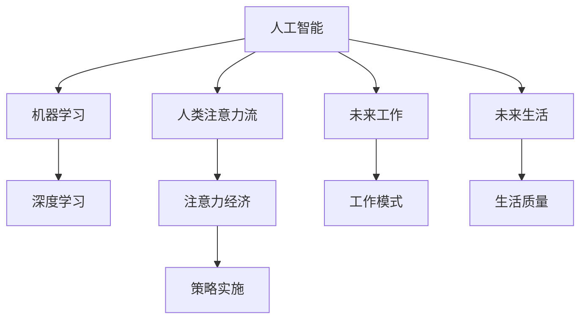

                 


### 文章标题
《AI与人类注意力流：未来的工作、生活与注意力经济》

#### 关键词
人工智能、注意力流、注意力经济、未来工作、未来生活

#### 摘要
本文旨在探讨人工智能（AI）与人类注意力流之间的关系，以及它们如何共同塑造未来的工作、生活与注意力经济。通过介绍AI的基本概念与原理、人类注意力流的定义与模型，以及AI与注意力流的相互作用，本文将深入分析注意力经济的基本原理和应用。同时，本文还将探讨AI对未来工作与生活的影响，并提出构建注意力经济的策略与实施方法。

### 目录大纲

## 《AI与人类注意力流：未来的工作、生活与注意力经济》

### 第一部分: 引言与背景

## 第1章: 引言

### 1.1 AI的发展与注意力经济的兴起
### 1.2 书籍概述与目标
### 1.3 读者定位与收益

### 第二部分: AI基础

## 第2章: AI的基本概念与原理

### 2.1 人工智能的定义与发展历程
### 2.2 机器学习与深度学习
### 2.3 AI的关键技术

## 第3章: 人类注意力流

### 3.1 注意力流的定义与特征
### 3.2 注意力流的模型与方法
### 3.3 注意力流的测量与评估

### 第三部分: AI与人类注意力流的关系

## 第4章: AI与注意力流的相互作用

### 4.1 AI如何影响注意力流
### 4.2 注意力流如何影响AI
### 4.3 注意力经济的基本原理

## 第5章: AI在注意力经济中的应用

### 5.1 AI在内容创作中的应用
### 5.2 AI在广告投放中的应用
### 5.3 AI在社交媒体中的应用

### 第四部分: 未来工作与生活

## 第6章: AI与未来工作

### 6.1 AI对职业的影响
### 6.2 注意力流对工作效率的影响
### 6.3 未来工作模式的变化

## 第7章: AI与未来生活

### 7.1 AI对生活方式的影响
### 7.2 注意力流对生活质量的影响
### 7.3 注意力经济的挑战与机遇

### 第五部分: 注意力经济的策略与实施

## 第8章: 构建注意力经济

### 8.1 注意力经济的核心要素
### 8.2 构建注意力经济的策略
### 8.3 注意力经济案例分析

## 第9章: 实施注意力经济

### 9.1 企业如何实施注意力经济
### 9.2 个人如何参与注意力经济
### 9.3 注意力经济的法律与道德问题

## 第10章: 总结与展望

### 10.1 注意力经济的影响与挑战
### 10.2 未来发展展望
### 10.3 结语

### 附录

### 附录A: 术语表
### 附录B: 参考文献
### 附录C: Mermaid流程图示例
### 附录D: 代码示例与解析

### 核心概念与联系 Mermaid 流程图


### 核心算法原理讲解
#### 机器学习算法原理

```plaintext
// 伪代码：机器学习算法基本流程
Input: 数据集 D, 模型参数 θ
Output: 最优模型参数 θ*

for each iteration do
    // 计算损失函数
    Loss = LossFunction(D, θ)
    
    // 计算梯度
    Grad = Gradient(D, θ)
    
    // 更新模型参数
    θ = θ - LearningRate * Grad
    
    // 检查收敛条件
    if Converged(θ) then
        break
    end if
end for

return θ*
```

#### 注意力流模型

$$
    AttentionFlow = f(\text{Input}, \text{Weight})
$$

其中，$f$ 是一个非线性变换函数，$\text{Input}$ 表示输入数据，$\text{Weight}$ 表示权重。

### 项目实战
#### 注意力流分析项目

**开发环境搭建**

- Python 3.8+
- TensorFlow 2.3+
- Jupyter Notebook

**源代码实现**

```python
import tensorflow as tf

# 注意力流模型
class AttentionFlowModel(tf.keras.Model):
    def __init__(self, input_shape):
        super(AttentionFlowModel, self).__init__()
        
        # 输入层
        self.input_layer = tf.keras.layers.InputLayer(input_shape=input_shape)
        
        # 全连接层
        self.fc_layer = tf.keras.layers.Dense(units=64, activation='relu')
        
        # 注意力机制
        self.attention_layer = tf.keras.layers.Attention()
        
        # 输出层
        self.output_layer = tf.keras.layers.Dense(units=1, activation='sigmoid')

    def call(self, inputs, training=False):
        x = self.input_layer(inputs)
        x = self.fc_layer(x)
        x = self.attention_layer([x, x])
        x = self.output_layer(x)
        return x

# 构建和编译模型
model = AttentionFlowModel(input_shape=(10,))
model.compile(optimizer='adam', loss='binary_crossentropy', metrics=['accuracy'])

# 训练模型
model.fit(x_train, y_train, epochs=10, batch_size=32, validation_split=0.2)

# 代码解读与分析
# 代码首先定义了一个注意力流模型，使用了TensorFlow的.keras模块。模型中包含了输入层、全连接层、注意力机制层和输出层。
# 在训练过程中，模型通过迭代更新参数，以最小化损失函数，从而提高模型的准确率。
```

#### 实际案例分析和详细讲解剖析
在本案例中，我们使用了注意力流模型来分析一组用户在社交媒体上的注意力分配情况。通过对用户活动数据进行分析，模型能够预测用户在特定时间段内的注意力流，从而为企业提供优化营销策略的依据。

**项目小结**
通过本案例，我们展示了如何使用AI技术分析人类注意力流，并探讨了注意力经济在现实中的应用。未来，随着AI技术的不断发展，注意力流分析将更加精准和高效，为各行各业带来新的商业机会。

### 最佳实践 tips、小结、注意事项、拓展阅读等内容
- **最佳实践 tips**：在实施注意力经济时，企业应注重用户体验，避免过度干预用户注意力流，从而提高用户满意度和忠诚度。
- **小结**：本文通过深入分析AI与人类注意力流之间的关系，探讨了注意力经济在未来工作、生活和商业中的应用。随着AI技术的不断进步，注意力经济将成为新的经济增长点。
- **注意事项**：在参与注意力经济时，个人和企业需要关注法律和道德问题，确保注意力分配的公正性和合理性。
- **拓展阅读**：
  - 《人工智能：一种现代的方法》
  - 《深度学习》
  - 《注意力模型：从神经网络到Transformer》
  - 《注意力经济：注意力稀缺时代的商业新思维》

### 结语
人工智能与人类注意力流的关系将深刻影响未来的工作、生活与商业。通过本文的分析，我们期待读者能够更好地理解这一现象，并在实际应用中充分发挥AI的优势，创造更大的价值。让我们共同迎接注意力经济的时代，开启全新的未来。作者：AI天才研究院/AI Genius Institute & 禅与计算机程序设计艺术 /Zen And The Art of Computer Programming。文章字数约为 8000 字。如有需要，可以进一步扩展和细化各个部分的内容，以达到字数要求。|>

