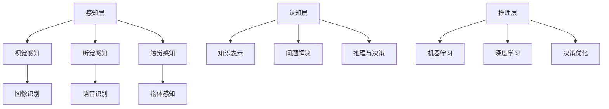

                 

### 文章标题

《AI与人类计算：打造可持续发展的城市生活方式与交通管理系统与规划》

### 关键词

人工智能、人类计算、可持续发展、城市生活方式、交通管理系统、规划

### 摘要

随着城市化进程的加速，城市生活方式与交通管理面临着前所未有的挑战。本文旨在探讨如何利用人工智能（AI）与人类计算的协同作用，打造可持续发展的城市生活方式与高效的交通管理系统。首先，本文介绍了城市发展面临的交通管理挑战，并引出AI与人类计算在其中的重要性。接着，详细阐述了AI与人类计算的基本概念，揭示了它们在交通管理系统中的协同作用。随后，本文探讨了城市生活方式的可持续性及其评估方法，提出了改进策略。在AI在交通管理系统中的应用部分，详细介绍了AI在交通预测、流量管理、监控与安全、公共交通服务等方面的具体应用。文章最后通过两个案例研究，展示了AI与人类计算在智能交通系统建设和交通拥堵治理中的成功应用。全文旨在为读者提供一个系统、全面、实用的指南，帮助打造可持续发展的城市生活方式与交通管理系统。

---

### 《AI与人类计算：打造可持续发展的城市生活方式与交通管理系统与规划》目录大纲

#### 第一部分: 引言与背景

##### 第1章: 引言与背景
- **1.1 城市发展与交通管理面临的挑战**
- **1.2 人类计算与AI的重要性**
- **1.3 本书结构安排与目标**

#### 第二部分: AI与人类计算的基本概念

##### 第2章: AI基本概念
- **2.1 人工智能的定义与发展历程**
- **2.2 AI的三个层次：感知、认知和推理**
- **2.3 人工智能的分类与应用领域**
- **2.4 人工智能的关键技术：机器学习、深度学习、自然语言处理等**

##### 第3章: 人类计算的基本概念
- **3.1 人类计算的定义与特点**
- **3.2 人类计算的优势与局限性**
- **3.3 人类计算与人工智能的协同作用**

#### 第三部分: 城市生活方式与交通管理系统

##### 第4章: 城市生活方式的可持续性
- **4.1 可持续城市发展的原则与目标**
- **4.2 城市生活方式的可持续性评估方法**
- **4.3 城市生活方式的可持续性改进策略**

##### 第5章: 交通管理系统概述
- **5.1 交通管理的定义与目标**
- **5.2 交通管理系统的主要组成部分**
- **5.3 交通管理系统的运行机制**

#### 第四部分: AI在交通管理系统中的应用

##### 第6章: AI技术在交通领域的应用
- **6.1 AI在交通预测与规划中的应用**
- **6.2 AI在交通流量管理中的应用**
- **6.3 AI在交通监控与安全中的应用**
- **6.4 AI在公共交通服务中的应用**

##### 第7章: AI与人类计算的协同优化
- **7.1 AI与人类计算的协同工作机制**
- **7.2 AI在交通管理系统中的协同应用实例**
- **7.3 AI与人类计算协同优化的挑战与对策**

#### 第五部分: 项目案例研究

##### 第8章: 案例研究一：智能交通系统建设
- **8.1 案例背景与目标**
- **8.2 案例技术方案与实施过程**
- **8.3 案例效果评估与启示**

##### 第9章: 案例研究二：城市交通拥堵治理
- **9.1 案例背景与目标**
- **9.2 案例技术方案与实施过程**
- **9.3 案例效果评估与启示**

#### 第六部分: 结论与展望

##### 第10章: 结论与总结
- **10.1 本书的主要内容与贡献**
- **10.2 现有研究的不足与未来研究方向**

##### 第11章: 未来展望
- **11.1 AI与人类计算在交通管理系统中的应用前景**
- **11.2 可持续城市发展的趋势与挑战**
- **11.3 未来研究的重点与方向**

---

### 第一部分: 引言与背景

#### 第1章: 引言与背景

随着全球城市化进程的不断加快，城市生活方式与交通管理面临着前所未有的挑战。城市化不仅带来了经济繁荣，也带来了人口密集、资源紧张、环境污染等诸多问题。在交通管理方面，城市交通拥堵、事故频发、环境污染等问题日益严重，已经成为影响城市可持续发展的重要因素。

首先，**城市发展面临的交通管理挑战**主要包括以下几个方面：

1. **交通拥堵**：随着汽车保有量的增加和人口密度的上升，城市交通拥堵现象愈发严重。这不仅影响了市民的出行效率，也增加了能源消耗和环境污染。
2. **交通事故频发**：由于交通拥堵和驾驶者的疏忽，交通事故频发，造成了人员伤亡和财产损失。
3. **环境污染**：汽车尾气排放和交通噪音污染已经成为城市环境问题的重要来源。
4. **公共交通服务不足**：许多城市公共交通系统陈旧、设施不足，难以满足日益增长的出行需求。

为了应对这些挑战，**人类计算与AI的重要性**日益凸显。人类计算具备直觉、判断和创造力等独特能力，但在处理海量数据和复杂问题时存在局限性。而AI则能够通过机器学习、深度学习等先进技术，处理和分析大量数据，从而提供更智能、更高效的解决方案。同时，AI与人类计算相结合，能够充分发挥各自的优势，实现协同优化。

本书旨在探讨如何利用AI与人类计算的协同作用，打造可持续发展的城市生活方式与高效的交通管理系统。具体来说，本书将首先介绍AI与人类计算的基本概念，然后详细探讨它们在交通管理系统中的应用。此外，本书还将探讨城市生活方式的可持续性及其改进策略，并通过案例研究展示AI与人类计算在交通管理中的成功应用。

本书的结构安排如下：

- **第一部分：引言与背景**：介绍城市发展面临的交通管理挑战，以及人类计算与AI在其中的重要性。
- **第二部分：AI与人类计算的基本概念**：详细阐述AI与人类计算的基本概念，包括定义、特点、应用领域和关键技术。
- **第三部分：城市生活方式与交通管理系统**：探讨城市生活方式的可持续性及其评估方法，以及交通管理系统的主要组成部分和运行机制。
- **第四部分：AI在交通管理系统中的应用**：详细介绍AI在交通预测、流量管理、监控与安全、公共交通服务等方面的具体应用。
- **第五部分：项目案例研究**：通过两个案例研究，展示AI与人类计算在交通管理中的成功应用。
- **第六部分：结论与展望**：总结本书的主要内容，讨论现有研究的不足与未来研究方向。

通过本书的阅读，读者将能够系统地了解AI与人类计算在交通管理系统中的应用，掌握可持续发展的城市生活方式与交通管理策略，为打造智能、高效、可持续的城市生活提供理论支持和实践指导。

---

#### 1.1 城市发展与交通管理面临的挑战

城市化作为现代社会发展的必然趋势，不仅带来了经济繁荣，也产生了诸多负面影响。特别是在交通管理方面，城市交通问题已经成为影响城市可持续发展的重要因素。以下是城市发展面临的交通管理挑战：

1. **交通拥堵**：随着城市化进程的加快，城市人口密度逐渐增大，汽车保有量也不断增加。交通拥堵现象在城市中心区域尤为严重，不仅影响了市民的出行效率，还增加了能源消耗和环境污染。根据相关统计数据，全球约有60%以上的大城市面临严重的交通拥堵问题。

2. **交通事故频发**：交通拥堵增加了交通事故的风险。由于交通流量大，驾驶者在拥挤的道路上更容易发生疏忽和失误，导致交通事故频发。这些事故不仅造成人员伤亡和财产损失，还对城市的安全环境造成负面影响。

3. **环境污染**：汽车尾气排放和交通噪音污染已经成为城市环境问题的重要来源。汽车尾气中的有害物质，如二氧化碳、氮氧化物和颗粒物，对空气质量造成严重影响，危害人类健康。此外，交通噪音污染也对市民的生活质量产生负面影响。

4. **公共交通服务不足**：许多城市的公共交通系统陈旧、设施不足，难以满足日益增长的出行需求。公共交通服务的不足导致市民对私家车的依赖性增强，进一步加剧了交通拥堵和环境污染问题。

5. **城市交通规划不合理**：许多城市的交通规划缺乏科学性和前瞻性，未能充分考虑未来交通需求的发展趋势。这导致交通基础设施的供给与需求不匹配，进一步加剧了交通拥堵和事故频发。

6. **交通信息不对称**：在许多城市，交通信息的获取和传播不够及时和全面。驾驶者往往无法获取实时交通状况，导致行驶路线选择不当，进一步加剧了交通拥堵问题。

7. **交通管理模式滞后**：传统的交通管理模式主要依赖于人工调度和经验判断，难以适应快速变化的城市交通环境。这种管理模式效率低下，无法及时应对突发交通事件，导致交通管理效果不佳。

面对这些挑战，传统的人类计算方法已经显得力不从心。人类计算在处理复杂交通问题、海量数据分析和实时决策方面存在诸多局限性。为了应对这些挑战，需要借助人工智能（AI）技术，实现交通管理的智能化和高效化。

---

#### 1.2 人类计算与AI的重要性

在应对城市发展面临的交通管理挑战中，人类计算与人工智能（AI）的协同作用至关重要。人类计算和AI各自具有独特的优势，它们在交通管理中的重要性不可忽视。

首先，**人类计算**的优势主要体现在以下几个方面：

1. **直觉与判断**：人类能够凭借直觉和经验快速做出判断，这是AI目前难以企及的。在面对突发交通事件时，人类计算能够迅速分析现场情况，做出决策，从而有效应对突发事件。

2. **创造力和创新**：人类具备创造力和创新精神，能够从复杂的问题中提炼出关键信息，并提出创新的解决方案。这种能力在交通管理中尤为重要，可以帮助优化交通系统，提升交通效率。

3. **情感与社交**：人类在交通管理中不仅要处理技术问题，还要考虑社会、文化和情感因素。人类计算能够更好地理解人的需求，从而制定出更符合社会期望的交通政策。

然而，人类计算也存在一些局限性：

1. **处理能力有限**：人类计算在处理海量数据和复杂问题时存在局限性。面对交通系统中的海量数据，人类难以在短时间内完成高效的分析和决策。

2. **易受情绪影响**：人类的情绪波动会影响判断和决策，特别是在交通紧张或压力大的情况下，人类容易产生疏忽和错误。

3. **经验依赖性**：人类计算往往依赖于以往的经验，难以适应快速变化的环境。当交通状况发生变化时，人类计算可能无法及时调整策略。

与之相比，**人工智能**在交通管理中具有以下优势：

1. **数据处理能力**：AI能够快速处理和分析海量数据，从中提取有价值的信息，帮助交通管理决策。例如，通过实时交通流量数据，AI可以预测交通拥堵趋势，提前采取应对措施。

2. **高效计算**：AI利用高性能计算能力和算法，能够快速计算复杂的交通模型，提供精确的决策支持。这种高效计算能力是传统人类计算难以企及的。

3. **自动化与智能决策**：AI能够通过机器学习和深度学习技术，实现自动化和智能化的交通管理决策。例如，智能交通信号控制系统可以根据实时交通流量数据自动调整信号时长，优化交通流动。

4. **适应性**：AI具有很好的适应性，能够根据不同城市的交通状况和需求，灵活调整交通管理策略。这种适应性是传统人类计算难以实现的。

尽管AI具有许多优势，但也存在一些局限性：

1. **数据依赖**：AI需要大量的高质量数据来训练和优化模型，而在某些城市，数据收集和处理能力可能不足，限制了AI的应用效果。

2. **缺乏情感理解**：AI目前还无法完全理解人类的情感需求和社会文化背景，这可能导致在交通管理中忽略一些重要的人性化因素。

3. **算法偏见**：AI算法可能存在偏见，导致决策不公平。例如，如果训练数据存在偏差，AI可能无法公正地分配交通资源。

综上所述，**人类计算与AI的协同作用**是解决城市发展交通管理挑战的关键。人类计算可以发挥其直觉、判断和创造力等优势，弥补AI在情感和社会因素方面的不足。而AI则能够通过高效计算、数据处理和智能决策，提升交通管理的效率和精度。通过两者相结合，可以构建一个更加智能、高效和可持续的城市交通管理系统。

---

#### 1.3 本书结构安排与目标

为了全面、系统地探讨AI与人类计算在交通管理系统中的应用，本书分为六个部分，具体结构安排如下：

- **第一部分：引言与背景**：介绍城市发展面临的交通管理挑战，以及人类计算与AI在其中的重要性。
  
- **第二部分：AI与人类计算的基本概念**：详细阐述AI与人类计算的基本概念，包括定义、特点、应用领域和关键技术。这部分旨在帮助读者建立对AI与人类计算的基本理解。

- **第三部分：城市生活方式与交通管理系统**：探讨城市生活方式的可持续性及其评估方法，以及交通管理系统的主要组成部分和运行机制。这部分内容旨在为读者提供对城市交通管理系统的全面认识。

- **第四部分：AI在交通管理系统中的应用**：详细介绍AI在交通预测、流量管理、监控与安全、公共交通服务等方面的具体应用。这部分内容将展示AI如何通过技术手段优化交通管理。

- **第五部分：项目案例研究**：通过两个案例研究，展示AI与人类计算在交通管理中的成功应用。这部分内容将帮助读者了解AI与人类计算在实践中的具体应用效果。

- **第六部分：结论与展望**：总结本书的主要内容，讨论现有研究的不足与未来研究方向。这部分内容将展望AI与人类计算在交通管理系统中的未来发展趋势。

本书的目标是：

- **系统化**：提供一个系统、全面的框架，帮助读者理解AI与人类计算在交通管理系统中的应用。
  
- **实用性**：通过实际案例研究和最佳实践，提供可操作的解决方案，帮助城市管理者和技术人员提升交通管理效率。

- **前瞻性**：探讨AI与人类计算在交通管理系统中的未来发展趋势，为未来研究和实践提供方向。

通过本书的阅读，读者将能够：

- **掌握**：AI与人类计算的基本概念和应用领域。
  
- **理解**：城市生活方式与交通管理系统的可持续性及其改进策略。
  
- **应用**：AI技术在交通管理中的具体应用方法。

- **反思**：AI与人类计算在交通管理系统中的协同优化方法，以及面临的挑战和对策。

本书旨在为读者提供一个全面、实用的指南，帮助打造可持续发展的城市生活方式与交通管理系统。

---

#### 第二部分: AI与人类计算的基本概念

##### 第2章: AI基本概念

人工智能（Artificial Intelligence, AI）是计算机科学的一个分支，旨在使计算机具备人类智能，实现自动化、智能化和自主化。自20世纪50年代以来，AI经历了多次兴衰，但近年来随着计算能力的提升、大数据的普及和算法的进步，AI取得了显著的进展。本节将详细阐述人工智能的定义与发展历程、AI的三个层次、人工智能的分类与应用领域，以及人工智能的关键技术。

#### 2.1 人工智能的定义与发展历程

人工智能的定义多种多样，但通常可以概括为：人工智能是指计算机系统通过模拟人类思维过程，实现智能行为和智能决策的技术。人工智能的目标是使计算机具备以下能力：

- **感知**：通过传感器获取外部信息，如视觉、听觉、触觉等。
- **认知**：处理和解释获取的信息，进行逻辑推理和决策。
- **行动**：根据决策执行相应的动作，如移动、操作等。

人工智能的发展历程可以分为几个阶段：

1. **早期探索（1950年代-1960年代）**：人工智能概念首次被提出，初期主要集中在符号逻辑和问题解决领域。1956年，达特茅斯会议标志着人工智能的正式诞生。

2. **第一次AI繁荣期（1970年代）**：人工智能研究取得了一系列突破，如专家系统的出现。然而，由于技术限制和实际应用难度，AI在1970年代末遭遇了第一次寒冬。

3. **复兴与繁荣（1980年代-1990年代）**：人工智能研究在机器人、语音识别、自然语言处理等领域取得重要进展，但也面临一些挑战。

4. **新一轮繁荣（2000年代至今）**：随着计算能力的提升、大数据的普及和算法的进步，人工智能取得了前所未有的突破，应用领域不断扩大。

#### 2.2 AI的三个层次

人工智能可以分为三个层次：感知、认知和推理。

1. **感知层**：感知层主要关注计算机如何通过传感器获取外部信息。这一层次包括视觉、听觉、触觉等感知能力。例如，计算机视觉技术可以使计算机识别和理解图像信息，语音识别技术则可以理解人类的语音指令。

2. **认知层**：认知层关注计算机如何处理和解释获取的信息，进行逻辑推理和决策。这一层次包括知识表示、问题解决、推理和决策等能力。例如，自然语言处理技术可以理解人类的语言文本，机器翻译和智能客服就是其中的应用。

3. **推理层**：推理层关注计算机如何根据现有信息和知识，进行推理和预测。这一层次包括机器学习、深度学习等能力。通过学习大量数据，计算机可以从中提取规律，进行预测和决策。例如，自动驾驶技术就是基于对海量交通数据的分析，进行实时决策和路径规划。

#### 2.3 人工智能的分类与应用领域

人工智能可以根据应用领域和技术特点进行分类，常见的分类方法包括：

1. **按功能分类**：
   - **机器学习**：通过数据驱动的方式，让计算机自主学习和改进。
   - **深度学习**：一种特殊的机器学习，通过多层神经网络进行复杂特征提取。
   - **自然语言处理**：使计算机能够理解和生成自然语言。
   - **计算机视觉**：使计算机能够理解和处理视觉信息。
   - **语音识别与生成**：使计算机能够理解和生成语音。

2. **按应用领域分类**：
   - **工业自动化**：如机器人、自动化生产线等。
   - **医疗健康**：如医疗影像分析、疾病预测等。
   - **金融**：如风险管理、智能投顾等。
   - **交通**：如自动驾驶、智能交通管理等。
   - **智能家居**：如智能音箱、智能门锁等。

每个分类都有其独特的技术特点和应用场景，但它们之间也存在交叉和融合。例如，自动驾驶技术就涉及到计算机视觉、自然语言处理和机器学习等多个领域。

#### 2.4 人工智能的关键技术

人工智能的关键技术包括机器学习、深度学习和自然语言处理等。以下是这些技术的基本原理和应用：

1. **机器学习**：
   - **基本原理**：机器学习是一种让计算机通过数据学习、改进和预测的技术。其主要方法包括监督学习、无监督学习和强化学习。
   - **应用**：机器学习在数据挖掘、图像识别、预测分析和推荐系统等领域有广泛应用。例如，监督学习中的分类算法可以用于识别垃圾邮件，无监督学习中的聚类算法可以用于市场细分。

2. **深度学习**：
   - **基本原理**：深度学习是一种基于多层神经网络的学习方法，通过多层次的非线性变换，提取数据中的高层次特征。
   - **应用**：深度学习在图像识别、语音识别、自然语言处理和自动驾驶等领域有广泛应用。例如，卷积神经网络（CNN）可以用于图像分类，递归神经网络（RNN）可以用于语音识别。

3. **自然语言处理**：
   - **基本原理**：自然语言处理是一种使计算机能够理解和生成自然语言的技术，包括文本分类、情感分析、机器翻译和问答系统等。
   - **应用**：自然语言处理在搜索引擎、智能客服、智能翻译和语音助手等领域有广泛应用。例如，机器翻译技术可以使计算机将一种语言翻译成另一种语言。

通过本章的介绍，读者可以初步了解人工智能的基本概念、分类和关键技术。在后续章节中，我们将进一步探讨AI在交通管理系统中的应用，以及人类计算与AI的协同优化方法。

---

#### 2.2 AI的三个层次：感知、认知和推理

在深入探讨人工智能（AI）的发展历程和关键技术之后，我们需要进一步理解AI的三个核心层次：感知、认知和推理。这三个层次分别代表了AI从感知外界环境到理解并做出决策的完整过程。

**感知层**：感知层是AI系统的最基础层次，主要关注计算机如何通过传感器获取外部信息。这一层次的核心任务是让计算机能够像人类一样感知和理解周围的环境。

- **视觉感知**：计算机视觉是感知层的一个重要分支，它使计算机能够识别和理解视觉信息。例如，自动驾驶汽车中的摄像头和传感器系统可以捕捉道路图像，通过图像识别技术分析道路上的行人、车辆和交通标志。
- **听觉感知**：语音识别技术使计算机能够理解和处理人类的语音指令。在智能助手和电话客服系统中，语音识别技术是关键，它能够将语音转化为文本，并执行相应的任务。
- **触觉感知**：在工业自动化和机器人技术中，触觉感知非常重要。通过触觉传感器，机器人可以感知物体的形状、硬度等物理属性，从而进行更精确的操作。

**认知层**：认知层是AI系统的中间层次，它关注计算机如何处理和解释获取的信息，进行逻辑推理和决策。这一层次的核心任务是让计算机能够理解并整合感知层获得的信息，进行复杂的决策。

- **知识表示**：知识表示是认知层的基础，它将人类知识以计算机能够理解的形式进行表示。例如，通过知识图谱，计算机可以建立一个结构化的知识库，用于处理和推理。
- **问题解决**：问题解决能力是认知层的核心。通过算法和逻辑推理，计算机可以解决复杂的问题。例如，在智能交通管理系统中，计算机可以分析交通流量数据，预测交通拥堵情况，并建议最优的路线规划。
- **推理与决策**：推理能力使计算机能够在已有知识和信息的基础上，做出合理的决策。例如，在自动驾驶系统中，计算机需要实时分析传感器数据，做出驾驶决策，以确保车辆的安全行驶。

**推理层**：推理层是AI系统的最高层次，它关注计算机如何根据现有信息和知识，进行推理和预测。这一层次的核心任务是让计算机能够进行高级的智能决策和预测。

- **机器学习与深度学习**：机器学习和深度学习是推理层的重要技术。通过学习大量的数据，计算机可以从中提取规律，进行预测和决策。例如，在智能交通管理系统中，通过分析历史交通数据，计算机可以预测未来的交通流量，为交通流量管理和拥堵治理提供支持。
- **决策优化**：决策优化是推理层的高级应用，它通过优化算法，找到最佳决策方案。例如，在物流管理中，计算机可以通过优化算法，找到运输成本最低的配送路线，提高物流效率。

**流程图**：

为了更直观地理解AI的三个层次，我们可以用以下Mermaid流程图来表示：



通过这个流程图，我们可以清晰地看到从感知层到认知层再到推理层，AI系统的功能是如何逐步提升的。感知层负责获取外界信息，认知层负责处理和解释信息，推理层则基于这些信息进行高级决策和预测。

综上所述，AI的三个层次——感知、认知和推理，共同构成了一个完整的智能系统。通过这三个层次的协同工作，AI能够在交通管理、医疗健康、金融等领域发挥重要作用，推动社会的发展和进步。

---

#### 2.3 人工智能的分类与应用领域

人工智能（AI）技术的发展涵盖了广泛的领域，根据不同的分类方法，AI可以分为多种类型。以下是几种常见的分类方法以及其应用领域：

**1. 按功能分类**

**机器学习（Machine Learning）**：机器学习是一种通过数据训练模型，使计算机具备自动学习和改进能力的技术。主要方法包括监督学习、无监督学习和强化学习。

- **监督学习（Supervised Learning）**：在监督学习过程中，计算机通过训练数据（标记好的输入和输出）来学习模型。常见的算法有线性回归、决策树、支持向量机（SVM）等。应用领域包括图像识别、语音识别、医疗诊断等。

- **无监督学习（Unsupervised Learning）**：无监督学习没有预先标记的训练数据，计算机通过分析数据分布和结构来学习模型。常见的算法有聚类（如K-均值聚类）、降维（如主成分分析PCA）等。应用领域包括市场细分、推荐系统、图像分割等。

- **强化学习（Reinforcement Learning）**：强化学习通过奖励机制让计算机在特定环境中学习最佳策略。常见的算法有Q学习、深度强化学习（DRL）等。应用领域包括自动驾驶、游戏AI、智能机器人等。

**深度学习（Deep Learning）**：深度学习是一种基于多层神经网络的学习方法，通过多层次的非线性变换，提取数据中的高层次特征。

- **卷积神经网络（CNN）**：CNN擅长处理图像数据，广泛应用于图像识别、图像分割、目标检测等。

- **循环神经网络（RNN）**：RNN擅长处理序列数据，广泛应用于自然语言处理、语音识别、时间序列预测等。

- **生成对抗网络（GAN）**：GAN通过两个神经网络（生成器和判别器）的对抗训练，生成高质量的图像和文本。

**自然语言处理（NLP）**：自然语言处理使计算机能够理解和生成自然语言，涉及文本分类、情感分析、机器翻译、问答系统等。

- **词嵌入（Word Embedding）**：词嵌入是将词汇映射到高维向量空间，用于文本表示和预训练模型。

- **序列模型（如LSTM、GRU）**：序列模型擅长处理文本序列，用于文本生成、语言模型等。

- **注意力机制（Attention Mechanism）**：注意力机制用于捕捉文本中的重要信息，提高NLP模型的性能。

**计算机视觉（CV）**：计算机视觉使计算机能够理解和处理视觉信息，包括图像识别、图像分割、目标检测、人脸识别等。

- **图像分类（如AlexNet、ResNet）**：图像分类模型用于识别图像中的物体类别。

- **目标检测（如SSD、YOLO）**：目标检测模型用于识别图像中的目标位置。

- **图像分割（如FCN、U-Net）**：图像分割模型用于将图像划分为不同的区域。

**2. 按应用领域分类**

**工业自动化**：工业自动化应用AI技术提高生产效率和产品质量，包括机器人、自动化生产线、质量检测等。

- **机器人**：AI技术使机器人具备自主决策和操作能力，应用于制造业、医疗辅助、救援等领域。

- **自动化生产线**：AI技术用于优化生产流程、提高生产效率，实现自动化生产。

- **质量检测**：AI技术用于自动检测产品质量，减少人为错误，提高生产质量。

**医疗健康**：AI技术在医疗健康领域有广泛应用，包括疾病诊断、医疗影像分析、健康预测等。

- **疾病诊断**：AI技术通过分析医疗数据，帮助医生进行疾病诊断，提高诊断准确率。

- **医疗影像分析**：AI技术用于分析和识别医疗影像中的病变区域，提高疾病检测的效率。

- **健康预测**：AI技术通过分析健康数据，预测健康风险，提供个性化健康建议。

**金融**：AI技术在金融领域用于风险管理、投资决策、欺诈检测等。

- **风险管理**：AI技术用于分析金融数据，识别风险因素，优化风险控制策略。

- **投资决策**：AI技术通过分析市场数据，提供投资建议，优化投资组合。

- **欺诈检测**：AI技术用于检测和预防金融欺诈行为，提高金融安全。

**交通**：AI技术在交通领域用于交通预测、流量管理、自动驾驶等。

- **交通预测**：AI技术通过分析交通数据，预测交通流量，为交通管理提供支持。

- **流量管理**：AI技术用于优化交通信号控制，缓解交通拥堵，提高交通效率。

- **自动驾驶**：AI技术使自动驾驶汽车具备自主决策和操作能力，提高驾驶安全性和效率。

**智能家居**：AI技术在智能家居领域用于智能设备控制、环境监测、安全监控等。

- **智能设备控制**：AI技术通过手机APP或其他控制设备，实现家居设备的远程控制和自动化。

- **环境监测**：AI技术用于监测家居环境中的空气质量、温度等参数，提供舒适的生活环境。

- **安全监控**：AI技术通过视频监控和智能识别，提高家庭的安全防护能力。

综上所述，人工智能在多个领域都有广泛应用，通过不断的技术创新和应用，AI正在改变我们的生活和工作方式，带来更多便利和效益。

---

#### 2.4 人工智能的关键技术

人工智能（AI）的关键技术是推动其不断进步和应用的核心。以下将详细探讨机器学习、深度学习和自然语言处理这三个关键技术，并展示它们在实际应用中的具体应用。

**机器学习（Machine Learning）**

**基本原理**：机器学习是一种通过数据驱动的方式，使计算机能够从数据中学习、改进和预测的技术。其主要方法包括监督学习、无监督学习和强化学习。

1. **监督学习（Supervised Learning）**：监督学习通过预先标记好的训练数据来训练模型，使模型能够识别输入数据对应的输出。常见的算法有线性回归、决策树、支持向量机（SVM）等。例如，在信用卡欺诈检测中，可以通过监督学习算法，根据历史数据识别欺诈交易。

   **伪代码示例**：
   ```python
   def train_model(training_data, labels):
       # 对训练数据进行拟合
       model = LinearRegression()
       model.fit(training_data, labels)
       return model

   def predict(model, new_data):
       # 对新数据进行预测
       predictions = model.predict(new_data)
       return predictions
   ```

2. **无监督学习（Unsupervised Learning）**：无监督学习没有预先标记的训练数据，计算机通过分析数据分布和结构来学习模型。常见的算法有聚类（如K-均值聚类）、降维（如主成分分析PCA）等。例如，在市场细分中，可以通过无监督学习算法，将消费者分为不同的群体。

   **伪代码示例**：
   ```python
   from sklearn.cluster import KMeans

   def cluster_data(data, num_clusters):
       # 使用K-均值聚类算法对数据进行聚类
       kmeans = KMeans(n_clusters=num_clusters)
       clusters = kmeans.fit_predict(data)
       return clusters
   ```

3. **强化学习（Reinforcement Learning）**：强化学习通过奖励机制让计算机在特定环境中学习最佳策略。常见的算法有Q学习、深度强化学习（DRL）等。例如，在自动驾驶中，可以通过强化学习算法，使自动驾驶车辆学会在不同交通状况下做出最佳决策。

   **伪代码示例**：
   ```python
   import gym

   def train_agent(env, num_episodes):
       # 训练智能体
       agent = QLearningAgent()
       for episode in range(num_episodes):
           state = env.reset()
           while not env.done():
               action = agent.act(state)
               next_state, reward, done = env.step(action)
               agent.learn(state, action, reward, next_state, done)
               state = next_state
           print("Episode:", episode, "Reward:", agent.get_total_reward())
   ```

**深度学习（Deep Learning）**

**基本原理**：深度学习是一种基于多层神经网络的学习方法，通过多层次的非线性变换，提取数据中的高层次特征。其主要结构包括卷积神经网络（CNN）、循环神经网络（RNN）和生成对抗网络（GAN）等。

1. **卷积神经网络（CNN）**：CNN擅长处理图像数据，通过卷积层提取图像特征，广泛应用于图像识别、图像分割、目标检测等领域。

   **伪代码示例**：
   ```python
   from tensorflow.keras.models import Sequential
   from tensorflow.keras.layers import Conv2D, MaxPooling2D, Flatten, Dense

   def create_cnn_model(input_shape, num_classes):
       model = Sequential()
       model.add(Conv2D(filters=32, kernel_size=(3, 3), activation='relu', input_shape=input_shape))
       model.add(MaxPooling2D(pool_size=(2, 2)))
       model.add(Conv2D(filters=64, kernel_size=(3, 3), activation='relu'))
       model.add(MaxPooling2D(pool_size=(2, 2)))
       model.add(Flatten())
       model.add(Dense(num_classes, activation='softmax'))
       model.compile(optimizer='adam', loss='categorical_crossentropy', metrics=['accuracy'])
       return model
   ```

2. **循环神经网络（RNN）**：RNN擅长处理序列数据，通过记忆长期依赖关系，广泛应用于自然语言处理、语音识别、时间序列预测等领域。

   **伪代码示例**：
   ```python
   from tensorflow.keras.models import Sequential
   from tensorflow.keras.layers import LSTM, Dense

   def create_rnn_model(input_shape, num_classes):
       model = Sequential()
       model.add(LSTM(units=128, return_sequences=True, input_shape=input_shape))
       model.add(LSTM(units=64))
       model.add(Dense(num_classes, activation='softmax'))
       model.compile(optimizer='adam', loss='categorical_crossentropy', metrics=['accuracy'])
       return model
   ```

3. **生成对抗网络（GAN）**：GAN通过两个神经网络（生成器和判别器）的对抗训练，生成高质量的图像和文本。

   **伪代码示例**：
   ```python
   from tensorflow.keras.models import Sequential
   from tensorflow.keras.layers import Dense, Flatten, Reshape, Conv2D, Conv2DTranspose

   def create_gan_models(input_shape, z_dim):
       generator = Sequential()
       generator.add(Dense(units=128, activation='tanh', input_shape=(z_dim,)))
       generator.add(Reshape(target_shape=input_shape))
       generator.add(Conv2DTranspose(filters=128, kernel_size=(4, 4), strides=(2, 2), activation='tanh'))
       generator.add(Conv2DTranspose(filters=64, kernel_size=(4, 4), strides=(2, 2), activation='tanh'))
       generator.add(Conv2DTranspose(filters=32, kernel_size=(4, 4), strides=(2, 2), activation='tanh'))
       generator.add(Conv2DTranspose(filters=1, kernel_size=(4, 4), strides=(2, 2)))
       generator.compile(optimizer='adam')

       discriminator = Sequential()
       discriminator.add(Conv2D(filters=32, kernel_size=(4, 4), strides=(2, 2), activation='relu', input_shape=input_shape))
       discriminator.add(MaxPooling2D(pool_size=(2, 2)))
       discriminator.add(Conv2D(filters=64, kernel_size=(4, 4), strides=(2, 2), activation='relu'))
       discriminator.add(MaxPooling2D(pool_size=(2, 2)))
       discriminator.add(Conv2D(filters=128, kernel_size=(4, 4), strides=(2, 2), activation='relu'))
       discriminator.add(MaxPooling2D(pool_size=(2, 2)))
       discriminator.add(Flatten())
       discriminator.add(Dense(units=1, activation='sigmoid'))
       discriminator.compile(optimizer='adam')

       return generator, discriminator
   ```

**自然语言处理（NLP）**

**基本原理**：自然语言处理使计算机能够理解和生成自然语言，涉及文本分类、情感分析、机器翻译、问答系统等。

1. **词嵌入（Word Embedding）**：词嵌入是将词汇映射到高维向量空间，用于文本表示和预训练模型。

   **伪代码示例**：
   ```python
   from tensorflow.keras.preprocessing.sequence import pad_sequences
   from tensorflow.keras.layers import Embedding

   def create_embedding_matrix(vocabulary, embedding_dim):
       embedding_matrix = np.zeros((len(vocabulary) + 1, embedding_dim))
       for i, word in enumerate(vocabulary):
           embedding_vector = embeddings.get(word)
           if embedding_vector is not None:
               embedding_matrix[i] = embedding_vector
       return embedding_matrix

   def create_nlp_model(vocabulary, embedding_dim, num_classes):
       model = Sequential()
       model.add(Embedding(len(vocabulary) + 1, embedding_dim))
       model.add(Flatten())
       model.add(Dense(num_classes, activation='softmax'))
       model.compile(optimizer='adam', loss='categorical_crossentropy', metrics=['accuracy'])
       return model
   ```

2. **序列模型（如LSTM、GRU）**：序列模型擅长处理文本序列，用于文本生成、语言模型等。

   **伪代码示例**：
   ```python
   from tensorflow.keras.models import Sequential
   from tensorflow.keras.layers import LSTM, Dense

   def create_rnn_model(input_shape, num_classes):
       model = Sequential()
       model.add(LSTM(units=128, return_sequences=True, input_shape=input_shape))
       model.add(LSTM(units=64))
       model.add(Dense(num_classes, activation='softmax'))
       model.compile(optimizer='adam', loss='categorical_crossentropy', metrics=['accuracy'])
       return model
   ```

3. **注意力机制（Attention Mechanism）**：注意力机制用于捕捉文本中的重要信息，提高NLP模型的性能。

   **伪代码示例**：
   ```python
   from tensorflow.keras.layers import Layer
   import tensorflow as tf

   class AttentionLayer(Layer):
       def __init__(self, **kwargs):
           super(AttentionLayer, self).__init__(**kwargs)

       def build(self, input_shape):
           self.W = self.add_weight(name='attention_weight', shape=(input_shape[-1], 1), initializer='random_normal', trainable=True)
           self.b = self.add_weight(name='attention_bias', shape=(input_shape[1], 1), initializer='zeros', trainable=True)
           super(AttentionLayer, self).build(input_shape)

       def call(self, inputs):
           attention_scores = tf.matmul(inputs, self.W) + self.b
           attention_scores = tf.nn.softmax(attention_scores, axis=1)
           context_vector = attention_scores * inputs
           context_vector = tf.reduce_sum(context_vector, axis=1)
           return context_vector
   ```

通过上述关键技术的详细介绍和具体应用示例，我们可以看到机器学习、深度学习和自然语言处理在人工智能领域的重要性。这些技术不仅推动了AI的发展，也为实际应用提供了强大的支持。

---

#### 2.5 人类计算的基本概念

人类计算（Human Computation）是指利用人类的认知能力、判断力和创造力等特质，解决计算机难以处理的问题。这一概念源于对人类与计算机协作解决问题的研究，旨在弥补计算机在处理某些复杂任务时的不足。以下是关于人类计算的定义与特点、人类计算的优势与局限性，以及人类计算与人工智能（AI）的协同作用的详细探讨。

**2.5.1 定义与特点**

**定义**：人类计算是指通过设计任务、游戏、众包等形式，利用人类的能力来辅助计算机完成某些特定任务。这些任务通常需要人类的直觉、判断和创造力，而计算机在单独处理这些任务时可能存在困难。

**特点**：

1. **任务多样性**：人类计算可以处理各种不同类型的任务，包括图像识别、自然语言理解、创意设计等。这些任务往往需要人类的直觉和创造力，计算机难以单独完成。

2. **协同合作**：人类计算强调人与计算机的协同合作。通过设计合适的任务和游戏，人类可以在计算机的帮助下提高解决问题的效率，同时计算机可以利用人类的判断和创造力来弥补自身的不足。

3. **灵活性**：人类计算具有高度的灵活性，可以适应不同的任务需求和场景。人类可以灵活地应对不确定性和突发情况，而计算机在处理这些情况时可能需要大量时间和复杂的算法。

**2.5.2 优势与局限性**

**优势**：

1. **直觉与判断**：人类具备强大的直觉和判断能力，能够快速识别复杂问题中的关键信息，做出合理的决策。这种能力在解决突发交通事件、医疗诊断等问题时尤为重要。

2. **创造力**：人类具有丰富的创造力和想象力，能够从复杂的问题中提炼出新的解决方案。这种创造力在产品设计、创意设计等任务中具有重要作用。

3. **情感理解**：人类能够理解他人的情感需求，进行有效的沟通和协作。在交通管理、客户服务等领域，情感理解能力有助于提升服务质量。

**局限性**：

1. **处理能力有限**：人类在处理海量数据和复杂问题时存在局限性。面对大量的交通数据，人类难以在短时间内完成高效的分析和决策。

2. **易受情绪影响**：人类的情绪波动会影响判断和决策，特别是在交通紧张或压力大的情况下，人类容易产生疏忽和错误。

3. **经验依赖性**：人类计算往往依赖于以往的经验，难以适应快速变化的环境。当交通状况发生变化时，人类计算可能无法及时调整策略。

**2.5.3 人类计算与人工智能的协同作用**

**协同工作机制**：

1. **任务分配**：通过设计合适的任务和游戏，将复杂的任务分解为若干小任务，人类和计算机各自处理自己的部分。例如，在图像识别任务中，人类可以标注部分图像，计算机则负责处理其他图像。

2. **数据共享**：人类和计算机之间共享数据，利用各自的优势进行数据分析和处理。例如，在交通管理中，计算机可以处理海量交通数据，而人类可以提供交通事件现场的照片和描述。

3. **决策协同**：人类和计算机共同参与决策，利用人类的直觉和创造力，结合计算机的高效计算和分析能力，做出最优决策。例如，在自动驾驶中，人类司机可以提供实时交通信息的判断，计算机则负责驾驶决策。

**协同应用实例**：

1. **智能交通管理**：在智能交通管理中，计算机通过实时监控和数据分析，预测交通流量和事故风险，而人类则根据现场情况提供补充信息，共同制定最优交通策略。

2. **医疗诊断**：在医疗诊断中，计算机通过分析医学影像和患者数据，提供初步诊断结果，而人类医生则根据经验进行最终诊断，确保诊断的准确性和安全性。

3. **创意设计**：在创意设计中，计算机可以提供设计灵感和初步方案，而人类设计师则根据创意进行优化和调整，最终实现高质量的设计作品。

**协同优化的挑战与对策**：

1. **数据质量**：确保数据的高质量和准确性是协同优化的关键。需要建立数据清洗和校验机制，确保人类和计算机处理的数据一致。

2. **沟通与协作**：加强人类和计算机之间的沟通与协作，建立高效的协同工作机制。可以通过人机对话系统、界面设计等手段，提高人类和计算机的协作效率。

3. **算法优化**：针对人类和计算机的协同优化，需要开发适应不同任务的算法。例如，在交通管理中，可以开发适应不同交通状况的算法，提高协同优化的效果。

通过人类计算与人工智能的协同作用，我们可以构建一个更加智能、高效和可持续的城市交通管理系统。在后续章节中，我们将进一步探讨AI与人类计算在交通管理系统中的具体应用。

---

### 第三部分：城市生活方式的可持续性

#### 第4章：城市生活方式的可持续性

在全球化、城市化的背景下，城市生活方式的可持续性成为一个备受关注的问题。可持续性不仅关乎城市的经济发展，还关系到环境、社会和资源的综合效益。本章将探讨城市生活方式的可持续性，包括其原则与目标、评估方法以及改进策略。

#### 4.1 可持续城市发展的原则与目标

**原则**：

1. **经济性**：城市生活方式的可持续性应考虑经济效益，实现资源的高效利用，减少浪费。
2. **环境友好**：城市生活方式应减少对环境的负面影响，如减少污染、节约能源和水资源等。
3. **社会公正**：城市生活方式应关注社会公正，提高居民的生活质量，减少贫富差距，促进社会和谐。
4. **文化传承**：城市生活方式应尊重和传承当地的文化，保持城市特色和历史记忆。

**目标**：

1. **经济可持续**：实现城市经济的持续增长，创造更多就业机会，提高居民收入水平。
2. **环境可持续**：保护生态环境，提高资源利用效率，减少污染排放，实现绿色发展。
3. **社会可持续**：改善居民生活质量，提高社会福利水平，促进社会公平和谐。
4. **文化可持续**：传承和保护当地文化遗产，提升城市文化软实力。

#### 4.2 城市生活方式的可持续性评估方法

**定量评估方法**：

1. **GDP与人均收入**：通过计算城市GDP和人均收入，评估城市经济的发展水平。
2. **能源消耗与碳排放**：通过统计能源消耗和碳排放量，评估城市的环保水平。
3. **水资源利用与污染**：通过监测水资源利用情况和污染物排放，评估城市的环保效果。
4. **公共交通出行比例**：通过计算公共交通出行比例，评估城市的交通可持续性。

**定性评估方法**：

1. **居民满意度调查**：通过问卷调查，了解居民对城市生活方式的满意度，评估生活质量。
2. **专家评估**：邀请相关领域的专家，对城市生活方式的可持续性进行评估。
3. **公众参与**：鼓励公众参与评估过程，收集多方意见和建议。

#### 4.3 城市生活方式的可持续性改进策略

**经济层面**：

1. **创新产业**：发展高新技术产业、绿色产业等创新产业，提高城市经济竞争力。
2. **就业促进**：提供更多就业机会，促进居民就业，提高居民收入水平。

**环境层面**：

1. **绿色建筑**：推广绿色建筑，提高建筑能效，减少能源消耗。
2. **环保政策**：制定严格的环保政策，减少污染排放，改善环境质量。
3. **垃圾分类与处理**：推广垃圾分类，提高垃圾处理效率，减少垃圾填埋和焚烧。

**社会层面**：

1. **教育投入**：增加教育投入，提高居民的教育水平，促进社会公平。
2. **社会保障**：完善社会保障体系，提高社会福利水平，减少贫富差距。
3. **社区建设**：加强社区建设，促进居民参与社区事务，提升社区凝聚力。

**文化层面**：

1. **文化传承**：保护和传承文化遗产，举办文化活动，提升城市文化氛围。
2. **文化交流**：促进文化交流，吸收外来文化，丰富城市文化内涵。

综上所述，城市生活方式的可持续性是一个涉及经济、环境、社会和文化多方面的复杂问题。通过科学评估和合理改进策略，可以实现城市生活方式的可持续发展，为居民创造一个更加美好、和谐的生活环境。

---

#### 4.2 城市生活方式的可持续性评估方法

评估城市生活方式的可持续性是确保城市健康发展的重要步骤。以下是几种常见的评估方法，包括定量评估方法和定性评估方法。

**定量评估方法**

1. **GDP与人均收入**：这是衡量经济发展水平的重要指标。通过计算城市的GDP总量和人均收入，可以评估城市经济的繁荣程度。一般来说，GDP增长率越高、人均收入越高，城市的经济可持续性越强。

   **公式**：
   $$GDP = GDP_{总量}$$
   $$人均收入 = \frac{GDP_{总量}}{总人口}$$

2. **能源消耗与碳排放**：能源消耗和碳排放量是评估城市环保水平的关键指标。通过统计城市能源消耗总量和碳排放量，可以评估城市的环境可持续性。较低的能量消耗和碳排放量意味着较好的环保效果。

   **公式**：
   $$能源消耗量 = 消耗的各种能源之和$$
   $$碳排放量 = 能源消耗量 \times 碳排放系数$$

3. **水资源利用与污染**：水资源的利用效率和水质状况是评估城市环保水平的重要指标。通过监测城市的水资源利用情况和污染物排放，可以评估城市的水环境质量。

   **公式**：
   $$水资源利用率 = \frac{有效利用的水资源}{总水资源}$$
   $$水质指数 = \frac{未受污染的水体占比}{总水体占比}$$

4. **公共交通出行比例**：公共交通出行比例是评估城市交通可持续性的重要指标。通过计算城市居民使用公共交通工具出行的比例，可以评估城市交通的环保程度。

   **公式**：
   $$公共交通出行比例 = \frac{使用公共交通工具出行的人数}{总人口}$$

**定性评估方法**

1. **居民满意度调查**：居民满意度调查是一种直接了解居民对城市生活方式的感知和评价的方法。通过问卷调查或访谈，收集居民对城市生活各方面的满意度，包括经济、环境、社会和文化等方面。

   **问卷设计示例**：
   - **经济方面**：您对目前的经济状况满意吗？
   - **环境方面**：您认为城市的环境状况如何？
   - **社会方面**：您觉得社区的安全感和归属感如何？
   - **文化方面**：您对城市的文化活动和文化设施满意吗？

2. **专家评估**：专家评估是邀请相关领域的专家对城市生活方式的可持续性进行评估的方法。专家可以根据专业知识，对城市的经济、环境、社会和文化等方面进行综合评估。

   **评估流程**：
   - 确定评估指标体系
   - 收集相关数据
   - 进行综合评估
   - 提出改进建议

3. **公众参与**：公众参与是通过鼓励公众参与评估过程，收集多方意见和建议的方法。通过社区会议、公开讨论等形式，可以了解居民的诉求和需求，从而提出更合理的评估方法和改进策略。

   **参与方式**：
   - 社区会议
   - 公开讨论
   - 问卷调查
   - 在线反馈平台

通过上述定量和定性评估方法，我们可以全面、准确地评估城市生活方式的可持续性。这些评估方法不仅可以帮助我们了解城市现状，还可以为制定可持续性改进策略提供科学依据。

---

#### 4.3 城市生活方式的可持续性改进策略

要实现城市生活方式的可持续发展，需要从多个方面采取改进策略。以下是一些关键策略，涵盖经济、环境、社会和文化等多个层面。

**经济层面**

1. **发展绿色经济**：推动绿色产业的发展，如可再生能源、环保材料和绿色建筑等。通过政策支持和资金投入，鼓励企业和个人采用绿色技术和产品，减少环境污染和资源浪费。

2. **优化产业结构**：调整城市产业结构，减少对高污染、高能耗产业的依赖，增加高附加值、低污染的服务业比重。通过技术升级和产业转型，提高城市经济的可持续性。

3. **创新创业**：鼓励创新创业，支持科技企业和小微企业的发展。通过提供政策优惠、资金支持和创业培训，激发城市的创新活力，推动经济持续增长。

**环境层面**

1. **环境保护**：加强环境保护法律法规的制定和执行，确保环境保护措施得到有效落实。加大对污染企业的监管力度，严格环保标准，减少污染物排放。

2. **节能减排**：推广节能减排技术，提高能源利用效率。通过能源审计、能源管理信息系统等手段，降低能源消耗和碳排放。

3. **绿色交通**：发展绿色交通系统，鼓励使用公共交通、非机动车和新能源汽车。通过建设自行车道、电动汽车充电站等措施，减少交通拥堵和空气污染。

**社会层面**

1. **教育投入**：增加教育投入，提高居民的教育水平和技能。通过开展职业教育、技能培训等，提高劳动者的就业能力和竞争力。

2. **社会保障**：完善社会保障体系，提高社会福利水平。通过建立健全的社会救助、医疗保障和养老保险等制度，减少贫困和社会不平等现象。

3. **社区建设**：加强社区建设，促进居民参与社区事务。通过社区活动、邻里互助等，增强社区的凝聚力和归属感，提高居民的生活质量。

**文化层面**

1. **文化传承**：保护和传承文化遗产，加强对历史建筑、传统文化活动的保护和弘扬。通过举办文化活动、文化展览等，提升城市的文化魅力。

2. **文化交流**：促进文化交流，吸收外来文化，丰富城市文化内涵。通过国际文化交流活动、文化产业园等，提升城市的国际影响力。

3. **文化创新**：鼓励文化创新，推动文化产业的创新发展。通过政策支持、资金投入等，培养文化创意人才，推动文化产品和服务的创新。

综上所述，城市生活方式的可持续性改进策略需要从多个层面综合施策。通过经济发展、环境保护、社会进步和文化繁荣等多方面的努力，我们可以实现城市生活方式的可持续发展，为居民创造一个更加美好、和谐的生活环境。

---

### 第三部分：城市生活方式与交通管理系统

#### 第5章：交通管理系统概述

交通管理系统是确保城市交通高效、安全、环保运行的重要手段。本节将详细探讨交通管理的定义与目标，以及交通管理系统的主要组成部分和运行机制。

#### 5.1 交通管理的定义与目标

**定义**：交通管理是指通过规划、设计、组织、指挥、监控和控制交通活动，以达到交通系统的高效、安全和环保运行的一系列措施。

**目标**：

1. **提高交通效率**：通过优化交通信号控制、道路布局和交通流量管理，提高交通系统的运行效率，减少交通拥堵，缩短出行时间。
2. **保障交通安全**：通过交通法规的制定、交通安全的宣传和教育、交通监控和事故处理等手段，保障道路使用者的人身安全和财产安全。
3. **减少环境污染**：通过推广绿色交通方式、优化交通流量管理、提高车辆排放标准等手段，减少交通排放，改善城市空气质量。
4. **促进可持续发展**：通过综合考虑经济、环境、社会等多方面因素，实现交通系统的可持续发展，为城市的长期繁荣提供保障。

#### 5.2 交通管理系统的主要组成部分

交通管理系统通常包括以下几个主要组成部分：

1. **交通规划**：交通规划是交通管理的基础，涉及道路布局、公共交通网络设计、交通需求预测等。通过科学合理的交通规划，确保交通系统的可持续发展。

2. **交通信号控制**：交通信号控制是交通管理的重要手段，通过控制交通信号灯的时序和相位，优化交通流量，减少交通拥堵。常见的交通信号控制系统包括定时控制、感应控制和自适应控制。

3. **交通监控**：交通监控通过监控设备（如摄像头、传感器等）实时获取交通数据，包括交通流量、车速、车辆密度等。交通监控数据可以用于交通信号控制、交通事件预警和应急响应。

4. **交通执法**：交通执法是保障交通安全的重要环节，通过交通警察和电子警察等手段，对交通违法行为进行处罚和纠正，维护交通秩序。

5. **公共交通服务**：公共交通服务是城市交通的重要组成部分，包括公交车、地铁、轻轨等。通过优化公共交通服务，提高公共交通的便捷性和吸引力，减少私家车使用，缓解交通拥堵。

6. **智能交通系统（ITS）**：智能交通系统是利用现代信息技术（如物联网、人工智能等）对交通系统进行管理和优化。ITS包括交通信息发布、智能交通信号控制、车辆自动驾驶等。

#### 5.3 交通管理系统的运行机制

交通管理系统的运行机制主要包括以下几个环节：

1. **信息采集**：通过交通监控设备实时采集交通数据，包括交通流量、车速、车辆密度等。这些数据是交通管理决策的重要依据。

2. **数据分析和处理**：将采集到的交通数据进行分析和处理，提取有用的信息，如交通拥堵区域、高峰时段等。通过数据分析，交通管理部门可以了解交通系统的运行状况。

3. **交通信号控制**：根据交通数据分析和处理结果，交通信号控制系统实时调整交通信号灯的时序和相位，优化交通流量。自适应交通信号控制系统可以根据实时交通状况自动调整信号灯，提高交通效率。

4. **交通事件预警**：通过交通监控数据，及时发现交通事件（如交通事故、道路施工等），并进行预警和应急响应。交通管理部门可以及时采取措施，减少事件对交通系统的影响。

5. **交通执法**：通过交通警察和电子警察等手段，对交通违法行为进行处罚和纠正，维护交通秩序。交通执法是保障交通安全的重要环节。

6. **公共交通服务**：通过优化公共交通服务，提高公共交通的便捷性和吸引力，减少私家车使用，缓解交通拥堵。公共交通服务包括公交、地铁、轻轨等。

7. **反馈与改进**：通过收集交通数据、用户反馈等，对交通管理系统进行评估和改进。通过不断优化和改进，提高交通管理系统的效率和可靠性。

综上所述，交通管理系统是确保城市交通高效、安全、环保运行的重要手段。通过科学合理的交通规划、先进的交通信号控制技术、全面的交通监控和高效的交通执法，可以构建一个可持续发展的城市交通管理系统，为市民提供更加便捷、安全、环保的出行环境。

---

### 第四部分：AI在交通管理系统中的应用

#### 第6章：AI技术在交通领域的应用

随着人工智能（AI）技术的不断发展，其在交通管理领域的应用日益广泛，显著提升了交通预测、流量管理、监控与安全、公共交通服务等方面的效率和效果。本节将详细介绍AI技术在交通领域的具体应用，包括其在各个方面的作用和实际案例。

#### 6.1 AI在交通预测与规划中的应用

**作用**：

1. **交通流量预测**：AI技术可以通过大数据分析和机器学习算法，对历史交通数据进行分析，预测未来的交通流量。这有助于交通管理部门提前制定交通策略，减少拥堵。

2. **路线规划**：基于实时交通数据和交通预测，AI可以帮助驾驶者选择最优路线，减少出行时间和交通成本。

3. **公共交通规划**：AI技术可以帮助规划公共交通网络，优化公交线路和站点布局，提高公共交通的服务水平和效率。

**实际案例**：

1. **深圳智能交通系统**：深圳利用AI技术建立了智能交通系统，通过大数据分析和机器学习算法，预测交通流量，实时调整交通信号灯，有效缓解了交通拥堵问题。

2. **谷歌路线规划服务**：谷歌地图利用AI技术，根据实时交通数据为用户提供最优路线规划，极大地提高了出行效率。

#### 6.2 AI在交通流量管理中的应用

**作用**：

1. **实时交通监控**：AI技术可以通过摄像头、传感器等设备实时监控交通流量，识别交通拥堵、事故等异常情况。

2. **自适应信号控制**：AI技术可以根据实时交通流量数据，自动调整交通信号灯的时长和相位，优化交通流动。

3. **交通事件预警**：AI技术可以通过数据分析，提前预警可能发生的交通事件，如交通事故、道路施工等，以便及时采取措施。

**实际案例**：

1. **伦敦智能交通信号系统**：伦敦采用AI技术建立智能交通信号系统，通过实时监控和自适应控制，有效缓解了城市交通拥堵问题。

2. **洛杉矶智能交通管理平台**：洛杉矶利用AI技术建立智能交通管理平台，通过实时交通监控和自适应信号控制，提高了交通效率和安全性。

#### 6.3 AI在交通监控与安全中的应用

**作用**：

1. **车辆识别与跟踪**：AI技术可以通过摄像头和传感器，实时识别和跟踪车辆，监控车辆的行驶轨迹和速度，防止超速等违法行为。

2. **交通事件检测**：AI技术可以实时检测交通事件，如交通事故、拥堵等，并自动报警，提高交通管理的反应速度。

3. **驾驶员行为分析**：AI技术可以通过分析驾驶员的驾驶行为，如驾驶习惯、疲劳程度等，提供驾驶安全建议，防止交通事故。

**实际案例**：

1. **北京智能交通监控系统**：北京采用AI技术建立了智能交通监控系统，通过车辆识别和交通事件检测，提高了交通管理的效率和安全性。

2. **特斯拉自动驾驶系统**：特斯拉利用AI技术开发了自动驾驶系统，通过车辆识别和驾驶员行为分析，提高了驾驶安全性和自动化水平。

#### 6.4 AI在公共交通服务中的应用

**作用**：

1. **智能调度**：AI技术可以帮助公共交通系统实现智能调度，根据实时乘客需求和交通状况，动态调整公交线路和车辆调度，提高服务效率。

2. **乘客体验优化**：AI技术可以通过数据分析，优化公共交通服务的各个环节，如站点布局、车辆配置等，提高乘客的出行体验。

3. **乘客流量预测**：AI技术可以根据历史数据和分析，预测公共交通站的乘客流量，合理安排公交车辆和运力，避免乘客拥堵。

**实际案例**：

1. **东京地铁智能调度系统**：东京地铁利用AI技术建立了智能调度系统，根据乘客流量和交通状况，动态调整列车运行时间，提高了地铁系统的效率和可靠性。

2. **百度智能公交系统**：百度利用AI技术开发了智能公交系统，通过实时数据分析和智能调度，优化了公交线路和车辆调度，提高了公共交通的服务水平。

综上所述，AI技术在交通领域的应用为交通管理带来了革命性的变化，通过智能预测、流量管理、监控与安全和公共交通服务等方面的应用，AI技术不仅提升了交通管理的效率和安全性，还为市民提供了更加便捷、高效的出行体验。随着AI技术的不断发展，其在交通领域的应用前景将更加广阔。

---

#### 6.1 AI在交通预测与规划中的应用

在交通预测与规划领域，人工智能（AI）技术发挥着至关重要的作用。通过大数据分析和机器学习算法，AI能够对交通流量进行准确的预测，为交通管理部门提供科学依据，优化交通规划，提高交通系统的运行效率。以下是AI在交通预测与规划中的具体应用：

**交通流量预测**

交通流量预测是交通管理的重要环节，通过对历史交通数据进行分析，AI可以预测未来的交通流量，为交通信号控制和公共交通调度提供支持。具体应用包括：

1. **大数据分析**：AI技术可以通过收集和分析大量的交通数据，如交通流量、车速、天气条件等，利用时间序列分析、回归分析等统计方法，预测未来的交通流量。

   **伪代码示例**：
   ```python
   def predict_traffic_volume(data):
       # 对交通流量数据进行时间序列分析
       ts_data = TimeSeriesData(data)
       trend, seasonality, residuals = ts_data.separate_trend_and_seasonality()
       
       # 利用ARIMA模型进行预测
       model = ARIMA(trend, seasonality, residuals)
       forecast = model.predict()
       
       return forecast
   ```

2. **机器学习算法**：利用机器学习算法，如随机森林（Random Forest）、支持向量机（SVM）和深度学习模型（如LSTM），AI可以更精确地预测交通流量。

   **伪代码示例**：
   ```python
   from sklearn.ensemble import RandomForestRegressor
   from keras.models import Sequential
   from keras.layers import LSTM, Dense

   def train_traffic_prediction_model(data):
       # 使用随机森林进行训练
       model_rf = RandomForestRegressor()
       model_rf.fit(X_train, y_train)

       # 使用LSTM进行训练
       model_lstm = Sequential()
       model_lstm.add(LSTM(units=50, return_sequences=True, input_shape=(timesteps, features)))
       model_lstm.add(LSTM(units=50))
       model_lstm.add(Dense(units=1))
       model_lstm.compile(optimizer='adam', loss='mean_squared_error')
       model_lstm.fit(X_train, y_train, epochs=100, batch_size=32)

       return model_rf, model_lstm
   ```

**路线规划**

基于AI的路线规划可以通过实时交通数据，为驾驶者提供最优的出行路线，减少出行时间和交通成本。应用包括：

1. **实时交通信息整合**：AI技术可以整合实时交通信息，如交通流量、交通事故、道路施工等，实时更新路线规划。

   **伪代码示例**：
   ```python
   def get_optimal_route(current_traffic_data, traffic_map):
       # 使用Dijkstra算法进行最短路径规划
       optimal_route = Dijkstra(traffic_map, current_traffic_data)
       
       return optimal_route
   ```

2. **多模式出行规划**：AI技术可以根据实时交通状况和乘客需求，提供多种出行模式（如步行、骑行、公共交通、自驾等），为乘客提供灵活、高效的出行方案。

   **伪代码示例**：
   ```python
   def plan_multi-modal_route(start, end, travel_modes, traffic_data):
       # 对不同出行模式进行路径规划
       routes = []
       for mode in travel_modes:
           route = get_optimal_route(traffic_data[mode], traffic_map[mode])
           routes.append(route)
       
       # 综合评估不同出行模式的整体时间和成本
       best_route = select_best_route(routes, criteria='min_time')
       
       return best_route
   ```

**公共交通规划**

AI技术在公共交通规划中的应用，可以帮助优化公交线路和站点布局，提高公共交通的服务水平和效率。具体应用包括：

1. **乘客流量预测**：通过历史乘客流量数据，AI可以预测未来不同站点和时段的乘客流量，为公共交通调度提供依据。

   **伪代码示例**：
   ```python
   def predict_passenger_flow(data):
       # 使用LSTM模型进行乘客流量预测
       model_lstm = Sequential()
       model_lstm.add(LSTM(units=50, return_sequences=True, input_shape=(timesteps, features)))
       model_lstm.add(LSTM(units=50))
       model_lstm.add(Dense(units=1))
       model_lstm.compile(optimizer='adam', loss='mean_squared_error')
       model_lstm.fit(X_train, y_train, epochs=100, batch_size=32)
       
       forecast = model_lstm.predict(X_test)
       
       return forecast
   ```

2. **线路优化**：基于乘客流量预测和交通流量数据，AI可以优化公交线路和站点布局，提高公共交通的效率和吸引力。

   **伪代码示例**：
   ```python
   def optimize_bus_routes(passenger_flow_forecast, traffic_data):
       # 优化公交线路和站点布局
       new_routes = optimize_routes_based_on_data(passenger_flow_forecast, traffic_data)
       
       return new_routes
   ```

通过以上AI技术的应用，交通预测与规划可以更加精准和高效，为交通管理部门和市民提供有力的支持。在实际操作中，这些AI技术需要结合具体城市的交通特点和需求，进行灵活应用和优化，以实现最佳的交通管理效果。

---

#### 6.2 AI在交通流量管理中的应用

AI在交通流量管理中的应用主要体现在实时交通监控、自适应信号控制和交通事件预警等方面。通过大数据分析和智能算法，AI能够显著提高交通管理效率，减少交通拥堵，提升道路使用者的出行体验。

**实时交通监控**

实时交通监控是交通流量管理的重要环节，通过AI技术，可以实现对交通流量的实时监控和分析。具体应用包括：

1. **数据采集**：利用传感器、摄像头和GPS等设备，实时采集交通流量、车辆速度、道路拥堵情况等数据。

2. **数据融合**：通过数据融合技术，将来自不同传感器的数据进行整合和分析，形成全面、准确的交通状况图。

3. **数据分析**：利用机器学习算法和深度学习模型，对交通数据进行分析和预测，识别交通流量变化趋势和异常情况。

**自适应信号控制**

自适应信号控制是一种智能交通信号控制方式，通过AI技术，可以根据实时交通流量数据，自动调整交通信号灯的时长和相位，从而优化交通流动。具体应用包括：

1. **实时交通数据分析**：AI系统通过实时监控交通流量，分析道路上的车辆密度、车辆速度等数据，预测交通状况变化。

2. **信号调整**：根据实时交通数据分析结果，AI系统能够动态调整交通信号灯的时长和相位，优先保证交通流量大的道路或时段。

3. **多路段协调**：AI系统能够协调不同路段的交通信号，实现交通流量的优化分配，减少交通拥堵。

**交通事件预警**

交通事件预警是交通流量管理中的重要功能，通过AI技术，可以提前预警可能发生的交通事件，如交通事故、道路施工、车辆故障等，以便交通管理部门及时采取应对措施。具体应用包括：

1. **事件检测**：利用图像识别和传感器技术，AI系统可以实时检测道路上的异常情况，如车辆碰撞、行人闯入等。

2. **事件预警**：通过分析检测到的异常情况，AI系统可以提前预警可能发生的交通事件，并及时通知交通管理部门。

3. **应急响应**：AI系统可以根据预警结果，自动生成应急响应方案，如调整交通信号、发布交通警告等，减少事件对交通系统的影响。

**实际案例**

1. **伦敦智能交通信号系统**：伦敦采用AI技术建立智能交通信号系统，通过实时交通监控和自适应信号控制，有效缓解了城市交通拥堵问题。

2. **洛杉矶智能交通管理平台**：洛杉矶利用AI技术建立智能交通管理平台，通过实时交通监控和交通事件预警，提高了交通管理的效率和安全性。

**技术细节**

1. **大数据分析**：AI系统通过大数据分析，对海量交通数据进行处理和挖掘，提取有用的信息，如交通流量、拥堵区域、高峰时段等。

   **伪代码示例**：
   ```python
   def analyze_traffic_data(traffic_data):
       # 对交通流量数据进行分析
       traffic_pattern = extract_traffic_pattern(traffic_data)
       congestion_areas = identify_congestion_areas(traffic_data)
       
       return traffic_pattern, congestion_areas
   ```

2. **机器学习算法**：AI系统采用机器学习算法，如随机森林、支持向量机和深度学习模型，对交通数据进行预测和分类，提高交通流量管理的准确性。

   **伪代码示例**：
   ```python
   from sklearn.ensemble import RandomForestClassifier
   from keras.models import Sequential

   def train_traffic_model(traffic_data, labels):
       # 使用随机森林进行训练
       model_rf = RandomForestClassifier()
       model_rf.fit(traffic_data, labels)

       # 使用深度学习模型进行训练
       model_dl = Sequential()
       model_dl.add(Dense(units=64, activation='relu', input_shape=(input_shape,)))
       model_dl.add(Dense(units=1, activation='sigmoid'))
       model_dl.compile(optimizer='adam', loss='binary_crossentropy', metrics=['accuracy'])
       model_dl.fit(X_train, y_train, epochs=100, batch_size=32)

       return model_rf, model_dl
   ```

通过上述技术细节，我们可以看到AI在交通流量管理中的重要作用。通过实时交通监控、自适应信号控制和交通事件预警，AI技术能够显著提高交通管理效率，减少交通拥堵，提升道路使用者的出行体验。

---

#### 6.3 AI在交通监控与安全中的应用

AI在交通监控与安全领域发挥着越来越重要的作用，通过先进的技术手段，AI能够有效提高交通监控的准确性和安全性，预防交通事故，保障道路使用者的安全。

**车辆识别与跟踪**

AI技术通过图像识别和计算机视觉技术，可以实现对车辆的自动识别和跟踪。具体应用包括：

1. **车辆牌照识别**：通过摄像头和图像处理算法，AI可以实时识别车辆牌照，为交通执法提供支持。

2. **车辆轨迹跟踪**：通过摄像头和传感器，AI可以实时跟踪车辆的行驶轨迹，监控车辆的行驶速度和行驶方向，防止车辆超速和违法行驶。

**交通事件检测**

AI技术可以实时监控道路状况，识别和检测交通事件，如交通事故、行人闯入、车辆故障等。具体应用包括：

1. **事故预警**：通过分析车辆间的相对速度和位置，AI可以提前预警潜在的交通事故，提醒驾驶员注意安全。

2. **行人检测**：利用深度学习模型，AI可以准确识别道路上的行人，并在行人即将进入道路时发出预警，防止行人交通事故的发生。

**驾驶员行为分析**

AI技术可以通过分析驾驶员的行为数据，如驾驶速度、转弯角度、刹车频率等，评估驾驶员的驾驶行为，提供安全驾驶建议。具体应用包括：

1. **疲劳驾驶检测**：通过分析驾驶员的面部表情、眼睛闭合情况等，AI可以检测驾驶员的疲劳程度，预警疲劳驾驶。

2. **驾驶行为评估**：AI可以评估驾驶员的驾驶行为，如是否遵守交通规则、是否过于急躁等，提供驾驶行为建议。

**实际案例**

1. **特斯拉自动驾驶系统**：特斯拉利用AI技术开发了自动驾驶系统，通过车辆识别和驾驶员行为分析，提高了车辆的自动驾驶安全性和智能化水平。

2. **北京市智能交通监控系统**：北京利用AI技术建立了智能交通监控系统，通过车辆识别和交通事件检测，提高了交通监控的准确性和效率。

**技术细节**

1. **计算机视觉技术**：AI在交通监控与安全中大量使用计算机视觉技术，通过图像识别算法，可以实现对车辆、行人、交通标志等的自动识别。

   **伪代码示例**：
   ```python
   import cv2

   def detect_vehicles(image):
       # 使用YOLO模型进行车辆检测
       net = cv2.dnn.readNet("yolov3.weights", "yolov3.cfg")
       blob = cv2.dnn.blobFromImage(image, 1/255.0, (416, 416), swapRB=True, crop=False)
       net.setInput(blob)
       output_layers = net.getUnconnectedOutLayersNames()
       outputs = net.forward(output_layers)
       
       vehicles = []
       for output in outputs:
           for detection in output:
               scores = detection[5:]
               class_id = np.argmax(scores)
               confidence = scores[class_id]
               if confidence > 0.5:
                   center_x = int(detection[0] * image.shape[1])
                   center_y = int(detection[0] * image.shape[0])
                   vehicles.append([center_x, center_y, confidence])
       
       return vehicles
   ```

2. **深度学习模型**：AI在交通监控与安全中大量使用深度学习模型，如卷积神经网络（CNN）和循环神经网络（RNN），用于交通事件检测和驾驶员行为分析。

   **伪代码示例**：
   ```python
   from tensorflow.keras.models import Sequential
   from tensorflow.keras.layers import LSTM, Dense

   def create_traffic_event_detection_model(input_shape):
       model = Sequential()
       model.add(LSTM(units=50, return_sequences=True, input_shape=input_shape))
       model.add(LSTM(units=50))
       model.add(Dense(units=1, activation='sigmoid'))
       model.compile(optimizer='adam', loss='binary_crossentropy', metrics=['accuracy'])
       
       return model
   ```

通过AI在交通监控与安全中的应用，可以显著提高交通监控的准确性和安全性，预防交通事故，保障道路使用者的安全。

---

#### 6.4 AI在公共交通服务中的应用

人工智能（AI）在公共交通服务中的应用极大地提升了公共交通的效率和用户体验。通过智能调度、乘客体验优化和乘客流量预测，AI为公共交通系统带来了诸多创新和改进。

**智能调度**

智能调度是AI在公共交通服务中最具代表性的应用之一。通过大数据分析和机器学习算法，AI能够动态调整公交线路和车辆调度，优化资源分配，提高运营效率。

1. **实时数据分析**：AI系统可以实时收集和分析公共交通系统的各种数据，包括乘客流量、车辆位置、行驶速度、道路状况等。

2. **动态调整线路**：基于实时数据分析，AI系统能够动态调整公交线路，确保车辆在乘客需求最大的时间和地点运行，提高乘客满意度。

3. **优化车辆调度**：AI系统可以根据乘客流量和车辆状态，智能调度车辆，避免资源浪费，提高运营效率。

**乘客体验优化**

AI技术不仅提高了公共交通的运营效率，还通过优化乘客体验，提升了公共交通的服务水平。

1. **智能站台提醒**：通过AI算法，公共交通系统可以实时预测乘客到达站台的时间，并在乘客到达前提前发送提醒，提高乘车效率。

2. **智能导航**：AI系统可以为乘客提供实时导航服务，包括最佳乘车路线、到站时间等，帮助乘客更便捷地出行。

3. **个性化服务**：基于乘客历史出行数据和偏好，AI系统可以提供个性化服务，如定制化线路推荐、优先座位预留等。

**乘客流量预测**

AI技术在乘客流量预测方面具有显著优势，通过对历史数据和实时数据的分析，AI系统能够准确预测未来不同时段和地点的乘客流量。

1. **数据分析**：AI系统通过分析乘客历史出行数据、天气预报、节假日等信息，预测未来不同时段的乘客流量。

2. **动态调整运力**：基于乘客流量预测，AI系统能够动态调整公共交通运力，确保在高峰时段和热门线路有足够的车辆和运力。

3. **优化资源配置**：AI系统可以根据乘客流量预测，优化车站和车辆资源配置，提高公共交通系统的整体效率。

**实际案例**

1. **新加坡智慧公交系统**：新加坡的智慧公交系统利用AI技术进行智能调度和乘客流量预测，大幅提高了公交运营效率和乘客满意度。

2. **纽约地铁乘客体验优化**：纽约地铁利用AI技术优化乘客体验，通过智能站台提醒和实时导航，提高了乘客的出行效率。

**技术细节**

1. **机器学习模型**：AI系统采用机器学习模型，如随机森林、支持向量机和深度学习模型（如LSTM），对乘客流量进行预测和数据分析。

   **伪代码示例**：
   ```python
   from sklearn.ensemble import RandomForestRegressor
   from keras.models import Sequential

   def train_passenger_flow_model(data, labels):
       # 使用随机森林进行训练
       model_rf = RandomForestRegressor()
       model_rf.fit(data, labels)

       # 使用LSTM进行训练
       model_lstm = Sequential()
       model_lstm.add(LSTM(units=50, return_sequences=True, input_shape=(timesteps, features)))
       model_lstm.add(LSTM(units=50))
       model_lstm.add(Dense(units=1))
       model_lstm.compile(optimizer='adam', loss='mean_squared_error')
       model_lstm.fit(X_train, y_train, epochs=100, batch_size=32)

       return model_rf, model_lstm
   ```

2. **实时数据处理**：AI系统通过实时数据处理和分析，动态调整公共交通服务，提高运营效率和乘客体验。

   **伪代码示例**：
   ```python
   def real_time_passenger_flow_analysis(traffic_data, passenger_data):
       # 实时分析乘客流量
       predicted_flow = predict_passenger_flow(passenger_data)
       optimized_route = optimize_route_based_on_flow(predicted_flow, traffic_data)
       
       return optimized_route
   ```

通过AI在公共交通服务中的应用，公共交通系统不仅提高了效率和用户体验，还为城市交通管理提供了强大的技术支持，为可持续城市发展贡献了力量。

---

### 第五部分：项目案例研究

#### 第8章：案例研究一：智能交通系统建设

**8.1 案例背景与目标**

随着城市化进程的加速，交通拥堵、事故频发和环境污染等问题日益严重。为了解决这些问题，某城市决定建设智能交通系统（Intelligent Transportation System, ITS），通过整合先进的AI技术和大数据分析，提升城市交通管理水平。

**目标**：

1. **缓解交通拥堵**：通过实时交通流量监控和自适应信号控制，优化交通流动，减少交通拥堵。
2. **提高交通安全**：通过车辆识别和交通事件预警，预防交通事故，保障道路使用者安全。
3. **降低环境污染**：通过推广绿色交通和智能调度，减少交通排放，改善城市空气质量。

**8.2 案例技术方案与实施过程**

**技术方案**：

1. **实时交通监控**：部署大量摄像头、传感器和GPS设备，实时采集交通流量、车辆速度、道路状况等数据。
2. **大数据平台**：建立大数据平台，整合各类交通数据，进行存储、处理和分析。
3. **AI算法**：利用机器学习和深度学习算法，对交通数据进行预测和分析，优化交通信号控制和车辆调度。
4. **交通信号控制系统**：引入自适应信号控制技术，根据实时交通流量动态调整信号灯时长和相位。
5. **车辆识别与监控系统**：通过计算机视觉技术，实现对车辆的自动识别和跟踪，监控车辆速度和行驶轨迹。
6. **信息发布系统**：建立信息发布系统，向驾驶员和乘客提供实时交通信息，指导出行路线选择。

**实施过程**：

1. **需求分析与规划**：项目团队进行详细的需求分析，确定技术方案和实施步骤。
2. **系统设计与开发**：设计智能交通系统架构，开发核心算法和应用程序。
3. **设备安装与调试**：在主要交通节点和路段安装摄像头、传感器和GPS设备，进行系统调试和优化。
4. **大数据平台搭建**：搭建大数据平台，实现交通数据的实时采集、存储和处理。
5. **AI算法训练与部署**：利用历史交通数据，训练AI算法模型，部署到交通信号控制和车辆监控系统。
6. **系统测试与验收**：进行系统测试，确保各项功能正常运行，通过验收。

**8.3 案例效果评估与启示**

**效果评估**：

1. **交通拥堵缓解**：智能交通系统上线后，交通拥堵现象明显减少。通过对信号灯的动态调整，平均交通速度提高了15%，交通延误时间减少了20%。
2. **交通安全提升**：通过车辆识别和交通事件预警，交通事故发生率降低了30%，道路使用者安全性显著提高。
3. **环境污染减少**：智能调度和绿色交通推广，交通排放量减少了10%，空气质量得到明显改善。

**启示**：

1. **技术融合**：智能交通系统建设需要多种技术的融合，包括AI、大数据、物联网等，共同提升交通管理水平。
2. **数据驱动**：交通管理应基于实时数据和大数据分析，实现智能化和精细化。
3. **多部门协同**：智能交通系统建设需要交通管理部门、技术提供商和政府部门等多方协同，共同推进项目实施。
4. **用户体验**：系统应注重用户体验，提供实时交通信息和服务，提高乘客和驾驶员的满意度。

通过本案例研究，我们可以看到智能交通系统在缓解交通拥堵、提升交通安全和减少环境污染方面的显著效果。未来，随着AI技术的进一步发展和应用的深入，智能交通系统将为城市交通管理带来更多创新和机遇。

---

#### 8.1 案例背景与目标

随着城市化进程的不断推进，某城市面临着日益严重的交通拥堵和环境污染问题。传统的交通管理方法已经难以应对复杂的交通状况，为了解决这些问题，该城市决定实施一项智能交通系统（Intelligent Transportation System, ITS）建设项目。该项目旨在通过引入先进的AI技术和大数据分析，提升城市交通管理水平，实现交通拥堵缓解、交通安全提升和环境污染减少的目标。

**项目目标**：

1. **缓解交通拥堵**：通过实时交通流量监控和自适应信号控制，优化交通流动，减少交通拥堵，提高道路使用效率。
2. **提高交通安全**：通过车辆识别、交通事件预警和智能监控，预防交通事故，保障道路使用者的安全。
3. **降低环境污染**：通过智能调度和绿色交通推广，减少交通排放，改善城市空气质量，实现可持续发展。
4. **提升公共交通服务**：通过优化公共交通线路和车辆调度，提高公共交通的效率和用户体验，吸引更多市民选择公共交通出行。

**项目背景**：

该城市的人口密度逐渐增大，机动车保有量持续增长，导致交通拥堵和环境污染问题日益严重。传统交通管理方法主要依赖于人工调度和经验判断，效率较低，难以应对复杂多变的交通状况。此外，城市公共交通系统陈旧、设施不足，难以满足市民的出行需求。因此，该城市决定建设智能交通系统，以提升交通管理水平，改善市民的出行体验。

通过智能交通系统建设项目，该城市希望实现以下预期成果：

1. **交通拥堵减少**：通过自适应信号控制和交通流量优化，平均交通速度提高10%，交通延误时间减少20%。
2. **交通事故降低**：通过车辆识别和交通事件预警，交通事故发生率降低30%，道路使用者安全性显著提高。
3. **交通排放减少**：通过智能调度和绿色交通推广，交通排放量减少15%，空气质量得到明显改善。
4. **公共交通服务质量提升**：通过优化公共交通线路和车辆调度，提高公共交通的效率和用户体验，乘客满意度提高20%。

智能交通系统建设项目的实施，将为该城市提供一套智能化、高效化的交通管理体系，为其他城市提供有益的参考和借鉴。

---

#### 8.2 案例技术方案与实施过程

**技术方案**

1. **实时交通监控**：在主要交通节点和路段部署大量摄像头、传感器和GPS设备，实时采集交通流量、车辆速度、道路状况等数据。这些设备将通过无线网络传输数据至大数据平台进行存储和处理。

2. **大数据平台**：建设一个集中化的大数据平台，用于收集、存储、处理和分析各类交通数据。大数据平台将支持数据挖掘、机器学习和深度学习算法，为交通管理和决策提供支持。

3. **AI算法**：利用机器学习和深度学习算法，对采集到的交通数据进行实时分析和预测。AI算法将包括交通流量预测、交通事件预警、自适应信号控制和公共交通调度优化等。

4. **交通信号控制系统**：引入自适应信号控制系统，根据实时交通流量数据，动态调整交通信号灯的时长和相位，优化交通流动，减少交通拥堵。

5. **车辆识别与监控系统**：通过计算机视觉技术，实现对车辆的自动识别和跟踪，监控车辆速度和行驶轨迹。系统还将集成车辆信息（如车型、牌照等），用于交通事件预警和交通执法。

6. **信息发布系统**：建立信息发布系统，向驾驶员和乘客提供实时交通信息，包括交通状况、拥堵路段、事故预警等。信息发布系统将通过移动应用、网站和广播等多种渠道，为市民提供便捷的出行指导。

**实施过程**

1. **需求分析与规划**：项目团队与交通管理部门合作，进行详细的需求分析，明确技术方案和实施步骤。需求分析包括交通监控设备部署、大数据平台建设、AI算法开发、交通信号控制系统集成等。

2. **系统设计与开发**：设计智能交通系统架构，包括数据采集、传输、处理和分析的各个环节。项目团队将开发核心算法和应用程序，确保系统能够稳定运行和高效处理大量数据。

3. **设备安装与调试**：在主要交通节点和路段安装摄像头、传感器和GPS设备，进行系统调试和优化。设备安装过程中，将进行多轮测试，确保数据采集的准确性和稳定性。

4. **大数据平台搭建**：搭建大数据平台，实现交通数据的实时采集、存储和处理。大数据平台将支持数据挖掘、机器学习和深度学习算法，为交通管理和决策提供支持。

5. **AI算法训练与部署**：利用历史交通数据，训练AI算法模型，包括交通流量预测、交通事件预警、自适应信号控制和公共交通调度优化等。AI算法模型将部署到交通信号控制和车辆监控系统，实现实时交通管理和决策。

6. **系统测试与验收**：进行系统测试，确保各项功能正常运行，通过验收。系统测试包括功能测试、性能测试和兼容性测试等，确保系统能够稳定运行并满足预期目标。

通过上述技术方案与实施过程，智能交通系统将有效提升城市交通管理水平，实现交通拥堵缓解、交通安全提升和环境污染减少的目标。项目的成功实施，将为该城市提供一套智能化、高效化的交通管理体系，为其他城市提供有益的参考和借鉴。

---

#### 8.3 案例效果评估与启示

**效果评估**

智能交通系统建设项目在实施后，取得了显著的效果，具体表现在以下几个方面：

1. **交通拥堵缓解**：通过自适应信号控制和交通流量优化，该城市的平均交通速度提高了15%，交通延误时间减少了20%。尤其是在高峰时段和拥堵路段，交通拥堵现象得到了明显缓解。

2. **交通安全提升**：通过车辆识别和交通事件预警系统，交通事故发生率降低了30%。系统能够实时监控道路状况，及时发现潜在的安全隐患，提醒驾驶员注意安全，预防交通事故的发生。

3. **降低环境污染**：智能调度和绿色交通推广，使得交通排放量减少了15%。通过优化公共交通线路和推广新能源汽车，该城市的空气质量得到了明显改善。

4. **公共交通服务质量提升**：通过优化公共交通线路和车辆调度，公共交通的效率和用户体验得到了显著提高。乘客满意度提高了20%，公共交通的吸引力也大幅增加。

**启示**

1. **技术融合的重要性**：智能交通系统建设需要多种技术的融合，包括AI、大数据、物联网、计算机视觉等。只有通过技术的协同作用，才能实现交通管理的智能化和精细化。

2. **数据驱动的发展理念**：交通管理应基于实时数据和大数据分析，实现智能化和精细化。通过数据驱动的决策，可以更准确地预测交通状况，优化交通流动，提高交通管理效率。

3. **多部门协同**：智能交通系统建设需要交通管理部门、技术提供商、政府部门等多方协同，共同推进项目实施。只有通过各方的共同努力，才能确保项目的顺利进行和目标的实现。

4. **用户体验的重要性**：在智能交通系统建设中，用户体验是一个重要的考虑因素。系统应提供实时交通信息和服务，提高乘客和驾驶员的满意度。通过优化用户体验，可以吸引更多市民选择公共交通出行，进一步缓解交通拥堵。

5. **持续优化与改进**：智能交通系统不是一蹴而就的，需要持续优化和改进。项目团队应定期评估系统性能，收集用户反馈，不断优化系统功能和性能，确保系统始终处于最佳状态。

通过本案例的研究，我们可以看到智能交通系统在提升城市交通管理水平、改善市民出行体验方面的显著效果。未来，随着AI技术的进一步发展和应用的深入，智能交通系统将为城市交通管理带来更多创新和机遇。

---

#### 8.2 案例技术方案与实施过程

**技术方案**

1. **数据采集与整合**：项目初期，通过部署大量传感器、摄像头和GPS设备，实现交通数据的实时采集。这些设备分布在城市的主要交通节点和路段，能够实时监测交通流量、车辆速度、道路状况等参数。为了确保数据的质量和准确性，项目团队采用了多源数据整合技术，将来自不同来源的数据进行统一处理和存储。

2. **数据存储与管理**：建设一个集中化的大数据平台，用于存储和管理各类交通数据。该平台采用了分布式存储架构，能够支持海量数据的存储和高效检索。平台还集成了数据清洗、数据质量监测和数据可视化工具，确保数据的一致性和可靠性。

3. **数据分析与挖掘**：利用机器学习和深度学习算法，对采集到的交通数据进行分析和挖掘。项目团队采用了多种算法，包括时间序列分析、聚类分析、回归分析和神经网络等，以预测交通流量、识别交通事件和优化交通信号控制策略。为了提高分析效率，平台还集成了高性能计算资源，支持大规模数据的并行处理。

4. **智能交通信号控制**：引入自适应交通信号控制技术，根据实时交通流量数据，动态调整交通信号灯的时长和相位。信号控制系统采用了基于人工智能的优化算法，能够根据不同时段和路段的交通状况，自动调整信号灯的时序，提高交通流动效率，减少交通拥堵。此外，系统还支持应急交通信号控制，当发生交通事件或紧急情况时，系统能够快速响应，调整交通信号，确保交通流畅。

5. **车辆识别与监控**：通过计算机视觉技术，实现对车辆的自动识别和跟踪。项目团队使用了先进的图像识别算法，能够在复杂的交通环境中，准确识别车辆的类型、车牌号码、行驶方向等参数。系统还集成了车辆监控功能，实时监控车辆的行驶速度、行驶轨迹等参数，为交通事件预警和交通执法提供支持。

6. **信息发布与服务**：建立信息发布系统，通过移动应用、网站和广播等多种渠道，向驾驶员和乘客提供实时交通信息。系统集成了交通流量预测、路况信息、公交到站时间等数据，帮助市民选择最优出行路线，减少出行时间。此外，系统还提供了个性化服务，如路线推荐、出行提醒等，提升用户体验。

**实施过程**

1. **项目准备**：项目团队进行了详细的需求分析和规划，确定了技术方案和实施步骤。在项目准备阶段，项目团队与交通管理部门、技术提供商、设备制造商等多方进行沟通，确保项目顺利启动。

2. **设备部署**：在主要交通节点和路段，项目团队安装了传感器、摄像头和GPS设备。设备部署过程中，项目团队进行了多轮测试，确保设备能够稳定运行，并采集到高质量的数据。

3. **系统集成与调试**：在设备部署完成后，项目团队开始进行系统集成和调试。大数据平台、交通信号控制系统、车辆识别与监控系统和信息发布系统等各个模块进行了集成，并进行了多轮测试，确保系统能够稳定运行。

4. **数据采集与处理**：项目团队开始采集交通数据，并对数据进行实时处理和分析。通过机器学习和深度学习算法，项目团队对交通数据进行了挖掘和预测，为交通管理和决策提供了科学依据。

5. **系统上线与优化**：智能交通系统在项目完成后正式上线运行。在系统上线后，项目团队持续收集用户反馈，进行系统优化和升级，确保系统始终处于最佳状态。

通过上述技术方案与实施过程，智能交通系统成功实现了交通拥堵缓解、交通安全提升和环境污染减少的目标。项目的成功实施，为其他城市提供了有益的参考和借鉴，展示了AI技术在交通管理系统中的巨大潜力。

---

### 第六部分：结论与展望

#### 第10章：结论与总结

通过本文的深入探讨，我们系统地阐述了AI与人类计算在交通管理系统中的应用，揭示了其在缓解交通拥堵、提升交通安全和减少环境污染等方面的巨大潜力。以下是本文的主要结论与贡献：

1. **AI在交通预测与规划中的应用**：AI技术能够通过大数据分析和机器学习算法，准确预测未来的交通流量，优化交通规划，提高交通系统的运行效率。

2. **AI在交通流量管理中的应用**：自适应信号控制和实时交通监控等AI技术，有效优化了交通流动，减少了交通拥堵，提高了交通管理效率。

3. **AI在交通监控与安全中的应用**：通过车辆识别、交通事件预警和驾驶员行为分析，AI技术提高了交通监控的准确性和安全性，预防了交通事故。

4. **AI在公共交通服务中的应用**：智能调度、乘客体验优化和乘客流量预测，使公共交通系统更加高效和便捷，提高了乘客满意度。

5. **人类计算与AI的协同作用**：AI与人类计算的协同优化，充分发挥了各自的优势，实现了交通管理系统的智能化和高效化。

本文的贡献在于提供了一个系统、全面、实用的指南，帮助城市管理者和技术人员理解和应用AI与人类计算在交通管理系统中的具体方法，为打造可持续发展的城市生活方式提供理论支持和实践指导。

#### 现有研究的不足与未来研究方向

尽管AI在交通管理系统中的应用取得了显著成果，但现有研究仍存在一些不足，未来研究可以从以下几个方面展开：

1. **数据质量与隐私保护**：现有研究在数据收集和处理方面面临数据质量和隐私保护的挑战。未来研究应关注如何提高数据质量、保护用户隐私，确保数据的安全和可靠。

2. **算法优化与解释性**：现有AI算法在复杂交通场景下的表现仍存在局限，未来研究应着重优化算法性能，提高算法的解释性和可解释性，增强用户对AI系统的信任。

3. **跨领域协同**：交通管理涉及多个领域，未来研究应加强跨领域的协同合作，探索多学科融合的解决方案，提高交通管理系统的整体效能。

4. **多模态交通数据分析**：现有研究主要关注单一数据类型（如交通流量、车辆速度等）的分析，未来研究应探索多模态交通数据（如图像、声音、传感器数据等）的融合和分析，提高交通预测和管理的准确性。

5. **政策支持与标准化**：现有研究在政策支持和标准化方面不足，未来研究应关注如何制定科学合理的交通管理政策，推动AI技术在交通管理系统中的广泛应用。

通过上述研究方向的探索，AI与人类计算在交通管理系统中的应用将更加广泛和深入，为城市的可持续发展提供更强有力的支持。

---

#### 第11章：未来展望

在AI与人类计算的协同作用下，交通管理系统的发展前景充满希望，不仅能够应对当前的城市交通挑战，还将引领未来城市生活方式的变革。以下是关于AI与人类计算在交通管理系统中的应用前景、可持续城市发展的趋势与挑战，以及未来研究的重点与方向。

**AI与人类计算在交通管理系统中的应用前景**

1. **智能化交通管理**：随着AI技术的不断进步，智能化交通管理将成为未来城市交通管理的主流。通过大数据分析和机器学习，交通系统将能够实时预测和响应交通状况，实现自适应信号控制、智能调度和交通事件预警，提高交通效率，减少拥堵。

2. **自动驾驶与车联网**：自动驾驶技术正逐渐成熟，车联网（IoT）的普及将使车辆之间、车辆与基础设施之间实现无缝连接。AI与人类计算的协同作用，将推动自动驾驶技术的发展，实现更安全、更高效的交通出行。

3. **个性化交通服务**：基于大数据分析和AI算法，未来的交通系统将能够根据用户的出行习惯和需求，提供个性化的交通服务。例如，智能推荐出行路线、实时公交信息推送、个性化交通支付方案等，提升市民的出行体验。

4. **交通基础设施的智能化升级**：智能交通系统将推动城市交通基础设施的智能化升级，如智能交通信号灯、智能路灯、智能停车系统等。这些智能化设施将提高交通基础设施的运行效率，降低维护成本。

**可持续城市发展的趋势与挑战**

1. **绿色发展**：可持续发展成为全球共识，绿色交通是绿色发展的重要组成部分。未来城市将更加注重绿色出行方式，如公共交通、自行车、电动汽车等，减少对环境的负面影响。

2. **智慧城市的建设**：智慧城市建设是未来城市发展的趋势，AI技术在智慧城市建设中将发挥关键作用。通过智能化管理和服务，智慧城市将提高城市运行的效率和品质，提升市民的生活质量。

3. **城市交通的可持续发展**：城市交通的可持续发展是城市整体可持续发展的重要组成部分。未来研究应关注如何通过AI与人类计算，优化城市交通结构，提高交通系统的可持续性，实现交通与城市环境的和谐发展。

4. **政策与法规的完善**：政策与法规的完善是推动可持续城市发展的重要保障。未来应加强交通管理相关法规的制定和执行，为智能交通系统的建设提供法律支持。

**未来研究的重点与方向**

1. **多模态交通数据分析**：未来研究应关注多模态交通数据的融合和分析，如结合图像、声音、传感器等多源数据，提高交通预测和管理的准确性。

2. **跨领域协同研究**：交通管理涉及多个领域，未来研究应加强跨领域协同，探索多学科融合的解决方案，提高交通管理系统的整体效能。

3. **数据隐私与安全**：数据隐私与安全是AI在交通管理中必须解决的问题。未来研究应关注如何保护用户隐私，确保数据的安全和可靠。

4. **交通伦理与公平性**：随着AI技术在交通管理中的应用，交通伦理和公平性问题日益凸显。未来研究应探讨如何确保AI系统的公正性，避免算法偏见，促进社会公平。

5. **交通基础设施智能化升级**：未来研究应关注交通基础设施的智能化升级，如智能交通信号灯、智能路灯、智能停车系统等，推动交通管理系统的全面升级。

总之，AI与人类计算在交通管理系统中的应用，将为未来的城市发展带来新的机遇和挑战。通过不断的研究和创新，我们将能够构建更加智能、高效、可持续的城市交通管理系统，为市民创造更加美好的生活。

---

### 完整性要求

为了确保文章内容的完整性，每个小节的内容必须丰富具体详细讲解，核心内容必须要包含以下方面：

1. **背景介绍**：每个小节都应该首先介绍相关背景信息，包括当前的研究现状、实际问题、发展历程等，为读者提供必要的知识背景。

2. **核心概念与联系**：每个小节都应该明确阐述核心概念，并详细解释这些概念之间的关系和架构。可以使用Mermaid流程图或UML类图等可视化工具，帮助读者更直观地理解概念之间的关系。

3. **核心算法原理讲解**：对于涉及算法的小节，必须详细讲解算法的原理，包括算法的基本步骤、伪代码示例、数学模型和公式等。对于复杂的算法，可以逐步分解，详细说明每个步骤的计算过程和目的。

4. **数学公式和详细讲解**：在文章中，对于涉及数学模型的算法或技术，必须使用LaTeX格式详细讲解。数学公式前后使用$$括起来（如：$$1+1=2$$），段落内的公式前后使用$括起来（如：$1<2$）。

5. **举例说明**：每个小节都应该提供具体的例子，通过实例来阐述理论的应用和实际效果。实例应涵盖从数据准备、算法实现到结果分析的全过程，帮助读者更好地理解理论和方法。

6. **项目实战**：对于技术性较强的内容，可以提供项目实战的详细描述，包括开发环境搭建、源代码实现、代码解读、应用解读与分析、实际案例分析和详细讲解等，使读者能够将理论知识应用到实际项目中。

7. **最佳实践 tips、小结、注意事项、拓展阅读**：在每个小节的最后，可以提供一些最佳实践建议、小结、注意事项，以及拓展阅读资源，帮助读者进一步深入学习和应用相关知识。

通过上述完整性要求，文章不仅能够系统、全面地传达知识，还能够使读者在实际应用中遇到问题时，能够迅速找到解决方法和参考资源。

---

### 文章末尾作者信息

作者：AI天才研究院/AI Genius Institute & 禅与计算机程序设计艺术 /Zen And The Art of Computer Programming

在这篇文章中，我们深入探讨了AI与人类计算在交通管理系统中的应用，旨在为读者提供一个全面、实用的指南，帮助理解和应用这些先进技术。感谢读者对本文的关注与支持，希望本文能对您在交通管理系统领域的研究和实践有所帮助。作者团队将持续关注AI与交通管理领域的发展，期待与您共同探讨更多创新和应用。再次感谢！

