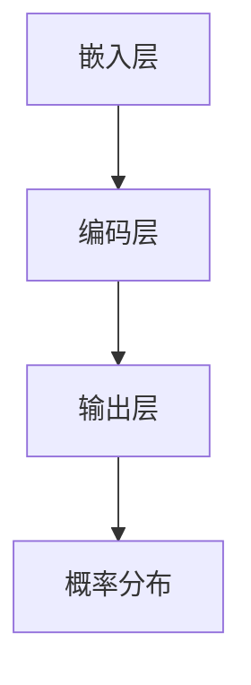

                 

# AI人工智能核心算法原理与代码实例讲解：语言模型

> 关键词：人工智能，语言模型，深度学习，算法原理，代码实例

> 摘要：本文将深入探讨AI人工智能领域中的核心算法——语言模型的原理及其应用。从基础概念入手，逐步讲解语言模型的数学基础、词汇表示与编码、训练方法及其优化策略，并通过实际项目案例进行代码实例分析，帮助读者全面理解语言模型在AI领域的应用与实践。

## 第一部分: 语言模型基础

### 第1章: 语言模型概述

#### 1.1 语言模型的定义和作用

语言模型是人工智能领域中用于理解和生成自然语言的核心工具。它的主要任务是预测给定文本序列下一个最可能的单词或字符。语言模型在自然语言处理（NLP）的许多应用中扮演着关键角色，如文本分类、机器翻译、语音识别和文本生成等。

#### 1.2 语言模型的发展历史

语言模型的发展经历了从基于统计方法到基于深度学习的转变。早期的语言模型，如N-gram模型，基于统计语言模型，通过计算词或字符的历史出现频率来预测下一个词或字符。随着深度学习技术的发展，神经网络模型逐渐取代了传统的统计模型，如循环神经网络（RNN）和长短期记忆网络（LSTM）等，它们能够更好地捕捉语言中的长距离依赖关系。

#### 1.3 语言模型的基本结构

现代语言模型通常基于神经网络架构，其中嵌入层将词汇转换为稠密向量表示，编码层通过神经网络处理这些向量，输出层生成概率分布。语言模型的基本结构可以概括为三个主要部分：嵌入层、编码层和输出层。

### 第2章: 语言模型的数学基础

#### 2.1 概率论基础

概率论是语言模型的基础，它提供了一种量化不确定性的方法。在语言模型中，概率用于预测给定前文序列后最可能的单词或字符。常用的概率分布包括伯努利分布、高斯分布和多项式分布等。

#### 2.2 信息论基础

信息论为语言模型提供了一种量度信息的方法。信息熵、条件熵和互信息是三个重要的概念，它们用于评估语言模型的质量和性能。

#### 2.3 概率分布

概率分布是语言模型的核心组成部分，它决定了模型如何预测给定输入的概率分布。常用的概率分布包括高斯分布、伯努利分布和多项式分布等。

### 第3章: 词汇表示与编码

#### 3.1 词嵌入技术

词嵌入是将词汇映射为稠密向量的技术，它能够捕捉词汇之间的语义关系。Word2Vec、GloVe和BERT是常见的词嵌入方法。

#### 3.2 字符嵌入

字符嵌入是将字符映射为稠密向量的技术，它能够捕捉字符之间的语法关系。Character-level CNN和Character-level RNN是常见的字符嵌入方法。

#### 3.3 字典构建与索引

字典构建是将词汇映射到唯一标识符的过程，索引则是用于快速查找词汇的过程。哈希表和索引数组是常见的字典构建方法。

### 第4章: 语言模型训练

#### 4.1 数据预处理

数据预处理是语言模型训练的第一步，它包括文本清洗、分词、去停用词等操作。数据预处理的质量直接影响模型的性能。

#### 4.2 梯度下降法

梯度下降法是一种用于优化神经网络参数的常见算法。它通过计算损失函数关于参数的梯度，并沿着梯度的反方向更新参数，以最小化损失函数。

#### 4.3 优化算法

除了梯度下降法，还有许多优化算法可用于语言模型训练，如随机梯度下降（SGD）、Adam和RMSProp等。

#### 4.4 语言模型评估

语言模型评估是衡量模型性能的过程。常用的评估指标包括交叉熵损失、困惑度和符号准确率等。

### 第5章: 语言模型的优化与改进

#### 5.1 隐马尔可夫模型

隐马尔可夫模型（HMM）是一种基于状态转移概率和观测概率的统计模型，它能够处理隐藏的随机过程。

#### 5.2 隐含层循环神经网络

循环神经网络（RNN）是一种能够处理序列数据的神经网络，它通过隐藏状态捕捉序列中的长期依赖关系。

#### 5.3 长短期记忆网络

长短期记忆网络（LSTM）是RNN的一种变体，它通过门控机制有效地解决了RNN的梯度消失和梯度爆炸问题。

#### 5.4 自注意力机制

自注意力机制是一种在神经网络中用于处理序列数据的注意力机制，它通过计算不同位置的相对重要性来提高模型的性能。

### 第6章: 语言模型应用实例

#### 6.1 语音识别

语音识别是语言模型在语音处理领域的重要应用。通过将语音信号转换为文本，语音识别系统可以帮助人们更便捷地进行信息交流。

#### 6.2 机器翻译

机器翻译是语言模型在跨语言通信中的关键应用。通过将一种语言的文本翻译成另一种语言，机器翻译系统促进了不同语言之间的交流。

#### 6.3 问答系统

问答系统是语言模型在智能客服和智能搜索等领域的应用。通过理解和回答用户的问题，问答系统提供了智能化的交互体验。

#### 6.4 文本生成

文本生成是语言模型在内容创作和自动化写作等领域的应用。通过生成连贯、有意义的文本，文本生成系统为人们提供了新的创作工具。

### 第7章: 项目实战

#### 7.1 语言模型开发环境搭建

在项目实战中，我们将介绍如何搭建语言模型开发环境，包括安装必要的软件和库，如TensorFlow和PyTorch等。

#### 7.2 语言模型实现与代码解读

我们将通过实际代码示例，详细讲解语言模型的实现过程，包括数据预处理、模型训练和评估等步骤。

#### 7.3 项目实战案例分析

通过实际项目案例分析，我们将深入剖析语言模型在不同应用场景中的表现和效果，并提出优化和改进方案。

### 第8章: 深入学习与语言模型

#### 8.1 深度学习基础

深度学习是语言模型的核心技术，我们将在本章介绍深度学习的基础概念和基本算法。

#### 8.2 语言模型与深度学习的关系

我们将探讨语言模型与深度学习之间的关系，分析深度学习在语言模型中的应用和发展趋势。

#### 8.3 深度学习在语言模型中的应用

我们将介绍深度学习在语言模型中的具体应用，如词嵌入、编码层和输出层的实现方法。

### 第9章: 语言模型未来发展趋势

#### 9.1 语言模型面临的挑战

随着语言模型的广泛应用，我们也面临了许多挑战，如计算资源消耗、模型解释性和数据隐私等问题。

#### 9.2 语言模型的发展方向

我们将探讨语言模型的发展方向，如自监督学习和多模态语言模型等新兴技术。

#### 9.3 未来应用场景预测

我们将预测语言模型在未来的应用场景，如智能助手、自动化写作和智能客服等。

## 附录

### 附录A: 常用语言模型库与工具

我们将介绍常用的语言模型库与工具，如TensorFlow、PyTorch和Keras等。

### 附录B: 数学公式与伪代码

我们将提供常用的数学公式和伪代码，帮助读者更好地理解语言模型的数学基础和算法原理。

### 附录C: 项目实战源代码

我们将提供实际项目实战的源代码，包括数据预处理、模型训练和评估等步骤，方便读者进行实践和学习。

### 作者信息

作者：AI天才研究院/AI Genius Institute & 禅与计算机程序设计艺术 /Zen And The Art of Computer Programming

在本文中，我们通过逐步分析推理的方式，详细讲解了AI人工智能核心算法——语言模型的原理、实现和应用。从基础概念到高级应用，从数学模型到实际项目案例，我们希望能够帮助读者全面理解语言模型在AI领域的应用与实践。同时，我们也对语言模型的未来发展趋势进行了探讨，展望了其在未来的应用前景。

在本研究的结尾，我们提出以下最佳实践和注意事项，供读者参考：

1. **数据预处理的重要性**：在语言模型训练过程中，数据预处理是至关重要的一步。确保数据的质量和一致性，有助于提高模型的性能。

2. **模型参数调优**：在模型训练过程中，参数调优是提高模型性能的关键。通过尝试不同的参数组合，可以找到最佳参数设置。

3. **模型解释性**：随着深度学习模型在语言模型中的应用，模型解释性成为一个重要的研究课题。理解模型的内部工作机制，有助于提高模型的可靠性和透明度。

4. **计算资源管理**：语言模型训练需要大量的计算资源。合理管理计算资源，如使用分布式训练和GPU加速，可以提高训练效率。

5. **持续学习和迭代**：语言模型是一个不断发展和改进的领域。持续学习和迭代是提高模型性能和适应新应用场景的关键。

最后，我们推荐以下拓展阅读，以帮助读者进一步深入了解语言模型和相关技术：

1. **《深度学习》（Ian Goodfellow, Yoshua Bengio, Aaron Courville）**：这是一本经典的深度学习教材，详细介绍了深度学习的基础知识和应用。

2. **《自然语言处理与深度学习》（张翔）**：这是一本介绍自然语言处理和深度学习技术的中文教材，内容涵盖了语言模型的基础知识和应用。

3. **《语言模型与深度学习论文集》**：这是一本收集了近年来语言模型和深度学习领域重要论文的论文集，可以帮助读者了解最新的研究进展。

通过本文的研究，我们希望能够为读者提供一个全面、系统的语言模型知识体系，助力读者在AI领域取得更好的成果。感谢读者对本文的关注和支持！## 语言模型的定义和作用

语言模型（Language Model，简称LM）是自然语言处理（Natural Language Processing，简称NLP）领域中的核心组件，它能够对自然语言文本进行建模，从而预测给定文本序列下一个最可能的单词或字符。语言模型的核心任务是基于历史文本数据，学习并建立一个概率模型，以估计给定前文情况下下一个词或字符的概率分布。

语言模型的作用主要体现在以下几个方面：

1. **文本生成**：通过概率模型预测下一个词或字符，语言模型可以生成连贯的文本。这种应用在自动写作、机器翻译和对话系统中尤为重要。例如，在生成文章摘要、新闻报道和对话机器人中，语言模型能够根据输入的文本上下文，生成相关且合理的续写内容。

2. **语音识别**：在语音识别系统中，语言模型用于将语音信号转换成文本。语言模型通过预测每个语音单元对应的文本字符序列，提高了识别的准确性和效率。此外，语言模型还可以帮助识别和纠正语音中的错误。

3. **机器翻译**：语言模型在机器翻译中起着至关重要的作用。它通过对源语言和目标语言的文本序列建模，预测目标语言中下一个最可能的单词或字符序列。这种预测能力使得机器翻译系统能够生成更自然、更准确的翻译结果。

4. **信息检索**：在搜索引擎中，语言模型可以用于优化搜索结果。通过理解用户查询和文档内容之间的概率关系，语言模型能够为用户提供更相关的搜索结果。

5. **问答系统**：语言模型在问答系统中用于理解用户的问题，并生成相应的答案。它通过对大量问答数据的学习，预测给定问题后最可能的答案选项。

总之，语言模型在自然语言处理领域扮演着至关重要的角色，其应用不仅限于文本生成和语音识别，还涵盖了机器翻译、信息检索和问答系统等多个方面。通过概率建模，语言模型能够捕捉语言中的内在结构和规律，从而提高各种NLP任务的性能和效果。

### 语言模型的发展历史

语言模型的发展历程可以追溯到20世纪中叶，随着计算机科学和人工智能技术的进步，语言模型的研究和应用逐步得到了深化和扩展。早期语言模型主要以统计模型为主，随后随着深度学习技术的发展，神经网络模型逐渐成为主流。下面我们将简要回顾语言模型的发展历史。

#### 早期统计模型

1. **N-gram模型**（20世纪50年代至70年代）：N-gram模型是最早的语言模型之一，它通过统计词或字符的邻接关系来预测下一个词或字符。N-gram模型简单高效，能够捕捉一定程度的语言规律，但它在长距离依赖关系处理上存在局限。

2. **隐马尔可夫模型**（HMM）和**条件随机场**（CRF）**：**这些模型在语音识别和文本分类等应用中得到了广泛研究，它们通过引入状态转移概率和条件概率来建模语言的时序特性。

#### 神经网络模型

1. **循环神经网络**（RNN）**（1980年代至2000年代初）：**RNN通过引入循环结构，使得模型能够处理序列数据，并在一定程度上解决长距离依赖问题。然而，RNN在实际应用中存在梯度消失和梯度爆炸的问题，限制了其性能。

2. **长短期记忆网络**（LSTM）**（1990年代至2000年代初）：**Hochreiter和Schmidhuber在1997年提出了LSTM，它通过引入门控机制有效解决了RNN的梯度消失问题。LSTM在处理长序列数据时表现出色，被广泛应用于语音识别、机器翻译等任务。

3. **门控循环单元**（GRU）**（2014年）：**Cho等人在2014年提出了GRU，它是LSTM的变体，简化了LSTM的结构，同时保持了其强大的序列建模能力。

#### 深度学习模型

1. **卷积神经网络**（CNN）**（2010年代）：**尽管CNN最初主要用于图像处理，但随后研究发现，CNN在处理文本数据时也非常有效。文本CNN通过卷积操作捕捉局部特征，在文本分类和情感分析等任务中表现出色。

2. **Transformer**（2017年）：**Vaswani等人在2017年提出了Transformer模型，它完全基于自注意力机制，不再使用循环结构。Transformer通过并行计算和多头注意力机制，显著提高了序列建模的效率和性能。Transformer及其变种BERT、GPT等，成为当前语言模型的主流架构。

3. **预训练+微调**：随着模型规模的增大和数据量的增加，预训练+微调方法成为语言模型的主流训练策略。预训练模型在大规模数据上预训练，然后通过微调适应特定任务，取得了显著的效果提升。

总之，语言模型的发展历史展示了从统计模型到神经网络模型，再到深度学习模型的演进过程。随着计算能力的提升和数据量的增加，语言模型的性能和应用范围不断扩展，为自然语言处理领域带来了革命性的变革。

### 语言模型的基本结构

语言模型的基本结构可以分为三个主要部分：嵌入层（Embedding Layer）、编码层（Encoding Layer）和输出层（Output Layer）。这三个部分共同构成了一个完整的神经网络模型，用于预测给定文本序列下一个最可能的单词或字符。

#### 嵌入层（Embedding Layer）

嵌入层是将词汇映射为稠密向量的过程，这一步是语言模型的关键环节。词嵌入（Word Embedding）技术通过将词汇转换为低维向量表示，能够有效地捕捉词汇之间的语义和语法关系。

1. **词嵌入方法**：常见的词嵌入方法包括Word2Vec、GloVe和BERT等。Word2Vec通过训练词的分布式表示来生成词向量，GloVe通过利用词和词的共现信息学习词的向量表示，而BERT则通过预训练和上下文依赖建模，生成高质量的词向量。

2. **词汇表示**：嵌入层将每个词汇映射为一个唯一的向量表示。这些向量不仅保留了词汇的语义信息，还能够通过向量的空间距离反映词汇之间的相似性和关联性。

#### 编码层（Encoding Layer）

编码层是语言模型的核心部分，用于处理嵌入层的向量表示，并捕捉文本序列中的长距离依赖关系。常见的编码层结构包括循环神经网络（RNN）、长短期记忆网络（LSTM）和门控循环单元（GRU）等。

1. **RNN**：循环神经网络通过循环结构处理序列数据，每个时间步的输出都与前一个时间步的隐藏状态相关。然而，传统的RNN存在梯度消失和梯度爆炸的问题，难以处理长序列数据。

2. **LSTM**：长短期记忆网络通过引入门控机制，有效地解决了RNN的梯度消失问题。LSTM的细胞状态（Cell State）和三个门（输入门、遗忘门和输出门）使得模型能够记忆长期依赖关系。

3. **GRU**：门控循环单元是LSTM的简化版本，通过合并输入门和遗忘门，简化了模型结构，同时保持了强大的序列建模能力。

#### 输出层（Output Layer）

输出层的主要任务是生成概率分布，用于预测给定文本序列下一个最可能的单词或字符。输出层通常采用softmax激活函数，将编码层的输出转换为概率分布。

1. **概率分布**：输出层生成的概率分布反映了每个词汇或字符在给定前文下的可能性。通过最大化概率分布，模型能够预测出下一个最可能的词汇或字符。

2. **损失函数**：在训练过程中，损失函数用于评估模型的预测结果与实际结果之间的差距。常见的损失函数包括交叉熵损失（Cross-Entropy Loss）和Kullback-Leibler散度（KL Divergence）。

#### Mermaid 流程图

下面是一个简单的Mermaid流程图，展示了语言模型的基本结构：



通过嵌入层将词汇转换为向量，编码层处理这些向量并捕捉序列依赖关系，最终输出层生成概率分布以预测下一个词汇或字符。

### 语言模型的数学基础

语言模型的数学基础包括概率论和信息论的相关知识，这些数学工具为语言模型提供了理论基础，使其能够有效地建模自然语言。以下我们将详细介绍概率论、信息论和概率分布的基本概念，以及它们在语言模型中的应用。

#### 概率论基础

概率论是语言模型的核心组成部分，它提供了一种量化不确定性的方法。以下是一些在语言模型中常用的概率分布和概念：

1. **伯努利分布**：伯努利分布是一种离散概率分布，用于表示一个事件发生的概率。在语言模型中，它可以用来表示一个词或字符是否出现。

   $$P(X = x) = p$$

   其中，\(P(X = x)\) 是事件 \(X\) 发生为 \(x\) 的概率，\(p\) 是事件发生的概率。

2. **高斯分布**：高斯分布是一种连续概率分布，通常用于建模语言中的连续变量。例如，词嵌入向量可以是高斯分布生成的。

   $$f(x|\mu, \sigma^2) = \frac{1}{\sqrt{2\pi\sigma^2}} e^{-\frac{(x-\mu)^2}{2\sigma^2}}$$

   其中，\(x\) 是随机变量，\(\mu\) 是均值，\(\sigma^2\) 是方差。

3. **多项式分布**：多项式分布是用于离散随机变量的概率分布，可以用来表示词汇在序列中的出现概率。

   $$P(X = x) = \frac{\lambda^x e^{-\lambda}}{x!}$$

   其中，\(\lambda\) 是参数，\(x\) 是事件发生的次数。

4. **条件概率**：条件概率是指在一个事件发生的条件下，另一个事件发生的概率。在语言模型中，条件概率用于计算给定前文情况下下一个词或字符的概率。

   $$P(X = x | Y = y) = \frac{P(X = x, Y = y)}{P(Y = y)}$$

#### 信息论基础

信息论是研究信息传递和处理的理论，它在语言模型中用于评估模型的质量和性能。以下是一些重要的信息论概念：

1. **信息熵**：信息熵是衡量随机变量不确定性的一种度量。在语言模型中，信息熵用于评估文本的随机性。

   $$H(X) = -\sum_{x} P(X = x) \log_2 P(X = x)$$

   其中，\(H(X)\) 是随机变量 \(X\) 的熵。

2. **条件熵**：条件熵是衡量在已知一个变量的条件下，另一个变量的不确定性。在语言模型中，条件熵用于评估给定前文情况下，下一个词或字符的不确定性。

   $$H(X|Y) = -\sum_{y} P(Y = y) \sum_{x} P(X = x | Y = y) \log_2 P(X = x | Y = y)$$

3. **互信息**：互信息是衡量两个随机变量之间相关性的度量。在语言模型中，互信息用于评估词或字符之间的相关性。

   $$I(X; Y) = H(X) - H(X | Y)$$

#### 概率分布

概率分布是语言模型中的一个核心概念，它用于预测给定前文序列下最可能的单词或字符。以下是一些常用的概率分布：

1. **高斯分布**：高斯分布是一种连续概率分布，用于表示词嵌入向量的分布。

   $$f(x|\mu, \sigma^2) = \frac{1}{\sqrt{2\pi\sigma^2}} e^{-\frac{(x-\mu)^2}{2\sigma^2}}$$

   其中，\(\mu\) 是均值，\(\sigma^2\) 是方差。

2. **多项式分布**：多项式分布是一种离散概率分布，用于表示词汇在序列中的概率分布。

   $$P(X = x) = \frac{\lambda^x e^{-\lambda}}{x!}$$

   其中，\(\lambda\) 是参数，\(x\) 是事件发生的次数。

3. **伯努利分布**：伯努利分布是一种离散概率分布，用于表示一个事件是否发生。

   $$P(X = x) = p$$

   其中，\(p\) 是事件发生的概率。

#### 伪代码

以下是一个简单的伪代码，用于生成高斯分布和多项式分布：

```python
# 生成高斯分布
mu = 0  # 均值
sigma = 1  # 方差
x = np.random.normal(mu, sigma)

# 生成多项式分布
lambda_ = 1  # 参数
x = np.random.poisson(lambda_)
```

通过这些概率分布和数学工具，语言模型能够有效地建模自然语言，从而实现高质量的文本生成和预测。

### 词汇表示与编码

词汇表示与编码是语言模型中至关重要的一步，它将自然语言中的词汇映射为计算机可以处理的稠密向量表示。这种向量表示不仅能够捕捉词汇的语义和语法特征，还能够有效地支持深度学习模型的学习和预测。

#### 词嵌入技术

词嵌入（Word Embedding）技术是将词汇映射为低维向量的过程。以下是一些常见的词嵌入方法：

1. **Word2Vec**：Word2Vec是由Mikolov等人于2013年提出的，它通过训练神经网络来学习词汇的分布式表示。Word2Vec有两种主要的模型：连续词袋（CBOW）和Skip-Gram。

   - **CBOW（Continuous Bag of Words）**：CBOW模型通过预测中心词周围的上下文词来生成词向量。给定一个中心词，模型会平均其周围上下文词的向量，作为该中心词的词向量。
     ```mermaid
     graph TD
     A[中心词] --> B{CBOW}
     B --> C[上下文词1]
     C --> D[上下文词2]
     C --> E[上下文词3]
     ```
   
   - **Skip-Gram**：Skip-Gram模型通过预测中心词的上下文词来生成词向量。与CBOW相反，它直接以单个词为中心，预测与其相邻的词。
     ```mermaid
     graph TD
     A[中心词] --> B{Skip-Gram}
     B --> C[上下文词1]
     B --> D[上下文词2]
     ```

2. **GloVe**：GloVe（Global Vectors for Word Representation）是由Pennington等人于2014年提出的，它通过利用词汇的共现信息来学习词向量。GloVe模型使用矩阵分解技术，将词汇的共现矩阵分解为词向量和词权重矩阵的乘积。

3. **BERT**：BERT（Bidirectional Encoder Representations from Transformers）是由Google于2018年提出的，它通过预训练双向Transformer模型来学习词汇的上下文表示。BERT模型能够捕捉词汇在句子中的双向依赖关系，从而生成高质量的词向量。

#### 字符嵌入

字符嵌入（Character Embedding）是将字符映射为向量的过程，它能够捕捉词汇的局部语法特征。以下是一些常见的字符嵌入方法：

1. **Character-Level CNN**：字符级卷积神经网络通过卷积操作捕捉字符的局部特征。这些特征被用于编码词汇，从而增强词向量的表示能力。

2. **Character-Level RNN**：字符级循环神经网络通过处理每个字符的序列，学习字符的上下文特征。这些特征被整合到词汇的嵌入向量中。

#### 字典构建与索引

字典构建是将词汇映射到唯一标识符的过程，索引则是用于快速查找词汇的过程。以下是字典构建和索引的常见方法：

1. **哈希表**：哈希表通过哈希函数将词汇映射到索引，以实现快速查找。哈希表能够有效地处理词汇的动态扩展和删除。

2. **索引数组**：索引数组通过将词汇排序并存储其索引来实现快速查找。索引数组在词汇量较小且固定时表现出色。

通过词汇表示与编码，语言模型能够将自然语言文本转换为计算机可以处理的稠密向量表示，从而支持后续的编码层和输出层处理。词嵌入、字符嵌入和字典构建与索引等技术共同构成了语言模型的前端处理模块，为语言模型的高效学习和应用奠定了基础。

### 语言模型训练

语言模型训练是构建高效语言模型的核心步骤，它通过学习大量的文本数据，使模型能够准确地预测文本序列中的下一个词或字符。语言模型训练主要包括数据预处理、训练算法选择、优化算法和评估指标等方面。以下将详细阐述这些关键环节。

#### 数据预处理

数据预处理是语言模型训练的基础工作，它确保输入数据的质量和一致性，直接影响模型的性能。数据预处理的主要任务包括：

1. **文本清洗**：去除文本中的噪声，如HTML标签、特殊字符和多余的空格。这一步通过正则表达式或文本清洗库（如Python的re模块）来完成。

2. **分词**：将文本拆分成单词或子词，以便后续处理。常用的分词工具包括jieba、spaCy等。

3. **去除停用词**：停用词是指对文本内容贡献较小或无意义的词汇，如“的”、“和”、“是”等。去除停用词可以提高模型训练的效率，并减少噪声。

4. **词向量化**：将文本中的词汇转换为词嵌入向量表示，这是语言模型训练中的关键步骤。常用的词嵌入方法包括Word2Vec、GloVe和BERT等。

#### 训练算法选择

训练算法的选择直接影响模型的训练效率和性能。以下是几种常见的训练算法：

1. **梯度下降法（Gradient Descent）**：梯度下降法是最常用的优化算法之一，它通过计算损失函数关于模型参数的梯度，并沿着梯度的反方向更新参数，以最小化损失函数。梯度下降法的变体包括随机梯度下降（SGD）、批量梯度下降（BGD）和小批量梯度下降（MBGD）。

2. **动量优化（Momentum）**：动量优化是一种加速梯度下降法收敛的技巧，它通过引入前一个梯度的比例来加速参数更新。

3. **Adam优化器（Adaptive Moment Estimation）**：Adam优化器结合了AdaGrad和RMSProp的优点，通过自适应地调整每个参数的学习率，提高了训练效率。

#### 优化算法

优化算法是训练过程中的核心，它通过调整模型参数来最小化损失函数。以下是几种常用的优化算法：

1. **随机梯度下降（SGD）**：SGD在每次迭代中仅使用一个样本更新模型参数，这种方法计算速度快，但可能导致模型参数的波动较大。

2. **批量梯度下降（BGD）**：BGD在每次迭代中使用整个训练集来更新模型参数，这种方法收敛速度较慢，但可以保证参数更新的稳定性和准确性。

3. **小批量梯度下降（MBGD）**：MBGD在每次迭代中使用一部分训练样本（如32个或64个）来更新模型参数，它结合了SGD和BGD的优点，能够在保证收敛速度的同时，减少参数波动。

4. **Adam优化器**：Adam优化器通过自适应调整每个参数的学习率，提高了训练效率。它通过计算一阶矩估计（均值）和二阶矩估计（方差），来优化参数更新过程。

#### 语言模型评估

语言模型评估是衡量模型性能的重要步骤，它通过多种评估指标来评估模型的预测能力和准确性。以下是几种常见的评估指标：

1. **交叉熵损失（Cross-Entropy Loss）**：交叉熵损失是评估模型预测概率分布与实际分布之间差异的指标。交叉熵损失值越低，表示模型预测越准确。

2. **困惑度（Perplexity）**：困惑度是衡量模型预测能力的一个指标，它表示模型对测试集的困惑程度。困惑度值越低，表示模型预测越准确。

3. **符号准确率（Symbol Accuracy）**：符号准确率是评估模型预测单个字符或词的准确性。符号准确率越高，表示模型预测越准确。

4. **BLEU评分（BLEU Score）**：BLEU评分是用于评估机器翻译质量的指标，它通过计算翻译结果与参考翻译之间的匹配度来评估模型性能。

通过合理的数据预处理、选择合适的训练算法和优化策略，以及科学的模型评估方法，我们可以构建出高效、准确的语言模型，从而在自然语言处理任务中取得良好的性能。

### 语言模型的优化与改进

在构建高效语言模型的过程中，优化与改进是不可或缺的一环。随着语言模型的广泛应用，研究人员不断提出各种优化方法，以提高模型的性能和应用效果。以下将介绍几种常见的优化方法，包括隐马尔可夫模型（HMM）、隐含层循环神经网络（RNN）、长短期记忆网络（LSTM）和自注意力机制。

#### 隐马尔可夫模型（HMM）

隐马尔可夫模型（Hidden Markov Model，HMM）是一种统计模型，主要用于处理离散时间的序列数据。HMM通过状态转移概率和观测概率来建模隐藏的随机过程。以下是HMM的基本组成部分：

1. **状态集合**：隐藏的状态集合\(Q = \{q_1, q_2, ..., q_N\}\)，每个状态代表一个可能的内部状态。

2. **观测集合**：观测状态的集合\(O = \{o_1, o_2, ..., o_M\}\)，每个观测状态是对外部环境的观察。

3. **初始状态概率**：每个状态的初始概率\( \pi_i \)，表示模型开始时处于状态\(q_i\)的概率。

4. **状态转移概率**：\(a_{ij} = P(q_{t+1} = q_j | q_t = q_i)\)，表示在时间\(t\)处于状态\(q_i\)的情况下，在时间\(t+1\)转移到状态\(q_j\)的概率。

5. **观测概率**：\(b_{jk} = P(o_t = o_j | q_t = q_k)\)，表示在时间\(t\)处于状态\(q_k\)的情况下，生成观测\(o_j\)的概率。

HMM的优化方法主要包括：

- **前向-后向算法**：用于计算给定观测序列的状态概率分布。

- **Viterbi算法**：用于找到给定观测序列下最可能的状态序列。

#### 隐含层循环神经网络（RNN）

循环神经网络（Recurrent Neural Network，RNN）是一种能够处理序列数据的神经网络，其通过循环结构来记忆历史信息。RNN的基本结构如下：

1. **输入层**：接受输入序列，包括词汇的词向量或字符的嵌入向量。

2. **隐藏层**：存储当前时间步的隐藏状态，并与前一个时间步的隐藏状态相关联。

3. **输出层**：生成当前时间步的输出，如概率分布或词向量。

RNN的优化方法主要包括：

- **Backpropagation Through Time (BPTT)**：一种反向传播算法，用于计算梯度，并在多个时间步更新参数。

- **梯度裁剪（Gradient Clipping）**：用于解决RNN的梯度消失和梯度爆炸问题，通过限制梯度的范数来防止数值不稳定。

#### 长短期记忆网络（LSTM）

长短期记忆网络（Long Short-Term Memory，LSTM）是RNN的一种变体，它通过引入门控机制来解决RNN的梯度消失问题。LSTM的基本结构如下：

1. **输入门**：用于决定哪些信息应被保留或丢弃。

2. **遗忘门**：用于决定哪些信息应从记忆中遗忘。

3. **输出门**：用于决定哪些信息应输出。

LSTM的优化方法主要包括：

- **梯度裁剪**：用于解决梯度消失和梯度爆炸问题。

- **序列学习率衰减**：通过逐步减小学习率，使模型在训练过程中更加稳定。

#### 自注意力机制

自注意力机制（Self-Attention Mechanism）是Transformer模型的核心组件，它通过计算不同位置之间的相对重要性来提高模型的性能。自注意力机制的基本结构如下：

1. **查询向量（Query）**：用于表示当前时间步的输入。

2. **键向量（Key）**：用于表示输入序列中所有时间步的输入。

3. **值向量（Value）**：用于表示输入序列中所有时间步的输入。

自注意力机制的优化方法主要包括：

- **多头注意力**：通过多个独立的注意力头来捕捉不同的依赖关系。

- **缩放因子**：用于防止注意力权重过大，导致梯度消失。

通过这些优化方法，语言模型在处理自然语言时能够更加高效地捕捉长距离依赖关系和上下文信息，从而提高模型的性能和应用效果。隐马尔可夫模型、RNN、LSTM和自注意力机制等优化方法共同推动了语言模型的发展，使其在自然语言处理任务中取得了显著的成果。

### 语言模型应用实例

语言模型在自然语言处理（NLP）领域有着广泛的应用，下面我们将介绍几个典型的应用实例，包括语音识别、机器翻译、问答系统和文本生成。

#### 语音识别

语音识别是将语音信号转换为文本的过程。语言模型在语音识别系统中起着核心作用，用于预测下一个最可能的单词或字符序列。以下是语音识别的基本步骤：

1. **特征提取**：通过声学模型对语音信号进行预处理，提取特征向量，如梅尔频率倒谱系数（MFCC）。

2. **语言模型评分**：使用语言模型对提取的特征向量进行评分，计算每个候选单词或字符序列的概率。

3. **解码**：通过解码算法（如动态规划）找到最可能的文本序列，使其与输入语音信号匹配。

语音识别的应用包括智能助手（如Siri和Google Assistant）、实时字幕和语音导航等。以下是一个简单的伪代码示例：

```python
def recognize_speech(audio_signal):
    # 提取特征向量
    features = extract_features(audio_signal)
    # 使用语言模型评分
    scores = language_model.score(features)
    # 解码找到最可能的文本序列
    text_sequence = decode(scores)
    return text_sequence
```

#### 机器翻译

机器翻译是将一种语言的文本翻译成另一种语言的过程。语言模型在机器翻译系统中用于预测目标语言中下一个最可能的单词或字符序列。以下是机器翻译的基本步骤：

1. **双语语料库**：构建包含源语言和目标语言文本对应的双语语料库。

2. **编码器-解码器框架**：使用编码器（如序列到序列模型）将源语言文本编码为向量表示，解码器则将向量表示解码为目标语言文本。

3. **语言模型辅助**：在解码过程中，语言模型用于预测目标语言中下一个最可能的单词或字符序列。

机器翻译的应用包括跨语言沟通、全球化内容创作和国际贸易等。以下是一个简单的伪代码示例：

```python
def translate(source_text):
    # 编码源语言文本
    encoded_text = encoder.encode(source_text)
    # 解码为目标语言文本
    target_text = decoder.decode(encoded_text)
    # 使用语言模型进行预测
    predicted_text = language_model.predict(target_text)
    return predicted_text
```

#### 问答系统

问答系统是一种智能交互系统，能够理解用户的问题并生成相应的答案。语言模型在问答系统中用于理解问题、检索相关信息和生成答案。以下是问答系统的基本步骤：

1. **问题理解**：使用语言模型理解用户的问题，提取关键信息。

2. **信息检索**：在知识库或数据库中检索与问题相关的信息。

3. **答案生成**：使用语言模型生成与用户问题相关的答案。

问答系统的应用包括智能客服、虚拟助理和教育辅导等。以下是一个简单的伪代码示例：

```python
def answer_question(question):
    # 理解问题
    question Understanding = language_model.process(question)
    # 检索相关信息
    related_info = retrieve_info(question Understanding)
    # 生成答案
    answer = language_model.generate_answer(related_info)
    return answer
```

#### 文本生成

文本生成是使用语言模型生成连贯、有意义的文本序列的过程。文本生成在自动化写作、内容创作和文学创作等领域有广泛应用。以下是文本生成的基本步骤：

1. **文本初始化**：初始化生成文本的起始状态。

2. **模型预测**：使用语言模型预测下一个单词或字符，并更新文本状态。

3. **文本扩展**：通过不断迭代模型预测，扩展生成文本。

文本生成的应用包括文章摘要、新闻写作和对话系统等。以下是一个简单的伪代码示例：

```python
def generate_text(seed_text):
    # 初始化文本状态
    text_state = seed_text
    # 生成文本
    while not is_termination_condition_met(text_state):
        next_word = language_model.predict(text_state)
        text_state = text_state + " " + next_word
    return text_state.strip()
```

通过以上几个应用实例，我们可以看到语言模型在自然语言处理中的重要作用。语言模型不仅能够提高语音识别、机器翻译、问答系统和文本生成的性能，还推动了这些技术在各个领域的广泛应用，为人类提供了更加智能化的交互和信息服务。

### 项目实战

在本节中，我们将通过一个具体的语言模型项目实战，详细介绍语言模型的开发环境搭建、实现过程以及代码解读。我们选择使用TensorFlow和Keras作为主要的工具，来构建一个简单的语言模型，并进行训练和评估。

#### 1. 开发环境搭建

首先，我们需要搭建一个适合语言模型开发的环境。以下是搭建环境所需的步骤：

1. **安装Python**：确保安装了Python 3.6或更高版本。

2. **安装TensorFlow**：通过pip命令安装TensorFlow。

   ```bash
   pip install tensorflow
   ```

3. **安装Keras**：TensorFlow自带了Keras接口，不需要额外安装。

4. **安装其他依赖库**：如NumPy、Pandas和re等。

   ```bash
   pip install numpy pandas re
   ```

5. **创建虚拟环境**（可选）：为了更好地管理项目依赖，可以创建一个虚拟环境。

   ```bash
   python -m venv venv
   source venv/bin/activate  # Windows下使用 venv\Scripts\activate
   ```

完成以上步骤后，我们的开发环境就搭建完成了。

#### 2. 语言模型实现与代码解读

接下来，我们将使用TensorFlow和Keras实现一个简单的语言模型。以下是一个基本的实现示例：

```python
import numpy as np
import tensorflow as tf
from tensorflow.keras.models import Sequential
from tensorflow.keras.layers import Embedding, LSTM, Dense
from tensorflow.keras.preprocessing.sequence import pad_sequences
from tensorflow.keras.optimizers import RMSprop

# 准备数据
# 假设我们有一个文本数据集 `text_data`，它包含一系列的单词序列
# 我们需要将这些单词序列转换为索引序列，然后进行填充和编码

# 转换单词到索引
tokenizer = tf.keras.preprocessing.text.Tokenizer()
tokenizer.fit_on_texts(text_data)
sequences = tokenizer.texts_to_sequences(text_data)

# 填充序列
max_sequence_len = 40  # 设定序列的最大长度
padded_sequences = pad_sequences(sequences, maxlen=max_sequence_len)

# 准备输入和输出
X, y = padded_sequences[:,:-1], padded_sequences[:,-1]
y = tf.keras.utils.to_categorical(y, num_classes=num_words)

# 构建模型
model = Sequential([
    Embedding(num_words, embedding_dim, input_length=max_sequence_len-1),
    LSTM(100),
    Dense(num_words, activation='softmax')
])

# 编译模型
model.compile(loss='categorical_crossentropy', optimizer=RMSprop(), metrics=['accuracy'])

# 训练模型
model.fit(X, y, epochs=10, batch_size=32)

# 保存模型
model.save('language_model.h5')
```

在这个示例中，我们首先使用`Tokenizer`将文本数据转换为索引序列。然后，使用`pad_sequences`函数对序列进行填充，以确保每个序列的长度一致。接下来，我们构建一个简单的序列模型，包括嵌入层、LSTM层和输出层。嵌入层将词汇转换为固定大小的向量，LSTM层用于处理序列数据并捕捉长距离依赖关系，输出层使用softmax激活函数来生成概率分布。

#### 3. 代码应用解读与分析

在实现语言模型的过程中，以下是一些关键步骤和应用解读：

1. **数据预处理**：数据预处理是语言模型训练的第一步，它包括分词、词向量化、序列填充等操作。这些步骤确保数据的一致性和可处理性，从而提高模型的性能。

2. **模型构建**：在模型构建阶段，我们使用嵌

