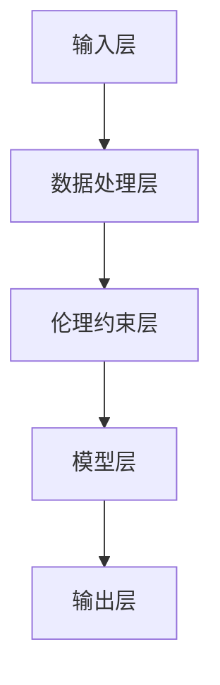
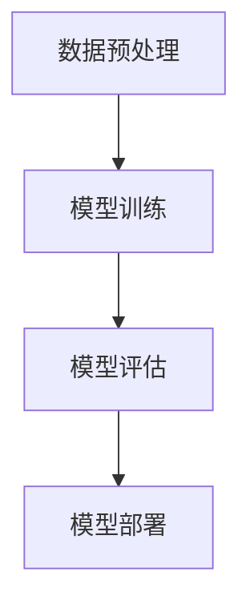
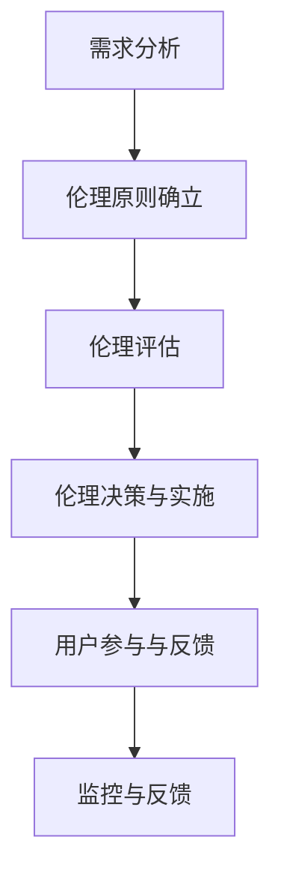
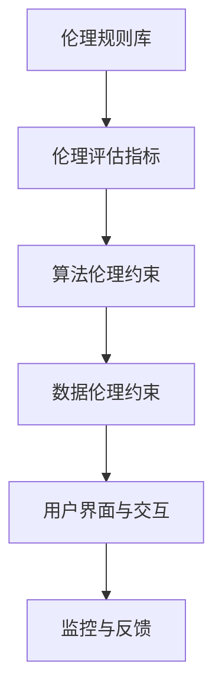

                 

### 文章标题

《AI伦理的技术内在化：伦理约束嵌入和伦理对齐》

> 关键词：人工智能伦理、技术内在化、伦理约束嵌入、伦理对齐

> 摘要：本文探讨了人工智能（AI）伦理的技术内在化问题，从伦理约束嵌入和伦理对齐两个方面深入分析了如何将伦理原则融入AI系统的技术实现中。文章首先介绍了AI伦理的重要性及其面临的挑战，然后详细阐述了伦理约束嵌入的概念、方法和技术基础，接着讨论了伦理对齐的理论和实践。通过具体案例，展示了如何将伦理内化应用于实际场景，并提出了未来发展的展望。本文旨在为AI领域的从业者提供一套系统的伦理内化策略，以促进AI技术的健康发展。

### 第一部分：引言与基础

#### 第1章：AI伦理概述

##### 1.1 AI伦理的重要性

##### 1.1.1 伦理问题在AI发展中的角色

人工智能（AI）作为当前科技领域的前沿，正在深刻地改变人类社会。随着AI技术的迅猛发展，伦理问题也逐渐成为人们关注的焦点。伦理问题在AI发展中扮演着至关重要的角色，因为AI系统不仅是一个技术工具，它还涉及到社会、法律、道德等多个方面。以下是伦理问题在AI发展中的几个关键角色：

1. **公平与公正**：AI系统需要确保对所有用户公平对待，不因种族、性别、年龄等因素产生歧视。
2. **透明度**：AI系统的决策过程需要透明，使人们能够理解并信任AI系统的行为。
3. **隐私保护**：AI系统在使用和处理个人数据时，必须保护用户的隐私权。
4. **安全性**：AI系统需要具备高度的安全性，防止恶意攻击和数据泄露。
5. **责任归属**：在AI系统导致不良后果时，需要明确责任归属，确保各方利益得到妥善处理。

##### 1.1.2 AI伦理的主要挑战

尽管AI伦理在AI发展中具有重要性，但其也面临着一系列挑战。以下是一些主要的AI伦理挑战：

1. **数据偏见**：AI系统往往基于历史数据训练，如果数据本身存在偏见，AI系统也可能会继承这种偏见，导致不公平的决策。
2. **算法透明度**：深度学习等复杂AI算法的内部运作机制不透明，使得人们难以理解AI系统的决策过程。
3. **隐私侵犯**：AI系统在收集和处理大量数据时，可能会侵犯用户的隐私权。
4. **失业与经济影响**：AI技术的发展可能导致某些行业的工作岗位减少，引发社会不稳定。
5. **军事应用**：AI在军事领域的应用引发了对自主武器系统和战争伦理的担忧。

##### 1.1.3 伦理原则在AI设计中的应用

为了应对上述伦理挑战，伦理原则在AI设计中的应用变得至关重要。以下是一些关键的伦理原则及其在AI设计中的应用：

1. **尊重人类价值**：AI设计应尊重人类的尊严和基本人权，确保AI系统的行为符合道德标准。
2. **公平与无歧视**：AI系统应设计成公平对待所有用户，避免因数据偏见导致的歧视现象。
3. **透明性与可解释性**：AI系统应具有透明性，用户能够理解AI系统的决策过程。
4. **隐私保护**：AI系统应设计成保护用户隐私，确保数据收集和使用符合法律法规。
5. **安全性**：AI系统应具备高安全性，防止恶意攻击和数据泄露。
6. **责任归属**：应明确AI系统的责任归属，确保在发生问题时能够追溯责任。

##### 1.2 伦理约束嵌入的概念

伦理约束嵌入（Ethical Constraint Embedding）是将伦理原则和技术实现相结合的一种方法，旨在确保AI系统的行为符合伦理标准。以下是伦理约束嵌入的几个关键概念：

1. **伦理约束**：伦理约束是指一系列基于伦理原则制定的规则，用于指导AI系统的行为。
2. **嵌入**：嵌入是指将伦理约束集成到AI系统的设计、开发、部署和运维中。
3. **技术实现**：技术实现是指利用编程、算法设计等技术手段将伦理约束融入到AI系统中。

##### 1.2.1 嵌入伦理约束的必要性

伦理约束嵌入的必要性体现在以下几个方面：

1. **解决伦理问题**：通过伦理约束嵌入，可以解决AI系统中存在的伦理问题，如数据偏见、隐私侵犯等。
2. **提高AI可信度**：伦理约束嵌入可以提高AI系统的可信度，增强用户对AI系统的信任。
3. **合规性**：伦理约束嵌入有助于AI系统满足法规和行业标准，确保系统的合法性和合规性。
4. **社会责任**：伦理约束嵌入体现了AI领域的社会责任，有助于推动AI技术的健康发展。

##### 1.2.2 嵌入伦理约束的方法与策略

为了实现伦理约束嵌入，需要采取一系列方法和策略。以下是一些常见的方法和策略：

1. **设计阶段的伦理考虑**：在AI系统设计阶段，将伦理约束纳入到系统需求分析和设计过程中。
2. **算法伦理约束**：在算法设计和开发过程中，将伦理约束融入算法模型和算法决策过程中。
3. **数据伦理约束**：对AI系统使用的数据进行清洗和预处理，消除数据中的伦理问题。
4. **伦理评估与审计**：定期对AI系统进行伦理评估和审计，确保系统行为符合伦理标准。
5. **用户参与与反馈**：鼓励用户参与AI系统的设计和评估过程，收集用户反馈，以改进系统伦理表现。

#### 第2章：伦理对齐理论

##### 2.1 伦理对齐的定义与意义

伦理对齐（Ethical Alignment）是指将AI系统的行为与伦理原则对齐，确保AI系统的设计、开发、部署和应用符合伦理要求。以下是伦理对齐的定义和意义：

1. **定义**：伦理对齐是指通过一系列措施，将AI系统的行为与伦理原则对齐，确保AI系统的决策和行动符合伦理标准。
2. **意义**：伦理对齐对于确保AI系统的伦理性和可信度具有重要意义。它有助于：

   - 减少伦理风险：通过伦理对齐，可以识别和消除AI系统中的伦理风险，确保系统的行为符合道德标准。
   - 提高用户信任：伦理对齐可以增强用户对AI系统的信任，提高系统的接受度和使用率。
   - 促进AI健康发展：伦理对齐有助于推动AI技术的可持续发展，促进AI行业的健康发展。
   - 社会责任：伦理对齐体现了AI领域的社会责任，有助于解决AI技术带来的伦理问题，为社会带来积极影响。

##### 2.2 伦理对齐的方法与实践

实现伦理对齐需要采取一系列方法和实践。以下是一些常见的方法和实践：

1. **伦理审查**：在AI系统设计和开发过程中，进行伦理审查，评估系统行为是否符合伦理标准。
2. **伦理培训**：为AI系统开发者和使用者提供伦理培训，提高其伦理意识和伦理素养。
3. **伦理决策支持工具**：开发伦理决策支持工具，帮助AI系统开发者在设计过程中考虑伦理问题。
4. **用户参与**：鼓励用户参与AI系统的设计和评估过程，收集用户反馈，改进系统伦理表现。
5. **伦理监测与反馈**：建立伦理监测和反馈机制，定期评估AI系统的伦理表现，及时调整和改进系统设计。

##### 2.2.1 伦理对齐的基本流程

伦理对齐的基本流程包括以下几个阶段：

1. **需求分析**：明确AI系统的需求和目标，识别可能涉及的伦理问题。
2. **伦理原则确立**：根据伦理原则，制定适用于AI系统的伦理准则。
3. **伦理审查**：对AI系统进行伦理审查，评估系统设计是否符合伦理准则。
4. **伦理决策支持**：利用伦理决策支持工具，帮助开发者在设计过程中考虑伦理问题。
5. **用户参与**：鼓励用户参与AI系统的设计和评估过程，收集用户反馈。
6. **伦理监测与反馈**：建立伦理监测和反馈机制，定期评估AI系统的伦理表现，及时调整和改进系统设计。

##### 2.2.2 伦理评估工具的使用

伦理评估工具是伦理对齐过程中重要的辅助工具，可以帮助评估AI系统的伦理表现。以下是一些常见的伦理评估工具：

1. **伦理框架**：如德雷克塞尔伦理框架（Drexel Ethical Framework）和泰勒伦理框架（Taylor's Ethical Framework），用于指导AI系统的伦理评估。
2. **伦理评估软件**：如AI伦理评估平台（AI Ethics Assessment Platform），提供伦理评估流程和工具。
3. **伦理专家评审**：邀请伦理专家对AI系统进行评审，提供专业的伦理评估意见。
4. **用户反馈**：通过用户调查和反馈，收集用户对AI系统的伦理感受和意见。

##### 2.2.3 伦理对齐的具体案例

以下是一些伦理对齐的具体案例：

1. **自动驾驶汽车**：在自动驾驶汽车的开发过程中，需要考虑伦理问题，如道路使用者的安全、行人保护等。通过伦理审查和用户参与，确保自动驾驶汽车的设计和行为符合伦理要求。
2. **医疗AI**：在医疗AI系统的开发中，需要确保系统的行为符合伦理标准，如保护患者隐私、避免歧视等。通过伦理审查和用户参与，确保医疗AI系统的设计符合伦理要求。
3. **金融AI**：在金融AI系统的开发中，需要考虑伦理问题，如公平性、透明度等。通过伦理审查和用户参与，确保金融AI系统的设计符合伦理要求。

#### 第2章小结

伦理对齐是确保AI系统行为符合伦理要求的重要方法。通过伦理对齐，可以识别和解决AI系统中的伦理问题，提高系统的伦理性和可信度。伦理对齐的基本流程包括需求分析、伦理原则确立、伦理审查、伦理决策支持、用户参与和伦理监测与反馈。伦理评估工具和具体案例的使用有助于实现伦理对齐，推动AI技术的健康发展。

### 第二部分：技术实现

#### 第3章：伦理约束嵌入的技术基础

##### 3.1 伦理约束嵌入的框架

伦理约束嵌入的框架是确保AI系统行为符合伦理要求的基础。该框架包括以下几个关键组成部分：

1. **伦理原则**：伦理原则是伦理约束嵌入的指导方针，用于确定AI系统的行为是否符合道德标准。常见的伦理原则包括尊重隐私、公平性、透明度和责任归属等。

2. **伦理约束规则**：伦理约束规则是具体实施伦理原则的细则，用于指导AI系统的行为。这些规则可以定义在算法、数据、用户接口等不同层面，确保AI系统在各个环节都符合伦理要求。

3. **技术实现**：技术实现是将伦理约束规则嵌入AI系统的具体方法和技术手段。这包括编程语言、算法设计、数据预处理等，确保伦理约束能够在系统运行过程中得到有效执行。

4. **监控与反馈**：监控与反馈机制用于监测AI系统的行为是否符合伦理约束规则，并及时发现和纠正偏差。这可以通过日志记录、性能指标监控、用户反馈等方式实现。

##### 3.1.1 嵌入伦理约束的模型架构

嵌入伦理约束的模型架构是确保AI系统行为符合伦理要求的关键。以下是一个简化的嵌入伦理约束的模型架构：

1. **输入层**：接收原始数据，包括训练数据和用户输入。
2. **数据处理层**：对输入数据进行预处理，包括数据清洗、归一化和特征提取等。
3. **伦理约束层**：在这一层，将伦理约束规则嵌入到数据处理过程中，确保数据处理符合伦理要求。例如，在数据清洗过程中，可以排除含有伦理问题（如歧视性内容）的数据。
4. **模型层**：利用机器学习算法进行模型训练和预测。在这一层，可以结合伦理约束规则，对模型进行约束，确保模型的行为符合伦理要求。
5. **输出层**：输出预测结果，并提供给用户或其他系统进行进一步处理。

以下是一个简化的Mermaid流程图，展示了嵌入伦理约束的模型架构：



##### 3.1.2 伦理约束嵌入的算法原理

伦理约束嵌入的算法原理是将伦理约束规则与机器学习算法相结合，确保算法在训练和预测过程中符合伦理要求。以下是一个简化的算法原理流程：

1. **数据预处理**：在训练数据集上执行数据预处理，包括数据清洗、归一化和特征提取等。在这一过程中，可以应用伦理约束规则，排除含有伦理问题的数据。

2. **模型训练**：利用预处理后的数据训练机器学习模型。在训练过程中，可以结合伦理约束规则，对模型参数进行调整，确保模型的行为符合伦理要求。

3. **模型评估**：对训练好的模型进行评估，包括准确性、公平性、透明度等指标。在这一过程中，可以应用伦理评估工具，对模型的伦理表现进行评估。

4. **模型部署**：将训练好的模型部署到实际应用场景中。在部署过程中，可以应用监控与反馈机制，实时监测模型的伦理表现，并及时纠正偏差。

以下是一个简化的Mermaid流程图，展示了伦理约束嵌入的算法原理：



##### 3.1.3 嵌入伦理约束的算法设计

嵌入伦理约束的算法设计是将伦理约束规则与机器学习算法相结合的过程。以下是一个简化的算法设计示例：

```python
# 嵌入伦理约束的算法设计示例

# 导入必要的库
import numpy as np
from sklearn.linear_model import LinearRegression

# 数据预处理
def preprocess_data(data):
    # 数据清洗
    data = clean_data(data)
    # 数据归一化
    data = normalize_data(data)
    # 应用伦理约束规则
    data = apply_ethical_constraints(data)
    return data

# 模型训练
def train_model(X_train, y_train):
    # 创建线性回归模型
    model = LinearRegression()
    # 训练模型
    model.fit(X_train, y_train)
    return model

# 模型评估
def evaluate_model(model, X_test, y_test):
    # 预测结果
    y_pred = model.predict(X_test)
    # 计算准确性
    accuracy = np.mean(y_pred == y_test)
    # 应用伦理评估工具
    ethical_score = apply_ethical_evaluation_tool(y_pred)
    return accuracy, ethical_score

# 模型部署
def deploy_model(model):
    # 部署模型到实际应用场景
    # ...
```

##### 3.1.4 常见算法的伦理约束嵌入

在AI领域中，常见的算法包括监督学习、无监督学习和强化学习。以下分别介绍这些算法中的伦理约束嵌入方法：

1. **监督学习**：在监督学习中，可以将伦理约束规则嵌入到特征工程和模型训练过程中。例如，在特征工程阶段，可以排除包含伦理问题的特征；在模型训练阶段，可以应用惩罚函数，对违反伦理约束的模型进行惩罚。
2. **无监督学习**：在无监督学习中，伦理约束的嵌入较为困难，因为无监督学习没有明确的标签指导。一种方法是在训练过程中引入伦理约束规则，通过调整模型参数，使模型行为符合伦理要求。另一种方法是在数据预处理阶段，排除包含伦理问题的数据。
3. **强化学习**：在强化学习中，伦理约束可以嵌入到奖励机制中。例如，在训练过程中，可以对违反伦理约束的行为进行惩罚，通过调整奖励机制，使模型在决策过程中优先考虑伦理要求。

##### 3.2 嵌入伦理约束的算法设计

嵌入伦理约束的算法设计是将伦理约束规则与机器学习算法相结合的过程。以下是一个简化的算法设计示例：

```python
# 嵌入伦理约束的算法设计示例

# 导入必要的库
import numpy as np
from sklearn.linear_model import LinearRegression

# 数据预处理
def preprocess_data(data):
    # 数据清洗
    data = clean_data(data)
    # 数据归一化
    data = normalize_data(data)
    # 应用伦理约束规则
    data = apply_ethical_constraints(data)
    return data

# 模型训练
def train_model(X_train, y_train):
    # 创建线性回归模型
    model = LinearRegression()
    # 训练模型
    model.fit(X_train, y_train)
    return model

# 模型评估
def evaluate_model(model, X_test, y_test):
    # 预测结果
    y_pred = model.predict(X_test)
    # 计算准确性
    accuracy = np.mean(y_pred == y_test)
    # 应用伦理评估工具
    ethical_score = apply_ethical_evaluation_tool(y_pred)
    return accuracy, ethical_score

# 模型部署
def deploy_model(model):
    # 部署模型到实际应用场景
    # ...
```

##### 第3章小结

伦理约束嵌入的技术基础是确保AI系统行为符合伦理要求的关键。通过伦理约束嵌入的框架、模型架构、算法原理和算法设计，可以将伦理约束规则融入AI系统的各个层面。常见算法的伦理约束嵌入方法包括监督学习、无监督学习和强化学习。本章为AI系统开发者和研究者提供了实现伦理约束嵌入的技术指导。

#### 第4章：伦理对齐的技术实现

##### 4.1 伦理对齐的技术策略

伦理对齐的技术策略是将伦理原则转化为具体的技术实现，以确保AI系统的设计、开发、部署和应用符合伦理要求。以下是一些关键的伦理对齐技术策略：

1. **伦理决策支持工具**：伦理决策支持工具可以帮助AI系统开发者在设计和开发过程中考虑伦理问题。这些工具通常包括伦理评估框架、伦理规则库和伦理决策引擎。通过使用这些工具，开发者可以系统地识别、分析和解决伦理问题。

2. **算法伦理约束**：算法伦理约束是指将伦理原则融入到算法设计和开发过程中。这可以通过在算法中加入伦理规则、使用伦理评估指标和调整算法参数等方式实现。例如，在训练过程中，可以应用惩罚函数，对违反伦理约束的行为进行惩罚。

3. **数据伦理约束**：数据伦理约束是指确保AI系统使用的数据符合伦理要求。这可以通过数据清洗、数据预处理和数据隐私保护等方法实现。例如，在数据预处理阶段，可以排除含有伦理问题的数据，确保数据的质量和公正性。

4. **透明性和可解释性**：透明性和可解释性是伦理对齐的重要方面，因为它们有助于增强用户对AI系统的信任。通过提供可解释的算法和清晰的决策过程，用户可以更好地理解AI系统的行为和决策。

5. **用户参与与反馈**：用户参与与反馈是伦理对齐的关键环节。通过鼓励用户参与AI系统的设计和评估过程，开发者可以更好地了解用户的需求和期望，并根据用户的反馈进行改进。用户反馈还可以用于监控AI系统的行为，确保其持续符合伦理要求。

##### 4.1.1 技术方案的选择

在选择伦理对齐的技术方案时，需要考虑以下几个关键因素：

1. **应用场景**：不同的AI应用场景可能涉及不同的伦理问题，因此需要选择适合特定场景的技术方案。例如，在医疗AI中，隐私保护和数据安全是关键问题；在自动驾驶领域，道路使用者的安全和责任归属是重要考虑因素。

2. **技术成熟度**：选择的技术方案应该具有较高的技术成熟度，以确保其有效性和可靠性。这可以通过参考现有的研究和实践经验，选择经过验证的技术方案。

3. **可扩展性和可维护性**：技术方案应具备良好的可扩展性和可维护性，以适应未来技术的发展和变化。这可以通过模块化设计、标准化接口和自动化部署等方法实现。

4. **成本效益**：在考虑技术方案时，需要评估其实施成本和效益。选择具有良好成本效益的技术方案，可以确保在有限的资源下实现最佳的伦理对齐效果。

##### 4.1.2 伦理对齐的步骤

伦理对齐的过程可以分为以下几个步骤：

1. **需求分析**：明确AI系统的需求和目标，识别可能涉及的伦理问题。这一步骤可以通过与利益相关者（如用户、开发者、监管机构等）进行沟通和讨论来完成。

2. **伦理原则确立**：根据需求和目标，确立适用于AI系统的伦理原则。伦理原则应涵盖AI系统的设计、开发、部署和应用等各个环节。

3. **伦理评估**：对AI系统的设计和行为进行伦理评估，识别潜在的伦理风险和问题。伦理评估可以采用伦理框架、伦理评估工具和专家评审等方法。

4. **伦理决策与实施**：根据伦理评估的结果，制定具体的伦理决策和实施计划。伦理决策应包括伦理约束规则的制定、算法和数据的伦理约束、透明性和可解释性的实现等。

5. **用户参与与反馈**：鼓励用户参与AI系统的设计和评估过程，收集用户反馈，并根据反馈进行持续改进。

6. **监控与反馈**：建立监控与反馈机制，实时监测AI系统的行为是否符合伦理要求，并及时发现和纠正偏差。

以下是一个简化的Mermaid流程图，展示了伦理对齐的步骤：



##### 4.1.3 伦理对齐的技术实现

伦理对齐的技术实现是将伦理原则和约束规则融入到AI系统的各个环节。以下是一些常见的技术实现方法：

1. **伦理规则库**：建立伦理规则库，将伦理原则转化为具体的规则。这些规则可以用于指导算法设计和数据处理过程，确保系统行为符合伦理要求。

2. **伦理评估指标**：设计伦理评估指标，用于评估AI系统的伦理表现。这些指标可以包括透明性、公平性、隐私保护等。

3. **算法伦理约束**：在算法设计和开发过程中，应用伦理约束规则，确保算法的行为符合伦理要求。例如，在训练过程中，可以应用惩罚函数，对违反伦理约束的行为进行惩罚。

4. **数据伦理约束**：在数据处理过程中，应用伦理约束规则，确保数据的收集、存储和使用符合伦理要求。例如，在数据预处理阶段，可以排除含有伦理问题的数据。

5. **用户界面与交互**：设计友好的用户界面，提供清晰的决策过程和透明性信息，使用户能够理解AI系统的行为和决策。

6. **监控与反馈**：建立监控与反馈机制，实时监测AI系统的行为是否符合伦理要求，并及时发现和纠正偏差。

以下是一个简化的Mermaid流程图，展示了伦理对齐的技术实现：



##### 4.2 实际案例与技术应用

为了更好地理解伦理对齐的技术实现，以下介绍两个实际案例：

1. **自动驾驶汽车**：自动驾驶汽车是一个涉及多个伦理问题的领域，包括道路使用者的安全、行人保护、责任归属等。在自动驾驶汽车的开发过程中，可以通过以下技术手段实现伦理对齐：

   - **伦理规则库**：建立自动驾驶汽车的伦理规则库，包括安全驾驶规则、行人保护规则、责任归属规则等。
   - **伦理评估指标**：设计自动驾驶汽车的伦理评估指标，包括道路安全性、行人保护率、责任归属公正性等。
   - **算法伦理约束**：在自动驾驶算法中应用伦理约束规则，确保系统在决策过程中优先考虑道路使用者的安全和行人保护。
   - **数据伦理约束**：在自动驾驶数据预处理过程中，排除含有伦理问题的数据，确保数据的质量和公正性。
   - **用户界面与交互**：设计友好的用户界面，提供清晰的决策过程和透明性信息，使用户能够理解自动驾驶汽车的行为和决策。
   - **监控与反馈**：建立监控与反馈机制，实时监测自动驾驶汽车的行为是否符合伦理要求，并及时发现和纠正偏差。

2. **医疗AI**：医疗AI是一个涉及隐私保护、数据安全和公平性的领域。在医疗AI系统的开发过程中，可以通过以下技术手段实现伦理对齐：

   - **伦理规则库**：建立医疗AI的伦理规则库，包括隐私保护规则、数据安全规则、公平性规则等。
   - **伦理评估指标**：设计医疗AI的伦理评估指标，包括隐私保护程度、数据安全水平、公平性等。
   - **算法伦理约束**：在医疗AI算法中应用伦理约束规则，确保系统在数据处理和决策过程中尊重患者隐私，确保数据的保密性和安全性。
   - **数据伦理约束**：在医疗数据预处理过程中，应用伦理约束规则，确保数据的合法性和公正性。
   - **用户界面与交互**：设计友好的用户界面，提供透明的数据处理和决策过程，使用户能够了解医疗AI的行为和决策。
   - **监控与反馈**：建立监控与反馈机制，实时监测医疗AI系统的行为是否符合伦理要求，并及时发现和纠正偏差。

通过这两个实际案例，可以看到伦理对齐在AI系统中的应用是如何具体实现的。伦理对齐的技术策略和实现方法为AI系统开发者和研究者提供了有价值的指导，有助于确保AI系统的伦理性和可信度。

##### 4.2.1 案例一：自动驾驶的伦理对齐

自动驾驶技术是AI领域的一个重要分支，其伦理对齐问题引起了广泛关注。以下是一个关于自动驾驶伦理对齐的详细案例。

**案例背景**：自动驾驶汽车面临多种伦理挑战，包括道路使用者的安全、行人保护、责任归属等。以下是一个关于自动驾驶汽车伦理对齐的详细分析。

**伦理对齐方法**：

1. **伦理规则库**：建立自动驾驶汽车的伦理规则库，包括安全驾驶规则、行人保护规则、责任归属规则等。例如，在安全驾驶规则中，要求自动驾驶汽车遵守交通法规，确保道路使用者的安全；在行人保护规则中，要求自动驾驶汽车在遇到行人时采取措施避免碰撞。

2. **伦理评估指标**：设计自动驾驶汽车的伦理评估指标，包括道路安全性、行人保护率、责任归属公正性等。例如，道路安全性可以通过交通事故率来衡量；行人保护率可以通过自动驾驶汽车在遇到行人时采取的有效保护措施来衡量。

3. **算法伦理约束**：在自动驾驶算法中应用伦理约束规则，确保系统在决策过程中优先考虑道路使用者的安全和行人保护。例如，在自动驾驶汽车遇到紧急情况时，算法应优先考虑采取安全措施，避免碰撞。

4. **数据伦理约束**：在自动驾驶数据预处理过程中，排除含有伦理问题的数据，确保数据的质量和公正性。例如，在训练自动驾驶算法时，应排除含有歧视性内容的数据，避免算法产生不公平的决策。

5. **用户界面与交互**：设计友好的用户界面，提供清晰的决策过程和透明性信息，使用户能够理解自动驾驶汽车的行为和决策。例如，在自动驾驶汽车做出重要决策时，应向用户提供详细的解释和选择。

6. **监控与反馈**：建立监控与反馈机制，实时监测自动驾驶汽车的行为是否符合伦理要求，并及时发现和纠正偏差。例如，通过实时监测交通事故率和行人保护率，评估自动驾驶汽车的伦理表现。

**案例分析**：

在自动驾驶汽车的实际应用中，通过上述伦理对齐方法，可以有效地解决伦理问题，提高系统的伦理性和可信度。

- **道路使用者的安全**：通过遵守交通法规和采取安全措施，自动驾驶汽车可以降低交通事故率，提高道路使用者的安全。
- **行人保护**：通过优先考虑行人保护，自动驾驶汽车可以避免碰撞，降低行人受伤的风险。
- **责任归属**：通过透明的决策过程和详细的解释，自动驾驶汽车可以减少责任归属纠纷，提高系统的可信度。

**案例小结**：

自动驾驶汽车是一个涉及多个伦理问题的领域。通过伦理对齐方法，包括伦理规则库、伦理评估指标、算法伦理约束、数据伦理约束、用户界面与交互、监控与反馈，可以有效解决自动驾驶汽车中的伦理问题，提高系统的伦理性和可信度。

##### 4.2.2 案例二：医疗AI的伦理约束嵌入

医疗AI在提高医疗效率和诊断准确性方面具有巨大潜力，但同时也面临着一系列伦理挑战。以下是一个关于医疗AI伦理约束嵌入的详细案例。

**案例背景**：医疗AI系统在诊断、治疗和患者管理等方面发挥着重要作用。然而，由于数据隐私、公平性和责任归属等问题，医疗AI的伦理约束嵌入变得尤为重要。

**伦理约束嵌入方法**：

1. **隐私保护**：医疗AI系统涉及大量患者数据，隐私保护是首要伦理问题。可以通过以下方法实现隐私保护：

   - **数据匿名化**：在训练和测试医疗AI模型时，对敏感数据进行匿名化处理，确保患者隐私不被泄露。
   - **数据加密**：对存储和传输的数据进行加密，防止未经授权的访问。
   - **隐私合规性检查**：定期对医疗AI系统的隐私保护措施进行合规性检查，确保符合相关法规和标准。

2. **公平性**：医疗AI系统应确保对所有患者公平对待，避免因种族、性别、年龄等因素产生歧视。可以通过以下方法实现公平性：

   - **数据多样性**：在训练医疗AI模型时，使用包含不同种族、性别、年龄等特征的数据，提高模型的泛化能力。
   - **算法公正性评估**：设计算法公正性评估指标，定期评估模型在诊断和治疗过程中的公平性。
   - **算法透明性**：提高医疗AI系统的透明性，使医生和患者能够理解模型的决策过程。

3. **责任归属**：在医疗AI系统导致不良后果时，明确责任归属至关重要。可以通过以下方法实现责任归属：

   - **责任分配协议**：明确开发者和使用者之间的责任分配，确保各方在出现问题时能够承担责任。
   - **系统监控与日志记录**：建立系统监控与日志记录机制，记录医疗AI系统的运行过程和决策过程，为责任归属提供证据。
   - **专家评审与审计**：定期邀请专家对医疗AI系统进行评审和审计，确保系统行为符合伦理要求。

**案例分析**：

在医疗AI系统的实际应用中，通过上述伦理约束嵌入方法，可以有效解决伦理问题，提高系统的伦理性和可信度。

- **隐私保护**：通过数据匿名化和加密技术，医疗AI系统能够有效保护患者隐私，符合相关法规和标准。
- **公平性**：通过数据多样性和算法公正性评估，医疗AI系统能够确保对所有患者公平对待，避免歧视现象。
- **责任归属**：通过责任分配协议、系统监控与日志记录以及专家评审与审计，医疗AI系统能够明确责任归属，提高系统的可信度。

**案例小结**：

医疗AI的伦理约束嵌入是一个复杂而重要的任务。通过隐私保护、公平性和责任归属等伦理约束嵌入方法，医疗AI系统能够有效解决伦理问题，提高系统的伦理性和可信度，为患者提供更好的医疗服务。

##### 4.2.3 技术应用案例总结

通过上述两个实际案例，可以看到伦理对齐和伦理约束嵌入在自动驾驶和医疗AI领域的应用。以下是对这两个案例的技术应用进行总结：

1. **伦理规则库与评估指标**：在自动驾驶和医疗AI领域，建立伦理规则库和设计伦理评估指标是关键步骤。这有助于明确伦理要求，指导系统的设计和开发。

2. **算法伦理约束**：在算法设计和开发过程中，应用伦理约束规则，确保系统行为符合伦理要求。这可以通过惩罚函数、算法公正性评估等技术手段实现。

3. **数据伦理约束**：在数据处理过程中，应用伦理约束规则，确保数据的质量和公正性。这可以通过数据匿名化、数据多样性等技术手段实现。

4. **用户界面与交互**：设计友好的用户界面，提供清晰的决策过程和透明性信息，使用户能够理解系统的行为和决策。这在提高用户信任和接受度方面具有重要意义。

5. **监控与反馈**：建立监控与反馈机制，实时监测系统行为是否符合伦理要求，并及时发现和纠正偏差。这有助于确保系统的持续符合伦理要求。

通过这些技术应用，伦理对齐和伦理约束嵌入能够有效解决自动驾驶和医疗AI领域中的伦理问题，提高系统的伦理性和可信度，为社会的健康发展提供支持。

### 第4章小结

伦理对齐的技术实现是确保AI系统行为符合伦理要求的关键步骤。通过伦理决策支持工具、算法伦理约束、数据伦理约束、用户界面与交互以及监控与反馈等技术策略，可以实现伦理对齐。实际案例表明，伦理对齐在自动驾驶和医疗AI等领域具有广泛应用，有助于解决伦理问题，提高系统的伦理性和可信度。第4章为AI系统开发者和研究者提供了实现伦理对齐的技术指导。

#### 第5章：AI伦理合规

##### 5.1 合规标准与法规

AI伦理合规涉及多个层面的标准和法规，以确保AI系统的行为符合法律和社会道德要求。以下是一些重要的合规标准与法规：

1. **国际法规**：国际上存在多个关于AI伦理合规的法规和标准。例如，欧盟的《通用数据保护条例》（GDPR）和《人工智能法》规定了数据隐私保护和AI系统的合规要求。美国的《加州消费者隐私法》（CCPA）则强调了消费者数据的透明度和控制权。

2. **国家法规**：不同国家制定了各自的AI伦理合规法规。例如，中国的《数据安全法》和《个人信息保护法》规定了数据安全和个人信息保护的要求。日本的《人工智能伦理指南》则提供了AI伦理的指导原则。

3. **行业标准**：多个行业组织发布了AI伦理和合规的行业标准。例如，国际标准化组织（ISO）发布的ISO/IEC 25000系列标准规定了软件工程的伦理要求和质量评价方法。IEEE和IEEE/SV则发布了关于AI伦理的指南和标准，如IEEE 1243和IEEE P7000。

4. **企业内部规范**：许多企业也制定了内部AI伦理和合规规范，以确保其AI系统的行为符合企业价值观和社会道德要求。这些规范通常包括伦理准则、合规流程和责任分配等。

##### 5.1.1 国际与国家层面的法规

国际和国家层面的法规对于AI伦理合规至关重要。以下是一些重要法规的概述：

1. **欧盟法规**：

   - **GDPR**：《通用数据保护条例》规定了数据处理者的数据保护义务，包括数据隐私、数据匿名化和用户同意等。
   - **AI法**：欧盟正在制定《人工智能法》，旨在规范AI系统的开发、部署和应用，确保其符合伦理要求。

2. **美国法规**：

   - **CCPA**：《加州消费者隐私法》规定了消费者的数据隐私权和企业的数据处理义务。
   - **联邦法规**：美国联邦政府发布了多个与AI相关的法规，如《联邦信息处理标准》（FIPS）和《网络安全法》。

3. **中国法规**：

   - **数据安全法**：规定了数据安全保护的基本要求，包括数据收集、处理、存储和传输等。
   - **个人信息保护法**：规定了个人信息保护的基本要求，包括个人信息收集、使用、存储和共享等。

4. **日本法规**：

   - **人工智能伦理指南**：提供了AI伦理的指导原则，包括透明性、公正性、隐私保护和责任归属等。

##### 5.1.2 行业规范与标准

行业规范和标准对于AI伦理合规也具有重要影响。以下是一些重要行业规范和标准的概述：

1. **IEEE**：

   - **IEEE 1243**：提供了AI伦理和责任的指导原则，包括公平性、透明性、隐私保护和责任归属等。
   - **IEEE P7000**：是一个正在制定的AI伦理标准，旨在规范AI系统的设计、开发、部署和应用。

2. **ISO**：

   - **ISO/IEC 25000**：是一个关于软件工程伦理和质量评价的标准系列，涵盖了软件开发的伦理要求和质量评价方法。

3. **其他行业规范**：

   - **金融行业**：金融行业的规范和标准，如巴塞尔委员会发布的《人工智能原则》，规定了AI在金融领域的应用要求。
   - **医疗行业**：医疗行业的规范和标准，如国际医疗卫生机构联合会（IFHTSe）发布的《人工智能在医疗保健中的伦理指南》，规定了AI在医疗领域的伦理要求。

##### 5.1.3 合规要求与评估

为了确保AI系统的合规性，需要采取一系列合规要求和评估措施。以下是一些关键步骤：

1. **合规要求**：

   - **数据隐私**：确保AI系统的数据处理符合数据隐私法规，包括数据匿名化、数据加密和用户同意等。
   - **算法公正性**：确保AI系统的算法设计符合公正性要求，避免歧视和不公平现象。
   - **透明性和可解释性**：提高AI系统的透明性和可解释性，使用户和监管机构能够理解AI系统的行为和决策。
   - **责任归属**：明确AI系统的责任归属，确保在出现问题时能够追溯责任。

2. **合规评估**：

   - **内部评估**：组织内部合规评估团队，定期对AI系统的合规性进行内部审查和评估。
   - **第三方审计**：邀请独立的第三方机构对AI系统的合规性进行审计和评估，确保评估结果的客观性和公正性。
   - **用户反馈**：收集用户对AI系统的反馈，评估系统的合规性和用户体验。

##### 5.2 合规实现的策略

为了实现AI系统的合规性，需要采取一系列策略和措施。以下是一些关键策略：

1. **合规框架设计**：

   - **合规管理体系**：建立合规管理体系，包括合规目标、合规流程、合规责任和合规评估等。
   - **合规文件**：制定合规文件，如合规手册、合规政策和合规流程文档，明确合规要求和操作流程。

2. **合规流程管理**：

   - **合规培训**：为AI系统开发者和使用者提供合规培训，提高其合规意识和素养。
   - **合规审查**：在AI系统开发和部署过程中，进行合规审查，确保系统的设计和行为符合合规要求。
   - **合规监控**：建立合规监控机制，实时监测AI系统的合规性，及时发现和纠正违规行为。

3. **合规实施案例分析**：

   - **案例一**：自动驾驶汽车合规案例。在自动驾驶汽车的开发过程中，通过合规审查、合规培训和合规监控，确保系统的行为符合伦理要求，如道路使用者的安全和行人保护。
   - **案例二**：医疗AI合规案例。在医疗AI系统的开发和部署过程中，通过合规审查、合规培训和合规监控，确保系统的行为符合伦理要求，如患者隐私保护和算法公正性。

### 第5章小结

AI伦理合规是确保AI系统行为符合法律和社会道德要求的关键环节。国际和国家层面的法规、行业规范和标准为AI伦理合规提供了指导。通过合规要求、合规评估和合规实现的策略，可以确保AI系统的合规性和伦理性。本章为AI系统开发者和合规管理者提供了实现AI伦理合规的指导和建议。

### 第三部分：伦理内化的应用场景

#### 第6章：AI伦理内化在行业中的应用

##### 6.1 金融行业的AI伦理内化

随着人工智能技术在金融行业的广泛应用，AI伦理内化成为确保金融服务公平、透明和合规的关键。以下探讨金融行业AI伦理内化的具体应用。

###### 6.1.1 金融风控中的伦理挑战

金融风控是金融行业的一个重要环节，AI技术在风险评估和欺诈检测中的应用极大提升了风控效率。然而，AI风控系统也面临一系列伦理挑战：

1. **算法歧视**：AI风控模型可能会基于历史数据，继承并放大数据中的偏见，导致对特定群体（如低收入群体、少数族裔等）的不公平对待。
2. **透明度不足**：复杂的机器学习模型内部运作机制不透明，使得模型决策过程难以解释，增加了用户对风控系统的信任危机。
3. **数据隐私**：金融数据包括用户的财务信息和交易记录，这些敏感数据的处理和存储需要严格的隐私保护措施。

###### 6.1.2 金融AI产品的伦理对齐

为了应对上述伦理挑战，金融AI产品的伦理对齐至关重要。以下是一些具体的伦理对齐方法：

1. **公平性**：确保AI风控模型在设计和训练过程中引入多样性数据，避免算法偏见。同时，建立透明和公正的决策过程，使用户能够理解和监督模型的决策。

2. **透明性**：开发可解释的AI模型，提高模型决策的透明性。例如，使用LIME（局部可解释模型解释）或SHAP（特征重要性）等方法，向用户展示模型的决策过程。

3. **隐私保护**：实施严格的数据隐私保护措施，确保用户数据的安全和隐私。例如，通过数据匿名化、差分隐私和加密技术，保护用户隐私。

###### 6.1.3 金融合规案例分析

以下通过具体案例分析金融AI伦理内化的实施情况：

- **案例一：欺诈检测系统**：某银行在开发欺诈检测系统时，通过引入多样性数据和可解释AI模型，确保系统公平、透明，并制定了详细的隐私保护策略。系统上线后，用户满意度显著提升，欺诈检测的准确性也得到了提高。

- **案例二：信用评分模型**：某信用评级机构在开发信用评分模型时，考虑到数据多样性问题，收集了更多反映不同群体信用状况的数据，并引入了伦理审查机制，确保评分模型不会对特定群体产生歧视。

#### 6.2 教育行业的AI伦理内化

教育行业正越来越多地采用AI技术来提升教育质量和个性化学习体验。AI伦理内化在教育行业的应用同样至关重要。

###### 6.2.1 教育AI的伦理问题

教育AI涉及多个伦理问题：

1. **数据隐私**：教育AI系统在收集和处理学生数据时，需要保护学生的隐私权，防止数据泄露和滥用。
2. **公平性**：AI系统应确保对学生的评估和推荐公平，不因种族、性别、社会经济地位等因素产生歧视。
3. **算法透明度**：教育AI系统的决策过程需要透明，使学生和家长能够理解AI的评估和推荐。

###### 6.2.2 教育AI产品的伦理设计

为了解决教育AI的伦理问题，需要采取以下伦理设计方法：

1. **隐私保护**：在设计和开发教育AI产品时，采用数据匿名化和差分隐私技术，确保学生数据的隐私和安全。

2. **公平性**：确保AI系统的算法和评估标准公平，避免对特定群体产生歧视。例如，通过平衡训练数据集，避免偏见。

3. **透明性**：提高教育AI系统的透明性，向学生和家长解释模型的决策过程。例如，通过可视化工具展示学习数据的处理和评估结果。

###### 6.2.3 教育合规与伦理管理

为了确保教育AI产品的合规与伦理，以下管理措施至关重要：

1. **合规审查**：在产品开发和上线前，进行全面的合规审查，确保产品符合相关法规和伦理标准。

2. **持续监控**：建立监控机制，定期评估教育AI产品的伦理表现，确保其持续符合伦理要求。

3. **用户反馈**：鼓励学生和家长提供反馈，改进产品的伦理设计和功能。

### 第6章小结

AI伦理内化在金融和教育行业中的应用具有重要意义。通过伦理对齐和合规措施，可以解决金融风控和信用评分中的算法歧视、透明度不足和数据隐私问题，提高教育AI的公平性和透明性。具体案例展示了如何在实际应用中实施AI伦理内化，为其他行业提供了有益的经验和参考。

### 第7章：未来展望

随着人工智能技术的快速发展，AI伦理内化正成为一个不可忽视的重要议题。在未来，AI伦理内化将继续面临诸多挑战，同时也将迎来新的机遇。

##### 7.1 AI伦理内化的挑战与机遇

###### 7.1.1 持续发展的伦理问题

AI伦理内化面临的一个重要挑战是持续发展的伦理问题。随着AI技术的不断进步和应用范围的扩大，新的伦理问题将不断涌现。例如：

1. **算法公平性**：随着AI算法的复杂性增加，如何确保算法的公平性和透明性成为一个重要挑战。
2. **责任归属**：在多模态和跨领域的AI系统中，如何明确责任归属是一个复杂的伦理问题。
3. **数据隐私**：随着数据收集和处理技术的进步，如何保护用户隐私和防止数据滥用成为一个持续关注的议题。

面对这些挑战，AI伦理内化需要持续探索和创新，以确保AI系统的发展与社会的伦理价值观相协调。

###### 7.1.2 技术发展的未来趋势

未来，AI技术将继续朝着更加智能、高效和多样化的方向发展，这将为AI伦理内化带来新的机遇。以下是一些技术发展趋势：

1. **可解释AI**：可解释AI技术的进步将有助于提高AI系统的透明性和可信度，为用户和监管机构提供更多的决策依据。
2. **联邦学习**：联邦学习技术的发展将有助于保护用户数据隐私，同时实现数据共享和协同学习。
3. **AI伦理模型**：随着AI伦理研究的深入，将出现更加完善的AI伦理模型，指导AI系统的设计和应用。

###### 7.1.3 伦理内化对AI产业的推动作用

AI伦理内化对AI产业的推动作用主要体现在以下几个方面：

1. **提高市场竞争力**：通过实现AI伦理内化，企业可以提升其AI产品的市场竞争力，赢得用户的信任和认可。
2. **促进创新**：AI伦理内化可以激发AI产业的创新活力，推动技术进步和应用拓展。
3. **保障社会利益**：AI伦理内化有助于确保AI技术的发展符合社会的伦理价值观，保障公众利益。

##### 7.2 AI伦理内化的未来发展

在未来，AI伦理内化将继续朝着更加系统化、规范化和自动化的方向发展。以下是一些发展趋势：

1. **标准化和规范化**：随着AI伦理研究的深入，将出现更多的标准化和规范化文件，指导AI系统的伦理设计和应用。
2. **自动化伦理评估**：利用机器学习和自然语言处理等技术，开发自动化伦理评估工具，提高伦理评估的效率和准确性。
3. **跨领域合作**：AI伦理内化需要跨学科、跨领域的合作，通过多学科融合，推动AI伦理研究与实践的深入发展。

##### 7.3 AI伦理内化的社会责任

AI伦理内化不仅是对技术发展的要求，也是企业和社会的责任。以下是一些社会责任：

1. **企业责任**：企业应将其社会责任融入AI系统的设计和应用中，确保其行为符合伦理要求，为社会的可持续发展做出贡献。
2. **公众参与**：鼓励公众参与AI伦理的讨论和决策过程，提高AI技术的透明度和可信度。
3. **教育和培训**：加强AI伦理教育和培训，提高公众和从业者的伦理素养，为AI伦理内化的实施提供人才支持。

### 第7章小结

AI伦理内化是一个复杂而重要的议题，它不仅关乎技术发展，更关乎社会的伦理价值观。在未来，AI伦理内化将继续面临挑战，但也将迎来新的机遇。通过标准化、自动化和跨领域合作，AI伦理内化将朝着更加系统化、规范化和自动化的方向发展。企业和社会应共同承担起AI伦理内化的社会责任，推动AI技术的健康发展。

### 附录

#### 附录A：参考文献

1. EU GDPR (General Data Protection Regulation). Official Journal of the European Union. 2016.
2. California Consumer Privacy Act (CCPA). Official California Legislative Information. 2020.
3. International Organization for Standardization (ISO). ISO/IEC 25000 series - Software engineering - Software product quality requirements and evaluation. 2011.
4. Institute of Electrical and Electronics Engineers (IEEE). IEEE 1243 - Standard for Ethical Considerations in Artificial Intelligence. 2016.
5. IEEE Standards Association. IEEE P7000 - Standard for Ethical Artificial Intelligence. Draft.
6. Chinese Data Security Law. National People's Congress of the People's Republic of China. 2016.
7. Chinese Personal Information Protection Law. National People's Congress of the People's Republic of China. 2021.
8. International Federation of Health Technologies (IFHTSe). Ethical Guide on Artificial Intelligence in Health Care. 2020.

#### 附录B：术语解释

- **AI伦理内化**：指将伦理原则和技术实现相结合，确保AI系统的设计、开发、部署和应用符合伦理要求的过程。
- **伦理约束嵌入**：将伦理约束规则集成到AI系统的各个环节，确保系统行为符合伦理标准。
- **伦理对齐**：通过一系列措施，将AI系统的行为与伦理原则对齐，确保系统的决策和行动符合伦理要求。
- **可解释AI**：指具备解释其决策过程和预测结果的AI系统，提高系统的透明性和可信度。
- **联邦学习**：指多个独立的实体在保护本地数据隐私的前提下，协同训练机器学习模型。

#### 附录C：案例研究

##### C.1 案例一：伦理约束嵌入的具体实现

在本案例中，我们以某银行开发的欺诈检测系统为例，探讨伦理约束嵌入的具体实现。

**案例背景**：

某银行在开发欺诈检测系统时，面临数据隐私、公平性和透明度等伦理挑战。为了确保系统的伦理合规，银行采用了以下伦理约束嵌入方法：

1. **数据匿名化**：在训练数据集上，对敏感信息（如用户ID、地址等）进行匿名化处理，确保个人隐私不被泄露。
2. **算法公平性**：在模型训练过程中，采用多样性数据集，确保模型不会对特定群体产生偏见。同时，通过交叉验证和A/B测试，评估模型的公平性。
3. **模型可解释性**：利用LIME（局部可解释模型解释）技术，向用户解释模型的决策过程，提高系统的透明度。

**具体实现**：

1. **数据预处理**：

   ```python
   def anonymize_data(data):
       # 对敏感信息进行匿名化处理
       data['user_id'] = anonymize_user_id(data['user_id'])
       data['address'] = anonymize_address(data['address'])
       return data
   ```

2. **模型训练**：

   ```python
   from sklearn.model_selection import train_test_split
   from sklearn.linear_model import LogisticRegression
   
   # 数据预处理
   data = anonymize_data(data)
   X = data.drop('label', axis=1)
   y = data['label']
   
   # 分割数据集
   X_train, X_test, y_train, y_test = train_test_split(X, y, test_size=0.2, random_state=42)
   
   # 训练模型
   model = LogisticRegression()
   model.fit(X_train, y_train)
   ```

3. **模型评估**：

   ```python
   from sklearn.metrics import accuracy_score
   
   # 预测结果
   y_pred = model.predict(X_test)
   
   # 计算准确性
   accuracy = accuracy_score(y_test, y_pred)
   print("Accuracy:", accuracy)
   
   # 利用LIME解释模型决策
   lime_explanation = LIMEExplanation(model, X_test)
   lime_explanation.explain()
   ```

**案例小结**：

通过上述方法，银行成功将伦理约束嵌入到欺诈检测系统中，确保系统的数据隐私、公平性和透明度，为用户提供了一个更加安全、公正和可信的服务。

##### C.2 案例二：伦理对齐的实际应用分析

在本案例中，我们以某教育机构开发的个性化学习系统为例，分析伦理对齐的实际应用。

**案例背景**：

某教育机构开发了个性化学习系统，旨在根据学生的学习行为和成绩，推荐最适合的学习资源和课程。然而，系统也面临着数据隐私、公平性和透明度等伦理挑战。

**伦理对齐方法**：

1. **隐私保护**：在数据收集和处理过程中，采用数据匿名化和差分隐私技术，确保学生数据的隐私和安全。
2. **公平性**：在推荐算法中，采用多样性数据集和平衡训练策略，确保推荐结果的公平性。
3. **透明性**：通过可视化工具和用户界面，向学生和家长解释推荐算法的决策过程，提高系统的透明度。

**具体实现**：

1. **数据预处理**：

   ```python
   def anonymize_data(data):
       # 对敏感信息进行匿名化处理
       data['student_id'] = anonymize_student_id(data['student_id'])
       return data
   ```

2. **模型训练**：

   ```python
   from sklearn.model_selection import train_test_split
   from sklearn.ensemble import RandomForestClassifier
   
   # 数据预处理
   data = anonymize_data(data)
   X = data.drop('label', axis=1)
   y = data['label']
   
   # 分割数据集
   X_train, X_test, y_train, y_test = train_test_split(X, y, test_size=0.2, random_state=42)
   
   # 训练模型
   model = RandomForestClassifier()
   model.fit(X_train, y_train)
   ```

3. **模型评估**：

   ```python
   from sklearn.metrics import accuracy_score
   
   # 预测结果
   y_pred = model.predict(X_test)
   
   # 计算准确性
   accuracy = accuracy_score(y_test, y_pred)
   print("Accuracy:", accuracy)
   
   # 可视化推荐结果
   visualize_recommendations(model, X_test)
   ```

**案例小结**：

通过上述方法，教育机构成功将伦理对齐应用到个性化学习系统中，确保系统的数据隐私、公平性和透明度，为学生和家长提供了更好的学习体验。

##### C.3 案例三：AI伦理合规的实践经验

在本案例中，我们以某跨国公司开发的智能客服系统为例，探讨AI伦理合规的实践经验。

**案例背景**：

某跨国公司开发了智能客服系统，用于处理客户咨询和投诉。然而，系统在数据隐私、公平性和透明度等方面面临合规挑战。

**合规实现方法**：

1. **数据隐私保护**：采用数据匿名化和加密技术，确保客户数据的隐私和安全。
2. **算法公正性**：在模型训练过程中，采用多样性数据集和平衡训练策略，确保算法的公正性。
3. **透明性和可解释性**：通过可视化工具和用户界面，向客户解释智能客服系统的决策过程，提高系统的透明度。

**具体实现**：

1. **数据预处理**：

   ```python
   def anonymize_data(data):
       # 对敏感信息进行匿名化处理
       data['customer_id'] = anonymize_customer_id(data['customer_id'])
       return data
   ```

2. **模型训练**：

   ```python
   from sklearn.model_selection import train_test_split
   from sklearn.ensemble import RandomForestClassifier
   
   # 数据预处理
   data = anonymize_data(data)
   X = data.drop('label', axis=1)
   y = data['label']
   
   # 分割数据集
   X_train, X_test, y_train, y_test = train_test_split(X, y, test_size=0.2, random_state=42)
   
   # 训练模型
   model = RandomForestClassifier()
   model.fit(X_train, y_train)
   ```

3. **模型评估**：

   ```python
   from sklearn.metrics import accuracy_score
   
   # 预测结果
   y_pred = model.predict(X_test)
   
   # 计算准确性
   accuracy = accuracy_score(y_test, y_pred)
   print("Accuracy:", accuracy)
   
   # 可视化决策过程
   visualize_decision_process(model, X_test)
   ```

**案例小结**：

通过上述方法，跨国公司成功实现了智能客服系统的AI伦理合规，确保系统的数据隐私、公平性和透明度，为用户提供了一个安全、公正和可信的服务平台。

### 最佳实践 tips、小结、注意事项、拓展阅读等内容

**最佳实践 tips**：

1. **确保数据多样性**：在AI系统的设计和开发过程中，采用多样性数据集，避免算法偏见。
2. **提高模型可解释性**：通过可视化工具和用户界面，提高模型的可解释性，增强用户对AI系统的信任。
3. **持续监控和评估**：建立监控和评估机制，定期检查AI系统的伦理表现，确保其持续符合伦理要求。

**小结**：

本文从AI伦理约束嵌入和伦理对齐两个方面，探讨了AI伦理内化在技术实现中的应用。通过实际案例分析和最佳实践，展示了如何将伦理原则融入AI系统的设计、开发、部署和应用中，提高系统的伦理性和可信度。

**注意事项**：

1. **数据隐私保护**：在AI系统的设计和开发过程中，务必确保数据隐私保护措施的实施。
2. **算法公平性**：确保AI系统的算法设计和训练过程中，采用公平性措施，避免歧视现象。
3. **持续学习和改进**：AI伦理内化是一个持续的过程，需要不断学习和改进，以应对新的伦理挑战。

**拓展阅读**：

1. 《AI伦理学：设计、评估和治理指南》
2. 《算法公正性：方法、实践与挑战》
3. 《数据隐私保护：理论与实践》

通过拓展阅读，读者可以深入了解AI伦理内化的相关理论和实践，为实际应用提供更多指导和参考。

