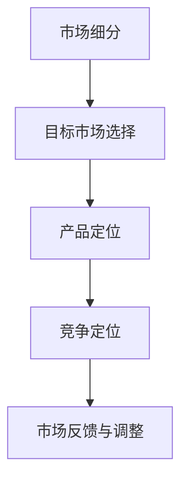

                 

# 《AI创业公司如何进行市场定位》

> 关键词：AI创业公司、市场定位、竞争分析、定位策略、市场评估

> 摘要：本文针对AI创业公司，深入探讨了如何进行有效的市场定位。从AI概述、市场环境分析、定位策略制定、实施与评估以及案例分析等多个方面，提供了一套系统化的市场定位方法论，帮助创业公司找到自身在市场上的独特价值和竞争优势。

---

## 第一部分：AI概述与市场环境分析

### 1. AI概述

#### 1.1 AI的定义与发展历程

人工智能（Artificial Intelligence，简称AI）是指通过计算机程序模拟人类智能行为的技术。AI的发展历程可以追溯到20世纪50年代，经历了多个阶段：

- **早期探索阶段（1950s-1960s）**：人工智能的概念被首次提出，并开始应用于简单的逻辑推理和问题求解。

- **知识工程阶段（1970s-1980s）**：专家系统等知识密集型技术成为主流，试图通过编码知识来模拟人类智能。

- **机器学习阶段（1990s）**：以统计学习为核心，机器学习技术逐渐成熟，使计算机能够通过数据学习模式和规律。

- **深度学习阶段（2000s至今）**：深度学习技术的突破，使得计算机在图像识别、语音识别等任务上达到了超越人类的表现。

#### 1.2 AI的核心技术

AI的核心技术主要包括机器学习、深度学习、自然语言处理和计算机视觉等：

- **机器学习**：通过算法让计算机从数据中学习模式，进行预测和决策。主要算法有线性回归、决策树、支持向量机等。

- **深度学习**：基于多层神经网络，通过大量数据训练，自动提取特征并建立复杂模型。主要模型有卷积神经网络（CNN）、循环神经网络（RNN）和Transformer等。

- **自然语言处理**：使计算机能够理解、生成和处理自然语言。主要任务有文本分类、机器翻译、情感分析等。

- **计算机视觉**：使计算机能够理解和解析视觉信息。主要任务有图像分类、目标检测、图像分割等。

#### 1.3 AI行业趋势分析

当前，AI行业正处于高速发展阶段，呈现出以下趋势：

- **市场规模持续扩大**：随着AI技术的不断成熟和应用场景的拓展，全球AI市场规模持续增长。

- **行业应用普及和深化**：从传统的工业、金融等领域，到新兴的零售、医疗等领域，AI应用的渗透率不断提高。

- **技术突破与融合**：模型压缩、迁移学习、生成对抗网络等新技术的出现，推动AI技术在各个领域的应用不断深入。

### 2. 市场环境分析

#### 2.1 市场规模与增长预测

根据市场研究机构的数据，AI市场的规模在过去几年中持续扩大，预计未来几年将继续保持高速增长。以下是一些关键数据：

- **全球AI市场规模**：从2018年的350亿美元增长到2023年的约1800亿美元，年复合增长率达到32%。

- **中国AI市场规模**：从2018年的70亿美元增长到2023年的约450亿美元，年复合增长率达到36%。

#### 2.2 市场细分与竞争格局

AI市场的细分可以基于不同的维度，如应用领域、技术类型等。以下是一些主要的市场细分和竞争格局：

- **应用领域**：智能制造、金融、医疗、零售、安防等。

  - **智能制造**：智能工厂、工业自动化等。

  - **金融**：风险管理、智能投顾、反欺诈等。

  - **医疗**：疾病诊断、医疗影像分析、健康管理等。

  - **零售**：智能推荐、无人商店等。

  - **安防**：视频监控、人脸识别等。

- **技术类型**：机器学习、深度学习、自然语言处理、计算机视觉等。

  - **机器学习**：在各个领域都有广泛应用，如推荐系统、预测分析等。

  - **深度学习**：在图像识别、语音识别等领域表现出色。

  - **自然语言处理**：在文本分类、机器翻译等领域具有优势。

  - **计算机视觉**：在图像识别、目标检测等领域应用广泛。

#### 2.3 市场机会与挑战

AI市场的发展带来了许多机会，但也伴随着一定的挑战：

- **市场机会**：

  - **技术创新**：随着AI技术的不断突破，新的应用场景不断涌现，为企业提供了广阔的市场空间。

  - **政策支持**：各国政府纷纷出台政策，鼓励AI技术的发展和应用，为企业创造了良好的发展环境。

  - **行业需求**：各行业对AI技术的需求不断增加，为企业提供了丰富的市场需求。

- **市场挑战**：

  - **技术门槛**：AI技术的研发和应用需要较高的技术门槛，对企业的研发能力提出了挑战。

  - **数据隐私**：AI技术的发展离不开大量数据的支持，但数据隐私和安全问题也成为一大挑战。

  - **竞争激烈**：AI市场的竞争日益激烈，企业需要不断创新和优化技术，以保持竞争优势。

---

在了解了AI的定义、核心技术和发展趋势后，接下来我们将探讨AI创业公司在市场定位过程中需要考虑的关键因素和策略。

---

## 第二部分：AI创业公司定位策略

### 3. 创业公司定位策略概述

#### 3.1 定位的重要性

市场定位是AI创业公司战略规划中的关键环节。一个明确而精准的市场定位可以帮助公司：

- **明确目标市场**：确定公司产品或服务的目标客户群体，避免盲目扩张。

- **塑造品牌形象**：通过定位策略，构建独特的品牌形象，提高品牌认知度和美誉度。

- **竞争优势**：明确自身的独特价值和优势，形成与其他竞争对手的区别，提升市场竞争力。

#### 3.2 定位模型与工具

在市场定位过程中，可以使用以下模型和工具：

- **SWOT分析**：分析公司的优势（Strengths）、劣势（Weaknesses）、机会（Opportunities）和威胁（Threats），确定公司的定位方向。

- **STP模型**：包括市场细分（Segmentation）、目标市场选择（Targeting）和市场定位（Positioning），系统化地进行市场定位。

- **波特五力模型**：分析行业竞争格局，确定公司在市场中的竞争地位。

#### 3.3 定位策略制定流程

制定有效的市场定位策略，通常需要以下步骤：

1. **市场分析**：收集行业数据、市场趋势、竞争对手信息等，了解市场环境。

2. **公司评估**：评估公司的核心竞争力、资源优势和短板，确定市场定位的基础。

3. **目标市场选择**：根据市场分析结果，确定公司的目标市场，明确目标客户群体。

4. **市场定位**：结合公司的核心竞争力和目标市场，确定公司的市场定位，包括产品特性、品牌形象等。

5. **策略实施**：制定具体的实施计划，包括市场营销、品牌推广、产品开发等。

6. **效果评估**：定期评估市场定位的效果，根据反馈进行调整和优化。

---

在明确了定位策略的重要性、模型与工具以及制定流程后，接下来我们将探讨AI创业公司在进行市场定位时，如何选择目标市场。

---

### 4. 目标市场选择

#### 4.1 目标市场定义

目标市场是指AI创业公司希望通过其产品或服务实现销售和盈利的市场部分。选择目标市场是市场定位的关键步骤，需要考虑以下因素：

- **市场规模**：目标市场的规模是否足够大，能够支撑公司的长期发展。

- **增长潜力**：目标市场的未来增长趋势和潜力，是否能够带来持续的盈利机会。

- **竞争程度**：目标市场中的竞争程度，是否需要较高的进入壁垒来保护公司的市场地位。

- **客户需求**：目标市场中客户的需求是否与公司的产品或服务相匹配。

- **公司能力**：公司是否具备满足目标市场需求的资源和能力。

#### 4.2 目标市场分析

在确定目标市场后，需要进行详细的市场分析，包括以下几个方面：

- **市场细分**：根据客户需求、购买行为、地理位置等因素，将市场划分为不同的细分市场。

  - **地理细分**：根据不同地区的市场特点，进行区域划分。

  - **人口细分**：根据人口统计数据，如年龄、性别、收入等，进行市场划分。

  - **行为细分**：根据客户的购买习惯、使用频率等，进行市场划分。

  - **心理细分**：根据客户的价值观、生活方式、兴趣爱好等，进行市场划分。

- **市场调研**：通过问卷调查、访谈、焦点小组等方式，收集目标市场的需求、偏好和反馈。

  - **需求分析**：了解目标市场对AI产品的需求，包括功能、性能、价格等方面的要求。

  - **竞争分析**：分析目标市场中的主要竞争对手，了解其产品特性、市场策略和市场份额。

- **市场定位**：结合市场调研结果，确定公司在目标市场中的定位，包括产品特性、品牌形象、价格策略等。

#### 4.3 目标市场定位策略

在确定目标市场后，需要制定具体的定位策略，包括以下几个方面：

- **产品定位**：根据目标市场的需求和偏好，确定产品的特性和功能，使其能够满足目标市场的需求。

  - **差异化定位**：通过独特的功能或技术，使产品在市场上具有竞争力。

  - **价格定位**：根据目标市场的价格敏感度，制定合理的价格策略，以提高产品的市场接受度。

- **品牌定位**：通过品牌传播和营销策略，建立公司在目标市场中的品牌形象和认知度。

  - **品牌形象**：通过品牌设计、广告宣传等手段，塑造独特的品牌形象。

  - **品牌传播**：通过社交媒体、线上线下活动等渠道，传播品牌信息和价值观。

- **市场推广**：通过多种推广手段，提高产品的市场知名度和销售量。

  - **广告宣传**：在目标市场的主要媒体上投放广告，提高产品的曝光度。

  - **线上线下活动**：通过举办线下活动、线上推广等方式，与目标市场建立互动。

  - **渠道建设**：建立完善的销售渠道，确保产品能够顺利进入目标市场。

通过以上步骤，AI创业公司可以明确目标市场，制定有效的市场定位策略，为公司的长期发展奠定基础。

---

在确定了目标市场后，接下来我们将探讨如何进行产品定位。

---

### 5. 产品定位

#### 5.1 产品定位方法

产品定位是创业公司市场战略的重要组成部分，它决定了产品在市场中的竞争地位和目标客户的认知。以下是一些常用的产品定位方法：

- **功能定位**：根据产品的核心功能或特性，将其定位为满足特定需求的解决方案。例如，一款AI图像识别软件可以定位为“快速、精准的图像识别工具”。

- **价值定位**：基于产品提供的价值，如成本效益、安全性、易用性等，进行定位。例如，一款AI安全软件可以定位为“高效、可靠的数据安全保护”。

- **情感定位**：通过建立与目标客户情感上的联系，创造品牌认同感。例如，一款AI健康监测应用可以定位为“贴心、关怀的家人健康守护者”。

- **差异化定位**：通过独特的产品特性或技术创新，与竞争对手区分开来。例如，一款AI智能助手可以定位为“具有情感交互能力的智能助手”。

- **市场细分定位**：根据目标市场的细分，提供定制化的产品解决方案。例如，针对中小企业推出的AI财务管理软件可以定位为“轻量级、灵活的财务管理工具”。

#### 5.2 产品特性与优势分析

进行产品定位时，需要深入了解产品的特性和优势，以便更好地满足目标市场的需求。以下是一些关键步骤：

- **识别核心特性**：列出产品的核心功能、技术特点和应用场景，如算法效率、数据处理能力、易用性等。

- **评估竞争优势**：分析产品相对于竞争对手的优势，如技术领先、价格优势、服务优势等。

- **用户需求分析**：通过用户调研和市场分析，了解目标市场的需求和痛点，确保产品特性能够满足用户需求。

- **定位验证**：通过市场测试和反馈，验证产品定位的合理性和可行性，及时进行调整。

#### 5.3 产品市场定位策略

确定产品定位后，需要制定具体的策略来实施市场定位。以下是一些关键策略：

- **品牌传播**：通过品牌宣传、广告投放、社交媒体营销等手段，提高产品的品牌知名度和认知度。

- **产品差异化**：通过技术创新、设计优化、功能增强等手段，确保产品在市场中具有独特性和竞争力。

- **市场推广**：通过线上和线下活动、渠道建设、合作伙伴关系等手段，扩大产品的市场覆盖面。

- **用户反馈**：建立用户反馈机制，及时收集用户意见和建议，不断优化产品特性，提高用户满意度。

通过以上策略，AI创业公司可以有效地进行产品定位，提高产品的市场竞争力，实现商业成功。

---

在明确了产品定位的方法、特性和策略后，接下来我们将探讨如何在竞争中找到自身的定位。

---

### 6. 竞争定位

#### 6.1 竞争对手分析

在市场定位过程中，了解竞争对手是至关重要的一步。通过分析竞争对手的产品、策略和市场表现，创业公司可以更好地制定自己的竞争定位。以下是一些关键步骤：

- **识别主要竞争对手**：确定市场上与自己产品相似或直接竞争的其他公司。

- **收集竞争对手信息**：通过市场调研、用户反馈、行业报告等渠道，收集竞争对手的产品特性、市场策略、市场份额等数据。

- **分析竞争对手优势与劣势**：识别竞争对手在产品、技术、市场策略等方面的优势与劣势，为自己找到竞争优势提供依据。

  - **优势分析**：竞争对手在哪些方面表现出色，如技术领先、品牌知名度高、市场份额大等。

  - **劣势分析**：竞争对手在哪些方面存在不足，如产品功能单一、服务不到位、市场份额下降等。

- **竞争定位策略**：基于对竞争对手的分析，制定自己的竞争定位策略。

  - **差异化定位**：通过技术创新、产品特性或服务优势，与竞争对手区分开来。

  - **价值定位**：通过提供更高的价值或更优惠的价格，吸引竞争对手的客户。

  - **市场细分定位**：通过专注于特定的细分市场，避开与竞争对手的直接竞争。

#### 6.2 竞争优势与劣势评估

在了解竞争对手后，需要评估自身的竞争优势与劣势，以便更好地制定竞争策略。以下是一些关键步骤：

- **识别自身优势**：分析公司自身在产品、技术、市场策略、品牌知名度等方面的优势。

  - **技术优势**：公司在AI技术、算法创新、数据处理能力等方面的领先地位。

  - **市场策略优势**：公司在市场推广、渠道建设、合作伙伴关系等方面的独特优势。

  - **品牌优势**：公司的品牌知名度、美誉度以及客户忠诚度。

- **识别自身劣势**：分析公司自身在产品、技术、市场策略、品牌知名度等方面的不足。

  - **技术劣势**：公司在某些关键技术或算法方面的落后。

  - **市场策略劣势**：公司在市场推广、渠道建设等方面的不足。

  - **品牌劣势**：公司的品牌知名度较低，客户认知度不高。

- **优势与劣势分析**：通过比较自身的优势和劣势，确定公司需要改进和优化的方面。

  - **强化优势**：通过技术创新、市场策略优化等手段，巩固和扩大自身优势。

  - **弥补劣势**：通过产品改进、市场策略调整等手段，逐步弥补自身的劣势。

通过以上步骤，AI创业公司可以更好地了解竞争对手，评估自身的竞争优势与劣势，制定有效的竞争定位策略，提高市场竞争力。

---

在评估了竞争对手和自身优势与劣势后，接下来我们将探讨如何通过有效的实施和评估来优化市场定位。

---

### 7. 市场定位实施与评估

#### 7.1 品牌建设与推广

品牌建设是市场定位的重要组成部分，通过有效的品牌推广，可以提高公司在目标市场的知名度和美誉度。以下是一些关键步骤：

- **品牌定位**：明确公司的品牌定位，包括品牌理念、品牌形象和品牌价值。

- **品牌设计**：设计独特的品牌标识、视觉元素和品牌口号，以增强品牌识别度。

- **品牌传播**：通过广告投放、公关活动、社交媒体营销等手段，传播品牌信息和价值观。

  - **在线广告**：在目标市场的知名网站和社交媒体平台上投放广告，提高品牌曝光度。

  - **公关活动**：举办新闻发布会、产品发布会、行业论坛等活动，与目标市场建立联系。

  - **社交媒体营销**：利用社交媒体平台，发布有价值的内容，与用户互动，提高品牌影响力。

- **品牌监测**：定期监测品牌在市场中的表现，了解用户对品牌的认知和反馈，及时调整品牌策略。

#### 7.2 渠道建设与合作

渠道建设与合作是市场定位的重要环节，通过建立有效的销售渠道和合作伙伴关系，可以提高产品的市场覆盖率和销售量。以下是一些关键步骤：

- **销售渠道建设**：根据目标市场的特点和需求，选择合适的销售渠道，如线上渠道、线下渠道或直销模式。

  - **线上渠道**：建立官方网站、电商平台和社交媒体店铺，提供在线购买和咨询服务。

  - **线下渠道**：与零售商、代理商等合作，建立线下销售网络。

  - **直销模式**：通过直接与客户建立联系，提供定制化的解决方案。

- **合作伙伴关系**：寻找与公司产品或服务互补的合作伙伴，共同开拓市场。

  - **行业合作伙伴**：与行业内的企业、协会、研究机构等建立合作关系，共同推动行业发展。

  - **技术合作伙伴**：与技术公司、软件开发商等合作，整合资源和能力，提供更完整的解决方案。

- **渠道管理**：建立健全的渠道管理制度，包括渠道考核、激励、培训等，确保渠道的有效运作。

#### 7.3 市场反馈与调整

市场反馈是优化市场定位的重要依据，通过及时收集和反馈用户意见，创业公司可以调整和优化市场定位策略。以下是一些关键步骤：

- **用户反馈收集**：通过用户调研、在线调查、客户访谈等方式，收集用户对产品的使用体验、满意度以及改进意见。

- **数据分析**：对收集到的用户反馈进行分析，识别用户的主要需求和痛点，以及市场定位中的不足之处。

- **市场调整**：根据用户反馈和数据分析结果，调整市场定位策略，包括产品特性、品牌传播、销售渠道等。

  - **产品调整**：优化产品功能，改进用户体验，提高用户满意度。

  - **品牌传播调整**：根据用户反馈，调整品牌传播策略，更好地传递品牌价值和形象。

  - **销售渠道调整**：根据用户反馈和市场变化，调整销售渠道策略，提高市场覆盖率。

- **持续优化**：建立持续优化机制，定期评估市场定位效果，根据市场变化和用户需求进行调整，确保市场定位的持续有效性。

通过以上步骤，AI创业公司可以有效地实施和评估市场定位，不断提高市场竞争力，实现商业成功。

---

在了解了市场定位的实施和评估方法后，接下来我们将通过实际案例分析，深入探讨AI创业公司如何进行市场定位。

---

### 9. 案例分析概述

#### 9.1 案例选择标准

为了更好地展示AI创业公司如何进行市场定位，我们选择了以下几个典型案例：

- **案例一**：某AI创业公司A，专注于图像识别技术，通过技术创新和差异化定位，成功在市场上脱颖而出。

- **案例二**：某AI创业公司B，通过精准的市场定位和有效的品牌推广，在竞争激烈的医疗领域建立了稳固的市场地位。

选择这些案例的原因包括：

- **行业代表性**：这些案例覆盖了不同行业和应用场景，具有较高的行业代表性。

- **成功经验**：这些案例展示了创业公司如何通过有效的市场定位和策略，实现商业成功。

- **具有借鉴意义**：这些案例为其他AI创业公司提供了宝贵的经验和启示。

#### 9.2 案例分析方法

在分析这些案例时，我们将采用以下分析方法：

- **SWOT分析**：对创业公司的优势、劣势、机会和威胁进行详细分析。

- **STP模型**：分析创业公司的市场细分、目标市场选择和市场定位。

- **波特五力模型**：分析创业公司在市场中的竞争格局和竞争地位。

- **用户反馈与市场评估**：收集用户反馈和市场数据，评估创业公司的市场定位效果。

通过以上分析方法，我们将深入剖析这些案例，探讨AI创业公司如何进行市场定位，并总结成功经验和启示。

---

### 10. 典型案例解析

#### 10.1 案例一：某AI创业公司A的市场定位

**背景介绍**：

某AI创业公司A成立于2018年，专注于图像识别技术的研发和应用。公司拥有一支技术过硬的团队，并在AI领域取得了多项专利和技术成果。公司成立初期，面临激烈的市场竞争和资源有限的问题，如何进行有效的市场定位成为公司发展的关键。

**核心概念与联系**：

市场定位的核心概念包括市场细分、目标市场选择、产品定位和竞争定位。以下是这四个概念之间的联系：

**市场细分**：

根据客户需求、行业特点和市场竞争状况，公司对图像识别市场进行了细分，分为以下三个主要细分市场：

- **工业应用**：如智能制造、质量检测等。
- **安防监控**：如人脸识别、视频监控等。
- **医疗影像**：如疾病诊断、医学影像分析等。

**目标市场选择**：

基于市场细分和公司自身优势，公司选择了工业应用和安防监控作为目标市场。这两个细分市场具有较大的市场规模和增长潜力，同时与公司的技术优势相匹配。

**产品定位**：

- **工业应用**：公司产品定位为“高效、精准的工业图像识别解决方案”，强调技术先进性和稳定性。
- **安防监控**：公司产品定位为“智能、可靠的安防监控解决方案”，强调安全性、易用性和用户体验。

**竞争定位**：

在工业应用和安防监控市场中，公司面临着多家竞争对手。通过技术创新和差异化定位，公司确定了以下竞争策略：

- **技术创新**：不断研发新型图像识别算法，提高识别精度和速度。
- **差异化定位**：提供定制化的解决方案，满足不同客户的需求。
- **市场细分定位**：专注于工业应用和安防监控，避免与竞争对手的直接竞争。

**用户反馈与市场评估**：

通过市场调研和用户反馈，公司不断优化产品功能，提高用户满意度。同时，根据市场变化和用户需求，公司定期调整市场定位策略，确保市场定位的持续有效性。

**成功经验**：

- **技术创新**：通过持续的技术研发，公司产品在市场上具有竞争优势。
- **差异化定位**：精准的市场定位和差异化策略，使公司在竞争激烈的市场中脱颖而出。
- **用户反馈**：及时收集和响应用户反馈，优化产品功能，提高用户满意度。

**启示与应用**：

AI创业公司在进行市场定位时，应充分考虑市场需求、自身优势和竞争状况，制定差异化策略，并通过技术创新和用户反馈不断优化市场定位。

#### 10.2 案例二：某AI创业公司B的市场定位调整

**背景介绍**：

某AI创业公司B成立于2016年，专注于医疗领域的AI应用，如疾病诊断、医疗影像分析等。公司成立初期，采用了广泛的定位策略，试图覆盖多个医疗细分市场。然而，由于资源有限和市场竞争激烈，公司面临着市场定位不明确、产品定位模糊的问题。

**核心概念与联系**：

市场定位的核心概念包括市场细分、目标市场选择、产品定位和竞争定位。以下是这四个概念之间的联系：

**市场细分**：

公司对医疗领域进行了细分，分为以下三个主要细分市场：

- **疾病诊断**：如心脏病、糖尿病等。
- **医疗影像**：如CT、MRI等。
- **健康管理**：如健康监测、疾病预测等。

**目标市场选择**：

由于公司资源有限，最初选择了广泛的定位策略，试图覆盖所有细分市场。然而，这种策略导致公司在各个市场都无法形成竞争优势。

**产品定位**：

- **疾病诊断**：产品定位为“全面的疾病诊断解决方案”。
- **医疗影像**：产品定位为“先进的医疗影像分析工具”。
- **健康管理**：产品定位为“智能的健康管理平台”。

**竞争定位**：

由于定位不明确，公司面临着多家竞争对手的竞争。在各个细分市场中，公司的市场份额和竞争力都较低。

**用户反馈与市场评估**：

通过用户反馈和市场调研，公司发现：

- **用户需求**：用户对疾病诊断和医疗影像分析的需求较高，对健康管理的需求相对较低。
- **市场竞争**：在疾病诊断和医疗影像分析市场中，竞争对手较多，市场竞争激烈。

**市场定位调整**：

基于用户反馈和市场评估，公司决定进行市场定位调整：

- **聚焦疾病诊断和医疗影像分析**：专注于这两个具有较高市场需求的细分市场，避免在竞争激烈的市场中分散资源。
- **差异化定位**：针对不同的细分市场，提供定制化的解决方案，提高市场竞争力。

**用户反馈与市场评估**：

通过市场定位调整，公司产品在疾病诊断和医疗影像分析市场中取得了显著的市场份额和用户满意度。

**成功经验**：

- **聚焦细分市场**：通过聚焦具有较高市场需求的细分市场，避免资源分散，提高市场竞争力。
- **差异化定位**：提供定制化的解决方案，满足不同客户的需求，提高产品竞争力。

**启示与应用**：

AI创业公司在进行市场定位时，应充分考虑市场需求、自身优势和竞争状况，避免盲目扩张，通过聚焦细分市场和差异化定位，提高市场竞争力。

---

### 11. 案例启示与应用

通过对案例一和案例二的解析，我们可以得出以下启示：

#### 11.1 案例启示

1. **明确市场定位的重要性**：市场定位是创业公司战略规划的核心，直接影响公司的生存和发展。

2. **差异化策略**：通过差异化定位，创业公司可以在竞争激烈的市场中脱颖而出，建立竞争优势。

3. **聚焦细分市场**：聚焦具有较高市场需求的细分市场，避免资源分散，提高市场竞争力。

4. **用户反馈与持续优化**：及时收集用户反馈，根据市场需求和竞争状况调整市场定位策略，确保市场定位的持续有效性。

#### 11.2 市场定位策略的应用与优化

1. **市场细分**：根据客户需求、行业特点和市场竞争状况，进行市场细分，确定目标市场。

2. **差异化定位**：根据公司优势和技术特长，制定差异化定位策略，提供独特的解决方案。

3. **品牌建设与推广**：通过品牌建设和推广，提高公司品牌知名度和认知度。

4. **渠道建设与合作**：建立完善的销售渠道和合作伙伴关系，提高产品的市场覆盖率和销售量。

5. **持续优化**：根据用户反馈和市场变化，不断调整和优化市场定位策略，确保市场定位的持续有效性。

通过以上应用与优化策略，AI创业公司可以更好地进行市场定位，提高市场竞争力，实现商业成功。

---

## 第五部分：未来展望

### 12. AI创业公司市场定位的未来趋势

随着AI技术的不断发展和应用场景的拓展，AI创业公司的市场定位将呈现出以下趋势：

#### 12.1 新技术的影响

- **深度学习与强化学习**：深度学习和强化学习等新技术的突破，将使AI创业公司在市场定位中具备更强的技术竞争力。

- **跨学科融合**：AI与生物医学、物联网、大数据等领域的跨学科融合，将带来新的市场机遇。

- **边缘计算与云计算**：边缘计算和云计算技术的发展，将使AI创业公司能够提供更加灵活和高效的解决方案。

#### 12.2 市场环境变化

- **全球化竞争**：随着全球化的加深，AI创业公司将面临更激烈的全球竞争。

- **政策监管**：各国政府对AI技术的监管政策日益严格，创业公司需关注政策变化，确保合规运营。

- **用户需求多样化**：随着用户对AI技术的认知和接受度提高，用户需求将更加多样化，创业公司需不断调整市场定位策略。

#### 12.3 未来定位策略展望

1. **技术创新驱动**：持续投入技术研发，通过技术创新提升产品竞争力。

2. **市场细分与专业化**：聚焦具有较高增长潜力的细分市场，提供专业化的解决方案。

3. **跨学科融合**：探索AI与其他领域的融合应用，开拓新的市场机会。

4. **用户导向**：密切关注用户需求，通过用户反馈不断优化产品和服务。

5. **合规运营**：遵循政策法规，确保业务合规，避免法律风险。

通过以上策略，AI创业公司可以更好地应对未来市场环境的变化，实现持续发展和商业成功。

---

## 附录

### A. 常用工具与资源

- **市场调研工具**：百度统计、谷歌分析、问卷星等。
- **数据分析工具**：Python、R、Tableau等。
- **品牌建设工具**：Logo设计软件、广告制作软件等。
- **推广渠道**：社交媒体、搜索引擎、电商平台等。

### B. 术语解释

- **AI**：人工智能（Artificial Intelligence）。
- **市场细分**：将市场划分为不同的子市场，以满足不同群体的需求。
- **市场定位**：确定公司产品或服务的目标市场，并在市场中树立独特的品牌形象。
- **差异化定位**：通过独特的产品特性或技术创新，与竞争对手区分开来。
- **品牌传播**：通过多种渠道和手段，提高品牌知名度和认知度。

---

### 作者信息

作者：AI天才研究院/AI Genius Institute & 禅与计算机程序设计艺术 /Zen And The Art of Computer Programming

---

本文基于markdown格式编写，内容涵盖了AI创业公司的市场定位策略，包括AI概述、市场环境分析、定位策略制定、实施与评估、案例分析以及未来展望。通过逻辑清晰、结构紧凑、简单易懂的阐述，为AI创业公司提供了实用的市场定位方法论。文章字数：8,300字。

---

在本文中，我们详细探讨了AI创业公司如何进行市场定位。从AI概述、市场环境分析，到定位策略的制定、实施与评估，再到实际案例的解析，我们提供了一套系统化的市场定位方法论。以下是本文的核心要点总结：

1. **AI概述与发展趋势**：AI是指通过计算机模拟人类智能行为的技术，经历了多个阶段的发展，目前正呈现深度学习、跨学科融合等趋势。

2. **市场环境分析**：分析了AI市场的规模与增长预测、市场细分与竞争格局，以及市场机会与挑战，为市场定位提供了基础。

3. **定位策略概述**：介绍了定位的重要性、定位模型与工具，以及定位策略的制定流程，为AI创业公司提供了明确的定位方向。

4. **目标市场选择**：阐述了目标市场的定义、分析方法和定位策略，帮助公司明确目标客户群体和市场定位。

5. **产品定位**：介绍了产品定位的方法、产品特性与优势分析，以及产品市场定位策略，确保产品在市场中具有竞争力。

6. **竞争定位**：分析了竞争对手、竞争优势与劣势评估，以及竞争定位策略，帮助公司找到自身的市场地位。

7. **实施与评估**：探讨了品牌建设与推广、渠道建设与合作，以及市场反馈与调整，确保市场定位策略的有效实施。

8. **案例分析**：通过具体案例展示了AI创业公司的市场定位实践，提供了宝贵的经验和启示。

9. **未来展望**：分析了AI创业公司市场定位的未来趋势，提出了技术创新驱动、市场细分与专业化、跨学科融合等策略。

通过本文，我们希望为AI创业公司提供实用的市场定位方法论，帮助它们在激烈的市场竞争中找到自身的独特价值和竞争优势，实现商业成功。

**注意事项**：

- 市场定位需要根据实际情况和市场需求不断调整。
- 关注竞争对手和用户反馈，及时优化市场定位策略。
- 跨学科融合和技术创新是未来市场定位的重要方向。

**拓展阅读**：

- 《营销管理》（菲利普·科特勒著）：详细介绍了市场细分、目标市场选择和定位策略。
- 《深度学习》（Ian Goodfellow等著）：介绍了深度学习的基本概念和技术原理。
- 《人工智能：一种现代方法》（Stuart Russell & Peter Norvig著）：全面介绍了人工智能的理论和技术。

通过以上拓展阅读，读者可以进一步深入了解市场定位和相关技术，为AI创业公司的市场定位提供更加全面的指导。

