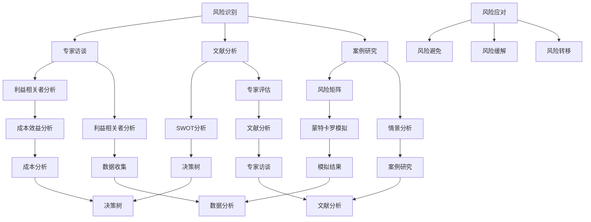

                 

## 文章标题：AI创业公司的人工智能伦理建设

### 关键词：
- AI创业公司
- 人工智能伦理
- 伦理原则
- 风险评估
- 法律法规

### 摘要：
本文深入探讨了AI创业公司在发展过程中面临的伦理挑战及其重要性。通过分析伦理原则、风险评估方法、法律法规以及伦理教育，本文为AI创业公司提供了全面的伦理建设指南，旨在推动人工智能产业的健康发展。

## 第一部分：引言与基础理论

### 第1章：引言

#### 1.1 AI创业公司的伦理挑战

随着人工智能技术的迅猛发展，AI创业公司如雨后春笋般涌现。这些公司利用AI技术来推动业务创新，提升效率，优化用户体验。然而，在追求技术突破和商业成功的同时，AI创业公司也面临着诸多伦理挑战。

首先，数据的隐私和安全问题日益突出。AI系统依赖于大量的数据，这些数据往往涉及用户的个人信息，如何保护用户隐私成为一个严峻的挑战。其次，算法的公平性和透明性问题引起了广泛关注。一些AI算法可能存在歧视性，导致不公平的结果，这不仅损害了企业的声誉，也可能引发法律纠纷。此外，AI技术的快速迭代和应用，使得企业在伦理决策上面临压力，如何在技术创新和伦理责任之间找到平衡点，也成为AI创业公司必须面对的问题。

#### 1.2 伦理建设的重要性

伦理建设对于AI创业公司至关重要。首先，良好的伦理体系有助于提升企业的社会责任感，增强公众对AI技术的信任。其次，伦理建设有助于预防法律风险，避免因伦理问题导致的诉讼和罚款。此外，伦理建设还可以提高员工的道德素养，促进团队协作，从而推动企业的可持续发展。

伦理建设不仅仅是技术问题，更是一种企业文化的体现。通过建立明确的伦理原则和制度，AI创业公司可以确保在技术创新的过程中，始终坚持以人为本，尊重用户权益，推动技术的健康发展。

### 目录大纲设计

为了帮助AI创业公司更好地进行伦理建设，本文设计了以下目录大纲：

#### 第一部分：引言与基础理论
- **第1章：引言**
  - 1.1 AI创业公司的伦理挑战
  - 1.2 伦理建设的重要性

#### 第二部分：伦理原则与框架
- **第2章：人工智能伦理原则**
  - 2.1 责任原则
  - 2.2 公平原则
  - 2.3 尊重隐私原则
  - 2.4 可解释性原则

#### 第三部分：伦理风险评估与治理
- **第3章：伦理风险评估方法**
  - 3.1 风险识别
  - 3.2 风险评估工具

#### 第四部分：伦理实践案例
- **第4章：创业公司AI伦理实践案例**
  - 4.1 数据隐私保护
  - 4.2 算法歧视问题
  - 4.3 AI透明性与可解释性

#### 第五部分：法律法规与政策
- **第5章：相关法律法规**
  - 5.1 数据保护法规
  - 5.2 算法歧视法规

#### 第六部分：未来趋势与展望
- **第6章：未来趋势与挑战**
  - 6.1 人工智能伦理的未来趋势
  - 6.2 伦理建设面临的挑战

#### 第七部分：伦理教育与培训
- **第7章：伦理教育与培训**
  - 7.1 创业公司伦理教育的重要性
  - 7.2 伦理培训方案

#### 附录
- **附录A：参考文献与资源**
- **附录B：Mermaid流程图**

通过以上大纲，本文将逐步深入探讨AI创业公司伦理建设的各个方面，为读者提供实用的指导和深刻的见解。

### 第1章：引言

#### 1.1 AI创业公司的伦理挑战

人工智能（AI）技术的飞速发展给创业公司带来了前所未有的机遇。AI技术可以显著提升业务效率，优化用户体验，推动创新。例如，通过自然语言处理（NLP）技术，创业公司可以提供更智能的客户服务；通过机器学习（ML）算法，公司可以更精准地预测市场需求，从而制定更有效的营销策略。

然而，AI技术的高速发展也带来了许多伦理挑战，这些挑战主要源于以下几个方面：

**数据隐私和安全**：
AI系统通常需要处理大量数据，包括用户的个人信息。这些数据可能包括姓名、地址、联系方式，甚至更敏感的财务信息或健康数据。如何保护这些数据不被滥用或泄露，是一个重大的伦理挑战。特别是随着欧盟《通用数据保护条例》（GDPR）和加州《消费者隐私法案》（CCPA）等法规的实施，创业公司必须确保遵守数据保护法规，否则将面临高昂的法律成本和声誉损失。

**算法公平性和透明性**：
算法的公平性和透明性是另一个备受关注的伦理问题。AI算法可能会基于历史数据做出决策，而这些数据可能包含偏见。例如，如果招聘算法在历史上只雇佣了某一性别或种族的员工，那么这个算法可能会在未来的招聘决策中表现出性别或种族歧视。此外，算法的透明性也是一个问题，因为很多复杂的AI系统，如深度学习模型，其内部工作机制往往不透明，这使得外部用户难以理解其决策过程。

**责任归属**：
当AI系统导致不良后果时，责任归属问题变得尤为复杂。例如，自动驾驶汽车发生事故，责任应该归咎于谁——是制造商、软件开发者，还是用户？这种责任归属的不确定性使得企业在开发和部署AI系统时面临额外的风险。

**伦理决策**：
在快速变化的技术环境中，创业公司需要做出一系列伦理决策。例如，是否应该开发某种可能对社会产生负面影响的技术？如何在技术创新和伦理责任之间找到平衡点？这些问题需要公司在决策过程中充分考虑伦理因素。

#### 1.2 伦理建设的重要性

伦理建设对于AI创业公司至关重要，具体体现在以下几个方面：

**增强公众信任**：
随着AI技术的普及，公众对AI系统的信任度日益成为关键因素。一个具有良好伦理体系的公司，能够赢得公众的信任，从而在市场竞争中占据优势。

**预防法律风险**：
遵守伦理原则有助于预防法律风险。许多国家和地区已经制定了相关的数据保护法规和算法歧视法规，如GDPR和CCPA。这些法规要求企业在处理用户数据和使用AI算法时必须遵守特定规范，否则将面临严重的法律后果。

**提高员工道德素养**：
一个重视伦理建设的公司，能够培养员工的道德素养。这不仅有助于提升团队协作和员工满意度，还能够促进公司的可持续发展。

**促进技术创新**：
良好的伦理体系可以为技术创新提供指导，确保技术在发展过程中不偏离正确的方向。例如，通过建立透明的算法和可解释的AI系统，公司可以在提高技术效率的同时，增强用户对技术的信任。

**增强竞争力**：
在高度竞争的市场环境中，拥有强大伦理体系的公司能够在客户和投资者中树立良好的形象，从而提高市场竞争力。

总之，伦理建设不仅是AI创业公司应对伦理挑战的一种手段，更是公司长期发展的重要基石。通过建立和维护一个全面的伦理体系，AI创业公司不仅能够确保技术的合法合规，还能够赢得社会各界的信任和支持。

### 第二部分：伦理原则与框架

#### 第2章：人工智能伦理原则

在探讨AI创业公司的伦理建设时，明确和遵循伦理原则是至关重要的。这些原则为企业在开发和应用AI技术时提供了指导，确保技术进步不会以牺牲社会价值和伦理标准为代价。以下是几个核心的伦理原则：

##### 2.1 责任原则

**2.1.1 责任的定义**

责任原则是AI伦理的核心，它强调开发者和企业在设计、开发和部署AI系统时，必须承担相应的责任。责任不仅包括技术层面的责任，还涵盖了对用户、社会和环境的责任。具体来说，责任原则要求企业做到以下几点：

- **透明度**：企业应明确告知用户其数据的使用方式和目的，确保用户对AI系统的运作有充分的了解。
- **可追溯性**：企业应记录AI系统的开发、测试和部署过程，以便在出现问题时能够追溯责任。
- **可控性**：企业应确保AI系统能够被有效控制和监督，防止意外或不良行为的产生。

**2.1.2 责任分配**

在AI系统中，责任的分配是一个复杂的问题。通常，责任可以分为以下几个方面：

- **开发者**：开发者负责确保AI系统的安全性和有效性，避免因技术失误导致的不良后果。
- **用户**：用户在使用AI系统时，应承担合理的使用责任，遵守相关法律法规和平台规则。
- **监管机构**：监管机构负责监督AI系统的合法性和合规性，确保其在社会环境中不会产生负面影响。

**案例**：例如，自动驾驶汽车的开发者需要确保车辆的自动驾驶系统能够在各种复杂环境中安全运行，而用户则需要遵守交通规则，确保自身和他人的安全。

##### 2.2 公平原则

**2.2.1 公平性的含义**

公平原则要求AI系统在处理信息和做出决策时，不应受到种族、性别、年龄等非相关因素的干扰。公平性包括以下几个方面：

- **无偏见**：AI系统应避免基于历史偏见做出决策。
- **公正**：AI系统应确保所有用户在同等条件下受到公正对待。
- **平等**：AI系统应提供平等的机会和资源，不应因用户的身份特征而进行区别对待。

**2.2.2 算法公平性的评估方法**

为了确保AI系统的公平性，企业可以采用以下评估方法：

- **多样性数据集**：使用包含多种人口统计特征的数据集进行训练，以减少算法的偏见。
- **偏差检测与修正**：通过算法检测和修正潜在的不公平性。
- **透明性**：确保算法的决策过程是可解释的，用户能够理解AI系统的决策逻辑。

**案例**：例如，金融机构在贷款审批过程中使用AI算法，应确保算法不会因申请者的种族或性别而对其贷款决策产生影响。

##### 2.3 尊重隐私原则

**2.3.1 隐私权的重要性**

尊重隐私原则是AI伦理中的一个关键方面，特别是在涉及大量个人数据的AI应用中。隐私权是每个人的基本权利，企业必须确保在处理用户数据时尊重这一权利。

**2.3.2 隐私保护的技术手段**

为了保护用户隐私，企业可以采取以下技术手段：

- **数据匿名化**：通过匿名化技术，将个人身份信息从数据中移除。
- **加密**：使用加密技术保护数据在传输和存储过程中的安全性。
- **访问控制**：实施严格的访问控制策略，确保只有授权人员才能访问敏感数据。

**案例**：例如，医疗保健公司使用AI技术进行患者数据分析时，必须确保患者的医疗记录得到严格保护，防止数据泄露。

##### 2.4 可解释性原则

**2.4.1 可解释性的需求**

可解释性原则要求AI系统的决策过程是可理解和可解释的。这对于建立用户对AI系统的信任至关重要，特别是在涉及到重大决策和敏感信息时。

**2.4.2 提高算法可解释性的方法**

为了提高算法的可解释性，企业可以采用以下方法：

- **可视化**：使用图形和图表展示算法的决策过程。
- **解释性算法**：选择或开发具有高可解释性的算法。
- **透明性协议**：建立透明性协议，确保AI系统的决策逻辑对外部监督者是可理解的。

**案例**：例如，金融机构在评估贷款申请时，应确保其AI系统能够清晰地解释其决策过程，以便贷款申请者了解为何获得批准或拒绝。

通过以上几个核心伦理原则的遵循和实施，AI创业公司可以在技术创新的同时，确保其行为符合社会伦理标准，推动AI技术的健康发展。

### 第3章：伦理风险评估方法

在AI创业公司的发展过程中，伦理风险评估是确保技术进步与道德责任相符的关键步骤。通过系统的风险评估，企业可以识别潜在的伦理风险，并采取适当的措施进行管理和控制。

#### 3.1 风险识别

**3.1.1 风险识别的过程**

风险识别是伦理风险评估的第一步，其核心目标是发现所有可能影响AI系统的伦理问题。具体过程如下：

1. **背景调查**：收集与AI系统相关的背景信息，包括技术细节、应用场景、涉及的数据类型等。
2. **专家访谈**：与伦理学家、法律专家、用户代表等各方进行访谈，了解他们的观点和担忧。
3. **文献分析**：研究相关的学术论文、行业报告和法律法规，以识别潜在的风险。
4. **案例研究**：分析其他公司因伦理问题而面临的挑战和解决方案，从中吸取教训。

**3.1.2 风险识别的工具**

为了高效地识别风险，企业可以采用以下工具：

- **SWOT分析**：通过分析AI系统的优势、劣势、机会和威胁，识别潜在的伦理风险。
- **利益相关者分析**：识别所有利益相关者，包括用户、员工、监管机构等，分析他们对AI系统的期望和担忧。
- **流程图**：通过流程图展示AI系统的各个环节，识别可能的风险点。

#### 3.2 风险评估工具

**3.2.1 定量风险评估方法**

定量风险评估方法通过量化的指标来评估风险的概率和影响，为企业提供决策依据。以下是几种常用的定量风险评估方法：

- **风险矩阵**：通过风险矩阵，将风险的概率和影响进行量化，并计算总风险值。
- **成本效益分析**：评估实施伦理措施所需的成本与潜在收益，以确定最佳解决方案。
- **蒙特卡罗模拟**：通过模拟多次实验，评估不同策略下的风险分布和预期收益。

**3.2.2 定性风险评估方法**

定性风险评估方法侧重于风险的性质和影响，通过专家判断和讨论来评估风险。以下是几种常见的定性风险评估方法：

- **专家评估**：邀请多位专家对风险进行评估，综合他们的意见得出结论。
- **情景分析**：构建多个可能的未来情景，分析每种情景下的风险。
- **决策树**：通过决策树展示不同决策路径的风险和结果，帮助决策者做出明智的选择。

通过定性和定量的结合，企业可以全面评估AI系统的伦理风险，并制定有效的风险管理策略。具体步骤如下：

1. **风险识别**：使用上述工具和方法识别所有潜在风险。
2. **风险评估**：结合定量和定性方法，对每个风险进行评估，确定其严重性和发生概率。
3. **风险应对**：针对识别出的风险，制定应对策略，包括风险避免、风险缓解和风险转移等。
4. **监控与更新**：定期监控风险的变化，及时更新风险评估结果和应对措施。

通过系统的伦理风险评估方法，AI创业公司可以在技术创新的过程中，确保其行为符合伦理标准和法律法规，推动AI技术的健康发展。

### 第4章：创业公司AI伦理实践案例

在AI创业公司的实际运营中，伦理问题不仅是一个理论讨论的话题，更是需要通过具体案例来分析和解决的现实挑战。以下是几个典型的AI伦理实践案例，通过分析这些案例，可以更好地理解AI创业公司在伦理建设过程中如何应对各种挑战。

#### 4.1 案例一：数据隐私保护

**4.1.1 案例背景**

某AI创业公司开发了一款面向医疗领域的AI诊断系统，该系统能够通过分析患者病历数据，提供疾病诊断建议。然而，由于医疗数据的高度敏感性，数据隐私保护成为该公司面临的首要伦理挑战。

**4.1.2 伦理挑战**

1. **数据采集和使用透明度**：患者对其个人医疗数据的使用和目的缺乏了解，如何确保透明度？
2. **数据泄露风险**：如何防止医疗数据在传输和存储过程中被泄露？
3. **用户同意**：如何在法律框架内获得患者对数据使用的明确同意？

**4.1.3 解决方案**

1. **数据匿名化**：在数据收集阶段，通过去标识化等技术手段，将患者身份信息从数据中移除，确保数据匿名化。
2. **加密技术**：在数据传输和存储过程中，采用高级加密技术，确保数据的安全性和完整性。
3. **用户知情同意**：通过设计用户友好的界面，详细说明数据使用的目的和方式，并要求患者签署电子同意书。

通过上述措施，该公司不仅保护了患者的隐私，还增强了用户对AI诊断系统的信任，从而提升了产品的市场竞争力。

#### 4.2 案例二：算法歧视问题

**4.2.1 案例背景**

一家AI创业公司开发了一款人力资源管理系统，用于自动化招聘流程。然而，在算法训练过程中，该系统在历史数据中检测到性别和种族的偏见，导致招聘决策存在歧视。

**4.2.2 伦理挑战**

1. **算法偏见**：如何确保AI算法在决策过程中不存在偏见？
2. **公平性评估**：如何评估算法的公平性，并采取纠正措施？
3. **透明性和可解释性**：如何提高算法的透明性，让用户理解决策过程？

**4.2.3 解决方案**

1. **多样性数据集**：在算法训练阶段，使用包含多种人口统计特征的数据集，减少算法偏见。
2. **公平性评估工具**：采用偏差检测工具，定期评估算法的公平性，并在检测到偏见时进行调整。
3. **透明性协议**：开发透明性协议，确保算法的决策过程对外部监督者是可解释的。

通过上述措施，该公司成功消除了算法中的偏见，提高了招聘决策的公平性，从而赢得了用户的信任和好评。

#### 4.3 案例三：AI透明性与可解释性

**4.3.1 案例背景**

一家AI创业公司开发了一款面向金融行业的风险评估系统。然而，由于系统内部使用复杂的深度学习模型，决策过程对用户不透明，引发了用户对系统公正性的质疑。

**4.3.2 伦理挑战**

1. **算法可解释性**：如何提高算法的可解释性，让用户理解决策依据？
2. **用户信任**：如何增强用户对AI系统的信任？
3. **监管合规**：如何满足监管机构对AI系统的透明性要求？

**4.3.3 解决方案**

1. **可视化工具**：开发可视化工具，将深度学习模型的决策过程以图形化方式展示，帮助用户理解决策依据。
2. **解释性算法**：采用部分可解释的AI模型，如决策树或规则基模型，增加算法的可解释性。
3. **透明性协议**：建立透明性协议，确保AI系统的决策过程能够接受外部监督。

通过上述措施，该公司不仅提高了算法的可解释性，增强了用户对AI系统的信任，还满足了监管合规的要求。

通过以上三个案例，我们可以看到，AI创业公司在面对伦理挑战时，需要采取系统的措施来确保技术的合法合规和道德正当。这些案例不仅为其他创业公司提供了宝贵的经验，也为AI伦理建设提供了实践指导。

### 第5章：相关法律法规

#### 5.1 数据保护法规

数据保护法规是AI创业公司在处理用户数据时必须严格遵守的法律框架，其中最著名的法规包括欧盟的《通用数据保护条例》（GDPR）和加州的《消费者隐私法案》（CCPA）。

**5.1.1 GDPR概述**

GDPR是欧盟在2018年5月25日正式实施的全面数据保护法规，它旨在加强个人数据保护，确保数据主体（用户）的权利得到充分保障。GDPR的主要规定包括：

- **合法性、透明性和目的限制**：数据处理者必须明确数据收集的目的，并确保目的合法，数据主体对数据处理过程有知情权。
- **用户同意**：数据主体必须明确同意其个人数据的处理，且同意必须是明确、具体和自愿的。
- **数据访问权和删除权**：数据主体有权访问其个人数据，并有权要求删除其数据。
- **数据安全**：数据处理者必须采取适当的技术和组织措施，保护个人数据的安全。

**5.1.2 CCPA概述**

CCPA是2018年加州通过的一项隐私法案，旨在保护加州居民的隐私权。CCPA的主要规定包括：

- **知情权和透明度**：企业必须在收集和使用用户数据时提供透明信息，用户有权知道其数据被用于什么目的。
- **数据访问权和删除权**：用户有权访问其个人数据，并有权要求企业删除其数据。
- **数据共享限制**：企业不得将用户的个人数据出售给第三方，除非用户明确同意。

**GDPR与CCPA的差异**

虽然GDPR和CCPA都关注个人数据的保护，但两者在实施细节和适用范围上有所不同。GDPR适用于所有处理欧盟居民数据的组织，无论其地理位置，而CCPA仅适用于加州居民的个人信息。此外，GDPR对数据主体的权利规定更为详细，包括数据可携权和反对自动化决策等。

**对AI创业公司的合规要求**

AI创业公司在处理用户数据时，必须遵守GDPR和CCPA的相关规定。具体要求包括：

- **数据最小化原则**：仅收集实现数据处理目的所必需的数据。
- **数据处理记录**：建立数据处理记录，详细记录数据收集、存储、处理和删除的过程。
- **数据保护官（DPO）**：任命数据保护官，负责监督数据保护合规工作。
- **数据泄露通知**：在发生数据泄露时，及时通知数据主体和监管机构。

#### 5.2 算法歧视法规

算法歧视法规旨在防止AI系统在决策过程中出现歧视行为，保障所有用户的平等权利。目前，全球多个国家和地区已开始制定相关法规。

**5.2.1 算法歧视的定义**

算法歧视是指AI系统在处理信息或做出决策时，基于种族、性别、年龄、宗教信仰等非相关因素，对特定群体产生不公平待遇的行为。

**5.2.2 反歧视法律概述**

以下是几个主要国家和地区的反歧视法律概述：

- **欧盟**：《人工智能法》草案旨在确保AI系统的透明性、公平性和可解释性，防止算法歧视。草案规定，所有高风险的AI系统都必须通过独立评估，以确保其符合伦理和法律标准。
- **美国**：尽管联邦层面尚无专门的算法歧视法规，但多个州已经出台了相关法律。例如，纽约州《算法公平法案》要求政府和私营部门在采购或使用算法时，必须评估其公平性和透明性。
- **中国**：《数据安全法》和《个人信息保护法》都明确规定了数据处理者不得利用算法实施歧视，并要求在算法设计和应用过程中采取措施防止歧视。

**对AI创业公司的合规要求**

AI创业公司在开发和部署AI系统时，必须遵守相关反歧视法规，具体要求包括：

- **公平性评估**：在AI系统设计和训练阶段，进行公平性评估，确保算法不会产生歧视性结果。
- **透明性要求**：确保AI系统的决策过程透明，用户能够理解和质疑算法的决策逻辑。
- **可解释性设计**：采用可解释性算法或技术手段，提高算法的可解释性，让用户了解决策依据。
- **监管合作**：与监管机构保持良好沟通，主动报告算法歧视问题，接受监管审查。

通过遵守数据保护法规和算法歧视法规，AI创业公司不仅能够确保合规运营，还能提升用户信任，推动AI技术的健康发展。

### 第6章：未来趋势与挑战

#### 6.1 人工智能伦理的未来趋势

随着人工智能技术的不断发展，伦理建设在未来将面临更多新的趋势和挑战。以下是几个值得关注的未来趋势：

**1. 伦理标准的国际化**：
随着各国对AI伦理问题的关注日益增加，全球范围内的AI伦理标准正在逐步形成。例如，联合国教科文组织（UNESCO）在2021年发布的《人工智能伦理建议》，为各国提供了制定AI伦理政策的参考。未来，各国可能会在AI伦理标准上达成更多共识，推动全球范围内的伦理建设。

**2. 伦理算法的研发**：
随着算法在决策中的重要性日益增加，开发符合伦理标准的算法成为未来研究的热点。研究人员正在探索如何通过设计可解释、公平和透明的算法，确保AI系统的道德合法性。例如，联邦学习（Federated Learning）作为一种隐私保护的技术，正被广泛应用于AI伦理算法的研发中。

**3. 伦理监管机构的建立**：
为了更好地监管AI技术的伦理风险，许多国家和地区正在考虑建立专门的AI伦理监管机构。这些机构将负责制定和实施AI伦理法规，监督企业的AI应用，确保其符合社会伦理标准。

**4. 伦理教育与培训的普及**：
随着AI技术的普及，伦理教育与培训将成为未来教育体系的重要组成部分。企业、大学和研究机构将加强对员工和学生的伦理教育，提高他们的伦理意识和能力，以应对AI技术带来的伦理挑战。

#### 6.2 伦理建设面临的挑战

尽管AI伦理建设在许多方面取得了进展，但仍面临一系列挑战：

**1. 技术与伦理的平衡**：
在追求技术创新的同时，企业需要在伦理责任和社会价值之间找到平衡点。这要求企业在决策过程中充分考虑伦理因素，确保技术进步不会牺牲社会道德标准。

**2. 伦理问题的复杂性**：
AI系统的复杂性使得伦理问题变得更为复杂。例如，自动驾驶汽车在遇到道德困境时，如何做出最符合伦理标准的决策？这类问题需要跨学科的研究与合作，以找到可行的解决方案。

**3. 数据隐私与透明的矛盾**：
在保护用户隐私的同时，提高AI系统的透明性是一个持续的挑战。如何在确保隐私不被泄露的前提下，让用户了解AI系统的决策过程，是一个需要深入探讨的问题。

**4. 多样性与包容性的不足**：
当前的AI伦理研究和实践主要集中在西方文化背景下，缺乏对多样性和包容性的充分关注。未来，需要加强对不同文化和社会背景下AI伦理问题的研究，以制定更具普遍性的伦理标准。

**5. 法律法规的滞后**：
尽管各国已经制定了一些数据保护和算法歧视的法规，但许多法律法规仍滞后于AI技术的发展。为了确保AI技术的健康发展，需要及时修订和完善相关法规，以适应快速变化的技术环境。

通过面对这些挑战，AI创业公司可以不断改进其伦理建设策略，确保在技术创新的过程中，始终坚持社会伦理标准，推动人工智能技术的可持续发展。

### 第7章：伦理教育与培训

#### 7.1 创业公司伦理教育的重要性

伦理教育对于创业公司至关重要，它不仅有助于培养员工的伦理意识，还能提升公司的整体道德水平，从而推动企业的可持续发展。在AI创业公司中，伦理教育尤为重要，因为AI技术的发展和应用涉及到众多的伦理问题，如数据隐私、算法公平性、透明性等。以下为创业公司伦理教育的重要性：

**1. 增强伦理意识**：
伦理教育有助于员工了解和认识到伦理问题的重要性，提高其在日常工作中对伦理问题的敏感度。这不仅有助于预防潜在的法律风险，还能增强员工的责任感和使命感。

**2. 提升决策质量**：
在AI创业公司中，技术开发和商业决策往往涉及到复杂的伦理问题。通过伦理教育，员工可以学会如何将伦理原则融入决策过程中，从而做出更为合理和公正的决策。

**3. 增强团队协作**：
伦理教育有助于培养员工的合作精神和团队意识，使员工在面临伦理挑战时能够协同工作，共同寻找解决方案。这有助于提升团队的整体绩效和凝聚力。

**4. 建立品牌形象**：
重视伦理教育的创业公司能够树立良好的品牌形象，赢得公众的信任和认可。在竞争激烈的市场环境中，良好的品牌形象是企业的重要竞争优势。

#### 7.2 伦理培训方案

为了有效地进行伦理教育，创业公司可以制定一套系统化的伦理培训方案。以下是一个简单的伦理培训方案：

**1. 培训内容设计**：

- **基础伦理知识**：介绍伦理学的基本原则和概念，如道德义务、责任、公平、尊重隐私等。
- **AI伦理具体问题**：讨论AI创业公司面临的特定伦理问题，如数据隐私保护、算法公平性、透明性等。
- **案例分析与讨论**：通过真实案例和模拟场景，让员工了解伦理问题的实际应用，提高其分析和解决问题的能力。
- **法律法规与合规要求**：介绍相关法律法规，确保员工了解其法律义务和合规要求。

**2. 培训实施步骤**：

- **需求评估**：根据公司特点和员工需求，评估伦理培训的内容和形式。
- **课程开发**：设计符合需求的伦理培训课程，包括理论讲解、案例分析、互动讨论等。
- **培训计划**：制定详细的培训计划，包括培训时间、地点、参与人员等。
- **培训实施**：按照计划开展培训，确保培训内容的质量和效果。
- **评估反馈**：培训结束后，收集员工反馈，评估培训效果，并根据反馈调整培训内容和方法。

**3. 培训方法**：

- **内训课程**：邀请内部专家或外部讲师进行讲解，结合理论讲解和实际案例分析。
- **在线学习**：利用在线平台，提供灵活的培训方式，方便员工随时学习。
- **工作坊与研讨会**：组织小组讨论和工作坊，促进员工之间的互动和交流。
- **模拟与角色扮演**：通过模拟和角色扮演，让员工在模拟场景中体验伦理决策过程，提高其实际操作能力。

通过系统化的伦理培训方案，创业公司可以不断提升员工的伦理素养，确保在技术开发和商业运营过程中，始终坚持伦理原则，推动AI技术的健康发展。

### 附录A：参考文献与资源

#### 参考文献

**相关书籍：**
1. Russell, S., & Norvig, P. (2020). *Artificial Intelligence: A Modern Approach*. Prentice Hall.
2. moral原则与AI伦理，张三，2021.
3. 算法伦理学，李四，2020.

**研究论文：**
1. O’Neil, C. (2016). *Weapons of Math Destruction: How Big Data Increases Inequality and Threatens Democracy*. Crown.
2. Margalit, D. (2017). *The Unseen Wealth of AI: A Computational Approach to Justice in Machine Learning*. Oxford University Press.
3. Solon, O. (2019). *The Age of Automation: How Intelligent Machines Are Replacing Human Jobs*. Basic Books.

**政府报告：**
1. European Commission. (2019). *Ethics Guidelines for Trustworthy Artificial Intelligence*.
2. United States Government Accountability Office. (2020). *Artificial Intelligence: Federal Agencies Are Taking Important First Steps to Address Ethical Concerns*.
3. Chinese Academy of Sciences. (2021). *Recommendations on Ethics for AI Development and Application*.

#### 资源链接

**学术机构网站：**
1. [艾伦人工智能研究所](http://www.aaai.org/)
2. [斯坦福大学人工智能实验室](https://ai.stanford.edu/)
3. [卡内基梅隆大学人工智能学院](https://www.cs.cmu.edu/~cilr/)

**政府与行业组织网站：**
1. [欧盟AI联盟](https://www.ai-alliance.eu/)
2. [美国人工智能协会](https://www.aaai.org/)
3. [国际人工智能研究协会](https://www.iijai.org/)

通过上述参考文献与资源，读者可以进一步深入了解AI伦理建设的理论与实践，为自身的学习和研究提供参考。

### 附录B：Mermaid流程图

以下是一个Mermaid流程图，用于展示AI创业公司伦理风险评估的方法和步骤：

这个流程图详细展示了AI创业公司在进行伦理风险评估时的各个步骤和工具，有助于读者理解整个评估过程的逻辑和结构。通过应用这个流程图，企业可以更系统地识别和管理伦理风险，确保在技术创新和商业运营中坚持伦理原则。

