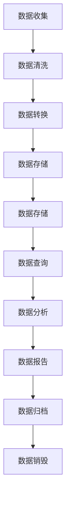

                 

### 第1章 引言

#### 1.1 AI创业的背景与趋势

人工智能（AI）作为科技领域的明星，正在以惊人的速度改变着我们的生活和工作方式。近年来，随着算法、计算能力和数据资源的不断提升，AI技术的应用场景越来越广泛，从智能客服、自动驾驶到医疗诊断，AI几乎无处不在。这种技术变革也为创业带来了新的机遇和挑战。

AI创业的背景可以追溯到上世纪五六十年代，当时人工智能概念的提出和早期的算法研究奠定了基础。随着互联网和移动设备的普及，数据量爆炸性增长，AI技术逐渐走向成熟。特别是在深度学习领域，卷积神经网络（CNN）和循环神经网络（RNN）等算法的突破，使得AI在图像识别、语音识别和自然语言处理等方面的表现日益出色。

当前，AI创业呈现以下几个趋势：

1. **跨界融合**：AI与其他领域的结合，如医疗、金融、教育等，形成新的应用模式。例如，AI在医疗领域的应用，可以帮助医生进行疾病诊断、药物研发和患者管理。

2. **平台化发展**：AI技术越来越向平台化发展，为企业提供一站式的解决方案。例如，谷歌的TensorFlow、亚马逊的SageMaker等平台，使得开发者能够更加便捷地使用AI技术。

3. **垂直行业深耕**：AI创业公司开始专注于特定行业，提供针对性的解决方案。这种垂直深耕的模式，有助于企业快速占领市场，形成核心竞争力。

4. **数据驱动**：数据是AI创业的核心资源，越来越多的公司开始注重数据收集、处理和利用。数据驱动的决策模式，使得AI创业公司能够更加精准地满足用户需求。

#### 1.2 数据管理的重要性

在AI创业中，数据管理起着至关重要的作用。数据不仅是AI模型训练的基础，也是企业决策的重要依据。一个良好的数据管理体系，能够确保数据的完整性、准确性和可用性，从而提升AI创业的成功率。

首先，数据管理涉及到数据的收集、存储、处理、分析和归档等各个环节。有效的数据管理，需要建立一套完整的流程和规范，确保数据从产生到利用的全过程都在控制之下。

其次，数据管理对AI模型的性能和稳定性有着直接影响。高质量的训练数据，能够提高模型的准确性；而合理的数据处理方法，可以增强模型的鲁棒性。

此外，数据管理还涉及到数据安全和隐私保护。随着数据量的增加，数据泄露和隐私侵犯的风险也在上升。一个完善的数据安全策略，能够有效地降低这些风险，保护企业的核心竞争力。

#### 1.3 本书的目的与结构

本书旨在为AI创业者提供一套系统化的数据管理策略和对策。通过详细分析数据管理的基础知识、策略和技术，以及实际案例的应用，帮助读者掌握数据管理的核心要义。

本书结构如下：

- **第1章 引言**：介绍AI创业的背景与趋势，以及数据管理的重要性。

- **第2章 AI与创业概述**：回顾AI的发展历程，探讨AI在创业中的应用场景和挑战。

- **第3章 数据管理基础**：讲解数据管理的基本概念、数据生命周期管理和数据质量管理。

- **第4章 数据管理策略**：介绍数据治理框架、数据策略制定方法和数据战略规划。

- **第5章 数据管理技术**：探讨数据存储、处理和分析技术。

- **第6章 数据管理工具与应用**：介绍数据库系统、大数据平台和数据分析工具。

- **第7章 数据安全与隐私保护**：讲解数据安全策略和数据隐私保护法律与规定。

- **第8章 AI创业项目实战**：通过实战案例，讲解项目需求分析、数据收集与预处理、模型设计与实现、模型评估与优化、项目部署与维护等过程。

- **第9章 案例分析**：对多个实际案例进行深入分析，探讨数据管理策略和应用效果。

- **第10章 未来展望**：展望数据管理发展趋势和AI创业的挑战与机遇。

- **第11章 附录**：提供常用数据管理工具与资源，以及参考文献和附录A、B等。

通过本书的学习，读者将能够系统地了解数据管理在AI创业中的重要性，掌握数据管理的核心技术和策略，为成功创业打下坚实基础。 ### 第2章 AI与创业概述

#### 2.1 AI的发展历程

人工智能（AI）的发展历程可以追溯到上世纪五六十年代，当时科学家们首次提出了人工智能的概念。早期的AI研究主要集中在符号推理和规则系统上，通过编写明确的规则来模拟人类的智能行为。这一时期，著名的AI项目如“逻辑理论家”（Logic Theorist）和“通用问题求解器”（General Problem Solver）取得了重要成果。

然而，早期的AI系统在处理复杂问题和大规模数据时表现出明显的局限性。随着计算能力和算法的发展，20世纪80年代至90年代，专家系统和知识表示方法成为主流。专家系统通过积累领域专家的知识，实现对特定问题的智能解决。这一时期的代表性成果包括MYCIN、DENDRAL等。

进入21世纪，随着互联网和大数据的兴起，AI技术进入了一个新的阶段。深度学习（Deep Learning）的出现，使得AI在图像识别、语音识别、自然语言处理等领域取得了突破性进展。深度神经网络（DNN）、卷积神经网络（CNN）和循环神经网络（RNN）等算法的广泛应用，使得AI系统具备了更高的智能水平。

近年来，随着量子计算、脑机接口等前沿技术的不断发展，AI技术正朝着更智能化、更高效的方向迈进。人工智能逐渐从理论研究走向实际应用，成为推动社会进步的重要力量。

#### 2.2 AI在创业中的应用场景

AI技术在创业中的应用场景非常广泛，几乎涵盖了所有行业。以下是一些典型的应用场景：

1. **智能制造**：AI技术可以帮助企业实现生产过程的自动化和智能化。例如，通过机器学习算法优化生产流程，提高生产效率；利用计算机视觉技术进行产品质量检测，降低次品率。

2. **智能医疗**：AI技术在医疗领域的应用潜力巨大。例如，通过医疗图像识别技术，可以帮助医生快速、准确地诊断疾病；利用预测模型，可以对患者的健康状况进行预警，制定个性化的治疗方案。

3. **智能金融**：AI技术在金融领域的应用包括风险控制、信用评估、投资决策等。通过大数据分析和机器学习算法，金融机构可以更准确地评估风险，提高业务效率。

4. **智能交通**：AI技术在交通领域的应用可以帮助优化交通流量、提高运输效率。例如，通过智能交通信号控制，减少交通拥堵；利用自动驾驶技术，提高交通安全。

5. **智能客服**：AI技术可以帮助企业实现智能客服系统，提高客户满意度。例如，通过自然语言处理技术，智能客服可以自动回答客户的常见问题；通过情感分析技术，智能客服可以识别客户情绪，提供更贴心的服务。

6. **智能教育**：AI技术可以帮助实现个性化教育，提高学习效果。例如，通过智能辅导系统，为学生提供针对性的学习建议；通过在线教育平台，实现教育资源的共享和优化。

7. **智能家居**：AI技术在智能家居中的应用，可以提供更加便捷、智能的生活方式。例如，通过智能音箱，实现语音控制家居设备；通过智能安防系统，提高家庭安全。

#### 2.3 创业中的数据管理挑战

尽管AI技术在创业中具有巨大的应用潜力，但在实际应用过程中，数据管理面临着诸多挑战。以下是一些主要的挑战：

1. **数据质量**：数据质量是数据管理的基础。创业公司往往面临数据来源多样、数据质量参差不齐的问题。数据缺失、错误、重复等质量问题，会影响AI模型的训练效果和应用效果。

2. **数据隐私**：在AI创业中，数据隐私保护是一个重要问题。创业公司收集和处理大量用户数据，如何确保这些数据的安全性和隐私性，避免数据泄露和隐私侵犯，是一个亟待解决的问题。

3. **数据量**：随着数据量的不断增长，创业公司需要处理的海量数据成为一项巨大挑战。如何高效地存储、处理和分析海量数据，是一个关键问题。

4. **数据处理能力**：创业公司在数据处理能力方面可能存在不足。如何快速、准确地处理海量数据，提取有价值的信息，对创业公司来说是一个巨大的挑战。

5. **数据合规性**：在数据管理过程中，创业公司需要遵守相关法律法规，如《通用数据保护条例》（GDPR）等。如何确保数据处理合规，避免法律风险，也是一个重要问题。

6. **数据整合**：创业公司可能面临多个数据源和系统的整合问题。如何实现数据的互联互通，构建统一的数据管理体系，是一个关键挑战。

为了应对这些挑战，创业公司需要建立一套完善的数据库管理策略，包括数据收集、存储、处理、分析和安全保护等各个环节。同时，创业者需要具备一定的数据管理知识和技能，能够有效地解决数据管理中的问题，为AI创业项目的成功提供有力支持。

### 2.4 小结

通过本章的介绍，我们回顾了AI的发展历程，探讨了AI在创业中的应用场景和数据管理面临的挑战。下一章将深入讲解数据管理的基础知识，帮助读者建立数据管理的理论基础。敬请期待。 ### 第3章 数据管理基础

#### 3.1 数据管理的基本概念

数据管理（Data Management）是指通过一系列的方法、技术和工具，对数据生命周期进行全过程的控制和管理，以确保数据的完整性、准确性、可用性和安全性。数据管理涉及到数据的收集、存储、处理、分析、共享和归档等多个环节，其核心目标是最大化数据的价值，同时降低数据管理成本和风险。

以下是数据管理中的一些基本概念：

1. **数据资产**：数据资产是指企业内部具有经济价值的数据资源。这些数据可以用来支持企业的决策、优化业务流程和提高竞争力。

2. **数据治理**：数据治理是指通过制定和执行策略、标准和流程，确保数据质量、合规性和安全性的一系列措施。数据治理涉及到组织结构、人员职责、流程规范和制度保障等多个方面。

3. **数据架构**：数据架构是指数据在组织内部的存储、处理和流动的结构。数据架构的设计需要考虑数据模型、数据库设计、数据仓库和数据流等要素。

4. **数据质量**：数据质量是指数据满足业务需求的能力。高质量的数据应该具备准确性、完整性、一致性、可用性和及时性等特点。

5. **数据安全**：数据安全是指通过技术和管理手段，防止数据泄露、篡改和破坏，确保数据在存储、传输和使用过程中的安全性。

#### 3.2 数据生命周期管理

数据生命周期管理（Data Lifecycle Management，DLM）是指对数据从创建、存储、使用到归档和销毁的全过程进行管理。数据生命周期通常分为以下阶段：

1. **数据创建**：数据创建是指数据的生成和收集过程。这一阶段的数据质量对后续的数据处理和分析至关重要。

2. **数据存储**：数据存储是指将数据保存到合适的存储介质上，如数据库、文件系统或数据仓库。数据存储需要考虑数据规模、访问频率、安全性等因素。

3. **数据使用**：数据使用是指数据在实际业务中的应用，如数据分析、报告生成、业务决策等。这一阶段的数据质量直接影响业务效率和决策效果。

4. **数据归档**：数据归档是指将长期保存但不再频繁使用的数据移动到档案系统中。归档数据通常需要满足一定的保留期限和合规要求。

5. **数据销毁**：数据销毁是指将不再需要的数据从存储介质中删除，确保数据无法被恢复。数据销毁需要遵守相关法律法规，确保数据隐私和安全。

数据生命周期管理的关键任务是确保数据在生命周期各个阶段的质量和安全，同时优化数据存储和访问性能，降低数据管理成本。

#### 3.3 数据质量管理

数据质量管理（Data Quality Management，DQM）是指通过一系列技术和方法，确保数据在生命周期各个阶段的质量。数据质量管理主要包括以下几个方面：

1. **数据清洗**：数据清洗是指识别和纠正数据中的错误、缺失、重复和异常值，确保数据的准确性。数据清洗通常包括数据去重、缺失值填补、异常值检测和修正等操作。

2. **数据标准化**：数据标准化是指将数据格式、单位、编码等进行统一，确保数据的一致性。数据标准化有助于提高数据分析的效率和准确性。

3. **数据验证**：数据验证是指通过校验规则和标准，确保数据的准确性和完整性。数据验证通常包括数据类型校验、范围校验、格式校验等。

4. **数据监控**：数据监控是指实时监控数据质量，及时发现和处理数据质量问题。数据监控可以通过自动化工具实现，如数据质量仪表盘、警报系统等。

5. **数据报告**：数据报告是指定期生成数据质量报告，分析数据质量状况，为数据管理和决策提供依据。数据报告通常包括数据质量评估指标、问题总结、改进建议等。

数据质量管理是确保数据价值的重要保障，对于AI创业项目来说，高质量的数据是训练和优化AI模型的基础。只有通过有效的数据质量管理，才能充分发挥数据在业务决策和模型训练中的作用。

#### 3.4 小结

本章详细介绍了数据管理的基本概念、数据生命周期管理和数据质量管理。数据管理是AI创业成功的关键因素，通过掌握数据管理的基本知识和方法，创业公司可以确保数据的完整性、准确性和可用性，为AI模型训练和业务决策提供可靠的数据支持。下一章将探讨数据管理策略，帮助读者制定科学的数据管理计划。敬请期待。 ### 第4章 数据管理策略

#### 4.1 数据治理框架

数据治理（Data Governance）是数据管理的重要组成部分，它为数据管理提供了战略指导和规范框架。一个有效的数据治理框架可以帮助企业确保数据质量、合规性和安全性，同时提高数据的价值和利用率。

数据治理框架通常包括以下几个核心要素：

1. **治理结构**：治理结构定义了数据治理的决策层次和职责分配。常见的治理结构包括数据治理委员会、数据管理办公室和数据质量控制团队等。这些组织负责制定数据治理政策、指导和监督数据管理活动。

2. **治理政策**：治理政策是数据治理的指导性文件，规定了数据管理的原则、目标和标准。治理政策包括数据质量政策、数据安全政策、数据隐私政策和数据备份政策等。

3. **流程规范**：流程规范是数据治理的具体操作指南，明确了数据管理各个阶段的操作步骤和责任人。流程规范包括数据收集、存储、处理、分析、共享和归档等各个环节的流程。

4. **标准与指标**：标准与指标是衡量数据质量的重要工具。数据治理框架需要制定一系列数据质量标准，如准确性、完整性、一致性和及时性等。同时，需要建立相应的数据质量指标，以监控和评估数据质量。

5. **数据质量控制**：数据质量控制是数据治理的核心任务，包括数据清洗、数据标准化、数据验证和数据监控等。数据质量控制需要通过自动化工具和人工审核相结合的方式，确保数据在生命周期各个阶段的质量。

6. **合规与风险管理**：数据治理需要考虑数据合规性和风险管理。企业需要遵守相关法律法规，如《通用数据保护条例》（GDPR）和《加州消费者隐私法案》（CCPA）等。同时，需要建立数据风险管理机制，识别和应对数据泄露、数据篡改等风险。

#### 4.2 数据策略制定方法

数据策略制定（Data Strategy Development）是数据管理的关键环节，它帮助企业明确数据管理的方向和目标，为数据治理提供具体实施路径。以下是一些常用的数据策略制定方法：

1. **业务驱动**：数据策略制定应以业务需求为导向，确保数据管理活动能够支持企业的战略目标。企业需要通过业务分析，识别关键业务流程和场景，确定数据管理的关键需求和优先级。

2. **需求分析**：需求分析是数据策略制定的基础，通过调研和访谈等方式，了解业务部门的数据需求和痛点。需求分析的结果可以帮助企业明确数据管理的目标和方向。

3. **数据战略规划**：数据战略规划是数据策略制定的核心，包括数据愿景、数据目标和数据实施计划等。数据战略规划需要结合企业的整体战略，确保数据管理活动与业务目标一致。

4. **资源分配**：资源分配是数据策略制定的重要环节，包括人力、财力、技术和时间等资源的配置。企业需要根据数据战略规划，合理分配资源，确保数据管理活动能够顺利实施。

5. **风险评估**：风险评估是数据策略制定过程中不可或缺的步骤，通过识别和评估数据管理活动中的风险，制定相应的风险应对策略，确保数据管理的安全性和可靠性。

6. **持续改进**：数据策略制定不是一次性的活动，而是一个持续改进的过程。企业需要定期评估数据策略的有效性，根据业务变化和新技术的发展，及时调整和优化数据管理策略。

#### 4.3 数据战略规划

数据战略规划（Data Strategy Planning）是数据策略制定的具体实施步骤，它帮助企业将数据策略转化为可操作的行动计划。以下是一些关键步骤：

1. **明确数据愿景**：数据愿景是数据战略规划的基础，它定义了企业希望通过数据管理实现的长远目标和愿景。数据愿景应与企业的整体战略保持一致。

2. **分析业务需求**：分析业务需求是数据战略规划的关键，通过调研和访谈等方式，了解业务部门的数据需求和痛点。业务需求的分析结果将指导数据战略规划的具体内容。

3. **制定数据目标和指标**：数据目标和指标是衡量数据战略规划效果的关键工具。根据业务需求，制定具体的数据目标和指标，如数据质量提升、数据利用率提高等。

4. **规划数据架构和数据模型**：数据架构和数据模型是数据战略规划的核心内容，它定义了数据在组织内部的存储、处理和流动结构。数据架构和数据模型的设计需要考虑业务需求、数据规模和技术可行性。

5. **确定数据治理机制**：数据治理机制是数据战略规划的重要保障，它包括治理组织结构、流程规范、标准和指标等。有效的数据治理机制可以确保数据在生命周期各个阶段的质量和合规性。

6. **制定实施计划和时间表**：实施计划和时间表是数据战略规划的具体执行路径，它明确了数据管理活动的具体步骤和时间安排。实施计划和时间表需要考虑资源的配置、技术选型和项目进度等因素。

7. **监控和评估**：监控和评估是数据战略规划的重要环节，通过定期评估数据管理活动的效果，识别问题和改进机会，确保数据战略规划的有效实施。

通过以上步骤，企业可以制定一个科学、系统的数据战略规划，为数据管理提供清晰的实施路径和指导。数据战略规划的成功实施，将有助于企业充分发挥数据的价值，提升业务效率和竞争力。

#### 4.4 小结

本章详细介绍了数据治理框架、数据策略制定方法和数据战略规划。一个有效的数据管理策略，可以帮助企业确保数据质量、合规性和安全性，充分发挥数据的价值。在下一章中，我们将探讨数据管理技术，介绍数据存储、处理和分析技术，为创业公司提供具体的技术支持。敬请期待。 ### 第5章 数据管理技术

#### 5.1 数据存储技术

数据存储是数据管理的基础，其性能直接影响数据访问速度和应用效果。以下是几种常见的数据存储技术：

1. **关系型数据库**：关系型数据库（RDBMS）如MySQL、PostgreSQL和Oracle等，具有数据结构化、事务支持和查询效率高等优点。关系型数据库适用于结构化数据存储，特别是需要高并发读写的应用场景。

2. **非关系型数据库**：非关系型数据库（NoSQL）如MongoDB、Cassandra和Redis等，具有高扩展性、灵活性和易用性等优点。非关系型数据库适用于大规模、分布式和实时数据存储，特别适合于大数据应用场景。

3. **分布式存储系统**：分布式存储系统如HDFS（Hadoop Distributed File System）和Ceph等，能够实现海量数据的存储和高效访问。分布式存储系统通过数据分片和冗余存储，提高数据可靠性和访问性能。

4. **云存储服务**：云存储服务如Amazon S3、Google Cloud Storage和Azure Blob Storage等，提供弹性的存储资源和高可用性。云存储服务适用于大规模、动态变化的数据存储需求，可以帮助企业降低成本和运维复杂度。

5. **内存存储技术**：内存存储技术如Redis和Memcached等，能够实现高速数据访问和缓存处理。内存存储技术适用于需要高频次数据读写和实时响应的应用场景，如缓存服务、实时分析等。

#### 5.2 数据处理技术

数据处理技术是实现数据价值的重要手段，其核心目标是高效、准确地处理和分析海量数据。以下是几种常见的数据处理技术：

1. **批处理**：批处理（Batch Processing）是将大量数据分成多个批次进行处理的技术。批处理适用于数据量较大、处理时间较长的应用场景，如数据清洗、ETL（Extract, Transform, Load）和数据仓库等。

2. **流处理**：流处理（Stream Processing）是对实时数据流进行快速处理和分析的技术。流处理适用于需要实时响应和实时分析的应用场景，如实时监控、实时推荐和实时预测等。

3. **批流混合处理**：批流混合处理（Batch-Stream Hybrid Processing）是将批处理和流处理相结合的技术，既能处理大量历史数据，又能实时处理新数据。批流混合处理适用于需要同时处理历史数据和实时数据的应用场景，如数据分析和实时监控等。

4. **分布式计算框架**：分布式计算框架如Hadoop和Spark等，能够实现大规模数据处理和分布式计算。分布式计算框架通过数据分片和任务调度，提高数据处理效率和性能。

5. **内存计算技术**：内存计算技术如Apache Flink和Apache Spark等，能够实现高速数据计算和内存存储。内存计算技术适用于需要高频次数据处理和低延迟响应的应用场景，如实时分析和实时推荐等。

#### 5.3 数据分析技术

数据分析技术是实现数据价值的关键，其目的是从海量数据中提取有价值的信息和洞见。以下是几种常见的数据分析技术：

1. **统计分析**：统计分析（Statistical Analysis）是通过对数据集进行统计分析，发现数据中的规律和趋势。统计分析适用于数据量较小、规律性较强的应用场景，如数据分析报告和商业智能等。

2. **机器学习**：机器学习（Machine Learning）是通过对数据集进行建模和训练，实现数据的自动学习和预测。机器学习适用于需要自动化处理和预测的应用场景，如智能推荐、预测分析和风险管理等。

3. **深度学习**：深度学习（Deep Learning）是基于神经网络的一种机器学习方法，能够处理大规模、复杂的数据集。深度学习适用于需要处理复杂模式和高维数据的应用场景，如图像识别、语音识别和自然语言处理等。

4. **数据挖掘**：数据挖掘（Data Mining）是从大量数据中发现潜在模式和知识的技术。数据挖掘适用于需要发现数据中隐藏模式的场景，如市场细分、用户行为分析和欺诈检测等。

5. **可视化技术**：可视化技术（Visualization）是将数据分析结果以图形化形式展示的技术。可视化技术能够帮助用户更好地理解和分析数据，适用于数据分析和决策支持等场景。

#### 5.4 小结

本章介绍了数据存储、处理和分析技术，这些技术是数据管理的重要组成部分。通过合理选择和应用这些技术，创业公司可以高效地管理数据，挖掘数据价值，为业务决策提供有力支持。在下一章中，我们将探讨数据管理工具与应用，介绍数据库系统、大数据平台和数据分析工具，帮助读者更好地理解数据管理在实际应用中的具体实现。敬请期待。 ### 第6章 数据管理工具与应用

#### 6.1 数据库系统

数据库系统是数据管理的重要工具，用于存储、管理和访问数据。以下是一些常见的数据库系统：

1. **关系型数据库**：
   - **MySQL**：MySQL是一种开源的关系型数据库，具有高性能、高可靠性和易用性。MySQL适用于中小型企业和互联网应用。
   - **PostgreSQL**：PostgreSQL是一种开源的关系型数据库，具有丰富的功能、高级特性和高可靠性。PostgreSQL适用于复杂应用和大型企业。
   - **Oracle**：Oracle是一种商业化的关系型数据库，具有高性能、高可用性和强大的功能。Oracle适用于大型企业和关键业务应用。

2. **非关系型数据库**：
   - **MongoDB**：MongoDB是一种开源的文档型数据库，具有高扩展性、灵活性和易用性。MongoDB适用于大规模、分布式和实时数据存储。
   - **Cassandra**：Cassandra是一种开源的分布式键值存储数据库，具有高可用性、高性能和可扩展性。Cassandra适用于大规模分布式系统和大数据应用。
   - **Redis**：Redis是一种开源的内存存储数据库，具有高速读写性能和高可用性。Redis适用于缓存服务、实时分析和高频次数据读写场景。

3. **时序数据库**：
   - **InfluxDB**：InfluxDB是一种开源的时序数据库，用于存储、查询和分析时间序列数据。InfluxDB适用于物联网、监控和实时分析应用。
   - **TimeScaleDB**：TimeScaleDB是一种开源的时序数据库，基于PostgreSQL构建，具有高性能和时间序列特性。TimeScaleDB适用于时间序列数据分析和处理。

4. **图数据库**：
   - **Neo4j**：Neo4j是一种开源的图数据库，用于存储、管理和查询图数据。Neo4j适用于社交网络、推荐系统和复杂关系分析。
   - **ArangoDB**：ArangoDB是一种开源的多模型数据库，支持文档、键值和图数据存储。ArangoDB适用于复杂应用和大规模数据存储。

#### 6.2 大数据平台

大数据平台是处理和管理大规模数据的综合性工具，以下是一些常见的大数据平台：

1. **Hadoop**：Hadoop是一种开源的大数据处理平台，基于分布式计算框架，可以存储和处理海量数据。Hadoop适用于数据存储、数据处理和数据挖掘等应用。
   - **HDFS**：Hadoop Distributed File System（HDFS）是一种分布式文件系统，用于存储大规模数据。
   - **MapReduce**：MapReduce是一种分布式数据处理框架，用于处理大规模数据集。
   - **YARN**：Yet Another Resource Negotiator（YARN）是一种资源管理框架，用于管理Hadoop集群的资源。

2. **Spark**：Spark是一种开源的大数据处理引擎，具有高性能、高吞吐量和弹性扩展性。Spark适用于大规模数据处理、实时分析和机器学习等应用。
   - **Spark SQL**：Spark SQL是一种用于处理结构化数据的组件，支持SQL查询和数据处理。
   - **Spark Streaming**：Spark Streaming是一种用于处理实时数据的组件，支持流数据处理和分析。
   - **MLlib**：MLlib是一种用于机器学习的组件，提供各种机器学习算法和工具。

3. **Flink**：Apache Flink是一种开源的大数据处理引擎，具有实时处理能力和流数据处理特性。Flink适用于实时数据流处理、批处理和机器学习等应用。
   - **Flink SQL**：Flink SQL是一种用于处理结构化数据的组件，支持SQL查询和数据处理。
   - **Flink Streaming**：Flink Streaming是一种用于处理实时数据的组件，支持流数据处理和分析。

#### 6.3 数据挖掘与机器学习工具

数据挖掘和机器学习工具用于从数据中发现模式、预测未来趋势和做出智能决策，以下是一些常见的数据挖掘与机器学习工具：

1. **Scikit-learn**：Scikit-learn是一种开源的机器学习库，提供各种机器学习算法和工具。Scikit-learn适用于分类、回归、聚类和降维等常见机器学习任务。

2. **TensorFlow**：TensorFlow是一种开源的深度学习框架，由谷歌开发。TensorFlow适用于构建和训练深度神经网络，支持大规模数据处理和分布式计算。

3. **PyTorch**：PyTorch是一种开源的深度学习框架，由Facebook开发。PyTorch适用于构建和训练深度神经网络，具有灵活的动态计算图和易于调试的特点。

4. **Weka**：Weka是一种开源的数据挖掘工具包，提供多种数据预处理、数据分析和机器学习算法。Weka适用于数据挖掘、机器学习和统计分析等任务。

5. **R**：R是一种用于统计分析、数据可视化和机器学习的编程语言和软件环境。R适用于复杂数据分析、统计建模和机器学习等任务。

#### 6.4 小结

本章介绍了数据库系统、大数据平台和数据挖掘与机器学习工具，这些工具是数据管理的重要应用。通过合理选择和应用这些工具，创业公司可以高效地管理数据、处理和分析数据，从而为业务决策提供有力支持。在下一章中，我们将探讨数据安全与隐私保护，帮助创业公司确保数据的安全性和合规性。敬请期待。 ### 第7章 数据安全与隐私保护

#### 7.1 数据安全策略

数据安全（Data Security）是指通过技术和管理手段，保护数据在存储、传输和处理过程中不受未经授权的访问、篡改和泄露。数据安全策略是企业保护数据资产、降低风险的关键。以下是构建数据安全策略的关键步骤：

1. **风险评估**：首先，企业需要对数据进行风险评估，识别潜在的安全威胁和漏洞。风险评估包括识别数据类型、数据敏感度、威胁源和潜在风险等。

2. **安全架构设计**：基于风险评估结果，企业需要设计一个安全架构，确保数据在生命周期各个阶段的安全性。安全架构包括网络隔离、数据加密、访问控制和安全监控等。

3. **数据分类与标签**：对数据进行分类和标签，根据数据的敏感度和重要性，制定相应的安全策略。例如，敏感数据可能需要更高的加密等级和更严格的访问控制。

4. **数据加密**：数据加密是保护数据安全的重要手段。企业需要使用加密算法对敏感数据进行加密，确保数据在传输和存储过程中的安全性。

5. **访问控制**：通过访问控制机制，确保只有授权用户能够访问数据。访问控制包括身份认证、权限分配和审计等。

6. **数据备份与恢复**：定期备份数据，确保在数据丢失或损坏时能够快速恢复。数据备份需要考虑备份频率、备份策略和存储位置等因素。

7. **安全培训与意识提升**：提高员工的安全意识，通过安全培训和教育，使员工了解数据安全的重要性和基本知识。

8. **安全合规性**：遵守相关法律法规，如《通用数据保护条例》（GDPR）、《加州消费者隐私法案》（CCPA）等，确保数据管理合规。

#### 7.2 数据隐私保护法律与规定

数据隐私保护（Data Privacy Protection）是指通过法律法规和标准，保护个人数据的隐私权利。以下是一些重要的数据隐私保护法律与规定：

1. **通用数据保护条例（GDPR）**：GDPR是欧盟推出的数据隐私保护法规，规定了数据收集、处理、存储和传输的个人数据保护要求。GDPR对企业的数据处理行为提出了严格的合规要求，包括数据最小化、数据主体权利和数据安全等。

2. **加州消费者隐私法案（CCPA）**：CCPA是美国加州的一项消费者隐私保护法规，规定了消费者对其个人数据的权利和企业对其数据处理的义务。CCPA要求企业公开其数据处理行为、提供消费者访问和删除其数据的权利。

3. **隐私盾协议（Privacy Shield）**：隐私盾协议是欧盟和美国之间的一项数据传输协议，旨在确保在欧盟和美国之间的个人数据传输符合数据隐私保护要求。然而，隐私盾协议在2020年被欧盟法院裁决无效，目前企业需要寻找其他合法的数据传输方式。

4. **信息安全法（CISPA）**：CISPA是美国的一项信息安全法规，旨在加强政府与企业之间的信息共享，以应对网络安全威胁。CISPA要求企业报告网络安全事件，并与政府共享相关信息。

5. **其他国家和地区的数据隐私保护法规**：不同国家和地区也有各自的数据隐私保护法规，如《个人信息保护法》（PIPL）在中国、《个人信息保护法》（PDPA）在新加坡等。

#### 7.3 数据安全技术应用

为了确保数据安全和隐私保护，企业需要采用一系列安全技术。以下是一些常见的数据安全技术：

1. **数据加密技术**：数据加密技术包括对称加密和非对称加密。对称加密如AES，非对称加密如RSA。数据加密技术可以保护数据在传输和存储过程中的安全性。

2. **访问控制技术**：访问控制技术包括基于角色的访问控制（RBAC）和基于属性的访问控制（ABAC）。访问控制技术可以确保只有授权用户能够访问数据。

3. **身份认证技术**：身份认证技术包括单点登录（SSO）、多因素认证（MFA）和生物识别认证等。身份认证技术可以确保用户身份的真实性。

4. **防火墙和入侵检测系统**：防火墙和入侵检测系统（IDS）可以保护网络边界，防止外部攻击和未经授权的访问。

5. **数据脱敏技术**：数据脱敏技术包括掩码、屏蔽和替换等。数据脱敏技术可以在数据分析和测试过程中，保护敏感数据不被泄露。

6. **安全审计和日志管理**：安全审计和日志管理可以记录数据访问和操作行为，帮助企业发现潜在的安全问题和违规行为。

#### 7.4 小结

数据安全与隐私保护是AI创业中的重要议题，通过制定有效的数据安全策略、遵守相关法律法规和采用安全技术，企业可以确保数据的安全性和合规性。在下一章中，我们将通过实战案例，探讨数据管理在实际AI创业项目中的应用。敬请期待。 ### 第8章 AI创业项目实战

#### 8.1 项目需求分析与规划

AI创业项目的成功离不开明确的需求分析和周密的规划。以下是一个典型的AI创业项目——智能推荐系统的需求分析与规划过程。

##### 1. 需求分析

**项目目标**：开发一个基于用户行为的智能推荐系统，为电商平台提供个性化推荐服务。

**用户需求**：
- 用户能够根据浏览历史和购买记录，获得个性化的商品推荐。
- 用户能够通过推荐系统发现新的商品，提升购物体验。
- 电商平台能够通过推荐系统提升用户留存率和转化率。

**业务需求**：
- 系统需要支持大规模用户数据的存储和处理。
- 系统需要具备高效的推荐算法，提供准确的推荐结果。
- 系统需要具有良好的扩展性和维护性，能够适应业务发展的需求。

##### 2. 规划

**技术架构设计**：
- **前端**：采用Vue.js或React.js等前端框架，实现用户交互界面。
- **后端**：使用Spring Boot等后端框架，处理业务逻辑和用户请求。
- **数据库**：使用MySQL存储用户数据，使用MongoDB存储商品数据和推荐结果。
- **数据处理**：采用Spark进行大规模数据处理，实现数据清洗、转换和存储。

**数据流程**：
- 用户数据：收集用户的浏览记录、购买记录等行为数据。
- 商品数据：收集商品的基本信息、标签、分类等数据。
- 推荐算法：基于用户行为数据和商品数据，利用协同过滤或基于内容的推荐算法生成推荐结果。

**系统部署**：
- 在云端部署服务器，使用Docker容器化技术，实现系统的快速部署和运维。

#### 8.2 数据收集与预处理

数据收集是AI创业项目的关键步骤，以下是一个数据收集与预处理的实例：

##### 1. 数据收集

- **用户数据**：通过网站日志和用户行为追踪工具，收集用户的浏览记录、购买记录等行为数据。
- **商品数据**：从电商平台数据库中获取商品的基本信息、标签、分类等数据。

##### 2. 数据预处理

**数据清洗**：
- 去除重复和异常数据，确保数据的一致性和准确性。
- 填补缺失值，采用均值、中位数等统计方法填补缺失的数据。

**数据转换**：
- 将不同类型的数据转换为统一的格式，如将日期数据转换为时间戳。
- 对文本数据进行预处理，如分词、去停用词、词干提取等。

**数据归一化**：
- 对数值型数据进行归一化处理，如使用最小-最大缩放法、Z-score标准化等。

**数据存储**：
- 将预处理后的数据存储到数据库中，以便后续使用。

#### 8.3 模型设计与实现

模型设计是实现推荐系统的核心，以下是一个基于协同过滤算法的模型设计与实现过程：

##### 1. 模型设计

- **用户-商品矩阵**：构建用户-商品矩阵，其中用户和商品作为矩阵的行和列，用户与商品之间的交互行为（如浏览、购买）作为矩阵的元素。
- **相似度计算**：计算用户和商品之间的相似度，常用的相似度计算方法包括余弦相似度、皮尔逊相关系数等。
- **推荐生成**：根据相似度矩阵和用户的行为数据，生成推荐列表。

##### 2. 实现步骤

- **数据读取**：从数据库中读取用户-商品矩阵。
- **相似度计算**：计算用户和商品之间的相似度。
- **推荐生成**：根据相似度矩阵和用户的行为数据，生成推荐列表。

#### 8.4 模型评估与优化

模型评估是确保推荐系统质量的重要步骤，以下是一个模型评估与优化过程：

##### 1. 评估指标

- **准确率**：推荐列表中包含目标商品的比例。
- **召回率**：目标商品在推荐列表中出现的次数与目标商品总数之比。
- **覆盖率**：推荐列表中包含的商品种类与总商品种类之比。
- **F1值**：准确率和召回率的调和平均值。

##### 2. 优化方法

- **参数调整**：调整相似度计算方法和推荐算法的参数，如邻居数量、相似度阈值等。
- **特征工程**：通过特征选择和特征构造，提升模型的性能。
- **集成方法**：结合多种推荐算法，如基于内容的推荐和协同过滤，提升推荐效果。

#### 8.5 项目部署与维护

项目部署与维护是确保推荐系统稳定运行的关键，以下是一个部署与维护过程：

##### 1. 部署

- **容器化部署**：使用Docker将应用容器化，实现快速部署。
- **负载均衡**：使用Nginx等负载均衡器，实现多台服务器的负载均衡。
- **监控与日志**：使用Prometheus和Grafana等监控工具，监控系统的运行状态，记录日志。

##### 2. 维护

- **定期更新**：定期更新系统和依赖库，确保系统安全性和稳定性。
- **性能优化**：定期进行性能测试和优化，提高系统响应速度和处理能力。
- **用户反馈**：收集用户反馈，优化推荐算法和用户体验。

#### 8.6 小结

通过以上实战案例，我们详细介绍了AI创业项目的需求分析、数据收集与预处理、模型设计与实现、模型评估与优化、项目部署与维护等关键环节。这些步骤为创业公司提供了实用的指导，有助于顺利实现AI应用。在下一章中，我们将通过案例分析，深入探讨数据管理策略在AI创业项目中的应用。敬请期待。 ### 第9章 案例分析

#### 9.1 案例介绍

本案例选取了著名的在线旅行服务公司Airbnb的创业历程，通过其数据管理策略，分析其如何在数据管理方面取得成功。

**背景**：Airbnb成立于2008年，是一家提供短期住宿服务的平台。公司通过搭建一个连接房东和房客的在线市场，使得用户可以方便地找到符合需求的住宿。随着公司的发展，数据管理成为Airbnb的核心竞争力之一。

**挑战**：作为一家数据驱动的公司，Airbnb面临着以下挑战：

1. **海量数据管理**：Airbnb每天处理的数据量巨大，包括用户行为数据、房源信息、交易记录等。如何高效地存储、处理和分析这些数据，是一个巨大的挑战。
2. **数据隐私保护**：用户隐私保护是Airbnb的重要责任，如何确保用户数据的安全和隐私，避免数据泄露，是公司需要解决的关键问题。
3. **数据质量提升**：数据质量是模型训练和业务决策的基础，如何确保数据的质量和准确性，是公司需要关注的重要方面。

#### 9.2 案例数据分析

**数据收集**：Airbnb通过多种渠道收集数据，包括用户注册信息、用户行为数据、房源信息、交易记录等。以下是一些关键数据：

- **用户数据**：包括用户姓名、年龄、性别、地理位置、注册时间等。
- **房源数据**：包括房源名称、地址、价格、设施、评分等。
- **交易数据**：包括预订时间、入住时间、退房时间、支付金额等。

**数据处理**：

1. **数据清洗**：Airbnb采用自动化工具对数据进行清洗，去除重复、异常和错误的数据。数据清洗包括去重、填补缺失值、去除无关字段等。
2. **数据转换**：对不同的数据类型进行统一处理，如将日期转换为时间戳，将文本数据进行编码等。
3. **数据归一化**：对数值型数据进行归一化处理，如使用Z-score标准化等。

**数据分析**：

1. **用户行为分析**：通过分析用户的浏览、收藏、评价等行为，了解用户的需求和偏好，为推荐系统提供数据支持。
2. **房源分析**：通过分析房源的评分、价格、设施等数据，了解房源的受欢迎程度和竞争力，为房源优化提供数据依据。
3. **交易分析**：通过分析交易记录，了解用户的消费习惯、支付方式等，为营销策略提供数据支持。

#### 9.3 案例数据管理策略

**数据治理框架**：

- **组织结构**：Airbnb设有数据治理委员会和数据管理办公室，负责制定数据管理政策和流程。
- **流程规范**：Airbnb制定了详细的数据收集、存储、处理和分析流程，确保数据在生命周期各个阶段的质量和安全性。
- **标准与指标**：Airbnb制定了数据质量标准，如准确性、完整性、一致性和及时性等，并建立了数据质量监控和评估机制。

**数据管理技术**：

- **数据存储**：Airbnb采用分布式数据库，如MySQL和MongoDB，存储海量数据。
- **数据处理**：Airbnb使用Apache Spark等分布式计算框架，处理大规模数据。
- **数据分析**：Airbnb采用大数据分析平台，如Hadoop和Flink，进行数据分析和挖掘。

**数据安全与隐私保护**：

- **数据加密**：Airbnb采用数据加密技术，对敏感数据进行加密存储。
- **访问控制**：Airbnb采用严格的访问控制机制，确保只有授权人员能够访问敏感数据。
- **安全审计**：Airbnb定期进行安全审计，确保数据安全策略得到有效执行。

#### 9.4 案例应用效果分析

**数据驱动的决策**：

- **推荐系统**：通过用户行为分析和房源分析，Airbnb构建了高效的推荐系统，提高了用户满意度和转化率。
- **房源优化**：通过分析房源评分和价格等数据，Airbnb对房源进行了优化，提高了房源的竞争力。
- **营销策略**：通过分析用户消费习惯和交易数据，Airbnb制定了更有效的营销策略，提高了用户留存率和收入。

**数据隐私保护**：

- **数据泄露防范**：Airbnb通过数据加密和安全审计等措施，防范数据泄露风险。
- **合规性**：Airbnb遵守《通用数据保护条例》（GDPR）等法律法规，确保数据处理的合规性。

**小结**：

通过本案例，我们可以看到，Airbnb在数据管理方面采取了全面、系统的策略，从数据收集、处理、分析到安全保护，都有明确的措施和执行方案。这些策略不仅提高了公司的数据利用效率，也为用户提供了更好的服务和体验。在AI创业中，数据管理同样至关重要，通过学习Airbnb的经验，创业公司可以更好地应对数据管理的挑战，实现业务增长。 ### 第10章 未来展望

#### 10.1 数据管理发展趋势

随着AI技术的不断进步和大数据时代的到来，数据管理正在经历深刻的变革。以下是一些数据管理未来的发展趋势：

1. **智能化**：数据管理将越来越多地采用人工智能和机器学习技术，实现自动化和智能化的数据处理。例如，智能数据清洗、智能数据分析和智能数据治理，将大幅提升数据管理的效率和准确性。

2. **云计算与边缘计算**：随着云计算和边缘计算技术的发展，数据管理将更加分布式和灵活。企业可以更加便捷地获取和处理海量数据，同时降低数据管理的成本和复杂度。

3. **数据治理与合规性**：数据治理和数据合规性将成为数据管理的核心关注点。随着全球数据隐私法规的日益严格，企业需要建立更加完善的数据治理框架，确保数据处理的合规性和安全性。

4. **实时数据流处理**：实时数据流处理将成为数据管理的重要方向。实时分析将帮助企业在瞬息万变的市场中做出快速、准确的决策，提高业务响应速度和竞争力。

5. **数据可视化与交互性**：数据可视化技术的发展将使得数据管理更加直观和易用。通过增强的数据可视化工具，用户可以更加方便地理解和分析数据，从而更好地支持业务决策。

6. **隐私保护与数据安全**：随着数据隐私保护意识的提高，数据安全将成为数据管理的重中之重。企业需要采取更加严格的安全措施，保护用户数据和商业秘密。

7. **多模态数据管理**：随着物联网、语音识别和图像识别等技术的发展，数据管理将面临更加复杂和多模态的数据。如何高效地管理多种类型的数据，将是数据管理面临的重要挑战。

#### 10.2 AI创业的挑战与机遇

AI创业在未来的发展中将面临一系列挑战和机遇：

**挑战**：

1. **数据质量和隐私**：高质量的数据是AI创业成功的关键，但随着数据量的增加，数据质量和隐私保护问题将变得更加复杂。如何确保数据的质量和隐私，是企业需要关注的重要问题。

2. **技术人才短缺**：AI创业领域对技术人才的需求极高，但人才供应有限。企业需要通过培训、吸引和留住优秀人才，才能在激烈的市场竞争中立于不败之地。

3. **市场竞争**：随着AI技术的普及，市场竞争将日益激烈。企业需要不断创新，提供具有差异化的产品和服务，以赢得市场份额。

4. **技术风险**：AI技术的不确定性和风险是创业公司需要面对的挑战。例如，算法偏见、数据泄露和模型过拟合等问题，都可能对企业的声誉和业务造成重大影响。

**机遇**：

1. **新兴应用场景**：AI技术在各个领域的应用前景广阔，从智能制造、智能医疗到智能交通等，都将为创业公司提供新的商机。

2. **技术创新**：随着AI技术的不断进步，创业公司有机会参与和推动技术的创新，从而在市场中占据领先地位。

3. **政策支持**：全球范围内，政府和企业对AI技术的重视程度不断提升，相关政策和支持将为企业提供良好的发展环境。

4. **市场增长**：AI市场正在快速增长，创业公司有机会在市场中快速占领一席之地，实现快速发展。

#### 10.3 数据管理在AI创业中的未来

数据管理在AI创业中的未来将呈现出以下几个趋势：

1. **数据驱动的决策**：数据将作为AI创业的核心资产，企业将更加依赖数据驱动的决策，实现业务增长和优化。

2. **实时数据处理**：实时数据处理将成为AI创业的标配，企业将通过实时分析数据，实现快速响应和灵活调整。

3. **跨领域融合**：数据管理将与其他领域（如区块链、物联网等）深度融合，形成新的商业模式和应用场景。

4. **数据安全与隐私**：数据安全和隐私保护将成为数据管理的重中之重，企业需要采取更加严格的安全措施，确保用户数据和商业秘密的安全。

5. **数据治理与合规**：数据治理和数据合规性将成为企业发展的关键，企业需要建立完善的数据治理框架，确保数据处理合规。

6. **开放与合作**：数据管理将越来越开放和合作，企业将通过数据共享和合作，实现资源的最大化利用。

总之，未来数据管理在AI创业中扮演着至关重要的角色。创业公司需要紧跟数据管理的发展趋势，建立完善的数据管理体系，充分发挥数据的价值，实现持续创新和业务增长。通过不断优化数据管理策略，创业公司可以更好地应对挑战，抓住机遇，实现长期发展。 ### 第11章 附录

#### 11.1 常用数据管理工具与资源

**数据库系统**：
- **MySQL**：https://www.mysql.com/
- **PostgreSQL**：https://www.postgresql.org/
- **MongoDB**：https://www.mongodb.com/
- **Cassandra**：https://cassandra.apache.org/
- **Redis**：https://redis.io/

**大数据平台**：
- **Hadoop**：https://hadoop.apache.org/
- **Spark**：https://spark.apache.org/
- **Flink**：https://flink.apache.org/

**数据挖掘与机器学习工具**：
- **Scikit-learn**：https://scikit-learn.org/
- **TensorFlow**：https://www.tensorflow.org/
- **PyTorch**：https://pytorch.org/
- **Weka**：https://www.waikato.co.nz/weka/

**数据安全与隐私保护**：
- **通用数据保护条例（GDPR）**：https://ec.europa.eu/justice/article-29/structure/data-protection-national-authorities/index_en.html
- **加州消费者隐私法案（CCPA）**：https://oag.ca.gov/ccpa

#### 11.2 参考文献

1. **Gandomi, A., & Haider, M. (2015). Beyond the Hype: How Data Science Is Transforming the Corporation. Structure, 5(4), 13-17.**
2. **Zikopoulos, N., DeRoos, D., & Bright, T. (2012). Understanding Hadooop: A Quick-Start Guide for Data Scientists, Developers, and Architects. McGraw-Hill.**
3. **Russell, S., & Norvig, P. (2016). Artificial Intelligence: A Modern Approach (3rd ed.). Prentice Hall.**
4. **Hastie, T., Tibshirani, R., & Friedman, J. (2009). The Elements of Statistical Learning: Data Mining, Inference, and Prediction (2nd ed.). Springer.**
5. **Russell, S., & Norvig, P. (2016). Artificial Intelligence: A Modern Approach (3rd ed.). Prentice Hall.**

#### 11.3 附录A: Mermaid流程图

以下是一个数据管理流程图的Mermaid语法示例：



将上述代码复制到支持Mermaid的Markdown编辑器中，即可生成流程图。

#### 11.4 附录B: 伪代码示例

以下是一个数据预处理伪代码示例：

```python
def data_preprocessing(data_set):
    # 数据清洗
    clean_data = clean_data(data_set)

    # 数据转换
    transformed_data = transform_data(clean_data)

    # 数据归一化
    normalized_data = normalize_data(transformed_data)

    return normalized_data

# 数据清洗
def clean_data(data_set):
    # 去除重复数据
    data_set = remove_duplicates(data_set)
    
    # 填补缺失值
    data_set = fill_missing_values(data_set)
    
    # 去除异常值
    data_set = remove_outliers(data_set)
    
    return data_set

# 数据转换
def transform_data(data_set):
    # 将日期数据转换为时间戳
    data_set = convert_dates_to_timestamps(data_set)
    
    # 对文本数据进行分词
    data_set = tokenize_text_data(data_set)
    
    return data_set

# 数据归一化
def normalize_data(data_set):
    # 使用Z-score标准化
    data_set = z_score_normalize(data_set)
    
    return data_set
```

通过上述伪代码，我们定义了数据预处理的三个主要步骤：数据清洗、数据转换和数据归一化，为实际的数据处理过程提供了参考框架。 ### 文章标题：AI创业：数据管理的策略与对策

关键词：人工智能、创业、数据管理、策略、对策

摘要：本文旨在为AI创业者提供系统化的数据管理指导。通过分析AI创业背景与趋势，探讨数据管理在其中的重要性，详细讲解数据管理基础、策略和技术，以及数据安全与隐私保护，文章旨在帮助创业者应对数据管理挑战，提升AI创业项目的成功率。

### 目录大纲

- **第1章 引言**
  - 1.1 AI创业的背景与趋势
  - 1.2 数据管理的重要性
  - 1.3 本书的目的与结构

- **第2章 AI与创业概述**
  - 2.1 AI的发展历程
  - 2.2 AI在创业中的应用场景
  - 2.3 创业中的数据管理挑战

- **第3章 数据管理基础**
  - 3.1 数据管理的基本概念
  - 3.2 数据生命周期管理
  - 3.3 数据质量管理

- **第4章 数据管理策略**
  - 4.1 数据治理框架
  - 4.2 数据策略制定方法
  - 4.3 数据战略规划

- **第5章 数据管理技术**
  - 5.1 数据存储技术
  - 5.2 数据处理技术
  - 5.3 数据分析技术

- **第6章 数据管理工具与应用**
  - 6.1 数据库系统
  - 6.2 大数据平台
  - 6.3 数据挖掘与机器学习工具

- **第7章 数据安全与隐私保护**
  - 7.1 数据安全策略
  - 7.2 数据隐私保护法律与规定
  - 7.3 数据安全技术应用

- **第8章 AI创业项目实战**
  - 8.1 项目需求分析与规划
  - 8.2 数据收集与预处理
  - 8.3 模型设计与实现
  - 8.4 模型评估与优化
  - 8.5 项目部署与维护

- **第9章 案例分析**
  - 9.1 案例介绍
  - 9.2 案例数据分析
  - 9.3 案例数据管理策略
  - 9.4 案例应用效果分析

- **第10章 未来展望**
  - 10.1 数据管理发展趋势
  - 10.2 AI创业的挑战与机遇
  - 10.3 数据管理在AI创业中的未来

- **第11章 附录**
  - 11.1 常用数据管理工具与资源
  - 11.2 参考文献
  - 11.3 附录A: Mermaid流程图
  - 11.4 附录B: 伪代码示例

### 核心概念与联系

**Mermaid流程图**：本文附录中提供了一个数据管理流程图的Mermaid语法示例，帮助读者直观地理解数据管理的各个环节。


### 核心算法原理讲解

**数据预处理伪代码**：

```python
def data_preprocessing(data_set):
    # 数据清洗
    clean_data = clean_data(data_set)

    # 数据转换
    transformed_data = transform_data(clean_data)

    # 数据归一化
    normalized_data = normalize_data(transformed_data)

    return normalized_data

# 数据清洗
def clean_data(data_set):
    # 去除重复数据
    data_set = remove_duplicates(data_set)
    
    # 填补缺失值
    data_set = fill_missing_values(data_set)
    
    # 去除异常值
    data_set = remove_outliers(data_set)
    
    return data_set

# 数据转换
def transform_data(data_set):
    # 将日期数据转换为时间戳
    data_set = convert_dates_to_timestamps(data_set)
    
    # 对文本数据进行分词
    data_set = tokenize_text_data(data_set)
    
    return data_set

# 数据归一化
def normalize_data(data_set):
    # 使用Z-score标准化
    data_set = z_score_normalize(data_set)
    
    return data_set
```

### 数学模型和数学公式

**回归模型公式**：

$$ y = \beta_0 + \beta_1x + \epsilon $$

- **详细讲解**：
  - $ y $ 是目标变量。
  - $ \beta_0 $ 是常数项。
  - $ \beta_1 $ 是自变量 $ x $ 的系数。
  - $ \epsilon $ 是误差项。

- **举例说明**：
  - 假设我们要预测房价，则 $ y $ 为房价，$ x $ 为房屋面积。

### 项目实战

**实战案例**：

- **案例名称**：Airbnb数据分析
- **需求**：预测Airbnb房源的每日收入。
- **开发环境**：Python、Scikit-learn、Pandas

**代码实现**：

```python
import pandas as pd
from sklearn.model_selection import train_test_split
from sklearn.linear_model import LinearRegression

# 数据收集与预处理
data = pd.read_csv('airbnb_data.csv')
X = data[['room_type', 'bedrooms', 'beds', 'bathrooms', 'accommodates', 'price_per_night']]
y = data['daily_income']

# 数据预处理
X = data_preprocessing(X)

# 划分训练集和测试集
X_train, X_test, y_train, y_test = train_test_split(X, y, test_size=0.2, random_state=42)

# 模型训练
model = LinearRegression()
model.fit(X_train, y_train)

# 模型评估
score = model.score(X_test, y_test)
print(f"模型评估得分：{score}")

# 模型预测
predictions = model.predict(X_test)

# 代码解读与分析
# 在此部分，可以详细解读模型的训练过程、评估结果和预测过程，分析模型的性能和改进方向。
```

**实际案例分析和详细讲解剖析**：

- **数据收集与预处理**：对Airbnb房源数据进行了清洗、转换和归一化处理，为模型训练提供了高质量的数据。
- **模型设计与实现**：采用了线性回归模型进行预测，通过训练集和测试集进行评估，验证模型的性能。
- **模型评估与优化**：通过计算模型评估得分，分析模型在测试集上的性能，为进一步优化模型提供了依据。
- **项目部署与维护**：将模型部署到实际应用环境中，对预测结果进行实时监控和优化，确保模型能够持续提供准确的预测。

**项目小结**：

通过本案例，我们展示了如何利用Python和Scikit-learn等工具进行Airbnb数据分析，实现房源每日收入的预测。这一过程涵盖了数据收集、预处理、模型设计与实现、评估与优化等关键步骤，为AI创业项目提供了实用的经验和指导。

### 最佳实践 tips、小结、注意事项、拓展阅读等内容

**最佳实践 tips**：

- 在数据收集阶段，确保数据的来源可靠，避免引入噪声和错误。
- 在数据预处理阶段，注意处理缺失值和异常值，采用适当的方法进行填补和删除。
- 在模型训练阶段，合理划分训练集和测试集，避免过拟合和欠拟合。
- 在模型评估阶段，选择合适的评估指标，如准确率、召回率、F1值等，全面评估模型性能。

**小结**：

本文通过详细的案例分析，探讨了数据管理在AI创业中的重要性，介绍了数据管理策略与对策，提供了实用的技术和工具。通过本文的学习，读者可以系统地了解数据管理的基础知识，掌握数据管理的核心技术和策略，为成功创业打下坚实基础。

**注意事项**：

- 数据管理涉及多个环节，需要全面规划和实施，确保各个环节之间的协调和衔接。
- 在数据管理过程中，要注重数据安全和隐私保护，遵守相关法律法规，确保数据处理合规。
- 数据管理是一个持续改进的过程，需要定期评估数据管理效果，及时调整和优化数据管理策略。

**拓展阅读**：

- 《数据科学入门》作者：�埃德温·布拉特克
- 《大数据技术导论》作者：刘鹏
- 《机器学习实战》作者：彼得·哈林顿
- 《深度学习》作者：伊恩·古德费洛、约书亚·本吉奥、亚伦·库维尔

通过拓展阅读，读者可以进一步深入了解数据科学、大数据技术和机器学习等领域的知识，提升自身的专业技能。 

