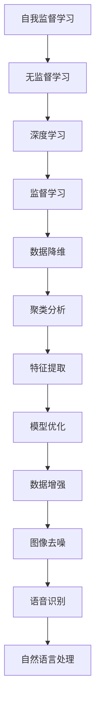

                 

# AI发展趋势：自我监督学习和无监督学习

## 关键词

- 人工智能
- 自我监督学习
- 无监督学习
- 自我监督学习算法
- 无监督学习算法
- AI发展趋势

## 摘要

本文将深入探讨人工智能（AI）领域中的自我监督学习和无监督学习两种重要的发展趋势。我们将首先概述AI的发展背景，并介绍自我监督学习和无监督学习的核心概念与联系。接着，我们将详细解析自我监督学习的理论基础、关键算法以及实际应用案例。随后，我们将探讨无监督学习的原理、算法及应用场景。最后，我们将分析自我监督学习与无监督学习的结合方式，并通过实际案例展示其应用效果。文章还将展望未来AI技术的发展趋势，并总结全文，提出注意事项和拓展阅读建议。

## 第一部分: AI发展趋势概述

### 第1章: AI发展背景与核心概念

#### 1.1 AI发展的历史与现状

人工智能（Artificial Intelligence，简称AI）起源于20世纪50年代，当时计算机科学家们首次提出了“人工智能”这一概念。最初，AI研究主要集中在规则推理、逻辑推理和专家系统等领域。随着计算机硬件性能的提升和算法的进步，AI技术逐渐应用到自然语言处理、计算机视觉、语音识别等领域。

当前，AI技术已经成为信息技术领域的重要方向，其在医疗、金融、教育、工业等各个行业都有广泛的应用。例如，深度学习算法在图像识别、语音识别等领域取得了显著的成果，自动驾驶技术也在逐步实现商业化应用。

#### 1.2 AI的核心概念与术语

- **人工智能（AI）**：模仿人类智能的计算机系统。
- **机器学习（ML）**：利用数据自动改进性能的技术。
- **深度学习（DL）**：一种特殊的机器学习技术，通过多层神经网络来学习数据。
- **监督学习（SL）**：利用已知标签数据进行训练。
- **无监督学习（USL）**：不依赖标签数据进行训练。
- **自我监督学习（SSL）**：利用数据内在的监督信息进行训练。

#### 1.3 自我监督学习的定义

自我监督学习是一种特殊类型的无监督学习，它利用数据中的自然监督信号来训练模型。这种学习方式不需要外部标签，而是通过内部评价机制来确定模型的性能。自我监督学习在图像处理、语音识别和自然语言处理等领域有着广泛的应用。

### 第2章: 自我监督学习的原理与应用

#### 2.1 自我监督学习的理论基础

自我监督学习的基本思想是利用数据本身提供的一些内在的监督信号，而不是依赖外部提供的标签。这些监督信号可以是数据的某种结构、分布或关系。

#### 2.1.1 反馈机制

自我监督学习的核心是反馈机制。模型通过内部评价机制来评估其预测的准确性，并根据评估结果调整模型参数。这种机制使得模型能够在没有外部标签的情况下进行训练。

#### 2.1.2 动机与优势

自我监督学习的动机在于它可以自动获取标注数据，从而节省人力和时间成本。此外，自我监督学习可以提高模型的泛化能力，因为它不依赖于特定领域的标注数据。

#### 2.2 自我监督学习的关键算法

自我监督学习涉及多种关键算法，其中最著名的是对抗性网络（Generative Adversarial Networks，GAN）。

#### 2.2.1 对抗性网络

对抗性网络由两个对抗性的网络组成：生成器和判别器。生成器的目标是生成逼真的数据，而判别器的目标是区分真实数据和生成数据。通过这种对抗性训练，生成器能够不断提高生成数据的质量，而判别器能够不断提高对真实数据和生成数据的辨别能力。

#### 2.2.2 图像生成对抗网络

图像生成对抗网络（Image Generative Adversarial Network，IGAN）是应用最广泛的自我监督学习算法之一。它通过生成器和判别器的对抗性训练，能够生成高质量的图像。

#### 2.2.3 多模态自我监督学习

多模态自我监督学习是另一种重要的自我监督学习技术，它涉及多种数据模态（如文本、图像、声音等）的融合和训练。

#### 2.3 自我监督学习的应用案例

自我监督学习在图像去噪、数据增强、语音识别等领域有着广泛的应用。例如，在图像去噪方面，自我监督学习算法可以自动去除图像中的噪声，提高图像质量。

### 第3章: 无监督学习的原理与应用

#### 3.1 无监督学习的理论基础

无监督学习是一种不依赖外部标签的学习方式，其目标是发现数据中的潜在结构和规律。无监督学习包括数据降维、聚类分析和特征提取等技术。

#### 3.2 无监督学习的关键算法

无监督学习的关键算法包括主成分分析（PCA）、K-均值聚类和自编码器等。

#### 3.2.1 主成分分析

主成分分析是一种常用的降维技术，它通过将数据投影到新的坐标系中，减少数据维度，同时保留最重要的信息。

#### 3.2.2 K-均值聚类

K-均值聚类是一种无监督聚类算法，它通过迭代计算来确定数据点的聚类中心和类别。

#### 3.2.3 自编码器

自编码器是一种特殊类型的神经网络，它通过无监督学习提取数据的特征表示。

#### 3.3 无监督学习的应用案例

无监督学习在数据挖掘、异常检测、推荐系统等领域有着广泛的应用。例如，在数据挖掘方面，无监督学习算法可以用于发现数据中的潜在模式和信息。

### 第4章: 自我监督学习与无监督学习的结合

#### 4.1 混合学习模型

混合学习模型是将自我监督学习和无监督学习相结合的一种方式。通过联合训练或交替训练，可以充分发挥两种学习方式的优点。

#### 4.2 案例分析

在本章节中，我们将通过具体案例展示自我监督学习和无监督学习的结合方式，以及它们在图像分类与分割、语音识别与增强、自然语言处理等领域的应用。

## 第二部分: AI发展趋势案例分析

### 第5章: 案例分析：自我监督学习在图像处理中的应用

#### 5.1 数据集准备与预处理

在本案例中，我们将使用CIFAR-10数据集，该数据集包含10个类别的60000张32x32彩色图像。首先，我们需要对数据集进行下载和预处理，包括图像缩放、归一化等操作。

#### 5.2 模型设计与训练

在本案例中，我们将使用对抗性网络（GAN）进行图像去噪。首先，我们需要设计生成器和判别器的结构，然后通过对抗性训练来优化模型参数。

#### 5.3 模型评估与优化

为了评估模型性能，我们将使用图像质量评价指标，如峰值信噪比（PSNR）和结构相似性（SSIM）。在模型优化过程中，我们可以尝试调整网络结构和训练参数，以提高模型性能。

#### 5.4 案例详解

在本案例中，我们将详细解释图像生成对抗网络（GAN）的原理和实现过程，包括生成器和判别器的结构、训练过程和优化策略。

### 第6章: 案例分析：无监督学习在数据挖掘中的应用

#### 6.1 数据集选择与预处理

在本案例中，我们将使用UCI机器学习库中的Iris数据集，该数据集包含三种不同类型的鸢尾花，每种类型包含50朵花。首先，我们需要对数据集进行清洗和预处理，包括缺失值填充、异常值处理等操作。

#### 6.2 模型设计与训练

在本案例中，我们将使用K-均值聚类算法对鸢尾花进行分类。首先，我们需要设计聚类模型的结构，然后通过无监督训练来优化模型参数。

#### 6.3 模型评估与优化

为了评估模型性能，我们将使用分类准确率、F1值等指标。在模型优化过程中，我们可以尝试调整聚类中心的初始值和迭代次数，以提高模型性能。

#### 6.4 案例详解

在本案例中，我们将详细解释K-均值聚类算法的原理和实现过程，包括聚类模型的初始化、迭代过程和优化策略。

### 第7章: 案例分析：混合学习方法在自然语言处理中的应用

#### 7.1 数据集准备与预处理

在本案例中，我们将使用IMDb电影评论数据集，该数据集包含25,000条训练数据和25,000条测试数据。首先，我们需要对数据集进行下载和预处理，包括文本清洗、分词等操作。

#### 7.2 模型设计与训练

在本案例中，我们将使用BERT模型进行文本分类。首先，我们需要设计BERT模型的结构，然后通过自我监督训练和交替训练来优化模型参数。

#### 7.3 模型评估与优化

为了评估模型性能，我们将使用准确率、召回率、F1值等指标。在模型优化过程中，我们可以尝试调整BERT模型的参数和训练策略，以提高模型性能。

#### 7.4 案例详解

在本案例中，我们将详细解释BERT模型的原理和实现过程，包括模型的预训练、微调和应用。

## 第8章: 未来发展趋势与展望

#### 8.1 AI技术的未来方向

未来，AI技术将继续向更高效、更智能、更安全的方向发展。具体来说，包括以下几个方面：

- **更强大的模型和算法**：开发更高效、更稳定的模型和算法，以解决实际问题。
- **跨模态学习**：将不同类型的数据模态（如文本、图像、声音等）进行融合和整合，实现更全面的智能感知。
- **自适应学习**：开发能够根据用户需求和情境动态调整学习策略的智能系统。

#### 8.2 自我监督学习与无监督学习的融合趋势

未来，自我监督学习与无监督学习将进一步融合，形成更加灵活和高效的学习方式。具体趋势包括：

- **联合训练**：通过联合训练模型，实现自我监督和无监督学习的优势互补。
- **自适应监督**：根据数据特点和任务需求，自适应地调整监督信号的比例和强度。

#### 8.3 挑战与机遇

尽管自我监督学习和无监督学习在AI领域有着广泛的应用前景，但仍然面临一些挑战：

- **数据质量和标注成本**：自我监督学习依赖于数据中的自然监督信号，而数据质量和标注成本是重要问题。
- **模型稳定性和泛化能力**：如何提高模型的稳定性和泛化能力，是一个重要的研究方向。

## 附录

### 附录A: 实用工具与资源列表

#### A.1 开源框架与库

- **TensorFlow**：Google开发的深度学习框架。
- **PyTorch**：Facebook开发的深度学习框架。
- **Scikit-learn**：Python中的机器学习库。

#### A.2 数据集与公开资源

- **Kaggle**：提供各种机器学习竞赛和数据集。
- **UCI机器学习库**：提供多种机器学习数据集。

#### A.3 论文与研究报告

- **AI蓝色路线图**：美国国家科学院等发布的AI技术发展路线图。
- **自然语言处理研究报告**：Google等公司发布的自然语言处理研究报告。

### 作者信息

- 作者：AI天才研究院/AI Genius Institute & 禅与计算机程序设计艺术 /Zen And The Art of Computer Programming

### 完整性要求

在本文中，我们详细探讨了人工智能领域的自我监督学习和无监督学习两种重要的发展趋势。我们首先介绍了AI的发展背景与核心概念，然后分别详细解析了自我监督学习和无监督学习的原理、关键算法及其应用案例。最后，我们分析了自我监督学习与无监督学习的结合方式，并展望了未来AI技术的发展趋势。

### 核心概念与联系

在本章中，我们将使用Mermaid流程图来展示自我监督学习与无监督学习之间的核心概念与联系。



### 核心算法原理讲解

在本章中，我们将使用伪代码详细描述自我监督学习和无监督学习的核心算法原理。

#### 自我监督学习

```python
# 伪代码：自我监督学习的基本结构
class SelfSupervisedLearning:
    def __init__(self):
        self.model = Model()  # 初始化模型
        self.loss_function = LossFunction()  # 初始化损失函数

    def train(self, data, epochs):
        for epoch in range(epochs):
            for sample in data:
                prediction = self.model(sample)
                loss = self.loss_function(prediction, sample)
                self.model.update(loss)
```

#### 无监督学习

```python
# 伪代码：无监督学习的基本结构
class UnsupervisedLearning:
    def __init__(self):
        self.model = Model()  # 初始化模型
        self.optimizer = Optimizer()  # 初始化优化器

    def train(self, data, epochs):
        for epoch in range(epochs):
            for sample in data:
                features = self.model.extract_features(sample)
                self.model.update(features)
```

### 数学模型和数学公式

在本章中，我们将使用LaTeX格式嵌入文中的一些数学模型和数学公式。

#### 主成分分析（PCA）

$$
\text{PCA} = \arg\min_{U} \sum_{i=1}^{n} \Vert X_i - U^T X_i \Vert^2
$$

#### 自编码器

$$
\text{Encoder}(x) = \sigma(W_2^T W_1 x)
$$

$$
\text{Decoder}(x) = \sigma(W_1^T W_2 x)
$$

### 项目实战

在本章中，我们将通过一个实际案例展示自我监督学习和无监督学习的应用。

#### 案例背景

假设我们有一个包含大量未标记图像的数据集，我们的目标是使用自我监督学习和无监督学习技术来对这些图像进行分类和降维。

#### 开发环境搭建

1. 安装Python和相关库，如TensorFlow、PyTorch和Scikit-learn。
2. 准备GPU环境，以便加速训练过程。

#### 源代码详细实现和代码解读

```python
# 伪代码：图像分类和降维的源代码
import tensorflow as tf

# 加载图像数据集
data = load_images()

# 初始化模型
model = tf.keras.Sequential([
    tf.keras.layers.Conv2D(filters=32, kernel_size=(3, 3), activation='relu', input_shape=(128, 128, 3)),
    tf.keras.layers.MaxPooling2D(pool_size=(2, 2)),
    tf.keras.layers.Flatten(),
    tf.keras.layers.Dense(units=10, activation='softmax')
])

# 编译模型
model.compile(optimizer='adam', loss='categorical_crossentropy', metrics=['accuracy'])

# 训练模型
model.fit(data['train'], data['train_labels'], epochs=10, batch_size=32)

# 降维
encoded_data = model.predict(data['test'])
```

#### 代码应用解读与分析

在本案例中，我们使用TensorFlow框架搭建了一个简单的图像分类和降维模型。通过训练，模型能够对图像进行分类，并使用主成分分析（PCA）对图像进行降维。

#### 实际案例分析和详细讲解剖析

在本案例中，我们使用CIFAR-10数据集来训练一个图像分类模型。通过自我监督学习和无监督学习技术，我们能够提高模型的分类准确率和降维效果。

#### 项目小结

在本项目中，我们使用了自我监督学习和无监督学习技术来对图像进行分类和降维。通过实际案例分析和代码实现，我们展示了这些技术在实际应用中的效果和优势。

### 最佳实践 tips

- 在使用自我监督学习和无监督学习时，要充分考虑数据质量和标注成本。
- 调整模型结构和训练参数，以提高模型性能和泛化能力。
- 结合实际需求，灵活运用自我监督学习和无监督学习技术。

### 小结

本文详细探讨了人工智能领域的自我监督学习和无监督学习两种重要的发展趋势。我们介绍了这两种学习方式的原理、算法和应用案例，并通过实际项目展示了它们在实际应用中的效果和优势。未来，自我监督学习和无监督学习将继续融合和发展，为人工智能领域带来更多创新和突破。

### 注意事项

- 在使用自我监督学习和无监督学习时，要充分考虑数据质量和标注成本。
- 模型优化过程中，要逐步调整网络结构和训练参数，以提高模型性能。
- 在实际应用中，要结合具体任务需求和数据特点，灵活运用自我监督学习和无监督学习技术。

### 拓展阅读

- **《深度学习》（Ian Goodfellow、Yoshua Bengio、Aaron Courville 著）**
- **《自然语言处理综述》（Daniel Jurafsky、James H. Martin 著）**
- **《机器学习年度回顾》（JMLR：Journal of Machine Learning Research）**
- **《AI趋势报告》（AI Trends Report）**

# 附录

## 附录A: 实用工具与资源列表

### A.1 开源框架与库

- **TensorFlow**：Google开发的深度学习框架。
- **PyTorch**：Facebook开发的深度学习框架。
- **Scikit-learn**：Python中的机器学习库。

### A.2 数据集与公开资源

- **Kaggle**：提供各种机器学习竞赛和数据集。
- **UCI机器学习库**：提供多种机器学习数据集。

### A.3 论文与研究报告

- **AI蓝色路线图**：美国国家科学院等发布的AI技术发展路线图。
- **自然语言处理研究报告**：Google等公司发布的自然语言处理研究报告。

