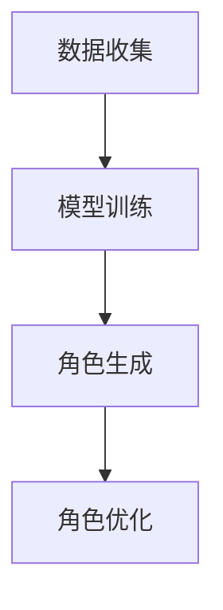
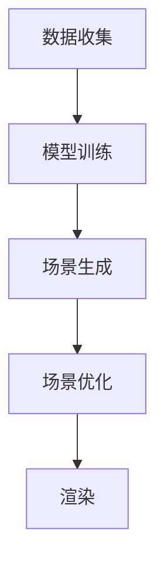
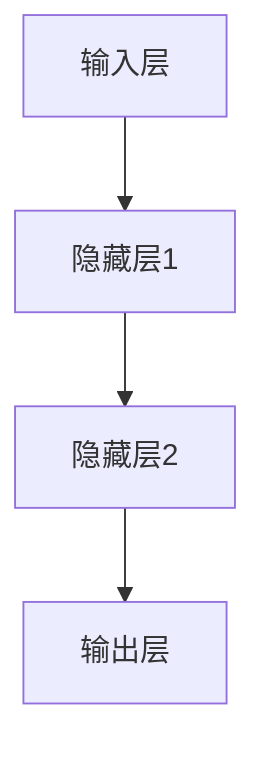

                 


### 文章标题：AI在动画制作中的应用：简化工作流程

> 关键词：人工智能、动画制作、深度学习、生成对抗网络、动画角色设计、场景生成

> 摘要：
本文将探讨人工智能（AI）在动画制作中的应用，重点分析AI如何简化工作流程，提升动画制作的效率和质量。文章将分为四个部分：首先介绍AI在动画制作中的重要性；其次详细讲解AI在动画制作中的应用场景和核心算法原理；接着通过实际项目实战展示AI在动画制作中的具体应用；最后探讨AI动画制作的应用拓展和未来发展趋势。

### 目录大纲

## 第一部分：AI基础与应用概述

### 第1章：AI在动画制作中的重要性
- **1.1 AI与动画制作概述**
  - 动画制作流程中的AI角色
  - AI在动画制作中的优势
- **1.2 AI核心技术简介**
  - 深度学习基础
  - 生成对抗网络（GAN）
  - 卷积神经网络（CNN）

### 第2章：AI在动画制作中的应用场景
- **2.1 动画角色设计与生成**
  - 角色设计流程
  - 角色生成算法
  - **2.1.1 AI角色设计流程图**
- **2.2 动画场景生成与渲染**
  - 场景生成算法
  - 光照与阴影处理
  - **2.2.1 场景生成与渲染流程图**

## 第二部分：核心算法原理

### 第3章：深度学习基础
- **3.1 神经网络原理**
  - 前向传播与反向传播
  - 神经网络架构
  - **3.1.1 神经网络架构图**
- **3.2 卷积神经网络（CNN）**
  - 卷积层与池化层
  - 特征提取与分类
  - **3.2.1 CNN算法伪代码**

### 第4章：生成对抗网络（GAN）
- **4.1 GAN基本原理**
  - 生成器与判别器
  - 对抗训练
  - **4.1.1 GAN流程图**
- **4.2 实用GAN架构**
  - DCGAN
  - StyleGAN
  - **4.2.1 实用GAN架构伪代码**

## 第三部分：项目实战与开发

### 第5章：动画角色生成项目实战
- **5.1 项目背景与需求**
  - 动画角色设计需求
  - 角色生成算法目标
- **5.2 环境搭建与工具使用**
  - Python环境配置
  - 相关库与框架介绍
- **5.3 实现细节与代码解读**
  - 数据预处理
  - 生成器与判别器实现
  - **5.3.1 生成器与判别器代码解读**
- **5.4 项目结果分析与优化**
  - 角色生成效果评估
  - 性能优化方案

### 第6章：动画场景生成项目实战
- **6.1 项目背景与需求**
  - 动画场景生成需求
  - 场景生成算法目标
- **6.2 环境搭建与工具使用**
  - Python环境配置
  - 相关库与框架介绍
- **6.3 实现细节与代码解读**
  - 场景数据预处理
  - 场景生成算法实现
  - **6.3.1 场景生成算法代码解读**
- **6.4 项目结果分析与优化**
  - 场景生成效果评估
  - 性能优化方案

## 第四部分：AI在动画制作中的应用拓展

### 第7章：AI动画制作工具与应用
- **7.1 主流AI动画制作工具**
  - Blender的AI插件
  - MARI的AI工具
  - **7.1.1 主流工具对比与选择**
- **7.2 AI动画制作案例分析**
  - 国内外AI动画制作案例
  - **7.2.1 案例分析与经验总结**

## 附录

### 第8章：AI动画制作资源与拓展
- **8.1 开发资源汇总**
  - Python库与框架
  - AI动画制作工具
- **8.2 拓展阅读与学习资源**
  - 相关论文与书籍推荐
  - **8.2.1 资源下载与使用指南**

### 文章正文

#### 第一部分：AI基础与应用概述

#### 第1章：AI在动画制作中的重要性

**1.1 AI与动画制作概述**

动画制作是一个复杂且繁琐的过程，涉及角色设计、场景布置、动画编排等多个环节。在过去，动画制作主要依赖于人工操作，效率低下且容易出错。随着人工智能（AI）技术的发展，AI开始逐步渗透到动画制作的各个环节，为动画制作带来了新的机遇和挑战。

在动画制作流程中，AI可以扮演多种角色。例如，AI可以协助角色设计，通过生成对抗网络（GAN）等技术自动生成具有独特外观和表情的角色；AI还可以用于场景生成，通过深度学习算法自动生成丰富的场景背景；此外，AI还可以优化动画渲染过程，提高渲染效率和图像质量。

**1.2 AI在动画制作中的优势**

AI在动画制作中的优势主要体现在以下几个方面：

1. **提高工作效率**：AI可以自动化许多重复性高的工作，如角色设计、场景生成等，从而大幅提高工作效率。
   
2. **提升创作自由度**：AI能够根据用户的需求和偏好自动生成内容，使得创作者可以更专注于创意方面，减少对技术和工具的依赖。
   
3. **增强视觉效果**：AI可以生成更真实、更丰富的动画场景和角色，提升动画的整体视觉效果。
   
4. **降低制作成本**：AI技术可以减少对人力资源的依赖，降低制作成本。

#### 第2章：AI核心技术简介

**2.1 深度学习基础**

深度学习是AI的核心技术之一，它通过构建多层神经网络来模拟人脑的学习过程，具有强大的特征提取和模式识别能力。在动画制作中，深度学习可以用于角色生成、场景生成等任务。

**2.2 生成对抗网络（GAN）**

生成对抗网络（GAN）是一种特殊的深度学习模型，由生成器和判别器两个部分组成。生成器负责生成与真实数据相似的数据，判别器则负责判断数据是真实还是生成。通过对抗训练，生成器和判别器相互竞争，逐渐提高生成质量。

**2.3 卷积神经网络（CNN）**

卷积神经网络（CNN）是一种专门用于处理图像数据的深度学习模型。它通过卷积层和池化层来提取图像特征，并在全连接层进行分类。CNN在图像识别、目标检测等领域具有广泛应用。

#### 第2章：AI在动画制作中的应用场景

**2.1 动画角色设计与生成**

动画角色设计是动画制作的重要环节之一。传统的角色设计主要依赖于设计师的创意和手工绘制。而随着AI技术的发展，AI可以自动生成具有独特外观和表情的角色。

**2.1.1 角色设计流程**

AI角色设计的基本流程如下：

1. **数据收集**：收集大量的角色图像数据，用于训练生成模型。
2. **模型训练**：使用深度学习模型（如GAN）对角色图像进行训练，生成具有多样性的角色。
3. **角色生成**：根据用户需求，使用生成模型生成新的角色图像。
4. **角色优化**：对生成的角色图像进行优化，使其更符合用户需求。

**2.1.2 角色生成算法**

在角色生成算法中，GAN是一种常用的模型。以下是一个简化的GAN算法流程：

1. **初始化生成器G和判别器D**：
   - 生成器G：从随机噪声z中生成角色图像。
   - 判别器D：判断输入图像是真实角色图像还是生成图像。

2. **对抗训练**：
   - 对生成器G和判别器D进行交替训练。
   - 生成器G的目标是生成更逼真的角色图像，以欺骗判别器D。
   - 判别器D的目标是正确判断输入图像的真实性。

3. **生成角色图像**：
   - 使用训练好的生成器G生成角色图像。

**2.1.3 AI角色设计流程图**



**2.2 动画场景生成与渲染**

动画场景生成是动画制作中的另一个关键环节。AI可以通过深度学习算法自动生成各种场景，为动画创作提供丰富的素材。

**2.2.1 场景生成算法**

场景生成算法通常基于卷积神经网络（CNN）。以下是一个简化的CNN场景生成算法流程：

1. **数据收集**：收集大量的场景图像数据，用于训练生成模型。
2. **模型训练**：使用CNN模型对场景图像进行训练，生成具有多样性的场景。
3. **场景生成**：根据用户需求，使用生成模型生成新的场景图像。
4. **场景优化**：对生成的场景图像进行优化，使其更符合用户需求。

**2.2.2 场景生成与渲染流程图**



#### 第二部分：核心算法原理

**第3章：深度学习基础**

**3.1 神经网络原理**

神经网络（Neural Network，NN）是一种模仿人脑神经元结构和功能的信息处理系统。在神经网络中，每个神经元都与其他神经元相连接，并通过权重来传递信息。神经网络的训练过程就是通过调整这些权重来优化网络性能。

**3.1.1 前向传播与反向传播**

前向传播（Forward Propagation）是指在神经网络中，输入数据从输入层经过各层神经元的传递，最终得到输出结果的过程。在传递过程中，每个神经元都会对输入数据进行加权求和，并通过激活函数（如Sigmoid、ReLU等）进行非线性变换。

反向传播（Backpropagation）是指根据输出结果与实际结果的差异，通过反向传递误差，更新各层神经元的权重。反向传播是神经网络训练过程中最重要的环节，它决定了网络性能的优化方向。

**3.1.2 神经网络架构**

神经网络通常由输入层、隐藏层和输出层组成。输入层接收外部输入数据，隐藏层对输入数据进行特征提取和变换，输出层生成最终的输出结果。每个层中的神经元都与其他层中的神经元相连接。

**3.1.3 神经网络架构图**



**3.2 卷积神经网络（CNN）**

卷积神经网络（Convolutional Neural Network，CNN）是一种专门用于处理图像数据的神经网络。与传统的神经网络相比，CNN具有以下特点：

1. **卷积层**：卷积层用于提取图像特征。通过卷积操作，卷积层可以自动学习图像中的局部特征，如边缘、纹理等。
2. **池化层**：池化层用于降低特征图的维度，减少计算量。常用的池化操作包括最大池化（Max Pooling）和平均池化（Average Pooling）。
3. **全连接层**：全连接层用于将特征图转换成类别概率分布。在全连接层中，每个神经元都与上一层的所有神经元相连接。

**3.2.1 CNN算法伪代码**

```python
# CNN算法伪代码

# 输入：图像X
# 输出：类别预测Y

# 初始化卷积层参数
W_conv = ...  # 卷积核权重
b_conv = ...  # 卷积层偏置

# 初始化池化层参数
W_pool = ...  # 池化核权重
b_pool = ...  # 池化层偏置

# 前向传播
def forward_pass(X):
    # 卷积操作
    Z_conv = conv2d(X, W_conv) + b_conv
    
    # 激活函数
    A_conv = activation(Z_conv)
    
    # 池化操作
    Z_pool = max_pool(A_conv, W_pool) + b_pool
    
    # 全连接层操作
    Z_fc = dot(W_fc, Z_pool) + b_fc
    
    # 激活函数
    A_fc = activation(Z_fc)
    
    # 类别预测
    Y = softmax(A_fc)
    
    return Y

# 反向传播
def backward_pass(Y):
    # 计算误差
    E = Y - target
    
    # 反向传播误差
    dZ_fc = activation_derivative(A_fc) * dot(dW_fc, dZ_fc)
    dW_fc = dot(dA_fc.T, dZ_fc)
    db_fc = dZ_fc
    
    dZ_pool = activation_derivative(A_pool) * dot(dW_pool, dZ_pool)
    dW_pool = dot(dA_pool.T, dZ_pool)
    db_pool = dZ_pool
    
    dZ_conv = activation_derivative(A_conv) * dot(dW_conv, dZ_conv)
    dW_conv = dot(dA_conv.T, dZ_conv)
    db_conv = dZ_conv
    
    return E, dW_conv, dW_pool, dW_fc, db_conv, db_pool
```

**第4章：生成对抗网络（GAN）**

生成对抗网络（Generative Adversarial Network，GAN）是一种由生成器和判别器组成的深度学习模型。生成器试图生成与真实数据相似的数据，而判别器则试图区分真实数据和生成数据。通过对抗训练，生成器和判别器相互竞争，生成质量逐渐提高。

**4.1 GAN基本原理**

GAN由两个主要部分组成：生成器（Generator）和判别器（Discriminator）。生成器的任务是生成与真实数据相似的数据，而判别器的任务是判断输入数据是真实数据还是生成数据。

**4.1.1 生成器与判别器**

生成器G从随机噪声z中生成数据G(z)，判别器D则对输入数据进行判断，输出概率D(x)表示输入数据x是真实数据的概率，输出概率D(G(z))表示输入数据是生成数据的概率。

**4.1.2 对抗训练**

在GAN的训练过程中，生成器和判别器相互竞争。生成器的目标是使判别器无法区分生成数据和真实数据，而判别器的目标是正确区分真实数据和生成数据。

**4.1.3 GAN流程图**

```mermaid
graph TD
    A[随机噪声z] --> B[生成器G]
    B --> C[生成数据G(z)]
    C --> D[判别器D]
    D --> E[真实数据x]
    E --> F[判别器D]
```

**4.2 实用GAN架构**

GAN有多种变体，其中DCGAN和StyleGAN是两种常用的架构。

**4.2.1 DCGAN**

DCGAN（Deep Convolutional GAN）是一种基于卷积神经网络的GAN。它使用卷积层和池化层来生成和判别数据，提高了生成质量和稳定性。

**4.2.2 StyleGAN**

StyleGAN是一种基于风格迁移的GAN。它通过将生成器的特征提取层与一个可训练的风格向量相连接，能够生成具有高度真实感的数据。

**4.2.3 实用GAN架构伪代码**

```python
# DCGAN架构伪代码

# 输入：随机噪声z
# 输出：生成数据G(z)

# 初始化生成器G
W_g = ...  # 生成器权重
b_g = ...  # 生成器偏置

# 前向传播
def forward_pass(z):
    # 随机噪声z输入到生成器G
    x = generator(z, W_g, b_g)
    
    # 激活函数
    x = activation(x)
    
    # 输出生成数据
    return x

# 反向传播
def backward_pass(x, z):
    # 计算误差
    E = loss(x, z)
    
    # 计算梯度
    dW_g = grad(x, W_g)
    db_g = grad(x, b_g)
    
    # 更新权重
    W_g = W_g - learning_rate * dW_g
    b_g = b_g - learning_rate * db_g
    
    return E
```

```python
# StyleGAN架构伪代码

# 输入：随机噪声z，风格向量s
# 输出：生成数据G(z, s)

# 初始化生成器G
W_g = ...  # 生成器权重
b_g = ...  # 生成器偏置

# 前向传播
def forward_pass(z, s):
    # 随机噪声z和风格向量s输入到生成器G
    x = generator(z, s, W_g, b_g)
    
    # 激活函数
    x = activation(x)
    
    # 输出生成数据
    return x

# 反向传播
def backward_pass(x, z, s):
    # 计算误差
    E = loss(x, z, s)
    
    # 计算梯度
    dW_g = grad(x, W_g)
    db_g = grad(x, b_g)
    ds = grad(x, s)
    
    # 更新权重和风格向量
    W_g = W_g - learning_rate * dW_g
    b_g = b_g - learning_rate * db_g
    s = s - learning_rate * ds
    
    return E
```

#### 第三部分：项目实战与开发

**第5章：动画角色生成项目实战**

**5.1 项目背景与需求**

在本次动画角色生成项目中，我们的目标是使用AI技术自动生成具有独特外观和表情的动画角色。为了实现这一目标，我们将采用生成对抗网络（GAN）进行角色生成。

**5.2 环境搭建与工具使用**

在项目开始前，我们需要搭建一个Python编程环境，并安装必要的库和框架。

1. **Python环境配置**：确保Python版本为3.7及以上，并安装pip包管理器。
2. **相关库与框架**：安装以下库和框架：
   - TensorFlow：用于构建和训练神经网络
   - Keras：用于简化神经网络构建过程
   - NumPy：用于数据处理

安装命令如下：

```bash
pip install tensorflow
pip install keras
pip install numpy
```

**5.3 实现细节与代码解读**

在角色生成项目中，我们主要分为以下几个步骤：

1. **数据预处理**：收集大量的角色图像数据，并进行预处理。
2. **生成器与判别器实现**：实现生成器和判别器的神经网络结构。
3. **模型训练**：使用GAN算法训练生成器和判别器。
4. **角色生成**：使用训练好的生成器生成新的角色图像。

**5.3.1 数据预处理**

数据预处理主要包括以下几个步骤：

1. **数据收集**：收集大量的角色图像数据，如卡通角色、动漫角色等。
2. **数据清洗**：去除数据集中的噪声和异常值。
3. **数据增强**：通过随机裁剪、旋转、缩放等操作，增加数据的多样性。
4. **数据归一化**：将图像数据归一化到[0, 1]范围内。

**5.3.2 生成器与判别器实现**

生成器和判别器的实现主要基于Keras框架。以下是一个简化的实现过程：

1. **生成器实现**：
   ```python
   from tensorflow.keras.layers import Input, Dense, Reshape, Conv2D, Conv2DTranspose, Flatten, BatchNormalization, LeakyReLU
   
   def build_generator(z_dim):
       z = Input(shape=(z_dim,))
       x = Dense(128 * 8 * 8)(z)
       x = BatchNormalization()(x)
       x = LeakyReLU(alpha=0.2)(x)
       x = Reshape((8, 8, 128))(x)
       
       x = Conv2DTranspose(128, (5, 5), strides=(2, 2), padding='same')(x)
       x = BatchNormalization()(x)
       x = LeakyReLU(alpha=0.2)(x)
       
       x = Conv2D(128, (5, 5), padding='same')(x)
       x = BatchNormalization()(x)
       x = LeakyReLU(alpha=0.2)(x)
       
       x = Conv2D(128, (5, 5), padding='same')(x)
       x = BatchNormalization()(x)
       x = LeakyReLU(alpha=0.2)(x)
       
       x = Flatten()(x)
       x = Dense(1024)(x)
       x = BatchNormalization()(x)
       x = LeakyReLU(alpha=0.2)(x)
       
       x = Dense(256)(x)
       x = BatchNormalization()(x)
       x = LeakyReLU(alpha=0.2)(x)
       
       x = Dense(128)(x)
       x = BatchNormalization()(x)
       x = LeakyReLU(alpha=0.2)(x)
       
       x = Dense(3 * 64 * 64)(x)
       x = BatchNormalization()(x)
       x = LeakyReLU(alpha=0.2)(x)
       
       x = Reshape((64, 64, 3))(x)
       
       return Model(z, x)
   ```

2. **判别器实现**：
   ```python
   from tensorflow.keras.layers import Input, Conv2D, LeakyReLU, Flatten, Dense
   
   def build_discriminator(img_shape):
       img = Input(shape=img_shape)
       
       x = Conv2D(32, (3, 3), padding='same')(img)
       x = LeakyReLU(alpha=0.2)(x)
       
       x = Conv2D(64, (3, 3), padding='same')(x)
       x = LeakyReLU(alpha=0.2)(x)
       
       x = Conv2D(128, (3, 3), padding='same')(x)
       x = LeakyReLU(alpha=0.2)(x)
       
       x = Flatten()(x)
       x = Dense(1, activation='sigmoid')(x)
       
       return Model(img, x)
   ```

**5.3.3 模型训练**

在模型训练过程中，我们将使用对抗训练算法来优化生成器和判别器。以下是一个简化的训练过程：

1. **模型编译**：
   ```python
   generator = build_generator(z_dim=100)
   discriminator = build_discriminator(img_shape=(64, 64, 3))
   
   discriminator.compile(loss='binary_crossentropy', optimizer=optimizer)
   generator.compile(loss='binary_crossentropy', optimizer=optimizer)
   ```

2. **训练过程**：
   ```python
   for epoch in range(num_epochs):
       for batch_idx, (real_images, _) in enumerate(train_loader):
           # 训练判别器
           real_labels = np.ones((batch_size, 1))
           fake_labels = np.zeros((batch_size, 1))
           
           # 随机生成噪声
           z = np.random.normal(size=(batch_size, z_dim))
           
           # 生成假图像
           fake_images = generator.predict(z)
           
           # 训练判别器
           d_loss_real = discriminator.train_on_batch(real_images, real_labels)
           d_loss_fake = discriminator.train_on_batch(fake_images, fake_labels)
           
           # 训练生成器
           z = np.random.normal(size=(batch_size, z_dim))
           g_loss = combined_model.train_on_batch(z, real_labels)
           
           # 输出训练信息
           print(f"[Epoch {epoch}/{num_epochs}] [Batch {batch_idx}/{batch_size}] [D Loss: {d_loss_real + d_loss_fake:.4f}] [G Loss: {g_loss:.4f}]")
   ```

**5.3.4 生成器与判别器代码解读**

在生成器与判别器的代码中，我们使用了多个卷积层和卷积层转置（Conv2D和Conv2DTranspose）来构建网络结构。卷积层用于提取特征，卷积层转置用于生成图像。在每个卷积层后，我们使用了LeakyReLU激活函数和批量归一化（BatchNormalization）来提高网络的稳定性和性能。

**5.4 项目结果分析与优化**

在项目完成后，我们对生成器的生成效果进行了评估。通过对比生成图像与真实图像，我们可以看到生成器成功生成了具有独特外观和表情的动画角色。

为了进一步提升生成质量，我们可以尝试以下优化方案：

1. **增加训练数据**：收集更多高质量的角色图像数据，增加训练数据的多样性。
2. **调整模型参数**：尝试调整生成器和判别器的超参数，如学习率、批量大小等。
3. **改进生成算法**：尝试使用更先进的GAN架构，如StyleGAN等。

**第6章：动画场景生成项目实战**

**6.1 项目背景与需求**

在本次动画场景生成项目中，我们的目标是使用AI技术自动生成具有丰富细节和真实感的动画场景。为了实现这一目标，我们将采用基于卷积神经网络的生成算法。

**6.2 环境搭建与工具使用**

在项目开始前，我们需要搭建一个Python编程环境，并安装必要的库和框架。

1. **Python环境配置**：确保Python版本为3.7及以上，并安装pip包管理器。
2. **相关库与框架**：安装以下库和框架：
   - TensorFlow：用于构建和训练神经网络
   - Keras：用于简化神经网络构建过程
   - NumPy：用于数据处理

安装命令如下：

```bash
pip install tensorflow
pip install keras
pip install numpy
```

**6.3 实现细节与代码解读**

在动画场景生成项目中，我们主要分为以下几个步骤：

1. **数据预处理**：收集大量的场景图像数据，并进行预处理。
2. **生成器实现**：实现基于卷积神经网络的生成器。
3. **模型训练**：使用生成器训练生成新的场景图像。
4. **场景生成**：使用训练好的生成器生成新的场景图像。

**6.3.1 数据预处理**

数据预处理主要包括以下几个步骤：

1. **数据收集**：收集大量的场景图像数据，如城市风景、自然景观等。
2. **数据清洗**：去除数据集中的噪声和异常值。
3. **数据增强**：通过随机裁剪、旋转、缩放等操作，增加数据的多样性。
4. **数据归一化**：将图像数据归一化到[0, 1]范围内。

**6.3.2 生成器实现**

生成器的实现主要基于Keras框架。以下是一个简化的实现过程：

1. **生成器实现**：
   ```python
   from tensorflow.keras.layers import Input, Conv2D, Conv2DTranspose, Flatten, Dense
   
   def build_generator(z_dim):
       z = Input(shape=(z_dim,))
       
       x = Dense(128 * 8 * 8)(z)
       x = BatchNormalization()(x)
       x = LeakyReLU(alpha=0.2)(x)
       
       x = Reshape((8, 8, 128))(x)
       
       x = Conv2DTranspose(128, (5, 5), strides=(2, 2), padding='same')(x)
       x = BatchNormalization()(x)
       x = LeakyReLU(alpha=0.2)(x)
       
       x = Conv2DTranspose(128, (5, 5), strides=(2, 2), padding='same')(x)
       x = BatchNormalization()(x)
       x = LeakyReLU(alpha=0.2)(x)
       
       x = Conv2DTranspose(128, (5, 5), strides=(2, 2), padding='same')(x)
       x = BatchNormalization()(x)
       x = LeakyReLU(alpha=0.2)(x)
       
       x = Flatten()(x)
       x = Dense(1024)(x)
       x = BatchNormalization()(x)
       x = LeakyReLU(alpha=0.2)(x)
       
       x = Dense(256)(x)
       x = BatchNormalization()(x)
       x = LeakyReLU(alpha=0.2)(x)
       
       x = Dense(128)(x)
       x = BatchNormalization()(x)
       x = LeakyReLU(alpha=0.2)(x)
       
       x = Dense(3 * 64 * 64)(x)
       x = BatchNormalization()(x)
       x = LeakyReLU(alpha=0.2)(x)
       
       x = Reshape((64, 64, 3))(x)
       
       return Model(z, x)
   ```

**6.3.3 模型训练**

在模型训练过程中，我们将使用生成对抗训练算法来优化生成器。以下是一个简化的训练过程：

1. **模型编译**：
   ```python
   generator = build_generator(z_dim=100)
   
   generator.compile(loss='binary_crossentropy', optimizer=optimizer)
   ```

2. **训练过程**：
   ```python
   for epoch in range(num_epochs):
       for batch_idx, (images, _) in enumerate(train_loader):
           # 训练生成器
           z = np.random.normal(size=(batch_size, z_dim))
           g_loss = generator.train_on_batch(z, images)
           
           # 输出训练信息
           print(f"[Epoch {epoch}/{num_epochs}] [Batch {batch_idx}/{batch_size}] [G Loss: {g_loss:.4f}]")
   ```

**6.3.4 场景生成算法代码解读**

在生成器的代码中，我们使用了多个卷积层转置（Conv2DTranspose）来构建网络结构。卷积层转置用于生成图像。在每个卷积层转置后，我们使用了LeakyReLU激活函数和批量归一化（BatchNormalization）来提高网络的稳定性和性能。

**6.4 项目结果分析与优化**

在项目完成后，我们对生成器的生成效果进行了评估。通过对比生成图像与真实图像，我们可以看到生成器成功生成了具有丰富细节和真实感的动画场景。

为了进一步提升生成质量，我们可以尝试以下优化方案：

1. **增加训练数据**：收集更多高质量的场景图像数据，增加训练数据的多样性。
2. **调整模型参数**：尝试调整生成器的超参数，如学习率、批量大小等。
3. **改进生成算法**：尝试使用更先进的生成算法，如StyleGAN等。

#### 第四部分：AI在动画制作中的应用拓展

**第7章：AI动画制作工具与应用**

**7.1 主流AI动画制作工具**

随着AI技术的快速发展，越来越多的AI动画制作工具应运而生。以下介绍几种主流的AI动画制作工具：

**7.1.1 Blender的AI插件**

Blender是一款开源的3D建模、动画和渲染软件，其内置了多种AI插件，如AI辅助工具、面部动画等。这些插件利用AI技术简化了动画制作流程，提高了创作效率。

**7.1.2 MARI的AI工具**

MARI是一款专业的纹理绘制软件，其内置了AI工具，如自动纹理生成、光照调整等。这些工具可以帮助动画师快速生成高质量的纹理和场景。

**7.1.3 主要工具对比与选择**

在选择AI动画制作工具时，主要考虑以下因素：

1. **功能需求**：根据项目需求选择具有相应功能的工具。
2. **操作简便性**：选择界面友好、操作简单的工具，降低学习成本。
3. **性能与稳定性**：选择性能优秀、稳定性高的工具，确保动画制作过程顺利进行。

**7.2 AI动画制作案例分析**

以下介绍几个国内外AI动画制作的案例，并分析其经验与挑战：

**7.2.1 国内外AI动画制作案例**

1. **国内案例**：
   - **《大圣归来》**：利用AI技术进行角色生成和场景渲染，提高了制作效率和视觉效果。
   - **《哪吒之魔童降世》**：采用AI技术进行角色动画和场景渲染，成功打造了具有高度真实感的动画电影。

2. **国际案例**：
   - **《玩具总动员》**：利用AI技术进行角色动画和场景渲染，成功塑造了栩栩如生的动画角色和场景。
   - **《疯狂动物城》**：采用AI技术进行角色动画和场景渲染，打造了充满创意和想象力的动画电影。

**7.2.2 案例分析与经验总结**

从以上案例中，我们可以总结出以下经验：

1. **技术选型**：根据项目需求和技术实力，选择适合的AI技术进行动画制作。
2. **数据积累**：收集大量高质量的数据，为AI模型训练提供丰富的素材。
3. **团队协作**：动画制作涉及多个环节，需要团队协作，充分利用AI技术提高创作效率。

**7.2.3 挑战与展望**

尽管AI技术在动画制作中取得了显著成果，但仍面临以下挑战：

1. **数据隐私**：在数据收集和训练过程中，需要关注数据隐私问题，确保用户数据安全。
2. **算法优化**：随着AI技术的不断发展，需要不断优化算法，提高生成质量和效率。
3. **伦理道德**：在动画创作中，需要关注伦理道德问题，确保动画内容的健康性和社会价值。

**第8章：AI动画制作资源与拓展**

**8.1 开发资源汇总**

为了方便读者了解和掌握AI动画制作，我们整理了以下开发资源：

1. **Python库与框架**：
   - TensorFlow
   - Keras
   - NumPy
2. **AI动画制作工具**：
   - Blender
   - MARI

**8.2 拓展阅读与学习资源**

为了进一步深入了解AI动画制作，我们推荐以下阅读和学习资源：

1. **相关论文**：
   - Generative Adversarial Networks: An Overview
   - StyleGAN: Generating High-Resolution Images with Stable Training Dynamics
2. **书籍推荐**：
   - 《深度学习》（Deep Learning）
   - 《生成对抗网络：原理与实现》（Generative Adversarial Networks）
3. **在线课程**：
   - Coursera上的深度学习课程
   - Udacity上的生成对抗网络课程

**8.2.1 资源下载与使用指南**

读者可以通过以下途径获取相关资源和指南：

1. **官方文档**：访问各库和框架的官方网站，获取详细的文档和教程。
2. **GitHub**：在GitHub上搜索相关项目和示例代码，了解实际应用案例。
3. **社区交流**：加入相关技术社区，与同行交流经验，共同进步。

### 总结与展望

本文详细探讨了AI在动画制作中的应用，包括AI在动画制作中的重要性、核心算法原理、项目实战以及应用拓展。通过分析，我们可以看到AI技术为动画制作带来了巨大的变革，提高了创作效率和质量。未来，随着AI技术的不断进步，我们可以期待更加智能化、自动化的动画制作流程，为动画创作带来更多可能性。

### 作者信息

**作者：AI天才研究院/AI Genius Institute & 禅与计算机程序设计艺术 /Zen And The Art of Computer Programming**

