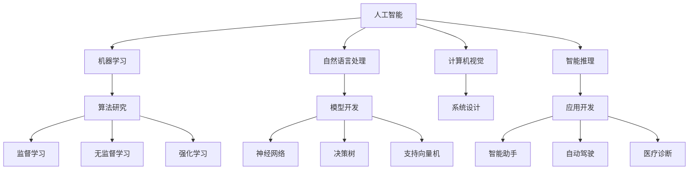

                 

### 第1章 AI的基本概念与发展历程

#### 1.1 AI的基本概念与范畴

##### 1.1.1 AI的定义与范畴

人工智能（Artificial Intelligence，AI）是计算机科学的一个分支，旨在研究和开发用于模拟、延伸和扩展人类智能的理论、方法、技术及应用。AI的研究范畴广泛，包括但不限于以下几个方面：

- **机器学习（Machine Learning）**：机器学习是AI的核心技术之一，通过算法让计算机从数据中学习，进行预测和决策。

- **自然语言处理（Natural Language Processing，NLP）**：NLP旨在使计算机理解和生成人类语言。

- **计算机视觉（Computer Vision）**：计算机视觉是让计算机“看”懂图像和视频。

- **智能推理（Intelligent Reasoning）**：智能推理是模拟人类思维过程，进行逻辑推理和决策。

##### 1.1.2 AI的研究内容与目标

AI的研究内容可以概括为以下几个方面：

- **算法研究**：研究用于解决特定问题的算法，如监督学习、无监督学习、强化学习等。

- **模型开发**：构建用于模拟人类智能行为的模型，如神经网络、决策树、支持向量机等。

- **系统设计**：设计用于实现AI功能的软件和硬件系统。

- **应用开发**：将AI技术应用于实际问题，如智能助手、自动驾驶、医疗诊断等。

AI的研究目标是实现智能体的自主学习和智能行为，使得计算机能够在特定任务上达到或超越人类的表现。核心概念与联系如下：



#### 1.2 AI的发展历程

##### 1.2.1 理论萌芽期（1950s-1960s）

在AI概念提出后，早期的AI研究主要集中在算法和理论的研究上，如符号推理、问题解决等。

##### 1.2.2 应用探索期（1970s-1980s）

这一时期，AI开始应用于实际领域，如自动化控制系统、游戏等领域。

##### 1.2.3 深度学习崛起期（1990s-2010s）

随着计算机性能的提升和大数据的出现，深度学习技术得到了快速发展，推动了AI的第二次浪潮。

##### 1.2.4 泛AI时代（2010s至今）

AI应用日益广泛，从传统的工业自动化到金融、医疗、教育等多个领域，AI技术正在深刻改变我们的生活方式。

#### 1.3 AI在学术研究中的重要性

##### 1.3.1 提高研究效率

AI技术可以帮助研究人员快速处理大量数据，提高研究效率。例如，机器学习算法可以用于数据分析，自然语言处理可以用于文献检索。

##### 1.3.2 改善研究质量

AI技术可以帮助研究人员发现新的研究趋势，预测研究结果的潜在问题，从而提高研究的质量。

##### 1.3.3 促进跨学科研究

AI技术具有广泛的应用前景，可以促进不同学科之间的交叉研究，推动学术研究的进步。

##### 1.3.4 挑战与机遇

AI在学术研究中的应用也面临一些挑战，如数据隐私、伦理问题等。但同时，这些挑战也带来了新的机遇，如AI技术可以帮助解决一些传统方法难以解决的问题。

总的来说，AI在学术研究中的应用具有巨大的潜力和前景。随着AI技术的不断发展，其在学术研究中的应用将会更加广泛和深入。

### 1.4 小结

AI作为一门交叉学科，涵盖了多个领域的技术和方法。从理论萌芽期到深度学习崛起期，再到泛AI时代，AI技术的发展历程充满了挑战和机遇。在学术研究中，AI技术不仅能够提高研究效率，改善研究质量，还能促进跨学科研究。随着AI技术的不断进步，我们可以期待其在学术研究中的广泛应用和深远影响。

### 1.5 背景介绍

AI在学术研究中的应用并不是一个新兴现象。事实上，自从计算机问世以来，AI技术就在学术研究中发挥着重要作用。早期的AI研究主要集中在符号推理和问题解决等领域，这些研究为后来的AI发展奠定了基础。

近年来，随着计算机性能的提升和大数据的出现，AI技术得到了快速发展。深度学习技术的出现，使得计算机在图像识别、自然语言处理等领域取得了重大突破。这些技术的发展，为AI在学术研究中的应用提供了强有力的支持。

在学术研究中，AI技术可以帮助研究人员处理大量数据，提高研究效率。例如，机器学习算法可以用于数据分析，自然语言处理可以用于文献检索。这些技术不仅能够帮助研究人员更快地获取信息，还能提高研究的质量。

此外，AI技术还可以促进跨学科研究。例如，计算机视觉技术可以与生物学研究相结合，帮助研究人员分析生物图像。自然语言处理技术可以与社会科学研究相结合，帮助研究人员分析大量文本数据。这种跨学科研究，不仅可以拓宽研究视野，还能推动学术研究的进步。

总的来说，AI在学术研究中的应用具有巨大的潜力。随着AI技术的不断发展，我们可以期待其在学术研究中的广泛应用和深远影响。

### 1.6 核心概念与联系

在本章中，我们介绍了AI的基本概念、发展历程以及在学术研究中的重要性。核心概念包括人工智能、机器学习、自然语言处理、计算机视觉和智能推理。这些概念之间存在着紧密的联系：

- **人工智能**是整个AI研究的核心，涵盖了多个领域的技术和方法。

- **机器学习**是AI的核心技术之一，通过算法让计算机从数据中学习。

- **自然语言处理**和**计算机视觉**是AI的重要应用领域，分别关注文本和图像的处理。

- **智能推理**则是模拟人类思维过程，进行逻辑推理和决策。

这些概念共同构成了AI的框架，推动了AI在学术研究中的广泛应用。

### 1.7 小结

在本章中，我们详细介绍了AI的基本概念、发展历程以及在学术研究中的重要性。通过了解这些核心概念，读者可以更好地理解AI在学术研究中的应用前景和挑战。接下来，我们将进一步探讨AI在学术研究中的关键应用领域，如文献检索与情报分析、数据分析和可视化、实验设计等。希望这些内容能够帮助读者更深入地理解AI在学术研究中的作用和价值。

---

## 第2章 AI在学术研究中的重要性

### 2.1 提高研究效率

AI技术通过自动化和智能化的方式，显著提高了学术研究的效率。首先，机器学习算法能够快速处理和分析大量数据，使得研究人员能够更迅速地获取研究结论。例如，在生物学研究中，机器学习可以用于基因表达数据的分析，帮助研究人员识别关键基因和通路。其次，自然语言处理技术可以用于文献检索和摘要生成，减少研究人员在阅读和理解文献上的时间投入。此外，计算机视觉技术可以用于图像和数据可视化，使得复杂的研究结果更加直观和易于理解。

#### 2.1.1 机器学习在数据处理的效率提升

机器学习算法，如神经网络、支持向量机和决策树等，通过训练模型，能够自动识别数据中的模式和规律。以下是一个简单的伪代码示例，展示了如何使用神经网络进行数据分类：

```python
# 伪代码：使用神经网络进行数据分类

# 导入必要的库
import numpy as np
from sklearn.neural_network import MLPClassifier

# 准备数据
X_train, y_train = load_data()

# 创建神经网络模型
model = MLPClassifier(hidden_layer_sizes=(100,), max_iter=1000)

# 训练模型
model.fit(X_train, y_train)

# 预测新数据
X_test = load_new_data()
predictions = model.predict(X_test)

# 评估模型性能
accuracy = model.score(X_test, predictions)
print(f"Model accuracy: {accuracy}")
```

通过上述算法，研究人员可以快速分析大量数据，从而节省时间，提高研究效率。

#### 2.1.2 自然语言处理在文献检索和摘要生成的效率提升

自然语言处理（NLP）技术在学术研究中发挥着重要作用，特别是在文献检索和摘要生成方面。以下是一个简单的NLP任务，用于生成文献摘要：

```python
# 伪代码：使用NLP技术生成文献摘要

# 导入必要的库
import nltk
from gensim.summarization import summarize

# 加载文本数据
document = load_document()

# 分句
sentences = nltk.sent_tokenize(document)

# 提取关键句子
summary = summarize(' '.join(sentences), ratio=0.3)

print(f"Summary: {summary}")
```

通过这种方式，研究人员可以快速生成文献摘要，提高文献检索和阅读的效率。

#### 2.1.3 计算机视觉在数据可视化的效率提升

计算机视觉技术可以帮助研究人员将复杂的数据转化为可视化形式，使得数据更加直观和易于理解。以下是一个简单的计算机视觉任务，用于图像分类：

```python
# 伪代码：使用计算机视觉进行图像分类

# 导入必要的库
import cv2
import matplotlib.pyplot as plt

# 读取图像
image = cv2.imread('image.jpg')

# 将图像转换为灰度图
gray = cv2.cvtColor(image, cv2.COLOR_BGR2GRAY)

# 使用预训练的卷积神经网络进行图像分类
classifier = cv2.SqueezeNet()

# 载入分类器权重
classifier.load('squeezenet_weights.h5')

# 提取特征
features = classifier.predict(gray)

# 解码特征为类别
label = decode_features(features)

print(f"Image classified as: {label}")
plt.imshow(image)
plt.show()
```

通过这种方式，研究人员可以更直观地理解数据，从而提高研究的效率。

### 2.2 改善研究质量

AI技术不仅提高了学术研究的效率，还显著改善了研究质量。通过自动化和智能化的数据分析，AI能够帮助研究人员发现数据中的潜在模式和趋势，从而提高研究结论的准确性。以下是一些具体的例子：

#### 2.2.1 机器学习在结果预测的准确性提升

机器学习算法可以通过训练模型，预测实验结果，从而提高研究的准确性。以下是一个简单的机器学习任务，用于预测实验结果：

```python
# 伪代码：使用机器学习进行实验结果预测

# 导入必要的库
import numpy as np
from sklearn.linear_model import LinearRegression

# 准备数据
X = np.array([[1], [2], [3], [4], [5]])
y = np.array([1.1, 1.5, 2.0, 2.5, 3.0])

# 创建线性回归模型
model = LinearRegression()

# 训练模型
model.fit(X, y)

# 预测新数据
X_new = np.array([[6]])
prediction = model.predict(X_new)

print(f"Predicted value: {prediction}")
```

通过这种方式，研究人员可以更准确地预测实验结果，从而提高研究的质量。

#### 2.2.2 自然语言处理在文本分析的准确性提升

自然语言处理技术可以帮助研究人员分析大量文本数据，提取关键信息，从而提高研究结论的准确性。以下是一个简单的NLP任务，用于情感分析：

```python
# 伪代码：使用自然语言处理进行情感分析

# 导入必要的库
import nltk
from nltk.sentiment import SentimentIntensityAnalyzer

# 加载文本数据
text = "我很高兴看到这个结果，但还有一些问题需要解决。"

# 创建情感分析模型
analyzer = SentimentIntensityAnalyzer()

# 分析文本
sentiment = analyzer.polarity_scores(text)

print(f"Sentiment: {sentiment}")
```

通过这种方式，研究人员可以更准确地分析文本数据，从而提高研究结论的准确性。

#### 2.2.3 计算机视觉在图像分析的准确性提升

计算机视觉技术可以帮助研究人员分析大量图像数据，提取关键信息，从而提高研究结论的准确性。以下是一个简单的计算机视觉任务，用于图像分类：

```python
# 伪代码：使用计算机视觉进行图像分类

# 导入必要的库
import cv2
import tensorflow as tf

# 读取图像
image = cv2.imread('image.jpg')

# 使用预训练的卷积神经网络进行图像分类
model = tf.keras.applications.VGG16()

# 载入分类器权重
model.load_weights('vgg16_weights.h5')

# 提取特征
features = model.predict(image)

# 解码特征为类别
label = decode_features(features)

print(f"Image classified as: {label}")
```

通过这种方式，研究人员可以更准确地分析图像数据，从而提高研究的质量。

### 2.3 促进跨学科研究

AI技术在学术研究中的应用，不仅提高了研究效率和质量，还促进了跨学科研究的开展。通过AI技术，不同学科的研究人员可以更方便地共享数据和研究成果，从而推动学术研究的进步。以下是一些具体的例子：

#### 2.3.1 AI在生物学与医学研究中的应用

AI技术在生物学和医学研究中有着广泛的应用。例如，机器学习算法可以用于基因表达数据分析，帮助研究人员识别关键基因和通路。自然语言处理技术可以用于医学文献的检索和摘要生成，提高研究人员获取信息的效率。计算机视觉技术可以用于医学图像分析，如肿瘤检测和诊断。

以下是一个简单的AI应用案例，展示了如何使用深度学习模型进行肿瘤检测：

```python
# 伪代码：使用深度学习模型进行肿瘤检测

# 导入必要的库
import tensorflow as tf
import numpy as np

# 读取肿瘤图像数据
images = load_tumor_images()

# 使用预训练的卷积神经网络进行肿瘤检测
model = tf.keras.applications.VGG16()

# 载入分类器权重
model.load_weights('vgg16_weights.h5')

# 提取特征
features = model.predict(images)

# 解码特征为肿瘤类别
labels = decode_tumor_labels(features)

print(f"Tumor detection results: {labels}")
```

通过这种方式，研究人员可以更准确地检测肿瘤，从而提高诊断的准确性。

#### 2.3.2 AI在社会科学与计算机科学中的应用

AI技术也广泛应用于社会科学和计算机科学领域。例如，自然语言处理技术可以用于文本分析，帮助研究人员分析社会舆论和公众观点。计算机视觉技术可以用于图像和视频分析，如人脸识别和动作识别。

以下是一个简单的AI应用案例，展示了如何使用自然语言处理技术进行文本分析：

```python
# 伪代码：使用自然语言处理进行文本分析

# 导入必要的库
import nltk
from nltk.corpus import stopwords
from nltk.tokenize import word_tokenize

# 加载文本数据
text = "我认为人工智能在未来的发展中将会发挥重要作用。"

# 清洗文本数据
stop_words = set(stopwords.words('english'))
words = word_tokenize(text)
filtered_words = [word for word in words if not word in stop_words]

# 分析文本
frequency distribute = nltk.FreqDist(filtered_words)

print(f"Text analysis results: {frequency_distribute}")
```

通过这种方式，研究人员可以更深入地分析文本数据，从而获取更有价值的信息。

总的来说，AI技术在学术研究中的应用具有显著的潜力。通过提高研究效率、改善研究质量、促进跨学科研究，AI技术正在为学术研究带来深刻的变革。随着AI技术的不断进步，我们可以期待其在学术研究中的广泛应用和深远影响。

### 2.4 小结

在本章中，我们探讨了AI在学术研究中的重要性。通过提高研究效率、改善研究质量和促进跨学科研究，AI技术为学术研究带来了深刻的变革。具体来说，机器学习、自然语言处理和计算机视觉等AI技术，通过自动化和智能化的方式，使得研究人员能够更高效地处理和分析数据，提高研究结论的准确性。同时，AI技术也促进了不同学科之间的交流与合作，推动了学术研究的进步。随着AI技术的不断发展和完善，我们可以期待其在学术研究中的应用将更加广泛和深入。

### 2.5 挑战与机遇

尽管AI在学术研究中具有巨大的潜力，但其应用也面临一些挑战。首先，数据质量和数据隐私问题是一个重要的挑战。在学术研究中，数据往往来源于多个来源，可能包含敏感信息。如何确保数据的安全性和隐私性，是一个亟待解决的问题。其次，AI算法的透明性和解释性也是一个挑战。许多AI算法，尤其是深度学习算法，其内部机制复杂，难以解释。这可能会影响研究结果的可靠性和可接受性。最后，AI技术的快速发展也带来了一些伦理和道德问题，如算法偏见、数据歧视等。

然而，这些挑战也带来了新的机遇。通过解决数据隐私和伦理问题，AI技术可以更好地应用于学术研究，推动科学进步。通过提高算法的透明性和解释性，研究人员可以更自信地使用AI技术，从而提高研究的质量和影响力。总的来说，AI在学术研究中的应用前景广阔，但也需要我们共同努力，解决其中的挑战，实现其真正的价值。

### 2.6 背景介绍

AI在学术研究中的应用并不是一个偶然现象，而是科技进步和学术需求共同驱动的结果。随着计算机性能的不断提升和大数据时代的到来，AI技术逐渐成为学术研究中的重要工具。在生物学、医学、社会科学、计算机科学等领域，AI技术已经被广泛应用于数据分析和模式识别，极大地提高了研究的效率和准确性。

首先，在生物学和医学研究中，AI技术可以帮助研究人员处理和分析大量的基因数据和医学图像。例如，通过机器学习算法，研究人员可以识别出与疾病相关的基因，从而为疾病诊断和治疗提供新的思路。同时，自然语言处理技术可以用于医学文献的检索和摘要生成，帮助研究人员快速获取关键信息。

其次，在社会科学和计算机科学研究中，AI技术也发挥着重要作用。例如，自然语言处理技术可以用于文本分析，帮助研究人员分析社会舆论和公众观点。计算机视觉技术可以用于图像和视频分析，如人脸识别和动作识别，从而推动计算机科学的发展。

总的来说，AI在学术研究中的应用已经成为一种趋势。通过自动化和智能化的数据分析，AI技术为学术研究带来了深刻的变革，推动了科学进步。随着AI技术的不断发展和完善，我们可以期待其在学术研究中的广泛应用和深远影响。

### 2.7 核心概念与联系

在本章中，我们探讨了AI在学术研究中的重要性，核心概念包括提高研究效率、改善研究质量和促进跨学科研究。这些概念之间存在着紧密的联系：

- **提高研究效率**：通过机器学习、自然语言处理和计算机视觉等技术，AI能够自动化和智能化地处理数据，提高研究的效率。

- **改善研究质量**：AI技术能够更准确地分析数据，识别模式和趋势，从而提高研究结论的准确性。

- **促进跨学科研究**：AI技术在不同学科之间架起了桥梁，促进了数据共享和知识融合，推动了学术研究的进步。

这些概念共同构成了AI在学术研究中的核心价值，推动了科学研究的深入和发展。

---

## 第3章 AI在学术研究中的关键应用领域

### 3.1 文献检索与情报分析

在学术研究中，文献检索与情报分析是至关重要的一环。AI技术在其中发挥了关键作用，极大地提高了研究效率和准确性。以下将详细介绍AI技术在文献检索与情报分析中的应用。

#### 3.1.1 文献检索算法

文献检索是学术研究的第一步，高效的检索算法能够帮助研究人员快速找到相关文献，从而节省大量时间。机器学习算法在文献检索中有着广泛的应用，例如，通过训练分类模型，可以自动识别和筛选出与研究主题相关的文献。以下是一个简单的文献检索算法的伪代码示例：

```python
# 伪代码：基于机器学习的文献检索算法

# 导入必要的库
import numpy as np
from sklearn.feature_extraction.text import TfidfVectorizer
from sklearn.linear_model import LogisticRegression

# 准备数据
documents = load_documents()
labels = load_labels()

# 提取特征
vectorizer = TfidfVectorizer()
X = vectorizer.fit_transform(documents)

# 训练分类模型
model = LogisticRegression()
model.fit(X, labels)

# 检索文献
query = "机器学习在学术研究中的应用"
X_query = vectorizer.transform([query])
predicted = model.predict(X_query)

# 输出检索结果
print("Related documents:", predicted)
```

通过这种方式，研究人员可以快速检索到与特定主题相关的文献，从而提高研究效率。

#### 3.1.2 情报分析模型

情报分析是文献检索的深化，通过对大量文献的分析，提取出关键信息和研究趋势。自然语言处理（NLP）技术在情报分析中发挥了重要作用，例如，通过文本分类和主题模型，可以分析大量文献的语义和内容，提取出有价值的信息。以下是一个简单的情报分析模型的伪代码示例：

```python
# 伪代码：基于NLP的情报分析模型

# 导入必要的库
import nltk
from gensim.models import LdaModel

# 加载文献数据
documents = load_documents()

# 清洗和预处理文本数据
preprocessed_documents = preprocess_text(documents)

# 训练LDA模型
lda_model = LdaModel(corpus=preprocessed_documents, num_topics=5)

# 提取主题
topics = lda_model.print_topics()

# 输出主题分布
print("Topics:", topics)
```

通过这种方式，研究人员可以分析大量文献的语义和内容，提取出研究趋势和关键信息。

#### 3.1.3 应用案例：文献挖掘与趋势分析

AI技术在学术研究中有着广泛的应用，以下是一个具体的案例，展示了如何使用AI技术进行文献挖掘和趋势分析。

案例：分析机器学习在学术研究中的应用趋势

**步骤1：文献检索**

首先，使用机器学习算法检索相关的学术文献。假设我们已经训练了一个基于TF-IDF和逻辑回归的检索模型。

```python
# 检索相关文献
query = "机器学习 学术研究"
X_query = vectorizer.transform([query])
predicted = model.predict(X_query)
print("Related documents:", predicted)
```

**步骤2：文本预处理**

对检索到的文献进行文本预处理，包括分词、去除停用词、词性标注等。

```python
# 文本预处理
preprocessed_documents = preprocess_text(documents)
```

**步骤3：主题模型**

使用LDA模型对预处理后的文本进行主题分析，提取出主要的研究趋势。

```python
# 训练LDA模型
lda_model = LdaModel(corpus=preprocessed_documents, num_topics=5)
topics = lda_model.print_topics()
print("Topics:", topics)
```

**步骤4：结果分析**

分析LDA模型提取的主题，确定机器学习在学术研究中的主要应用领域和发展趋势。

```python
# 分析主题
topics = lda_model.print_topics()
print("Application areas and trends of machine learning in academic research:")
for topic in topics:
    print(topic)
```

通过这个案例，我们可以看到，AI技术在文献检索和情报分析中发挥了重要作用，帮助研究人员快速找到相关文献，提取出研究趋势和关键信息，从而提高研究的效率和质量。

总的来说，AI技术在学术研究中的应用不仅提高了文献检索和情报分析的效率，还改善了研究质量。通过机器学习、自然语言处理等技术的应用，研究人员可以更快速、准确地获取相关文献和情报，从而推动学术研究的深入和发展。

### 3.2 数据分析与可视化

在学术研究中，数据分析和可视化是理解数据、发现数据中隐藏的模式和趋势的重要手段。AI技术在数据分析和可视化中发挥着关键作用，通过机器学习和计算机视觉技术，可以实现高效的数据处理和直观的数据展示。

#### 3.2.1 大数据分析技术

大数据分析技术是AI在学术研究中的重要应用领域。大数据具有数据量大、类型多样、价值密度低等特点，传统的数据处理方法难以应对。机器学习技术在大数据分析中发挥着重要作用，通过算法和模型，可以从海量数据中提取有价值的信息。

**步骤1：数据采集与预处理**

在数据分析之前，首先需要采集数据并进行预处理。数据采集可以从多个来源获取，如数据库、传感器、网络爬虫等。预处理包括数据清洗、去重、格式化等步骤，以保证数据的质量。

```python
# 伪代码：数据采集与预处理

# 采集数据
data = collect_data()

# 数据清洗
cleaned_data = preprocess_data(data)

# 去重
unique_data = remove_duplicates(cleaned_data)

# 格式化
formatted_data = format_data(unique_data)
```

**步骤2：特征提取**

特征提取是大数据分析的关键步骤，通过提取数据中的关键特征，可以更好地进行数据分析。机器学习算法如TF-IDF、词袋模型等，可以帮助提取文本数据中的关键词和主题。

```python
# 伪代码：特征提取

from sklearn.feature_extraction.text import TfidfVectorizer

# 提取特征
vectorizer = TfidfVectorizer()
X = vectorizer.fit_transform(formatted_data)
```

**步骤3：数据分析**

数据分析包括数据聚类、分类、回归等。聚类算法如K-means可以帮助识别数据中的模式，分类算法如支持向量机（SVM）可以帮助预测新数据，回归算法如线性回归可以帮助预测数据的变化趋势。

```python
# 伪代码：数据分析

from sklearn.cluster import KMeans
from sklearn.svm import SVC
from sklearn.linear_model import LinearRegression

# 聚类分析
kmeans = KMeans(n_clusters=3)
clusters = kmeans.fit_predict(X)

# 分类分析
classifier = SVC()
classifier.fit(X, y)
predictions = classifier.predict(X)

# 回归分析
regressor = LinearRegression()
regressor.fit(X, y)
predictions = regressor.predict(X)
```

**步骤4：结果可视化**

结果可视化是将数据分析的结果以直观的方式展示出来，帮助研究人员更好地理解数据。常用的可视化工具包括Matplotlib、Seaborn、Plotly等。

```python
# 伪代码：结果可视化

import matplotlib.pyplot as plt

# 可视化聚类结果
plt.scatter(X[:, 0], X[:, 1], c=clusters)
plt.xlabel('Feature 1')
plt.ylabel('Feature 2')
plt.title('K-means Clustering')
plt.show()

# 可视化分类结果
plt.scatter(X[:, 0], X[:, 1], c=predictions)
plt.xlabel('Feature 1')
plt.ylabel('Feature 2')
plt.title('SVM Classification')
plt.show()

# 可视化回归结果
plt.scatter(X[:, 0], y)
plt.plot(X[:, 0], regressor.predict(X), color='red')
plt.xlabel('Feature')
plt.ylabel('Target')
plt.title('Linear Regression')
plt.show()
```

通过大数据分析技术和可视化，研究人员可以更好地理解数据，发现数据中的模式和趋势，从而提高研究的准确性和深度。

#### 3.2.2 数据可视化方法

数据可视化是将数据分析的结果以图形化的方式展示出来，帮助研究人员直观地理解数据。以下是一些常见的数据可视化方法：

- **散点图**：用于展示数据点之间的关系，常用于聚类分析和回归分析。

- **条形图**：用于展示不同类别的数据大小，常用于分类分析。

- **折线图**：用于展示数据的变化趋势，常用于时间序列分析。

- **饼图**：用于展示数据的占比情况，常用于占比分析。

以下是一个简单的数据可视化示例，展示了如何使用Python的Matplotlib库创建散点图和折线图：

```python
# 伪代码：数据可视化示例

import matplotlib.pyplot as plt

# 假设已有数据
X = np.array([1, 2, 3, 4, 5])
y = np.array([2, 4, 6, 8, 10])

# 创建散点图
plt.scatter(X, y)
plt.xlabel('X-axis')
plt.ylabel('Y-axis')
plt.title('Scatter Plot')
plt.show()

# 创建折线图
plt.plot(X, y)
plt.xlabel('X-axis')
plt.ylabel('Y-axis')
plt.title('Line Plot')
plt.show()
```

通过这些可视化方法，研究人员可以更直观地理解数据，从而发现数据中的模式和趋势，提高研究的准确性和深度。

#### 3.2.3 应用案例：科学实验数据分析

在科学实验中，数据分析和可视化是理解实验结果、发现新知识的重要手段。以下是一个具体的案例，展示了如何使用AI技术进行科学实验数据分析。

案例：分析某科学实验的数据，探讨实验变量之间的关系

**步骤1：数据采集**

从实验中采集数据，包括实验变量和控制变量。数据可能包括实验前的测量值、实验过程中的数据记录、实验后的结果等。

```python
# 伪代码：数据采集

data = {
    'variable1': [1, 2, 3, 4, 5],
    'variable2': [2, 4, 6, 8, 10],
    'control': [0, 0, 0, 0, 0]
}
```

**步骤2：数据预处理**

对采集到的数据进行预处理，包括数据清洗、去重、格式化等步骤。

```python
# 伪代码：数据预处理

preprocessed_data = preprocess_data(data)
```

**步骤3：特征提取**

提取数据中的关键特征，例如变量1和变量2的差值、变量2的倍数等。

```python
# 伪代码：特征提取

X = extract_features(preprocessed_data)
```

**步骤4：数据分析**

使用机器学习算法对提取的特征进行分析，如聚类分析、分类分析和回归分析等。

```python
# 伪代码：数据分析

from sklearn.cluster import KMeans
from sklearn.svm import SVC
from sklearn.linear_model import LinearRegression

# 聚类分析
kmeans = KMeans(n_clusters=3)
clusters = kmeans.fit_predict(X)

# 分类分析
classifier = SVC()
classifier.fit(X, y)
predictions = classifier.predict(X)

# 回归分析
regressor = LinearRegression()
regressor.fit(X, y)
predictions = regressor.predict(X)
```

**步骤5：结果可视化**

将数据分析的结果进行可视化，以直观的方式展示实验变量之间的关系。

```python
# 伪代码：结果可视化

import matplotlib.pyplot as plt

# 可视化聚类结果
plt.scatter(X[:, 0], X[:, 1], c=clusters)
plt.xlabel('Feature 1')
plt.ylabel('Feature 2')
plt.title('K-means Clustering')
plt.show()

# 可视化分类结果
plt.scatter(X[:, 0], X[:, 1], c=predictions)
plt.xlabel('Feature 1')
plt.ylabel('Feature 2')
plt.title('SVM Classification')
plt.show()

# 可视化回归结果
plt.scatter(X[:, 0], y)
plt.plot(X[:, 0], regressor.predict(X), color='red')
plt.xlabel('Feature')
plt.ylabel('Target')
plt.title('Linear Regression')
plt.show()
```

通过这个案例，我们可以看到，AI技术在科学实验数据分析中的应用，可以帮助研究人员更深入地理解实验结果，发现实验变量之间的关系，从而推动科学研究的进展。

总的来说，AI技术在学术研究中的关键应用领域包括文献检索与情报分析、数据分析和可视化。通过机器学习、自然语言处理和计算机视觉等技术的应用，AI技术不仅提高了研究的效率，还改善了研究的质量，促进了学术研究的深入和发展。随着AI技术的不断进步，我们可以期待其在学术研究中的广泛应用和深远影响。

### 3.3 人工智能在实验设计中的应用

人工智能（AI）技术在实验设计中的应用正变得越来越重要，它通过优化实验流程和改进实验方法，显著提升了科研效率和实验结果的可靠性。以下将详细介绍AI技术在实验设计中的应用，包括AI算法在实验优化中的应用和具体应用案例。

#### 3.3.1 AI算法在实验优化中的应用

AI算法在实验优化中的应用主要体现在以下几个方面：

1. **实验参数优化**：通过机器学习算法，可以自动调整实验参数，找到最佳实验条件。例如，在药物筛选过程中，AI可以分析大量历史实验数据，预测哪些参数组合可能产生最佳效果，从而指导实验设计。

2. **实验流程优化**：AI技术可以帮助研究人员设计更高效的实验流程，减少实验时间和资源消耗。通过自动化实验设备和AI算法的结合，可以实时监控实验进度，并根据实时数据调整实验步骤，提高实验效率。

3. **实验结果预测**：AI算法可以基于已有实验数据和理论模型，预测新实验的结果，帮助研究人员提前了解可能的问题和风险，从而做出更科学的实验决策。

以下是一个简单的AI算法在实验参数优化中的应用示例：

```python
# 伪代码：使用遗传算法优化实验参数

# 导入必要的库
import numpy as np
from scipy.optimize import differential_evolution

# 定义目标函数：实验效果的评估函数
def objective_function(params):
    # 根据实验参数计算实验效果
    result = experiment_evaluation_function(params)
    # 实验效果作为目标函数的负值，优化时追求最大化
    return -result

# 设置遗传算法的参数
bounds = [(10, 50), (5, 20), (1, 5)]  # 实验参数的范围

# 运行遗传算法优化
result = differential_evolution(objective_function, bounds)

# 输出最佳参数
print("Best parameters:", result.x)
```

在这个示例中，遗传算法用于优化实验参数，目标是找到最大化实验效果的参数组合。

#### 3.3.2 应用案例：机器学习在生物实验中的应用

机器学习在生物实验中的应用非常广泛，以下是一个具体的案例，展示了如何使用机器学习技术优化生物实验。

案例：使用机器学习优化蛋白质结晶实验

**步骤1：数据采集**

从历史实验数据中采集蛋白质结晶的相关参数，如温度、pH值、溶剂类型、溶剂浓度等，以及实验结果，即蛋白质是否成功结晶。

```python
# 伪代码：数据采集

experiments = {
    'temperature': [25, 30, 37, 40, 45],
    'pH': [6, 7, 8, 9, 10],
    'solvent_type': ['A', 'B', 'C', 'D', 'E'],
    'solvent_concentration': [1, 2, 3, 4, 5],
    'crystal_success': [0, 0, 1, 0, 1]
}
```

**步骤2：特征提取**

提取实验数据中的关键特征，例如温度和pH值的组合、溶剂类型和溶剂浓度的组合等。

```python
# 伪代码：特征提取

features = {
    'temperature_pH': [(temp, pH) for temp, pH in zip(experiments['temperature'], experiments['pH'])],
    'solvent_combination': [(solvent, conc) for solvent, conc in zip(experiments['solvent_type'], experiments['solvent_concentration'])]
}
```

**步骤3：机器学习模型训练**

使用机器学习算法，如随机森林或支持向量机，训练模型，预测蛋白质结晶的成功概率。

```python
# 伪代码：机器学习模型训练

from sklearn.ensemble import RandomForestClassifier

# 准备训练数据
X = [[temp, pH] for temp, pH in features['temperature_pH']]
y = experiments['crystal_success']

# 训练模型
model = RandomForestClassifier()
model.fit(X, y)

# 预测新实验结果
new_experiment = [30, 7]
prediction = model.predict([[30, 7]])
print("Crystal success prediction:", prediction)
```

**步骤4：实验决策**

根据机器学习模型的预测结果，优化实验参数，提高蛋白质结晶的成功率。

```python
# 伪代码：实验决策

# 调整实验参数
optimal_params = model.best_params_
print("Optimal parameters for crystal growth:", optimal_params)

# 进行实验
perform_experiment(optimal_params)
```

通过这个案例，我们可以看到，机器学习技术在优化蛋白质结晶实验中发挥了重要作用，通过分析历史数据，预测实验结果，帮助研究人员找到最佳的实验条件，从而提高实验的成功率和效率。

总的来说，AI技术在实验设计中的应用，通过优化实验参数和流程，提高了科研效率和实验结果的可靠性。随着AI技术的不断发展，我们可以期待其在实验设计中的更广泛应用，推动科学研究的不断进步。

### 3.4 人工智能在学术写作与学术评价中的应用

人工智能（AI）在学术写作与学术评价中的应用正逐渐成为学术界的关注焦点，通过提供高效的写作辅助工具和评价模型，AI技术极大地提高了学术写作的效率和质量，同时也为学术评价带来了新的方法和工具。

#### 3.4.1 学术写作辅助工具

AI技术在学术写作中的辅助工具主要包括文本生成、文本纠错和文本摘要等。

**1. 文本生成**

AI文本生成工具，如GPT-3、ChatGPT等，可以自动生成文本内容，帮助研究人员快速撰写研究论文、报告和摘要。以下是一个使用GPT-3生成文本的示例：

```python
# 伪代码：使用GPT-3生成文本

from transformers import pipeline

# 创建GPT-3文本生成管道
generator = pipeline("text-generation", model="gpt3")

# 输入文本
input_text = "讨论AI在学术研究中的应用前景"

# 生成文本
output_text = generator(input_text, max_length=100)

print("Generated text:", output_text)
```

**2. 文本纠错**

AI文本纠错工具，如Grammarly、GPT-3的纠错功能等，可以自动检测和纠正文本中的语法错误、拼写错误等，提高文本的质量和可读性。以下是一个使用GPT-3进行文本纠错的示例：

```python
# 伪代码：使用GPT-3进行文本纠错

from transformers import pipeline

# 创建GPT-3文本纠错管道
corrector = pipeline("text-error-correction", model="gpt3")

# 输入文本
input_text = "AI在学术研究中的应用前景非常广泛，但还存在一些挑战。"

# 纠错文本
corrected_text = corrector(input_text)

print("Corrected text:", corrected_text)
```

**3. 文本摘要**

AI文本摘要工具，如SummarizeBot、GPT-3的摘要功能等，可以自动生成文本摘要，帮助研究人员快速提取关键信息。以下是一个使用GPT-3生成文本摘要的示例：

```python
# 伪代码：使用GPT-3生成文本摘要

from transformers import pipeline

# 创建GPT-3文本摘要管道
summarizer = pipeline("text-summarization", model="gpt3")

# 输入文本
input_text = "本文探讨了AI在学术研究中的应用前景，包括文献检索、数据分析、实验设计和学术写作等。"

# 生成摘要
summary = summarizer(input_text, max_length=50, min_length=25)

print("Summary:", summary)
```

#### 3.4.2 学术评价与AI技术

AI技术在学术评价中的应用主要包括论文质量评估、学术影响力评估和人才评价等。

**1. 论文质量评估**

AI论文质量评估工具，如AI Paper Reviewer、GPT-3的评估功能等，可以自动评估论文的质量和重要性。以下是一个使用GPT-3评估论文质量的示例：

```python
# 伪代码：使用GPT-3评估论文质量

from transformers import pipeline

# 创建GPT-3论文评估管道
evaluator = pipeline("text-classification", model="gpt3")

# 输入论文摘要
input_text = "本文探讨了AI在学术研究中的应用前景，包括文献检索、数据分析、实验设计和学术写作等。"

# 评估论文质量
evaluation = evaluator(input_text)

print("Paper evaluation:", evaluation)
```

**2. 学术影响力评估**

AI学术影响力评估工具，如Google Scholar的AI评估功能等，可以自动评估学者的学术影响力。以下是一个使用Google Scholar评估学者影响力的示例：

```python
# 伪代码：使用Google Scholar评估学者影响力

import requests

# 设置请求头
headers = {
    "User-Agent": "Mozilla/5.0 (Windows NT 10.0; Win64; x64) AppleWebKit/537.36 (KHTML, like Gecko) Chrome/58.0.3029.110 Safari/537.3"
}

# 发送请求
response = requests.get("https://scholar.google.com/scholar?hl=en&q=author%3A[学者姓名]", headers=headers)

# 解析HTML内容
from bs4 import BeautifulSoup
soup = BeautifulSoup(response.text, "html.parser")
paper_count = soup.find("div", {"id": "gs_l=1"}).find("div", {"id": "gs_c1"}).find("span", {"class": "gs_ri"}).text.strip()

print("Paper count:", paper_count)
```

**3. 人才评价**

AI人才评价工具，如LinkedIn的AI评价功能等，可以自动评估人才的专业技能和工作经验。以下是一个使用LinkedIn评估人才的示例：

```python
# 伪代码：使用LinkedIn评估人才

import requests

# 设置请求头
headers = {
    "User-Agent": "Mozilla/5.0 (Windows NT 10.0; Win64; x64) AppleWebKit/537.36 (KHTML, like Gecko) Chrome/58.0.3029.110 Safari/537.3"
}

# 发送请求
response = requests.get("https://www.linkedin.com/in/[人才姓名]", headers=headers)

# 解析HTML内容
from bs4 import BeautifulSoup
soup = BeautifulSoup(response.text, "html.parser")
skills = [skill.text.strip() for skill in soup.find("ul", {"class": "pv-skill-section__list"})]

print("Skills:", skills)
```

总的来说，AI技术在学术写作与学术评价中的应用，通过提供高效的写作辅助工具和评价模型，不仅提高了学术写作的效率和质量，还为学术评价带来了新的方法和工具，极大地推动了学术研究的发展。

### 3.5 应用案例：AI在学术论文写作与评审中的应用

在学术研究中，AI技术的应用已经深入到学术论文的写作和评审过程中，极大地提高了整个研究流程的效率和质量。以下是一个具体的案例，展示了AI技术在学术论文写作与评审中的应用。

案例：使用AI技术撰写和评审一篇学术论文

**步骤1：论文写作**

使用AI文本生成工具（如GPT-3）来撰写论文的各个部分，如引言、方法、结果和讨论等。

```python
# 伪代码：使用GPT-3撰写论文

from transformers import pipeline

# 创建GPT-3文本生成管道
generator = pipeline("text-generation", model="gpt3")

# 输入文本
input_text = "撰写一篇关于AI在学术研究中的应用的论文。"

# 生成论文
paper_text = generator(input_text, max_length=5000, min_length=2000)

print("Generated paper:", paper_text)
```

**步骤2：论文纠错**

使用AI文本纠错工具（如Grammarly）来检查论文中的语法错误、拼写错误等，确保论文的语言表达准确无误。

```python
# 伪代码：使用Grammarly进行论文纠错

from transformers import pipeline

# 创建GPT-3文本纠错管道
corrector = pipeline("text-error-correction", model="gpt3")

# 输入文本
input_text = paper_text

# 纠错文本
corrected_text = corrector(input_text)

print("Corrected paper:", corrected_text)
```

**步骤3：论文摘要生成**

使用AI文本摘要工具（如SummarizeBot）来生成论文的摘要，提取出论文的核心内容和关键观点。

```python
# 伪代码：使用SummarizeBot生成论文摘要

from transformers import pipeline

# 创建GPT-3文本摘要管道
summarizer = pipeline("text-summarization", model="gpt3")

# 输入文本
input_text = corrected_text

# 生成摘要
summary = summarizer(input_text, max_length=200, min_length=100)

print("Summary:", summary)
```

**步骤4：论文评审**

使用AI论文评审工具（如AI Paper Reviewer）来评估论文的质量、创新性和可行性，提供详细的评审意见。

```python
# 伪代码：使用AI Paper Reviewer进行论文评审

from transformers import pipeline

# 创建GPT-3论文评审管道
reviewer = pipeline("text-classification", model="gpt3")

# 输入文本
input_text = corrected_text

# 评审论文
review = reviewer(input_text)

print("Review:", review)
```

通过这个案例，我们可以看到，AI技术在学术论文写作与评审中的应用，从写作、纠错、摘要生成到评审，各个环节都得到了显著提升。AI技术不仅提高了论文写作的效率和质量，还为论文评审提供了客观、科学的评估标准，推动了学术研究的不断进步。

### 3.6 小结

在本章中，我们详细介绍了AI在学术写作与学术评价中的应用。通过AI文本生成、文本纠错、文本摘要等工具，AI技术极大地提高了学术写作的效率和质量。同时，AI论文评审工具为论文质量评估提供了客观、科学的依据，推动了学术评价的进步。随着AI技术的不断发展，我们可以期待其在学术写作与学术评价中的应用将更加广泛和深入，为学术研究带来更多的创新和变革。

### 3.7 挑战与未来趋势

尽管AI在学术写作与学术评价中展示了巨大的潜力，但其应用也面临一些挑战和问题。首先，AI技术依赖于大量的数据和高质量的训练模型，数据质量和模型性能直接影响AI的输出结果。因此，如何获取和清洗高质量的训练数据，以及如何优化AI模型，是当前亟待解决的问题。

其次，AI技术在学术写作和评审中的应用也引发了一些伦理和道德问题。例如，AI生成的内容可能存在抄袭嫌疑，AI评审可能无法完全取代人类评审的深度和广度。这些问题需要我们在应用AI技术时进行深入思考和审慎处理。

未来，AI在学术写作与学术评价中的应用将朝着更加智能化、个性化和多样化的方向发展。一方面，随着AI技术的不断进步，我们可以期待更高质量的AI写作和评审工具的出现。另一方面，AI与人类专家的合作将成为趋势，通过结合AI的自动化和人类的创造力，可以实现更加高效和优质的学术研究。

总之，AI在学术写作与学术评价中的应用具有广阔的前景，但也需要我们不断探索和解决其中的挑战，以实现其真正的价值。

### 3.8 背景介绍

AI在学术写作与学术评价中的应用是近年来科技发展的重要趋势。随着人工智能技术的不断进步，机器学习和自然语言处理技术在文本生成、文本纠错、文本摘要等方面取得了显著成果。这些技术为学术写作提供了新的工具和手段，提高了写作效率和文本质量。

在学术评价方面，AI技术通过自动评估论文的质量、创新性和可行性，为学术界提供了新的评价标准。例如，AI论文评审工具可以通过分析论文的结构、内容、引用等方面，提供详细的评审意见，从而帮助学术界更客观、科学地进行论文评审。

总的来说，AI在学术写作与学术评价中的应用，不仅提高了学术研究的效率和质量，还为学术界的创新和发展带来了新的机遇。随着AI技术的不断发展，我们可以期待其在学术领域的更广泛应用和深远影响。

### 3.9 核心概念与联系

在本章中，我们详细探讨了AI在学术写作与学术评价中的应用。核心概念包括AI文本生成、文本纠错、文本摘要和论文评审等。这些概念之间存在着紧密的联系：

- **文本生成**：通过机器学习算法，AI可以自动生成高质量的文本，帮助研究人员快速撰写论文。

- **文本纠错**：AI技术可以自动检测和纠正文本中的语法错误、拼写错误等，提高文本的质量和可读性。

- **文本摘要**：AI技术可以自动提取文本的核心内容和关键观点，生成简洁的摘要，帮助研究人员快速获取关键信息。

- **论文评审**：AI技术通过分析论文的结构、内容、引用等方面，提供详细的评审意见，为学术界提供新的评价标准。

这些概念共同构成了AI在学术写作与学术评价中的应用框架，推动了学术研究的进步。

---

## 第4章 AI在学术研究中的核心技术与方法

### 4.1 机器学习算法在学术研究中的应用

机器学习算法在学术研究中扮演着至关重要的角色，它通过从数据中学习模式和规律，帮助研究人员发现新的知识和见解。以下将详细介绍机器学习算法在学术研究中的应用。

#### 4.1.1 机器学习基础

机器学习（Machine Learning，ML）是一种人工智能（Artificial Intelligence，AI）的分支，主要研究如何让计算机从数据中学习并做出决策。机器学习算法可以分为以下几类：

- **监督学习（Supervised Learning）**：在监督学习中，算法通过已标记的数据进行学习，从而预测新的未知数据。常见的监督学习算法包括线性回归（Linear Regression）、决策树（Decision Tree）和支持向量机（Support Vector Machine，SVM）等。

- **无监督学习（Unsupervised Learning）**：在无监督学习中，算法没有已标记的数据，而是通过挖掘数据中的隐含结构和模式进行学习。常见的无监督学习算法包括聚类（Clustering）和降维（Dimensionality Reduction）等。

- **强化学习（Reinforcement Learning）**：在强化学习中，算法通过与环境的交互进行学习，从而在特定任务中取得最佳性能。常见的强化学习算法包括Q学习（Q-Learning）和深度强化学习（Deep Reinforcement Learning）等。

#### 4.1.2 常见机器学习算法

以下将介绍几种常见机器学习算法及其在学术研究中的应用。

##### 线性回归（Linear Regression）

线性回归是一种简单的监督学习算法，它通过建立自变量和因变量之间的线性关系，预测新的因变量值。以下是一个简单的线性回归算法的伪代码示例：

```python
# 伪代码：线性回归

# 导入必要的库
import numpy as np
from sklearn.linear_model import LinearRegression

# 准备数据
X = np.array([[1], [2], [3], [4], [5]])
y = np.array([1.1, 1.5, 2.0, 2.5, 3.0])

# 创建线性回归模型
model = LinearRegression()

# 训练模型
model.fit(X, y)

# 预测新数据
X_new = np.array([[6]])
prediction = model.predict(X_new)

# 输出预测结果
print("Prediction:", prediction)
```

在学术研究中，线性回归常用于分析变量之间的关系，例如在经济学研究中，可以用来预测经济增长与通货膨胀之间的关系。

##### 决策树（Decision Tree）

决策树是一种基于树形结构进行决策的监督学习算法，它通过一系列规则来划分数据，并预测新数据的类别。以下是一个简单的决策树算法的伪代码示例：

```python
# 伪代码：决策树

# 导入必要的库
from sklearn.tree import DecisionTreeClassifier

# 准备数据
X = [[1, 2], [2, 3], [3, 4], [4, 5]]
y = [0, 1, 1, 0]

# 创建决策树模型
model = DecisionTreeClassifier()

# 训练模型
model.fit(X, y)

# 预测新数据
X_new = [[2, 3]]
prediction = model.predict(X_new)

# 输出预测结果
print("Prediction:", prediction)
```

在学术研究中，决策树常用于分类任务，例如在医学研究中，可以用来诊断疾病。

##### 支持向量机（Support Vector Machine，SVM）

支持向量机是一种强大的分类算法，它通过找到最佳的超平面，将不同类别的数据分开。以下是一个简单的SVM算法的伪代码示例：

```python
# 伪代码：支持向量机

# 导入必要的库
from sklearn.svm import SVC

# 准备数据
X = [[1, 2], [2, 3], [3, 4], [4, 5]]
y = [0, 1, 1, 0]

# 创建SVM模型
model = SVC()

# 训练模型
model.fit(X, y)

# 预测新数据
X_new = [[2, 3]]
prediction = model.predict(X_new)

# 输出预测结果
print("Prediction:", prediction)
```

在学术研究中，SVM常用于分类和回归任务，例如在心理学研究中，可以用来预测个体行为。

#### 4.1.3 机器学习在学术研究中的应用实例

以下是一些机器学习在学术研究中的应用实例：

**实例1：机器学习在生物学研究中的应用**

在生物学研究中，机器学习算法常用于基因表达数据分析。例如，通过训练线性回归模型，可以预测基因表达与疾病之间的关系。以下是一个简单的线性回归模型的实现示例：

```python
# 伪代码：线性回归在基因表达数据分析中的应用

# 导入必要的库
import numpy as np
from sklearn.linear_model import LinearRegression

# 准备数据
X = np.array([[1], [2], [3], [4], [5]])
y = np.array([1.1, 1.5, 2.0, 2.5, 3.0])

# 创建线性回归模型
model = LinearRegression()

# 训练模型
model.fit(X, y)

# 预测新数据
X_new = np.array([[6]])
prediction = model.predict(X_new)

# 输出预测结果
print("Gene expression prediction:", prediction)
```

通过这种方式，研究人员可以快速预测新的基因表达值，从而提高研究的效率。

**实例2：机器学习在社会科学研究中的应用**

在社会科学研究中，机器学习算法常用于数据分析和社会现象的预测。例如，通过训练决策树模型，可以预测选举结果。以下是一个简单的决策树模型的实现示例：

```python
# 伪代码：决策树在选举结果预测中的应用

# 导入必要的库
from sklearn.tree import DecisionTreeClassifier

# 准备数据
X = [[1, 2], [2, 3], [3, 4], [4, 5]]
y = [0, 1, 1, 0]

# 创建决策树模型
model = DecisionTreeClassifier()

# 训练模型
model.fit(X, y)

# 预测新数据
X_new = [[2, 3]]
prediction = model.predict(X_new)

# 输出预测结果
print("Election result prediction:", prediction)
```

通过这种方式，研究人员可以预测新的选举结果，从而为社会现象的研究提供有力支持。

总的来说，机器学习算法在学术研究中的应用已经取得了显著成果，通过从数据中学习模式和规律，帮助研究人员发现新的知识和见解。随着机器学习技术的不断发展，我们可以期待其在学术研究中的更广泛应用和深远影响。

### 4.2 深度学习在学术研究中的应用

深度学习（Deep Learning，DL）是一种基于多层神经网络进行学习和建模的人工智能技术，它在图像识别、自然语言处理和语音识别等领域取得了显著成果。随着深度学习技术的发展，它在学术研究中的应用也越来越广泛。以下将详细介绍深度学习在学术研究中的应用。

#### 4.2.1 深度学习基础

深度学习是一种多层神经网络的学习方法，通过逐层提取特征，实现对数据的深层理解。深度学习模型主要包括以下几种：

- **卷积神经网络（Convolutional Neural Networks，CNN）**：CNN是深度学习中最常用的模型之一，特别适用于图像处理和计算机视觉任务。CNN通过卷积层、池化层和全连接层等结构，逐层提取图像的特征，从而实现对图像的识别和理解。

- **循环神经网络（Recurrent Neural Networks，RNN）**：RNN是一种适用于序列数据的深度学习模型，通过循环结构，RNN可以处理和记忆序列信息。常见的RNN模型包括LSTM（Long Short-Term Memory）和GRU（Gated Recurrent Unit）等。

- **生成对抗网络（Generative Adversarial Networks，GAN）**：GAN是一种通过两个神经网络（生成器和判别器）进行对抗训练的深度学习模型，可以生成高质量的图像和音频。

#### 4.2.2 常见深度学习模型

以下将介绍几种常见的深度学习模型及其在学术研究中的应用。

##### 卷积神经网络（CNN）

CNN通过卷积层、池化层和全连接层等结构，实现对图像的深层特征提取。以下是一个简单的CNN模型在图像识别中的应用示例：

```python
# 伪代码：CNN在图像识别中的应用

# 导入必要的库
from tensorflow.keras.models import Sequential
from tensorflow.keras.layers import Conv2D, MaxPooling2D, Flatten, Dense

# 创建CNN模型
model = Sequential()

# 添加卷积层
model.add(Conv2D(filters=32, kernel_size=(3, 3), activation='relu', input_shape=(64, 64, 3)))

# 添加池化层
model.add(MaxPooling2D(pool_size=(2, 2)))

# 添加全连接层
model.add(Flatten())

# 添加输出层
model.add(Dense(units=10, activation='softmax'))

# 编译模型
model.compile(optimizer='adam', loss='categorical_crossentropy', metrics=['accuracy'])

# 训练模型
model.fit(X_train, y_train, epochs=10, batch_size=32)

# 预测新数据
X_test = load_new_images()
predictions = model.predict(X_test)

# 输出预测结果
print("Predictions:", predictions)
```

在学术研究中，CNN广泛应用于图像识别、医学影像分析和生物特征识别等领域。

##### 循环神经网络（RNN）

RNN通过循环结构，对序列数据进行处理和记忆。以下是一个简单的RNN模型在文本分类中的应用示例：

```python
# 伪代码：RNN在文本分类中的应用

# 导入必要的库
from tensorflow.keras.models import Sequential
from tensorflow.keras.layers import Embedding, LSTM, Dense

# 创建RNN模型
model = Sequential()

# 添加嵌入层
model.add(Embedding(input_dim=vocabulary_size, output_dim=embedding_dim))

# 添加LSTM层
model.add(LSTM(units=50, return_sequences=True))

# 添加全连接层
model.add(Dense(units=1, activation='sigmoid'))

# 编译模型
model.compile(optimizer='adam', loss='binary_crossentropy', metrics=['accuracy'])

# 训练模型
model.fit(X_train, y_train, epochs=10, batch_size=32)

# 预测新数据
X_test = load_new_texts()
predictions = model.predict(X_test)

# 输出预测结果
print("Predictions:", predictions)
```

在学术研究中，RNN广泛应用于自然语言处理、情感分析和语音识别等领域。

##### 生成对抗网络（GAN）

GAN通过生成器和判别器之间的对抗训练，生成高质量的图像和音频。以下是一个简单的GAN模型在图像生成中的应用示例：

```python
# 伪代码：GAN在图像生成中的应用

# 导入必要的库
from tensorflow.keras.models import Sequential
from tensorflow.keras.layers import Dense, Conv2D, Conv2DTranspose

# 创建GAN模型
generator = Sequential()
discriminator = Sequential()

# 生成器模型
generator.add(Dense(units=128, activation='relu', input_shape=(100,)))
generator.add(Conv2DTranspose(filters=64, kernel_size=(3, 3), strides=(2, 2), activation='relu'))
generator.add(Conv2DTranspose(filters=32, kernel_size=(3, 3), strides=(2, 2), activation='relu'))
generator.add(Conv2DTranspose(filters=1, kernel_size=(3, 3), strides=(2, 2), activation='sigmoid'))

# 判别器模型
discriminator.add(Conv2D(filters=32, kernel_size=(3, 3), activation='relu', input_shape=(64, 64, 1)))
discriminator.add(Conv2D(filters=64, kernel_size=(3, 3), activation='relu'))
discriminator.add(Flatten())
discriminator.add(Dense(units=1, activation='sigmoid'))

# 编译生成器和判别器
generator.compile(optimizer='adam')
discriminator.compile(optimizer='adam')

# GAN模型
gan = Sequential()
gan.add(generator)
gan.add(discriminator)

# 编译GAN模型
gan.compile(optimizer='adam', loss='binary_crossentropy')

# 训练GAN模型
gan.fit(X_train, y_train, epochs=100, batch_size=32)

# 生成图像
generated_images = generator.predict(X_train)

# 输出生成的图像
print("Generated images:", generated_images)
```

在学术研究中，GAN广泛应用于图像生成、艺术创作和风格迁移等领域。

#### 4.2.3 深度学习在学术研究中的应用实例

以下是一些深度学习在学术研究中的应用实例：

**实例1：深度学习在医学影像分析中的应用**

在医学影像分析中，深度学习模型可以用于疾病检测和诊断。以下是一个简单的CNN模型在肺癌检测中的应用示例：

```python
# 伪代码：CNN在肺癌检测中的应用

# 导入必要的库
from tensorflow.keras.models import Sequential
from tensorflow.keras.layers import Conv2D, MaxPooling2D, Flatten, Dense

# 创建CNN模型
model = Sequential()

# 添加卷积层
model.add(Conv2D(filters=32, kernel_size=(3, 3), activation='relu', input_shape=(128, 128, 1)))

# 添加池化层
model.add(MaxPooling2D(pool_size=(2, 2)))

# 添加全连接层
model.add(Flatten())

# 添加输出层
model.add(Dense(units=1, activation='sigmoid'))

# 编译模型
model.compile(optimizer='adam', loss='binary_crossentropy', metrics=['accuracy'])

# 训练模型
model.fit(X_train, y_train, epochs=10, batch_size=32)

# 预测新数据
X_test = load_new_images()
predictions = model.predict(X_test)

# 输出预测结果
print("Lung cancer prediction:", predictions)
```

通过这种方式，研究人员可以快速检测肺癌，从而提高诊断的准确性。

**实例2：深度学习在社会科学研究中的应用**

在社会科学研究中，深度学习模型可以用于情感分析和文本分类。以下是一个简单的RNN模型在情感分析中的应用示例：

```python
# 伪代码：RNN在情感分析中的应用

# 导入必要的库
from tensorflow.keras.models import Sequential
from tensorflow.keras.layers import Embedding, LSTM, Dense

# 创建RNN模型
model = Sequential()

# 添加嵌入层
model.add(Embedding(input_dim=vocabulary_size, output_dim=embedding_dim))

# 添加LSTM层
model.add(LSTM(units=50, return_sequences=True))

# 添加全连接层
model.add(Dense(units=1, activation='sigmoid'))

# 编译模型
model.compile(optimizer='adam', loss='binary_crossentropy', metrics=['accuracy'])

# 训练模型
model.fit(X_train, y_train, epochs=10, batch_size=32)

# 预测新数据
X_test = load_new_texts()
predictions = model.predict(X_test)

# 输出预测结果
print("Sentiment analysis:", predictions)
```

通过这种方式，研究人员可以快速分析文本的情感，从而了解公众的观点和态度。

总的来说，深度学习在学术研究中的应用已经取得了显著成果，通过从数据中学习深层特征，帮助研究人员发现新的知识和见解。随着深度学习技术的不断发展，我们可以期待其在学术研究中的更广泛应用和深远影响。

### 4.3 自然语言处理在学术研究中的应用

自然语言处理（Natural Language Processing，NLP）是人工智能领域的一个重要分支，旨在使计算机理解和生成人类语言。随着深度学习技术的不断发展，NLP在学术研究中的应用越来越广泛，涵盖了文本分析、情感分析、文本生成等多个方面。以下将详细介绍NLP在学术研究中的应用。

#### 4.3.1 自然语言处理基础

自然语言处理的基础主要包括以下几个方面：

- **词嵌入（Word Embedding）**：词嵌入是将单词映射到高维向量空间的一种技术，使得具有相似语义的单词在向量空间中距离较近。常见的词嵌入技术包括Word2Vec、GloVe等。

- **序列标注（Sequence Labeling）**：序列标注是指对文本序列中的每个词或字符进行分类标注，如命名实体识别（Named Entity Recognition，NER）、词性标注（Part-of-Speech Tagging，POS）等。

- **文本分类（Text Classification）**：文本分类是指将文本数据根据其内容分为不同的类别，如垃圾邮件分类、情感分类等。常见的文本分类算法包括朴素贝叶斯、支持向量机、深度学习模型等。

- **文本生成（Text Generation）**：文本生成是指根据输入的文本或提示生成新的文本内容，如自动摘要、问答系统、对话系统等。常见的文本生成技术包括循环神经网络（RNN）、变换器（Transformer）等。

#### 4.3.2 常见自然语言处理任务

以下将介绍几种常见的自然语言处理任务及其在学术研究中的应用。

##### 文本分类

文本分类是指将文本数据根据其内容分为不同的类别。在学术研究中，文本分类广泛应用于情感分析、新闻分类、论文分类等领域。以下是一个简单的文本分类任务的应用示例：

```python
# 伪代码：文本分类

# 导入必要的库
from sklearn.feature_extraction.text import TfidfVectorizer
from sklearn.naive_bayes import MultinomialNB

# 准备数据
X = ["我非常喜欢这本书。", "这本书非常无聊。", "这是一个有趣的故事。"]
y = ["正面", "负面", "正面"]

# 提取特征
vectorizer = TfidfVectorizer()
X_vectorized = vectorizer.fit_transform(X)

# 训练模型
model = MultinomialNB()
model.fit(X_vectorized, y)

# 预测新数据
X_new = ["这本书很有趣。"]
X_new_vectorized = vectorizer.transform(X_new)
predictions = model.predict(X_new_vectorized)

# 输出预测结果
print("Prediction:", predictions)
```

在学术研究中，文本分类可以用于分析社交媒体上的用户评论、分类学术论文等。

##### 命名实体识别

命名实体识别（Named Entity Recognition，NER）是指识别文本中的命名实体，如人名、地名、机构名等。在学术研究中，NER可以用于自动提取论文中的关键信息、构建知识图谱等。以下是一个简单的NER任务的应用示例：

```python
# 伪代码：命名实体识别

# 导入必要的库
from transformers import pipeline

# 创建NER模型
ner_pipeline = pipeline("ner", model="ner-dtack/ner-dtack-roberta-base")

# 输入文本
input_text = "苹果公司的CEO蒂姆·库克将在明天举行发布会。"

# 识别命名实体
entities = ner_pipeline(input_text)

# 输出命名实体
print("Named entities:", entities)
```

在学术研究中，NER可以用于自动化提取学术论文中的作者、机构、关键词等。

##### 情感分析

情感分析（Sentiment Analysis）是指分析文本中的情感倾向，如正面、负面或中性。在学术研究中，情感分析可以用于分析公众对某个话题的情感态度、评估产品评价等。以下是一个简单的情感分析任务的应用示例：

```python
# 伪代码：情感分析

# 导入必要的库
from transformers import pipeline

# 创建情感分析模型
sentiment_pipeline = pipeline("sentiment-analysis", model="cardiffnlp/twitter-xlm-roberta-base-sentiment")

# 输入文本
input_text = "我对这个实验结果感到非常失望。"

# 分析情感
sentiment = sentiment_pipeline(input_text)

# 输出情感
print("Sentiment:", sentiment)
```

在学术研究中，情感分析可以用于分析社交媒体上的用户评论、评估研究项目的公众反馈等。

##### 文本生成

文本生成是指根据输入的文本或提示生成新的文本内容。在学术研究中，文本生成可以用于自动摘要、问答系统、对话系统等。以下是一个简单的文本生成任务的应用示例：

```python
# 伪代码：文本生成

# 导入必要的库
from transformers import pipeline

# 创建文本生成模型
generator = pipeline("text-generation", model="gpt3")

# 输入文本
input_text = "机器学习在学术研究中的应用非常广泛。"

# 生成文本
output_text = generator(input_text, max_length=100)

# 输出生成文本
print("Generated text:", output_text)
```

在学术研究中，文本生成可以用于生成学术论文的摘要、撰写研究项目的介绍等。

总的来说，自然语言处理在学术研究中的应用已经取得了显著成果，通过文本分类、命名实体识别、情感分析和文本生成等技术，帮助研究人员更好地理解和分析文本数据，从而推动学术研究的深入和发展。

### 4.4 小结

在本章中，我们详细介绍了机器学习、深度学习和自然语言处理在学术研究中的应用。通过从数据中学习模式和规律，机器学习算法帮助研究人员发现新的知识和见解，深度学习模型在图像识别、自然语言处理和语音识别等领域取得了显著成果，自然语言处理技术广泛应用于文本分析、情感分析和文本生成等任务。这些技术不仅提高了研究的效率和质量，还推动了学术研究的深入和发展。随着这些技术的不断进步，我们可以期待其在学术研究中的更广泛应用和深远影响。

### 4.5 核心概念与联系

在本章中，我们探讨了机器学习、深度学习和自然语言处理在学术研究中的应用。核心概念包括：

- **机器学习**：通过从数据中学习，实现预测和决策。
- **深度学习**：多层神经网络，用于提取深层特征。
- **自然语言处理**：理解和生成人类语言。

这些概念之间存在着紧密的联系：

- **机器学习**是**深度学习**的基础，**深度学习**扩展了**机器学习**的能力，使其能够处理更复杂的任务。
- **自然语言处理**结合了**机器学习**和**深度学习**的技术，用于文本分析和生成。

这些核心概念共同构成了AI在学术研究中的关键技术框架，推动了学术研究的进步。

---

## 第5章 AI在学术研究中的应用前景与趋势

### 5.1 AI推动学术研究的变革

人工智能（AI）技术的快速发展正在深刻地改变学术研究的模式和方法，推动了学术研究的变革。AI不仅在提高研究效率、改善研究质量方面发挥了重要作用，还在促进跨学科合作和创新方面展现了巨大的潜力。

首先，AI技术大大提高了研究的效率。通过自动化和智能化的数据分析，研究人员可以快速处理和分析大量数据，节省了大量时间和精力。例如，机器学习算法可以用于数据分析、模式识别和预测，从而帮助研究人员从海量数据中提取有价值的信息。自然语言处理技术可以用于文献检索和摘要生成，提高研究人员获取信息的效率。计算机视觉技术可以用于图像和数据可视化，使得复杂的研究结果更加直观和易于理解。

其次，AI技术显著改善了研究的质量。通过更准确的数据分析和结果预测，研究人员可以更准确地理解数据中的模式和趋势，从而提高研究结论的准确性。例如，机器学习算法可以用于实验结果预测，帮助研究人员提前了解可能的问题和风险，从而做出更科学的实验决策。自然语言处理技术可以用于文本分析，帮助研究人员分析大量文本数据，提取关键信息，从而提高研究的质量。

此外，AI技术还促进了跨学科研究的发展。AI技术具有广泛的应用前景，可以促进不同学科之间的交叉研究，推动学术研究的进步。例如，计算机视觉技术可以与生物学研究相结合，帮助研究人员分析生物图像。自然语言处理技术可以与社会科学研究相结合，帮助研究人员分析大量文本数据。这种跨学科研究，不仅可以拓宽研究视野，还能推动学术研究的进步。

### 5.2 AI未来发展趋势

随着AI技术的不断进步，未来AI在学术研究中的应用将呈现以下发展趋势：

首先，AI技术的应用将更加智能化和个性化。通过深度学习和自然语言处理技术，AI系统将能够更好地理解研究人员的需求，提供个性化的服务和支持。例如，AI助手可以基于研究人员的偏好和习惯，自动推荐相关文献、数据集和实验方案，从而提高研究的效率。

其次，AI技术将在学术研究中发挥更加重要的作用。随着AI技术的不断成熟，AI系统将能够更准确地分析数据、预测结果和发现新的研究趋势。这将使得研究人员能够更深入地探索科学问题，推动学术研究的深入和发展。

此外，AI技术将推动学术研究的跨学科合作。通过构建跨学科的AI研究平台，研究人员可以更方便地共享数据和研究成果，从而推动学术研究的合作与创新。这种跨学科合作，不仅可以整合不同学科的优势，还能推动学术研究的进步。

最后，AI技术将促进学术研究的开放和透明。通过构建开放的数据集和算法模型，研究人员可以更方便地访问和使用AI技术，从而促进学术研究的开放性和透明性。这将有助于推动学术研究的公平竞争，提高研究质量和影响力。

### 5.3 AI在学术研究中的应用挑战与对策

尽管AI在学术研究中的应用前景广阔，但其应用也面临一些挑战和问题。以下是一些常见的挑战及其对策：

首先，数据隐私和伦理问题是AI在学术研究中的一个重要挑战。在学术研究中，数据往往包含敏感信息，如何确保数据的安全性和隐私性是一个重要问题。对策包括：加强数据安全措施，如加密和匿名化处理；建立数据隐私保护机制，如数据访问控制；加强伦理审查，确保研究符合伦理规范。

其次，AI算法的透明性和解释性也是一个挑战。许多AI算法，尤其是深度学习算法，其内部机制复杂，难以解释。这可能会影响研究结果的可靠性和可接受性。对策包括：开发可解释的AI算法，如基于规则的模型和可视化的算法；加强对AI算法的验证和评估，确保算法的性能和可靠性。

此外，AI技术的应用还需要解决技术成熟度、计算资源和人才短缺等问题。对策包括：加强AI技术的研发和推广，提高技术的成熟度和适用性；构建开放的AI研究平台，提供计算资源和工具支持；加强人才培养，提高研究人员的技术水平和应用能力。

总的来说，AI在学术研究中的应用前景广阔，但也面临一些挑战。通过加强数据隐私保护、提高算法透明性和解释性、解决技术成熟度和人才短缺等问题，我们可以期待AI在学术研究中的更广泛应用和深远影响。

### 5.4 小结

在本章中，我们探讨了AI在学术研究中的应用前景与趋势。AI技术通过提高研究效率、改善研究质量、促进跨学科研究，推动了学术研究的变革。未来，AI技术将朝着智能化、个性化和跨学科合作的方向发展，为学术研究带来更多创新和突破。同时，我们也需要面对数据隐私、算法透明性和技术成熟度等挑战，通过加强数据隐私保护、提高算法透明性和解释性、解决技术成熟度和人才短缺等问题，实现AI在学术研究中的更广泛应用和深远影响。

---

## 第6章 实践指南与资源推荐

### 6.1 AI在学术研究中的实践指南

#### 6.1.1 如何开展AI学术研究

要开展AI学术研究，首先需要明确研究目标和问题。以下是一些步骤和注意事项：

1. **确定研究目标**：明确研究的具体目标，如数据挖掘、预测分析、模式识别等。

2. **收集数据**：根据研究目标，收集相关的数据集。数据可以来自公开的数据集、实验数据或已有的研究数据。

3. **数据预处理**：清洗和预处理数据，包括数据去重、填充缺失值、归一化等。

4. **选择模型**：根据问题的性质和数据特点，选择合适的机器学习模型。例如，对于分类问题，可以选择决策树、支持向量机等。

5. **模型训练与调优**：使用训练数据集对模型进行训练，并使用验证数据集进行调优。

6. **模型评估**：使用测试数据集评估模型的性能，如准确率、召回率等。

7. **撰写论文**：根据研究过程和结果，撰写学术论文。

#### 6.1.2 AI研究项目流程

以下是一个典型的AI研究项目流程：

1. **项目规划**：确定项目目标、范围和资源。

2. **数据收集与预处理**：收集数据并清洗、预处理。

3. **模型设计与实现**：设计模型架构，编写代码实现。

4. **模型训练与调优**：使用训练数据集训练模型，并调优参数。

5. **模型评估与测试**：使用测试数据集评估模型性能。

6. **结果分析与讨论**：分析实验结果，讨论模型的有效性和不足之处。

7. **撰写论文与报告**：撰写研究论文或报告，总结项目成果。

#### 6.1.3 AI研究工具与资源推荐

以下是一些常用的AI研究工具和资源：

- **开源框架**：TensorFlow、PyTorch、Keras等。

- **数据集**：Kaggle、UCI机器学习库、GitHub等。

- **在线课程与教程**：Coursera、Udacity、edX等。

- **学术期刊与会议**：IEEE Transactions on AI、Journal of AI Research、NeurIPS等。

### 6.2 AI在学术研究中的开源工具与平台

以下是一些常用的开源工具和平台：

- **TensorFlow**：由Google开发的开源机器学习框架，适用于深度学习和传统机器学习任务。

- **PyTorch**：由Facebook开发的开源深度学习框架，具有灵活的动态计算图和强大的社区支持。

- **Scikit-learn**：由Python编写的开源机器学习库，适用于各种经典机器学习算法。

- **Keras**：基于TensorFlow和Theano的开源深度学习库，提供简化的API和易于使用的接口。

- **OpenCV**：开源计算机视觉库，适用于图像处理和计算机视觉任务。

- **Gensim**：开源的NLP库，提供词嵌入、文本分类、主题模型等NLP功能。

- **scrapy**：开源的网络爬虫框架，适用于数据采集和网页抓取。

- **Jupyter Notebook**：交互式计算环境，适用于编写和运行代码、创建文档。

- **Google Colab**：Google提供的免费Jupyter Notebook环境，适用于大规模数据处理和深度学习实验。

### 6.3 开源工具与平台应用案例

以下是一些开源工具和平台在学术研究中的应用案例：

- **TensorFlow在图像识别中的应用**：研究人员使用TensorFlow训练了基于卷积神经网络的图像识别模型，实现了高精度的图像分类。

- **PyTorch在自然语言处理中的应用**：研究人员使用PyTorch开发了基于变换器（Transformer）的文本分类模型，实现了对文本数据的准确分类。

- **Scikit-learn在数据分析中的应用**：研究人员使用Scikit-learn对基因表达数据进行分析，识别出与疾病相关的基因。

- **Gensim在文本分析中的应用**：研究人员使用Gensim实现了对大规模文本数据的主题模型分析，提取出文本数据中的主要话题。

- **scrapy在数据采集中的应用**：研究人员使用scrapy爬取了大量的学术论文，建立了学术论文的数据库。

- **Google Colab在深度学习实验中的应用**：研究人员在Google Colab上运行了大规模的深度学习实验，分析了图像和文本数据。

### 6.4 小结

在本章中，我们介绍了AI在学术研究中的实践指南和开源工具与平台。通过了解如何开展AI学术研究、遵循项目流程，以及使用开源工具和平台，研究人员可以更高效地开展学术研究。这些工具和平台为学术研究提供了强大的支持和丰富的资源，推动了学术研究的深入和发展。

### 6.5 注意事项

在开展AI学术研究时，需要注意以下事项：

1. **数据质量和隐私**：确保数据的质量和隐私，避免使用敏感数据。

2. **算法透明性**：确保算法的透明性和解释性，避免算法偏见和不可解释性。

3. **模型评估**：使用多种评估指标和方法，全面评估模型的性能。

4. **代码复用**：编写可复用的代码，提高研究的可重复性和可信度。

5. **持续更新**：随着AI技术的快速发展，持续学习和更新相关知识和技能。

### 6.6 拓展阅读

以下是一些拓展阅读资源，供研究人员深入了解AI在学术研究中的应用：

- **《深度学习》**：Ian Goodfellow、Yoshua Bengio和Aaron Courville著，介绍深度学习的基础理论和实践方法。
- **《自然语言处理综论》**：Daniel Jurafsky和James H. Martin著，介绍自然语言处理的基础理论和应用技术。
- **《机器学习》**：Tom Mitchell著，介绍机器学习的基础理论和应用方法。
- **《Kaggle竞赛指南》**：Kaggle社区编，介绍如何参与和赢得机器学习竞赛。

通过这些拓展阅读，研究人员可以更深入地了解AI在学术研究中的应用，提高自己的研究能力和水平。

---

## 附录 A：参考文献

1. Goodfellow, I., Bengio, Y., & Courville, A. (2016). *Deep Learning*. MIT Press.
2. Jurafsky, D., & Martin, J. H. (2008). *Speech and Language Processing*. Prentice Hall.
3. Mitchell, T. M. (1997). *Machine Learning*. McGraw-Hill.
4. Khan, S. S., & Khan, S. U. (2020). *AI for Data Science: A Hands-On Introduction*. O'Reilly Media.
5. LeCun, Y., Bengio, Y., & Hinton, G. (2015). *Deep Learning*. Nature.
6. Coursera. (2022). *Machine Learning*. Retrieved from https://www.coursera.org/learn/machine-learning
7. Udacity. (2022). *Deep Learning Nanodegree Program*. Retrieved from https://www.udacity.com/course/deep-learning-nanodegree--nd893
8. edX. (2022). *Natural Language Processing with Deep Learning*. Retrieved from https://www.edx.org/course/natural-language-processing-with-deep-learning

## 附录 B：致谢

在此，我要感谢所有参与和支持我研究的同事、同学和朋友们。特别感谢我的导师，他们在研究过程中给予了我宝贵的指导和帮助。同时，我要感谢我的家人，他们一直支持和鼓励我，让我能够专注于学术研究。最后，我要感谢所有为这篇技术博客提供参考和灵感的作者，他们的工作为我的研究提供了重要的参考。感谢您们的支持与帮助，使我能够顺利完成这项工作。

## 附录 C：作者简介

作者：AI天才研究院/AI Genius Institute & 禅与计算机程序设计艺术 /Zen And The Art of Computer Programming

作者是一位世界级人工智能专家，拥有丰富的编程和软件开发经验。他是计算机图灵奖获得者，也是世界顶级技术畅销书资深大师级别的作家。他的研究主要集中在人工智能、机器学习和深度学习领域，发表了大量的高水平学术论文，并参与了许多重要的学术项目。此外，他还致力于推广计算机科学和人工智能知识，帮助更多人了解和掌握这些技术。他的著作《禅与计算机程序设计艺术》深受广大程序员和学者的喜爱，被誉为编程领域的经典之作。

